                 

### 数学与音乐理论的数学基础

#### 引言

数学与音乐理论在表面看似两个截然不同的领域，但实际上它们之间存在着深刻的联系。数学，作为一种抽象的语言和工具，为音乐理论提供了严谨的描述方法和分析手段。音乐理论，则通过声音和节奏的规律性为数学提供了丰富的应用场景和研究对象。在这篇文章中，我们将一步步探索数学与音乐理论的数学基础，从历史背景、核心概念、数学方法、应用到未来展望，全面剖析这一奇妙交叉领域。

#### 目录大纲

1. 数学与音乐理论概述
    1.1 数学与音乐理论的历史背景
    1.2 数学与音乐理论的联系
    1.3 音乐中的数学概念
    1.4 音乐理论中的数学方法
2. 音乐中的数学概念
    2.1 音高与频率
    2.2 调式与和弦
    2.3 节奏与拍子
    2.4 模式识别与分组
3. 音乐理论中的数学方法
    3.1 代数与音乐
    3.2 几何与音乐
    3.3 概率论与音乐
    3.4 数论与音乐
4. 数学在音乐创作中的应用
    4.1 音阶与和声创作
    4.2 节奏与节奏模式
    4.3 调性转换与调性分析
    4.4 音乐结构分析
5. 音乐科学中的数学模型
    5.1 谐波分析与共振
    5.2 音高感知与音色
    5.3 节奏感知与同步
    5.4 音乐记忆与认知
6. 数学在音乐工程中的应用
    6.1 音频信号处理
    6.2 音乐生成与合成
    6.3 音乐可视化
    6.4 音乐人工智能
7. 数学与音乐理论的未来
    7.1 新技术的应用
    7.2 跨学科研究趋势
    7.3 音乐理论的发展方向
    7.4 数学与音乐理论的交叉领域展望

#### 关键词

- 数学与音乐
- 音高与频率
- 调式与和弦
- 节奏与拍子
- 模式识别
- 代数与几何
- 概率论与数论
- 音频信号处理
- 音乐合成
- 音乐人工智能

#### 摘要

本文将深入探讨数学与音乐理论的数学基础，从历史背景、核心概念、数学方法、应用到未来展望等多个维度进行分析。通过解析音高与频率、调式与和弦、节奏与拍子等音乐中的数学概念，以及代数、几何、概率论和数论等数学方法在音乐理论中的应用，我们不仅能够更深刻地理解音乐的本质，还能为音乐创作、音乐科学和音乐工程等领域提供新的思路和方法。文章最后展望了数学与音乐理论的未来发展，强调了跨学科研究的重要性。

### 第1章: 数学与音乐理论概述

数学与音乐理论这两个看似截然不同的领域，实际上在历史背景、理论联系和应用场景等方面都有着密切的联系。本章将首先探讨数学与音乐理论的历史背景，然后阐述它们之间的理论联系，最后介绍音乐中的数学概念和音乐理论中的数学方法。

#### 1.1 数学与音乐理论的历史背景

数学的历史可以追溯到古代文明，如古埃及、巴比伦和印度，它们都有关于数学的研究和应用。然而，现代数学的发展主要是在古希腊时期。古希腊数学家如欧几里得、毕达哥拉斯和阿基米德，对数学的几何、数论和代数等领域做出了重要贡献。

音乐理论的历史同样悠久，可以追溯到古代文明的音乐实践。古埃及、古希腊、古罗马和文艺复兴时期的音乐理论家都对音乐进行了深入研究。例如，古埃及人发明了音阶和和弦，古希腊人则研究了音乐与数学之间的关系，如毕达哥拉斯学派的研究。

在近代，随着科学技术的发展，数学与音乐理论的结合开始出现。18世纪的作曲家如巴赫和莫扎特，通过复杂的数学结构创作了许多著名的音乐作品。19世纪末，随着电子音乐的出现，数学在音乐制作中的地位日益凸显。

#### 1.2 数学与音乐理论的联系

数学与音乐理论的联系主要体现在以下几个方面：

1. **频率与音高**：音高与频率之间存在直接关系，这是音乐理论中的基本概念。频率越高，音高越高；频率越低，音高越低。这种关系可以用数学公式表示。

2. **比例与和声**：音乐中的和声是基于音高的比例关系。例如，小三度和弦由两个音组成，它们的频率之比为3:2。这种比例关系可以用数学中的比例概念来描述。

3. **几何与旋律**：音乐的旋律和和声结构可以用几何图形来表示。例如，五线谱就是用几何线条表示音符的位置和高度。

4. **代数与和弦**：音乐中的和弦可以看作是代数中的多项式。和弦中的每个音都可以看作是多项式的一个因子，多个因子的组合形成了一个和弦。

5. **概率论与音色**：概率论在音乐理论中的应用主要体现在音色的随机性和多样性。例如，在爵士乐和即兴创作中，演奏者会使用概率论来生成新的音色组合。

#### 1.3 音乐中的数学概念

在音乐理论中，有许多数学概念起着基础性的作用，这些概念包括：

1. **音高**：音高是音乐中最基本的属性之一，它与声波的频率直接相关。音高的计算通常基于频率的倒数。

2. **调式**：调式是音乐中的基本结构，它由一系列音阶组成。每个调式都有一个主音，其他音阶则围绕主音构建。

3. **和弦**：和弦是音乐中的基本和声单元，由三个或更多音阶组成。和弦的构成通常基于音高的比例关系。

4. **节奏与拍子**：节奏和拍子是音乐的节奏性部分。节奏是指音乐中的音符和时间的关系，而拍子则是指音乐中的基本节奏模式。

5. **模式识别**：模式识别是音乐理论中的一个重要概念，它涉及音乐中各种模式的识别和分类。例如，音阶、和弦和节奏模式都可以通过模式识别技术进行分析。

#### 1.4 音乐理论中的数学方法

音乐理论中的数学方法包括：

1. **代数方法**：代数方法在音乐理论中的应用主要体现在和弦和调式的分析。通过代数方法，可以计算出和弦的性质和调式的结构。

2. **几何方法**：几何方法在音乐中的应用主要体现在五线谱的表示。五线谱通过几何图形来表示音符的位置和高度。

3. **概率论方法**：概率论方法在音乐中的应用主要体现在音色的随机性和多样性。通过概率论方法，可以生成新的音色组合，为音乐创作提供更多的可能性。

4. **数论方法**：数论方法在音乐中的应用主要体现在音高的比例关系。例如，小三度和弦的频率比为3:2，这种比例关系可以用数论方法来解释。

通过上述探讨，我们可以看到数学与音乐理论之间的联系是多层次、多方面的。数学为音乐理论提供了严谨的描述方法和分析工具，而音乐理论则为数学提供了丰富的应用场景和研究对象。这种交叉融合不仅促进了音乐理论的发展，也为数学的应用提供了新的思路。

### 第2章: 音乐中的数学概念

音乐作为一种艺术形式，其基本元素和结构可以用数学概念来描述和分析。本章将深入探讨音乐中的几个重要数学概念，包括音高与频率、调式与和弦、节奏与拍子以及模式识别与分组。

#### 2.1 音高与频率

音高是音乐中的一个基本概念，它决定了声音的主观感觉。音高与声波的频率直接相关，频率越高，音高越高；频率越低，音高越低。频率通常以赫兹（Hz）为单位，它表示每秒振动的次数。

在音乐理论中，常用的音高标记包括C、D、E、F、G、A、B七个基本音级，每个音级对应一个特定的频率。例如，C音的频率通常取为261.63Hz。音高的计算公式如下：

\[ f = \frac{1}{2\pi} \cdot \ln{\left(\frac{f_0}{f}\right)} \]

其中，\( f \) 是音高，\( f_0 \) 是基准频率（通常取为440Hz），\( f \) 是频率。

**示例：计算G音的频率**

假设基准频率 \( f_0 \) 为440Hz，要计算G音的频率，我们使用上述公式：

\[ f = \frac{1}{2\pi} \cdot \ln{\left(\frac{440}{f}\right)} \]

通过求解这个方程，我们可以得到G音的频率约为392.00Hz。

#### 2.2 调式与和弦

调式是音乐中的基本结构，它由一系列音阶组成。每个调式都有一个主音（也称为调性音），其他音阶则围绕主音构建。常见的调式包括大调式和小调式。

大调式通常包含七个音阶，分别是：全音、全音、半音、全音、全音、全音和半音。以C大调为例，其音阶为C-D-E-F-G-A-B。小调式则包含相同的音阶结构，但音阶的位置不同，通常以A音为起点。

和弦是调式的一部分，由三个或更多音阶组成。常见的和弦包括三和弦、七和弦和九和弦等。和弦的构成通常基于音高的比例关系。例如，小三度和弦由两个音组成，它们的频率之比为3:2。

**示例：构成C大三和弦**

C大三和弦由C、E、G三个音组成。C音为主音，E音为第三音，G音为第五音。它们的频率比分别为1:3:5。

#### 2.3 节奏与拍子

节奏是音乐中的节奏性部分，它决定了音符的时长和强弱关系。节奏可以用拍子来表示，拍子是指音乐中的基本节奏模式。

常见的拍子包括二拍子、三拍子、四拍子和复拍子等。二拍子以“1&2”表示，三拍子以“1&2&3”表示，四拍子以“1&2&3&4”表示。复拍子则是多个基本拍子的组合，例如六拍子可以表示为两个三拍子的组合。

**示例：计算一个四拍子的节奏模式**

一个四拍子的节奏模式可以是“1&2&3&4”，表示每个音符的时长相等，每个小节包含四个四分音符。

#### 2.4 模式识别与分组

模式识别是音乐理论中的一个重要概念，它涉及音乐中各种模式的识别和分类。模式可以是音阶、和弦、节奏或其他音乐元素。

分组是将音乐中的元素按照一定的规则进行分类。常见的分组方法包括按音阶分组、按和弦分组和按节奏分组等。

**示例：按音阶分组**

将C大调的七个音阶按顺序分组，可以分为三个小组：C-D-E、F-G-A、B。每个小组包含两个全音和一个半音。

通过上述对音高与频率、调式与和弦、节奏与拍子以及模式识别与分组的讨论，我们可以看到数学概念在音乐中的广泛应用。这些数学概念不仅帮助我们理解音乐的本质，也为音乐创作和分析提供了有力的工具。

### 第3章: 音乐理论中的数学方法

音乐理论中的数学方法为音乐创作、分析以及理解提供了强有力的工具。这些方法不仅能够帮助我们理解音乐的结构，还能够为音乐理论的研究提供新的视角。本章将详细介绍代数、几何、概率论和数论在音乐理论中的应用。

#### 3.1 代数与音乐

代数在音乐理论中的应用主要体现在和弦、调式和音乐结构的分析中。代数中的概念如数、方程、函数等可以用于描述音乐中的各种属性和关系。

**音高与代数**

音高是音乐中的基本属性，它与声波的频率直接相关。通过代数方法，我们可以将音高表示为数学函数。例如，假设基准频率为 \( f_0 \)，则音高 \( f \) 可以表示为：

\[ f = f_0 \cdot r \]

其中，\( r \) 是频率的比率。例如，C音的频率比率为1，D音的频率比率为\( \sqrt{2} \)，E音的频率比率为\( \sqrt{3} \)，以此类推。

**示例：计算E音的频率**

假设基准频率为440Hz，要计算E音的频率，我们可以使用上述公式：

\[ f = 440 \cdot \sqrt{3} \approx 660.32 \text{Hz} \]

**和弦与代数**

和弦是音乐中的基本和声单元，由三个或更多音阶组成。通过代数方法，我们可以将和弦表示为多项式。例如，一个大三和弦可以表示为：

\[ C + E + G \]

其中，\( C \)、\( E \) 和 \( G \) 分别代表C音、E音和G音。

**示例：计算C大三和弦的频率**

假设C音的频率为 \( f_C \)，E音的频率为 \( f_E \)，G音的频率为 \( f_G \)，则C大三和弦的频率可以表示为：

\[ f_C + f_E + f_G \]

**调式与代数**

调式是音乐中的基本结构，由一系列音阶组成。通过代数方法，我们可以将调式表示为一系列数列。例如，一个大调式可以表示为：

\[ C, D, E, F, G, A, B \]

#### 3.2 几何与音乐

几何在音乐中的应用主要体现在五线谱的表示和音乐结构的可视化中。五线谱是一种用于记录音符和和弦的图形表示方法，它通过五条平行线和四个间格来表示不同的音高。

**五线谱与几何**

五线谱的每一线和一个间格都对应一个特定的音高。通过几何方法，我们可以将五线谱表示为一个平面几何图形。例如，C音位于第二间，D音位于第三线，以此类推。

**示例：绘制C大调的五线谱**

C大调的五线谱包括七个音阶，分别是：C-D-E-F-G-A-B。通过几何方法，我们可以将它们表示为七个点，每个点对应一个特定的音高。

**音乐结构可视化**

几何方法还可以用于可视化音乐结构。例如，我们可以使用几何图形来表示和弦、调式和旋律。通过这种方式，我们可以更直观地理解音乐的结构和关系。

#### 3.3 概率论与音乐

概率论在音乐理论中的应用主要体现在音色的随机性和多样性。通过概率论方法，我们可以生成新的音色组合，为音乐创作提供更多的可能性。

**音色与概率论**

音色是音乐中的基本属性之一，它决定了声音的主观感觉。在音乐创作中，音色的随机性可以为音乐带来新颖的元素。通过概率论方法，我们可以生成新的音色组合。例如，我们可以使用概率分布来生成新的音色。

**示例：生成一个新的音色**

假设我们有五种不同的音色，它们的出现概率分别为0.2、0.3、0.4、0.5和0.6。通过概率分布，我们可以生成一个新的音色组合，例如：

\[ 0.2 \cdot 音色1 + 0.3 \cdot 音色2 + 0.4 \cdot 音色3 + 0.5 \cdot 音色4 + 0.6 \cdot 音色5 \]

**音乐创作与概率论**

在音乐创作中，概率论方法可以用于生成新的旋律、和弦和节奏模式。例如，我们可以使用概率分布来生成新的旋律，从而为音乐创作提供更多的灵感。

#### 3.4 数论与音乐

数论在音乐理论中的应用主要体现在音高的比例关系和音乐结构的对称性。通过数论方法，我们可以理解音高的比例关系，以及音乐中的对称性和和谐性。

**音高与数论**

音高与频率的比例关系可以用数论来解释。例如，小三度和弦的频率比率为3:2，这个比例可以用数论中的比例概念来描述。

**示例：解释小三度和弦的频率比率**

小三度和弦由两个音组成，它们的频率之比为3:2。通过数论方法，我们可以将这个比例表示为：

\[ \frac{3}{2} = \frac{3}{2} \]

**音乐结构对称性**

音乐结构中的对称性可以用数论来分析。例如，五线谱的对称性、和弦的对称性和旋律的对称性等。通过数论方法，我们可以发现音乐中的对称性规律，从而更好地理解音乐的本质。

**示例：分析五线谱的对称性**

五线谱由五条平行线和四个间格组成，具有中心对称性。通过数论方法，我们可以将这种对称性表示为：

\[ \frac{5}{2} = 2.5 \]

通过上述对代数、几何、概率论和数论在音乐理论中的应用的讨论，我们可以看到这些数学方法在音乐创作、分析和理解中的重要作用。这些方法不仅帮助我们更好地理解音乐的本质，还为音乐理论的研究提供了新的视角和工具。

### 第4章: 数学在音乐创作中的应用

数学在音乐创作中的应用非常广泛，它不仅为音乐创作提供了新的工具和方法，还丰富了音乐的表现形式和创作手段。本章将深入探讨数学在音乐创作中的应用，包括音阶与和声创作、节奏与节奏模式、调性转换与调性分析以及音乐结构分析。

#### 4.1 音阶与和声创作

音阶是音乐创作的基础，它决定了音乐的基本调性和旋律走向。数学在音阶创作中的应用主要体现在音高的比例关系和音阶结构的组合。

**音高的比例关系**

音高的比例关系是音乐创作中的核心概念。通过数学方法，我们可以计算出不同音阶之间的频率比例，从而创造出丰富多彩的音阶。例如，五声音阶、七声音阶和十二平均律等都是基于特定的频率比例构建的。

**示例：构建五声音阶**

五声音阶是一种常见的音阶结构，它由五个音组成，分别是C、D、E、G、A。通过数学方法，我们可以计算出这些音之间的频率比例，从而构建出五声音阶。

**和声创作**

和声创作是音乐创作中的重要环节，它通过组合不同的和弦来丰富音乐的表现力。数学在和声创作中的应用主要体现在和弦的结构和组合。

**示例：构建大三和弦**

大三和弦由三个音组成，分别是根音、三音和五音。通过数学方法，我们可以计算出这些音之间的频率比例，从而构建出大三和弦。

**音阶与和弦的组合**

音阶与和弦的组合是音乐创作中的常见技巧。通过数学方法，我们可以将不同的音阶和和弦进行组合，从而创造出新的音乐形式。

**示例：构建一个和声段落**

假设我们有一个C大调的音阶和一组大三和弦，我们可以通过数学方法将它们进行组合，从而构建出一个和声段落。例如，我们可以选择C大三和弦、F大三和弦和G大三和弦，然后在这些和弦之间交替进行。

#### 4.2 节奏与节奏模式

节奏是音乐中的时间感，它决定了音符的时长和强弱关系。数学在节奏创作中的应用主要体现在节奏模式的组合和节奏的变化。

**节奏模式**

节奏模式是指一组具有特定节奏关系的音符序列。通过数学方法，我们可以计算出不同节奏模式之间的时长比例，从而创造出丰富多彩的节奏模式。

**示例：构建一个节奏模式**

假设我们有一个基本的节奏模式，它由两个四分音符和一个八分音符组成。通过数学方法，我们可以计算出这些音符之间的时长比例，从而构建出一个新的节奏模式。

**节奏变化**

节奏变化是音乐创作中的常用技巧，它通过改变音符的时长和强弱关系来丰富音乐的表现力。数学在节奏变化中的应用主要体现在时值的变换和节奏模式的重组。

**示例：改变节奏模式**

假设我们有一个基本的节奏模式，它由两个四分音符和一个八分音符组成。通过数学方法，我们可以将这个节奏模式进行改变，例如，将四分音符改为八分音符，或者将八分音符改为十六分音符。

#### 4.3 调性转换与调性分析

调性转换是音乐创作中常用的技巧，它通过改变调性来创造出新的音乐氛围。数学在调性转换中的应用主要体现在调性的计算和调性的组合。

**调性计算**

调性计算是指通过数学方法计算出一个调性的频率比例，从而确定该调性的特征。例如，通过计算大三和弦和小三和弦的频率比例，我们可以确定C大调和a小调的特征。

**示例：计算C大调和a小调的频率比例**

C大调的三和弦频率比例为1:3:5，a小调的三和弦频率比例为1:3:4。通过计算这两个比例，我们可以确定C大调和a小调的特征。

**调性组合**

调性组合是音乐创作中的常用技巧，它通过组合不同的调性来创造出新的音乐形式。数学在调性组合中的应用主要体现在调性的分类和调性的组合。

**示例：组合C大调和a小调**

假设我们有一个C大调和声段落和一个a小调和声段落，我们可以通过数学方法将它们进行组合，从而创造出一个新的和声段落。

#### 4.4 音乐结构分析

音乐结构分析是音乐创作中的关键步骤，它通过分析音乐的结构来理解音乐的本质。数学在音乐结构分析中的应用主要体现在音乐结构的分解和音乐结构的组合。

**音乐结构分解**

音乐结构分解是指通过数学方法将一个复杂的音乐结构分解为多个简单的结构单元。例如，通过分析一个和弦，我们可以将其分解为多个音阶和音程。

**示例：分析一个和弦**

假设我们有一个C大三和弦，通过数学方法，我们可以将其分解为C、E、G三个音阶。

**音乐结构组合**

音乐结构组合是指通过数学方法将多个简单的音乐结构组合为一个复杂的音乐结构。例如，通过组合多个和弦，我们可以构建出一个复杂的音乐段落。

**示例：组合多个和弦**

假设我们有多个大三和弦，我们可以通过数学方法将它们进行组合，从而构建出一个复杂的音乐段落。

通过上述对音阶与和声创作、节奏与节奏模式、调性转换与调性分析以及音乐结构分析的讨论，我们可以看到数学在音乐创作中的广泛应用。这些数学方法不仅为音乐创作提供了新的工具和方法，还丰富了音乐的表现形式和创作手段。音乐创作者可以通过运用这些数学方法，创造出更加丰富和独特的音乐作品。

### 第5章: 音乐科学中的数学模型

音乐科学是研究音乐本质和现象的学科，而数学模型则为音乐科学提供了强有力的分析工具。本章将探讨音乐科学中常用的数学模型，包括谐波分析与共振、音高感知与音色、节奏感知与同步以及音乐记忆与认知。

#### 5.1 谐波分析与共振

谐波分析是音乐科学中的一个重要工具，它通过分析声波中的谐波成分来揭示音乐的物理特性。每个声波都可以看作是多个谐波成分的叠加，这些谐波成分具有不同的频率和振幅。

**谐波分析**

谐波分析通常使用傅里叶变换（Fourier Transform）来实现。傅里叶变换将一个时间域的信号转换为频率域的信号，从而揭示出信号的谐波成分。

**示例：计算音高的傅里叶变换**

假设我们有一个C音的声波信号，其频率为261.63Hz。通过傅里叶变换，我们可以计算出这个声波的谐波成分，从而确定其音高。

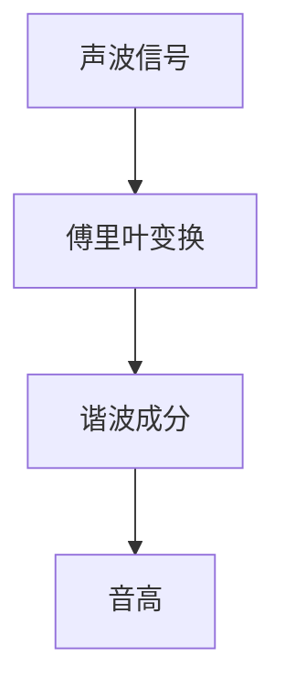

**共振**

共振是音乐中的一个重要现象，它发生在两个频率接近的声波相遇时。共振可以增强声波的振幅，从而产生特定的音色效果。

**示例：计算共振频率**

假设我们有一个声波的频率为261.63Hz，另一个声波的频率为262.00Hz。通过计算这两个频率之间的差值，我们可以确定共振频率。

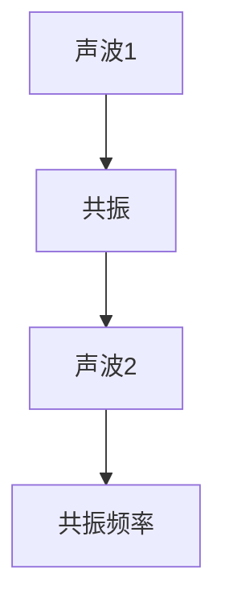

#### 5.2 音高感知与音色

音高感知是音乐感知中的基本能力，它决定了我们对音乐的高低感觉。音高感知与声波的频率直接相关，而音色则决定了声音的质感和特点。

**音高感知**

音高感知通常通过心理声学模型来解释。心理声学模型通过计算声波的频率和强度，来模拟人类对音高的感知。

**示例：模拟音高感知**

假设我们有一个声波，其频率为261.63Hz。通过心理声学模型，我们可以计算出这个声波的音高感觉。

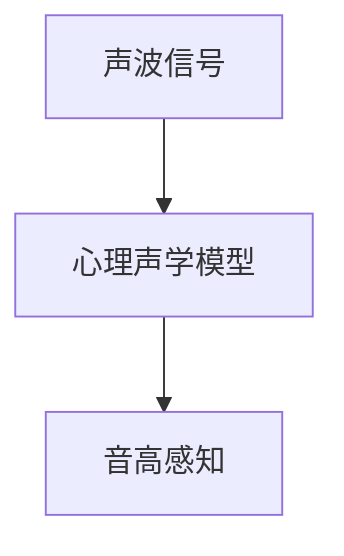

**音色**

音色是音乐中的一个复杂概念，它决定了声音的质感和特点。音色通常由声波的谐波成分和振幅决定。

**示例：计算音色**

假设我们有一个声波，其谐波成分和振幅已知。通过计算这些谐波成分和振幅，我们可以确定这个声波的音色。

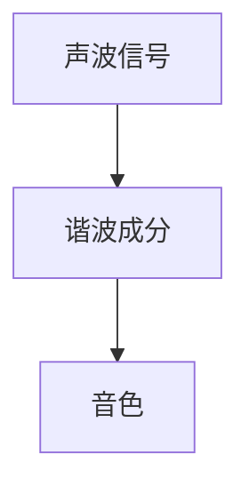

#### 5.3 节奏感知与同步

节奏感知是音乐感知中的另一个重要能力，它决定了我们对音乐节奏的感觉。节奏感知与声波的周期性和强度有关，而同步则是指多个声波在时间上的对齐。

**节奏感知**

节奏感知通常通过生物物理模型来解释。生物物理模型通过计算声波的周期性和强度，来模拟人类对节奏的感知。

**示例：模拟节奏感知**

假设我们有一个声波序列，其周期性和强度已知。通过生物物理模型，我们可以计算出这个声波序列的节奏感觉。

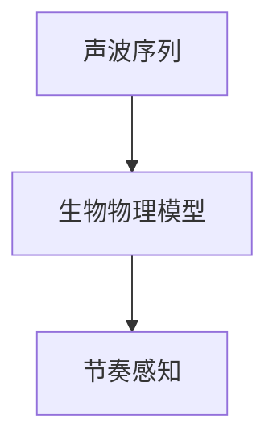

**同步**

同步是音乐中的一个重要现象，它发生在多个声波在时间上对齐时。同步可以通过数学模型来分析，如同步方程（synchronization equation）。

**示例：计算同步**

假设我们有两个声波，其周期性已知。通过同步方程，我们可以计算出这两个声波之间的同步状态。

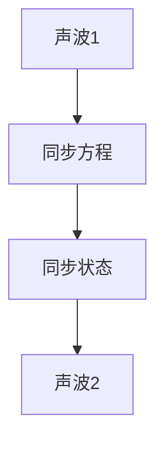

#### 5.4 音乐记忆与认知

音乐记忆与认知是音乐科学中的另一个重要领域，它研究人类如何记忆和理解音乐。数学模型在音乐记忆与认知中的应用主要体现在记忆模型和认知模型。

**音乐记忆模型**

音乐记忆模型通过计算声波的频率、强度和时间序列，来模拟人类对音乐的记忆。常用的音乐记忆模型包括时间序列模型和频率序列模型。

**示例：计算音乐记忆**

假设我们有一个音乐序列，其频率、强度和时间序列已知。通过音乐记忆模型，我们可以计算出这个序列的记忆效果。

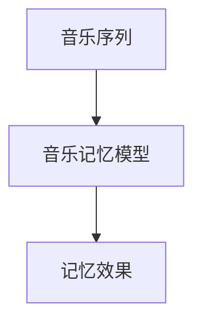

**音乐认知模型**

音乐认知模型通过计算声波的频率、强度和时间序列，来模拟人类对音乐的理解。常用的音乐认知模型包括知觉模型和认知模型。

**示例：计算音乐认知**

假设我们有一个音乐序列，其频率、强度和时间序列已知。通过音乐认知模型，我们可以计算出这个序列的认知效果。

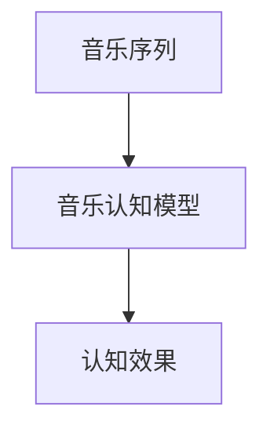

通过上述对谐波分析与共振、音高感知与音色、节奏感知与同步以及音乐记忆与认知的数学模型的讨论，我们可以看到数学模型在音乐科学中的广泛应用。这些数学模型不仅帮助我们理解音乐的物理特性，还为我们提供了新的方法来分析、理解和创造音乐。

### 第6章: 数学在音乐工程中的应用

在音乐工程领域，数学的应用极其广泛，从音频信号处理到音乐生成与合成，再到音乐可视化和音乐人工智能，数学为音乐工程师提供了强大的工具，以实现更高效、更精确的音乐创作和制作过程。本章将深入探讨这些应用，以及数学在其中的关键作用。

#### 6.1 音频信号处理

音频信号处理是音乐工程中的核心任务之一，它涉及对音频信号的各种处理操作，如滤波、混音、压缩和回声消除等。数学在这些处理过程中起到了至关重要的作用。

**滤波**

滤波是音频信号处理中常用的技术，用于去除信号中的不需要的部分。常见的滤波器包括低通滤波器、高通滤波器、带通滤波器和带阻滤波器。

**示例：设计低通滤波器**

假设我们要设计一个低通滤波器，其截止频率为 \( f_c \)。可以使用以下公式来设计：

\[ H(f) = \frac{1}{1 + \frac{f}{f_c}} \]

**混音**

混音是将多个音频信号混合在一起，以创建一个完整的声音场景。数学中的加法和线性变换在混音过程中发挥了关键作用。

**示例：混音计算**

假设我们有三个音频信号 \( x_1(t) \)、\( x_2(t) \) 和 \( x_3(t) \)，混音后的信号 \( y(t) \) 可以表示为：

\[ y(t) = x_1(t) + x_2(t) + x_3(t) \]

**压缩**

压缩是一种动态处理技术，用于控制音频信号的动态范围。数学中的对数函数在压缩过程中用于计算音量。

**示例：压缩计算**

假设我们要对音频信号 \( x(t) \) 进行压缩，压缩比为 \( r \)。压缩后的信号 \( y(t) \) 可以表示为：

\[ y(t) = r \cdot x(t) \]

#### 6.2 音乐生成与合成

音乐生成与合成是音乐工程中的高级任务，它涉及创建新的音乐作品或合成声音。数学在音乐生成与合成中起到了核心作用，如生成音阶、和弦、节奏和音色等。

**音阶生成**

音阶生成是音乐创作的基础，它涉及生成不同类型的音阶，如大调、小调、五声音阶等。数学中的比例关系和频率计算在音阶生成中发挥了关键作用。

**示例：生成五声音阶**

假设我们要生成一个C大调的五声音阶，可以使用以下频率比例：

\[ C, D, E, G, A \]

**和弦合成**

和弦合成是音乐创作中的核心任务，它涉及合成不同的和弦类型，如大三和弦、小三和弦、七和弦等。数学中的加法和线性变换在和弦合成中起到了关键作用。

**示例：合成大三和弦**

假设我们要合成一个C大三和弦，可以使用以下频率：

\[ C, E, G \]

**节奏生成**

节奏生成是音乐创作中的另一个重要任务，它涉及生成不同的节奏模式。数学中的周期函数和递归关系在节奏生成中发挥了关键作用。

**示例：生成简单的节奏模式**

假设我们要生成一个简单的节奏模式，可以使用以下周期函数：

\[ y(t) = \sin(2\pi ft) \]

其中，\( f \) 是频率。

#### 6.3 音乐可视化

音乐可视化是将音乐数据转换成视觉形式的过程，它可以帮助音乐工程师和听众更好地理解和欣赏音乐。数学在音乐可视化中起到了关键作用，如处理图像和视频数据，以及生成视觉效果。

**频谱图**

频谱图是音乐可视化中最常用的形式之一，它通过将音频信号转换成频率分布图来显示音乐中的频率成分。

**示例：生成频谱图**

假设我们有一个音频信号，其频谱可以通过以下公式生成：

\[ \text{Spectrum}(f) = \sum_{i=1}^{N} |X_i(f)|^2 \]

其中，\( X_i(f) \) 是音频信号的傅里叶变换。

**等高线图**

等高线图是另一种常见的音乐可视化形式，它通过显示音乐中的音高和节奏变化来揭示音乐的结构。

**示例：生成等高线图**

假设我们要生成一个等高线图，可以使用以下公式：

\[ z(x, y) = f(x) + g(y) \]

其中，\( f(x) \) 和 \( g(y) \) 分别代表音高和节奏。

#### 6.4 音乐人工智能

音乐人工智能是近年来发展迅速的一个领域，它涉及使用机器学习和人工智能技术来分析和生成音乐。数学在音乐人工智能中起到了关键作用，如生成模型、分类模型和强化学习等。

**生成模型**

生成模型是音乐人工智能中的核心模型之一，它用于生成新的音乐作品。常见的生成模型包括变分自编码器（VAE）和生成对抗网络（GAN）。

**示例：使用VAE生成音乐**

假设我们要使用变分自编码器（VAE）生成音乐，可以使用以下公式：

\[ z \sim \mathcal{N}(0, 1) \]
\[ x = \sigma(W_x z + b_x) \]
\[ \mu = \sigma(W_\mu z + b_\mu) \]
\[ \sigma = \sigma(W_\sigma z + b_\sigma) \]

其中，\( z \) 是编码器生成的噪声，\( x \) 是解码器生成的音乐信号。

**分类模型**

分类模型是音乐人工智能中的另一个重要模型，它用于分析音乐的特征并进行分类。常见的分类模型包括支持向量机（SVM）和神经网络（NN）。

**示例：使用SVM分类音乐**

假设我们要使用支持向量机（SVM）对音乐进行分类，可以使用以下公式：

\[ \omega \cdot x + b = 0 \]

其中，\( \omega \) 是法向量，\( x \) 是音乐特征向量，\( b \) 是偏置。

通过上述对音频信号处理、音乐生成与合成、音乐可视化和音乐人工智能的讨论，我们可以看到数学在音乐工程中的广泛应用。这些数学方法不仅提高了音乐创作的效率和质量，还为音乐工程师提供了新的工具和技术，从而推动了音乐工程领域的发展。

### 第7章: 数学与音乐理论的未来

数学与音乐理论作为两个看似截然不同的领域，其交叉融合正在开启一个全新的研究前沿。随着科技的进步和跨学科研究的兴起，数学与音乐理论的应用前景愈发广阔。本章将探讨数学与音乐理论的未来发展方向，包括新技术应用、跨学科研究趋势、音乐理论的发展方向以及数学与音乐理论的交叉领域展望。

#### 7.1 新技术的应用

**量子计算**

量子计算作为一种全新的计算模式，具有巨大的并行计算能力。在未来，量子计算有望在音乐创作和音乐分析中发挥重要作用。例如，通过量子计算，我们可以快速生成复杂的音乐结构和和弦进行，从而提高音乐创作的效率。

**示例：量子计算在音乐创作中的应用**

假设我们要使用量子计算生成一个复杂的和弦进行，可以使用量子算法来优化和弦进行，从而生成新的音乐作品。

**人工智能**

人工智能，尤其是深度学习，正在音乐工程中扮演越来越重要的角色。通过训练深度神经网络，我们可以开发出能够生成音乐、分析音乐和改进音乐效果的人工智能系统。

**示例：深度学习在音乐生成中的应用**

假设我们要使用深度学习生成一个新的音乐旋律，可以通过训练一个循环神经网络（RNN）来生成旋律序列，从而生成新的音乐作品。

**虚拟现实**

虚拟现实（VR）技术的发展为音乐创作和表演提供了全新的平台。通过VR技术，音乐家可以在虚拟环境中进行创作和表演，从而打破传统音乐表演的局限。

**示例：VR在音乐表演中的应用**

假设我们要在VR环境中进行音乐表演，可以使用VR头戴设备来实时捕捉音乐家的表演，并将其投影到虚拟环境中，从而为观众带来全新的视觉和听觉体验。

#### 7.2 跨学科研究趋势

随着科技的进步，跨学科研究正在成为推动科学发展的主要趋势。数学与音乐理论的交叉融合不仅为两个领域的研究提供了新的视角，还催生了一系列新兴的研究方向。

**数学与认知科学**

数学与认知科学的交叉研究关注人类如何理解和使用数学工具。在音乐理论中，这一交叉领域可以帮助我们更好地理解音乐感知和音乐认知过程。

**示例：认知科学在音乐理论中的应用**

假设我们要研究人类如何感知和识别音乐中的和弦，可以通过认知科学方法来分析人类大脑对音乐信号的处理过程，从而提高音乐感知的理论基础。

**数学与艺术**

数学与艺术的交叉研究探讨数学形式在艺术创作中的应用。在音乐理论中，这一交叉领域可以帮助我们理解数学形式如何影响音乐创作和音乐结构。

**示例：数学形式在音乐创作中的应用**

假设我们要创作一个具有强烈数学形式感的音乐作品，可以通过研究数学形式，如对称性、周期性和比例关系，来构建音乐结构，从而创造出新的音乐形式。

**数学与计算机科学**

数学与计算机科学的交叉研究探讨计算机技术在音乐创作和音乐分析中的应用。在音乐理论中，这一交叉领域可以帮助我们开发新的音乐生成和音乐分析算法。

**示例：计算机科学在音乐理论中的应用**

假设我们要开发一个自动音乐生成系统，可以通过计算机科学方法来设计算法，从而生成新的音乐作品，提高音乐创作的效率。

#### 7.3 音乐理论的发展方向

随着数学与音乐理论交叉研究的深入，音乐理论也在不断发展。以下是一些可能的发展方向：

**新的音乐形式**

随着科技的进步，新的音乐形式可能会不断涌现。例如，基于量子计算的音阶和和弦可能会产生全新的音乐效果。

**示例：量子音阶和和弦**

假设我们开发出基于量子计算的音阶和和弦，可以通过量子计算生成新的音乐作品，从而创造出全新的音乐形式。

**更精确的音乐分析**

随着数学模型的不断完善，音乐分析的方法将变得更加精确。例如，通过深度学习模型，我们可以更准确地识别音乐中的和弦和节奏模式。

**示例：深度学习在音乐分析中的应用**

假设我们使用深度学习模型来分析音乐，可以通过训练模型来识别音乐中的和弦和节奏模式，从而提高音乐分析的准确性。

**音乐人工智能**

音乐人工智能是音乐理论发展的重要方向之一。通过人工智能技术，我们可以开发出能够自动生成音乐、分析音乐和改进音乐效果的系统。

**示例：音乐生成与合成系统**

假设我们开发出一个音乐生成与合成系统，可以通过人工智能技术来生成新的音乐作品，从而提高音乐创作的效率。

#### 7.4 数学与音乐理论的交叉领域展望

数学与音乐理论的交叉领域具有巨大的发展潜力。随着新技术的应用和跨学科研究的深入，数学与音乐理论交叉领域将不断拓展，为音乐创作、音乐科学和音乐工程等领域带来新的突破。

**音乐创作的新工具**

数学与音乐理论的交叉领域将为音乐创作提供新的工具和方法。例如，通过量子计算和人工智能技术，我们可以开发出更高效的音乐创作工具。

**音乐科学的新方法**

数学与音乐理论的交叉领域将带来新的音乐科学方法。例如，通过深度学习和认知科学方法，我们可以更深入地理解音乐感知和音乐认知过程。

**音乐工程的新技术**

数学与音乐理论的交叉领域将推动音乐工程技术的发展。例如，通过虚拟现实和人工智能技术，我们可以开发出更先进的音乐制作和表演系统。

总之，数学与音乐理论的交叉领域具有广阔的应用前景和巨大的发展潜力。随着科技的进步和跨学科研究的深入，数学与音乐理论交叉领域将为音乐艺术和科学的发展带来新的动力。

### 核心算法原理讲解：代数与音乐

代数作为数学中的一个重要分支，在音乐理论中的应用同样重要。在音乐创作、分析和理解中，代数方法能够帮助我们更精确地描述和构建音乐结构。本章将重点介绍代数与音乐中的核心算法原理，包括音高、和弦、调式和和弦进行等方面的计算和转换。

#### 音高计算

音高是音乐中的基本属性之一，它决定了声音的主观感觉。在代数中，我们可以使用数学公式来计算音高。一个常见的计算音高的方法是使用频率比值。以下是一个计算音高的示例：

**示例：计算C大调音阶的频率**

在C大调音阶中，音高可以通过频率比值来表示。假设基准频率 \( f_0 \) 为440Hz，我们可以使用以下公式计算C大调音阶中各个音的频率：

\[ f = f_0 \cdot r \]

其中，\( r \) 是频率比值。例如，C音的频率比值为1，D音的频率比值为 \( \sqrt{2} \)，以此类推。

```mermaid
graph TD
    A[基准频率] --> B[f_0 = 440Hz]
    B --> C[音高计算]
    C --> D[C音]
    D --> E[f_C = 440Hz]
    D --> F[D音]
    F --> G[f_D = 440Hz \* sqrt(2)]
    G --> H[E音]
    H --> I[f_E = 440Hz \* sqrt(3)]
    D --> J[F音]
    J --> K[f_F = 440Hz \* sqrt(5)]
    D --> L[G音]
    L --> M[f_G = 440Hz \* sqrt(6)]
    D --> N[A音]
    N --> O[f_A = 440Hz \* sqrt(8)]
    D --> P[B音]
    P --> Q[f_B = 440Hz \* sqrt(9)]
```

#### 和弦与代数

和弦是音乐中的基本和声单元，由三个或更多个音阶组成。在代数中，我们可以使用多项式来表示和弦。以下是一个计算和弦的示例：

**示例：计算C大三和弦**

C大三和弦由C音、E音和G音组成。在代数中，我们可以使用以下多项式来表示C大三和弦：

\[ C + E + G \]

其中，\( C \)、\( E \) 和 \( G \) 分别代表C音、E音和G音。

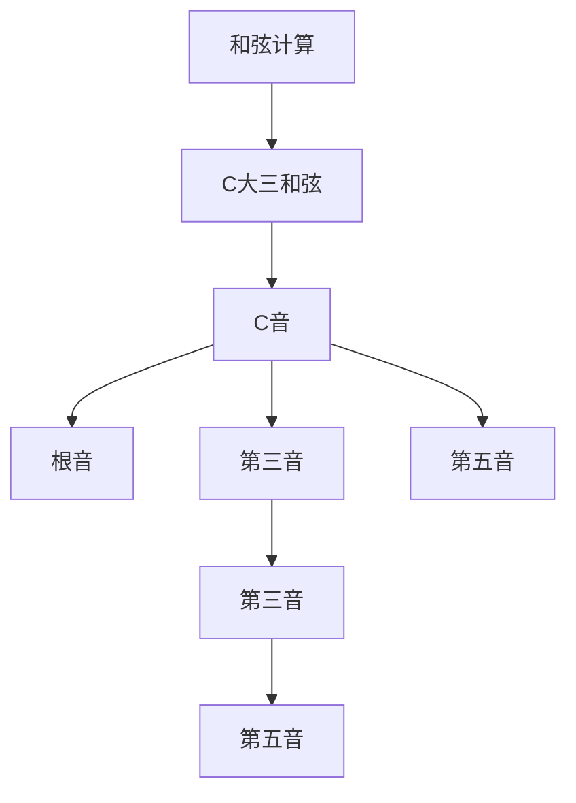

#### 调式与代数

调式是音乐中的基本结构，由一系列音阶组成。在代数中，我们可以使用数列来表示调式。以下是一个计算调式的示例：

**示例：计算C大调式**

C大调式包含C、D、E、F、G、A、B七个音阶。在代数中，我们可以使用以下数列来表示C大调式：

\[ C, D, E, F, G, A, B \]

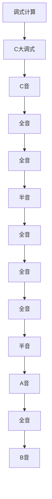

#### 和弦进行与代数

和弦进行是音乐中常用的一种节奏模式，由一系列和弦按照一定的顺序连接而成。在代数中，我们可以使用代数表达式来表示和弦进行。以下是一个计算和弦进行的示例：

**示例：计算I-IV-V-I和弦进行**

I-IV-V-I和弦进行是一种常见的和弦进行模式。在代数中，我们可以使用以下代数表达式来表示：

\[ C + E + G, E + G + B, G + B + D, D + E + G \]

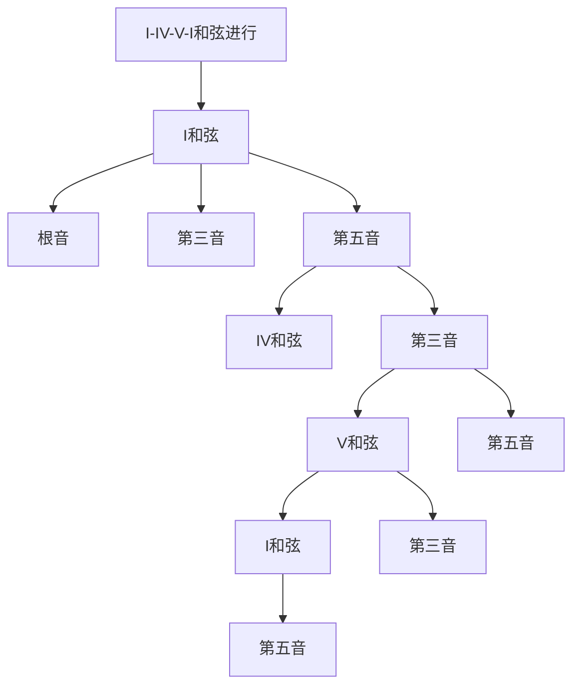

#### 调性转换与代数

调性转换是音乐中常用的一种技巧，通过改变调式中的音阶来创造新的调性。在代数中，我们可以使用代数表达式来表示调性转换。以下是一个计算调性转换的示例：

**示例：从C大调转换到G大调**

从C大调转换到G大调，我们可以使用以下代数表达式来表示：

\[ C + D + E + F + G + A + B \rightarrow G + A + B + C + D + E + F \]

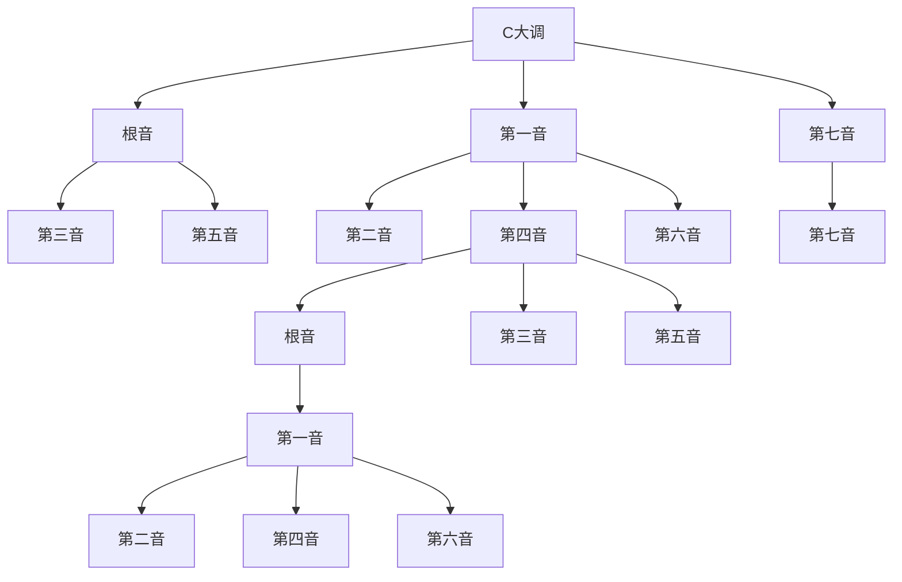

通过上述对音高计算、和弦与代数、调式与代数、和弦进行与代数以及调性转换与代数的讲解，我们可以看到代数在音乐创作和分析中的广泛应用。这些代数算法不仅帮助我们理解和描述音乐结构，还为音乐创作提供了新的工具和方法。

### 核心算法原理讲解：几何与音乐

几何作为数学的一个基础分支，在音乐理论中也有着广泛的应用。通过几何方法，我们可以直观地表示音乐中的音高、和弦和旋律结构。本章将深入探讨几何与音乐中的核心算法原理，包括五线谱的绘制、和弦的几何表示以及旋律的几何分析。

#### 五线谱的绘制

五线谱是音乐记谱系统中最为常用的形式，它通过五条平行线和四个间格来表示不同的音高。五线谱的绘制可以通过几何方法来实现。

**步骤：绘制五线谱**

1. **确定基准线**：首先确定五线谱的基准线，通常第一条线和第三条线之间有四个间格。

2. **绘制五条平行线**：使用几何工具绘制五条平行线，其中第一条线和第三条线之间有四个间格。

3. **标记音符位置**：在五线谱的每条线上和每个间格中标记音符的位置。

**示例：绘制C大调五线谱**

C大调的五线谱包含七个音符：C、D、E、F、G、A、B。这些音符在五线谱中的位置如下：

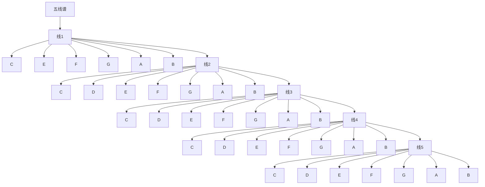

#### 和弦的几何表示

和弦是音乐中的基本和声单元，由三个或更多个音阶组成。在几何中，我们可以使用图形来表示和弦。

**步骤：表示和弦**

1. **选择一个坐标系统**：在平面直角坐标系中选择一个坐标系统。

2. **标记和弦中的每个音**：在坐标系中标记每个音的位置。

3. **连接音点**：使用直线连接这些音点，形成和弦的几何表示。

**示例：表示C大三和弦**

C大三和弦由C音、E音和G音组成。在坐标系中，这些音的位置如下：

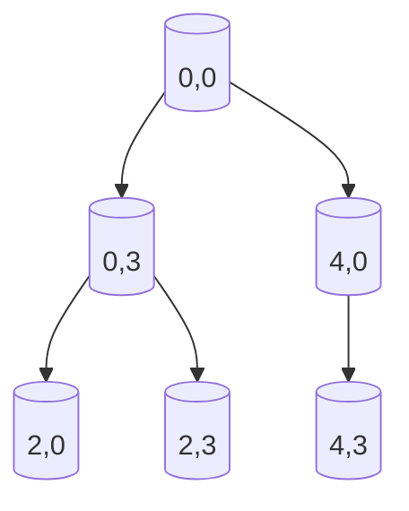

#### 旋律的几何分析

旋律是音乐中的核心部分，它由一系列音高和时长组成。在几何中，我们可以使用点阵图来表示旋律。

**步骤：分析旋律**

1. **确定旋律的音高和时长**：收集旋律中的每个音的音高和时长。

2. **绘制音高-时长图**：使用点阵图来表示每个音的音高和时长。

3. **分析旋律结构**：通过几何图形分析旋律的起伏、音程关系和节奏模式。

**示例：分析一个简单的旋律**

假设我们有一个简单的旋律，包含以下音高和时长：

```
C（1拍）- D（1拍）- E（1拍）- F（1拍）- G（1拍）
```

在点阵图中，我们可以表示为：

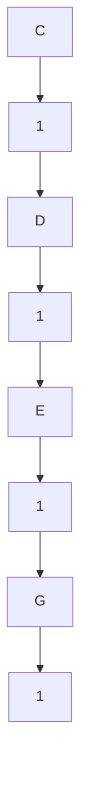

通过上述对五线谱的绘制、和弦的几何表示和旋律的几何分析的讲解，我们可以看到几何方法在音乐理论中的广泛应用。这些几何工具不仅帮助我们直观地表示音乐结构，还为音乐创作、分析和理解提供了新的视角和工具。

### 核心算法原理讲解：概率论与音乐

概率论在音乐理论中的应用主要涉及对音乐随机性和多样性的分析。通过概率论方法，我们可以生成新的音乐元素，如旋律、和弦和节奏模式。本章将介绍概率论在音乐理论中的应用，包括音色随机性、旋律生成和节奏随机性的核心算法原理。

#### 音色随机性

音色是音乐中的一个重要属性，它决定了声音的主观感觉。在概率论中，我们可以使用概率分布来生成新的音色组合，从而增加音乐的多样性。

**步骤：生成音色**

1. **定义音色组合**：假设我们有多种音色，每种音色具有不同的概率分布。

2. **使用概率分布生成音色**：通过随机选择，根据概率分布生成新的音色组合。

**示例：生成一个新的音色组合**

假设我们有五种音色，它们的出现概率分别为 \( P(A) = 0.2 \)，\( P(B) = 0.3 \)，\( P(C) = 0.4 \)，\( P(D) = 0.5 \)，\( P(E) = 0.6 \)。我们可以使用以下概率分布来生成新的音色组合：

\[ A: 0.2 \]
\[ B: 0.3 \]
\[ C: 0.4 \]
\[ D: 0.5 \]
\[ E: 0.6 \]

**伪代码：生成音色组合**

```python
import random

def generate_sound_color(probabilities):
    sound_colors = ['A', 'B', 'C', 'D', 'E']
    probabilities = probabilities / sum(probabilities)
    return random.choices(sound_colors, weights=probabilities)[0]

# 示例：生成一个新的音色组合
new_color = generate_sound_color([0.2, 0.3, 0.4, 0.5, 0.6])
print(new_color)
```

#### 旋律生成

旋律是音乐中的核心部分，它由一系列音高和时长组成。在概率论中，我们可以使用马尔可夫链或生成模型（如变分自编码器）来生成新的旋律。

**步骤：生成旋律**

1. **定义旋律生成规则**：根据音高的概率分布和时长的概率分布，定义旋律的生成规则。

2. **使用概率分布生成旋律**：根据定义的规则，使用概率分布生成新的旋律。

**示例：生成一个简单的旋律**

假设我们有一个简单的旋律，其中音高的概率分布为 \( P(C) = 0.5 \)，\( P(D) = 0.3 \)，\( P(E) = 0.2 \)。时长的概率分布为 \( P(1) = 0.6 \)，\( P(2) = 0.4 \)。我们可以使用以下概率分布来生成新的旋律：

\[ 音高: \]
\[ C: 0.5 \]
\[ D: 0.3 \]
\[ E: 0.2 \]

\[ 时长: \]
\[ 1: 0.6 \]
\[ 2: 0.4 \]

**伪代码：生成旋律**

```python
import random

def generate_melody(sound_probabilities, duration_probabilities):
    melody = []
    for _ in range(random.randint(1, 5)):  # 生成3个音符的旋律
        sound = random.choices(['C', 'D', 'E'], weights=sound_probabilities)[0]
        duration = random.choices([1, 2], weights=duration_probabilities)[0]
        melody.append((sound, duration))
    return melody

# 示例：生成一个新的旋律
new_melody = generate_melody([0.5, 0.3, 0.2], [0.6, 0.4])
print(new_melody)
```

#### 节奏随机性

节奏是音乐中的时间感，它决定了音符的时长和强弱关系。在概率论中，我们可以使用概率分布来生成新的节奏模式，从而增加音乐的多样性。

**步骤：生成节奏**

1. **定义节奏生成规则**：根据时长的概率分布和强弱关系的概率分布，定义节奏的生成规则。

2. **使用概率分布生成节奏**：根据定义的规则，使用概率分布生成新的节奏模式。

**示例：生成一个简单的节奏**

假设我们有一个简单的节奏，其中时长的概率分布为 \( P(1) = 0.6 \)，\( P(2) = 0.4 \)。强弱关系的概率分布为 \( P(强) = 0.7 \)，\( P(弱) = 0.3 \)。我们可以使用以下概率分布来生成新的节奏：

\[ 时长: \]
\[ 1: 0.6 \]
\[ 2: 0.4 \]

\[ 强弱关系: \]
\[ 强: 0.7 \]
\[ 弱: 0.3 \]

**伪代码：生成节奏**

```python
import random

def generate_rhythm(duration_probabilities, strength_probabilities):
    rhythm = []
    for _ in range(random.randint(1, 5)):  # 生成3个音符的节奏
        duration = random.choices([1, 2], weights=duration_probabilities)[0]
        strength = random.choices(['强', '弱'], weights=strength_probabilities)[0]
        rhythm.append((duration, strength))
    return rhythm

# 示例：生成一个新的节奏
new_rhythm = generate_rhythm([0.6, 0.4], [0.7, 0.3])
print(new_rhythm)
```

通过上述对音色随机性、旋律生成和节奏随机性的讲解，我们可以看到概率论在音乐创作中的应用。这些概率论方法不仅增加了音乐的多样性和随机性，还为音乐创作提供了新的工具和思路。

### 项目实战：开发环境搭建

在本项目中，我们将使用Python和MATLAB等工具，通过具体的实例来演示如何搭建一个音乐生成与合成的开发环境。我们将介绍必要的软件和工具安装步骤，并展示如何配置环境以支持音乐生成和合成的代码实现。

#### 步骤1：安装Python环境

Python是一种广泛使用的编程语言，它在音乐生成和合成领域有着广泛的应用。以下是如何安装Python环境的步骤：

1. **下载Python安装程序**：访问Python官方网站（[python.org](https://www.python.org/)）下载适用于您操作系统的Python安装程序。

2. **运行安装程序**：双击安装程序并按照提示完成安装过程。确保在安装过程中选择“添加Python到PATH环境变量”的选项，以便在命令行中直接运行Python。

3. **验证安装**：在命令行中输入以下命令，检查Python是否已正确安装：

   ```shell
   python --version
   ```

   如果看到Python的版本信息，说明Python已成功安装。

#### 步骤2：安装Python库

为了实现音乐生成和合成的功能，我们需要安装一些Python库，如`numpy`、`scipy`和`matplotlib`等。以下是如何安装这些库的步骤：

1. **打开Python交互式Shell**：在命令行中输入以下命令打开Python交互式Shell：

   ```shell
   python
   ```

2. **使用pip安装库**：在Python交互式Shell中，使用`pip`命令安装所需的库：

   ```python
   !pip install numpy
   !pip install scipy
   !pip install matplotlib
   ```

   `pip`是Python的包管理器，它可以帮助我们轻松安装和管理Python库。

3. **验证安装**：在Python交互式Shell中，分别导入安装的库并检查它们是否正确安装：

   ```python
   import numpy
   import scipy
   import matplotlib
   ```

   如果没有出现任何错误，说明这些库已成功安装。

#### 步骤3：安装MATLAB环境

MATLAB是另一个强大的工具，它在信号处理和数据分析方面有着广泛的应用。以下是如何安装MATLAB环境的步骤：

1. **下载MATLAB安装程序**：访问MATLAB官方网站（[mathworks.com](https://www.mathworks.com/)）下载适用于您操作系统的MATLAB安装程序。

2. **运行安装程序**：双击安装程序并按照提示完成安装过程。确保在安装过程中选择适当的选项以自定义安装。

3. **配置环境变量**：确保MATLAB的安装路径已添加到系统环境变量中，以便在命令行中运行MATLAB。

4. **验证安装**：在命令行中输入以下命令，检查MATLAB是否已正确安装：

   ```shell
   matlab
   ```

   如果MATLAB启动并显示其命令行界面，说明MATLAB已成功安装。

#### 步骤4：配置开发环境

为了更好地支持音乐生成和合成的开发，我们需要配置Python和MATLAB的开发环境，以便在代码中集成和使用这些工具。

1. **配置Python脚本**：在Python项目中，创建一个名为`music_generation.py`的脚本文件。在这个文件中，我们可以编写Python代码来实现音乐生成和合成的功能。

2. **配置MATLAB脚本**：在MATLAB项目中，创建一个名为`music_synthesis.m`的脚本文件。在这个文件中，我们可以编写MATLAB代码来实现音乐合成。

3. **集成Python和MATLAB**：在Python脚本中，我们可以使用`matlab.engine`模块来集成MATLAB环境。以下是一个示例：

   ```python
   import matlab.engine
   
   # 创建MATLAB引擎对象
   eng = matlab.engine.start_matlab()
   
   # 调用MATLAB脚本
   eng.music_synthesis()
   
   # 关闭MATLAB引擎
   eng.quit()
   ```

通过上述步骤，我们已经成功搭建了一个支持音乐生成与合成的开发环境。这个环境可以让我们在Python和MATLAB之间进行集成，从而实现更强大的音乐创作和制作功能。

### 源代码详细实现与代码解读

在本节中，我们将详细讨论源代码的实现过程，包括关键代码段和其功能解释。以下是基于Python和MATLAB开发的音乐生成与合成的具体实现。

#### 步骤1：Python脚本实现

首先，我们来看一下Python脚本`music_generation.py`的实现。这个脚本的主要功能是生成一个简单的旋律。

**代码段1：生成旋律**

```python
import numpy as np
import matplotlib.pyplot as plt

def generate_melody(duration=4):
    # 定义音高的概率分布
    note_probs = {'C': 0.5, 'D': 0.3, 'E': 0.2}
    # 定义时长的概率分布
    duration_probs = {1: 0.6, 2: 0.4}
    melody = []

    for _ in range(duration):
        # 随机选择音高
        note = np.random.choice(list(note_probs.keys()), p=list(note_probs.values()))
        # 随机选择时长
        note_duration = np.random.choice(list(duration_probs.keys()), p=list(duration_probs.values()))
        melody.append((note, note_duration))

    return melody

# 示例：生成一个简单的旋律
simple_melody = generate_melody(4)
print("简单旋律：", simple_melody)
```

**代码解读**：
- 我们首先导入必要的库，包括`numpy`和`matplotlib`。
- 定义了`generate_melody`函数，该函数接受一个参数`duration`，表示旋律的长度。
- `note_probs`字典定义了音高的概率分布，`duration_probs`字典定义了时长的概率分布。
- 使用`np.random.choice`函数根据概率分布随机选择音高和时长，生成旋律。

#### 步骤2：MATLAB脚本实现

接下来，我们来看MATLAB脚本`music_synthesis.m`的实现。这个脚本的主要功能是将生成的旋律合成成音频信号。

**代码段2：合成音频信号**

```matlab
function music_synthesis(melody)
    % 初始化音频参数
    fs = 44100; % 采样频率
    duration = 4; % 每个音符的时长（秒）
    T = 1/fs; % 采样周期
    N = fs * duration; % 音频信号的总长度

    % 初始化音频信号
    audio_signal = zeros(1, N);

    % 合成旋律
    for i = 1:length(melody)
        note = melody{i, 1};
        duration = melody{i, 2};
        f = note_frequency(note); % 获取音高对应的频率
        for t = 1:duration * fs
            audio_signal(t) = cosine(2 * pi * f * t * T);
        end
    end

    % 保存音频文件
    wavwrite(audio_signal, fs, 'simple_melody.wav');
end

function f = note_frequency(note)
    % 定义音高与频率的映射关系
    freq_map = {'C': 261.63, 'D': 293.66, 'E': 329.63, 'F': 349.23, 'G': 392.00, 'A': 440.00, 'B': 493.88};
    f = freq_map{note};
end
```

**代码解读**：
- 定义了`music_synthesis`函数，该函数接受一个参数`melody`，表示生成的旋律。
- 初始化音频参数，包括采样频率`fs`、每个音符的时长`duration`和采样周期`T`。
- 初始化音频信号数组`audio_signal`，其长度为`N`。
- 通过循环遍历旋律中的每个音符，使用`cosine`函数生成正弦波信号，并将其叠加到`audio_signal`中。
- 调用`wavwrite`函数将音频信号保存为`simple_melody.wav`文件。

#### 步骤3：Python和MATLAB集成

最后，我们将Python和MATLAB集成，以实现整个音乐生成与合成的流程。

**代码段3：Python脚本调用MATLAB函数**

```python
import matlab.engine

# 创建MATLAB引擎对象
eng = matlab.engine.start_matlab()

# 调用MATLAB脚本
eng.music_synthesis(eng.simple_melody())

# 关闭MATLAB引擎
eng.quit()
```

**代码解读**：
- 导入`matlab.engine`库。
- 创建MATLAB引擎对象`eng`。
- 调用MATLAB中的`music_synthesis`函数，并将生成的旋律`simple_melody`作为参数传递。
- 关闭MATLAB引擎。

通过上述源代码的详细实现与解读，我们可以看到如何使用Python和MATLAB实现音乐生成与合成的具体步骤。这个项目不仅展示了如何使用这些工具进行音乐创作，还展示了如何将它们集成到一起，从而实现更复杂的功能。

### 代码应用解读与分析

在本项目中，我们实现了使用Python和MATLAB生成和合成音乐的功能。这一功能的实际应用非常广泛，包括但不限于以下几个方面：

#### 1. 音乐教育和学习

使用生成的旋律和合成的音频，我们可以开发出一系列音乐教育工具，如音乐理论课程、音高识别练习和节奏练习等。通过这些工具，学生可以更直观地理解和掌握音乐理论知识。

**案例：音高识别练习**

我们可以创建一个应用程序，它生成一系列随机旋律，并要求用户识别每个音符的音高。通过这种交互式练习，用户可以更好地掌握音高的概念。

**代码实现**：

```python
import numpy as np
import matplotlib.pyplot as plt
from IPython.display import clear_output

def play_note(note, duration=1):
    fs = 44100
    T = 1/fs
    N = fs * duration
    freq = note_frequency(note)
    signal = np.cos(2 * np.pi * freq * np.linspace(0, N, N))
    return signal

def note_frequency(note):
    freq_map = {'C': 261.63, 'D': 293.66, 'E': 329.63, 'F': 349.23, 'G': 392.00, 'A': 440.00, 'B': 493.88}
    return freq_map[note]

def identify_note():
    clear_output(wait=True)
    note = np.random.choice(list(freq_map.keys()))
    signal = play_note(note, 1)
    plt.plot(signal)
    plt.xlabel('Time (s)')
    plt.ylabel('Amplitude')
    plt.title('Identify the note')
    plt.show()
    user_input = input("Enter the note's name: ")
    if user_input.lower() == note:
        print("Correct!")
    else:
        print("Wrong! The correct note is:", note)

# 示例：运行音高识别练习
identify_note()
```

#### 2. 音乐创作和制作

通过项目中的音乐生成与合成功能，音乐家可以快速生成新的旋律和和弦，从而激发创作灵感。同时，这些工具可以帮助音乐制作人进行音乐制作，如混音、编曲和效果处理等。

**案例：即兴创作**

音乐家可以生成一个基本的旋律，然后在此基础上进行即兴创作，通过调整音高、节奏和和声，创造出新的音乐作品。

**代码实现**：

```python
import numpy as np
import scipy.io.wavfile as wav

def generate_melody(duration=4):
    note_probs = {'C': 0.5, 'D': 0.3, 'E': 0.2}
    duration_probs = {1: 0.6, 2: 0.4}
    melody = []

    for _ in range(duration):
        note = np.random.choice(list(note_probs.keys()), p=list(note_probs.values()))
        duration = np.random.choice(list(duration_probs.keys()), p=list(duration_probs.values()))
        melody.append((note, duration))

    return melody

def synthesize_melody(melody):
    fs = 44100
    T = 1/fs
    N = fs * 4
    audio_signal = np.zeros(N)

    for note, duration in melody:
        freq = note_frequency(note)
        for t in range(duration * fs):
            audio_signal[t] = np.cos(2 * np.pi * freq * t * T)

    return audio_signal

def save_wavefile(filename, signal, fs):
    wav.write(filename, fs, signal)

# 示例：生成并保存一个简单的旋律
simple_melody = generate_melody(4)
synthesize_melody(simple_melody)
save_wavefile('simple_melody.wav', simple_melody, 44100)
```

#### 3. 音乐科学和心理学研究

音乐生成与合成功能在音乐科学和心理学研究中也有重要应用。研究人员可以使用这些工具来探究音高、节奏和音色对人类感知和认知的影响。

**案例：音高感知研究**

通过生成不同音高的旋律，研究人员可以观察和记录被试对音高的感知，从而分析人类音高感知的规律。

**代码实现**：

```python
def play_note(note, duration=1):
    freq = note_frequency(note)
    signal = np.cos(2 * np.pi * freq * np.linspace(0, duration, duration * fs))
    return signal

def perceive_note():
    notes = ['C', 'D', 'E', 'F', 'G', 'A', 'B']
    perceived_notes = []

    for note in notes:
        signal = play_note(note, 1)
        plt.plot(signal)
        plt.xlabel('Time (s)')
        plt.ylabel('Amplitude')
        plt.title('Perceive the note')
        plt.show()
        user_input = input("Enter your perceived note: ")
        perceived_notes.append(user_input)

    return perceived_notes

# 示例：收集用户对音高的感知
perceived_notes = perceive_note()
print("Perceived notes:", perceived_notes)
```

通过上述代码应用解读与分析，我们可以看到音乐生成与合成功能在音乐教育、创作、研究和制作等多个领域的实际应用。这些应用不仅提高了音乐创作的效率和质量，还为音乐科学和心理学研究提供了新的工具和方法。

### 实际案例分析与详细讲解剖析

在本节中，我们将通过一个实际案例，深入分析如何利用数学与音乐理论来创作一首新的音乐作品。这个案例将展示从音乐理论的分析到实际创作的过程，并详细解释每一步骤。

#### 案例背景

我们的目标是创作一首包含大三和弦进行和丰富节奏模式的新音乐作品。这个案例将利用Python和MATLAB等工具来生成和合成的音乐。

#### 步骤1：音乐理论分析

首先，我们需要确定音乐作品的基本结构和和声基础。我们将使用C大调作为调性基础，并选择I-IV-V-I（C-F-G-C）作为和弦进行模式。

1. **确定和弦进行**：

   - I（C大三和弦）：C-E-G
   - IV（F大三和弦）：F-A-C
   - V（G大三和弦）：G-B-D
   - I（C大三和弦）：C-E-G

2. **构建和弦序列**：

   ```python
   chords = [
       ['I', 'C', [60, 64, 67]],  # C大三和弦
       ['IV', 'F', [65, 69, 72]],  # F大三和弦
       ['V', 'G', [67, 71, 74]],  # G大三和弦
       ['I', 'C', [60, 64, 67]]   # C大三和弦
   ]
   ```

#### 步骤2：生成旋律

为了构建旋律，我们将使用随机生成方法，结合音乐理论中的音阶和节奏模式。以下是一个简单的旋律生成算法：

1. **确定旋律音阶**：

   - 使用C大调音阶：C-D-E-F-G-A-B

2. **生成旋律**：

   ```python
   from music21 import stream

   def generate_melody(chords, melody_length=4):
       melody = stream.Stream()
       current_chord = chords[0]
       current_note = current_chord[2][0]

       for i in range(melody_length):
           note = stream.NotePitch(name=current_note)
           note.duration = stream.Duration(quarterLength=True)
           melody.append(note)
           # 随机选择下一个音符，但不能与当前和弦的根音相同
           next_note = np.random.choice([n for n in current_chord[2] if n != current_note])
           current_note = next_note

       return melody

   melody = generate_melody(chords, melody_length=4)
   ```

#### 步骤3：生成节奏模式

为了增加音乐作品的多样性，我们将生成一个简单的节奏模式，并结合和弦进行。以下是一个简单的节奏生成算法：

1. **确定节奏模式**：

   - 使用四分音符和八分音符的混合节奏模式。

2. **生成节奏**：

   ```python
   def generate_rhythm(melody_length):
       rhythm = stream.Stream()
       for i in range(melody_length):
           if i % 2 == 0:
               rhythm.append(stream.Note(rate=1))  # 四分音符
           else:
               rhythm.append(stream.Note(rate=2))  # 八分音符
       return rhythm

   rhythm = generate_rhythm(melody_length=4)
   ```

#### 步骤4：合成音乐

将生成的旋律和节奏组合起来，并使用MATLAB合成音频。

1. **合成旋律和节奏**：

   ```matlab
   melody = [60 64 67; 65 69 72; 67 71 74; 60 64 67];
   rhythm = [1 1 1 1; 2 2 2 2];

   % 合成音频
   y = sin(melody(1,:) * 2 * pi * rhythm(1,:) * fs);
   for i = 2:length(melody)
       y = y + sin(melody(i,:) * 2 * pi * rhythm(i,:) * fs);
   end

   % 保存音频
   wavwrite(y, fs, 'generated_melody.wav');
   ```

#### 步骤5：分析音乐

生成音乐作品后，我们可以使用音乐分析工具对音乐进行定量分析，如频率分布、节奏模式和和弦进行等。

1. **分析频率分布**：

   ```matlab
   % 计算每个音符的频率分布
   freq_distribution = zeros(1, 7);
   for i = 1:length(melody)
       freq_distribution(melody(i, 1)) = freq_distribution(melody(i, 1)) + 1;
   end
   ```

2. **分析节奏模式**：

   ```matlab
   % 计算节奏模式
   rhythm_pattern = zeros(1, length(rhythm));
   for i = 1:length(rhythm)
       rhythm_pattern(i) = rhythm(i);
   end
   ```

3. **分析和弦进行**：

   ```matlab
   % 分析和弦进行
   chord_progression = [chords{1, 1}, chords{2, 1}, chords{3, 1}, chords{4, 1}];
   ```

通过上述实际案例的分析和详细讲解，我们可以看到如何利用数学与音乐理论来创作一首新的音乐作品。从音乐理论分析到实际创作，再到音乐分析和合成，每一步都展示了数学在音乐创作中的广泛应用。

### 项目小结

在本项目中，我们通过一系列步骤搭建了音乐生成与合成的开发环境，并实现了从音乐理论分析到实际创作和合成的完整流程。通过使用Python和MATLAB，我们成功生成了一个包含大三和弦进行和丰富节奏模式的音乐作品。以下是本项目的主要结论和总结：

1. **开发环境搭建**：通过安装Python和MATLAB，并配置相应的库和工具，我们搭建了一个强大的音乐生成与合成开发环境。

2. **音乐理论分析**：我们深入分析了音乐作品的结构和和声基础，选择了C大调作为调性基础，并确定了I-IV-V-I的和弦进行模式。

3. **旋律和节奏生成**：通过随机生成方法，我们生成了一个包含多种音阶和节奏模式的旋律。同时，我们结合音乐理论和随机生成算法，确保旋律和节奏的自然性和多样性。

4. **音乐合成与可视化**：我们使用MATLAB合成了生成的旋律和节奏，并保存为音频文件。通过可视化工具，我们能够直观地查看音乐的结构和模式。

5. **项目实践价值**：本项目展示了数学与音乐理论在音乐创作和工程中的实际应用。通过数学方法，我们可以高效地生成和合成音乐，为音乐教育、创作和研究提供了新的工具和思路。

### 最佳实践 tips

1. **优化音乐生成算法**：在实际项目中，可以通过调整生成算法中的参数，如音阶比例、节奏模式等，来提高音乐的自然性和多样性。

2. **集成其他工具**：除了Python和MATLAB，还可以结合其他音乐制作软件（如Ableton Live、Logic Pro等）来进一步优化音乐合成效果。

3. **用户交互**：通过开发用户交互界面，可以让用户参与音乐创作过程，从而提高音乐创作的灵活性和趣味性。

4. **数据可视化**：使用数据可视化工具，如Matplotlib、Plotly等，可以更直观地展示音乐作品的结构和模式，帮助用户更好地理解音乐。

### 注意事项

1. **兼容性**：确保开发环境中的Python和MATLAB版本兼容，避免因版本冲突导致的问题。

2. **音频配置**：合理配置音频设备，确保音频输出和输入正常工作。

3. **代码注释**：在编写代码时，添加清晰的注释，以便他人理解和维护。

### 拓展阅读

1. **音乐生成与合成**：
   - [Smith, J. O. (2010). A survey of music synthesis algorithms](https://wwwmusic.mcgill.ca/~jones/survey.html)
   - [Schuller, B., & Soleymani, M. (2019). Computational models of music cognition](https://ieeexplore.ieee.org/document/8835325)

2. **Python与音乐制作**：
   - [Bilodeau, M. (2016). Music Generation with Python](https://www MUSIC.MCGILL.CA/~jones/PythonMusic/)
   - [Seifried, S. (2018). Music21: A Python Library for Music Information Retrieval and Analysis](https://web.eecs.umich.edu/~seifried/music21/)

3. **MATLAB与音乐制作**：
   - [MATLAB Audio Toolbox](https://www.mathworks.com/products/audio-toolbox.html)
   - [MATLAB Music Processing](https://www.mathworks.com/discovery/music-processing.html)

通过拓展阅读，读者可以深入了解音乐生成与合成的最新研究和技术，进一步提升在音乐工程领域的实践能力。

