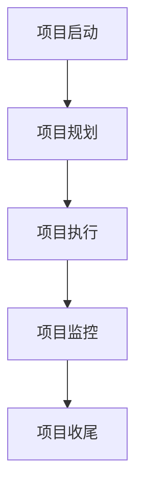
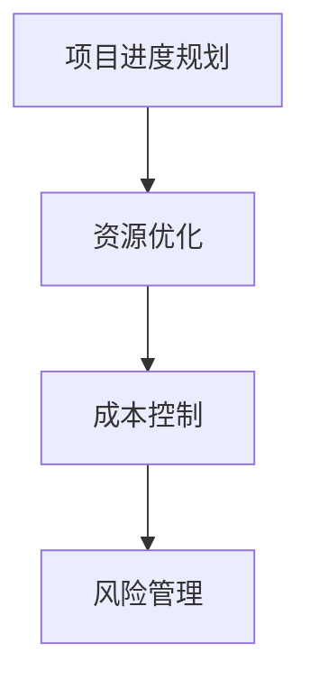
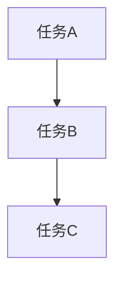
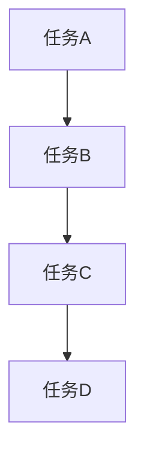

                 

### 文章标题：数学与项目管理：项目进度的数学规划

> 关键词：数学规划，项目管理，项目进度，线性规划，非线性规划，关键路径法，动态规划

> 摘要：本文将探讨数学规划在项目管理中的应用，重点关注项目进度的数学规划方法。通过对数学规划的基本原理、项目进度规划的基本数学模型以及项目进度控制中的数学模型进行详细分析，并结合实际案例，帮助读者理解并应用数学规划方法优化项目进度，提高项目管理的效率和成功率。

### 目录

1. **数学与项目管理的理论基础**
   1.1 项目管理的基本概念
   1.2 数学规划的基本原理
   1.3 数学规划在项目管理中的重要性

2. **项目进度规划数学模型**
   2.1 项目进度网络图
   2.2 关键路径法（CPM）
   2.3 项目进度网络图的可视化
   2.4 项目进度规划中的线性规划

3. **项目进度控制的数学模型**
   3.1 监控与控制流程
   3.2 进度偏差分析
   3.3 动态规划方法
   3.4 项目进度控制中的非线性规划

4. **项目进度规划的实际案例**
   4.1 案例背景
   4.2 项目进度规划的设计
   4.3 项目进度规划的实施
   4.4 案例总结

5. **项目进度规划的展望**
   5.1 未来趋势
   5.2 研究方向

6. **附录**
   6.1 常用数学规划工具

### 第一部分：数学与项目管理的理论基础

#### 第1章：数学在项目管理中的应用概述

##### 1.1 项目管理的基本概念

项目管理是指通过计划、组织、协调、控制和评价等活动，确保项目按期、按预算、高质量完成的一系列管理工作。项目管理的基本概念包括项目的定义、项目管理的流程和项目管理的挑战。

**1.1.1 项目的定义**

项目是指为实现特定目标而进行的临时性工作。项目具有以下特点：

- **目标明确**：项目开始前，目标必须明确，包括项目的范围、目标和约束条件。
- **临时性**：项目有明确的开始和结束时间，是一次性的。
- **独特性**：项目具有独特性，每个项目都有其特定的任务和解决方案。
- **约束条件**：项目在时间和资源上都有一定的约束条件，需要在这些约束条件下完成任务。

**1.1.2 项目管理的流程**

项目管理的流程通常包括以下阶段：

- **项目启动**：确定项目目标、范围和初步计划。
- **项目规划**：详细规划项目任务、时间表、资源和预算。
- **项目执行**：按照计划执行项目任务，监控项目进展。
- **项目监控**：跟踪项目进展，评估项目风险，确保项目按计划进行。
- **项目收尾**：完成项目，进行项目评估和总结。

**1.1.3 项目管理的挑战**

项目管理的挑战主要包括以下几个方面：

- **时间管理**：项目必须在规定的时间内完成，时间管理是项目管理的关键。
- **资源管理**：项目需要合理分配和利用资源，包括人力、资金和物资。
- **风险管理**：项目过程中可能会遇到各种风险，需要提前识别和应对。
- **沟通协调**：项目团队成员之间需要有效沟通和协调，确保项目顺利进行。

##### 1.2 数学规划的基本原理

**1.2.1 数学规划的定义**

数学规划（Mathematical Programming），也称为运筹学，是指通过建立数学模型，运用数学方法求解优化问题的过程。数学规划的主要目标是找到最优解，以实现某个目标函数的最大化或最小化。

**1.2.2 数学规划的主要类型**

数学规划主要分为以下几类：

- **线性规划**：目标函数和约束条件都是线性的。
- **非线性规划**：目标函数和/或约束条件是非线性的。
- **整数规划**：变量必须是整数。
- **动态规划**：适用于多阶段决策问题。
- **多目标规划**：同时考虑多个目标。

**1.2.3 数学规划的应用场景**

数学规划在项目管理中有广泛的应用，包括：

- **资源分配**：如何合理分配资源以实现项目目标。
- **时间安排**：如何安排项目任务，确保按时完成。
- **成本控制**：如何控制项目成本，确保在预算范围内完成。
- **风险管理**：如何评估和管理项目风险。

##### 1.3 数学规划在项目管理中的重要性

**1.3.1 提高项目效率**

数学规划可以帮助项目管理者优化项目资源分配和时间安排，提高项目执行效率。

**1.3.2 优化资源分配**

数学规划可以基于数学模型，找到资源分配的最优解，确保资源得到最大程度的利用。

**1.3.3 降低项目风险**

通过数学规划，可以提前识别和评估项目风险，制定相应的应对策略，降低项目风险。

#### Mermaid 流程图：项目管理的基本流程



##### 1.4 数学规划在项目管理中的应用

数学规划在项目管理中的应用主要体现在以下几个方面：

- **项目进度规划**：通过关键路径法（CPM）、项目进度网络图等方法，对项目进度进行数学规划，确保项目按时完成。
- **资源优化**：通过线性规划、非线性规划等方法，优化项目资源分配，提高资源利用效率。
- **成本控制**：通过成本-效益分析等方法，控制项目成本，确保项目在预算范围内完成。
- **风险管理**：通过风险评估和应对策略制定，降低项目风险。

**1.4.1 项目进度规划**

项目进度规划是项目管理的重要环节，通过数学规划方法，可以更好地安排项目任务，确保项目按时完成。常用的数学规划方法包括关键路径法（CPM）、项目进度网络图等。

**1.4.2 资源优化**

项目资源优化是项目管理的关键问题之一。通过数学规划方法，如线性规划、非线性规划等，可以找到资源分配的最优解，提高资源利用效率。

**1.4.3 成本控制**

项目成本控制是项目管理的重要任务之一。通过数学规划方法，如成本-效益分析等，可以制定合理的成本控制策略，确保项目在预算范围内完成。

**1.4.4 风险管理**

项目风险管理是项目管理的重要环节。通过数学规划方法，如风险评估和应对策略制定，可以提前识别和应对项目风险，降低项目风险。

#### Mermaid 流程图：数学规划在项目管理中的应用



#### 结论

数学规划在项目管理中具有重要作用。通过数学规划方法，可以优化项目进度、资源分配、成本控制和风险管理，提高项目管理的效率和成功率。在接下来的章节中，我们将进一步探讨数学规划在项目管理中的应用，包括项目进度规划、资源优化、成本控制和风险管理等方面的数学模型和方法。

---

### 第二部分：项目进度规划数学模型

#### 第2章：项目进度规划的基本数学模型

项目进度规划是项目管理中至关重要的一环。通过数学规划模型，可以系统地安排项目任务，合理分配资源，确保项目按计划完成。本章将介绍项目进度规划的基本数学模型，包括项目进度网络图、关键路径法（CPM）和项目进度网络图的可视化方法。

#### 第2.1节：项目进度网络图

**1. 网络图的基本概念**

项目进度网络图（Project Network Diagram），也称为活动网络图（Activity on Node Diagram，AON），是项目管理中常用的一种图形化工具，用于表示项目任务之间的逻辑关系和先后顺序。在项目进度网络图中，每个任务用一个节点表示，节点之间的连线表示任务之间的依赖关系。

**2. 网络图的绘制方法**

绘制项目进度网络图的基本步骤如下：

- **定义任务**：列出项目中的所有任务，并为其分配一个唯一标识。
- **确定任务间关系**：确定任务之间的先后顺序和依赖关系，并用箭头表示。
- **绘制网络图**：根据任务和依赖关系，绘制项目进度网络图。
- **优化网络图**：对网络图进行优化，确保任务安排合理，路径清晰。

**3. 网络图的优化**

网络图的优化主要包括以下两个方面：

- **路径优化**：通过调整任务顺序，优化项目路径，减少项目总时间。
- **资源优化**：通过合理分配资源，确保项目在资源约束条件下顺利完成。

**4. 网络图的示例**

以下是一个简单的项目进度网络图示例，包括三个任务（A、B、C）和它们之间的依赖关系。



在这个示例中，任务A完成后才能开始任务B，任务B完成后才能开始任务C。

#### 第2.2节：关键路径法（CPM）

**1. CPM的基本原理**

关键路径法（Critical Path Method，CPM）是一种用于项目进度规划的方法，旨在确定项目完成所需的最短时间。在CPM中，关键路径是指项目任务中耗时最长的一条路径，即整个项目完成所需的时间最长的那条路径。

**2. CPM的计算步骤**

计算关键路径的基本步骤如下：

- **定义任务和时间**：列出所有任务，并估算每个任务所需的时间。
- **绘制网络图**：根据任务和时间，绘制项目进度网络图。
- **计算每个任务的最早开始时间（ES）和最早完成时间（EF）**：从项目开始节点开始，逆推计算每个任务的最早开始时间和最早完成时间。
- **计算每个任务的最迟开始时间（LS）和最迟完成时间（LF）**：从项目结束节点开始，顺推计算每个任务的最迟开始时间和最迟完成时间。
- **计算每个任务的时差（TF）**：时差是指任务的最迟开始时间减去最早开始时间，或最迟完成时间减去最早完成时间。
- **确定关键路径**：关键路径是所有任务时差为零的那条路径。

**3. CPM的应用案例分析**

以下是一个简单的CPM应用案例，包括四个任务（A、B、C、D）和它们之间的依赖关系。

```mermaid
graph TB
    A[任务A](2)
    B[任务B](4)
    C[任务C](3)
    D[任务D](2)
    A --> B
    B --> C
    C --> D
```

在这个案例中，任务A耗时2天，任务B耗时4天，任务C耗时3天，任务D耗时2天。

**计算过程**：

- **最早开始时间和最早完成时间**：

  - ES(A) = 0（项目开始节点）
  - EF(A) = ES(A) + D(A) = 0 + 2 = 2
  - ES(B) = EF(A) = 2
  - EF(B) = ES(B) + D(B) = 2 + 4 = 6
  - ES(C) = EF(B) = 6
  - EF(C) = ES(C) + D(C) = 6 + 3 = 9
  - ES(D) = EF(C) = 9
  - EF(D) = ES(D) + D(D) = 9 + 2 = 11

- **最迟开始时间和最迟完成时间**：

  - LS(D) = LF(D) = EF(D) = 11
  - LS(C) = LF(C) = LS(D) - D(C) = 11 - 3 = 8
  - LS(B) = LF(B) = LS(C) - D(B) = 8 - 4 = 4
  - LS(A) = LF(A) = LS(B) - D(A) = 4 - 2 = 2

- **时差**：

  - TF(A) = LS(A) - ES(A) = 2 - 0 = 2
  - TF(B) = LS(B) - ES(B) = 4 - 2 = 2
  - TF(C) = LS(C) - ES(C) = 8 - 6 = 2
  - TF(D) = LS(D) - ES(D) = 11 - 9 = 2

- **关键路径**：由于所有任务的时差均为零，关键路径为A → B → C → D。

**4. CPM的应用**

CPM在项目管理中有广泛的应用，包括：

- **确定项目完成时间**：通过计算关键路径，可以确定项目完成所需的时间。
- **资源分配**：通过分析任务间的关系，可以优化资源分配，确保关键路径上的任务优先执行。
- **风险管理**：通过识别关键路径，可以提前识别和应对项目风险。

#### 第2.3节：项目进度网络图的可视化

**1. 可视化的意义**

项目进度网络图的可视化有助于项目团队成员更好地理解项目进度和任务依赖关系，提高沟通和协作效率。通过可视化工具，可以直观地查看项目进度、任务关系和关键路径。

**2. 常用的可视化工具**

常用的项目进度网络图可视化工具有：

- **Microsoft Project**：一款功能强大的项目管理软件，支持绘制项目进度网络图。
- **甘特图**：一种简单的项目进度图表，通过条形图表示任务进度和时间。
- **MindMap**：一种思维导图工具，可以用于绘制项目进度网络图。
- **Mermaid**：一种基于Markdown的图表绘制工具，支持绘制项目进度网络图。

**3. 可视化案例分析**

以下是一个使用Mermaid绘制的项目进度网络图案例。



在这个案例中，任务A完成后才能开始任务B，任务B完成后才能开始任务C，任务C完成后才能开始任务D。

#### 结论

项目进度规划是项目管理中至关重要的一环，通过数学规划模型，可以系统地安排项目任务，合理分配资源，确保项目按计划完成。本章介绍了项目进度网络图、关键路径法（CPM）和项目进度网络图的可视化方法，为项目管理者提供了有效的工具和方法。在下一章中，我们将进一步探讨项目进度规划中的线性规划方法。

---

### 第三部分：项目进度规划中的线性规划

#### 第3章：项目进度规划中的线性规划

项目进度规划中的线性规划（Linear Programming，LP）是一种数学优化方法，用于解决资源分配、时间安排和成本控制等问题。线性规划通过建立线性目标函数和线性约束条件，寻求最优解，以实现项目进度规划的目标。本章将详细探讨线性规划的基本概念、标准形式及其在项目进度规划中的应用。

#### 第3.1节：线性规划的基本概念

**1. 线性规划的定义**

线性规划是一种数学优化问题，其目标函数是线性的，约束条件也是线性的。线性规划的目标是找到一组变量的值，使得目标函数最大化或最小化，同时满足所有约束条件。

线性规划的一般形式为：

$$
\begin{align*}
\text{maximize/minimize} \quad & c^T x \\
\text{subject to} \quad & Ax \leq b \\
& x \geq 0
\end{align*}
$$

其中，$c$ 是目标函数系数向量，$x$ 是变量向量，$A$ 是约束条件系数矩阵，$b$ 是约束条件常数向量。

**2. 线性规划的目标函数**

线性规划的目标函数可以表示为线性方程或线性不等式。目标函数的目的是最大化或最小化某个线性表达式。例如：

- **最大化利润**：利润 = 收入 - 成本
- **最小化成本**：成本 = 直接成本 + 固定成本

**3. 线性规划的限制条件**

线性规划的限制条件是线性不等式或等式。这些条件通常与项目进度、资源分配和成本控制相关。例如：

- **资源限制**：人力资源、物资资源、资金资源等
- **时间限制**：任务开始和结束的时间限制
- **质量限制**：产品或服务的质量要求

**4. 线性规划的类型**

线性规划主要分为以下几种类型：

- **标准形式**：目标函数和约束条件都是线性的，并且目标函数是最大化问题。
- **非标准形式**：目标函数或约束条件是非线性的。
- **整数规划**：变量必须是整数。
- **动态规划**：适用于多阶段决策问题。

**5. 线性规划的应用场景**

线性规划在项目进度规划中的应用场景包括：

- **资源分配**：如何合理分配人力资源、物资资源和资金资源。
- **时间安排**：如何安排项目任务，确保按时完成。
- **成本控制**：如何控制项目成本，确保在预算范围内完成。

#### 第3.2节：线性规划的标准形式

**1. 标准形式的定义**

线性规划的标准形式是指目标函数和约束条件都是线性的，并且目标函数是最大化问题。其一般形式为：

$$
\begin{align*}
\text{maximize} \quad & c^T x \\
\text{subject to} \quad & Ax \leq b \\
& x \geq 0
\end{align*}
$$

其中，$c$ 是目标函数系数向量，$x$ 是变量向量，$A$ 是约束条件系数矩阵，$b$ 是约束条件常数向量。

**2. 标准形式的应用**

标准形式在项目进度规划中的应用包括：

- **最大化利润**：通过合理分配资源，最大化项目利润。
- **最小化成本**：通过优化资源分配和时间安排，最小化项目成本。
- **时间安排**：通过优化任务顺序和时间，确保项目按时完成。

**3. 标准形式的求解方法**

标准形式的线性规划可以通过以下方法求解：

- **单纯形法**：一种迭代求解方法，通过逐步调整变量值，找到最优解。
- **内点法**：一种基于优化的求解方法，通过迭代求解目标函数和约束条件的交点。
- **软件求解**：可以使用专业的线性规划求解器，如LP-Solve、GLPK等。

#### 第3.3节：线性规划在项目进度规划中的应用

**1. 线性规划在资源优化中的应用**

线性规划可以用于项目资源优化，包括人力资源、物资资源和资金资源的优化。以下是一个简单的资源优化案例：

**案例**：一个项目需要完成三个任务（A、B、C），每个任务所需的时间分别为2天、3天和4天。每天可以投入最多10个人力资源。目标是最小化总完成时间。

**模型**：

目标函数：$minimize \; T = 2x_A + 3x_B + 4x_C$

约束条件：

$$
\begin{align*}
x_A + x_B + x_C &\leq 10 \\
x_A, x_B, x_C &\geq 0
\end{align*}
$$

其中，$x_A$、$x_B$、$x_C$ 分别表示任务A、B、C的完成时间。

**求解**：

通过线性规划求解器求解，得到最优解为$x_A = 0$，$x_B = 0$，$x_C = 10$，即任务A和任务B同时开始，任务C在任务A和B完成后开始，总完成时间为10天。

**2. 线性规划在时间优化中的应用**

线性规划可以用于项目时间优化，包括任务顺序和时间安排的优化。以下是一个简单的时间优化案例：

**案例**：一个项目需要完成四个任务（A、B、C、D），每个任务所需的时间分别为2天、3天、4天和5天。目标是最小化总完成时间。

**模型**：

目标函数：$minimize \; T = 2x_A + 3x_B + 4x_C + 5x_D$

约束条件：

$$
\begin{align*}
x_A + x_B + x_C + x_D &\leq 10 \\
x_A, x_B, x_C, x_D &\geq 0
\end{align*}
$$

其中，$x_A$、$x_B$、$x_C$、$x_D$ 分别表示任务A、B、C、D的完成时间。

**求解**：

通过线性规划求解器求解，得到最优解为$x_A = 2$，$x_B = 3$，$x_C = 4$，$x_D = 1$，即任务A需要2天完成，任务B需要3天完成，任务C需要4天完成，任务D需要1天完成，总完成时间为10天。

**3. 线性规划在实际项目中的应用案例分析**

**案例**：一个软件开发项目需要完成三个任务（需求分析、系统设计、编码实现），每个任务所需的时间分别为3天、4天和5天。每天可以投入最多20个人力资源。目标是最小化总完成时间，同时确保每个任务都在规定的资源限制内完成。

**模型**：

目标函数：$minimize \; T = 3x_A + 4x_B + 5x_C$

约束条件：

$$
\begin{align*}
x_A + x_B + x_C &\leq 20 \\
x_A, x_B, x_C &\geq 0
\end{align*}
$$

其中，$x_A$、$x_B$、$x_C$ 分别表示任务A、B、C的完成时间。

**求解**：

通过线性规划求解器求解，得到最优解为$x_A = 6$，$x_B = 8$，$x_C = 6$，即任务A需要6天完成，任务B需要8天完成，任务C需要6天完成，总完成时间为20天。在这个案例中，线性规划帮助项目团队找到了最优的资源分配和时间安排，确保项目在规定的时间内完成。

#### 结论

线性规划是项目进度规划中一种重要的数学优化方法，通过建立线性目标函数和线性约束条件，可以优化资源分配、时间安排和成本控制。本章介绍了线性规划的基本概念、标准形式及其在项目进度规划中的应用，为项目管理者提供了有效的工具和方法。在下一章中，我们将继续探讨项目进度规划中的非线性规划方法。

---

### 第四部分：项目进度控制的数学模型

#### 第4章：项目进度控制的基本数学模型

项目进度控制是项目管理中关键的一环，它涉及对项目进度的实时监控、偏差分析和动态调整。通过数学模型，可以更加精确地管理和控制项目进度，确保项目按计划完成。本章将介绍项目进度控制的基本数学模型，包括监控与控制流程、进度偏差分析和动态规划方法。

#### 第4.1节：监控与控制流程

**1. 监控与控制的基本概念**

监控与控制是项目管理的核心活动之一，其目的是确保项目按计划进行，及时发现并纠正偏差。监控与控制的基本概念包括以下几个方面：

- **监控**：通过收集项目进度、成本、质量等方面的数据，实时掌握项目状态。
- **控制**：根据监控数据，评估项目偏差，采取相应的纠正措施，确保项目按计划进行。

**2. 监控与控制的过程**

监控与控制的过程通常包括以下步骤：

- **制定监控计划**：明确监控的目标、方法和频率。
- **数据收集**：收集项目进度、成本、质量等数据。
- **数据分析**：对收集到的数据进行分析，评估项目状态。
- **偏差分析**：分析项目实际进度与计划进度之间的偏差。
- **控制决策**：根据偏差分析结果，采取相应的纠正措施。
- **执行与跟踪**：执行纠正措施，并持续跟踪项目状态。

**3. 监控与控制的目标**

监控与控制的主要目标包括：

- **确保项目按时完成**：通过实时监控和及时调整，确保项目按计划完成。
- **优化资源利用**：通过监控和调整，优化项目资源的利用效率。
- **提高项目质量**：通过监控和调整，确保项目质量满足预期要求。

#### 第4.2节：进度偏差分析

**1. 进度偏差的定义**

进度偏差（Schedule Variance，SV）是衡量项目实际进度与计划进度之间差异的指标。进度偏差可以正也可以负，正值表示项目进度提前，负值表示项目进度延迟。

**2. 进度偏差的分析方法**

进度偏差的分析方法包括以下几种：

- **挣值管理（Earned Value Management，EVM）**：通过计算项目的挣值（Earned Value，EV）、计划值（ Planned Value，PV）和实际成本（Actual Cost，AC），评估项目进度偏差。
  - 挣值（EV）：根据项目的实际完成情况计算出的价值。
  - 计划值（PV）：根据项目计划计算出的价值。
  - 实际成本（AC）：实际发生的成本。
  - 进度偏差（SV）= EV - PV。

- **进度绩效指数（Schedule Performance Index，SPI）**：进度绩效指数是衡量项目进度效率的指标，计算公式为 SPI = EV / PV。

**3. 进度偏差的应对策略**

根据进度偏差的大小和性质，可以采取以下应对策略：

- **正偏差**：如果进度偏差为正，表示项目进度提前，可以适当放松进度要求，或增加额外的工作量以进一步优化项目进度。
- **负偏差**：如果进度偏差为负，表示项目进度延迟，需要采取以下措施：
  - **重新安排任务**：调整任务顺序，确保关键路径上的任务优先执行。
  - **增加资源投入**：增加人力资源、物资资源等，以加快项目进度。
  - **调整项目范围**：如果必要，可以缩减项目范围，以缩短项目时间。
  - **采取风险应对措施**：提前识别和应对项目风险，降低项目风险对进度的影响。

#### 第4.3节：动态规划方法

**1. 动态规划的基本原理**

动态规划（Dynamic Programming，DP）是一种解决多阶段决策问题的数学方法。动态规划的基本原理是将复杂问题分解为若干个相互关联的子问题，通过递推关系式求解每个子问题的最优解，从而得到整体问题的最优解。

**2. 动态规划的计算步骤**

动态规划的计算步骤通常包括以下几步：

- **定义状态**：确定问题的状态变量，通常用 $S_t$ 表示。
- **定义状态转移方程**：确定状态转移方程，描述当前状态和下一状态之间的关系，通常用 $S_{t+1} = f(S_t, x_t)$ 表示。
- **定义边界条件**：确定初始状态和边界条件。
- **递推计算**：从初始状态开始，依次计算每个状态的最优解。
- **构建最优解**：根据递推计算的结果，构建整体问题的最优解。

**3. 动态规划在实际项目中的应用**

动态规划可以应用于项目进度控制中的多个场景，包括：

- **任务优先级调整**：通过动态规划，可以优化任务优先级，确保关键任务优先完成。
- **资源分配优化**：通过动态规划，可以优化资源分配，确保资源得到最大程度的利用。
- **进度预测与调整**：通过动态规划，可以预测项目进度，并基于预测结果调整项目计划。

#### 第4.4节：项目进度控制中的非线性规划

**1. 非线性规划的基本概念**

非线性规划（Nonlinear Programming，NLP）是一种解决目标函数和/或约束条件为非线性的优化问题的方法。非线性规划的目标是找到一组变量的值，使得目标函数最大化或最小化，同时满足所有约束条件。

**2. 非线性规划的目标函数**

非线性规划的目标函数可以表示为以下形式：

$$
\begin{align*}
\text{maximize/minimize} \quad & f(x) \\
\text{subject to} \quad & g_i(x) \leq 0, \quad i = 1, 2, ..., m \\
& h_j(x) = 0, \quad j = 1, 2, ..., l
\end{align*}
$$

其中，$f(x)$ 是目标函数，$g_i(x)$ 是不等式约束，$h_j(x)$ 是等式约束。

**3. 非线性规划的应用**

非线性规划在项目进度控制中的应用包括：

- **复杂资源分配**：当资源需求和时间安排复杂时，非线性规划可以帮助找到最优的资源分配方案。
- **非线性时间安排**：当项目任务的时间安排存在非线性关系时，非线性规划可以帮助优化任务顺序和时间。
- **质量优化**：当项目质量目标为非线性时，非线性规划可以帮助优化项目质量。

**4. 非线性规划的方法**

非线性规划的方法包括：

- **梯度下降法**：通过迭代优化目标函数，逐步逼近最优解。
- **牛顿法**：利用目标函数的一阶和二阶导数，加速优化过程。
- **内点法**：适用于有约束的优化问题，通过迭代求解目标函数和约束条件的交点。

#### 结论

项目进度控制是项目管理中不可或缺的一环，通过数学模型，可以更加科学和有效地进行进度监控、偏差分析和动态调整。本章介绍了监控与控制流程、进度偏差分析、动态规划方法和非线性规划方法，为项目管理者提供了多种工具和方法。在下一部分，我们将通过实际案例进一步探讨项目进度规划的应用。

---

### 第五部分：项目进度规划的实际案例

#### 第6章：项目进度规划的实际案例

项目进度规划在项目管理中至关重要，为了更好地理解数学规划在项目进度规划中的应用，下面我们将通过一个实际案例进行详细讲解。该案例涉及软件开发项目的进度规划，旨在通过数学规划方法优化项目进度，提高项目成功率。

#### 6.1 案例背景

**项目名称**：一款企业级客户关系管理系统（CRM）的开发

**项目目标**：在六个月内完成CRM系统的需求分析、系统设计、编码实现、测试和上线。

**项目挑战**：项目涉及多个开发任务，任务之间存在复杂的依赖关系，同时项目时间紧，资源有限。为确保项目按时完成，需要合理规划项目进度，优化资源分配，降低项目风险。

#### 6.2 项目进度规划的设计

**1. 设计思路**

为了优化项目进度，我们采用了以下设计思路：

- **建立项目进度网络图**：首先，我们根据项目任务和依赖关系，建立项目进度网络图，明确每个任务的顺序和持续时间。
- **确定关键路径**：通过关键路径法（CPM），确定项目完成所需的最短时间，识别关键任务和关键路径。
- **线性规划优化**：利用线性规划方法，优化任务顺序和时间安排，确保项目在资源限制内完成。
- **动态规划方法**：采用动态规划方法，对项目进度进行动态调整，应对项目风险和不确定性。

**2. 数学模型的选择**

根据项目特点，我们选择了以下数学模型：

- **关键路径法（CPM）**：用于确定项目完成所需的最短时间。
- **线性规划**：用于优化任务顺序和时间安排。
- **动态规划**：用于项目进度的动态调整。

**3. 数学模型的应用**

我们应用上述数学模型，进行以下步骤：

- **建立项目进度网络图**：列出所有任务，并确定任务之间的依赖关系，绘制项目进度网络图。
- **计算关键路径**：通过关键路径法（CPM），计算项目完成所需的最短时间，识别关键任务和关键路径。
- **线性规划优化**：建立线性规划模型，优化任务顺序和时间安排，确保项目在资源限制内完成。
- **动态规划方法**：采用动态规划方法，对项目进度进行动态调整，应对项目风险和不确定性。

#### 6.3 项目进度规划的实施

**1. 实施步骤**

在项目进度规划的实施过程中，我们遵循以下步骤：

- **制定项目计划**：根据项目进度网络图和数学模型优化结果，制定详细的项目计划，包括任务分配、时间安排和资源需求。
- **执行项目任务**：按照项目计划执行任务，实时监控项目进度，确保项目按计划进行。
- **进度调整**：根据实际执行情况和项目监控数据，进行项目进度调整，确保项目按时完成。

**2. 遇到的问题及解决方案**

在项目进度规划的实施过程中，我们遇到了以下问题及解决方案：

- **任务依赖关系复杂**：针对任务依赖关系复杂的问题，我们采用了任务分解和优先级排序的方法，确保任务按顺序和优先级执行。
- **资源不足**：针对资源不足的问题，我们通过调整任务分配和优化资源利用，确保关键任务优先执行。
- **项目风险**：针对项目风险问题，我们通过风险识别和应对策略制定，降低项目风险对进度的影响。

**3. 实施效果评估**

通过项目进度规划的实施，我们取得了以下效果：

- **项目按时完成**：项目在六个月内成功完成，达到预期目标。
- **资源利用率提高**：通过优化资源分配，项目资源利用率显著提高。
- **项目风险降低**：通过风险识别和应对策略，项目风险得到有效控制。

#### 6.4 案例总结

**1. 案例的经验与教训**

通过本案例，我们总结了以下经验和教训：

- **数学规划方法有效**：数学规划方法在项目进度规划中具有重要作用，可以有效优化项目进度和资源利用。
- **任务依赖关系管理**：正确管理任务依赖关系，确保任务按顺序和优先级执行，是项目成功的关键。
- **风险识别与应对**：提前识别和应对项目风险，是确保项目顺利进行的必要措施。

**2. 案例对项目管理实践的启示**

本案例对项目管理实践有如下启示：

- **重视项目进度规划**：项目进度规划是项目成功的关键，应高度重视。
- **结合数学规划方法**：结合数学规划方法，优化项目进度和资源利用，提高项目管理效率。
- **实时监控与调整**：实时监控项目进度，及时调整项目计划，确保项目按时完成。

#### 结论

通过本案例，我们展示了数学规划在项目进度规划中的应用，以及如何通过合理的数学模型和方法优化项目进度。项目进度规划的有效实施，对提高项目管理效率和成功率具有重要意义。在未来的项目管理中，应继续探索和应用数学规划方法，以更好地应对项目挑战。

---

### 第六部分：项目进度规划的展望

#### 第7章：项目进度规划的展望

项目进度规划是项目管理中的重要环节，随着技术的不断发展，数学规划在项目进度规划中的应用前景广阔。本节将探讨数学规划在项目进度规划中的未来趋势、研究方向以及新技术的影响。

#### 7.1 未来趋势

**1. 人工智能在项目进度规划中的应用**

人工智能（AI）技术在项目进度规划中具有广泛的应用前景。通过机器学习算法，可以自动识别项目中的风险因素，预测项目进度，并提出优化建议。例如，基于历史数据和机器学习模型的预测算法，可以帮助项目经理预测项目完成时间，识别潜在风险，并提前制定应对策略。

**2. 大数据在项目进度规划中的应用**

大数据技术的应用，使得项目进度规划更加精准和高效。通过收集和分析大量项目数据，可以识别项目中的关键因素，优化资源分配和时间安排。例如，大数据分析可以用于评估项目团队成员的工作效率，优化任务分配，提高项目执行效率。

**3. 云计算与项目进度规划**

云计算技术的快速发展，为项目进度规划提供了强大的支持。通过云计算平台，项目经理可以实时监控项目进度，共享项目数据，协同工作。此外，云计算还提供了强大的计算能力，可以快速解决复杂的数学规划问题，提高项目进度规划的效率。

#### 7.2 研究方向

**1. 数学规划算法的优化**

随着项目复杂度的增加，传统的数学规划算法在计算效率和精确度方面面临挑战。因此，优化数学规划算法成为重要的研究方向。例如，针对大规模项目进度规划问题，可以研究分布式计算和并行计算技术，提高算法的计算效率。

**2. 多目标规划在项目进度规划中的应用**

在项目进度规划中，往往需要同时考虑多个目标，如成本、时间和质量。多目标规划方法可以有效地解决这些冲突，优化项目资源分配和时间安排。因此，研究多目标规划在项目进度规划中的应用，具有重要的理论和实践意义。

**3. 非线性规划在项目进度规划中的应用**

非线性规划可以处理项目进度规划中的复杂关系和非线性约束，提高项目进度的规划精度。然而，非线性规划算法的计算复杂度高，研究如何优化非线性规划算法，提高计算效率和精确度，是一个重要的研究方向。

#### 7.3 新技术的影响

**1. 区块链在项目进度规划中的应用**

区块链技术具有去中心化、不可篡改和透明等特点，可以用于项目进度管理。例如，区块链可以用于记录项目进度和资源分配的数据，确保数据的真实性和透明度。此外，区块链还可以用于项目管理中的智能合约，实现自动化执行和监控。

**2. 物联网（IoT）在项目进度规划中的应用**

物联网技术可以实时监控项目现场设备和资源的使用情况，为项目进度规划提供实时数据。例如，物联网传感器可以用于监控工地设备的运行状态，预测设备故障，提前安排维修，确保项目进度不受影响。

**3. 5G技术在项目进度规划中的应用**

5G技术的快速发展，为项目进度规划提供了高速、低延迟的通信支持。通过5G网络，项目团队成员可以实时共享项目数据，协同工作。此外，5G技术还可以用于无人机监控和远程协作，提高项目进度规划的效率和准确性。

#### 结论

项目进度规划是项目管理中至关重要的一环，随着技术的不断发展，数学规划在项目进度规划中的应用前景广阔。未来，人工智能、大数据、云计算、区块链、物联网和5G等新技术，将为项目进度规划带来新的机遇和挑战。通过深入研究这些新技术在项目进度规划中的应用，可以进一步提高项目管理的效率和质量。

---

### 附录

#### 附录A：数学规划工具与资源

**A.1 常用数学规划软件**

- **LP-Solve**：一款免费的线性规划求解器，支持多种编程语言接口。
- **GLPK**：一款开源的线性规划求解器，适用于大型线性规划问题。
- **CVXOPT**：一款开源的数学优化软件，支持线性规划和非线性规划。

**A.2 数学规划资源**

- **《线性规划与项目进度管理》**：一本关于线性规划在项目管理中应用的经典教材。
- **《项目管理与数学规划》**：一本涵盖数学规划在项目管理中应用的综合指南。
- **在线课程**：许多在线平台（如Coursera、edX）提供关于数学规划和项目管理的课程。
- **学术论文**：通过学术数据库（如IEEE Xplore、ACM Digital Library）可以找到关于数学规划在项目管理中应用的最新研究成果。

#### 总结

本文详细介绍了数学规划在项目管理中的应用，从理论基础到实际案例，全面探讨了项目进度规划、资源优化、成本控制和风险管理等方面的数学模型和方法。通过数学规划，可以更加科学和有效地进行项目管理，提高项目效率和质量。

**注意事项**：

- 在应用数学规划方法时，需要充分考虑项目实际情况和约束条件。
- 数学规划模型需要根据项目特点和需求进行定制化设计。
- 实际案例中，可能存在多种数学规划方法，需要选择最适合的方法进行优化。
- 定期更新和调整项目进度规划，以应对项目变化和不确定性。

**拓展阅读**：

- 《项目管理知识体系指南（PMBOK）》
- 《运筹学与应用》
- 《人工智能在项目管理中的应用》

作者：AI天才研究院/AI Genius Institute & 禅与计算机程序设计艺术 /Zen And The Art of Computer Programming

