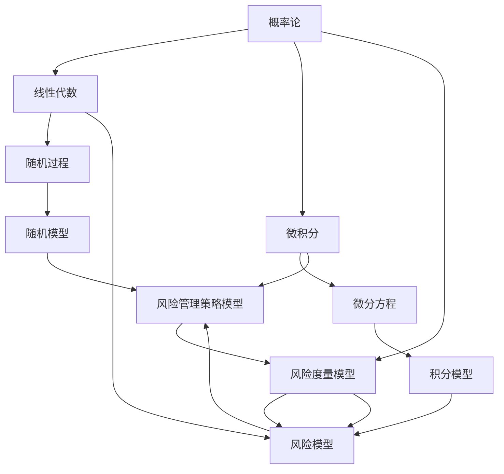

                 

## 《数学与风险管理：风险评估的数学方法》

关键词：数学基础、风险管理、风险度量、风险模型、案例分析

摘要：本文旨在探讨数学在风险管理中的关键作用，通过解析概率论、线性代数、微积分等数学工具，阐述其在风险评估中的应用。文章分为两部分：第一部分深入讲解数学基础，包括概率论、随机过程、线性代数和微积分；第二部分专注于风险管理，从风险度量、风险模型到风险管理策略，通过实际案例进行深入剖析，以期帮助读者理解并运用数学方法进行风险管理。

## 目录

#### 第一部分：数学基础

### 第1章：概率论与随机过程

#### 第2章：线性代数基础

#### 第3章：微积分基础

#### 第二部分：风险管理

### 第4章：风险度量

### 第5章：风险模型

### 第6章：风险管理策略

### 第7章：风险管理案例分析

### 附录

#### 附加内容

## 第1章：概率论与随机过程

概率论是研究随机现象的数学分支，它为我们提供了理解和处理不确定性的工具。在风险管理中，概率论的应用尤为广泛，无论是进行风险评估、预测风险损失，还是制定风险管理策略，概率论都是不可或缺的。

### 1.1 概率论基础

#### 1.1.1 随机实验与样本空间

随机实验是指那些结果不可预测的实验，如掷骰子、抽签等。样本空间是随机实验所有可能结果的集合。例如，掷一个公平的六面骰子的样本空间为{1, 2, 3, 4, 5, 6}。

#### 1.1.2 事件与概率

事件是样本空间的一个子集。概率是衡量事件发生的可能性大小的一个数值，通常用0到1之间的实数表示。一个事件的概率可以通过实验次数来估计，当实验次数足够多时，事件发生的频率将趋近于其概率。

#### 1.1.3 条件概率与贝叶斯公式

条件概率是指在某一事件已经发生的条件下，另一个事件发生的概率。贝叶斯公式是概率论中一个重要的工具，它提供了一种计算后验概率的方法，即根据先验概率和观察到的数据来更新概率估计。

### 1.2 随机变量与概率分布

随机变量是将样本空间的元素映射到实数域的函数。概率分布描述了随机变量取不同值的概率。随机变量分为离散型随机变量和连续型随机变量。常见的概率分布包括二项分布、正态分布、泊松分布等。

#### 1.2.1 随机变量

随机变量是将样本空间的元素映射到实数域的函数。它可以是离散的，也可以是连续的。

#### 1.2.2 离散型随机变量

离散型随机变量取有限个或可数无限个值。例如，掷骰子的点数就是一个离散型随机变量。

#### 1.2.3 连续型随机变量

连续型随机变量可以在某个区间内取任意值。例如，测量一个人的身高就是一个连续型随机变量。

#### 1.2.4 常见概率分布

常见的概率分布包括二项分布、正态分布、泊松分布等。这些分布描述了不同类型随机变量的概率分布特征。

### 1.3 随机过程

随机过程是一系列随机变量的集合，这些随机变量按照某种规则相关联。随机过程分为离散时间随机过程和连续时间随机过程。

#### 1.3.1 随机过程的基本概念

随机过程的基本概念包括样本路径、状态空间、概率分布等。

#### 1.3.2 离散时间随机过程

离散时间随机过程是随机变量序列，每个随机变量对应一个离散的时间点。

#### 1.3.3 连续时间随机过程

连续时间随机过程是随机变量函数，每个随机变量对应一个连续的时间点。

### 结论

概率论与随机过程是风险管理的基础。理解这些基本概念和工具，有助于我们更好地进行风险评估和管理。

## 第2章：线性代数基础

线性代数是研究向量空间、线性映射、矩阵等数学对象的分支。在风险管理中，线性代数提供了强大的工具来处理数据的线性关系，如多元回归分析、主成分分析等。以下章节将介绍线性代数的基础知识。

### 2.1 向量与矩阵

向量是数学中的基本对象，可以用来表示物理空间中的点或力。矩阵是向量的推广，可以表示多个向量的集合或线性变换。

#### 2.1.1 向量空间

向量空间是一组向量的集合，这些向量可以进行加法和标量乘法运算。向量空间的基本性质包括封闭性、存在零向量、存在单位向量等。

#### 2.1.2 矩阵

矩阵是一个二维数组，可以用来表示线性变换或系统的状态。矩阵的基本运算包括加法、减法、乘法和转置。

#### 2.1.3 矩阵运算

矩阵运算包括矩阵加法、矩阵减法、矩阵乘法、转置、求逆等。这些运算在数据分析、风险管理中有着广泛的应用。

### 2.2 线性方程组

线性方程组是包含多个线性方程的集合。线性方程组的解法是线性代数中的一个重要问题。

#### 2.2.1 线性方程组的基本概念

线性方程组的基本概念包括方程组的系数矩阵、常数向量、解等。

#### 2.2.2 高斯消元法

高斯消元法是一种常用的线性方程组求解方法。它通过矩阵行变换，将线性方程组转化为上三角或下三角方程组，然后求解。

#### 2.2.3 线性方程组的解法

线性方程组的解法还包括其他方法，如矩阵求逆、迭代法等。

### 2.3 特征值与特征向量

特征值和特征向量是矩阵分析中的核心概念。特征值描述了矩阵的固有属性，而特征向量是满足特定线性变换的向量。

#### 2.3.1 特征值与特征向量的概念

特征值和特征向量是矩阵的两个特殊向量，它们满足线性变换关系。特征值描述了线性变换的尺度，而特征向量描述了线性变换的方向。

#### 2.3.2 特征值与特征向量的计算

特征值和特征向量的计算通常涉及求解特征方程。特征方程的解为矩阵的特征值，而对应于特征值的向量即为特征向量。

#### 2.3.3 特征值与特征向量的应用

特征值和特征向量在数据分析、机器学习、风险管理等领域有广泛的应用。例如，它们可以用于降维、聚类、风险评估等。

### 结论

线性代数是风险管理的重要工具。理解向量与矩阵的基本概念、线性方程组的解法和特征值与特征向量的应用，将有助于我们更好地进行风险管理。

## 第3章：微积分基础

微积分是研究函数变化的数学分支，它在风险管理中的应用主要体现在对风险变量变化的建模和分析。以下章节将介绍微积分的基本概念和工具。

### 3.1 极限与导数

极限是微积分的基础概念之一，它描述了一个函数在某个点附近的增长或减少趋势。导数是极限的应用，它描述了函数在某一点的瞬时变化率。

#### 3.1.1 极限的概念与性质

极限的定义涉及函数在某个点的左右极限。极限的性质包括连续性、有界性等。

#### 3.1.2 导数的定义与计算

导数是极限的另一种表述，它描述了函数在某一点的瞬时变化率。导数的计算通常涉及求极限的过程。

#### 3.1.3 高阶导数

高阶导数是导数的推广，它描述了函数在某一点的二阶、三阶等瞬时变化率。

### 3.2 微分方程

微分方程是研究函数及其导数之间关系的方程。微分方程在风险管理中有着广泛的应用，如描述风险变量的动态变化。

#### 3.2.1 基本概念

微分方程的基本概念包括方程的阶数、解的存在性、解的唯一性等。

#### 3.2.2 一阶微分方程

一阶微分方程是最高阶数为一阶的微分方程。常见的求解方法包括分离变量法、积分因子法等。

#### 3.2.3 高阶微分方程

高阶微分方程是最高阶数大于一阶的微分方程。求解高阶微分方程通常涉及降阶和变换的方法。

### 3.3 积分

积分是微分的逆运算，它描述了函数在某个区间内的累积变化。积分在风险管理中有着广泛的应用，如计算风险变量的累积分布。

#### 3.3.1 定积分的概念与性质

定积分是积分的一种特殊情况，它描述了函数在一个区间内的累积值。定积分的性质包括可加性、连续性等。

#### 3.3.2 积分的计算方法

积分的计算方法包括基本积分公式、换元积分法、分部积分法等。

#### 3.3.3 积分的应用

积分在风险管理中的应用包括计算风险损失、风险评估等。

### 结论

微积分是风险管理的重要工具。理解极限与导数的基本概念、微分方程的求解方法以及积分的计算和应用，将有助于我们更好地进行风险管理。

## 第4章：风险度量

在风险管理中，风险度量是一个核心概念，它帮助我们量化风险的大小和影响。通过风险度量，我们可以更好地理解风险的性质，从而制定有效的风险管理策略。

### 4.1 风险的定义与分类

风险是指在特定条件下可能发生的损失或不确定性。根据风险的性质和来源，风险可以划分为多种类型，包括市场风险、信用风险、操作风险等。

#### 4.1.1 风险的定义

风险可以定义为潜在的损失或不利结果的可能性。在风险管理中，风险通常与概率和损失大小相关联。

#### 4.1.2 风险的分类

风险可以根据其性质和来源进行分类。常见的风险类型包括市场风险（如价格波动）、信用风险（如违约风险）、操作风险（如系统故障）等。

### 4.2 风险度量方法

风险度量方法用于量化风险的大小和影响。以下是一些常用的风险度量方法：

#### 4.2.1 绝对风险度量

绝对风险度量直接计算风险损失的大小，如损失期望值、损失最大值等。绝对风险度量提供了对风险损失的直接量化。

#### 4.2.2 相对风险度量

相对风险度量通过比较不同风险事件之间的风险大小来度量风险。常见的相对风险度量包括风险价值（VaR）、条件风险价值（CVaR）等。

#### 4.2.3 模糊风险度量

模糊风险度量用于处理不确定性和模糊性。它通过模糊集合和模糊逻辑来量化风险。

### 4.3 风险度量模型

风险度量模型是用于计算和评估风险的数学模型。以下是一些常用的风险度量模型：

#### 4.3.1 期望效用理论

期望效用理论是一种基于效用函数的风险度量模型。它通过计算不同风险事件的期望效用值来度量风险。

#### 4.3.2 风险价值（VaR）

风险价值（VaR）是一种常见的风险度量模型，它计算在特定置信水平下，风险损失的最大可能值。

#### 4.3.3 压力测试

压力测试是一种通过模拟极端市场条件来评估风险的方法。它可以帮助确定在极端情况下风险损失的大小。

### 结论

风险度量是风险管理的重要环节。通过理解风险的定义和分类、掌握不同的风险度量方法，以及应用风险度量模型，我们可以更好地量化和管理风险。

## 第5章：风险模型

风险模型是用于分析和预测风险的工具。通过构建和运用风险模型，我们可以更好地理解风险的性质，预测潜在的风险事件，并制定有效的风险管理策略。以下章节将介绍风险模型的基本概念和构建方法。

### 5.1 风险模型概述

风险模型是一种数学模型，它描述了风险的性质、风险事件的发生概率以及可能的损失大小。风险模型可以分为统计模型、行为模型和混合模型等。

#### 5.1.1 风险模型的概念

风险模型是一种用于分析和预测风险的工具，它通过数学和统计方法对风险事件进行建模和模拟。

#### 5.1.2 风险模型的分类

风险模型可以根据其建模方法进行分类，包括统计模型（如线性回归模型、决策树模型等）和行为模型（如蒙特卡洛模拟、马尔可夫链等）。

### 5.2 风险模型的构建

构建风险模型的过程包括数据收集、模型选择、参数估计、模型验证和优化等步骤。

#### 5.2.1 数据收集与处理

数据收集是构建风险模型的第一步。数据来源可以是历史数据、市场数据、行业数据等。数据收集后，需要进行数据清洗和处理，以确保数据的质量和一致性。

#### 5.2.2 模型选择与参数估计

在模型选择阶段，我们需要根据风险模型的目标和特性选择合适的模型。参数估计是模型构建的关键步骤，它涉及估计模型参数的值，以实现模型的拟合。

#### 5.2.3 模型验证与优化

模型验证是评估模型准确性和可靠性的过程。通过验证，我们可以确定模型是否能够准确地预测风险事件。模型优化是在验证基础上，对模型进行调整和改进，以提高其预测能力。

### 5.3 风险模型的运用

风险模型在风险管理中有着广泛的应用，包括风险评估、风险监控和风险管理策略制定等。

#### 5.3.1 风险评估

风险评估是风险模型的核心应用之一。通过风险模型，我们可以对风险事件的发生概率和损失大小进行预测和评估。

#### 5.3.2 风险监控

风险监控是确保风险管理策略有效实施的重要环节。通过风险模型，我们可以实时监控风险状况，及时发现潜在的风险事件。

#### 5.3.3 风险管理策略制定

风险管理策略制定是风险模型的重要应用之一。通过风险模型，我们可以制定基于数据驱动的风险管理策略，以降低风险损失。

### 结论

风险模型是风险管理的重要工具。通过理解风险模型的构建方法和应用，我们可以更好地进行风险评估、风险监控和风险管理策略制定，从而降低风险损失。

## 第6章：风险管理策略

风险管理策略是应对和减轻风险的一系列措施和方法。有效的风险管理策略能够帮助企业降低风险损失，保护企业的稳定和发展。以下章节将介绍风险管理策略的基本概念、分类和应用。

### 6.1 风险管理策略概述

风险管理策略是企业或组织为应对风险而制定的一系列措施和方法。这些措施可以包括规避风险、分散风险、转移风险和补偿风险等。

#### 6.1.1 风险管理策略的定义

风险管理策略是指企业或组织为应对风险而制定的一系列措施和方法，旨在降低风险损失，保护企业的稳定和发展。

#### 6.1.2 风险管理策略的分类

风险管理策略可以根据其目标和措施进行分类，包括风险规避策略、风险分散策略、风险转移策略和风险补偿策略等。

### 6.2 风险规避策略

风险规避策略是一种通过避免风险来降低风险损失的方法。这种策略通常适用于可以明确识别和避免的风险。

#### 6.2.1 风险规避的定义与原理

风险规避是指通过避免特定风险来降低风险损失。其原理在于，通过不参与可能导致风险的活动，从而避免风险的发生。

#### 6.2.2 风险规避的策略与方法

风险规避的策略包括不参与高风险投资、避免高风险业务等。具体方法包括设立风险规避政策、制定风险规避流程等。

### 6.3 风险分散策略

风险分散策略是一种通过将风险分散到多个不同的资产或业务中，以降低总体风险的方法。

#### 6.3.1 风险分散的定义与原理

风险分散是指通过将风险分散到多个不同的资产或业务中，以降低总体风险。其原理在于，不同资产或业务的风险可能是相互独立的，从而降低总体风险。

#### 6.3.2 风险分散的策略与方法

风险分散的策略包括多元化投资、业务多元化等。具体方法包括投资组合管理、业务多元化策略等。

### 6.4 风险转移策略

风险转移策略是一种将风险转移到其他方的策略。常见的风险转移方式包括购买保险、签订合同等。

#### 6.4.1 风险转移的定义与原理

风险转移是指将风险转移给其他方，如保险公司或其他合同方。其原理在于，通过将风险转移给有风险承受能力的第三方，降低自身的风险损失。

#### 6.4.2 风险转移的策略与方法

风险转移的策略包括购买保险、签订合同等。具体方法包括投保、签订风险管理合同等。

### 6.5 风险补偿策略

风险补偿策略是一种通过提供额外补偿来应对风险的方法。这种策略适用于那些无法完全规避或转移的风险。

#### 6.5.1 风险补偿的定义与原理

风险补偿是指为应对风险提供额外补偿，以减轻风险损失。其原理在于，通过提供额外的资金或资源，以应对可能发生的风险损失。

#### 6.5.2 风险补偿的策略与方法

风险补偿的策略包括财务补偿、资源补偿等。具体方法包括设立风险补偿基金、提供额外的人力资源等。

### 结论

风险管理策略是应对和减轻风险的重要措施。通过理解风险规避、风险分散、风险转移和风险补偿策略，我们可以更好地制定和实施风险管理计划，降低风险损失，保护企业的稳定和发展。

## 第7章：风险管理案例分析

通过实际案例的分析，我们可以更深入地理解风险管理策略在实践中的应用，以及如何运用数学工具进行风险评估和管理。

### 7.1 银行业风险案例分析

银行业是一个高风险行业，市场风险、信用风险、操作风险等都是银行面临的主要风险类型。以下是一个关于银行业风险管理的案例分析。

#### 7.1.1 银行业风险概述

银行业风险主要来自以下几个方面：

- **市场风险**：包括利率风险、汇率风险和股票市场风险等。
- **信用风险**：指借款人无法按时偿还债务的风险。
- **操作风险**：指由于内部管理问题、系统故障等导致的损失风险。

#### 7.1.2 案例分析

某银行在2020年面临了一场突如其来的市场风险。由于全球疫情爆发，股市暴跌，利率急剧下降。为了应对这一风险，该银行采取了以下措施：

1. **风险度量**：使用风险价值（VaR）模型对市场风险进行量化，评估潜在的损失大小。
2. **风险分散**：通过投资组合管理，将资金分散到不同资产类别，降低市场波动对整体资产的影响。
3. **风险转移**：购买保险，将部分市场风险转移给保险公司。
4. **风险补偿**：设立风险准备金，以应对可能发生的市场损失。

通过这些措施，该银行成功降低了市场风险对其运营的冲击，保持了稳定的盈利能力。

### 7.2 证券市场风险案例分析

证券市场是一个充满不确定性的领域，投资者面临的风险包括市场风险、信用风险等。以下是一个关于证券市场风险管理的案例分析。

#### 7.2.1 证券市场风险概述

证券市场风险主要来自以下几个方面：

- **市场风险**：指市场价格波动导致资产损失的风险。
- **信用风险**：指借款人或交易对手无法按时履行债务的风险。

#### 7.2.2 案例分析

某投资者在2020年投资了一只股票。由于疫情爆发，该股票价格急剧下跌。为了应对这一风险，该投资者采取了以下措施：

1. **风险度量**：使用历史数据和统计模型对股票价格波动进行预测，评估潜在的市场风险。
2. **风险分散**：通过投资组合管理，将资金分散到不同行业和资产类别，降低市场波动对整体投资组合的影响。
3. **风险规避**：在市场波动较大时，及时调整投资策略，避免投资于高风险股票。
4. **风险补偿**：购买期权等衍生品，以保护投资组合免受市场波动的影响。

通过这些措施，该投资者成功降低了投资风险，并保持了投资组合的稳定性。

### 7.3 保险业风险案例分析

保险业是一个高风险行业，保险公司在经营过程中需要面对各种风险。以下是一个关于保险业风险管理的案例分析。

#### 7.3.1 保险业风险概述

保险业风险主要来自以下几个方面：

- **市场风险**：包括利率风险、汇率风险等。
- **信用风险**：指保险合同中的信用风险，如借款人无法按时偿还保费。
- **操作风险**：指由于内部管理问题、系统故障等导致的损失风险。

#### 7.3.2 案例分析

某保险公司为了降低市场风险，采取了以下措施：

1. **风险度量**：使用风险价值（VaR）模型对市场风险进行量化，评估潜在的损失大小。
2. **风险分散**：通过投资组合管理，将保费收入投资于不同资产类别，降低市场波动对整体资产的影响。
3. **风险转移**：购买再保险，将部分风险转移给其他保险公司。
4. **风险补偿**：设立风险准备金，以应对可能发生的市场损失。

通过这些措施，该保险公司成功降低了市场风险，并保持了稳定的盈利能力。

### 结论

通过以上案例分析，我们可以看到，在风险管理中，有效的策略和数学工具的应用至关重要。无论是银行业、证券市场还是保险业，通过合理的风险度量、分散、转移和补偿措施，企业都可以降低风险损失，确保业务的稳定和发展。

## 附录

### 附录 A：常用数学公式与符号

以下是一些在本文中经常使用的数学公式和符号：

- **概率论**

  - 样本空间：\( S \)
  - 随机实验：\( E \)
  - 事件：\( A \)
  - 概率：\( P(A) \)
  - 条件概率：\( P(A|B) \)
  - 贝叶斯公式：\( P(A|B) = \frac{P(B|A)P(A)}{P(B)} \)

- **线性代数**

  - 向量：\( \mathbf{v} \)
  - 矩阵：\( \mathbf{A} \)
  - 矩阵乘法：\( \mathbf{A}\mathbf{B} \)
  - 矩阵转置：\( \mathbf{A}^\top \)
  - 特征值：\( \lambda \)
  - 特征向量：\( \mathbf{v} \)

- **微积分**

  - 极限：\( \lim_{{x \to a}} f(x) \)
  - 导数：\( f'(x) \)
  - 积分：\( \int f(x) \, dx \)

### 附录 B：参考文献

- **概率论与随机过程**

  - Sheldon M. Ross, 《概率论基础》(A First Course in Probability)

- **线性代数**

  - Gilbert Strang, 《线性代数》(Linear Algebra and Its Applications)

- **微积分**

  - James Stewart, 《微积分》(Calculus)

- **风险管理**

  - Daniel Kahneman, 《思考，快与慢》(Thinking, Fast and Slow)
  - John C. Hull, 《金融市场与金融工具》(Options, Futures, and Other Derivatives)

### 附录 C：进一步学习资源链接

- **在线课程**

  - Coursera: 《概率论与随机过程》(Probability and Statistics)
  - edX: 《线性代数》(Linear Algebra)

- **学术期刊**

  - 《风险分析与决策》(Journal of Risk and Financial Management)
  - 《随机过程与应用》(Stochastic Processes and their Applications)

- **专业网站**

  - Risk.net
  - CFA Institute

## 第8章：核心概念与联系

### Mermaid 流程图

以下是本文中核心概念和联系之间的Mermaid流程图：



### Mermaid 流程图说明

1. **概率论**：概率论是风险管理的基础，包括概率分布、随机变量、随机过程等概念。
2. **线性代数**：线性代数在风险管理中的应用主要体现在数据分析和特征提取方面。
3. **微积分**：微积分在风险管理中的应用包括对风险变量变化的建模和分析。
4. **随机过程**：随机过程用于描述风险的动态变化，是构建风险模型的重要工具。
5. **风险度量模型**：风险度量模型用于量化风险的大小和影响。
6. **风险模型**：风险模型用于分析和预测风险事件。
7. **风险管理策略模型**：风险管理策略模型用于制定和实施风险管理策略。

通过上述流程图，我们可以清晰地看到核心概念之间的联系和相互影响，有助于我们更好地理解风险管理的方法和工具。

## 第9章：核心算法原理讲解

### 风险管理中的VaR计算

以下是一个简单的VaR计算算法原理讲解，使用伪代码进行描述：

```python
# 伪代码：风险管理中的VaR计算

function calculate_VaR(returns, alpha):
    # 输入参数：
    # returns：历史收益率数据
    # alpha：置信水平

    # 步骤1：计算历史收益率的排序
    sorted_returns = sort(returns)

    # 步骤2：计算在置信水平alpha下的分位数
    VaR = sorted_returns[round(len(sorted_returns) * alpha)]

    # 步骤3：返回计算出的VaR值
    return VaR
```

### 算法原理说明

1. **历史收益率数据**：首先，我们需要收集历史收益率数据。这些数据通常来自于资产或投资组合的过去表现。
2. **排序**：将历史收益率数据按照大小进行排序，以便于找到特定置信水平下的分位数。
3. **分位数计算**：在置信水平alpha下，找到对应的分位数。这个分位数表示在给定置信水平下，损失可能达到的最大值。
4. **返回VaR值**：计算出的分位数即为VaR值，它表示在给定置信水平下，资产或投资组合可能发生的最大损失。

### 应用举例

假设我们有一组历史收益率数据：[0.02, -0.03, 0.01, -0.02, 0.01, -0.01, 0.005]。我们希望计算在95%置信水平下的VaR。

1. **排序**：[-0.03, -0.02, -0.01, 0.005, 0.01, 0.01, 0.02]
2. **计算分位数**：在95%置信水平下，我们需要找到第5百分位数的值。这里，第5百分位数的值是-0.01。
3. **返回VaR值**：因此，95%置信水平下的VaR为-0.01，表示在95%的置信水平下，资产或投资组合可能发生的最大损失为0.01。

通过这个简单的例子，我们可以看到如何使用VaR计算方法来评估风险。

### 结论

VaR计算是风险管理中的一个核心工具。理解其算法原理和计算方法，有助于我们更好地进行风险管理和决策。在实际应用中，可以根据具体情况进行参数调整和模型改进，以提高VaR计算的准确性和可靠性。

