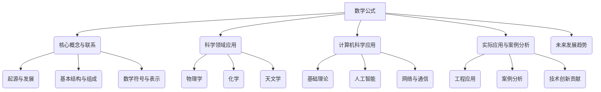

                 

### 文章标题

《数学公式：描述宇宙的通用语言》

关键词：数学公式、宇宙、科学领域、计算机科学、人工智能

摘要：本文将探讨数学公式在描述宇宙中的重要作用，从其基础概念、历史发展、应用领域以及未来趋势等多个角度进行全面剖析。通过揭示数学公式在物理学、化学、天文学和计算机科学等领域的广泛应用，本文旨在展示数学公式作为宇宙通用语言的独特魅力。

### 目录大纲

#### 第一部分：数学公式的基础知识

- **第1章：数学公式的起源与历史**
  - **1.1.1 数学公式的起源**
  - **1.1.2 数学公式的发展历程**

- **第2章：数学公式的基本结构**
  - **2.1.1 数学公式的组成要素**
  - **2.1.2 数学公式的基本格式**
  - **2.1.3 数学公式的书写规范**

- **第3章：数学符号与表示**
  - **3.1.1 常用数学符号**
  - **3.1.2 特殊数学符号**
  - **3.1.3 数学符号的解读与应用**

#### 第二部分：数学公式在科学领域的应用

- **第4章：数学公式在物理学中的应用**
  - **4.1.1 牛顿定律的数学公式**
  - **4.1.2 电磁学的数学公式**
  - **4.1.3 相对论的数学公式**

- **第5章：数学公式在化学中的应用**
  - **5.1.1 化学反应的数学公式**
  - **5.1.2 分子结构的数学公式**
  - **5.1.3 化学键的数学公式**

- **第6章：数学公式在天文学中的应用**
  - **6.1.1 行星运动的数学公式**
  - **6.1.2 黑洞与引力波的数学公式**
  - **6.1.3 宇宙膨胀的数学公式**

#### 第三部分：数学公式在计算机科学中的应用

- **第7章：数学公式在计算机科学基础中的应用**
  - **7.1.1 图灵机的数学公式**
  - **7.1.2 计算复杂度的数学公式**
  - **7.1.3 算法分析的数学公式**

- **第8章：数学公式在人工智能中的应用**
  - **8.1.1 机器学习的数学公式**
  - **8.1.2 深度学习的数学公式**
  - **8.1.3 强化学习的数学公式**

- **第9章：数学公式在网络与通信中的应用**
  - **9.1.1 网络协议的数学公式**
  - **9.1.2 信号处理的数学公式**
  - **9.1.3 信息论的基础公式**

#### 第四部分：数学公式的实际应用与案例分析

- **第10章：数学公式在实际工程中的应用**
  - **10.1.1 数据库查询优化**
  - **10.1.2 优化算法的数学模型**
  - **10.1.3 软件工程中的数学公式应用**

- **第11章：数学公式的案例分析**
  - **11.1.1 数学公式在科学研究中的成功案例**
  - **11.1.2 数学公式在工程应用中的实例分析**
  - **11.1.3 数学公式在技术创新中的贡献**

- **第12章：数学公式的未来发展趋势**
  - **12.1.1 数学公式在跨学科研究中的应用前景**
  - **12.1.2 新型数学公式的研究方向**
  - **12.1.3 数学公式在人工智能与机器学习中的未来发展**

#### 附录

- **附录A：数学公式相关资源与工具**
  - **A.1 在线数学公式编辑器**
  - **A.2 数学公式参考文献**
  - **A.3 数学公式学习资源推荐**

### Mermaid 流程图



### 核心算法原理讲解

#### 伪代码：牛顿-拉夫逊法求解非线性方程

```
初始化：
    x0 = 起始猜测值
    epsilon = 预定的误差阈值
    max_iter = 最大迭代次数

迭代过程：
    for i from 1 to max_iter do
        f(x0) = 计算f(x0)的值
        f'(x0) = 计算f(x0)的导数
        x0 = x0 - f(x0)/f'(x0)  // 更新x0的值
        if |f(x0)| < epsilon then
            break  // 达到预设的精度，结束迭代
        end if
    end for

返回：x0作为方程f(x)=0的解
```

### 数学模型和数学公式 & 详细讲解 & 举例说明

#### 数学公式：牛顿第二定律

$$ F = ma $$

其中，$ F $ 是作用力，$ m $ 是物体的质量，$ a $ 是物体的加速度。

#### 详细讲解：

牛顿第二定律是经典力学中的一个核心概念，它描述了力与物体加速度之间的关系。根据牛顿第二定律，物体所受的合力等于物体质量与加速度的乘积。这个公式在物理学中有着广泛的应用，比如在分析物体的运动、计算作用力等方面。

#### 举例说明：

假设一个质量为5千克的物体受到10牛顿的力作用，则根据牛顿第二定律可以计算出物体的加速度：

$$
a = \frac{F}{m} = \frac{10 N}{5 kg} = 2 m/s^2
$$

这意味着物体将以每秒2米的加速度运动。如果物体初始速度为0，那么在1秒后，它的速度将增加到2米/秒；在2秒后，速度将增加到4米/秒，以此类推。

牛顿第二定律不仅在物理学中有重要应用，也在工程学、航天学、天文学等领域发挥着关键作用。通过数学公式，我们可以精确地描述和预测物体的运动，为科学研究和工程实践提供坚实的理论基础。这也充分体现了数学公式作为描述宇宙通用语言的强大力量。

