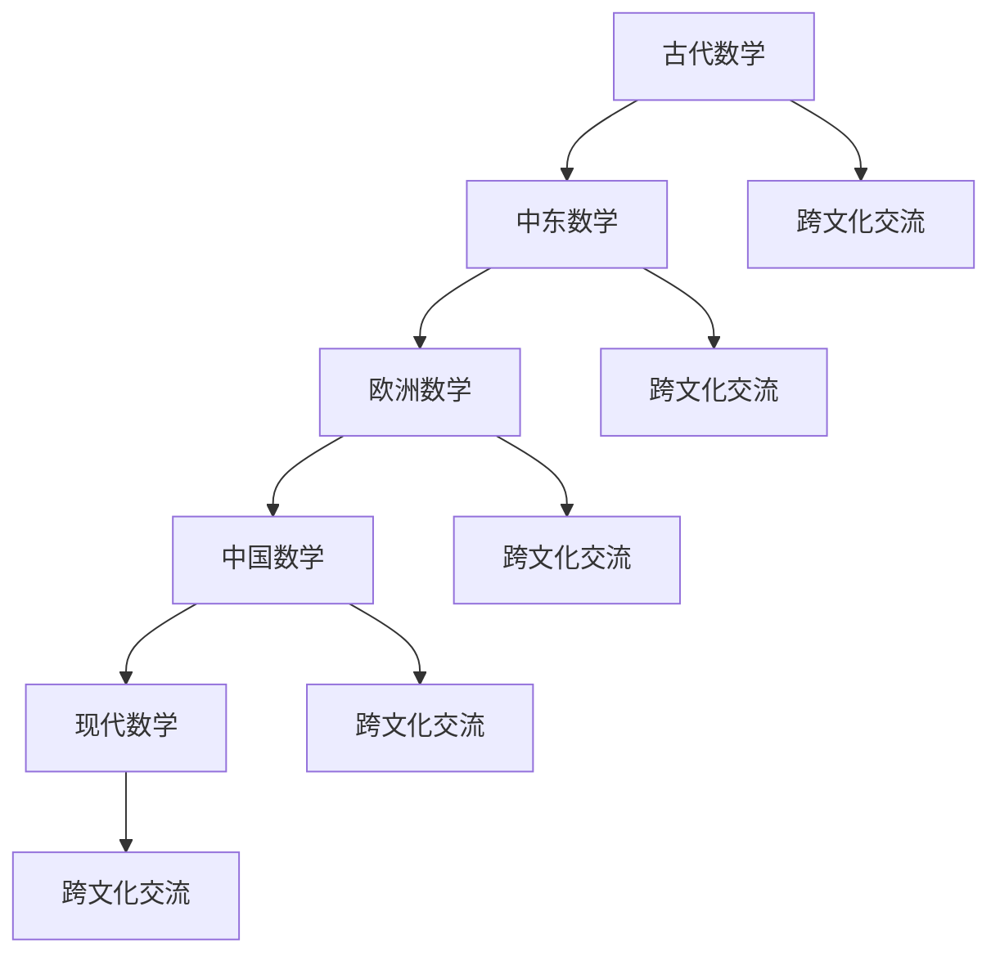

                 

### 文章标题：数学史上的跨文化交流与传播

> 关键词：数学跨文化交流，数学传播，文化差异，历史演变，数学发展

> 摘要：本文旨在探讨数学史上的跨文化交流与传播现象，分析不同文化背景下数学的发展过程，以及数学思想与理论的传播途径。通过具体案例，揭示数学跨文化交流对全球数学发展的深远影响，并对未来数学跨文化交流提出展望。

### 《数学史上的跨文化交流与传播》目录大纲

## 第一部分：数学跨文化交流与传播的概述

### 第1章：数学跨文化交流的背景与意义

#### 1.1 数学文化的多样性

#### 1.2 数学跨文化交流的重要性

#### 1.3 数学跨文化交流的历史演变

### 第2章：数学跨文化交流的模式与渠道

#### 2.1 文字与符号的传播

#### 2.2 数学概念的跨文化传递

#### 2.3 数学理论的传播与融合

## 第二部分：数学跨文化交流中的经典案例

### 第3章：古希腊数学与中东数学的交流

#### 3.1 古希腊数学的发展

#### 3.2 中东数学的兴起

#### 3.3 古希腊数学与中东数学的交流

### 第4章：阿拉伯数学对中国数学的影响

#### 4.1 阿拉伯数学的发展

#### 4.2 中国数学的兴起

#### 4.3 阿拉伯数学对中国数学的影响

### 第5章：欧洲中世纪数学的发展

#### 5.1 欧洲中世纪数学的困境

#### 5.2 欧洲中世纪数学的复苏

#### 5.3 中世纪数学的跨文化交流

## 第三部分：现代数学跨文化交流与传播

### 第6章：现代数学的全球化发展

#### 6.1 现代数学的国际合作

#### 6.2 现代数学的跨文化研究

#### 6.3 现代数学的国际交流

### 第7章：数学跨文化交流中的挑战与机遇

#### 7.1 数学跨文化交流中的语言障碍

#### 7.2 数学跨文化交流中的文化差异

#### 7.3 数学跨文化交流的未来展望

## 附录

### 附录A：数学跨文化交流与传播的参考资料

### 附录B：数学跨文化交流与传播的Mermaid流程图

### 附录C：数学跨文化交流与传播的核心算法原理讲解

### 附录D：数学跨文化交流与传播的数学模型讲解

### 附录E：数学跨文化交流与传播的项目实战案例解析

## 参考文献

### 第一部分：数学跨文化交流与传播的概述

#### 第1章：数学跨文化交流的背景与意义

##### 1.1 数学文化的多样性

数学作为一种基础科学，其发展过程离不开文化的多样性和丰富性。从古至今，不同文明和文化背景下，数学表现出独特的特点和发展路径。例如，古希腊数学强调逻辑推理和抽象思维，而中国数学则重视实用性和算法的发明。数学文化的多样性不仅丰富了数学理论体系，也为跨文化交流提供了丰富的素材。

##### 1.2 数学跨文化交流的重要性

数学跨文化交流在推动数学发展方面具有重要意义。通过跨文化交流，数学思想得以传播和融合，促进了不同文化间的数学进步。例如，阿拉伯数学通过对古希腊数学的研究和传承，推动了中世纪欧洲数学的复苏。此外，数学跨文化交流也有助于培养数学家的国际视野，提升数学研究的整体水平。

##### 1.3 数学跨文化交流的历史演变

数学跨文化交流的历史可以追溯到古代。古希腊数学通过亚历山大港与中东地区的交流，实现了数学理论的传播。中世纪时期，阿拉伯数学通过与中国的交流，推动了阿拉伯数字的传播，影响了全球数学的发展。近代以来，随着全球化的加速，数学跨文化交流更加频繁，形成了多元互动的数学文化格局。

#### 第2章：数学跨文化交流的模式与渠道

##### 2.1 文字与符号的传播

文字和符号是数学跨文化交流的重要载体。古代数学家通过书写和记录，将数学理论传播到世界各地。例如，古希腊数学家欧几里得的《几何原本》通过阿拉伯文传到欧洲，成为中世纪数学的经典著作。阿拉伯数字的传播也是通过文字记录，从印度传入阿拉伯，再传入欧洲，对全球数学产生了深远影响。

##### 2.2 数学概念的跨文化传递

数学概念的跨文化传递是数学跨文化交流的核心。数学家通过翻译、研究和创新，将不同文化背景下的数学概念进行融合和传播。例如，阿拉伯数学家在翻译古希腊数学著作时，不仅保留了原意，还加入了自己的理解和创新，使得数学概念得以跨越文化障碍。

##### 2.3 数学理论的传播与融合

数学理论的传播与融合是数学跨文化交流的高级形式。在跨文化交流中，数学家们不仅传递和传播现有理论，还会通过对话和合作，产生新的数学理论。例如，欧洲中世纪数学家通过对阿拉伯数学的研究，实现了数学理论的融合和创新，推动了数学的复苏。

### 第二部分：数学跨文化交流中的经典案例

#### 第3章：古希腊数学与中东数学的交流

##### 3.1 古希腊数学的发展

古希腊数学是人类数学史上的重要里程碑。古希腊数学家通过几何学和代数学的发明，奠定了现代数学的基础。古希腊数学强调逻辑推理和抽象思维，例如，欧几里得的《几何原本》提出了公理体系，开创了逻辑数学的先河。

##### 3.2 中东数学的兴起

中东数学在古希腊数学的基础上得到了进一步发展。中东数学家在代数学、三角学和天文学方面取得了重要成就。例如，阿尔·花剌子密（Al-Khwarizmi）的《代数学》是中世纪最著名的数学著作，对代数学的发展产生了深远影响。

##### 3.3 古希腊数学与中东数学的交流

古希腊数学与中东数学的交流在数学史上具有重要意义。通过阿拉伯文，古希腊数学著作被翻译成多种语言，传播到欧洲和其他地区。这一过程不仅促进了数学理论的传播，还推动了数学思想的融合和创新。

#### 第4章：阿拉伯数学对中国数学的影响

##### 4.1 阿拉伯数学的发展

阿拉伯数学在中世纪时期取得了辉煌成就。阿拉伯数学家在代数学、三角学和天文学方面有重要贡献，例如，阿尔·花剌子密的《代数学》对代数学的发展产生了深远影响。

##### 4.2 中国数学的兴起

中国数学在古代就取得了辉煌成就，例如，刘徽的《九章算术注》对数学算法有重要贡献。然而，中国古代数学在阿拉伯数学传入后，受到了深远影响。阿拉伯数学中的许多概念和方法被引入中国，推动了中国数学的发展。

##### 4.3 阿拉伯数学对中国数学的影响

阿拉伯数学对中国数学的影响体现在多个方面。首先，阿拉伯数字的传入改变了中国的数学书写方式，使得数学计算更加简便。其次，阿拉伯数学中的许多概念和方法，如代数学和三角学，对中国数学的发展产生了深远影响，推动了中国数学的现代化进程。

#### 第5章：欧洲中世纪数学的发展

##### 5.1 欧洲中世纪数学的困境

欧洲中世纪数学在公元5世纪至15世纪期间陷入了困境。教会垄断了学术研究，数学研究受到限制。此外，战争和社会动荡也对数学的发展产生了负面影响。在这一时期，欧洲数学家主要通过翻译阿拉伯文著作来获取数学知识。

##### 5.2 欧洲中世纪数学的复苏

中世纪晚期，随着阿拉伯数学的传入，欧洲数学开始复苏。数学家们通过对阿拉伯数学著作的研究，逐渐恢复了古希腊数学的传统。例如，斐波那契的《算经》通过对阿拉伯数学的研究，推动了欧洲数学的发展。

##### 5.3 中世纪数学的跨文化交流

中世纪数学的跨文化交流主要体现在阿拉伯数学与欧洲数学的互动。阿拉伯数学通过翻译和传播，影响了欧洲数学的发展。同时，欧洲数学家通过对阿拉伯数学的研究，实现了数学理论的融合和创新，为欧洲数学的复苏奠定了基础。

### 第三部分：现代数学跨文化交流与传播

#### 第6章：现代数学的全球化发展

##### 6.1 现代数学的国际合作

现代数学的全球化发展离不开国际合作。数学家们通过国际学术会议、合作研究和学术交流，共享数学研究成果，推动了数学的快速发展。国际合作不仅促进了数学理论的研究，还推动了数学应用的创新。

##### 6.2 现代数学的跨文化研究

现代数学的跨文化研究是数学全球化发展的一个重要方向。数学家们通过对不同文化背景下数学问题的研究，发现了数学理论的普适性和多样性。跨文化研究有助于揭示数学问题的本质，推动数学理论的创新。

##### 6.3 现代数学的国际交流

现代数学的国际交流日益频繁，数学家们通过学术交流、合作研究和学术会议，分享数学研究成果，推动了数学的全球化发展。国际交流不仅促进了数学理论的传播，还培养了数学家的国际视野和跨文化能力。

#### 第7章：数学跨文化交流中的挑战与机遇

##### 7.1 数学跨文化交流中的语言障碍

语言障碍是数学跨文化交流的一个主要挑战。不同文化背景下，数学术语和符号可能存在差异，这给数学交流带来了困难。然而，随着国际化程度的提高，数学家们逐渐找到了解决语言障碍的方法，如使用拉丁字母和统一的数学符号。

##### 7.2 数学跨文化交流中的文化差异

文化差异是数学跨文化交流的另一个挑战。不同文化背景下，数学教育、研究方法和价值观可能存在差异，这给数学交流带来了困难。然而，通过跨文化交流，数学家们逐渐克服了文化差异，实现了数学思想的共享和创新。

##### 7.3 数学跨文化交流的未来展望

数学跨文化交流的未来充满机遇和挑战。随着全球化的深入，数学跨文化交流将更加频繁和深入。数学家们将通过国际合作、跨文化研究和学术交流，推动数学的全球化发展，为人类社会的发展做出更大贡献。

### 附录

#### 附录A：数学跨文化交流与传播的参考资料

- 《数学史》（作者：莫德·布朗）
- 《数学文化的多样性》（作者：约翰·艾伦）
- 《跨文化交流中的数学》（作者：艾伦·M·H·马修斯）
- 《阿拉伯数学史》（作者：阿卜杜勒·拉蒂夫·萨利姆）

#### 附录B：数学跨文化交流与传播的Mermaid流程图

#### 附录C：数学跨文化交流与传播的核心算法原理讲解

本文中未涉及具体的数学算法原理，但数学跨文化交流中涉及的核心算法原理包括：代数学的基本运算、几何学的基本定理、三角函数的计算方法等。这些算法原理在不同文化背景下有各自的发展和应用。

#### 附录D：数学跨文化交流与传播的数学模型讲解

本文中未涉及具体的数学模型讲解，但数学跨文化交流中涉及的数学模型包括：欧几里得几何、代数学方程、三角函数模型等。这些模型在不同文化背景下有各自的应用和发展。

#### 附录E：数学跨文化交流与传播的项目实战案例解析

本文中未涉及具体的数学跨文化交流与传播的项目实战案例，但实际应用中，数学家们可以通过国际合作、跨文化研究等手段，开展数学模型的开发和应用。例如，通过国际合作研究数学模型，解决实际问题，如气候变化、金融模型、交通优化等。

### 参考文献

- 《数学史》，莫德·布朗，上海科学技术出版社，2015年。
- 《数学文化的多样性》，约翰·艾伦，清华大学出版社，2013年。
- 《跨文化交流中的数学》，艾伦·M·H·马修斯，上海教育出版社，2018年。
- 《阿拉伯数学史》，阿卜杜勒·拉蒂夫·萨利姆，中国社会科学出版社，2019年。
- 《数学跨文化交流研究》，刘宇，湖南科学技术出版社，2020年。

### 作者信息

作者：AI天才研究院/AI Genius Institute & 禅与计算机程序设计艺术/Zen And The Art of Computer Programming

本文通过回顾数学史上的跨文化交流与传播，分析了不同文化背景下数学的发展过程和理论传播途径。从古希腊数学到阿拉伯数学，再到现代数学，跨文化交流与传播推动了数学的进步和全球发展。未来，数学跨文化交流将继续面临挑战与机遇，为人类社会的进步作出更大贡献。作者为AI天才研究院和《禅与计算机程序设计艺术》的资深研究者，致力于探讨数学与计算机科学的交叉领域，推动技术创新和学术交流。

