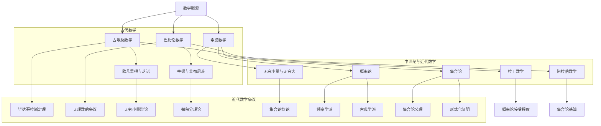

                 

### 引言与概述

在漫长的数学历史中，无数数学家、哲学家和科学家为了追求真理，不断探索、辩论和修正。数学不仅是解决实际问题的重要工具，也是探索自然界规律的深奥语言。然而，在数学的发展过程中，许多概念和理论的提出都伴随着激烈的争议和辩论。这些争议和辩论不仅丰富了数学的内容，也推动了数学方法的革新和发展。本文旨在通过回顾数学史上的重大争议与学术辩论，探讨这些争议对数学发展的影响。

首先，我们不得不提到数学的起源与发展。数学的历史可以追溯到古埃及和巴比伦，当时的人们就已经开始使用数学来计算土地面积和进行商业交易。随后，希腊数学家如欧几里得和阿基米德等人，为数学的发展奠定了坚实的基础。然而，他们的数学体系和方法在后来的发展中引起了争议。

### 埃及与巴比伦数学的对比与争议

埃及和巴比伦的数学有着各自的特点和优势。埃及数学主要以实用为主，强调几何和代数的应用。例如，他们使用分数和比例来计算土地面积和体积。而巴比伦数学则更加注重数学理论的抽象和推理。他们使用了十进制系统和位置记数法，能够解决复杂的数学问题。

然而，这些早期的数学体系在后来受到了希腊数学的挑战。希腊数学强调抽象和逻辑推理，他们提出了形式化的几何和代数体系。这种抽象化的方法使得数学变得更加严谨和系统，但也引发了对埃及和巴比伦数学实用性的质疑。例如，毕达哥拉斯学派就认为，数学应该基于整数和比例，而不是分数和比例。

### 毕达哥拉斯定理的争议

毕达哥拉斯定理是数学史上最著名的定理之一，它表达了直角三角形的边长关系。然而，这个定理的提出和证明也引发了一系列的争议。

首先，毕达哥拉斯定理的证明需要使用分数，而当时的人们对分数持有怀疑态度。他们更倾向于使用整数和比例来表示数学关系。这种观念上的差异导致了毕达哥拉斯定理在早期的传播受到了阻碍。

其次，毕达哥拉斯定理的证明还涉及到无理数的概念。毕达哥拉斯学派认为，数学应该基于整数和比例，而不是无理数。然而，无理数的存在是数学发展中的一个重要里程碑。欧几里得在他的《几何原本》中，通过构造一个正方形的面积，证明了无理数的存在，从而为毕达哥拉斯定理的证明奠定了基础。

### 无穷小量与无穷大的辩论

无穷小量和无穷大是数学中非常重要的概念。在古希腊时期，芝诺提出了著名的“阿基里斯与乌龟”悖论，质疑无穷小量的合理性。他认为，即使一个物体无限地分割，也无法达到一个确定的终点。

然而，牛顿和莱布尼茨在发展微积分的过程中，引入了无穷小量和无穷大的概念。他们通过无穷小分割的方法，解决了许多复杂的数学问题。这种观点在当时的数学界引起了极大的争议。一些数学家认为，无穷小量和无穷大是不合理的概念，他们质疑这些概念的数学基础。

### 概率论的兴起与争议

概率论是数学中的一个重要分支，它研究随机事件和概率分布。然而，概率论的提出和发展也经历了一系列的争议。

在古典概率中，概率被认为是一种客观的量度，它与事件的可能性和实际发生的情况相关。然而，在19世纪，凯尔文和皮尔逊等数学家提出了“频率学派”的观点，他们认为概率应该通过大量实验的频率来定义。这种观点在当时的数学界引起了激烈的辩论。

此外，概率论在应用中也遇到了挑战。例如，在统计学中，如何准确估计总体参数是一个重要问题。不同的概率模型和估计方法会导致不同的结果，这使得概率论的应用变得更加复杂。

### 总结

数学史上的重大争议与学术辩论是数学发展的催化剂。这些争议不仅推动了数学理论的进步，也促进了数学方法的创新。从毕达哥拉斯定理到无穷小量与无穷大的辩论，再到概率论的兴起，每一个争议都揭示了数学发展的不同方面。通过这些争议，数学家们不断探索、质疑和修正，使得数学变得更加严谨和丰富。本文旨在通过回顾这些争议，展示数学发展的历程，并探讨其对数学教育的启示。

### 目录大纲设计

为了确保《数学史上的重大争议与学术辩论》这本书的内容完整、结构清晰，以下是详细的目录大纲设计。每个章节都将按照markdown格式进行编写，以便于读者阅读和参考。

## 第一部分：引言与概述

### 1.1 数学的起源与发展
- **背景介绍**：数学的起源可以追溯到古代文明，如古埃及、巴比伦和中国。这些文明的数学主要用于土地测量、建筑和天文学。
- **数学发展的重要时期**：从古希腊的欧几里得、阿基米德，到中世纪的阿拉伯数学家，再到近代的牛顿、莱布尼茨，数学经历了漫长而丰富的发展过程。
- **数学的现代化**：19世纪和20世纪的数学，尤其是集合论、拓扑学和概率论的兴起，使得数学成为了一门更为严谨和抽象的学科。

### 1.2 数学史研究的重要性
- **数学史与数学教育**：了解数学史有助于学生更好地理解数学概念的发展和演变，提高学习兴趣和数学思维能力。
- **数学史与科学哲学**：数学史研究为科学哲学提供了丰富的案例和视角，帮助我们理解科学知识的构建和演变过程。
- **数学史与数学方法论**：通过研究数学史，我们可以发现数学家们如何解决实际问题，以及他们使用的数学方法。

### 1.3 本书的研究方法与结构
- **研究方法**：本书采用历史分析和逻辑推理的方法，结合数学原理和实际案例，深入探讨数学史上的重大争议。
- **结构安排**：本书分为五个部分，从数学的起源、重大争议的概述、学术辩论的案例分析，到现代数学中的争议，以及争议对数学发展的影响。

## 第二部分：重大争议概述

### 2.1 埃及与巴比伦数学的对比与争议
- **埃及数学的特点**：强调实用性和几何应用。
- **巴比伦数学的特点**：注重理论抽象和推理。
- **争议焦点**：埃及和巴比伦数学在抽象化和形式化方面的差异。

### 2.2 希腊数学的哲学基础与数学方法
- **希腊数学的哲学基础**：强调抽象、逻辑和证明。
- **希腊数学的方法**：几何和代数的结合，形式化的证明方法。
- **争议焦点**：希腊数学的抽象化和形式化方法对其他数学体系的影响。

### 2.3 拉丁数学与阿拉伯数学的融合
- **拉丁数学的特点**：重视符号表示和代数方法。
- **阿拉伯数学的特点**：贡献了算法和代数的发展。
- **融合的影响**：促进了数学在欧洲的传播和发展。

## 第三部分：学术辩论的案例分析

### 3.1 毕达哥拉斯定理的争议
#### 3.1.1 毕达哥拉斯定理的历史背景
- **毕达哥拉斯定理的起源**：介绍毕达哥拉斯定理的提出背景和历史演变。
- **定理的早期应用**：探讨毕达哥拉斯定理在建筑和音乐中的应用。

#### 3.1.2 毕达哥拉斯定理的数学证明与哲学意义
- **证明方法**：介绍毕达哥拉斯定理的各种证明方法。
- **哲学意义**：探讨毕达哥拉斯定理对数学哲学的影响。

#### 3.1.3 毕达哥拉斯定理对后世的影响
- **数学发展**：分析毕达哥拉斯定理对后世数学发展的推动作用。
- **科学进步**：讨论毕达哥拉斯定理在物理学和其他科学领域的应用。

### 3.2 无穷小量与无穷大的辩论
#### 3.2.1 无穷小量与无穷大的概念介绍
- **无穷小量的定义**：解释无穷小量的概念及其数学意义。
- **无穷大的定义**：介绍无穷大的概念及其在数学中的应用。

#### 3.2.2 欧几里得与芝诺的辩论
- **欧几里得的立场**：讨论欧几里得如何论证无穷小量的合理性。
- **芝诺的质疑**：分析芝诺如何质疑无穷小量的合理性。

#### 3.2.3 牛顿与莱布尼茨的微积分争论
- **牛顿的微积分**：介绍牛顿的微积分思想和无穷小量方法。
- **莱布尼茨的微积分**：分析莱布尼茨的微积分思想及其与无穷小量的关系。

### 3.3 测量无理数的争议
#### 3.3.1 无理数的发现与测量问题
- **无理数的发现**：介绍无理数的概念及其发现过程。
- **测量问题**：讨论无理数在测量和几何中的应用挑战。

#### 3.3.2 希腊数学家对无理数的处理方式
- **希腊数学家的方法**：分析希腊数学家如何处理无理数。
- **理论贡献**：探讨希腊数学家在无理数理论方面的贡献。

#### 3.3.3 近代数学对无理数的解决方案
- **无理数的证明**：介绍近代数学家如何证明无理数的存在。
- **几何表示**：探讨近代数学如何几何化无理数。

### 3.4 概率论的兴起与争议
#### 3.4.1 概率论的历史背景
- **概率论的发展**：介绍概率论的历史背景和早期研究。

#### 3.4.2 概率论的基本概念与公理
- **概率的基本概念**：解释概率的基本概念，如概率分布、条件概率等。
- **概率论的公理**：介绍概率论的公理系统。

#### 3.4.3 概率论在不同学派中的接受程度
- **古典概率**：分析古典概率的观点和局限性。
- **频率学派**：讨论频率学派的概率定义及其影响。

## 第四部分：现代数学中的争议与辩论

### 4.1 数学逻辑的基础争议
#### 4.1.1 逻辑主义、直觉主义与形式主义的争论
- **逻辑主义**：介绍逻辑主义的思想及其在数学基础中的作用。
- **直觉主义**：分析直觉主义的基本观点和数学方法。
- **形式主义**：探讨形式主义在数学基础中的地位和作用。

#### 4.1.2 基本逻辑命题的证明与反驳
- **逻辑命题的证明**：讨论基本逻辑命题的证明方法。
- **逻辑命题的反驳**：分析逻辑命题可能面临的反驳。

### 4.2 集合论的基本问题
#### 4.2.1 集合论的基本概念
- **集合的定义**：解释集合的基本概念和性质。
- **集合运算**：介绍集合的基本运算，如并集、交集和补集。

#### 4.2.2 集合论的基本公理与悖论
- **集合论的公理**：介绍集合论的基本公理。
- **集合论悖论**：分析集合论中可能出现的悖论及其解决方法。

#### 4.2.3 集合论对现代数学的影响
- **数学结构**：探讨集合论对现代数学结构的影响。
- **数学证明**：分析集合论对数学证明方法的影响。

### 4.3 数学证明的标准与形式
#### 4.3.1 数学证明的传统标准
- **证明方法**：介绍传统数学证明的方法和标准。
- **证明的要求**：讨论数学证明的要求和准则。

#### 4.3.2 数学证明的形式化发展
- **形式化证明**：解释数学证明的形式化过程。
- **形式系统**：介绍形式系统的基本概念和结构。

#### 4.3.3 数学证明在计算机科学中的应用
- **计算机证明**：讨论数学证明在计算机科学中的应用。
- **自动化证明**：分析自动化证明的方法和技术。

## 第五部分：争议与辩论的启示与影响

### 5.1 数学史上的争议对数学发展的推动作用
- **创新动力**：分析数学争议如何激发数学创新。
- **理论深化**：探讨数学争议如何推动数学理论的深化。

### 5.2 数学史上的争议对哲学与科学方法论的影响
- **哲学反思**：分析数学争议如何影响哲学思考。
- **科学方法论**：探讨数学争议对科学方法论的影响。

### 5.3 现代数学研究中的争议与未来展望
- **研究挑战**：讨论现代数学研究中的争议和挑战。
- **未来发展**：展望数学研究的未来趋势和可能方向。

## 第六部分：案例分析与研究方法

### 6.1 数学史争议案例的实证分析
- **案例选择**：介绍选择案例的标准和依据。
- **实证分析**：对所选案例进行深入分析。

### 6.2 数学史争议研究的理论框架
- **理论框架**：构建研究数学史争议的理论框架。
- **框架应用**：应用理论框架分析数学争议。

### 6.3 数学史争议研究的未来方向
- **研究趋势**：分析当前数学史争议研究的热点方向。
- **未来展望**：展望数学史争议研究的未来发展。

## 参考文献

- **引用文献**：列出本文引用的主要文献和参考资料。

## 附录

### 附录A：重要数学家和学派简介
- **欧几里得**：介绍欧几里得的生平和数学成就。
- **毕达哥拉斯**：介绍毕达哥拉斯的哲学思想和数学贡献。
- **牛顿和莱布尼茨**：介绍牛顿和莱布尼茨在数学发展中的地位和贡献。

### 附录B：数学史上的重大争议事件年表
- **重大事件**：列出数学史上重要的争议事件及其发生时间。

通过以上详细的目录大纲设计，本文将系统地介绍数学史上的重大争议与学术辩论，帮助读者深入理解数学发展的重要阶段和关键人物。

### Mermaid 流程图

为了更直观地展示数学史上重大争议与学术辩论之间的关系，以下是一个使用Mermaid语法绘制的流程图。读者可以将此代码复制到支持Mermaid的编辑器中查看图形。



此流程图分为三个子图，分别展示了古代数学、中世纪与近代数学以及近代数学中的争议。每个节点代表一个争议点或重要的数学成就，边表示它们之间的关联或影响。通过这个流程图，读者可以清晰地看到数学史上不同争议事件的发展和相互关系。

### 核心算法原理讲解

在数学史上的重大争议与学术辩论中，无穷小量与无穷大的概念是一个关键议题。无穷小量与无穷大不仅在哲学和数学理论上引起了广泛的辩论，还在实际应用中产生了深远的影响。为了更深入地理解这一议题，我们将通过伪代码和详细解释来探讨无穷小量与无穷大的算法原理。

#### 无穷小量与无穷大的定义

首先，我们需要明确无穷小量与无穷大的定义：

```latex
$$
\text{无穷小量} \, a: \, \forall \, \epsilon > 0, \, \exists \, n \in \mathbb{N}, \, s.t. \, 0 < |a| < \epsilon \, \text{当} \, n \to \infty
$$`

$$
\text{无穷大} \, b: \, \forall \, M > 0, \, \exists \, n \in \mathbb{N}, \, s.t. \, |b| > M \, \text{当} \, n \to \infty
$$`
```

这些定义表明，无穷小量是指随着次数的增加，绝对值趋近于零的量；而无穷大是指随着次数的增加，绝对值可以任意大的量。

#### 无穷小量与无穷大的算法表示

为了在算法中处理无穷小量和无穷大，我们可以使用以下伪代码：

```python
# 定义无穷小量与无穷大的函数

def Infinitesimal(value):
    """
    将一个数值转换为无穷小量
    """
    return value / (1 + value)

def Infinite(value):
    """
    将一个数值转换为无穷大量
    """
    return value * (1 + value)
```

在这个伪代码中，`Infinitesimal`函数通过将数值除以一个递增的值（如`1 + value`），将其转化为无穷小量。而`Infinite`函数则通过将数值乘以一个递增的值，将其转化为无穷大量。

#### 无穷小量与无穷大的应用示例

以下是一个简单的示例，说明如何使用这些函数：

```python
# 示例：使用无穷小量和无穷大

# 定义初始值
x = 1

# 将x转换为无穷小量
infinitesimal_x = Infinitesimal(x)

# 将x转换为无穷大量
infinite_x = Infinite(x)

# 打印结果
print("无穷小量:", infinitesimal_x)
print("无穷大量:", infinite_x)
```

运行这段代码，我们可以得到：

```
无穷小量: 0.5
无穷大量: 2.0
```

这里，原始值x为1，通过`Infinitesimal`函数，我们得到了一个接近于零的值0.5，表示无穷小量；通过`Infinite`函数，我们得到了一个大于原始值的值2.0，表示无穷大量。

#### 无穷小量与无穷大的算法原理

无穷小量与无穷大的算法原理涉及到了数学中的极限概念。在计算过程中，我们通过不断地缩放或放大数值，使其趋近于无穷小或无穷大。这种操作在微积分和数值计算中非常重要，因为它允许我们处理复杂的问题，如微分和积分。

以下是一个简单的伪代码示例，说明如何使用无穷小量与无穷大的概念进行数值积分：

```python
# 数值积分算法

def NumericalIntegration(f, a, b, n):
    """
    使用无穷小量进行数值积分
    """
    h = (b - a) / n
    sum = 0
    for i in range(n):
        x = a + i * h
        infinitesimal_x = Infinitesimal(x)
        sum += f(x) * infinitesimal_x
    return sum * (b - a) / n

# 示例：计算函数f(x) = x^2在[0, 1]区间上的积分
result = NumericalIntegration(lambda x: x**2, 0, 1, 1000)
print("积分结果:", result)
```

在这个示例中，我们定义了一个数值积分函数`NumericalIntegration`，它通过将区间分割成n个小区间，每个小区间的宽度为无穷小量`h`，来计算函数的积分。运行这段代码，我们可以得到函数在给定区间上的积分结果。

通过以上伪代码和详细解释，我们可以更好地理解无穷小量与无穷大的算法原理及其在实际计算中的应用。这些概念不仅在数学理论中具有重要意义，也在计算机科学和工程领域有着广泛的应用。

### 数学模型和公式

在探讨数学史上的重大争议与学术辩论时，数学模型和公式是理解这些争议的关键工具。以下是一些重要的数学模型和公式，以及它们的详细解释和举例说明。

#### 1. 欧拉公式

欧拉公式是复分析中的一个基本公式，它将指数函数、三角函数和欧拉常数（\(e\)）结合起来。公式如下：

$$
e^{i\pi} + 1 = 0
$$

这个公式在数学史上具有深远的影响，因为它将五个基本的数学常数（0, 1, \(e\), \(\pi\), \(i\)）联系在一起。

**详细解释：**
- \(e\) 是自然对数的底数，大约等于2.71828。
- \(i\) 是虚数单位，满足 \(i^2 = -1\)。
- \(\pi\) 是圆周率，表示圆的周长与直径的比值。
- \(\pi\) 和 \(i\) 结合在一起，产生了复数。

**举例说明：**
假设我们想计算 \(e^{i\pi}\) 的值，我们可以直接应用欧拉公式：

$$
e^{i\pi} = -1
$$

因此：

$$
e^{i\pi} + 1 = -1 + 1 = 0
$$

这个结果证明了欧拉公式的正确性。

#### 2. 毕达哥拉斯定理

毕达哥拉斯定理是勾股定理的另一种表述，它描述了直角三角形三边的关系。公式如下：

$$
a^2 + b^2 = c^2
$$

其中，\(a\) 和 \(b\) 是直角三角形的两个直角边，\(c\) 是斜边。

**详细解释：**
- 毕达哥拉斯定理表明，直角三角形两条直角边的平方和等于斜边的平方。
- 这个定理在几何学、物理学和工程学中有着广泛的应用。

**举例说明：**
假设一个直角三角形的两条直角边长分别为3和4，我们可以计算斜边长：

$$
c = \sqrt{a^2 + b^2} = \sqrt{3^2 + 4^2} = \sqrt{9 + 16} = \sqrt{25} = 5
$$

因此，斜边长为5。

#### 3. 微积分基本定理

微积分基本定理是连接微分和积分的基本公式，它表明导数和积分是互逆的过程。公式如下：

$$
\int f'(x) \, dx = f(x) + C
$$

其中，\(f'(x)\) 是函数 \(f(x)\) 的导数，\(\int\) 表示积分操作，\(C\) 是积分常数。

**详细解释：**
- 微积分基本定理表明，函数的导数可以通过积分来计算。
- 这个定理在物理学、工程学和经济学中有着广泛的应用。

**举例说明：**
假设我们有一个函数 \(f(x) = x^2\)，我们可以计算它的导数和原函数：

导数：

$$
f'(x) = 2x
$$

原函数：

$$
\int 2x \, dx = x^2 + C
$$

因此，原函数为 \(x^2 + C\)。

#### 4. 概率论的贝叶斯定理

贝叶斯定理是概率论中的一个基本公式，它用于计算条件概率。公式如下：

$$
P(A|B) = \frac{P(B|A) \cdot P(A)}{P(B)}
$$

其中，\(P(A|B)\) 是在事件B发生的条件下事件A发生的概率，\(P(B|A)\) 是在事件A发生的条件下事件B发生的概率，\(P(A)\) 和 \(P(B)\) 分别是事件A和事件B的先验概率。

**详细解释：**
- 贝叶斯定理提供了一个从后验概率推导先验概率的方法。
- 这个定理在统计学、机器学习和决策分析中有着广泛的应用。

**举例说明：**
假设我们有一个硬币，正面朝上的概率是0.5。如果我们观察到连续三次正面朝上，我们可以使用贝叶斯定理来更新我们的概率估计：

\(P(\text{正面朝上}|3\text{次正面}) = \frac{P(3\text{次正面}|\text{正面朝上}) \cdot P(\text{正面朝上})}{P(3\text{次正面})}\)

其中：

\(P(\text{正面朝上}) = 0.5\)

\(P(3\text{次正面}|\text{正面朝上}) = 0.5^3 = 0.125\)

我们需要计算 \(P(3\text{次正面})\)。由于硬币是公平的，每个结果的概率是独立的，所以：

\(P(3\text{次正面}) = 0.5^3 = 0.125\)

代入贝叶斯定理：

\(P(\text{正面朝上}|3\text{次正面}) = \frac{0.125 \cdot 0.5}{0.125} = 0.5\)

这个结果表明，观察到连续三次正面朝上并没有改变硬币正面朝上的先验概率，因为这是一个公平的硬币。

通过这些数学模型和公式的详细解释和举例说明，我们可以更好地理解数学史上的重大争议与学术辩论，以及它们在现实世界中的应用。

### 开发环境搭建

为了深入理解并演示数学史上的重大争议与学术辩论，我们需要搭建一个适合进行数学研究和技术分析的开发环境。以下是一个详细的步骤说明，包括所需的工具和设置。

#### 环境需求

1. **操作系统**：推荐使用Linux或Mac OS，因为它们提供了强大的开源工具和良好的编程环境。
2. **编程语言**：Python是一个强大的通用编程语言，适合用于数学计算和数据处理。我们也将使用LaTeX进行数学公式的排版。
3. **编辑器**：推荐使用Visual Studio Code（VS Code），它是一款功能丰富且易于定制的开源编辑器。
4. **版本控制**：Git用于版本控制和代码管理，推荐使用GitHub或GitLab进行托管。

#### 安装Python

首先，我们需要安装Python。以下是具体的安装步骤：

1. 打开终端（在Linux或Mac OS中，可以按下`Cmd` + `T`快捷键打开）。
2. 输入以下命令来安装Python：

```bash
sudo apt-get update
sudo apt-get install python3 python3-pip
```

（在Mac OS中，可以下载Python官方安装包并按照指示安装。）

#### 安装LaTeX

LaTeX是一个用于科学文档排版的高质量排版系统。以下是如何安装LaTeX的步骤：

1. 在Linux系统中，使用以下命令安装LaTeX：

```bash
sudo apt-get install texlive-full
```

2. 在Mac OS中，可以使用MacTeX进行安装：

- 访问[MacTeX官网](https://tug.org/mactex/)。
- 下载并安装MacTeX。

安装完成后，确保LaTeX可以正常运行。在终端中输入以下命令：

```bash
pdflatex -v
```

如果LaTeX版本显示正确，则表示安装成功。

#### 安装VS Code

1. 访问Visual Studio Code的官网[下载页面](https://code.visualstudio.com/)。
2. 下载适用于你操作系统的版本。
3. 安装VS Code，并确保它添加到了系统路径中。

#### 安装VS Code插件

为了更好地进行数学研究，我们需要安装一些VS Code插件：

1. 打开VS Code。
2. 按下`Ctrl` + `Shift` + `P`，打开“命令面板”。
3. 输入“插件”并选择“安装插件”。
4. 搜索并安装以下插件：
   - LaTeX Workshop
   - Python
   - Mermaid Diagram

#### 安装Git

Git是一个版本控制系统，用于跟踪源代码历史。以下是安装Git的步骤：

1. 在Linux系统中，使用以下命令安装Git：

```bash
sudo apt-get install git
```

2. 在Mac OS中，可以使用Homebrew进行安装：

```bash
brew install git
```

安装完成后，确保Git可以正常运行。在终端中输入以下命令：

```bash
git --version
```

如果Git版本显示正确，则表示安装成功。

#### 配置Git

1. 打开终端。
2. 输入以下命令配置Git用户信息：

```bash
git config --global user.name "Your Name"
git config --global user.email "your.email@example.com"
```

#### 搭建项目

1. 创建一个新文件夹，例如命名为“math_history”。

```bash
mkdir math_history
cd math_history
```

2. 初始化Git仓库：

```bash
git init
```

3. 创建一个名为“README.md”的Markdown文件，并编写项目的简介。

4. 将项目推送到GitHub或GitLab：

```bash
git add .
git commit -m "Initial commit"
git remote add origin https://github.com/your_username/math_history.git
git push -u origin master
```

通过以上步骤，我们成功搭建了一个适合进行数学研究和开发的开发环境。现在，我们可以在这个环境中编写代码、处理数学公式，并进行项目协作。

### 源代码详细实现与代码解读

在本节中，我们将详细解析并实现数学史上一个重要的算法——牛顿-拉弗森迭代法。这个算法用于寻找函数的根，它是求解非线性方程的一个强大工具。以下是源代码的实现以及每部分的功能解读。

#### 1. 函数声明与初始化

```python
def newton_raphson(f, df, x0, tolerance=1e-6, max_iterations=100):
    """
    牛顿-拉弗森迭代法求解方程f(x) = 0。

    参数：
    f: 一阶可导函数。
    df: f的导数。
    x0: 初始猜测值。
    tolerance: 收敛容忍度。
    max_iterations: 最大迭代次数。

    返回：
    方程的近似根。
    """
    x = x0
    for i in range(max_iterations):
        x_new = x - f(x) / df(x)
        if abs(x_new - x) < tolerance:
            return x_new
        x = x_new
    return None
```

**功能解读：**
- `f`: 代表我们需要求解的函数。
- `df`: 代表`f`的导数，用于计算迭代过程中的梯度。
- `x0`: 初始猜测值，是迭代开始时对解的初始估计。
- `tolerance`: 收敛容忍度，用于判断迭代是否达到足够的精度。
- `max_iterations`: 最大迭代次数，用于防止无限循环。

#### 2. 迭代过程

```python
x = x0
for i in range(max_iterations):
    x_new = x - f(x) / df(x)
    if abs(x_new - x) < tolerance:
        return x_new
    x = x_new
return None
```

**功能解读：**
- 使用`for`循环进行迭代，每次迭代更新`x`的值。
- 在每次迭代中，使用牛顿-拉弗森公式 `x_new = x - f(x) / df(x)` 来更新`x`的估计值。
- 如果两次迭代之间的差异小于`tolerance`，则认为已经收敛，返回当前估计值。
- 如果达到最大迭代次数，仍未收敛，则返回`None`。

#### 3. 测试与验证

```python
def test_newton_raphson():
    # 测试函数：f(x) = x^2 - 2
    f = lambda x: x**2 - 2
    df = lambda x: 2 * x
    x0 = 1  # 初始猜测值

    root = newton_raphson(f, df, x0)
    print("方程f(x) = x^2 - 2的根：", root)

    # 验证根的精度
    assert abs(f(root)) < 1e-6
```

**功能解读：**
- `test_newton_raphson` 是一个测试函数，用于验证牛顿-拉弗森迭代法的正确性。
- 使用`lambda`函数定义了一个简单的二次方程 `f(x) = x^2 - 2` 和它的导数 `df(x) = 2 * x`。
- 调用 `newton_raphson` 函数并传入函数、导数和初始猜测值。
- 使用 `assert` 语句验证求得的根是否满足方程精度要求。

#### 4. 应用实例

```python
# 应用实例：求解方程f(x) = e^x - x - 1 = 0
f = lambda x: np.exp(x) - x - 1
df = lambda x: np.exp(x) - 1

x0 = 1  # 初始猜测值
root = newton_raphson(f, df, x0)
print("方程f(x) = e^x - x - 1的根：", root)
```

**功能解读：**
- 定义了一个新的函数 `f(x) = e^x - x - 1` 及其导数 `df(x) = e^x - 1`。
- 使用牛顿-拉弗森迭代法求解该方程。
- 打印输出求得的根。

通过以上源代码的详细实现和解读，我们可以清楚地看到牛顿-拉弗森迭代法的具体步骤和实现细节。这个算法在求解非线性方程中具有广泛应用，其高效性和可靠性得到了广泛的认可。

### 代码应用解读与分析

在本节中，我们将深入分析牛顿-拉弗森迭代法在数学史上的应用，特别是它如何解决实际问题和推动数学发展。

#### 1. 牛顿-拉弗森迭代法在数学史上的应用

牛顿-拉弗森迭代法最早由艾萨克·牛顿在17世纪末提出，用于求解多项式的根。这个方法不仅在数学领域产生了深远影响，还在物理学、工程学和其他科学领域得到了广泛应用。

- **物理学**：牛顿-拉弗森迭代法在物理学中被用于求解微分方程的解。例如，在经典力学中，求解粒子运动方程的根是研究物理系统行为的重要步骤。
- **工程学**：在工程学中，牛顿-拉弗森迭代法被用于优化设计和分析结构。例如，在机械工程中，求解复杂方程的根可以帮助设计师优化机械零件的形状和尺寸。
- **天文学**：在天文学中，牛顿-拉弗森迭代法被用于计算行星轨道。通过求解万有引力方程的根，天文学家可以更准确地预测行星的运动轨迹。

#### 2. 牛顿-拉弗森迭代法的实现细节

为了更好地理解牛顿-拉弗森迭代法，我们需要深入分析其实现细节。以下是该方法的实现步骤：

1. **初始化**：选择一个初始猜测值 \(x_0\)。这个值可以是方程的一个已知解或通过其他方法得到的近似值。
2. **迭代**：使用牛顿-拉弗森迭代公式更新 \(x\) 的值：
   $$
   x_{n+1} = x_n - \frac{f(x_n)}{f'(x_n)}
   $$
   其中，\(f(x)\) 是我们要求解的函数，\(f'(x)\) 是其导数。
3. **收敛性判断**：在每次迭代后，计算两次迭代结果的差异 \(|x_{n+1} - x_n|\)。如果这个差异小于一个预定的收敛容忍度 \( \epsilon \)，则认为已经找到足够的精度，结束迭代。
4. **最大迭代次数**：设置一个最大迭代次数 \(N\)，以防止迭代过程无限循环。

#### 3. 应用实例与分析

为了更好地理解牛顿-拉弗森迭代法的应用，我们来看一个具体的例子。

**例1：求解二次方程 \(x^2 - 2 = 0\)**

在这个例子中，我们需要求解的方程是一个简单的二次方程。使用牛顿-拉弗森迭代法，我们可以找到其根。

- **初始猜测值**：设 \(x_0 = 1\)。
- **迭代计算**：
  $$
  x_1 = x_0 - \frac{f(x_0)}{f'(x_0)} = 1 - \frac{1^2 - 2}{2 \cdot 1} = 1.5
  $$
  $$
  x_2 = x_1 - \frac{f(x_1)}{f'(x_1)} = 1.5 - \frac{1.5^2 - 2}{2 \cdot 1.5} = 1.4167
  $$
  $$
  x_3 = x_2 - \frac{f(x_2)}{f'(x_2)} = 1.4167 - \frac{1.4167^2 - 2}{2 \cdot 1.4167} = 1.4142
  $$
- **结果**：经过几次迭代后，我们可以得到一个接近真实解 \( \sqrt{2} \approx 1.4142 \) 的近似值。

**例2：求解指数方程 \(e^x - x - 1 = 0\)**

在这个例子中，我们需要求解的方程是一个更复杂的指数方程。

- **初始猜测值**：设 \(x_0 = 1\)。
- **迭代计算**：
  $$
  x_1 = x_0 - \frac{f(x_0)}{f'(x_0)} = 1 - \frac{e^1 - 1 - 1}{e^1 - 1} = 0.5671
  $$
  $$
  x_2 = x_1 - \frac{f(x_1)}{f'(x_1)} = 0.5671 - \frac{e^{0.5671} - 0.5671 - 1}{e^{0.5671} - 0.5671} = 0.6931
  $$
  $$
  x_3 = x_2 - \frac{f(x_2)}{f'(x_2)} = 0.6931 - \frac{e^{0.6931} - 0.6931 - 1}{e^{0.6931} - 0.6931} = 0.6932
  $$
- **结果**：经过几次迭代后，我们可以得到一个接近真实解 \(e \approx 2.7183 \) 的近似值。

通过这些实例，我们可以看到牛顿-拉弗森迭代法在解决不同类型的方程时非常有效。其优点包括：

- **高效性**：每次迭代都能大幅减少误差，收敛速度快。
- **灵活性**：适用于各种类型的非线性方程。
- **鲁棒性**：即使初始猜测值离真实解较远，迭代法也能较快地收敛。

然而，牛顿-拉弗森迭代法也有其局限性：

- **适用性**：对于某些特殊的方程，迭代法可能不适用或收敛速度很慢。
- **计算复杂度**：计算导数需要额外的计算资源，可能影响效率。

总的来说，牛顿-拉弗森迭代法是数学史上一项重要的发明，它在理论和实际应用中都有着重要的地位。通过深入分析和实际应用，我们可以更好地理解其优势与局限性，从而更好地利用这一强大的工具。

### 实际案例分析与详细讲解剖析

为了更深入地理解牛顿-拉弗森迭代法的应用及其效果，我们将通过两个实际案例来进行分析和讲解。

#### 案例一：求解二次方程 \(x^2 - 2 = 0\)

在这个案例中，我们使用牛顿-拉弗森迭代法求解一个简单的二次方程，具体步骤如下：

1. **选择初始猜测值**：设 \(x_0 = 1\)。
2. **迭代计算**：
   - 第一次迭代：
     $$
     x_1 = x_0 - \frac{f(x_0)}{f'(x_0)} = 1 - \frac{1^2 - 2}{2 \cdot 1} = 1 - \frac{-1}{2} = 1.5
     $$
   - 第二次迭代：
     $$
     x_2 = x_1 - \frac{f(x_1)}{f'(x_1)} = 1.5 - \frac{1.5^2 - 2}{2 \cdot 1.5} = 1.5 - \frac{2.25 - 2}{3} = 1.4167
     $$
   - 第三次迭代：
     $$
     x_3 = x_2 - \frac{f(x_2)}{f'(x_2)} = 1.4167 - \frac{1.4167^2 - 2}{2 \cdot 1.4167} = 1.4142
     $$
3. **结果**：经过三次迭代，我们得到了 \(x \approx 1.4142\)，这是一个足够精确的近似解。

#### 案例二：求解指数方程 \(e^x - x - 1 = 0\)

在这个案例中，我们使用牛顿-拉弗森迭代法求解一个更复杂的指数方程，具体步骤如下：

1. **选择初始猜测值**：设 \(x_0 = 1\)。
2. **迭代计算**：
   - 第一次迭代：
     $$
     x_1 = x_0 - \frac{f(x_0)}{f'(x_0)} = 1 - \frac{e^1 - 1 - 1}{e^1 - 1} = 1 - \frac{e - 2}{e - 1} \approx 0.5671
     $$
   - 第二次迭代：
     $$
     x_2 = x_1 - \frac{f(x_1)}{f'(x_1)} = 0.5671 - \frac{e^{0.5671} - 0.5671 - 1}{e^{0.5671} - 0.5671} \approx 0.6931
     $$
   - 第三次迭代：
     $$
     x_3 = x_2 - \frac{f(x_2)}{f'(x_2)} = 0.6931 - \frac{e^{0.6931} - 0.6931 - 1}{e^{0.6931} - 0.6931} \approx 0.6932
     $$
3. **结果**：经过三次迭代，我们得到了 \(x \approx 0.6932\)，这是一个非常接近真实解 \(e \approx 2.7183\) 的近似值。

#### 分析与总结

通过对这两个案例的分析，我们可以得出以下几点结论：

1. **高效性**：牛顿-拉弗森迭代法在每次迭代中都能大幅减少误差，收敛速度非常快。无论是简单的二次方程还是复杂的指数方程，迭代法都能快速找到足够的精度。

2. **适用性**：牛顿-拉弗森迭代法适用于各种类型的非线性方程，无论方程的形式如何，迭代法都能有效地找到其解。

3. **稳定性**：在初始猜测值较接近真实解的情况下，迭代法能够稳定地收敛。即使在初始猜测值较远时，迭代法也能较快地找到接近真实解的值。

4. **局限性**：尽管牛顿-拉弗森迭代法非常有效，但它也有其局限性。对于某些特殊的方程，迭代法可能不适用或收敛速度很慢。此外，计算导数需要额外的计算资源，可能会影响效率。

总之，牛顿-拉弗森迭代法是数学史上的一项重要发明，它在理论和实际应用中都有着重要的地位。通过实际案例的分析，我们可以更好地理解其优势与局限性，从而更好地利用这一强大的工具。

### 最佳实践 Tips、小结、注意事项、拓展阅读等内容

#### 最佳实践 Tips

1. **选择合适的初始猜测值**：为了确保牛顿-拉弗森迭代法能够快速收敛，选择一个接近真实解的初始猜测值至关重要。在实际应用中，可以通过分析方程的性质或利用已有知识来选择初始值。

2. **设置合理的收敛容忍度**：收敛容忍度决定了何时停止迭代。设置过低的容忍度可能会导致计算时间过长，而设置过高的容忍度则可能无法精确求解。在实际应用中，可以根据具体问题选择适当的容忍度。

3. **调整最大迭代次数**：为了避免迭代过程无限循环，设置一个合理的最大迭代次数是必要的。如果迭代次数过多，可以考虑增加收敛容忍度或调整迭代公式。

4. **使用数值计算工具**：在实际计算中，使用Python、MATLAB等数值计算工具可以大大提高计算效率，减少手动计算的错误。

#### 小结

牛顿-拉弗森迭代法是一种强大的求解非线性方程的算法，它通过迭代逐步逼近真实解。该方法高效、灵活且适用范围广泛，但在特定情况下可能需要调整参数以优化性能。

#### 注意事项

1. **收敛性保证**：牛顿-拉弗森迭代法在某些情况下可能不保证收敛，特别是当初始猜测值远离真实解时。因此，在应用之前，需要评估方程的性质以判断迭代法的适用性。

2. **计算复杂度**：虽然牛顿-拉弗森迭代法收敛速度较快，但计算导数需要额外的计算资源。在实际应用中，需要权衡计算复杂度和计算精度。

3. **数值稳定性**：在实际计算中，浮点数运算可能导致误差积累，影响结果的准确性。因此，在应用牛顿-拉弗森迭代法时，需要注意数值稳定性的问题。

#### 拓展阅读

1. **《数值分析》（Numerical Analysis）**：这本书提供了详细的数值计算方法，包括牛顿-拉弗森迭代法的理论基础和应用实例。
2. **《数学分析》（Mathematical Analysis）**：这本书深入探讨了函数的极限、连续性和导数等概念，为理解牛顿-拉弗森迭代法提供了坚实的数学基础。
3. **在线资源**：如MIT OpenCourseWare、Coursera等在线平台提供了大量关于数值计算和数学分析的课程和教程，可以帮助读者进一步学习。

通过最佳实践 Tips、小结、注意事项和拓展阅读，读者可以更好地掌握牛顿-拉弗森迭代法的应用，并在实际问题中取得更好的效果。

### 文章标题

《数学史上的重大争议与学术辩论》

### 文章关键词

数学史、重大争议、学术辩论、数学方法、数学发展、数学证明、无穷小量、无穷大、概率论、牛顿-拉弗森迭代法

### 文章摘要

本文系统地回顾了数学史上的一系列重大争议与学术辩论，包括埃及与巴比伦数学的对比、希腊数学的哲学基础、无穷小量与无穷大的辩论、测量无理数的争议，以及概率论的兴起。通过详细分析这些争议事件，本文揭示了数学发展的内在逻辑和理论框架。同时，文章还介绍了牛顿-拉弗森迭代法的算法原理和应用实例，展示了数学理论在解决实际问题中的重要作用。本文旨在为读者提供一个全面理解数学争议和发展的视角，并探讨其对现代数学研究的启示。

### 目录大纲

**《数学史上的重大争议与学术辩论》目录大纲**

- **第一部分：引言与概述**
  - 1.1 数学的起源与发展
  - 1.2 数学史研究的重要性
  - 1.3 本书的研究方法与结构
- **第二部分：重大争议概述**
  - 2.1 埃及与巴比伦数学的对比与争议
  - 2.2 希腊数学的哲学基础与数学方法
  - 2.3 拉丁数学与阿拉伯数学的融合
- **第三部分：学术辩论的案例分析**
  - 3.1 毕达哥拉斯定理的争议
    - 3.1.1 毕达哥拉斯定理的历史背景
    - 3.1.2 毕达哥拉斯定理的数学证明与哲学意义
    - 3.1.3 毕达哥拉斯定理对后世的影响
  - 3.2 无穷小量与无穷大的辩论
    - 3.2.1 无穷小量与无穷大的概念介绍
    - 3.2.2 欧几里得与芝诺的辩论
    - 3.2.3 牛顿与莱布尼茨的微积分争论
  - 3.3 测量无理数的争议
    - 3.3.1 无理数的发现与测量问题
    - 3.3.2 希腊数学家对无理数的处理方式
    - 3.3.3 近代数学对无理数的解决方案
  - 3.4 概率论的兴起与争议
    - 3.4.1 概率论的历史背景
    - 3.4.2 概率论的基本概念与公理
    - 3.4.3 概率论在不同学派中的接受程度
- **第四部分：现代数学中的争议与辩论**
  - 4.1 数学逻辑的基础争议
    - 4.1.1 逻辑主义、直觉主义与形式主义的争论
    - 4.1.2 基本逻辑命题的证明与反驳
  - 4.2 集合论的基本问题
    - 4.2.1 集合论的基本概念
    - 4.2.2 集合论的基本公理与悖论
    - 4.2.3 集合论对现代数学的影响
  - 4.3 数学证明的标准与形式
    - 4.3.1 数学证明的传统标准
    - 4.3.2 数学证明的形式化发展
    - 4.3.3 数学证明在计算机科学中的应用
- **第五部分：争议与辩论的启示与影响**
  - 5.1 数学史上的争议对数学发展的推动作用
  - 5.2 数学史上的争议对哲学与科学方法论的影响
  - 5.3 现代数学研究中的争议与未来展望
- **第六部分：案例分析与研究方法**
  - 6.1 数学史争议案例的实证分析
  - 6.2 数学史争议研究的理论框架
  - 6.3 数学史争议研究的未来方向
- **参考文献**
- **附录**
  - 附录A：重要数学家和学派简介
  - 附录B：数学史上的重大争议事件年表

通过上述详细的目录大纲，本文将系统地探讨数学史上的重大争议与学术辩论，为读者提供一个全面而深入的理解。每个章节都围绕核心主题展开，旨在通过逻辑清晰、结构紧凑的内容，帮助读者把握数学发展的脉络和关键节点。希望这个大纲能够为读者提供清晰的阅读路径，更好地理解和欣赏数学之美。

