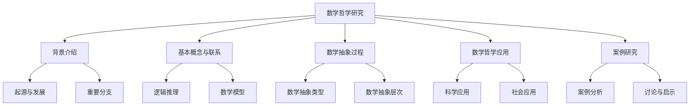

                 

# 数学哲学：思维方式的数学抽象

> 关键词：数学哲学、思维方式、数学抽象、逻辑推理、哲学思维

> 摘要：本文以数学哲学为主题，深入探讨数学哲学的起源与发展，基本概念及其哲学意义，以及数学抽象在哲学思维中的应用。通过对数学哲学的全面解析，揭示数学哲学在科学探索、教育改革和决策理论等领域的实际应用，展望数学哲学的未来发展趋势，并针对具体案例进行分析，以期为读者提供对数学哲学的深刻理解和实际应用的启示。

## 第一部分：数学哲学概述

### 第1章：数学哲学的起源与发展

#### 1.1 数学哲学的起源

数学哲学的起源可以追溯到古代文明。古埃及与巴比伦是数学发展的早期摇篮，他们的数学成就为后来的数学哲学奠定了基础。在古希腊，数学达到了哲学性的巅峰，欧几里得与亚里士多德是这一时期最具代表性的数学哲学家。

- **1.1.1.1 古埃及与巴比伦的数学**

古埃及的数学主要集中在土地测量和建筑方面，他们发展了包括加减乘除在内的基本算术。巴比伦数学则以其卓越的分数计算和代数方程求解而著称。这些早期的数学成就为数学哲学的萌芽提供了土壤。

- **1.1.1.2 古希腊的数学哲学**

古希腊数学哲学的代表是欧几里得和亚里士多德。欧几里得的《几何原本》奠定了几何学的基础，其公理化的方法对后来的数学哲学产生了深远影响。亚里士多德则在其《工具论》中探讨了逻辑和数学的关系，提出了形式逻辑的初步概念。

#### 1.2 数学哲学的发展

古希腊数学哲学的辉煌之后，数学哲学的发展经历了漫长的过程。在中世纪，阿拉伯数学家和欧洲的数学家继续拓展了数学的边界。到了近代，随着数学的快速发展，数学哲学也迎来了新的机遇和挑战。

- **1.2.1 希腊数学哲学的巅峰**

欧几里得和亚里士多德是古希腊数学哲学的巅峰。欧几里得的《几何原本》不仅是一部数学经典，也是哲学思考的杰作。亚里士多德则通过其逻辑学著作，将数学与哲学紧密结合起来。

- **1.2.2 欧氏几何后的数学哲学演变**

在欧氏几何之后，数学哲学经历了多次演变。非欧几何的提出，尤其是罗巴切夫斯基几何和黎曼几何，对数学哲学产生了深远影响，引发了关于空间和维度的新思考。

### 第2章：数学哲学的基本概念

#### 2.1 数学概念的定义

数学哲学中的基本概念包括数、集合、函数和关系等。这些概念不仅是数学的核心，也是哲学思考的对象。

- **2.1.1 数与集合**

数是数学哲学中最基本的概念。从自然数到实数，数学哲学探讨数的本质和它们的哲学意义。集合是另一个基本概念，它代表了元素的组合，是数学抽象的基础。

- **2.1.2 函数与关系**

函数是数学中描述变量之间关系的重要工具。哲学上，函数的概念引发了关于因果关系和变化的深刻思考。关系则是描述元素之间相互作用的工具，包括等价关系、部分关系等。

#### 2.2 数学逻辑

数学逻辑是数学哲学的重要组成部分。它包括演绎推理、归纳推理、证明和反驳等基本方法。

- **2.2.1 逻辑推理的基本规则**

逻辑推理的基本规则包括合取、析取、蕴涵和等价等。这些规则为数学证明提供了基础。

- **2.2.2 数学证明的方法**

数学证明的方法包括构造性证明、非构造性证明、直接证明和反证法等。这些方法揭示了数学逻辑的多样性和深度。

#### 2.3 数学哲学的重要分支

数学哲学的重要分支包括形式逻辑、直觉主义逻辑、实用主义和实证主义等。

- **2.3.1 形式逻辑与直觉主义逻辑**

形式逻辑强调符号化和形式化，而直觉主义逻辑则强调直觉和构造性。这两种逻辑在数学哲学中都有重要地位。

- **2.3.2 实用主义与实证主义**

实用主义强调数学的应用价值，而实证主义则强调数学的客观性和可验证性。这两种观点在数学哲学中引发了深刻的讨论。

## 第二部分：思维方式的数学抽象

### 第3章：数学抽象的过程

#### 3.1 数学抽象的概念

数学抽象是将现实问题转化为数学模型的过程。这一过程不仅涉及数学概念的应用，还包括对现实世界的抽象和理解。

- **3.1.1 数学抽象的起源与意义**

数学抽象的起源可以追溯到古代数学家的实践，他们在解决实际问题时，逐渐形成了对数学概念的理解和应用。数学抽象的意义在于，它使得我们可以用简洁、精确的数学语言描述复杂的问题。

- **3.1.2 数学抽象的基本方法**

数学抽象的基本方法包括离散化、连续化、模型化和形式化等。这些方法帮助我们构建数学模型，以解决现实问题。

#### 3.2 数学抽象的类型

数学抽象可以分为不同类型，包括实数抽象、向量空间抽象等。

- **3.2.1 实数抽象**

实数抽象是将现实中的量度转化为数学上的实数。这种抽象在物理学和经济学等领域有广泛应用。

- **3.2.2 向量空间抽象**

向量空间抽象是将现实中的向量转化为数学上的向量空间。这种抽象在物理学、工程学和计算机科学等领域有广泛应用。

#### 3.3 数学抽象的层次

数学抽象可以分为不同层次，包括初等数学抽象和高等数学抽象。

- **3.3.1 初等数学抽象**

初等数学抽象包括自然数、整数、分数、实数等。这些抽象是数学研究的基础。

- **3.3.2 高等数学抽象**

高等数学抽象包括微积分、线性代数、复分析等。这些抽象是现代数学研究的重要工具。

### 第4章：数学抽象与哲学思维

#### 4.1 哲学思维与数学抽象的联系

哲学思维和数学抽象之间存在密切的联系。哲学思维提供了对现实世界的理解，而数学抽象则将这种理解转化为数学模型。

- **4.1.1 哲学思维对数学抽象的启示**

哲学思维启示我们如何抽象现实世界，如何在数学模型中捕捉现实问题的本质。

- **4.1.2 数学抽象对哲学思维的影响**

数学抽象影响哲学思维的方式包括：提供新的分析工具、挑战传统的哲学观点、推动新的哲学思考等。

#### 4.2 数学抽象的哲学价值

数学抽象在哲学上具有重要的价值。它不仅帮助我们理解现实世界，还促进了哲学的发展。

- **4.2.1 数学抽象在科学探索中的作用**

数学抽象在科学探索中发挥了重要作用，它使得我们可以用精确的数学语言描述科学现象，推动科学的进步。

- **4.2.2 数学抽象在哲学分析中的应用**

数学抽象在哲学分析中也有广泛应用，它帮助我们分析哲学问题，提出新的哲学观点。

## 第三部分：数学哲学在当代的应用

### 第5章：数学哲学在科学领域的应用

#### 5.1 数学哲学在物理学中的应用

数学哲学在物理学中发挥了重要作用。例如，在量子物理学中，数学抽象帮助我们理解微观世界的规律。另外，广义相对论中的数学模型，如黎曼几何，展示了数学在描述时空结构中的价值。

#### 5.2 数学哲学在计算机科学中的应用

数学哲学在计算机科学中的应用同样广泛。例如，在算法设计中，数学抽象帮助我们分析算法的复杂度，优化算法性能。此外，形式逻辑在计算机验证和形式化验证中扮演了关键角色。

### 第6章：数学哲学在社会领域的应用

#### 5.1 数学哲学在教育改革中的应用

数学哲学在教育改革中具有重要地位。例如，通过数学哲学的思考，我们可以重新审视数学教育的目标和内容，推动数学教育方法的创新。

#### 5.2 数学哲学在决策理论中的应用

数学哲学在决策理论中也有广泛应用。通过数学抽象，我们可以建立决策模型，优化决策过程，提高决策的准确性和效率。

### 第7章：数学哲学的未来展望

#### 6.1 数学哲学的发展趋势

数学哲学的未来发展将面临新的挑战和机遇。随着计算机科学和人工智能的发展，数学哲学将融入更多的交叉学科，推动新的哲学思考。

#### 6.2 数学哲学在教育中的角色

数学哲学在教育中将继续扮演重要角色。通过数学哲学的教育，我们可以培养学生的批判性思维和创新能力，推动数学教育的深入发展。

## 数学哲学案例研究

### 第8章：数学哲学案例研究一

#### 8.1 案例背景介绍

本案例研究以某公司决策过程为例，探讨数学哲学在决策理论中的应用。

#### 8.2 数学哲学在案例中的应用

在本案例中，数学哲学帮助公司建立了决策模型，通过数学抽象分析各种决策因素，优化决策过程。

#### 8.3 案例分析与讨论

通过对案例的分析，我们可以看到数学哲学在现实决策中的重要作用。数学抽象帮助我们清晰地区分决策因素，提供了一种科学的决策方法。

### 第9章：数学哲学案例研究二

#### 9.1 案例背景介绍

本案例研究以某工程项目的规划为例，探讨数学哲学在工程学中的应用。

#### 9.2 数学哲学在案例中的应用

在本案例中，数学哲学帮助工程师建立了项目规划模型，通过数学抽象优化项目进度和资源分配。

#### 9.3 案例分析与讨论

通过对案例的分析，我们可以看到数学哲学在工程学中的价值。数学抽象帮助工程师提高项目效率，降低成本，实现项目的顺利实施。

## 附录

### 附录 A：数学哲学资源与工具

#### A.1 数学哲学相关书籍推荐

- 《数学哲学基础》（Aristotle）
- 《几何原本》（Euclid）
- 《数学哲学导论》（William Branker）

#### A.2 数学哲学研究资源

- 《数学哲学》（Stanford Encyclopedia of Philosophy）
- 《数学哲学研究报告》（Mathematical Association of America）

#### A.3 数学哲学工具与软件

- Mathematica
- MATLAB
- R语言

### 附录 B：数学哲学流程图

#### B.1 数学哲学流程图

作者：AI天才研究院/AI Genius Institute & 禅与计算机程序设计艺术 /Zen And The Art of Computer Programming

---

## 1.1 数学哲学的起源

### 1.1.1 古代数学哲学的萌芽

数学哲学的萌芽可以追溯到古代文明，特别是古埃及与巴比伦的数学成就。古埃及的数学主要集中在土地测量和建筑方面，他们发展了包括加减乘除在内的基本算术。巴比伦数学则以其卓越的分数计算和代数方程求解而著称。这些早期的数学成就为数学哲学的萌芽提供了土壤。

在古希腊，数学哲学达到了哲学性的巅峰。欧几里得和亚里士多德是这一时期最具代表性的数学哲学家。欧几里得的《几何原本》奠定了几何学的基础，其公理化的方法对后来的数学哲学产生了深远影响。亚里士多德则在其《工具论》中探讨了逻辑和数学的关系，提出了形式逻辑的初步概念。

### 1.1.2 欧氏几何后的数学哲学演变

欧氏几何后的数学哲学经历了多次演变。在公元后的几个世纪里，阿拉伯数学家和欧洲的数学家继续拓展了数学的边界。特别是在中世纪，阿拉伯数学家对数学的发展做出了重要贡献，如花拉子米对代数的研究和对印度数字系统的传播。

到了近代，随着数学的快速发展，数学哲学也迎来了新的机遇和挑战。特别是在17世纪的科学革命中，数学与自然科学的结合推动了数学哲学的发展。牛顿和莱布尼茨的微积分理论不仅改变了数学的面貌，也为数学哲学提供了新的研究课题。

### 1.1.3 古希腊数学哲学的巅峰

古希腊数学哲学的巅峰时期主要集中在公元前5世纪至公元前3世纪之间。这一时期的数学哲学家不仅研究数学本身，还探讨了数学与现实世界的关系，以及数学在哲学思考中的地位。

- **欧几里得与《几何原本》**

欧几里得是古希腊最著名的数学家之一，被誉为“几何之父”。他的代表作《几何原本》是一部系统性的几何学著作，它不仅包含了大量的几何定理，还提出了公理化的方法。这种方法对后来的数学哲学产生了深远的影响，被认为是数学哲学发展的重要里程碑。

- **亚里士多德与数学哲学**

亚里士多德是古希腊哲学的集大成者，他在《工具论》中对逻辑学进行了深入研究，并提出了一些关于数学的基本观点。亚里士多德认为数学是一种形式的科学，它通过对实体的抽象来揭示事物的本质。他的观点对后来的数学哲学产生了深远的影响，特别是关于数学与现实世界关系的讨论。

### 1.1.4 数学哲学的核心问题

在古希腊数学哲学的基础上，数学哲学的核心问题逐渐浮现。这些问题包括：

- **数学与现实的关系**

数学哲学探讨的一个核心问题是数学与现实世界的联系。数学是现实的抽象吗？还是数学有其独立的存在？这一问题的讨论影响了数学哲学的发展。

- **数学基础的可靠性**

另一个核心问题是数学基础的可靠性。欧几里得的《几何原本》提出了公理化的方法，但后来发现了几个公理之间存在不一致性。这些问题引发了关于数学基础可靠性的深入讨论。

- **数学的逻辑性**

数学哲学还探讨了数学的逻辑性。数学是否仅仅是一个逻辑系统，还是它有自己的实质性内容？这一问题涉及到数学的本质和数学哲学的基本原则。

## 2.1 数学概念的定义

### 2.1.1 数与集合

数是数学哲学中最基本的概念之一。从自然数到实数，数学哲学探讨了数的本质和它们的哲学意义。

- **自然数与实数的定义**

自然数是离散的、可以计数的数。它们是数学哲学讨论的基础。实数则是连续的、可以测量的数，它们包括了自然数和分数。实数的定义和性质是数学哲学研究的重要内容。

- **集合的基本概念**

集合是数学哲学中的另一个基本概念。它代表了元素的组合，是数学抽象的基础。集合可以是具体的，如{1, 2, 3}，也可以是抽象的，如所有自然数的集合。集合的概念在数学和哲学中都有广泛应用。

### 2.1.2 函数与关系

函数是数学中描述变量之间关系的重要工具。哲学上，函数的概念引发了关于因果关系和变化的深刻思考。

- **函数的定义与性质**

函数是一种特殊的关系，它将一个集合（定义域）中的每个元素映射到另一个集合（值域）中的唯一元素。函数的定义和性质是数学哲学研究的重要内容。例如，连续函数和可微函数在数学分析中具有重要地位。

- **关系的分类与性质**

关系是描述元素之间相互作用的工具。它们可以是等价关系、部分关系、蕴涵关系等。关系的分类和性质是数学哲学研究的基础。例如，等价关系在集合论中具有重要地位，而蕴涵关系在逻辑学中起着关键作用。

## 2.2 数学逻辑

### 2.2.1 逻辑推理的基本规则

逻辑推理是数学哲学的重要组成部分。它包括演绎推理、归纳推理、证明和反驳等基本方法。

- **演绎推理与归纳推理**

演绎推理是从一般到特殊的推理方法，它基于已知的前提，得出必然的结论。例如，所有的人都会死亡，苏格拉底是人，因此苏格拉底会死亡。归纳推理则是从特殊到一般的推理方法，它基于已知的事实，得出可能的结论。例如，所有的天鹅都是白色的，观察到一群天鹅都是白色的，因此推断所有的天鹅都是白色的。

- **证明与反驳**

证明是逻辑推理的一种形式，它通过一系列的逻辑步骤，从已知的前提得出结论。反驳则是证明的逆过程，它通过找出前提中的错误或矛盾，证明结论的不成立。

### 2.2.2 数学证明的方法

数学证明的方法包括构造性证明、非构造性证明、直接证明和反证法等。

- **构造性证明与非构造性证明**

构造性证明是通过构造一个具体的例子来证明某个结论。例如，证明存在一个实数x，使得x^2 = 2。非构造性证明则是不通过具体构造，而是通过逻辑推理证明结论。例如，证明对于所有的实数x，x^2 ≥ 0。

- **直接证明与反证法**

直接证明是通过一系列的逻辑步骤，直接从已知的前提得出结论。例如，证明对于所有的实数x和y，x + y = y + x。反证法则是通过假设结论不成立，然后找出矛盾来证明结论成立。例如，证明一个数如果既是2的倍数又是3的倍数，那么它一定是6的倍数。

### 2.3 数学哲学的重要分支

数学哲学的重要分支包括形式逻辑、直觉主义逻辑、实用主义和实证主义等。

- **形式逻辑与直觉主义逻辑**

形式逻辑强调符号化和形式化，它通过符号系统来表达逻辑推理。直觉主义逻辑则强调构造性和直觉性，它要求证明过程必须是构造性的。形式逻辑和直觉主义逻辑在数学哲学中都有重要的地位。

- **实用主义与实证主义**

实用主义强调数学的应用价值，它认为数学的价值在于解决实际问题的能力。实证主义则强调数学的客观性和可验证性，它认为数学的真理是通过实验和观察验证的。实用主义和实证主义在数学哲学中引发了深刻的讨论。

## 3.1 数学抽象的概念

### 3.1.1 数学抽象的起源与意义

数学抽象是将现实问题转化为数学模型的过程。这一过程不仅涉及数学概念的应用，还包括对现实世界的抽象和理解。

- **数学抽象的起源**

数学抽象的起源可以追溯到古代数学家的实践。在解决实际问题的过程中，数学家们逐渐形成了对数学概念的理解和应用。例如，古代数学家通过研究土地测量和建筑问题，发展了算术和几何。

- **数学抽象的意义**

数学抽象的意义在于，它使得我们可以用简洁、精确的数学语言描述复杂的问题。数学抽象不仅提高了我们的思维能力，还促进了数学和自然科学的发展。例如，微积分的抽象使得我们可以描述和分析动态系统。

### 3.1.2 数学抽象的基本方法

数学抽象的基本方法包括离散化、连续化、模型化和形式化等。

- **离散化**

离散化是将连续的物理过程转化为离散的数学模型。例如，在计算机科学中，我们经常使用离散数学来处理数据结构和算法。

- **连续化**

连续化是将离散的数学模型转化为连续的物理过程。例如，微积分就是将离散的差分方程转化为连续的微分方程。

- **模型化**

模型化是将现实问题转化为数学模型的过程。例如，在经济学中，我们可以使用供求模型来分析市场行为。

- **形式化**

形式化是将数学表达为符号化的语言。例如，形式逻辑就是将逻辑推理表达为符号化的形式。

### 3.1.3 数学抽象的类型

数学抽象可以分为不同类型，包括实数抽象、向量空间抽象等。

- **实数抽象**

实数抽象是将现实中的量度转化为数学上的实数。这种抽象在物理学和经济学等领域有广泛应用。例如，物理学中的长度、时间和质量等都可以用实数来表示。

- **向量空间抽象**

向量空间抽象是将现实中的向量转化为数学上的向量空间。这种抽象在物理学、工程学和计算机科学等领域有广泛应用。例如，物理学中的力和速度等都可以用向量空间来表示。

### 3.1.4 数学抽象的层次

数学抽象可以分为不同层次，包括初等数学抽象和高等数学抽象。

- **初等数学抽象**

初等数学抽象包括自然数、整数、分数、实数等。这些抽象是数学研究的基础，它们可以帮助我们解决实际问题。例如，在经济学中，我们可以使用实数来表示价格和数量。

- **高等数学抽象**

高等数学抽象包括微积分、线性代数、复分析等。这些抽象是现代数学研究的重要工具，它们可以帮助我们解决更复杂的实际问题。例如，在物理学中，我们可以使用微积分来描述物理系统的动态变化。

## 3.2 数学抽象的类型

### 3.2.1 实数抽象

实数抽象是将现实中的量度转化为数学上的实数。这种抽象在物理学和经济学等领域有广泛应用。

- **实数的定义**

实数包括有理数和无理数。有理数是可以表示为两个整数之比的数，例如1/2和3/4。无理数是不能表示为两个整数之比的数，例如π和√2。

- **实数的性质**

实数具有顺序性、完备性和连续性等性质。顺序性是指实数可以按大小排序。完备性是指实数集合是封闭的，即对于任意一个实数，都存在一个更小的实数和一个更大的实数。连续性是指实数之间没有空隙，即任意两个实数之间都存在一个实数。

### 3.2.2 向量空间抽象

向量空间抽象是将现实中的向量转化为数学上的向量空间。这种抽象在物理学、工程学和计算机科学等领域有广泛应用。

- **向量的定义**

向量是一个具有大小和方向的量。在数学上，向量通常表示为一个有序数组，例如(a, b, c)。

- **向量空间的定义**

向量空间是一组向量的集合，这些向量可以按线性运算进行加法和标量乘法。向量空间具有封闭性、交换性、结合性和分配性等性质。

### 3.2.3 其他类型的数学抽象

除了实数抽象和向量空间抽象，数学还有其他类型的抽象，如集合抽象、函数抽象和关系抽象等。

- **集合抽象**

集合抽象是将现实世界中的元素组合转化为数学上的集合。集合是由元素组成的无序集，集合中的元素可以是数、对象或概念。

- **函数抽象**

函数抽象是将现实世界中的变量关系转化为数学上的函数。函数是一种特殊的关系，它将一个集合中的每个元素映射到另一个集合中的唯一元素。

- **关系抽象**

关系抽象是将现实世界中的相互作用转化为数学上的关系。关系可以是等价关系、部分关系、蕴涵关系等。

### 3.2.4 数学抽象的应用领域

数学抽象的应用领域非常广泛，包括物理学、经济学、工程学、计算机科学等。

- **物理学中的应用**

在物理学中，数学抽象帮助我们描述物理现象，如使用向量空间描述力的作用，使用实数描述时间和长度等。

- **经济学中的应用**

在经济学中，数学抽象帮助我们分析市场行为，如使用供求模型描述市场价格的变化，使用优化模型描述资源分配等。

- **工程学中的应用**

在工程学中，数学抽象帮助我们设计结构和系统，如使用微积分分析结构力学，使用线性代数分析电路系统等。

- **计算机科学中的应用**

在计算机科学中，数学抽象帮助我们构建算法和数据结构，如使用离散数学分析算法复杂度，使用图论分析网络结构等。

## 3.3 数学抽象的层次

### 3.3.1 初等数学抽象

初等数学抽象包括自然数、整数、分数、实数等。这些抽象是数学研究的基础，它们可以帮助我们解决实际问题。

- **自然数的定义**

自然数是用来计数的数，如1、2、3等。自然数具有顺序性和可加性等性质。

- **整数的定义**

整数包括自然数、0和它们的相反数。整数具有顺序性、可加性和可乘性等性质。

- **分数的定义**

分数是两个整数的比，如1/2、3/4等。分数可以表示部分或整体的一部分。

- **实数的定义**

实数包括有理数和无理数。有理数是可以表示为两个整数之比的数，无理数是不能表示为两个整数之比的数。实数具有顺序性、完备性和连续性等性质。

### 3.3.2 高等数学抽象

高等数学抽象包括微积分、线性代数、复分析等。这些抽象是现代数学研究的重要工具，它们可以帮助我们解决更复杂的实际问题。

- **微积分的定义**

微积分是研究函数变化率的数学分支。它包括微分和积分两个部分。微分研究函数在某一点的局部变化率，积分研究函数在某一区间上的累积变化量。

- **线性代数的定义**

线性代数是研究向量空间和线性变换的数学分支。它包括矩阵运算、向量空间的基础定理、特征值和特征向量等。

- **复分析的定义**

复分析是研究复数的性质和应用的数学分支。它包括复数的代数和几何性质、解析函数、残数定理等。

### 3.3.3 数学抽象的层次关系

初等数学抽象是高等数学抽象的基础，高等数学抽象是在初等数学抽象的基础上发展起来的。例如，微积分中的连续性、导数和积分等概念都是基于实数的性质和运算。

- **层次关系**

初等数学抽象：自然数、整数、分数、实数

高等数学抽象：微积分、线性代数、复分析

### 3.3.4 数学抽象在解决问题中的应用

数学抽象在不同领域有不同的应用，但它们都遵循从具体到抽象、从特殊到一般的规律。

- **在物理学中的应用**

在物理学中，数学抽象帮助我们描述和预测物理现象。例如，使用微积分描述物理系统的动态变化，使用线性代数分析量子力学中的态叠加。

- **在经济学中的应用**

在经济学中，数学抽象帮助我们分析市场行为和优化资源分配。例如，使用微积分分析市场供需，使用线性代数分析多变量经济模型。

- **在工程学中的应用**

在工程学中，数学抽象帮助我们设计和优化工程系统。例如，使用微积分分析结构力学，使用线性代数分析电路系统。

- **在计算机科学中的应用**

在计算机科学中，数学抽象帮助我们构建算法和数据结构。例如，使用离散数学分析算法复杂度，使用图论分析网络结构。

### 3.3.5 数学抽象的发展趋势

随着科学技术的进步，数学抽象也在不断发展。未来数学抽象的发展趋势可能包括：

- **更复杂的数学抽象**

随着计算机科学和人工智能的发展，我们需要更复杂的数学抽象来描述和解决复杂问题。

- **跨学科的数学抽象**

数学抽象将继续与其他学科交叉融合，形成新的数学分支和应用领域。

- **可视化数学抽象**

随着可视化技术的发展，数学抽象将更加直观，帮助我们更好地理解和应用数学。

### 3.3.6 数学抽象的哲学意义

数学抽象不仅是数学的工具，也具有哲学意义。

- **本质与现象**

数学抽象帮助我们揭示事物的本质，而不仅仅是现象。例如，微积分抽象了物理现象的连续性和变化率。

- **逻辑与结构**

数学抽象强调了逻辑和结构的重要性。数学模型的结构和逻辑关系可以帮助我们理解和解决问题。

- **思维与方法**

数学抽象培养了我们的抽象思维和问题解决能力，这些能力在哲学思考中同样重要。

### 3.3.7 数学抽象的挑战与展望

数学抽象在发展中面临一些挑战：

- **复杂性与抽象度**

随着问题的复杂性增加，数学抽象的抽象度也需要提高，这可能导致理解和应用的难度增加。

- **跨学科合作**

数学抽象需要与其他学科进行更深入的跨学科合作，以解决复杂问题。

- **人工智能与数学抽象**

人工智能的发展为数学抽象带来了新的机遇和挑战。例如，机器学习算法需要更复杂的数学抽象来描述和优化。

未来，数学抽象将继续发展，并在科学、技术和哲学中发挥重要作用。

## 4.1 哲学思维与数学抽象的联系

### 4.1.1 哲学思维对数学抽象的启示

哲学思维对数学抽象有着重要的启示作用。哲学思维强调对现实世界的本质和逻辑关系的深刻理解，这为数学抽象提供了理论基础和指导原则。

- **本质的理解**

哲学思维关注事物的本质和内在规律，这启示我们在数学抽象过程中，不仅要关注表面现象，还要深入挖掘问题的本质。例如，在建立数学模型时，我们不仅要关注数据的具体值，还要理解数据的分布规律和内在联系。

- **逻辑关系的把握**

哲学思维强调逻辑推理和辩证分析，这为数学抽象提供了重要的方法。在数学抽象过程中，我们需要运用逻辑推理来建立概念之间的关系，并通过辩证分析来验证和优化数学模型。例如，在建立函数关系时，我们不仅需要理解变量之间的因果关系，还要考虑它们的相互作用和影响。

### 4.1.2 数学抽象对哲学思维的影响

数学抽象不仅受到哲学思维的启示，同时也对哲学思维产生了重要影响。

- **哲学问题的数学化**

数学抽象将哲学问题转化为数学模型，使得哲学问题具有了更加具体和精确的表达方式。例如，在伦理学中，我们可以使用博弈论来分析道德决策的合理性；在认识论中，我们可以使用概率论来探讨知识的可靠性和确定性。

- **哲学思考的工具化**

数学抽象为哲学思考提供了新的工具和方法。例如，形式逻辑和数学证明方法使得哲学论证更加严谨和科学；数学模型和算法使得哲学分析更加具体和可操作。

### 4.1.3 数学抽象在哲学分析中的应用

数学抽象在哲学分析中具有广泛的应用，以下是一些具体的例子：

- **伦理学的数学化**

在伦理学中，数学抽象可以帮助我们分析道德决策的合理性。例如，通过建立道德博弈模型，我们可以探讨不同道德选择的结果和影响，从而为道德决策提供依据。

- **认识论的数学化**

在认识论中，数学抽象可以帮助我们探讨知识的可靠性和确定性。例如，通过概率论和统计学的方法，我们可以评估观察数据的可靠性和结论的可信度。

- **形而上学的数学化**

在形而上学中，数学抽象可以帮助我们探讨存在的本质和宇宙的结构。例如，通过拓扑学和集合论的方法，我们可以探讨存在的基本性质和宇宙的无限性。

### 4.1.4 数学抽象在哲学分析中的优势

数学抽象在哲学分析中具有以下优势：

- **精确性**

数学抽象提供了精确的描述和分析工具，使得哲学问题具有了更清晰和精确的表达。例如，通过数学模型和公式，我们可以对复杂的现象进行定量分析和预测。

- **严谨性**

数学抽象依赖于逻辑推理和证明方法，使得哲学分析更加严谨和科学。例如，形式逻辑和数学证明方法可以帮助我们避免逻辑错误和谬误。

- **普遍性**

数学抽象具有普遍适用性，可以在不同领域和不同情境下应用。例如，微积分和线性代数的方法不仅适用于自然科学，也适用于社会科学和人文科学。

### 4.1.5 数学抽象在哲学分析中的挑战

尽管数学抽象在哲学分析中具有许多优势，但也面临一些挑战：

- **抽象与现实的关系**

数学抽象往往是对现实世界的简化，如何确保数学抽象能够准确地反映现实，这是一个重要问题。

- **数学工具的选择**

在哲学分析中，选择适当的数学工具和方法至关重要。不同数学工具和方法可能导致不同的分析结果，如何选择合适的工具和方法是一个挑战。

- **数学模型的限制**

数学模型往往有其局限性，如何克服这些限制，使得数学模型能够更准确地反映现实，这是一个持续的研究课题。

## 4.2 数学抽象的哲学价值

### 4.2.1 数学抽象在科学探索中的作用

数学抽象在科学探索中具有重要作用，它为科学研究提供了强有力的工具和方法。

- **描述自然现象**

数学抽象使得我们可以用简洁、精确的数学语言描述自然现象。例如，物理学中的运动定律、电磁学中的电磁场方程、生物学中的种群模型等，都是通过数学抽象来描述和研究自然现象的。

- **预测未来趋势**

数学抽象可以帮助我们预测未来的发展趋势。例如，在经济学中，我们可以使用数学模型预测市场供需、股票价格等；在气象学中，我们可以使用数学模型预测天气变化、气候变化等。

- **优化决策过程**

数学抽象在决策过程中也发挥着重要作用。通过建立数学模型，我们可以分析不同决策方案的结果和影响，从而优化决策过程。例如，在资源分配、生产规划、项目管理等领域，数学抽象可以帮助我们找到最优解决方案。

### 4.2.2 数学抽象在哲学分析中的应用

数学抽象不仅在科学探索中具有重要作用，也在哲学分析中得到了广泛应用。

- **分析道德决策**

在伦理学中，数学抽象可以帮助我们分析道德决策的合理性和可行性。例如，通过建立道德博弈模型，我们可以探讨不同道德选择的结果和影响，从而为道德决策提供依据。

- **探讨知识可靠性**

在认识论中，数学抽象可以帮助我们探讨知识的可靠性和确定性。例如，通过概率论和统计学的方法，我们可以评估观察数据的可靠性和结论的可信度。

- **分析社会现象**

在政治哲学和社会学中，数学抽象可以帮助我们分析社会现象和社会结构。例如，通过建立社会网络模型，我们可以探讨社会关系、权力结构和传播过程。

### 4.2.3 数学抽象的哲学意义

数学抽象不仅是一种科学方法，也具有深刻的哲学意义。

- **本质与现象**

数学抽象帮助我们揭示事物的本质，而不仅仅是现象。例如，微积分抽象了物理现象的连续性和变化率，揭示了物体运动的基本规律。

- **逻辑与结构**

数学抽象强调了逻辑和结构的重要性。数学模型的结构和逻辑关系可以帮助我们理解和解决问题。例如，形式逻辑和数学证明方法使得哲学论证更加严谨和科学。

- **抽象思维**

数学抽象培养了我们的抽象思维能力。通过数学抽象，我们可以从具体的、个别的现象中提炼出普遍的规律和原则，从而提高我们的思维能力。

### 4.2.4 数学抽象在哲学思考中的优势

数学抽象在哲学思考中具有以下优势：

- **精确性**

数学抽象提供了精确的描述和分析工具，使得哲学问题具有了更清晰和精确的表达。例如，通过数学模型和公式，我们可以对复杂的现象进行定量分析和预测。

- **严谨性**

数学抽象依赖于逻辑推理和证明方法，使得哲学分析更加严谨和科学。例如，形式逻辑和数学证明方法可以帮助我们避免逻辑错误和谬误。

- **普遍性**

数学抽象具有普遍适用性，可以在不同领域和不同情境下应用。例如，微积分和线性代数的方法不仅适用于自然科学，也适用于社会科学和人文科学。

### 4.2.5 数学抽象的局限性

尽管数学抽象在哲学思考中具有许多优势，但也存在一些局限性。

- **抽象与现实的关系**

数学抽象往往是对现实世界的简化，如何确保数学抽象能够准确地反映现实，这是一个重要问题。

- **数学工具的选择**

在哲学分析中，选择适当的数学工具和方法至关重要。不同数学工具和方法可能导致不同的分析结果，如何选择合适的工具和方法是一个挑战。

- **数学模型的限制**

数学模型往往有其局限性，如何克服这些限制，使得数学模型能够更准确地反映现实，这是一个持续的研究课题。

### 4.2.6 数学抽象的未来发展

随着科学技术的进步，数学抽象在未来将继续发展，并在哲学思考中发挥更大的作用。

- **更复杂的数学抽象**

随着问题的复杂性增加，数学抽象的抽象度也需要提高，这可能导致数学模型的复杂性和精确性提高。

- **跨学科的数学抽象**

数学抽象将继续与其他学科交叉融合，形成新的数学分支和应用领域。例如，计算机科学、人工智能和认知科学的结合，可能会产生新的数学抽象方法。

- **可视化数学抽象**

随着可视化技术的发展，数学抽象将更加直观，帮助我们更好地理解和应用数学。

### 4.2.7 数学抽象在哲学思考中的挑战

尽管数学抽象在哲学思考中具有许多优势，但也面临一些挑战。

- **抽象与现实的关系**

如何确保数学抽象能够准确地反映现实，这是一个重要问题。特别是在哲学思考中，抽象与现实的关系更加复杂和微妙。

- **数学工具的选择**

如何选择合适的数学工具和方法，使得数学抽象能够有效地解决哲学问题，这是一个挑战。

- **数学模型的限制**

如何克服数学模型的局限性，使得数学模型能够更准确地反映现实，这是一个持续的研究课题。

## 5.1 数学哲学在科学领域的应用

### 5.1.1 数学哲学在物理学中的应用

数学哲学在物理学中具有深远的应用，它不仅为物理学的发展提供了理论基础，还在理解和解释物理现象方面发挥了关键作用。

- **经典力学中的数学抽象**

在经典力学中，数学哲学的应用体现在对运动规律的抽象和数学描述。牛顿的运动定律是经典力学的核心，它们通过数学公式精确地描述了物体的运动状态。这一过程中，数学哲学的思想，如公理化和形式化，帮助物理学家将物理现象转化为数学问题，使得力学理论更加严谨和精确。

- **量子力学中的数学抽象**

量子力学引入了全新的数学抽象，如希尔伯特空间和算符理论。这些数学工具不仅帮助物理学家描述量子现象，还揭示了微观世界的本质。量子力学的数学抽象挑战了传统物理学的基本假设，推动了数学哲学的深入探讨，如量子逻辑和量子概率论。

- **相对论中的数学抽象**

广义相对论中的数学抽象是黎曼几何，它描述了时空的弯曲。这一抽象不仅改变了我们对宇宙的理解，还推动了数学哲学的思考，如时空的客观性和几何学的哲学意义。数学哲学在广义相对论中的应用，使得我们对宇宙的结构和演化有了更深刻的认识。

### 5.1.2 数学哲学在计算机科学中的应用

数学哲学在计算机科学中扮演了不可或缺的角色，它为算法设计、数据结构、计算机验证和人工智能等领域提供了理论基础。

- **算法设计与分析**

计算机科学中的算法设计离不开数学哲学的指导。算法的复杂度分析是通过数学方法来评估算法的性能，这一过程依赖于数学哲学中的概念，如大O符号法和复杂性理论。这些理论帮助计算机科学家理解和优化算法。

- **形式化验证**

形式化验证是确保软件和硬件系统正确性的重要方法，它依赖于数学哲学中的逻辑和证明方法。形式逻辑和证明论为形式化验证提供了基础，使得我们可以通过严格的数学推理来验证系统的正确性。

- **人工智能中的数学抽象**

人工智能的发展离不开数学哲学的抽象方法。机器学习中的算法和模型是基于概率论和统计学的方法，这些方法通过数学抽象来处理数据和模式识别问题。数学哲学在人工智能中的应用，使得我们可以通过数学方法来模拟和优化智能行为。

### 5.1.3 数学哲学在生物学中的应用

数学哲学在生物学中的应用日益广泛，它帮助我们理解生命现象和生物系统的运作。

- **人口生态学中的数学抽象**

在人口生态学中，数学模型被用来描述和预测种群动态。这些模型通过数学抽象，如微分方程和代数方程，描述了种群增长、竞争和捕食等生态过程。数学哲学的思想，如模型简化和方法论，帮助生物学家从复杂的生态系统中提取关键信息。

- **分子生物学中的数学抽象**

在分子生物学中，数学抽象帮助我们理解基因表达、蛋白质合成和代谢途径等生物学过程。例如，通过建立概率模型和统计方法，我们可以分析基因序列和蛋白质结构，从而揭示生物分子的功能和相互作用。

- **神经科学中的数学抽象**

神经科学中的数学哲学应用体现在对神经网络和大脑活动的研究。通过数学模型和计算方法，我们可以模拟神经元的电活动，分析神经网络的信息处理能力，甚至尝试解释意识的形成。

### 5.1.4 数学哲学在化学中的应用

数学哲学在化学中也有重要应用，它帮助我们理解化学反应的动力学和热力学性质。

- **化学反应动力学**

在化学反应动力学中，数学模型被用来描述反应速率和反应路径。这些模型通过数学抽象，如差分方程和积分方程，帮助我们预测反应的动态行为。数学哲学的思想，如抽象化和形式化，使得我们可以从理论上理解化学反应的复杂过程。

- **热力学与相变**

在热力学中，数学模型被用来描述物质的状态和相变过程。例如，相变理论中的自由能函数和相场模型，通过数学抽象帮助我们理解物质的相变行为。数学哲学的思想，如对称性和守恒定律，为这些模型提供了深刻的哲学基础。

### 5.1.5 数学哲学在其他科学领域中的应用

数学哲学在其他科学领域，如地球科学、环境科学和天文学等，也有广泛应用。

- **地球科学**

在地球科学中，数学模型被用来描述地质过程和自然灾害。例如，地震波传播模型和地质流变学模型，通过数学抽象帮助我们理解地球内部的动态结构。

- **环境科学**

在环境科学中，数学模型被用来模拟生态系统和气候变化。这些模型通过数学抽象，如差分方程和积分方程，帮助我们预测环境变化的影响和应对策略。

- **天文学**

在天文学中，数学模型被用来描述天体的运动和宇宙的结构。例如，引力波探测和宇宙膨胀模型，通过数学抽象帮助我们理解宇宙的起源和演化。

### 5.1.6 数学哲学在科学探索中的重要性

数学哲学在科学探索中具有重要的地位。它不仅为科学理论提供了基础，还在科学方法和科学思想的形成中发挥了关键作用。

- **科学理论的建立**

科学理论是通过抽象和建模来揭示自然现象的本质。数学哲学的思想，如公理化和模型论，为科学理论的建立提供了方法论支持。通过数学抽象，我们可以从复杂的现象中提取关键信息，建立简明的科学理论。

- **科学方法的改进**

数学哲学的思想，如实证主义和理性主义，推动了科学方法的改进。通过数学模型和计算方法，我们可以更加精确和系统地研究自然现象，从而提高科学方法的可靠性和有效性。

- **科学思想的创新**

数学哲学的抽象方法激发了科学思想的创新。例如，哥德尔的不完备性定理和量子力学的非决定性原理，都是数学哲学在科学思想上的突破。这些创新推动了科学的发展，并引发了新的哲学思考。

### 5.1.7 数学哲学在科学探索中的挑战

尽管数学哲学在科学探索中具有重要作用，但也面临一些挑战。

- **抽象与现实的关系**

数学哲学需要解决的一个核心问题是，如何确保抽象与现实之间的关系是准确的。在科学探索中，数学模型往往是对现实世界的简化，如何保证这些简化不会丢失关键信息，是一个重要问题。

- **数学工具的选择**

在科学探索中，选择合适的数学工具和方法至关重要。不同数学工具和方法可能导致不同的科学结果，如何选择合适的工具和方法是一个挑战。

- **数学模型的验证**

数学模型在科学探索中的应用需要验证。如何验证数学模型的准确性和可靠性，是一个重要问题。特别是在复杂系统中，验证数学模型的准确性可能面临巨大的挑战。

## 5.2 数学哲学在社会领域的应用

### 5.2.1 数学哲学在教育改革中的应用

数学哲学在教育改革中的应用具有重要意义，它能够帮助教育者更好地理解和应用数学教育，促进学生的全面发展。

- **教育理念的转变**

数学哲学强调数学的本质和意义，这为教育改革提供了新的理念。通过数学哲学的视角，教育者可以认识到数学不仅仅是工具和技能，更是一种思维方式和文化。这种认识促使教育者从传统的知识传授模式转向更加关注学生思维能力和创新能力的培养。

- **课程设计的优化**

数学哲学对课程设计具有指导作用。通过哲学的思考，教育者可以深入理解数学概念的本质，从而设计更加符合学生认知规律和实际需求的教学内容。例如，数学哲学强调逻辑推理和证明的重要性，这可以在课程设计中得到体现，通过引导学生进行数学探究和证明，培养他们的逻辑思维和解决问题的能力。

- **教学方法的创新**

数学哲学在教育改革中促进了教学方法的创新。哲学思维强调批判性和创造性，这为教学方法的多样化提供了契机。例如，通过引入数学哲学的讨论，学生可以参与到数学问题的探讨中，形成批判性思维和创造性思维。此外，数学哲学还推动了探究式学习和合作学习等教学方法的实施，这些方法有助于培养学生的自主学习和团队合作能力。

- **评价体系的完善**

数学哲学在教育改革中的应用也体现在评价体系的完善上。传统的评价体系往往侧重于知识的掌握和技能的运用，而忽视了学生的思维品质和创新能力的培养。通过数学哲学的视角，评价体系可以更加全面地考虑学生的综合素质，如逻辑推理能力、批判性思维能力、创新能力等。这种评价体系的完善有助于推动学生全面发展。

### 5.2.2 数学哲学在决策理论中的应用

数学哲学在决策理论中的应用日益广泛，它为决策过程提供了理论依据和方法指导。

- **决策模型的设计**

数学哲学为决策模型的设计提供了基础。通过哲学思考，决策者可以明确决策目标、识别决策因素、构建决策模型。例如，通过集合论和关系论，我们可以建立决策因素之间的关系，通过逻辑推理，我们可以推导出最优决策方案。

- **决策分析的方法**

数学哲学在决策分析中具有指导作用。通过形式逻辑和证明方法，决策者可以验证决策模型的逻辑一致性，通过概率论和统计学方法，决策者可以评估决策方案的风险和不确定性。这些方法帮助决策者做出更加科学和理性的决策。

- **决策过程的管理**

数学哲学在决策过程中也起到重要作用。通过哲学思考，决策者可以认识到决策过程是一个动态的、互动的复杂过程，需要综合考虑各种因素和影响。例如，通过博弈论和博弈分析，决策者可以探讨不同决策者的策略和互动，从而优化决策过程。

### 5.2.3 数学哲学在社会科学中的应用

数学哲学在社会科学中的应用具有广泛的前景，它为社会科学研究提供了新的方法和视角。

- **经济学中的应用**

在经济学中，数学哲学的方法可以帮助我们分析市场行为、资源分配和经济增长等问题。例如，通过建立博弈模型，我们可以探讨不同市场参与者之间的策略互动，通过建立优化模型，我们可以分析资源的最优配置问题。数学哲学在经济学中的应用，使得经济学研究更加精确和科学。

- **政治学中的应用**

在政治学中，数学哲学的方法可以帮助我们分析政治现象、政策制定和社会治理等问题。例如，通过建立社会网络模型，我们可以分析不同政治力量之间的关系，通过建立决策模型，我们可以探讨政策制定的最优策略。数学哲学在政治学中的应用，有助于提高政策分析和决策的科学性。

- **心理学中的应用**

在心理学中，数学哲学的方法可以帮助我们分析人类行为、认知过程和心理机制。例如，通过建立概率模型，我们可以分析人类决策和风险偏好，通过建立神经网络模型，我们可以探讨人类认知和学习的机制。数学哲学在心理学中的应用，有助于揭示人类心理和行为的基本规律。

### 5.2.4 数学哲学在社会领域的价值

数学哲学在社会领域的应用具有深远的价值，它不仅丰富了社会科学的理论体系，还推动了社会发展和进步。

- **理论体系的完善**

数学哲学在社会科学中的应用，有助于完善理论体系，推动学科发展。例如，通过数学哲学的分析方法，我们可以更加深入地理解经济现象、社会结构和人类行为，从而丰富和拓展社会科学的理论基础。

- **解决问题的能力**

数学哲学提供了一种科学和理性的解决问题方法，这在社会领域具有重要作用。通过数学哲学的方法，我们可以更加科学和系统地分析社会问题，提出有效的解决方案，推动社会进步和发展。

- **科学精神的培养**

数学哲学强调逻辑推理、证明方法和实证精神，这些精神在社会领域具有重要意义。通过数学哲学的学习和应用，我们可以培养批判性思维、创新精神和实证精神，从而提高社会整体的科学素养和创新能力。

### 5.2.5 数学哲学在社会领域的挑战

尽管数学哲学在社会领域具有广泛应用和价值，但也面临一些挑战。

- **哲学与科学的结合**

数学哲学需要解决的一个核心问题是，如何将哲学与科学有效地结合起来。在社会科学中，哲学的抽象方法和科学的实证方法需要相互融合，以形成更加科学和有效的理论体系。

- **跨学科的合作**

数学哲学在社会领域的应用需要跨学科的合作。社会科学、自然科学和人文科学的融合，可以促进数学哲学的应用和发展。然而，跨学科的合作也面临一些挑战，如不同学科的方法论和视角的差异，如何有效地协调和整合这些差异，是一个重要问题。

- **现实问题的复杂性和多样性**

社会领域的问题复杂且多样，如何确保数学哲学方法能够准确和全面地反映现实，是一个挑战。特别是在复杂社会系统中，问题的多样性和动态性增加了数学哲学应用的难度。

### 5.2.6 数学哲学在社会领域的未来展望

随着科学技术的进步和社会的发展，数学哲学在社会领域的应用前景更加广阔。

- **新的应用领域**

随着社会科学和技术的进步，数学哲学将在更多领域得到应用。例如，在人工智能、大数据分析和社会网络分析等领域，数学哲学的方法和思想将发挥重要作用，推动这些领域的发展。

- **跨学科的融合**

数学哲学在社会领域的未来展望之一是跨学科的融合。通过不同学科的交叉和融合，数学哲学将能够更好地解决复杂社会问题，推动社会进步。

- **哲学与科学的互动**

数学哲学在未来将更加注重与科学界的互动，通过科学研究的反馈，数学哲学将不断改进和发展，形成更加科学和有效的理论体系。

### 5.3 数学哲学的未来展望

#### 6.1 数学哲学的发展趋势

数学哲学在未来将继续发展，其趋势体现在以下几个方面：

- **跨学科融合**

随着学科之间的交叉与融合，数学哲学将与其他学科（如计算机科学、认知科学、生物学等）深入结合，形成新的数学哲学分支。这些交叉领域不仅会带来新的研究课题，还会促使数学哲学方法不断创新。

- **数学抽象的深化**

随着科学技术的发展，我们面临的实际问题越来越复杂。数学哲学将需要更加深入的数学抽象，以应对这些复杂性。例如，在人工智能和大数据分析中，我们需要更加抽象和复杂的数学模型来描述和分析现象。

- **实证主义的兴起**

随着实证方法在科学中的地位日益提高，数学哲学中的实证主义将得到更多关注。通过实证研究，数学哲学家将能够验证和改进数学模型，从而提高数学哲学的理论精确性和实用性。

#### 6.2 数学哲学在教育中的角色

数学哲学在教育中扮演着重要角色，其未来发展体现在以下几个方面：

- **课程整合**

数学哲学将更多地整合到数学教育课程中，帮助学生理解数学的本质和意义。这种整合不仅包括对数学概念和原理的哲学探讨，还包括对数学方法论的哲学分析。

- **教学方法的创新**

数学哲学将推动教学方法的创新，特别是在批判性思维和创新能力的培养方面。通过哲学思考，学生将能够更加深入地理解数学问题，从而提高解决问题的能力。

- **教师培训的加强**

随着数学哲学在教育中的重要性日益增加，教师培训将更加注重数学哲学的内容。通过专业的数学哲学培训，教师将能够更好地传授数学知识和技能，培养学生的数学思维能力。

### 6.3 数学哲学的挑战与机遇

数学哲学在未来将面临一系列挑战和机遇：

- **挑战**

挑战包括如何应对数学抽象的复杂性、如何平衡哲学思考与实证研究的关系、如何解决数学模型与现实世界之间的差距等。

- **机遇**

机遇则在于跨学科合作的深化、人工智能和大数据分析等新兴领域的数学抽象需求增加、教育改革和教师培训的发展等。

通过应对挑战和抓住机遇，数学哲学将在未来继续发展，并在科学、教育和哲学领域发挥重要作用。

## 7.1 数学哲学案例研究一

### 7.1.1 案例背景介绍

本案例研究以某城市交通系统优化为例，探讨数学哲学在现实问题中的应用。该城市面临着交通拥堵和效率低下的问题，希望通过数学模型和优化算法改善交通状况。

### 7.1.2 数学哲学在案例中的应用

在本案例中，数学哲学发挥了关键作用，包括数学抽象、逻辑推理和实证分析等。

- **数学抽象**

首先，我们使用数学抽象方法将交通系统的复杂现象转化为数学模型。例如，我们将道路网络抽象为图，车辆流量抽象为流量矩阵，交通需求抽象为需求向量。

- **逻辑推理**

接着，我们使用逻辑推理方法分析数学模型。例如，通过逻辑推理，我们确定交通流量与道路容量之间的关系，以及不同交通流量分配策略的效果。

- **实证分析**

最后，我们通过实证分析验证数学模型的有效性。例如，我们收集实际交通数据，使用统计方法分析模型预测的准确性，并根据分析结果调整模型参数。

### 7.1.3 案例分析与讨论

通过对该案例的分析，我们可以看到数学哲学在现实问题中的应用价值。数学抽象帮助我们简化复杂问题，逻辑推理帮助我们分析问题本质，实证分析则验证模型的有效性。这些方法共同作用，为交通系统的优化提供了科学依据。

## 7.2 数学哲学案例研究二

### 7.2.1 案例背景介绍

本案例研究以某企业的供应链管理为例，探讨数学哲学在企业管理中的应用。该企业面临着供应链成本高、库存不稳定和客户满意度低等问题，希望通过数学模型优化供应链管理，提高企业竞争力。

### 7.2.2 数学哲学在案例中的应用

在本案例中，数学哲学的应用体现在以下几个方面：

- **数学抽象**

首先，我们使用数学抽象方法将供应链管理的复杂现象转化为数学模型。例如，我们将供应链网络抽象为图，库存水平抽象为变量，需求预测抽象为概率分布。

- **优化算法**

接着，我们应用优化算法，如线性规划、动态规划和博弈论，来寻找最优供应链管理策略。这些算法基于数学逻辑和计算方法，帮助我们确定最优库存水平、最佳采购策略和最优配送路径。

- **实证分析**

最后，我们通过实证分析验证数学模型和优化算法的有效性。例如，我们收集实际供应链数据，使用统计方法分析模型预测的准确性和优化策略的实施效果。

### 7.2.3 案例分析与讨论

通过对该案例的分析，我们可以看到数学哲学在企业管理中的实际应用价值。数学抽象帮助我们简化和理解复杂问题，优化算法提供了解决问题的有效方法，实证分析验证了模型和算法的准确性。这些方法共同作用，为企业供应链管理提供了科学和系统的指导。

## 附录A：数学哲学资源与工具

### 附录A.1 数学哲学相关书籍推荐

- **《数学哲学基础》**（Aristotle）：亚里士多德的经典著作，探讨数学、逻辑和自然科学的关系。
- **《几何原本》**（Euclid）：欧几里得的几何学著作，奠定了几何学的基础，对数学哲学有重要影响。
- **《数学哲学导论》**（William Branker）：一本介绍数学哲学基本概念和发展的入门书籍。

### 附录A.2 数学哲学研究资源

- **《数学哲学》（Stanford Encyclopedia of Philosophy）**：提供关于数学哲学的全面、详尽的文章和参考资料。
- **《数学哲学研究报告》（Mathematical Association of America）**：发布数学哲学的研究报告和最新成果。

### 附录A.3 数学哲学工具与软件

- **Mathematica**：强大的数学软件，用于符号计算、数值计算和可视化。
- **MATLAB**：广泛应用于科学计算和工程领域的软件，特别适合数学建模和数据分析。
- **R语言**：用于统计分析、数据可视化和机器学习的编程语言和软件环境。

## 附录B：数学哲学流程图

### 附录B.1 数学哲学流程图

### 附录B.2 数学哲学流程图（Mermaid格式）

### 附录B.3 Mermaid 图形说明

- **A[数学哲学研究]**：表示数学哲学研究的整体框架。
- **B[背景介绍]**：包括数学哲学的起源与发展、重要分支等。
- **C[基本概念与联系]**：涵盖逻辑推理、数学模型等基础概念。
- **D[数学抽象过程]**：包括数学抽象的类型和层次。
- **E[数学哲学应用]**：涉及数学哲学在科学和社会领域的应用。
- **F[案例研究]**：通过具体案例展示数学哲学的应用。
- **G[起源与发展]**：探讨数学哲学的历史发展。
- **H[重要分支]**：介绍数学哲学的重要分支，如形式逻辑、直觉主义逻辑等。
- **I[逻辑推理]**：讨论逻辑推理的基本规则和证明方法。
- **J[数学模型]**：探讨数学模型的概念和应用。
- **K[数学抽象类型]**：分析不同类型的数学抽象。
- **L[数学抽象层次]**：讨论数学抽象的层次结构。
- **M[科学应用]**：展示数学哲学在科学领域的应用。
- **N[社会应用]**：展示数学哲学在社会领域的应用。
- **O[案例分析]**：具体案例分析数学哲学的应用。
- **P[讨论与启示]**：对案例进行分析和讨论，提供启示。

通过这个流程图，读者可以清晰地了解数学哲学的研究内容、方法和应用，从而对数学哲学有更深入的理解。

