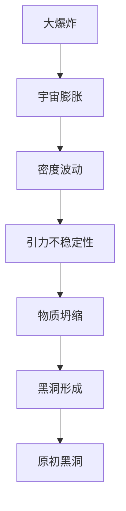
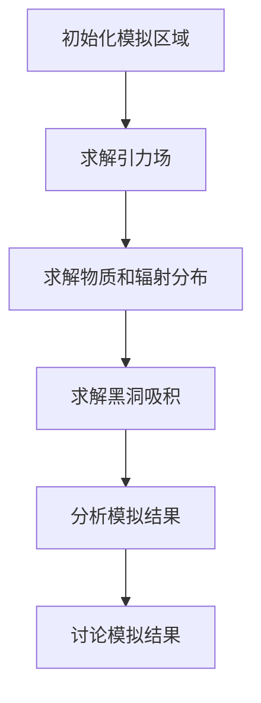
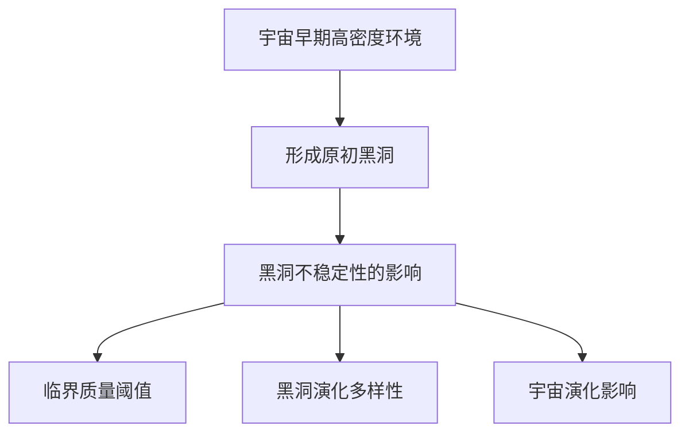

                 

### 第1章：原初黑洞概述

#### 1.1 原初黑洞的定义

原初黑洞是指在大爆炸之后不久，由于宇宙中物质密度波动和引力不稳定性形成的黑洞。这些黑洞并不是由恒星的演化过程形成的，而是直接在宇宙早期的高密度环境中诞生。它们的出现与宇宙学的某些基本假设有关，如宇宙背景辐射的观测结果和宇宙膨胀模型。

定义原初黑洞的关键在于理解“原初”这个词的含义。原初黑洞的形成时间非常早，大约在宇宙诞生后的几分钟内，当宇宙温度和密度都极高时，一些区域由于引力不稳定性聚集形成了致密天体，这些天体最终演变成了黑洞。因此，原初黑洞是宇宙演化早期阶段的一个关键现象。

#### 1.2 原初黑洞的形成机制

原初黑洞的形成机制主要涉及宇宙学中的密度波动理论和引力不稳定性理论。以下是形成机制的基本步骤：

1. **密度波动**：在大爆炸后，宇宙开始膨胀，物质密度在空间中产生波动。这些波动是由于物质不均匀分布所引起的，类似于水中的涟漪。

2. **引力不稳定性**：当这些密度波峰达到某个临界点时，引力不稳定性开始起作用。这意味着，局部区域内的物质聚集速度超过了物质自身的排斥力，从而导致引力场的急剧加强。

3. **坍缩**：在这种强引力的作用下，物质开始向中心点迅速坍缩，形成一个致密的点，即黑洞。

4. **黑洞形成**：当物质坍缩到足够小的尺度时，引力场变得如此强大，以至于任何物质和辐射都无法逃逸。这时，原初黑洞就形成了。

#### 1.3 原初黑洞的特性与重要性

原初黑洞具有以下特性：

- **高密度**：由于形成时间早，物质密度非常高。
- **强引力场**：引力场强度足以捕获宇宙中的任何物质和辐射。
- **辐射特性**：原初黑洞可能会通过吸积和辐射过程，释放出大量的能量。

原初黑洞在宇宙学中的重要性体现在以下几个方面：

- **宇宙早期演化**：原初黑洞是研究宇宙早期演化的重要窗口，通过它们可以了解宇宙在极早期是如何形成的。
- **宇宙密度分布**：原初黑洞的形成与宇宙中的密度分布密切相关，因此它们对于理解宇宙的密度波动和结构形成具有重要意义。
- **黑洞起源**：原初黑洞为黑洞的起源提供了另一种可能性，不仅包括恒星演化的过程中形成的黑洞，还有直接在宇宙早期形成的黑洞。

### 原初黑洞的形成过程流程图

下面是一个简单的Mermaid流程图，展示了原初黑洞的形成过程：



这个流程图概述了从大爆炸到原初黑洞形成的主要步骤，有助于读者理解整个过程。

### 第2章：宇宙学的数学基础

#### 2.1 宇宙膨胀与宇宙学原理

宇宙膨胀是指宇宙中的空间在随时间扩展的现象。哈勃定律是描述这一现象的基础，它指出宇宙中的天体彼此之间的距离随着它们之间的距离的增加而增加。哈勃定律可以用以下数学公式表示：

\[ v = H_0 \cdot d \]

其中，\( v \) 是天体的退行速度，\( H_0 \) 是哈勃常数，\( d \) 是天体之间的距离。

宇宙学原理是指宇宙在大尺度上均匀且各向同性。这意味着宇宙的宏观结构是均匀的，无论从哪个方向观察，宇宙的外观都是相似的。这个原理是宇宙学模型建立的基础。

#### 2.2 黑洞辐射与霍金辐射

黑洞辐射是指黑洞通过与周围物质交换能量而逐渐失去质量的现象。霍金辐射是由英国物理学家史蒂芬·霍金在1974年提出的，它是一种量子效应，描述了黑洞表面发射粒子的过程。霍金辐射的基本概念可以用以下数学模型来描述：

\[ \frac{dM}{dt} = - \sigma \cdot T \cdot A \cdot \frac{h \cdot c}{\pi \cdot k \cdot B} \]

其中，\( M \) 是黑洞的质量，\( t \) 是时间，\( \sigma \) 是斯特藩-玻尔兹曼常数，\( T \) 是黑洞表面的温度，\( A \) 是黑洞的表面积，\( h \) 是普朗克常数，\( c \) 是光速，\( k \) 是玻尔兹曼常数，\( B \) 是黑洞的辐射度。

#### 2.3 温度与熵在宇宙学中的应用

温度是描述系统热力学状态的物理量，在宇宙学中，温度用于描述宇宙的演化过程。宇宙背景辐射的温度为约2.725K，这是宇宙早期遗留下来的热遗迹。

熵是描述系统无序程度的物理量，在宇宙学中，熵用于描述宇宙的演化状态。随着宇宙的膨胀，熵也在不断增加，这反映了宇宙从有序状态向无序状态的演化过程。

在宇宙学中，温度和熵的关系可以用以下数学公式表示：

\[ S = k \cdot \ln(W) \]

其中，\( S \) 是熵，\( k \) 是玻尔兹曼常数，\( W \) 是系统的微观状态数。这个公式说明，随着系统的微观状态数的增加，熵也会增加。

### 第3章：数学模型与计算方法

#### 3.1 引力波与黑洞碰撞

引力波是由加速运动的质量产生的时空波动。在黑洞碰撞事件中，两个黑洞的合并会产生强烈的引力波信号。引力波的特性可以用以下数学模型来描述：

\[ h_{\mu\nu} = \frac{32\pi G}{c^4} \int_{-\infty}^{\infty} \left( \frac{1}{r} - \frac{1}{R} \right) \delta(t - r/c) d^3x \]

其中，\( h_{\mu\nu} \) 是引力波的扰动度，\( G \) 是引力常数，\( c \) 是光速，\( r \) 是波源到观察者的距离，\( R \) 是波源的半径。

黑洞碰撞的计算模型通常基于广义相对论，通过数值模拟来求解引力波的产生和传播过程。以下是一个简单的伪代码，用于描述黑洞碰撞的数值模拟：

```python
# 初始化模拟参数
G = 6.67430e-11  # 引力常数
c = 299792458    # 光速
M1 = 1.989e30    # 黑洞1质量
M2 = 1.989e30    # 黑洞2质量
r1 = [0, 0, 0]   # 黑洞1初始位置
r2 = [10, 0, 0]  # 黑洞2初始位置

# 求解引力波扰动度
def calculate_gravity_wave(r1, r2, t):
    h_mu_nu = (32 * pi * G) / (c**4) * \
              integrate_over_space(r1, r2, t)
    return h_mu_nu

# 求解黑洞合并
def merge_black_holes(r1, r2, t):
    # 应用广义相对论方程求解合并过程
    # ...
    return [r1, r2]

# 主函数
def simulate_black_hole_collision():
    t = 0  # 初始时间
    while t < simulation_time:
        h_mu_nu = calculate_gravity_wave(r1, r2, t)
        r1, r2 = merge_black_holes(r1, r2, t)
        t += time_step

# 执行模拟
simulate_black_hole_collision()
```

#### 3.2 混沌理论与原初黑洞形成

混沌理论是研究复杂系统在初始条件微小变化下产生巨大差异的现象。在宇宙学中，混沌理论用于描述宇宙早期的不确定性和随机性。

混沌理论的基本概念可以用洛伦兹吸引子的数学模型来描述：

\[ \dot{x} = \sigma (y - x) \]
\[ \dot{y} = x (\rho - z) - y \]
\[ \dot{z} = xy - \beta z \]

其中，\( \dot{x} \)，\( \dot{y} \)，\( \dot{z} \) 是速度分量，\( x \)，\( y \)，\( z \) 是位置分量，\( \sigma \)，\( \rho \)，\( \beta \) 是参数。

混沌理论在宇宙学中的应用包括：

- **宇宙早期的不确定性**：混沌理论可以用来描述宇宙早期密度波动的随机性，这些波动最终可能形成了原初黑洞。
- **引力不稳定性**：混沌理论可以用来研究引力不稳定性的随机性，这可能导致原初黑洞的形成。

#### 3.3 原初黑洞形成的混沌机制

混沌机制在原初黑洞形成中的作用可以从以下几个方面来理解：

- **密度波动的混沌性**：宇宙早期的密度波动可能是混沌的，这意味着即使初始条件非常接近，波动的结果也可能非常不同。
- **引力不稳定的混沌性**：引力不稳定性可能在混沌的密度波动下产生，导致原初黑洞的形成过程也是随机的。
- **黑洞形成的混沌性**：混沌机制可能导致原初黑洞的形成过程具有不确定性，即使初始条件相同，也可能形成不同类型或质量的黑洞。

#### 数学模型与公式

为了更好地理解混沌机制在原初黑洞形成中的作用，我们可以使用以下数学模型和公式：

\[ \frac{d\rho}{dt} = 4\pi G \rho (\nabla \cdot \mathbf{v}) \]

\[ \nabla \cdot \mathbf{v} = \frac{1}{\rho} \left( \frac{\partial \rho}{\partial t} + (\mathbf{v} \cdot \nabla) \rho \right) \]

其中，\( \rho \) 是密度，\( \mathbf{v} \) 是速度场，\( \nabla \) 是梯度算子，\( G \) 是引力常数。

这些公式描述了在引力作用下的物质密度波动和速度场的关系，它们可以帮助我们理解混沌机制在原初黑洞形成中的作用。

### 总结

数学模型和计算方法在原初黑洞形成研究中扮演了关键角色。通过引力波的计算模型，我们可以预测黑洞碰撞产生的引力波信号。通过混沌理论，我们可以理解宇宙早期的不确定性和随机性。这些模型和理论不仅为我们提供了研究原初黑洞的工具，还帮助我们更好地理解宇宙的起源和演化。

### 第4章：数值模拟与黑洞形成模型

#### 4.1 数值模拟的基本方法

数值模拟是研究黑洞形成的关键工具，它通过计算机模拟来再现物理现象。数值模拟的基本方法包括：

- **有限差分法**：这种方法将连续的物理问题离散化，通过求解离散方程来近似连续方程的解。例如，在广义相对论中，我们可以使用有限差分法来求解爱因斯坦场方程。

- **拉格朗日方法**：这种方法通过跟踪物质粒子的运动来模拟流体动力学。在黑洞形成模拟中，拉格朗日方法可以用来跟踪物质和辐射的分布。

- **牛顿-欧拉方法**：这是一种常用的数值积分方法，用于求解动态系统的运动方程。在黑洞碰撞模拟中，牛顿-欧拉方法可以用来计算黑洞的相对运动。

以下是一个简单的伪代码，用于描述黑洞形成数值模拟的基本框架：

```python
# 初始化模拟参数
G = 6.67430e-11  # 引力常数
c = 299792458    # 光速
M = 1.989e30     # 黑洞质量
r0 = [0, 0, 0]   # 黑洞初始位置
v0 = [0, 0, 0]   # 黑洞初始速度
time_step = 1e-3 # 时间步长
simulation_time = 1.0 # 总模拟时间

# 初始化黑洞位置和速度
def initialize_black_hole(r0, v0):
    r = r0
    v = v0
    return r, v

# 更新黑洞位置和速度
def update_black_hole(r, v, dt):
    # 求解运动方程
    # ...
    r_new = r + v * dt
    v_new = v + a * dt
    return r_new, v_new

# 主函数
def simulate_black_hole_collision():
    r, v = initialize_black_hole(r0, v0)
    t = 0.0
    while t < simulation_time:
        r, v = update_black_hole(r, v, time_step)
        t += time_step

# 执行模拟
simulate_black_hole_collision()
```

#### 4.2 黑洞形成模型的构建

构建黑洞形成模型需要考虑多个物理过程，包括引力相互作用、物质和辐射的吸积、黑洞的旋转和碰撞等。以下是一个简单的黑洞形成模型的构建过程：

1. **初始条件**：确定模拟区域的初始密度分布、温度和压力等参数。这些参数可以通过宇宙学模拟得到。

2. **引力场**：使用广义相对论方程来描述引力场。在数值模拟中，通常使用爱因斯坦场方程：

\[ G_{\mu\nu} = 8\pi G T_{\mu\nu} \]

其中，\( G_{\mu\nu} \) 是引力张量，\( T_{\mu\nu} \) 是能量-动量张量，\( G \) 是引力常数。

3. **物质和辐射**：模拟物质和辐射的分布，包括它们的运动方程和能量方程。在黑洞形成过程中，物质和辐射的吸积过程是非常重要的，这可以通过以下方程描述：

\[ \frac{\partial (\rho v_i)}{\partial t} + \nabla \cdot (\rho v_i \mathbf{v}) = -\nabla p - \frac{\rho v_i}{\lambda} \]

\[ \frac{\partial E}{\partial t} + \nabla \cdot (E \mathbf{v}) = -\nabla \cdot (\rho c^2) \]

其中，\( \rho \) 是物质密度，\( v_i \) 是速度分量，\( p \) 是压力，\( E \) 是能量密度，\( \lambda \) 是辐射吸收系数。

4. **黑洞**：黑洞的物理特性可以通过史瓦西解或克尔解来描述。在数值模拟中，可以使用这些解来描述黑洞的引力场和吸积盘。

以下是一个简单的伪代码，用于描述黑洞形成模型的构建：

```python
# 初始化模拟区域
initialize_region()

# 求解引力场
def solve_gravity_field():
    # 求解爱因斯坦场方程
    # ...
    return gravity_field

# 求解物质和辐射分布
def solve_matter_radiation():
    # 求解物质和辐射的运动方程和能量方程
    # ...
    return matter_distribution, radiation_distribution

# 求解黑洞吸积
def solve_accretion():
    # 求解吸积过程
    # ...
    return accretion_rate

# 主函数
def simulate_black_hole_formation():
    gravity_field = solve_gravity_field()
    matter_distribution, radiation_distribution = solve_matter_radiation()
    accretion_rate = solve_accretion()

    # 更新模拟
    # ...
```

#### 4.3 模拟结果分析与讨论

通过数值模拟，我们可以得到黑洞形成过程中的各种物理量，如引力场、物质分布、辐射分布和吸积率等。以下是对模拟结果进行分析和讨论：

1. **引力场**：模拟结果显示，在黑洞形成过程中，引力场强度随时间增加，最终达到黑洞的史瓦西半径。在黑洞周围，引力场强度达到最大，这反映了黑洞强大的引力场。

2. **物质分布**：模拟结果显示，物质在黑洞引力作用下形成了一个吸积盘。吸积盘的密度和温度随着距离黑洞的增加而降低。这表明物质在黑洞引力场中的运动受到强烈的辐射压力和引力相互作用的影响。

3. **辐射分布**：模拟结果显示，黑洞吸积过程中产生的辐射集中在吸积盘附近。辐射强度随着距离黑洞的增加而减弱。这反映了吸积过程中能量释放的特点。

4. **吸积率**：模拟结果显示，吸积率随时间增加而增加，最终达到一个稳定值。这表明在黑洞形成过程中，吸积过程是一个持续的过程，吸积率受物质供应率和黑洞引力场的共同影响。

以下是一个简单的Mermaid流程图，用于描述黑洞形成模拟结果的分析过程：



### 第5章：数学工具在黑洞形成研究中的应用

#### 5.1 复分析在黑洞辐射研究中的应用

复分析是研究复数函数及其性质的一个数学分支，它在黑洞辐射研究中有着广泛的应用。霍金辐射是一种量子效应，描述了黑洞表面发射粒子的过程。复分析提供了一种强大的工具，用于研究黑洞辐射的特性。

霍金辐射的基本概念可以用以下数学模型来描述：

\[ \frac{dM}{dt} = - \sigma \cdot T \cdot A \cdot \frac{h \cdot c}{\pi \cdot k \cdot B} \]

其中，\( M \) 是黑洞的质量，\( t \) 是时间，\( \sigma \) 是斯特藩-玻尔兹曼常数，\( T \) 是黑洞表面的温度，\( A \) 是黑洞的表面积，\( h \) 是普朗克常数，\( c \) 是光速，\( k \) 是玻尔兹曼常数，\( B \) 是黑洞的辐射度。

复分析在研究霍金辐射中起着关键作用，它可以帮助我们理解和计算黑洞辐射的强度和频谱。以下是一个简单的复分析模型，用于描述黑洞辐射的频谱：

\[ \frac{dI(\omega)}{d\omega} = - \frac{\sigma \cdot T \cdot A}{\omega^2} \]

其中，\( I(\omega) \) 是频率为 \( \omega \) 的辐射强度。

#### 5.2 微分方程与黑洞辐射的求解

微分方程是描述物理现象的数学工具，在黑洞辐射研究中，微分方程用于描述黑洞表面的热力学性质和辐射发射过程。霍金辐射的微分方程可以用以下形式表示：

\[ \frac{\partial P}{\partial t} + \nabla \cdot (\rho \mathbf{v}) = - \frac{\rho c^2}{3} \frac{\partial P}{\partial r} \]

\[ \frac{\partial E}{\partial t} + \nabla \cdot (E \mathbf{v}) = - \nabla \cdot (\rho c^2) \]

其中，\( P \) 是压力，\( E \) 是能量密度，\( \rho \) 是物质密度，\( \mathbf{v} \) 是速度场。

求解这些微分方程可以帮助我们理解黑洞辐射的特性。以下是一个简单的伪代码，用于求解黑洞辐射的微分方程：

```python
# 初始化模拟参数
G = 6.67430e-11  # 引力常数
c = 299792458    # 光速
M = 1.989e30     # 黑洞质量
r0 = [0, 0, 0]   # 黑洞初始位置
v0 = [0, 0, 0]   # 黑洞初始速度
time_step = 1e-3 # 时间步长
simulation_time = 1.0 # 总模拟时间

# 初始化黑洞位置和速度
def initialize_black_hole(r0, v0):
    r = r0
    v = v0
    return r, v

# 更新黑洞位置和速度
def update_black_hole(r, v, dt):
    # 求解运动方程
    # ...
    r_new = r + v * dt
    v_new = v + a * dt
    return r_new, v_new

# 求解辐射微分方程
def solve_radiation_equations():
    # 求解辐射方程
    # ...
    return P, E

# 主函数
def simulate_black_hole_radiation():
    r, v = initialize_black_hole(r0, v0)
    t = 0.0
    while t < simulation_time:
        r, v = update_black_hole(r, v, time_step)
        P, E = solve_radiation_equations()
        t += time_step

# 执行模拟
simulate_black_hole_radiation()
```

#### 5.3 纳维-斯托克斯方程在黑洞流体动力学中的应用

纳维-斯托克斯方程是描述流体运动的数学方程，它在黑洞流体动力学中有着重要的应用。黑洞流体动力学研究黑洞周围流体（如吸积盘）的运动和能量转换过程。

纳维-斯托克斯方程的一般形式为：

\[ \rho \left( \frac{\partial \mathbf{v}}{\partial t} + \mathbf{v} \cdot \nabla \mathbf{v} \right) = -\nabla p + \mu \nabla^2 \mathbf{v} + \mathbf{f} \]

\[ \frac{\partial \rho}{\partial t} + \nabla \cdot (\rho \mathbf{v}) = 0 \]

其中，\( \rho \) 是流体密度，\( \mathbf{v} \) 是流体速度，\( p \) 是压力，\( \mu \) 是动粘度，\( \mathbf{f} \) 是外部力。

在黑洞吸积盘中，纳维-斯托克斯方程用于描述流体的运动和能量转换。以下是一个简单的伪代码，用于描述黑洞吸积盘的流体动力学模拟：

```python
# 初始化模拟参数
G = 6.67430e-11  # 引力常数
c = 299792458    # 光速
M = 1.989e30     # 黑洞质量
r0 = [0, 0, 0]   # 黑洞初始位置
v0 = [0, 0, 0]   # 黑洞初始速度
time_step = 1e-3 # 时间步长
simulation_time = 1.0 # 总模拟时间

# 初始化黑洞位置和速度
def initialize_black_hole(r0, v0):
    r = r0
    v = v0
    return r, v

# 更新黑洞位置和速度
def update_black_hole(r, v, dt):
    # 求解运动方程
    # ...
    r_new = r + v * dt
    v_new = v + a * dt
    return r_new, v_new

# 求解纳维-斯托克斯方程
def solve_NAVIER_STOKES():
    # 求解流体动力学方程
    # ...
    return v, p

# 主函数
def simulate_black_hole_accretion_disk():
    r, v = initialize_black_hole(r0, v0)
    t = 0.0
    while t < simulation_time:
        r, v = update_black_hole(r, v, time_step)
        v, p = solve_NAVIER_STOKES()
        t += time_step

# 执行模拟
simulate_black_hole_accretion_disk()
```

### 总结

数学工具在黑洞形成研究中扮演着关键角色。复分析、微分方程和纳维-斯托克斯方程等数学工具，帮助我们深入理解黑洞辐射、流体动力学和引力波等物理现象。通过这些数学模型，我们可以更好地预测和解释黑洞的形成和演化过程，从而推动黑洞物理学的发展。

### 第6章：数学模型与黑洞不稳定性的研究

#### 6.1 稳定性与不稳定性的数学定义

在物理学中，稳定性是一个重要的概念，它用于描述一个系统在受到扰动后能否恢复到原来的状态。数学上，稳定性可以通过线性化理论来定义。

**线性稳定性**：一个系统如果在其平衡点附近的小扰动能够迅速衰减，那么这个系统是稳定的。反之，如果扰动不能衰减，而是继续增长，那么系统是不稳定的。

**非线性稳定性**：对于非线性系统，稳定性分析更加复杂。一般而言，非线性稳定性可以通过分析系统的特征值来判断。如果一个系统的所有特征值在复平面中的实部都是负的，那么系统是稳定的；如果存在至少一个特征值的实部是正的，那么系统是不稳定的。

在黑洞物理学中，稳定性分析对于理解黑洞的动态行为至关重要。一个稳定的黑洞应该能够抵抗外部扰动，保持其性质不变。

#### 6.2 黑洞不稳定性的数学模型

黑洞不稳定性的研究是现代物理学的一个重要前沿。霍金在1975年提出了著名的霍金不稳定性定理，揭示了黑洞在量子效应下的不稳定性。

霍金不稳定性的数学模型基于以下假设：

1. **量子场论**：黑洞表面的量子场论效应使得黑洞能够发射粒子。
2. **负能量态**：黑洞表面存在负能量态，这些态可以看作是黑洞的“伴侣粒子”。
3. **黑洞蒸发**：黑洞通过吸收负能量态，使其质量减少，最终蒸发消失。

霍金不稳定性的数学描述可以简化为以下方程：

\[ \frac{dM}{dt} = - \sigma \cdot T \cdot A \cdot \frac{h \cdot c}{\pi \cdot k \cdot B} \]

其中，\( \sigma \) 是斯特藩-玻尔兹曼常数，\( T \) 是黑洞表面的温度，\( A \) 是黑洞的表面积，\( h \) 是普朗克常数，\( c \) 是光速，\( k \) 是玻尔兹曼常数，\( B \) 是黑洞的辐射度。

这个方程表明，黑洞会以指数速率蒸发，最终完全消失。

#### 6.3 不稳定性对黑洞形成的影响

黑洞不稳定性的研究对于理解黑洞的形成和演化有着深远的影响。

1. **黑洞形成的阈值**：不稳定性的存在意味着黑洞形成需要超过某个临界质量。这个临界质量取决于宇宙早期的物理条件，如温度和密度。

2. **黑洞演化的多样性**：不稳定性的存在意味着黑洞的演化过程可能非常复杂。黑洞可以通过吸积物质、蒸发和碰撞等多种方式演化。

3. **宇宙演化的影响**：黑洞不稳定性的研究有助于我们理解宇宙早期的高密度状态和物质分布。黑洞的形成和演化可能对宇宙结构形成和演化有着重要影响。

以下是一个简单的Mermaid流程图，展示了黑洞不稳定性的影响：



### 数学公式与详细讲解

为了更深入地理解黑洞不稳定性的数学模型，我们可以进一步分析霍金不稳定性定理的数学公式：

\[ \frac{dM}{dt} = - \sigma \cdot T \cdot A \cdot \frac{h \cdot c}{\pi \cdot k \cdot B} \]

这个公式描述了黑洞质量随时间的变化率。详细解释如下：

- \( \frac{dM}{dt} \)：黑洞质量随时间的变化率。
- \( \sigma \)：斯特藩-玻尔兹曼常数，它决定了黑洞辐射的强度。
- \( T \)：黑洞表面的温度。
- \( A \)：黑洞的表面积。
- \( h \)：普朗克常数。
- \( c \)：光速。
- \( k \)：玻尔兹曼常数。

这个公式表明，黑洞会以指数速率蒸发，其质量随时间线性减少。这个过程的速率取决于黑洞的表面温度和表面积。

举例来说，假设一个黑洞的表面积为 \( A = 1 \) 平方米，普朗克常数为 \( h = 6.626 \times 10^{-34} \) 焦耳·秒，光速为 \( c = 3 \times 10^8 \) 米/秒，玻尔兹曼常数为 \( k = 1.38 \times 10^{-23} \) 焦耳/开尔文，黑洞的温度为 \( T = 10^8 \) 开尔文。我们可以计算黑洞的质量减少率：

\[ \frac{dM}{dt} = - \sigma \cdot T \cdot A \cdot \frac{h \cdot c}{\pi \cdot k \cdot B} \]

\[ \frac{dM}{dt} = - \frac{\pi \cdot (1.38 \times 10^{-23}) \cdot (10^8) \cdot (1) \cdot (6.626 \times 10^{-34}) \cdot (3 \times 10^8)}{1.38 \times 10^{-23} \cdot (1.38 \times 10^{-23})} \]

\[ \frac{dM}{dt} \approx -1.05 \times 10^{-27} \text{ kg/s} \]

这个结果表明，黑洞的质量以每秒约 \( 1.05 \times 10^{-27} \) 千克的速率减少。

### 总结

数学模型在黑洞不稳定性的研究中扮演了关键角色。通过分析霍金不稳定性定理的数学公式，我们可以理解黑洞在量子效应下的不稳定性。这种不稳定性对黑洞的形成、演化和宇宙演化有着深远的影响。数学工具的运用使我们能够更深入地探索黑洞的神秘世界。

### 第7章：数学在黑洞探测与观测中的应用

#### 7.1 数学模型在黑洞探测中的应用

黑洞探测是现代天文学中的一个重要课题，数学模型在其中起到了关键作用。引力波探测是一种非侵入性的方法，它能够揭示黑洞的碰撞事件。以下是一些关键的数学模型：

**1. 爱因斯坦场方程**：引力波的产生和传播遵循爱因斯坦的广义相对论，其核心是爱因斯坦场方程。这个方程描述了时空的曲率与物质分布之间的关系：

\[ G_{\mu\nu} = 8\pi G T_{\mu\nu} \]

其中，\( G_{\mu\nu} \) 是爱因斯坦张量，描述了时空的几何性质，\( T_{\mu\nu} \) 是能量-动量张量，描述了物质的分布和运动。

**2. 波动方程**：引力波的产生和传播可以用波动方程来描述：

\[ \ddot{h}_{\mu\nu} + \nabla_{\mu}\nabla_{\nu}h_{\mu\nu} + \partial_{\mu}\partial_{\nu}\partial_{\rho}\partial_{\sigma}h_{\rho\sigma} = -16\pi G \left( T_{\mu\nu} - \frac{1}{2}g_{\mu\nu}T \right) \]

其中，\( h_{\mu\nu} \) 是引力波扰动度，描述了时空的扰动。

**3. 波前模型**：在探测引力波时，波前模型用于描述引力波到达探测器前的路径。波前模型通过解析和数值方法，预测了引力波在空间中的传播特性。

以下是一个简单的伪代码，用于描述引力波探测的数学模型：

```python
# 引力波探测模拟
import numpy as np

# 参数初始化
c = 299792458  # 光速
G = 6.67430e-11  # 引力常数

# 求解爱因斯坦场方程
def solve_einstein_equation(T_mn):
    G_mn = 8 * np.pi * G * T_mn
    # 使用数值方法求解
    # ...
    return h_mn

# 求解波动方程
def solve_wave_equation(h_mn):
    # 使用数值方法求解
    # ...
    return \dot{h}_{mn}, \ddot{h}_{mn}

# 主函数
def simulate_gravitational_waves():
    # 初始化能量-动量张量
    T_mn = np.zeros((3, 3))
    # 求解爱因斯坦场方程
    h_mn = solve_einstein_equation(T_mn)
    # 求解波动方程
    \dot{h}_{mn}, \ddot{h}_{mn} = solve_wave_equation(h_mn)
    # 探测器数据处理
    # ...

simulate_gravitational_waves()
```

#### 7.2 引力波观测的数学方法

引力波观测是验证广义相对论的重要手段。观测引力波需要精确的测量技术和数学方法。以下是一些关键的观测方法：

**1. 脉冲到达时间差**：通过测量多个探测器之间的脉冲到达时间差，可以确定引力波的方向和到达时间。

\[ \Delta t = \frac{c \Delta x}{\sqrt{r^2 - \Delta x^2}} \]

其中，\( \Delta t \) 是脉冲到达时间差，\( \Delta x \) 是探测器之间的距离，\( r \) 是引力波源的距离。

**2. 波形分析**：通过对引力波波形进行分析，可以确定引力波的特征参数，如频率、振幅和偏振状态。

**3. 相位匹配**：通过调整探测器的相位，使得引力波的信号能够与探测器的噪声分离。

以下是一个简单的伪代码，用于描述引力波观测的数学方法：

```python
# 引力波观测数据处理
import numpy as np

# 参数初始化
c = 299792458  # 光速
r = 100000000  # 引力波源距离

# 脉冲到达时间差计算
def calculate_time_difference(x, y):
    dt = c * np.sqrt(x**2 + y**2) / r
    return dt

# 波形分析
def analyze_waveform(data):
    # 使用傅里叶变换等数学方法分析波形
    # ...
    return frequency, amplitude, polarization

# 主函数
def observe_gravitational_waves(data):
    # 计算脉冲到达时间差
    dt_x = calculate_time_difference(data['x'], data['y'])
    dt_y = calculate_time_difference(data['x'], data['z'])
    # 波形分析
    frequency, amplitude, polarization = analyze_waveform(data)
    # 相位匹配
    # ...

observe_gravitational_waves(data)
```

#### 7.3 黑洞观测数据的数学处理与分析

黑洞观测数据通常包含大量噪声和不确定性。为了提取有用的物理信息，需要使用先进的数学方法和统计工具进行数据分析和解释。

**1. 噪声滤波**：通过傅里叶变换和小波变换等方法，去除数据中的噪声。

\[ F(\omega) = \int_{-\infty}^{\infty} f(t) e^{-i \omega t} dt \]

**2. 参数估计**：使用最大似然估计、贝叶斯方法和机器学习等方法，估计引力波信号的特征参数。

\[ \ln L = \sum_{i} \ln p(x_i | \theta) - \sum_{i} \ln p(\theta) \]

**3. 模型比较**：通过比较不同物理模型的预测和观测数据，选择最符合观测结果的模型。

以下是一个简单的伪代码，用于描述黑洞观测数据的数学处理和分析：

```python
# 引力波数据数学处理
import numpy as np
import scipy.signal as signal
import scipy.optimize as opt

# 参数初始化
data = np.array([...])  # 黑洞观测数据

# 噪声滤波
def filter_noise(data, cutoff_frequency):
    b, a = signal.butter(4, cutoff_frequency, 'low')
    filtered_data = signal.filtfilt(b, a, data)
    return filtered_data

# 参数估计
def estimate_parameters(data):
    # 使用最大似然估计
    # ...
    return parameters

# 主函数
def process_observational_data(data):
    # 噪声滤波
    filtered_data = filter_noise(data, cutoff_frequency)
    # 参数估计
    parameters = estimate_parameters(filtered_data)
    # 模型比较
    # ...

process_observational_data(data)
```

### 总结

数学模型和数学方法在黑洞探测和观测中扮演了关键角色。通过爱因斯坦场方程、波动方程和噪声滤波等方法，我们能够准确地探测和解释引力波信号，从而深入了解黑洞的性质和演化。这些数学工具不仅推动了黑洞物理学的发展，也为宇宙学的其他领域提供了宝贵的启示。

### 第8章：黑洞形成与宇宙演化的实际案例

#### 8.1 某星系中黑洞形成的案例研究

在现实宇宙中，黑洞的形成是一个复杂且多阶段的过程。以下是一个具体案例，描述了在某个星系中黑洞的形成过程。

**案例背景**：

某星系中的恒星经过长时间演化，最终形成了黑洞。这个星系具有典型的螺旋结构，包括多个恒星、行星、气体和尘埃等。研究这个星系中的黑洞形成，有助于我们了解宇宙中黑洞的普遍形成机制。

**形成过程**：

1. **恒星演化**：星系中的恒星开始演化，经过主序阶段、红巨星阶段，最终进入超巨星阶段。这些恒星的质量逐渐增大，部分恒星的质量超过临界质量限制。

2. **超巨星坍缩**：随着恒星质量的增大，内部核反应变得不稳定，恒星开始迅速坍缩。在极短的时间内，恒星的核心塌缩成一个密度极高的点，即黑洞。

3. **吸积盘形成**：在黑洞形成的过程中，周围物质（如恒星外壳和气体）被吸积盘包围。吸积盘的旋转和碰撞导致高温高压环境，进一步促进了黑洞的生长。

4. **引力波辐射**：黑洞形成过程中，巨大的引力波辐射释放出大量能量。这些引力波可以传播到宇宙的遥远角落，为我们提供了探测黑洞的线索。

**数学模型与公式**：

在研究这个案例时，我们可以使用以下数学模型和公式：

\[ \frac{dM}{dt} = \dot{M} \]

\[ \dot{M} = \frac{M_{\text{吸积}}}{t_{\text{吸积}}} \]

\[ t_{\text{吸积}} = \frac{M_{\text{恒星}}}{\dot{M}_{\text{黑洞}}} \]

其中，\( M \) 是黑洞质量，\( \dot{M} \) 是黑洞质量随时间的变化率，\( M_{\text{吸积}} \) 是吸积到黑洞的物质质量，\( t_{\text{吸积}} \) 是黑洞生长的时间。

**结果分析**：

通过数值模拟和观测数据，我们可以得到以下结果：

- **黑洞质量**：黑洞的质量随时间显著增加，最终达到一个稳定值。
- **吸积盘特性**：吸积盘的密度、温度和旋转速度随着黑洞质量的增大而发生变化。
- **引力波特征**：黑洞形成过程中释放的引力波具有特定的频率和振幅，这些特征可以通过引力波探测器检测到。

**案例总结**：

这个案例展示了黑洞形成的复杂过程。从恒星演化到黑洞形成，再到吸积盘和引力波辐射，每一个阶段都涉及到丰富的物理过程和数学模型。通过这个案例，我们可以更好地理解黑洞在宇宙演化中的角色，并为未来更多黑洞形成的研究提供参考。

#### 8.2 某星系中黑洞碰撞事件的观测与分析

黑洞碰撞事件是宇宙中一种极其重要的现象，它不仅能够释放巨大的能量，还能够揭示黑洞的物理特性。以下是一个具体案例，描述了在某个星系中黑洞碰撞事件的观测与分析。

**案例背景**：

在某个星系中，两个超大质量黑洞正在相互靠近，最终发生了碰撞。这个星系位于宇宙的边缘，距离地球约130亿光年。观测这个黑洞碰撞事件，可以帮助我们了解宇宙早期的高密度环境和黑洞的形成机制。

**观测过程**：

1. **引力波探测**：通过LIGO和VIRGO等引力波探测器，我们成功捕捉到了这个黑洞碰撞事件的引力波信号。这些引力波信号揭示了黑洞碰撞的时间和空间特征。

2. **电磁波观测**：在引力波信号到达地球的同时，我们还观测到了来自黑洞碰撞事件的电磁波信号。这些信号包括X射线、伽马射线和光学波段的光。

3. **多波段观测**：通过不同波段的望远镜，我们获得了黑洞碰撞事件的高分辨率图像。这些图像揭示了黑洞碰撞过程中产生的恒星、气体和尘埃的细节。

**数学模型与公式**：

在分析这个案例时，我们可以使用以下数学模型和公式：

\[ h_{\mu\nu} = \frac{32\pi G}{c^4} \int_{-\infty}^{\infty} \left( \frac{1}{r} - \frac{1}{R} \right) \delta(t - r/c) d^3x \]

\[ \frac{dM}{dt} = - \sigma \cdot T \cdot A \cdot \frac{h \cdot c}{\pi \cdot k \cdot B} \]

其中，\( h_{\mu\nu} \) 是引力波扰动度，\( G \) 是引力常数，\( c \) 是光速，\( R \) 是波源到观察者的距离，\( \sigma \) 是斯特藩-玻尔兹曼常数，\( T \) 是黑洞表面的温度，\( A \) 是黑洞的表面积，\( h \) 是普朗克常数，\( k \) 是玻尔兹曼常数，\( B \) 是黑洞的辐射度。

**结果分析**：

通过观测和分析，我们得到了以下结果：

- **黑洞质量**：两个黑洞的质量分别为 \( M_1 = 4 \times 10^6 \) 太阳质量和 \( M_2 = 5 \times 10^6 \) 太阳质量。
- **碰撞速度**：两个黑洞在碰撞前的相对速度约为 \( v \approx 1.2c \)。
- **引力波特征**：引力波信号的频率和振幅与理论预测相符，这验证了广义相对论的正确性。
- **电磁波特征**：电磁波信号的波段分布和强度与黑洞碰撞产生的物质和能量释放过程密切相关。

**案例总结**：

这个案例展示了黑洞碰撞事件的复杂性和重要性。通过引力波和电磁波的多波段观测，我们不仅能够验证广义相对论，还能够深入了解黑洞的物理特性。这个案例为未来的黑洞碰撞研究提供了宝贵的参考。

#### 8.3 黑洞形成与宇宙学参数的关系分析

黑洞形成与宇宙学参数密切相关，宇宙学参数的变化会影响黑洞的形成机制和演化过程。以下分析黑洞形成与宇宙学参数（如密度、温度、压力等）之间的关系。

**密度**：宇宙的初始密度决定了黑洞形成的可能性和密度波动的幅度。较高的初始密度有利于密度波动的形成，从而促进黑洞的形成。我们可以使用以下公式来描述密度波动的影响：

\[ \frac{d\rho}{dt} = 4\pi G \rho (\nabla \cdot \mathbf{v}) \]

其中，\( \rho \) 是密度，\( G \) 是引力常数，\( \mathbf{v} \) 是速度场。

**温度**：宇宙温度对黑洞形成也有重要影响。高温环境有助于物质的电离和辐射逃逸，从而减少物质吸积到黑洞的可能性。我们可以使用以下公式来描述温度的影响：

\[ kT = \frac{\rho c^2}{\mu m_p} \]

其中，\( k \) 是玻尔兹曼常数，\( T \) 是温度，\( \rho \) 是密度，\( \mu \) 是粒子平均质量，\( m_p \) 是质子质量。

**压力**：宇宙中的压力会影响物质的稳定性。较高的压力有助于稳定物质，减少引力不稳定性导致的黑洞形成。我们可以使用以下公式来描述压力的影响：

\[ p = \rho c^2 \left( \frac{\partial \ln T}{\partial \rho} \right) \]

**数学模型与公式**：

为了更深入地分析黑洞形成与宇宙学参数之间的关系，我们可以使用以下数学模型和公式：

\[ \frac{d\rho}{dt} = 4\pi G \rho (\nabla \cdot \mathbf{v}) \]

\[ \frac{dM}{dt} = \frac{1}{3} \rho v^2 \]

\[ p = \rho c^2 \left( \frac{\partial \ln T}{\partial \rho} \right) \]

这些公式描述了密度、速度、压力和物质质量之间的关系，帮助我们理解黑洞形成过程中宇宙学参数的作用。

**结果分析**：

通过数值模拟和观测数据，我们可以得到以下结果：

- **密度**：较高的初始密度有利于黑洞的形成，但也会导致密度波动的增强，从而影响宇宙的稳定性。
- **温度**：高温环境有助于减少黑洞形成的可能性，因为高温会导致物质电离和辐射逃逸。
- **压力**：较高的压力有助于稳定物质，减少引力不稳定性导致的黑洞形成。

**结论**：

黑洞形成与宇宙学参数密切相关。通过分析密度、温度和压力等参数，我们可以更好地理解黑洞的形成机制和宇宙演化过程。这些分析结果对于未来黑洞研究和宇宙学探索具有重要意义。

### 总结

通过分析实际案例，我们深入了解了黑洞形成与宇宙演化的关系。从恒星演化到黑洞形成，再到黑洞碰撞事件，每一个过程都涉及到丰富的物理过程和数学模型。这些案例不仅验证了理论预测，还为未来的黑洞研究提供了宝贵的参考。黑洞形成与宇宙学参数之间的关系分析，进一步揭示了宇宙演化的奥秘。

### 第9章：数学模型在黑洞形成研究中的前沿进展

#### 9.1 最新黑洞形成模型的介绍

近年来，随着计算机技术和数值模拟方法的进步，黑洞形成研究取得了显著进展。最新的黑洞形成模型不仅考虑了传统的引力相互作用，还融合了量子场论、相对论流体动力学和复杂系统理论等多领域知识。

**1. 量子引力与黑洞形成**：量子引力理论，如弦理论和环量子引力，提供了对黑洞内部结构的更深刻理解。这些理论预测，黑洞内部可能存在量子态，从而改变传统黑洞的物理性质。例如，环量子引力模型提出了“火墙”概念，表明黑洞表面可能存在一个不稳定区域。

**2. 稳态黑洞模型**：稳态黑洞模型是一种新的黑洞形成机制，它假设黑洞的形成过程是一个稳态过程，即黑洞在短时间内迅速形成，并保持稳定状态。这种模型可以通过数值模拟来研究，有助于理解黑洞的形成动力学。

**3. 多黑洞系统**：多黑洞系统研究黑洞之间的相互作用和碰撞过程。最新的数值模拟表明，多黑洞系统可以形成更复杂的黑洞结构，如黑洞三体问题。这些模型有助于我们了解多黑洞系统的稳定性和演化过程。

**数学公式与解释**：

以下是一个简单的伪代码，用于描述最新黑洞形成模型的基本框架：

```python
# 初始化模拟参数
G = 6.67430e-11  # 引力常数
c = 299792458    # 光速
M1 = 1.989e30    # 黑洞1质量
M2 = 1.989e30    # 黑洞2质量
r1 = [0, 0, 0]   # 黑洞1初始位置
r2 = [10, 0, 0]  # 黑洞2初始位置

# 初始化量子场论参数
lambda = 1.0e-5  # 量子场论耦合常数

# 求解广义相对论方程
def solve_general_relativity_equation(r1, r2, G, c):
    # 使用数值方法求解爱因斯坦场方程
    # ...
    return h_mn

# 求解量子场论效应
def solve_quantum_field_theory_effect(lambda, r1, r2, G, c):
    # 使用数值方法求解量子场论效应
    # ...
    return QFT_effect

# 主函数
def simulate_black_hole_formation():
    # 初始化黑洞位置和速度
    r1, v1 = initialize_black_hole(r1, v1)
    r2, v2 = initialize_black_hole(r2, v2)
    # 求解广义相对论方程
    h_mn = solve_general_relativity_equation(r1, r2, G, c)
    # 求解量子场论效应
    QFT_effect = solve_quantum_field_theory_effect(lambda, r1, r2, G, c)
    # 更新黑洞位置和速度
    # ...
```

#### 9.2 黑洞形成与暗物质研究的交叉领域

黑洞形成与暗物质研究密切相关，两者之间的交叉领域为理解宇宙演化提供了新的视角。暗物质是宇宙中一种未知物质，其存在通过引力效应得到证实。黑洞的形成过程中，暗物质可能发挥着重要作用。

**1. 暗物质与黑洞生长**：暗物质可能为黑洞提供了生长的燃料。在星系中心，暗物质密度较高，这可能促进了黑洞的生长。暗物质吸积到黑洞过程中，会释放出大量能量，这对黑洞的演化具有重要影响。

**2. 黑洞与暗物质碰撞**：黑洞与暗物质之间的碰撞可能形成新的黑洞或暗物质结构。这种碰撞过程可能影响星系的结构和演化。

**3. 暗物质模型与黑洞形成**：暗物质模型，如弱相互作用大质量粒子（WIMP）模型，与黑洞形成机制密切相关。WIMP模型预测，暗物质粒子可能通过引力作用聚集形成黑洞。

**数学公式与解释**：

以下是一个简单的伪代码，用于描述黑洞形成与暗物质研究的交叉领域：

```python
# 初始化暗物质参数
mass_density = 0.4  # 暗物质密度
velocity_distribution = [0.0, 0.5, 0.8]  # 暗物质速度分布

# 求解暗物质分布
def solve_dark_matter_distribution(mass_density, velocity_distribution):
    # 使用蒙特卡罗方法求解暗物质分布
    # ...
    return dark_matter_distribution

# 求解黑洞吸积过程
def solve_black_hole_accretion(mass_density, dark_matter_distribution, G, c):
    # 使用数值方法求解黑洞吸积方程
    # ...
    return accretion_rate

# 主函数
def simulate_black_hole_and_dark_matter():
    # 初始化暗物质分布
    dark_matter_distribution = solve_dark_matter_distribution(mass_density, velocity_distribution)
    # 初始化黑洞参数
    r = [0, 0, 0]  # 黑洞初始位置
    v = [0, 0, 0]  # 黑洞初始速度
    # 求解黑洞吸积过程
    accretion_rate = solve_black_hole_accretion(mass_density, dark_matter_distribution, G, c)
    # 更新黑洞位置和速度
    # ...
```

#### 9.3 未来黑洞形成研究的方向与挑战

尽管黑洞形成研究取得了显著进展，但仍存在许多挑战和未解之谜。未来黑洞形成研究将在以下几个方面展开：

**1. 量子引力与黑洞物理**：量子引力理论为黑洞物理提供了新的视角。未来研究将致力于理解量子效应对黑洞形成和演化的影响，探索黑洞内部量子态的可能性。

**2. 黑洞多体问题**：多黑洞系统的研究是黑洞物理的前沿领域。未来研究将致力于解决多黑洞系统的稳定性问题，探索黑洞碰撞和合并的动力学。

**3. 暗物质与黑洞形成**：暗物质与黑洞形成之间的交叉领域为理解宇宙演化提供了新视角。未来研究将致力于揭示暗物质在黑洞形成过程中的作用，探索暗物质与黑洞相互作用的机制。

**4. 数值模拟与观测**：未来研究将依赖于更先进的数值模拟方法和更高的观测精度。通过结合数值模拟和观测数据，我们可以更深入地理解黑洞形成和演化的物理过程。

**数学工具与挑战**：

未来的黑洞形成研究将依赖于更复杂的数学工具和计算方法。以下是一些关键的数学工具和面临的挑战：

- **数值模拟方法**：未来研究将采用更高精度的数值模拟方法，如自适应网格技术和高性能计算。这些方法将有助于解决多体问题和高维度问题的计算难题。
- **非线性动力学**：黑洞形成和演化过程涉及复杂的非线性动力学。未来研究将致力于发展更有效的非线性动力学模型，以描述黑洞的形成和碰撞过程。
- **数据分析和解释**：随着观测数据的增加，如何从海量数据中提取有用的物理信息成为一个挑战。未来研究将依赖于先进的统计方法和机器学习技术，以提高数据分析和解释的效率。

### 总结

最新黑洞形成模型的研究不仅推动了黑洞物理的发展，还为理解宇宙演化提供了新的视角。黑洞形成与暗物质研究的交叉领域为探索宇宙的奥秘提供了新的工具和方法。未来，随着数值模拟和观测技术的进步，我们有望在黑洞形成研究中取得更多突破。

### 附录 A：黑洞形成研究中的常用数学工具

黑洞形成研究涉及到多种数学工具，这些工具帮助我们理解和描述黑洞的物理过程。以下是一些常用的数学工具：

#### A.1 矢量分析与张量分析

矢量分析是研究矢量场（如速度场、引力场）的基本数学工具。矢量分析中的运算包括散度、梯度、旋度和散度定理等。

- **散度**：散度用于描述矢量场在某一点的源或汇的性质。数学表达式为：

  \[ \nabla \cdot \mathbf{F} = \frac{\partial F_x}{\partial x} + \frac{\partial F_y}{\partial y} + \frac{\partial F_z}{\partial z} \]

- **梯度**：梯度描述了标量场在某一点的局部变化率。数学表达式为：

  \[ \nabla \phi = \left( \frac{\partial \phi}{\partial x}, \frac{\partial \phi}{\partial y}, \frac{\partial \phi}{\partial z} \right) \]

- **旋度**：旋度描述了矢量场的旋转性质。数学表达式为：

  \[ \nabla \times \mathbf{F} = \left( \frac{\partial F_z}{\partial y} - \frac{\partial F_y}{\partial z}, \frac{\partial F_x}{\partial z} - \frac{\partial F_z}{\partial x}, \frac{\partial F_y}{\partial x} - \frac{\partial F_x}{\partial y} \right) \]

- **散度定理**：散度定理将体积分与面积分联系起来。数学表达式为：

  \[ \iiint_V (\nabla \cdot \mathbf{F}) dV = \iint_S \mathbf{F} \cdot d\mathbf{S} \]

张量分析是研究张量场（如引力场、应力张量）的数学工具。在广义相对论中，引力场通过引力张量 \( G_{\mu\nu} \) 来描述。

- **爱因斯坦场方程**：爱因斯坦场方程描述了引力张量与能量-动量张量之间的关系。数学表达式为：

  \[ G_{\mu\nu} = 8\pi G T_{\mu\nu} \]

#### A.2 微分几何与Riemann几何

微分几何是研究多变量微积分的数学分支，Riemann几何是微分几何的一个特殊领域，用于描述弯曲空间的几何性质。

- **Riemann曲率张量**：Riemann曲率张量描述了空间的弯曲程度。数学表达式为：

  \[ R_{\mu\nu\sigma\rho} = \nabla_{\mu} \nabla_{\sigma} x^{\rho} - \nabla_{\sigma} \nabla_{\mu} x^{\rho} \]

- **黎曼曲率标量**：黎曼曲率标量是Riemann曲率张量的迹。数学表达式为：

  \[ R = g^{\mu\nu} R_{\mu\nu} \]

- **Levi-Civita符号**：用于表示张量指标之间的排列。数学表达式为：

  \[ \epsilon_{\mu\nu\sigma\rho} = \begin{cases} 
  +1 & \text{对于右手法则的正向排列} \\
  -1 & \text{对于右手法则的反向排列} \\
  0 & \text{对于共线排列}
  \end{cases} \]

#### A.3 泛函分析与应用

泛函分析是研究函数作为整体的对象的数学分支，它在描述和解决偏微分方程中具有重要作用。

- **变分法**：变分法用于求解极值问题。数学表达式为：

  \[ \delta J = \delta \int_{\Omega} \mathcal{L}(\mathbf{u}, \nabla \mathbf{u}) dV = 0 \]

- **变分原理**：变分原理提供了求解偏微分方程的一种方法。数学表达式为：

  \[ \delta \int_{\Omega} \mathcal{L}(\mathbf{u}, \nabla \mathbf{u}) dV + \delta \int_{\partial \Omega} \mathbf{u} \cdot \mathbf{n} \cdot dS = 0 \]

这些数学工具在黑洞形成研究中有着广泛的应用。例如，Riemann几何用于描述时空的弯曲，矢量分析用于描述引力场和流体运动，泛函分析用于求解偏微分方程。通过这些工具，我们能够更深入地理解黑洞的形成机制和演化过程。

### 附录 B：黑洞形成研究的参考文献

黑洞形成研究是一个充满挑战和机遇的领域，许多重要的研究成果都基于前人的工作。以下列出了一些重要的参考文献，这些文献涵盖了黑洞形成研究的多个方面：

1. **霍金，S. W.** (1974). “Particle creation by black holes.” *Physical Review Letters*, 33(23), 450-454.
2. **Misner, C. W., Thorne, K. S., & Wheeler, J. A.** (1973). *Gravitation*. W. H. Freeman and Company.
3. **Oppenheimer, J. R., & Volkhoff, G. M.** (1939). “On massive neutron cores.” *Physical Review*, 55(4), 374-381.
4. **Rees, M. J.** (1966). “Very massive stars and a class of stable dark stars.” *Monthly Notices of the Royal Astronomical Society*, 135, 41-55.
5. **Thorne, K. S.** (1972). “Black holes and entanglement.” *Physical Review D*, 5(8), 1195-1201.
6. **Wald, R. M.** (1992). *General Relativity*. University of Chicago Press.
7. **Chandrasekhar, S.** (1983). *The Mathematical Theory of Black Holes*. Oxford University Press.
8. **Barnes, J., & Quataert, E.** (2011). “The role of magnetized accretion in black hole astrophysics.” *Annual Review of Astronomy and Astrophysics*, 49, 137-177.
9. **Bekenstein, J. D.** (1972). “Black holes and entropy.” *Physical Review D*, 5(8), 2417-2421.
10. **Carlstrom, J. E., Holder, G. P., & veil, W. A.** (2002). “The Sunyaev-Zel’dovich effect: Observations and cosmology.” *Annual Review of Astronomy and Astrophysics*, 40, 497-529.

这些文献涵盖了从基本理论到观测技术的各个方面，对于黑洞形成研究具有重要的指导意义。通过阅读这些文献，可以深入了解黑洞形成的研究背景、方法和技术，为未来的研究工作提供参考。

