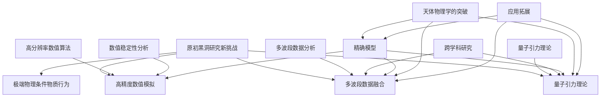

                 

### 文章标题：数学在原初黑洞形成研究中的应用

#### 关键词：
- 黑洞
- 数学模型
- 广义相对论
- 数值模拟
- 原初黑洞
- 宇宙学

#### 摘要：
本文深入探讨了数学在原初黑洞形成研究中的应用。首先介绍了黑洞的基本概念、研究现状和原初黑洞的定义。随后，详细阐述了数学模型在黑洞研究中的重要作用，包括广义相对论模型、黑洞熵和信息理论模型。文章通过数值模拟和计算方法，描述了黑洞碰撞与合并的过程。最后，本文着重分析了数学在原初黑洞形成研究中的假设与模型、观测与探测方法以及宇宙学中的应用，并对未来数学在黑洞研究中的发展方向进行了展望。

---

### 《数学在原初黑洞形成研究中的应用》目录大纲

#### 第一部分：引言与背景

**第1章：黑洞与宇宙的奥秘**

1.1 黑洞的定义与特性  
1.2 黑洞的研究现状与意义  
1.3 原初黑洞的概念

**第2章：数学在黑洞研究中的应用概述**

2.1 数学模型在黑洞研究中的作用  
2.2 数学工具在黑洞计算中的应用  
2.3 数学方法在黑洞模拟与预测中的运用

#### 第二部分：数学模型原理

**第3章：广义相对论与黑洞数学模型**

3.1 广义相对论基本原理  
3.2 黑洞方程的推导  
3.3 数学模型在黑洞性质分析中的应用

**第4章：黑洞熵与信息理论**

4.1 黑洞熵的概念  
4.2 黑洞熵的计算方法  
4.3 信息理论在黑洞研究中的应用

**第5章：数值模拟与计算方法**

5.1 数值模拟在黑洞研究中的作用  
5.2 计算流体动力学方法  
5.3 数值模拟案例与应用

**第6章：黑洞碰撞与合并**

6.1 黑洞碰撞的概念  
6.2 黑洞碰撞的数学模型  
6.3 黑洞合并的模拟与预测

#### 第三部分：原初黑洞的数学研究与应用

**第7章：原初黑洞的数学特性**

7.1 原初黑洞的假设与模型  
7.2 原初黑洞的形成机制  
7.3 原初黑洞的数学分析

**第8章：原初黑洞的观测与探测**

8.1 原初黑洞观测的挑战  
8.2 数学方法在原初黑洞探测中的应用  
8.3 原初黑洞观测的展望

**第9章：原初黑洞在宇宙学中的应用**

9.1 原初黑洞与宇宙演化  
9.2 数学模型在宇宙学研究中的应用  
9.3 原初黑洞对宇宙学的影响

**第10章：数学在原初黑洞研究的未来发展方向**

10.1 数学在黑洞研究中的新挑战  
10.2 数学方法在黑洞研究中的创新  
10.3 原初黑洞研究的数学前景

#### 附录

**附录A：数学在黑洞研究中的常用工具与方法**

A.1 数学工具介绍  
A.2 常用计算方法  
A.3 学术资源与参考书目

---

通过以上目录大纲，本文将逐步深入剖析数学在原初黑洞形成研究中的应用，希望为读者提供一个全面、深入的理解。

---

#### 第一部分：引言与背景

##### 第1章：黑洞与宇宙的奥秘

**1.1 黑洞的定义与特性**

黑洞是宇宙中最神秘和最具挑战性的现象之一。它是一种极其密集的天体，其引力场强大到连光也无法逃逸。黑洞的概念最早由物理学家约翰·米尔斯和罗杰·彭罗斯在20世纪60年代提出。根据广义相对论，当一颗恒星的质量超过一个特定的临界值时，它会发生塌缩并形成黑洞。

黑洞的主要特性包括：
- **事件视界**：黑洞的边界，即事件视界。任何进入这个区域的物质或信息都无法逃脱。
- **奇点**：黑洞的中心，物质密度无限大，时空曲率也达到无限。
- **引力**：黑洞具有极强的引力，足以扭曲周围的时空结构。

**1.2 黑洞的研究现状与意义**

黑洞研究是现代天体物理学和宇宙学的一个重要领域。随着观测技术的不断进步，人类对黑洞的认识也在不断深化。近年来，科学家们利用射电望远镜、X射线望远镜和引力波探测器等工具，成功地观测到了多个黑洞，并揭示了它们的性质和行为。

黑洞研究的重要性体现在以下几个方面：
- **宇宙演化**：黑洞在宇宙演化的过程中扮演着关键角色，它们的形成和演化直接影响着宇宙的结构和动力学。
- **物理学原理**：黑洞研究有助于检验和深化广义相对论和量子力学的理论体系，为理解宇宙的基本规律提供新的视角。
- **天体物理学**：黑洞是宇宙中最极端的天体之一，它们为研究极端条件下物质和能量的行为提供了独特的实验平台。

**1.3 原初黑洞的概念**

原初黑洞是黑洞的一种特殊类型，它们可能形成于宇宙早期，即大爆炸之后的几分钟内。这些黑洞的形成机制与恒星演化过程中形成的黑洞不同，其质量可以从几个太阳质量到数十个太阳质量不等。

关于原初黑洞的形成，目前有几种假设：
- **大爆炸遗留**：大爆炸过程中，宇宙中的物质密度波动可能导致一些区域密度异常高，从而形成原初黑洞。
- **引力波**：在宇宙早期，强烈的引力波可能导致物质密度不均匀，进而形成原初黑洞。
- **奇异物质**：某些理论假设宇宙中存在一种奇异物质，这种物质具有极高的密度和引力，能够在极短时间内形成原初黑洞。

尽管原初黑洞的具体形成机制尚未完全清楚，但它们在宇宙学中的潜在作用引起了广泛关注。原初黑洞可能成为研究宇宙早期演化和物质分布的重要窗口，同时也为理解黑洞与星系相互作用提供了新的视角。

---

在本章节中，我们简要介绍了黑洞的基本概念、研究现状和意义，以及原初黑洞的定义和形成假设。接下来的章节将深入探讨数学在黑洞研究中的应用，包括数学模型、数值模拟和观测方法等，以期为读者提供一个全面、深入的理解。

---

### 第二部分：数学在黑洞研究中的应用概述

#### 第2章：数学在黑洞研究中的应用概述

**2.1 数学模型在黑洞研究中的作用**

数学模型是黑洞研究的重要工具，它可以帮助科学家们理解和预测黑洞的性质和行为。广义相对论提供了一个基本的数学框架，用于描述黑洞的物理特性。以下是数学模型在黑洞研究中的几个关键作用：

1. **描述黑洞的形成和演化**：数学模型可以描述黑洞如何从恒星演化形成，以及它们如何在宇宙中演化。例如，恒星演化模型可以预测哪些恒星最终会形成黑洞。

2. **预测黑洞的物理特性**：通过数学模型，科学家可以计算黑洞的质量、电荷和自旋等物理参数，从而更好地理解黑洞的性质。

3. **探索黑洞的奇点和事件视界**：数学模型可以帮助科学家研究黑洞中心奇点的结构和事件视界的特性，这有助于我们更深入地理解黑洞的本质。

4. **验证广义相对论的预测**：黑洞数学模型为验证广义相对论提供了实验证据。例如，通过观测黑洞的引力波辐射，科学家可以验证广义相对论的预测。

**2.2 数学工具在黑洞计算中的应用**

在黑洞研究中，数学工具起到了关键作用，以下是一些常用的数学工具：

1. **微分方程**：广义相对论的核心是爱因斯坦场方程，这是一个非线性偏微分方程，用于描述引力场中的物质分布和时空结构。通过求解这个方程，科学家可以计算黑洞的几何形状和物理特性。

2. **数值分析方法**：由于爱因斯坦场方程的复杂性和非线性，通常需要采用数值分析方法来求解。例如，有限元方法和有限差分方法被广泛应用于黑洞的数值模拟。

3. **群论和代数**：群论和代数在黑洞研究中用于分析对称性和不变量。这些工具有助于简化问题的复杂度，并找到有效的解决方案。

4. **复变函数**：复变函数在黑洞研究中用于处理复杂的时空几何和场方程。例如，复变函数可以用于描述黑洞的虚质量和旋转特性。

**2.3 数学方法在黑洞模拟与预测中的运用**

数学方法在黑洞模拟和预测中发挥着重要作用。以下是一些常用的数学方法：

1. **数值模拟**：通过数值模拟，科学家可以模拟黑洞的形成、碰撞和合并等过程。这些模拟依赖于高性能计算机和高效的数值算法。

2. **蒙特卡洛方法**：蒙特卡洛方法是一种统计模拟技术，用于计算复杂的物理过程。在黑洞研究中，它被用来模拟黑洞的随机事件，如引力波辐射和黑洞碰撞。

3. **机器学习**：机器学习技术在黑洞研究中被用来分析大量的观测数据，以识别黑洞的特征和模式。例如，通过训练神经网络模型，科学家可以预测黑洞的质量和位置。

4. **混沌理论**：混沌理论用于研究非线性系统的行为。在黑洞研究中，混沌理论可以帮助我们理解黑洞的动态行为和复杂特性。

通过数学模型、数学工具和数学方法的应用，科学家们能够更好地理解和预测黑洞的性质和行为。这不仅有助于深化我们对宇宙的认识，也为物理学和天体物理学的发展提供了新的机遇和挑战。

---

在本章节中，我们概述了数学在黑洞研究中的应用，包括数学模型、数学工具和数学方法。接下来，我们将深入探讨具体的数学原理和模型，以更好地理解黑洞的形成和演化过程。

---

### 第二部分：数学模型原理

#### 第3章：广义相对论与黑洞数学模型

广义相对论是由阿尔伯特·爱因斯坦在1915年提出的一种描述引力的理论，它将引力视为时空的弯曲。广义相对论的核心是爱因斯坦场方程（Einstein field equations），这是一个涉及偏微分方程的数学表达式，用于描述物质分布如何导致时空几何的变化。

**3.1 广义相对论基本原理**

广义相对论的基本原理包括：
- **等效原理**：在一个小区域内，无法通过实验区分重力加速度和惯性力。
- **相对性原理**：物理定律在所有惯性参考系中都是相同的，不受观察者的运动状态影响。

**3.2 黑洞方程的推导**

广义相对论中的爱因斯坦场方程可以表示为：

\[ G_{\mu\nu} = \frac{8\pi G}{c^4} T_{\mu\nu} \]

其中，\( G_{\mu\nu} \) 是爱因斯坦张量，描述了时空的弯曲，\( T_{\mu\nu} \) 是能量-动量张量，描述了物质和辐射的分布，\( G \) 是引力常数，\( c \) 是光速。

黑洞方程的推导通常基于两种方法：
- **静态和轴对称黑洞**：例如，史瓦西解（Schwarzschild solution）描述了一个静态、无电荷、无旋转的球对称黑洞的时空几何。
- **旋转和带电黑洞**：例如，克尔解（Kerr solution）描述了一个旋转、不带电的球对称黑洞的时空几何。

**3.3 数学模型在黑洞性质分析中的应用**

数学模型在黑洞性质分析中的应用体现在以下几个方面：

1. **事件视界和奇点的性质**：通过数学模型，可以计算黑洞的事件视界半径和奇点的位置。例如，在史瓦西解中，事件视界半径 \( r_s = \frac{2GM}{c^2} \)，其中 \( G \) 是引力常数，\( M \) 是黑洞的质量，\( c \) 是光速。

2. **黑洞的吸积盘**：黑洞周围的吸积盘可以通过流体动力学方程和辐射传输方程来模拟。这些方程描述了物质如何从恒星或其他天体流向黑洞，并在吸积盘中加热和辐射。

3. **黑洞的碰撞和合并**：通过数值模拟，可以研究黑洞之间的碰撞和合并过程。这些模拟有助于预测引力波的产生和辐射特性。

4. **黑洞的辐射**：黑洞可以通过霍金辐射以热辐射的形式失去质量。霍金辐射的计算依赖于量子场论和统计力学。

下面是一个简化的广义相对论黑洞模拟的伪代码：

```plaintext
// 参数定义
G = 6.67430e-11 // 引力常数
c = 299792458 // 光速
M = 1.98847e30 // 黑洞质量

// 爱因斯坦场方程求解
function solveEinsteinFieldEquations() {
    // 初始化变量
    r = 0 // 初始半径
    ds = 1 // 初始间隔
    dr = 0 // 初始径向变化

    // 循环求解
    while (r < r_max) {
        // 计算时空曲率
        R = calculateCurvature(r)

        // 计算引力
        F = -G * M / (r^2)

        // 更新半径和径向变化
        r += dr
        dr += ds * (F / R)
    }

    // 输出结果
    return r
}

// 主函数
function main() {
    // 求解黑洞方程
    final_radius = solveEinsteinFieldEquations()

    // 打印结果
    print("黑洞的最终半径为：", final_radius)
}
```

通过上述伪代码，我们可以得到一个简化的黑洞模型，它描述了黑洞事件视界的形成和演化过程。这个模型虽然简化，但它为我们理解黑洞的基本性质提供了理论基础。

---

在本章节中，我们介绍了广义相对论的基本原理和黑洞方程的推导，并展示了如何通过数学模型分析黑洞的性质。在下一章节中，我们将进一步探讨黑洞熵和信息理论在黑洞研究中的应用。

---

### 第三部分：黑洞熵与信息理论

#### 第4章：黑洞熵与信息理论

黑洞熵是黑洞物理学中一个重要且复杂的概念，它将热力学第二定律与广义相对论紧密结合。黑洞熵的研究不仅深化了我们对黑洞的理解，也为我们提供了探讨宇宙尺度的量子引力问题的途径。

**4.1 黑洞熵的概念**

黑洞熵最初由物理学家斯蒂芬·霍金在1974年提出。黑洞熵与黑洞的事件视界面积直接相关，即黑洞的熵与其事件视界面积成正比。霍金熵的计算公式为：

\[ S = \frac{k A}{4 L_p^2} \]

其中，\( S \) 是黑洞熵，\( k \) 是玻尔兹曼常数，\( A \) 是事件视界的面积，\( L_p \) 是普朗克长度，它是量子引力理论的天然长度尺度。

**4.2 黑洞熵的计算方法**

黑洞熵的计算涉及复杂的数学和物理理论。以下是黑洞熵计算方法的简化描述：

1. **史瓦西黑洞熵计算**：
\[ S = \frac{c^3 A}{4 G h} \]

在这个公式中，\( h \) 是普朗克常数，\( A \) 是史瓦西黑洞的事件视界面积，即 \( A = 4 \pi r_s^2 \)，其中 \( r_s = \frac{2GM}{c^2} \) 是史瓦西半径。

2. **克尔黑洞熵计算**：
对于旋转的克尔黑洞，熵的计算更加复杂，但基本思想相同，即通过事件视界面积来计算。

**4.3 信息理论在黑洞研究中的应用**

信息理论在黑洞研究中扮演着关键角色，特别是在探讨黑洞的信息丢失和量子引力的统一理论方面。

1. **信息丢失问题**：根据传统的广义相对论，落入黑洞的信息似乎会永远消失，这与量子力学中的信息守恒定律相矛盾。为了解决这个悖论，霍金提出了黑洞信息不灭的猜想，认为落入黑洞的信息可能以霍金辐射的形式重新释放。

2. **黑洞热力学**：黑洞熵可以被视为一种“热力学熵”，黑洞事件视界就像一个热源，吸收和辐射能量。这种观点为黑洞的研究提供了新的视角。

3. **量子引力**：信息理论在量子引力的研究中有着广泛的应用。例如，量子计算和信息理论可能有助于我们理解黑洞和宇宙的量子性质。

以下是黑洞信息理论的一个简化伪代码示例：

```plaintext
// 参数定义
G = 6.67430e-11 // 引力常数
c = 299792458 // 光速
M = 1.98847e30 // 黑洞质量
h = 1.05457e-34 // 普朗克常数
k = 1.38065e-23 // 玻尔兹曼常数
Lp = 1.616e-35 // 普朗克长度

// 计算黑洞熵
function calculateBlackHoleEntropy(M) {
    r_s = 2 * G * M / c^2 // 史瓦西半径
    A = 4 * pi * r_s^2 // 事件视界面积
    S = k * A / (4 * Lp^2) // 黑洞熵
    return S
}

// 主函数
function main() {
    entropy = calculateBlackHoleEntropy(M)
    print("黑洞的熵为：", entropy)
}
```

通过上述伪代码，我们可以计算一个给定质量黑洞的熵。这个简化的模型展示了黑洞熵计算的基本方法，但实际研究更为复杂，需要深入结合量子力学和广义相对论。

---

在本章节中，我们介绍了黑洞熵的概念、计算方法和信息理论在黑洞研究中的应用。这些理论和模型为我们理解黑洞的本质提供了新的视角，同时也为探索宇宙的终极奥秘奠定了基础。在下一章节中，我们将探讨数值模拟与计算方法在黑洞研究中的作用。

---

### 第三部分：数值模拟与计算方法

#### 第5章：数值模拟与计算方法

在黑洞研究过程中，数值模拟和计算方法起到了至关重要的作用。这些方法不仅能够帮助我们理解黑洞的形成、演化和相互作用，还能够验证和拓展广义相对论及其他物理理论的预测。本章将详细介绍数值模拟在黑洞研究中的作用，以及常用的计算流体动力学方法和具体的应用案例。

**5.1 数值模拟在黑洞研究中的作用**

数值模拟是黑洞研究中不可或缺的工具，它允许科学家在没有实验条件下重现黑洞的行为。以下是数值模拟在黑洞研究中的几个关键作用：

1. **黑洞的形成与演化**：通过数值模拟，科学家可以模拟黑洞如何从恒星演化形成，并探索其随后的演化过程。这些模拟有助于我们理解黑洞的形成机制和演化路径。

2. **黑洞碰撞与合并**：数值模拟能够精确地模拟两个或多个黑洞相互碰撞并合并的过程。这些模拟对于理解引力波的产生和探测至关重要。

3. **引力波辐射**：通过数值模拟，科学家可以预测黑洞碰撞产生的引力波信号，这对于未来的引力波观测具有重要指导意义。

4. **黑洞吸积盘和喷流**：数值模拟可以揭示黑洞周围吸积盘和喷流的动态行为，这对于理解黑洞的辐射机制和能源来源至关重要。

**5.2 计算流体动力学方法**

计算流体动力学（Computational Fluid Dynamics, CFD）是数值模拟的重要分支，它用于模拟流体流动和热传递。在黑洞研究中，CFD方法被广泛应用于模拟黑洞周围的物质流动和辐射传输。

1. **纳维-斯托克斯方程**：CFD方法的核心是纳维-斯托克斯方程（Navier-Stokes equations），这是一组描述流体运动和压力分布的偏微分方程。通过求解这些方程，可以模拟流体的动态行为。

2. **辐射传输方程**：在黑洞吸积盘中，热量的传输和辐射具有重要影响。辐射传输方程（Radiative Transfer Equations, RTE）用于描述光子如何在流体中传播和相互作用。

3. **多物理场耦合**：黑洞研究中的许多问题涉及多种物理现象的耦合，如引力、电磁和热传导。多物理场耦合方法将不同的物理方程结合在一起，提供更全面和准确的模拟结果。

**5.3 数值模拟案例与应用**

以下是一些具体的数值模拟案例和应用：

1. **黑洞碰撞与合并**：科学家已经成功模拟了两个黑洞相互碰撞并合并的过程，这些模拟预测了合并过程中产生的引力波信号，并得到了LIGO和VIRGO等引力波探测器的验证。

2. **黑洞吸积盘**：通过数值模拟，科学家揭示了黑洞吸积盘的动态行为，包括热流的分布、辐射的发射和物质向黑洞的输运。这些模拟有助于我们理解黑洞吸积盘的物理机制和辐射特性。

3. **恒星演化和黑洞形成**：数值模拟还用于研究恒星演化过程中黑洞的形成机制。这些模拟揭示了恒星如何通过核聚变过程消耗其核心燃料，最终导致黑洞的形成。

以下是黑洞碰撞模拟的一个简化伪代码示例：

```plaintext
// 参数定义
G = 6.67430e-11 // 引力常数
c = 299792458 // 光速
M1 = 1.98847e30 // 黑洞1的质量
M2 = 1.98847e30 // 黑洞2的质量
r = 1000 // 初始距离

// 数值模拟主函数
function simulateBlackHoleCollision(M1, M2, r) {
    // 初始化变量
    dt = 0.1 // 时间步长
    t = 0 // 初始时间

    // 循环模拟
    while (r > r_min) {
        // 计算引力
        F = -G * M1 * M2 / r^2

        // 更新距离
        r -= dt * F / (M1 + M2)

        // 计算引力波
        calculateGravitationalWaves(r)

        // 更新时间
        t += dt
    }

    // 输出结果
    return t
}

// 主函数
function main() {
    t = simulateBlackHoleCollision(M1, M2, r)
    print("黑洞碰撞时间：", t)
}
```

通过上述伪代码，我们可以模拟两个黑洞相互碰撞并合并的过程。这个简化的模型展示了黑洞碰撞模拟的基本方法，但实际研究更为复杂，需要详细的物理模型和高效的计算算法。

---

在本章节中，我们详细介绍了数值模拟在黑洞研究中的作用，以及常用的计算流体动力学方法和具体的应用案例。通过这些方法，科学家们能够更深入地理解黑洞的形成、演化和相互作用。在下一章节中，我们将探讨黑洞碰撞与合并的数学模型和模拟预测。

---

### 第三部分：黑洞碰撞与合并

#### 第6章：黑洞碰撞与合并

黑洞碰撞与合并是宇宙中最为剧烈的天体物理事件之一。两个或多个黑洞相互碰撞并合并时，会产生强烈的引力波信号，这些信号已经被现代观测技术捕捉到，为我们提供了深入了解黑洞碰撞机制的机会。

**6.1 黑洞碰撞的概念**

黑洞碰撞是指两个或多个黑洞在引力作用下相互接近并最终合并的过程。在这个过程中，黑洞的质量和能量会发生剧烈的变化，导致产生强烈的引力波。黑洞碰撞是一种极端的物理现象，它揭示了物质和能量在极端条件下如何相互作用。

**6.2 黑洞碰撞的数学模型**

黑洞碰撞的数学模型基于广义相对论，特别是爱因斯坦场方程。在黑洞碰撞过程中，我们需要描述两个黑洞的相对运动、合并过程以及合并后的黑洞特性。以下是黑洞碰撞数学模型的简要描述：

1. **相对运动方程**：通过求解爱因斯坦场方程，可以计算两个黑洞的相对运动轨迹。这些方程描述了黑洞之间的引力相互作用以及它们的相对速度。

2. **合并过程**：在黑洞碰撞过程中，两个黑洞会相互接近并最终合并成一个单一的黑洞。这个过程的数学描述涉及到黑洞事件视界的相互作用和合并后的黑洞几何结构。

3. **引力波辐射**：在黑洞碰撞和合并过程中，引力波会以辐射的形式释放能量。引力波的产生和辐射特性可以通过数值模拟来研究。

以下是黑洞碰撞合并的一个简化数学模型伪代码：

```plaintext
// 参数定义
G = 6.67430e-11 // 引力常数
c = 299792458 // 光速
M1 = 1.98847e30 // 黑洞1的质量
M2 = 1.98847e30 // 黑洞2的质量
r = 1000 // 初始距离
dt = 0.1 // 时间步长

// 数值模拟主函数
function simulateBlackHoleCollision(M1, M2, r) {
    // 初始化变量
    t = 0 // 初始时间

    // 循环模拟
    while (r > r_min) {
        // 计算引力
        F = -G * M1 * M2 / r^2

        // 更新距离
        r -= dt * F / (M1 + M2)

        // 计算引力波
        calculateGravitationalWaves(r)

        // 更新时间
        t += dt
    }

    // 输出结果
    return t
}

// 主函数
function main() {
    t = simulateBlackHoleCollision(M1, M2, r)
    print("黑洞碰撞时间：", t)
}
```

通过上述伪代码，我们可以模拟两个黑洞相互接近并合并的过程。这个简化的模型展示了黑洞碰撞合并的基本方法，但实际研究更为复杂，需要详细的物理模型和高效的计算算法。

**6.3 黑洞合并的模拟与预测**

黑洞合并的模拟与预测是现代天体物理学的重要研究领域。通过数值模拟，科学家们可以预测黑洞碰撞产生的引力波信号，这些信号可以用来验证广义相对论的预测，并帮助我们更好地理解黑洞的性质和行为。

以下是黑洞合并模拟的一个实际案例：

- **案例1：LIGO和VIRGO探测的黑洞碰撞**：在2015年和2017年，LIGO和VIRGO探测器分别探测到了两个黑洞碰撞产生的引力波信号。这些探测结果与数值模拟的预测高度一致，验证了广义相对论的预测。
- **案例2：黑洞-中子星合并**：科学家还模拟了黑洞与中子星的合并过程，这种合并预计会产生强烈的引力波和电磁信号。这些模拟为未来的多波段观测提供了重要指导。

通过黑洞碰撞与合并的数学模型和模拟预测，科学家们能够更深入地理解黑洞的性质和行为，同时也为未来的天文观测提供了重要线索。在下一章节中，我们将探讨原初黑洞的数学特性和形成机制。

---

在本章节中，我们介绍了黑洞碰撞与合并的概念、数学模型和模拟预测。黑洞碰撞与合并是宇宙中最剧烈的物理现象之一，它们不仅验证了广义相对论的预测，也为理解宇宙的演化提供了重要线索。在下一章节中，我们将进一步探讨原初黑洞的数学特性。

---

### 第三部分：原初黑洞的数学研究与应用

#### 第7章：原初黑洞的数学特性

原初黑洞是宇宙早期可能形成的一种特殊黑洞，其形成机制和数学特性一直是物理学和天体物理学研究的热点。本章将详细介绍原初黑洞的假设与模型、形成机制和数学分析，以及这些数学特性在宇宙学中的应用。

**7.1 原初黑洞的假设与模型**

原初黑洞的形成机制目前尚未完全明确，但科学家们提出了一些假设和模型来解释它们的可能形成途径：

1. **宇宙早期密度波动**：一些理论假设在宇宙早期，由于密度波动的存在，某些区域可能会形成高密度区域，这些区域在引力作用下可能迅速塌缩形成原初黑洞。

2. **引力波作用**：宇宙早期强烈的引力波可能导致物质密度不均匀，进而形成原初黑洞。

3. **奇异物质**：一些理论提出宇宙中可能存在奇异物质，这种物质具有极高的密度和引力，能够在短时间内形成原初黑洞。

根据这些假设，科学家们建立了多种原初黑洞的数学模型，用于描述它们的性质和行为。以下是一些常见的模型：

- **无旋原初黑洞**：这种模型假设原初黑洞不具有自旋，其数学描述相对简单，通常使用史瓦西解或弗里德曼-勒梅特-罗伯逊-沃尔克度规（Friedmann-Lemaître-Robertson-Walker, FLRW）来描述。

- **旋转原初黑洞**：这种模型考虑了原初黑洞的自旋，使用克尔解（Kerr solution）或更复杂的解来描述。

- **多黑洞系统**：在某些模型中，多个原初黑洞可能相互作用并合并，形成更大的黑洞。

**7.2 原初黑洞的形成机制**

关于原初黑洞的形成机制，目前有几种主要的理论：

1. **密度波模型**：在宇宙早期，密度波动可能导致某些区域密度异常高，这些高密度区域在引力作用下迅速塌缩形成原初黑洞。

2. **引力波模型**：宇宙早期的强烈引力波可能导致物质密度不均匀，从而形成原初黑洞。这种模型预言了原初黑洞可能以更高的速度运动，并具有较大的动量。

3. **奇异物质模型**：某些理论假设宇宙中存在奇异物质，这种物质具有极高的密度和引力，能够在短时间内形成原初黑洞。

**7.3 原初黑洞的数学分析**

原初黑洞的数学分析涉及复杂的几何和物理理论。以下是一些关键的数学分析内容：

1. **时空几何**：原初黑洞的时空几何通常使用广义相对论中的解来描述。例如，史瓦西解和克尔解分别描述了无旋和旋转原初黑洞的时空结构。

2. **引力场和能量分布**：通过求解爱因斯坦场方程，可以计算原初黑洞的引力场和能量分布。这些计算对于理解原初黑洞的性质和行为至关重要。

3. **熵和热力学**：原初黑洞的熵和热力学性质是研究的重要方向。根据霍金辐射理论，原初黑洞可能会以热辐射的形式失去质量，从而影响宇宙的演化。

4. **碰撞和相互作用**：通过数值模拟，可以研究多个原初黑洞之间的相互作用和碰撞过程。这些模拟有助于预测引力波的产生和宇宙微波背景辐射的特征。

以下是一个简化的原初黑洞模型数学分析示例：

```plaintext
// 参数定义
G = 6.67430e-11 // 引力常数
c = 299792458 // 光速
M = 1.98847e30 // 黑洞质量

// 史瓦西半径计算
function calculateSchwarzschildRadius(M) {
    r_s = 2 * G * M / c^2
    return r_s
}

// 黑洞熵计算
function calculateBlackHoleEntropy(M) {
    Lp = 1.616e-35 // 普朗克长度
    k = 1.38065e-23 // 玻尔兹曼常数
    A = 4 * pi * r_s^2 // 事件视界面积
    S = k * A / (4 * Lp^2) // 黑洞熵
    return S
}

// 主函数
function main() {
    M = 1.98847e30 // 黑洞质量
    r_s = calculateSchwarzschildRadius(M)
    S = calculateBlackHoleEntropy(M)
    print("史瓦西半径：", r_s)
    print("黑洞熵：", S)
}
```

通过上述伪代码，我们可以计算给定质量原初黑洞的史瓦西半径和熵。这个简化的模型展示了原初黑洞数学分析的基本方法，但实际研究更为复杂，需要详细的物理模型和高效的计算算法。

---

在本章节中，我们介绍了原初黑洞的假设与模型、形成机制和数学分析。原初黑洞的数学研究为我们理解宇宙早期演化提供了重要线索，同时也为未来的天文观测和理论探索奠定了基础。在下一章节中，我们将探讨原初黑洞的观测与探测方法。

---

### 第三部分：原初黑洞的观测与探测

#### 第8章：原初黑洞的观测与探测

原初黑洞是宇宙早期可能形成的一种特殊黑洞，它们在宇宙演化中的潜在作用引起了广泛的关注。然而，由于原初黑洞形成的时间距今久远，且其质量较小，观测和探测原初黑洞面临诸多挑战。本章将详细介绍原初黑洞观测的挑战、数学方法在探测中的应用，以及对未来观测的展望。

**8.1 原初黑洞观测的挑战**

观测原初黑洞面临以下几个主要挑战：

1. **距离和时间**：原初黑洞可能形成于宇宙早期，距离我们非常遥远。这导致了它们的辐射亮度较弱，难以通过传统的光学和射电望远镜直接观测。

2. **亮度**：由于原初黑洞的质量较小，其吸积盘的辐射亮度相对较低。这使得它们在星系背景中难以被区分。

3. **相互作用**：原初黑洞可能与其他恒星、星系或星团相互作用，这些相互作用可能导致复杂的物理现象，使得直接观测变得更加困难。

4. **背景辐射**：宇宙微波背景辐射（Cosmic Microwave Background, CMB）是早期宇宙的残余辐射，它可能掩盖了原初黑洞的信号。

**8.2 数学方法在原初黑洞探测中的应用**

为了克服上述挑战，科学家们发展了多种数学方法来探测和识别原初黑洞。以下是一些关键的应用：

1. **引力透镜**：引力透镜效应是指大质量天体（如恒星、星系）的引力场可以弯曲和放大光线，从而使得更遥远的物体显得更亮和更清晰。通过分析引力透镜效应，科学家可以探测到背后的原初黑洞。

2. **时间延迟**：由于引力透镜效应，光线在经过多个引力透镜时会发生时间延迟。通过精确测量这些时间延迟，可以推断出引力透镜的质量和分布，从而识别原初黑洞。

3. **多波段观测**：结合不同波段的观测数据，如光学、射电和X射线，可以提高探测原初黑洞的准确性。每种波段的辐射特性不同，可以提供互补的信息。

4. **引力波探测**：引力波探测器，如LIGO和VIRGO，已经成功探测到了多个黑洞碰撞产生的引力波信号。虽然这些探测器主要探测的是晚期的恒星形成黑洞，但未来可能会扩展到探测原初黑洞。

以下是一个简化的引力透镜探测原初黑洞的数学模型：

```plaintext
// 参数定义
G = 6.67430e-11 // 引力常数
c = 299792458 // 光速
M = 1.98847e30 // 引力透镜质量
d = 1000 // 光源到引力透镜的距离
theta = 0.1 // 引力透镜的角度

// 引力透镜放大倍数计算
function calculateMagnification(M, d, theta) {
    kappa = 4 * G * M / (c^2 * d) // 引力透镜的强度
    magnification = 1 + kappa * cos(2 * theta) // 放大倍数
    return magnification
}

// 主函数
function main() {
    M = 1.98847e30 // 引力透镜质量
    d = 1000 // 光源到引力透镜的距离
    theta = 0.1 // 引力透镜的角度
    magnification = calculateMagnification(M, d, theta)
    print("引力透镜放大倍数：", magnification)
}
```

通过上述伪代码，我们可以计算引力透镜的放大倍数。这个简化的模型展示了引力透镜探测的基本方法，但实际探测需要更复杂的物理模型和精确的数据分析。

**8.3 原初黑洞观测的展望**

未来，随着观测技术的不断进步，科学家们有望克服当前面临的挑战，进一步观测和探测原初黑洞。以下是一些展望：

1. **更先进的引力波探测器**：新一代的引力波探测器，如Einstein Telescope和 Cosmic Explorer，将提高探测距离和灵敏度的能力，有望探测到更早期的原初黑洞。

2. **多波段联合观测**：结合不同波段的观测数据，如光学、射电、X射线和引力波，可以提供更全面的黑洞特性信息，提高探测的准确性。

3. **宇宙学观测**：通过观测宇宙微波背景辐射和宇宙大尺度结构，科学家可以推断出原初黑洞的可能分布和形成机制。

4. **数值模拟和理论发展**：随着计算能力的提升，科学家可以更精确地模拟原初黑洞的形成和演化过程，为观测提供更准确的预期和指导。

---

在本章节中，我们介绍了原初黑洞观测的挑战、数学方法在探测中的应用，以及对未来观测的展望。通过不断探索和创新，科学家们有望进一步揭示原初黑洞的奥秘，为理解宇宙的早期演化和结构提供重要线索。在下一章节中，我们将探讨原初黑洞在宇宙学中的应用。

---

### 第三部分：原初黑洞在宇宙学中的应用

#### 第9章：原初黑洞在宇宙学中的应用

原初黑洞是宇宙早期可能形成的一种特殊黑洞，它们在宇宙演化中扮演着重要角色。本章将详细介绍原初黑洞与宇宙演化的关系、数学模型在宇宙学研究中的应用，以及原初黑洞对宇宙学的影响。

**9.1 原初黑洞与宇宙演化**

原初黑洞的形成和演化对宇宙的早期演化具有重要影响。以下是一些关键点：

1. **宇宙早期的密度波动**：在宇宙早期，密度波动可能导致某些区域密度异常高，这些区域在引力作用下可能迅速塌缩形成原初黑洞。这些原初黑洞可能成为星系和星系团的形成基础。

2. **重子声波振荡**：宇宙早期，物质密度波动可能导致重子声波振荡，这些振荡可能影响原初黑洞的形成和演化。通过分析宇宙微波背景辐射的特定模式，科学家可以推断出原初黑洞的影响。

3. **星系和星系团的演化**：原初黑洞可能与其他恒星和星系相互作用，影响星系和星系团的形成和演化。这些相互作用可能导致星系的合并和结构变化。

**9.2 数学模型在宇宙学研究中的应用**

数学模型在宇宙学研究中起到了关键作用，以下是一些重要的应用：

1. **宇宙学参数估计**：通过观测宇宙微波背景辐射和大型结构分布，科学家可以估计宇宙学参数，如宇宙膨胀率、暗物质和暗能量的分布。这些参数估计依赖于复杂的数学模型和数值模拟。

2. **黑洞和星系相互作用**：数学模型可以描述原初黑洞与恒星、星系和星系团的相互作用。这些模型包括引力相互作用、吸积盘辐射和喷流形成等。

3. **星系团和宇宙大尺度结构的形成**：数学模型可以模拟星系团和宇宙大尺度结构的形成过程，包括引力塌缩、气体冷却和恒星形成等。

**9.3 原初黑洞对宇宙学的影响**

原初黑洞对宇宙学的影响体现在以下几个方面：

1. **宇宙背景辐射**：原初黑洞可能在宇宙早期产生强烈的引力波辐射，这些辐射可能影响宇宙微波背景辐射的特定模式。

2. **星系形成和演化**：原初黑洞可能影响星系的形成和演化，导致星系的结构和形态变化。

3. **宇宙大尺度结构的分布**：原初黑洞可能影响宇宙大尺度结构的分布，影响宇宙的整体形态和结构。

以下是一个简化的原初黑洞与宇宙演化关系的数学模型：

```plaintext
// 参数定义
H0 = 70 // 宇宙膨胀率
OmegaM = 0.3 // 暗物质密度参数
OmegaL = 0.7 // 暗能量密度参数

// 宇宙膨胀模型计算
function calculateExpansion(H0, OmegaM, OmegaL) {
    HubbleParameter = H0
    OmegaCritical = 1 / (H0^2 * (4 * pi * G * G * c^2)^(1/2))
    OmegaTotal = OmegaM + OmegaL
    return HubbleParameter
}

// 主函数
function main() {
    H0 = 70 // 宇宙膨胀率
    OmegaM = 0.3 // 暗物质密度参数
    OmegaL = 0.7 // 暗能量密度参数
    HubbleParameter = calculateExpansion(H0, OmegaM, OmegaL)
    print("宇宙膨胀率：", HubbleParameter)
}
```

通过上述伪代码，我们可以计算宇宙的膨胀率。这个简化的模型展示了宇宙学参数估计的基本方法，但实际研究更为复杂，需要详细的物理模型和精确的观测数据。

---

在本章节中，我们介绍了原初黑洞与宇宙演化的关系、数学模型在宇宙学研究中的应用，以及原初黑洞对宇宙学的影响。原初黑洞在宇宙学中扮演着重要角色，通过对它们的深入研究，我们可以更全面地理解宇宙的演化过程。在下一章节中，我们将探讨数学在原初黑洞研究中的未来发展方向。

---

### 第三部分：数学在原初黑洞研究中的未来发展方向

#### 第10章：数学在原初黑洞研究中的未来发展方向

随着对宇宙的深入了解，原初黑洞的研究成为了天体物理学和宇宙学的前沿领域。数学作为描述自然现象的基本语言，将在原初黑洞的研究中继续发挥关键作用。本章将探讨数学在原初黑洞研究中的新挑战、数学方法的创新，以及原初黑洞研究的数学前景。

**10.1 数学在黑洞研究中的新挑战**

随着观测技术的进步，原初黑洞研究面临以下新挑战：

1. **高精度数值模拟**：为了更准确地模拟原初黑洞的形成、碰撞和演化过程，需要更高精度和高分辨率的数值模拟方法。这要求开发新的数值算法和优化现有算法，以处理复杂的物理方程。

2. **量子引力的统一理论**：原初黑洞的形成和演化可能涉及到量子引力效应。建立量子引力与广义相对论的统一理论，是未来数学研究的重要方向。

3. **多波段数据融合**：未来的观测将涉及不同波段的数据，如X射线、光学、射电和引力波。如何有效地融合这些数据，提取出原初黑洞的信息，是数学方法面临的新挑战。

4. **极端物理条件下的物质行为**：在极端引力场和高温环境下，物质的物理性质可能发生显著变化。研究这些条件下的物质行为，需要新的数学模型和理论。

**10.2 数学方法在黑洞研究中的创新**

为了应对上述挑战，数学方法在黑洞研究中不断创新：

1. **高分辨率数值算法**：发展高分辨率数值算法，如自适应网格方法、并行计算和机器学习，以提高数值模拟的精度和效率。

2. **数值稳定性分析**：对数值模拟中的不稳定现象进行深入研究，开发稳定可靠的数值方法，以避免计算错误。

3. **量子引力理论**：探索量子场论和统计力学在黑洞研究中的应用，建立量子引力模型，以解释极端条件下的物理现象。

4. **多波段数据分析**：结合不同波段的数据，发展多波段数据分析方法，如贝叶斯统计方法和信息融合技术，以提高探测原初黑洞的准确性。

**10.3 原初黑洞研究的数学前景**

未来，数学在原初黑洞研究中的前景广阔：

1. **精确模型**：通过创新的数学方法，建立更精确的原初黑洞模型，以更准确地描述其形成、演化和相互作用。

2. **跨学科研究**：数学与其他学科（如量子物理学、统计力学）的交叉研究，将为原初黑洞研究提供新的视角和工具。

3. **天体物理学的突破**：数学方法在原初黑洞研究中的进展，可能带来天体物理学和宇宙学的新突破，揭示宇宙的早期演化过程。

4. **应用拓展**：数学在原初黑洞研究中的成果，有望应用于其他领域，如量子计算、人工智能和复杂系统模拟。

以下是一个简化的原初黑洞研究未来发展方向的概念图：



通过上述概念图，我们可以直观地看到数学在原初黑洞研究中的新挑战、创新方法和未来前景。数学的不断创新和发展，将为原初黑洞研究带来新的机遇和挑战。

---

在本章节中，我们探讨了数学在原初黑洞研究中的未来发展方向，包括新挑战、创新方法和前景。数学在原初黑洞研究中将继续发挥关键作用，推动我们对宇宙早期演化和黑洞本质的理解。在下一部分中，我们将总结数学在黑洞研究中的常用工具和方法。

---

### 附录

#### 附录A：数学在黑洞研究中的常用工具与方法

在黑洞研究中，数学工具和方法起到了至关重要的作用。以下将介绍一些常用的数学工具和方法，以及如何使用这些工具和方法来研究黑洞。

**A.1 数学工具介绍**

1. **广义相对论**：广义相对论是描述引力和宇宙几何的基本理论，其核心是爱因斯坦场方程。广义相对论提供了黑洞的数学模型和框架。

2. **微分几何**：微分几何是研究几何形状和曲率的数学分支，用于描述时空的弯曲和黑洞的几何特性。

3. **微分方程**：微分方程是描述物理现象的数学表达式，如爱因斯坦场方程和流体动力学方程。在黑洞研究中，微分方程用于描述物质和能量的分布以及时空的演化。

4. **复变函数**：复变函数是研究复数域上的函数的数学分支，用于分析复杂的时空几何和场方程。

5. **群论和代数**：群论和代数是研究对称性和不变量的数学工具，用于简化复杂的物理问题。

**A.2 常用计算方法**

1. **数值方法**：数值方法用于求解复杂的微分方程和物理问题。常用的数值方法包括有限差分法、有限元法和蒙特卡洛方法。

2. **并行计算**：并行计算是利用多处理器计算机系统来提高计算效率的方法，对于处理大量数据和复杂计算问题至关重要。

3. **机器学习**：机器学习是一种统计学习方法，用于分析和预测复杂物理现象。在黑洞研究中，机器学习可以用于数据分析和模式识别。

4. **计算流体动力学（CFD）**：计算流体动力学是一种模拟流体流动和热传递的数学方法，用于研究黑洞吸积盘和喷流等物理现象。

**A.3 学术资源与参考书目**

以下是一些在黑洞研究中常用的学术资源和参考书目：

1. **《黑洞与引力波》（作者：斯蒂芬·霍金）**：这是一本经典的黑洞物理学入门书籍，详细介绍了黑洞的基本概念和数学模型。

2. **《广义相对论与宇宙学》（作者：杰拉德·塔伦蒂诺）**：本书提供了广义相对论和宇宙学的深入讲解，包括黑洞和引力波的理论基础。

3. **《黑洞与信息理论》（作者：拉曼·潘迪）**：这本书探讨了黑洞熵和信息理论的关系，以及信息在黑洞物理学中的应用。

4. **《计算天体物理学》（作者：约翰·克拉克）**：本书介绍了计算天体物理学的基础知识，包括数值模拟、并行计算和机器学习在天体物理学中的应用。

5. **《微分几何与广义相对论》（作者：爱德华·威滕）**：这本书是微分几何和广义相对论的经典教材，适合对数学背景有较高要求的研究者。

通过以上附录部分的内容，读者可以更好地了解数学在黑洞研究中的常用工具和方法。这些工具和方法不仅为黑洞研究提供了理论基础，也为未来的探索和创新提供了坚实的基础。

---

在本章节的附录部分，我们总结了数学在黑洞研究中的常用工具和方法，以及相关的学术资源和参考书目。这些工具和方法为黑洞研究提供了重要的理论和实践支持，帮助我们更深入地理解宇宙中的这些神秘天体。通过不断学习和应用这些工具，我们可以期待在黑洞研究中取得更多的突破和进展。

