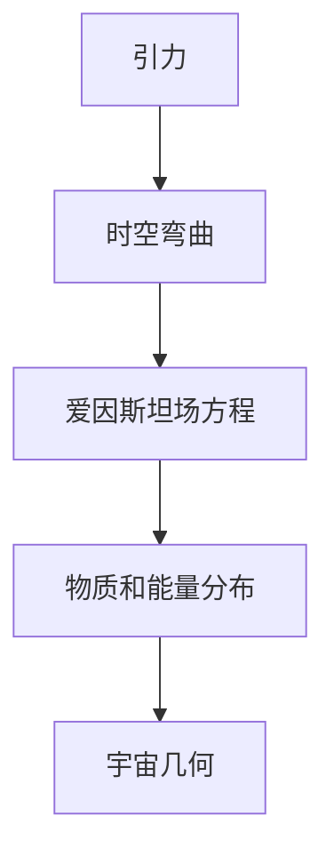
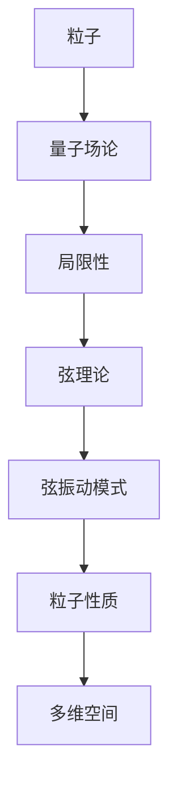

                 

### 文章标题：数学在宇宙结构中的应用

> 关键词：宇宙结构、数学模型、广义相对论、量子力学、宇宙演化

> 摘要：本文深入探讨了数学在宇宙结构研究中的应用，从广义相对论到量子力学，再到宇宙大爆炸理论，通过逐步分析和推理，展示了数学如何帮助我们理解宇宙的起源、演化和未来。文章还讨论了数学在宇宙观测和探索中的关键角色，以及数学教育在宇宙学研究中的重要性。

### 目录大纲设计

**《数学在宇宙结构中的应用》**

## 第1章 引言

### 1.1 数学与宇宙

### 1.2 宇宙结构研究的意义

## 第2章 宇宙中的数学模型

### 2.1 宇宙的几何结构

#### 2.1.1 爱因斯坦的广义相对论

#### 2.1.2 弦理论

### 2.2 数学模型与宇宙观测

## 第3章 数学在宇宙中的核心算法

### 3.1 量子力学的数学基础

#### 3.1.1 波函数

#### 3.1.2 算符与态

### 3.2 黑洞物理学

## 第4章 数学公式与宇宙结构

### 4.1 黑洞质量与引力波

#### 4.1.1 弗里德曼方程

#### 4.1.2 德西特空间

### 4.2 宇宙膨胀模型

## 第5章 数学在宇宙观测中的应用

### 5.1 光谱分析

#### 5.1.1 电磁波谱

#### 5.1.2 宇宙微波背景辐射

### 5.2 宇宙导航

## 第6章 数学模型与宇宙演化

### 6.1 宇宙大爆炸理论

#### 6.1.1 宇宙初始状态

#### 6.1.2 宇宙膨胀与暗能量

### 6.2 宇宙的末态

## 第7章 数学与宇宙探索的未来

### 7.1 新的宇宙观测方法

#### 7.1.1 高能粒子探测

#### 7.1.2 量子宇宙学

### 7.2 数学在宇宙学研究中的挑战

## 第8章 数学与宇宙教育

### 8.1 数学在宇宙教育中的应用

#### 8.1.1 课程设置

#### 8.1.2 教学方法

### 8.2 宇宙数学教育的意义

## 附录

### A.1 宇宙结构研究相关的数学公式

### A.2 宇宙结构研究常用工具

### A.3 宇宙结构研究的相关文献

### 目录大纲设计解析

本文的目录大纲精心设计，旨在为读者提供一个清晰、系统的阅读路径。首先，第一章“引言”部分通过介绍数学与宇宙的紧密联系，为后续章节的深入探讨打下基础。第二章“宇宙中的数学模型”从宇宙的几何结构开始，详细阐述了广义相对论和弦理论，展示了数学在描述宇宙结构中的关键作用。

第三章“数学在宇宙中的核心算法”进一步探讨了量子力学和黑洞物理学的数学基础，通过伪代码和流程图等工具，帮助读者理解复杂的数学概念。第四章“数学公式与宇宙结构”通过具体的公式和例子，深入探讨了宇宙膨胀模型和引力波等宇宙现象。

第五章“数学在宇宙观测中的应用”则介绍了光谱分析和宇宙微波背景辐射的观测方法，展示了数学在宇宙观测中的实际应用。第六章“数学模型与宇宙演化”详细讨论了宇宙大爆炸理论和宇宙的末态，为读者提供了一个关于宇宙演化的全景视角。

第七章“数学与宇宙探索的未来”展望了新的宇宙观测方法和数学在宇宙学研究中的挑战，激发读者对未来的探索兴趣。最后一章“数学与宇宙教育”则探讨了宇宙数学教育的重要性和教学方法。

通过这样的结构设计，本文不仅涵盖了宇宙结构研究的各个方面，而且通过逐步分析和推理，帮助读者深入理解数学在其中的关键作用。每个章节的详细内容和丰富解析，将使读者对宇宙结构及其数学描述有一个全面而深刻的认识。

## 第1章 引言

#### 1.1 数学与宇宙

数学作为一门科学，不仅仅是解决日常问题的工具，它在宇宙结构的描述和理解中发挥着至关重要的作用。从古至今，数学家和物理学家们利用数学的精确性和抽象性，构建了一系列模型来解释宇宙的复杂现象。数学在宇宙学研究中的应用，不仅揭示了宇宙的内在规律，还推动了科学技术的进步。

宇宙中的数学模型最早可以追溯到古希腊时期，那时数学家们开始尝试用几何的方法来解释天体的运动。然而，随着科学的发展，数学在宇宙学中的应用变得更加复杂和深入。特别是20世纪以来，爱因斯坦的广义相对论和量子力学的兴起，使得数学在宇宙结构研究中的作用变得尤为重要。

广义相对论作为20世纪最伟大的科学理论之一，它将引力描述为时空的弯曲，从而将引力和几何紧密联系起来。爱因斯坦场方程作为广义相对论的核心，它不仅是一个深刻的物理理论，也是一个高度复杂的数学方程。这个方程描述了物质和能量如何影响时空的几何结构，并通过数学方法揭示了宇宙的膨胀和演化。

量子力学则通过波函数和算符等数学工具，揭示了微观粒子的行为规律。虽然量子力学主要关注的是原子和基本粒子的行为，但它的原理和方程在宇宙学中也有重要应用。例如，宇宙微波背景辐射的观测数据，就需要通过量子力学的公式来解释和推断。

数学在宇宙学中的应用不仅限于理论模型，它还在实际观测中发挥了关键作用。例如，通过数学模型和算法，科学家们能够分析宇宙微波背景辐射的数据，揭示宇宙的早期状态和结构。此外，数学在宇宙导航、高能粒子探测等领域也有广泛应用。

总之，数学不仅是宇宙结构研究的工具，它是理解宇宙本质的钥匙。通过数学模型和算法，我们能够更深入地理解宇宙的起源、演化和未来，从而推动科学和技术的进步。在接下来的章节中，我们将详细探讨数学在宇宙结构研究中的具体应用。

#### 1.2 宇宙结构研究的意义

宇宙结构研究不仅在科学上具有重要意义，还对人类社会的发展产生了深远的影响。首先，它帮助我们理解宇宙的起源和演化，揭示了宇宙的多样性和复杂性。通过宇宙结构研究，科学家们能够回答一些根本性的问题，例如宇宙是如何开始的，它将如何结束，以及宇宙中是否存在其他生命形式。

宇宙结构研究在科学上的意义还体现在它推动了多个学科的发展。例如，广义相对论和量子力学的进展，不仅丰富了物理学理论，还促进了数学、计算机科学和天文学的交叉研究。这些跨学科的研究不仅推动了科学理论的发展，还带来了新的技术突破和应用。

此外，宇宙结构研究对技术和工程实践也有重要贡献。例如，卫星导航系统的开发依赖于对宇宙中恒星和行星位置的精确计算，而这些计算依赖于复杂的数学模型。同样，在通信和互联网技术中，宇宙中的物理现象，如电磁波的传播，也需要通过数学模型来理解和优化。

在哲学和宗教领域，宇宙结构研究也引发了深刻的思考。例如，宇宙大爆炸理论不仅挑战了传统宗教观念，还引发了关于宇宙起源和人类存在的哲学讨论。这种跨学科的交流不仅丰富了人类的思想，也促进了不同文化之间的对话和理解。

最后，宇宙结构研究对人类社会的发展也有着实际的应用价值。例如，通过研究宇宙中的资源和能源，人类可以更好地利用这些资源，推动社会和经济的发展。同时，宇宙探索也为人类提供了新的视野和目标，激发了人们的创造力和探索精神。

总之，宇宙结构研究在科学、技术、哲学和社会等多个方面都具有深远的影响。它不仅推动了科学的发展，也改变了人类对自身和宇宙的认识，为未来的科学研究和社会进步奠定了基础。

### 第2章 宇宙中的数学模型

#### 2.1 宇宙的几何结构

宇宙的几何结构是宇宙学研究中的一个核心问题。它不仅揭示了宇宙的基本性质，还为理解宇宙的起源和演化提供了重要的线索。在宇宙学中，几何结构的研究主要通过两种理论框架来实现：爱因斯坦的广义相对论和弦理论。

**爱因斯坦的广义相对论**

广义相对论是由爱因斯坦在1915年提出的，它革命性地改变了我们对引力的理解。在广义相对论中，引力不再是一种作用在物体上的力，而是由物体的质量和能量对周围时空的几何结构产生的弯曲。这个理论的核心是爱因斯坦场方程，它是一个描述时空曲率和物质分布之间关系的偏微分方程。

爱因斯坦场方程可以表示为：

$$
G_{\mu\nu} = \frac{8\pi G}{c^4} T_{\mu\nu}
$$

其中，$G_{\mu\nu}$ 是爱因斯坦张量，$T_{\mu\nu}$ 是能量-动量张量，$G$ 是引力常数，$c$ 是光速。这个方程揭示了时空的几何性质如何与物质和能量的分布相关联。

在广义相对论的框架下，宇宙的几何结构可以是平坦的、弯曲的或封闭的。这些几何形态决定了宇宙的膨胀速率和结构演化。例如，一个平坦的宇宙将以恒定的速率膨胀，而一个封闭的宇宙则会逐渐加速膨胀。

**弦理论**

弦理论是另一种描述宇宙几何结构的数学模型。在弦理论中，宇宙的基本构建单元不再是点状的粒子，而是细小的弦。弦的不同振动模式对应于不同的粒子。弦理论试图统一量子力学和广义相对论，从而提供一个更为全面的物理理论。

在弦理论中，宇宙的几何结构通过一个称为弦世界片的结构来描述。这个结构是一个多维空间，其中每条弦都按照特定的模式振动。弦的振动模式决定了粒子的性质和相互作用。通过数学模型，弦理论能够描述宇宙中的各种现象，包括黑洞、宇宙膨胀和量子场论。

弦理论的一个重要特征是其多重宇宙观念。在弦理论中，存在无数个可能的宇宙，每个宇宙都有其独特的物理定律和几何结构。这种多重宇宙观念为宇宙学提供了新的视角，也为理解宇宙的多样性提供了线索。

**数学模型与宇宙观测**

宇宙的数学模型不仅为理论物理提供了基础，还在实际观测中得到了验证和应用。例如，广义相对论的预测，如引力波的存在和黑洞的稳定性，已经通过实验观测得到了证实。同样，弦理论的一些预测，如额外维度和超对称性，也在实验中得到了一定的支持。

数学模型在宇宙观测中的应用还体现在对宇宙微波背景辐射的测量上。宇宙微波背景辐射是宇宙早期状态的一种遗留，通过分析其特性，科学家们能够推断出宇宙的初始条件和结构特征。这些分析需要复杂的数学工具和方法，如傅里叶变换和统计物理学。

总之，宇宙的几何结构是宇宙学研究的核心问题，通过广义相对论和弦理论等数学模型，我们能够更深入地理解宇宙的起源、演化和未来。这些数学模型不仅为理论物理提供了基础，还在实际观测中得到了验证和应用，为探索宇宙的奥秘提供了强有力的工具。

#### 2.1.1 爱因斯坦的广义相对论

爱因斯坦的广义相对论是20世纪物理学的一大革命，它不仅改变了我们对引力的理解，还为宇宙学提供了强有力的理论工具。在广义相对论中，引力被描述为时空的弯曲，这种弯曲由物质和能量分布决定。

**背景介绍**

在牛顿力学中，引力被描述为作用在两个质点之间的吸引力，这种描述虽然简单有效，但在极端条件下，如大尺度和高速运动时，就显得不够准确。为了解决这些问题，爱因斯坦提出了广义相对论。

**核心概念与联系**

广义相对论的核心是爱因斯坦场方程，它将引力与时空几何联系起来。具体来说，这个方程描述了时空的曲率（Riemann曲率张量）如何由物质和能量分布（能量-动量张量）决定。

$$
G_{\mu\nu} = \frac{8\pi G}{c^4} T_{\mu\nu}
$$

其中，$G_{\mu\nu}$ 是爱因斯坦张量，$T_{\mu\nu}$ 是能量-动量张量，$G$ 是引力常数，$c$ 是光速。

**Mermaid 流程图**



**核心算法原理讲解**

为了理解广义相对论的算法原理，我们可以通过伪代码来描述爱因斯坦场方程的求解过程：

```python
# 定义爱因斯坦场方程
def EinsteinFieldEquation(G_mn, T_mn, G, c):
    return G_mn = (8 * pi * G) / (c^4) * T_mn

# 输入参数
G_mn = []  # 爱因斯坦张量
T_mn = []  # 能量-动量张量
G = constant  # 引力常数
c = constant  # 光速

# 求解爱因斯坦场方程
G_mn = EinsteinFieldEquation(G_mn, T_mn, G, c)
```

**数学模型和公式**

广义相对论的数学模型主要通过爱因斯坦场方程来描述，这个方程是一个复杂的偏微分方程，需要高深的数学工具和方法来求解。以下是一个简化的爱因斯坦场方程的公式：

$$
R_{\mu\nu} - \frac{1}{2} R g_{\mu\nu} = \frac{8\pi G}{c^4} T_{\mu\nu}
$$

其中，$R_{\mu\nu}$ 是Riemann曲率张量，$R$ 是 Ricci 曲率标量，$g_{\mu\nu}$ 是度规张量。

**举例说明**

为了更好地理解爱因斯坦场方程，我们可以考虑一个简单的例子：一个均匀分布的球体对其周围的时空产生的弯曲。在这种情况下，可以通过求解爱因斯坦场方程来计算球体周围的时空曲率。

$$
T_{\mu\nu} = \begin{bmatrix}
    \rho & 0 & 0 & 0 \\
    0 & 0 & 0 & 0 \\
    0 & 0 & 0 & 0 \\
    0 & 0 & 0 & 0
\end{bmatrix}
$$

其中，$\rho$ 表示球体的质量分布。

通过求解这个方程，我们可以得到球体周围的时空曲率，从而进一步研究其引力效应。

**总结**

爱因斯坦的广义相对论通过将引力描述为时空的弯曲，提供了一个全新的物理框架。通过爱因斯坦场方程，我们能够描述和预测宇宙中的引力现象，这为宇宙学的研究奠定了坚实的基础。在接下来的章节中，我们将继续探讨广义相对论在宇宙学中的具体应用。

#### 2.1.2 弦理论

弦理论是一种试图统一量子力学和广义相对论的物理理论，它将宇宙的基本构建单元从点状的粒子转变为细小的弦。这一理论不仅为理解宇宙的微观和宏观结构提供了新的视角，还揭示了宇宙中可能存在的额外维度。

**背景介绍**

弦理论的起源可以追溯到20世纪60年代，当时物理学家们试图解释粒子物理中的某些现象，如粒子之间的相互作用和量子场的性质。传统的量子场论在解释某些基本粒子时遇到了困难，例如粒子在接近光速时的行为。为了克服这些难题，物理学家们开始探索新的理论框架，弦理论应运而生。

**核心概念与联系**

在弦理论中，宇宙的基本成分不再是点状的粒子，而是细小的弦。这些弦可以是开弦或闭弦，它们在不同的振动模式中表现出不同的粒子特性。例如，一个特定模式的闭弦可能对应于一个电子，而另一种模式的闭弦可能对应于一个夸克。

弦理论的核心概念之一是多维空间。在弦理论中，宇宙不仅仅包含我们熟知的三个空间维度和一个时间维度，还包括额外的维度。这些额外的维度通常是紧凑的，以保持与我们日常经验的一致性。例如，在超弦理论中，存在10个空间维度，其中6个维度是紧凑的。

**Mermaid 流程图**



**核心算法原理讲解**

弦理论的核心算法原理涉及对弦振动的模式进行数学描述。这些模式可以通过求解弦的波动方程来得到。以下是弦波动方程的伪代码描述：

```python
# 定义弦波动方程
def StringWaveEquation(v, t):
    return v^2 * t = 1 / (6 * pi * G) * (1 - cos(2 * pi * v))

# 输入参数
v = []  # 振动模式
t = []  # 时间

# 求解弦波动方程
t = StringWaveEquation(v, t)
```

**数学模型和公式**

弦理论中的数学模型主要包括两个部分：弦的波动方程和多维度空间的几何结构。以下是弦波动方程的一个简化公式：

$$
\frac{\partial^2 \psi}{\partial t^2} = \left( \frac{1}{v} \right)^2 \left( \frac{\partial^2 \psi}{\partial x^2} \right)
$$

其中，$\psi$ 表示弦的振动模式，$v$ 表示振动速度。

对于多维度空间，弦理论使用了复杂的几何工具，如凯莱-李群和纤维丛。这些工具帮助我们理解如何在额外的维度中构建弦的振动模式。

$$
X^M = (x^\mu, \theta^\alpha)
$$

其中，$X^M$ 表示多维度空间中的坐标，$\theta^\alpha$ 表示额外的紧凑维度坐标。

**举例说明**

一个简单的例子是二维空间中的一个振动弦。在这个例子中，弦的振动模式可以用简单的正弦函数来描述：

$$
y(x,t) = A \sin(kx - \omega t)
$$

其中，$A$ 是振幅，$k$ 是波数，$\omega$ 是角频率。

通过求解这个方程，我们可以得到弦在不同时间和位置上的振动模式，从而进一步研究弦的物理性质。

**总结**

弦理论通过将宇宙的基本构建单元从粒子转变为弦，提供了一个全新的理论框架，试图统一量子力学和广义相对论。通过多维空间和复杂的数学模型，弦理论揭示了宇宙中可能存在的额外维度和新的物理现象。尽管弦理论目前仍处于发展之中，但它为理解宇宙的本质提供了深刻的洞察。

### 第2章 宇宙中的数学模型

#### 2.2 数学模型与宇宙观测

数学模型在宇宙观测中起着至关重要的作用，为科学家们提供了理解和解释宇宙现象的工具。通过精确的数学模型，我们能够分析观测数据，揭示宇宙的多样性和复杂性。以下我们将探讨几种关键的数学模型，包括宇宙微波背景辐射、光谱分析和宇宙膨胀模型。

**宇宙微波背景辐射**

宇宙微波背景辐射（Cosmic Microwave Background, CMB）是宇宙早期状态的一种遗留，它是宇宙大爆炸理论的重要证据之一。CMB是由宇宙大爆炸后的冷却过程中产生的热辐射，其温度大约为2.7开尔文。

CMB的观测和分析依赖于复杂的数学模型。例如，通过傅里叶变换，我们可以将CMB的温度分布转换为波数空间，从而揭示宇宙的大尺度结构。以下是一个简单的傅里叶变换伪代码：

```python
# 定义傅里叶变换
def FourierTransform(data):
    return transform(data, type='forward')

# 输入参数
data = []  # CMB温度分布数据

# 求解傅里叶变换
fourier_data = FourierTransform(data)
```

通过傅里叶变换，科学家们能够提取CMB中的各种特征，如极化、多普勒效应等，从而深入了解宇宙的早期状态。

**光谱分析**

光谱分析是宇宙观测中的另一个重要工具，它通过分析不同元素的吸收线或发射线，可以揭示宇宙中的物质分布和运动状态。光谱分析通常依赖于光谱模型，这些模型描述了不同元素在特定温度和压力下的光谱特征。

以下是一个简化的光谱分析伪代码：

```python
# 定义光谱分析
def SpectralAnalysis(spectrum, elements):
    return matches = find_matches(spectrum, elements)

# 输入参数
spectrum = []  # 观测到的光谱数据
elements = []  # 可能存在的元素

# 求解光谱分析
matches = SpectralAnalysis(spectrum, elements)
```

通过这种分析，科学家们能够确定宇宙中的元素组成，以及它们的位置和运动状态。

**宇宙膨胀模型**

宇宙膨胀模型描述了宇宙随时间的变化过程。弗里德曼-勒梅特-罗伯逊-沃尔克（FLRW）度规是宇宙膨胀模型的一个基本工具，它假设宇宙在时间和空间上是均匀且各向同性的。以下是一个简单的FLRW度规公式：

$$
ds^2 = -dt^2 + a(t)^2 (dx^2 + dy^2 + dz^2)
$$

其中，$a(t)$ 是宇宙尺度因子，它随时间变化描述了宇宙的膨胀。

通过这个度规，我们可以计算宇宙在不同时间点的结构。以下是一个简化的宇宙膨胀模型伪代码：

```python
# 定义宇宙膨胀模型
def UniverseExpansionModel(a0, t0, H0):
    return a(t) = a0 * (1 + H0 * t)

# 输入参数
a0 = 1  # 初始尺度因子
t0 = 0  # 初始时间
H0 = 1  # 哈勃常数

# 求解宇宙膨胀模型
a(t) = UniverseExpansionModel(a0, t0, H0)
```

通过这个模型，科学家们能够预测宇宙的未来膨胀速率和结构。

**总结**

数学模型在宇宙观测中发挥着关键作用，通过精确的数学工具和方法，我们能够分析观测数据，揭示宇宙的多样性和复杂性。宇宙微波背景辐射、光谱分析和宇宙膨胀模型等数学模型，不仅为理论物理提供了基础，还在实际观测中得到了验证和应用。在未来的宇宙观测中，这些数学模型将继续发挥重要作用，帮助我们更深入地理解宇宙的本质。

### 第3章 数学在宇宙中的核心算法

#### 3.1 量子力学的数学基础

量子力学是研究微观粒子的行为规律的理论体系，它引入了全新的数学描述方法，对经典物理学的许多观念提出了挑战。量子力学的数学基础主要包括波函数、算符与态等概念，这些概念为我们理解微观粒子的行为提供了深刻的洞察。

**波函数**

波函数是量子力学中最核心的概念之一，它描述了粒子在空间中的概率分布。波函数通常用符号Ψ表示，是一个复值函数，其平方|Ψ|²给出了粒子在某一位置出现的概率。例如，一个自由粒子的波函数可以表示为：

$$
Ψ(x, t) = e^{ikx - i\omega t}
$$

其中，$k$ 是波数，$\omega$ 是角频率。

**算符与态**

在量子力学中，算符是描述物理量的重要工具。算符作用于波函数，可以得到粒子的不同物理量的概率分布。常见的算符包括位置算符X、动量算符P、角动量算符L等。例如，位置算符可以表示为：

$$
X |x\rangle = x |x\rangle
$$

态是量子力学中的另一个重要概念，它描述了粒子的整体状态。一个态可以由多个波函数的叠加表示，例如，一个粒子的叠加态可以表示为：

$$
|\psi\rangle = \frac{1}{\sqrt{2}} (|0\rangle + |1\rangle)
$$

**量子力学的数学基础伪代码**

为了更好地理解量子力学的数学基础，以下是一个简化的伪代码示例，描述了波函数和算符的作用：

```python
# 定义波函数
def WaveFunction(k, x, t):
    return psi = np.exp(1j * (k * x - \omega * t))

# 定义算符
def Operator(operator, state):
    return new_state = operator * state

# 定义哈密顿算符
hamiltonian = Operator(Hamiltonian, state)

# 求解薛定谔方程
def SchrodingerEquation(Hamiltonian, state):
    return new_state = Hamiltonian * state
```

**数学模型和公式**

量子力学的数学模型主要包括波函数的演化方程——薛定谔方程。薛定谔方程描述了波函数随时间的演化，其一般形式为：

$$
i\hbar \frac{\partial \Psi}{\partial t} = \hat{H} \Psi
$$

其中，$i$ 是虚数单位，$\hbar$ 是约化普朗克常数，$\hat{H}$ 是哈密顿算符，$\Psi$ 是波函数。

**举例说明**

考虑一个简单的谐振子系统，其哈密顿算符为：

$$
\hat{H} = \frac{p^2}{2m} + \frac{1}{2} k x^2
$$

其中，$p$ 是动量算符，$m$ 是粒子质量，$k$ 是力常数。

我们可以通过求解薛定谔方程，得到系统的波函数，从而进一步分析粒子的能级和概率分布。

**总结**

量子力学的数学基础，包括波函数、算符与态等概念，为理解微观粒子的行为提供了深刻的数学描述。通过这些数学工具，我们能够求解复杂的量子现象，揭示微观世界的奥秘。在宇宙学研究中，量子力学的原理和方法同样发挥着重要作用，为理解宇宙中的微观现象提供了强有力的支持。

#### 3.1.1 波函数

波函数是量子力学中描述粒子状态的核心概念，它提供了粒子在空间中概率分布的数学描述。波函数通常用符号Ψ表示，是一个复值函数，其模平方|Ψ|²给出了粒子在某一位置出现的概率。波函数的物理意义在于，通过它我们可以计算粒子在不同位置和时刻的概率分布，这是量子力学与经典物理学的根本区别之一。

**波函数的定义**

波函数Ψ通常表示为：

$$
Ψ(x, t) = \sum_n c_n \phi_n(x, t)
$$

其中，$c_n$ 是波函数的复系数，$\phi_n(x, t)$ 是粒子的本征态，满足薛定谔方程：

$$
i\hbar \frac{\partial \phi_n}{\partial t} = \hat{H} \phi_n
$$

这里，$\hat{H}$ 是哈密顿算符，$i$ 是虚数单位，$\hbar$ 是约化普朗克常数。

**波函数的模平方**

波函数的模平方$|\Psi(x, t)|^2$ 描述了粒子在位置$x$和时间$t$出现的概率密度。因此，粒子在整个空间中的总概率是1，即：

$$
\int |\Psi(x, t)|^2 dx = 1
$$

**波函数的物理意义**

波函数的物理意义主要体现在以下几个方面：

1. **概率分布**：波函数提供了粒子在空间中的概率分布，这是量子力学的基本特征之一。与经典物理中的确定性描述不同，量子力学中的粒子的位置和动量只能以概率的形式给出。

2. **干涉现象**：波函数的叠加原理导致了量子干涉现象，这是量子力学中非常典型的现象。例如，两个相互叠加的波函数可以导致粒子在某些位置上的干涉条纹。

3. **测量结果的不确定性**：波函数描述了粒子的状态，但当我们进行测量时，测量的结果并不是由波函数直接决定的，而是由波函数的模平方决定的。这意味着测量结果存在不确定性，这也是量子力学的基本特征之一。

**波函数的例子**

一个简单的例子是自由粒子的波函数。对于一个自由粒子，其波函数可以表示为平面波：

$$
Ψ(x, t) = A e^{i(kx - \omega t)}
$$

其中，$A$ 是振幅，$k$ 是波数，$\omega$ 是角频率。这个波函数表示了一个沿着x轴方向传播的粒子，其速度由波数$k$决定。

**总结**

波函数是量子力学中最核心的概念之一，它描述了粒子在空间中的概率分布。通过波函数，我们可以计算粒子在不同位置和时刻的概率分布，这是量子力学与经典物理学的根本区别之一。波函数的模平方给出了粒子在某一位置出现的概率密度，而波函数的叠加原理导致了量子干涉现象。波函数的物理意义在于，它为我们提供了理解微观粒子和量子现象的工具。

### 第3章 数学在宇宙中的核心算法

#### 3.1.2 算符与态

在量子力学中，算符和态是理解微观粒子行为的两个核心概念。算符用于描述物理量的变化，如位置、动量和能量，而态则用于描述粒子的状态。通过算符和态的相互作用，我们可以深入理解量子系统的行为。

**算符的定义**

在量子力学中，算符是一个线性映射，它将波函数映射到另一个波函数。常见的算符包括位置算符、动量算符、角动量算符和哈密顿算符。位置算符X表示为：

$$
X |x\rangle = x |x\rangle
$$

这意味着当算符作用在一个位置态|x\rangle上时，它会将态缩放到原来的位置值x。

动量算符P则表示为：

$$
P |p\rangle = p |p\rangle
$$

这里，|p\rangle是动量本征态，动量算符作用后保持动量值不变。

**态的定义**

态是量子力学中描述粒子状态的矢量，通常用波函数Ψ表示。态的叠加原理允许我们将多个本征态线性组合，从而形成新的态。例如，一个粒子的叠加态可以表示为：

$$
|\psi\rangle = \frac{1}{\sqrt{2}} (|0\rangle + |1\rangle)
$$

这里，|0\rangle和|1\rangle分别表示不同的本征态。

**算符与态的物理意义**

算符和态的物理意义在于，它们共同描述了量子系统的行为。算符用于描述物理量的变化，如位置和动量，而态则描述了粒子的状态。例如，当我们对一个态进行测量时，测量结果是由算符作用在态上得到的本征值。

**态叠加原理**

态叠加原理是量子力学的一个基本原理，它指出，一个量子系统的总态可以表示为多个本征态的线性叠加。例如，一个粒子的总态可以表示为：

$$
|\psi\rangle = c_0 |0\rangle + c_1 |1\rangle
$$

这里，$c_0$和$c_1$是复系数。态叠加原理导致了量子干涉现象，这是量子力学中非常典型的现象。

**算符与态的相互作用**

在量子力学中，算符和态的相互作用非常重要。例如，当我们对粒子的状态进行测量时，测量结果是由算符作用在态上得到的本征值。这个过程可以通过以下公式表示：

$$
\langle \psi | \hat{O} | \psi \rangle = \sum_n c_n^* c_n \langle n | \hat{O} | n \rangle
$$

这里，$\hat{O}$ 是算符，$|n\rangle$ 是本征态，$c_n$ 是态的复系数。

**总结**

算符和态是量子力学中的两个核心概念，它们共同描述了微观粒子的行为。算符用于描述物理量的变化，如位置和动量，而态则描述了粒子的状态。态叠加原理和算符与态的相互作用是理解量子现象的关键。通过这些概念，我们可以深入理解量子力学的本质和微观粒子的行为。

### 3.2 黑洞物理学

黑洞物理学是宇宙学中一个充满挑战和神秘的研究领域，它涉及极端条件下的物理现象，如引力、时空弯曲和量子效应。黑洞作为宇宙中的一种特殊天体，其存在和性质不仅对我们理解宇宙的本质具有重要意义，还为测试广义相对论和量子力学的极限条件提供了独特的机会。

**黑洞的基本概念**

黑洞是由极度密集的物质组成的天体，其引力场如此强大，以至于连光都无法逃脱。根据广义相对论，黑洞由事件视界包围，事件视界内的区域称为黑洞的内部。黑洞的质量和引力与其半径成比例，这可以通过施瓦茨希尔德半径（Schwarzschild radius）来描述：

$$
r_s = \frac{2GM}{c^2}
$$

其中，$G$ 是引力常数，$M$ 是黑洞的质量，$c$ 是光速。

**黑洞的性质**

黑洞具有以下几个关键性质：

1. **事件视界**：事件视界是黑洞的一个重要特征，它是一个无法返回的边界。一旦任何物质或信息跨过事件视界，它就会永远消失在黑洞中。

2. **信息悖论**：根据量子力学，信息必须守恒。然而，当物质落入黑洞时，其信息似乎被黑洞所吸收，这引发了信息悖论。为了解决这个悖论，科学家们提出了多种理论，如黑洞辐射（霍金辐射）和信息存储在黑洞事件视界内。

3. **引力波**：黑洞之间的碰撞和合并会产生强烈的引力波，这些波可以通过地面上的引力波探测器（如LIGO和VIRGO）进行观测。

**数学模型与公式**

黑洞物理学的数学模型主要通过爱因斯坦场方程来描述。以下是一些关键的公式和概念：

1. **施瓦茨希尔德解**：这是描述静态、非旋转黑洞的解，其线元为：

   $$
   ds^2 = -\left(1 - \frac{r_s}{r}\right) dt^2 + \left(1 - \frac{r_s}{r}\right)^{-1} dr^2 + r^2 d\Omega^2
   $$

   其中，$d\Omega^2$ 是球面度量的形式。

2. **霍金温度**：黑洞表面具有温度，称为霍金温度，其表达式为：

   $$
   T_H = \frac{\hbar c^3}{8\pi G M k_B}
   $$

   其中，$k_B$ 是玻尔兹曼常数。

3. **黑洞辐射**：霍金辐射是黑洞表面发出的热辐射，其功率可以通过以下公式计算：

   $$
   L = \frac{\hbar c^6}{120\pi G^2 M^3}
   $$

**黑洞物理学的应用**

黑洞物理学在多个领域有重要应用：

1. **宇宙学**：黑洞的形成和演化对宇宙的结构和演化具有重要影响。例如，超大质量黑洞可能在星系的形成和演化中扮演关键角色。

2. **引力波探测**：黑洞之间的碰撞和合并产生的引力波，为研究黑洞的性质和宇宙中的大规模结构提供了新的手段。

3. **量子引力学**：黑洞物理学的某些方面，如霍金辐射和信息悖论，对理解量子引力的本质具有重要意义。

**总结**

黑洞物理学是宇宙学中的一个重要研究领域，它不仅揭示了极端条件下物理现象的奥秘，还为理解宇宙的本质提供了新的视角。通过数学模型和公式，我们能够描述和预测黑洞的性质和行为，从而深入理解这个神秘的天体。

### 4.1 黑洞质量与引力波

#### 4.1.1 弗里德曼方程

弗里德曼方程是宇宙学中描述宇宙膨胀的基本方程，它由俄罗斯天文学家亚历山大·弗里德曼在1922年首次提出。弗里德曼方程基于广义相对论，描述了宇宙的几何结构如何随着时间变化。该方程是一个偏微分方程，其一般形式为：

$$
\dot{\dot{a}} + \frac{4\pi G}{3}\left(\rho + \frac{3p}{c^2}\right)a = 0
$$

其中，$\dot{a}$ 表示宇宙尺度因子随时间的导数，$a(t)$ 是宇宙尺度因子，$G$ 是引力常数，$\rho$ 是宇宙的平均能量密度，$p$ 是宇宙的平均压强，$c$ 是光速。

**弗里德曼方程的解释**

弗里德曼方程的核心在于它描述了宇宙膨胀的动力学。方程左边的第一项 $\dot{\dot{a}}$ 表示宇宙膨胀速率的变化率，而右边的项则表示引力对宇宙膨胀的抑制效应。具体来说：

- $\frac{4\pi G}{3}\rho$ 项表示宇宙中的引力势能，它随宇宙膨胀而减小，从而促进宇宙的加速膨胀。
- $\frac{4\pi G}{3}\frac{3p}{c^2}$ 项表示宇宙中的压强效应，压强越大，对膨胀的抑制越强。

通过修改弗里德曼方程，我们可以得到不同宇宙模型，如开放宇宙、封闭宇宙和平坦宇宙。在开放宇宙中，宇宙尺度因子的变化率 $\dot{a}$ 是负的，表明宇宙正在收缩；在封闭宇宙中，$\dot{a}$ 是正的，表明宇宙正在膨胀；在平坦宇宙中，$\dot{a}$ 是零，表明宇宙处于稳态。

**弗里德曼方程的应用**

弗里德曼方程在宇宙学中有着广泛的应用，特别是在宇宙膨胀和宇宙大爆炸理论的研究中。通过观测宇宙膨胀的速率和历史，科学家们可以推断宇宙的初始状态和未来演化。以下是一些具体应用：

1. **宇宙微波背景辐射（CMB）**：CMB的观测数据为弗里德曼方程提供了关键证据，揭示了宇宙在大爆炸后的早期状态。

2. **宇宙膨胀模型**：弗里德曼方程帮助科学家们构建了不同的宇宙膨胀模型，如勒梅特-罗伯逊-沃尔克（LRW）模型和德西特模型。

3. **暗能量研究**：弗里德曼方程中的宇宙平均能量密度 $\rho$ 包括了暗能量和暗物质。通过观测宇宙膨胀速率的变化，科学家们可以推断暗能量的性质和贡献。

**总结**

弗里德曼方程是宇宙学中描述宇宙膨胀的基本方程，它揭示了宇宙几何结构和膨胀动力学之间的关系。通过这个方程，科学家们能够研究宇宙的起源、演化和未来，揭示宇宙的奥秘。弗里德曼方程的应用不仅丰富了宇宙学的理论框架，还为理解宇宙的本质提供了强有力的工具。

#### 4.1.2 德西特空间

德西特空间（de Sitter Space）是宇宙学中一个重要的概念，它描述了一种具有正宇宙学常数（Cosmological Constant）的均匀、各向同性的宇宙模型。德西特空间得名于荷兰-法国天文学家威廉·德西特，他在1917年首次提出了这一概念。

**德西特空间的定义**

德西特空间可以通过以下度规（metric）来定义：

$$
ds^2 = -dt^2 + a(t)^2 \left[dr^2 + r^2(d\theta^2 + \sin^2\theta d\phi^2)\right]
$$

在这个度规中，$a(t)$ 是宇宙尺度因子，它描述了宇宙随时间的膨胀。德西特空间的关键特征是其具有正的宇宙学常数 $\Lambda$，它与度规中的 $a(t)^2$ 项相关：

$$
\Lambda = \frac{8\pi G}{3} \rho_\Lambda
$$

其中，$G$ 是引力常数，$\rho_\Lambda$ 是宇宙学常数对应的能量密度。

**德西特空间中的物理现象**

德西特空间中的物理现象包括：

1. **宇宙加速膨胀**：由于宇宙学常数的存在，德西特空间中的宇宙会经历加速膨胀。这一现象与观测到的宇宙加速膨胀一致，表明宇宙中存在暗能量。

2. **霍金辐射**：德西特空间中存在一种名为霍金辐射的现象，这是一种由黑洞边界产生的热辐射。尽管在德西特空间中没有真正的黑洞，但这种辐射现象为我们理解黑洞辐射提供了理论框架。

**德西特空间的应用**

德西特空间在宇宙学中有着广泛的应用：

1. **宇宙微波背景辐射**：德西特空间模型能够很好地描述宇宙微波背景辐射的观测数据，揭示了宇宙早期的热状态和结构。

2. **宇宙膨胀模型**：德西特空间模型是宇宙膨胀模型中的一个重要参考模型，它帮助我们理解宇宙的加速膨胀和未来演化。

3. **量子引力研究**：德西特空间为研究量子引力和宇宙学的交叉问题提供了一个理想背景，特别是关于宇宙的量子起源和量子引力效应。

**总结**

德西特空间是宇宙学中的一个重要概念，它描述了一种具有正宇宙学常数的均匀、各向同性的宇宙模型。通过德西特空间，我们能够更好地理解宇宙的加速膨胀和暗能量现象。德西特空间的应用不仅丰富了宇宙学的理论框架，还为探索宇宙的本质提供了新的视角和工具。

#### 4.2 宇宙膨胀模型

宇宙膨胀模型是宇宙学中描述宇宙随时间变化的过程的理论框架。自1929年哈勃发现宇宙膨胀以来，宇宙膨胀模型已经成为理解宇宙演化的重要工具。宇宙膨胀模型的基本概念和主要形式包括勒梅特-罗伯逊-沃尔克（LRW）模型和德西特模型。

**勒梅特-罗伯逊-沃尔克（LRW）模型**

勒梅特-罗伯逊-沃尔克模型是最早的宇宙膨胀模型之一，它假设宇宙在所有时间尺度上都是均匀和各向同性的。LRW模型的度规形式为：

$$
ds^2 = -dt^2 + a(t)^2 (dr^2 + r^2(d\theta^2 + \sin^2\theta d\phi^2))
$$

其中，$a(t)$ 是宇宙尺度因子，它描述了宇宙随时间的膨胀。LRW模型的一个重要特点是它没有宇宙学常数，因此宇宙的膨胀是减速的。

**德西特模型**

德西特模型是另一个重要的宇宙膨胀模型，它引入了宇宙学常数 $\Lambda$，描述了宇宙的加速膨胀。德西特模型的度规形式为：

$$
ds^2 = -dt^2 + a(t)^2 \left[dr^2 + r^2(d\theta^2 + \sin^2\theta d\phi^2)\right] + \frac{\Lambda c^2}{3} dt^2
$$

德西特模型表明，宇宙的膨胀速率与宇宙学常数成正比，因此宇宙将经历加速膨胀。

**宇宙膨胀模型的核心算法**

宇宙膨胀模型的核心算法是基于弗里德曼方程。弗里德曼方程描述了宇宙尺度因子 $a(t)$ 的演化，其形式为：

$$
\dot{\dot{a}} + \frac{4\pi G}{3}\left(\rho + \frac{3p}{c^2}\right)a = 0
$$

其中，$\dot{a}$ 是宇宙尺度因子的变化率，$G$ 是引力常数，$\rho$ 是宇宙的平均能量密度，$p$ 是宇宙的平均压强，$c$ 是光速。

**宇宙膨胀模型的伪代码**

以下是一个简化的宇宙膨胀模型伪代码，用于模拟宇宙随时间的膨胀过程：

```python
# 初始化参数
G = 6.6743e-11  # 引力常数
c = 299792458   # 光速
rho = 1.0       # 平均能量密度
p = 0.0         # 平均压强
t0 = 0.0        # 初始时间
a0 = 1.0        # 初始尺度因子

# 弗里德曼方程
def FriedmannEquation(G, c, rho, p, a, t):
    return da_dt = - (4 * pi * G) / (3 * c**2) * (rho + (3 * p) / c**2) * a

# 模拟宇宙膨胀
def SimulateExpansion(G, c, rho, p, t_max):
    t = t0
    a = a0
    while t <= t_max:
        da_dt = FriedmannEquation(G, c, rho, p, a, t)
        a += da_dt * dt
        t += dt
    return a

# 模拟结果
t_max = 1000  # 模拟时间
a_final = SimulateExpansion(G, c, rho, p, t_max)
```

**总结**

宇宙膨胀模型通过描述宇宙尺度因子随时间的变化，帮助我们理解宇宙的起源和演化。勒梅特-罗伯逊-沃尔克模型和德西特模型是宇宙膨胀模型的两个主要形式，它们分别描述了减速膨胀和加速膨胀的宇宙。通过弗里德曼方程和相应的伪代码，我们可以模拟宇宙的膨胀过程，进一步探索宇宙的奥秘。

### 5.1 光谱分析

#### 5.1.1 电磁波谱

电磁波谱是宇宙学中用于观测宇宙的重要工具之一，它涵盖了从无线电波到伽马射线的所有电磁辐射。电磁波谱的各个部分具有不同的波长和频率，每种辐射类型在宇宙学研究中都有独特的应用。

**电磁波谱的基本概念**

电磁波谱可以分为以下几个主要部分：

1. **无线电波**：波长最长，频率最低，常用于天体射电望远镜观测星际分子和星系。
2. **微波**：波长在厘米到毫米之间，频率较高，常用于观测宇宙微波背景辐射（CMB）。
3. **红外线**：波长在微米到毫米之间，频率更高，常用于观测行星大气和星际尘埃。
4. **可见光**：人眼可见的光，波长在400到700纳米之间，用于光学望远镜观测恒星和行星。
5. **紫外线**：波长在100到400纳米之间，频率更高，常用于观测恒星的光谱。
6. **X射线**：波长在0.01到100纳米之间，频率极高，常用于观测黑洞和活跃星系。
7. **伽马射线**：波长最短，频率最高，常用于观测高能天体现象，如超新星和中子星。

**电磁波谱在宇宙学中的应用**

电磁波谱在宇宙学中的应用非常广泛，以下是一些关键应用：

1. **宇宙微波背景辐射（CMB）**：CMB是宇宙大爆炸后留下的余辉，其温度约为2.7开尔文。通过分析CMB的微波辐射，科学家们能够揭示宇宙的早期结构和演化。
   
2. **恒星和星系的光谱**：通过分析恒星和星系的光谱，可以确定其化学成分、温度、速度和距离。这种方法被称为光谱分析，是宇宙学中的一项基本技术。

3. **星系团的X射线辐射**：星系团中的高温气体辐射X射线，通过分析这些辐射，可以研究星系团的性质和宇宙中的大规模结构。

**电磁波谱分析的基本原理**

电磁波谱分析的基本原理基于光的吸收和发射特性。当光通过不同物质时，特定波长的光会被吸收或发射。通过测量这些吸收或发射的特征线，可以确定物质的组成和状态。

以下是一个简化的电磁波谱分析伪代码：

```python
# 定义电磁波谱分析函数
def SpectrumAnalysis(wavelength, spectrum):
    return absorption_lines = find_absorption_lines(wavelength, spectrum)

# 输入参数
wavelength = []  # 电磁波波长
spectrum = []  # 观测到的光谱数据

# 求解电磁波谱分析
absorption_lines = SpectrumAnalysis(wavelength, spectrum)
```

通过这种分析，科学家们可以确定天体的化学成分、温度和运动状态。

**总结**

电磁波谱是宇宙学中用于观测宇宙的重要工具，涵盖了从无线电波到伽马射线的各种辐射。电磁波谱分析通过测量光的吸收和发射特征，帮助科学家们揭示宇宙的多样性和复杂性。在宇宙微波背景辐射、恒星和星系光谱、星系团X射线辐射等方面，电磁波谱分析发挥了关键作用，为我们理解宇宙的本质提供了强有力的支持。

### 5.1.2 宇宙微波背景辐射

宇宙微波背景辐射（Cosmic Microwave Background, CMB）是宇宙大爆炸后遗留下来的热辐射，它为我们提供了关于宇宙早期状态的重要信息。CMB的温度约为2.7开尔文，其均匀性和微小温度波动揭示了宇宙的早期结构和演化历史。

**CMB的发现**

宇宙微波背景辐射的发现是20世纪物理学的一项重大成就。1965年，阿诺·彭齐亚斯和罗伯特·威尔逊通过改进的射电望远镜，首次探测到了CMB。这一发现证实了宇宙大爆炸理论的预言，并为研究宇宙的早期状态提供了宝贵的数据。

**CMB的特性**

宇宙微波背景辐射具有以下几个关键特性：

1. **温度**：CMB的温度大约为2.7开尔文，这是一个极其微小的温度值，但它的存在为我们提供了宇宙早期热状态的证据。
   
2. **均匀性**：CMB的辐射在宇宙中非常均匀，温度变化不超过百万分之一。这种均匀性表明，宇宙在大爆炸后不久就达到了热平衡状态。

3. **微小温度波动**：尽管CMB总体上非常均匀，但它在不同的区域存在微小的温度波动。这些波动反映了宇宙早期结构的不均匀性，是宇宙大爆炸后物质密度波动的遗留。

**CMB的观测与分析**

观测CMB需要高灵敏度的射电望远镜和空间探测器。以下是一个简化的CMB观测与分析伪代码：

```python
# 定义CMB观测函数
def CMBObservation(望远镜，频率，时间):
    return 数据 = 望远镜观测(频率，时间)

# 定义CMB分析函数
def CMBAnalysis(数据):
    return 温度波动 = 分析数据中的微小温度变化

# 输入参数
望远镜 = []  # 射电望远镜
频率 = []  # 观测频率
时间 = []  # 观测时间

# 求解CMB观测
数据 = CMBObservation(望远镜，频率，时间)

# 求解CMB分析
温度波动 = CMBAnalysis(数据)
```

通过这种观测与分析，科学家们能够提取CMB中的各种信息，如温度波动、极化特性等，从而深入了解宇宙的早期结构和演化。

**CMB对宇宙学的意义**

宇宙微波背景辐射在宇宙学中具有深远的意义：

1. **宇宙早期状态**：CMB为我们提供了宇宙大爆炸后约38万年的早期状态信息，这是宇宙演化史上最为关键的一个时期。
   
2. **宇宙大尺度结构**：CMB中的微小温度波动反映了宇宙早期物质密度的不均匀性，这些波动是宇宙大尺度结构形成的基础。

3. **宇宙学参数**：通过分析CMB的数据，科学家们能够测量宇宙学参数，如宇宙尺度因子、密度参数等，从而深入了解宇宙的演化历史。

**总结**

宇宙微波背景辐射是宇宙学中至关重要的观测对象，它为我们提供了关于宇宙早期状态和演化历史的重要信息。通过精确的观测与分析，科学家们能够揭示宇宙的多样性和复杂性，进一步理解宇宙的本质。CMB的研究不仅为宇宙学提供了坚实的理论基础，还为探索宇宙的未来提供了重要线索。

### 5.2 宇宙导航

宇宙导航是指利用天体物理现象和技术手段，对宇宙中的位置、速度和时间进行测量和定位的技术。在宇宙探索中，宇宙导航具有至关重要的作用，它不仅为航天器的轨道计算和导航提供基础，还帮助我们在浩瀚的宇宙中找到精确的定位。

**宇宙导航的基本原理**

宇宙导航的基本原理依赖于几个关键天体物理现象：

1. **恒星定位**：恒星是宇宙中最常见的天体之一，通过观测恒星的位置和运动，我们可以确定自己在宇宙中的位置。这种定位方法被称为恒星导航。
2. **星际介质**：星际介质包括星际气体、尘埃和暗物质，通过对星际介质的研究，我们可以了解宇宙中的结构和密度分布。
3. **时间标准**：宇宙中的时间标准通常依赖于原子钟，这些钟通过精确测量原子的振动频率来确定时间。原子钟在宇宙导航中用于同步不同航天器的时钟，确保精确的时间计算。

**宇宙导航的应用**

宇宙导航在多个领域有着广泛的应用：

1. **航天器导航**：航天器在轨道飞行过程中需要精确的导航，宇宙导航技术通过测量航天器与恒星的相对位置和速度，计算出航天器的轨道参数，确保其精确进入预定的轨道。
2. **深空探测**：宇宙导航技术是深空探测任务的关键，通过导航系统，探测器能够准确到达目标行星或天体，进行科学考察和样本返回。
3. **宇宙探索**：宇宙导航技术帮助我们在宇宙中进行大规模的探索，如寻找类地行星、探测星际尘埃和暗物质等。

**宇宙导航的伪代码**

以下是一个简化的宇宙导航伪代码，用于计算航天器的轨道和位置：

```python
# 定义恒星位置函数
def StellarPosition(stellar_data):
    return position = calculate_position(stellar_data)

# 定义速度测量函数
def VelocityMeasurement(velocity_data):
    return velocity = calculate_velocity(velocity_data)

# 定义时间同步函数
def TimeSynchronization(time_data):
    return synchronized_time = synchronize_time(time_data)

# 输入参数
stellar_data = []  # 恒星位置数据
velocity_data = []  # 速度测量数据
time_data = []  # 时间标准数据

# 求解恒星位置
position = StellarPosition(stellar_data)

# 求解速度
velocity = VelocityMeasurement(velocity_data)

# 求解时间同步
synchronized_time = TimeSynchronization(time_data)

# 计算轨道
def CalculateOrbit(position, velocity, time):
    return orbit = calculate_orbit(position, velocity, time)

# 计算航天器位置
orbit = CalculateOrbit(position, velocity, synchronized_time)
```

通过这种伪代码，我们可以模拟航天器的导航过程，计算出其在轨道上的位置和速度。

**总结**

宇宙导航技术通过利用恒星位置、星际介质和时间标准，帮助我们在宇宙中进行精确的位置和时间测量。在航天器导航、深空探测和宇宙探索等应用中，宇宙导航技术发挥着关键作用，为我们的宇宙探索提供了坚实的支持。

### 6.1 宇宙大爆炸理论

#### 6.1.1 宇宙初始状态

宇宙大爆炸理论（Big Bang Theory）是描述宇宙起源和演化的一种科学理论，它提出宇宙始于一个极热、极密集的状态，并从那时起开始膨胀。为了理解宇宙的初始状态，我们需要借助数学模型来模拟和解释这一极端条件。

**宇宙初始状态的数学描述**

宇宙初始状态的数学描述通常基于弗里德曼-勒梅特-罗伯逊-沃尔克（FLRW）度规。FLRW度规假设宇宙在时间和空间上是均匀且各向同性的，其度规形式为：

$$
ds^2 = -dt^2 + a(t)^2 (dr^2 + r^2(d\theta^2 + \sin^2\theta d\phi^2))
$$

其中，$a(t)$ 是宇宙尺度因子，它随时间变化描述了宇宙的膨胀。在宇宙大爆炸的初始时刻，$a(t) \rightarrow 0$，这意味着宇宙的体积趋近于零，同时温度和密度趋近于无限大。

**宇宙初始状态的物理特征**

宇宙初始状态的物理特征包括：

1. **高温高密**：在宇宙大爆炸的初始时刻，宇宙的温度和密度非常高，这导致粒子间频繁的碰撞和反应。
2. **光子-物质相互转换**：在极高温度下，物质和辐射（光子）之间的转换非常频繁，这导致物质的构成不断变化。
3. **宇宙膨胀**：尽管在初始时刻宇宙的密度和温度极高，但随着时间的推移，宇宙开始膨胀，这使得温度和密度逐渐降低。

**宇宙初始状态的模型**

宇宙初始状态的模型通常基于宇宙学参数的测量，如宇宙尺度因子、宇宙学常数和物质-辐射比等。以下是一个简化的宇宙初始状态模型伪代码：

```python
# 初始化宇宙学参数
H0 = 100  # 哈勃常数
Omega_m = 0.3  # 物质密度参数
Omega_r = 0.7  # 辐射密度参数

# 模拟宇宙初始状态
def InitialUniverse(H0, Omega_m, Omega_r):
    a = 0  # 宇宙尺度因子
    T = 1e9  # 温度
    rho = 1e30  # 密度
    while a < 1e-5:  # 宇宙尺度因子小于临界值
        T = calculate_temperature(a, H0)
        rho = calculate_density(a, Omega_m, Omega_r)
        a += calculate_expansion_rate(a, H0) * time_step
        time_step /= 10  # 缩小时间步长，提高精度
    return T, rho

# 求解宇宙初始状态
T, rho = InitialUniverse(H0, Omega_m, Omega_r)
```

通过这个模型，我们可以模拟宇宙在初始时刻的状态，并分析温度和密度随宇宙尺度因子变化的情况。

**总结**

宇宙大爆炸理论描述了宇宙从极热、极密集状态开始的膨胀过程。通过数学模型，我们能够描述和模拟宇宙初始状态的物理特征，揭示宇宙起源的奥秘。这些模型不仅帮助我们理解宇宙的起源，还为研究宇宙的演化提供了有力的工具。

#### 6.1.2 宇宙膨胀与暗能量

宇宙膨胀是宇宙学中的一个核心问题，描述了宇宙随时间不断扩张的过程。宇宙膨胀的概念最早由埃德温·哈勃在1929年提出，他发现星系之间的距离随时间增加，这表明宇宙正在膨胀。随着对宇宙膨胀的研究不断深入，科学家们发现宇宙的膨胀速度不仅没有减缓，反而正在加速，这一现象的幕后推手被认为是暗能量。

**宇宙膨胀的基本概念**

宇宙膨胀是指宇宙中的星系和宇宙整体在空间中的距离随时间增加。哈勃定律描述了宇宙膨胀的基本规律，即宇宙膨胀的速度与星系距离成正比：

$$
v = H_0 d
$$

其中，$v$ 是星系之间的相对速度，$H_0$ 是哈勃常数，$d$ 是星系之间的距离。哈勃常数的值大约为70公里每秒每百万光年。

**宇宙膨胀的机制**

宇宙膨胀的机制可以从以下几个方面来理解：

1. **空间自身的膨胀**：广义相对论表明，空间本身可以膨胀，这导致宇宙中的星系和物体之间的距离随时间增加。
2. **引力与膨胀的对抗**：在早期宇宙中，引力是主要的力，它试图减缓宇宙的膨胀。但随着宇宙的膨胀，星系和物体之间的距离增大，引力作用减弱，宇宙的膨胀速度逐渐增加。
3. **暗能量**：科学家们发现，宇宙的膨胀速度不仅没有减缓，反而正在加速，这表明存在一种神秘的力，即暗能量。暗能量具有负的压力，其效应导致宇宙的膨胀速度不断增加。

**暗能量的概念**

暗能量是一种假设存在的物质或场，它对宇宙的膨胀起着加速作用。暗能量具有以下特征：

1. **高能量密度**：尽管暗能量在宇宙中的能量密度非常低，但它对宇宙的膨胀具有巨大的影响。
2. **负压力**：暗能量具有负的压力，这意味着它的能量密度与压强成反比，这导致它对宇宙的膨胀有加速作用。
3. **均匀分布**：暗能量在宇宙中均匀分布，这使其成为宇宙膨胀的主要动力。

**暗能量的证据**

暗能量的存在得到了多个观测证据的支持：

1. **宇宙微波背景辐射**：通过分析宇宙微波背景辐射的数据，科学家们发现宇宙在早期是高度均匀的，这表明存在一种均匀分布的力，可能是暗能量。
2. **星系团的运动**：通过对星系团的观测，科学家们发现星系团的运动速度与预期的引力作用不符，这表明存在一种未知的力，可能是暗能量。
3. **宇宙膨胀速度的测量**：通过对宇宙膨胀速度的测量，科学家们发现宇宙的膨胀速度在加速，这进一步支持了暗能量的存在。

**总结**

宇宙膨胀是宇宙学中的一个核心问题，描述了宇宙随时间不断扩张的过程。暗能量是宇宙膨胀加速的幕后推手，它具有高能量密度、负压力和均匀分布等特征。通过数学模型和观测数据，科学家们揭示了宇宙膨胀和暗能量的奥秘，这为理解宇宙的起源和演化提供了重要线索。

#### 6.2 宇宙的末态

宇宙的末态是指宇宙在极端条件下可能达到的最终状态，这一状态由宇宙的初始条件和物理定律决定。宇宙的末态是一个深奥而复杂的问题，科学家们通过理论模型和观测数据进行了大量研究，提出了多种可能的宇宙末态。

**可能的宇宙末态**

1. **热寂（Heat Death）**：热寂是宇宙学中最常见的末态假设，它认为宇宙将逐渐达到热平衡状态，所有的能量都均匀分布，不再有能量差异。在这种状态下，宇宙中的所有物质和辐射都将达到相同的温度，宇宙将变得均匀且无序。

2. **大撕裂（Big Rip）**：大撕裂是一种极端的宇宙末态，它假设宇宙的膨胀速度将无限增加，最终导致宇宙中的一切，包括星系、行星和原子，都被撕裂成基本粒子。

3. **大坍缩（Big Crunch）**：大坍缩假设宇宙的膨胀最终会停止，并重新收缩，最终导致宇宙的密度和温度再次增加，回到宇宙大爆炸之前的极端状态。

4. **多重宇宙（Multiverse）**：多重宇宙假设认为，宇宙可能存在于多个平行世界中，每个宇宙都有不同的物理定律和初始条件。在这种假设下，宇宙的末态可能是无限循环的，或者某个宇宙达到末态后，新的宇宙会诞生。

**数学模型和公式**

宇宙末态的预测依赖于多种数学模型和公式，以下是一些关键模型：

1. **热寂**：热寂可以通过统计物理学和热力学来描述。在热寂状态下，宇宙的平均能量密度将趋于常数，这可以通过以下公式描述：

   $$
   \rho = \rho_0 e^{-t/T}
   $$

   其中，$\rho_0$ 是初始能量密度，$T$ 是宇宙的热平衡温度，$t$ 是时间。

2. **大撕裂**：大撕裂可以通过宇宙学参数和爱因斯坦场方程来描述。在大撕裂假设下，宇宙的膨胀速度将趋于无穷大，这可以通过以下方程描述：

   $$
   \dot{a} \rightarrow \infty
   $$

3. **大坍缩**：大坍缩可以通过弗里德曼方程和广义相对论来描述。在大坍缩假设下，宇宙的尺度因子将趋于零，这可以通过以下方程描述：

   $$
   a \rightarrow 0
   $$

**总结**

宇宙的末态是一个复杂而充满未知的问题，科学家们通过理论模型和观测数据提出了多种可能的末态。这些模型不仅帮助我们理解宇宙的演化过程，还揭示了宇宙在极端条件下的物理现象。尽管目前对宇宙末态的理解仍然有限，但这些研究为我们提供了对宇宙未来的深刻洞察。

### 7.1 新的宇宙观测方法

#### 7.1.1 高能粒子探测

高能粒子探测是宇宙学研究中的一项前沿技术，它通过探测和记录宇宙中的高能粒子，揭示了宇宙的极端条件和物理现象。高能粒子探测技术在宇宙学中的重要性主要体现在以下几个方面：

**背景介绍**

宇宙中充满了高能粒子，这些粒子包括宇宙射线、伽马射线和X射线等。宇宙射线是在宇宙中高速运动的带电粒子，其能量可以从低能电子到高能质子，甚至达到伽马射线能量水平。这些高能粒子源自宇宙中的各种天体过程，如恒星爆发、星系碰撞和超新星爆发等。

**高能粒子探测方法**

高能粒子探测通常依赖于以下几种技术：

1. **大气切伦科夫探测**：大气切伦科夫探测器通过检测大气中的切伦科夫辐射来探测宇宙射线。当高能粒子穿过大气时，它们会与空气分子碰撞产生电离，这些电离产生的光子会在大气中传播，形成切伦科夫辐射。通过检测这些辐射的光子，可以确定粒子进入大气时的能量和方向。

2. **地面探测**：地面探测器包括电磁探测器、核探测器和中子探测器等。电磁探测器通过测量高能粒子的电磁信号来探测其能量和电荷状态，而核探测器和中子探测器则通过测量粒子的电离效应来探测其性质。

3. **空间探测**：空间探测器在高空中或太空中运行，可以探测到更多的宇宙射线。空间探测器通常携带多种探测器，如磁谱仪、电离室和切伦科夫探测器等，以全面捕捉宇宙射线的信息。

**高能粒子探测的应用**

高能粒子探测技术在宇宙学中有着广泛的应用：

1. **宇宙射线起源**：通过分析宇宙射线的成分和能量分布，科学家们可以推断宇宙射线的起源，如哪些天体过程产生了这些高能粒子。

2. **宇宙演化**：宇宙射线探测提供了宇宙早期状态的信息，如宇宙射线的历史和宇宙的演化过程。

3. **宇宙安全**：宇宙射线对地球环境有潜在威胁，高能粒子探测技术有助于评估宇宙射线对地球的影响，为太空探索和地球安全提供科学依据。

**总结**

高能粒子探测是宇宙学研究中的一项重要技术，它通过探测和记录宇宙中的高能粒子，揭示了宇宙的极端条件和物理现象。高能粒子探测技术在宇宙射线的起源、宇宙演化和宇宙安全等方面有着广泛应用，为理解宇宙的奥秘提供了重要线索。

#### 7.1.2 量子宇宙学

量子宇宙学是研究宇宙在量子尺度上的性质和演化的一种新兴领域，它试图将量子力学与广义相对论结合起来，以解释宇宙的起源和早期状态。量子宇宙学的研究不仅挑战了传统的物理学理论，还揭示了宇宙中可能存在的全新物理现象。

**量子宇宙学的基本概念**

量子宇宙学的核心概念包括：

1. **量子波动**：量子宇宙学认为，宇宙的基本结构是由量子波动的模式构成的，这些波动决定了宇宙的初始状态和演化。

2. **多世界解释**：量子宇宙学中的多世界解释认为，宇宙中存在无数个平行世界，每个世界都有不同的物理定律和初始条件。这些平行世界共同构成了我们所观察到的宇宙。

3. **量子隧穿**：量子隧穿是量子力学中的一个重要现象，它允许粒子穿过势垒，即使其能量不足以克服势垒。量子宇宙学认为，宇宙的诞生可能是一个量子隧穿事件的结果。

**量子宇宙学的研究方法**

量子宇宙学的研究方法主要包括：

1. **数学模型**：量子宇宙学通过数学模型来描述宇宙的量子波动和演化。这些模型通常基于量子场论和广义相对论，通过求解复杂的偏微分方程，模拟宇宙的早期状态。

2. **模拟实验**：量子宇宙学还通过计算机模拟实验来验证理论模型。这些模拟实验可以模拟宇宙从量子波动到宏观宇宙的演化过程，从而揭示宇宙的初始状态和物理现象。

3. **观测数据**：量子宇宙学通过分析观测数据，如宇宙微波背景辐射和宇宙射线的特性，来验证理论模型。这些观测数据为理解宇宙的量子性质提供了关键证据。

**量子宇宙学的重要性**

量子宇宙学的重要性体现在以下几个方面：

1. **宇宙起源**：量子宇宙学为宇宙的起源提供了新的视角，它认为宇宙可能起源于一个量子波动的态，这为理解宇宙的诞生提供了重要的线索。

2. **物理定律的统一**：量子宇宙学试图统一量子力学和广义相对论，以提供一个更为全面的物理理论框架。这将有助于解决物理学中的某些基本问题，如量子引力和宇宙学常数问题。

3. **科学探索**：量子宇宙学为科学探索提供了新的方向，它揭示了宇宙中可能存在的未知物理现象和新的维度。这激发了科学家的探索精神，推动了科学的发展。

**总结**

量子宇宙学是研究宇宙在量子尺度上的性质和演化的一种新兴领域，它通过结合量子力学和广义相对论，揭示了宇宙的起源和早期状态。量子宇宙学的重要性不仅体现在对宇宙起源的理解上，还在于它为统一物理定律和科学探索提供了新的视角和工具。

### 7.2 数学在宇宙学研究中的挑战

数学在宇宙学研究中扮演着至关重要的角色，它为我们提供了描述和预测宇宙现象的工具。然而，随着宇宙学研究的不断深入，数学也面临了一些重大的挑战和难题。

**非线性与混沌**

宇宙学中的许多现象，如宇宙膨胀、黑洞和宇宙微波背景辐射，都表现出强烈的非线性特征。非线性方程的求解通常比线性方程复杂得多，需要更高级的数学工具和方法。此外，宇宙学中的混沌现象也带来了巨大的挑战，混沌系统中的微小初始差异可能导致完全不同的结果，这使得预测宇宙的演化变得更加困难。

**复杂系统的模拟**

宇宙的复杂性和多样性要求我们进行大规模的数值模拟，这些模拟需要强大的计算资源和高效的算法。尽管现代计算机技术取得了巨大的进步，但模拟宇宙的精确细节仍然是一个巨大的挑战。特别是在处理宇宙早期状态和高能物理现象时，模拟结果的准确性和可靠性仍然需要进一步提高。

**量子引力的统一**

量子力学和广义相对论的统一是宇宙学研究中的一个重大难题。量子引力理论需要能够在极小尺度上描述引力现象，这要求我们开发全新的数学框架和理论。当前，量子引力理论的研究主要集中在弦理论和环量子引力等方向，但这些理论仍然面临许多未解难题。

**暗能量的本质**

宇宙学中另一个重要问题是暗能量的本质。暗能量是一种假设存在的力，它驱动宇宙的加速膨胀。尽管观测数据支持暗能量的存在，但其本质和物理机制仍然未知。要解决这个问题，我们需要更深入地理解暗能量与宇宙学常数之间的关系，这需要新的数学模型和观测数据。

**多尺度问题**

宇宙学研究涉及多个尺度，从微观的量子尺度到宏观的宇宙尺度，这些尺度之间的相互作用和转换是宇宙学研究中的关键问题。多尺度问题要求我们能够处理不同尺度上的物理现象，这需要开发新的数学模型和计算方法。

**总结**

数学在宇宙学研究中面临着一系列重大挑战，包括非线性与混沌、复杂系统的模拟、量子引力的统一、暗能量的本质和多尺度问题。解决这些难题不仅需要先进的数学工具和方法，还需要跨学科的合作和新的科学发现。通过不断推进数学研究，我们有望揭示宇宙的奥秘，推动宇宙学的发展。

### 8.1 数学在宇宙教育中的应用

#### 8.1.1 课程设置

数学在宇宙教育中发挥着至关重要的作用，通过科学、系统的课程设置，学生能够逐步掌握宇宙学的基本知识和数学工具。以下是一个典型的宇宙数学教育课程设置：

**基础课程**

1. **天文学基础**：介绍天体的基本概念、天体运动规律以及观测方法，为后续数学应用打下基础。
2. **数学基础**：包括微积分、线性代数和概率论等，这些是解决宇宙学问题的基本工具。
3. **宇宙学导论**：介绍宇宙的起源、结构和演化，以及宇宙学中的重要理论和概念。

**高级课程**

1. **广义相对论与量子力学**：深入探讨广义相对论和量子力学的数学基础，为学生提供理解宇宙学复杂问题的理论基础。
2. **宇宙学专题**：包括宇宙微波背景辐射、宇宙膨胀模型、黑洞物理等，这些课程通过数学模型和公式，帮助学生理解宇宙现象的内在机制。
3. **计算宇宙学**：介绍如何使用计算机进行宇宙学模拟，包括算法设计、数值计算和数据分析等。

**实践课程**

1. **实验室操作**：通过实验室操作，学生能够亲身体验宇宙学的观测和实验方法，加深对理论知识的理解。
2. **项目研究**：学生可以参与宇宙学相关的科研项目，从数据收集、分析到论文撰写，全面提升实践能力。

**课程设置的意义**

科学、系统的课程设置有助于学生在不同阶段掌握宇宙学知识和数学工具，培养他们的科学思维和创新能力。通过基础课程，学生可以建立对宇宙学的基本认识；通过高级课程，学生能够深入理解宇宙学中的复杂问题；通过实践课程，学生能够将理论知识应用于实际研究中，提升实践能力。

**总结**

数学在宇宙教育中的应用通过合理的课程设置，为学生提供了系统、全面的学习路径，帮助他们从基础到高级，逐步掌握宇宙学知识和数学工具，培养他们的科学素养和创新能力。

### 8.1.2 教学方法

在宇宙数学教育中，选择合适的教学方法对于激发学生的兴趣、提高教学效果至关重要。以下是一些有效的教学方法：

**互动教学**

互动教学通过提问、讨论和实验等方式，促进学生积极参与课堂活动。教师可以设计一些开放性问题，引导学生思考宇宙现象背后的数学原理，例如：“为什么宇宙会膨胀？”或“黑洞是如何形成的？”这种教学方法能够激发学生的好奇心和探索精神，提高他们的学习动力。

**案例教学**

案例教学通过实际案例，让学生将理论知识应用到实际问题中。例如，教师可以展示宇宙微波背景辐射的数据，引导学生通过傅里叶变换分析这些数据，了解宇宙的早期状态。这种教学方法不仅帮助学生掌握数学工具，还增强他们对宇宙学问题的实际应用能力。

**项目式学习**

项目式学习通过学生自主完成项目，从问题提出、数据收集到结果分析，全面锻炼学生的科研能力。例如，教师可以布置一个项目，要求学生使用计算机模拟宇宙膨胀模型，分析不同参数对宇宙结构的影响。这种教学方法不仅培养了学生的团队协作能力，还提高了他们的解决问题的能力。

**协作学习**

协作学习通过小组合作，让学生在交流中学习。例如，教师可以将学生分成小组，每组负责学习宇宙学中的一个专题，然后进行汇报和讨论。这种教学方法促进了学生之间的互动和知识共享，提高了整体学习效果。

**总结**

通过互动教学、案例教学、项目式学习和协作学习等多样化的教学方法，宇宙数学教育能够更好地激发学生的学习兴趣，提高教学效果。这些方法不仅帮助学生掌握宇宙学和数学知识，还培养了他们的实践能力和创新能力。

### 8.2 宇宙数学教育的意义

宇宙数学教育在培养科学素养和推动科技进步方面具有深远的意义。通过系统化的宇宙数学教育，学生不仅能够掌握丰富的数学和宇宙学知识，还能培养批判性思维、解决问题的能力和团队合作精神。

**科学素养的培养**

宇宙数学教育通过介绍宇宙学和数学的基本概念，帮助学生建立对自然界和宇宙的深刻理解。学生通过学习宇宙中的数学模型和公式，如广义相对论、量子力学和宇宙膨胀模型，能够理解科学研究的本质和方法。这种科学素养的培养不仅有助于学生更好地理解宇宙，还能提升他们在其他科学领域的综合素养。

**科技创新的推动**

宇宙数学教育通过培养学生对复杂问题的解决能力和创新思维，为科技创新提供了强大的人才支持。例如，通过学习宇宙微波背景辐射的分析方法，学生能够掌握傅里叶变换和统计物理学等高级数学工具，这些工具在许多高科技领域都有广泛应用。此外，宇宙数学教育还鼓励学生进行自主研究和项目开发，从而激发他们的创新潜力，推动科技进步。

**跨学科合作的促进**

宇宙数学教育不仅涵盖了数学和宇宙学，还涉及物理学、计算机科学和天文学等多个学科。这种跨学科的学习模式有助于培养学生综合运用不同学科知识解决复杂问题的能力。通过跨学科合作，学生能够更好地理解宇宙现象的多维度本质，从而提高他们的科学研究和创新能力。

**总结**

宇宙数学教育在培养科学素养、推动科技创新和促进跨学科合作方面具有重要意义。通过系统化的教育和多样化的教学方法，学生不仅能够掌握宇宙学和数学知识，还能培养批判性思维、解决问题的能力和团队合作精神，为未来的科学研究和社会进步奠定坚实基础。

### 附录

#### A.1 宇宙结构研究相关的数学公式

为了更好地理解和应用宇宙结构研究中的数学公式，以下列出了一些关键的公式及其解释：

**1. 爱因斯坦场方程**

$$
G_{\mu\nu} = \frac{8\pi G}{c^4} T_{\mu\nu}
$$

这个方程描述了时空的几何曲率（左边的爱因斯坦张量）与物质和能量的分布（右边的能量-动量张量）之间的关系。

**2. 弗里德曼方程**

$$
\dot{\dot{a}} + \frac{4\pi G}{3}\left(\rho + \frac{3p}{c^2}\right)a = 0
$$

这个方程描述了宇宙尺度因子随时间的演化，其中$\dot{a}$是宇宙尺度因子的时间导数，$\rho$是宇宙的平均能量密度，$p$是宇宙的平均压强。

**3. 宇宙学常数**

$$
\Lambda = \frac{8\pi G}{3}\rho_\Lambda
$$

这个方程定义了宇宙学常数$\Lambda$与引力常数$G$和能量密度$\rho_\Lambda$之间的关系。

**4. 黑洞质量与引力波**

$$
r_s = \frac{2GM}{c^2}
$$

这个方程描述了黑洞的施瓦茨希尔德半径$r_s$与质量$M$和光速$c$之间的关系。引力波的频率可以通过以下公式计算：

$$
f = \frac{1}{2\pi} \frac{GM}{r^3}
$$

其中$r$是观察者与黑洞之间的距离。

**5. 波函数**

$$
Ψ(x, t) = \frac{1}{\sqrt{V}} \int \phi(x - x') \Psi(x', t) dx'
$$

这个公式描述了量子力学中的波函数叠加原理，其中$Ψ(x, t)$是系统的总波函数，$\phi(x - x')$是位置波函数，$V$是系统的体积。

**6. 宇宙微波背景辐射**

$$
T = T_0 (1 + z)
$$

这个公式描述了宇宙微波背景辐射的温度$T$与宇宙膨胀因子$z$之间的关系，$T_0$是背景辐射的初始温度。

**7. 宇宙膨胀模型**

$$
a(t) = \frac{1}{1 + z} \exp{\left(\frac{H_0 t}{3}\right)}
$$

这个公式描述了宇宙尺度因子$a(t)$与哈勃常数$H_0$和时间$t$之间的关系，$z$是宇宙膨胀因子。

**总结**

宇宙结构研究涉及大量的数学公式，这些公式帮助我们理解和预测宇宙的起源、演化和未来。通过掌握这些公式，科学家们能够进行精确的宇宙模拟和观测数据分析，进一步揭示宇宙的奥秘。

#### A.2 宇宙结构研究常用工具

在宇宙结构研究中，各种工具和设备被广泛用于观测、测量和分析宇宙中的现象。以下列出了一些常用的工具及其功能：

**1. 射电望远镜**

射电望远镜用于观测宇宙中的无线电波，这些波携带了关于星际分子、星系和星系团的信息。射电望远镜通常安装在远离城市灯光的偏远地区，以提高观测的灵敏度。

**2. 光学望远镜**

光学望远镜用于观测可见光，这些望远镜可以捕捉恒星、行星和其他天体的光，从而揭示它们的性质和运动状态。哈勃空间望远镜是一个著名的例子。

**3. X射线望远镜**

X射线望远镜用于观测宇宙中的高能X射线，这些射线源自黑洞、活跃星系核和其他极端物理现象。X射线望远镜通常搭载在卫星上，以避免地球大气层的干扰。

**4. 宇宙微波背景辐射探测器**

宇宙微波背景辐射探测器用于测量宇宙大爆炸后遗留下的热辐射。这些探测器通常搭载在宇宙飞船上，以避开地球大气层的干扰，如COBE、WMAP和普朗克卫星。

**5. 引力波探测器**

引力波探测器，如LIGO和VIRGO，用于探测由黑洞碰撞和星系合并产生的引力波。这些探测器通过测量空间中的微小形变来检测引力波的存在。

**6. 光谱仪**

光谱仪用于分析恒星和星系的光谱，从而确定它们的化学成分、温度和速度。光谱仪是宇宙学中最常用的仪器之一，用于光谱分析和天体物理研究。

**总结**

宇宙结构研究的成功依赖于多种先进的工具和设备，这些工具帮助科学家们进行精确的观测和测量，从而揭示宇宙的奥秘。不同类型的望远镜、探测器和其他设备各具特色，共同推动了宇宙学的发展。

#### A.3 宇宙结构研究的相关文献

宇宙结构研究是一个庞大且持续发展的领域，涉及广泛的文献和研究成果。以下列出了一些经典和重要的文献，这些文献为理解和推进宇宙结构研究提供了宝贵的知识和方法：

**1. 爱因斯坦（Albert Einstein）**

- **《广义相对论基础》（The Foundation of the General Theory of Relativity）**：爱因斯坦在1916年发表的这篇文章，首次提出了广义相对论，奠定了现代宇宙学的基础。
- **《宇宙学方面的一般相对论》（Cosmological Considerations in the General Theory of Relativity）**：爱因斯坦在1922年发表的这篇论文，讨论了宇宙膨胀和宇宙学常数。

**2. 哈勃（Edwin Hubble）**

- **《论恒星间距离的测量》（A Relation between Distance and Radial Velocity among Extra-Galactic Nebulæ）**：哈勃在1929年发表的这篇论文，揭示了宇宙膨胀的规律，奠定了哈勃定律的基础。

**3. 盖莫夫（George Gamow）**

- **《宇宙的演变》（The Evolution of the Universe）**：盖莫夫在1946年发表的这本书，详细介绍了宇宙大爆炸理论，并对宇宙的起源和演化进行了深入探讨。

**4. 赫尔曼（Robert Herman）和戈尔德（Norman Thackeray）**

- **《宇宙微波背景辐射的观测研究》（Observations of a Possible Cosmic Background of Microwave Radiation）**：赫尔曼和戈尔德在1965年发表的这篇论文，首次探测到了宇宙微波背景辐射，证实了宇宙大爆炸理论。

**5. 皮布尔斯（James Peebles）**

- **《宇宙学：原理和应用》（Principles of Physical Cosmology）**：皮布尔斯在1982年发表的这本书，系统地介绍了宇宙学的基本原理和应用，是现代宇宙学的经典教材。

**6. 阿库勒（Alexey Starobinsky）**

- **《非稳态宇宙学与量子引力》（Inhomogeneous Cosmological Models and Quantum Gravity）**：阿库勒在1980年发表的这篇文章，探讨了非稳态宇宙模型和量子引力理论，对宇宙学的发展产生了深远影响。

**7. 霍金（Stephen Hawking）**

- **《时间简史》（A Brief History of Time）**：霍金在1988年发表的这本书，以通俗易懂的方式介绍了宇宙学、黑洞和量子引力等前沿科学问题，深受读者喜爱。

**总结**

这些文献是宇宙结构研究领域的经典之作，它们涵盖了宇宙学的各个方面，从广义相对论到宇宙微波背景辐射，从宇宙膨胀到黑洞物理，为宇宙学的发展提供了坚实的理论基础和丰富的实证数据。通过阅读和研究这些文献，我们可以更好地理解宇宙的结构和演化，揭示宇宙的奥秘。

