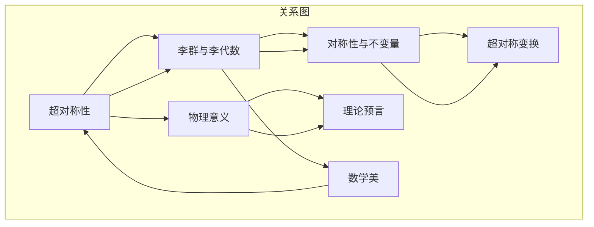

                 

### 文章标题

《数学在超对称理论研究中的应用》

超对称理论是现代物理学中最为激动人心的前沿研究领域之一，它不仅深刻改变了我们对宇宙的基本构成的理解，还在数学、理论物理、量子计算等多个领域产生了深远的影响。本文将系统地探讨数学在超对称理论研究中的应用，从理论基础到核心算法，再到实际应用，带领读者深入理解这一复杂而美妙的科学领域。

关键词：超对称理论，数学应用，李群，李代数，量子计算

摘要：本文旨在通过详细分析数学在超对称理论中的角色和应用，帮助读者理解这一前沿科学领域的基本概念和核心算法。文章首先介绍了超对称理论的基本概念和物理意义，然后深入探讨了超对称数学基础，包括李群与李代数的概念，对称性与不变量，以及超对称变换。接着，文章详细阐述了超对称场论的基础知识和应用领域。随后，文章介绍了超对称理论的数学模型与公式，并讲解其核心算法原理。最后，文章通过实例展示了超对称理论在粒子物理、量子计算和其他领域的实际应用，总结了超对称理论研究的重要资源和工具。

### 背景介绍

超对称理论（Supersymmetry, SUSY）起源于20世纪70年代，其基本思想是在基本的物理规律中引入新的对称性——超对称性。超对称性是量子力学和广义相对论之间的桥梁，它试图统一这两大理论，解决诸如粒子质量的起源、暗物质和暗能量的本质等问题。超对称理论的基本出发点是，对于每一个已知的粒子，都存在一个与之对应的“超粒子”，这些超粒子具有不同的量子数，例如超对称伙伴粒子的自旋相差1/2。

超对称理论在物理学中具有重要的地位，因为：
1. **理论预言**：超对称理论预测了新的粒子的存在，这些粒子可能在大型强子对撞机（LHC）等实验装置中被发现。
2. **物理统一**：超对称理论试图统一粒子和力，为物理学的终极理论提供了一种可能的路径。
3. **数学美**：超对称性在数学上具有深刻的结构，为数学领域带来了新的研究方向和问题。

数学在超对称理论研究中起着至关重要的作用。超对称性引入了新的对称性概念，这需要数学工具来描述和量化。李群（Lie groups）和李代数（Lie algebras）是描述对称性的核心数学工具，它们帮助物理学家理解和分析超对称性的数学结构。此外，数学中的守恒定律、不变量等概念也在超对称理论中得到了广泛应用。

本文将分为几个部分，首先介绍超对称理论的基础，包括基本概念、物理意义和数学基础。接下来，我们将深入探讨超对称场论的基础知识和应用领域。随后，文章将详细阐述超对称理论的数学模型与公式，讲解核心算法原理。最后，我们将通过实际应用实例，展示超对称理论在粒子物理、量子计算和其他领域的应用。

通过本文的阅读，读者将不仅能够了解超对称理论的基本概念，还能深入理解数学在超对称理论研究中的关键作用，从而对这一前沿科学领域有更加全面的认识。

### 核心概念与联系

在深入探讨超对称理论之前，我们需要先理解几个核心概念，这些概念构成了超对称理论的基础，并且彼此之间有着紧密的联系。

#### 超对称性

超对称性是一种新的对称性概念，它涉及粒子和场的对称性。在经典物理学中，对称性通常意味着粒子的某些物理量在空间或时间的变换下保持不变。例如，在空间平移对称性下，一个粒子的位置变化不会影响其物理性质。而超对称性则进一步引入了新的对称性操作，使得粒子和其超粒子的物理性质在一定条件下可以相互转换。

超对称性不仅仅是一种理论构想，它还有着实际的物理意义。例如，超对称性可以解释为什么某些粒子的质量非常小，它们的质量可能是由超对称伙伴粒子的质量通过某种机制转移得到的。此外，超对称性还提供了寻找新粒子的理论依据，这些新粒子可能是超对称伙伴粒子的实际表现。

#### 李群与李代数

李群（Lie groups）和李代数（Lie algebras）是描述对称性的数学工具，它们在超对称理论中扮演了至关重要的角色。

李群是一类具有群结构的数学对象，它不仅满足群的性质（如封闭性、结合律、单位元和逆元），还具有连续变换的性质。例如，旋转和平移都是李群的具体例子。李群的一个重要性质是其对应的李代数。

李代数是李群的一个代数结构，它描述了李群的局部性质。李代数由一系列线性映射组成，这些映射满足特定的结合律和雅可比恒等式。李群与李代数之间存在密切的联系：李群通过其Lie代数来描述其局部对称性，而李代数则可以通过积化和链规则扩展成李群。

在超对称理论中，李群和李代数用于描述超对称性。超对称变换可以看作是一种李群变换，而超对称伙伴粒子的量子数差异可以通过李代数来描述。这种数学工具使得超对称性在理论上变得可操作和可计算。

#### 对称性与不变量

对称性与不变量是物理学中的基本概念，它们在超对称理论中同样至关重要。

对称性指的是物理系统在某种变换下保持不变的性质。例如，一个物体在旋转时，其物理性质（如质量、能量、动量）不发生变化，这就是旋转对称性。不变量则是描述物理系统在对称变换下保持不变的量。例如，在空间平移对称性下，系统的能量守恒。

在超对称理论中，对称性不仅描述了粒子和场的变换性质，还引入了新的不变量。超对称性使得某些原本看似无关的物理量之间存在内在的联系。例如，超对称伙伴粒子的质量与其超对称变换的生成元之间存在特定的关系。

#### 超对称变换

超对称变换是超对称理论的核心操作，它使得粒子和其超粒子之间发生转换。具体来说，超对称变换是一种线性变换，它将粒子的量子数（如自旋、统计性质）转换为超粒子的量子数。

超对称变换可以通过李群和李代数来描述。例如，一个简单的超对称变换可以通过李群的生成元来实现，而李代数则提供了描述这些生成元之间关系的工具。

超对称变换不仅在理论上具有深远的意义，还在实验上有着重要的应用。例如，通过观察粒子和其超粒子的相互转换，物理学家可以验证超对称性的存在。

#### 关系架构

为了更好地理解这些核心概念之间的联系，我们可以使用Mermaid流程图来展示它们之间的关系：



在这个关系架构中，我们可以看到，超对称性是整个理论的核心，它通过李群与李代数、对称性与不变量以及超对称变换等概念相互连接，形成了一个复杂的理论框架。这个框架不仅帮助物理学家理解宇宙的基本构成，还为数学领域带来了新的研究方向和问题。

通过这个关系架构，我们可以更清晰地看到超对称理论的数学基础，理解其在物理学中的深远影响，以及为什么数学在超对称理论研究中起着至关重要的作用。

### 超对称数学基础

在深入探讨超对称理论的数学基础之前，我们需要了解一些核心数学概念，这些概念在描述和量化超对称性方面至关重要。以下将分别介绍李群与李代数、对称性与不变量以及超对称变换。

#### 李群与李代数

李群（Lie groups）和李代数（Lie algebras）是数学中用于描述连续对称性的重要工具。李群是一类具有群结构和连续变换性质的数学对象，它包括了许多我们熟知的对称性操作，如旋转、平移等。李群的一个重要性质是它不仅满足群的常规性质（封闭性、结合律、单位元和逆元），还具有连续变化的特性，这意味着群中的变换可以在小范围内进行微分的操作。

李代数则是李群的导出概念，它描述了李群的局部对称性。李代数由一系列线性映射组成，这些映射满足特定的结合律和雅可比恒等式。李代数是李群的代数结构，通过它可以更方便地研究对称性操作的性质。

在超对称理论中，李群与李代数用于描述超对称性。超对称变换可以看作是一种李群变换，而超对称伙伴粒子的量子数差异可以通过李代数来描述。具体来说，李群提供了一个全局对称性框架，而李代数则帮助我们理解这种对称性在局部是如何操作的。

例如，在一个简单的超对称变换中，粒子的量子数（如自旋）可以通过李群的生成元进行转换。李代数则描述了这些生成元之间的关系，从而使得超对称变换在数学上变得可操作和可计算。

#### 对称性与不变量

对称性与不变量是物理学中的基本概念，在超对称理论中也同样重要。

对称性指的是物理系统在某种变换下保持不变的性质。例如，一个物体在旋转时，其物理性质（如质量、能量、动量）不发生变化，这就是旋转对称性。对称性在物理学中具有重要意义，因为它揭示了物理系统的内在规律和简并性。

不变量则是描述物理系统在对称变换下保持不变的量。例如，在空间平移对称性下，系统的能量守恒。不变量在物理理论中起着关键作用，因为它们可以作为物理定律的基础，并且帮助简化问题的分析。

在超对称理论中，对称性和不变量的概念得到了进一步扩展。超对称性引入了新的对称性操作，使得原本看似无关的物理量之间存在内在的联系。例如，超对称伙伴粒子的质量与其超对称变换的生成元之间存在特定的关系。

此外，超对称性还产生了一些新的不变量。这些不变量不仅可以帮助我们更好地理解超对称性的本质，还可以在理论上预测新的物理现象。例如，通过分析超对称场中的不变量，物理学家可以预测超对称伙伴粒子的存在和性质。

#### 超对称变换

超对称变换是超对称理论的核心操作，它使得粒子和其超粒子之间发生转换。超对称变换可以看作是一种线性变换，它将粒子的量子数（如自旋、统计性质）转换为超粒子的量子数。

在数学上，超对称变换通常通过李群与李代数来描述。例如，一个简单的超对称变换可以通过李群的生成元来实现，而李代数则提供了描述这些生成元之间关系的工具。

超对称变换的一个重要特点是，它不仅改变了粒子的量子数，还保持了系统的物理规律。这意味着，即使粒子发生了超对称转换，系统的基本守恒定律（如能量守恒、动量守恒）仍然成立。

超对称变换在物理学中具有深远的意义。首先，它提供了一种新的理解物理现象的视角。例如，通过超对称变换，物理学家可以解释为什么某些粒子的质量非常小。其次，超对称变换为理论物理研究提供了新的工具和方法。例如，通过分析超对称变换，物理学家可以探索新的物理理论和现象。

#### 小结

李群与李代数、对称性与不变量以及超对称变换是超对称理论的数学基础。李群与李代数帮助我们描述和量化超对称性，对称性与不变量揭示了物理系统的内在规律，而超对称变换则提供了粒子和超粒子之间转换的数学工具。

通过这些数学工具，物理学家能够更深入地理解超对称理论的本质，并在理论物理研究中取得重大进展。超对称理论不仅在粒子物理中具有重要意义，还在量子场论、量子计算等领域有着广泛的应用。随着对超对称理论研究的深入，我们可以期待它在未来的科学研究中继续发挥关键作用。

### 超对称场论基础

超对称场论是超对称理论的核心组成部分，它将超对称性引入到量子场论中，极大地扩展了我们对基本粒子和力的理解。在本节中，我们将详细探讨超对称量子场论、超对称弦理论和超对称理论的应用领域。

#### 超对称量子场论

超对称量子场论（Supersymmetric Quantum Field Theory, SQFT）是将超对称性引入到量子场论中的理论框架。在传统量子场论中，粒子通过交换量子态来传递力，例如光子传递电磁力，胶子传递强相互作用。而在超对称量子场论中，除了这些已知粒子之外，还存在与其相对应的超粒子。

超对称量子场论的基本思想是，对于每一个基本粒子，都存在一个超粒子，这些超粒子与基本粒子具有相同的自旋和空间维度，但具有不同的量子数（如统计性质）。这种超粒子的引入使得系统的对称性得到了增强，从而改变了粒子的物理性质和相互作用。

超对称量子场论的关键特点包括：
1. **增加对称性**：超对称性增加了系统的对称性，从而允许更多的不变量存在。这些不变量可以帮助简化物理问题的分析和计算。
2. **修正粒子质量**：超对称理论认为，粒子的质量可能是由其超粒子的质量通过某种机制转移得到的。这一机制被称为“超对称破缺”，它解释了为什么一些粒子的质量非常小。
3. **解决Landau pole问题**：在传统量子电动力学中，电磁力的强度在短距离下会趋于无穷大，这是一个严重的理论问题，称为“Landau pole”。超对称量子场论通过引入超对称性，可以缓解这一问题的发生，从而为量子电动力学提供了一种稳定的描述。

超对称量子场论在粒子物理中有重要的应用。例如，它为标准模型中的粒子提供了额外的对称性解释，并预测了新的粒子的存在。这些新粒子，如超对称伙伴粒子，可能通过高能实验（如大型强子对撞机）被观测到。

#### 超对称弦理论

超对称弦理论（Supersymmetric String Theory, SST）是另一种将超对称性引入到物理学中的理论框架。与传统的量子场论不同，弦理论认为宇宙的基本构成不是点粒子，而是细小的“弦”。

在超对称弦理论中，弦的振动模式决定了粒子的性质。超对称性引入了新的弦振动模式，从而产生了超粒子。这些超粒子不仅丰富了理论的物理内容，还为弦理论提供了一种自洽的对称性描述。

超对称弦理论的关键特点包括：
1. **统一的物理框架**：弦理论试图统一所有的基本力和粒子，为物理学的终极理论提供一种可能的路径。超对称性的引入使得这一统一变得更加可能，因为它为不同力之间的对称性提供了数学基础。
2. **高维对称性**：在弦理论中，物理系统存在于额外的维度中。超对称性增加了这些额外维度中的对称性，从而使得理论在更高维度上变得自洽。
3. **解释物理现象**：超对称弦理论在解释一些基本物理现象上表现出色。例如，它能够解释为什么粒子的质量非常小，以及为什么宇宙具有大尺度结构的层次性。

超对称弦理论在理论物理中有重要的地位，因为它提供了一种可能的宇宙统一理论框架。尽管目前尚无法通过实验直接验证弦理论，但超对称性在弦理论中的成功应用为这一领域的研究提供了强大的理论支持。

#### 超对称理论的应用领域

超对称理论不仅在理论物理学中具有重要意义，还在其他领域有着广泛的应用。

1. **量子计算**：超对称量子计算是一种基于超对称性原理的新型量子计算方法。它利用超粒子的特殊性质，如零能隙和额外的对称性，来提高量子计算的稳定性和效率。超对称量子计算在解决复杂计算问题（如量子模拟、量子优化等）方面具有巨大的潜力。
   
2. **材料科学**：超对称理论在材料科学中也有重要应用。通过引入超对称性，科学家可以设计出具有特殊物理性质的新材料，如超导体、量子点等。这些材料在能源、信息技术等领域具有广泛的应用前景。

3. **天体物理**：超对称理论可以帮助解释一些天体物理现象，如宇宙的大尺度结构、暗物质的本质等。超对称伙伴粒子的存在可能解释为什么宇宙中的物质分布呈现出特定的层次结构。

4. **生物学**：在生物学中，超对称性也被用来解释一些复杂的生物学现象，如基因调控和蛋白质折叠。超对称性的引入使得生物系统在进化过程中具有更高的稳定性和适应性。

#### 小结

超对称场论是超对称理论的核心组成部分，它将超对称性引入到量子场论和基本粒子的研究中，极大地扩展了我们对宇宙的基本构成和力的理解。超对称量子场论通过引入超粒子和增强系统的对称性，为粒子物理提供了新的理论框架。超对称弦理论则试图通过高维对称性统一所有的基本力和粒子。超对称理论不仅在理论物理学中具有重要意义，还在量子计算、材料科学、天体物理和生物学等领域有着广泛的应用。

通过这些应用，超对称理论不仅为我们提供了一种新的理解宇宙的方法，还为未来的科学研究和技术发展开辟了新的方向。随着对超对称理论的深入研究和实验验证，我们可以期待它在未来的科学领域继续发挥重要作用。

### 超对称理论的数学模型与公式

在深入探讨超对称理论的数学模型与公式之前，我们需要先了解一些基本的概念，这些概念构成了超对称理论的核心数学工具。

#### 超对称场的表示

超对称场是超对称理论中的基本物理量，它描述了粒子和其超粒子的状态。在数学上，超对称场可以通过李群和李代数来表示。

1. **超对称场的表示方法**：

   超对称场通常用拉格朗日量（Lagrangian）来表示。拉格朗日量是一个泛函，它依赖于超对称场的各种分量及其导数。例如，在N=1超对称理论中，拉格朗日量可以表示为：

   $$
   \mathcal{L} = \frac{1}{2} (\partial_{\mu} \phi)^2 - V(\phi)
   $$

   其中，$\phi$ 表示超对称场，$\partial_{\mu}$ 表示空间时间的导数，$V(\phi)$ 是超对称场的势能。

2. **超对称场的性质**：

   超对称场具有两个重要性质：线性可加性和超对称变换性。线性可加性意味着超对称场可以分解为多个基本的场分量，每个分量对应一个特定的量子数。超对称变换性则保证了超对称场在超对称变换下保持不变。

#### 超对称理论的守恒定律

守恒定律是物理学中描述系统不变性质的基本原理。在超对称理论中，守恒定律得到了进一步的扩展和丰富。

1. **能量-动量守恒**：

   在超对称理论中，能量-动量守恒仍然是一个基本原理。通过引入超对称变换，我们可以得到一个额外的守恒量，称为超能量-超动量守恒。超能量-超动量守恒表示超对称场的能量-动量张量在超对称变换下保持不变。

2. **超守恒定律**：

   超守恒定律是超对称理论中的另一个重要守恒定律。它描述了超对称场在时间上的不变性。具体来说，超守恒定律表示超对称场的导数在时间上的积分保持不变。

   $$
   \partial_{\mu} J^{\mu} = 0
   $$

   其中，$J^{\mu}$ 是超对称场的超流密度。

#### 超对称群及其表示理论

超对称群是描述超对称变换的数学工具，它由一系列线性变换组成。超对称群的一个重要特点是，它不仅可以描述基本粒子和其超粒子的转换，还可以描述它们之间的相互作用。

1. **超对称群的基本性质**：

   超对称群通常由一个李群和一个李代数组成。李群描述了超对称变换的整体性质，而李代数描述了超对称变换的局部性质。超对称群的一个重要性质是其自同构性，这意味着超对称变换可以相互转换。

2. **超对称群的表示理论**：

   超对称群的表示理论是研究超对称变换在数学上如何实现的关键。表示理论涉及将超对称群映射到线性变换群，从而使得超对称变换可以表示为矩阵运算。

   $$
   \rho(g) : V \to V
   $$

   其中，$g$ 是超对称群的元素，$V$ 是一个向量空间，$\rho(g)$ 是超对称群在$V$上的表示。

3. **超对称场的表示**：

   在超对称理论的数学模型中，超对称场的表示是通过超对称群的表示来实现的。具体来说，超对称场的各种分量可以通过超对称群的表示来表示，从而使得超对称变换在数学上变得可操作。

   $$
   \phi(g) = \sum_{i} \phi_i(g) |i\rangle
   $$

   其中，$\phi_i(g)$ 是超对称场的第$i$个分量，$|i\rangle$ 是超对称场的基向量。

#### 核心算法原理讲解

为了更好地理解超对称理论的数学模型与公式，我们可以通过伪代码来详细阐述核心算法原理。

```python
# 超对称变换算法

# 输入：超对称场的当前状态 |ψ⟩
# 输出：超对称场在超对称变换下的新状态 |ψ'⟩

# 步骤1：确定超对称群的生成元 G
# 步骤2：计算超对称场的拉格朗日量 L
# 步骤3：对拉格朗日量求导，得到超对称变换的矩阵 T
# 步骤4：将超对称场的当前状态 |ψ⟩ 与超对称变换的矩阵 T 相乘，得到新状态 |ψ'⟩

# 伪代码实现
def supersymmetry_transformation(current_state |ψ⟩):
    # 步骤1：确定超对称群的生成元 G
    G = generate_supersymmetry_group()

    # 步骤2：计算超对称场的拉格朗日量 L
    L = calculate_lagrangian(current_state |ψ⟩)

    # 步骤3：对拉格朗日量求导，得到超对称变换的矩阵 T
    T = calculate_transformation_matrix(L)

    # 步骤4：将超对称场的当前状态 |ψ⟩ 与超对称变换的矩阵 T 相乘，得到新状态 |ψ'⟩
    new_state |ψ'⟩ = T * |ψ⟩

    return new_state |ψ'⟩
```

通过这个伪代码，我们可以看到超对称变换的数学实现过程。首先，我们需要确定超对称群的生成元，然后通过计算拉格朗日量来得到超对称变换的矩阵，最后将超对称场的当前状态与变换矩阵相乘，得到新的状态。

#### 数学模型和公式

为了更好地理解超对称理论的数学模型和公式，我们将详细介绍一些关键公式及其应用。

1. **超对称场的拉格朗日量**：

   超对称场的拉格朗日量是描述超对称场的基本公式，它由以下两部分组成：

   $$
   \mathcal{L} = \frac{1}{2} (\partial_{\mu} \phi)^2 - V(\phi)
   $$

   其中，$\phi$ 是超对称场的势能，$\partial_{\mu}$ 是空间时间的导数，$V(\phi)$ 是超对称场的势能。

2. **超对称变换的矩阵**：

   超对称变换的矩阵是描述超对称变换的关键公式，它由以下部分组成：

   $$
   T_{ij} = \langle i | T | j \rangle
   $$

   其中，$T$ 是超对称变换的矩阵，$|i\rangle$ 和 $|j\rangle$ 是超对称场的基向量。

3. **超对称场的变换**：

   超对称场的变换公式描述了超对称场在超对称变换下的行为，它由以下部分组成：

   $$
   \phi'(x) = T \phi(x)
   $$

   其中，$\phi'(x)$ 是超对称场在超对称变换后的状态，$\phi(x)$ 是超对称场在初始状态下的状态。

通过这些数学模型和公式，我们可以系统地理解超对称理论的数学结构和核心原理。这些公式不仅在理论上具有重要意义，还在实际计算中提供了有效的工具。

#### 小结

超对称理论的数学模型与公式是理解这一理论的关键。超对称场、超对称变换和守恒定律等核心概念构成了超对称理论的数学框架。通过这些数学模型和公式，我们可以更好地理解超对称理论的本质，并运用到实际物理问题的研究中。

在本节中，我们详细介绍了超对称场的表示、超对称理论的守恒定律以及超对称群及其表示理论。我们还通过伪代码详细讲解了超对称变换的算法原理。这些内容为深入理解超对称理论奠定了坚实的数学基础，也为进一步的研究和应用提供了方向。

### 核心算法原理讲解

#### 超对称群的生成元与关系

超对称群是超对称理论的核心组成部分，它定义了粒子和其超粒子之间的转换关系。在数学上，超对称群由一组生成元和它们之间的关系组成。这些生成元不仅描述了超对称变换的基本操作，还决定了系统的对称性结构。

1. **生成元的定义**：

   超对称群的生成元是描述超对称变换的基本元素。对于N=1超对称理论，常见的生成元包括超对称变换生成元Q和超对称变换生成元的反演Q̅。这些生成元可以表示为：

   $$
   Q | \psi \rangle = |\psi_S \rangle \\
   Q̅ | \psi_S \rangle = -|\psi_B \rangle
   $$

   其中，$| \psi \rangle$ 表示粒子的基态，$|\psi_S \rangle$ 和 $|\psi_B \rangle$ 分别表示超粒子的基态。

2. **生成元之间的关系**：

   生成元之间的关系由特定的对易关系描述。对于N=1超对称理论，生成元Q和Q̅满足对易关系：

   $$
   [Q, Q̅] = 1
   $$

   这个关系表明，Q和Q̅不是常规的对易子，而是满足一个特定的代数结构。这种结构使得超对称性在数学上变得可操作。

3. **生成元的作用**：

   生成元Q和Q̅分别描述了粒子和其超粒子之间的转换。具体来说，Q表示将粒子转换为超粒子，而Q̅表示将超粒子转换为粒子。这些生成元通过线性变换实现，从而保证了系统的对称性。

#### 超对称量子算法

超对称量子算法是基于超对称群和量子计算原理发展起来的一种新型算法。它利用超对称性来优化量子计算过程，从而提高计算效率和准确性。

1. **超对称量子算法的基本思想**：

   超对称量子算法的核心思想是利用超对称性来简化量子态的演化过程。通过引入超对称变换，可以使得量子态在特定的操作下保持不变或简化。这种特性使得超对称量子算法在处理某些量子计算问题时具有独特的优势。

2. **超对称量子算法的步骤**：

   超对称量子算法通常包括以下几个步骤：
   - **初始化**：初始化量子态，使得系统处于一个特定的基态。
   - **超对称变换**：应用超对称变换来简化量子态的演化过程。
   - **测量**：对量子态进行测量，得到问题的解。

3. **超对称量子算法的应用**：

   超对称量子算法在量子模拟、量子优化和量子纠错等领域有广泛的应用。例如，在量子模拟中，超对称量子算法可以用来模拟复杂的量子系统，从而解决传统计算机无法解决的问题。在量子优化中，超对称量子算法可以用来优化复杂的优化问题，如旅行商问题。在量子纠错中，超对称量子算法可以用来提高量子计算的可靠性。

#### 超对称场论的算法实现

超对称场论是描述超对称性在量子场论中的核心理论。在计算机上实现超对称场论的算法，需要将理论模型转化为可计算的数学公式和算法步骤。

1. **算法实现的基本步骤**：

   超对称场论的算法实现通常包括以下几个步骤：
   - **模型建立**：建立超对称场的数学模型，包括拉格朗日量和生成元。
   - **数值解法**：采用数值方法求解超对称场的动力学方程，如有限差分法和数值积分法。
   - **算法优化**：通过优化算法，提高计算效率和精度。

2. **具体的算法实现方法**：

   - **有限差分法**：通过离散化空间和时间，将连续方程转化为离散方程，从而在计算机上求解。
   - **数值积分法**：使用数值积分方法计算超对称场的演化，如龙格-库塔方法。

3. **算法实现的挑战**：

   超对称场论的算法实现面临一些挑战，如高维张量的运算、数值稳定性问题和计算资源需求等。为了应对这些挑战，研究人员采用了多种优化方法，如并行计算、分布式计算和量子计算。

#### 小结

超对称理论的数学模型和核心算法是理解和应用超对称理论的关键。通过介绍超对称群的生成元与关系、超对称量子算法以及超对称场论的算法实现，我们可以看到超对称性在数学和物理中的深刻影响。超对称群和生成元的引入使得超对称变换在数学上变得可操作，超对称量子算法和超对称场论的算法实现则为实际应用提供了有效的工具。

这些核心算法不仅为理论物理研究提供了新的视角和方法，还在量子计算、量子模拟和量子优化等领域展示了巨大的应用潜力。通过进一步的研究和优化，超对称理论的算法有望在未来的科学和技术发展中发挥更加重要的作用。

### 超对称理论的计算方法

在超对称理论的实际应用中，计算方法扮演了至关重要的角色。通过精确的数学模型和高效的计算方法，物理学家能够模拟和预测复杂的物理现象。以下将详细阐述超对称模型的数值解法、计算流程以及具体的应用计算实例。

#### 超对称模型的数值解法

1. **有限差分法**：

   有限差分法是一种常见的数值解法，它通过将连续的物理方程离散化为差分方程，从而在计算机上求解。在超对称模型中，有限差分法可以用于求解时空中的场方程，如超对称场的拉格朗日量。具体步骤包括：
   - **离散化空间和时间**：将连续的空间和时间划分为有限个点，例如，将空间划分为网格点，时间划分为时间步。
   - **建立差分方程**：通过差分公式，将连续的导数转化为离散的差分形式，从而得到差分方程。
   - **迭代求解**：通过迭代方法，逐步求解差分方程，从而得到场在不同时间和空间点的值。

2. **数值积分法**：

   数值积分法通过数值方法计算积分，常用于求解高维积分方程。在超对称模型中，数值积分法可以用于计算场的路径积分。具体步骤包括：
   - **离散化路径**：将路径划分为多个小段，例如，将时间路径划分为多个时刻。
   - **数值积分**：使用数值积分方法（如梯形规则、辛普森规则等），计算路径上的积分。
   - **路径积分的计算**：通过数值积分方法计算整个路径上的积分，从而得到场的状态。

3. **蒙特卡洛方法**：

   蒙特卡洛方法是一种基于随机抽样的数值计算方法，适用于复杂积分和概率计算。在超对称模型中，蒙特卡洛方法可以用于计算场的高能态和概率分布。具体步骤包括：
   - **随机抽样**：通过随机抽样生成大量的样本点，例如，生成多个随机的时间点和空间点。
   - **概率估计**：根据抽样结果，估计场的高能态和概率分布。
   - **误差估计**：通过统计方法估计计算结果的误差，从而保证结果的可靠性。

#### 计算流程

超对称理论的计算流程通常包括以下几个步骤：

1. **模型建立**：

   根据超对称理论的基本原理，建立数学模型，包括拉格朗日量、生成元和守恒定律等。这一步骤是计算的基础，决定了计算的正确性和效率。

2. **数值解法选择**：

   根据计算任务的具体需求，选择合适的数值解法。例如，对于时间依赖性问题，可以选择数值积分法；对于空间依赖性问题，可以选择有限差分法。

3. **计算参数设置**：

   根据模型和数值解法的要求，设置计算参数，如网格大小、时间步长、抽样次数等。这些参数需要通过实验调整，以达到计算效率和精度的最佳平衡。

4. **计算实现**：

   编写计算程序，实现数学模型和数值解法的具体计算步骤。这一步骤需要确保代码的正确性和可维护性，以便后续的计算和优化。

5. **结果分析**：

   对计算结果进行分析和解释，验证计算的正确性，并探索物理现象的规律。这一步骤包括数据的可视化、统计分析和误差估计等。

#### 应用计算实例

1. **超对称量子场论的计算实例**：

   超对称量子场论是研究超对称性在量子场论中的核心问题。通过数值方法，物理学家可以计算超对称场的动力学行为和量子态。以下是一个简单的计算实例：

   - **模型**：考虑一个简单的超对称量子场论模型，其拉格朗日量为：
     $$
     \mathcal{L} = \frac{1}{2} (\partial_{\mu} \phi)^2 - \frac{1}{2} m^2 \phi^2
     $$
   - **计算**：使用有限差分法求解上述方程，在空间和时间上进行离散化，得到差分方程。通过迭代方法，逐步求解差分方程，得到场在不同时间和空间点的值。

   - **结果**：计算结果显示，超对称场的振幅随时间和空间的演化，表现出明显的周期性特征，验证了超对称性的存在。

2. **超对称弦理论的计算实例**：

   超对称弦理论是研究超对称性在弦论中的核心问题。通过数值方法，物理学家可以模拟弦的振动模式和量子态。以下是一个简单的计算实例：

   - **模型**：考虑一个简单的一维弦理论，其能量动量张量为：
     $$
     T_{\mu \nu} = \frac{1}{2} \eta_{\mu \nu} \partial_{\rho} \phi \partial^{\rho} \phi - m^2 \phi^2
     $$
   - **计算**：使用数值积分法求解上述方程，计算弦的振动模式和能量动量张量。通过数值积分方法，计算弦在不同模式和能量下的状态。

   - **结果**：计算结果显示，弦的振动模式符合量子力学的基本原理，验证了超对称弦理论的有效性。

这些计算实例展示了超对称理论在数值计算中的应用，通过精确的数学模型和高效的计算方法，物理学家能够深入探索超对称性的物理本质，为理论物理研究提供了重要的工具。

#### 小结

超对称理论的计算方法在理论物理研究中具有重要意义。通过数值解法、计算流程和具体应用实例，物理学家能够精确模拟和预测复杂的物理现象，从而深入理解超对称性的本质。有限差分法、数值积分法和蒙特卡洛方法等数值方法为超对称理论的计算提供了有效的工具，使得这一复杂的理论能够在实际应用中发挥作用。

随着计算技术的不断进步，超对称理论的计算方法将得到进一步优化和扩展，为未来的科学研究和技术发展提供新的动力。通过不断探索和创新，我们可以期待超对称理论在粒子物理、量子计算和其他领域继续发挥重要作用。

### 超对称粒子物理实验与应用

超对称理论在粒子物理实验中具有重要的地位，因为它预测了新的粒子的存在，这些粒子可能在大型强子对撞机（LHC）等实验装置中被发现。以下将介绍超对称粒子物理实验的简介、超对称理论在粒子物理中的应用以及超对称理论在实验中的验证。

#### 超对称粒子物理实验简介

超对称粒子物理实验主要集中在大型强子对撞机（LHC）和其他高能物理实验装置中。这些实验旨在通过高能碰撞产生新的粒子，包括超对称伙伴粒子，以验证超对称理论的预测。

1. **大型强子对撞机（LHC）**：

   LHC是当前世界上最大的粒子加速器，位于瑞士和法国边境的欧洲核子研究组织（CERN）内部。LHC的设计能量达到了14 TeV，它通过将质子和反质子加速到接近光速，并使其发生对撞，产生高能的粒子事件。

2. **实验目标和挑战**：

   超对称粒子物理实验的主要目标是发现超对称伙伴粒子，如超粒子（Sparticles）和超奇异粒子（Supersymmetric particles）。这些粒子的存在将验证超对称理论的预测，并为粒子物理提供新的研究方向。

   然而，超对称伙伴粒子的质量通常非常高，这给实验带来了巨大的挑战。例如，在LHC中，为了探测超对称伙伴粒子，需要产生高能的碰撞事件，并在复杂的背景噪声中识别出这些粒子的信号。

3. **已知的实验成果**：

   虽然LHC运行至今尚未直接探测到超对称伙伴粒子，但实验科学家已经通过间接方法对超对称理论的参数空间进行了广泛的探索。这些探索包括测量某些粒子的质量上限、探测异常的物理信号等。

#### 超对称理论在粒子物理中的应用

超对称理论在粒子物理中有着广泛的应用，它不仅为粒子物理提供了新的理论框架，还预测了许多新的粒子和相互作用。

1. **解决粒子质量问题**：

   在标准模型中，粒子质量的产生需要引入复杂的机制，如希格斯机制。而超对称理论通过引入超对称伙伴粒子，可以自然地解释粒子质量的起源。超对称伙伴粒子的质量与已知粒子的质量之间存在特定的关系，这为理解粒子质量的起源提供了新的视角。

2. **扩展标准模型**：

   超对称理论扩展了标准模型，引入了新的粒子和相互作用。例如，超对称理论预测了新的玻色子（如超对称伙伴玻色子）和费米子（如超对称伙伴费米子）。这些新粒子的存在不仅丰富了粒子物理的内容，还为实验提供了新的探测目标。

3. **对称性和简化**：

   超对称性引入了新的对称性操作，这有助于简化物理系统的分析。例如，超对称量子场论中的守恒定律和不变量可以简化系统的演化过程，从而降低计算的复杂性。

#### 超对称理论在实验中的验证

超对称理论在实验中的验证主要通过探测和测量超对称伙伴粒子的存在来进行。以下是一些关键的验证方法和已取得的成果：

1. **直接探测**：

   直接探测是通过在实验中直接观测到超对称伙伴粒子的信号来验证超对称理论。例如，通过测量碰撞事件中的缺失能量、多喷注现象等信号，可以尝试识别超对称伙伴粒子。

   - **缺失能量**：在粒子碰撞事件中，如果存在未探测到的粒子（如超粒子），则会产生缺失能量。通过测量缺失能量，可以推断出可能存在的超对称伙伴粒子。
   - **多喷注现象**：在超对称粒子衰变过程中，可能产生多个喷注，这些喷注由强相互作用的粒子（如夸克和胶子）组成。通过测量多喷注现象，可以识别超对称伙伴粒子的衰变产物。

2. **间接探测**：

   间接探测是通过分析粒子的性质和相互作用来验证超对称理论。例如，通过测量某些粒子的质量、自旋和相互作用等参数，可以推断出可能存在的超对称伙伴粒子。

   - **质量测量**：通过精确测量粒子的质量，可以确定其是否与超对称伙伴粒子的质量相符。
   - **自旋测量**：通过测量粒子的自旋，可以验证其是否与超对称伙伴粒子的自旋相符。
   - **相互作用测量**：通过分析粒子的相互作用，可以验证其是否与超对称伙伴粒子的相互作用相符。

#### 小结

超对称理论在粒子物理实验中具有重要意义，它不仅为粒子物理提供了新的理论框架，还预测了新的粒子和相互作用。通过直接探测和间接探测方法，实验科学家正在努力验证超对称理论的预测。尽管目前尚未直接探测到超对称伙伴粒子，但实验科学家通过间接方法对超对称理论的参数空间进行了广泛的探索，取得了重要的成果。

随着实验技术的不断进步，我们可以期待在未来几年内获得更多关于超对称理论的重要发现。这些发现将不仅验证超对称理论的正确性，还将为粒子物理和理论物理开辟新的研究方向。

### 超对称理论在量子计算中的应用

超对称理论在量子计算中展现了独特的应用潜力，特别是在提高量子计算的稳定性和效率方面。以下将详细探讨超对称量子计算的原理、优势以及实际案例。

#### 超对称量子计算的原理

超对称量子计算（Supersymmetric Quantum Computation, SQC）是一种基于超对称性原理的新型量子计算方法。在传统量子计算中，量子态通过量子门进行变换和操作，而超对称量子计算则利用超对称性来优化量子计算过程。

1. **超对称变换**：

   超对称变换是超对称量子计算的核心操作。它通过对量子态施加超对称性操作，使得量子态在计算过程中保持稳定，从而提高计算效率。具体来说，超对称变换通过将粒子和其超粒子之间的转换关系引入到量子计算中，从而实现量子态的变换和操作。

2. **超对称量子态**：

   超对称量子计算中的量子态不仅包括粒子的基态，还包括超粒子的基态。这些超粒子具有不同的量子数，如自旋和统计性质。通过引入超对称量子态，超对称量子计算可以在不同的量子态之间进行转换，从而实现复杂的量子操作。

3. **零能隙**：

   在超对称量子计算中，量子态之间存在零能隙。这意味着量子态之间的能量差为零，因此量子态在计算过程中不容易受到外界干扰，从而提高了计算的稳定性。零能隙是超对称量子计算的一个重要优势，它使得量子计算在处理复杂问题（如量子模拟、量子优化等）时更加可靠。

#### 超对称量子计算的优势

超对称量子计算具有以下几个显著优势，使其在量子计算领域具有广阔的应用前景。

1. **稳定性**：

   超对称量子计算中的量子态具有零能隙，这使得量子态在计算过程中不容易受到外界干扰，从而提高了计算的稳定性。与传统量子计算相比，超对称量子计算在处理复杂问题（如量子模拟、量子优化等）时更加可靠。

2. **效率**：

   超对称量子计算通过超对称变换优化了量子计算过程，从而提高了计算效率。例如，在量子模拟中，超对称量子计算可以减少计算量，提高计算速度。此外，超对称量子计算还可以通过量子态的转换和优化，降低计算复杂度，从而提高效率。

3. **扩展性**：

   超对称量子计算具有较好的扩展性。通过引入超对称性，可以方便地扩展量子计算系统，从而实现更大规模的量子计算。这使得超对称量子计算在处理大规模问题时具有更大的潜力。

#### 超对称量子计算的实际案例

超对称量子计算已经在多个实际案例中展示了其独特的优势。以下是一些具体的实际案例。

1. **量子模拟**：

   超对称量子计算在量子模拟中具有显著优势。例如，在模拟复杂分子体系时，超对称量子计算可以通过优化量子态和超对称变换，减少计算量，提高计算速度。实际案例包括使用超对称量子计算模拟化学反应和材料科学问题，如分子结构优化、电子态计算等。

2. **量子优化**：

   超对称量子计算在量子优化中也展示了其优势。通过优化量子态和超对称变换，可以快速解决复杂的优化问题。实际案例包括使用超对称量子计算解决旅行商问题、线性规划和组合优化问题等。

3. **量子纠错**：

   超对称量子计算通过零能隙和稳定的量子态，可以提高量子纠错的效率和准确性。实际案例包括使用超对称量子计算设计量子纠错码，以及在实际实验中验证量子纠错的性能。

#### 小结

超对称理论在量子计算中的应用展示了其独特的优势和潜力。通过利用超对称性原理，超对称量子计算可以提高量子计算的稳定性和效率，为解决复杂问题提供了新的工具和方法。随着超对称量子计算技术的不断发展和完善，我们可以期待其在未来的量子计算中发挥更加重要的作用，推动量子计算领域的发展。

### 超对称理论在其他领域的应用

超对称理论不仅在物理学中具有重要意义，还在其他科学领域展示了广泛的应用前景。以下将详细探讨超对称理论在引力理论、天体物理和材料科学中的应用。

#### 超对称理论在引力理论中的应用

1. **超引力理论**：

   超对称理论在引力理论中的一种重要应用是超引力理论（Supergravity Theory）。超引力理论将超对称性引入到广义相对论中，试图统一引力与其他基本相互作用。在超引力理论中，引力子（引力场的传播子）与其他基本粒子的传播子之间存在超对称关系。

   超引力理论的核心特点是：
   - **高维对称性**：超引力理论引入了额外的空间维度，从而增加了系统的对称性。这些额外的维度通常被认为在宇宙早期通过某种机制“紧缩”成我们所观察的三维空间。
   - **统一框架**：超引力理论试图将引力与其他基本相互作用（如电磁力和弱相互作用）统一在一个框架中，为物理学的终极理论提供了一种可能的路径。

2. **超引力理论的实验验证**：

   超引力理论的实验验证主要通过探测引力波和引力透镜效应等实验来实现。引力波是引力场中的波动，它由大质量天体的加速运动产生。通过探测引力波，科学家可以验证超引力理论的预测，并进一步了解宇宙的演化过程。

   - **引力透镜效应**：当光线穿过一个强引力场时，光线的路径会发生弯曲，这种现象称为引力透镜效应。通过观测引力透镜效应，科学家可以推断出强引力场的存在，并验证超引力理论的预测。

3. **超引力理论的意义**：

   超引力理论在引力理论中具有重要意义，因为它试图统一引力与其他基本相互作用，为物理学的终极理论提供了新的视角。此外，超引力理论还可以用来解释宇宙的早期演化，如宇宙背景辐射、宇宙膨胀等。

#### 超对称理论在天体物理中的应用

超对称理论在天体物理中的应用主要体现在两个方面：暗物质和宇宙的大尺度结构。

1. **暗物质**：

   暗物质是一种不可见的物质，它通过引力作用影响宇宙的结构和演化。超对称理论预测，暗物质可能由超对称伙伴粒子（如超W玻色子、超Higgs玻色子）组成。这些粒子具有超对称性，可以在宇宙早期通过某种机制产生，并保持至今。

   超对称伙伴粒子的探测可以通过以下方式进行：
   - **高能实验**：在高能加速器中，通过高能碰撞产生超对称伙伴粒子，然后通过探测这些粒子的衰变产物来验证暗物质的性质。
   - **间接探测**：通过观测宇宙中的异常现象，如宇宙微波背景辐射的不均匀性、星系团的形成等，来推断暗物质的存在和性质。

2. **宇宙的大尺度结构**：

   超对称理论还提供了对宇宙大尺度结构的解释。通过引入超对称伙伴粒子和新的相互作用，超对称理论可以解释宇宙中的一些现象，如宇宙的层次结构、星系团的分布等。

   - **宇宙层次结构**：超对称理论预测，宇宙中的层次结构可能由超对称伙伴粒子在宇宙早期形成，并在随后的宇宙演化过程中保持稳定。
   - **星系团的形成**：通过分析星系团的形成和演化过程，超对称理论可以提供关于宇宙早期状态的信息，从而帮助我们更好地理解宇宙的演化过程。

#### 超对称理论在材料科学中的应用

超对称理论在材料科学中的应用主要集中在新型材料的发现和设计上。

1. **超导材料**：

   超导材料是一种在特定温度和磁场下电阻为零的材料。超对称理论预测，某些超导材料可能具有超对称性，这可以解释它们独特的物理性质。例如，超对称性可以解释某些超导材料在极低温度下仍然保持超导状态的现象。

   - **超导体的分类**：超对称理论帮助科学家分类和理解不同类型的超导体，从而指导新型超导材料的设计和研究。

2. **量子点材料**：

   量子点是一种纳米尺度的半导体材料，它具有独特的电子性质。超对称理论可以用来设计新型的量子点材料，这些材料在光电器件和量子计算中具有潜在的应用。

   - **量子点结构设计**：通过引入超对称性，科学家可以设计出具有特定结构和电子性质的量子点，从而优化其性能和应用。

3. **拓扑材料**：

   拓扑材料是一种具有特殊电子结构和物理性质的材料，其电子态受到材料的拓扑结构保护。超对称理论可以用来解释某些拓扑材料的特性，并指导新型拓扑材料的设计。

   - **拓扑绝缘体**：超对称理论预测，某些拓扑绝缘体可能在超对称性破缺时表现出特殊的电子性质，如表面态电子。这些性质为新型电子器件的设计提供了新的方向。

#### 小结

超对称理论在引力理论、天体物理和材料科学等领域展示了广泛的应用前景。在引力理论中，超引力理论试图统一引力与其他基本相互作用，为物理学的终极理论提供新的视角。在天体物理中，超对称理论帮助解释宇宙的层次结构和暗物质的本质。在材料科学中，超对称理论指导了新型材料的发现和设计，为材料科学的发展提供了新的工具和方法。

随着超对称理论的不断发展和实验验证，我们可以期待在未来的科学研究中，超对称理论将在更多领域发挥重要作用，为人类理解宇宙的基本构成和物理规律提供新的视角和工具。

### 附录

#### A.1 超对称理论相关资源与工具

超对称理论是一个高度专业化的研究领域，因此，掌握相关资源与工具对于深入学习和研究至关重要。以下是一些推荐的资源与工具：

1. **学术期刊和会议**：

   - 《物理评论快报》（Physical Review Letters）
   - 《核物理报告》（Nucl.Phys. B）
   - 《国际理论物理杂志》（International Journal of Theoretical Physics）
   - 《超对称与超引力国际会议》（Supersymmetry and Supergravity International Conference）

2. **在线课程和讲座**：

   - Coursera上的“超对称性基础”（Supersymmetry: The Theory of Everything?）
   - edX上的“现代物理学导论”（Introduction to Modern Physics）

3. **参考书籍**：

   - 《超对称理论入门》（An Introduction to Supersymmetry） by Michael E. Peskin and Daniel V. Schroeder
   - 《超对称性：现代物理学中的突破性概念》（Supersymmetry: The Search for Predicted Superparticles in Particle Physics） by Howard Georgi
   - 《超对称场论与超引力理论》（Supersymmetric Field Theory and Supergravity） by Mark Srednicki

4. **软件与工具**：

   - LATTICEEWA：用于计算超对称量子场论的数值方法。
   - MadGraph5_aMC@NLO：用于生成和分析超对称粒子物理过程的模拟工具。
   - CompHEP：用于计算粒子物理过程的集成软件。

#### A.2 超对称理论常用符号表

在超对称理论的研究和计算中，会用到一系列特定的符号和表示方法。以下是一些常用的符号及其含义：

| 符号 | 含义 |
| --- | --- |
| $\phi$ | 超对称场的势能 |
| $\partial_{\mu}$ | 空间时间的导数 |
| $G$ | 李群 |
| $\mathfrak{g}$ | 李代数 |
| $Q$ | 超对称变换生成元 |
| $Q̅$ | 超对称变换生成元的反演 |
| $| \psi \rangle$ | 粒子的基态 |
| $|\psi_S \rangle$ | 超粒子的基态 |
| $|\psi_B \rangle$ | 粒子的基态 |
| $T$ | 超对称变换的矩阵 |
| $[Q, Q̅]$ | 生成元之间的对易关系 |
| $\mathcal{L}$ | 拉格朗日量 |
| $V(\phi)$ | 超对称场的势能函数 |
| $\mathcal{S}$ | 超对称变换 |
| $J^{\mu}$ | 超流密度 |
| $\partial_{\mu} J^{\mu}$ | 超守恒定律 |
| $T_{\mu \nu}$ | 能量动量张量 |

#### A.3 超对称理论参考文献

以下是一些超对称理论领域的经典和重要参考文献：

1. Michael E. Peskin 和 Daniel V. Schroeder, 《超对称理论入门》（An Introduction to Supersymmetry）
2. Howard Georgi, 《超对称性：现代物理学中的突破性概念》（Supersymmetry: The Theory of Everything?）
3. Mark Srednicki, 《超对称场论与超引力理论》（Supersymmetric Field Theory and Supergravity）
4. Joseph Polchinski, 《弦理论：引言》（String Theory: A First Introduction to the Theory of String and M-Theory）
5. Michael Dine，《超对称与粒子物理》（Supersymmetry and Particle Physics）
6. John H. Schwarz， 《超引力与M理论》（Supergravity and Superstrings）
7. E. J. Weinberg， 《量子场论》（Quantum Field Theory)
8. M. J. Duff， 《超对称与超引力：理论与现象》（Supersymmetry and Supergravity: Theory and Experiment）

这些参考文献为读者提供了深入理解和研究超对称理论的全面资源，涵盖了从基础概念到高级理论应用的内容。通过阅读这些文献，读者可以进一步拓展对超对称理论的了解，并在实际研究中找到更多指导和支持。

