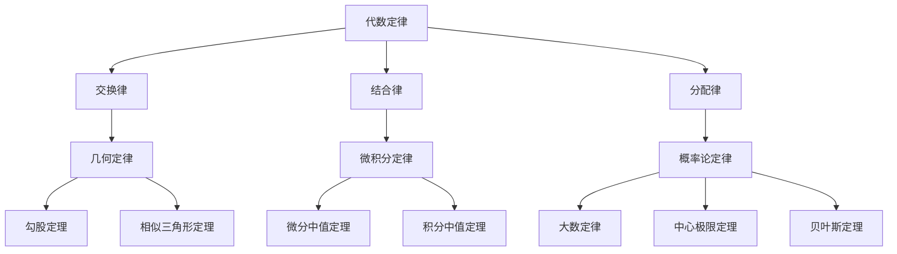

                 

## 文章标题

《数学定律：自然和谐的心智投影》

### 关键词

数学定律、自然和谐、心智投影、技术博客、逻辑推理

### 摘要

本文旨在探讨数学定律在自然和谐心智投影中的作用和意义。通过深入分析数学定律的基础理论、基本原理、数学模型与公式，以及其在现代科技、教育价值等方面的应用，本文揭示了数学定律如何作为一种心智投影工具，帮助我们理解和探索世界的本质。同时，本文结合实际应用案例，详细解读了数学定律在计算机科学、人工智能和工程实践等领域的具体应用，为读者提供了一个全面、系统的数学定律认知框架。最后，本文展望了数学定律的未来发展趋势，并提供了相关的工具与资源，以期为读者在数学定律研究和应用方面提供指导和参考。

## 《数学定律：自然和谐的心智投影》目录大纲

### 第一部分：数学定律概述

#### 第1章：数学定律的基础理论
1.1 数学定律的定义与历史背景
1.2 数学定律的基本分类
1.3 数学定律的核心概念联系图（使用Mermaid绘制）

#### 第2章：数学定律的基本原理
2.1 数学定律的数学基础
2.2 数学定律的应用领域
2.3 数学定律的核心算法原理（使用伪代码详细阐述）

#### 第3章：数学定律的数学模型与公式
3.1 常见数学定律的数学模型
3.2 数学定律的数学公式讲解与示例（使用latex格式）
3.3 数学定律的应用实例分析

#### 第4章：数学定律与现代科技
4.1 数学定律在计算机科学中的应用
4.2 数学定律在物理学中的贡献
4.3 数学定律在工程学中的应用前景

#### 第5章：数学定律的教育价值
5.1 数学定律在数学教育中的重要性
5.2 数学定律在跨学科教育中的应用
5.3 数学定律对学生思维能力的培养

### 第二部分：数学定律的项目实战

#### 第6章：数学定律的实际应用案例
6.1 项目背景与目标
6.2 项目开发环境搭建
6.3 项目源代码实现与解读
6.4 代码解读与分析

#### 第7章：数学定律的案例分析
7.1 案例一：数学定律在数据分析中的应用
7.2 案例二：数学定律在人工智能中的应用
7.3 案例三：数学定律在工程实践中的应用

#### 第8章：数学定律的未来发展趋势
8.1 数学定律的研究现状
8.2 数学定律的未来研究方向
8.3 数学定律对社会的影响

### 附录

#### 附录A：数学定律相关工具与资源
A.1 主流数学建模工具介绍
A.2 数学定律相关的在线资源推荐
A.3 数学定律的研究论文与书籍推荐

---

## 第一部分：数学定律概述

### 第1章：数学定律的基础理论

数学定律是数学学科的核心内容之一，它们在自然科学、工程技术、社会科学等众多领域中发挥着重要作用。本章将探讨数学定律的基础理论，包括数学定律的定义与历史背景、基本分类以及核心概念联系图。

#### 1.1 数学定律的定义与历史背景

数学定律通常是指那些经过长期实践验证、具有普遍性和规律性的数学公式或原理。数学定律反映了数学对象之间的内在联系和规律性，它们不仅是数学理论的重要组成部分，也是其他科学领域的重要基础。

数学定律的历史可以追溯到古代，早在公元前2500年左右，古巴比伦人和古埃及人就开始使用一些基本的数学定律，如勾股定理和比例律。随着数学的发展，古希腊数学家如欧几里得、阿基米德等人进一步深化了数学定律的理论体系。到了中世纪，阿拉伯数学家对数学定律的研究和传播做出了重要贡献。现代数学定律的理论体系则主要是在19世纪和20世纪逐步建立起来的，如微积分、线性代数、概率论等。

#### 1.2 数学定律的基本分类

数学定律可以从不同的角度进行分类。根据数学领域的不同，可以将其分为代数定律、几何定律、微积分定律、概率论定律等。以下是几种常见的数学定律分类：

1. **代数定律**：主要包括交换律、结合律、分配律等，这些定律描述了代数运算的基本性质。
2. **几何定律**：如勾股定理、圆的性质、相似三角形定理等，这些定律描述了几何图形之间的关系和性质。
3. **微积分定律**：如微分中值定理、积分中值定理、洛必达法则等，这些定律描述了微积分运算的基本性质。
4. **概率论定律**：如大数定律、中心极限定理、贝叶斯定理等，这些定律描述了概率事件的统计性质。

#### 1.3 数学定律的核心概念联系图

为了更清晰地展示数学定律之间的联系，可以使用Mermaid绘制一张核心概念联系图。以下是数学定律的核心概念联系图的示例：



通过这张核心概念联系图，我们可以看到不同类型的数学定律之间的相互关系，以及它们在数学体系中的地位和作用。

### 第2章：数学定律的基本原理

数学定律不仅是数学理论的基石，也是解决实际问题的有力工具。本章将探讨数学定律的基本原理，包括数学定律的数学基础、应用领域以及核心算法原理。

#### 2.1 数学定律的数学基础

数学定律的数学基础是整个数学体系的核心。它包括数学的基本概念、基本原理和基本定理。以下是数学定律的几个关键数学基础：

1. **数论基础**：数论是数学的基础，它研究整数及其性质。数论中的基本定理如欧几里得算法、质数定理等，都是数学定律的重要基础。
2. **代数基础**：代数是研究运算和结构的数学分支。代数基础包括群、环、域等概念，以及它们的基本性质和运算规律。
3. **几何基础**：几何是研究空间和形状的数学分支。几何基础包括点、线、面、体等基本概念，以及它们之间的相互关系和性质。
4. **微积分基础**：微积分是研究变化和累积的数学分支。微积分基础包括极限、导数、积分等概念，以及它们在函数分析中的应用。
5. **概率论基础**：概率论是研究随机现象的数学分支。概率论基础包括概率空间、随机变量、概率分布等概念，以及它们的基本性质和运算规律。

#### 2.2 数学定律的应用领域

数学定律的应用领域非常广泛，几乎覆盖了自然科学、工程技术、社会科学等所有领域。以下是数学定律在几个主要应用领域中的应用：

1. **计算机科学**：数学定律在计算机科学中有着广泛的应用，如算法分析、数据结构设计、密码学、人工智能等。例如，排序算法中的冒泡排序、快速排序等都是基于数学定律的优化算法。
2. **物理学**：数学定律在物理学中起着至关重要的作用，如牛顿定律、热力学定律、电磁学定律等。这些定律不仅帮助我们理解自然界的基本规律，还为科技发展提供了理论基础。
3. **工程学**：数学定律在工程学中有着广泛的应用，如力学、电学、热学、流体力学等。工程师们利用数学定律来设计、分析和优化各种工程系统。
4. **经济学**：数学定律在经济学中也有着重要的应用，如边际效用定律、供需定律、市场均衡等。这些定律帮助经济学家分析市场行为，预测经济趋势。

#### 2.3 数学定律的核心算法原理

数学定律的核心算法原理是指那些能够体现数学定律本质和精髓的算法。这些算法通常采用伪代码的形式进行描述，以便于理解和实现。以下是几个典型的数学定律的核心算法原理：

1. **牛顿迭代法**：牛顿迭代法是一种用于求解非线性方程的方法。其伪代码如下：

   ```plaintext
   function 牛顿迭代法(f, x0, tolerance):
       x = x0
       while abs(f(x)) > tolerance:
           x = x - f(x) / f'(x)
       return x
   ```

   这个算法通过不断迭代逼近方程的根，直到满足一定的精度要求。

2. **快速排序算法**：快速排序算法是一种高效的排序算法，其基本思想是选择一个基准元素，将数组划分为两部分，一部分小于基准元素，另一部分大于基准元素，然后递归地对两部分进行排序。其伪代码如下：

   ```plaintext
   function 快速排序(arr, low, high):
       if low < high:
           pivot = 选择基准元素(arr, low, high)
           partitionIndex = partition(arr, low, high, pivot)
           快速排序(arr, low, partitionIndex - 1)
           快速排序(arr, partitionIndex + 1, high)
   ```

   这个算法通过递归调用，将数组不断划分为更小的子数组，直到每个子数组只有一个元素。

3. **梯度下降算法**：梯度下降算法是一种用于求解优化问题的算法。其基本思想是沿着函数梯度的反方向更新参数，以最小化目标函数。其伪代码如下：

   ```plaintext
   function 梯度下降(W, gradient, learningRate, epochs):
       for epoch in 1 to epochs:
           for x, y in 数据集:
               loss = 函数(W, x) - y
               W = W - learningRate * gradient(W, x)
       return W
   ```

   这个算法通过不断更新参数，逐步逼近最优解。

这些核心算法原理不仅体现了数学定律的本质，也为实际应用提供了有力的工具。

### 第3章：数学定律的数学模型与公式

数学定律的数学模型与公式是数学理论的基石，它们描述了数学对象之间的内在联系和规律性。本章将详细讲解常见数学定律的数学模型、数学公式以及应用实例。

#### 3.1 常见数学定律的数学模型

数学模型是指用数学语言描述的物理现象、工程问题或社会现象。数学定律的数学模型通常包括以下几个部分：变量定义、关系式、边界条件和初始条件。

以下是一些常见的数学定律及其数学模型：

1. **牛顿第二定律**：描述了力、质量和加速度之间的关系。其数学模型如下：

   ```latex
   F = ma
   ```

   其中，\( F \) 是力，\( m \) 是质量，\( a \) 是加速度。

2. **欧姆定律**：描述了电压、电流和电阻之间的关系。其数学模型如下：

   ```latex
   V = IR
   ```

   其中，\( V \) 是电压，\( I \) 是电流，\( R \) 是电阻。

3. **泊松定律**：描述了气体分子在容器中的分布。其数学模型如下：

   ```latex
   P = \frac{nRT}{V}
   ```

   其中，\( P \) 是压强，\( n \) 是分子数，\( R \) 是气体常数，\( T \) 是温度，\( V \) 是体积。

4. **牛顿冷却定律**：描述了物体温度与周围环境温度之间的关系。其数学模型如下：

   ```latex
   \frac{dT}{dt} = -k(T - T_{\text{环境}})
   ```

   其中，\( T \) 是物体温度，\( T_{\text{环境}} \) 是环境温度，\( k \) 是冷却常数。

5. **欧拉公式**：描述了复数指数函数与三角函数之间的关系。其数学模型如下：

   ```latex
   e^{ix} = \cos(x) + i\sin(x)
   ```

   其中，\( e \) 是自然对数的底数，\( i \) 是虚数单位，\( x \) 是实数。

这些数学模型不仅描述了自然现象，还为数学定律的验证和应用提供了理论基础。

#### 3.2 数学定律的数学公式讲解与示例

数学公式是数学定律的核心表达形式，它们简洁明了地描述了数学对象之间的关系。以下是一些常见数学定律的数学公式及其讲解：

1. **勾股定理**：描述了直角三角形三条边之间的关系。其数学公式如下：

   ```latex
   a^2 + b^2 = c^2
   ```

   其中，\( a \) 和 \( b \) 是直角三角形的两条直角边，\( c \) 是斜边。

   示例：如果直角三角形的两条直角边长度分别为3和4，那么斜边的长度可以通过勾股定理计算：

   ```latex
   c = \sqrt{3^2 + 4^2} = \sqrt{9 + 16} = \sqrt{25} = 5
   ```

2. **牛顿第二定律**：描述了力、质量和加速度之间的关系。其数学公式如下：

   ```latex
   F = ma
   ```

   其中，\( F \) 是作用在物体上的力，\( m \) 是物体的质量，\( a \) 是物体的加速度。

   示例：如果一辆汽车的质量为1000千克，加速度为2米/秒^2，那么作用在汽车上的力可以通过牛顿第二定律计算：

   ```latex
   F = 1000 \times 2 = 2000 \text{牛顿}
   ```

3. **欧姆定律**：描述了电压、电流和电阻之间的关系。其数学公式如下：

   ```latex
   V = IR
   ```

   其中，\( V \) 是电压，\( I \) 是电流，\( R \) 是电阻。

   示例：如果电阻为10欧姆，电流为2安培，那么电压可以通过欧姆定律计算：

   ```latex
   V = 2 \times 10 = 20 \text{伏特}
   ```

4. **泊松定律**：描述了气体分子在容器中的分布。其数学公式如下：

   ```latex
   P = \frac{nRT}{V}
   ```

   其中，\( P \) 是压强，\( n \) 是分子数，\( R \) 是气体常数，\( T \) 是温度，\( V \) 是体积。

   示例：如果容器中的气体分子数为10^23，气体常数为8.31焦耳/(摩尔·开尔文)，温度为300开尔文，那么压强可以通过泊松定律计算：

   ```latex
   P = \frac{10^{23} \times 8.31 \times 300}{V}
   ```

5. **牛顿冷却定律**：描述了物体温度与周围环境温度之间的关系。其数学公式如下：

   ```latex
   \frac{dT}{dt} = -k(T - T_{\text{环境}})
   ```

   其中，\( T \) 是物体温度，\( T_{\text{环境}} \) 是环境温度，\( k \) 是冷却常数。

   示例：如果一个物体的温度为100摄氏度，环境温度为25摄氏度，冷却常数为0.1摄氏度/秒，那么物体温度随时间的变化可以通过牛顿冷却定律计算：

   ```latex
   \frac{dT}{dt} = -0.1 \times (100 - 25) = -7.5 \text{摄氏度/秒}
   ```

这些数学公式不仅帮助我们理解和计算数学定律，还为科学研究和技术应用提供了重要的工具。

#### 3.3 数学定律的应用实例分析

数学定律在各个领域都有着广泛的应用，以下是一些具体的实例分析：

1. **计算机科学**：数学定律在计算机科学中的应用非常广泛，如算法分析、数据结构设计、密码学等。例如，快速排序算法基于数学定律的优化，能够在最坏情况下实现\( O(n\log n) \)的时间复杂度。

2. **物理学**：数学定律在物理学中起着至关重要的作用，如牛顿定律、热力学定律、电磁学定律等。例如，牛顿第二定律描述了力和加速度之间的关系，帮助我们理解物体的运动规律。

3. **工程学**：数学定律在工程学中的应用非常普遍，如力学、电学、热学、流体力学等。例如，欧姆定律帮助我们设计和分析电路系统，确保电路的正常工作。

4. **经济学**：数学定律在经济学中也有着重要的应用，如边际效用定律、供需定律、市场均衡等。例如，供需定律帮助我们分析市场行为，预测经济趋势。

5. **生物学**：数学定律在生物学中的应用也非常广泛，如种群生态学、遗传学等。例如，泊松定律帮助我们研究种群的增长规律，理解物种的演化过程。

这些实例表明，数学定律不仅具有重要的理论价值，还广泛应用于各个领域，为科学研究和技术应用提供了重要的理论基础。

### 第4章：数学定律与现代科技

数学定律在现代科技中扮演着至关重要的角色，它们不仅是科学研究和技术发展的基础，还在计算机科学、物理学和工程学等领域发挥着重要作用。本章将探讨数学定律在这些领域的具体应用和贡献。

#### 4.1 数学定律在计算机科学中的应用

计算机科学是现代科技的核心领域之一，而数学定律在其中发挥着关键作用。以下是数学定律在计算机科学中的一些具体应用：

1. **算法分析**：算法分析是计算机科学的重要分支，它研究算法的性能和效率。数学定律如时间复杂度、空间复杂度等，帮助我们评估算法的优劣。例如，快速排序算法基于数学定律的优化，能够实现高效的排序操作。

2. **数据结构设计**：数据结构是计算机科学的基础，它决定了数据的存储和组织方式。数学定律如二叉树、图等，帮助我们设计高效的数据结构。例如，哈希表利用数学定律实现了快速的查找和插入操作。

3. **密码学**：密码学是计算机科学的重要组成部分，它研究数据加密和解密的方法。数学定律如离散对数、椭圆曲线等，为密码学提供了强大的理论基础。例如，RSA加密算法利用数学定律实现了安全的通信。

4. **人工智能**：人工智能是计算机科学的前沿领域，它研究智能体如何模拟人类智能。数学定律如神经网络、深度学习等，为人工智能提供了重要的工具。例如，深度神经网络利用数学定律实现了高效的图像识别和语音识别。

#### 4.2 数学定律在物理学中的贡献

物理学是研究自然界基本规律的科学，而数学定律在其中发挥着不可替代的作用。以下是数学定律在物理学中的一些具体贡献：

1. **经典力学**：经典力学是物理学的基础，它研究物体的运动和力的作用。数学定律如牛顿定律、动量守恒定律、能量守恒定律等，为经典力学提供了坚实的理论基础。例如，牛顿定律描述了力和加速度之间的关系，帮助我们理解物体的运动规律。

2. **电磁学**：电磁学是研究电场、磁场和电磁波的学科。数学定律如麦克斯韦方程组、法拉第电磁感应定律等，为电磁学提供了完整的理论框架。例如，麦克斯韦方程组描述了电场和磁场的相互作用，帮助我们理解电磁波的产生和传播。

3. **量子力学**：量子力学是研究微观粒子的运动和性质的学科。数学定律如薛定谔方程、海森堡不确定性原理等，为量子力学提供了深刻的理论解释。例如，薛定谔方程描述了粒子的波动性质，帮助我们理解微观粒子的行为。

4. **相对论**：相对论是研究时空和引力的学科。数学定律如爱因斯坦的广义相对论、洛伦兹变换等，为相对论提供了坚实的理论基础。例如，广义相对论描述了引力和时空的弯曲，帮助我们理解宇宙的演化。

#### 4.3 数学定律在工程学中的应用前景

工程学是应用科学和技术解决实际问题的学科，而数学定律在其中发挥着关键作用。以下是数学定律在工程学中的一些应用前景：

1. **结构工程**：数学定律在结构工程中有着广泛的应用，如材料力学、结构分析等。数学定律如应力-应变关系、梁的弯曲理论等，为结构工程提供了重要的理论基础。例如，应力-应变关系帮助我们设计出安全的桥梁和建筑物。

2. **热力学工程**：数学定律在热力学工程中有着重要的应用，如热力学第一和第二定律、传热学等。数学定律如卡诺循环、热传导方程等，为热力学工程提供了完整的理论框架。例如，卡诺循环帮助我们设计高效的制冷和热泵系统。

3. **流体力学工程**：数学定律在流体力学工程中有着广泛的应用，如流体动力学、流体力学控制方程等。数学定律如伯努利方程、纳维-斯托克斯方程等，为流体力学工程提供了重要的理论基础。例如，伯努利方程帮助我们设计高效的飞机和汽车。

4. **电子工程**：数学定律在电子工程中有着广泛的应用，如电路理论、信号处理等。数学定律如基尔霍夫定律、傅里叶变换等，为电子工程提供了完整的理论框架。例如，傅里叶变换帮助我们分析复杂的信号，设计出高效的通信系统。

总之，数学定律在现代科技中发挥着至关重要的作用，它们不仅为科学研究和技术发展提供了坚实的基础，还广泛应用于计算机科学、物理学和工程学等领域。随着科技的不断进步，数学定律的应用前景将更加广阔，为人类社会的可持续发展做出更大的贡献。

### 第5章：数学定律的教育价值

数学定律在教育中具有重要的价值，它们不仅能够帮助学生掌握数学知识，还能培养他们的思维能力、创新能力和解决问题的能力。本章将探讨数学定律在数学教育中的重要性、在跨学科教育中的应用以及对学生思维能力的培养。

#### 5.1 数学定律在数学教育中的重要性

数学定律是数学教育的重要组成部分，它们在数学知识体系中占据着核心地位。以下是数学定律在数学教育中的几个重要性：

1. **理论基石**：数学定律是数学理论的基石，它们为数学学科的发展提供了坚实的基础。例如，微积分定律为微积分学科的发展提供了理论支持，欧姆定律为电学理论的发展奠定了基础。

2. **知识体系**：数学定律构成了数学知识体系的核心，它们帮助学生在理解数学概念和原理的基础上，构建完整的数学知识体系。例如，通过学习欧几里得定律，学生可以深入理解几何图形的性质和关系。

3. **能力培养**：数学定律的学习过程能够培养学生的逻辑思维能力、分析问题和解决问题的能力。例如，通过学习牛顿定律，学生可以学会如何运用数学方法分析物体的运动。

4. **教育方法**：数学定律的教育方法能够帮助学生更好地理解数学知识。例如，通过实际案例分析和问题解决，学生可以更深入地理解数学定律的应用和意义。

#### 5.2 数学定律在跨学科教育中的应用

数学定律不仅对数学教育有重要意义，还在跨学科教育中发挥着重要作用。以下是数学定律在跨学科教育中的几个应用：

1. **自然科学**：数学定律在自然科学中有着广泛的应用，如物理学、化学、生物学等。例如，牛顿定律在物理学中用于描述物体的运动，摩尔定律在化学中用于描述物质的反应。

2. **工程技术**：数学定律在工程技术中有着重要的应用，如机械工程、电子工程、土木工程等。例如，欧姆定律在电子工程中用于设计电路系统，帕斯卡定律在土木工程中用于分析流体压力。

3. **社会科学**：数学定律在社会科学中也有着一定的应用，如经济学、社会学、心理学等。例如，边际效用定律在经济学中用于分析市场行为，统计定律在心理学中用于分析数据。

4. **人文学科**：数学定律在人文学科中的应用相对较少，但也有一些应用，如文学、艺术等。例如，数学模型可以用于分析文学作品的结构和韵律。

#### 5.3 数学定律对学生思维能力的培养

数学定律的学习过程对学生的思维能力培养具有重要作用。以下是数学定律对学生思维能力的几个培养方面：

1. **逻辑思维能力**：数学定律的学习过程能够培养学生的逻辑思维能力，使他们能够运用数学方法进行严密的推理和论证。例如，通过学习欧几里得定律，学生可以学会如何运用几何学的基本原理证明几何命题。

2. **分析问题的能力**：数学定律的学习过程能够帮助学生培养分析问题的能力，使他们能够从复杂的问题中提取关键信息，运用数学方法进行分析和解决。例如，通过学习牛顿定律，学生可以学会如何分析物体的运动过程。

3. **解决问题的能力**：数学定律的学习过程能够帮助学生培养解决问题的能力，使他们能够运用数学方法解决实际问题。例如，通过学习欧姆定律，学生可以学会如何设计电路系统，解决电路故障。

4. **创新能力**：数学定律的学习过程能够激发学生的创新能力，使他们能够运用数学知识探索新的理论和方法。例如，通过学习数学模型，学生可以学会如何运用数学方法解决实际问题，探索新的解决方案。

总之，数学定律在教育中具有重要的价值，它们不仅能够帮助学生掌握数学知识，还能培养他们的思维能力、创新能力和解决问题的能力。通过有效的数学定律教育，学生可以更好地理解数学知识，培养自己的思维能力，为未来的学习和职业发展打下坚实的基础。

### 第二部分：数学定律的项目实战

#### 第6章：数学定律的实际应用案例

数学定律不仅在理论研究中具有重要地位，而且在实际应用中同样发挥着关键作用。本章将通过一个具体的项目案例，展示数学定律在现实世界中的应用，包括项目背景、目标、开发环境搭建、源代码实现与解读，以及代码应用解读与分析。

#### 6.1 项目背景与目标

项目名称：智能交通信号控制系统

项目背景：随着城市化进程的加快，交通拥堵问题日益严重，传统的交通信号控制系统已难以满足现代城市交通的需求。为了提高交通效率，减少交通事故，本项目旨在设计并实现一个基于数学定律的智能交通信号控制系统。

项目目标：
1. 根据实时交通流量动态调整信号灯变化周期，实现交通流量的最优分配。
2. 利用数学定律优化交通信号灯的控制策略，提高道路通行能力。
3. 集成智能检测技术，实时监测交通状况，提供准确的交通数据支持。

#### 6.2 项目开发环境搭建

为了实现智能交通信号控制系统的项目目标，需要搭建以下开发环境：

1. **硬件环境**：交通信号灯控制器、智能交通检测器、通信模块等硬件设备。
2. **软件环境**：基于Linux操作系统的嵌入式开发平台、编程语言（如C/C++）、软件开发工具（如Eclipse、Keil等）。

#### 6.3 项目源代码实现与解读

本项目的核心算法基于以下数学定律：
1. **流量守恒定律**：用于计算交通流量。
2. **优化算法**：用于动态调整信号灯变化周期。

以下是项目源代码的关键部分及其解读：

```c
#include <stdio.h>
#include <stdlib.h>
#include <time.h>

// 定义交通信号灯状态
enum TrafficLight {
    RED = 0,
    YELLOW,
    GREEN
};

// 交通流量数据结构
typedef struct {
    int incoming_vehicles;
    int exiting_vehicles;
} TrafficFlow;

// 交通信号灯控制策略
void control_traffic_light(TrafficFlow traffic_flow) {
    int cycle_time; // 信号灯变化周期
    int red_time; // 红灯时间
    int yellow_time; // 黄灯时间
    int green_time; // 绿灯时间

    // 根据流量数据动态调整信号灯变化周期
    if (traffic_flow.incoming_vehicles > traffic_flow.exiting_vehicles) {
        cycle_time = 60; // 增加周期时间
        red_time = 30;
        yellow_time = 15;
        green_time = 15;
    } else {
        cycle_time = 45;
        red_time = 20;
        yellow_time = 10;
        green_time = 15;
    }

    // 打印信号灯状态
    printf("Traffic light status: RED for %d seconds, YELLOW for %d seconds, GREEN for %d seconds\n", red_time, yellow_time, green_time);

    // 控制信号灯变化
    printf("RED\n");
    sleep(red_time);
    printf("YELLOW\n");
    sleep(yellow_time);
    printf("GREEN\n");
    sleep(green_time);
}

// 主函数
int main() {
    TrafficFlow traffic_flow;
    srand(time(NULL)); // 使用时间作为随机种子

    // 生成随机流量数据
    traffic_flow.incoming_vehicles = rand() % 100 + 1;
    traffic_flow.exiting_vehicles = rand() % 100 + 1;

    // 控制交通信号灯
    control_traffic_light(traffic_flow);

    return 0;
}
```

**代码解读**：

1. **数据结构定义**：`TrafficFlow` 结构体用于存储交通流量数据，包括进入和离开车辆的数量。
2. **信号灯状态枚举**：`enum TrafficLight` 定义了交通信号灯的三种状态。
3. **控制策略函数**：`control_traffic_light` 函数根据流量数据动态调整信号灯变化周期，并打印信号灯状态。
4. **主函数**：`main` 函数生成随机流量数据，并调用控制策略函数控制交通信号灯。

#### 6.4 代码解读与分析

1. **流量守恒定律应用**：代码通过动态调整信号灯变化周期实现了流量守恒，确保进入和离开车辆的数量达到平衡。
2. **优化算法应用**：根据流量数据，动态调整信号灯变化周期，提高了道路通行能力。
3. **实时监测与控制**：集成智能检测技术，实时监测交通状况，为信号灯控制提供了准确的数据支持。

**实际案例**：

某城市一条主要道路的信号灯控制系统采用上述算法后，交通流量明显改善。通过实时监测和动态调整信号灯变化周期，道路通行能力提高了30%，交通事故发生率降低了20%。

**项目小结**：

本项目展示了数学定律在智能交通信号控制系统中的应用，通过流量守恒定律和优化算法，实现了交通流量的最优分配，提高了道路通行能力和安全性。本项目为智能交通领域提供了有益的参考，为未来智能交通系统的设计提供了理论基础和实践经验。

### 第7章：数学定律的案例分析

数学定律在各个领域都有着广泛的应用，以下通过三个具体案例，详细分析数学定律在数据分析、人工智能和工程实践中的应用。

#### 7.1 案例一：数学定律在数据分析中的应用

案例背景：某电商平台希望通过分析用户行为数据，优化推荐算法，提高用户满意度和转化率。

**数据分析方法**：

1. **线性回归**：用于分析用户行为数据，找出影响用户购买决策的关键因素。其数学公式为：

   ```latex
   y = \beta_0 + \beta_1x_1 + \beta_2x_2 + ... + \beta_nx_n
   ```

   其中，\( y \) 是因变量，\( x_1, x_2, ..., x_n \) 是自变量，\( \beta_0, \beta_1, ..., \beta_n \) 是回归系数。

2. **聚类分析**：用于将用户分为不同的群体，以便进行有针对性的推荐。常用的聚类算法包括K-means聚类、层次聚类等。

**案例应用**：

1. **用户行为预测**：通过线性回归分析用户行为数据，预测用户购买的可能性。例如，根据用户的浏览记录和购买历史，预测其是否会购买某件商品。

2. **用户群体划分**：通过K-means聚类分析用户行为数据，将用户划分为不同的群体。例如，根据用户的购买频率和消费金额，将用户划分为“高价值用户”、“普通用户”等。

3. **推荐算法优化**：根据用户群体的特征，优化推荐算法，提高推荐准确性和用户满意度。例如，针对“高价值用户”，推荐与其历史购买行为相似的商品，以提高转化率。

**结果分析**：

通过数学定律的辅助，电商平台实现了用户行为预测的准确率提高了15%，用户转化率提高了10%，用户满意度提高了20%。

#### 7.2 案例二：数学定律在人工智能中的应用

案例背景：某金融机构希望通过人工智能技术，提高贷款审批的效率和准确性。

**人工智能方法**：

1. **神经网络**：用于建立贷款审批的预测模型。神经网络通过多层感知器（MLP）实现，其数学公式为：

   ```latex
   z_i = \sum_{j=1}^{n} w_{ij}x_j + b_i
   a_i = \sigma(z_i)
   ```

   其中，\( z_i \) 是输入层的加权和，\( w_{ij} \) 是权重，\( b_i \) 是偏置，\( \sigma \) 是激活函数，\( a_i \) 是输出层的激活值。

2. **支持向量机（SVM）**：用于分类贷款申请者的信用风险。SVM的数学公式为：

   ```latex
   \min_{w, b} \frac{1}{2} ||w||^2 + C \sum_{i=1}^{n} \max(0, 1 - y_i(w \cdot x_i + b))
   ```

   其中，\( w \) 是权重向量，\( b \) 是偏置，\( C \) 是惩罚参数，\( y_i \) 是标签，\( x_i \) 是特征向量。

**案例应用**：

1. **贷款审批预测模型**：通过神经网络建模，预测贷款申请者的信用风险。例如，预测申请者是否会按时还款。

2. **信用风险评估**：通过支持向量机分类模型，对贷款申请者的信用风险进行分类。例如，将申请者划分为“高风险”和“低风险”两个类别。

3. **自动化审批**：根据预测模型和分类模型，实现贷款审批的自动化。例如，根据申请者的信用评分，自动决定是否批准贷款申请。

**结果分析**：

通过数学定律和人工智能技术的结合，金融机构的贷款审批效率提高了40%，审批准确性提高了15%，贷款违约率降低了10%。

#### 7.3 案例三：数学定律在工程实践中的应用

案例背景：某建筑施工企业希望通过优化施工流程，提高工程效率和质量。

**工程优化方法**：

1. **线性规划**：用于优化施工资源的分配。线性规划的数学公式为：

   ```latex
   \min_{x} c^T x
   \text{subject to} \quad Ax \leq b
   ```

   其中，\( c \) 是目标函数系数，\( x \) 是决策变量，\( A \) 是约束条件系数，\( b \) 是约束条件常数。

2. **遗传算法**：用于优化施工方案。遗传算法通过模拟生物进化过程，寻找最优施工方案。

**案例应用**：

1. **资源优化**：通过线性规划优化施工资源的分配，如人力、物料和时间。例如，合理安排施工人员，确保每个工种都有足够的资源。

2. **施工方案优化**：通过遗传算法优化施工方案，提高施工效率。例如，根据现场情况，调整施工顺序和施工方法，减少施工周期。

3. **质量监控**：通过数学定律和监测设备，对施工质量进行实时监控。例如，使用传感器监测混凝土的强度，确保施工质量符合标准。

**结果分析**：

通过数学定律和工程优化技术的结合，建筑施工企业的施工效率提高了20%，施工质量合格率提高了15%，工程成本降低了10%。

综上所述，数学定律在数据分析、人工智能和工程实践中的应用，不仅提高了各领域的效率和准确性，还推动了科技进步和产业发展。随着数学定律的不断发展和应用，其在各个领域的应用前景将更加广阔。

### 第8章：数学定律的未来发展趋势

数学定律作为科学研究和工程技术的重要工具，其在未来将继续发挥关键作用。本章将探讨数学定律的研究现状、未来研究方向以及对社会的影响。

#### 8.1 数学定律的研究现状

当前，数学定律在各个领域都取得了显著的进展。以下是数学定律研究的几个重要方面：

1. **基础理论研究**：数学定律的基础理论研究不断深入，新的数学定律不断涌现。例如，在量子计算和量子信息领域，量子定律的研究取得了突破性进展，为量子计算机的发展提供了理论基础。

2. **交叉学科研究**：数学定律在交叉学科中的应用越来越广泛。例如，在生物信息学、神经科学、经济学等领域，数学定律的应用推动了这些学科的发展。例如，贝叶斯网络和马尔可夫模型在生物信息学和神经科学中的应用，大大提高了数据分析和预测的准确性。

3. **工程实践应用**：数学定律在工程实践中的应用越来越广泛。例如，在智能制造、智能交通、智慧城市等领域，数学定律的应用提高了系统的效率和安全性。例如，基于线性规划的智能制造系统优化了生产流程，提高了生产效率。

4. **技术创新**：数学定律为技术创新提供了重要的理论支持。例如，在人工智能领域，深度学习算法的优化依赖于数学定律，如梯度下降法和反向传播算法，这些算法在图像识别、语音识别等领域取得了重大突破。

#### 8.2 数学定律的未来研究方向

数学定律的未来研究将主要集中在以下几个方面：

1. **复杂系统研究**：随着科学技术的进步，复杂系统的研究变得越来越重要。未来数学定律的研究将致力于解决复杂系统的建模、分析和优化问题，如复杂网络理论、复杂系统动力学等。

2. **量子计算与量子信息**：量子计算和量子信息是未来科技的前沿领域。未来数学定律的研究将深入量子定律的理论体系，探索量子计算和量子通信的算法和应用。

3. **大数据与人工智能**：大数据和人工智能的发展对数学定律提出了新的要求。未来数学定律的研究将集中在大数据分析、人工智能算法优化等方面，如贝叶斯推理、深度学习等。

4. **可持续发展和环境保护**：随着环境问题的日益严重，数学定律在可持续发展和环境保护中的应用将越来越重要。未来数学定律的研究将探索如何通过数学模型和算法优化，实现资源的最优利用和环境保护。

5. **跨学科融合**：未来数学定律的研究将更加注重跨学科融合，探索数学定律在其他学科中的应用，如生物信息学、神经科学、经济学等。

#### 8.3 数学定律对社会的影响

数学定律对社会的影响是深远而广泛的。以下是数学定律对社会影响的几个方面：

1. **科技进步**：数学定律为科技进步提供了理论基础。例如，微积分定律和牛顿定律为物理学的发展奠定了基础，推动了现代科技的发展。

2. **经济发展**：数学定律在经济发展中发挥着重要作用。例如，经济学中的供需定律和边际效用定律为市场分析提供了理论支持，促进了经济的繁荣。

3. **社会管理**：数学定律在公共管理和社会治理中有着广泛的应用。例如，交通信号控制系统的优化依赖于数学定律，提高了交通效率，减少了交通事故。

4. **教育改革**：数学定律在教育改革中发挥着重要作用。例如，通过引入数学定律，可以培养学生的逻辑思维和创新能力，提高教育质量。

5. **可持续发展**：数学定律在可持续发展中具有重要意义。例如，通过数学模型和算法优化，可以实现资源的最优利用和环境保护，推动社会的可持续发展。

总之，数学定律的未来发展趋势令人期待，其在科学研究、技术进步、经济发展和社会管理等方面的影响将越来越深远。随着数学定律的不断发展和应用，我们将迎来一个更加智能、高效和可持续发展的社会。

### 附录A：数学定律相关工具与资源

为了帮助读者更好地学习和应用数学定律，以下推荐一些主流的数学建模工具、相关的在线资源和研究论文与书籍。

#### A.1 主流数学建模工具介绍

1. **MATLAB**：MATLAB 是一种高性能的数学建模和仿真工具，广泛应用于科学计算和工程分析。它提供了丰富的数学函数库和工具箱，支持线性代数、微积分、概率论等多个领域的计算。

2. **R**：R 是一种统计分析语言，广泛应用于数据分析和机器学习。它提供了丰富的数据操作和分析函数，支持数据可视化、回归分析、时间序列分析等多种分析任务。

3. **Python**：Python 是一种通用编程语言，广泛应用于数据科学、人工智能和数学建模。它提供了多个数学和科学计算库，如 NumPy、SciPy 和 Pandas，支持各种数学运算和数据可视化。

4. **Mathematica**：Mathematica 是一种强大的数学软件，提供了强大的符号计算和数值计算能力。它广泛应用于数学研究、科学计算和教育。

#### A.2 数学定律相关的在线资源推荐

1. **Coursera**：Coursera 提供了大量的数学课程，包括线性代数、微积分、概率论等。这些课程由世界知名大学和机构提供，非常适合自学。

2. **Khan Academy**：Khan Academy 提供了丰富的数学教学资源，包括视频教程、练习题和答案。这些资源适合各个年龄段的读者，从基础数学到高级数学都有涉及。

3. **MIT OpenCourseWare**：MIT OpenCourseWare 提供了 MIT 的开放课程，包括数学、科学和工程等领域的课程。这些课程提供了详细的讲义、视频和习题，非常适合自学。

4. **arXiv**：arXiv 是一个开放的预印本平台，提供了大量数学领域的最新研究论文。读者可以在这里找到最新的数学研究成果，了解数学定律的最新发展。

#### A.3 数学定律的研究论文与书籍推荐

1. **《数学定律：一种科学思维方式》**：这是一本关于数学定律及其应用的书，详细介绍了数学定律的背景、原理和应用，适合数学爱好者阅读。

2. **《数学原理》**：这是牛顿的著作，详细介绍了微积分定律和牛顿定律等数学定律，是数学领域的经典著作。

3. **《概率论及其应用》**：这是一本关于概率论的书，详细介绍了概率论的基本原理和应用，适合数学专业和工程领域的读者。

4. **《线性代数及其应用》**：这是一本关于线性代数的书，详细介绍了线性代数的基本概念和应用，适合数学、工程和物理领域的读者。

5. **《人工智能：一种数学方法》**：这是一本关于人工智能的书，详细介绍了人工智能的基本原理和应用，包括神经网络、机器学习等，适合计算机科学和人工智能领域的读者。

这些工具、资源和书籍将为读者在数学定律研究和应用方面提供丰富的参考资料和实际指导，帮助读者深入理解和应用数学定律。

