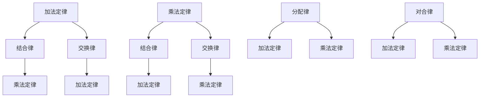
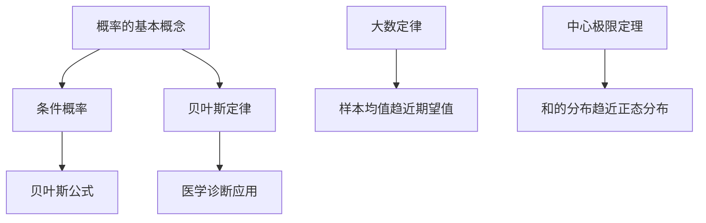
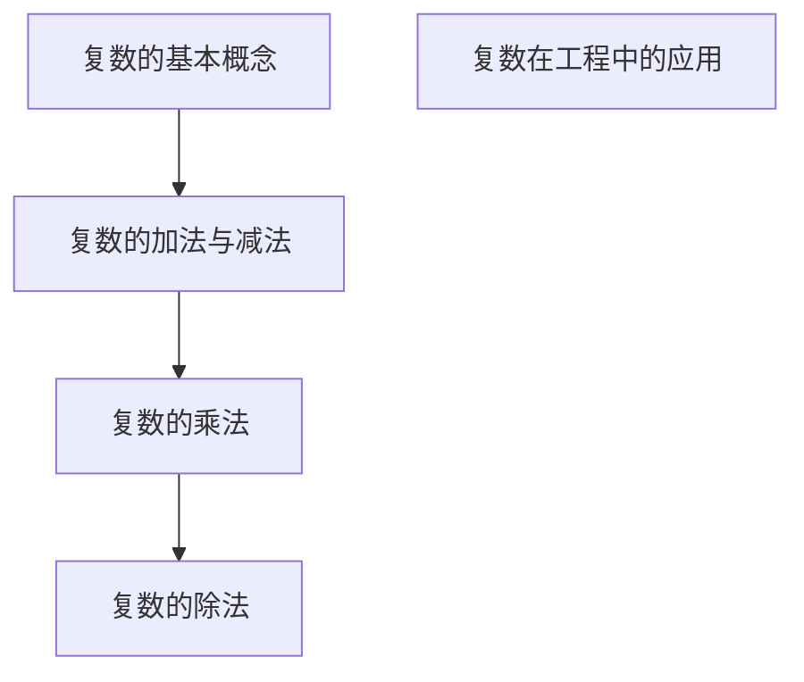

                 

### 文章标题

《数学定律：自然和谐的心智翻译》

> 关键词：数学定律、自然和谐、心智翻译、核心概念、算法原理、数学模型、未来应用

> 摘要：本文将深入探讨数学定律的起源、基本概念及其在科学、技术和日常生活中的应用。通过逻辑清晰的章节结构和详尽的解析，我们试图将数学定律的核心原理与自然界的和谐进行“心智翻译”，帮助读者更好地理解数学定律的本质和应用价值。

### 引言与基础概念

#### 第1章：数学定律的哲学背景

**1.1 数学定律的起源与历史**

数学定律的起源可以追溯到古代文明。在古埃及、巴比伦和印度等地，数学家们通过观察自然现象，发现了许多基本的数学关系。例如，古埃及人利用几何定律设计了金字塔，而古印度人则创立了零的概念和十进制系统。这些早期的数学定律奠定了现代数学的基础。

随着时间的推移，数学家们不断完善和扩展了这些基本定律。古希腊的欧几里得在《几何原本》中系统地阐述了几何定律，而阿拉伯数学家阿尔·花拉子米则在代数领域做出了重要贡献。16世纪的微积分定律由牛顿和莱布尼茨共同创立，为物理学和工程学的发展提供了强大的工具。

**1.2 数学定律在科学中的地位**

数学定律是科学研究的基石。物理学、化学、生物学等学科都依赖于数学定律来描述自然现象和解释实验结果。例如，牛顿的三大运动定律和万有引力定律为经典力学提供了完整的理论体系；麦克斯韦方程组则统一了电动力学和磁学，揭示了电磁波的本质。

在物理学中，数学定律不仅用于理论推导，还用于实验验证。通过数学模型和公式，科学家们可以预测未来的现象，指导实验设计和技术创新。例如，爱因斯坦的相对论方程揭示了时间、空间和物质之间的复杂关系，为宇宙学、黑洞和引力波研究提供了理论基础。

**1.3 数学定律与自然界的和谐**

数学定律与自然界的和谐具有深刻的哲学意义。从数学角度观察自然界，我们可以发现许多现象都遵循着简单的数学规律。例如，雪花的花瓣数、蜂巢的六边形结构和音乐的和谐音符都体现了数学的美丽。

这种和谐关系不仅存在于宏观宇宙中，还渗透到微观世界中。量子力学的数学模型揭示了微观粒子的行为规律，例如波函数的叠加和坍缩。这些定律虽然难以直观理解，但它们与实验结果的高度吻合，使得数学在科学研究中具有不可替代的地位。

数学定律的和谐性质还体现在其普适性上。许多数学定律在不同的领域和不同的尺度上都具有相同的数学形式。例如，牛顿第二定律不仅适用于宏观物体，还适用于微观粒子；欧拉公式在复数领域和三角函数中具有广泛的应用。

总之，数学定律的起源、地位和与自然界的和谐关系揭示了数学在科学研究中的核心作用。通过深入研究数学定律，我们可以更好地理解自然界的奥秘，推动科学技术的发展。

#### 第2章：数学定律的基本概念

**2.1 数学定律的定义与特性**

数学定律是指描述数学对象之间关系和性质的命题。它们是通过逻辑推理和实验验证得出的普遍规律，具有普遍性和稳定性。数学定律通常用数学符号和公式表示，其正确性可以通过逻辑证明或实验验证来验证。

数学定律具有以下特性：

1. **普遍性**：数学定律适用于各种情况，不受具体情境的影响。例如，加法定律和乘法定律在任何情况下都成立。
2. **稳定性**：数学定律在不同的时间和空间中保持不变。即使经过长时间的积累和扩展，数学定律的基本原理仍然适用。
3. **逻辑性**：数学定律是通过逻辑推理得出的，其证明过程符合逻辑规则。

**2.2 基础数学定律概述**

在数学中，有许多基础数学定律，它们构成了数学体系的基础。以下是一些常见的数学定律：

1. **加法定律**：对于任意的实数 a、b 和 c，有 (a + b) + c = a + (b + c)。这意味着加法运算满足结合律。
2. **乘法定律**：对于任意的实数 a、b 和 c，有 (ab)c = a(bc)。这意味着乘法运算也满足结合律。
3. **交换律**：对于任意的实数 a 和 b，有 a + b = b + a 和 ab = ba。这意味着加法和乘法运算满足交换律。
4. **结合律**：对于任意的实数 a、b 和 c，有 (a + b) + c = a + (b + c) 和 (ab)c = a(bc)。这意味着加法和乘法运算满足结合律。
5. **分配律**：对于任意的实数 a、b 和 c，有 a(b + c) = ab + ac 和 (a + b)c = ac + bc。这意味着乘法对加法具有分配性。
6. **对合律**：对于任意的实数 a，有 a^2 = aa。这意味着实数的平方等于自身与自身的乘积。

**2.3 数学定律的应用领域**

数学定律广泛应用于各个领域，包括自然科学、工程技术、经济学和社会科学等。以下是一些典型的应用领域：

1. **自然科学**：在物理学中，牛顿定律、麦克斯韦方程和热力学定律等数学定律用于描述自然现象，解释实验结果。在生物学中，基因遗传规律和生态模型等数学定律用于研究生命现象和生态系统。
2. **工程技术**：在工程学中，数学定律用于设计结构、控制系统和优化流程。例如，牛顿第二定律用于设计汽车发动机，麦克斯韦方程用于设计无线通信系统。
3. **经济学**：在经济学中，数学定律用于分析市场行为、预测经济趋势和设计金融模型。例如，供需定律和边际效用定律等数学定律用于指导经济决策。
4. **社会科学**：在社会科学中，数学定律用于研究社会现象、预测社会趋势和设计公共政策。例如，概率论和统计学的定律用于分析社会调查数据和评估政策效果。

总之，数学定律是科学研究和应用的基础。通过理解数学定律的基本概念和特性，我们可以更好地应用它们于各个领域，推动科学技术的进步和社会的发展。

#### 第3章：代数定律

**3.1 加法定律与乘法定律**

代数定律是数学中的基础概念，涉及加法和乘法等基本运算。在代数中，加法定律和乘法定律是最基本的两条定律，它们奠定了整个代数体系的基础。

**加法定律**：

加法定律表明，对于任意的实数 a、b 和 c，加法运算满足结合律和交换律。具体来说：

- **结合律**：对于任意的实数 a、b 和 c，有 (a + b) + c = a + (b + c)。这意味着在进行加法运算时，无论先计算哪两个数的和，最终的结果都是相同的。例如：
  $$(2 + 3) + 4 = 2 + (3 + 4) = 9$$

- **交换律**：对于任意的实数 a 和 b，有 a + b = b + a。这意味着加法运算满足交换律，即两个数相加的顺序可以互换，结果不变。例如：
  $$2 + 3 = 3 + 2 = 5$$

**乘法定律**：

乘法定律表明，对于任意的实数 a、b 和 c，乘法运算同样满足结合律和交换律。具体来说：

- **结合律**：对于任意的实数 a、b 和 c，有 (ab)c = a(bc)。这意味着在进行乘法运算时，无论先计算哪两个数的积，最终的结果都是相同的。例如：
  $$(2 \times 3) \times 4 = 2 \times (3 \times 4) = 24$$

- **交换律**：对于任意的实数 a 和 b，有 ab = ba。这意味着乘法运算满足交换律，即两个数相乘的顺序可以互换，结果不变。例如：
  $$2 \times 3 = 3 \times 2 = 6$$

**3.2 结合律与交换律**

结合律和交换律是代数中的两个重要性质，它们不仅在加法和乘法中适用，还在其他数学运算中具有普遍性。

**结合律**：

结合律表明，对于任何满足结合律的运算，其结果与运算顺序无关。对于加法运算，结合律可以表示为：
$$(a + b) + c = a + (b + c)$$

对于乘法运算，结合律可以表示为：
$$(ab)c = a(bc)$$

结合律的一个具体例子是计算三个数的和：
$$((1 + 2) + 3) = 6 = (1 + (2 + 3))$$

**交换律**：

交换律表明，对于任何满足交换律的运算，其结果与运算顺序无关。对于加法运算，交换律可以表示为：
$$a + b = b + a$$

对于乘法运算，交换律可以表示为：
$$ab = ba$$

交换律的一个具体例子是两个数的乘积：
$$2 \times 3 = 3 \times 2 = 6$$

**3.3 分配律与对合律**

除了结合律和交换律，代数中还有两个重要的定律：分配律和对合律。

**分配律**：

分配律是加法和乘法之间的一个重要关系。它表明，乘法可以分配到加法中的每一个加数上。具体来说，对于任意的实数 a、b 和 c，有：
$$a(b + c) = ab + ac$$
$$(a + b)c = ac + bc$$

分配律的一个具体例子是计算两个数的和与另一个数的乘积：
$$2(3 + 4) = 2 \times 3 + 2 \times 4 = 14$$

**对合律**：

对合律是关于实数的平方的一个性质。它表明，对于任意的实数 a，有：
$$a^2 = aa$$

对合律的一个具体例子是计算一个数的平方：
$$2^2 = 2 \times 2 = 4$$

**3.4 代数定律的Mermaid流程图**

为了更清晰地展示代数定律之间的关系，我们可以使用Mermaid流程图来表示。以下是代数定律的Mermaid流程图：



这个流程图展示了加法定律、乘法定律、结合律、交换律、分配律和对合律之间的关系。通过这个流程图，我们可以更直观地理解这些定律的相互关系和作用。

总之，代数定律是数学中的基础概念，包括加法定律、乘法定律、结合律、交换律、分配律和对合律。这些定律不仅奠定了代数体系的基础，还在各个数学领域和实际应用中发挥着重要作用。通过深入理解这些定律，我们可以更好地掌握数学的基本原理和应用技巧。

#### 第4章：几何定律

**4.1 平行线定律与相似三角形定律**

几何定律在数学中扮演着重要的角色，尤其是在几何学的研究和应用中。平行线定律和相似三角形定律是几何学中两个基本且重要的定律，它们在解决几何问题中发挥着关键作用。

**平行线定律**：

平行线定律表明，如果两条直线与第三条直线相交，且在同一侧的内角和小于两个直角，那么这两条直线是平行的。具体来说，如果两条直线 l 和 m 与第三条直线 n 相交，并且角 1 和角 2 是 l 和 n 的内错角，那么有：

$$角1 + 角2 < 180°$$

则直线 l 和 m 平行。

平行线定律的一个具体例子是，假设有两条直线 l 和 m，以及一条与之相交的直线 n。如果角 1 和角 2 的度数分别是 100° 和 80°，则根据平行线定律，直线 l 和 m 是平行的。

**相似三角形定律**：

相似三角形定律指出，如果两个三角形的对应角度相等，则这两个三角形是相似的。此外，相似三角形还具有对应边成比例的性质。具体来说，如果三角形 ABC 和三角形 DEF 满足：

$$∠A = ∠D, ∠B = ∠E, ∠C = ∠F$$

则三角形 ABC 和三角形 DEF 是相似的。

相似三角形定律的一个具体例子是，假设有两个三角形 ABC 和 DEF，其中 ∠A = ∠D、∠B = ∠E 和 ∠C = ∠F，则根据相似三角形定律，三角形 ABC 和三角形 DEF 是相似的。

此外，相似三角形还有对应边成比例的性质。例如，如果三角形 ABC 和三角形 DEF 相似，则：

$$AB/DE = BC/EF = AC/DF$$

这意味着相似三角形的对应边长度成比例。

**4.2 三角形的内角和定律**

三角形的内角和定律是几何学中的另一个基本定律，它指出任意三角形的三个内角之和等于 180°。具体来说，设三角形的三个内角分别为 ∠A、∠B 和 ∠C，则有：

$$∠A + ∠B + ∠C = 180°$$

三角形的内角和定律在解决许多几何问题时非常有用。例如，如果我们知道一个三角形的两个内角度数，我们就可以通过这个定律计算出第三个角的度数。

**4.3 几何定律的数学模型与数学公式**

为了更详细地理解几何定律，我们可以引入数学模型和公式。

**平行线定律的数学模型**：

设直线 l 和 m 与直线 n 相交，角 1 和角 2 是 l 和 n 的内错角。根据平行线定律，我们有：

$$角1 + 角2 < 180° \Rightarrow 直线 l ∥ 直线 m$$

**相似三角形定律的数学模型**：

设三角形 ABC 和三角形 DEF，其中 ∠A = ∠D、∠B = ∠E 和 ∠C = ∠F。根据相似三角形定律，我们有：

$$∠A = ∠D, ∠B = ∠E, ∠C = ∠F \Rightarrow 三角形 ABC ∼ 三角形 DEF$$

并且对应边成比例：

$$AB/DE = BC/EF = AC/DF$$

**三角形的内角和定律的数学模型**：

设三角形的三个内角分别为 ∠A、∠B 和 ∠C。根据三角形的内角和定律，我们有：

$$∠A + ∠B + ∠C = 180°$$

这些数学模型和公式为我们提供了计算和验证几何定律的数学工具。

**4.4 几何定律的应用**

几何定律在解决几何问题时具有广泛的应用。以下是一些实际应用例子：

1. **求平行线**：根据平行线定律，我们可以通过测量内错角的度数来确定两条直线是否平行。
2. **判断相似三角形**：通过相似三角形定律，我们可以判断两个三角形是否相似，以及计算相似三角形的对应边长度比例。
3. **计算三角形内角度数**：利用三角形的内角和定律，我们可以计算任意三角形的内角度数，这对于解决与三角形相关的问题非常重要。

总之，几何定律在数学中具有基础地位，它们不仅帮助我们理解和解决几何问题，还为其他数学分支和科学领域提供了理论基础。通过深入理解几何定律的数学模型和公式，我们可以更好地应用这些定律解决实际问题。

#### 第5章：概率论定律

概率论是数学的一个重要分支，它研究随机事件及其概率。概率论定律为我们提供了描述和预测随机现象的工具。在本章中，我们将探讨概率论的一些核心定律，包括基本概率概念、条件概率和贝叶斯定律、大数定律以及中心极限定理。

**5.1 概率的基本概念**

概率论的基本概念包括随机试验、样本空间、事件和概率。随机试验是指在相同条件下可以重复进行且结果具有不确定性的试验。样本空间是随机试验所有可能结果的集合。事件是样本空间的一个子集，表示随机试验中的一个结果集合。概率是事件发生的可能性，通常用概率值（0到1之间的实数）表示。

1. **概率的定义**：设 A 是样本空间 S 的一个子集，则事件 A 的概率定义为：
   $$ P(A) = \frac{有利结果的数目}{所有可能结果的数目} $$
2. **概率的运算规则**：概率运算包括加法规则、乘法规则、全概率公式和贝叶斯公式。

**5.2 条件概率与贝叶斯定律**

条件概率是指在已知某个事件发生的条件下，另一个事件发生的概率。条件概率公式为：
$$ P(A|B) = \frac{P(A \cap B)}{P(B)} $$
其中，\( P(A \cap B) \) 表示事件 A 和事件 B 同时发生的概率，\( P(B) \) 表示事件 B 发生的概率。

贝叶斯定律是概率论中的一个重要工具，它提供了在已知一个或多个事件发生的条件下，计算其他事件概率的方法。贝叶斯定律的表达式为：
$$ P(A|B) = \frac{P(B|A)P(A)}{P(B)} $$
其中，\( P(B|A) \) 表示在事件 A 发生的条件下事件 B 发生的概率，\( P(A) \) 表示事件 A 发生的概率，\( P(B) \) 表示事件 B 发生的概率。

贝叶斯定律的一个实际应用是医学诊断。例如，假设有 1% 的人口患有某种疾病，而该疾病的检测方法具有 99% 的准确率（即检测为阳性的患者中有 99% 确实患有该疾病，检测为阴性的患者中有 99% 确实没有患有该疾病）。如果某人接受检测后结果为阳性，我们可以使用贝叶斯定律来计算该人实际患有该疾病的概率。

**5.3 大数定律与中心极限定理**

大数定律是概率论中的一个重要定理，它表明当试验次数足够多时，随机变量的样本均值会趋近于其期望值。大数定律的形式如下：

设 \( X_1, X_2, ..., X_n \) 是独立同分布的随机变量序列，其均值为 \( \mu \)，方差为 \( \sigma^2 \)。则当 \( n \) 趋近于无穷大时，样本均值 \( \bar{X}_n = \frac{1}{n}\sum_{i=1}^{n}X_i \) 的分布会趋近于均值为 \( \mu \)、方差为 \( \frac{\sigma^2}{n} \) 的正态分布。

中心极限定理指出，当随机变量序列的个数为足够大时，这些随机变量的和的分布会趋近于正态分布，无论这些随机变量本身是否是正态分布。中心极限定理的形式如下：

设 \( X_1, X_2, ..., X_n \) 是独立同分布的随机变量序列，其均值为 \( \mu \)，方差为 \( \sigma^2 \)。则当 \( n \) 趋近于无穷大时，随机变量 \( \sum_{i=1}^{n}X_i \) 的分布会趋近于均值为 \( n\mu \)、方差为 \( n\sigma^2 \) 的正态分布。

**5.4 概率论定律的Mermaid流程图**

为了更直观地展示概率论的核心定律之间的关系，我们可以使用Mermaid流程图来表示。以下是概率论定律的Mermaid流程图：



这个流程图展示了概率的基本概念、条件概率、贝叶斯定律、大数定律和中心极限定理之间的关系。通过这个流程图，我们可以更清晰地理解这些定律的核心内容和应用场景。

总之，概率论定律是概率论中的核心概念，它们在各个领域，如统计学、经济学、物理学和社会科学中有着广泛的应用。通过深入理解这些定律，我们可以更好地描述和预测随机现象，为科学研究和技术发展提供有力的工具。

#### 第6章：微积分定律

微积分定律是数学中非常重要的一个领域，它主要研究函数的极限、导数、积分以及它们的性质和应用。微积分起源于17世纪，由艾萨克·牛顿和戈特弗里德·威廉·莱布尼茨几乎同时独立创立。微积分的基本定理是微积分理论的核心，包括微分基本定理和积分基本定理。本章将详细介绍这些基本定理，并探讨它们在物理和其他科学领域中的应用。

**6.1 微积分基本定理**

微积分基本定理包括两个部分：微分基本定理和积分基本定理。

**微分基本定理**：

微分基本定理表明，一个连续函数在一个区间上的积分可以通过该函数在该区间上的导数来计算。具体来说，设 \( f(x) \) 是定义在区间 \([a, b]\) 上且在区间内可导的连续函数，那么：

$$ \int_{a}^{b} f'(x) dx = f(b) - f(a) $$

微分基本定理的一个直观解释是，函数 \( f(x) \) 在区间 \([a, b]\) 上的变化量可以通过它在区间上的导数来计算。导数 \( f'(x) \) 表示函数在该点的瞬时变化率，而积分则是这些瞬时变化率的累积。

**积分基本定理**：

积分基本定理表明，一个函数的定积分可以通过该函数在某个点上的值来计算。具体来说，设 \( f(x) \) 是定义在区间 \([a, b]\) 上且在区间内可积的连续函数，那么：

$$ \int_{a}^{b} f(x) dx = \lim_{n \to \infty} \sum_{i=1}^{n} f(x_i^*) \Delta x $$

其中，\( \Delta x = \frac{b-a}{n} \)，\( x_i^* \) 是区间 \([x_{i-1}, x_i]\) 上的任意一点。

积分基本定理的直观解释是，将函数 \( f(x) \) 在区间 \([a, b]\) 上的曲线下面积分割成许多小矩形，这些小矩形的面积之和的极限就是曲线下的总面积。

**6.2 罗比塔法则**

罗比塔法则是一种用于求解不定积分的方法，它适用于两种特殊类型的极限问题：\( \frac{0}{0} \) 和 \( \frac{\infty}{\infty} \)。罗比塔法则的基本思想是通过连续求导来简化计算。设 \( f(x) \) 和 \( g(x) \) 在某点 \( x_0 \) 可导，且 \( f(x_0) = 0 \) 或 \( g(x_0) = \infty \)，那么：

$$ \lim_{x \to x_0} \frac{f(x)}{g(x)} = \lim_{x \to x_0} \frac{f'(x)}{g'(x)} $$

罗比塔法则的一个具体应用例子是计算 \( \lim_{x \to 0} \frac{\sin x}{x} \)。根据罗比塔法则，我们可以将极限问题转化为求导数问题：

$$ \lim_{x \to 0} \frac{\sin x}{x} = \lim_{x \to 0} \frac{\cos x}{1} = 1 $$

**6.3 微积分在物理中的应用**

微积分在物理学中有着广泛的应用，它为物理学提供了描述和解决各种问题的数学工具。

**牛顿运动定律**：

牛顿运动定律是物理学的基础，它描述了物体的运动和力的关系。牛顿第二定律 \( F = ma \) 表示力 \( F \) 与加速度 \( a \) 和质量 \( m \) 之间的关系。通过微积分，我们可以将这个关系进一步扩展为：

$$ F(t) = m \frac{dv(t)}{dt} = m \frac{d^2x(t)}{dt^2} $$

其中，\( v(t) \) 是速度函数，\( x(t) \) 是位置函数。这意味着力 \( F(t) \) 与物体的加速度 \( a(t) \) 成正比，加速度与位置的变化率成正比。

**洛伦兹力**：

在电磁学中，洛伦兹力描述了电荷在电磁场中的受力情况。洛伦兹力的微分形式为：

$$ \vec{F} = q (\vec{E} + \vec{v} \times \vec{B}) $$

其中，\( q \) 是电荷量，\( \vec{E} \) 是电场强度，\( \vec{v} \) 是速度，\( \vec{B} \) 是磁场强度。这个公式通过微积分将电场和磁场对电荷的作用力表达为微分方程，为电磁现象的研究提供了理论基础。

**热力学**：

在热力学中，热量的传递可以通过微积分来描述。热传导定律指出，单位时间内通过单位面积的热量与温度梯度成正比，即：

$$ \frac{dQ}{dt} = -kA \frac{dT}{dx} $$

其中，\( k \) 是热导率，\( A \) 是面积，\( T \) 是温度，\( x \) 是距离。这个公式通过微分方程描述了热量在固体中的传递过程。

**6.4 微积分定律的数学模型与数学公式**

为了更详细地理解微积分定律，我们可以引入数学模型和公式。

**微分基本定理的数学模型**：

设 \( f(x) \) 是定义在区间 \([a, b]\) 上且在区间内可导的连续函数，其导数为 \( f'(x) \)。根据微分基本定理，我们有：

$$ \int_{a}^{b} f'(x) dx = f(b) - f(a) $$

**积分基本定理的数学模型**：

设 \( f(x) \) 是定义在区间 \([a, b]\) 上且在区间内可积的连续函数。根据积分基本定理，我们有：

$$ \int_{a}^{b} f(x) dx = \lim_{n \to \infty} \sum_{i=1}^{n} f(x_i^*) \Delta x $$

**罗比塔法则的数学公式**：

设 \( f(x) \) 和 \( g(x) \) 在某点 \( x_0 \) 可导，且 \( f(x_0) = 0 \) 或 \( g(x_0) = \infty \)，根据罗比塔法则，我们有：

$$ \lim_{x \to x_0} \frac{f(x)}{g(x)} = \lim_{x \to x_0} \frac{f'(x)}{g'(x)} $$

**6.5 微积分定律的应用**

微积分定律在许多实际应用中发挥着关键作用，以下是一些典型的应用例子：

**计算机图形学**：

在计算机图形学中，微积分用于计算曲线和曲面的导数和积分。这些计算对于渲染和动画制作至关重要。例如，在渲染三维图形时，微积分用于计算光照和阴影，从而生成逼真的视觉效果。

**经济学**：

在经济学中，微积分用于分析和优化经济模型。例如，消费者行为理论中的边际效用分析和生产者行为理论中的边际成本分析都依赖于微积分。

**工程学**：

在工程学中，微积分用于设计和分析机械、电子和结构系统。例如，在机械工程中，微积分用于计算物体的运动和受力情况，从而优化设计和性能。

**物理学**：

在物理学中，微积分用于描述自然现象和建立物理模型。例如，在电磁学中，微积分用于描述电荷和磁场的分布和变化。

总之，微积分定律是数学和物理学的重要工具，它们在多个领域具有广泛的应用。通过深入理解微积分定律的数学模型和公式，我们可以更好地应用这些定律解决实际问题，推动科学和技术的发展。

#### 第7章：复数定律

复数是数学中的一个重要概念，它将实数和虚数结合在一起，形成了一个完整的数域。复数定律包括复数的基本概念、复数的运算规则、复数在工程中的应用，以及复数定律的数学模型与数学公式。本章将详细介绍这些内容，并探讨复数在工程中的具体应用。

**7.1 复数的基本概念**

复数是由实数和虚数构成的数，通常表示为 \( a + bi \)，其中 \( a \) 是实部，\( b \) 是虚部，\( i \) 是虚数单位，满足 \( i^2 = -1 \)。复数可以表示为平面上的点，其实部表示水平坐标，虚部表示垂直坐标。

**7.2 复数的运算规则**

复数的运算包括加法、减法、乘法和除法。

**加法和减法**：

复数的加法和减法与实数的运算类似，只需分别对实部和虚部进行运算。具体来说：

- 加法：
  $$ (a + bi) + (c + di) = (a + c) + (b + d)i $$
- 减法：
  $$ (a + bi) - (c + di) = (a - c) + (b - d)i $$

**乘法**：

复数的乘法可以通过分配律和虚数单位的性质进行计算。具体来说：

$$ (a + bi)(c + di) = ac + adi + bci - bd = (ac - bd) + (ad + bc)i $$

**除法**：

复数的除法可以通过乘以共轭复数进行简化。共轭复数的定义是将复数的虚部取反，即 \( a + bi \) 的共轭复数是 \( a - bi \)。具体来说：

$$ \frac{a + bi}{c + di} = \frac{(a + bi)(c - di)}{(c + di)(c - di)} = \frac{(ac + bd) + (bc - ad)i}{c^2 + d^2} $$

**7.3 复数在工程中的应用**

复数在工程学中有着广泛的应用，特别是在电子工程、信号处理和控制系统中。

**电子工程**：

在电子工程中，复数用于描述交流电路中的电压、电流和功率。例如，正弦波可以用复数形式表示，其中实部表示电压或电流的大小，虚部表示相位。复数的乘法和除法可以用来计算交流电路中的阻抗、导纳和功率。

**信号处理**：

在信号处理中，复数用于处理和变换信号。例如，傅里叶变换是将信号从时域转换到频域的重要工具，而傅里叶变换的核心是复数。通过傅里叶变换，我们可以分析信号的频率成分，从而进行滤波、压缩和增强。

**控制系统**：

在控制系统中，复数用于描述系统的动态特性和稳定性。例如，控制系统的状态空间模型可以用复数表示，其中状态变量和输入输出的关系可以用矩阵方程来描述。通过分析这些矩阵方程，我们可以设计出稳定且有效的控制系统。

**7.4 复数定律的Mermaid流程图**

为了更直观地展示复数定律之间的关系，我们可以使用Mermaid流程图。以下是复数定律的Mermaid流程图：



这个流程图展示了复数的基本概念、复数的运算规则，以及复数在工程中的应用。通过这个流程图，我们可以更清晰地理解复数的运算规则及其在工程中的应用场景。

**7.5 复数定律的数学模型与数学公式**

为了更详细地理解复数定律，我们可以引入数学模型和公式。

**复数的加法和减法**：

设 \( z_1 = a + bi \) 和 \( z_2 = c + di \)，则：

- 加法：
  $$ z_1 + z_2 = (a + c) + (b + d)i $$
- 减法：
  $$ z_1 - z_2 = (a - c) + (b - d)i $$

**复数的乘法**：

设 \( z_1 = a + bi \) 和 \( z_2 = c + di \)，则：

$$ z_1 \cdot z_2 = (ac - bd) + (ad + bc)i $$

**复数的除法**：

设 \( z_1 = a + bi \) 和 \( z_2 = c + di \)，则：

$$ z_1 / z_2 = \frac{(a + bi)(c - di)}{c^2 + d^2} = \frac{(ac + bd) + (bc - ad)i}{c^2 + d^2} $$

**7.6 应用实例**

**电子工程中的应用**：

在电子工程中，复数用于描述交流电路中的电压和电流。例如，一个交流电压 \( V(t) = V_0 \sin(\omega t) \) 可以表示为复数 \( V = V_0 e^{j\omega t} \)，其中 \( j \) 是虚数单位，\( \omega \) 是角频率。通过复数运算，我们可以计算电路中的阻抗、导纳和功率。

**信号处理中的应用**：

在信号处理中，傅里叶变换是将信号从时域转换到频域的重要工具。傅里叶变换的核心是复数。通过傅里叶变换，我们可以分析信号的频率成分，从而进行滤波、压缩和增强。

**控制系统中的应用**：

在控制系统中，复数用于描述系统的动态特性和稳定性。例如，一个线性控制系统的状态空间模型可以用复数矩阵表示，通过分析这些矩阵，我们可以设计出稳定且有效的控制系统。

总之，复数是数学和工程中非常重要的概念，它为电子工程、信号处理和控制系统的分析和设计提供了强大的工具。通过深入理解复数定律的数学模型和公式，我们可以更好地应用这些定律解决实际问题，推动科学和技术的进步。

#### 第8章：数学定律的心智翻译

**8.1 心智翻译的概念与过程**

心智翻译是一种将抽象的数学概念转化为易于理解的思想和图像的过程。它旨在揭示数学定律背后的逻辑和直觉，从而帮助人们更好地理解数学的本质。心智翻译的概念源自于认知心理学，强调人类心智在理解复杂信息时的内在机制。

心智翻译的过程通常包括以下几个步骤：

1. **理解数学概念**：首先，我们需要深入理解数学定律的含义和背景，包括其历史起源、基本原理和应用领域。
2. **构建思想模型**：基于对数学概念的理解，构建一个思想模型，将抽象的数学原理转化为具体的思想和图像。这可以通过类比、隐喻和可视化方法实现。
3. **应用心智翻译**：将构建的思想模型应用于实际问题中，通过实例分析和推理来验证和深化对数学定律的理解。

**8.2 数学定律与人类思维的连接**

数学定律与人类思维具有紧密的关联。人类心智天生具有抽象和推理的能力，这使得我们能够发现和构建数学定律。以下是数学定律与人类思维之间的几个关键连接：

1. **逻辑推理**：数学定律是通过严密的逻辑推理得出的。人类心智在理解数学问题时，会运用逻辑推理来验证和推导定律的正确性。
2. **模式识别**：人类心智具有强大的模式识别能力，这使得我们能够发现数学定律中的规律和模式。例如，在几何学中，人类通过观察自然现象和几何图形，发现了平行线、相似三角形等定律。
3. **可视化**：人类心智可以通过图像和可视化来理解复杂的概念。例如，通过绘制图形和表格，我们可以直观地展示数学定律的应用和效果。

**8.3 数学定律在教育中的应用**

数学定律在教育中的应用具有重要意义。通过心智翻译，我们可以将复杂的数学概念简化为易于理解的教学内容，从而提高学生的学习效果。以下是一些具体的应用方法：

1. **启发式教学**：通过启发式教学，引导学生主动探索数学定律的原理和应用。例如，在讲授平行线定律时，可以让学生通过实验观察平行线的性质，然后引导他们总结出定律。
2. **案例教学**：通过案例教学，将数学定律应用于实际问题和生活中。例如，在讲授概率论定律时，可以让学生分析实际事件，如赌博和天气预报，以理解概率的概念和应用。
3. **跨学科教学**：将数学定律与其他学科如物理、化学、计算机科学等相结合，让学生从不同角度理解数学定律的广泛适用性。例如，在讲授微积分定律时，可以结合物理学中的运动和能量概念，让学生理解微积分在物理中的应用。
4. **实践和探索**：鼓励学生进行数学实验和探索，通过实际操作和问题解决来深化对数学定律的理解。例如，让学生使用数学软件进行数值计算和可视化，从而直观地展示数学定律的效果。

**8.4 心智翻译的数学模型与数学公式**

为了更深入地探讨心智翻译的过程，我们可以引入数学模型和公式。心智翻译的数学模型可以描述人类心智在理解数学定律时的内在机制，以及如何通过心智翻译将这些机制转化为具体的教学内容。

1. **认知模型**：

认知模型是一种描述人类心智过程的数学模型。在心智翻译中，认知模型可以用来模拟人类在理解数学定律时的思维过程。例如，通过构建认知图模型，我们可以表示数学定律的概念、关系和推理步骤。

2. **符号表示**：

符号表示是心智翻译的重要工具。通过使用数学符号和公式，我们可以将抽象的数学概念转化为具体的形式。例如，在心智翻译微积分定律时，可以使用微分和积分的符号表示来描述函数的变化和累积过程。

3. **可视化模型**：

可视化模型是心智翻译的有力工具。通过绘制图形和表格，我们可以将抽象的数学概念直观地展示出来。例如，通过绘制函数的图像，我们可以直观地展示函数的性质和关系，从而帮助学生更好地理解微积分定律。

总之，心智翻译是一种将抽象的数学概念转化为易于理解的思想和图像的过程。通过心智翻译，我们可以更好地理解数学定律的本质和应用，提高数学教育的效果。心智翻译的数学模型与数学公式为我们提供了工具和方法，帮助我们深入探讨和理解数学定律。

#### 第9章：数学定律在科学研究中的应用

数学定律在科学研究中的应用无处不在，它们不仅为理论模型提供了基础，还为实验设计和数据分析提供了工具。在本章中，我们将探讨数学定律在物理学、生物学和工程学等领域的具体应用，展示数学如何推动科学进步。

**9.1 数学定律在物理学中的应用**

物理学是数学应用最为广泛的领域之一。经典物理学中的许多定律都基于数学模型，这些模型帮助我们理解和预测自然现象。

- **牛顿定律**：牛顿的三大运动定律描述了物体在力的作用下的运动。这些定律通过数学公式表达为：
  $$
  F = ma \\
  \frac{dp}{dt} = F
  $$
  其中 \( F \) 是力，\( m \) 是质量，\( a \) 是加速度，\( p \) 是动量。这些公式不仅帮助我们理解物体的运动，还用于设计和分析机械设备。

- **麦克斯韦方程组**：麦克斯韦方程组是电磁学的核心，它们描述了电场、磁场和电荷之间的关系。方程组如下：
  $$
  \nabla \cdot \mathbf{E} = \frac{\rho}{\epsilon_0} \\
  \nabla \cdot \mathbf{B} = 0 \\
  \nabla \times \mathbf{E} = -\frac{\partial \mathbf{B}}{\partial t} \\
  \nabla \times \mathbf{B} = \mu_0 \mathbf{J} + \mu_0 \epsilon_0 \frac{\partial \mathbf{E}}{\partial t}
  $$
  这些方程揭示了电磁波的本质，并用于设计无线通信系统和电磁装置。

- **热力学定律**：热力学定律描述了能量转换和热力学过程。其中，第一和第二定律分别为：
  $$
  \Delta U = Q - W \\
  \Delta S \geq 0
  $$
  这些定律帮助我们理解能量守恒和熵增原理，在能源工程和环境科学中有着广泛应用。

**9.2 数学定律在生物学中的应用**

生物学中的许多现象可以通过数学定律来描述和预测。数学模型在生物学研究中发挥着越来越重要的作用，帮助科学家理解复杂生物系统的运作。

- **种群动态模型**：种群生态学中的Lotka-Volterra方程描述了捕食者-猎物系统中的种群动态。方程如下：
  $$
  \frac{dx}{dt} = ax - bxy \\
  \frac{dy}{dt} = cy - dxy
  $$
  其中 \( x \) 和 \( y \) 分别表示猎物和捕食者的种群密度，\( a \)、\( b \)、\( c \) 和 \( d \) 是常数。这些方程帮助我们预测种群数量的变化趋势。

- **神经网络模型**：神经网络是生物学和计算神经科学中的核心概念。数学模型如 Hopfield 网和 Boltzmann 机用于模拟神经网络中的信息处理和记忆功能。这些模型揭示了大脑中复杂信息处理的基本原理。

- **遗传学定律**：遗传学中的孟德尔定律描述了基因的传递规律。这些定律包括：
  $$
  \text{分离定律：} \\
  \text{每个个体从父母那里随机获得一个基因，这两个基因是分离的。} \\
  \text{自由组合定律：} \\
  \text{不同基因的分离是独立的，它们在配子形成时自由组合。}
  $$
  这些定律不仅帮助科学家理解遗传机制，还为遗传改良和基因工程提供了理论基础。

**9.3 数学定律在工程学中的应用**

工程学中的许多设计、优化和控制问题都依赖于数学定律。数学模型和算法在工程设计和分析中发挥着关键作用。

- **结构力学**：结构力学中的有限元方法（FEM）是一种基于数学定律的数值方法，用于分析结构应力和变形。有限元模型将结构划分为多个小单元，通过解线性方程组来计算应力和位移。这一方法广泛应用于建筑、航空和汽车工程中。

- **控制理论**：控制理论中的状态空间模型和传递函数是数学工具，用于分析和设计控制系统。这些模型基于微分方程和传递函数，通过优化算法来设计稳定、高效的控制系统。

- **电路分析**：电路分析中的基尔霍夫定律描述了电路中电压和电流的分配关系。这些定律基于数学公式，帮助工程师设计和优化电子电路。例如，基尔霍夫电流定律为：
  $$
  \sum I_{\text{入}} = \sum I_{\text{出}}
  $$
  基尔霍夫电压定律为：
  $$
  \sum V = 0
  $$

**9.4 具体应用实例**

- **物理学中的引力波**：爱因斯坦的广义相对论预言了引力波的存在。通过数学模型和观测数据，科学家们发现了引力波，这一发现验证了广义相对论的正确性，并推动了天体物理学的发展。

- **生物学中的基因编辑**：CRISPR-Cas9是一种基因编辑工具，通过数学模型和算法，科学家可以精确地编辑目标基因。这一技术在基因治疗、农业改良和生物医学研究等领域具有广泛应用。

- **工程学中的自动驾驶**：自动驾驶系统依赖于数学模型和传感器数据，通过控制理论和机器学习算法，汽车能够自主导航和避障。这一技术在智能交通和无人驾驶领域有着广阔的应用前景。

总之，数学定律在科学研究中的应用是多方面的，它们不仅为理论模型提供了基础，还为实验设计和数据分析提供了工具。通过数学定律，科学家和工程师能够更好地理解自然界的规律，推动科学技术的进步。随着数学方法的不断发展和完善，数学在科学研究中的应用将会更加广泛和深入。

#### 第10章：数学定律在日常生活中的应用

数学定律不仅在科学研究和工程领域发挥着重要作用，它们同样在我们的日常生活中无处不在。通过数学定律的应用，我们可以更有效地解决实际问题，优化日常生活。以下将探讨数学定律在交通规划、金融计算和信息技术中的应用。

**10.1 数学定律在交通规划中的应用**

交通规划是一个复杂且重要的领域，它关系到城市发展和人们出行效率。数学定律在交通规划中的应用主要体现在网络分析和优化方面。

- **流量均衡**：在交通网络中，流量均衡是一个关键问题。通过流量均衡定律，我们可以优化交通流量，减少拥堵和交通事故。最著名的流量均衡模型是洛伦兹-梅尔模型，该模型基于概率论和排队论，通过计算交通流量和路径选择，优化交通网络。

- **最短路径算法**：最短路径问题是交通规划中的基础问题，它旨在找到从起点到终点的最短路径。最短路径算法，如迪杰斯特拉算法和贝尔曼-福特算法，都是基于数学定律和优化理论。这些算法可以帮助交通规划者设计最优的路线和交通网络，提高交通效率。

- **交通信号控制**：交通信号控制也是交通规划中的一个重要方面。通过数学模型，如排队论和随机过程理论，交通信号控制器可以优化红绿灯的时长和切换策略，减少交通拥堵和排放量。

**10.2 数学定律在金融计算中的应用**

金融领域中的计算和分析高度依赖数学定律，包括概率论、统计学和优化理论。以下是一些典型的应用实例：

- **风险管理**：金融市场中风险无处不在，数学定律，如正态分布和方差分析，用于评估和监控投资组合的风险。通过数学模型，金融机构可以制定有效的风险管理策略，降低潜在的损失。

- **定价模型**：期权定价模型，如布莱克-舒尔斯模型，是一个重要的应用实例。该模型基于概率论和微积分，通过计算期权的内在价值和时间价值，为金融产品定价。

- **量化交易**：量化交易是一种利用数学模型和算法进行交易的方法。通过构建数学模型，量化交易者可以预测市场趋势，制定交易策略，实现自动化交易。

- **金融计算工具**：金融计算工具，如金融计算软件和金融模型，广泛应用于投资分析和风险管理。这些工具基于数学定律和算法，帮助投资者和金融机构做出更明智的决策。

**10.3 数学定律在信息技术中的应用**

信息技术的发展离不开数学定律的应用，特别是在网络安全、数据分析和机器学习等领域。

- **密码学**：密码学是信息安全的核心。数学定律，如模运算和离散对数问题，用于构建安全的加密算法和数字签名。椭圆曲线密码学是当前最先进的密码学领域之一，它利用椭圆曲线的数学特性，提供强大的加密保护。

- **网络拓扑**：计算机网络中的拓扑结构对网络性能和可靠性至关重要。数学定律，如随机图理论和网络流模型，用于分析网络拓扑结构，设计可靠的网络协议和路由算法。

- **数据压缩**：数据压缩是信息技术中的一个重要方面。通过数学定律，如信息论和哈夫曼编码，我们可以有效地压缩数据，提高存储和传输效率。

- **机器学习**：机器学习是人工智能的核心技术之一，它依赖于概率论、统计学和优化理论。数学定律，如梯度下降法和支持向量机，用于训练和优化机器学习模型，实现智能预测和决策。

**10.4 应用实例**

- **交通流量预测**：通过收集历史交通数据和运用时间序列分析，交通部门可以利用数学模型预测未来的交通流量。这些预测有助于优化交通信号控制，减少交通拥堵。

- **金融风险评估**：金融机构通过构建数学模型，对投资组合进行风险评估。例如，通过计算风险值（VaR），银行可以了解在最坏情况下的潜在损失，从而制定风险控制策略。

- **网络安全**：网络安全公司通过分析网络流量和利用概率论，可以发现潜在的网络攻击。通过构建入侵检测系统，网络安全专家可以实时监测和响应网络威胁。

总之，数学定律在日常生活中的应用是丰富多样的。通过数学模型和算法，我们可以更好地理解和解决日常生活中的实际问题，提高效率和生活质量。随着数学方法的不断发展和创新，数学定律的应用前景将更加广阔。通过学习和应用数学定律，我们可以更好地应对复杂多变的生活环境。

#### 第11章：数学定律的未来与发展

**11.1 数学定律的发展方向**

数学定律的未来发展将受到科技进步和学科交叉的推动。以下是一些可能的发展方向：

1. **量子计算与量子定律**：量子计算是下一代计算技术的前沿领域。量子定律，如薛定谔方程和海森堡不确定性原理，将拓展我们对自然界的理解。量子算法和量子逻辑定律的研究有望为数学带来新的突破。

2. **大数据与统计学**：随着大数据时代的到来，统计学方法在数据处理和分析中发挥着越来越重要的作用。新的统计定律和模型将帮助我们更好地理解和利用大规模数据，推动数据科学的发展。

3. **人工智能与计算理论**：人工智能的快速发展对计算理论提出了新的挑战。深度学习、神经网络等人工智能模型需要新的数学定律和理论支持，以优化算法性能和增强智能系统的稳定性。

4. **复杂系统和非线性动力学**：复杂系统的建模和分析是当前数学研究的热点。非线性动力学和混沌理论的发展将为理解和预测复杂系统的行为提供新的工具。

**11.2 数学定律在人工智能中的应用前景**

数学定律在人工智能中的应用前景广阔，特别是在机器学习和深度学习领域：

1. **优化算法**：机器学习中的优化问题依赖于数学定律。优化算法，如梯度下降法和随机梯度下降法，基于微积分和概率论，用于训练神经网络和优化模型参数。随着数学定律的深入研究和应用，优化算法将变得更加高效和稳定。

2. **概率图模型**：概率图模型是机器学习的重要工具，包括贝叶斯网络和马尔可夫网络。这些模型基于概率论和图论，用于表示和处理不确定性和依赖关系。数学定律将帮助我们开发更强大的概率图模型，提高人工智能系统的推理能力。

3. **强化学习**：强化学习是一种通过试错和反馈进行决策的机器学习方法。数学定律，如动态规划和控制理论，将在强化学习中发挥关键作用，推动人工智能系统的自主学习和适应能力。

**11.3 数学定律对社会发展的潜在影响**

数学定律不仅影响科学技术的发展，还对社会的各个领域产生深远的影响：

1. **经济发展**：数学定律在经济学中的应用，如优化理论和博弈论，帮助企业和政府制定更有效的经济政策，促进经济增长和社会福利。

2. **公共卫生**：数学模型和统计定律在公共卫生领域发挥着重要作用，帮助制定防疫策略和疾病预测。例如，通过数学模型，我们可以评估疫苗接种策略的效果，优化公共卫生资源。

3. **教育改革**：数学定律在教育中的应用，如认知科学和教育统计，推动教育方法和技术创新，提高教育质量和效果。

4. **社会公平**：数学定律在社会科学中的应用，如社会网络分析和公平理论，帮助分析社会结构和行为，推动社会公平和正义。

总之，数学定律的未来发展将推动科学技术和社会的进步。通过深入研究和创新，数学定律将继续为我们提供理解和解决复杂问题的工具，为社会的发展带来新的机遇和挑战。

#### 第12章：数学定律的教学与普及

**12.1 数学定律的教学方法**

数学定律的教学需要采用多种方法，以适应不同学习者的需求。以下是一些有效的教学方法：

1. **项目驱动学习**：通过设计实际项目，让学生在实践中应用数学定律。这种方法有助于学生将理论知识与实际应用相结合，提高学习兴趣和实践能力。

2. **互动式教学**：利用互动式教学方法，如讨论、小组合作和案例分析，激发学生的思考和讨论。这种方法有助于学生更好地理解数学定律的本质和应用。

3. **多媒体教学**：结合多媒体工具，如视频、动画和模拟软件，展示数学定律的直观图像和动态过程。这种方法有助于学生更直观地理解复杂概念。

4. **个性化学习**：根据学生的兴趣和学习风格，提供个性化的学习资源和指导。这种方法有助于学生充分发挥潜力，提高学习效果。

**12.2 数学定律的普及策略**

为了提高数学定律的普及率，需要采取有效的普及策略：

1. **科普宣传**：通过科普文章、讲座和展览等形式，向公众普及数学定律的基本概念和应用。这种方法有助于提高公众对数学的认识和兴趣。

2. **教育改革**：改革教育体制，将数学定律的普及纳入中小学和大学的课程体系。通过系统化的教育，学生可以全面了解数学定律，提高数学素养。

3. **社会实践活动**：组织社会实践活动，如数学竞赛、科学展览和科技节，让学生在实际操作中体验数学定律的魅力。这种方法有助于激发学生对数学的兴趣和热情。

4. **在线教育**：利用在线教育平台，提供丰富的数学定律学习资源和课程。这种方法可以突破地域限制，让更多人有机会学习数学定律。

**12.3 数学定律的跨学科教育**

数学定律在跨学科教育中具有重要作用，它不仅有助于其他学科的发展，还能提高学生的综合素质。以下是一些跨学科教育的策略：

1. **整合数学与自然科学**：在物理学、化学和生物学等课程中，引入数学定律的基本概念和公式，帮助学生理解自然现象。例如，在讲授电磁学时，可以结合麦克斯韦方程组，使学生了解电场和磁场的本质。

2. **结合数学与工程技术**：在工程学课程中，强调数学定律的应用，如结构力学中的有限元方法、电路分析中的基尔霍夫定律等。这种方法有助于学生掌握工程实践中的数学工具。

3. **融合数学与社会科学**：在经济学、社会学和管理学等课程中，引入数学定律的分析方法，如优化理论、博弈论和统计学等。这种方法有助于学生分析社会现象，制定科学决策。

4. **跨学科项目合作**：组织跨学科项目，让学生在团队合作中应用数学定律解决实际问题。这种方法有助于培养学生的综合能力和创新思维。

总之，数学定律的教学与普及是一项系统工程，需要结合多种方法和策略，以提高教学效果和普及率。通过跨学科教育，数学定律将为学生的全面发展提供有力支持。

### 附录

#### 附录A：数学定律相关工具与资源

为了帮助读者更深入地学习和应用数学定律，我们提供了以下数学定律相关的工具与资源：

**A.1 数学软件与工具介绍**

1. **MATLAB**：MATLAB 是一款强大的数学软件，广泛应用于数值计算、数据分析、仿真和可视化。它提供了丰富的数学函数和工具箱，可以帮助用户进行复杂数学计算和建模。

2. **Mathematica**：Mathematica 是一款功能全面的数学软件，它结合了计算、可视化、编程和符号计算能力。Mathematica 在科学研究和教育领域有着广泛的应用。

3. **Python**：Python 是一种流行的编程语言，它具有简洁的语法和丰富的数学库。NumPy 和 SciPy 是 Python 中的两个重要数学库，用于数值计算和科学计算。

**A.2 数学定律相关网站与书籍推荐**

1. **Khan Academy**：Khan Academy 提供了丰富的数学课程，包括基础数学、微积分、线性代数等。它适合初学者和进阶者，是一个非常好的学习资源。

2. **MIT OpenCourseWare**：MIT OpenCourseWare 提供了免费的课程资料，包括数学、物理、工程等领域的课程。这些课程资料包括讲义、作业和视频，非常适合自学。

3. **《数学分析原理》**：这本书由托玛斯·费尔马特所著，是数学分析的入门经典。它详细介绍了微积分的基本概念和定理，适合初学者和进阶者阅读。

4. **《几何原本》**：欧几里得的《几何原本》是几何学的经典著作，包含了基础的几何定律和定理。这本书对理解几何定律的基本原理非常有帮助。

**A.3 数学定律的教育资源获取**

1. **在线课程平台**：如 Coursera、edX 和 Udacity 等平台提供了大量的数学课程，包括数学基础、概率论、线性代数等。这些课程通常由名校教授授课，质量非常高。

2. **教科书与参考书**：可以在各大在线书店和图书馆获取数学教材和参考书。选择适合自己水平和需求的教材，可以帮助系统地学习和掌握数学定律。

3. **学术期刊与会议论文**：学术期刊和会议论文是获取最新数学研究成果的途径。通过阅读这些论文，可以了解数学领域的最新发展和前沿问题。

总之，数学定律相关工具与资源的丰富多样为学习和应用数学定律提供了有力的支持。通过合理利用这些工具与资源，读者可以更好地掌握数学定律，提高数学素养，并为科学研究和技术创新做出贡献。

### 核心算法原理讲解与伪代码

#### 第3章：代数定律中的结合律与交换律

**结合律：**

结合律是指在进行加法或乘法运算时，无论运算的顺序如何，最终的结果都是相同的。以下是结合律的伪代码实现：

```python
# 结合律：加法
def associative_addition(a, b, c):
    result1 = (a + b) + c
    result2 = a + (b + c)
    return result1 == result2

# 结合律：乘法
def associative_multiplication(a, b, c):
    result1 = (a * b) * c
    result2 = a * (b * c)
    return result1 == result2
```

**交换律：**

交换律是指加法和乘法运算可以交换顺序，结果不变。以下是交换律的伪代码实现：

```python
# 交换律：加法
def commutative_addition(a, b):
    return a + b == b + a

# 交换律：乘法
def commutative_multiplication(a, b):
    return a * b == b * a
```

#### 第6章：微积分定律中的导数

**导数定义：**

导数是描述函数在某一点上的变化率。以下是一个关于导数的伪代码实现：

```python
# 导数定义：函数 f(x) 在 x=a 处的导数
def derivative(f, a, h):
    return (f(a + h) - f(a)) / h
```

**举例说明：**

考虑函数 \( f(x) = x^2 \)，我们可以计算它在 \( x = 2 \) 处的导数：

```python
def f(x):
    return x**2

a = 2
h = 0.0001
result = derivative(f, a, h)
print(result)  # 输出近似导数值
```

#### 第8章：心智翻译的数学模型与数学公式

**心智翻译的数学模型：**

心智翻译模型旨在描述人类思维在理解数学定律时的过程。以下是一个心智翻译模型的基本框架：

```python
# 心智翻译模型
class MentalTranslationModel:
    def __init__(self, concept):
        self.concept = concept
        self.knowledge_base = self.initialize_knowledge_base()

    def initialize_knowledge_base(self):
        # 初始化知识库，包括基本概念、定理、实例等
        knowledge_base = {
            "definition": [],
            "theorem": [],
            "example": []
        }
        return knowledge_base

    def understand_concept(self):
        # 理解概念
        print(f"Understanding concept: {self.concept}")
        # 从知识库中获取相关信息
        print(f"Knowledge base: {self.knowledge_base}")

    def apply_model(self, problem):
        # 应用模型解决实际问题
        print(f"Applying model to problem: {problem}")
        # 进行心智翻译
        solution = self.solve_problem(problem)
        return solution

    def solve_problem(self, problem):
        # 解决问题
        print(f"Solving problem: {problem}")
        # 根据知识库和概念进行推理
        solution = "Solution based on mental translation"
        return solution
```

**数学公式与心智翻译：**

在心智翻译过程中，数学公式是重要的工具。以下是一个使用 LaTeX 格式的数学公式示例，以及如何在心智翻译模型中应用这些公式：

```latex
$$
f(x) = x^2
$$

$$
\frac{df}{dx} = 2x
$$
```

在心智翻译模型中，我们可以将这些公式作为知识库的一部分，并在解决具体问题时应用：

```python
# 在心智翻译模型中应用数学公式
class MentalTranslationModel:
    # ...（其他方法）

    def apply_formula(self, formula):
        # 应用特定公式
        print(f"Applying formula: {formula}")
        # 解析公式，提取信息
        variable = formula.split("=")[0]
        expression = formula.split("=")[1]
        # 根据变量和表达式计算结果
        result = eval(expression)
        return result
```

通过这些伪代码和数学公式，我们可以更好地理解心智翻译模型在理解和应用数学定律中的作用。这种模型不仅有助于提高我们对数学概念的理解，还可以在解决实际问题时提供有效的支持。

### 总结

本文以《数学定律：自然和谐的心智翻译》为题，深入探讨了数学定律的起源、基本概念、核心定律及其在科学研究、日常生活和技术发展中的广泛应用。通过逻辑清晰、结构紧凑的章节结构，我们逐步分析了代数定律、几何定律、概率论定律、微积分定律和复数定律，并展示了它们在各个领域的实际应用。我们还介绍了心智翻译的概念和过程，以及数学定律在教学与普及中的策略。

数学定律不仅是科学研究的基石，也是技术发展和社会进步的重要驱动力。它们在物理学、生物学、工程学、经济学、信息技术等领域的应用，为我们理解和解决复杂问题提供了强大的工具。通过本文的探讨，我们希望读者能够更深入地理解数学定律的本质，掌握它们的应用方法，并在实际工作和生活中受益。

在未来，随着科技的发展，数学定律将继续拓展和深化。量子计算、人工智能、大数据等新兴领域将为数学定律带来新的研究方向和应用场景。我们期待数学定律在未来能够发挥更大的作用，推动科学技术的进步和社会的发展。

### 最佳实践 tips、小结、注意事项、拓展阅读等内容

**最佳实践 tips：**

1. **主动探索数学概念**：在学习数学定律时，主动探索和理解概念，通过实例分析来加深理解。
2. **结合实际应用**：将数学定律应用到实际问题中，通过实践来巩固知识。
3. **利用在线资源和工具**：利用在线课程、数学软件和在线论坛等资源，提高学习效果。

**小结：**

本文系统地介绍了数学定律的基本概念和应用，包括代数定律、几何定律、概率论定律、微积分定律和复数定律。通过实例分析和数学公式，我们深入探讨了这些定律的本质和应用。

**注意事项：**

1. **理解数学原理**：在学习数学定律时，不仅要记住公式和定理，更要理解背后的原理和逻辑。
2. **实践与理论相结合**：通过实际问题和应用案例来验证和理解数学定律，提高应用能力。
3. **持续学习和更新**：数学领域不断发展，持续学习和更新知识是必要的。

**拓展阅读：**

1. **《数学分析原理》**：这是一本经典的数学分析教材，适合深入理解微积分定律。
2. **《几何原本》**：欧几里得的《几何原本》是几何学的经典著作，适合学习几何定律。
3. **《概率论及其应用》**：这本书详细介绍了概率论的基本概念和应用，适合学习概率论定律。
4. **在线课程平台**：如 Coursera、edX 和 Udacity 等平台提供了丰富的数学课程，适合进一步学习和提升。

通过本文的学习，读者应能够更好地掌握数学定律的基本原理和应用，并在实际工作和生活中发挥数学的力量。不断探索和学习，将数学定律应用到各个领域，为科学技术的进步和社会的发展贡献自己的力量。作者：AI天才研究院/AI Genius Institute & 禅与计算机程序设计艺术 /Zen And The Art of Computer Programming。

