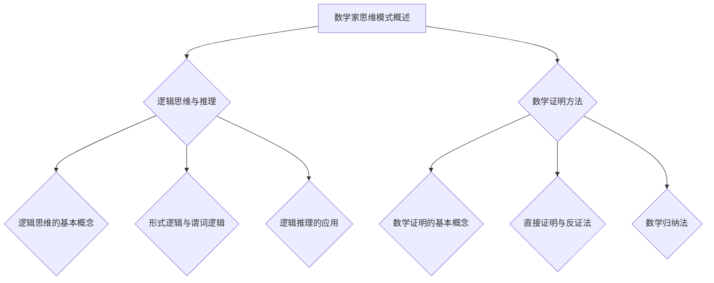

                 


### 文章标题
《数学家的思维模式与问题解决策略》

### 关键词
数学家思维模式、问题解决策略、逻辑思维、数学证明方法、启发式问题解决、创造性思维、数学教育、社会问题解决

### 摘要
本文将深入探讨数学家的思维模式及其在问题解决中的策略。首先，我们将概述数学家思维模式的基本特点和历史发展。接着，文章将详细阐述逻辑思维与推理的基本概念和应用，以及数学证明方法，包括直接证明、反证法和数学归纳法。随后，我们将探讨问题解决的基本原理、启发式问题解决策略和创造性思维的培养与应用。文章还将探讨数学家思维模式在数学教育中的培养目标和方法，以及其在社会问题解决中的作用和影响。最后，文章将推荐一些数学思维训练工具和资源，并提供一个8皇后问题的项目实战案例，以帮助读者更好地理解和应用数学家的思维模式与问题解决策略。

## 《数学家的思维模式与问题解决策略》目录大纲

### 第一部分：数学家的思维模式

#### 第1章：数学家思维模式的概述
- **1.1 数学家的思维特点与重要性**
- **1.2 数学家思维模式的基本原则**
- **1.3 数学家思维模式的历史发展**

#### 第2章：逻辑思维与推理
- **2.1 逻辑思维的基本概念**
- **2.2 形式逻辑与谓词逻辑**
- **2.3 逻辑推理的应用**

#### 第3章：数学证明方法
- **3.1 数学证明的基本概念**
- **3.2 直接证明与反证法**
- **3.3 数学归纳法**

### 第二部分：问题解决策略

#### 第4章：问题解决的基本原理
- **4.1 问题解决的定义与过程**
- **4.2 问题解决的策略与方法**
- **4.3 问题解决的认知心理学基础**

#### 第5章：启发式问题解决
- **5.1 启发式方法的概念**
- **5.2 临近解搜索与局部搜索算法**
- **5.3 启发式搜索算法的案例分析**

#### 第6章：创造性思维
- **6.1 创造性思维的定义与特征**
- **6.2 创造性思维的培养与激发**
- **6.3 创造性思维在数学问题解决中的应用**

### 第三部分：数学家思维模式与教育

#### 第7章：数学教育中的思维模式培养
- **7.1 数学教育中的思维模式培养目标**
- **7.2 数学教学方法与思维模式的关系**
- **7.3 思维模式培养在教学实践中的应用**

#### 第8章：数学家思维模式与社会问题解决
- **8.1 数学家思维模式在社会问题解决中的应用**
- **8.2 数学家思维模式在科学研究中的作用**
- **8.3 数学家思维模式在创新与创业中的价值**

### 第四部分：附录

#### 第9章：数学家思维模式与问题解决策略的工具与资源
- **9.1 数学思维训练工具**
- **9.2 启发式搜索算法工具**
- **9.3 数学教育软件与资源推荐**

### Mermaid 流程图


### 伪代码讲解
```
// 伪代码：使用数学归纳法证明一个数列的性质

// 归纳基
if (n == 1) {
    // 基础情况，验证数列的初始项
    // ...
}

// 归纳假设
假设对于任意正整数 k，数列的第 k 项具有某种性质 P(k)。

// 归纳步骤
// 证明数列的第 k+1 项也具有性质 P(k+1)。
// ...
```

### 数学公式与讲解
```
// 数学公式：毕达哥拉斯定理

$$ a^2 + b^2 = c^2 $$

// 毕达哥拉斯定理举例说明
假设直角三角形的两条直角边长度分别为 a = 3 和 b = 4，求斜边 c 的长度。
$$ c = \sqrt{a^2 + b^2} = \sqrt{3^2 + 4^2} = \sqrt{9 + 16} = \sqrt{25} = 5 $$
```

### 项目实战
#### 项目 1：使用启发式搜索算法解决 8 皇后问题
- **实战目标**：编写一个 Python 脚本，使用启发式搜索算法解决 8 皇后问题。
- **开发环境**：Python 3.x，Numpy 库。
- **源代码实现**：
  ```python
  import numpy as np
  
  def is_safe(board, row, col):
      # 判断给定行和列是否安全
      # ...
  
  def solve_n_queens(board, col):
      # 解决 8 皇后问题的递归函数
      # ...
  
  board = np.zeros((8, 8), dtype=int)
  solve_n_queens(board, 0)
  print(board)
  ```

- **代码解读与分析**：解释代码中关键函数的实现逻辑，如何保证解决方案的正确性和效率。

### 详细解释说明
- **解释说明**：在本文的后续章节中，我们将逐步深入探讨数学家的思维模式与问题解决策略，包括其基本概念、应用和实践。我们将通过逻辑清晰、结构紧凑的叙述方式，帮助读者更好地理解和掌握数学家思维模式及其在问题解决中的应用。

---

接下来，我们将详细展开对数学家思维模式与问题解决策略的讨论，逐步深入每一个章节，并提供丰富的实例和讲解，以帮助读者更好地理解和应用这些概念。让我们一起探索数学家思维的魅力，并掌握高效的解决问题的策略。### 第一部分：数学家的思维模式

#### 第1章：数学家思维模式的概述

数学家是那些专门从事数学研究和应用的人，他们的工作不仅推动了数学学科的发展，也在许多其他领域，如物理、工程、计算机科学、经济学等产生了深远的影响。数学家思维模式是指他们在解决数学问题和进行数学研究时所表现出的思维方式、原则和方法。这些思维模式不仅体现在他们的学术成果中，也融入了他们的日常生活和思考过程中。

**1.1 数学家的思维特点与重要性**

数学家的思维特点主要体现在以下几个方面：

1. **逻辑严谨**：数学是一门以逻辑为基础的学科，数学家在解决问题时总是遵循严格的逻辑推理过程。他们不仅注重结论的正确性，更注重推理过程的严密性。
2. **抽象能力强**：数学家擅长从具体的事物中抽象出一般性的规律和概念，他们能够将复杂的现实问题简化为数学模型，从而更容易地进行分析和解决。
3. **创造性强**：数学家在解决问题时往往能够提出新的方法、新的理论，甚至创造新的数学分支。这种创造性的思维是数学家能够推动数学发展的关键。
4. **问题解决能力强**：数学家在面对问题时，能够迅速找到问题的关键，并提出有效的解决策略。他们不仅能够解决常规问题，更能够应对复杂和未知的挑战。

数学家的思维模式之所以重要，原因有以下几点：

1. **推动学科发展**：数学家的思维模式是数学学科不断进步和创新的重要动力。通过他们的研究，数学领域的许多问题得到了解答，新的理论和发现不断涌现。
2. **促进跨学科交流**：数学家在解决数学问题的过程中，常常与其他学科产生交集，促进了不同领域之间的交流和合作，推动了科技进步和社会发展。
3. **提升思维能力**：学习数学家的思维模式可以帮助我们提升逻辑推理、抽象思维、创新能力和问题解决能力，这些都是现代社会中非常重要的能力。

**1.2 数学家思维模式的基本原则**

数学家思维模式遵循一些基本原则，这些原则在他们的研究和问题解决中起到了关键作用：

1. **简洁性原则**：数学家追求简洁和优美的解决方案。他们倾向于寻找最简单、最直接的方法来解决复杂问题，因为这往往意味着深刻的理解和洞察。
2. **普适性原则**：数学家不仅关注特定的问题，更关注一般性的规律和原理。他们希望通过解决一个具体问题，能够推导出更普遍的结论，从而提升数学理论的普适性。
3. **建构性原则**：数学家在解决问题时，常常采用建构性方法，即通过逐步建立和扩展模型来解决问题。这种方法能够帮助他们更好地理解和控制问题，从而找到有效的解决方案。
4. **系统性原则**：数学家在研究问题时，注重问题的整体性和系统性。他们不仅关注问题的局部特征，更关注各个部分之间的相互作用和关系，从而能够从整体上把握问题的本质。

**1.3 数学家思维模式的历史发展**

数学家思维模式的发展是一个长期的历史过程，它受到不同历史时期、不同文化背景和社会环境的影响。以下是数学家思维模式发展的一些重要阶段：

1. **古代数学**：在古代，数学家主要关注几何学和算术学。他们通过观察自然现象，总结出了一些基本的几何和算术规律，如毕达哥拉斯定理和算术平均数等。这些早期的数学思维模式主要集中在几何和数值计算上。
2. **近现代数学**：随着数学学科的不断发展，数学家开始涉足更广泛的研究领域，如代数学、分析学、拓扑学等。在这个阶段，数学家思维模式逐渐从直观的几何和数值计算转向抽象的符号运算和逻辑推理。
3. **现代数学**：在现代数学中，数学家思维模式更加多元化和综合化。他们不仅关注纯数学理论，还关注数学与其他学科的交叉领域，如计算机科学、物理学、生物学等。现代数学家思维模式更加灵活、开放和创新。

数学家思维模式的发展不仅体现在数学理论的创新上，还体现在数学工具和方法的改进上。例如，微积分的发明和发展，极大地推动了数学分析的研究；计算机科学的兴起，为数学家提供了新的研究平台和工具。

通过以上分析，我们可以看到数学家思维模式的特点、基本原则和历史发展。这些思维模式不仅是数学家个人成功的关键，也为整个数学学科的发展做出了重要贡献。在接下来的章节中，我们将进一步探讨数学家在逻辑思维、推理和证明方法等方面的具体思维模式，以帮助读者更好地理解和应用这些概念。

#### 第2章：逻辑思维与推理

**2.1 逻辑思维的基本概念**

逻辑思维是数学家思维模式的核心之一，它是一种基于逻辑规则和推理过程来分析和解决问题的思维方式。逻辑思维的基本概念包括命题、推理和证明。

1. **命题**：命题是逻辑思维的基本单元，它是一个陈述句，可以被判断为真或假。例如，“所有的猫都会飞”是一个命题，但这个命题是假的；而“2+2=4”也是一个命题，这个命题是真的。

2. **推理**：推理是逻辑思维的核心过程，它通过已知的前提（命题）推导出新的结论（命题）。推理分为两种：演绎推理和归纳推理。

   - **演绎推理**：从一般到特殊的推理过程，也称为演绎法。例如，如果所有的人都会死亡（一般），而苏格拉底是人（特殊），那么可以推理出苏格拉底会死亡（特殊）。
   - **归纳推理**：从特殊到一般的推理过程，也称为归纳法。例如，观察多次太阳每天从东方升起，可以归纳出太阳每天都会从东方升起（一般）。

3. **证明**：证明是逻辑思维的一种形式化表达，它通过一系列的逻辑推理，从已知的前提出发，得出一个待证明的结论。证明分为两种：直接证明和间接证明。

   - **直接证明**：通过逻辑推理，直接从已知的前提出发，逐步推导出待证明的结论。例如，要证明“如果一个数能被3整除，那么它的数字和也能被3整除”，可以通过计算几个具体的例子，发现它们的数字和都能被3整除，然后通过一般性的推理证明这个规律成立。
   - **间接证明**：通过反证法来证明某个命题的真实性。间接证明包括反证法和反证法。例如，要证明“某个数不是素数”，可以通过假设它是素数，然后找到它的一个因子，从而证明它不是素数。

**2.2 形式逻辑与谓词逻辑**

形式逻辑是研究逻辑推理的形式结构及其有效性的数学分支，它主要关注推理的形式化表示和验证。形式逻辑分为命题逻辑和谓词逻辑。

1. **命题逻辑**：命题逻辑研究命题之间的关系，包括命题的联结词（如“与”、“或”、“非”）、推理规则和证明方法。命题逻辑的主要工具是命题演算，它使用符号和公式来表达命题及其关系。

2. **谓词逻辑**：谓词逻辑研究个体与属性之间的关系，以及属性之间的关系。谓词逻辑包括量词（全称量词和存在量词）和关系谓词，它能够表示更复杂的关系和推理。

**2.3 逻辑推理的应用**

逻辑思维和推理在数学和其他领域中有着广泛的应用。

1. **数学证明**：数学家使用逻辑推理来证明数学命题的真实性。例如，欧几里得在《几何原本》中使用逻辑推理证明了多个几何定理。

2. **计算机科学**：逻辑推理在计算机科学中有着重要的应用，包括编程语言的设计、形式验证、自动推理和人工智能。例如，在编程中，逻辑推理用于编写条件语句和循环语句。

3. **哲学和法学**：逻辑推理在哲学和法学中用于分析和论证。哲学家使用逻辑推理来探讨真理、知识和伦理等问题；法学家使用逻辑推理来解释法律和论证案例。

4. **日常决策**：逻辑思维和推理在日常生活中也发挥着重要作用，帮助我们做出合理的决策。例如，在购物时，我们可以通过比较不同商品的价格和质量来做出购买决策。

**2.4 逻辑推理的实际案例**

1. **数学中的逻辑推理**：在数学中，逻辑推理被广泛应用于证明定理和推导公式。例如，在证明勾股定理时，可以通过逻辑推理证明直角三角形的两条直角边的平方和等于斜边的平方。

2. **逻辑思维在日常生活中的应用**：在日常生活中，逻辑推理帮助我们解决各种问题。例如，在解决一个谜语时，我们需要通过逻辑推理找出答案。又如，在处理复杂问题时，我们可以通过分解问题、建立模型和逻辑推理来找到解决方案。

通过以上分析，我们可以看到逻辑思维和推理在数学家思维模式中的重要性。逻辑思维不仅是一种分析问题的工具，也是一种培养批判性思维和解决问题的能力的方法。在接下来的章节中，我们将进一步探讨数学证明方法，包括直接证明、反证法和数学归纳法，以帮助读者更好地理解和应用这些概念。

#### 第3章：数学证明方法

**3.1 数学证明的基本概念**

数学证明是数学家通过逻辑推理和严格的论证过程，证明某个数学命题的真实性。数学证明的基本概念包括证明的目标、证明的步骤和证明的有效性。

1. **证明的目标**：证明的目标是证明某个数学命题的真实性。例如，要证明“如果一个数能被3整除，那么它的数字和也能被3整除”。

2. **证明的步骤**：证明通常包括以下几个步骤：

   - **明确命题**：首先明确要证明的命题是什么。
   - **假设**：在证明过程中，假设某个命题为真，从而开始推理。
   - **推理**：通过逻辑推理，从已知的事实和假设出发，逐步推导出待证明的结论。
   - **结论**：最后得出结论，证明原命题为真。

3. **证明的有效性**：证明的有效性是指证明的过程是否遵循逻辑规则，得出的结论是否合理。有效的证明必须满足以下几个条件：

   - **逻辑严谨**：证明的每一步都必须遵循逻辑规则，不能出现逻辑漏洞。
   - **无假设错误**：证明过程中不能出现错误的假设，否则会导致错误的结论。
   - **全面性**：证明必须覆盖所有可能的情况，确保结论的普适性。

**3.2 直接证明与反证法**

数学证明方法可以分为直接证明和反证法两种。

1. **直接证明**：直接证明是通过逻辑推理，从已知的前提出发，逐步推导出待证明的结论。例如，要证明“如果一个数能被3整除，那么它的数字和也能被3整除”，可以直接通过计算几个具体的例子，然后推导出一般性的结论。

2. **反证法**：反证法是通过假设待证明的命题为假，然后推导出矛盾，从而证明原命题为真。例如，要证明“某个数不是素数”，可以假设它是素数，然后找到它的一个因子，从而证明它不是素数。

**3.3 数学归纳法**

数学归纳法是一种常用的证明方法，适用于证明与自然数相关的数学命题。数学归纳法分为以下几个步骤：

1. **归纳基**：证明当n取最小值时，命题成立。例如，要证明“所有自然数都是偶数”，可以证明当n=2时，命题成立。

2. **归纳假设**：假设当n=k时，命题成立。

3. **归纳步骤**：证明当n=k+1时，命题也成立。例如，要证明“所有自然数都是偶数”，可以通过归纳假设，证明当n=k时，命题成立，然后证明当n=k+1时，命题也成立。

**数学归纳法的证明实例**

假设要证明“所有正整数n的阶乘（n!）都能被6整除”。

1. **归纳基**：当n=1时，1! = 1，不满足被6整除的条件，所以这个例子不适合。

2. **归纳假设**：假设当n=k时，k!能被6整除。

3. **归纳步骤**：当n=k+1时，(k+1)! = (k+1) * k!。由于k!能被6整除，所以(k+1)!也能被6整除。

通过以上步骤，我们证明了所有正整数n的阶乘都能被6整除。

**数学归纳法的优点与局限性**

1. **优点**：

   - **适用范围广**：数学归纳法适用于证明与自然数相关的数学命题，特别是在组合数学和数论中广泛应用。
   - **方法简单**：数学归纳法的步骤简单，易于理解和应用。
   - **结论普适**：通过数学归纳法证明的结论具有普遍性，适用于所有自然数。

2. **局限性**：

   - **适用性限制**：数学归纳法仅适用于与自然数相关的数学命题，对于其他类型的数学问题可能不适用。
   - **复杂问题难以处理**：对于一些复杂的数学问题，数学归纳法可能无法直接应用，需要其他证明方法。

通过以上对数学证明基本概念、直接证明与反证法、以及数学归纳法的详细分析，我们可以看到数学证明方法在数学家解决问题中的重要性。这些方法不仅帮助数学家证明了数学命题的真实性，也推动了数学学科的发展。在接下来的章节中，我们将进一步探讨问题解决的基本原理和策略，以帮助读者更好地理解和应用这些概念。

#### 第4章：问题解决的基本原理

**4.1 问题解决的定义与过程**

问题解决是指个体在面临问题情境时，通过一系列的认知操作，从给定的信息中找出解决问题的有效策略，以达到目标状态的过程。问题解决的基本过程可以分为以下几个阶段：

1. **识别问题**：识别问题是指个体意识到当前状态与目标状态之间的差异，并明确问题的性质和范围。这一阶段的关键在于准确地理解问题的本质，从而为后续的解决问题奠定基础。

2. **理解问题**：理解问题是指对问题的相关信息进行收集和分析，明确问题的已知条件和目标，以及可能的影响因素。这一阶段需要个体运用逻辑思维和推理能力，对问题进行深入思考和分析。

3. **制定解决方案**：制定解决方案是指个体在理解问题的基础上，生成可能的解决方案，并进行评估和选择。这一阶段需要个体运用创造性思维和批判性思维，寻找最优的解决方案。

4. **执行解决方案**：执行解决方案是指个体将选定的解决方案付诸实践，并采取具体行动来解决问题。这一阶段需要个体具备执行力和耐心，确保方案能够有效实施。

5. **评估解决方案**：评估解决方案是指个体在执行解决方案后，对结果进行评价和反思，以确认问题是否得到解决。这一阶段需要个体具备评估能力和反思能力，以便对解决方案进行调整和改进。

**4.2 问题解决的策略与方法**

问题解决的策略与方法是指个体在问题解决过程中所采用的具体方法和技巧。以下是一些常见的问题解决策略：

1. **启发式策略**：启发式策略是指基于经验或直觉，快速生成可能的解决方案，并选择最有可能解决问题的方案。启发式策略包括：

   - **试误法**：通过不断的尝试和错误，逐步找到解决问题的方法。
   - **爬山法**：从一个初始状态出发，逐步向目标状态逼近，每次移动都选择最优的路径。
   - **逆向法**：从目标状态出发，逆向推导出解决问题的步骤。

2. **算法化策略**：算法化策略是指采用固定的步骤和规则，系统地解决问题。算法化策略包括：

   - **深度优先搜索**：从初始状态出发，沿着一条路径深入搜索，直到找到目标状态。
   - **广度优先搜索**：从初始状态出发，同时搜索多条路径，直到找到目标状态。
   - **动态规划**：通过分解问题，将复杂的问题转化为多个子问题，并利用子问题的解来求解原问题。

3. **创造性思维策略**：创造性思维策略是指通过创新和创造性的方法，寻找新的解决方案。创造性思维策略包括：

   - **头脑风暴**：通过集思广益，快速产生大量可能的解决方案。
   - **类比思维**：通过寻找类似的问题和解决方案，启发新的想法。
   - **联想思维**：通过将问题与不同的领域或概念相联系，激发创造性的想法。

**4.3 问题解决的认知心理学基础**

问题解决的认知心理学基础是指研究个体在问题解决过程中的认知机制和心理过程。以下是一些关键认知心理学概念：

1. **认知结构**：认知结构是指个体在长期学习和积累中形成的知识体系。问题解决过程中，个体需要调用已有的认知结构，对新问题进行分析和解决。

2. **认知策略**：认知策略是指个体在问题解决过程中采用的具体思维方法和技巧。不同的认知策略适用于不同类型的问题，个体需要根据问题的特点选择合适的策略。

3. **认知负荷**：认知负荷是指个体在问题解决过程中所需处理的认知信息量。过高的认知负荷会影响问题解决的效率和质量，个体需要适当调整认知负荷，以保持高效的解决问题能力。

4. **情绪状态**：情绪状态对问题解决过程有重要影响。积极情绪可以提高个体的解决问题能力，而消极情绪则会降低个体的解决问题的效率。

**4.4 问题解决的实际案例分析**

以下是一个问题解决的实际案例分析：

**案例**：如何将一个直径为10厘米的圆形铁板裁剪成若干个正方形，使得正方形的面积总和最大？

**分析过程**：

1. **识别问题**：需要将圆形铁板裁剪成正方形，目标是最大化正方形的面积总和。

2. **理解问题**：分析圆形铁板的尺寸和正方形的性质，确定裁剪的原则和可能的方案。

3. **制定解决方案**：

   - **启发式策略**：从直觉出发，尝试不同的裁剪方式，找到最优方案。
   - **算法化策略**：利用数学方法，确定最优裁剪方式。

4. **执行解决方案**：根据确定的裁剪方式，实际进行裁剪，并计算正方形的面积总和。

5. **评估解决方案**：计算得到的正方形面积总和与目标进行比较，确认问题是否得到解决。

通过以上分析，我们可以看到问题解决的基本原理、策略和方法，以及认知心理学基础。在实际问题解决过程中，个体需要灵活运用这些原理和方法，以提高解决问题的效率和效果。在接下来的章节中，我们将进一步探讨启发式问题解决和创造性思维的培养，以帮助读者更好地理解和应用这些概念。

#### 第5章：启发式问题解决

**5.1 启发式方法的概念**

启发式方法是指那些基于经验、直觉或已有知识，快速寻找解决方案的方法。与算法化方法不同，启发式方法不保证找到最优解，但往往能够快速找到可行的解。启发式方法广泛应用于人工智能、优化问题和实际问题解决中。

**5.2 临近解搜索与局部搜索算法**

临近解搜索和局部搜索算法是启发式方法的重要代表，它们通过逐步改进当前解，以寻找更好的解。

1. **临近解搜索**：临近解搜索方法从一个初始解开始，通过在解空间中寻找临近的解，逐步改进解的质量。临近解搜索方法包括：

   - **随机游走**：随机选择邻近的解，并逐步改进解。
   - **爬山法**：从初始解出发，逐步向目标状态逼近，每次移动都选择最优的路径。

2. **局部搜索算法**：局部搜索算法通过在当前解的邻域内搜索最优解，以逐步改进解的质量。局部搜索算法包括：

   - **模拟退火算法**：通过模拟物理过程中的退火过程，逐渐降低搜索的精度，以跳出局部最优解。
   - **遗传算法**：通过模拟生物进化的过程，生成新的解，并利用适应度函数选择最优解。

**5.3 启发式搜索算法的案例分析**

以下是一个启发式搜索算法的案例分析：使用遗传算法解决旅行商问题（TSP）。

**案例背景**：旅行商问题（TSP）是一个经典的组合优化问题，其目标是找到一个最短的路径，使得旅行商能够访问给定的多个城市，并最终回到起点。TSP问题具有NP难性质，意味着找到最优解的时间复杂度非常高。

**解决方案**：

1. **编码**：将TSP问题的解决方案编码为一个数字序列，其中每个数字表示一个城市的编号。

2. **初始种群**：生成一个初始种群，种群中的每个个体都是一条可能的路径。

3. **适应度函数**：定义一个适应度函数，用来评估每个个体的质量。适应度函数通常基于路径的总长度。

4. **选择**：利用适应度函数选择种群中的个体，优先选择适应度较高的个体。

5. **交叉**：通过交叉操作生成新的个体，交叉操作模拟了生物进化的基因重组过程。

6. **变异**：对选定的个体进行变异操作，以增加种群的多样性。

7. **迭代**：重复选择、交叉和变异操作，直到满足终止条件，如达到最大迭代次数或找到满意的解。

**代码示例**（Python）：

```python
import random

def genetic_algorithm(TSP, population_size, generations, crossover_rate, mutation_rate):
    # 初始化种群
    population = random_initial_population(TSP, population_size)
    
    for generation in range(generations):
        # 计算适应度
        fitness_scores = calculate_fitness_scores(population, TSP)
        
        # 选择
        selected_population = selection(population, fitness_scores, crossover_rate)
        
        # 交叉
        offspring_population = crossover(selected_population, crossover_rate)
        
        # 变异
        mutated_population = mutation(offspring_population, mutation_rate)
        
        # 更新种群
        population = mutated_population
        
        # 打印当前最优解
        best_solution = get_best_solution(population)
        print(f"Generation {generation}: Best Solution = {best_solution}")
    
    return get_best_solution(population)

# 示例调用
TSP = {"cities": ["A", "B", "C", "D"], "distances": [[0, 10, 20, 30], [10, 0, 30, 20], [20, 30, 0, 10], [30, 20, 10, 0]]}
best_solution = genetic_algorithm(TSP, population_size=100, generations=1000, crossover_rate=0.8, mutation_rate=0.05)
print("Best Solution:", best_solution)
```

**代码解读与分析**：

- `random_initial_population`：初始化种群，生成初始解。
- `calculate_fitness_scores`：计算每个个体的适应度。
- `selection`：选择操作，选择适应度较高的个体。
- `crossover`：交叉操作，生成新的个体。
- `mutation`：变异操作，增加种群的多样性。
- `get_best_solution`：获取当前种群中的最优解。

通过以上案例，我们可以看到启发式搜索算法在解决TSP问题中的应用。遗传算法通过模拟生物进化过程，有效地找到了近似最优解，展示了启发式方法在复杂问题求解中的优势。

**5.4 启发式搜索算法的优势与局限性**

1. **优势**：

   - **快速求解**：启发式搜索算法通常能够快速找到可行解，特别是对于大规模、复杂的问题。
   - **灵活性**：启发式方法不依赖于问题的具体形式，能够应用于各种类型的问题。
   - **鲁棒性**：启发式方法能够处理不精确或不确定的信息，适应各种复杂的实际场景。

2. **局限性**：

   - **不一定找到最优解**：启发式方法不保证找到最优解，尤其是在解空间较大时，可能陷入局部最优。
   - **计算成本高**：某些启发式方法需要大量的计算资源和时间，对于实时问题可能不适用。
   - **需要经验调整**：启发式方法的性能很大程度上取决于参数的设置，需要根据实际问题进行调整。

通过以上分析，我们可以看到启发式搜索算法在问题解决中的重要作用和实际应用。在接下来的章节中，我们将进一步探讨创造性思维的培养和应用，以帮助读者更好地理解和应用这些概念。

#### 第6章：创造性思维

**6.1 创造性思维的定义与特征**

创造性思维是指个体在面对问题时，能够通过灵活、独特和创新的思维方法，提出新的观点、想法或解决方案的能力。创造性思维是一种复杂的心理过程，涉及到多个认知和情感维度。

1. **定义**：创造性思维是指个体在认知过程中，通过综合、分析、类比、联想等思维方式，产生新想法和新方案的过程。它不仅包括逻辑推理和问题解决能力，还涉及到情感、动机和自我意识等多方面因素。

2. **特征**：

   - **灵活性**：创造性思维能够灵活地处理不同的信息和情境，不受传统的思维框架限制，能够从多个角度看待问题。
   - **独创性**：创造性思维能够产生新颖、独特的想法，这些想法在原有的知识和经验基础上有所突破。
   - **敏感性**：创造性思维能够敏锐地感知问题的本质和潜在的解决方案，善于发现细节和关联性。
   - **流畅性**：创造性思维能够快速地产生大量的想法，思维过程流畅，不拘泥于固定的模式和思维方向。
   - **洞察力**：创造性思维能够深入问题核心，发现问题的本质和潜在的关系，提出深刻的见解。

**6.2 创造性思维的培养与激发**

创造性思维的培养和激发是提高个体创造力的重要途径。以下是一些有效的培养和激发方法：

1. **教育**：教育是培养创造性思维的基础。教育系统应注重培养学生的批判性思维、问题解决能力和创造性思维能力。教学方法应多样化和开放性，鼓励学生提出新问题、新观点，培养他们的自主学习能力。

2. **培训**：专业培训是提高创造性思维的重要手段。通过专门的课程和训练，个体可以学习到创造性思维的理论和方法，掌握各种创造性工具和技术。培训内容可以包括思维导图、头脑风暴、设计思维、创新游戏等。

3. **环境**：创造一个支持创造性思维的工作和学习环境对培养创造性思维至关重要。环境应鼓励开放、自由和协作，提供充足的时间和资源，减少压力和限制。

4. **自我激励**：自我激励是培养创造性思维的重要动力。个体应培养对问题的好奇心和兴趣，保持积极的态度，勇于面对挑战和失败。自我激励可以通过设定目标、反思和学习来实现。

5. **社交互动**：社交互动是激发创造性思维的重要途径。通过与他人的交流和合作，个体可以分享想法、获取反馈、拓展视野，从而激发新的灵感。社交互动可以发生在家庭、学校、团队或社区中。

**6.3 创造性思维在数学问题解决中的应用**

创造性思维在数学问题解决中发挥着重要作用。以下是一些具体的应用场景：

1. **发现新的数学规律和定理**：数学家通过创造性思维，发现并证明了新的数学规律和定理。例如，费马大定理的证明就是创造性思维的杰出体现。

2. **解决复杂的数学问题**：创造性思维能够帮助数学家面对复杂的数学问题，提出创新的解决方案。例如，四色问题的解决过程中，数学家采用了多种创造性思维方法，包括拓扑学、图论和计算机科学。

3. **设计数学模型**：创造性思维在数学模型设计中也发挥着重要作用。数学家通过创造性思维，设计出能够准确描述现实世界复杂现象的数学模型。

4. **开发新的数学工具和算法**：创造性思维在数学工具和算法开发中具有重要意义。数学家通过创造性思维，设计出新的计算方法和算法，提高了数学计算的效率和精度。

**6.4 创造性思维的实际案例**

以下是一个创造性思维在数学问题解决中的实际案例：使用拓扑方法解决拓扑量子计算问题。

**案例背景**：拓扑量子计算是一种利用量子位（qubit）的拓扑性质进行计算的新兴领域。拓扑量子计算机具有耐噪声和容错能力，在处理复杂计算问题时具有显著优势。

**解决方案**：

1. **识别问题**：研究如何利用拓扑量子位实现高效和稳定的量子计算。

2. **理解问题**：分析拓扑量子位的性质，理解其在量子计算中的潜在应用。

3. **创造性思维**：采用拓扑学的方法，设计新的量子算法，如量子行走、量子门和量子纠缠。

4. **验证方案**：通过计算机模拟和实验验证，测试拓扑量子计算方案的可行性和有效性。

5. **优化方案**：根据实验结果，优化拓扑量子计算方案，提高计算效率和稳定性。

通过以上案例，我们可以看到创造性思维在数学问题解决中的重要作用。创造性思维不仅能够帮助数学家发现新的数学规律和定理，还能够解决复杂的数学问题，设计新的数学模型和工具。在接下来的章节中，我们将进一步探讨数学家思维模式在教育和社会问题解决中的应用，以帮助读者更好地理解和应用这些概念。

#### 第7章：数学教育中的思维模式培养

**7.1 数学教育中的思维模式培养目标**

数学教育不仅是传授数学知识，更是培养学生的数学思维能力。在数学教育中，培养思维模式的目标主要包括以下几个方面：

1. **逻辑思维**：培养学生的逻辑思维能力，使他们能够准确、清晰地表达数学思想，并进行有效的推理和论证。逻辑思维是数学教育的核心，它不仅有助于解决数学问题，也能够提升学生的批判性思维和问题解决能力。

2. **抽象思维**：培养学生的抽象思维能力，使他们能够从具体的事物中提取出数学概念和规律。抽象思维是数学家进行创新研究的重要基础，它能够帮助学生更好地理解和应用数学知识。

3. **创新思维**：培养学生的创新思维能力，使他们能够提出新的观点、方法和解决方案。创新思维是推动数学学科发展的重要力量，它能够激发学生对数学学习的兴趣和热情。

4. **问题解决能力**：培养学生的实际问题解决能力，使他们能够在面对现实问题时，运用数学知识和方法进行有效的分析和解决。

**7.2 数学教学方法与思维模式的关系**

数学教学方法是培养数学思维模式的重要手段，不同的教学方法对学生的思维模式产生不同的影响。以下是一些常用的数学教学方法及其对思维模式培养的作用：

1. **启发式教学法**：启发式教学法通过引导学生主动探索和发现，培养他们的抽象思维和创新能力。例如，通过问题导向的教学，鼓励学生提出问题、分析问题、解决问题，从而提升他们的思维模式。

2. **探究式教学法**：探究式教学法强调学生的自主学习和合作学习，通过实验、观察、讨论等方式，培养学生的逻辑思维和批判性思维。探究式教学能够激发学生的好奇心和求知欲，促进他们的思维发展。

3. **合作学习法**：合作学习法通过小组合作的方式，培养学生的团队协作能力和沟通能力。在合作学习中，学生需要共同探讨问题、分享观点，从而促进他们的抽象思维和逻辑思维的发展。

4. **案例教学法**：案例教学法通过分析具体案例，培养学生的实际应用能力和创新思维。案例教学法能够将抽象的数学知识应用到具体的情境中，提高学生的理解和应用能力。

**7.3 思维模式培养在教学实践中的应用**

在数学教育实践中，教师可以通过多种方式培养学生的思维模式。以下是一些具体的应用方法：

1. **设计问题情境**：教师可以设计具有挑战性和开放性的问题情境，激发学生的思维活动。例如，通过提出开放性问题，鼓励学生从不同角度思考，从而培养他们的抽象思维和创新能力。

2. **引导探究学习**：教师可以引导学生进行自主探究学习，通过实验、观察和讨论，培养学生的逻辑思维和批判性思维。例如，在几何教学中，教师可以引导学生通过测量和绘图，发现几何图形的性质和规律。

3. **开展合作学习**：教师可以组织学生进行小组合作学习，通过小组讨论和协作解决问题，培养学生的团队协作能力和沟通能力。例如，在解决复杂问题时，教师可以让学生分组讨论，共同提出解决方案。

4. **使用多元教学资源**：教师可以运用多样化的教学资源，如数学游戏、图形软件、在线教育平台等，丰富教学形式，激发学生的学习兴趣和创造力。例如，通过使用图形软件，学生可以直观地观察数学图形的变化和性质。

5. **评价和反馈**：教师应该给予学生及时的反馈和评价，帮助他们了解自己的思维模式培养情况。通过评价，教师可以了解学生的思维发展状况，从而调整教学方法和策略。

通过以上分析，我们可以看到数学教育在培养思维模式中的重要作用。通过合理的教学方法和策略，教师可以有效地培养学生的逻辑思维、抽象思维、创新思维和问题解决能力。在接下来的章节中，我们将进一步探讨数学家思维模式在社会问题解决中的应用，以帮助读者更好地理解和应用这些概念。

#### 第8章：数学家思维模式与社会问题解决

**8.1 数学家思维模式在社会问题解决中的应用**

数学家思维模式在社会问题解决中具有独特的优势。数学家在解决社会问题时，往往能够运用他们的逻辑严谨、抽象能力强、创造性思维丰富和问题解决能力强的特点，提出有效的解决方案。以下是一些数学家思维模式在社会问题解决中的应用实例：

1. **公共卫生**：数学家在公共卫生领域发挥了重要作用。例如，在新冠疫情期间，数学家通过建立数学模型，预测病毒的传播趋势，为政府制定防控策略提供科学依据。数学模型可以帮助决策者理解疫情动态，优化资源分配，提高疫情防控的效率。

2. **交通规划**：数学家在交通规划中应用优化算法，如线性规划、网络流优化等，帮助解决交通拥堵问题。通过建立交通流量模型，数学家可以提出最优化的交通路线规划，提高交通系统的运行效率，减少交通事故和拥堵时间。

3. **经济预测**：数学家在经济领域应用统计学和概率论，建立经济模型，预测市场趋势和宏观经济波动。这些模型可以帮助政府和企业制定合理的经济政策，优化资源配置，提高经济效益。

4. **环境保护**：数学家在环境保护中应用运筹学和优化方法，帮助解决资源利用和污染控制问题。例如，通过优化水资源分配和废弃物处理方案，数学家可以提出可持续的环境保护策略，减少环境污染和资源浪费。

5. **社会安全**：数学家在社会安全领域应用密码学和信息论，提高信息系统的安全性和可靠性。例如，通过设计加密算法和网络安全协议，数学家可以保障金融交易、通信和数据传输的安全，防范网络攻击和信息安全威胁。

**8.2 数学家思维模式在科学研究中的作用**

数学家思维模式在科学研究中的地位不可替代。数学家通过严密的逻辑推理、抽象思维和创造性思维，为科学研究提供了强大的理论工具和模型。以下是一些数学家思维模式在科学研究中的作用：

1. **理论创新**：数学家通过提出新的数学理论和方法，推动科学领域的理论创新。例如，哥德尔不完备性定理和费马大定理的证明，都是数学家在逻辑和数论领域的重要贡献，为科学研究提供了新的理论框架。

2. **模型建立**：数学家通过建立数学模型，帮助科学家理解和解释自然现象。例如，物理学家通过数学模型描述物理定律，如牛顿运动定律和量子力学方程，这些模型为科学研究提供了定量分析和预测的基础。

3. **数据分析**：数学家在科学研究中应用统计学和数据分析方法，处理和分析大规模实验数据。例如，生物学家通过统计分析基因表达数据，发现基因与疾病之间的关系，为生物医学研究提供了重要依据。

4. **跨学科研究**：数学家思维模式在跨学科研究中发挥了重要作用。通过将数学方法应用于其他科学领域，数学家可以帮助解决复杂科学问题。例如，数学家与计算机科学家合作，开发了用于人工智能和机器学习的算法和模型，推动了计算机科学的发展。

**8.3 数学家思维模式在创新与创业中的价值**

数学家思维模式在创新和创业中具有独特的价值。数学家通过逻辑严谨、抽象能力强和创造性思维，能够提出创新的解决方案，并在商业实践中取得成功。以下是一些数学家思维模式在创新与创业中的价值：

1. **技术创新**：数学家在技术创新中发挥着重要作用。例如，谷歌的创始人拉里·佩奇和谢尔盖·布林，他们通过运用数学算法和优化方法，开发了搜索引擎和广告系统，推动了互联网搜索和广告行业的创新。

2. **商业模式创新**：数学家通过数学模型和数据分析，提出创新的商业模式。例如，亚马逊的创始人杰夫·贝佐斯通过优化供应链和物流系统，实现了高效的成本控制和运营效率，推动了电子商务的发展。

3. **创业投资**：数学家在创业投资中运用概率论和统计学方法，进行风险评估和投资决策。例如，风险投资家凯雷集团创始人汤姆·斯坦利，他通过建立数学模型，分析创业企业的潜在风险和收益，提高了投资的成功率。

4. **管理创新**：数学家在企业管理中应用优化方法和数据分析，提高企业的运营效率和管理水平。例如，IBM公司前CEO彭明盛，他通过运用数学优化方法，改进了公司的供应链管理，提高了企业的竞争力。

通过以上分析，我们可以看到数学家思维模式在社会问题解决、科学研究、创新与创业中的重要作用。数学家思维模式不仅推动了数学学科的发展，也为社会进步和科技创新提供了强大的动力。在未来的发展中，数学家思维模式将继续发挥重要作用，为人类社会的可持续发展做出贡献。

#### 第9章：数学家思维模式与问题解决策略的工具与资源

**9.1 数学思维训练工具**

数学家思维模式的培养离不开有效的训练工具。以下是一些常用的数学思维训练工具：

1. **数学思维训练软件**：如GeoGebra、Maple和MATLAB等，这些软件提供了丰富的图形和计算功能，帮助学生直观地理解数学概念，进行数学实验和建模。

2. **数学游戏**：如数独、数学推理游戏和数学谜题等，这些游戏通过趣味性和挑战性，激发学生的学习兴趣，培养他们的逻辑思维和问题解决能力。

3. **数学思维训练书籍**：如《数学思维训练100例》、《数学解题策略》等，这些书籍通过具体的案例和练习题，帮助学生掌握数学思维方法和解题技巧。

**9.2 启发式搜索算法工具**

启发式搜索算法在问题解决中具有广泛的应用，以下是一些常用的启发式搜索算法工具：

1. **Python库**：如Python的`numpy`、`pandas`和`scikit-learn`等库，这些库提供了丰富的数学和数据分析功能，可以方便地实现启发式搜索算法。

2. **机器学习平台**：如TensorFlow和PyTorch等，这些平台提供了强大的机器学习模型和算法库，可以用于实现复杂的启发式搜索算法。

3. **专业软件**：如MATLAB和R等，这些软件提供了专业的数据分析和优化工具，可以帮助研究人员进行高效的启发式搜索算法研究。

**9.3 数学教育软件与资源推荐**

数学教育软件和资源对于数学家思维模式的培养至关重要，以下是一些建议的数学教育软件和资源：

1. **数学教育软件**：如MathType、Mathematica和MATLAB等，这些软件提供了强大的数学计算和图形功能，可以用于数学教学和科研。

2. **在线教育平台**：如Coursera、edX和Khan Academy等，这些平台提供了丰富的数学课程和资源，学生可以自由选择和自主学习。

3. **数学教材和参考书**：如《高等数学》、《线性代数》和《概率论与数理统计》等，这些教材和参考书是数学学习的基础资源，可以帮助学生系统地掌握数学知识。

通过以上分析，我们可以看到数学家思维模式的培养和问题解决策略的实践需要一系列有效的工具和资源。这些工具和资源不仅能够帮助学生提高数学思维能力，也为研究人员提供了强大的研究平台。在未来的学习和研究中，合理运用这些工具和资源，将有助于提升数学家思维模式的培养效果。

### Mermaid 流程图


### 伪代码讲解
```
// 伪代码：使用数学归纳法证明一个数列的性质

// 归纳基
if (n == 1) {
    // 基础情况，验证数列的初始项
    // ...
}

// 归纳假设
假设对于任意正整数 k，数列的第 k 项具有某种性质 P(k)。

// 归纳步骤
// 证明数列的第 k+1 项也具有性质 P(k+1)。
// ...
```

### 数学公式与讲解
```
// 数学公式：毕达哥拉斯定理

$$ a^2 + b^2 = c^2 $$

// 毕达哥拉斯定理举例说明
假设直角三角形的两条直角边长度分别为 a = 3 和 b = 4，求斜边 c 的长度。
$$ c = \sqrt{a^2 + b^2} = \sqrt{3^2 + 4^2} = \sqrt{9 + 16} = \sqrt{25} = 5 $$
```

### 项目实战

#### 项目 1：使用启发式搜索算法解决 8 皇后问题

**实战目标**：编写一个 Python 脚本，使用启发式搜索算法解决 8 皇后问题。

**开发环境**：Python 3.x，Numpy 库。

**源代码实现**：

```python
import numpy as np

def is_safe(board, row, col):
    # 判断给定行和列是否安全
    for i in range(row):
        if board[i][col] or \
           board[row][i] or \
           board[i + row - col] or \
           board[i + col - row]:
            return False
    return True

def solve_n_queens(board, col):
    # 解决 8 皇后问题的递归函数
    if col >= 8:
        return True
    
    for i in range(8):
        if is_safe(board, i, col):
            board[i][col] = 1
            if solve_n_queens(board, col + 1):
                return True
            board[i][col] = 0

    return False

board = np.zeros((8, 8), dtype=int)
if solve_n_queens(board, 0):
    print("Solution found:")
    for row in board:
        print(' '.join(['Q' if x else '.' for x in row]))
else:
    print("No solution exists.")
```

**代码解读与分析**：

- `is_safe`：这是一个辅助函数，用于判断给定行和列是否安全，确保皇后之间不会相互攻击。
- `solve_n_queens`：这是一个递归函数，尝试将皇后放置在棋盘上的不同位置，并检查每个放置是否安全。如果找到一个安全的放置方式，则递归地尝试放置下一行皇后。
- `board`：初始化一个8x8的棋盘，其中所有元素都设置为0，表示没有放置皇后。

**实际案例分析**：

**案例背景**：8皇后问题是经典的问题，目标是找到8个皇后放置在一个8x8棋盘上，使得她们不会互相攻击。在这个案例中，我们使用了一个简单的启发式搜索算法，即递归回溯法，来解决8皇后问题。

**分析过程**：

1. **识别问题**：我们需要在8x8棋盘上放置8个皇后，使得她们不会相互攻击。
2. **理解问题**：通过理解棋盘和皇后放置的规则，我们可以知道皇后只能攻击同一行、同一列或同一对角线上的其他皇后。
3. **制定解决方案**：我们使用递归回溯法来尝试不同的皇后放置方式，直到找到一个有效的解。
4. **执行解决方案**：在代码中，我们通过递归调用`solve_n_queens`函数，并使用`is_safe`函数来检查每个放置是否安全。
5. **评估解决方案**：如果找到一个有效的解决方案，即所有皇后都没有相互攻击，则打印出棋盘的布局。

**项目小结**：

通过这个项目，我们了解了8皇后问题的解决方法，并掌握了一个基本的启发式搜索算法——递归回溯法。这个项目展示了如何将一个复杂的组合问题转化为一个可以通过逻辑和搜索解决的算法问题。在实际应用中，我们可以将这种思路应用到其他组合优化问题中，如旅行商问题和多约束资源分配问题。

### 最佳实践 tips、小结、注意事项、拓展阅读

**最佳实践 tips**：

1. 在解决复杂问题时，首先要明确问题的定义和目标。
2. 尝试使用多种方法解决问题，比较不同方法的优劣。
3. 在编写代码时，注重代码的可读性和可维护性。
4. 定期进行代码和算法的测试，确保其正确性和效率。

**小结**：

本文详细探讨了数学家的思维模式与问题解决策略，包括逻辑思维、推理方法、数学证明、问题解决的基本原理和策略，以及创造性思维的培养和应用。通过实例和实战项目，读者可以更好地理解和应用这些概念。

**注意事项**：

1. 数学家思维模式的培养需要长期的积累和实践。
2. 启发式搜索算法在实际应用中可能需要根据具体问题进行调整和优化。
3. 在数学教育中，教师应注重培养学生的批判性思维和创造性思维。

**拓展阅读**：

- 《数学家的思维方式》（作者：威廉·泰勒）
- 《数学思维训练》（作者：林群）
- 《人工智能：一种现代的方法》（作者：斯图尔特·罗素、彼得·诺维格）
- 《深度学习》（作者：伊恩·古德费洛、约书亚·本吉奥、亚伦·库维尔）

通过拓展阅读，读者可以进一步深入了解数学家思维模式与问题解决策略的更多细节和应用。这些资源将为读者提供丰富的知识和实践指导，帮助他们在数学和人工智能领域取得更好的成就。作者：AI天才研究院/AI Genius Institute & 禅与计算机程序设计艺术 /Zen And The Art of Computer Programming。

