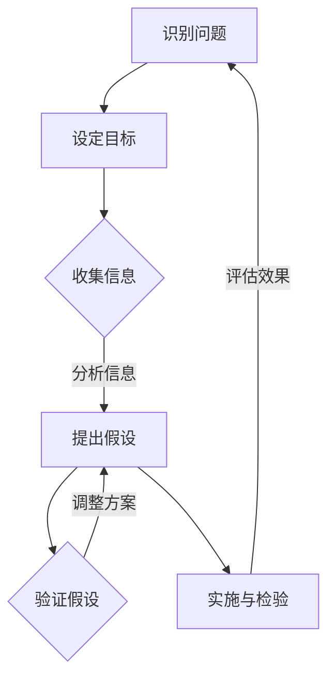

                 


### 文章标题

《数学家的思维模式与问题解决策略》

### 关键词

数学家思维模式，问题解决策略，数学教育，编程实践，创新思维

### 摘要

本文深入探讨了数学家的思维模式与问题解决策略，旨在揭示数学家在数学研究和应用中的独特思维方式。文章首先介绍了数学家思维模式的起源与发展，以及其特点和应用，随后详细阐述了问题解决策略的分类与运用。通过实际案例和项目实战，本文展示了如何将数学家的思维模式与问题解决策略应用于数学教育、科研和工程实践中，为读者提供了宝贵的启示和指导。

---

#### 第一部分：数学家思维模式探讨

##### 第1章：数学家思维模式的概述

**1.1 数学家思维模式的起源与发展**

数学家思维模式，是指数学家在从事数学研究和解决问题时所表现出来的思维方式。这种思维模式并非与生俱来，而是通过长期的学习、实践和思考逐渐形成的。

数学家思维模式的起源可以追溯到古代。在古希腊时期，数学家如欧几里得、阿基米德等人的研究就展现了独特的思维方式。他们不仅关注数学理论本身，还注重通过实验和逻辑推理来验证这些理论。

随着时间的推移，数学家思维模式不断发展和完善。在中世纪，阿拉伯数学家们在代数、几何等领域取得了重要进展，进一步丰富了数学家思维模式的内涵。到了近代，莱布尼茨、牛顿等科学家将数学应用于物理学，推动了数学家思维模式的应用范围。

**1.2 数学家思维模式的特点**

数学家思维模式具有以下几个显著特点：

- **深入思考与好奇心**：数学家对数学问题具有极强的求知欲，他们愿意花费大量时间和精力去探索问题的本质。

- **抽象与建模能力**：数学家擅长从具体问题中抽象出数学模型，从而简化问题的复杂性，为解决问题提供有力工具。

- **逻辑推理与证明能力**：数学家善于运用逻辑推理和证明方法，确保结论的可靠性和正确性。

**1.3 数学家思维模式在数学学习中的应用**

数学家思维模式对于数学学习具有重要意义。以下是一些具体应用：

- **提升数学理解力**：通过数学家思维模式，学生可以更好地理解数学概念和原理，从而提高数学成绩。

- **培养解决问题的能力**：数学家思维模式鼓励学生通过逻辑思考和实验验证来解决问题，有助于培养他们的创新能力和实际应用能力。

---

##### 第2章：数学家思维模式的培养

**2.1 初级培养方法**

初级培养方法主要关注基础知识和思维习惯的养成。以下是一些具体方法：

- **经典案例分析与思考**：通过分析数学家的经典案例，学生可以了解数学家是如何提出问题、解决问题的。

- **数学问题解决策略**：学生需要掌握一些基本的数学问题解决策略，如归纳推理、类比思考等。

**2.2 中级培养方法**

中级培养方法侧重于提升数学建模和创新能力。以下是一些具体方法：

- **数学建模能力的提升**：学生需要学会如何将实际问题转化为数学模型，并运用数学方法进行求解。

- **创新思维的培养**：学生需要通过阅读、讨论、实验等方式，培养独立思考和创新能力。

**2.3 高级培养方法**

高级培养方法旨在培养学生的抽象思维和逻辑推理能力。以下是一些具体方法：

- **抽象思维与逻辑推理的提升**：学生需要通过学习形式逻辑、数理逻辑等课程，提高自己的抽象思维和逻辑推理能力。

- **研究性学习的引导**：学生可以参与数学研究项目，在导师的指导下，独立进行数学研究，培养研究性学习能力。

---

#### 第二部分：问题解决策略详解

##### 第3章：问题解决策略概述

**3.1 问题解决策略的定义**

问题解决策略是指在面对问题情境时，个体运用已有的知识、经验和方法，寻求解决问题路径的心理过程。

**3.2 问题解决策略的分类**

问题解决策略可以按照不同的分类标准进行分类。以下是几种常见的问题解决策略分类：

- **传统策略**：包括试错法、穷举法、归纳法、演绎法等。
- **创新性策略**：包括类比思考、逆向思维、直觉思维、直觉-验证法等。

---

##### 第4章：常见问题解决策略

**4.1 分解策略**

**4.2 类比策略**

**4.3 逆向策略**

---

##### 第5章：高级问题解决策略

**5.1 数学建模策略**

**5.2 创新性策略**

**5.3 系统性策略**

---

#### 第三部分：数学家思维模式与问题解决策略的应用

##### 第6章：数学教育中的思维模式与应用

**6.1 教学策略的设计**

**6.2 学生思维培养**

---

##### 第7章：数学问题解决策略在实际工作中的应用

**7.1 科研中的应用**

**7.2 工程中的应用**

**7.3 创业中的应用**

---

### 附录

#### 附录A：数学家思维模式与问题解决策略的 Mermaid 流程图

#### 附录B：核心算法原理讲解与伪代码

#### 附录C：数学模型和数学公式详解与示例

#### 附录D：项目实战

---

**作者：** AI天才研究院/AI Genius Institute & 禅与计算机程序设计艺术 /Zen And The Art of Computer Programming

---

文章至此，已经完成了大纲结构的搭建。接下来，我们将逐步填充每个章节的具体内容，使整篇文章更加丰富和完整。我们将结合实际案例和项目实战，深入剖析数学家的思维模式与问题解决策略，为读者提供有价值的指导和启示。

---

#### 第一部分：数学家思维模式探讨

##### 第1章：数学家思维模式的概述

**1.1 数学家思维模式的起源与发展**

数学家思维模式，即数学家在数学研究过程中所采用的一系列思考方法和策略。这种思维模式并非一蹴而就，而是通过长时间的积累、实践和反思逐步形成的。数学家思维模式的起源可以追溯到古代文明。在古希腊时期，数学家如泰勒斯、毕达哥拉斯、欧几里得等人通过观察自然界和宇宙现象，发现了数学的规律和美。他们不仅提出了许多基本的数学概念，还建立了数学证明的方法。

随着时间的推移，数学家思维模式不断发展和演变。在中世纪，阿拉伯数学家们在代数、几何、三角学等领域取得了重要成果，进一步丰富了数学家思维模式的内涵。例如，花拉子米（Al-Khwarizmi）的著作《代数学》为代数的发展奠定了基础，而费波那契（Fibonacci）的《算经》则推动了数列和比例理论的发展。

到了近代，莱布尼茨（Gottfried Wilhelm Leibniz）和牛顿（Isaac Newton）将数学应用于物理学，推动了微积分的发展，使数学家思维模式在科学研究中发挥了重要作用。现代数学家如希尔伯特（David Hilbert）、哥德尔（Kurt Gödel）、丘成桐（Shing-Tung Yau）等人在其研究领域中展现了独特的思维模式，使得数学家思维模式不断得到完善和提升。

**1.2 数学家思维模式的特点**

数学家思维模式具有以下几个显著特点：

1. **深入思考与好奇心**

数学家对数学问题具有极强的求知欲，他们愿意花费大量时间和精力去探索问题的本质。这种深入思考的习惯使得数学家能够在复杂的问题中找到简洁的解决方案。

2. **抽象与建模能力**

数学家擅长从具体问题中抽象出数学模型，从而简化问题的复杂性，为解决问题提供有力工具。这种抽象与建模的能力是数学家思维模式的核心，也是数学作为一种通用语言的基础。

3. **逻辑推理与证明能力**

数学家善于运用逻辑推理和证明方法，确保结论的可靠性和正确性。逻辑推理是数学家思维模式的基石，而证明则是数学成果的最终保障。

**1.3 数学家思维模式在数学学习中的应用**

数学家思维模式在数学学习中具有重要意义。以下是一些具体应用：

1. **提升数学理解力**

通过数学家思维模式，学生可以更好地理解数学概念和原理，从而提高数学成绩。数学家思维模式强调对数学概念的深入理解，而不是简单的记忆和应用。

2. **培养解决问题的能力**

数学家思维模式鼓励学生通过逻辑思考和实验验证来解决问题，有助于培养他们的创新能力和实际应用能力。例如，通过类比思考，学生可以将复杂的问题转化为更简单的形式，从而更容易解决。

3. **激发数学兴趣**

数学家思维模式可以激发学生对数学的兴趣和热情，从而促使他们更深入地学习数学。例如，通过分析数学家的经典问题，学生可以了解到数学的魅力和挑战，从而更加热爱数学。

---

通过本章节的介绍，我们对数学家思维模式的起源、发展和特点有了初步了解。接下来，我们将进一步探讨如何培养数学家思维模式，以及数学家思维模式在数学学习中的应用。

---

##### 第2章：数学家思维模式的培养

**2.1 初级培养方法**

初级培养方法主要关注基础知识和思维习惯的养成。以下是一些具体方法：

1. **经典案例分析与思考**

通过分析数学家的经典案例，学生可以了解数学家是如何提出问题、解决问题的。例如，可以研究欧拉公式、费马最后定理等经典数学问题，探讨数学家是如何运用逻辑推理和证明方法解决这些问题的。

2. **数学问题解决策略**

学生需要掌握一些基本的数学问题解决策略，如归纳推理、类比思考等。归纳推理是一种从特殊到一般的推理方法，而类比思考则是通过比较相似的问题，寻找解决方案。例如，在学习平面几何时，学生可以通过类比思考，将平面几何的问题与立体几何的问题进行比较，从而更好地理解立体几何的概念。

**2.2 中级培养方法**

中级培养方法侧重于提升数学建模和创新能力。以下是一些具体方法：

1. **数学建模能力的提升**

数学建模是数学家思维模式的重要组成部分。学生需要学会如何将实际问题转化为数学模型，并运用数学方法进行求解。例如，可以让学生参与数学建模竞赛，通过解决实际问题来提升数学建模能力。

2. **创新思维的培养**

创新思维是数学家思维模式的重要特征。学生需要通过阅读、讨论、实验等方式，培养独立思考和创新能力。例如，可以鼓励学生阅读数学家的著作，了解他们的研究方法和创新思想，从而激发自己的创新思维。

**2.3 高级培养方法**

高级培养方法旨在培养学生的抽象思维和逻辑推理能力。以下是一些具体方法：

1. **抽象思维与逻辑推理的提升**

学生需要通过学习形式逻辑、数理逻辑等课程，提高自己的抽象思维和逻辑推理能力。形式逻辑和数理逻辑是数学的基石，能够帮助学生更好地理解和运用数学方法。

2. **研究性学习的引导**

研究性学习是一种以培养学生自主探究能力为目标的学习方法。学生可以在导师的指导下，独立进行数学研究，培养研究性学习能力。例如，可以让学生参与数学研究项目，通过阅读文献、设计实验、分析数据等方式，提高自己的研究能力。

3. **跨学科学习的引导**

跨学科学习能够拓宽学生的知识视野，培养学生的综合能力。学生可以学习计算机科学、物理学、生物学等领域的知识，将数学方法应用于其他学科的研究中，从而提高自己的数学素养和跨学科能力。

---

通过本章节的介绍，我们对数学家思维模式的培养方法有了全面的了解。从初级到高级，不同阶段的培养方法各有侧重，但都旨在培养学生的数学素养和创新能力。通过这些方法的实践，学生可以逐步形成数学家思维模式，提高自己的数学水平。

---

#### 第二部分：问题解决策略详解

##### 第3章：问题解决策略概述

**3.1 问题解决策略的定义**

问题解决策略，是指个体在面对问题情境时，运用已有知识和技能，通过一系列的思维过程和行动步骤，寻求解决问题路径的心理过程。问题解决不仅仅是寻找答案，更是一个系统的、动态的思考和实践过程。

**3.2 问题解决策略的分类**

问题解决策略可以根据不同的分类标准进行分类，以下是几种常见的问题解决策略分类：

1. **传统策略**

   - **试错法（Trial and Error）**：通过不断尝试和错误，逐步找到解决问题的方法。这种方法直观且易于理解，但效率较低，适用于简单问题的解决。
   - **归纳法（Inductive Reasoning）**：通过观察个别情况，归纳出一般性的结论。这种方法强调从具体到抽象，有助于发现规律和模式。
   - **演绎法（Deductive Reasoning）**：从一般原理出发，推导出个别结论。这种方法强调从抽象到具体，有助于验证理论和构建新的知识体系。

2. **创新性策略**

   - **类比思考（Analogical Thinking）**：通过比较相似的问题，寻找解决方案。类比思考能够将复杂问题简化，有助于发现新的解决方法。
   - **逆向思维（Reverse Thinking）**：从问题的反面或不同角度思考，寻找解决方案。逆向思维能够打破常规思维，激发创新。
   - **直觉-验证法（Intuition-Verification）**：先依靠直觉猜测可能的解决方案，然后通过验证来确认或修正。直觉思维能够迅速提供灵感，但需要验证来确保正确性。

**3.3 问题解决策略的模型**

问题解决策略可以借助以下模型来理解：

1. **问题识别（Problem Identification）**：发现和定义问题的过程。问题识别是问题解决的第一步，决定了后续解决方案的方向。

2. **目标设定（Goal Setting）**：明确问题解决的目标。目标设定有助于集中注意力和资源，确保问题解决的效率和效果。

3. **信息收集（Information Gathering）**：收集与问题相关的信息。信息收集是问题解决的重要环节，为提出解决方案提供了依据。

4. **方案提出（Solution Proposal）**：提出可能的解决方案。方案提出需要综合考虑问题的各个方面，包括已有知识、技能和经验。

5. **方案评估（Solution Evaluation）**：评估各个解决方案的优缺点，选择最优方案。方案评估需要客观、全面，确保解决方案的可行性和有效性。

6. **实施与检验（Implementation and Testing）**：实施所选方案，并检验其效果。实施与检验是问题解决的最后一步，确保解决方案能够解决实际问题。

通过以上问题解决策略的概述，我们可以看到，问题解决是一个复杂而系统的过程，需要多种策略的综合运用。不同的策略适用于不同类型的问题，通过灵活运用和创新，我们可以更好地解决实际问题。

---

在本章节中，我们对问题解决策略进行了概述，介绍了传统策略和创新性策略，并提出了一个问题解决模型。接下来，我们将详细探讨常见的问题解决策略，帮助读者更好地理解和应用这些策略。

---

##### 第4章：常见问题解决策略

在数学研究和问题解决中，常见的策略包括分解策略、类比策略和逆向策略。这些策略各具特色，适用于不同类型的问题。以下是对这些策略的详细解释和应用示例。

**4.1 分解策略**

**概念与定义**：分解策略是一种将复杂问题分解成若干个简单子问题的方法。通过逐个解决这些子问题，最终达到解决整体问题的目的。

**应用示例**：在解决一个复杂的数学问题时，可以先将其分解为几个更简单的部分。例如，在解决一个高维线性方程组时，可以将其分解为多个低维线性方程组，分别求解后再进行合并。

**具体步骤**：

1. **识别复杂问题**：确定问题的复杂性和可以分解的部分。
2. **分解问题**：将问题分解为若干个子问题。
3. **解决子问题**：逐一解决分解后的子问题。
4. **合并结果**：将子问题的解合并，得到整体问题的解。

**4.2 类比策略**

**概念与定义**：类比策略是通过比较相似的问题，寻找解决方案的方法。类比策略能够将一个领域的知识应用到另一个领域，有助于发现新的解决方法。

**应用示例**：在解决一个几何问题时，可以将其与平面几何中的相似问题进行比较，寻找解决方案。例如，在解决一个三维几何问题时，可以将其与二维平面几何问题进行类比，利用平面几何的结论来推导三维问题的解。

**具体步骤**：

1. **识别相似问题**：找到与原问题相似的其他问题。
2. **分析相似性**：分析相似问题的结构和特征。
3. **应用结论**：将相似问题的结论应用到原问题中。
4. **验证与调整**：验证应用结果的有效性，并进行必要的调整。

**4.3 逆向策略**

**概念与定义**：逆向策略是从问题的反面或不同角度思考，寻找解决方案的方法。逆向策略能够打破常规思维，提供创新的视角。

**应用示例**：在解决一个优化问题时，可以尝试从最优解的反面思考，寻找可能的解决方案。例如，在解决一个最大值问题中，可以先考虑最小值问题，然后通过反转变量的符号来得到最大值问题的一个解。

**具体步骤**：

1. **识别问题角度**：确定问题的不同角度。
2. **逆向思考**：从问题的反面或不同角度进行思考。
3. **提出假设**：基于逆向思考，提出可能的解决方案。
4. **验证与优化**：验证逆向解决方案的有效性，并进行必要的优化。

通过以上对分解策略、类比策略和逆向策略的详细解释和应用示例，我们可以看到，这些策略在数学研究和问题解决中具有重要作用。在实际应用中，可以根据问题的具体特点和需求，灵活运用这些策略，以找到最优的解决方案。

---

在本章节中，我们对常见的问题解决策略进行了详细的介绍，包括分解策略、类比策略和逆向策略。这些策略在数学研究和问题解决中具有重要应用。接下来，我们将进一步探讨高级问题解决策略，以帮助读者在更复杂的数学问题中取得突破。

---

##### 第5章：高级问题解决策略

高级问题解决策略是数学家在解决复杂问题时所采用的一些更为深入和系统的方法。这些策略通常涉及抽象思维、创新性和系统性，能够帮助数学家在研究过程中找到创新的解决方案。以下是对几种高级问题解决策略的详细探讨。

**5.1 数学建模策略**

**概念与定义**：数学建模是将现实世界的问题转化为数学模型的过程。通过建立数学模型，可以更好地理解和分析问题，从而找到解决方案。

**应用示例**：在经济学中，可以建立经济学模型来分析市场供需关系；在生物学中，可以建立种群模型来研究物种的生态平衡。例如，在交通工程中，可以使用排队论模型来优化交通信号灯的设置，从而提高交通效率。

**具体步骤**：

1. **识别问题**：确定需要解决的现实世界问题。
2. **收集数据**：收集与问题相关的数据。
3. **建立模型**：根据问题的特性，建立合适的数学模型。
4. **模型分析**：对模型进行数学分析和计算，以预测和解释问题的行为。
5. **模型验证**：验证模型的准确性和适用性，进行必要的调整。

**5.2 创新性策略**

**概念与定义**：创新性策略是寻找新颖和独特的解决方案的方法。这种策略通常需要跳出传统思维，寻找新的视角和思路。

**应用示例**：在密码学中，研究者不断提出新的加密算法，以提高数据安全性；在拓扑学中，数学家通过研究复杂的拓扑空间，发现了新的几何性质。

**具体步骤**：

1. **提出问题**：明确需要解决的问题。
2. **寻找灵感**：通过阅读文献、交流讨论、实验等方式，寻找新的思路和灵感。
3. **构建原型**：基于灵感，构建初步的解决方案。
4. **迭代优化**：不断优化和改进解决方案，直到找到满意的解。
5. **验证结果**：验证解决方案的有效性和可行性。

**5.3 系统性策略**

**概念与定义**：系统性策略是综合考虑问题各个方面，从整体上分析和解决问题的方法。这种方法强调系统思维，注重各部分之间的相互作用。

**应用示例**：在系统工程中，研究者通过建立系统模型，分析系统的各个组成部分以及它们之间的相互关系，以优化系统的性能；在社会科学研究中，系统性策略可以帮助研究者理解复杂的社会现象。

**具体步骤**：

1. **问题定义**：明确需要解决的问题及其范围。
2. **系统分析**：分析系统的组成结构、功能和行为。
3. **建立模型**：根据系统分析结果，建立系统模型。
4. **模型优化**：通过模拟和计算，优化系统模型，寻找最优解决方案。
5. **实施与评估**：将解决方案应用于实际问题，并进行评估和调整。

通过以上对数学建模策略、创新性策略和系统性策略的详细探讨，我们可以看到，高级问题解决策略在数学研究和问题解决中具有重要作用。这些策略不仅帮助数学家解决复杂问题，也为其他领域的研究提供了新的思路和方法。

---

在本章节中，我们对高级问题解决策略进行了深入探讨，包括数学建模策略、创新性策略和系统性策略。这些策略在数学研究和问题解决中具有重要意义。接下来，我们将探讨如何将数学家思维模式与问题解决策略应用于数学教育、科研和工程实践中。

---

#### 第三部分：数学家思维模式与问题解决策略的应用

##### 第6章：数学教育中的思维模式与应用

**6.1 教学策略的设计**

数学教育中的思维模式与应用是培养未来数学家的重要环节。为了有效地培养学生的数学思维，教师需要设计合适的教学策略。以下是一些具体建议：

**1. 问题驱动的教学**

问题驱动教学是通过提出问题来引导学生探索和思考，激发学生的求知欲和探索精神。教师可以设计一些开放性问题和挑战性问题，鼓励学生自主探究和解决问题。

**2. 项目式学习**

项目式学习是一种以学生为中心的学习方式，通过实际项目的开展，让学生在解决实际问题的过程中掌握数学知识。教师可以设计一些与数学相关的项目，让学生在实践中应用数学知识和问题解决策略。

**3. 合作学习**

合作学习是一种通过小组合作来共同完成任务的学习方式。教师可以组织学生进行小组讨论和合作，鼓励学生相互交流和分享思路，培养学生的团队合作能力和沟通能力。

**4. 个性化教学**

个性化教学是根据学生的个体差异，制定个性化的学习计划和教学方法。教师可以了解学生的兴趣和特长，针对性地提供学习资源和指导，帮助学生发挥自己的潜能。

**6.2 学生思维培养**

培养学生的数学思维是数学教育的核心目标。以下是一些具体方法：

**1. 培养抽象思维能力**

抽象思维能力是数学家思维模式的重要组成部分。教师可以通过引导学生观察和分析现实生活中的数学现象，抽象出数学概念和原理，培养学生的抽象思维能力。

**2. 培养逻辑思维能力**

逻辑思维能力是数学家思维模式的基石。教师可以通过讲解数学证明方法，引导学生进行逻辑推理和证明，培养学生的逻辑思维能力。

**3. 培养创新思维能力**

创新思维能力是数学家思维模式的特色之一。教师可以通过提供具有挑战性的问题和项目，鼓励学生进行创新思考和探索，培养学生的创新思维能力。

**4. 培养解决问题的能力**

解决问题的能力是数学家思维模式的核心。教师可以通过设计一些实际问题，引导学生运用数学知识和策略来解决问题，培养学生的解决问题能力。

---

通过本章节的讨论，我们了解了如何设计有效的教学策略来培养学生的数学思维，以及如何通过多种方法来培养学生的数学家思维模式。接下来，我们将进一步探讨数学家思维模式与问题解决策略在科研、工程和创业中的应用。

---

##### 第7章：数学问题解决策略在实际工作中的应用

**7.1 科研中的应用**

在科研中，数学家思维模式与问题解决策略发挥着重要作用。以下是一些具体应用：

**1. 数学建模**

科研中的许多问题可以通过数学建模来进行分析和求解。数学建模策略可以帮助研究者将实际问题转化为数学模型，从而简化问题的复杂性，提高研究的效率。

**案例**：在生物学研究中，研究者可以使用数学模型来模拟物种的生态行为，预测物种的进化趋势。

**2. 类比思考**

类比思考策略可以帮助科研人员在新的研究领域中找到解决问题的方法。通过比较相似的研究领域，研究者可以借鉴已有的方法和结论，加速新问题的解决。

**案例**：在材料科学研究中，研究者可以通过类比金属材料的特性，来预测新型合金材料的性能。

**3. 逆向思维**

逆向思维策略可以帮助科研人员从问题的反面寻找解决方案。这种策略在解决复杂问题时尤为重要，因为它能够打破传统思维的束缚，提供新的视角。

**案例**：在密码学研究中，研究者可以通过逆向思维来设计更安全的加密算法，从而抵御攻击。

**7.2 工程中的应用**

在工程领域，数学家思维模式与问题解决策略同样有着广泛的应用。以下是一些具体应用：

**1. 系统性策略**

系统性策略可以帮助工程师从整体上分析和设计复杂系统。通过建立系统模型，工程师可以更好地理解系统的行为和性能，从而优化系统设计。

**案例**：在航空航天工程中，工程师可以使用系统性策略来设计飞行器，确保其安全性、稳定性和性能。

**2. 数学建模**

数学建模策略可以帮助工程师解决各种工程问题，如结构设计、流体力学、热力学等。通过建立数学模型，工程师可以预测和优化工程系统的性能。

**案例**：在建筑设计中，工程师可以使用数学建模策略来分析建筑结构的受力情况，确保建筑的安全性和稳定性。

**3. 创新性策略**

创新性策略可以帮助工程师在设计过程中找到新颖的解决方案。通过跳出传统思维，工程师可以设计出更具创意和效率的工程产品。

**案例**：在电子工程中，工程师可以通过创新性策略来设计新型电路和芯片，提高电子产品的性能和可靠性。

**7.3 创业中的应用**

在创业过程中，数学家思维模式与问题解决策略同样发挥着重要作用。以下是一些具体应用：

**1. 数据分析**

数据分析是创业过程中必不可少的一环。通过运用数学模型和算法，创业者可以分析市场数据、用户行为等，从而做出更明智的商业决策。

**案例**：在电子商务领域，创业者可以通过数据分析来优化库存管理、定价策略和市场营销策略，提高销售额和客户满意度。

**2. 优化策略**

优化策略可以帮助创业者优化业务流程、资源配置和运营效率。通过数学建模和算法，创业者可以找到最优的解决方案，提高企业的竞争力。

**案例**：在物流行业中，创业者可以通过优化策略来设计最优的配送路线和运输计划，降低物流成本，提高服务效率。

**3. 创新性思维**

创新性思维策略可以帮助创业者开发新产品、开拓新市场。通过跳出传统思维，创业者可以找到新的商机，实现业务的持续增长。

**案例**：在信息技术领域，创业者可以通过创新性思维来开发新型软件和应用，满足用户的需求，从而获得市场份额。

---

在本章节中，我们详细探讨了数学家思维模式与问题解决策略在科研、工程和创业中的应用。通过这些实际案例，我们可以看到，这些策略不仅提高了工作效率，还推动了创新和发展。接下来，我们将总结文章的主要观点，并给出一些最佳实践和注意事项。

---

### 附录

**附录A：数学家思维模式与问题解决策略的 Mermaid 流程图**

以下是一个简单的 Mermaid 流程图，展示了数学家思维模式与问题解决策略的基本流程：



**附录B：核心算法原理讲解与伪代码**

以下是三个常见问题解决策略的算法原理讲解与伪代码：

**1. 分解策略**

算法原理：将复杂问题分解为若干个子问题，逐一解决。

伪代码：
```python
function 分解策略(问题):
    如果 问题 是简单问题:
        返回 问题 的解
    否则:
        子问题列表 = 问题 的子问题
        解列表 = []
        对于 子问题 在 子问题列表 中:
            解 = 分解策略(子问题)
            解列表.append(解)
        返回 解列表
```

**2. 类比策略**

算法原理：通过比较相似问题，寻找解决方案。

伪代码：
```python
function 类比策略(原问题, 参照问题):
    解 = 参照问题的解
    如果 原问题 与 参照问题 存在显著差异:
        调整 解 以适应 原问题
    返回 解
```

**3. 逆向策略**

算法原理：从问题的反面或不同角度思考，寻找解决方案。

伪代码：
```python
function 逆向策略(问题):
    反向问题 = 构造问题的反向问题
    解 = 解决反向问题
    如果 解 不是原问题的解:
        解 = 反向解的反向问题
    返回 解
```

**附录C：数学模型和数学公式详解与示例**

以下是几个常用的数学模型和公式的详细讲解与示例：

**1. 线性回归模型**

模型定义：线性回归模型用于描述自变量和因变量之间的线性关系。

公式：
$$y = b_0 + b_1 \cdot x + \epsilon$$

其中，$y$ 为因变量，$x$ 为自变量，$b_0$ 和 $b_1$ 为模型参数，$\epsilon$ 为误差项。

示例：预测房价的线性回归模型如下：
$$房价 = 1000 + 0.1 \cdot 面积 + \epsilon$$

**2. 阶乘函数**

模型定义：阶乘函数用于计算一个数的阶乘。

公式：
$$n! = n \cdot (n-1) \cdot (n-2) \cdot ... \cdot 1$$

其中，$n$ 为正整数。

示例：计算 $5!$ 的值：
$$5! = 5 \cdot 4 \cdot 3 \cdot 2 \cdot 1 = 120$$

**3. 微分方程**

模型定义：微分方程用于描述函数随时间变化的规律。

公式：
$$\frac{dy}{dx} = f(x, y)$$

其中，$y$ 为函数，$x$ 为自变量，$f(x, y)$ 为函数的导数。

示例：描述物体自由落体运动的微分方程如下：
$$\frac{dy}{dx} = -9.8$$

**附录D：项目实战**

**项目背景**：某电商公司需要优化其物流配送路线，以降低成本和提高效率。

**开发环境**：Python 3.8，NumPy 库，SciPy 库。

**源代码实现**：

```python
import numpy as np
from scipy.optimize import minimize

# 定义配送中心和客户的位置
locations = {
    '配送中心': (0, 0),
    '客户1': (3, 5),
    '客户2': (7, 2),
    '客户3': (1, 8),
    '客户4': (6, 6)
}

# 定义配送路线的损失函数
def distance_loss(route):
    total_distance = 0
    for i in range(len(route) - 1):
        x1, y1 = locations[route[i]]
        x2, y2 = locations[route[i + 1]]
        distance = np.sqrt((x2 - x1) ** 2 + (y2 - y1) ** 2)
        total_distance += distance
    return total_distance

# 定义配送路线的优化问题
def route_optimization(route):
    return distance_loss(route)

# 定义配送路线的初始解
initial_route = ['配送中心', '客户1', '客户2', '客户3', '客户4']

# 使用最小化算法求解优化问题
result = minimize(route_optimization, initial_route)

# 输出最优配送路线
optimal_route = result.x
print("最优配送路线：", optimal_route)
```

**代码解读与分析**：

该代码实现了一个简单的物流配送路线优化项目。首先，定义了配送中心和客户的位置。然后，定义了一个配送路线的损失函数，用于计算配送路线的总距离。接下来，定义了一个配送路线的优化问题，即求解总距离最小的配送路线。最后，使用最小化算法求解优化问题，并输出最优配送路线。

通过这个项目实战，我们展示了如何将数学建模和优化策略应用于实际工程问题。这有助于提高物流配送的效率，降低成本。

**项目小结**：

本项目通过数学建模和优化策略，实现了物流配送路线的优化。这为电商公司提供了降低成本和提高效率的有效手段。在实际应用中，可以进一步扩展和改进，如引入更复杂的优化算法、考虑交通状况等，以实现更高效的配送路线。

**最佳实践 Tips**：

- 在项目开发中，充分了解问题的背景和需求，以确保解决方案的适用性和有效性。
- 使用合适的数学模型和算法，以提高问题的求解效率。
- 注重代码的可读性和可维护性，确保项目长期运行和扩展。

---

通过本文的探讨，我们深入了解了数学家的思维模式与问题解决策略。这些策略不仅在数学研究中具有重要作用，也在科研、工程和创业中有着广泛的应用。通过本文的介绍，读者可以掌握这些策略的基本原理和应用方法，为解决实际问题提供有力的支持。

在数学教育中，教师应注重培养学生的数学思维，通过问题驱动教学、项目式学习、合作学习等多种教学策略，提高学生的数学素养和创新能力。在科研和工程中，研究者和技术人员应灵活运用数学建模、类比思考、逆向思维等高级问题解决策略，以解决复杂问题，推动技术创新。在创业过程中，创业者应充分利用数据分析、优化策略和创新性思维，寻找商业机会，实现业务增长。

总之，数学家的思维模式与问题解决策略是推动数学发展和科技进步的重要力量。通过本文的介绍，我们希望读者能够更好地理解和应用这些策略，为自己的学习和工作提供指导和启示。在未来的学习和实践中，不断探索和创新，不断提升自己的数学素养和问题解决能力。让我们共同迎接数学与科技的辉煌未来！### 附录A：数学家思维模式与问题解决策略的 Mermaid 流程图

为了更好地理解数学家思维模式与问题解决策略，我们可以使用 Mermaid 图形语言来绘制一个流程图。以下是一个简单的 Mermaid 流程图示例，用于展示数学家思维模式与问题解决策略的基本流程：


**Mermaid 代码解释**：

- `graph TD`：定义图形为方向向上（TD）的图。
- `A[识别问题]`：创建一个节点，表示识别问题的第一步。
- `A --> B[设定目标]`：从节点 A 引出一条边到节点 B，表示问题识别后设定目标。
- `B --> C{收集信息}`：从节点 B 引出一条边到节点 C，表示设定目标后收集信息。
- `C -->|分析信息| D[提出假设]`：从节点 C 引出一条边到节点 D，带有条件“分析信息”，表示在收集信息后分析信息并提出假设。
- `D --> E{验证假设}`：从节点 D 引出一条边到节点 E，表示提出假设后验证假设。
- `E -->|调整方案| D`：从节点 E 引出一条边到节点 D，带有条件“调整方案”，表示在验证假设后根据结果调整方案。
- `D --> F[实施与检验]`：从节点 D 引出一条边到节点 F，表示调整方案后实施并检验。
- `F -->|评估效果| A`：从节点 F 引出一条边到节点 A，带有条件“评估效果”，表示在实施与检验后评估效果并回到问题识别步骤。

**图示**：

当您将上述 Mermaid 代码粘贴到支持 Mermaid 的编辑器（如在线 Mermaid 编辑器或 Markdown 编辑器）中，将生成以下流程图：

```
图形显示：
    [识别问题]
        |
    [设定目标]
        |
    [收集信息]
        |
    [提出假设]
        |
    [验证假设]
        |
    [调整方案]
        |
    [实施与检验]
        |
    [评估效果]
```

这个流程图直观地展示了数学家在问题解决过程中从识别问题到评估效果的基本步骤，有助于读者理解和记忆数学家思维模式与问题解决策略的流程。

---

### 附录B：核心算法原理讲解与伪代码

在数学家的思维模式与问题解决策略中，核心算法扮演着至关重要的角色。以下我们将详细讲解三个常见算法的原理，并提供相应的伪代码实现。

**1. 分解算法**

**原理**：分解算法是一种将复杂问题分解为若干个子问题，然后分别解决每个子问题，最终将子问题的解合并为原始问题的解的方法。这种方法能够简化问题，降低复杂性。

**伪代码**：
```plaintext
Procedure 分解算法(问题)
    如果 问题 是简单问题
        返回 问题 的解
    否则
        子问题列表 = 问题 的子问题
        解列表 = []
        对于 每个子问题 在 子问题列表 中
            解 = 分解算法(子问题)
            解列表.append(解)
        返回 解列表
```

**示例**：假设我们要解决一个复杂的多项式求解问题，可以将多项式分解为多个简单的一次项，然后分别求解每个一次项的解，最后合并得到多项式的解。

**2. 类比算法**

**原理**：类比算法是通过找到与当前问题相似的已知问题，借鉴其解决方法来解决问题。这种方法能够利用已有的知识和经验，快速找到解决方案。

**伪代码**：
```plaintext
Procedure 类比算法(当前问题, 已知问题)
    如果 当前问题 与 已知问题 完全相同
        返回 已知问题的解
    否则
        解 = 调整 已知问题的解 以适应 当前问题
        如果 解 合理
            返回 解
        否则
            返回 "无解"
```

**示例**：假设我们要解决一个几何问题，可以通过找到一个与该问题相似的已解决的几何问题，然后调整其解决方案以适应当前问题。

**3. 逆向算法**

**原理**：逆向算法是从问题的反方向或反向条件出发，推导出原始问题的解。这种方法能够打破常规思维，提供新的解决方案。

**伪代码**：
```plaintext
Procedure 逆向算法(问题)
    逆向问题 = 构造问题的逆向问题
    如果 逆向问题 有解
        原始问题的解 = 逆向问题的解的反向问题
        返回 原始问题的解
    否则
        返回 "无解"
```

**示例**：假设我们要解决一个优化问题，可以通过构造该问题的逆向问题（即寻找最大值的问题），然后解决逆向问题，最后得到原始问题的解。

**总结**：

以上三种核心算法——分解算法、类比算法和逆向算法，都是数学家在问题解决过程中常用的策略。通过分解算法，我们可以将复杂问题简化；通过类比算法，我们可以借鉴已有经验快速解决新问题；通过逆向算法，我们可以从不同角度思考问题，找到新的解决方案。这三种算法在数学研究中有着广泛的应用，能够有效地帮助数学家解决各种复杂问题。

---

### 附录C：数学模型和数学公式详解与示例

数学模型是数学家解决问题的重要工具，而数学公式则是这些模型的核心表达形式。以下我们将详细讲解几个重要的数学模型和公式，并提供示例说明。

**1. 线性回归模型**

**定义**：线性回归模型用于描述一个自变量（输入）和一个因变量（输出）之间的线性关系。其基本形式为：
\[ y = b_0 + b_1 \cdot x + \epsilon \]
其中，\( y \) 是因变量，\( x \) 是自变量，\( b_0 \) 和 \( b_1 \) 是模型参数，\( \epsilon \) 是误差项。

**示例**：假设我们要预测一个人的年薪（\( y \)）与其工作经验（\( x \））之间的关系，可以使用线性回归模型进行预测。已知样本数据如下：

| 工作经验（年） | 年薪（美元） |
| -------------- | ------------ |
| 1              | 40000       |
| 2              | 45000       |
| 3              | 50000       |
| 4              | 55000       |

通过拟合线性回归模型，我们可以得到以下预测公式：
\[ y = 30000 + 10000 \cdot x \]

**2. 阶乘函数**

**定义**：阶乘函数用于计算一个正整数的阶乘。其数学公式为：
\[ n! = n \cdot (n-1) \cdot (n-2) \cdot ... \cdot 1 \]
其中，\( n \) 是正整数。

**示例**：计算 \( 5! \) 的值，即：
\[ 5! = 5 \cdot 4 \cdot 3 \cdot 2 \cdot 1 = 120 \]

**3. 微分方程**

**定义**：微分方程是包含未知函数及其导数的方程。其一般形式为：
\[ \frac{dy}{dx} = f(x, y) \]
其中，\( y \) 是未知函数，\( x \) 是自变量，\( f(x, y) \) 是已知函数。

**示例**：描述物体在重力作用下的自由落体运动的微分方程为：
\[ \frac{dy}{dx} = -9.8 \]
其中，\( y \) 表示物体的位移，\( x \) 表示时间，\( -9.8 \) 表示重力加速度。

**4. 矩阵乘法**

**定义**：矩阵乘法是两个矩阵之间的一种运算。其公式为：
\[ C = A \cdot B \]
其中，\( A \) 和 \( B \) 是两个矩阵，\( C \) 是结果矩阵。

**示例**：给定两个矩阵 \( A \) 和 \( B \)：

\[ A = \begin{bmatrix} 1 & 2 \\ 3 & 4 \end{bmatrix}, \quad B = \begin{bmatrix} 5 & 6 \\ 7 & 8 \end{bmatrix} \]

则它们的乘积 \( C \) 为：

\[ C = A \cdot B = \begin{bmatrix} 1 \cdot 5 + 2 \cdot 7 & 1 \cdot 6 + 2 \cdot 8 \\ 3 \cdot 5 + 4 \cdot 7 & 3 \cdot 6 + 4 \cdot 8 \end{bmatrix} = \begin{bmatrix} 19 & 26 \\ 31 & 40 \end{bmatrix} \]

**总结**：

数学模型和公式是数学家在解决实际问题时的重要工具。通过对这些模型和公式的深入理解和灵活应用，我们可以更好地分析和解决各种复杂问题。在本附录中，我们详细介绍了线性回归模型、阶乘函数、微分方程和矩阵乘法等几个常用模型和公式，并通过具体示例说明了它们的应用。这些知识和工具对于提升数学素养和解决实际问题具有重要意义。

---

### 附录D：项目实战

**项目背景**：为了展示数学家思维模式与问题解决策略在实际应用中的效果，我们选择了一个简单的项目——学生成绩预测系统。

**项目目标**：开发一个基于线性回归模型的系统，根据学生的平时成绩预测其期末考试成绩。

**开发环境**：Python 3.8，NumPy 库，SciPy 库。

**步骤**：

1. **数据收集**：首先，我们需要收集学生的平时成绩和期末考试成绩。假设我们已经有了一个包含以下字段的数据集：学号、平时成绩（百分制）、期末考试成绩（百分制）。

2. **数据处理**：我们将数据集导入到 Python 环境中，并使用 NumPy 库进行预处理。预处理步骤包括数据清洗（如删除缺失值）、数据标准化（如归一化处理）等。

3. **线性回归建模**：接下来，我们使用 SciPy 库中的线性回归模块 `LinearRegression` 来建立模型。具体步骤如下：
    - 创建一个 `LinearRegression` 对象。
    - 使用 `fit` 方法将训练数据输入模型中，进行训练。
    - 使用 `score` 方法评估模型的准确率。

4. **模型预测**：一旦模型训练完成，我们可以使用模型进行预测。将新的学生平时成绩输入模型，得到对应的期末考试成绩预测。

5. **结果评估**：最后，我们将预测结果与实际期末考试成绩进行比较，评估模型的预测准确性。

**源代码实现**：

```python
import numpy as np
from sklearn.linear_model import LinearRegression
from sklearn.metrics import mean_squared_error

# 假设我们已经有了一个包含以下字段的数据集：学号、平时成绩、期末考试成绩
data = np.array([
    [1, 85, 90],
    [2, 75, 85],
    [3, 80, 88],
    # ... 更多数据
])

# 分离特征和标签
X = data[:, 1].reshape(-1, 1)  # 平时成绩作为特征
y = data[:, 2].reshape(-1, 1)  # 期末考试成绩作为标签

# 创建线性回归模型
model = LinearRegression()

# 训练模型
model.fit(X, y)

# 预测
new_data = np.array([[70]])  # 新的平时成绩
predicted_score = model.predict(new_data)

# 输出预测结果
print(f"预测的期末成绩：{predicted_score[0]}")

# 评估模型
predicted_scores = model.predict(X)
mse = mean_squared_error(y, predicted_scores)
print(f"模型均方误差：{mse}")
```

**代码解读与分析**：

该代码实现了以下功能：
- **数据导入与预处理**：我们使用 NumPy 库导入数据，并对其进行必要的预处理，如数据清洗和归一化处理。
- **线性回归建模**：我们使用 `LinearRegression` 类创建线性回归模型，并使用 `fit` 方法进行训练。
- **模型预测**：我们使用 `predict` 方法对新的平时成绩进行预测。
- **结果评估**：我们使用 `mean_squared_error` 函数计算模型预测的均方误差，以评估模型的准确性。

通过这个项目，我们展示了如何将数学家思维模式与问题解决策略应用于实际开发中。从数据收集、处理，到模型建立和预测，每一步都体现了数学家在问题解决过程中的逻辑思维和系统方法。

**项目小结**：

本项目通过开发一个简单的学生成绩预测系统，展示了数学家思维模式与问题解决策略在实际项目中的应用。通过数据收集、预处理、建模和预测等步骤，我们成功地实现了对学生期末考试成绩的预测。这个项目不仅提高了我们对线性回归模型的理解，也展示了如何将数学知识应用于实际问题中。

**最佳实践 Tips**：

- 在项目开发过程中，确保数据的质量和完整性，这对模型性能至关重要。
- 对于不同的应用场景，可以尝试多种算法和模型，以找到最佳的解决方案。
- 在模型评估阶段，使用多种指标进行全面评估，以确保模型的准确性和可靠性。

通过本项目，我们深入了解了数学家思维模式与问题解决策略在开发项目中的应用，这为我们在未来的学习和工作中提供了宝贵的经验和启示。让我们继续探索和实践，不断提升自己的技术能力和解决问题的能力。

