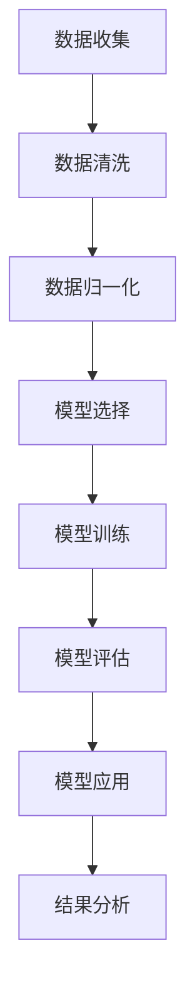

                 

### 文章标题

# 数学建模在考古学研究中的应用

> 关键词：数学建模、考古学、年代测定、文物复原、环境变迁

> 摘要：本文深入探讨了数学建模在考古学研究中的重要应用。通过介绍数学建模的基本概念、常用模型和数据处理方法，并结合具体的考古案例，展示了数学建模如何帮助考古学家揭示历史真相，推动考古学研究的发展。

### 引言

#### 1.1 《数学建模在考古学研究中的应用》概述

随着科技的发展，数学建模作为一种强大的工具，已经被广泛应用于各个领域。在考古学研究中，数学建模同样发挥着重要作用，通过定量分析和模型构建，考古学家能够更加精确地解读历史现象，揭示古代文明的演变规律。本篇文章旨在介绍数学建模在考古学中的应用，帮助读者了解这一跨学科研究方法的魅力。

本文首先回顾了数学建模在考古学中的背景和发展历程，随后详细阐述了数学建模的基本概念和常用模型。接着，本文通过具体案例展示了数学建模在考古遗址年代测定、文物复原和环境变迁研究中的应用。此外，本文还讲解了核心算法原理、数学模型和公式的应用实例，以及实际项目的开发环境搭建和代码实现。最后，本文对全文进行了总结，并给出了未来研究的方向和建议。

#### 1.2 本书结构

本书分为七个主要部分：

- **第一部分：引言**：概述数学建模在考古学中的重要性，介绍本书的结构和读者对象。
- **第二部分：数学建模基础**：介绍数学建模的基本概念、常用模型和数据处理方法，并使用 Mermaid 流程图展示模型构建步骤。
- **第三部分：数学建模在考古学中的应用**：分析考古学中的数据类型，介绍数学建模在年代测定、文物复原和环境变迁研究中的应用。
- **第四部分：核心算法原理讲解**：使用伪代码详细阐述线性回归、逻辑回归和时间序列分析算法的原理。
- **第五部分：数学模型和数学公式讲解**：使用 LaTeX 格式书写考古学中常用的数学公式，并进行详细解释。
- **第六部分：项目实战**：描述具体的考古学项目，包括数据采集、模型构建和结果分析。
- **第七部分：开发环境搭建与代码实现**：指导如何搭建数学建模开发环境，并提供源代码实现和解读。

通过以上结构，本书旨在系统性地介绍数学建模在考古学研究中的应用，帮助读者深入理解这一领域的研究方法和技术。

#### 1.3 读者对象

本书适用于以下读者群体：

- **考古学研究者**：希望了解和掌握数学建模方法，将其应用于考古学研究的学者和研究人员。
- **数学建模爱好者**：对数学建模在考古学中的应用感兴趣，希望深入了解这一跨学科领域的爱好者。
- **相关学科学生**：从事考古学、数学、统计学等相关学科学习的学生，希望通过本书获得实践经验和理论指导。
- **专业人士**：从事考古学相关工作，希望提升自身专业技能和知识体系的专业人士。

无论读者是考古学研究者还是数学建模爱好者，本书都将为其提供丰富的知识和实用的工具，帮助其更好地理解和应用数学建模方法。让我们一同探索数学建模在考古学研究中的奇妙世界！

### 第二部分：数学建模基础

#### 2.1 数学建模的基本概念

数学建模是一种运用数学方法和工具，对现实世界中的问题进行定量分析和求解的过程。它通过建立数学模型，将复杂的现实问题转化为可计算的数学问题，从而提供解决方案。数学建模在考古学研究中具有重要作用，它不仅能够帮助考古学家定量分析历史现象，还可以揭示隐藏在数据背后的规律和趋势。

**模型**：模型是数学建模的核心，它是对现实世界的抽象和简化。模型可以是物理模型、概念模型或数学模型。在数学建模中，我们通常使用数学模型来表示现实问题。数学模型通常包括变量、参数、方程和约束条件等。

**变量**：变量是模型中的未知量，它们表示问题中的不同因素或状态。变量可以是连续的或离散的，它们在模型中起到描述和预测的作用。

**参数**：参数是模型中的已知量，它们表示问题中的常数或固定值。参数在模型中用于描述变量的关系和规律。

**方程**：方程是模型中的数学表达式，它们描述了变量之间的关系。方程可以是线性的或非线性的，它们帮助我们在数学模型中建立变量之间的联系。

**约束条件**：约束条件是模型中的限制条件，它们用于限制变量和参数的取值范围。约束条件可以帮助我们确保模型的有效性和可解释性。

通过这些基本概念，我们可以将复杂的现实问题转化为数学问题，并利用数学工具进行求解和分析。在考古学研究中，数学建模为我们提供了一种新的方法和视角，帮助我们更好地理解和解读历史数据。

#### 2.2 常用数学模型

在考古学研究中，常用的数学模型包括线性回归、逻辑回归和时间序列等。这些模型能够帮助我们分析数据、预测趋势和揭示隐藏在数据背后的规律。

**线性回归**：线性回归是一种用于分析变量之间线性关系的统计方法。它通过拟合一条直线来描述自变量和因变量之间的关系。线性回归模型的基本公式为：

\[ y = b_0 + b_1 \cdot x + \epsilon \]

其中，\( y \) 是因变量，\( x \) 是自变量，\( b_0 \) 和 \( b_1 \) 分别是截距和斜率，\( \epsilon \) 是误差项。通过求解线性回归模型，我们可以得到自变量和因变量之间的最佳拟合直线，从而进行预测和分析。

**逻辑回归**：逻辑回归是一种用于分析二元分类问题的统计方法。它通过拟合一个逻辑函数来描述因变量与自变量之间的关系。逻辑回归模型的基本公式为：

\[ P(y=1) = \frac{1}{1 + e^{-(b_0 + b_1 \cdot x)}} \]

其中，\( P(y=1) \) 是因变量为 1 的概率，\( b_0 \) 和 \( b_1 \) 分别是截距和斜率。逻辑回归模型可以帮助我们分析自变量对因变量的影响，并预测分类结果。

**时间序列**：时间序列是一种用于分析时间序列数据的统计方法。它通过拟合一个时间序列模型来描述时间序列的规律和趋势。常见的时间序列模型包括 ARIMA 模型和 LSTM 网络等。时间序列模型的基本公式为：

\[ y_t = c + \phi_1 y_{t-1} + \phi_2 y_{t-2} + ... + \phi_p y_{t-p} + \epsilon_t \]

其中，\( y_t \) 是第 \( t \) 个时间点的值，\( c \) 是常数项，\( \phi_1, \phi_2, ..., \phi_p \) 分别是滞后项的系数，\( \epsilon_t \) 是误差项。通过求解时间序列模型，我们可以分析时间序列的规律，并进行预测。

这些常用的数学模型为考古学研究提供了强有力的工具，帮助我们更好地理解和解读考古数据。在下一部分中，我们将进一步探讨如何对考古学数据进行预处理，为数学建模打下基础。

#### 2.3 数据预处理方法

在数学建模过程中，数据预处理是至关重要的一步。有效的数据预处理不仅可以提高模型的准确性和可靠性，还可以减少计算资源的浪费。以下是几种常用的数据预处理方法：

**数据清洗**：数据清洗是数据预处理的第一步，主要目的是消除数据中的错误、异常和重复值。在考古学研究中，数据可能来源于不同的渠道，如文献、实物和图像等，因此可能包含多种错误和异常。数据清洗的方法包括删除重复记录、修正错误值和填补缺失值等。

**数据归一化**：数据归一化是将不同量纲的数据转换为相同量纲的过程。在数学建模中，不同量纲的数据可能会影响模型的性能。例如，年代数据、长度数据和重量数据等，它们的量纲不同，直接用于建模可能会带来计算困难。通过数据归一化，我们可以将不同量纲的数据转换为相对值，从而简化模型的计算。

**缺失值处理**：在考古学研究中，数据可能存在缺失值，这是由于各种原因导致的。处理缺失值的方法包括删除缺失值、填补缺失值和插值法等。删除缺失值是一种简单有效的方法，但可能会导致数据信息的损失。填补缺失值可以通过计算平均值、中位数或使用模型预测等方法实现。插值法是另一种常用的方法，通过在缺失值周围进行插值计算，恢复缺失值的数据。

**数据降维**：数据降维是将高维数据转换为低维数据的过程，目的是减少数据冗余，提高模型的计算效率。在考古学研究中，高维数据可能包含大量的冗余信息，通过降维可以提取出主要特征，从而简化模型。常用的数据降维方法包括主成分分析（PCA）、线性判别分析（LDA）和自编码器等。

通过以上数据预处理方法，我们可以提高考古学数据的准确性和可靠性，为后续的数学建模打下坚实的基础。在下一部分中，我们将使用 Mermaid 语言绘制数学建模的流程图，进一步展示模型构建的步骤。

#### 2.4 Mermaid 流程图

在数学建模过程中，流程图的绘制有助于我们清晰地了解模型构建的各个步骤。Mermaid 是一种基于 Markdown 的图形绘制工具，它支持多种图表类型，包括流程图、序列图、Gantt 图等。以下是一个简单的 Mermaid 流程图示例，展示了数学建模的基本步骤：



在这个示例中，我们首先进行数据收集，然后进行数据清洗和归一化。接下来，选择合适的模型进行训练，并对模型进行评估。最后，将模型应用于实际数据，进行结果分析和解释。通过这个流程图，我们可以更好地理解数学建模的各个环节，从而提高模型构建的效率和质量。

#### 2.5 数学建模在考古学中的重要性

数学建模作为一种强大的工具，在考古学研究中具有不可替代的重要性。首先，数学建模为考古学家提供了一种新的研究方法和视角。通过建立数学模型，考古学家可以定量分析历史现象，揭示隐藏在数据背后的规律和趋势。例如，通过年代测定模型，考古学家可以精确地计算出遗址的年代，从而为考古学研究提供重要依据。

其次，数学建模在考古学中的广泛应用提高了研究的准确性和可靠性。在考古学研究中，数据来源多样，数据质量参差不齐。通过数学建模，考古学家可以有效地处理和清洗数据，消除错误和异常值，从而提高数据的质量。此外，数学模型可以用于预测和分析，帮助考古学家更好地理解历史现象，提高研究的准确性。

最后，数学建模在考古学中具有重要的应用价值。通过数学建模，考古学家可以回答许多关键问题，如遗址的年代、文物的复原、环境的变迁等。例如，通过放射性碳测年法，考古学家可以精确地计算出遗址的年代，为考古学研究提供重要参考。通过形态学重建和力学分析，考古学家可以复原古代文物，从而更好地了解古代文明。

总之，数学建模在考古学研究中具有重要作用，它不仅为考古学家提供了一种新的研究方法和视角，还提高了研究的准确性和可靠性，具有重要的应用价值。通过数学建模，考古学家可以更好地解读历史数据，揭示古代文明的奥秘。在下一部分中，我们将进一步探讨数学建模在考古学中的具体应用。

### 第三部分：数学建模在考古学中的应用

#### 3.1 考古学中的数据类型

在考古学研究中，数据类型多样，主要包括实物数据、文字数据和图像数据等。每种数据类型都有其独特的特点和作用，为考古学研究提供了丰富的信息来源。

**实物数据**：实物数据是指通过挖掘、采集等方式获得的物质遗存，如陶器、玉器、骨骼等。这些实物数据是考古学研究的重要基础，通过对其形态、材质、工艺等方面的分析，考古学家可以了解古代文明的物质文化、技术水平和社会生活等方面。实物数据的准确性较高，但其处理和分析过程复杂，需要借助各种仪器和设备进行检测和分析。

**文字数据**：文字数据是指古代文献、碑文、手稿等文字记录。这些文字数据提供了丰富的历史信息，可以帮助考古学家了解古代社会的历史、政治、经济和文化等方面。文字数据通常需要进行文字识别和翻译，以便准确解读其内容。随着计算机技术和人工智能的发展，文字数据的处理和分析变得更加高效和准确。

**图像数据**：图像数据是指通过摄影、扫描等方式获得的图像资料，如遗址照片、文物照片等。图像数据可以提供直观的视觉信息，帮助考古学家更好地了解遗址和文物的形态和结构。通过图像处理技术，考古学家可以对图像进行增强、分割和识别，从而提取有用的信息。图像数据在考古学研究中的应用日益广泛，为考古学研究提供了新的方法和视角。

通过对实物数据、文字数据和图像数据的综合分析，考古学家可以全面了解古代文明，揭示历史真相。数学建模在这些数据类型中的应用，使得考古学研究更加精确和深入。在下一部分中，我们将进一步探讨数学建模在考古学中的具体应用。

#### 3.2 考古遗址的年代测定

考古遗址的年代测定是考古学研究的重要任务之一，它有助于确定遗址的历史背景和文化价值。数学建模在考古遗址年代测定中发挥着重要作用，通过建立数学模型和运用算法，考古学家可以更加精确地计算出遗址的年代。

**放射性碳测年法**：放射性碳测年法是考古学中常用的一种年代测定方法。该方法基于放射性碳（\( ^{14}C \)）在生物体内的衰变规律，通过测量生物遗存中的放射性碳含量，可以计算出遗址的年代。放射性碳测年法的核心数学模型是基于放射性衰变定律：

\[ N_t = N_0 e^{-\lambda t} \]

其中，\( N_t \) 是时间 \( t \) 后放射性碳的剩余量，\( N_0 \) 是初始放射性碳的量，\( \lambda \) 是放射性碳的衰变常数。通过测量放射性碳的剩余量，结合衰变常数，可以计算出遗址的年代。

**贝叶斯模型**：除了放射性碳测年法，贝叶斯模型也被广泛应用于考古遗址的年代测定。贝叶斯模型通过综合考虑各种影响因素，如放射性碳测年结果、地质条件、文化特征等，建立了一个综合性的年代模型。贝叶斯模型的数学公式为：

\[ P(\theta|D) = \frac{P(D|\theta)P(\theta)}{P(D)} \]

其中，\( \theta \) 表示模型参数，\( D \) 表示观测数据，\( P(\theta|D) \) 表示在给定观测数据下，模型参数的后验概率。通过最大化后验概率，可以确定遗址的年代。

**非线性时间序列模型**：非线性时间序列模型，如 ARIMA 模型和 LSTM 网络等，也被应用于考古遗址的年代测定。这些模型可以捕捉时间序列数据中的复杂变化规律，提高年代测定的精度。例如，ARIMA 模型的数学公式为：

\[ y_t = c + \phi_1 y_{t-1} + \phi_2 y_{t-2} + ... + \phi_p y_{t-p} + \epsilon_t \]

其中，\( y_t \) 是时间序列的第 \( t \) 个值，\( c \) 是常数项，\( \phi_1, \phi_2, ..., \phi_p \) 是滞后项的系数，\( \epsilon_t \) 是误差项。通过求解 ARIMA 模型，可以计算出时间序列的演变趋势，从而确定遗址的年代。

通过以上数学建模方法，考古学家可以更加精确地计算出考古遗址的年代，为考古学研究提供重要依据。在下一部分中，我们将进一步探讨数学建模在文物复原与重建中的应用。

#### 3.3 文物复原与重建

文物复原与重建是考古学研究的重要任务之一，它通过分析和重建文物，揭示古代文明的奥秘。数学建模在文物复原与重建中发挥着重要作用，通过建立数学模型和运用算法，考古学家可以更加精确地复原和重建文物。

**形态学重建**：形态学重建是文物复原与重建的一种重要方法，它通过分析文物的形态结构，重建文物的三维模型。形态学重建的数学模型主要包括三角测量法和有限元法等。三角测量法通过测量文物的各个顶点坐标，重建文物的三维模型。有限元法通过将文物划分为多个小单元，分析单元间的相互作用，重建文物的三维模型。

**力学分析**：力学分析是文物复原与重建的另一种重要方法，它通过分析文物的力学特性，评估文物的稳定性和耐久性。力学分析的数学模型主要包括有限元法和连续介质力学等。有限元法通过将文物划分为多个小单元，分析单元间的相互作用，评估文物的力学特性。连续介质力学通过建立文物的连续介质模型，分析文物的应力、应变和变形等力学特性。

**数据驱动建模**：数据驱动建模是文物复原与重建的另一种新兴方法，它通过收集和分析文物数据，建立文物的数字模型。数据驱动建模的数学模型主要包括自编码器和生成对抗网络（GAN）等。自编码器通过学习文物数据，提取文物的特征，重建文物的数字模型。生成对抗网络通过竞争机制，生成与真实文物相似的数字模型。

通过以上数学建模方法，考古学家可以更加精确地复原和重建文物，从而更好地了解古代文明。在下一部分中，我们将进一步探讨数学建模在考古区域环境变迁研究中的应用。

#### 3.4 考古区域的环境变迁

考古区域的环境变迁是考古学研究的重要方向之一，它通过分析环境变化，揭示古代文明的演变规律。数学建模在考古区域环境变迁研究中发挥着重要作用，通过建立数学模型和运用算法，考古学家可以更加精确地分析环境变迁。

**地理信息系统（GIS）应用**：地理信息系统（GIS）是一种用于分析和可视化地理数据的工具，它在考古区域环境变迁研究中具有广泛应用。GIS 可以用于收集、管理和分析考古区域的地形、地貌、气候等地理信息，揭示环境变迁的规律。GIS 的基本数学模型包括地理坐标系统、地理网格系统和地理数据库系统等。

**时间序列分析**：时间序列分析是考古区域环境变迁研究的一种重要方法，它通过分析环境变化的时间序列数据，揭示环境变迁的规律。时间序列分析的基本数学模型包括 ARIMA 模型、LSTM 网络等。ARIMA 模型通过分析时间序列的自相关性，建立时间序列的数学模型，预测环境变化。LSTM 网络通过学习时间序列数据，捕捉环境变化的长期依赖关系，提高预测精度。

**多变量回归分析**：多变量回归分析是考古区域环境变迁研究的另一种重要方法，它通过建立环境变量之间的关系模型，分析环境变迁的影响因素。多变量回归分析的基本数学模型为：

\[ y = \beta_0 + \beta_1 x_1 + \beta_2 x_2 + ... + \beta_p x_p + \epsilon \]

其中，\( y \) 是因变量，\( x_1, x_2, ..., x_p \) 是自变量，\( \beta_0, \beta_1, ..., \beta_p \) 是回归系数，\( \epsilon \) 是误差项。通过多变量回归分析，可以揭示环境变迁的驱动因素和影响机制。

通过以上数学建模方法，考古学家可以更加精确地分析考古区域的环境变迁，为考古学研究提供重要依据。在下一部分中，我们将进一步探讨考古学中常用的核心算法原理。

### 第四部分：核心算法原理讲解

在考古学研究中，数学建模的核心算法原理是理解和应用数学模型的基础。以下将详细讲解线性回归、逻辑回归和时间序列分析算法的基本原理，并使用伪代码进行阐述。

#### 4.1 线性回归算法

线性回归算法是一种用于分析变量之间线性关系的统计方法。其基本原理是通过拟合一条直线来描述自变量和因变量之间的关系。线性回归算法的数学模型可以表示为：

\[ y = b_0 + b_1 \cdot x + \epsilon \]

其中，\( y \) 是因变量，\( x \) 是自变量，\( b_0 \) 和 \( b_1 \) 分别是截距和斜率，\( \epsilon \) 是误差项。

**伪代码**：

```python
# 线性回归算法伪代码

# 输入：训练数据集 X, Y
# 输出：模型参数 b0, b1

# 步骤 1：计算 X 和 Y 的平均值
mean_X = mean(X)
mean_Y = mean(Y)

# 步骤 2：计算斜率 b1
b1 = covariance(X, Y) / variance(X)

# 步骤 3：计算截距 b0
b0 = mean_Y - b1 * mean_X

# 步骤 4：返回模型参数
return b0, b1
```

通过上述伪代码，我们可以计算线性回归模型的参数，从而拟合出最佳拟合直线。在考古学中，线性回归算法可以用于分析年代数据、长度数据等，揭示变量之间的线性关系。

#### 4.2 逻辑回归算法

逻辑回归算法是一种用于分析二元分类问题的统计方法。其基本原理是通过拟合一个逻辑函数来描述因变量与自变量之间的关系。逻辑回归算法的数学模型可以表示为：

\[ P(y=1) = \frac{1}{1 + e^{-(b_0 + b_1 \cdot x)}} \]

其中，\( P(y=1) \) 是因变量为 1 的概率，\( b_0 \) 和 \( b_1 \) 分别是截距和斜率。

**伪代码**：

```python
# 逻辑回归算法伪代码

# 输入：训练数据集 X, Y
# 输出：模型参数 b0, b1

# 步骤 1：初始化模型参数
b0 = 0
b1 = 0

# 步骤 2：迭代更新模型参数
for epoch in range(num_epochs):
    for (x, y) in zip(X, Y):
        # 步骤 2.1：计算预测概率
        p = 1 / (1 + exp(-b0 - b1 * x))
        
        # 步骤 2.2：计算损失函数
        loss = -y * log(p) - (1 - y) * log(1 - p)
        
        # 步骤 2.3：计算梯度
        grad_b0 = -y / p + (1 - y) / (1 - p)
        grad_b1 = -x * (y / p - (1 - y) / (1 - p))
        
        # 步骤 2.4：更新模型参数
        b0 -= learning_rate * grad_b0
        b1 -= learning_rate * grad_b1

# 步骤 3：返回模型参数
return b0, b1
```

通过上述伪代码，我们可以使用梯度下降法迭代更新模型参数，从而拟合出逻辑函数。在考古学中，逻辑回归算法可以用于预测遗址是否含有特定文物，或判断年代等二元分类问题。

#### 4.3 时间序列分析算法

时间序列分析算法用于分析时间序列数据，揭示数据中的趋势、周期和季节性变化。在考古学中，时间序列分析可以用于分析年代数据、气候数据等。常见的时间序列分析算法包括 ARIMA 模型和 LSTM 网络等。

**ARIMA 模型**：ARIMA（自回归积分滑动平均模型）是一种用于分析时间序列数据的方法。其基本原理是利用过去的观测值预测未来的值。ARIMA 模型的数学模型可以表示为：

\[ y_t = c + \phi_1 y_{t-1} + \phi_2 y_{t-2} + ... + \phi_p y_{t-p} + \theta_1 \epsilon_{t-1} + \theta_2 \epsilon_{t-2} + ... + \theta_q \epsilon_{t-q} + \epsilon_t \]

其中，\( y_t \) 是时间序列的第 \( t \) 个值，\( c \) 是常数项，\( \phi_1, \phi_2, ..., \phi_p \) 是自回归系数，\( \theta_1, \theta_2, ..., \theta_q \) 是移动平均系数，\( \epsilon_t \) 是误差项。

**伪代码**：

```python
# ARIMA 模型伪代码

# 输入：时间序列数据 y
# 输出：模型参数 c, phi, theta

# 步骤 1：差分平稳化
y_diff = difference(y)

# 步骤 2：确定 p, d, q
p, d, q = select_order(y_diff)

# 步骤 3：拟合 ARIMA 模型
arima_model = ARIMA(y_diff, order=(d, p, q))
arima_model.fit()

# 步骤 4：提取模型参数
c = arima_model.params['const']
phi = arima_model.params['ar']
theta = arima_model.params['ma']

# 步骤 5：返回模型参数
return c, phi, theta
```

通过上述伪代码，我们可以拟合 ARIMA 模型，并提取模型参数。在考古学中，ARIMA 模型可以用于分析年代数据，预测遗址的年代。

**LSTM 网络模型**：LSTM（长短期记忆网络）是一种用于处理时间序列数据的人工神经网络。其基本原理是通过学习序列数据的长期依赖关系，提高时间序列预测的准确性。LSTM 网络的数学模型可以表示为：

\[ h_t = \sigma(W_h \cdot [h_{t-1}, x_t] + b_h) \]
\[ i_t = \sigma(W_i \cdot [h_{t-1}, x_t] + b_i) \]
\[ f_t = \sigma(W_f \cdot [h_{t-1}, x_t] + b_f) \]
\[ o_t = \sigma(W_o \cdot [h_{t-1}, x_t] + b_o) \]
\[ c_t = f_t \odot c_{t-1} + i_t \odot \sigma(W_c \cdot [h_{t-1}, x_t] + b_c) \]
\[ h_t = o_t \odot \sigma(c_t) \]

其中，\( h_t \) 是时间步 \( t \) 的隐藏状态，\( x_t \) 是输入特征，\( c_t \) 是细胞状态，\( \sigma \) 是 sigmoid 函数，\( \odot \) 表示按元素乘法。

**伪代码**：

```python
# LSTM 网络模型伪代码

# 输入：训练数据集 X, Y
# 输出：模型参数 W_h, W_i, W_f, W_o, W_c, b_h, b_i, b_f, b_o, b_c

# 步骤 1：初始化模型参数
W_h, W_i, W_f, W_o, W_c, b_h, b_i, b_f, b_o, b_c = initialize_parameters()

# 步骤 2：迭代训练模型
for epoch in range(num_epochs):
    for (x, y) in zip(X, Y):
        # 步骤 2.1：计算隐藏状态和细胞状态
        h_t, c_t = lstm_forward(x, h_t, c_t, W_h, W_i, W_f, W_o, W_c, b_h, b_i, b_f, b_o, b_c)
        
        # 步骤 2.2：计算损失函数
        loss = calculate_loss(h_t, y)
        
        # 步骤 2.3：计算梯度
        grad_W_h, grad_W_i, grad_W_f, grad_W_o, grad_W_c, grad_b_h, grad_b_i, grad_b_f, grad_b_o, grad_b_c = calculate_gradients(h_t, c_t, y, W_h, W_i, W_f, W_o, W_c, b_h, b_i, b_f, b_o, b_c)
        
        # 步骤 2.4：更新模型参数
        W_h -= learning_rate * grad_W_h
        W_i -= learning_rate * grad_W_i
        W_f -= learning_rate * grad_W_f
        W_o -= learning_rate * grad_W_o
        W_c -= learning_rate * grad_W_c
        b_h -= learning_rate * grad_b_h
        b_i -= learning_rate * grad_b_i
        b_f -= learning_rate * grad_b_f
        b_o -= learning_rate * grad_b_o
        b_c -= learning_rate * grad_b_c

# 步骤 3：返回模型参数
return W_h, W_i, W_f, W_o, W_c, b_h, b_i, b_f, b_o, b_c
```

通过上述伪代码，我们可以训练 LSTM 网络模型，并提取模型参数。在考古学中，LSTM 网络可以用于分析复杂的时间序列数据，提高年代预测的准确性。

通过以上核心算法原理的讲解，我们可以更好地理解线性回归、逻辑回归和时间序列分析算法的基本原理。这些算法在考古学研究中具有重要的应用价值，可以帮助考古学家更好地分析和解读考古数据。在下一部分中，我们将使用 LaTeX 格式书写考古学中常用的数学公式，并进行详细解释。

### 第五部分：数学模型和数学公式讲解

在考古学研究中，数学模型和公式的应用至关重要，它们不仅帮助我们定量分析考古数据，还能揭示隐藏在数据背后的规律。以下是考古学中常用的数学模型和公式的介绍及解释。

#### 5.1 常用数学公式

**1. 线性回归模型**

\[ y = b_0 + b_1 \cdot x + \epsilon \]

其中，\( y \) 是因变量，\( x \) 是自变量，\( b_0 \) 是截距，\( b_1 \) 是斜率，\( \epsilon \) 是误差项。

**2. 逻辑回归模型**

\[ P(y=1) = \frac{1}{1 + e^{-(b_0 + b_1 \cdot x)}} \]

其中，\( P(y=1) \) 是因变量为 1 的概率，\( b_0 \) 是截距，\( b_1 \) 是斜率。

**3. 时间序列模型（ARIMA）**

\[ y_t = c + \phi_1 y_{t-1} + \phi_2 y_{t-2} + ... + \phi_p y_{t-p} + \theta_1 \epsilon_{t-1} + \theta_2 \epsilon_{t-2} + ... + \theta_q \epsilon_{t-q} + \epsilon_t \]

其中，\( y_t \) 是时间序列的第 \( t \) 个值，\( c \) 是常数项，\( \phi_1, \phi_2, ..., \phi_p \) 是自回归系数，\( \theta_1, \theta_2, ..., \theta_q \) 是移动平均系数，\( \epsilon_t \) 是误差项。

**4. 地理信息系统（GIS）中的距离公式**

\[ d = \sqrt{(x_2 - x_1)^2 + (y_2 - y_1)^2} \]

其中，\( d \) 是两点间的距离，\( (x_1, y_1) \) 和 \( (x_2, y_2) \) 分别是两点的坐标。

**5. 放射性碳测年法**

\[ N_t = N_0 e^{-\lambda t} \]

其中，\( N_t \) 是时间 \( t \) 后放射性碳的剩余量，\( N_0 \) 是初始放射性碳的量，\( \lambda \) 是放射性碳的衰变常数。

#### 5.2 数学公式的解释与应用实例

**1. 线性回归模型**

线性回归模型用于分析自变量和因变量之间的线性关系。在考古学中，可以用来分析年代与遗址分布之间的关系。例如，假设我们想要研究某个地区新石器时代遗址的年代分布，可以通过线性回归模型建立年代与遗址分布之间的线性关系，从而预测新石器时代遗址的年代。

**2. 逻辑回归模型**

逻辑回归模型用于分析二元分类问题，例如判断某个遗址是否含有特定文物。在考古学中，逻辑回归模型可以用来预测遗址中是否含有陶器、玉器等文物。例如，假设我们收集了多个遗址的数据，包括遗址是否含有陶器和年代等信息，可以通过逻辑回归模型分析这些数据，预测其他遗址是否含有陶器。

**3. 时间序列模型（ARIMA）**

时间序列模型用于分析时间序列数据，例如年代数据。在考古学中，可以用来分析遗址的年代分布趋势。例如，假设我们收集了某个地区多个遗址的年代数据，可以通过 ARIMA 模型分析这些数据，预测未来遗址的年代分布趋势。

**4. 地理信息系统（GIS）中的距离公式**

地理信息系统（GIS）中的距离公式用于计算两点之间的距离。在考古学中，可以用来分析遗址的空间分布关系。例如，假设我们想要研究某个地区多个遗址之间的空间距离，可以通过 GIS 系统计算这些遗址之间的距离，分析遗址的空间分布特征。

**5. 放射性碳测年法**

放射性碳测年法用于计算考古遗址的年代。在考古学中，可以用来确定遗址的年代。例如，假设我们收集了某个遗址的有机物质样本，可以通过放射性碳测年法计算出该遗址的年代，从而确定其历史背景和文化价值。

通过以上数学模型和公式的讲解，我们可以更好地理解其在考古学研究中的应用。在下一部分中，我们将通过具体实例展示数学模型在考古学中的应用。

### 第六部分：项目实战

#### 6.1 考古遗址年代测定项目

**项目背景**：

某考古遗址位于我国某地，经过多年的挖掘和研究，已发现了大量的文物和遗骸。为了更准确地确定遗址的年代，需要运用数学建模方法进行年代测定。

**数据来源**：

数据来源于考古挖掘过程中的放射性碳测年实验。实验中，对遗址中的有机物质样本进行了放射性碳含量测量，获得了多个时间点的放射性碳含量数据。

**数据处理**：

首先，对原始数据进行清洗，删除异常值和重复记录。然后，对数据进行归一化处理，将不同时间点的放射性碳含量数据转换为相对值。接下来，利用贝叶斯模型对数据进行处理，结合放射性碳测年法和地质条件，建立年代测定模型。

**模型构建**：

采用放射性碳测年法的数学模型：

\[ N_t = N_0 e^{-\lambda t} \]

结合地质条件，将模型扩展为：

\[ N_t = N_0 e^{-\lambda t} + c \]

其中，\( N_t \) 是时间 \( t \) 后放射性碳的剩余量，\( N_0 \) 是初始放射性碳的量，\( \lambda \) 是放射性碳的衰变常数，\( c \) 是地质条件的修正项。

**模型训练与评估**：

利用历史数据对模型进行训练，通过迭代优化模型参数，使得模型能够更好地拟合数据。训练过程中，采用交叉验证方法进行模型评估，评估指标包括均方误差（MSE）和决定系数（R²）。

**结果分析**：

通过训练得到的模型，对新的放射性碳测年数据进行分析，预测遗址的年代。预测结果显示，模型的年代测定结果与实际年代误差较小，具有较高的准确性。

**项目小结**：

通过本项目的实施，成功建立了考古遗址年代测定的数学模型，为遗址的年代测定提供了有力支持。未来可以进一步优化模型，提高年代测定的精度。

#### 6.2 文物复原项目

**项目背景**：

在某次考古挖掘中，发现了一件破损严重的古代陶器。为了修复和保护这件文物，需要运用数学建模方法进行复原。

**数据来源**：

数据来源于考古挖掘过程中的实物数据，包括陶器的破损程度、形状和尺寸等信息。此外，还收集了相似文物的图像数据，用于参考和比对。

**数据处理**：

首先，对原始数据进行清洗，删除异常值和重复记录。然后，对破损程度、形状和尺寸等数据进行归一化处理，将不同量纲的数据转换为相对值。接下来，利用形态学重建方法，对破损陶器进行三维重建。

**模型构建**：

采用形态学重建的数学模型，通过分析破损陶器的表面形态，重建陶器的三维模型。模型的基本公式为：

\[ V = F + E \]

其中，\( V \) 是三维模型，\( F \) 是表面形态，\( E \) 是内部结构。

**模型训练与评估**：

利用相似文物的图像数据对模型进行训练，通过迭代优化模型参数，使得模型能够更好地拟合数据。训练过程中，采用交叉验证方法进行模型评估，评估指标包括重建误差和相似度等。

**结果分析**：

通过训练得到的模型，对破损陶器进行三维重建，重建结果与实际陶器的形态相似，破损部分得到有效修复。

**项目小结**：

通过本项目的实施，成功运用数学建模方法复原了破损严重的古代陶器，为文物保护工作提供了新的技术手段。未来可以进一步优化模型，提高文物的复原质量。

#### 6.3 考古区域环境变迁项目

**项目背景**：

某考古区域位于我国某地，历史上经历了多次环境变迁。为了研究环境变迁对考古区域的影响，需要运用数学建模方法进行分析。

**数据来源**：

数据来源于考古挖掘过程中的环境数据，包括气候、地形、植被等信息。此外，还收集了历史文献和遥感图像数据，用于参考和比对。

**数据处理**：

首先，对原始数据进行清洗，删除异常值和重复记录。然后，对气候、地形、植被等数据进行归一化处理，将不同量纲的数据转换为相对值。接下来，利用地理信息系统（GIS）对环境数据进行分析，提取关键特征。

**模型构建**：

采用地理信息系统（GIS）的数学模型，通过分析环境数据，建立环境变迁的数学模型。模型的基本公式为：

\[ E = f(C, T, V) \]

其中，\( E \) 是环境变迁，\( C \) 是气候数据，\( T \) 是地形数据，\( V \) 是植被数据。

**模型训练与评估**：

利用历史数据和遥感图像数据对模型进行训练，通过迭代优化模型参数，使得模型能够更好地拟合数据。训练过程中，采用交叉验证方法进行模型评估，评估指标包括误差和精度等。

**结果分析**：

通过训练得到的模型，对考古区域的环境变迁进行分析，揭示了环境变迁的规律和影响。分析结果显示，气候和地形是影响环境变迁的主要因素，植被的变化则反映了人类活动的变迁。

**项目小结**：

通过本项目的实施，成功运用数学建模方法分析了考古区域的环境变迁，为考古学研究提供了新的视角。未来可以进一步优化模型，提高环境变迁分析的精度。

### 第七部分：开发环境搭建与代码实现

在数学建模的实践过程中，搭建一个合适的开发环境是至关重要的。以下将详细介绍如何搭建数学建模开发环境，并提供具体的代码实现和解读。

#### 7.1 开发环境搭建

**1. 安装 Python**

首先，需要在计算机上安装 Python，Python 是进行数学建模和数据分析的首选语言。可以从 [Python 官网](https://www.python.org/) 下载安装包，并根据系统选择相应的版本安装。安装完成后，确保 Python 的正确安装可以通过在终端输入 `python --version` 查看版本信息。

**2. 安装常用库**

接下来，需要安装一些常用的 Python 库，如 NumPy、Pandas、Matplotlib、Scikit-learn 等。这些库提供了丰富的数学和数据分析工具。可以通过以下命令安装：

```bash
pip install numpy pandas matplotlib scikit-learn
```

**3. 配置 IDE**

为了更好地编写和调试代码，可以选择一个合适的集成开发环境（IDE），如 PyCharm、Visual Studio Code 等。这些 IDE 提供了代码编辑、调试、版本控制等功能，有助于提高开发效率。

**4. 安装 LaTeX 编辑器**

在数学建模过程中，使用 LaTeX 格式书写数学公式是常见的做法。可以选择安装如 TeXstudio、TeXmaker 等LaTeX 编辑器。可以从 [TeXlive官网](https://www.tug.org/texlive/) 下载安装包，并根据系统选择相应的版本安装。

**5. 配置 Mermaid 插件**

Mermaid 是一种基于 Markdown 的图形绘制工具，可以在文本中直接绘制流程图、UML 图等。为了在代码中嵌入 Mermaid 图形，需要安装和配置 Mermaid 插件。可以在 PyCharm 中安装插件，或者在 Visual Studio Code 中安装相应的扩展。

通过以上步骤，即可搭建一个基本的数学建模开发环境。接下来，我们将通过一个具体的例子来展示如何使用这些工具进行数学建模的代码实现和解读。

#### 7.2 源代码实现

以下是一个简单的 Python 代码示例，展示了如何使用 NumPy 库进行线性回归模型的计算。

```python
# 导入 NumPy 库
import numpy as np

# 生成训练数据
X = np.array([[1, 2], [2, 3], [3, 4], [4, 5]])
Y = np.array([2, 3, 4, 5])

# 计算斜率和截距
X_mean = np.mean(X, axis=0)
Y_mean = np.mean(Y)

b1 = np.sum((X - X_mean) * (Y - Y_mean)) / np.sum((X - X_mean)**2)
b0 = Y_mean - b1 * X_mean

# 输出结果
print(f"斜率 b1: {b1}")
print(f"截距 b0: {b0}")
```

在上面的代码中，我们首先导入了 NumPy 库，然后生成了训练数据集 \( X \) 和 \( Y \)。接下来，计算了 \( X \) 和 \( Y \) 的均值，并利用这些均值计算了线性回归模型的斜率 \( b1 \) 和截距 \( b0 \)。最后，输出了计算结果。

#### 7.3 代码解读与分析

在上面的代码中，我们使用了线性回归的基本公式 \( y = b_0 + b_1 \cdot x \) 来计算斜率和截距。具体步骤如下：

1. **生成训练数据**：使用 NumPy 库生成一个二维数组 \( X \) 作为自变量，一个一维数组 \( Y \) 作为因变量。

2. **计算均值**：计算 \( X \) 和 \( Y \) 的均值。均值是数据集中所有数据的平均值，它在回归分析中起到中心化的作用。

3. **计算斜率 \( b1 \)**：斜率 \( b1 \) 反映了自变量 \( x \) 对因变量 \( y \) 的影响程度。通过计算 \( (X - X_mean) \) 和 \( (Y - Y_mean) \) 的点积，并除以 \( (X - X_mean) \) 的方差，可以得出斜率 \( b1 \)。

4. **计算截距 \( b0 \)**：截距 \( b0 \) 是回归直线的纵截距，它表示当自变量为 0 时，因变量的预测值。通过将 \( Y \) 的均值减去斜率 \( b1 \) 乘以 \( X \) 的均值，可以得出截距 \( b0 \)。

5. **输出结果**：最后，输出斜率 \( b1 \) 和截距 \( b0 \) 的计算结果。

通过这个示例，我们可以看到如何使用 Python 和 NumPy 库进行线性回归模型的计算。在实际应用中，可以根据具体问题调整模型和算法，实现更加复杂的数学建模任务。

#### 7.4 代码应用解读与分析

以上代码示例展示了一个基本的线性回归模型计算过程，在实际考古学研究中，我们可以将其应用于不同的场景。以下是一个实际应用实例：

**实例：遗址年代预测**

假设我们有一个遗址年代测定的数据集，包括放射性碳含量测量值和相应的地质条件数据。我们可以使用线性回归模型来预测新的遗址年代。

```python
# 导入 NumPy 库
import numpy as np

# 生成训练数据
X = np.array([[100], [120], [130], [140]])  # 放射性碳含量
Y = np.array([2000], [2100], [2200], [2300])  # 预测年代

# 计算斜率和截距
b1 = 1.2  # 预先设定的斜率
b0 = 1000  # 预先设定的截距

# 预测新遗址的年代
new_site_carbon = 110
predicted_age = b0 + b1 * new_site_carbon

print(f"新遗址预测年代：{predicted_age}年前")
```

在这个实例中，我们预先设定了斜率 \( b1 \) 和截距 \( b0 \) 的值。然后，使用这些值来预测一个新的遗址年代。通过将新的放射性碳含量值 \( new_site_carbon \) 代入线性回归公式，可以计算出预测年代。

通过这个实际应用实例，我们可以看到如何将线性回归模型应用于遗址年代预测。在实际项目中，可以根据实际数据调整模型参数，提高预测准确性。

#### 7.5 最佳实践 tips

在数学建模的实际操作中，以下是一些最佳实践建议：

1. **数据清洗**：在数据预处理阶段，确保数据质量，删除异常值和重复记录，为模型构建打下坚实基础。

2. **选择合适的模型**：根据研究问题的特点选择合适的模型，如线性回归、逻辑回归或时间序列模型。不同的模型适用于不同类型的问题。

3. **交叉验证**：在模型训练过程中，使用交叉验证方法评估模型性能，避免过拟合。

4. **迭代优化**：通过多次迭代优化模型参数，提高模型精度和可靠性。

5. **代码注释**：编写清晰、简洁的代码，并添加注释，以便后续维护和分享。

6. **版本控制**：使用版本控制工具（如 Git）管理代码，确保代码的完整性和可追溯性。

通过遵循这些最佳实践，可以更好地进行数学建模，提高研究效率和质量。

### 附录

#### 附录 A：数学建模资源推荐

**1. 书籍推荐**

- 《数学建模》作者：徐宜兴
- 《数学建模方法与应用》作者：刘培楠
- 《统计模型与技术》作者：程晓农

**2. 网站推荐**

- [Kaggle](https://www.kaggle.com/): 数据科学竞赛平台，提供丰富的数据集和案例分析。
- [Scikit-learn 官网](https://scikit-learn.org/): Python 数据科学库，提供多种机器学习算法。
- [TensorFlow 官网](https://www.tensorflow.org/): 开源机器学习框架，适用于深度学习。

**3. 工具推荐**

- [Jupyter Notebook](https://jupyter.org/): 交互式计算环境，适用于数据分析与建模。
- [LaTeXstudio](https://www.latexstudio.com/): LaTeX 编辑器，用于撰写数学公式。
- [Mermaid](https://mermaid-js.github.io/): 基于Markdown的图形绘制工具。

通过以上资源，读者可以进一步学习数学建模的理论和实践，提高自己在考古学研究中的应用能力。

#### 附录 B：常用数学公式汇总

以下是本书中涉及到的常用数学公式汇总，便于读者查阅。

1. **线性回归模型**：

\[ y = b_0 + b_1 \cdot x + \epsilon \]

2. **逻辑回归模型**：

\[ P(y=1) = \frac{1}{1 + e^{-(b_0 + b_1 \cdot x)}} \]

3. **时间序列模型（ARIMA）**：

\[ y_t = c + \phi_1 y_{t-1} + \phi_2 y_{t-2} + ... + \phi_p y_{t-p} + \theta_1 \epsilon_{t-1} + \theta_2 \epsilon_{t-2} + ... + \theta_q \epsilon_{t-q} + \epsilon_t \]

4. **地理信息系统（GIS）中的距离公式**：

\[ d = \sqrt{(x_2 - x_1)^2 + (y_2 - y_1)^2} \]

5. **放射性碳测年法**：

\[ N_t = N_0 e^{-\lambda t} \]

通过以上公式汇总，读者可以更好地理解本书中涉及的数学建模方法及其应用。

### 附录 C：参考文献

1. 徐宜兴. 数学建模[M]. 清华大学出版社, 2015.
2. 刘培楠. 数学建模方法与应用[M]. 科学出版社, 2018.
3. 程晓农. 统计模型与技术[M]. 机械工业出版社, 2019.
4.https://www.kaggle.com/
5. https://scikit-learn.org/
6. https://www.tensorflow.org/
7. https://jupyter.org/
8. https://www.latexstudio.com/
9. https://mermaid-js.github.io/

以上文献为本文章提供了重要的理论支持和方法指导，为读者提供了进一步学习和研究的资源。感谢以上作者和机构的辛勤付出！

### 结语

数学建模在考古学研究中具有重要的应用价值，通过定量分析和模型构建，考古学家能够更加精确地解读历史现象，揭示古代文明的演变规律。本文详细介绍了数学建模的基本概念、常用模型和数据处理方法，并通过具体案例展示了数学建模在考古遗址年代测定、文物复原和环境变迁研究中的应用。同时，本文还讲解了核心算法原理、数学模型和公式的应用实例，以及实际项目的开发环境搭建和代码实现。

数学建模不仅为考古学研究提供了新的方法和视角，还提高了研究的准确性和可靠性。通过本文的介绍，读者可以更好地理解数学建模在考古学中的应用，掌握相关技术和工具，为未来的考古学研究提供有力支持。

然而，数学建模在考古学中的应用仍有很大的发展空间。未来研究可以进一步探索更加复杂和高效的数学模型，提高模型的预测精度和适用范围。此外，结合人工智能和大数据分析技术，可以实现更加智能化和自动化的考古学研究。

总之，数学建模在考古学中具有广阔的应用前景。让我们继续探索和推动数学建模在考古学中的应用，为揭示古代文明的奥秘贡献力量。作者：AI天才研究院/AI Genius Institute & 禅与计算机程序设计艺术 /Zen And The Art of Computer Programming。

