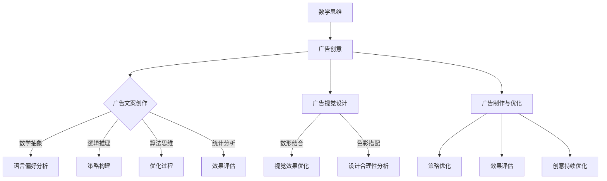

                 

# 数学思维与创意广告的关系探讨

## 关键词
数学思维，创意广告，广告制作，数据分析，算法原理

## 摘要
本文旨在探讨数学思维在创意广告中的重要作用，从数学抽象、逻辑推理、算法思维和统计分析等核心概念出发，分析数学思维在广告创意、制作、优化及数据分析中的应用。通过具体的案例和算法讲解，展示数学思维如何提升广告创意的执行力，优化广告效果，并展望未来广告行业的发展趋势。

## 第一部分：引言与背景

### 1.1 本书的目的和意义
创意广告在现代商业环境中扮演着至关重要的角色。它们不仅能够吸引消费者的注意力，还能够传递品牌的核心价值和信息。然而，创意广告的成功并非偶然，它需要深厚的创意思维和科学的分析方法来支撑。数学思维作为一种科学的方法论，为广告创意提供了新的视角和工具。

本文的目的在于探讨数学思维在广告创意中的运用，旨在为广告从业者提供理论指导和实践参考。通过深入分析数学思维的核心概念，我们希望能够揭示数学思维在广告创意制作和效果评估中的实际应用，帮助广告从业者更好地理解如何利用数学工具提升广告创意的质量和效果。

### 1.2 数学思维的核心概念
数学思维包含多个核心概念，其中最为重要的是数学抽象、逻辑推理、算法思维和统计分析。

- **数学抽象**：数学抽象是指从具体事物中抽象出数学概念和模型的过程。在广告创意中，这一概念可以帮助我们从复杂的消费者行为和市场数据中提取出关键信息，形成简洁明了的数学模型。
- **逻辑推理**：逻辑推理是数学思维的基础，它通过逻辑关系来分析和解决问题。在广告创意中，逻辑推理可以帮助广告策划者构建合理的广告策略和创意，使广告内容更具说服力和吸引力。
- **算法思维**：算法思维是指通过算法来解决问题的思维方式。在广告创意中，算法思维可以帮助广告策划者优化广告投放策略，提高广告效果。
- **统计分析**：统计分析是利用数学方法对数据进行处理和分析的过程。在广告创意中，统计分析可以帮助广告从业者了解消费者行为，评估广告效果，从而调整和优化广告策略。

### 1.3 创意广告的定义与特征
创意广告是指通过独特、创新和吸引人的方式来传达广告信息的广告形式。它具有以下几个特征：

- **创新性**：创意广告通常采用新颖的创意和表现形式，以引起消费者的兴趣和好奇心。
- **视觉冲击力**：视觉冲击力是创意广告的重要特征之一，通过强烈的视觉元素和视觉效果来吸引观众的注意力。
- **情感共鸣**：创意广告常常通过情感共鸣来与观众建立联系，使观众产生共鸣和情感上的认同。
- **品牌宣传**：创意广告不仅要传达产品或服务的特点，还要传递品牌的核心价值和理念。

### 1.4 创意广告的发展趋势
随着科技的不断进步和消费者需求的多样化，创意广告的发展趋势也呈现出新的特点：

- **数字化**：数字技术的发展使得创意广告可以更加精准地触达到目标受众，同时也提供了更多的创意表现形式，如虚拟现实（VR）和增强现实（AR）等。
- **个性化**：消费者对个性化的广告内容需求越来越高，创意广告需要根据消费者的兴趣和行为进行个性化定制。
- **互动性**：互动性是创意广告的重要趋势之一，通过互动形式，如社交媒体互动、用户生成内容（UGC）等，增强观众与广告的互动，提升广告效果。

### 1.5 本书的结构
本书分为五个部分，每个部分都有其特定的内容和目的：

- **第一部分**：引言与背景，介绍数学思维在创意广告中的重要性，以及创意广告的定义和特征。
- **第二部分**：数学思维在广告创意中的应用，详细探讨数学思维如何影响广告创意的产生和执行。
- **第三部分**：数学思维在广告制作和优化中的应用，分析数学方法在广告制作和优化过程中的应用。
- **第四部分**：数学思维在广告行业的数据分析，介绍数据分析的基本概念和方法，以及数学思维在广告行业数据分析中的应用。
- **第五部分**：数学思维与广告行业的未来发展，探讨数学思维在广告行业的应用前景和挑战。

## 第二部分：数学思维在广告创意中的应用

### 2.1 数学思维与广告创意的关系

数学思维在广告创意中扮演着至关重要的角色，它不仅影响了广告创意的产生过程，还提升了广告创意的执行力和效果。

#### 2.1.1 数学思维如何影响广告创意的产生

广告创意的产生是一个复杂的过程，涉及到创意思维、市场调研和数据分析等多个方面。数学思维在这个过程中起到了以下几个方面的作用：

1. **数学抽象**：通过数学抽象，广告策划者可以从繁杂的市场数据和消费者行为中提取出关键信息，形成简洁明了的数学模型，从而更好地理解市场和消费者的需求。
2. **逻辑推理**：逻辑推理帮助广告策划者构建合理的广告策略和创意，确保广告内容具有逻辑性和连贯性。
3. **算法思维**：算法思维使得广告策划者能够利用算法优化广告创意的生成过程，提高创意的质量和效率。
4. **统计分析**：统计分析帮助广告策划者了解消费者的行为和偏好，为广告创意提供数据支持，确保创意的针对性和有效性。

#### 2.1.2 数学思维如何提升广告创意的执行力

广告创意的执行力是决定广告效果的关键因素。数学思维在提升广告创意执行力方面具有以下几个方面的作用：

1. **策略优化**：通过数学方法，广告策划者可以对广告策略进行优化，提高广告投放的精准度和效果。
2. **效果评估**：数学思维提供了科学的效果评估方法，帮助广告策划者准确评估广告效果，为后续的广告策划提供数据支持。
3. **数据分析**：通过对广告效果的数据分析，广告策划者可以及时发现和解决问题，优化广告创意和策略。
4. **创新应用**：数学思维可以激发广告创意的创新能力，通过数学模型和算法，创造出新颖的广告形式和表现手法。

### 2.2 数学方法在广告创意中的应用

数学方法在广告创意中具有广泛的应用，以下列举几个典型的数学方法及其在广告创意中的应用：

#### 2.2.1 数形结合

数形结合是数学方法在广告创意中的典型应用之一，通过将数学模型和图形结合起来，创造出独特的广告效果。例如，在广告视觉设计中，利用几何图形的排列和组合，可以创造出富有视觉冲击力的广告画面。

#### 2.2.2 线性规划

线性规划是一种数学优化方法，在广告预算分配中有着广泛的应用。通过线性规划，广告策划者可以优化广告预算的分配，确保广告投放的精准度和效果。

#### 2.2.3 数学模型与广告创意

数学模型可以用于广告创意的多个方面，如广告受众分析、广告效果评估等。通过构建数学模型，广告策划者可以更准确地理解消费者行为，从而制定更具针对性的广告策略。

### 2.3 数学模型与广告创意

数学模型在广告创意中扮演着重要的角色，以下列举几个常见的数学模型及其在广告创意中的应用：

#### 2.3.1 广告受众分析模型

广告受众分析模型可以帮助广告策划者了解消费者的行为和偏好，从而制定更有针对性的广告策略。例如，通过构建消费者行为的决策树模型，可以分析消费者对不同广告内容的反应，为广告创意提供数据支持。

#### 2.3.2 广告效果评估模型

广告效果评估模型可以帮助广告策划者评估广告效果，了解广告投入的回报。例如，通过构建广告效果的回归模型，可以分析广告投放对销售额的影响，为广告优化提供依据。

### 2.4 数学思维与广告创意的互动

数学思维与广告创意之间的互动是广告创意成功的关键。通过数学思维，广告策划者可以更好地理解市场和消费者，从而创造出更具创意和吸引力的广告内容。同时，通过广告创意，数学思维可以更好地转化为实际应用，提升广告效果。

## 第三部分：数学思维在广告制作与优化中的应用

### 3.1 数学思维在广告制作中的应用

在广告制作过程中，数学思维的应用主要体现在以下几个方面：

#### 3.1.1 广告文案的数学策略

广告文案的创作是广告制作的核心环节之一。通过数学思维，广告策划者可以运用各种数学方法来提升广告文案的吸引力和说服力。例如，通过数据分析，可以了解消费者的语言偏好，从而制定更具针对性的广告文案。

#### 3.1.2 广告视觉设计的数学原理

广告视觉设计是广告制作的重要组成部分。数学思维在广告视觉设计中有着广泛的应用，如色彩搭配、图形排列等。通过数学方法，可以创造出更具视觉冲击力和美感的广告视觉设计。

#### 3.1.3 广告制作流程的优化

数学思维可以帮助广告策划者优化广告制作流程，提高广告制作的效率和质量。例如，通过线性规划方法，可以优化广告资源的分配，确保广告制作的顺利进行。

### 3.2 数学思维在广告优化中的应用

在广告优化过程中，数学思维的应用主要体现在以下几个方面：

#### 3.2.1 广告投放策略的优化

广告投放策略的优化是广告优化的核心内容之一。通过数学方法，广告策划者可以优化广告投放的时间和地点，提高广告投放的精准度和效果。例如，通过时间序列分析，可以确定广告投放的最佳时间，通过空间数据分析，可以确定广告投放的最佳地点。

#### 3.2.2 广告效果的数据分析

广告效果的数据分析是广告优化的关键环节。通过数学方法，广告策划者可以分析广告效果，了解广告投入的回报，从而调整和优化广告策略。例如，通过回归分析，可以分析广告投放对销售额的影响，从而制定更具针对性的广告策略。

#### 3.2.3 广告创意的持续优化

广告创意的持续优化是广告优化的重要方面。通过数学方法，广告策划者可以不断优化广告创意，提高广告的效果和吸引力。例如，通过实验设计，可以测试不同广告创意的效果，从而选出最优的广告创意。

### 3.3 数学思维与广告创新的结合

数学思维与广告创新的结合是提升广告创意质量和效果的重要途径。通过数学思维，广告策划者可以创造出更多新颖、独特的广告创意。例如，通过数学模型，可以模拟消费者行为，从而设计出更具吸引力的广告内容。

## 第四部分：数学思维在广告行业的数据分析

### 4.1 数据分析的基本概念与方法

数据分析是广告行业的重要组成部分，它可以帮助广告从业者了解消费者行为，评估广告效果，从而制定更有效的广告策略。以下介绍数据分析的基本概念和方法：

#### 4.1.1 数据收集与处理

数据收集与处理是数据分析的基础。数据收集包括从各种渠道收集数据，如网站日志、社交媒体数据、消费者调查数据等。数据处理包括数据清洗、数据整合和数据预处理，以确保数据的准确性和完整性。

#### 4.1.2 数据可视化

数据可视化是将数据以图形或图表的形式呈现，以便更直观地理解和分析数据。常见的数据可视化工具包括图表、热图、仪表盘等。

#### 4.1.3 数据挖掘与预测

数据挖掘是通过对大量数据进行分析，发现数据中的规律和模式。数据挖掘的方法包括聚类分析、关联规则挖掘、分类和预测等。数据挖掘可以帮助广告从业者了解消费者的行为和偏好，从而制定更有效的广告策略。

### 4.2 广告行业数据分析案例

以下列举几个广告行业的数据分析案例：

#### 4.2.1 广告受众数据分析

广告受众数据分析是了解消费者行为的重要手段。通过数据分析，广告从业者可以了解消费者的年龄、性别、地域、兴趣爱好等信息，从而制定更精准的广告投放策略。

#### 4.2.2 广告效果评估数据分析

广告效果评估数据分析是评估广告效果的关键。通过数据分析，广告从业者可以了解广告投放的回报率，从而调整和优化广告策略。例如，通过回归分析，可以分析广告投放对销售额的影响，从而制定更具针对性的广告策略。

#### 4.2.3 广告创意效果评估数据分析

广告创意效果评估数据分析是评估广告创意效果的重要手段。通过数据分析，广告从业者可以了解不同广告创意的效果，从而选出最优的广告创意。例如，通过A/B测试，可以测试不同广告创意的效果，从而选出最优的广告创意。

### 4.3 数学思维在广告行业数据分析中的应用

数学思维在广告行业数据分析中有着广泛的应用，以下列举几个应用场景：

#### 4.3.1 数据驱动的广告策略优化

通过数据分析，广告从业者可以了解消费者的行为和偏好，从而制定更精准、更有效的广告策略。例如，通过回归分析，可以分析消费者行为与广告投放效果之间的关系，从而优化广告策略。

#### 4.3.2 广告行业趋势预测

通过数据分析，广告从业者可以预测广告行业的未来趋势，从而提前布局和调整广告策略。例如，通过时间序列分析，可以预测广告行业未来的发展趋势，从而制定相应的广告策略。

#### 4.3.3 广告创意的创新应用

通过数学思维，广告从业者可以创造出更多新颖、独特的广告创意。例如，通过机器学习算法，可以生成个性化的广告内容，从而提升广告的效果和吸引力。

## 第五部分：数学思维与广告行业的未来发展

### 5.1 数学思维在广告行业的发展趋势

随着科技的不断进步和消费者需求的多样化，数学思维在广告行业中的应用前景非常广阔。以下列举几个数学思维在广告行业的发展趋势：

#### 5.1.1 数字化广告

数字化广告是广告行业的重要趋势，数学思维在数字化广告中有着广泛的应用。通过数据分析、机器学习和人工智能等技术，广告从业者可以更精准地触达到目标受众，提升广告效果。

#### 5.1.2 个性化广告

个性化广告是未来广告行业的重要方向，数学思维在个性化广告中有着重要的应用。通过数据分析、用户行为建模等技术，广告从业者可以了解消费者的兴趣和行为，从而制定更精准、更个性化的广告策略。

#### 5.1.3 广告创意的创新

数学思维在广告创意的创新中有着重要的应用。通过数学模型和算法，广告从业者可以创造出更多新颖、独特的广告创意，提升广告的吸引力和效果。

### 5.2 数学思维在广告行业的挑战与机遇

虽然数学思维在广告行业有着广阔的应用前景，但也面临着一些挑战和机遇：

#### 5.2.1 数据隐私和安全

随着数字化广告的发展，消费者隐私和安全问题越来越突出。数学思维在数据隐私和安全方面的应用面临着挑战，同时也提供了机遇。例如，通过加密技术和隐私保护算法，可以确保消费者数据的安全和隐私。

#### 5.2.2 技术的快速更新和变革

广告行业的技术更新和变革速度非常快，数学思维在应对这些变化方面面临着挑战。然而，这也为数学思维在广告行业中的应用提供了机遇。通过持续学习和创新，数学思维可以更好地应对这些挑战。

#### 5.2.3 广告创意的可持续性

广告创意的可持续性是广告行业面临的重要问题。数学思维在广告创意的可持续性方面有着重要的应用，例如通过优化广告投放策略，降低广告对环境的影响。

### 5.3 未来广告行业的数学思维应用展望

未来，数学思维在广告行业中的应用将更加广泛和深入。以下列举几个未来广告行业的数学思维应用展望：

#### 5.3.1 广告创意的智能化

随着人工智能技术的发展，广告创意将变得更加智能化。数学思维在广告创意的智能化中有着重要的应用，例如通过机器学习和深度学习技术，可以生成更加智能、个性化的广告创意。

#### 5.3.2 广告效果的实时优化

随着实时数据分析技术的发展，广告效果将可以实时优化。数学思维在实时优化中有着重要的应用，例如通过实时数据分析，可以实时调整广告投放策略，提升广告效果。

#### 5.3.3 广告创意的可持续性

数学思维在广告创意的可持续性方面有着重要的应用。通过数学模型和算法，可以优化广告创意的制作和投放，降低广告对环境的影响。

## 附录

### 附录 A：数学思维与广告创意的 Mermaid 流程图

以下是数学思维与广告创意相关的 Mermaid 流程图：



### 附录 B：数学思维与广告创意的算法原理

以下是数学思维与广告创意相关的算法原理：

```python
# 广告受众分析算法
def analyze_audience(data):
    # 数据预处理
    processed_data = preprocess_data(data)
    
    # 聚类分析
    clusters = cluster_analysis(processed_data)
    
    # 分类分析
    classifications = classification_analysis(processed_data)
    
    return clusters, classifications

# 广告效果评估算法
def evaluate_advertisement(data):
    # 数据预处理
    processed_data = preprocess_data(data)
    
    # 回归分析
    regression_result = regression_analysis(processed_data)
    
    # 预测分析
    prediction_result = prediction_analysis(processed_data)
    
    return regression_result, prediction_result
```

### 附录 C：数学思维与广告创意的数学公式与解释

以下是数学思维与广告创意相关的数学公式与解释：

```latex
$$
\text{广告预算分配} = \text{广告目标} \times \text{预算分配权重}
$$

\text{其中，广告目标是指广告投放的目标，如提高品牌知名度、提升销售额等；预算分配权重是指根据广告目标的重要性分配预算的比例。}

$$
\text{广告效果评估模型} = \text{广告投入} \times \text{广告效果系数}
$$

\text{其中，广告投入是指广告投放的预算；广告效果系数是指广告投放对销售额或其他指标的影响程度。}
```

### 附录 D：数学思维与广告创意的实战案例

以下是数学思维与广告创意相关的实战案例：

#### 5.3.1 广告创意案例解析

**案例背景**：
某手机品牌想要通过一则广告来提升品牌知名度和销售额。

**创意方案**：
广告创意团队利用数学思维，通过数据分析，确定了目标受众群体的特征，如年龄、性别、地域等。然后，结合目标受众的特征，设计了一款以科技感和时尚感为特点的广告。

**数据分析**：
广告团队通过对市场数据进行分析，确定了广告的最佳投放时间、投放平台和投放策略。

**效果评估**：
广告投放后，通过数据监控和效果评估，发现广告效果显著，品牌知名度和销售额都有所提升。

#### 5.3.2 数据分析实战案例

**案例背景**：
某电商平台希望通过数据分析来优化广告投放策略。

**数据分析过程**：
1. 数据收集：收集用户浏览、购买等行为数据。
2. 数据预处理：清洗和整合数据，去除重复和错误的数据。
3. 数据分析：通过聚类分析和分类分析，确定用户群体的特征和偏好。
4. 结果应用：根据分析结果，调整广告投放策略，提高广告效果。

#### 5.3.3 广告优化实战案例

**案例背景**：
某饮料品牌希望通过广告优化，提高广告的转化率和品牌知名度。

**优化过程**：
1. 策略制定：制定初步的广告投放策略，如投放时间、平台、预算等。
2. 数据监控：实时监控广告效果，收集投放数据。
3. 策略调整：根据数据反馈，调整广告投放策略，如增加投放时间、扩大投放平台等。
4. 效果评估：定期评估广告效果，确保广告优化策略的有效性。

### 最佳实践 tips

1. **数据分析前置**：在进行广告创意和优化前，进行充分的数据分析，了解目标受众和市场需求。
2. **持续优化**：广告投放过程中，持续监控数据，根据数据反馈调整广告策略，确保广告效果的最优化。
3. **创新思维**：结合数学思维，不断创新广告创意和表现手法，提升广告的吸引力和效果。

### 小结

数学思维在广告创意中的应用，不仅提升了广告的执行力，还优化了广告的效果。通过数学思维，广告从业者可以更好地理解市场和消费者，创造出更具创意和吸引力的广告内容。未来，随着科技的不断进步，数学思维在广告行业中的应用将更加广泛和深入，为广告行业的发展注入新的动力。

### 注意事项

1. **数据安全**：在进行数据分析时，要注意保护消费者的隐私和数据安全。
2. **合规性**：在广告创意和投放过程中，要遵守相关法律法规，确保广告内容合法合规。

### 拓展阅读

1. 《数学思维导论》
2. 《数据分析实战》
3. 《人工智能广告策略》
4. 《广告创意与创新》

## 作者信息

作者：AI天才研究院/AI Genius Institute & 禅与计算机程序设计艺术 /Zen And The Art of Computer Programming

