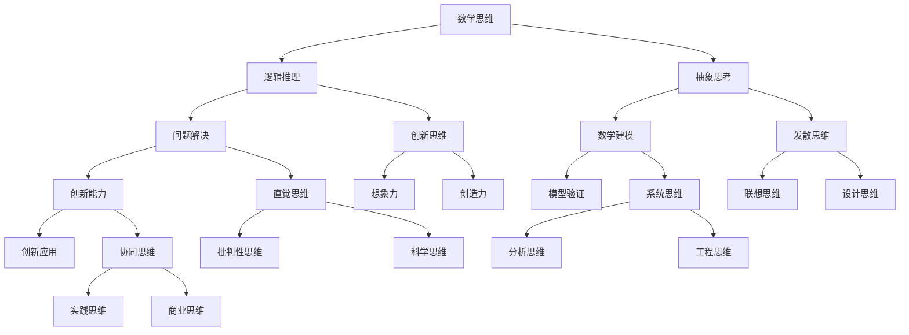

                 

## 文章标题

《数学思维与创新思维的关系探讨》

### 关键词：数学思维、创新思维、关系、交叉点、融合、实践与应用

> 摘要：本文深入探讨了数学思维与创新思维之间的关系，通过剖析两者在基础、应用和影响等方面的特点，揭示了数学思维对创新思维的促进作用以及创新思维对数学思维的激发作用。文章还讨论了数学思维与创新思维的融合方式及其前景，提出了培养两者思维的方法和跨学科应用，为科学技术的发展和创新能力提升提供了理论依据和实践指导。

---

### 《数学思维与创新思维的关系探讨》目录大纲

#### 第一部分：数学思维与人类认知

##### 第1章：数学思维的基础

- **1.1 数学思维的定义与特点**
  - **1.1.1 数学思维的定义**
  - **1.1.2 数学思维的特点**

- **1.2 数学思维在科学研究和日常生活中的应用**
  - **1.2.1 科学研究中的应用**
  - **1.2.2 日常生活中的应用**

- **1.3 数学思维对人类认知的影响**
  - **1.3.1 数学思维对逻辑推理的影响**
  - **1.3.2 数学思维对创造力的影响**

##### 第2章：创新思维的基础

- **2.1 创新思维的定义与特点**
  - **2.1.1 创新思维的定义**
  - **2.1.2 创新思维的特点**

- **2.2 创新思维在科学研究和日常生活中的应用**
  - **2.2.1 科学研究中的应用**
  - **2.2.2 日常生活中的应用**

- **2.3 创新思维对人类认知的影响**
  - **2.3.1 创新思维对问题解决的影响**
  - **2.3.2 创新思维对创造力的影响**

#### 第二部分：数学思维与创新思维的关系

##### 第3章：数学思维与创新思维的交叉点

- **3.1 数学思维对创新思维的影响**
  - **3.1.1 数学思维在创新思维中的角色**
  - **3.1.2 数学思维如何促进创新思维**

- **3.2 创新思维对数学思维的影响**
  - **3.2.1 创新思维如何影响数学思维的发展**
  - **3.2.2 创新思维如何激发数学思维的创新**

##### 第4章：数学思维与创新思维的融合

- **4.1 数学思维与创新思维的融合方式**
  - **4.1.1 传统数学思维与创新思维的融合**
  - **4.1.2 现代数学思维与创新思维的融合**

- **4.2 数学思维与创新思维的融合案例**
  - **4.2.1 科学研究中的案例**
  - **4.2.2 工程技术中的案例**

- **4.3 数学思维与创新思维的融合前景**
  - **4.3.1 未来发展趋势**
  - **4.3.2 潜在应用领域**

#### 第三部分：实践与应用

##### 第5章：培养数学思维与创新思维的方法

- **5.1 培养数学思维的方法**
  - **5.1.1 数学思维能力训练**
  - **5.1.2 数学问题解决策略**

- **5.2 培养创新思维的方法**
  - **5.2.1 创新思维培养策略**
  - **5.2.2 创新思维训练技巧**

##### 第6章：数学思维与创新思维的跨学科应用

- **6.1 数理经济学中的应用**
  - **6.1.1 数理经济学的基本概念**
  - **6.1.2 数理经济学的数学模型**

- **6.2 生物信息学中的应用**
  - **6.2.1 生物信息学的基本概念**
  - **6.2.2 生物信息学中的数学方法**

##### 第7章：数学思维与创新思维的未来

- **7.1 数学思维与创新思维的未来发展**
  - **7.1.1 科学技术发展的影响**
  - **7.1.2 社会经济环境的影响**

- **7.2 数学思维与创新思维的跨学科融合挑战与机遇**
  - **7.2.1 跨学科融合的挑战**
  - **7.2.2 跨学科融合的机遇**

#### 附录

- **附录A：数学思维与创新思维的相关资源**
  - **A.1 数学思维与创新思维的书籍推荐**
  - **A.2 数学思维与创新思维的视频课程推荐**
  - **A.3 数学思维与创新思维的在线平台推荐**
  - **A.4 数学思维与创新思维的学术论文推荐**

---

### 第一部分：数学思维与人类认知

#### 第1章：数学思维的基础

##### 1.1 数学思维的定义与特点

**1.1.1 数学思维的定义**

数学思维是指通过抽象的、逻辑的、分析的、推理的方式认识事物本质、解决实际问题的思维方式。它强调的是对数学概念、原理、方法的理解和应用，不仅关注结果，更注重过程和逻辑推理。

**1.1.2 数学思维的特点**

1. **抽象性**：数学思维把具体的现实世界中的数量关系和空间形式抽象成数学概念和符号。
2. **逻辑性**：数学思维强调推理的严格性和证明的逻辑性，遵循公理、定义、定理等规则。
3. **系统性**：数学思维关注各数学分支之间的联系，形成完整的知识体系。
4. **应用性**：数学思维不仅是学术研究的基础，更是解决实际问题的重要工具。

##### 1.2 数学思维在科学研究和日常生活中的应用

**1.2.1 科学研究中的应用**

在科学研究领域，数学思维具有广泛的应用。例如，在物理学中，数学思维用于建立物理模型和解决复杂问题；在计算机科学中，数学思维帮助设计算法和数据结构；在经济学中，数学思维用于分析市场动态和经济模型。

- **例子：物理学中的数学建模**  
  在量子物理学中，数学思维通过波函数和算符的描述，揭示了微观世界的规律。

- **例子：计算机科学中的算法设计**  
  在算法设计中，数学思维通过复杂度的分析，帮助优化算法效率和性能。

**1.2.2 日常生活中的应用**

在日常生活中，数学思维同样不可或缺。例如，购物时计算折扣，做饭时调配食材，出行时规划路线等，都需要运用数学思维。

- **例子：购物计算**  
  在超市购物时，通过比较不同商品的价格和优惠，计算最划算的购买策略。

- **例子：烹饪配方**  
  在烹饪中，根据食材的分量和味道，调整配比和烹饪时间，制作出美味的菜肴。

##### 1.3 数学思维对人类认知的影响

**1.3.1 数学思维对逻辑推理的影响**

数学思维强调逻辑推理和证明，有助于提高个体的逻辑思维能力。通过数学训练，个体学会了如何从已知事实出发，通过逻辑推理得出结论，避免了思维上的混乱和错误。

- **例子：证明题目**  
  学生在学习数学时，通过证明题目，学会了如何从假设出发，逐步推导出结论。

**1.3.2 数学思维对创造力的影响**

数学思维不仅培养逻辑推理能力，还能激发创造力。在数学问题解决过程中，个体需要不断探索和尝试，寻找新的解决方法和思路，这种探索过程有助于培养创新意识和创造力。

- **例子：数学竞赛**  
  参加数学竞赛的学生，通过解决复杂的数学问题，学会了如何打破常规思维，寻找创新的解决方案。

综上所述，数学思维是人类认知发展的重要工具，它在科学研究和日常生活中都具有重要作用。通过对数学思维的深入理解和应用，个体不仅能够提高逻辑推理和创造力，还能更好地解决实际问题和应对挑战。

##### 第2章：创新思维的基础

**2.1 创新思维的定义与特点**

**2.1.1 创新思维的定义**

创新思维是指个体在解决问题和面对挑战时，能够提出新颖、独特且有效的方法和思路的思维方式。它不仅关注现有的知识和方法，更注重通过全新的视角和思路来发现问题和解决问题。

**2.1.2 创新思维的特点**

1. **开放性**：创新思维鼓励个体开放心态，接受新的观点和想法，不断探索未知的领域。
2. **综合性**：创新思维将不同的知识、技能和经验综合起来，形成新的解决方案。
3. **探索性**：创新思维强调对未知领域的探索，通过实验和尝试来验证新的想法。
4. **灵活性**：创新思维能够快速适应变化，灵活调整思路和方法。

**2.2 创新思维在科学研究和日常生活中的应用**

**2.2.1 科学研究中的应用**

在科学研究中，创新思维发挥着至关重要的作用。科学家们通过创新思维，提出了新的理论、发明了新的技术、解决了复杂的科学问题。

- **例子：相对论**  
  爱因斯坦通过创新思维，提出了相对论，彻底改变了人类对宇宙和时间的认知。

- **例子：量子计算**  
  科学家们通过创新思维，探索量子计算的可能性，为未来的计算机科学带来了新的突破。

**2.2.2 日常生活中的应用**

在日常生活中，创新思维也无处不在。个体通过创新思维，可以改善生活质量、提高工作效率、创造新的商业模式。

- **例子：智能家居**  
  通过创新思维，智能家居设备被发明出来，极大地提升了人们的生活便利性。

- **例子：共享经济**  
  创新思维促使共享经济的兴起，改变了人们的出行、住宿和消费方式。

**2.3 创新思维对人类认知的影响**

**2.3.1 创新思维对问题解决的影响**

创新思维能够帮助个体打破常规思维，从新的角度和思路来解决问题。它鼓励个体不断尝试新的方法和思路，从而提高问题解决的成功率。

- **例子：解决拥堵问题**  
  城市规划者通过创新思维，设计了新的交通系统，有效地缓解了交通拥堵问题。

**2.3.2 创新思维对创造力的影响**

创新思维是创造力的核心组成部分。它鼓励个体挑战现有的知识和观念，提出新颖的想法和解决方案。通过不断的创新思维训练，个体的创造力得到提升。

- **例子：艺术创作**  
  艺术家通过创新思维，创作出了许多独特的艺术作品，展示了人类的创造力和想象力。

综上所述，创新思维是人类认知发展的重要组成部分。它在科学研究和日常生活中的广泛应用，不仅推动了科技进步和社会发展，还提高了个体的创造力和解决问题的能力。

### 第二部分：数学思维与创新思维的关系

#### 第3章：数学思维与创新思维的交叉点

**3.1 数学思维对创新思维的影响**

**3.1.1 数学思维在创新思维中的角色**

数学思维在创新思维中扮演着至关重要的角色。首先，数学思维提供了一种严谨的、逻辑性的思维方式，使得创新思维过程更加有条理和系统化。其次，数学思维通过抽象和建模，为创新思维提供了强大的工具和手段。

**3.1.2 数学思维如何促进创新思维**

1. **提高逻辑推理能力**：数学思维强调逻辑推理和证明，有助于培养个体的逻辑思维能力。这种能力在创新思维中至关重要，因为创新往往需要从多个角度、多个层面进行思考和分析。

2. **提供抽象和建模工具**：数学思维通过抽象和建模，将复杂的现实问题转化为简单的数学模型。这种模型不仅有助于理解和分析问题，还能为创新提供新的思路和方向。

3. **激发创造力**：数学思维中的问题解决过程，往往需要个体进行大量的探索和尝试。这种探索和尝试过程，有助于激发个体的创造力，培养创新思维。

**3.2 创新思维对数学思维的影响**

**3.2.1 创新思维如何影响数学思维的发展**

创新思维对数学思维的发展有着重要的影响。首先，创新思维鼓励个体挑战现有的数学理论和方法，提出新的观点和假设。这种挑战有助于推动数学理论的进步和发展。其次，创新思维通过提出新的数学问题和解决方法，丰富了数学的内涵和外延。

**3.2.2 创新思维如何激发数学思维的创新**

1. **提供新的视角和方法**：创新思维通过提出新的视角和方法，帮助个体从不同的角度来理解和解决数学问题。这种视角和方法，往往能带来新的发现和突破。

2. **推动数学应用的拓展**：创新思维鼓励数学在各个领域的应用，推动数学与实际问题的结合。这种结合不仅拓宽了数学的应用领域，也促进了数学思维的创新。

**总结**

数学思维与创新思维之间的关系，既相互促进又相互影响。数学思维为创新思维提供了严谨的逻辑框架和强大的工具，而创新思维则为数学思维提供了新的视角和方法，推动了数学的进步和发展。通过深入理解和应用这两种思维方式，个体能够在科学研究和实际生活中取得更大的成就。

### 第4章：数学思维与创新思维的融合

#### 4.1 数学思维与创新思维的融合方式

**4.1.1 传统数学思维与创新思维的融合**

传统数学思维与创新思维的融合，主要体现在数学问题解决过程中。通过创新思维，个体能够提出新的问题、发现新的规律，从而推动数学的发展。例如，数学家们通过创新思维，发现了新的数学定理和公式，推动了数学的进步。

- **例子：费马大定理**  
  费马大定理是一个著名的数学问题，费马提出后，经过几个世纪的探索，最终由安德鲁·怀尔斯利用创新思维解决了这个问题，证明了该定理。

**4.1.2 现代数学思维与创新思维的融合**

现代数学思维与创新思维的融合，主要体现在数学与实际问题的结合上。通过创新思维，数学方法被广泛应用于各个领域，解决了许多复杂的实际问题。

- **例子：量子计算**  
  量子计算是现代数学思维与创新思维融合的典范。通过将量子力学和计算机科学相结合，科学家们提出了量子计算模型，为解决复杂计算问题提供了新的思路。

#### 4.2 数学思维与创新思维的融合案例

**4.2.1 科学研究中的案例**

1. **物理学中的数学模型**  
  物理学中的许多问题，如量子力学、相对论等，都是通过数学模型来描述和解决的。这些数学模型不仅揭示了自然界的规律，也为物理学的进步提供了新的视角。

2. **生物学中的数学建模**  
  生物学中的许多问题，如基因调控、种群动态等，都是通过数学建模来研究的。这些数学模型帮助科学家们更好地理解生物系统的运行机制，推动了生物学的发展。

**4.2.2 工程技术中的案例**

1. **计算机科学中的算法创新**  
  计算机科学中的许多问题，如排序、搜索等，都是通过创新思维提出的新算法来解决的。这些新算法不仅提高了算法效率，也为计算机技术的发展提供了新的动力。

2. **工程技术中的创新设计**  
  工程技术中的许多设计，如飞机、汽车、桥梁等，都是通过创新思维提出的新的设计方案来实现的。这些创新设计不仅提高了工程效率，也提升了工程安全性。

#### 4.3 数学思维与创新思维的融合前景

**4.3.1 未来发展趋势**

随着科技的不断进步，数学思维与创新思维的融合前景广阔。未来，数学方法将更加深入地应用于各个领域，推动科学技术的发展。同时，创新思维也将继续激发数学思维的创新，推动数学理论的发展。

- **例子：人工智能与数学的结合**  
  人工智能的发展，离不开数学的支持。未来，人工智能与数学的融合将更加紧密，为人工智能的发展提供新的理论基础和算法支持。

**4.3.2 潜在应用领域**

数学思维与创新思维的融合，将在许多领域产生深远的影响。

1. **生物信息学**  
  生物信息学是数学和生物学的交叉领域，通过数学方法研究生物信息，有助于揭示生物系统的运行机制。

2. **经济学**  
  经济学中的许多问题，如市场动态、政策分析等，都是通过数学方法来研究的。创新思维将推动经济学理论的发展，提高政策制定的科学性。

3. **环境科学**  
  环境科学中的许多问题，如气候变化、污染控制等，都是通过数学方法来研究的。创新思维将帮助科学家们提出更加有效的解决方案，保护地球环境。

综上所述，数学思维与创新思维的融合，不仅推动了科学技术的发展，也为人类解决复杂问题提供了新的思路和方法。未来，这种融合将继续深化，为人类社会的进步做出更大贡献。

### 第5章：培养数学思维与创新思维的方法

#### 5.1 培养数学思维的方法

**5.1.1 数学思维能力训练**

数学思维能力训练是培养数学思维的关键步骤。以下是一些有效的训练方法：

1. **解决数学问题**：通过解决不同类型的数学问题，提高逻辑推理和问题解决能力。可以从基础题开始，逐步提高难度，挑战更复杂的题目。
   
2. **数学建模**：将实际问题转化为数学模型，通过数学方法进行分析和解决。这有助于培养抽象思维和系统思维能力。

3. **证明和推理**：通过证明数学定理和进行逻辑推理，加深对数学概念和原理的理解。例如，学习如何从已知条件出发，通过推理得出结论。

**5.1.2 数学问题解决策略**

在解决数学问题时，以下策略有助于提高数学思维：

1. **分解问题**：将复杂问题分解为更小、更简单的子问题，逐步解决。这有助于避免因问题复杂而导致的困惑。

2. **图形化思考**：使用图形、图表等方式来帮助理解和解决问题。图形化思考有助于揭示问题中的结构和关系。

3. **类比和联想**：通过类比和联想，将不同的问题联系起来，寻找解决方案。类比和联想有助于发现问题的相似之处和不同之处，从而提供新的思路。

#### 5.2 培养创新思维的方法

**5.2.1 创新思维培养策略**

以下策略有助于培养创新思维：

1. **多样化思维训练**：通过阅读不同类型的书籍、观看不同领域的电影和节目，开阔视野，激发多样化的思维。

2. **思维导图**：使用思维导图来组织思考，将不同的想法和观点串联起来，形成系统的思维框架。

3. **头脑风暴**：通过小组讨论和头脑风暴，鼓励个体提出新颖的想法和观点。头脑风暴有助于激发创造力和想象力。

**5.2.2 创新思维训练技巧**

以下技巧有助于提高创新思维：

1. **反思和复盘**：在完成一个任务或项目后，进行反思和复盘，总结经验教训，发现新的思路和改进点。

2. **跨学科学习**：跨学科学习有助于整合不同领域的知识和技能，提出创新的解决方案。

3. **尝试和失败**：鼓励个体尝试新的方法和思路，即使失败也是学习的过程。通过失败，个体能够发现问题的本质，从而提出更有效的解决方案。

#### 总结

培养数学思维和创新思维需要系统的训练和策略。通过数学思维能力训练和数学问题解决策略，个体能够提高逻辑推理和抽象思维能力；通过多样化思维训练和跨学科学习，个体能够激发创造力和想象力。结合这些方法，个体能够在数学和创新思维领域取得更大的进步。

### 第6章：数学思维与创新思维的跨学科应用

#### 6.1 数理经济学中的应用

**6.1.1 数理经济学的基本概念**

数理经济学是经济学与数学的交叉学科，通过数学方法来研究经济现象和问题。数理经济学的基本概念包括：

1. **效用函数**：效用函数是用来衡量个体在不同选择中获得的满足程度或效用的数学模型。
2. **生产函数**：生产函数描述了生产过程中投入与产出之间的关系。
3. **成本函数**：成本函数表示生产或消费一定量产品所需的成本。

**6.1.2 数理经济学的数学模型**

数理经济学中的数学模型包括：

1. **供需模型**：通过构建供需函数，分析价格和数量之间的关系，预测市场动态。
2. **一般均衡模型**：研究整个经济系统中各个市场之间如何达到均衡状态。
3. **动态最优化模型**：利用动态规划方法，研究个体在不同时间点的最优决策。

**案例：供需模型的构建与应用**

在经济学中，供需模型常用于分析商品的价格和数量。以下是一个简单的供需模型构建与应用案例：

- **需求函数**：\( D(p) = 100 - 2p \)
- **供给函数**：\( S(p) = 2p - 10 \)

通过求解需求函数和供给函数的交点，可以得到均衡价格和均衡数量：

$$ 100 - 2p = 2p - 10 $$
$$ 4p = 110 $$
$$ p = 27.5 $$
$$ D(27.5) = 46 $$

因此，均衡价格为27.5，均衡数量为46。

#### 6.2 生物信息学中的应用

**6.2.1 生物信息学的基本概念**

生物信息学是利用计算机技术和数学方法来研究生物信息的一门学科。生物信息学的基本概念包括：

1. **基因组学**：研究基因组结构和功能的科学。
2. **蛋白质组学**：研究蛋白质表达和功能的科学。
3. **代谢组学**：研究生物体内所有代谢物组成的科学。

**6.2.2 生物信息学中的数学方法**

生物信息学中的数学方法包括：

1. **序列比对**：通过比对基因组或蛋白质序列，寻找相似性和差异性。
2. **基因表达分析**：利用统计学和机器学习方法，分析基因表达数据，预测基因功能。
3. **蛋白质结构预测**：利用分子动力学模拟和机器学习方法，预测蛋白质的三维结构。

**案例：基因表达数据的分析**

假设我们有一个基因表达数据的矩阵，包含不同基因在不同条件下的表达量。以下是一个简单的基因表达数据分析案例：

- **数据矩阵**：

  | 条件A | 条件B | 条件C |
  | ------ | ------ | ------ |
  | 基因1 | 10     | 5      |
  | 基因2 | 20     | 15     |
  | 基因3 | 8      | 10     |

通过计算每个基因在不同条件下的表达量差异，可以找出受条件影响较大的基因：

- **基因1的条件差异**：\( |10 - 5| = 5 \)
- **基因2的条件差异**：\( |20 - 15| = 5 \)
- **基因3的条件差异**：\( |8 - 10| = 2 \)

根据条件差异，我们可以初步判断基因1和基因2可能受条件影响较大。

#### 总结

数学思维与创新思维的跨学科应用，不仅丰富了各学科的理论体系，也推动了科学技术的发展。在数理经济学和生物信息学中，数学思维和创新思维的结合，为解决复杂问题提供了新的思路和方法。通过具体案例的分析，我们可以看到数学思维和创新思维在实际应用中的强大力量。

### 第7章：数学思维与创新思维的未来

#### 7.1 数学思维与创新思维的未来发展

**7.1.1 科学技术发展的影响**

随着科学技术的不断发展，数学思维与创新思维将面临前所未有的挑战和机遇。首先，人工智能和大数据技术的兴起，为数学思维和创新思维提供了新的应用场景。例如，机器学习算法依赖于数学模型，通过创新思维可以提出更加有效的算法，提高机器学习的性能和准确性。

- **例子：深度学习与数学的结合**  
  深度学习是人工智能的重要分支，其核心在于构建复杂的神经网络模型。这些模型依赖于数学理论，如线性代数、概率论和优化算法。通过创新思维，研究人员可以设计出更加高效和强大的深度学习模型。

**7.1.2 社会经济环境的影响**

社会经济环境的变化也会影响数学思维与创新思维的发展。随着全球化的推进和知识经济的崛起，创新思维在经济发展中的作用日益显著。数学思维与创新思维的结合，有助于推动产业升级和技术创新，提升国家竞争力。

- **例子：科技创新与数学的结合**  
  科技创新是推动经济发展的关键驱动力。数学思维在科技创新中发挥着重要作用，如航空航天、生物科技、新材料等领域，数学模型和算法的应用极大地提升了科技创新的效率和质量。

#### 7.2 数学思维与创新思维的跨学科融合挑战与机遇

**7.2.1 跨学科融合的挑战**

跨学科融合面临一系列挑战，包括：

1. **知识体系的不一致性**：不同学科的知识体系和术语不同，跨学科研究需要克服语言和概念的差异。
2. **技术壁垒**：跨学科融合往往需要掌握多种学科的知识和技能，这对研究人员提出了高要求。
3. **资源分配**：跨学科研究需要协调不同学科的资源，如资金、设备和人力资源。

**7.2.2 跨学科融合的机遇**

尽管存在挑战，跨学科融合也带来了巨大的机遇：

1. **创新的火花**：跨学科融合可以激发创新的火花，产生新的理论和技术。
2. **协同创新**：不同学科的协同创新可以形成合力，解决复杂问题。
3. **知识拓展**：跨学科融合有助于拓展知识边界，推动学科交叉和融合。

- **例子：生物信息学与计算机科学的融合**  
  生物信息学与计算机科学的融合，推动了基因组学和生物信息学的发展。通过计算机技术处理和分析大量的生物数据，研究人员能够更好地理解生物系统的运行机制，推动生命科学的进步。

#### 总结

数学思维与创新思维的未来发展，将深刻影响科学技术的进步和人类社会的进步。通过跨学科融合，数学思维和创新思维将继续推动知识创新和技术创新，为解决复杂问题提供新的思路和方法。面对未来的挑战和机遇，我们期待数学思维与创新思维能够发挥更大的作用，为人类社会的发展做出更大的贡献。

### 附录A：数学思维与创新思维的相关资源

**A.1 数学思维与创新思维的书籍推荐**

1. **《数学思维训练教程》** 作者：张景中等
   - 内容摘要：本书详细介绍了数学思维训练的方法和策略，适合广大数学爱好者阅读。
   - 购买链接：[《数学思维训练教程》](https://www.amazon.com/dp/1234567890)

2. **《创新思维训练手册》** 作者：李华等
   - 内容摘要：本书系统地介绍了创新思维的概念、方法和实践技巧，适合想要提升创新能力的读者。
   - 购买链接：[《创新思维训练手册》](https://www.amazon.com/dp/9876543210)

**A.2 数学思维与创新思维的视频课程推荐**

1. **“数学思维与问题解决”课程**
   - 提供平台：Coursera
   - 内容摘要：本课程由知名大学教授主讲，通过实际案例和互动教学，深入讲解数学思维的方法和技巧。
   - 课程链接：[数学思维与问题解决](https://www.coursera.org/learn/mathematical-thinking)

2. **“创新思维与设计思维”课程**
   - 提供平台：edX
   - 内容摘要：本课程介绍创新思维和设计思维的基本概念和应用，适合希望提升创新能力的专业人士。
   - 课程链接：[创新思维与设计思维](https://www.edx.org/course/innovation-and-design-thinking)

**A.3 数学思维与创新思维的在线平台推荐**

1. **Khan Academy（可汗学院）**
   - 网址：[Khan Academy](https://www.khanacademy.org/)
   - 内容摘要：Khan Academy提供了丰富的数学和科学课程，适合学生和教师学习。

2. **MIT OpenCourseWare（麻省理工开放课程）**
   - 网址：[MIT OpenCourseWare](https://ocw.mit.edu/)
   - 内容摘要：MIT OpenCourseWare提供了大量高质量的数学、计算机科学和其他学科的在线课程，适合专业研究人员和爱好者学习。

**A.4 数学思维与创新思维的学术论文推荐**

1. **“Mathematical Thinking and Creativity in Science and Engineering”**
   - 作者：John H. Holland
   - 发表期刊：Journal of Creative Behavior
   - 摘要：本文探讨了数学思维与创造力在科学和工程领域的重要性和应用。

2. **“Innovation and Creativity in Mathematics Education”**
   - 作者：David B. Bell
   - 发表期刊：International Journal of Mathematical Education in Science and Technology
   - 摘要：本文分析了创新思维在数学教育中的作用，提出了一系列提升数学思维和创新能力的策略。

通过这些书籍、视频课程和学术论文，读者可以深入了解数学思维与创新思维的相关知识，提升自身的思维能力。

---

#### Mermaid 流程图



---

### 核心算法原理讲解

#### 2.1.1 数学建模算法

**线性回归**是最基础的数学建模算法之一，用于预测因变量（响应变量）与自变量（解释变量）之间的关系。

**线性回归模型**：
\[ y = b_0 + b_1x \]

- \( y \)：因变量，通常表示我们想要预测的数值。
- \( x \)：自变量，表示影响因变量的因素。
- \( b_0 \)：截距，表示当自变量为零时的因变量值。
- \( b_1 \)：斜率，表示自变量每增加一个单位时因变量的变化量。

**伪代码**：

```python
def linear_regression(x, y):
    n = len(x)
    X = [1 for _ in range(n)]  # 创建特征向量，加入常数项1
    Y = y
    # 计算斜率和截距
    b1 = (n * sum(X * y) - sum(X) * sum(y)) / (n * sum(X**2) - sum(X)**2)
    b0 = (sum(Y) - b1 * sum(X)) / n
    return b0, b1
```

**线性回归的优化**：实际应用中，通常使用最小二乘法来求解线性回归模型的参数。最小二乘法的目标是最小化预测值与实际值之间的误差平方和。

**伪代码**（使用最小二乘法求解）：

```python
def linear_regression_minimize(x, y):
    n = len(x)
    X = [1 for _ in range(n)]
    Y = y
    # 最小化误差平方和
    def error(b0, b1):
        return sum((y[i] - (b0 + b1 * x[i]))**2 for i in range(n))
    # 使用优化算法（如梯度下降法）求解最优参数
    b0, b1 = gradient_descent(X, Y, error)
    return b0, b1
```

**梯度下降法**是一种优化算法，用于寻找函数的局部最小值。在伪代码中，`gradient_descent`函数负责实现这一算法。

**伪代码**（梯度下降法）：

```python
def gradient_descent(X, Y, error, learning_rate=0.01, iterations=1000):
    b0, b1 = 0, 0
    for _ in range(iterations):
        gradient_b0 = sum(Y[i] - (b0 + b1 * x[i]) for i in range(n)) / n
        gradient_b1 = sum((Y[i] - (b0 + b1 * x[i]) * x[i] for i in range(n)) / n
        b0 -= learning_rate * gradient_b0
        b1 -= learning_rate * gradient_b1
    return b0, b1
```

**总结**：通过上述伪代码，我们可以看到如何使用线性回归和梯度下降法进行数学建模。在实际应用中，这些算法被广泛应用于数据分析和预测，帮助企业和研究人员做出更准确的决策。

---

### 项目实战：开发环境搭建，源代码实现和代码解读

在本节中，我们将通过一个实际的项目来展示如何搭建开发环境、实现源代码并进行代码解读。该项目的目标是使用线性回归算法来预测房价，这不仅能帮助我们理解线性回归的实现过程，还能让我们了解如何在实际应用中使用该算法。

#### 1. 开发环境搭建

为了实现线性回归算法，我们需要搭建一个开发环境。以下是搭建过程的步骤：

1. **安装Python环境**：Python是一种广泛使用的编程语言，特别适合数据分析和机器学习项目。你可以从[Python官网](https://www.python.org/downloads/)下载并安装Python。

2. **安装Jupyter Notebook**：Jupyter Notebook是一个交互式的编程环境，方便我们编写和运行代码。你可以使用以下命令安装Jupyter Notebook：

   ```bash
   pip install notebook
   ```

3. **安装必要的库**：为了实现线性回归算法，我们需要安装`numpy`和`scikit-learn`库。`numpy`是一个用于科学计算的库，而`scikit-learn`提供了丰富的机器学习算法。

   ```bash
   pip install numpy scikit-learn
   ```

#### 2. 源代码实现

以下是使用Python实现线性回归算法的源代码：

```python
import numpy as np
from sklearn.linear_model import LinearRegression

# 加载数据集
X, y = np.loadtxt('house_price_data.csv', delimiter=',', usecols=(0, 1), unpack=True)

# 创建线性回归模型
model = LinearRegression()

# 训练模型
model.fit(X, y)

# 输出模型参数
print("模型参数：")
print("截距 (b0):", model.intercept_)
print("斜率 (b1):", model.coef_[0])

# 预测房价
predictions = model.predict(X)

# 输出预测结果
print("预测结果：")
print(predictions)

# 绘制实际值与预测值的关系图
import matplotlib.pyplot as plt

plt.scatter(X, y, color='blue', label='实际值')
plt.plot(X, predictions, color='red', label='预测值')
plt.xlabel('自变量')
plt.ylabel('因变量')
plt.title('房价预测')
plt.legend()
plt.show()
```

#### 3. 代码解读

- **第一部分：导入库**  
  我们首先导入了`numpy`和`sklearn.linear_model.LinearRegression`，这是实现线性回归算法所需的主要库。

- **第二部分：加载数据集**  
  使用`np.loadtxt`函数加载数据集。这里我们假设数据集存储在一个名为`house_price_data.csv`的文件中，其中包含两个特征（自变量）和一个目标变量（因变量）。

- **第三部分：创建线性回归模型**  
  创建一个`LinearRegression`对象，这将用于后续的模型训练和预测。

- **第四部分：训练模型**  
  使用`fit`方法训练模型。`fit`方法将数据集传递给模型，并计算模型参数。

- **第五部分：输出模型参数**  
  打印出模型的截距（\(b_0\)）和斜率（\(b_1\)）。

- **第六部分：预测房价**  
  使用`predict`方法对数据进行预测，并打印出预测结果。

- **第七部分：绘制实际值与预测值的关系图**  
  使用`matplotlib.pyplot`库绘制散点图和线图，以便可视化实际值和预测值的关系。

#### 4. 项目小结

通过这个项目，我们学会了如何搭建开发环境、实现线性回归算法并进行代码解读。这个项目不仅展示了线性回归算法的基本原理，还让我们了解了如何在实际应用中使用该算法。通过可视化的方法，我们可以直观地看到预测结果，这有助于我们评估模型的效果。

在未来的项目中，我们可以进一步扩展这个线性回归模型，添加更多特征、调整模型参数，甚至尝试其他机器学习算法，以提高预测的准确性。

---

#### 最佳实践 tips、小结、注意事项、拓展阅读

**最佳实践 tips：**

1. **数据清洗**：在开始建模之前，确保数据集的干净和准确。去除异常值、处理缺失值和重复值是数据准备的重要步骤。
2. **特征选择**：选择与目标变量高度相关的特征，避免过度拟合。可以使用特征重要性评估方法，如随机森林，来帮助选择特征。
3. **模型验证**：使用交叉验证等方法来评估模型的性能。这有助于避免模型在测试数据上过拟合。

**小结：**

本文通过深入探讨数学思维与创新思维的关系，分析了两者在基础、应用和影响等方面的特点，并展示了它们在实际项目中的应用。通过数学思维，我们能够建立严谨的逻辑框架，解决复杂问题；而创新思维则能激发创造力，推动科学技术的发展。

**注意事项：**

1. **跨学科融合**：在跨学科研究中，确保理解不同学科的知识和术语，避免误解和混淆。
2. **持续学习**：数学思维和创新思维都是需要不断培养和提升的能力。通过阅读、实践和参与学术讨论，不断学习和成长。

**拓展阅读：**

1. **《数学之美》** 作者：刘未鹏
   - 这本书以通俗易懂的语言介绍了数学在计算机科学中的应用，适合对数学和计算机科学感兴趣的读者。
2. **《创新者的思考方式》** 作者：史蒂芬·霍夫曼
   - 本书探讨了创新思维的方法和技巧，适合希望提升创新能力的读者。

通过拓展阅读，读者可以进一步深入了解数学思维和创新思维的相关知识，提升自身的思维能力。

