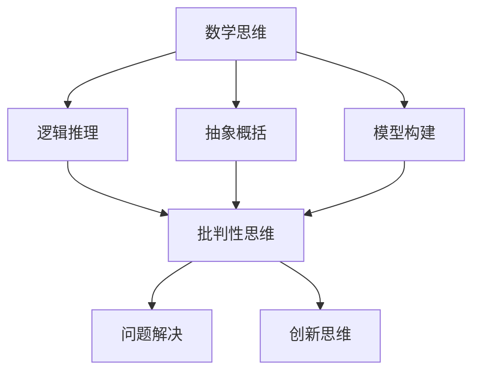

                 

# 文章标题

《数学思维与批判性思维的培养》

## 关键词

数学思维、批判性思维、教育、编程、算法、人工智能

## 摘要

本文探讨了数学思维和批判性思维的重要性及其在教育中的培养。通过分析数学思维的基本概念、问题解决策略，以及批判性思维的要素和方法，文章揭示了这两种思维方式的内在联系和相互促进的关系。通过实例和案例，本文展示了如何通过实际训练来培养这两种思维能力，并提出了具体的培养策略。最后，文章总结了数学思维与批判性思维对个人成长和社会进步的重要意义，并对未来教育提出了一些启示。

---

## 引言

### 1.1 数学思维的重要性

数学思维是一种通过逻辑推理和抽象概括来处理问题的思维方式。它不仅包括对数学概念的理解和应用，还涉及到对数学问题的分析和解决。数学思维的重要性在于它培养了我们精确、严谨、系统性思考的能力。这种能力不仅在数学领域具有显著作用，也在其他学科和实际生活中发挥了重要作用。

在计算机科学领域，数学思维尤为关键。算法设计和编程需要数学作为基础工具，而数学思维的培养能够帮助开发者更加高效地解决问题，优化算法性能。例如，在开发人工智能算法时，对概率论和统计学的基本理解是不可或缺的。此外，数学思维还能促进跨学科的合作，例如在生物信息学和神经科学等领域，数学模型的应用使得复杂问题的研究和解决成为可能。

### 1.2 批判性思维的概念

批判性思维是一种基于证据和理性分析来评价信息的思维方式。它要求我们不仅接受信息，还要质疑、分析和评估信息的来源、逻辑和可靠性。批判性思维的核心在于培养独立性、判断力和开放性。

批判性思维在个人成长中的重要性不可忽视。它帮助我们避免盲目接受信息，提高自我意识和认知能力。在学术界，批判性思维是学术研究的基石，它促进了知识的创新和发展。在职业发展中，批判性思维有助于我们做出更加明智的决策，提高解决问题的能力。

### 1.3 本书的目的和结构

本书旨在探讨数学思维和批判性思维的教育和培养，旨在为读者提供全面、系统的理解和应用方法。本书的结构如下：

- **第1章**：介绍数学思维和批判性思维的基本概念、重要性及其在教育中的意义。
- **第2章**：讨论数学思维的基础，包括数学概念的理解、问题解决策略等。
- **第3章**：探讨批判性思维的培养，包括其定义、要素和方法。
- **第4章**：分析数学思维与批判性思维的关系及其相互影响。
- **第5章**和**第6章**：通过具体案例展示如何培养数学思维和批判性思维。
- **第7章**：提出数学思维和批判性思维的培养策略，包括教育体系中的具体实践。
- **第8章**：总结全文，强调数学思维和批判性思维对个人和社会的重要性，并展望未来教育。

通过这本书，我们希望读者能够理解并掌握数学思维和批判性思维，为未来的学习和职业发展打下坚实的基础。

### 第1章 数学思维与批判性思维概述

### 1.1 数学思维的概念与特征

数学思维是一种通过逻辑推理和抽象概括来处理问题的思维方式。它不仅仅局限于数学学科本身，而是渗透到了我们生活的各个方面。数学思维的特征主要体现在以下几个方面：

首先，数学思维强调精确和严谨。在数学中，每一个概念、每一个定理都是通过严密的逻辑推理和证明得出的。这种精确性和严谨性要求我们在解决问题时必须遵循逻辑规则，确保每一步都是正确无误的。这种思维方式在编程和算法设计中尤为重要，因为错误的逻辑可能会导致算法的崩溃或不可预料的错误。

其次，数学思维强调抽象和概括。数学概念和理论往往是对现实世界的抽象和简化，通过这种抽象和概括，我们能够抓住事物的本质，忽略非本质的细节。例如，微积分中的极限概念就是对变化率的抽象，它帮助我们理解和描述现实世界中各种连续变化的过程。

第三，数学思维强调模型构建和问题解决。数学的一个基本任务是建立模型来描述现实世界中的现象和问题。通过模型，我们能够将复杂的问题转化为数学问题，然后运用数学工具和方法进行求解。这种模型构建和问题解决的能力在计算机科学和人工智能领域有着广泛的应用。

### 1.2 批判性思维的概念与特征

批判性思维是一种基于证据和理性分析来评价信息的思维方式。它不仅仅停留在表面，而是深入挖掘信息的内涵和逻辑关系。批判性思维的特征主要包括以下几个方面：

首先，批判性思维强调质疑和反思。在批判性思维中，我们不仅要接受信息，还要质疑信息的来源、逻辑和可靠性。这种质疑精神能够帮助我们识别错误、避免误解，从而做出更加准确的判断。

其次，批判性思维强调分析性和系统性。在批判性思维过程中，我们需要对信息进行深入分析，识别其中的逻辑关系和内在矛盾。同时，我们还需要将问题放在一个更广阔的背景中，进行系统性思考，以便从多个角度理解和解决问题。

第三，批判性思维强调开放性和包容性。在批判性思维中，我们不仅要接受不同的观点和意见，还要尊重他人的观点和意见。这种开放性和包容性能够促进思想的碰撞和交流，从而产生新的观点和见解。

### 1.3 数学思维与批判性思维的关系

数学思维和批判性思维虽然各有侧重，但它们之间存在着密切的联系和相互作用。首先，数学思维为批判性思维提供了坚实的理论基础和工具。例如，数学中的逻辑推理和证明方法可以用于批判性思维中的分析论证，帮助我们更好地识别和解决逻辑问题。

其次，批判性思维能够提升数学思维的质量和效果。通过批判性思维，我们能够更加深入地理解数学概念和理论，发现其中的问题和不足，从而推动数学的发展和进步。

最后，数学思维和批判性思维的协同作用能够培养我们的综合思维能力。在处理复杂问题时，我们既需要运用数学思维进行模型构建和问题求解，又需要运用批判性思维进行分析和评估，以确保我们的解决方案是正确、有效和可靠的。

### 第2章 数学思维基础

### 2.1 数学概念的理解

#### 2.1.1 数的概念

数是数学中最基本的概念之一，其重要性不可忽视。数可以用来表示和描述现实世界中的各种量，如物体的个数、长度、面积、体积等。数的概念经历了漫长的发展过程，从自然数到整数，再到有理数和无理数，每一个阶段都为我们理解和应用数提供了更丰富的工具。

自然数是最简单的数，用来表示物体的个数，如1、2、3等。自然数的概念直接对应于我们的日常经验，是我们理解和学习数学的基础。

整数是包括自然数、0和负整数的集合。整数的引入使得我们能够处理更复杂的数学问题，例如债务、温度等概念。

有理数是可以表示为两个整数之比的数，包括整数和分数。有理数可以表示为小数，可以是有限小数或无限循环小数。

无理数是不能表示为两个整数之比的数，如π（圆周率）和√2（根号2）。无理数的存在扩展了我们的数学世界，使得数学更加丰富和完整。

#### 2.1.2 几何图形的认识

几何图形是数学中的另一个重要概念，它们在现实世界中有着广泛的应用。几何图形分为平面几何和立体几何。

平面几何主要研究二维空间中的图形，包括点、线、圆、多边形等。例如，三角形是平面几何中最基本的图形之一，它的边和角的关系、面积和周长的计算在数学和工程领域有着广泛的应用。

立体几何主要研究三维空间中的图形，包括立方体、球体、圆锥体等。立体几何中的体积和表面积的计算在建筑、工程和物理学等领域有着重要的应用。

#### 2.1.3 代数思想的应用

代数思想是数学中的核心概念之一，它通过符号和公式来表示和解决问题。代数思想的应用包括代数式、方程、不等式等。

代数式是由数字、字母和运算符号组成的表达式，它可以表示数学中的各种关系和运算。代数式在解决实际问题时非常有用，例如，在物理学中，我们可以用代数式来表示物体的运动轨迹。

方程是表示两个代数式相等的数学表达式，求解方程是代数中的一个重要任务。方程的解可以用来解决各种实际问题，如求解物体运动的轨迹、求解资源分配问题等。

不等式是表示两个代数式大小关系的数学表达式，不等式在优化问题和决策分析中有着广泛的应用。例如，在经济学中，我们可以用不等式来表示生产成本和收益之间的关系，以便做出最优决策。

### 2.2 数学问题解决策略

数学问题的解决不仅仅是依靠记忆和计算，更需要策略和方法的指导。以下是一些常用的数学问题解决策略：

#### 2.2.1 分析与综合

分析与综合是数学问题解决中常用的方法。分析是指将复杂问题分解为简单部分，然后分别解决每个部分。综合则是将各个部分的解组合起来，得到整个问题的解。

例如，在解决一个复杂的几何问题时，我们可以先分析每个几何图形的性质和关系，然后综合这些分析结果，得到整个问题的解。

#### 2.2.2 模型构建与假设

模型构建与假设是数学问题解决中的重要策略。通过构建数学模型，我们可以将复杂问题转化为数学问题，然后运用数学方法进行求解。

假设是模型构建的基础。在建立模型时，我们需要对问题中的变量和关系做出合理的假设。这些假设有助于我们简化问题，使其更加容易处理。

#### 2.2.3 解决问题的步骤

解决数学问题通常需要以下步骤：

1. **理解问题**：首先要理解问题的背景和要求，明确需要求解的目标。
2. **分析问题**：分析问题的结构和特点，识别关键变量和关系。
3. **构建模型**：根据问题的特点，建立合适的数学模型。
4. **求解模型**：运用数学方法求解模型，得到问题的解。
5. **验证解**：验证解是否符合问题的要求，确保解的正确性和有效性。

通过这些步骤，我们可以系统地解决数学问题，提高解决问题的效率和质量。

### 第3章 批判性思维的培养

### 3.1 批判性思维的定义

批判性思维（Critical Thinking）是一种通过理性分析和评估信息来形成合理判断和决策的思维方式。它不仅包括对信息的接收和理解，更重要的是对信息的质疑、分析和评价。批判性思维的核心在于培养独立性和判断力，使我们能够更全面、深入地认识问题，从而做出更明智的决策。

批判性思维不仅仅是一种技能，更是一种态度。它要求我们在面对信息时保持开放和质疑的态度，不断追问“为什么”、“如何”和“是否正确”。这种思维方式不仅有助于我们识别和纠正错误，还能激发我们的创造力和创新能力。

### 3.2 批判性思维的要素

批判性思维包含多个要素，其中最重要的包括分析、评价、推理和论证。

#### 3.2.1 分析与评价

分析是批判性思维的基础，它要求我们能够将复杂的信息分解为更简单、更易于理解的组成部分，以便更好地理解和评估。评价则是对这些分解后的信息进行判断和评估，识别其价值和可信度。

在进行分析时，我们需要注意以下几个方面：

1. **识别假设**：任何论证都基于一系列假设，识别这些假设有助于我们更好地理解论证的合理性。
2. **区分事实与观点**：事实是可以通过证据证明的，而观点是基于个人信念或主观判断的。区分二者有助于我们更准确地评估信息。
3. **识别偏见和逻辑谬误**：偏见和逻辑谬误会影响我们的判断，因此识别并纠正这些错误是批判性思维的重要任务。

#### 3.2.2 推理与论证

推理（Reasoning）是批判性思维的核心，它包括归纳推理和演绎推理两种形式。

归纳推理是从特定的实例中推导出一般性的结论。例如，通过观察多个苹果都是红色的，我们得出所有苹果都是红色的结论。归纳推理在科学研究和数据分析中有着广泛的应用。

演绎推理则是从一般性的前提推导出具体的结论。例如，如果所有人类都会死亡，而苏格拉底是人类，那么苏格拉底也会死亡。演绎推理在逻辑证明和数学证明中发挥着重要作用。

论证（Argument）是推理的应用，它通过逻辑关系将前提和结论联系起来。有效的论证不仅需要逻辑上的一致性，还需要有充分的证据支持。

在构建论证时，我们需要注意以下几个方面：

1. **明确前提和结论**：确保论证的每一个步骤都是清晰、明确的。
2. **逻辑连贯性**：论证中的每一步都应该是逻辑上连贯的，不能有跳跃或模糊的地方。
3. **证据支持**：论证的结论需要有充分的证据支持，这些证据应该是可靠和相关的。

#### 3.2.3 演绎与归纳

演绎（Deductive）与归纳（Inductive）是批判性思维中的两种重要推理方式。

演绎推理是从一般到特殊的推理过程。它通过一系列逻辑步骤，从一般性的前提推导出具体的结论。演绎推理的优点是逻辑上的一致性，但缺点是前提的真实性必须得到保证。

归纳推理则是从特殊到一般的推理过程。它通过观察多个具体的实例，推导出一般性的结论。归纳推理的优点是能够发现新的规律和模式，但缺点是结论的不确定性较大。

在实际应用中，演绎和归纳推理往往结合使用。例如，在科学研究过程中，我们首先通过归纳推理发现一些现象和规律，然后通过演绎推理验证这些规律的正确性。

### 3.3 批判性思维的方法

培养批判性思维需要系统的训练和实践。以下是一些常用的批判性思维方法：

#### 3.3.1 反驳与质疑

反驳（Refutation）和质疑（Skepticism）是批判性思维的重要组成部分。通过反驳，我们能够识别和纠正错误观点和论证；通过质疑，我们能够保持对信息的批判性态度，避免盲目接受。

在反驳时，我们需要注意以下几个方面：

1. **识别反驳点**：找出论证中的逻辑漏洞和错误观点。
2. **构建反驳论证**：使用逻辑推理和证据来反驳错误观点。
3. **避免过度反驳**：确保反驳是基于事实和逻辑，而不是基于个人情感或偏见。

在质疑时，我们需要保持开放和怀疑的态度，不断追问“为什么”和“是否有其他解释”。

#### 3.3.2 理解与澄清

理解（Comprehension）和澄清（Clarification）是批判性思维的另一个重要方面。理解要求我们能够准确把握信息的内涵和外延，而澄清则是通过提问和讨论来消除歧义和不确定性。

在理解时，我们需要注意以下几个方面：

1. **获取背景信息**：了解信息的来源、背景和上下文。
2. **识别关键概念**：准确理解关键概念的含义和关系。
3. **避免误解**：确保对信息的理解是准确和全面的。

在澄清时，我们可以通过提问和讨论来消除模糊和不确定性，确保信息的传达是清晰和准确的。

#### 3.3.3 评估与反思

评估（Evaluation）和反思（Reflection）是批判性思维的最终步骤。评估要求我们基于证据和逻辑分析对信息进行判断和决策；反思则是通过回顾和总结，提高自己的思维能力和决策水平。

在评估时，我们需要注意以下几个方面：

1. **评估论证的有效性**：确保论证的逻辑一致性和证据的可靠性。
2. **评估结论的合理性**：基于评估结果，判断结论是否合理和可行。
3. **评估决策的后果**：考虑决策可能带来的短期和长期后果。

在反思时，我们可以通过以下步骤来提高自己的批判性思维能力：

1. **回顾思考过程**：总结自己的思考过程，识别其中的优点和不足。
2. **反思思维习惯**：分析自己的思维习惯，识别可能存在的偏见和缺陷。
3. **持续学习和改进**：通过不断学习和实践，提高自己的批判性思维能力。

通过这些方法和步骤，我们可以有效地培养批判性思维，提高自己的判断力和决策能力。

### 第4章 数学思维与批判性思维的关系

数学思维与批判性思维之间存在着紧密的联系和相互促进作用。两者不仅在概念和特征上相互影响，还在实际应用中相互补充，共同推动个体思维能力和解决问题的能力的发展。

#### 4.1 数学思维对批判性思维的影响

数学思维培养的逻辑推理和抽象能力对批判性思维有着重要的影响。首先，数学思维强调精确和严谨，这要求我们在处理信息时必须遵循逻辑规则，确保每一步都是正确无误的。这种严谨性培养了我们在分析问题时保持批判性态度的能力，使我们能够更加细致地分析信息的各个方面。

其次，数学中的模型构建和问题解决方法为批判性思维提供了有力的工具。在数学问题解决过程中，我们常常需要构建模型，并通过假设和推理来解决问题。这种能力不仅能够帮助我们更好地理解复杂问题，还能在批判性思维中用于构建和分析论证。例如，在评价一个观点时，我们可以构建一个简化的模型，通过逻辑推理来评估其合理性。

此外，数学中的符号和公式也为我们提供了清晰、简洁的表达工具。在批判性思维中，准确和简洁的表达对于有效沟通和论证至关重要。数学中的符号和公式使得我们的表达更加直观和精确，从而提高了批判性思维的质量。

#### 4.2 批判性思维在数学中的应用

批判性思维在数学中的应用同样重要。首先，批判性思维能够帮助我们更好地理解和掌握数学概念。在数学学习中，我们经常需要理解复杂的定义和定理。通过批判性思维，我们可以质疑这些定义和定理的合理性，深入理解其背后的逻辑和数学原理。例如，在学习微积分时，通过批判性思维，我们可以理解微积分中的极限概念是如何从实际问题和直观感知中抽象出来的。

其次，批判性思维能够提高我们在数学问题解决中的能力。在解决数学问题时，我们不仅需要运用数学方法，还需要对问题进行分析和评估。通过批判性思维，我们可以识别问题中的关键变量和关系，评估不同解决方案的优缺点，从而做出更明智的选择。例如，在解决一个优化问题时，我们可以通过批判性思维来分析不同的优化算法，评估其复杂度和适用性，选择最优的解决方案。

此外，批判性思维还能帮助我们避免在数学学习中的误区和错误。在数学中，许多问题都有多种解法，而通过批判性思维，我们可以识别和纠正错误解法，确保我们的答案是正确和有效的。例如，在解一个代数方程时，通过批判性思维，我们可以检查我们的解是否符合原始方程，从而避免错误解的发生。

#### 4.3 数学思维与批判性思维的协同作用

数学思维和批判性思维之间的协同作用能够显著提高我们的综合思维能力。在实际应用中，数学思维和批判性思维往往结合在一起，共同推动问题的解决。

例如，在科学研究过程中，数学思维用于构建模型和进行计算，而批判性思维则用于评估模型的有效性和解决方案的可行性。通过数学思维和批判性思维的协同作用，我们能够更加全面和深入地理解和解决问题，提高研究的质量和效率。

在软件开发中，数学思维用于算法设计和性能优化，而批判性思维则用于评估代码的复杂度和可靠性。通过数学思维和批判性思维的协同作用，我们能够编写出高效、可靠的软件，提高开发质量和用户体验。

总之，数学思维和批判性思维不仅相互补充，还共同推动我们的综合思维能力的发展。通过培养这两种思维方式，我们能够更好地应对复杂的问题和挑战，提高个人和集体的智慧和创新能力。

### 第5章 数学思维训练案例

#### 5.1 基本数学问题的分析

为了更好地理解数学思维的应用，我们可以通过一些基本数学问题的分析来探讨其解决方法。以下是一些常见的数学问题及其分析过程：

##### 5.1.1 代数问题分析

**问题示例**：解方程 \(2x + 5 = 13\)。

**分析过程**：

1. **理解问题**：首先，我们需要理解方程的含义，即找出一个数 \(x\)，使得 \(2x + 5\) 的结果等于 13。
2. **移项**：为了求解 \(x\)，我们需要将方程中的常数项移到等号的另一边。具体步骤为：
   \[
   2x = 13 - 5
   \]
3. **简化**：将右边的常数相减，得到：
   \[
   2x = 8
   \]
4. **求解**：最后，我们将方程两边都除以 2，得到：
   \[
   x = \frac{8}{2} = 4
   \]

**答案**：\(x = 4\)。

通过这个例子，我们可以看到，解决代数问题的基本步骤包括理解问题、移项、简化和求解。这个过程体现了数学思维的逻辑性和系统性。

##### 5.1.2 几何问题分析

**问题示例**：计算一个三角形的面积，其中底边长为 8，高为 6。

**分析过程**：

1. **理解问题**：我们需要计算一个三角形的面积，已知其底边长和高。
2. **应用公式**：三角形的面积公式为 \(A = \frac{1}{2} \times \text{底边长} \times \text{高}\)。
3. **代入数值**：将已知的底边长和高代入公式，得到：
   \[
   A = \frac{1}{2} \times 8 \times 6
   \]
4. **计算结果**：进行计算，得到：
   \[
   A = \frac{1}{2} \times 48 = 24
   \]

**答案**：三角形的面积为 24 平方单位。

这个例子展示了如何运用几何公式来解决实际问题。几何问题分析的关键在于正确理解问题，并选择合适的公式进行计算。

##### 5.1.3 概率问题分析

**问题示例**：在一个装有 5 个红球和 3 个蓝球的袋子中，随机取出一个球，求取出红球的概率。

**分析过程**：

1. **理解问题**：我们需要计算从袋子中随机取出一个红球的概率。
2. **计算总数**：袋子中共有 5 + 3 = 8 个球。
3. **计算概率**：取出红球的概率等于红球的数量除以总球数，即：
   \[
   P(\text{红球}) = \frac{5}{8}
   \]

**答案**：取出红球的概率为 \(\frac{5}{8}\)。

概率问题的解决过程包括理解问题、计算总数和概率。通过这些步骤，我们可以准确地评估随机事件的可能性。

#### 5.2 高级数学问题的思考

除了基本数学问题，高级数学问题也需要运用数学思维进行深入思考。以下是一些高级数学问题的示例：

##### 5.2.1 微积分问题思考

**问题示例**：求函数 \(f(x) = x^2\) 在点 \(x = 2\) 处的导数。

**分析过程**：

1. **理解问题**：我们需要计算函数 \(f(x) = x^2\) 在 \(x = 2\) 处的导数，这表示函数在该点的变化率。
2. **应用导数公式**：根据导数的基本定义，函数 \(f(x)\) 在 \(x = a\) 处的导数可以通过以下极限计算：
   \[
   f'(a) = \lim_{h \to 0} \frac{f(a + h) - f(a)}{h}
   \]
3. **代入数值**：将 \(f(x) = x^2\) 和 \(a = 2\) 代入上述公式，得到：
   \[
   f'(2) = \lim_{h \to 0} \frac{(2 + h)^2 - 2^2}{h}
   \]
4. **计算结果**：展开并简化上述极限表达式，得到：
   \[
   f'(2) = \lim_{h \to 0} \frac{4 + 4h + h^2 - 4}{h} = \lim_{h \to 0} \frac{4h + h^2}{h} = \lim_{h \to 0} (4 + h) = 4
   \]

**答案**：函数 \(f(x) = x^2\) 在 \(x = 2\) 处的导数为 4。

这个例子展示了如何运用微积分知识来解决具体问题。通过极限和导数公式，我们可以准确计算函数的变化率。

##### 5.2.2 线性代数问题思考

**问题示例**：求解线性方程组：
   \[
   \begin{cases}
   2x + 3y = 8 \\
   4x - y = 2
   \end{cases}
   \]

**分析过程**：

1. **理解问题**：我们需要解这个由两个线性方程组成的方程组。
2. **消元法**：为了解这个方程组，我们可以使用消元法。首先，将第一个方程乘以 4，第二个方程乘以 3，得到：
   \[
   \begin{cases}
   8x + 12y = 32 \\
   12x - 3y = 6
   \end{cases}
   \]
3. **相加消元**：将两个方程相加，消去 \(y\) 的项，得到：
   \[
   20x = 38
   \]
4. **求解 \(x\)**：将上式两边同时除以 20，得到：
   \[
   x = \frac{38}{20} = \frac{19}{10}
   \]
5. **代入求解 \(y\)**：将 \(x = \frac{19}{10}\) 代入任意一个原始方程，例如第一个方程，得到：
   \[
   2 \left(\frac{19}{10}\right) + 3y = 8
   \]
   \[
   \frac{38}{10} + 3y = 8
   \]
   \[
   3y = 8 - \frac{38}{10}
   \]
   \[
   3y = \frac{80}{10} - \frac{38}{10}
   \]
   \[
   3y = \frac{42}{10}
   \]
   \[
   y = \frac{42}{30} = \frac{14}{10} = \frac{7}{5}
   \]

**答案**：方程组的解为 \(x = \frac{19}{10}\)，\(y = \frac{7}{5}\)。

这个例子展示了如何运用线性代数中的消元法来解决线性方程组。通过逐步消元和代入，我们可以求得方程组的解。

##### 5.2.3 拓扑学问题思考

**问题示例**：证明欧拉公式在简单多面体上成立，即 \(V - E + F = 2\)，其中 \(V\) 是顶点数，\(E\) 是边数，\(F\) 是面数。

**分析过程**：

1. **理解问题**：我们需要证明在简单多面体上，顶点数 \(V\)、边数 \(E\) 和面数 \(F\) 之间的关系满足欧拉公式。
2. **选择模型**：我们可以选择一个简单的多面体，如正方体，来验证欧拉公式。
3. **计算顶点数、边数和面数**：正方体有 8 个顶点（\(V = 8\)）、12 条边（\(E = 12\)）和 6 个面（\(F = 6\)）。
4. **代入欧拉公式**：将计算得到的 \(V\)、\(E\) 和 \(F\) 代入欧拉公式，得到：
   \[
   V - E + F = 8 - 12 + 6 = 2
   \]
5. **结论**：通过验证，我们可以看到欧拉公式在正方体上成立。

这个例子展示了如何运用拓扑学的知识来证明欧拉公式的正确性。通过具体实例的计算和验证，我们可以理解欧拉公式的意义和应用。

通过这些基本和高级数学问题的分析，我们可以看到数学思维在解决实际问题时的重要性和应用价值。数学思维不仅要求逻辑推理和抽象能力，还需要灵活运用各种数学工具和方法。通过不断训练和实践，我们可以提高数学思维能力，更好地应对复杂的问题和挑战。

### 第6章 批判性思维训练案例

#### 6.1 批判性阅读案例

批判性阅读是一种通过深入分析和评估文本内容来理解信息的方法。以下是一些批判性阅读的案例，展示如何通过提问和评估来提升批判性思维能力。

##### 6.1.1 论文批判性阅读

**案例**：阅读一篇关于气候变化影响的研究论文。

**步骤**：

1. **理解目的**：首先，明确论文的研究目的，例如研究气候变化的长期影响。
2. **识别假设**：识别论文中的假设，例如全球变暖是由于人类活动引起的。
3. **分析数据**：评估论文中使用的数据和统计方法，例如数据的来源、样本大小和数据处理的合理性。
4. **评价结论**：评估论文的结论是否合理，例如结论是否与假设和数据一致，是否有足够的证据支持。
5. **提出问题**：提出可能的反驳点，例如是否存在其他因素影响气候变化，或者数据是否有偏差。

**示例**：

假设论文的结论是“全球变暖的长期影响将导致海平面上升，对沿海城市构成严重威胁”。

- **识别假设**：论文假设全球变暖是导致海平面上升的主要原因。
- **分析数据**：论文使用的是过去50年的卫星数据，分析显示海平面每年上升3.2毫米。
- **评价结论**：结论是否合理，是否有其他因素（如地质活动、冰川融化速率的变化）未被考虑。
- **提出问题**：是否有证据表明人类活动是海平面上升的主要原因，或者是否有其他解释（如地球自转速度变化）未被探讨。

通过这样的批判性阅读，我们可以更全面、深入地理解论文内容，并评估其科学性和可靠性。

##### 6.1.2 文章批判性阅读

**案例**：阅读一篇关于健康饮食的文章。

**步骤**：

1. **理解观点**：首先，明确文章的主要观点，例如推荐每天摄入多少蔬果。
2. **识别证据**：评估文章中提供证据的支持力度，例如引用了多少研究，是否是权威来源。
3. **分析逻辑**：评估文章中的论证是否合理，是否存在逻辑谬误。
4. **评估偏见**：识别文章中的潜在偏见，例如是否有特定的利益相关方在推动这一观点。
5. **提出改进建议**：基于批判性阅读的结果，提出可能的改进措施。

**示例**：

假设文章的观点是“每天食用五份蔬果对健康有益”。

- **理解观点**：文章的主要观点是摄入大量蔬果有助于健康。
- **识别证据**：文章引用了三项研究，其中包括两项是随机对照试验。
- **分析逻辑**：文章使用了因果推理，但未详细讨论可能的其他健康因素。
- **评估偏见**：文章未提及可能的负面效果，例如过量摄入水果可能导致的糖分摄入增加。
- **提出改进建议**：建议文章提供更多关于长期健康影响的数据，讨论可能的负面效果，并引用更多多样化的研究。

通过批判性阅读，我们可以更好地理解文章内容，识别潜在的问题，并提出改进建议，从而提高阅读质量。

##### 6.1.3 小组讨论与批判性思维

**案例**：在小组讨论中评估一项新技术的可行性。

**步骤**：

1. **设定目标**：明确讨论的目标，例如评估一项新技术的市场前景。
2. **分工合作**：每个小组成员负责不同方面的分析，例如市场调研、技术评估、成本分析。
3. **信息交流**：分享各自的分析结果，进行批判性讨论。
4. **评估论证**：评估每个论点的逻辑性和证据支持，识别可能的偏见和逻辑谬误。
5. **达成共识**：通过讨论和评估，达成关于技术可行性的一致结论。

**示例**：

假设小组讨论的主题是评估“智能温室技术”的市场前景。

- **设定目标**：明确目标是评估智能温室技术是否具有市场潜力。
- **分工合作**：市场调研组负责分析市场需求和竞争情况，技术评估组负责评估技术的可行性和创新性，成本分析组负责计算投资成本和收益。
- **信息交流**：分享各自的分析结果，例如市场调研组发现智能温室技术在农业领域有广泛应用潜力。
- **评估论证**：讨论中评估每个论点的逻辑性和证据支持，例如讨论智能温室技术是否真的能够显著提高农作物产量。
- **达成共识**：通过讨论，小组达成共识，认为智能温室技术具有市场前景，但需要进一步的技术优化和成本控制。

通过小组讨论和批判性思维，我们可以更全面、客观地评估一个项目的可行性，减少决策风险。

#### 6.2 批判性写作案例

批判性写作是一种通过深入分析和评估信息来构建有说服力的论点的方法。以下是一些批判性写作的案例，展示如何通过论证和评估来提高批判性思维能力。

##### 6.2.1 论文写作与批判性思维

**案例**：撰写一篇关于在线教育优缺点的论文。

**步骤**：

1. **确定论题**：明确论文的主题，例如在线教育的优缺点。
2. **收集证据**：收集相关的数据、研究、实例等证据，支持论文的论点。
3. **构建论证**：根据证据构建逻辑严密的论证，例如通过正反两方面的证据来平衡论述。
4. **评估反驳**：预测可能的反驳观点，并提前进行反驳，增强论证的力度。
5. **修订和完善**：根据批判性反馈，修订论文内容，确保论点的合理性和说服力。

**示例**：

假设论文的论点是“在线教育有其独特的优势和劣势”。

- **确定论题**：明确主题是分析在线教育的优缺点。
- **收集证据**：收集数据，例如在线教育的普及率、学生满意度和就业率等。
- **构建论证**：论述在线教育的优势，如灵活性和便捷性，以及劣势，如学习效果的不一致和师生互动的不足。
- **评估反驳**：预测可能的反驳观点，如技术设备的不普及，并提前进行反驳，例如指出在线教育平台的辅助设备和资源。
- **修订和完善**：根据导师和同学的建议，修订论文内容，增强论证的逻辑性和说服力。

通过批判性写作，我们可以更深入地分析问题，构建有说服力的论点，提高写作质量和学术水平。

##### 6.2.2 论证写作与批判性思维

**案例**：撰写一篇关于气候变化政策的论证文章。

**步骤**：

1. **确定立场**：明确文章的立场，例如支持或反对特定的气候变化政策。
2. **构建论据**：收集相关的论据，如科学数据、专家观点、实例等，支持文章的立场。
3. **分析反对观点**：识别并分析可能的反对观点，构建反驳论据。
4. **论证逻辑**：确保论证逻辑清晰，每一步论证都基于充分的证据。
5. **结论强化**：通过总结和强化结论，使文章的观点更加有力。

**示例**：

假设文章的立场是“支持实施更严格的气候变化政策”。

- **确定立场**：明确立场是支持更严格的气候变化政策。
- **构建论据**：收集科学数据，如全球变暖的趋势、极端天气事件的频率增加等。
- **分析反对观点**：分析可能的反对观点，如政策成本高、经济负担重等，并构建反驳论据，例如指出长期的环保投入将带来更大的经济和社会效益。
- **论证逻辑**：确保每一步论证都基于充分的证据，逻辑严密。
- **结论强化**：通过总结和强化结论，强调实施严格气候变化政策的必要性和紧迫性。

通过论证写作，我们可以更系统地分析和解决问题，提高论点的合理性和说服力。

##### 6.2.3 书评写作与批判性思维

**案例**：撰写一篇书评，评价《人工智能的未来》。

**步骤**：

1. **选择书籍**：选择一本有关人工智能的书籍，例如《人工智能的未来》。
2. **阅读书籍**：认真阅读书籍，理解书中的主要观点和论证。
3. **分析内容**：分析书籍的优点和不足，例如论点的清晰度、证据的充分性、写作风格等。
4. **评价作者**：评价作者的学术背景、研究方法和专业知识。
5. **总结和推荐**：总结书评的观点，并提供阅读建议。

**示例**：

假设书评的对象是《人工智能的未来》。

- **选择书籍**：选择《人工智能的未来》作为书评对象。
- **阅读书籍**：阅读全书，了解作者对人工智能的预测和观点。
- **分析内容**：分析书籍的优点，如对当前人工智能发展趋势的全面总结，缺点，如对某些技术细节的讨论过于简略。
- **评价作者**：评价作者的研究背景和专业知识，例如作者是否具备深厚的计算机科学背景，是否具有前瞻性的思考。
- **总结和推荐**：总结书评的观点，例如认为该书对人工智能的未来有深刻的见解，但读者需要具备一定的技术背景才能更好地理解书中的内容。

通过书评写作，我们可以提高对书籍内容的理解能力，培养批判性思维能力，同时为其他读者提供有价值的阅读建议。

通过这些批判性阅读和写作案例，我们可以看到批判性思维在分析和解决问题的过程中的重要性。批判性思维不仅帮助我们更全面、深入地理解问题，还能提高我们的逻辑推理和论证能力，从而在学术、职业和个人生活中都受益匪浅。

### 第7章 数学思维与批判性思维的培养策略

#### 7.1 教育体系中的数学思维培养

数学思维的培养是一个长期的过程，需要系统的教育和不断的实践。以下从小学、初中和高中三个阶段，探讨教育体系中如何培养数学思维。

##### 7.1.1 小学阶段的数学思维培养

小学阶段是培养数学思维的重要时期，这一阶段的关键在于激发学生对数学的兴趣，培养基本的数学概念和逻辑思维能力。

1. **趣味化教学**：通过有趣的教学活动和游戏，如数独、拼图等，激发学生对数学的兴趣。
2. **动手操作**：利用具体的实物和教具，让学生通过动手操作来理解数学概念，如使用数字卡片进行加减运算。
3. **生活化应用**：将数学知识应用到实际生活中，如计算购物金额、测量房间尺寸等，增强学生的应用能力。
4. **思维导图**：使用思维导图来帮助学生理解数学概念之间的关系，培养系统性和结构性思维。

##### 7.1.2 初中阶段的数学思维培养

初中阶段是数学思维的巩固和提升阶段，这一阶段需要加强数学概念的理解和数学方法的运用。

1. **系统化学习**：通过系统的数学课程，深入理解数学概念和定理，掌握基本的数学方法。
2. **问题解决**：通过解决实际问题，如数学竞赛题、项目作业等，锻炼学生的逻辑推理和问题解决能力。
3. **逻辑推理**：培养学生的逻辑推理能力，通过逻辑游戏、论证练习等，提高学生的逻辑思维水平。
4. **跨学科应用**：将数学知识应用到其他学科中，如物理、化学等，培养学生的跨学科思维能力。

##### 7.1.3 高中阶段的数学思维培养

高中阶段是数学思维的成熟和应用的阶段，这一阶段需要培养学生的创新能力和综合应用能力。

1. **高级数学知识**：学习高级数学知识，如微积分、线性代数等，加深对数学概念和理论的理解。
2. **创新性研究**：鼓励学生参与数学课题研究，如数学建模、数学竞赛等，培养学生的创新能力。
3. **实践应用**：通过数学实验、数学建模等实践活动，将数学知识应用到实际问题中，提高学生的综合应用能力。
4. **批判性思维**：在数学学习中融入批判性思维训练，通过质疑和评估数学问题，提高学生的批判性思维能力。

#### 7.2 教育体系中的批判性思维培养

批判性思维的培养是一个全面而系统的过程，需要教育体系的各个环节共同努力。

##### 7.2.1 小学阶段的批判性思维培养

小学阶段是培养批判性思维的基础，这一阶段的关键在于激发学生的好奇心和探索精神。

1. **开放式提问**：鼓励学生提问，对问题进行深入探讨，培养他们的思考能力。
2. **讨论与交流**：通过小组讨论和课堂交流，让学生表达自己的观点，倾听他人的意见，培养合作和沟通能力。
3. **故事性教学**：通过讲故事的形式，让学生理解批判性思维的重要性，培养他们的批判性思维意识。
4. **观察与发现**：引导学生观察生活中的现象，发现问题并进行分析，培养他们的观察力和分析能力。

##### 7.2.2 初中阶段的批判性思维培养

初中阶段是批判性思维发展的关键时期，这一阶段需要培养学生的独立思考和批判性分析能力。

1. **论证训练**：通过论证练习，如辩论赛、论证写作等，提高学生的逻辑推理和论证能力。
2. **案例研究**：通过案例分析，让学生理解批判性思维的应用，培养他们的分析能力。
3. **跨学科学习**：通过跨学科的学习，如社会研究、科学探究等，培养学生在不同领域中的批判性思维。
4. **质疑与反思**：鼓励学生对所学知识进行质疑和反思，培养他们的批判性思维习惯。

##### 7.2.3 高中阶段的批判性思维培养

高中阶段是批判性思维成熟的阶段，这一阶段需要培养学生的独立性和批判性思维能力。

1. **学术写作**：通过学术写作，如论文写作、评论写作等，提高学生的逻辑表达和论证能力。
2. **批判性阅读**：通过批判性阅读，如阅读学术文章、分析案例等，提高学生的信息分析和评估能力。
3. **实践应用**：通过实践活动，如科学实验、社会调查等，培养学生在实际情境中的批判性思维能力。
4. **综合素养**：通过跨学科学习和综合素质教育，培养学生在多领域中的批判性思维。

#### 7.3 数学思维与批判性思维的整合

数学思维和批判性思维的整合是培养全面思维能力的关键。以下是一些建议：

1. **跨学科融合**：将数学思维和批判性思维融入到其他学科的学习中，如科学、社会研究、文学等，培养学生的综合思维能力。
2. **项目学习**：通过项目学习，让学生在解决实际问题的过程中运用数学思维和批判性思维，提高他们的实践能力。
3. **团队合作**：鼓励团队合作，通过小组讨论和合作项目，培养学生的沟通、协作和批判性思维能力。
4. **终身学习**：鼓励学生终身学习，不断更新知识和技能，保持批判性思维的习惯。

通过这些策略，教育体系可以更好地培养学生的数学思维和批判性思维，为他们未来的学习和职业发展奠定坚实的基础。

### 第8章 结论

#### 8.1 数学思维与批判性思维的重要性

数学思维和批判性思维在个人和社会层面都具有极其重要的意义。首先，在个人成长方面，数学思维培养了我们的逻辑推理能力、系统思考能力和精确处理信息的能力。这些能力不仅在学术研究中至关重要，也在日常生活中帮助我们做出明智的决策。批判性思维则培养了我们的判断力、质疑精神和分析能力，使我们能够更全面、深入地理解问题，从而避免盲目接受信息，提高我们的认知水平。

在社会层面，数学思维和批判性思维是创新和进步的重要驱动力。在科学研究中，数学思维帮助我们建立模型、进行预测和验证，推动科学技术的发展。批判性思维则保证了研究的严谨性和可靠性，促进了知识的创新和进步。在职业领域，数学思维和批判性思维是解决复杂问题、优化决策和推动创新的关键。它们使我们在面对不断变化的环境和挑战时能够灵活应对，不断提高工作和生活的质量。

#### 8.2 培养数学思维与批判性思维的方法

培养数学思维和批判性思维需要系统的教育和持续的训练。以下是一些具体的培养方法：

1. **基础教育**：在小学和初中阶段，通过趣味化教学、动手操作和生活化应用，激发学生对数学的兴趣，培养基本的数学概念和逻辑思维能力。

2. **跨学科学习**：在高中和大学阶段，通过跨学科学习和项目学习，将数学思维和批判性思维融入到其他学科中，培养学生的综合应用能力。

3. **逻辑训练**：通过逻辑游戏、论证练习和辩论赛等，提高学生的逻辑推理和论证能力，培养批判性思维。

4. **实践应用**：通过数学实验、科学研究和项目实践，将数学思维和批判性思维应用于实际问题中，提高学生的实践能力和创新意识。

5. **终身学习**：鼓励学生终身学习，不断更新知识和技能，保持批判性思维的习惯。

#### 8.3 对未来教育的启示

未来教育需要更加注重数学思维和批判性思维的培养。以下是一些对未来的教育启示：

1. **教育改革**：推动教育改革，将数学思维和批判性思维融入各学科的教学中，培养学生的综合能力。

2. **个性化教学**：根据学生的兴趣和特点，提供个性化的教学方案，鼓励学生自主学习和探索。

3. **跨学科整合**：加强跨学科教学，培养学生的跨学科思维和综合应用能力。

4. **实践导向**：增加实践性课程和项目，让学生在真实情境中应用数学思维和批判性思维，提高他们的实际操作能力。

5. **终身教育**：建立终身教育体系，鼓励学生在终身学习中保持批判性思维的习惯，不断提高自己的认知水平。

总之，数学思维和批判性思维是未来教育中不可或缺的重要部分。通过系统的培养和实践，我们可以为学生提供更加全面和丰富的教育，培养出具有创新精神和批判性思维的优秀人才，为社会的发展和进步做出贡献。

### 附录

#### 附录 A 数学思维与批判性思维 Mermaid 流程图

以下是一个简化的Mermaid流程图，展示了数学思维和批判性思维之间的关系：



#### 附录 B 批判性思维伪代码示例

以下是一个简单的伪代码示例，展示了如何通过批判性思维分析一个给定的数学问题：

```pseudocode
Procedure AnalyzeProblem(problem)
    Set assumptions = ExtractAssumptions(problem)
    Set data = CollectData(problem)
    Set valid_data = ValidateData(data)
    If valid_data is False
        Print "Data is invalid, need to reconsider assumptions or data collection method."
        Exit Procedure
    End If

    Set hypotheses = GenerateHypotheses(problem)
    Set evidence = CollectEvidence(hypotheses)

    For each hypothesis in hypotheses
        If evidence supports hypothesis
            Print hypothesis + " is valid."
        Else
            Print hypothesis + " is not valid, need further investigation."
        End If
    End For

    Set conclusion = DeriveConclusion(hypotheses, evidence)
    Print "Conclusion: " + conclusion
End Procedure
```

#### 附录 C 数学公式与例子说明

以下是几个常见的数学公式及其解释：

$$
a^2 + b^2 = c^2
$$

这是勾股定理，用于计算直角三角形的斜边长度。

$$
y = mx + b
$$

这是线性方程的一般形式，其中 \(m\) 是斜率，\(b\) 是截距。

$$
\lim_{x \to a} f(x) = L
$$

这是极限的定义，表示当 \(x\) 趋近于 \(a\) 时，函数 \(f(x)\) 的值趋近于 \(L\)。

#### 附录 D 数学思维与批判性思维项目实战案例

**项目名称**：利用数学模型预测股票价格

**项目背景**：股票市场的波动具有不确定性，准确预测股票价格对于投资者来说具有重要意义。本项目旨在通过数学模型和批判性思维来预测股票价格，并提供投资建议。

**开发环境**：Python、Jupyter Notebook、Pandas、NumPy、SciPy、Scikit-learn

**步骤**：

1. **数据收集**：收集历史股票价格数据，包括开盘价、收盘价、最高价、最低价和成交量等。
2. **数据预处理**：清洗数据，处理缺失值和异常值，并进行数据标准化。
3. **特征工程**：提取时间序列特征，如移动平均、波动率等，并选择对股票价格预测有重要影响的特征。
4. **模型选择**：选择适当的预测模型，如ARIMA、LSTM、随机森林等，并评估模型的性能。
5. **模型训练**：使用训练数据对模型进行训练，调整模型参数以优化性能。
6. **模型验证**：使用验证数据集对模型进行验证，确保预测结果的准确性和可靠性。
7. **投资建议**：根据预测结果提供投资建议，如买入、持有或卖出。

**代码解读**：

```python
import pandas as pd
import numpy as np
from sklearn.ensemble import RandomForestRegressor
from sklearn.model_selection import train_test_split
from sklearn.metrics import mean_squared_error

# 数据收集
data = pd.read_csv('stock_data.csv')

# 数据预处理
data.dropna(inplace=True)
data['Close'].fillna(data['Close'].shift(1), inplace=True)

# 特征工程
data['MA20'] = data['Close'].rolling(window=20).mean()
data['Volatility'] = data['Close'].rolling(window=20).std()

# 模型选择
model = RandomForestRegressor(n_estimators=100)

# 模型训练
X = data[['MA20', 'Volatility']]
y = data['Close']
X_train, X_test, y_train, y_test = train_test_split(X, y, test_size=0.2, random_state=42)

model.fit(X_train, y_train)

# 模型验证
y_pred = model.predict(X_test)
mse = mean_squared_error(y_test, y_pred)
print("MSE:", mse)

# 投资建议
if y_pred[-1] > y_test[-1]:
    print("建议：买入股票。")
else:
    print("建议：持有或卖出股票。")
```

**案例分析和详细讲解**：

通过这个项目，我们可以看到如何将数学思维和批判性思维应用于实际问题的解决中。在数据收集和预处理阶段，我们运用了数学思维中的模型构建和假设方法，通过清洗和处理数据，为后续的预测模型提供了可靠的基础。在特征工程阶段，我们通过提取时间序列特征，利用了数学中对时间序列数据的理解和处理方法。

在模型选择和训练阶段，我们运用了批判性思维中的分析能力和评估方法，评估了不同模型的性能，并选择了最优模型进行训练。在模型验证阶段，我们通过验证数据集来评估模型的预测准确性，确保了模型的可靠性。

最后，在投资建议阶段，我们通过批判性思维中的推理和论证方法，根据预测结果提供了具体的投资建议。这个项目展示了如何将数学思维和批判性思维应用于实际问题，为投资者提供了有价值的决策支持。

**项目小结**：

通过这个项目，我们不仅掌握了股票价格预测的基本方法，还学会了如何运用数学思维和批判性思维来分析和解决问题。在未来的学习和职业发展中，这种综合思维能力将帮助我们更好地应对复杂的问题和挑战，实现个人和职业的发展目标。

### 最佳实践 tips、小结、注意事项、拓展阅读等内容

#### 最佳实践 tips

1. **基础知识的巩固**：数学思维和批判性思维的培养需要坚实的基础知识。确保你掌握了基本的数学概念和批判性思维方法，这是进一步深入学习的基础。
2. **多角度思考**：在解决问题时，尝试从不同角度思考问题，这有助于你发现新的解决方案。批判性思维的一个重要方面就是多维度分析问题。
3. **持续实践**：数学思维和批判性思维的培养需要持续实践。通过解决实际问题、参与项目和研究，不断提高你的思维能力。

#### 小结

本文通过分析数学思维和批判性思维的基本概念、培养方法和实际应用，揭示了这两种思维方式在个人和社会发展中的重要性。通过具体的案例和实战项目，展示了如何在实际中运用这两种思维方式，提高问题解决能力和创新能力。

#### 注意事项

1. **避免急功近利**：数学思维和批判性思维的培养是一个长期过程，需要耐心和持续的努力。避免急功近利，以免影响学习效果。
2. **理论与实践结合**：在学习和培养过程中，注重理论与实践的结合，通过实际操作和应用来巩固所学知识。

#### 拓展阅读

- 《数学思维训练》
- 《批判性思维指南》
- 《数学思维与人工智能》
- 《批判性思维在教育中的应用》

这些书籍和资源将进一步帮助你深入理解和应用数学思维和批判性思维，为你的学习和职业发展提供有力支持。希望本文能对你有所帮助，激发你在数学思维和批判性思维领域的深入探索。作者：AI天才研究院/AI Genius Institute & 禅与计算机程序设计艺术 /Zen And The Art of Computer Programming。

