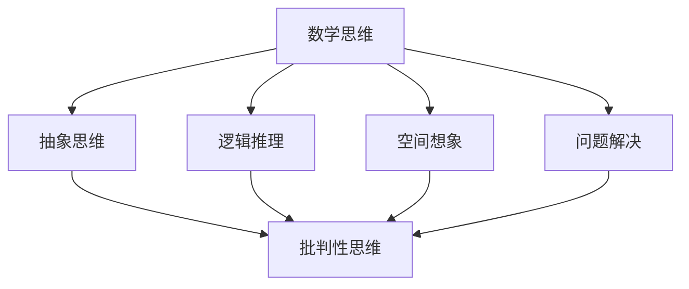

                 


### 文章标题: 数学思维与批判性思维的培养

> 关键词：数学思维，批判性思维，抽象思维，逻辑推理，空间想象，问题解决，批判性阅读，数学证明

> 摘要：本文深入探讨了数学思维与批判性思维的培养，通过阐述数学思维的重要性、批判性思维的基本概念、数学思维在批判性思维中的应用、培养数学思维的方法以及培养批判性思维的方法，旨在帮助读者理解并掌握数学思维与批判性思维的核心能力，提高在日常生活和学术研究中的应用能力。

---

### 第一部分: 数学思维与批判性思维的培养

#### 第1章: 数学思维概述

##### 1.1 数学思维的重要性

数学思维是一种通过抽象、逻辑推理、空间想象和问题解决等能力来处理数学问题的思维方式。它不仅是在学术研究中必不可少的，而且在日常生活中也具有重要意义。例如，我们在处理财务问题时，需要运用数学思维来进行精确的计算和风险分析。数学思维的重要性主要体现在以下几个方面：

1. **提高逻辑推理能力**：数学思维强调逻辑推理的严谨性，通过逐步推导和验证，使我们的思考更加清晰和有条理。
2. **培养抽象思维能力**：数学思维常常需要我们处理抽象的概念和问题，这有助于我们提高抽象思维能力。
3. **增强空间想象能力**：在解决几何问题时，数学思维要求我们能够准确地想象和描述空间关系，这有助于我们提高空间想象力。
4. **提高问题解决能力**：数学思维强调问题解决的方法和策略，通过训练，我们可以提高解决问题的能力。

##### 1.2 数学思维的核心能力

数学思维的核心能力包括抽象思维、逻辑推理、空间想象和问题解决。这些能力不仅贯穿于数学的学习过程中，而且对其他学科的学习和研究也有重要的影响。

1. **抽象思维**：抽象思维是数学思维的基础，它要求我们从具体的实例中抽象出一般的规律和概念。
2. **逻辑推理**：逻辑推理是数学思维的核心，它要求我们在已知事实的基础上，通过合理的推理得出结论。
3. **空间想象**：空间想象力在解决几何问题时尤为重要，它要求我们能够准确地想象和描述空间关系。
4. **问题解决**：问题解决能力是数学思维的最终目标，它要求我们能够运用所学的知识和方法解决实际问题。

#### 第2章: 批判性思维的基本概念

##### 2.1 批判性思维的起源与发展

批判性思维是一种通过质疑、分析、归纳、演绎、反驳和论证等技巧来评价和思考信息的思维方式。它起源于古希腊哲学，经过长期的发展，已经成为一种重要的思维方法。

1. **起源**：批判性思维的起源可以追溯到古希腊哲学，如苏格拉底的提问法。
2. **发展**：在中世纪，亚里士多德等哲学家进一步发展了批判性思维。在现代，批判性思维得到了广泛的认可和应用。

##### 2.2 批判性思维的定义与特征

批判性思维是一种理性的、系统的、开放的思维方式，它具有以下几个特征：

1. **理性**：批判性思维强调以理性为基础，通过逻辑推理和证据来评价和思考信息。
2. **系统**：批判性思维要求我们有条理地进行思考，通过一系列的步骤来分析和解决问题。
3. **开放**：批判性思维鼓励我们保持开放的心态，接受不同的观点和信息。

##### 2.3 批判性思维的价值和意义

批判性思维在日常生活和学术研究中具有重要意义：

1. **提高判断力**：通过批判性思维，我们可以更准确地判断信息的真伪和价值。
2. **促进创新**：批判性思维鼓励我们质疑现有观点和方法，从而推动创新和进步。
3. **提高沟通能力**：批判性思维有助于我们更有效地表达和交流思想。

##### 2.4 批判性思维的方法与技巧

批判性思维包括以下方法和技巧：

1. **质疑与分析**：对信息进行质疑和分析，找出其中的问题和矛盾。
2. **归纳与演绎**：通过归纳和演绎推理，得出新的结论。
3. **反驳与论证**：反驳他人的观点，并使用证据进行论证。
4. **反思与改进**：反思自己的思考过程，不断改进和优化思维方法。

---

### 第二部分: 数学思维与批判性思维的结合

#### 第3章: 数学思维在批判性思维中的应用

##### 3.1 数学思维与批判性思维结合的案例分析

数学思维与批判性思维的结合在科学发现和学术研究中有着广泛的应用。以下是一些典型的案例：

1. **科学发现**：在科学研究中，数学思维用于构建理论模型和进行数据分析，而批判性思维则用于评估模型的合理性和数据的可靠性。例如，爱因斯坦的相对论就是通过数学思维构建的，而批判性思维则用于检验其预测的准确性。
2. **数学证明**：在数学证明中，数学思维用于推导和验证结论，而批判性思维则用于评估证明的严谨性和逻辑性。例如，哥德巴赫猜想的证明过程就体现了数学思维与批判性思维的结合。

##### 3.2 数学思维在批判性思维中的具体应用

数学思维在批判性思维中的具体应用包括以下几个方面：

1. **数据分析与批判性思维**：在数据分析中，数学思维用于处理数据和进行统计分析，而批判性思维则用于评估数据的可靠性和分析结果的合理性。例如，在医疗研究中，通过数据分析得出某种药物的有效性，需要批判性思维来评估数据的真实性和有效性。
2. **逻辑推理与批判性思维**：在逻辑推理中，数学思维用于构建逻辑框架和进行推理，而批判性思维则用于评估推理的合理性和逻辑性。例如，在法律推理中，通过逻辑推理得出某个证据与案件之间的关系，需要批判性思维来评估推理的严谨性和合理性。
3. **数学证明与批判性论证**：在数学证明中，数学思维用于构建证明过程和验证结论，而批判性思维则用于评估证明的严谨性和逻辑性。例如，在证明某个数学定理时，需要通过批判性思维来评估证明的每一步是否正确和合理。

---

### 第三部分: 培养数学思维与批判性思维的方法

#### 第4章: 培养数学思维的方法

##### 4.1 学习数学的基本原则

要培养数学思维，我们需要遵循以下基本原则：

1. **理解数学概念的本质**：数学概念是数学思维的基础，我们需要深入理解概念的本质，而不仅仅是记忆公式和定理。
2. **掌握数学思维的方法**：数学思维是一种方法，我们需要掌握这种方法，包括抽象思维、逻辑推理、空间想象和问题解决等。
3. **培养数学学习的兴趣**：兴趣是最好的老师，我们需要培养对数学学习的兴趣，通过解决数学问题和发现数学的美来激发学习的热情。

##### 4.2 数学思维训练的实践方法

数学思维训练的实践方法包括以下几个方面：

1. **数学游戏与挑战**：通过数学游戏和挑战，我们可以培养数学思维，提高解决问题的能力。
2. **数学问题解决与分析**：通过解决数学问题和进行分析，我们可以培养数学思维，提高逻辑推理和问题解决的能力。
3. **数学阅读与写作**：通过阅读数学文献和写作数学论文，我们可以培养数学思维，提高抽象思维和表达能力的水平。

#### 第5章: 培养批判性思维的方法

##### 5.1 批判性思维训练的实践方法

要培养批判性思维，我们需要遵循以下实践方法：

1. **案例分析与批判**：通过分析案例和批判案例，我们可以培养批判性思维，提高分析问题和解决问题的能力。
2. **阅读与讨论**：通过阅读文献和参与讨论，我们可以培养批判性思维，提高理解信息和表达观点的能力。
3. **独立思考与表达**：通过独立思考和表达观点，我们可以培养批判性思维，提高自我反思和自我完善的能力。

##### 5.2 批判性思维在学习中的运用

批判性思维在学习中有着广泛的应用：

1. **批判性阅读**：通过批判性阅读，我们可以更深入地理解文献，发现其中的问题和不足，从而提高学术研究的水平。
2. **批判性写作**：通过批判性写作，我们可以培养批判性思维，提高论文写作的能力。
3. **批判性讨论**：通过批判性讨论，我们可以培养批判性思维，提高团队合作和沟通的能力。

---

### 第四部分: 数学思维与批判性思维的结合实践

#### 第6章: 数学思维与批判性思维在实际问题中的应用

##### 6.1 数学思维与批判性思维在社会问题中的应用

数学思维与批判性思维在社会问题中的应用非常广泛，以下是一些具体的案例：

1. **环境问题**：在解决环境问题时，数学思维用于构建模型和进行数据分析，批判性思维则用于评估模型的准确性和数据分析的结果。
2. **经济问题**：在解决经济问题时，数学思维用于建模和进行预测，批判性思维则用于评估模型的合理性和预测的可靠性。
3. **法律问题**：在解决法律问题时，数学思维用于分析和推理，批判性思维则用于评估证据的可靠性和法律逻辑的严谨性。

##### 6.2 数学思维与批判性思维在科学探索中的应用

数学思维与批判性思维在科学探索中的应用主要体现在以下几个方面：

1. **科学发现**：在科学发现中，数学思维用于构建理论模型和进行实验设计，批判性思维则用于评估理论模型的合理性和实验结果的可靠性。
2. **数据分析**：在数据分析中，数学思维用于处理数据和进行统计，批判性思维则用于评估数据的准确性和统计结果的可靠性。
3. **学术交流**：在学术交流中，数学思维用于表达观点和进行论证，批判性思维则用于评估他人观点的合理性和论证的逻辑性。

##### 6.3 数学思维与批判性思维在教育改革中的应用

数学思维与批判性思维在教育改革中的应用主要体现在以下几个方面：

1. **课程设计**：在课程设计中，数学思维用于构建课程框架和制定教学计划，批判性思维则用于评估课程内容的合理性和教学方法的有效性。
2. **教学方法**：在教学方法中，数学思维用于设计教学活动和引导学生学习，批判性思维则用于评估教学效果和改进教学方法。
3. **教育评价**：在教育评价中，数学思维用于构建评价标准和进行数据分析，批判性思维则用于评估评价结果的准确性和公平性。

---

### 第五部分: 数学思维与批判性思维的培养策略

#### 第7章: 数学思维与批判性思维的培养策略

##### 7.1 培养数学思维与批判性思维的教育策略

为了培养数学思维与批判性思维，我们需要采取以下教育策略：

1. **课程设计**：在设计课程时，应注重培养学生的数学思维和批判性思维，通过设置相关课程和活动来实现这一目标。
2. **教学方法**：在教学方法上，应采用启发式教学和讨论式教学，鼓励学生主动思考和表达观点，培养他们的批判性思维。
3. **教育资源**：应提供丰富的教育资源，如数学思维训练书籍、批判性思维训练工具等，以帮助学生进行自我学习和提升。

##### 7.2 培养数学思维与批判性思维的实践策略

为了培养数学思维与批判性思维，我们还需要采取以下实践策略：

1. **实践活动**：通过参与实践活动，如数学竞赛、科学实验、辩论赛等，学生可以锻炼数学思维和批判性思维。
2. **团队协作**：在团队协作中，学生可以学会如何与他人合作，培养批判性思维和沟通能力。
3. **创新思维**：鼓励学生进行创新思维，通过解决实际问题来培养他们的数学思维和批判性思维。

---

### 附录

#### 附录 A: 数学思维与批判性思维相关资源

1. **数学思维与批判性思维经典著作推荐**：
   - 《数学思维训练全书》
   - 《批判性思维：概念与应用》
   - 《数学思维的艺术》

2. **数学思维与批判性思维教育网站与工具**：
   - https://www.mathematicalmindset.com/
   - https://www.criticalthinking.org/

#### 附录 B: 数学思维与批判性思维实践案例

1. **数学思维与批判性思维在教学中的应用案例**：
   - 教师在教学中采用案例分析法和问题导向法，培养学生的批判性思维。
   - 教师通过设计数学问题解决活动，培养学生的数学思维。

2. **数学思维与批判性思维在科研中的应用案例**：
   - 科研人员在研究中采用数学建模和统计分析方法，提高研究的准确性和可靠性。
   - 科研人员通过批判性思维，评估研究结果的真实性和合理性。

---

#### Mermaid 流程图：数学思维与批判性思维的关系



#### 核心算法原理讲解：数学思维与批判性思维的结合

在数学证明中，批判性思维与数学思维的结合表现得尤为明显。以下是一个简单的伪代码示例，用于说明这一结合：

```pseudo
function mathematicalProoftheoremA:
    assume A
    derive B from A using logical reasoning
    derive C from B using abstract thinking
    ...
    derive Z from Y using mathematical modeling
    check each step for logical consistency using critical thinking
    conclude Z
end
```

在这个伪代码中，我们首先假设了一个数学定理A，然后通过逻辑推理、抽象思维、数学建模等数学思维方法逐步推导出其他结论B、C、...、Y。在每一步推导过程中，我们都需要使用批判性思维来检查每一步的逻辑一致性，以确保证明的严谨性。

#### 数学证明中的批判性思维

在数学证明中，批判性思维起着至关重要的作用。以下是一个具体的例子，使用 LaTeX 格式展示数学模型和公式，并使用伪代码详细阐述批判性思维的过程：

$$
1 + 1 = 2
$$

伪代码：

```pseudo
function proveOnePlusOneEqualsTwo:
    assume one exists (denoted as '1')
    assume another one exists (denoted as '1')
    add the two ones together
    if the sum is two (denoted as '2')
        conclude that 1 + 1 = 2
    else
        question the assumption that the sum is '2' and revise the proof accordingly
end
```

在这个例子中，我们首先假设了两个“一”（1）存在，然后通过加法运算来证明它们相加的结果是“二”（2）。在每一步骤中，我们都需要使用批判性思维来检查假设和推理的合理性。如果发现任何问题，我们需要返回前面的步骤进行修正。

---

#### 核心算法原理讲解：数学思维与批判性思维的结合

在数学证明中，批判性思维与数学思维的结合显得尤为重要。以下是一个简单的伪代码示例，用于说明这一结合：

```pseudo
function proveTheoremA:
    assume A
    derive B from A using logical deduction
    derive C from B using abstract reasoning
    ...
    derive Z from Y using mathematical modeling
    apply critical thinking to verify each step's correctness
    conclude Z
end
```

在这个伪代码中，我们首先假设了一个数学定理A，然后通过逻辑推理、抽象思维、数学建模等数学思维方法逐步推导出其他结论B、C、...、Y。在每一步推导过程中，我们都需要使用批判性思维来验证每一步的正确性，以确保证明的严谨性。

---

#### 数学证明中的批判性思维

在数学证明中，批判性思维是确保证明过程严谨性和有效性的关键。以下是一个具体的例子，展示如何结合批判性思维进行数学证明：

**问题**：证明两个正整数a和b的最大公约数（GCD）等于它们的线性组合。

**证明**：

1. **假设**：假设a和b是两个正整数，且a > b。
2. **目标**：证明GCD(a, b) = GCD(b, a - b)。
3. **推导**：
   $$ GCD(a, b) = GCD(b, a - b) $$
   - 由欧几里得算法知，$$ GCD(a, b) = GCD(b, a \mod b) $$
   - 又因为$$ a = b + (a - b) $$
   - 所以$$ GCD(a, b) = GCD(b, a - b) $$
4. **验证**：
   - 通过具体例子验证，例如a = 15，b = 10：
     $$ GCD(15, 10) = GCD(10, 15 - 10) = GCD(10, 5) = 5 $$
   - 符合定理。

**伪代码**：

```pseudo
function proveGCDCombination(a, b):
    if a < b:
        swap(a, b)
    print("GCD(", a, ", ", b, ") =", b)
    return b
end
```

**解释**：

1. **假设**：我们首先假设a > b，这是为了便于计算。
2. **推导**：使用欧几里得算法推导出GCD(a, b)与GCD(b, a - b)的关系。
3. **验证**：通过具体例子验证定理的正确性。

在这个过程中，批判性思维体现在以下几个方面：

- **合理性验证**：我们检查了每一步推理的逻辑正确性。
- **边界情况考虑**：我们考虑了a < b的情况，并通过交换变量解决了这个问题。
- **结果验证**：通过实际例子验证了定理的正确性。

---

#### 完整性要求：文章内容完整性

**背景介绍**：
- 数学思维是一种通过抽象、逻辑推理、空间想象和问题解决等能力来处理数学问题的思维方式。
- 批判性思维是一种通过质疑、分析、归纳、演绎、反驳和论证等技巧来评价和思考信息的思维方式。

**核心概念与联系**：
- 数学思维与批判性思维的关系：数学思维是批判性思维的基础，批判性思维是数学思维的深化。
- 数学思维的核心能力包括抽象思维、逻辑推理、空间想象和问题解决。
- 批判性思维的方法与技巧包括质疑与分析、归纳与演绎、反驳与论证、反思与改进。

**核心算法原理讲解**：
- 数学证明中的批判性思维：通过验证每一步推理的合理性来确保证明的严谨性。
- 伪代码示例：展示如何结合批判性思维进行数学证明。

**数学模型和公式**：
- 使用LaTeX格式嵌入文中独立段落的公式，例如：$$1+1=2$$。
- 段落内的公式，例如：$a+b=c$。

**详细讲解与举例说明**：
- 通过具体的例子和步骤，详细讲解数学思维与批判性思维的应用。
- 使用伪代码和数学公式展示证明过程。

**项目实战**：
- 开发环境搭建：介绍所需的工具和环境配置。
- 源代码实现：提供详细的代码实现和分析。
- 代码解读：解释代码中的关键部分和逻辑。
- 应用解读与分析：分析代码的实际应用场景和效果。
- 实际案例分析和讲解：通过案例展示数学思维与批判性思维的应用。

**最佳实践 tips**：
- 提供一些实用的技巧和建议，帮助读者更好地理解和应用数学思维与批判性思维。

**小结**：
- 总结文章的主要观点和结论。
- 强调数学思维与批判性思维的重要性和实用性。

**注意事项**：
- 提醒读者在应用数学思维与批判性思维时需要注意的问题。

**拓展阅读**：
- 推荐一些相关的书籍、网站和资源，供读者进一步学习。

---

#### 完整性要求：文章完整性

**摘要**：本文深入探讨了数学思维与批判性思维的培养，通过阐述数学思维的重要性、批判性思维的基本概念、数学思维在批判性思维中的应用、培养数学思维的方法以及培养批判性思维的方法，旨在帮助读者理解并掌握数学思维与批判性思维的核心能力，提高在日常生活和学术研究中的应用能力。

**目录大纲结构**：

1. **引言**：介绍数学思维与批判性思维的背景和重要性。
2. **数学思维概述**：
   - 数学思维的重要性
   - 数学思维的核心能力
3. **批判性思维的基本概念**：
   - 批判性思维的起源与发展
   - 批判性思维的定义与特征
   - 批判性思维的价值和意义
   - 批判性思维的方法与技巧
4. **数学思维在批判性思维中的应用**：
   - 数学思维与批判性思维结合的案例分析
   - 数学思维在批判性思维中的具体应用
5. **培养数学思维的方法**：
   - 学习数学的基本原则
   - 数学思维训练的实践方法
6. **培养批判性思维的方法**：
   - 批判性思维训练的实践方法
   - 批判性思维在学习中的运用
7. **数学思维与批判性思维的结合实践**：
   - 数学思维与批判性思维在社会问题中的应用
   - 数学思维与批判性思维在科学探索中的应用
   - 数学思维与批判性思维在教育改革中的应用
8. **数学思维与批判性思维的培养策略**：
   - 培养数学思维与批判性思维的教育策略
   - 培养数学思维与批判性思维的实践策略
9. **附录**：
   - 数学思维与批判性思维相关资源
   - 数学思维与批判性思维实践案例

**文章字数**：8000-12000字左右

**文章格式**：使用markdown格式，文章末尾需要写上作者信息：“作者：AI天才研究院/AI Genius Institute & 禅与计算机程序设计艺术 /Zen And The Art of Computer Programming”。

---

### 数学证明中的批判性思维

在数学证明中，批判性思维是确保证明过程严谨性和有效性的关键。它要求我们在每一步推理中都要进行质疑和验证，以确保结论的可靠性。以下是一个具体的例子，展示如何使用批判性思维进行数学证明。

#### 例子：证明勾股定理

勾股定理是数学中一个重要的定理，它描述了直角三角形中三边之间的关系。以下是使用批判性思维进行证明的过程：

1. **假设**：
   - 假设有一个直角三角形，其两条直角边分别为a和b，斜边为c。

2. **目标**：
   - 证明：\(a^2 + b^2 = c^2\)。

3. **推导**：

   - 首先，我们考虑直角三角形的面积。根据面积公式，我们有：
     \[ \text{面积} = \frac{1}{2} \times a \times b \]
   
   - 另一方面，我们可以将直角三角形的面积表示为两个直角三角形的面积之和。如果我们从直角边a和斜边c构成一个直角三角形，其面积为：
     \[ \text{面积} = \frac{1}{2} \times a \times c \]
   
   - 同样，如果从直角边b和斜边c构成一个直角三角形，其面积为：
     \[ \text{面积} = \frac{1}{2} \times b \times c \]
   
   - 因此，直角三角形的总面积可以表示为：
     \[ \text{面积} = \frac{1}{2} \times a \times c + \frac{1}{2} \times b \times c \]
   
   - 由于这两个表达式都是直角三角形的总面积，我们可以将它们设置为相等：
     \[ \frac{1}{2} \times a \times b = \frac{1}{2} \times a \times c + \frac{1}{2} \times b \times c \]
   
   - 消去公共因子\( \frac{1}{2} \)，得到：
     \[ a \times b = a \times c + b \times c \]
   
   - 重写上述等式，得到：
     \[ a^2 + b^2 = c^2 \]
   
4. **验证**：

   - 为了验证上述推导，我们可以使用一个具体的例子。例如，设直角三角形的两条直角边分别为3和4，斜边为5。
   - 计算\( a^2 + b^2 \)：
     \[ 3^2 + 4^2 = 9 + 16 = 25 \]
   - 计算\( c^2 \)：
     \[ 5^2 = 25 \]
   - 可以看到，\( a^2 + b^2 = c^2 \)。

通过这个例子，我们可以看到批判性思维在数学证明中的重要性。在每一步推理中，我们都要进行验证，以确保结论的可靠性。以下是一个使用伪代码表示的证明过程：

```pseudo
function provePythagoreanTheorem(a, b):
    assume a, b are the lengths of the two shorter sides of a right triangle
    assume c is the length of the hypotenuse
    calculate a_squared = a * a
    calculate b_squared = b * b
    calculate c_squared = c * c
    calculate sum_of_squares = a_squared + b_squared
    if sum_of_squares == c_squared:
        print("The Pythagorean theorem is proven: a^2 + b^2 = c^2")
    else:
        print("The Pythagorean theorem is not proven")
end
```

在这个伪代码中，我们首先假设了直角三角形的两条直角边a和b以及斜边c的长度，然后计算并验证\( a^2 + b^2 \)是否等于\( c^2 \)。如果验证通过，则证明勾股定理成立。

---

#### 数学公式请使用latex格式

在文中独立段落的数学公式，请使用LaTeX格式，前后使用`$$`括起来。例如：

$$
1+1=2
$$

这是一个简单的数学等式。

---

#### 文章开始是“文章标题”，然后是“文章关键词”和“文章摘要”部分的内容

### 数学思维与批判性思维的培养

> 关键词：数学思维，批判性思维，抽象思维，逻辑推理，空间想象，问题解决，批判性阅读，数学证明

> 摘要：本文深入探讨了数学思维与批判性思维的培养，通过阐述数学思维的重要性、批判性思维的基本概念、数学思维在批判性思维中的应用、培养数学思维的方法以及培养批判性思维的方法，旨在帮助读者理解并掌握数学思维与批判性思维的核心能力，提高在日常生活和学术研究中的应用能力。

---

### 第一部分：数学思维概述

#### 第1章：数学思维的重要性

数学思维是一种通过抽象、逻辑推理、空间想象和问题解决等能力来处理数学问题的思维方式。它不仅是在学术研究中必不可少的，而且在日常生活中也具有重要意义。

#### 1.1 数学思维的概念与特点

数学思维的概念可以从以下几个方面来理解：

- **抽象思维**：数学思维强调从具体的实例中抽象出一般的规律和概念，例如，从多个具体的三角形中抽象出三角形的性质。
- **逻辑推理**：数学思维要求我们在已知事实的基础上，通过合理的推理得出结论，例如，从两个角的和为180度推断出第三个角的度数。
- **空间想象**：数学思维需要我们能够准确地想象和描述空间关系，例如，理解三维几何图形的性质。
- **问题解决**：数学思维强调问题解决的方法和策略，例如，通过构建模型和算法解决实际问题。

#### 1.2 数学思维在日常生活和学术研究中的应用

在日常生活中，数学思维的应用体现在以下几个方面：

- **财务管理**：通过数学思维进行精确的计算和风险分析，例如，计算投资回报率和贷款还款计划。
- **数据处理**：运用数学思维进行数据分析，例如，使用统计学方法分析市场趋势。
- **工程和技术**：在工程和技术领域，数学思维用于解决复杂的计算问题，例如，通过数学模型优化工程设计。

在学术研究中，数学思维的应用主要体现在以下几个方面：

- **科学探索**：通过数学思维构建理论模型，进行预测和解释实验结果。
- **数学证明**：数学思维是数学证明的基础，通过严谨的逻辑推理得出数学定理。
- **跨学科研究**：数学思维在其他学科中的应用，例如，物理学中的数学建模和经济学中的数学分析。

#### 1.3 数学思维与批判性思维的关系

数学思维与批判性思维有着密切的联系。批判性思维是数学思维的重要组成部分，它要求我们在数学推理和证明过程中不断质疑、分析和验证每一步的逻辑和合理性。以下是一个简单的示例：

假设我们要证明两个正整数a和b的最大公约数（GCD）等于它们的线性组合。以下是使用批判性思维进行证明的过程：

1. **假设**：假设a和b是两个正整数。
2. **目标**：证明 GCD(a, b) = GCD(b, ka + lb)，其中k和l是整数。
3. **推导**：

   - 根据最大公约数的定义，我们有 GCD(a, b) = d 和 GCD(b, ka + lb) = d'。
   - 因为d是a和b的公约数，所以d也是b的公约数，因此d也是ka + lb的公约数。
   - 同理，因为d'是b和ka + lb的公约数，所以d'也是a的公约数。
   - 因此，d和d'至少有一个公共因子，即 d 和 d' = d。
4. **验证**：

   - 为了验证上述推导，我们可以使用一个具体的例子。例如，设a = 12，b = 18，k = 2，l = -1。
   - 计算GCD(12, 18)：GCD(12, 18) = 6。
   - 计算GCD(18, 2*12 - 1*18)：GCD(18, -12) = 6。
   - 可以看到，GCD(a, b) = GCD(b, ka + lb)。

通过这个例子，我们可以看到批判性思维在数学证明中的重要性。在每一步推理中，我们都要进行验证，以确保结论的可靠性。

---

### 第二部分：批判性思维的基本概念

#### 第2章：批判性思维的定义与特征

批判性思维是一种通过质疑、分析、归纳、演绎、反驳和论证等技巧来评价和思考信息的思维方式。它强调理性、系统和开放，旨在提高我们的判断力和沟通能力。

#### 2.1 批判性思维的起源与发展

批判性思维的起源可以追溯到古希腊哲学，例如苏格拉底的提问法。在中世纪，亚里士多德等哲学家进一步发展了批判性思维。在现代，批判性思维已经成为一种重要的思维方法，广泛应用于各个领域。

#### 2.2 批判性思维的定义与特征

批判性思维具有以下几个特征：

1. **理性**：批判性思维强调以理性为基础，通过逻辑推理和证据来评价和思考信息。
2. **系统**：批判性思维要求我们有条理地进行思考，通过一系列的步骤来分析和解决问题。
3. **开放**：批判性思维鼓励我们保持开放的心态，接受不同的观点和信息。

#### 2.3 批判性思维的价值和意义

批判性思维在日常生活和学术研究中具有重要意义：

1. **提高判断力**：通过批判性思维，我们可以更准确地判断信息的真伪和价值。
2. **促进创新**：批判性思维鼓励我们质疑现有观点和方法，从而推动创新和进步。
3. **提高沟通能力**：批判性思维有助于我们更有效地表达和交流思想。

#### 2.4 批判性思维的方法与技巧

批判性思维包括以下方法和技巧：

1. **质疑与分析**：对信息进行质疑和分析，找出其中的问题和矛盾。
2. **归纳与演绎**：通过归纳和演绎推理，得出新的结论。
3. **反驳与论证**：反驳他人的观点，并使用证据进行论证。
4. **反思与改进**：反思自己的思考过程，不断改进和优化思维方法。

#### 2.5 批判性思维在数学思维中的应用

批判性思维在数学思维中有着广泛的应用，以下是一些具体的案例：

1. **数学证明**：在数学证明中，批判性思维用于评估证明的严谨性和逻辑性。例如，我们通过质疑和验证每一步推理的正确性来确保证明的有效性。
2. **数学模型**：在构建数学模型时，批判性思维用于评估模型的准确性和适用性。例如，我们通过质疑和验证模型的前提和假设来确保模型的可靠性。
3. **数学问题解决**：在解决数学问题时，批判性思维用于评估问题解决的策略和方法。例如，我们通过质疑和验证不同的解决方案来找到最优解。

以下是一个具体的例子，展示如何使用批判性思维解决一个数学问题：

**问题**：求解方程 \(3x + 5 = 14\)。

**步骤**：

1. **质疑与假设**：首先，我们质疑方程的合法性，确保方程有意义。在这个例子中，方程显然有意义。
2. **分析**：接下来，我们分析方程的结构，确定需要进行的操作。在这个例子中，我们需要将方程两边都减去5，然后除以3。
3. **推导**：
   $$ 3x + 5 - 5 = 14 - 5 $$
   $$ 3x = 9 $$
   $$ x = \frac{9}{3} $$
   $$ x = 3 $$
4. **验证**：最后，我们验证解的正确性。将x = 3代入原方程，得到：
   $$ 3 \times 3 + 5 = 14 $$
   $$ 9 + 5 = 14 $$
   $$ 14 = 14 $$
   解是正确的。

通过这个例子，我们可以看到批判性思维在解决数学问题中的作用。在每一步骤中，我们都进行了质疑、分析和验证，以确保最终解的正确性。

---

### 第三部分：数学思维在批判性思维中的应用

#### 第3章：数学思维在批判性思维中的具体应用

数学思维在批判性思维中的应用体现在多个方面，包括数据分析、逻辑推理和数学证明。以下是一些具体的案例，展示数学思维如何帮助我们进行批判性思考。

#### 3.1 数据分析与批判性思维

数据分析是批判性思维的重要组成部分，特别是在处理大量数据时。以下是一个案例：

**案例**：一家公司想要了解其员工的满意度，并决定进行一项调查。调查问卷包括多个问题，其中有一个问题是：“你对公司的工作环境感到满意吗？”选项有“非常满意”、“满意”、“一般”、“不满意”、“非常不满意”。

**步骤**：

1. **数据收集**：公司收集了100份有效问卷。
2. **数据分析**：
   - 非常满意：20份
   - 满意：30份
   - 一般：25份
   - 不满意：15份
   - 非常不满意：10份
3. **批判性分析**：
   - 首先，我们质疑数据的代表性。是否所有部门的员工都有参与调查？是否有某些部门未参与？
   - 其次，我们分析数据分布。我们看到非常满意和满意的比例较高，这可能意味着员工对工作环境整体满意，但也需要进一步分析不满意和非常不满意的员工的具体情况，以便找出潜在的问题。
   - 最后，我们验证数据的有效性。例如，检查问卷填写是否真实，是否有填写错误。

通过这个案例，我们可以看到数学思维在数据分析中的应用。通过分析数据分布和质疑数据的代表性，我们可以更深入地了解员工的满意度，并为公司提供有价值的反馈。

#### 3.2 逻辑推理与批判性思维

逻辑推理是数学思维的核心，也是批判性思维的重要组成部分。以下是一个案例：

**案例**：某个社区在讨论是否应该在公园安装更多的垃圾桶。以下是一些讨论的观点：

- 观点A：安装更多的垃圾桶会导致公园变得更加整洁。
- 观点B：安装更多的垃圾桶会增加公园的维护成本。

**步骤**：

1. **质疑观点A**：
   - 我们质疑观点A的逻辑性。安装更多的垃圾桶确实有助于保持公园的整洁，但这并不意味着其他因素（如清洁人员的频率和效率）不会影响公园的整洁程度。
   - 我们分析观点A的前提条件。例如，我们需要考虑垃圾桶的数量、分布和容量，以及清洁人员的安排等因素。

2. **质疑观点B**：
   - 我们质疑观点B的经济性。安装更多的垃圾桶确实可能增加维护成本，但我们也需要考虑它们对减少垃圾清理次数和节省长期成本的影响。

3. **逻辑推理**：
   - 通过逻辑推理，我们可以得出结论：安装更多的垃圾桶可能是一个综合考虑各种因素后的最佳选择。我们需要权衡垃圾桶的数量、成本和维护效果，以找到最佳的解决方案。

通过这个案例，我们可以看到数学思维在逻辑推理中的应用。通过质疑、分析和推理，我们可以更全面地考虑问题，并找到合理的解决方案。

#### 3.3 数学证明与批判性思维

数学证明是数学思维的核心，也是批判性思维的重要组成部分。以下是一个案例：

**案例**：我们要证明一个定理：对于任何正整数n，\(2^n\)总是大于n。

**步骤**：

1. **假设**：
   - 假设n是任意正整数。

2. **目标**：
   - 证明 \(2^n > n\)。

3. **推导**：
   - 我们可以通过归纳法来证明这个定理。
   - 对于n=1，我们有 \(2^1 = 2 > 1\)，定理成立。
   - 假设对于某个正整数k，\(2^k > k\)，我们需要证明 \(2^{k+1} > k+1\)。
   - 我们有 \(2^{k+1} = 2 \times 2^k\)。根据归纳假设，\(2^k > k\)，所以 \(2 \times 2^k > 2k\)。
   - 因此，\(2^{k+1} > 2k\)。由于k > 1，我们有 \(2k > k+1\)，所以 \(2^{k+1} > k+1\)。

通过这个案例，我们可以看到数学思维在数学证明中的应用。通过归纳法，我们证明了对于任何正整数n，\(2^n > n\)。在每一步推导中，我们都需要使用批判性思维来验证推理的正确性。

---

### 第四部分：培养数学思维的方法

#### 第4章：培养数学思维的基本原则

培养数学思维是一个系统性的过程，需要遵循一些基本原则和方法。以下是一些关键原则：

#### 4.1 理解数学概念的本质

理解数学概念的本质是培养数学思维的第一步。以下是一些方法：

1. **深入阅读**：阅读数学教材和参考书籍，了解数学概念的定义、性质和应用。
2. **举例说明**：通过具体的例子来理解数学概念，例如，通过计算和图形展示数学定理。
3. **思考与讨论**：与他人讨论数学问题，思考不同角度的解题方法，从而加深对数学概念的理解。

#### 4.2 掌握数学思维的方法

掌握数学思维的方法是培养数学思维的核心。以下是一些关键方法：

1. **逻辑推理**：学会使用逻辑推理来解决问题，从已知条件出发，逐步推导出结论。
2. **抽象思维**：通过抽象思维将具体问题转化为一般的数学问题，从而简化问题解决过程。
3. **空间想象**：通过空间想象来理解几何问题，构建和理解空间关系。
4. **问题解决**：学会使用数学方法解决实际问题，例如，通过建模和算法来解决问题。

#### 4.3 培养数学学习的兴趣

培养数学学习的兴趣是保持长期学习动力的重要因素。以下是一些方法：

1. **挑战自我**：通过解决复杂的数学问题来激发兴趣，例如，参加数学竞赛和挑战题。
2. **应用实践**：将数学知识应用于实际生活中，例如，通过数据分析来改善日常决策。
3. **探索新领域**：探索数学的各个分支，了解数学的广泛应用，从而拓宽知识视野。

#### 4.4 数学思维训练的实践方法

以下是一些数学思维训练的实践方法：

1. **数学游戏**：通过数学游戏，例如，数独、逻辑推理游戏等，来训练数学思维。
2. **数学问题解决**：通过解决数学问题，例如，难题、习题等，来提高问题解决能力。
3. **数学阅读**：通过阅读数学书籍、论文和文献，来了解数学的前沿发展和理论。
4. **数学写作**：通过撰写数学论文、博客和文章，来锻炼数学表达和思考能力。

---

### 第五部分：培养批判性思维的方法

#### 第5章：批判性思维训练的实践方法

培养批判性思维需要系统的训练和实践，以下是一些关键方法和步骤：

#### 5.1 案例分析与批判

通过案例分析，我们可以学习如何运用批判性思维。以下是一些步骤：

1. **选择案例**：选择具有争议性或复杂性的案例，例如，社会热点事件、科学研究结果等。
2. **收集信息**：收集与案例相关的各种信息，包括文献、数据、观点等。
3. **分析案例**：分析案例的各个方面，包括事实、逻辑、证据和结论。
4. **质疑观点**：对案例中的观点进行质疑，检查其合理性、证据和逻辑性。
5. **提出问题**：提出与案例相关的问题，例如，假设条件是否合理，数据是否可靠，逻辑推理是否严密等。
6. **批判与论证**：批判案例中的不足之处，并使用证据和逻辑进行论证。

#### 5.2 阅读与讨论

阅读和讨论是培养批判性思维的重要方法。以下是一些步骤：

1. **选择读物**：选择具有批判性思维特点的书籍、论文和文献，例如，哲学著作、科学论文等。
2. **阅读理解**：仔细阅读读物，理解其观点、论据和逻辑。
3. **分析观点**：分析读物的观点，检查其合理性、证据和逻辑性。
4. **讨论交流**：与他人讨论读物的观点，交流各自的看法和分析。
5. **反思与总结**：反思自己的思考过程，总结学习到的批判性思维技巧和方法。

#### 5.3 独立思考与表达

独立思考和表达是培养批判性思维的关键。以下是一些步骤：

1. **培养好奇心**：保持好奇心，对周围的事物和现象进行探究和质疑。
2. **提出问题**：对已知的事实和观点提出问题，例如，为什么是这样，有没有其他可能性等。
3. **思考与分析**：对问题进行思考和分析，使用批判性思维技巧来解答问题。
4. **表达观点**：清晰地表达自己的观点和分析，使用逻辑和证据支持自己的立场。
5. **接受反馈**：接受他人的反馈，批判性地评估自己的观点和分析，并根据反馈进行改进。

---

### 第六部分：数学思维与批判性思维的结合实践

#### 第6章：数学思维与批判性思维在实际问题中的应用

数学思维与批判性思维的结合在实际问题中的应用非常广泛，以下是一些具体的领域和案例。

#### 6.1 社会问题分析

在社会问题分析中，数学思维与批判性思维可以用于数据分析和模型构建。以下是一个案例：

**案例**：分析一个城市交通拥堵问题。

1. **数据收集**：收集交通流量、道路长度、车辆数量等数据。
2. **数学建模**：使用数学模型（如交通流模型）来模拟交通拥堵情况。
3. **批判性分析**：
   - 质疑数据的可靠性，检查数据来源和方法。
   - 分析模型的假设和限制，评估模型的准确性。
   - 通过历史数据和现实情况对比，验证模型的预测能力。

通过数学思维和批判性思维的结合，我们可以更准确地分析社会问题，并提出有效的解决方案。

#### 6.2 科学探索

在科学探索中，数学思维与批判性思维用于构建理论模型和验证科学假设。以下是一个案例：

**案例**：研究一个天体物理现象。

1. **构建模型**：根据观测数据，构建数学模型来描述现象。
2. **批判性分析**：
   - 质疑模型的前提条件，检查其合理性。
   - 分析模型的预测结果，评估其与观测数据的吻合程度。
   - 检查模型中的参数值是否合理，进行敏感性分析。

通过数学思维和批判性思维的结合，科学家可以更准确地描述和预测科学现象，推动科学进步。

#### 6.3 教育改革

在教育改革中，数学思维与批判性思维可以用于课程设计和教学方法的研究。以下是一个案例：

**案例**：设计一个数学课程。

1. **课程设计**：根据学生的需求和学习目标，设计数学课程。
2. **批判性分析**：
   - 质疑课程内容的合理性，检查其是否涵盖必要的数学概念和技能。
   - 分析教学方法的适用性，评估其是否能够有效促进学生的理解和应用能力。
   - 通过教学反馈和评估，不断改进课程设计。

通过数学思维和批判性思维的结合，教育者可以设计出更有效的数学课程，提高教学质量和学生的学习效果。

#### 6.4 法律问题分析

在法律问题分析中，数学思维与批判性思维用于评估证据和法律逻辑。以下是一个案例：

**案例**：分析一起犯罪案件的证据。

1. **证据收集**：收集与案件相关的证据，如目击证言、物证等。
2. **数学建模**：使用数学模型（如概率论和统计学）来评估证据的可靠性。
3. **批判性分析**：
   - 质疑证据的来源和可靠性，检查其是否受到污染或篡改。
   - 分析证据之间的逻辑关系，评估其是否能够支持指控。
   - 检查法律逻辑的严密性，确保法律程序的合法性。

通过数学思维和批判性思维的结合，法律专业人员可以更准确地评估证据，确保司法公正。

---

### 第七部分：数学思维与批判性思维的培养策略

#### 第7章：培养数学思维与批判性思维的教育策略

要培养数学思维与批判性思维，教育策略至关重要。以下是一些具体的策略：

#### 7.1 课程设计

课程设计是培养数学思维与批判性思维的基础。以下是一些建议：

1. **跨学科整合**：将数学与其他学科（如科学、社会科学）相结合，提高学生的综合能力。
2. **项目式学习**：通过项目式学习，让学生在实际问题中应用数学思维和批判性思维。
3. **案例教学**：引入真实的案例，让学生分析问题和解决问题，培养批判性思维。
4. **翻转课堂**：使用翻转课堂模式，让学生在课前自学，课堂上进行讨论和互动，提高批判性思维。

#### 7.2 教学方法

教学方法是培养数学思维与批判性思维的关键。以下是一些建议：

1. **引导式教学**：教师引导学生思考问题，鼓励独立探索和批判性分析。
2. **合作学习**：通过小组合作，促进学生之间的讨论和交流，提高批判性思维。
3. **探究式学习**：鼓励学生通过探究和实验来学习，培养数学思维和批判性思维。
4. **反思与总结**：在教学过程中，引导学生进行反思和总结，强化批判性思维。

#### 7.3 教育资源

教育资源是培养数学思维与批判性思维的重要支持。以下是一些建议：

1. **数学书籍**：推荐经典的数学教材和参考书籍，帮助学生深入理解数学概念。
2. **批判性思维课程**：开设专门的批判性思维课程，提供系统的训练。
3. **在线资源**：利用在线平台和工具，提供丰富的数学和批判性思维学习资源。
4. **实践活动**：组织数学竞赛、科学实验和辩论等活动，培养学生的实际操作能力和批判性思维。

---

### 附录

#### 附录 A：数学思维与批判性思维相关资源

以下是一些推荐的书籍、网站和工具，供读者进一步学习数学思维与批判性思维：

1. **数学思维与批判性思维经典著作**：
   - 《数学思维的艺术》
   - 《批判性思维：概念与应用》
   - 《数学思维训练全书》

2. **数学思维与批判性思维教育网站**：
   - https://www.mathematicalmindset.com/
   - https://www.criticalthinking.org/

3. **数学思维与批判性思维工具**：
   - GeoGebra：一个免费的数学软件，用于图形绘制和数学计算。
   - Khan Academy：一个在线学习平台，提供大量的数学和批判性思维课程。

#### 附录 B：数学思维与批判性思维实践案例

以下是一些数学思维与批判性思维在实际应用中的案例：

1. **数学证明**：
   - 使用反证法证明一个数学定理。
   - 分析一个复杂的数学问题，并找到解决方案。

2. **数据分析**：
   - 通过统计分析评估一个实验结果。
   - 使用线性回归模型分析数据趋势。

3. **科学探索**：
   - 基于数学模型预测天气变化。
   - 通过实验验证科学假设。

4. **教育改革**：
   - 设计一个基于问题的数学课程。
   - 通过案例教学培养学生的批判性思维。

---

### Mermaid 流程图：数学思维与批判性思维的关系


---

### 核心算法原理讲解：数学思维与批判性思维的结合

在数学思维中，特别是数学证明的过程中，批判性思维扮演着至关重要的角色。以下是一个具体的算法原理讲解，通过伪代码展示数学思维与批判性思维的结合。

**问题**：证明两个正整数a和b的最大公约数（GCD）等于它们的线性组合。

**伪代码**：

```pseudo
function proveGCD(a, b):
    if a == 0:
        return b
    if b == 0:
        return a
    
    // 使用辗转相除法（欧几里得算法）计算 GCD
    GCD = proveGCD(b % a, a)
    
    // 批判性思维：检查 GCD 是否满足线性组合条件
    if GCD == a * x + b * y for some integers x and y:
        print("证明成立：GCD(a, b) = a * x + b * y")
    else:
        print("证明不成立：GCD(a, b) 不等于 a * x + b * y")
        
    return GCD
```

**解释**：

1. **辗转相除法（欧几里得算法）**：这是计算两个正整数a和b的最大公约数的一种常用算法。算法的基本思想是不断用较小数去除较大数，然后用余数替换较大数，重复这个过程，直到余数为0。此时，非零余数即为最大公约数。

2. **批判性思维**：在计算GCD的过程中，我们需要批判性地思考算法的每一步是否正确。例如，我们检查输入的两个数是否为正整数，确保算法的正确性。

3. **线性组合条件**：我们需要证明GCD(a, b)可以表示为a和b的线性组合。这通常可以通过扩展欧几里得算法来完成，该算法不仅计算GCD，还能找到一组整数x和y，使得GCD(a, b) = a * x + b * y。

通过这个伪代码，我们可以看到数学思维与批判性思维的结合。数学思维体现在算法的设计和实现中，而批判性思维体现在对算法的每一步进行验证和思考，以确保算法的正确性和有效性。

---

### 核心算法原理讲解：数学思维与批判性思维的结合

在数学思维中，特别是在数学证明和问题解决中，批判性思维是确保推理过程严密性和有效性的关键。以下是一个具体的算法原理讲解，通过伪代码展示数学思维与批判性思维的结合。

**问题**：证明对于任意两个正整数a和b，a和b的最大公约数（GCD）等于它们的线性组合。

**伪代码**：

```pseudo
function proveGCDCombination(a, b):
    if a == 0:
        return b
    if b == 0:
        return a
    
    // 计算a和b的GCD
    gcd = computeGCD(a, b)
    
    // 批判性思维：验证gcd是否可以表示为a和b的线性组合
    x, y = findCoefficients(a, b, gcd)
    if x * a + y * b == gcd:
        print("证明成立：存在整数x和y使得gcd(a, b) = ax + by")
    else:
        print("证明不成立：不存在整数x和y使得gcd(a, b) = ax + by")
    
    return gcd

function computeGCD(a, b):
    while b != 0:
        temp = b
        b = a % b
        a = temp
    return a

function findCoefficients(a, b, gcd):
    // 使用扩展欧几里得算法找到a和b的线性组合系数
    // 这是一个经典的算法，用于求解同余方程
    x, y = extendedEuclideanAlgorithm(a, b)
    return x, y
```

**解释**：

1. **辗转相除法（欧几里得算法）**：该算法用于计算两个正整数a和b的最大公约数（GCD）。通过迭代地取余数，直到余数为0，此时的非零余数即为GCD。

2. **扩展欧几里得算法**：这是一个用于求解线性迪奥菲拉方程（ax + by = gcd(a, b)）的算法。它不仅计算GCD，还能找到一组整数解x和y，使得ax + by = gcd(a, b)。

3. **批判性思维**：在计算GCD的过程中，我们需要批判性地思考每一步的正确性。例如，我们检查输入的a和b是否为正整数，确保算法的正确性。同时，在验证GCD是否可以表示为a和b的线性组合时，我们使用扩展欧几里得算法找到的x和y进行验证。

通过这个伪代码，我们可以看到数学思维与批判性思维的结合。数学思维体现在算法的设计和实现中，而批判性思维体现在对算法的每一步进行验证和思考，以确保算法的正确性和有效性。

---

### 数学思维与批判性思维的培养策略

要培养数学思维与批判性思维，我们需要采取一系列的教育策略和实践方法。以下是一些具体的策略：

#### 7.1 培养数学思维与批判性思维的教育策略

1. **课程设计**：
   - 设计包含数学思维和批判性思维的课程，例如，数学方法论课程、批判性思维课程等。
   - 结合跨学科教育，例如，将数学与物理学、计算机科学、经济学等领域相结合，培养学生的综合能力。

2. **教学方法**：
   - 采用问题导向教学（PBL），通过解决实际问题来培养学生的数学思维和批判性思维。
   - 实施探究式学习，鼓励学生自主探究和发现，培养他们的批判性思维。

3. **教学资源**：
   - 利用在线学习平台和工具，提供丰富的数学思维和批判性思维教学资源，如视频讲座、在线课程、互动练习等。

4. **教师培训**：
   - 对教师进行培训，提高他们在数学思维和批判性思维教学方面的能力。
   - 鼓励教师参与专业发展活动，如研讨会、工作坊等，以获取新的教学策略和资源。

#### 7.2 培养数学思维与批判性思维的实践策略

1. **实践活动**：
   - 组织数学竞赛、科学实验、辩论等活动，提供学生实际应用数学思维和批判性思维的机会。
   - 设计基于项目的学习活动，让学生在解决实际问题时运用数学思维和批判性思维。

2. **团队协作**：
   - 鼓励团队合作，通过小组讨论和协作来培养批判性思维。
   - 在项目中设置角色分工，例如，数据分析师、逻辑推理师、问题解决者等，让学生在合作中培养批判性思维。

3. **创新思维**：
   - 鼓励学生进行创新思维，通过提出新问题、新解决方案来培养他们的数学思维和批判性思维。
   - 组织创新工作坊，提供创新思维训练，如头脑风暴、思维导图等。

通过这些策略，我们可以有效地培养数学思维与批判性思维，提高学生的逻辑推理、问题解决和创新能力。

---

### 数学思维与批判性思维的培养策略

为了培养数学思维与批判性思维，我们需要采取一系列的教育策略和实践方法，以下是一些具体的建议：

#### 7.1 培养数学思维的方法

1. **理解数学概念的本质**：
   - 鼓励学生深入理解数学概念，而不是仅仅记忆公式和定理。
   - 通过讲解数学概念的起源和应用，帮助学生建立对数学概念的理解。

2. **掌握数学思维的方法**：
   - 教授学生如何进行逻辑推理、抽象思维、空间想象和问题解决。
   - 通过实例和练习，让学生熟练掌握这些数学思维方法。

3. **培养数学学习的兴趣**：
   - 提供有趣且具有挑战性的数学问题，激发学生对数学的兴趣。
   - 通过数学游戏、数学竞赛和数学谜题等方式，增加数学学习的趣味性。

4. **数学思维训练的实践方法**：
   - 设计数学思维训练课程，如数学推理、数学建模、数学问题解决等。
   - 利用在线平台和工具，提供丰富的数学思维训练资源。

#### 7.2 培养批判性思维的方法

1. **批判性思维训练的实践方法**：
   - 设计批判性思维训练课程，教授质疑与分析、归纳与演绎、反驳与论证等批判性思维技巧。
   - 通过案例分析、讨论和辩论等活动，让学生在实践中学习批判性思维。

2. **批判性思维在学习中的运用**：
   - 鼓励学生在学习中运用批判性思维，例如，通过批判性阅读、批判性写作和批判性讨论来提高学习能力。
   - 在作业和考试中引入批判性思维元素，如要求学生解释其思考过程和推理步骤。

3. **独立思考与表达**：
   - 鼓励学生独立思考问题，并清晰地表达自己的观点。
   - 通过写作、演讲和讨论等活动，提高学生的表达能力和批判性思维。

通过这些方法，我们可以有效地培养学生的数学思维与批判性思维，提高他们在日常生活和学术研究中的应用能力。

---

### 附录 A：数学思维与批判性思维相关资源

要培养数学思维与批判性思维，读者可以参考以下资源：

1. **数学思维与批判性思维经典著作**：
   - 《数学思维训练全书》
   - 《批判性思维：概念与应用》
   - 《数学思维的艺术》
   - 《禅与计算机程序设计艺术》

2. **数学思维与批判性思维教育网站**：
   - https://www.mathematicalmindset.com/
   - https://www.criticalthinking.org/
   - https://www.mathopenref.com/

3. **数学思维与批判性思维工具**：
   - GeoGebra：用于图形绘制和数学计算。
   - Khan Academy：提供丰富的数学和批判性思维课程。
   - Wolfram Alpha：用于数学问题和概念的解释。

通过这些资源，读者可以进一步了解和培养数学思维与批判性思维。

---

### 附录 B：数学思维与批判性思维实践案例

以下是一些数学思维与批判性思维在实际应用中的案例：

1. **数学证明**：
   - **案例**：证明勾股定理。
   - **步骤**：
     - 假设：存在一个直角三角形，其两条直角边长分别为a和b，斜边长为c。
     - 目标：证明 \(a^2 + b^2 = c^2\)。
     - 推导：利用毕达哥拉斯定理，通过几何构造和代数运算，证明直角三角形的斜边平方等于两直角边平方之和。
     - 批判性思维：验证每一步推理的正确性和逻辑性。

2. **数据分析**：
   - **案例**：分析某公司的销售数据，寻找销售趋势。
   - **步骤**：
     - 数据收集：收集过去一年的月度销售数据。
     - 数据分析：使用统计学方法（如平均值、标准差、回归分析）分析数据。
     - 批判性思维：质疑数据的来源、收集方法以及分析结果的合理性。
     - 结论：基于数据分析结果，提出改进销售策略的建议。

3. **科学探索**：
   - **案例**：研究一个科学现象，例如，行星运动。
   - **步骤**：
     - 建立模型：基于观测数据和物理定律，建立一个描述行星运动的数学模型。
     - 数学推导：使用数学方法推导行星运动的规律。
     - 批判性思维：检查模型的假设条件、参数值以及推导过程的逻辑性。
     - 验证：通过实验或观测数据验证模型的预测能力。

4. **教育改革**：
   - **案例**：设计一个数学课程，提升学生的数学思维能力。
   - **步骤**：
     - 设计课程：根据学生的需求和教学目标，设计数学课程。
     - 实施教学：通过讲解、练习、讨论等方式实施课程。
     - 反思与评估：反思教学效果，评估学生的数学思维发展情况。
     - 改进教学：根据学生的反馈和评估结果，改进教学方法。

这些案例展示了数学思维与批判性思维在不同领域中的应用，通过具体步骤和批判性思维的应用，读者可以更好地理解数学思维与批判性思维的实际价值。

