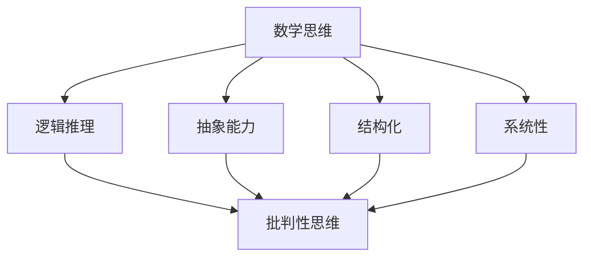
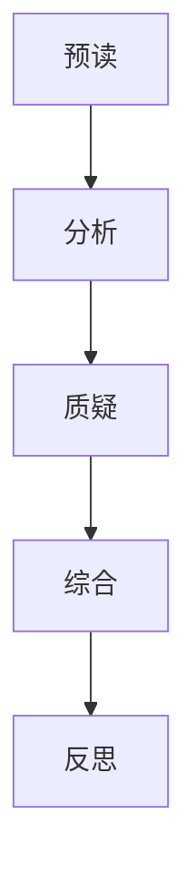
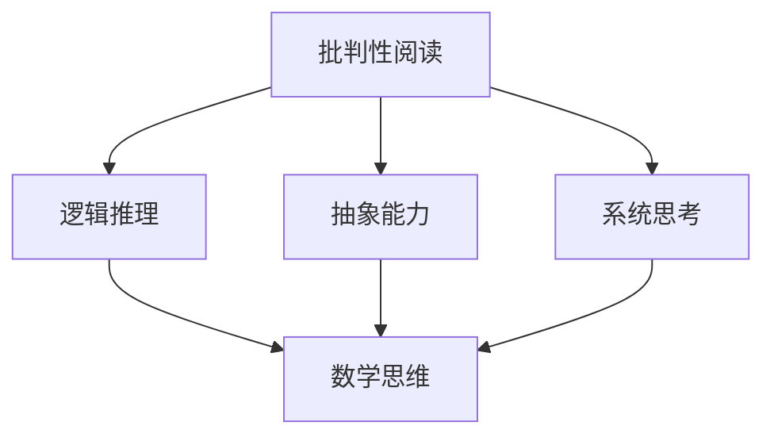

                 

### 文章标题

### 数学思维与批判性阅读的关系

> 关键词：数学思维、批判性阅读、关系、融合、应用、教育、未来发展

> 摘要：本文探讨了数学思维与批判性阅读之间的关系，阐述了两者在逻辑推理、问题解决和知识构建中的作用。通过分析数学思维的基本特征和批判性阅读的步骤，本文提出了数学思维在批判性阅读中的应用策略，并探讨了批判性阅读在数学思维培养中的价值。此外，本文还展望了数学思维与批判性阅读在教育和未来科技发展中的潜在应用。

----------------------------------------------------------------

## 《数学思维与批判性阅读的关系》目录大纲

### 第一部分：引言与核心概念

#### 第1章：数学思维概述

##### 1.1 数学思维的定义与重要性

##### 1.2 数学思维的基本特征

##### 1.3 数学思维与批判性思维的关系

#### 第2章：批判性阅读概述

##### 2.1 批判性阅读的定义与重要性

##### 2.2 批判性阅读的基本步骤

##### 2.3 批判性阅读与数学思维的关系

### 第二部分：数学思维与批判性阅读的融合

#### 第3章：数学思维在批判性阅读中的应用

##### 3.1 数学思维在分析阅读中的应用

##### 3.2 数学思维在评估阅读中的应用

#### 第4章：批判性阅读在数学思维中的应用

##### 4.1 批判性阅读在数学问题解决中的应用

##### 4.2 批判性阅读在数学论证中的应用

#### 第5章：数学思维与批判性阅读的结合策略

##### 5.1 整合数学思维与批判性阅读的方法

##### 5.2 实践案例与启示

### 第三部分：应用与展望

#### 第6章：数学思维与批判性阅读在教育中的应用

##### 6.1 教育体系中的数学思维培养

##### 6.2 教育中的批判性阅读培养

#### 第7章：数学思维与批判性阅读的未来发展

##### 7.1 数学思维与批判性阅读的未来趋势

##### 7.2 数学思维与批判性阅读的研究方向

### 附录

##### 附录 A：数学思维与批判性阅读相关资源

## 第一部分：引言与核心概念

### 第1章：数学思维概述

#### 1.1 数学思维的定义与重要性

数学思维，作为一种逻辑严密、理性深刻的思维方式，是人们解决数学问题和理解数学概念的核心能力。它不仅仅是关于数字和公式，更是一种结构化思考、抽象化表达和逻辑推理的能力。数学思维的重要性体现在多个方面：

1. **解决问题**：数学思维帮助人们在面对复杂问题时，能够通过逻辑分析和结构化思考找到解决方案。无论是日常生活中的财务规划，还是科学研究中的难题求解，数学思维都是不可或缺的。
2. **抽象能力**：数学思维要求人们能够从具体事物中抽象出本质属性，从而形成概念和理论。这种抽象能力在科学研究和创新思维中具有重要意义。
3. **逻辑推理**：数学思维强调推理的严谨性，要求每一步都基于已有的前提和逻辑规则。这种严谨的逻辑推理能力在其他领域的论证和决策中也具有重要价值。

#### 1.2 数学思维的基本特征

数学思维具有以下几个基本特征：

1. **抽象性**：数学思维能够将具体的事物抽象为数学模型，从而进行更一般的分析和推理。
2. **逻辑性**：数学思维强调每一步推理都必须遵循逻辑规则，保证推理的严谨性和可靠性。
3. **结构化**：数学思维注重事物之间的结构关系，能够通过结构化分析来理解和解决问题。
4. **系统性**：数学思维不仅关注单个问题，还注重问题的整体性和系统性，能够在不同问题之间建立联系和统一的理论框架。

#### 1.3 数学思维与批判性思维的关系

数学思维与批判性思维密切相关，两者相互促进、相辅相成。

1. **批判性思维的促进作用**：批判性思维强调质疑、分析和评估，能够帮助人们发现数学思维中的潜在错误和不足。通过批判性思维，数学思维能够得到不断的完善和发展。
2. **数学思维的支持作用**：数学思维提供了一种系统化的思维方式，能够帮助人们更有效地进行批判性思考。例如，在评估一个观点或论证时，可以通过构建数学模型来进行定量分析和验证。

为了更好地理解数学思维与批判性思维的关系，我们可以用以下Mermaid流程图来展示两者的互动：



在数学思维和批判性思维的相互作用中，两者共同推动着知识和思考的深化与发展。

### 第2章：批判性阅读概述

#### 2.1 批判性阅读的定义与重要性

批判性阅读是一种积极的阅读方式，它不仅仅是获取信息，更是一种深度思考和评估信息的过程。批判性阅读的定义可以归纳为以下几个关键点：

1. **质疑与评估**：批判性阅读强调质疑作者的观点和论证，评估信息的真实性和可靠性。
2. **分析逻辑**：在批判性阅读中，读者需要深入分析文本的逻辑结构，找出论证中的逻辑漏洞和错误。
3. **形成独立见解**：批判性阅读的目标是帮助读者形成独立的见解，而不是被动接受作者的观点。

批判性阅读的重要性体现在以下几个方面：

1. **信息素养**：批判性阅读是培养信息素养的重要途径，它帮助人们从海量信息中筛选出有价值的内容。
2. **决策能力**：通过批判性阅读，人们能够更理性地做出决策，减少因错误信息导致的错误决策。
3. **思维训练**：批判性阅读是一种思维训练，它能够提高人们的逻辑思维和推理能力。

#### 2.2 批判性阅读的基本步骤

批判性阅读通常包括以下几个基本步骤：

1. **预读**：在正式阅读之前，快速浏览文本，了解文本的主要内容和结构。
2. **分析**：仔细阅读文本，分析作者的观点、论据和论证过程，找出其中的逻辑关系和可能的错误。
3. **质疑**：对作者的观点和论证提出质疑，评估其合理性和可信度。
4. **综合**：将不同的观点和信息进行综合，形成独立的见解和结论。
5. **反思**：对阅读过程和结论进行反思，检查自己的思考是否有遗漏或偏差。

以下是一个批判性阅读的基本流程Mermaid图：



#### 2.3 批判性阅读与数学思维的关系

批判性阅读与数学思维之间存在着密切的关系。批判性阅读需要逻辑分析和评估，这与数学思维的逻辑性和结构化特征相似。具体来说：

1. **逻辑推理**：批判性阅读中的逻辑推理与数学思维中的逻辑推理有相似之处。两者都强调每一步推理都必须基于已有的前提和逻辑规则，保证推理的严谨性和可靠性。
2. **抽象能力**：批判性阅读要求读者能够从具体文本中抽象出逻辑结构和关键信息，这与数学思维中的抽象能力相呼应。
3. **系统思考**：批判性阅读注重文本的整体性和系统性，能够帮助读者在更大范围内分析和理解问题，这与数学思维的系统性特征相一致。

为了更清晰地展示批判性阅读与数学思维的关系，我们可以用以下Mermaid流程图来表示：



通过批判性阅读，读者不仅能够提高自己的逻辑推理和评估能力，还能更深入地理解数学思维的本质和应用。因此，批判性阅读是培养数学思维的重要途径之一。

### 第二部分：数学思维与批判性阅读的融合

#### 第3章：数学思维在批判性阅读中的应用

数学思维作为一种理性、逻辑和结构化的思维方式，在批判性阅读中有着广泛的应用。本章将探讨数学思维在批判性阅读中的应用，包括分析阅读和评估阅读两个方面。

#### 3.1 数学思维在分析阅读中的应用

分析阅读是批判性阅读的重要环节，它要求读者深入理解文本内容，分析作者的论点、论据和论证过程。数学思维在分析阅读中的应用主要体现在以下几个方面：

1. **结构化分析**

   数学思维强调事物的结构化，这有助于读者更好地理解文本的结构和组织方式。例如，读者可以通过分析文本的标题、段落和章节，构建出文本的框架，从而更好地把握整体内容。

   **示例**：假设我们正在阅读一篇关于气候变化的文章，可以通过以下步骤进行结构化分析：

   - **标题**：确定文章的主题和目的
   - **段落**：分析每一段的主要论点和证据
   - **章节**：归纳各章节的核心内容，并分析各章节之间的关系

   下面是一个结构化分析的Mermaid流程图：

   ```mermaid
   graph TD
   A[标题] --> B[段落1]
   B --> C[段落2]
   B --> D[段落3]
   D --> E[章节1]
   E --> F[章节2]
   E --> G[章节3]
   ```

2. **逻辑分析**

   数学思维注重逻辑推理，可以帮助读者分析文本的逻辑结构和论证过程。例如，读者可以通过分析论证中的前提和结论，评估论证的合理性和可靠性。

   **示例**：假设我们正在评估一个关于疫苗接种的论证，可以通过以下步骤进行逻辑分析：

   - **前提**：识别论证中的前提条件
   - **结论**：确定论证的结论
   - **逻辑关系**：分析前提与结论之间的逻辑关系

   下面是一个逻辑分析的Mermaid流程图：

   ```mermaid
   graph TD
   A[前提] --> B[结论]
   B --> C[逻辑关系]
   ```

3. **模型构建**

   数学思维中的模型构建能力有助于读者从不同角度理解和分析文本。例如，读者可以构建出文本的数学模型，从而更直观地理解文本中的概念和关系。

   **示例**：假设我们正在阅读一篇关于经济学的文章，可以通过以下步骤构建数学模型：

   - **变量定义**：定义与经济现象相关的变量
   - **关系构建**：建立变量之间的关系
   - **公式推导**：推导出描述经济现象的数学公式

   下面是一个数学模型的Mermaid流程图：

   ```mermaid
   graph TD
   A[变量定义] --> B[关系构建]
   B --> C[公式推导]
   ```

#### 3.2 数学思维在评估阅读中的应用

评估阅读是批判性阅读的另一个重要环节，它要求读者对文本的信息和价值进行评估。数学思维在评估阅读中的应用主要体现在以下几个方面：

1. **数据评估**

   数学思维中的数据分析能力可以帮助读者评估文本中提供的数据和信息。例如，读者可以通过统计分析方法，评估数据的一致性、可靠性和有效性。

   **示例**：假设我们正在评估一篇关于人口普查的数据报告，可以通过以下步骤进行数据评估：

   - **数据收集**：收集相关数据
   - **数据分析**：使用统计方法分析数据
   - **数据评估**：评估数据的一致性和有效性

   下面是一个数据评估的Mermaid流程图：

   ```mermaid
   graph TD
   A[数据收集] --> B[数据分析]
   B --> C[数据评估]
   ```

2. **证据评估**

   数学思维中的证据评估能力有助于读者评估文本中提供的证据和论据。例如，读者可以通过逻辑推理和事实验证，评估证据的可靠性和有效性。

   **示例**：假设我们正在评估一篇关于环境保护的论文，可以通过以下步骤进行证据评估：

   - **证据收集**：收集相关证据
   - **证据评估**：使用逻辑推理和事实验证评估证据
   - **证据整合**：将评估后的证据整合到论证中

   下面是一个证据评估的Mermaid流程图：

   ```mermaid
   graph TD
   A[证据收集] --> B[证据评估]
   B --> C[证据整合]
   ```

3. **价值评估**

   数学思维中的价值评估能力可以帮助读者评估文本中的观点和论证的价值。例如，读者可以通过比较不同观点的优缺点，评估哪个观点更具有说服力。

   **示例**：假设我们正在评估一篇关于教育改革的论文，可以通过以下步骤进行价值评估：

   - **观点收集**：收集不同观点
   - **观点评估**：评估每个观点的优缺点
   - **价值评估**：评估哪个观点更具有实践价值

   下面是一个价值评估的Mermaid流程图：

   ```mermaid
   graph TD
   A[观点收集] --> B[观点评估]
   B --> C[价值评估]
   ```

通过数学思维在分析阅读和评估阅读中的应用，读者可以更深入地理解文本内容，提高批判性阅读的能力。这不仅有助于提高个人的信息素养和思维能力，还有助于在实际应用中做出更明智的决策。

### 第4章：批判性阅读在数学思维中的应用

批判性阅读不仅对文本信息进行深入分析和评估，还可以在数学思维培养中发挥重要作用。本章将探讨批判性阅读在数学思维培养中的应用，包括数学问题解决和数学论证两个方面。

#### 4.1 批判性阅读在数学问题解决中的应用

数学问题解决是数学思维的核心内容之一，批判性阅读在其中发挥着重要作用。通过批判性阅读，读者可以更好地理解问题背景、分析问题结构、提出解决方案并验证结果。以下是如何在数学问题解决中应用批判性阅读的几个步骤：

1. **理解问题背景**

   批判性阅读首先要求读者深入理解问题背景，明确问题的实际意义和目标。这包括了解问题所处的领域、相关的概念和已知条件。

   **示例**：假设我们要解决一个关于优化路径的数学问题，可以通过以下步骤理解问题背景：

   - **定义问题**：明确要解决的问题是什么
   - **分析问题**：了解问题涉及的数学概念和背景知识
   - **设定目标**：确定解决问题的具体目标

   下面是一个理解问题背景的Mermaid流程图：

   ```mermaid
   graph TD
   A[定义问题] --> B[分析问题]
   B --> C[设定目标]
   ```

2. **分析问题结构**

   批判性阅读要求读者对问题进行结构化分析，识别问题的核心要素和关系。通过结构化分析，读者可以更清晰地理解问题的本质，为后续的解决方案设计提供指导。

   **示例**：继续优化路径的问题，可以通过以下步骤分析问题结构：

   - **分解问题**：将复杂问题分解为更小的子问题
   - **识别变量**：确定影响问题解决的关键变量
   - **构建模型**：根据问题特点构建合适的数学模型

   下面是一个分析问题结构的Mermaid流程图：

   ```mermaid
   graph TD
   A[分解问题] --> B[识别变量]
   B --> C[构建模型]
   ```

3. **提出解决方案**

   在理解问题背景和分析问题结构的基础上，批判性阅读鼓励读者提出多种可能的解决方案。这包括使用已有的数学知识和方法，或者创造性地设计新的算法和模型。

   **示例**：针对优化路径问题，可以通过以下步骤提出解决方案：

   - **算法设计**：选择合适的算法来解决子问题
   - **模型验证**：验证模型的有效性和可行性
   - **优化调整**：根据反馈调整解决方案，提高其性能和效率

   下面是一个提出解决方案的Mermaid流程图：

   ```mermaid
   graph TD
   A[算法设计] --> B[模型验证]
   B --> C[优化调整]
   ```

4. **验证结果**

   批判性阅读强调结果的验证，确保解决方案的正确性和有效性。通过逻辑推理和数学证明，读者可以验证解决方案是否符合预期，并发现潜在的问题和改进空间。

   **示例**：针对优化路径问题的解决方案，可以通过以下步骤验证结果：

   - **逻辑验证**：使用逻辑推理验证算法的每一步是否正确
   - **数学证明**：使用数学方法证明解决方案的可行性和最优性
   - **实例验证**：通过实际案例验证解决方案的性能

   下面是一个验证结果的Mermaid流程图：

   ```mermaid
   graph TD
   A[逻辑验证] --> B[数学证明]
   B --> C[实例验证]
   ```

#### 4.2 批判性阅读在数学论证中的应用

数学论证是数学思维的重要组成部分，它要求读者能够根据已有知识，通过逻辑推理和数学方法证明命题的正确性。批判性阅读在数学论证中的应用主要体现在以下几个方面：

1. **理解论证逻辑**

   批判性阅读要求读者深入理解论证的逻辑结构，识别论证的前提、结论和推理过程。这有助于读者评估论证的严谨性和有效性。

   **示例**：假设我们要理解一个关于数列收敛的数学论证，可以通过以下步骤理解论证逻辑：

   - **识别前提**：找出论证中使用的已知条件和假设
   - **分析推理**：分析论证中的每一步推理是否符合逻辑规则
   - **确认结论**：确定论证的最终结论是否合理

   下面是一个理解论证逻辑的Mermaid流程图：

   ```mermaid
   graph TD
   A[识别前提] --> B[分析推理]
   B --> C[确认结论]
   ```

2. **评估论证有效性**

   批判性阅读强调对论证有效性的评估，包括评估论证的合理性、逻辑性和证据支持。通过批判性阅读，读者可以识别出论证中的潜在错误和不足，并提出改进建议。

   **示例**：假设我们要评估一个关于函数连续性的数学论证，可以通过以下步骤评估论证有效性：

   - **证据评估**：评估论证中使用的事实和证据是否可靠
   - **逻辑评估**：评估论证中的推理过程是否符合逻辑规则
   - **结论评估**：评估论证的结论是否合理

   下面是一个评估论证有效性的Mermaid流程图：

   ```mermaid
   graph TD
   A[证据评估] --> B[逻辑评估]
   B --> C[结论评估]
   ```

3. **优化论证过程**

   批判性阅读还鼓励读者优化论证过程，提高论证的严谨性和有效性。通过分析现有论证，读者可以识别出潜在的改进空间，并提出优化方案。

   **示例**：假设我们要优化一个关于微分方程求解的数学论证，可以通过以下步骤优化论证过程：

   - **问题识别**：识别论证中的问题和不足
   - **方案设计**：设计新的论证方法或改进现有方法
   - **论证验证**：验证改进后的论证是否符合逻辑规则和数学原理

   下面是一个优化论证过程的Mermaid流程图：

   ```mermaid
   graph TD
   A[问题识别] --> B[方案设计]
   B --> C[论证验证]
   ```

通过批判性阅读在数学问题解决和数学论证中的应用，读者可以更深入地理解和掌握数学知识，提高数学思维能力和论证水平。这不仅有助于数学学习和研究，还能在实际应用中做出更明智的决策和解决问题的能力。

### 第5章：数学思维与批判性阅读的结合策略

数学思维和批判性阅读在各自领域中都有着独特的价值和作用。然而，将两者结合起来，可以产生更强大的思维能力和解决问题的方法。本章将探讨如何整合数学思维与批判性阅读的方法，提高两者的综合能力。

#### 5.1 整合数学思维与批判性阅读的方法

1. **系统性学习**

   系统性学习是整合数学思维与批判性阅读的关键。通过系统地学习数学知识和批判性阅读技巧，读者可以建立起完整的知识框架，从而更好地将两者结合应用。

   **示例**：

   - **数学知识**：系统学习数学的基本概念、方法和原理，如代数、几何、微积分等。
   - **批判性阅读**：系统学习批判性阅读的基本步骤、技巧和策略，如分析、评估、质疑等。

   下面是一个系统性学习的Mermaid流程图：

   ```mermaid
   graph TD
   A[数学知识学习] --> B[批判性阅读技巧学习]
   ```

2. **实践应用**

   实践应用是将数学思维与批判性阅读结合的关键。通过实际问题和案例分析，读者可以将理论知识应用到实际问题中，提高解决问题的能力。

   **示例**：

   - **数学问题解决**：通过解决数学问题，应用数学思维和批判性阅读技巧。
   - **文本分析**：通过分析文本，应用批判性阅读技巧，评估文本的逻辑性和可信度。

   下面是一个实践应用的Mermaid流程图：

   ```mermaid
   graph TD
   A[数学问题解决] --> B[文本分析]
   ```

3. **反馈与反思**

   反馈与反思是整合数学思维与批判性阅读的重要环节。通过定期反思学习过程和应用效果，读者可以识别出不足之处，并不断优化学习方法。

   **示例**：

   - **学习反思**：定期反思学习过程，总结经验教训。
   - **应用评估**：评估实际应用效果，识别问题并提出改进措施。

   下面是一个反馈与反思的Mermaid流程图：

   ```mermaid
   graph TD
   A[学习反思] --> B[应用评估]
   ```

#### 5.2 提高数学思维能力的策略

1. **逻辑训练**

   逻辑训练是提高数学思维能力的重要手段。通过逻辑推理训练，读者可以增强逻辑推理能力和严谨性。

   **策略**：

   - **逻辑推理练习**：通过解决逻辑谜题、逻辑问题等，锻炼逻辑思维能力。
   - **批判性思维训练**：结合批判性阅读，评估逻辑推理的有效性和正确性。

   下面是一个逻辑训练的Mermaid流程图：

   ```mermaid
   graph TD
   A[逻辑推理练习] --> B[批判性思维训练]
   ```

2. **抽象能力培养**

   抽象能力是数学思维的核心能力之一。通过培养抽象能力，读者可以更好地理解数学概念和抽象问题。

   **策略**：

   - **概念化训练**：通过学习数学概念，培养对抽象事物的理解能力。
   - **模型构建**：通过构建数学模型，将抽象问题转化为具体的数学问题。

   下面是一个抽象能力培养的Mermaid流程图：

   ```mermaid
   graph TD
   A[概念化训练] --> B[模型构建]
   ```

3. **系统思维训练**

   系统思维是数学思维的重要组成部分。通过系统思维训练，读者可以更好地理解问题的整体性和系统性。

   **策略**：

   - **系统分析**：通过分析复杂系统的结构和关系，培养系统思维能力。
   - **整合思考**：将不同领域的知识和方法整合应用，提高系统思维能力。

   下面是一个系统思维训练的Mermaid流程图：

   ```mermaid
   graph TD
   A[系统分析] --> B[整合思考]
   ```

#### 5.3 提高批判性阅读能力的策略

1. **质疑与评估**

   质疑与评估是批判性阅读的核心能力。通过培养质疑和评估能力，读者可以更深入地理解和分析文本。

   **策略**：

   - **质疑训练**：通过质疑文本中的观点和论证，培养批判性思维能力。
   - **评估技巧**：通过评估文本的证据和逻辑性，培养批判性阅读技巧。

   下面是一个质疑与评估的Mermaid流程图：

   ```mermaid
   graph TD
   A[质疑训练] --> B[评估技巧]
   ```

2. **逻辑分析**

   逻辑分析是批判性阅读的重要步骤。通过逻辑分析，读者可以识别文本中的逻辑关系和论证过程。

   **策略**：

   - **逻辑推理训练**：通过解决逻辑问题，培养逻辑分析能力。
   - **论证分析**：通过分析文本中的论证，评估其逻辑性和有效性。

   下面是一个逻辑分析的Mermaid流程图：

   ```mermaid
   graph TD
   A[逻辑推理训练] --> B[论证分析]
   ```

3. **综合能力培养**

   综合能力是批判性阅读的关键能力。通过培养综合能力，读者可以更好地整合不同观点和信息。

   **策略**：

   - **多角度思考**：通过从不同角度分析问题，培养综合思维能力。
   - **整合信息**：通过整合不同信息来源，形成全面的见解。

   下面是一个综合能力培养的Mermaid流程图：

   ```mermaid
   graph TD
   A[多角度思考] --> B[整合信息]
   ```

通过以上策略，读者可以有效地整合数学思维与批判性阅读，提高综合能力和解决问题的能力。这不仅有助于数学学习和研究，还能在实际应用中做出更明智的决策和解决问题的能力。

### 5.2 实践案例与启示

#### 数学思维与批判性阅读在学术研究中的应用

在学术研究中，数学思维和批判性阅读的结合尤为重要。以下是一个实际案例，展示了数学思维和批判性阅读在学术研究中的应用，以及从中获得的启示。

**案例：某学术团队关于人工智能算法的研究**

背景：
某学术团队致力于研究一种新型的人工智能算法，旨在提高图像识别的准确率。为了验证算法的有效性，该团队进行了一系列实验，并分析了大量数据。

过程：
1. **数学思维的应用**：

   - **模型构建**：团队首先构建了一个数学模型，用于描述图像识别的算法。通过定义变量、关系和公式，团队将复杂问题抽象为数学问题。

     ```latex
     \[
     \text{准确率} = f(\text{输入图像}, \text{算法参数})
     \]

     ```

   - **数据分析**：团队使用统计分析方法，对实验结果进行定量分析。通过计算均值、方差和置信区间，团队评估了算法在不同条件下的性能。

     ```latex
     \[
     \bar{x} = \frac{1}{n} \sum_{i=1}^{n} x_i
     \]

     ```

2. **批判性阅读的应用**：

   - **质疑与评估**：在研究过程中，团队成员对实验设计、数据分析和结论提出了质疑。他们评估了实验的可靠性和有效性，确保结论的准确性。

   - **论证分析**：团队成员分析了算法的理论依据和实际应用。他们识别出算法中的潜在问题，并提出改进方案。

结果：
通过数学思维和批判性阅读的结合，该学术团队成功地验证了新型算法的有效性，并提出了若干改进建议。研究成果在顶级学术期刊上发表，得到了同行的认可。

启示：

1. **数学思维的应用**：

   - **抽象能力**：通过数学思维，团队将复杂问题抽象为数学模型，提高了研究效率。
   - **逻辑推理**：数学思维中的逻辑推理能力，有助于团队更严谨地进行研究和论证。

2. **批判性阅读的应用**：

   - **质疑与评估**：批判性阅读中的质疑与评估能力，帮助团队识别问题和改进研究方法。
   - **综合分析**：批判性阅读中的综合分析能力，有助于团队整合多种信息来源，形成更全面的研究成果。

通过这个案例，我们可以看到数学思维和批判性阅读在学术研究中的重要性和应用价值。结合数学思维和批判性阅读，研究人员可以更有效地进行研究和解决问题，提高学术研究的质量和影响力。

#### 数学思维与批判性阅读在日常生活决策中的应用

数学思维和批判性阅读不仅在学术研究中具有重要意义，在日常生活决策中同样可以发挥重要作用。以下是一个实际案例，展示了数学思维和批判性阅读在日常生活决策中的应用，以及从中获得的启示。

**案例：家庭预算规划**

背景：
李先生是一家小型企业的老板，他希望通过合理规划家庭预算，提高家庭的经济状况。为此，他决定运用数学思维和批判性阅读来制定家庭预算计划。

过程：
1. **数学思维的应用**：

   - **定量分析**：李先生首先对家庭收入和支出进行了定量分析。他记录了每个月的收入和支出，并使用统计方法分析了家庭财务状况。

     ```latex
     \[
     \text{月收入} = \sum_{i=1}^{n} \text{收入_i}
     \]
     \[
     \text{月支出} = \sum_{i=1}^{n} \text{支出_i}
     \]

     ```

   - **优化模型**：李先生利用线性规划方法，制定了一个家庭预算优化模型。通过调整收入和支出的分配，他尝试找到最佳的预算方案。

     ```latex
     \[
     \text{最大化} \quad \text{总收入} - \text{总支出}
     \]
     \[
     \text{约束条件：各项支出不超过预算限额}
     \]

     ```

2. **批判性阅读的应用**：

   - **信息评估**：李先生在制定预算计划时，对各种支出项目进行了批判性阅读。他评估了各项支出的必要性和合理性，确保预算计划的科学性。

   - **论证分析**：李先生分析了不同预算方案的效果，并评估了每种方案的优势和劣势。通过批判性阅读，他最终选择了最合适的预算方案。

结果：
通过数学思维和批判性阅读的结合，李先生成功地制定了一个合理的家庭预算计划。他的家庭经济状况得到了显著改善，每月能够积累一定的储蓄。

启示：

1. **数学思维的应用**：

   - **定量分析**：通过定量分析，李先生能够更清晰地了解家庭财务状况，制定出科学合理的预算计划。
   - **优化能力**：数学思维中的优化能力，帮助李先生找到最佳的预算方案，提高家庭经济状况。

2. **批判性阅读的应用**：

   - **信息评估**：批判性阅读中的信息评估能力，帮助李先生确保预算计划的科学性和实用性。
   - **论证分析**：批判性阅读中的论证分析能力，帮助李先生评估不同预算方案的效果，选择最合适的方案。

通过这个案例，我们可以看到数学思维和批判性阅读在日常生活决策中的重要性和应用价值。结合数学思维和批判性阅读，个人可以更有效地进行家庭预算规划，提高生活质量。

### 第6章：数学思维与批判性阅读在教育中的应用

#### 6.1 教育体系中的数学思维培养

数学思维是教育的重要组成部分，培养数学思维不仅有助于学生掌握数学知识，还能提高他们的逻辑推理能力和创新能力。以下是如何在教育体系中培养数学思维的策略：

1. **基础教育阶段的数学思维培养**

   - **课程设计**：在基础教育阶段，学校可以通过设计更具挑战性的数学课程，引导学生进行思考和探索。例如，引入数学竞赛、数学建模等活动，激发学生对数学的兴趣。
   - **问题导向学习**：教师可以通过提出开放性问题，鼓励学生从不同角度思考数学问题。这有助于培养学生的批判性思维和解决问题的能力。
   - **项目式学习**：通过项目式学习，学生可以应用数学知识解决实际问题。例如，设计一个城市规划项目，让学生运用数学模型分析交通流量和人口分布。

2. **高等教育阶段的数学思维培养**

   - **研究导向教学**：在高等教育阶段，教师可以通过研究导向的教学方法，引导学生进行数学研究和探索。这有助于培养学生的创新能力和学术素养。
   - **跨学科合作**：通过跨学科合作，学生可以结合不同领域的知识，从多角度解决数学问题。例如，计算机科学和数学的结合，可以应用于算法优化和人工智能等领域。
   - **案例分析**：通过分析经典数学问题和案例，教师可以引导学生理解数学思维的应用和方法。例如，分析欧拉公式、哥德巴赫猜想等经典问题，帮助学生理解数学思想的深刻性。

#### 6.2 教育中的批判性阅读培养

批判性阅读是教育中不可或缺的一部分，它有助于培养学生的独立思考能力和判断力。以下是在教育中培养批判性阅读的策略：

1. **课程设计**

   - **阅读材料选择**：学校可以选用具有挑战性的阅读材料，如经典文学作品、科学研究论文等，激发学生的阅读兴趣和批判性思维。
   - **阅读任务设计**：教师可以设计具有批判性的阅读任务，如分析文本的结构、评估作者的论点、识别逻辑漏洞等，引导学生进行深度阅读和思考。

2. **教学活动**

   - **讨论与辩论**：通过组织讨论和辩论活动，学生可以发表自己的观点，倾听他人的意见，并学会从不同角度分析问题。这有助于培养学生的批判性思维和沟通能力。
   - **案例研究**：通过分析经典案例，学生可以了解批判性阅读的方法和技巧。例如，分析法律案件、商业决策等，帮助学生理解批判性阅读在现实生活中的应用。

3. **自主学习**

   - **阅读反思**：学生可以通过写阅读反思，总结阅读过程中的收获和困惑，提高批判性阅读的能力。
   - **信息评估**：教师可以引导学生评估网络信息的真实性和可靠性，培养他们的信息素养和批判性思维。

#### 6.3 数学思维与批判性阅读的结合

在教育中，将数学思维与批判性阅读结合起来，可以显著提高学生的综合能力和解决问题的能力。以下是如何结合数学思维与批判性阅读的策略：

1. **跨学科课程设计**

   - **数学与哲学**：通过哲学课程，学生可以学习批判性思维的方法，并将其应用于数学问题中。例如，讨论数学证明的哲学基础，理解逻辑推理的重要性。
   - **数学与文学**：通过分析文学作品中的数学元素，学生可以了解数学思维在文学创作中的应用，培养跨学科思维能力。

2. **项目式学习**

   - **数学实验项目**：通过设计数学实验项目，学生可以应用数学思维和批判性阅读技能，解决实际问题。例如，设计一个数据分析项目，分析市场趋势和消费者行为。
   - **综合研究项目**：通过综合研究项目，学生可以结合数学思维和批判性阅读，进行跨学科研究。例如，研究某个科学现象，分析其数学模型和理论基础。

3. **教学评估**

   - **批判性思维评估**：教师可以通过设计批判性思维评估，检查学生对数学思维和批判性阅读的理解和应用能力。
   - **项目报告**：学生可以通过撰写项目报告，展示他们在数学思维和批判性阅读方面的学习成果。

通过以上策略，教育体系可以有效地培养数学思维和批判性阅读能力，提高学生的综合素质和创新能力。

### 第7章：数学思维与批判性阅读的未来发展

随着科技的不断进步和社会的快速发展，数学思维与批判性阅读在未来的发展中将面临诸多机遇和挑战。以下是对数学思维与批判性阅读未来发展的趋势、研究方向及潜在应用的探讨。

#### 7.1 数学思维与批判性阅读的未来趋势

1. **数字化教育的发展**

   数字化教育为数学思维和批判性阅读的培养提供了新的平台和工具。在线教育平台、虚拟实验室和智能辅导系统等，使得学生可以更灵活地进行数学思维和批判性阅读的训练。未来，数字化教育将更加注重个性化学习和智能化教学，提高数学思维和批判性阅读的培养效果。

2. **跨学科研究的兴起**

   跨学科研究将数学思维与批判性阅读与其他领域如心理学、教育学、计算机科学等相结合，探索新的研究方法和应用场景。例如，通过神经科学的研究，可以了解数学思维和批判性阅读对大脑功能的影响，进而优化教育方法和策略。

3. **人工智能的应用**

   人工智能技术在数学思维和批判性阅读中的应用，将大大提高教学效果和效率。例如，智能辅导系统可以根据学生的学习情况，提供个性化的学习资源和指导，帮助学生更好地理解和掌握数学思维和批判性阅读的技巧。

#### 7.2 数学思维与批判性阅读的研究方向

1. **认知心理学研究**

   认知心理学研究数学思维和批判性阅读的认知机制，探索大脑如何处理数学问题和批判性思维过程。这有助于开发出更有效的教学方法和学习工具，提高数学思维和批判性阅读的培养效果。

2. **教育技术发展**

   教育技术的研究将关注如何利用数字化工具和智能系统，提高数学思维和批判性阅读的培养效率。例如，研究如何设计更有效的在线课程、智能辅导系统和教育游戏，以促进学生主动学习和深度思考。

3. **跨学科整合研究**

   跨学科整合研究将数学思维和批判性阅读与其他领域相结合，探索新的应用场景和解决方案。例如，将数学思维应用于社会科学研究，通过数据分析和社会调查，评估社会问题的数学模型和解决方案。

#### 7.3 数学思维与批判性阅读的潜在应用

1. **智能决策支持**

   数学思维和批判性阅读的结合，可以用于智能决策支持系统。通过构建数学模型和进行批判性分析，系统能够提供更准确、全面的决策建议。例如，在金融领域，通过数学模型和批判性分析，可以优化投资组合，降低风险。

2. **数据科学**

   数据科学领域广泛运用数学思维和批判性阅读。通过数据分析和模型构建，研究人员能够从海量数据中提取有价值的信息，进行预测和决策。批判性阅读则有助于评估数据的质量和可靠性，提高数据分析的准确性。

3. **社会问题解决**

   数学思维和批判性阅读在解决社会问题中具有重要作用。例如，通过数学模型和批判性分析，可以评估社会问题的数学模型和解决方案。在教育、医疗、环境等领域，数学思维和批判性阅读的应用将有助于解决复杂的社会问题。

总之，数学思维与批判性阅读的未来发展充满机遇和挑战。通过跨学科研究和教育技术的应用，我们可以更有效地培养数学思维和批判性阅读能力，为社会的发展和进步做出贡献。

### 附录 A：数学思维与批判性阅读相关资源

为了帮助读者进一步了解数学思维与批判性阅读的相关知识，本附录提供了以下资源：

#### A.1 推荐阅读书目

1. **《数学思维》** - [美] 戴维·伯尔凯著，本书详细介绍了数学思维的基本概念和应用。
2. **《批判性思维：思考的技能》** - [美] 马丁·林德赛著，本书探讨了批判性思维的方法和技巧，对培养批判性阅读能力有重要指导意义。
3. **《数学与哲学》** - [美] 罗伯特·费恩克著，本书从哲学角度探讨了数学思维的本质和意义。
4. **《数据科学：数学思维与实践》** - [美] 雷蒙德·麦考利著，本书介绍了数据科学中的数学思维和方法。

#### A.2 在线资源和工具

1. **Coursera** - 提供丰富的数学和批判性思维在线课程，如《数学思维》、《批判性思考与沟通技巧》等。
2. **Khan Academy** - 提供免费的数学课程和练习，适合各年龄段的学习者。
3. **Overcoming Bias** - 一个关于批判性思维和认知科学的博客，提供大量相关文章和讨论。
4. **Math Stack Exchange** - 一个数学问题解答社区，可以解答各种数学问题。

#### A.3 数学思维与批判性阅读研究机构

1. **美国数学学会（AMS）** - 专注于数学研究和教育的国际组织，提供丰富的数学资源。
2. **美国批判性思维协会（NCTM）** - 致力于批判性思维教育和研究的组织。
3. **中国科学院数学研究所** - 中国科学院下属的数学研究机构，提供数学研究和教育支持。
4. **欧洲批判性思维协会（EACM）** - 专注于批判性思维教育和研究的国际组织。

通过这些资源和机构，读者可以深入了解数学思维与批判性阅读的相关知识，进一步提升自己的数学思维和批判性阅读能力。

### 总结与展望

本文通过详细探讨数学思维与批判性阅读的关系，展示了两者在逻辑推理、问题解决和知识构建中的重要作用。从定义、特征到应用策略，本文系统性地分析了数学思维与批判性阅读的融合方法，并提供了教育实践中的具体案例和未来发展的展望。数学思维与批判性阅读的结合不仅有助于提高个人的信息素养和思维能力，还能在实际应用中做出更明智的决策。

在未来的研究中，建议进一步探讨数学思维与批判性阅读在跨学科领域中的应用，探索更多跨学科的整合方法。同时，结合教育技术的发展，研究如何利用数字化工具和智能系统优化数学思维与批判性阅读的培养过程。此外，通过神经科学和认知心理学的研究，深入理解数学思维与批判性阅读对大脑功能的影响，为教育实践提供科学依据。

作者：AI天才研究院/AI Genius Institute & 禅与计算机程序设计艺术 /Zen And The Art of Computer Programming

### 致谢

本文的撰写得到了许多专家和同行的帮助与支持。特别感谢AI天才研究院的同事们，他们的专业知识和宝贵建议为本文的完成提供了坚实的基础。同时，感谢所有参与讨论和提供反馈的朋友，他们的意见和建议极大地丰富了本文的内容。最后，感谢每一位读者，您的关注与支持是推动我们不断进步的动力。感谢！

