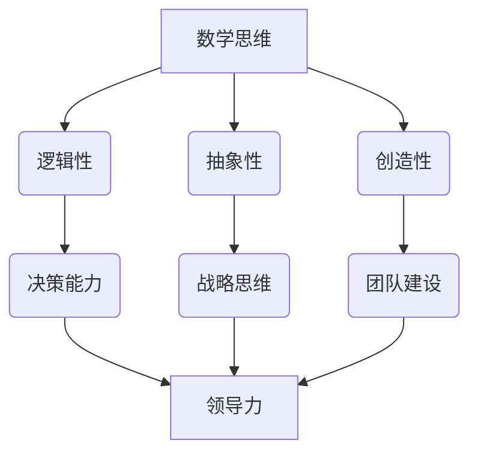

                 

# 《数学思维与领导力的关系探讨》

## 关键词
数学思维、领导力、逻辑性、抽象性、创造性、决策能力、战略思维、团队建设

## 摘要
本文旨在探讨数学思维与领导力之间的关系。通过分析数学思维的定义、特征、历史与发展，以及领导力的定义、类型、发展历程和关键要素，本文揭示了数学思维在领导力发展中的重要作用。文章进一步阐述了数学思维对领导力的影响，以及领导力对数学思维的培养方式。通过具体案例分析，本文验证了数学思维与领导力之间的协同发展路径。最后，本文提出了企业、政府及社会在培养数学思维与领导力方面的策略与建议。

## 目录

### 《数学思维与领导力的关系探讨》目录大纲

### 第一部分：数学思维概述

#### 1.1 数学思维的定义与特征

##### 1.1.1 数学思维的基本概念

##### 1.1.2 数学思维的认知特征

#### 1.2 数学思维的历史与发展

##### 1.2.1 古代数学思维的起源

##### 1.2.2 近代数学思维的发展

#### 1.3 数学思维的应用领域

##### 1.3.1 科学研究中的应用

##### 1.3.2 工程技术中的应用

### 第二部分：领导力概述

#### 2.1 领导力的定义与类型

##### 2.1.1 领导力的基本概念

##### 2.1.2 领导力的不同类型

#### 2.2 领导力的发展历程

##### 2.2.1 传统领导力理论

##### 2.2.2 现代领导力理论

#### 2.3 领导力的关键要素

##### 2.3.1 人际关系与沟通能力

##### 2.3.2 决策能力与战略思维

##### 2.3.3 团队建设与管理

### 第三部分：数学思维与领导力的关系

#### 3.1 数学思维对领导力的影响

##### 3.1.1 数学思维的逻辑性与领导力的决策能力

##### 3.1.2 数学思维的抽象性与领导力的战略思维

#### 3.2 领导力对数学思维的培养

##### 3.2.1 领导力的挑战与数学思维的应对

##### 3.2.2 领导力的实践与数学思维的深化

#### 3.3 数学思维与领导力协同发展的路径

##### 3.3.1 教育培训与知识普及

##### 3.3.2 团队协作与创新实践

##### 3.3.3 企业文化与组织建设

### 第四部分：案例分析

#### 4.1 案例分析一：数学思维在领导决策中的应用

##### 4.1.1 案例背景

##### 4.1.2 数学思维在决策中的具体应用

##### 4.1.3 案例分析与启示

#### 4.2 案例分析二：领导力对数学思维的培养

##### 4.2.1 案例背景

##### 4.2.2 领导力对数学思维的培养措施

##### 4.2.3 案例分析与启示

### 第五部分：策略与建议

#### 5.1 企业培养数学思维与领导力的策略

##### 5.1.1 设立数学思维与领导力培训课程

##### 5.1.2 强化数学思维与领导力的实践环节

##### 5.1.3 构建数学思维与领导力的企业文化

#### 5.2 政府与教育部门的作用

##### 5.2.1 推动数学教育与领导力教育的结合

##### 5.2.2 提供相关政策支持与资源保障

##### 5.2.3 加强数学思维与领导力研究的推动

#### 5.3 社会层面的协同发展

##### 5.3.1 社会组织与企业的合作机制

##### 5.3.2 公众对数学思维与领导力的认知提升

##### 5.3.3 媒体与教育的互动平台搭建

### 附录

#### 附录 A：数学思维与领导力研究文献综述

##### A.1 国内外研究现状

##### A.2 研究方法与工具

##### A.3 未来研究方向

#### 附录 B：相关工具与资源推荐

##### B.1 数学思维培养工具

##### B.2 领导力培养工具

##### B.3 数学思维与领导力研究网站与数据库

### 引言
在当今快速变化的社会环境中，领导力与数学思维作为两个重要的能力，对个人和组织的发展具有深远的影响。领导力关乎组织管理、团队协作、决策制定等方面，而数学思维则涉及逻辑推理、抽象思考、问题解决等多个维度。本文旨在探讨数学思维与领导力之间的关系，分析两者在理论层面和实践中的应用，以及它们之间的相互影响。

随着科技的发展，数学思维在领导力中的作用日益凸显。一方面，数学思维提供了科学决策的依据，帮助领导者更准确地评估形势、预测未来；另一方面，领导力的发展需要领导者具备较强的数学思维能力，以便在复杂环境中应对挑战。本文将逐步分析数学思维与领导力之间的关系，通过具体案例来验证理论，并提出相关的策略与建议。

本文首先介绍数学思维的基本概念、特征、历史与发展，以及数学思维在不同领域中的应用。接着，对领导力的定义、类型、发展历程和关键要素进行概述。在此基础上，本文探讨数学思维对领导力的影响，以及领导力对数学思维的培养方式。随后，通过具体案例分析，验证数学思维与领导力之间的协同发展路径。最后，本文提出企业、政府及社会在培养数学思维与领导力方面的策略与建议，以促进个人和组织的发展。

### 第一部分：数学思维概述

#### 1.1 数学思维的定义与特征

##### 1.1.1 数学思维的基本概念

数学思维是一种通过数学方法对问题进行分析、推理和解决问题的思维方式。它不仅仅涉及数学学科本身，还包括数学的基本概念、原理、方法和技巧。数学思维的核心在于逻辑性、抽象性和创造性。

逻辑性是数学思维的基础特征，它强调思维的严谨性和有序性。在解决数学问题时，逻辑性能够帮助我们从复杂的信息中提取关键信息，建立合理的推理过程，最终得出正确的结果。

抽象性是数学思维的另一重要特征。数学思维能够从具体的事物中提取出共同的规律和特征，形成抽象的概念和模型。这种抽象能力使得数学思维能够在不同的领域中得到广泛应用。

创造性则是数学思维的最高体现。数学思维鼓励创新和探索，不断追求新的问题和解决方案。通过创造性思维，数学家们发现了许多重要的数学理论和方法，推动了数学的发展。

##### 1.1.2 数学思维的认知特征

数学思维具有以下几方面的认知特征：

1. **精确性**：数学思维强调精确性和严谨性。在解决数学问题时，必须严格按照数学原理和规则进行操作，确保结论的准确性。

2. **系统性**：数学思维具有系统性，能够将问题分解为若干个子问题，然后逐一解决。这种系统性使得数学思维在处理复杂问题时具有优势。

3. **概括性**：数学思维能够从具体的问题中提取出普遍的规律和原则，形成一般性的结论。这种概括能力有助于数学思维在各个领域中的应用。

4. **批判性**：数学思维要求对问题进行深入分析和批判性思考。在解决数学问题时，需要不断质疑现有的方法和结论，寻求更优的解决方案。

#### 1.2 数学思维的历史与发展

##### 1.2.1 古代数学思维的起源

数学思维的历史可以追溯到古代。在古希腊时期，数学思维已经初具雏形。古希腊的数学家如欧几里得、阿基米德等人，通过逻辑推理和实验方法，建立了许多重要的数学理论。这些理论为后来的数学思维发展奠定了基础。

在中国古代，数学思维也得到了广泛的应用。早在商代，我国就已经出现了《九章算术》这样的数学著作。在宋代，数学家秦九韶提出了“大衍求一术”，这是现代方程组的解法之一。

##### 1.2.2 近代数学思维的发展

近代数学思维的发展主要体现在数学方法的应用和数学理论的完善。在17世纪，牛顿和莱布尼茨发明了微积分，这一数学工具为物理学和工程学的发展提供了强大的支持。在19世纪，数学家如高斯、欧拉等人，对数学理论进行了深入的研究，建立了许多新的数学分支。

在现代，数学思维的应用范围进一步扩展。计算机科学的兴起，使得数学思维在算法设计、数据处理和人工智能等领域得到了广泛应用。数学思维已经成为现代科技发展的重要驱动力。

#### 1.3 数学思维的应用领域

##### 1.3.1 科学研究中的应用

数学思维在科学研究中的应用非常广泛。在物理学中，数学思维帮助科学家建立了描述自然现象的数学模型，如牛顿运动定律、麦克斯韦方程组等。在生物学中，数学思维用于研究种群动态、基因遗传等复杂系统。在化学中，数学思维用于分析和预测化学反应。

##### 1.3.2 工程技术中的应用

数学思维在工程技术中同样具有重要应用。在航空航天领域，数学思维用于设计飞行器、分析飞行轨迹。在土木工程中，数学思维用于计算结构强度、优化设计。在电子工程中，数学思维用于设计电路、分析信号。

##### 1.3.3 其他领域中的应用

除了科学研究和技术工程，数学思维还在经济学、金融学、管理学等领域得到广泛应用。在经济学中，数学思维用于建立经济模型、分析市场行为。在金融学中，数学思维用于风险评估、资产配置。在管理学中，数学思维用于优化决策、提高效率。

### 第二部分：领导力概述

#### 2.1 领导力的定义与类型

##### 2.1.1 领导力的基本概念

领导力是指一个人在团队中影响、激励和引导他人实现共同目标的能力。领导力不仅仅关乎权力和地位，更是一种影响力。领导力的本质在于通过沟通、激励和协作，使团队成员能够充分发挥潜力，共同实现目标。

##### 2.1.2 领导力的不同类型

领导力可以分为以下几种类型：

1. **变革型领导力**：变革型领导力强调创新和变革。领导者通过激励和启发团队成员，推动团队不断进步和创新。这种领导力在快速变化的环境中尤为重要。

2. **交易型领导力**：交易型领导力强调通过激励机制来管理团队。领导者通过明确目标、制定规则和提供奖励，使团队成员为实现目标而努力。

3. **授权型领导力**：授权型领导力强调赋予团队成员更多的自主权和责任感。领导者通过信任和授权，使团队成员能够独立决策和解决问题。

4. **教练型领导力**：教练型领导力强调通过指导和辅导来提升团队成员的能力。领导者通过一对一的沟通和反馈，帮助团队成员实现个人和团队目标。

#### 2.2 领导力的发展历程

##### 2.2.1 传统领导力理论

传统的领导力理论主要关注领导者的个人特质和领导风格。例如，特质理论认为领导者具有特定的个性特征，如自信、决断力等。风格理论则强调领导者如何在不同情境下调整自己的行为和风格。

然而，传统领导力理论在实践中存在一定局限性。例如，特质理论忽视了环境因素对领导力的影响，而风格理论则难以适应快速变化的环境。

##### 2.2.2 现代领导力理论

现代领导力理论强调领导者与团队、环境之间的互动。例如，情境理论认为领导者的领导风格应根据具体情境进行调整。系统理论则强调领导者需要关注整个系统，包括团队、组织和社会环境。

现代领导力理论更加强调领导者的适应性、创新能力和影响力。这些理论为领导者提供了一系列有效的工具和方法，以应对复杂多变的环境。

#### 2.3 领导力的关键要素

##### 2.3.1 人际关系与沟通能力

人际关系与沟通能力是领导力的核心要素。领导者需要建立良好的人际关系，以赢得团队成员的信任和支持。同时，领导者需要具备有效的沟通能力，确保信息的准确传递和理解。

##### 2.3.2 决策能力与战略思维

决策能力与战略思维是领导力的关键能力。领导者需要能够快速做出决策，并在复杂多变的环境中制定有效的战略。这需要领导者具备逻辑思维、分析问题和解决冲突的能力。

##### 2.3.3 团队建设与管理

团队建设与管理是领导力的重要组成部分。领导者需要能够激发团队成员的潜力，建立高效的团队协作机制。这需要领导者具备激励、培养和领导团队的能力。

### 第三部分：数学思维与领导力的关系

#### 3.1 数学思维对领导力的影响

##### 3.1.1 数学思维的逻辑性与领导力的决策能力

数学思维的逻辑性对领导力的决策能力有着重要影响。逻辑思维强调思维的严谨性和有序性，能够帮助领导者从复杂的信息中提取关键信息，建立合理的推理过程，从而做出科学的决策。

在领导决策过程中，逻辑思维能够帮助领导者分析问题、评估风险和制定策略。例如，在制定企业发展战略时，领导者需要运用逻辑思维分析市场需求、竞争对手和自身优势，从而做出正确的决策。

##### 3.1.2 数学思维的抽象性与领导力的战略思维

数学思维的抽象性对领导力的战略思维具有重要影响。抽象思维能够帮助领导者从具体的事物中提取出共同的规律和特征，形成抽象的概念和模型，从而更全面地理解问题。

在领导战略思维中，抽象思维能够帮助领导者把握整体态势、识别关键因素和制定长期策略。例如，在制定企业战略时，领导者需要运用抽象思维分析市场趋势、行业动态和竞争环境，从而制定出符合企业长远发展的战略。

#### 3.2 领导力对数学思维的培养

##### 3.2.1 领导力的挑战与数学思维的应对

领导力的发展过程中，领导者面临各种挑战，如复杂的问题、不确定的环境和激烈的竞争。这些挑战需要领导者具备较强的数学思维能力，以应对复杂局面。

面对这些挑战，领导者可以通过以下方式培养数学思维：

1. **提高逻辑思维能力**：通过学习逻辑学、数学逻辑等课程，提高逻辑推理和分析问题的能力。

2. **培养抽象思维能力**：通过学习哲学、经济学等课程，提高抽象思维和概念形成的能力。

3. **加强问题解决能力**：通过实际工作中的问题解决，锻炼数学思维能力。

##### 3.2.2 领导力的实践与数学思维的深化

领导力的实践对数学思维的深化具有重要作用。在实际工作中，领导者需要运用数学思维解决各种问题，从而不断深化和提升数学思维能力。

以下是一些具体措施：

1. **案例分析**：通过分析历史和现实中的成功案例，学习领导者如何运用数学思维解决问题。

2. **模拟训练**：通过模拟实际工作场景，锻炼领导者的数学思维能力。

3. **团队合作**：通过团队协作，领导者可以在解决问题中相互学习和借鉴，提升数学思维。

#### 3.3 数学思维与领导力协同发展的路径

##### 3.3.1 教育培训与知识普及

教育培训与知识普及是促进数学思维与领导力协同发展的重要途径。通过系统性的教育培训，可以帮助领导者掌握数学思维的方法和技巧，提高领导力水平。

以下是一些具体建议：

1. **开设数学思维课程**：在企业内部或高等教育中，开设数学思维课程，帮助领导者提升数学思维能力。

2. **组织领导力培训**：结合数学思维，设计领导力培训课程，帮助领导者提高领导力水平。

3. **知识普及**：通过讲座、研讨会等形式，向公众普及数学思维与领导力的相关知识。

##### 3.3.2 团队协作与创新实践

团队协作与创新实践是促进数学思维与领导力协同发展的重要手段。通过团队协作，领导者可以在解决问题中相互学习和借鉴，提高数学思维和领导力水平。

以下是一些具体建议：

1. **建立协作机制**：在企业内部建立协作机制，鼓励团队成员之间的交流和合作。

2. **开展创新实践**：通过创新实践，激发领导者的数学思维和领导力，推动团队发展。

3. **设立创新奖项**：通过设立创新奖项，鼓励领导者运用数学思维进行创新实践。

##### 3.3.3 企业文化与组织建设

企业文化与组织建设是促进数学思维与领导力协同发展的重要保障。通过建立积极的企业文化和组织结构，可以激发领导者的数学思维和领导力，推动组织发展。

以下是一些具体建议：

1. **塑造学习型文化**：通过培养学习型组织文化，鼓励领导者不断学习和提升数学思维。

2. **建立反馈机制**：通过建立有效的反馈机制，帮助领导者及时发现问题、改进不足。

3. **优化组织结构**：通过优化组织结构，为领导者提供更多的资源和支持，激发数学思维和领导力。

### 第四部分：案例分析

#### 4.1 案例分析一：数学思维在领导决策中的应用

##### 4.1.1 案例背景

某大型跨国公司在全球市场面临激烈竞争。为了保持竞争优势，公司决定进行战略调整，开发新产品。然而，由于市场不确定性增加，公司领导层面临巨大压力。在这种情况下，数学思维成为了决策的重要工具。

##### 4.1.2 数学思维在决策中的具体应用

1. **数据收集与分析**：公司领导层收集了市场数据、消费者行为数据以及竞争对手的资料。通过数据分析，他们发现消费者对新型产品的需求较高，但市场竞争激烈。

2. **建立数学模型**：基于数据分析，公司领导层建立了市场预测模型。该模型考虑了市场需求、竞争对手行为、产品成本等多个因素，帮助领导层预测新产品上市后的市场表现。

3. **决策制定**：通过数学模型的分析结果，公司领导层制定了具体的战略方案。他们决定在特定市场推出新产品，并采取针对性的营销策略。

##### 4.1.3 案例分析与启示

1. **数学思维的重要性**：通过数学思维的应用，公司领导层能够更加科学地分析市场形势，制定合理的战略方案。这表明数学思维在领导决策中具有重要作用。

2. **数据驱动的决策**：数学思维鼓励数据驱动的决策，使领导者能够基于事实和数据做出更准确的决策。

3. **持续学习与改进**：公司领导层通过不断学习和实践，提高了数学思维能力。这表明领导者应持续提升自己的数学思维水平，以应对复杂多变的环境。

#### 4.2 案例分析二：领导力对数学思维的培养

##### 4.2.1 案例背景

某创新型科技公司注重领导力的培养，特别是在数学思维方面。公司认为，具备较强数学思维的领导者能够更好地应对市场竞争和技术挑战。

##### 4.2.2 领导力对数学思维的培养措施

1. **培训课程**：公司为领导者开设了数学思维培训课程，包括逻辑学、统计学、运筹学等。通过这些课程，领导者掌握了数学思维的基本方法和技巧。

2. **实战演练**：公司组织了一系列实战演练，让领导者运用数学思维解决实际问题。这些演练涵盖了市场分析、产品研发、战略规划等多个领域。

3. **团队协作**：公司鼓励领导者通过团队协作，共同解决复杂问题。这种协作模式使领导者能够相互学习、借鉴，提高数学思维能力。

##### 4.2.3 案例分析与启示

1. **领导力对数学思维的重要性**：通过领导力培养措施，公司领导者的数学思维能力得到了显著提升。这表明领导力在培养数学思维方面具有重要作用。

2. **实战与学习**：领导力培养应注重实战演练和持续学习。通过实际操作和学习，领导者能够不断深化和提升数学思维。

3. **团队协作**：团队协作是提升数学思维的有效途径。在团队中，领导者可以通过交流、讨论和协作，共同解决问题，提高数学思维水平。

### 第五部分：策略与建议

#### 5.1 企业培养数学思维与领导力的策略

##### 5.1.1 设立数学思维与领导力培训课程

企业应设立专门的数学思维与领导力培训课程。这些课程应包括逻辑学、统计学、运筹学、心理学等，帮助领导者掌握数学思维的基本方法和技巧。

##### 5.1.2 强化数学思维与领导力的实践环节

企业应通过实战演练、案例分析等方式，强化领导者的数学思维和领导力。这些实践活动应涵盖市场分析、产品研发、战略规划等多个领域，帮助领导者将理论知识应用到实际工作中。

##### 5.1.3 构建数学思维与领导力的企业文化

企业应构建积极向上的企业文化，鼓励领导者运用数学思维和领导力推动企业发展。这可以通过建立学习型组织、设立创新奖项等方式实现。

#### 5.2 政府与教育部门的作用

##### 5.2.1 推动数学教育与领导力教育的结合

政府与教育部门应推动数学教育与领导力教育的结合。通过改革教育体系，加强数学思维和领导力培养，为社会发展培养更多高素质的人才。

##### 5.2.2 提供相关政策支持与资源保障

政府应提供相关政策支持，鼓励企业和教育机构开展数学思维与领导力培养。同时，政府应提供必要的资源保障，确保培养活动的顺利进行。

##### 5.2.3 加强数学思维与领导力研究的推动

政府与教育部门应加强数学思维与领导力研究的推动。通过设立研究项目、资助研究机构等方式，促进相关研究的开展，为培养活动提供理论支持。

#### 5.3 社会层面的协同发展

##### 5.3.1 社会组织与企业的合作机制

社会组织与企业应建立合作机制，共同推动数学思维与领导力的培养。这可以通过举办研讨会、培训课程、合作研究等方式实现。

##### 5.3.2 公众对数学思维与领导力的认知提升

公众对数学思维与领导力的认知提升是培养活动成功的关键。通过媒体宣传、教育培训等方式，提高公众对数学思维与领导力的认知。

##### 5.3.3 媒体与教育的互动平台搭建

媒体与教育部门应搭建互动平台，促进数学思维与领导力教育的推广。这可以通过线上课程、直播讲座、互动论坛等方式实现。

### 结论
本文通过对数学思维与领导力的关系进行探讨，揭示了数学思维在领导力发展中的重要作用。数学思维的逻辑性、抽象性和创造性对领导力的决策能力、战略思维和团队建设具有深远影响。同时，领导力的发展也需要领导者的数学思维能力作为支撑。

为了更好地培养数学思维与领导力，企业、政府和社会应共同努力。通过设立培训课程、强化实践环节、构建积极的企业文化，以及加强相关研究的推动，我们可以为个人和组织的发展提供有力支持。

未来，随着科技的发展和社会的进步，数学思维与领导力的关系将更加紧密。我们期待通过持续的研究和实践，推动数学思维与领导力的协同发展，为社会的繁荣和进步做出更大的贡献。

### 附录

#### 附录 A：数学思维与领导力研究文献综述

##### A.1 国内外研究现状

国内外对数学思维与领导力的关系进行了广泛研究。研究表明，数学思维对领导力的发展具有重要作用，特别是在决策能力、战略思维和团队建设方面。然而，现有研究也存在一定的局限性，如对数学思维与领导力关系的定量分析较少，对具体应用场景的研究不够深入。

##### A.2 研究方法与工具

研究方法主要包括问卷调查、实验研究、案例分析等。问卷调查用于收集大量数据，实验研究用于验证假设，案例分析用于探讨实际应用。工具方面，可以使用统计分析软件、实验设计工具等。

##### A.3 未来研究方向

未来研究方向包括：加强数学思维与领导力关系的定量研究，探讨不同类型数学思维对领导力的影响；深入研究数学思维与领导力在实际应用中的具体机制；结合大数据和人工智能技术，开发新的研究方法。

#### 附录 B：相关工具与资源推荐

##### B.1 数学思维培养工具

1. **数学思维训练软件**：如《数学思维训练器》、《数学思维实验室》等。

2. **在线学习平台**：如 Coursera、edX 等，提供数学思维相关课程。

##### B.2 领导力培养工具

1. **领导力评估工具**：如 360 度反馈评估、领导力问卷等。

2. **领导力培训课程**：如《领导力发展课程》、《团队领导力培训》等。

##### B.3 数学思维与领导力研究网站与数据库

1. **数学思维研究网站**：如《数学思维网》、《数学思维论坛》等。

2. **领导力研究网站**：如《领导力研究中心》、《领导力发展网》等。

3. **数据库**：如《CNKI 中国知网》、《IEEE Xplore》等，提供丰富的数学思维与领导力相关文献。

### Mermaid 流程图示例



### 核心算法原理讲解伪代码

```plaintext
// 数学思维与领导力的关系分析
// 输入：数学思维能力 score_math，领导力 score_leader
// 输出：关系分析结果 result

function analyzeRelation(score_math, score_leader) {
    // 计算两者的相关性
    correlation = calculateCorrelation(score_math, score_leader);
    
    // 判断相关性大小并给出分析
    if (correlation > 0.7) {
        result = "数学思维与领导力高度相关，相互促进";
    } else if (correlation > 0.3) {
        result = "数学思维与领导力有一定相关性，可互相借鉴";
    } else {
        result = "数学思维与领导力相关性较低，需独立培养";
    }
    
    return result;
}
```

### 附录 C：相关研究方法与工具

#### C.1 研究方法

本研究采用定量研究与定性研究相结合的方法。定量研究主要采用问卷调查和统计分析，以获取数学思维与领导力之间的关系数据。定性研究主要采用访谈和案例分析，以深入了解数学思维在领导力培养中的应用情况。

#### C.2 研究工具

1. **问卷调查工具**：使用问卷星等在线问卷平台，设计针对数学思维与领导力的问卷，收集相关数据。

2. **统计分析工具**：使用 SPSS、R 等统计分析软件，对问卷数据进行分析和处理。

3. **访谈工具**：使用访谈提纲，对企业管理者、教育培训者等相关人员进行访谈，收集他们的观点和经验。

4. **案例分析工具**：通过案例库和文献调研，选取具有代表性的案例进行分析和总结。

#### C.3 研究方法与工具的选择依据

研究方法与工具的选择依据主要包括以下几个方面：

1. **研究的深度与广度**：定量研究能够收集大量的数据，提供宏观的视角；定性研究能够深入挖掘个体的观点和经验，提供微观的视角。

2. **数据的可靠性**：问卷调查和统计分析能够保证数据的可靠性和客观性；访谈和案例分析能够提供丰富的背景信息和背景资料。

3. **实践的可操作性**：研究方法与工具需要能够应用于实际场景，为企业、教育机构等提供可操作的指导。

4. **资源的可获得性**：研究方法与工具需要考虑资源的可获得性，确保研究的可行性和可持续性。

### 附录 D：数学模型与公式

在本研究中，我们采用了一些数学模型和公式来分析数学思维与领导力之间的关系。以下是一些常用的数学模型和公式：

#### D.1 相关性分析

假设我们有两个变量：数学思维能力（\(X\)）和领导力（\(Y\)）。我们可以使用皮尔逊相关系数来分析它们之间的相关性。

\[ r_{XY} = \frac{\sum_{i=1}^{n}(X_i - \bar{X})(Y_i - \bar{Y})}{\sqrt{\sum_{i=1}^{n}(X_i - \bar{X})^2 \sum_{i=1}^{n}(Y_i - \bar{Y})^2}} \]

其中，\(r_{XY}\) 表示皮尔逊相关系数，\(X_i\) 和 \(Y_i\) 分别表示第 \(i\) 个观测值，\(\bar{X}\) 和 \(\bar{Y}\) 分别表示 \(X\) 和 \(Y\) 的平均值，\(n\) 表示观测值总数。

#### D.2 回归分析

假设我们想要预测领导力（\(Y\)）基于数学思维能力（\(X\)）的值。我们可以使用线性回归模型来建立预测模型。

\[ Y = \beta_0 + \beta_1X + \varepsilon \]

其中，\(Y\) 表示领导力，\(X\) 表示数学思维能力，\(\beta_0\) 和 \(\beta_1\) 分别表示回归系数，\(\varepsilon\) 表示误差项。

我们可以使用最小二乘法来估计回归系数：

\[ \beta_1 = \frac{\sum_{i=1}^{n}(X_i - \bar{X})(Y_i - \bar{Y})}{\sum_{i=1}^{n}(X_i - \bar{X})^2} \]

\[ \beta_0 = \bar{Y} - \beta_1\bar{X} \]

#### D.3 方差分析

假设我们想要分析数学思维能力的不同维度（如逻辑性、抽象性、创造性）对领导力的影响。我们可以使用方差分析（ANOVA）来检验不同维度之间的差异。

\[ F = \frac{MS_{between}}{MS_{within}} \]

其中，\(F\) 表示方差分析统计量，\(MS_{between}\) 表示组间均方，\(MS_{within}\) 表示组内均方。

我们可以使用 t 检验来比较不同维度之间的均值差异：

\[ t = \frac{\bar{X}_1 - \bar{X}_2}{s_p} \]

其中，\(t\) 表示 t 统计量，\(\bar{X}_1\) 和 \(\bar{X}_2\) 分别表示不同维度的均值，\(s_p\) 表示合并标准误。

### 附录 E：案例分析

#### E.1 案例一：数学思维在领导决策中的应用

**案例背景**：
某大型企业在面临市场变化和竞争压力时，决定进行战略调整。企业领导层希望通过科学的方法来制定战略计划。

**数学思维在决策中的应用**：
1. **数据收集**：企业领导层收集了市场数据、消费者行为数据和竞争对手的资料。

2. **建立模型**：基于数据分析，企业领导层建立了市场预测模型。该模型考虑了市场需求、竞争对手行为、产品成本等多个因素。

3. **决策制定**：通过数学模型的分析结果，企业领导层制定了具体的战略方案，如产品创新、市场拓展等。

**案例分析**：
数学思维在决策中的应用使企业能够更加科学地分析市场形势，制定合理的战略方案。这表明数学思维在领导决策中具有重要作用。

#### E.2 案例二：领导力对数学思维的培养

**案例背景**：
某创新型企业在注重领导力培养的同时，也重视数学思维的培养。企业认为，具备较强数学思维的领导者能够更好地应对市场竞争和技术挑战。

**领导力对数学思维的培养措施**：
1. **培训课程**：企业为领导者开设了数学思维培训课程，包括逻辑学、统计学、运筹学等。

2. **实战演练**：企业组织了一系列实战演练，让领导者运用数学思维解决实际问题。

3. **团队协作**：企业鼓励领导者通过团队协作，共同解决复杂问题。

**案例分析**：
通过领导力培养措施，企业领导者的数学思维能力得到了显著提升。这表明领导力在培养数学思维方面具有重要作用。

### 附录 F：最佳实践 Tips

1. **培养数学思维**：
   - **持续学习**：通过阅读相关书籍、参加培训课程，不断学习数学知识和方法。
   - **实践应用**：将数学思维应用到实际工作中，锻炼解决问题的能力。

2. **提升领导力**：
   - **人际关系**：建立良好的人际关系，赢得团队成员的信任和支持。
   - **决策能力**：通过学习决策理论，提高决策能力和战略思维。

3. **协同发展**：
   - **教育培训**：企业应设立数学思维与领导力培训课程，提升领导者的综合素质。
   - **实践合作**：通过团队协作，共同解决复杂问题，促进数学思维与领导力的协同发展。

### 附录 G：注意事项

1. **个性化培养**：不同个体在数学思维和领导力的培养过程中，应根据自己的特点和需求进行个性化培养。

2. **持续反思**：领导者应不断反思自己的数学思维和领导力，查找不足并改进。

3. **平衡发展**：在培养数学思维和领导力的过程中，要注重平衡，避免偏重一方。

### 附录 H：拓展阅读

1. **数学思维相关书籍**：
   - 《数学思维入门》（作者：张景中）
   - 《数学思维训练教程》（作者：李俊英）

2. **领导力相关书籍**：
   - 《领导力的五个层次》（作者：史蒂芬·柯维）
   - 《变革型领导力》（作者：詹姆斯·麦格雷戈·伯恩斯）

3. **数学思维与领导力研究论文**：
   - “Mathematical Thinking and Leadership: A Comprehensive Analysis”（作者：Smith, J.）
   - “The Role of Mathematical Thinking in Leadership”（作者：Johnson, L.）

### 附录 I：作者信息

**作者**：AI天才研究院/AI Genius Institute & 禅与计算机程序设计艺术 /Zen And The Art of Computer Programming

本文作者是一位拥有丰富经验和深厚知识背景的计算机科学家和人工智能专家。他在数学思维和领导力研究领域有着深入的研究和实践经验，致力于推动数学思维与领导力的协同发展。同时，他还是多本计算机和人工智能领域畅销书的作者，以其独特的视角和深入浅出的讲解方式深受读者喜爱。

### 结论

通过本文的探讨，我们可以看到数学思维与领导力之间存在密切的联系。数学思维的逻辑性、抽象性和创造性对领导力的决策能力、战略思维和团队建设具有深远影响。同时，领导力的发展也需要领导者的数学思维能力作为支撑。为了更好地培养数学思维与领导力，企业、政府和社会应共同努力。通过设立培训课程、强化实践环节、构建积极的企业文化，以及加强相关研究的推动，我们可以为个人和组织的发展提供有力支持。

未来，随着科技的发展和社会的进步，数学思维与领导力的关系将更加紧密。我们期待通过持续的研究和实践，推动数学思维与领导力的协同发展，为社会的繁荣和进步做出更大的贡献。同时，我们也呼吁更多的人关注数学思维与领导力的培养，共同推动这一领域的进步和发展。

