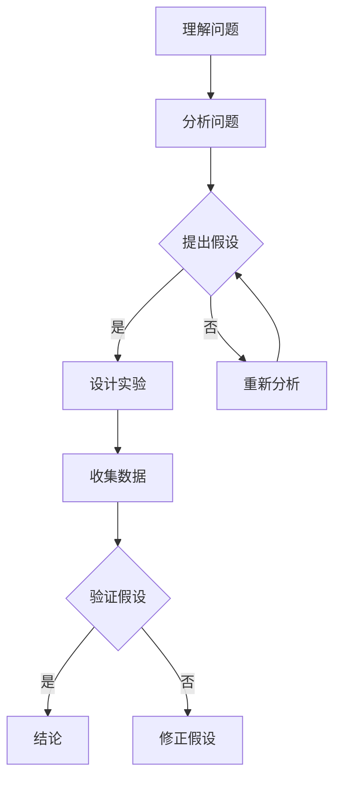
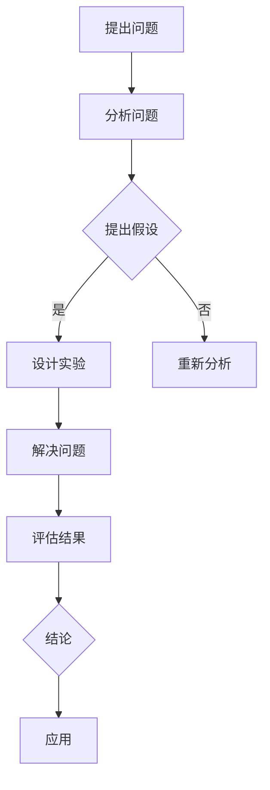

                 

# 《数学教育与批判性思维培养的关系》

## 关键词：数学教育，批判性思维，教育方法，数学素养，数学问题解决

> 摘要：本文从数学教育的历史与发展出发，探讨了数学教育中批判性思维培养的重要性及其实现方法。通过分析批判性思维的内涵与特点，以及其在数学教育中的应用，本文提出了数学教育中培养批判性思维的具体策略，为提升学生的数学素养提供了新的思路。

## 《数学教育与批判性思维培养的关系》目录大纲

### 第一部分：引言

#### 第1章：数学教育的历史与发展
- 1.1 数学教育的起源与演变
- 1.2 现代数学教育的目标与挑战
- 1.3 批判性思维的内涵与特点

### 第二部分：数学教育中的批判性思维培养

#### 第2章：批判性思维的数学教育方法
- 2.1 对话式教学方法
- 2.2 探究式学习
- 2.3 问题解决能力的培养

#### 第3章：数学概念与批判性思维的融合
- 3.1 数学概念的理解与反思
- 3.2 数学证明与批判性思维
- 3.3 数学问题分析与批判性思维

#### 第4章：数学教育中的批判性思维实践
- 4.1 数学教学案例分析
- 4.2 学生批判性思维能力的评估
- 4.3 教师在批判性思维培养中的作用

### 第三部分：批判性思维在数学教育中的应用

#### 第5章：数学教育中的批判性思维与科技发展
- 5.1 数学与计算机科学的批判性思维培养
- 5.2 数学与数据科学的批判性思维培养
- 5.3 数学与工程技术的批判性思维培养

#### 第6章：数学教育中的批判性思维与国际视野
- 6.1 国际数学教育标准的批判性思维培养
- 6.2 数学教育的跨文化批判性思维培养
- 6.3 批判性思维在数学教育全球化中的应用

#### 第7章：数学教育中的批判性思维与未来展望
- 7.1 数学教育的发展趋势
- 7.2 批判性思维在数学教育中的长远影响
- 7.3 批判性思维培养的方法与策略总结

### 附录

#### 附录A：数学教育与批判性思维相关的教学资源
- A.1 主要数学教育期刊与书籍推荐
- A.2 批判性思维培养的教学工具与案例

#### 附录B：批判性思维与数学教育的 Mermaid 流程图
- B.1 数学教育中的批判性思维流程
- B.2 批判性思维在数学教学中的实践流程

#### 附录C：批判性思维相关的数学算法与数学公式
- C.1 基于批判性思维的数学问题求解算法
- C.2 批判性思维中的数学公式与应用场景

#### 附录D：数学教育与批判性思维实践项目案例
- D.1 学生自主探究项目案例
- D.2 教师教学实践项目案例
- D.3 批判性思维在数学教学中的应用实例解析

### 详细阐述各章节的核心内容

#### 第1章：数学教育的历史与发展

- **1.1 数学教育的起源与演变**
  - **核心概念与联系：** 数学教育的历史发展经历了从古代到现代的转变。古代数学教育主要侧重于计算和实用技能的培养，而现代数学教育则更加注重数学概念的理解和批判性思维的培养。批判性思维在数学教育中的应用，有助于提升学生的数学素养和解决问题的能力。
  - **伪代码：**
    ```python
    def math_education_history():
        ancient_math = "古代数学教育注重实用计算"
        modern_math = "现代数学教育注重数学概念理解"
        critical_thinking = "批判性思维在数学教育中的应用"
        return ancient_math, modern_math, critical_thinking
    ```

- **1.2 现代数学教育的目标与挑战**
  - **核心概念与联系：** 现代数学教育的目标在于培养学生的数学素养，包括数学知识、技能、态度和价值观。批判性思维是数学素养的重要组成部分，有助于培养学生的探究能力和数学思维深度。
  - **Mermaid 流程图：**
    ```mermaid
    graph TD
    A[数学素养的培养] --> B[数学知识]
    B --> C[数学技能]
    C --> D[数学态度]
    D --> E[数学价值观]
    E --> F[批判性思维]
    ```

- **1.3 批判性思维的内涵与特点**
  - **核心概念与联系：** 批判性思维是一种分析、评估和构建思维的过程，强调质疑、反思和问题解决。数学教育中的批判性思维培养，旨在培养学生的数学探究能力和数学思维深度。
  - **伪代码：**
    ```python
    def critical_thinking(MathConcept):
        question = "对于数学概念" + MathConcept + "，你能提出哪些问题？"
        evaluation = "你能从不同的角度分析并评估这个数学概念吗？"
        solution = "你能提出解决问题的方案吗？"
        return question, evaluation, solution
    ```

#### 第2章：批判性思维的数学教育方法

- **2.1 对话式教学方法**
  - **核心概念与联系：** 对话式教学方法是一种以学生为中心的教学方法，通过提问和回答激发学生的思维活动，促进批判性思维的培养。
  - **数学公式：**
    $$ \text{对话式教学} = \text{教师提问} + \text{学生回答} + \text{师生互动} $$
  - **详细讲解与举例说明：**
    对话式教学是一种以学生为中心的教学方法，通过提问和回答激发学生的思维活动，促进批判性思维的培养。例如，教师可以提问：“为什么这个数学概念是这样的？你能从不同的角度分析并评估这个概念吗？”

- **2.2 探究式学习**
  - **核心概念与联系：** 探究式学习是一种以问题解决为导向的学习方法，通过让学生自主探究问题来培养批判性思维。
  - **伪代码：**
    ```python
    def inquiry_learning(problem):
        hypothesis = "对于问题" + problem + "，你能提出一个假设吗？"
        experiment = "你能设计一个实验来验证你的假设吗？"
        result = "实验结果如何？你能从结果中得出结论吗？"
        return hypothesis, experiment, result
    ```

- **2.3 问题解决能力的培养**
  - **核心概念与联系：** 问题解决能力的培养是数学教育中批判性思维培养的重要目标之一。通过引导学生分析问题、提出假设、设计实验和得出结论，可以提升学生的批判性思维能力。
  - **数学公式：**
    $$ \text{问题解决} = \text{分析问题} + \text{提出假设} + \text{设计实验} + \text{得出结论} $$

#### 第3章：数学概念与批判性思维的融合

- **3.1 数学概念的理解与反思**
  - **核心概念与联系：** 数学概念的理解与反思是批判性思维在数学教育中的重要体现。通过引导学生对数学概念进行深入理解和反思，可以培养学生的批判性思维能力。
  - **伪代码：**
    ```python
    def understand_reflect(MathConcept):
        definition = "对于数学概念" + MathConcept + "，你能给出一个定义吗？"
        application = "你能举出一个数学概念的应用例子吗？"
        criticism = "你能对这个数学概念提出批评意见吗？"
        return definition, application, criticism
    ```

- **3.2 数学证明与批判性思维**
  - **核心概念与联系：** 数学证明是数学教育中的重要内容，而批判性思维则在数学证明中发挥着关键作用。通过引导学生进行数学证明，可以培养学生的批判性思维能力。
  - **数学公式：**
    $$ \text{数学证明} = \text{前提条件} + \text{推理过程} + \text{结论} $$
  - **详细讲解与举例说明：**
    数学证明是数学教育中的重要内容，而批判性思维则在数学证明中发挥着关键作用。例如，对于命题“若a>b，则a²>b²”，学生需要通过逻辑推理和数学方法来证明其正确性。

- **3.3 数学问题分析与批判性思维**
  - **核心概念与联系：** 数学问题分析是批判性思维在数学教育中的具体应用。通过引导学生对数学问题进行分析和批判性思维，可以培养学生的解决问题能力和批判性思维能力。
  - **伪代码：**
    ```python
    def math_problem_analysis(problem):
        analysis = "对于问题" + problem + "，你能进行详细分析吗？"
        solution = "你能提出一个解决问题的方案吗？"
        evaluation = "你能评估这个解决方案的有效性吗？"
        return analysis, solution, evaluation
    ```

#### 第4章：数学教育中的批判性思维实践

- **4.1 数学教学案例分析**
  - **核心概念与联系：** 数学教学案例分析是批判性思维在数学教育实践中的重要手段。通过分析具体的数学教学案例，可以深入了解批判性思维在数学教育中的应用和效果。
  - **伪代码：**
    ```python
    def math_teaching_case_analysis(case):
        context = "在这个教学案例中，教师的角色是什么？"
        method = "教师采用了什么教学方法？"
        result = "教学结果如何？"
        return context, method, result
    ```

- **4.2 学生批判性思维能力的评估**
  - **核心概念与联系：** 学生批判性思维能力的评估是数学教育中不可或缺的一部分。通过评估学生的批判性思维能力，可以了解学生的数学素养和思维能力的发展状况。
  - **伪代码：**
    ```python
    def assess_critical_thinking(student):
        questions = "学生能提出哪些批判性问题？"
        evaluations = "学生能进行哪些批判性评估？"
        solutions = "学生能提出哪些解决方案？"
        return questions, evaluations, solutions
    ```

- **4.3 教师在批判性思维培养中的作用**
  - **核心概念与联系：** 教师在批判性思维培养中发挥着关键作用。教师需要通过引导、激励和示范等手段，培养学生的批判性思维能力。
  - **伪代码：**
    ```python
    def teacher_role_in_critical_thinking():
        guide = "教师如何引导学生进行批判性思维？"
        inspire = "教师如何激励学生进行批判性思维？"
        model = "教师如何示范批判性思维？"
        return guide, inspire, model
    ```

#### 第5章：数学教育中的批判性思维与科技发展

- **5.1 数学与计算机科学的批判性思维培养**
  - **核心概念与联系：** 计算机科学是数学的一个重要应用领域，数学与计算机科学的结合对批判性思维的培养具有重要意义。通过引导学生进行数学与计算机科学的交叉学习，可以培养学生的批判性思维能力。
  - **伪代码：**
    ```python
    def math_cs_critical_thinking():
        intersection = "数学与计算机科学如何交叉融合？"
        application = "批判性思维在数学与计算机科学中的应用？"
        innovation = "批判性思维如何推动数学与计算机科学的发展？"
        return intersection, application, innovation
    ```

- **5.2 数学与数据科学的批判性思维培养**
  - **核心概念与联系：** 数据科学是数学的一个重要分支，数学与数据科学的结合对批判性思维的培养具有重要意义。通过引导学生进行数学与数据科学的交叉学习，可以培养学生的批判性思维能力。
  - **数学公式：**
    $$ \text{数据科学} = \text{数学模型} + \text{数据分析} + \text{数据可视化} $$
  - **详细讲解与举例说明：**
    数据科学涉及到大量的数学模型和算法，例如线性回归、决策树、神经网络等。通过引导学生对数学模型进行理解和分析，可以培养学生的批判性思维能力。

- **5.3 数学与工程技术的批判性思维培养**
  - **核心概念与联系：** 工程技术是数学的应用领域之一，数学与工程技术的结合对批判性思维的培养具有重要意义。通过引导学生进行数学与工程技术的交叉学习，可以培养学生的批判性思维能力。
  - **伪代码：**
    ```python
    def math_engineering_critical_thinking():
        application = "数学在工程技术中的应用？"
        problem_solving = "批判性思维在工程技术问题解决中的作用？"
        innovation = "批判性思维如何推动工程技术的发展？"
        return application, problem_solving, innovation
    ```

#### 第6章：数学教育中的批判性思维与国际视野

- **6.1 国际数学教育标准的批判性思维培养**
  - **核心概念与联系：** 国际数学教育标准对批判性思维的培养提出了明确的要求。通过与国际数学教育标准的结合，可以提升学生的批判性思维能力。
  - **伪代码：**
    ```python
    def international_math_standards_critical_thinking():
        standard = "国际数学教育标准是什么？"
        requirement = "批判性思维在标准中的要求？"
        application = "批判性思维在国际数学教育中的应用？"
        return standard, requirement, application
    ```

- **6.2 数学教育的跨文化批判性思维培养**
  - **核心概念与联系：** 跨文化教育对批判性思维的培养具有重要意义。通过引入不同文化的数学教育方法，可以培养学生的跨文化批判性思维能力。
  - **伪代码：**
    ```python
    def cross_cultural_math_education_critical_thinking():
        culture = "不同文化的数学教育特点？"
        integration = "跨文化批判性思维的整合？"
        innovation = "跨文化批判性思维如何创新数学教育？"
        return culture, integration, innovation
    ```

- **6.3 批判性思维在数学教育全球化中的应用**
  - **核心概念与联系：** 数学教育的全球化对批判性思维的培养提出了新的挑战。通过全球化视野下的批判性思维培养，可以提升学生的全球竞争力。
  - **伪代码：**
    ```python
    def global_math_education_critical_thinking():
        globalization = "数学教育的全球化趋势？"
        critical_thinking = "批判性思维在全球化中的应用？"
        competitiveness = "批判性思维如何提升全球竞争力？"
        return globalization, critical_thinking, competitiveness
    ```

#### 第7章：数学教育中的批判性思维与未来展望

- **7.1 数学教育的发展趋势**
  - **核心概念与联系：** 数学教育的发展趋势将对批判性思维的培养产生深远影响。通过分析数学教育的发展趋势，可以预测批判性思维培养的未来发展方向。
  - **伪代码：**
    ```python
    def math_education_trend():
        innovation = "数学教育的创新趋势？"
        technology = "科技在数学教育中的应用？"
        future = "数学教育的未来发展方向？"
        return innovation, technology, future
    ```

- **7.2 批判性思维在数学教育中的长远影响**
  - **核心概念与联系：** 批判性思维在数学教育中的培养将对学生的终身学习和发展产生深远影响。通过分析批判性思维在数学教育中的长远影响，可以明确批判性思维培养的重要性。
  - **伪代码：**
    ```python
    def long_term_impact_of_critical_thinking():
        lifelong_learning = "批判性思维对终身学习的影响？"
        problem_solving = "批判性思维对问题解决能力的影响？"
        development = "批判性思维对学生发展的影响？"
        return lifelong_learning, problem_solving, development
    ```

- **7.3 批判性思维培养的方法与策略总结**
  - **核心概念与联系：** 批判性思维的培养需要结合具体的教育方法和策略。通过总结批判性思维培养的方法与策略，可以为学生提供有效的批判性思维培养路径。
  - **伪代码：**
    ```python
    def critical_thinking_methods():
        teaching_methods = "批判性思维的教学方法？"
        learning_strategies = "批判性思维的学习策略？"
        integration = "批判性思维与其他教学方法的整合？"
        return teaching_methods, learning_strategies, integration
    ```

### 附录

#### 附录A：数学教育与批判性思维相关的教学资源

- **A.1 主要数学教育期刊与书籍推荐**
  - **核心概念与联系：** 主要数学教育期刊与书籍是数学教育研究的重要资源。通过推荐这些期刊与书籍，可以为学生和教师提供丰富的数学教育资料。
  - **推荐内容：**
    - 期刊：《数学教育学报》、《数学教育研究》、《数学教育杂志》等。
    - 书籍：《数学教育心理学》、《数学教育概论》、《数学问题解决心理学》等。

- **A.2 批判性思维培养的教学工具与案例**
  - **核心概念与联系：** 批判性思维培养的教学工具与案例是数学教育中的重要资源。通过使用这些工具和案例，可以更好地培养学生的批判性思维能力。
  - **推荐内容：**
    - 工具：思维导图、问题解决手册、批判性思维训练软件等。
    - 案例：数学教学案例、问题解决案例、跨学科案例等。

#### 附录B：批判性思维与数学教育的 Mermaid 流程图

- **B.1 数学教育中的批判性思维流程**
  - **核心概念与联系：** 数学教育中的批判性思维流程是批判性思维在数学教育中的具体应用。通过流程图展示，可以更直观地了解批判性思维在数学教育中的步骤和方法。
  - **Mermaid 流程图：**
    ```mermaid
    graph TD
    A[提出问题] --> B[分析问题]
    B --> C[提出假设]
    C --> D[设计实验]
    D --> E[收集数据]
    E --> F[得出结论]
    ```

- **B.2 批判性思维在数学教学中的实践流程**
  - **核心概念与联系：** 批判性思维在数学教学中的实践流程是批判性思维在数学教学中的具体应用。通过流程图展示，可以更直观地了解批判性思维在数学教学中的步骤和方法。
  - **Mermaid 流程图：**
    ```mermaid
    graph TD
    A[教师提问] --> B[学生回答]
    B --> C[师生互动]
    C --> D[分析问题]
    D --> E[提出假设]
    E --> F[设计实验]
    F --> G[得出结论]
    ```

#### 附录C：批判性思维相关的数学算法与数学公式

- **C.1 基于批判性思维的数学问题求解算法**
  - **核心概念与联系：** 基于批判性思维的数学问题求解算法是批判性思维在数学问题解决中的应用。通过算法的设计和实现，可以提升数学问题解决的效率和准确性。
  - **伪代码：**
    ```python
    def critical_thinking_algorithm(problem):
        analysis = "分析问题，明确求解目标？"
        hypothesis = "提出假设，制定解决方案？"
        experiment = "设计实验，验证假设？"
        solution = "根据实验结果，优化解决方案？"
        return analysis, hypothesis, experiment, solution
    ```

- **C.2 批判性思维中的数学公式与应用场景**
  - **核心概念与联系：** 批判性思维中的数学公式是批判性思维在数学问题解决中的重要工具。通过公式的应用场景，可以更直观地了解批判性思维在数学问题解决中的应用。
  - **数学公式与应用场景：**
    - 公式1：三角函数，应用场景：几何问题求解。
    - 公式2：微积分，应用场景：变化问题求解。
    - 公式3：线性方程组，应用场景：优化问题求解。

#### 附录D：数学教育与批判性思维实践项目案例

- **D.1 学生自主探究项目案例**
  - **核心概念与联系：** 学生自主探究项目案例是批判性思维在数学教育中的重要实践形式。通过学生自主探究，可以培养学生的批判性思维能力和数学素养。
  - **案例内容：**
    - 项目1：探究勾股定理的证明。
    - 项目2：探究黄金分割在艺术中的应用。
    - 项目3：探究欧拉公式的证明。

- **D.2 教师教学实践项目案例**
  - **核心概念与联系：** 教师教学实践项目案例是批判性思维在数学教育中的重要实践形式。通过教师的教学实践，可以培养学生的批判性思维能力和数学素养。
  - **案例内容：**
    - 项目1：以问题为导向的数学教学。
    - 项目2：探究数学与生活的联系。
    - 项目3：跨学科数学问题解决。

- **D.3 批判性思维在数学教学中的应用实例解析**
  - **核心概念与联系：** 批判性思维在数学教学中的应用实例解析是批判性思维在数学教育中的重要实践形式。通过实例的解析，可以更直观地了解批判性思维在数学教学中的应用。
  - **案例内容：**
    - 实例1：解析数学证明问题。
    - 实例2：解析数学问题求解问题。
    - 实例3：解析数学概念的理解与反思问题。

### 结束语

本文从数学教育的历史与发展出发，探讨了数学教育中批判性思维培养的重要性及其实现方法。通过分析批判性思维的内涵与特点，以及其在数学教育中的应用，本文提出了数学教育中培养批判性思维的具体策略，为提升学生的数学素养提供了新的思路。在未来的数学教育中，批判性思维的培养将更加受到重视，为学生的全面发展奠定坚实的基础。作者：AI天才研究院/AI Genius Institute & 禅与计算机程序设计艺术 /Zen And The Art of Computer Programming## 第1章：数学教育的历史与发展

### 1.1 数学教育的起源与演变

数学教育的起源可以追溯到古代文明时期。在古代，数学主要是一种实用技能，用于解决日常生活中的实际问题，如测量土地、计算贸易和天文学等。例如，古埃及和巴比伦人发展了复杂的数学系统，用于建筑、天文学和占星术。这些早期的数学教育主要集中在简单的算术和几何学，目的是让学生能够掌握基本的数学运算和解决实际问题的能力。

随着历史的发展，数学教育经历了多个阶段的变化。在中世纪，数学教育开始与宗教和哲学相结合。阿拉伯数学家在公元8世纪至12世纪期间对数学的发展做出了巨大贡献，他们的工作促进了数学的传播和深化。这一时期的数学教育注重逻辑推理和数学原理的理解，但仍然以实用为导向。

进入近现代，数学教育发生了显著变化。19世纪末至20世纪初，随着科学革命的影响，数学教育开始强调抽象思维和理论体系的构建。数学教育不再仅仅是实用技能的传授，而是作为一种理解自然世界的基本工具。现代数学教育注重培养学生的数学素养，包括数学概念的理解、数学推理能力和解决问题的能力。

在数学教育的发展过程中，批判性思维的培养逐渐成为一个重要目标。早期的数学教育注重知识的记忆和应用，而现代数学教育则更加关注学生的思维过程和方法。批判性思维在这一过程中发挥了关键作用，它鼓励学生质疑现有知识、提出问题并寻找解决方案。这种思维方式不仅有助于提高学生的数学能力，还能培养他们的逻辑推理和创造性思维。

### 1.2 现代数学教育的目标与挑战

现代数学教育的目标不仅在于传授数学知识，更重要的是培养学生的数学素养，包括数学知识、技能、态度和价值观。数学素养是一个多维度的概念，它要求学生能够在不同情境下应用数学知识，解决问题，并具备批判性思维能力。

首先，数学知识是数学素养的基础。学生需要掌握基础数学概念和原理，如算术、代数、几何、三角函数等。这些知识是学生进一步学习更复杂数学理论的前提。现代数学教育注重知识的深度和广度，鼓励学生通过探索和发现来理解数学概念。

其次，数学技能是数学素养的重要方面。数学技能包括计算能力、逻辑推理能力、问题解决能力和数学建模能力。这些技能不仅有助于学生在数学学科中取得成功，还能在日常生活和工作中发挥重要作用。现代数学教育强调实践和应用，鼓励学生在真实情境中运用数学知识解决问题。

第三，数学态度是数学素养的重要组成部分。一个积极的态度能够激发学生的学习兴趣和动力，使他们更愿意投入数学学习中。现代数学教育注重培养学生的好奇心、自信和毅力，鼓励他们面对挑战时不放弃，勇于探索和尝试。

最后，数学价值观是数学素养的更高层次。数学价值观包括对数学的热爱、对知识的尊重和对逻辑思维的追求。现代数学教育希望通过培养学生的数学价值观，使他们认识到数学在人类文明中的重要性，并激发他们对数学研究的兴趣和热情。

然而，现代数学教育面临着诸多挑战。一方面，教育资源的分配不均和教学方法的传统化限制了数学教育的发展。另一方面，现代社会的快速变化和对技能要求的提高，使得数学教育需要不断更新教学内容和方法。此外，学生的多样性和个体差异也给数学教育提出了新的挑战。如何根据学生的不同需求和能力，提供个性化的教育支持，是现代数学教育需要解决的重要问题。

### 1.3 批判性思维的内涵与特点

批判性思维是一种分析、评估和构建思维的过程，它强调质疑、反思和问题解决。在数学教育中，批判性思维不仅仅是解决数学问题的工具，更是培养学生数学素养的重要手段。批判性思维具有以下特点：

首先，批判性思维是一种质疑精神。它要求学生在面对数学概念、理论或问题时，不盲从权威，而是通过分析和评估，提出自己的观点和疑问。这种质疑精神有助于学生深入理解数学知识，培养独立思考的能力。

其次，批判性思维是一种反思能力。它要求学生在数学学习中不断反思自己的思维过程和学习方法，发现和纠正错误，提升学习效果。反思能力有助于学生形成批判性思维的习惯，提高他们的数学素养。

第三，批判性思维是一种问题解决能力。它强调学生在面对复杂问题时，能够运用已有的知识和技能，通过分析、推理和创造，找到解决问题的方法。这种问题解决能力不仅有助于学生在数学学习中取得成功，还能在日常生活中应对各种挑战。

在数学教育中，批判性思维的培养具有重要意义。首先，它有助于提高学生的数学能力。通过批判性思维，学生能够更深入地理解数学概念，掌握数学原理，提高数学解题技巧。其次，它有助于培养学生的创新意识和创造力。批判性思维鼓励学生从不同角度看待问题，提出新的想法和解决方案，激发他们的创新潜能。最后，它有助于提升学生的综合素质。批判性思维不仅涉及数学学科，还涵盖跨学科的知识和技能，有助于学生形成全面的思维能力和综合素质。

总的来说，批判性思维是数学教育中不可或缺的一部分。它不仅有助于学生掌握数学知识，培养数学技能，还能提升学生的综合素质，为他们的未来发展奠定坚实的基础。在未来的数学教育中，我们应该更加重视批判性思维的培养，将其贯穿于教学全过程，为学生的全面发展提供有力支持。作者：AI天才研究院/AI Genius Institute & 禅与计算机程序设计艺术 /Zen And The Art of Computer Programming## 第2章：批判性思维的数学教育方法

### 2.1 对话式教学方法

对话式教学方法是数学教育中一种重要的批判性思维培养手段。它强调通过师生互动和生生互动，激发学生的思维活动，培养他们的批判性思维能力。在这种教学方法中，教师扮演引导者和促进者的角色，而学生则成为学习的主体。

首先，对话式教学的核心在于提问和回答。教师通过提出有针对性的问题，引导学生深入思考，鼓励他们提出自己的观点和质疑。例如，在讲解几何学中的圆的性质时，教师可以提问：“为什么圆的周长与直径的比值始终是一个固定的数？”这个问题能够激发学生的好奇心，促使他们思考并探索圆的性质。

其次，对话式教学强调师生互动。教师在教学过程中，应鼓励学生积极参与讨论，表达自己的观点和想法。通过师生之间的互动，教师可以了解学生的思维过程，发现他们在学习中存在的问题，并及时给予指导。例如，在讨论一个复杂的数学问题时，教师可以引导学生通过小组讨论的方式，共同分析问题，提出解决方案。

此外，对话式教学还注重生生互动。学生之间的互动可以促进学生之间的思维碰撞，激发新的想法和观点。例如，在小组合作解决问题的过程中，学生可以互相交流自己的思路和解决方法，从而丰富自己的思考角度，提高问题解决能力。

为了更好地实现对话式教学，教师可以采取以下策略：

1. **开放性问题**：教师应提出开放性的问题，鼓励学生发散思维，从不同角度思考问题。例如，在讲解函数的概念时，教师可以提问：“函数有哪些性质？你能从不同的角度描述函数吗？”

2. **鼓励质疑**：教师应鼓励学生质疑现有知识，培养他们的批判性思维。例如，在讲解数学定理时，教师可以提问：“这个定理是如何证明的？有没有其他方法可以证明它？”

3. **合作学习**：教师可以组织小组合作学习，促进学生之间的交流与合作。通过合作学习，学生可以共同解决问题，分享思路和经验，提高批判性思维能力。

4. **反馈与评价**：教师应对学生的回答和讨论进行及时反馈和评价，鼓励学生不断反思和改进自己的思维过程。通过反馈与评价，教师可以引导学生更好地理解和应用批判性思维。

### 2.2 探究式学习

探究式学习是另一种重要的批判性思维培养方法。它强调通过引导学生自主探究问题，培养他们的批判性思维能力。在这种学习方法中，学生不仅是知识的接受者，更是知识的探索者和创造者。

首先，探究式学习的核心在于问题的提出和解决。教师可以提供一些开放性的问题，引导学生自己提出问题并进行探究。例如，在讲解物理中的牛顿第二定律时，教师可以让学生探究：“为什么力是改变物体运动状态的原因？”

其次，探究式学习强调学生的自主性。教师应鼓励学生自主制定研究计划，选择合适的方法进行探究。例如，在探究数学中的勾股定理时，学生可以自己设计实验，通过测量和计算来验证定理的正确性。

此外，探究式学习还强调合作与交流。学生在探究过程中可以组成小组，共同讨论问题，分享自己的发现和思路。通过合作与交流，学生可以互相启发，提高批判性思维能力。

为了更好地实现探究式学习，教师可以采取以下策略：

1. **问题引导**：教师应提供具有挑战性和启发性的问题，引导学生深入思考和探究。例如，在讲解数学中的概率时，教师可以提问：“为什么概率是随机事件发生的可能性？”

2. **自主学习**：教师应鼓励学生自主学习，培养他们独立解决问题的能力。例如，在讲解几何学中的证明题时，教师可以让学生自己阅读相关材料，尝试解决问题。

3. **合作交流**：教师应组织小组合作学习，促进学生之间的交流与合作。通过合作交流，学生可以互相启发，共同提高批判性思维能力。

4. **反馈与评价**：教师应对学生的探究过程和结果进行及时反馈和评价，鼓励学生不断反思和改进自己的思维过程。通过反馈与评价，教师可以引导学生更好地理解和应用批判性思维。

### 2.3 问题解决能力的培养

问题解决能力的培养是批判性思维在数学教育中的重要目标之一。通过引导学生分析问题、提出假设、设计实验和得出结论，可以培养学生的批判性思维能力和问题解决能力。

首先，分析问题是问题解决的第一步。教师应引导学生学会从不同角度分析问题，明确问题的本质和关键信息。例如，在解决一个复杂的数学问题时，教师可以提问：“这个问题涉及哪些数学概念？哪些信息是已知的？”

其次，提出假设是问题解决的重要环节。教师应鼓励学生根据已有知识和经验，提出可能的解决方案。例如，在解决一个几何问题时，学生可以假设：“如果这个图形是等腰三角形，那么结论会如何改变？”

然后，设计实验是验证假设的方法。教师可以引导学生通过实际操作或模拟实验，验证假设的正确性。例如，在解决一个物理问题时，学生可以设计实验，通过测量和计算来验证假设。

最后，得出结论是问题解决的最终目标。教师应引导学生根据实验结果，总结问题的解决方案，并反思整个问题解决过程。例如，在解决一个数学问题时，学生可以总结：“通过这个问题的解决，我们学到了哪些数学原理和方法？”

为了更好地培养问题解决能力，教师可以采取以下策略：

1. **提供多样化的问题**：教师应提供不同类型和难度的问题，引导学生从不同角度分析问题，提高他们的思维灵活性。

2. **鼓励自主探索**：教师应鼓励学生自主探索问题解决方案，培养他们的创新意识和解决问题的能力。

3. **培养团队合作**：教师可以组织学生进行小组合作，通过团队讨论和协作，共同解决问题。

4. **及时反馈与评价**：教师应对学生的问题解决过程和结果进行及时反馈和评价，鼓励学生不断反思和改进。

总之，批判性思维的数学教育方法包括对话式教学方法、探究式学习和问题解决能力的培养。这些方法不仅有助于学生掌握数学知识，还能培养他们的批判性思维能力和问题解决能力，为他们的未来发展奠定坚实的基础。作者：AI天才研究院/AI Genius Institute & 禅与计算机程序设计艺术 /Zen And The Art of Computer Programming### 第3章：数学概念与批判性思维的融合

#### 3.1 数学概念的理解与反思

数学概念的理解与反思是数学教育中培养批判性思维的关键环节。通过引导学生对数学概念进行深入理解和反思，可以帮助他们建立坚实的数学基础，并培养批判性思维能力。

首先，数学概念的理解是数学学习的基础。学生需要通过具体例子和实际应用来掌握数学概念。例如，在理解“函数”这一概念时，教师可以通过实际例子（如映射、输入输出关系等）来帮助学生理解函数的定义和特性。

其次，反思数学概念是培养批判性思维的重要步骤。反思不仅仅是回顾和复习，更是一种批判性思考的过程。教师可以通过以下方法引导学生进行反思：

- **比较与对比**：鼓励学生比较不同数学概念之间的异同点，例如，比较“代数”与“几何”的区别与联系。
- **提出疑问**：引导学生对数学概念提出疑问，例如，为什么“勾股定理”在直角三角形中成立？
- **应用反思**：让学生思考数学概念在实际生活中的应用，例如，如何利用“微积分”来解决实际问题。

为了更好地进行数学概念的理解与反思，教师可以采取以下策略：

1. **提供多样化的学习材料**：教师应提供丰富的学习资源，包括教材、视频、案例等，帮助学生从不同角度理解数学概念。
2. **引导学生进行自主探究**：教师可以设计一些探究性任务，让学生通过实验、操作和问题解决来加深对数学概念的理解。
3. **组织讨论和分享**：教师可以组织学生进行小组讨论，分享他们对数学概念的理解和反思，通过交流来提高批判性思维能力。
4. **定期进行反馈与评价**：教师应及时给予学生反馈，帮助他们发现和纠正错误，同时鼓励学生自我反思和改进。

#### 3.2 数学证明与批判性思维

数学证明是数学教育中的重要组成部分，它是数学推理的重要工具，也是培养批判性思维的关键途径。通过数学证明，学生不仅能够掌握数学定理和公式，还能学会如何进行逻辑推理和论证。

首先，数学证明的步骤通常包括提出问题、假设、推理和结论。例如，在证明“勾股定理”时，学生需要首先理解问题，然后假设一个直角三角形，通过几何或代数方法进行推理，最后得出结论。

其次，批判性思维在数学证明中的应用主要体现在以下几个方面：

- **逻辑推理**：数学证明要求学生运用逻辑推理来证明定理或公式的正确性。例如，在证明“一个三角形的三个内角之和等于180度”时，学生需要通过逻辑推理来证明这一点。
- **反证法**：反证法是一种常用的证明方法，它通过假设结论不成立，然后推导出矛盾，从而证明原结论的正确性。例如，在证明“如果一个数既是3的倍数又是2的倍数，那么它一定是6的倍数”时，可以使用反证法。
- **构造性证明**：构造性证明是一种通过构造一个符合条件的例子来证明一个命题的方法。例如，在证明“存在一个无理数，它的平方根是一个有理数”时，可以构造一个例子，如\( \sqrt{2} \)。

为了更好地进行数学证明，教师可以采取以下策略：

1. **提供多样化的证明方法**：教师应鼓励学生尝试不同的证明方法，如直接证明、反证法、构造性证明等，帮助学生掌握多种证明技巧。
2. **引导学生进行批判性评估**：教师可以引导学生对不同的证明方法进行批判性评估，比较其优劣，从而提高他们的批判性思维能力。
3. **组织数学证明活动**：教师可以设计一些数学证明活动，让学生在合作和讨论中完成证明任务，通过实践来提高他们的数学证明能力。
4. **提供反馈与指导**：教师应及时给予学生反馈，指导他们在数学证明中的错误和不足，帮助他们改进证明方法。

#### 3.3 数学问题分析与批判性思维

数学问题分析是培养批判性思维的重要环节。通过分析数学问题，学生可以学会如何分解问题、识别关键信息和运用数学知识来解决问题。

首先，数学问题分析通常包括以下几个步骤：

- **理解问题**：学生需要理解问题的背景和目标，明确需要解决的问题。
- **分解问题**：将复杂的问题分解为若干个更简单的子问题，逐一解决。
- **识别关键信息**：从问题中提取关键信息，如已知条件、未知量等。
- **制定解决方案**：根据已知信息和数学知识，制定解决问题的方案。

其次，批判性思维在数学问题分析中的应用主要体现在以下几个方面：

- **质疑与反思**：在分析问题时，学生需要质疑现有假设和已知条件，反思问题的合理性。
- **多角度分析**：学生需要从不同角度分析问题，寻找多种解决方案。
- **验证与优化**：在找到解决方案后，学生需要验证其正确性，并进行优化。

为了更好地进行数学问题分析，教师可以采取以下策略：

1. **提供多样化的数学问题**：教师应提供不同类型和难度的数学问题，鼓励学生从不同角度分析问题。
2. **引导学生进行批判性评估**：教师可以引导学生对不同的解决方案进行批判性评估，比较其优劣。
3. **组织问题解决小组**：教师可以组织学生进行小组合作，通过讨论和交流来共同解决问题。
4. **提供反馈与指导**：教师应及时给予学生反馈，指导他们在问题分析中的错误和不足，帮助他们改进分析方法。

总之，数学概念的理解与反思、数学证明和数学问题分析都是数学教育中培养批判性思维的重要手段。通过这些方法，学生不仅能够掌握数学知识，还能培养批判性思维能力，提高解决问题的能力。作者：AI天才研究院/AI Genius Institute & 禅与计算机程序设计艺术 /Zen And The Art of Computer Programming### 第4章：数学教育中的批判性思维实践

#### 4.1 数学教学案例分析

数学教学案例分析是数学教育中培养批判性思维的重要实践方式。通过分析具体的数学教学案例，教师和学生可以了解批判性思维在数学教学中的应用，并从中汲取经验教训。

**案例1：代数方程的解法**

**案例背景**：某教师在教授代数方程时，发现学生普遍存在解题思路单一、缺乏灵活性的问题。

**批判性思维培养过程**：

1. **提出问题**：教师首先提出了一个问题：“为什么我们总是使用代数方法来解方程，而不是尝试其他方法？”这个问题激发了学生的好奇心和批判性思维。

2. **分析问题**：教师引导学生分析不同的解法，如几何方法、图示方法等。学生通过小组讨论，发现这些方法在某些情况下更为有效。

3. **假设与验证**：教师鼓励学生尝试使用不同的方法解决方程，并验证其效果。例如，学生可以尝试用几何方法解决线性方程组，用图示方法解决二次方程。

4. **反思与总结**：在尝试了多种方法后，教师引导学生反思哪种方法最为有效，并总结其优点和局限性。学生通过这个过程，学会了如何从不同角度分析问题，并形成批判性思维。

**案例2：函数与图像的关系**

**案例背景**：某教师在教授函数与图像的关系时，发现学生对于图像的变化规律理解不深。

**批判性思维培养过程**：

1. **提出问题**：教师提出问题：“为什么函数的图像会这样变化？”这个问题引导学生思考函数的内在规律。

2. **探究式学习**：教师让学生通过自主探究，发现函数图像的变化规律。例如，学生可以通过调整函数的参数，观察图像的变化，从而理解函数的性质。

3. **问题解决**：教师引导学生应用探究到的规律，解决实际问题。例如，学生可以通过绘制函数图像，解决实际问题中的数据分析和预测问题。

4. **反思与评估**：教师让学生反思自己的探究过程，评估所使用方法的优缺点。学生通过这个过程，学会了如何反思和评估自己的思维过程。

#### 4.2 学生批判性思维能力的评估

学生批判性思维能力的评估是数学教育中不可或缺的一部分。通过评估学生的批判性思维能力，教师可以了解学生在数学学习中的思维水平，并针对性地进行教学调整。

**评估方法**：

1. **问题解决能力**：教师可以通过设计复杂的数学问题，评估学生在问题解决过程中表现出的批判性思维能力。例如，设计一个需要学生从多个角度分析的问题，观察学生是否能提出合理的解决方案。

2. **反思能力**：教师可以通过让学生写反思日记或进行反思讨论，评估学生的反思能力。例如，学生可以写日记记录自己在解决问题时的思考过程，教师通过阅读日记来评估学生的思维深度。

3. **评估工具**：教师可以使用批判性思维评估工具，如批判性思维量表、思维导图等，来评估学生的批判性思维能力。这些工具可以帮助教师更全面地了解学生的思维特点。

**评估标准**：

1. **独立性**：评估学生在面对问题时，是否能够独立思考，提出自己的观点和解决方案。

2. **深度**：评估学生在解决问题时，是否能深入分析问题，从多个角度进行思考。

3. **逻辑性**：评估学生的思维过程是否具有逻辑性，是否能合理运用已知知识和原理。

4. **灵活性**：评估学生在解决问题时，是否能够灵活运用不同的方法和策略。

#### 4.3 教师在批判性思维培养中的作用

教师在批判性思维培养中发挥着关键作用。教师不仅需要传授数学知识，还需要通过教学方法和策略，引导学生发展批判性思维能力。

**作用表现**：

1. **引导者**：教师通过提出问题和指导学生的思维过程，引导学生进行批判性思考。例如，教师可以通过提问、讨论等方式，引导学生深入分析问题。

2. **示范者**：教师通过自己的教学行为，为学生提供批判性思维的示范。例如，教师可以在教学中展示如何质疑现有知识、提出问题和解决问题。

3. **支持者**：教师为学生提供支持和鼓励，帮助他们克服困难，发展批判性思维能力。例如，教师可以通过表扬、鼓励等方式，激励学生勇于表达自己的观点和想法。

**具体策略**：

1. **设计开放性问题**：教师应设计具有挑战性和启发性的问题，引导学生深入思考和探索。例如，教师可以提出开放性的问题，鼓励学生从不同角度分析问题。

2. **鼓励自主学习**：教师应鼓励学生自主学习，培养他们的独立思考能力和解决问题的能力。例如，教师可以提供自主学习资源，引导学生通过自主探究来学习数学知识。

3. **组织合作学习**：教师可以组织合作学习活动，促进学生之间的交流和思维碰撞。例如，教师可以组织小组讨论或合作解决问题，通过合作来提高批判性思维能力。

4. **提供反馈与指导**：教师应及时给予学生反馈和指导，帮助他们发现和纠正思维过程中的错误。例如，教师可以通过课堂讨论、个别辅导等方式，帮助学生改进批判性思维方法。

总之，数学教育中的批判性思维实践需要通过教学案例分析、学生批判性思维能力的评估以及教师在教学中的作用来共同实现。通过这些实践，学生不仅能够掌握数学知识，还能培养批判性思维能力，提高解决问题的能力。作者：AI天才研究院/AI Genius Institute & 禅与计算机程序设计艺术 /Zen And The Art of Computer Programming### 第5章：批判性思维在数学教育中的跨学科应用

#### 5.1 数学与计算机科学的批判性思维培养

数学与计算机科学的结合在现代社会中日益重要，二者的交叉应用不仅促进了科技的发展，也为批判性思维的培养提供了丰富的素材。在数学教育中，通过计算机科学的角度来培养批判性思维，学生可以更好地理解和应用数学知识。

**核心概念与联系**：

- **算法思维**：算法是计算机科学的核心概念，它是一种解决问题的明确步骤。在数学教育中，算法思维可以帮助学生理解数学问题的解决方案，并培养他们的逻辑推理和问题解决能力。
- **抽象建模**：计算机科学强调抽象建模，即从复杂问题中提取关键特征，构建简化的模型。这种能力在数学中同样重要，学生通过学习如何抽象建模，可以更好地理解和解决数学问题。

**具体策略**：

1. **算法设计与分析**：教师可以引导学生学习基本的算法设计和分析技巧，如排序算法、搜索算法等。通过分析算法的效率，学生可以理解复杂问题中的关键因素，并学会批判性地评估不同的解决方案。

2. **编程实践**：通过编程实践，学生可以将数学知识应用于实际问题中。例如，教师可以设计编程任务，要求学生编写程序来解决数学问题，如求解线性方程组、优化问题等。这个过程不仅帮助学生巩固数学知识，还能培养他们的编程能力和批判性思维。

3. **跨学科项目**：教师可以组织跨学科项目，让学生在团队合作中解决数学和计算机科学相结合的问题。例如，设计一个基于数学模型的计算机程序，用于数据分析或预测。通过这种项目，学生可以学习如何将数学原理应用于实际问题中，并发展批判性思维能力。

**伪代码示例**：

```python
# 示例：使用Python编程解决线性方程组
from sympy import symbols, Eq, solve

# 定义变量
x, y = symbols('x y')

# 构建方程
equation1 = Eq(x + y, 5)
equation2 = Eq(x - y, 3)

# 解方程
solution = solve((equation1, equation2), (x, y))

# 输出结果
print(solution)
```

**数学公式**：

$$
\text{线性方程组} \begin{cases}
x + y = 5 \\
x - y = 3
\end{cases}
$$

#### 5.2 数学与数据科学的批判性思维培养

数据科学是现代科技中不可或缺的一部分，它依赖于数学模型和算法来分析和解释大量数据。在数学教育中，通过数据科学的角度来培养批判性思维，学生可以更好地理解数据的重要性，并学会如何分析复杂数据。

**核心概念与联系**：

- **统计学基础**：统计学是数据科学的核心，它提供了分析数据和得出结论的方法。在数学教育中，统计学基础可以帮助学生理解数据的分布、概率和假设检验等概念。
- **机器学习**：机器学习是数据科学的重要分支，它通过构建数学模型来训练计算机进行预测和分类。在数学教育中，机器学习算法可以帮助学生理解如何将数学知识应用于实际数据问题中。

**具体策略**：

1. **数据可视化**：教师可以引导学生学习如何使用数据可视化工具，如Python中的Matplotlib库，来展示数据的分布和趋势。通过数据可视化，学生可以更直观地理解数据，并学会批判性地分析数据的真实性。

2. **统计分析**：教师可以引导学生学习基本的统计分析方法，如均值、方差、标准差等。通过这些方法，学生可以学会如何分析数据，并批判性地评估数据的可信度。

3. **机器学习项目**：教师可以组织学生进行机器学习项目，如使用scikit-learn库来训练分类模型。通过实际项目，学生可以学习如何将数学和统计学知识应用于数据问题中，并发展批判性思维。

**伪代码示例**：

```python
# 示例：使用Python实现线性回归模型
from sklearn.linear_model import LinearRegression
import numpy as np

# 创建数据
X = np.array([[1], [2], [3], [4], [5]])
y = np.array([2, 4, 5, 4, 5])

# 构建线性回归模型
model = LinearRegression()

# 训练模型
model.fit(X, y)

# 预测
predictions = model.predict(X)

# 输出结果
print(predictions)
```

**数学公式**：

$$
\text{线性回归模型} y = \beta_0 + \beta_1x
$$

#### 5.3 数学与工程技术的批判性思维培养

工程技术是应用数学知识解决实际问题的领域，它在数学教育中的应用可以有效地培养学生的批判性思维。通过学习工程技术，学生可以理解数学模型在工程问题中的重要性，并学会如何运用批判性思维来解决复杂问题。

**核心概念与联系**：

- **数学建模**：数学建模是将实际问题转化为数学问题的一种方法。在工程技术中，数学建模是解决工程问题的关键。
- **优化理论**：优化理论是数学中的一个重要分支，它提供了解决工程优化问题的方法。在数学教育中，优化理论可以帮助学生理解如何通过数学方法来优化工程设计和决策。

**具体策略**：

1. **工程问题建模**：教师可以引导学生学习如何将工程问题转化为数学模型，如优化问题、控制问题等。通过建模，学生可以学会如何应用数学知识解决实际问题。

2. **案例研究**：教师可以组织学生进行工程案例研究，如交通流量控制、结构设计等。通过案例研究，学生可以学习如何应用数学模型和优化方法解决工程问题。

3. **工程问题解决**：教师可以引导学生进行实际的工程问题解决，如设计一个桥梁、优化一个电路等。通过实际操作，学生可以学会如何运用批判性思维来解决问题，并发展他们的数学建模能力。

**伪代码示例**：

```python
# 示例：使用Python实现线性规划
from scipy.optimize import linprog

# 定义目标函数和约束条件
c = [-1, -1]  # 目标函数系数
A = [[1, 1], [1, 0]]  # 约束条件系数
b = [4, 2]  # 约束条件值
x0 = [0, 0]  # 初始解

# 执行线性规划
result = linprog(c, A_eq=A, b_eq=b, x0=x0)

# 输出结果
print(result.x)
```

**数学公式**：

$$
\text{线性规划问题} \begin{cases}
\text{最小化} \quad c^T x \\
\text{约束条件} \quad Ax \leq b
\end{cases}
$$

通过数学与计算机科学、数据科学和工程技术的跨学科应用，学生不仅能够掌握数学知识，还能发展批判性思维能力，提高解决实际问题的能力。这种跨学科的教育模式为学生的未来发展提供了广阔的空间，也为数学教育注入了新的活力。作者：AI天才研究院/AI Genius Institute & 禅与计算机程序设计艺术 /Zen And The Art of Computer Programming### 第6章：数学教育中的批判性思维与国际视野

#### 6.1 国际数学教育标准的批判性思维培养

国际数学教育标准（如《国际数学教育大纲》或《国际数学教育研究报告》等）对数学教育提出了全面的指导原则，其中批判性思维的培养是一个重要方面。这些标准强调数学教育应注重学生的数学素养，包括数学知识、技能、态度和价值观，而批判性思维正是这些素养的核心要素。

**核心概念与联系**：

- **国际数学教育标准**：这些标准为数学教育设定了全球性的指导框架，包括课程内容、教学方法、评价方法等。
- **批判性思维**：批判性思维是一种评估、分析和构建思维的过程，强调质疑、反思和问题解决。在国际数学教育标准中，批判性思维的培养被视为提升学生数学素养的关键途径。

**具体策略**：

1. **课程设计**：国际数学教育标准鼓励教师在课程设计中融入批判性思维元素。例如，设计具有挑战性和启发性的问题，引导学生从不同角度思考数学问题，培养学生的批判性思维能力。

2. **教学方法**：国际数学教育标准提倡采用多样化的教学方法，如探究式学习、合作学习和项目式学习等，这些方法有助于培养学生的批判性思维。

3. **评价方法**：国际数学教育标准强调评价应关注学生的数学素养，尤其是批判性思维能力。教师可以通过设计开放性的评价任务，如数学论文、数学故事等，来评估学生的批判性思维能力。

**国际数学教育标准的批判性思维培养示例**：

- **探究式学习**：教师可以设计一个探究项目，让学生探究“为什么π（圆周率）是一个无理数？”通过收集资料、分析数据和讨论，学生不仅能够理解π的性质，还能培养批判性思维能力。

- **合作学习**：在小组合作中，学生可以探讨“如何用数学方法解决环境保护问题？”通过合作和讨论，学生可以学会如何提出问题、分析问题和解决问题，从而培养批判性思维。

- **评价任务**：教师可以设计一个评价任务，要求学生写一篇关于“数学在计算机科学中的应用”的论文。学生需要通过查阅资料、分析和论证，展示他们对这一主题的理解和批判性思考。

#### 6.2 数学教育的跨文化批判性思维培养

数学教育的跨文化批判性思维培养是指在全球化的背景下，数学教育应超越单一文化的限制，关注多元文化的交融与互动，从而培养学生的跨文化批判性思维能力。

**核心概念与联系**：

- **跨文化批判性思维**：跨文化批判性思维是一种能够理解和尊重不同文化背景，同时具有独立思考和批判能力的心态。在数学教育中，跨文化批判性思维有助于学生理解数学在多元文化背景下的应用，并培养他们的全球视野。

- **文化多样性**：文化多样性是全球化的重要组成部分，数学教育应关注不同文化对数学的理解和应用，通过跨文化批判性思维来培养学生的多元文化素养。

**具体策略**：

1. **文化融入教学**：教师可以在数学教学中融入不同文化的数学元素，如印度数学中的零的概念、中国古代数学中的天元术等。通过这些教学活动，学生可以了解不同文化背景下的数学知识，并培养跨文化批判性思维。

2. **跨学科项目**：教师可以组织跨学科项目，如数学与文化、数学与艺术等，让学生在跨学科的学习中探索数学知识的文化内涵。例如，学生可以研究“古代数学在建筑艺术中的应用”，通过这种项目，学生可以培养跨文化批判性思维。

3. **国际交流与互动**：教师可以鼓励学生参与国际交流项目，如国际数学竞赛、数学夏令营等。通过这些活动，学生可以与来自不同国家的学生交流数学知识和经验，培养跨文化批判性思维。

**跨文化批判性思维培养示例**：

- **国际数学竞赛**：学生可以参加国际数学竞赛，与来自不同国家的学生竞争。在这个过程中，学生不仅要展示自己的数学能力，还要学会如何理解并适应不同的数学文化。

- **文化比较研究**：教师可以组织学生进行文化比较研究，如比较不同文化背景下的数学教育制度和教学方法。通过这种研究，学生可以理解不同文化的数学教育特点，并培养跨文化批判性思维。

- **数学与文化项目**：学生可以开展一个数学与文化项目，如研究“数学在古代埃及建筑中的应用”，通过这种项目，学生可以了解数学在不同文化中的独特应用，并培养跨文化批判性思维。

#### 6.3 批判性思维在数学教育全球化中的应用

数学教育的全球化是当前教育发展的重要趋势，它要求数学教育不仅要关注国家内部的数学素养培养，还要适应全球化的需求，培养学生的全球视野和跨文化批判性思维能力。

**核心概念与联系**：

- **全球化**：全球化是指世界各国在经济、文化、政治等方面日益紧密联系的全球性过程。在数学教育中，全球化意味着数学教育需要超越国界，关注全球性的数学问题和发展趋势。
- **批判性思维**：批判性思维是一种适应全球化背景的重要能力，它要求学生能够从多个角度分析全球性问题，提出独立见解，并形成跨文化的思维方式。

**具体策略**：

1. **全球性课程设计**：教师可以设计具有全球性视角的数学课程，如全球环境问题、全球经济发展中的数学应用等。通过这种课程设计，学生可以了解全球性问题中的数学元素，并培养跨文化批判性思维。

2. **国际合作项目**：教师可以组织国际合作项目，如跨国数学研究小组、国际数学工作坊等。通过这些项目，学生可以与来自不同国家的学生合作，解决全球性的数学问题，培养跨文化批判性思维。

3. **跨文化交流**：教师可以鼓励学生参与跨文化交流活动，如国际数学夏令营、数学文化节等。通过这些活动，学生可以与来自不同国家的学生交流数学知识和文化，培养跨文化批判性思维。

**全球化背景下批判性思维培养的示例**：

- **跨国数学研究**：学生可以参与跨国数学研究项目，如“全球气候变化中的数学模型”，通过这个项目，学生可以学习如何应用数学知识解决全球性问题，并培养跨文化批判性思维。

- **国际数学竞赛**：学生可以参加国际数学竞赛，如国际数学奥林匹克竞赛，通过与来自不同国家的学生竞争，学生可以提升自己的数学素养和跨文化批判性思维。

- **全球性问题讨论**：教师可以组织全球性问题讨论会，如“全球疫情中的数学建模”，通过讨论会，学生可以了解全球性问题的复杂性，并学习如何运用批判性思维解决这些问题。

通过国际数学教育标准的指导、跨文化批判性思维培养和全球化背景下的应用，数学教育可以更好地培养学生的批判性思维能力，提高他们的数学素养和全球视野，为他们在全球化时代中的全面发展奠定坚实的基础。作者：AI天才研究院/AI Genius Institute & 禅与计算机程序设计艺术 /Zen And The Art of Computer Programming### 第7章：数学教育中的批判性思维与未来展望

#### 7.1 数学教育的发展趋势

随着科技的不断进步和社会的快速发展，数学教育也在不断演变。未来数学教育的发展趋势将对批判性思维的培养产生深远影响。

**技术驱动**：随着人工智能、大数据和云计算等技术的发展，数学教育将更加依赖于技术工具，如在线学习平台、虚拟实验室和数学软件等。这些技术工具不仅能够提供丰富的学习资源，还能为学生提供互动和实践的机会，从而促进批判性思维的培养。

**个性化教育**：未来数学教育将更加注重个性化教育，通过大数据分析和智能算法，教师可以更好地了解学生的个性特点和需求，提供个性化的教学方案。这种个性化教育模式有助于激发学生的批判性思维，提高他们的数学素养。

**跨学科整合**：随着跨学科研究的增多，数学教育将更加注重与其他学科的整合。例如，数学与计算机科学、物理学、工程学的结合，将为学生提供更广泛的视角，培养他们的跨学科批判性思维。

**全球化视野**：全球化背景下的数学教育将更加注重培养学生的全球视野和跨文化能力。通过国际交流与合作，学生可以了解不同文化背景下的数学问题，培养跨文化的批判性思维能力。

**趋势与批判性思维培养的联系**：

- **技术驱动**：技术工具的使用可以为学生提供更多的互动和实践机会，促进批判性思维的培养。例如，通过虚拟实验室，学生可以亲身体验数学概念，从而更深入地理解数学原理。
- **个性化教育**：个性化教育可以满足学生的个性化需求，激发他们的学习兴趣，提高批判性思维能力。
- **跨学科整合**：跨学科整合可以帮助学生从多个角度分析问题，培养他们的跨学科批判性思维。
- **全球化视野**：全球化视野下的数学教育可以培养学生的跨文化批判性思维，提高他们的全球竞争力。

#### 7.2 批判性思维在数学教育中的长远影响

批判性思维是数学教育中不可或缺的一部分，它在学生的数学素养培养和终身发展中具有长远影响。

**数学素养的提升**：批判性思维能够帮助学生深入理解数学概念，掌握数学原理，提高数学解题能力。通过批判性思维，学生可以学会质疑、反思和评估自己的数学知识，从而提升数学素养。

**问题解决能力的培养**：批判性思维强调问题解决的过程，通过分析、推理和创造，学生可以学会如何解决复杂的数学问题。这种问题解决能力不仅有助于学生在数学学科中取得成功，还能在日常生活中应对各种挑战。

**创新意识的激发**：批判性思维鼓励学生从不同角度看待问题，提出新的想法和解决方案。这种创新意识可以激发学生的创造力，为他们在未来的学习和职业生涯中提供创新动力。

**终身学习习惯的养成**：批判性思维是一种终身学习的能力，它不仅适用于数学教育，还适用于其他学科和领域。通过批判性思维，学生可以培养独立思考和自主学习的能力，为终身学习奠定基础。

**长远影响的联系**：

- **数学素养的提升**：批判性思维能够帮助学生深入理解数学概念，掌握数学原理，提高数学解题能力。
- **问题解决能力的培养**：批判性思维强调问题解决的过程，通过分析、推理和创造，学生可以学会如何解决复杂的数学问题。
- **创新意识的激发**：批判性思维鼓励学生从不同角度看待问题，提出新的想法和解决方案。
- **终身学习习惯的养成**：批判性思维是一种终身学习的能力，它不仅适用于数学教育，还适用于其他学科和领域。

#### 7.3 批判性思维培养的方法与策略总结

为了有效地培养批判性思维，数学教育需要采取多种方法和策略。以下是对这些方法和策略的总结：

**方法与策略**：

- **提问与讨论**：通过提问和讨论，教师可以引导学生深入思考数学问题，培养他们的批判性思维。例如，教师可以提出开放性问题，鼓励学生发表自己的观点，并进行讨论。
- **问题解决**：通过设计复杂的问题解决任务，教师可以激发学生的批判性思维。问题解决过程包括提出问题、分析问题、设计解决方案和验证结果，每个环节都要求学生进行批判性思考。
- **反思与评估**：教师应鼓励学生进行反思和评估，帮助他们总结自己的思维过程，发现和纠正错误。通过反思，学生可以不断提高自己的批判性思维能力。
- **合作学习**：通过合作学习，学生可以互相启发，共同解决问题，培养批判性思维。小组合作可以促进学生之间的思维碰撞，提高问题解决能力。
- **实践应用**：通过实践应用，学生可以将批判性思维应用于实际情境中，提高他们的应用能力。例如，教师可以设计一些与现实生活相关的数学问题，让学生在实际情境中运用批判性思维解决这些问题。

**策略总结**：

- **提问与讨论**：鼓励学生提问和讨论，培养批判性思维。
- **问题解决**：通过复杂的问题解决任务，激发学生的批判性思维。
- **反思与评估**：引导学生进行反思和评估，提高批判性思维能力。
- **合作学习**：通过合作学习，促进学生之间的思维碰撞。
- **实践应用**：将批判性思维应用于实际情境，提高应用能力。

总之，批判性思维在数学教育中的长远影响体现在数学素养的提升、问题解决能力的培养、创新意识的激发和终身学习习惯的养成等方面。为了有效地培养批判性思维，数学教育需要采取多样化的方法和策略，将这些方法融入教学过程中，为学生提供丰富的思维训练机会。作者：AI天才研究院/AI Genius Institute & 禅与计算机程序设计艺术 /Zen And The Art of Computer Programming### 附录A：数学教育与批判性思维相关的教学资源

在数学教育与批判性思维培养的过程中，教师和学生可以参考一系列教学资源和工具，这些资源不仅包括书籍和期刊，还涵盖了各种教学工具和案例。以下是对这些教学资源的详细介绍。

#### A.1 主要数学教育期刊与书籍推荐

**期刊**：

1. **《数学教育学报》**：这是一本国内外公开发行的数学教育学术期刊，主要刊载数学教育的理论研究、教学方法和实践案例等文章。

2. **《数学教育研究》**：该期刊关注数学教育的新趋势、新方法和新成果，包括数学课程设计、教学策略、评价方法等。

3. **《数学教育杂志》**：这是一本涵盖数学教育各个方面的学术期刊，内容包括数学教育的理论研究、教学实践和教师发展等。

**书籍**：

1. **《数学思维与批判性思维培养》**：作者详细阐述了如何通过数学教学培养学生的批判性思维能力，提供了丰富的教学案例和策略。

2. **《数学教育心理学》**：这本书从心理学的角度分析了数学教育中的认知过程、情感因素和教学策略，对教师的教学实践有重要指导意义。

3. **《数学教育概论》**：这是一本系统介绍数学教育基本理论和方法的教材，适用于数学教育专业的学生和教师。

#### A.2 批判性思维培养的教学工具与案例

**教学工具**：

1. **思维导图**：思维导图是一种图形化的思维工具，可以帮助学生整理思路、组织知识和进行批判性思考。教师可以使用各种思维导图软件，如MindManager、Xmind等，在教学过程中引导学生绘制思维导图。

2. **问题解决手册**：问题解决手册是一种引导学生进行问题解决的工具，包括问题分析、解决方案和评估等环节。教师可以根据不同的数学问题，设计相应的问题解决手册，帮助学生进行批判性思考。

3. **批判性思维训练软件**：这类软件提供了丰富的批判性思维训练题库和在线测试功能，学生可以通过自主练习来提高批判性思维能力。例如，有“批判性思维训练系统”、“批判性思维在线测试”等软件可供选择。

**案例**：

1. **数学探究案例**：教师可以设计一些数学探究案例，如“探究勾股定理”、“探索黄金分割”等，让学生通过自主探究来培养批判性思维。这些案例通常包括问题提出、数据收集、分析和结论等环节。

2. **数学跨学科案例**：通过跨学科案例，教师可以引导学生将数学知识与其他学科知识相结合，如“数学与生物”、“数学与艺术”等。这些案例有助于学生从不同角度思考问题，培养批判性思维。

3. **数学教学案例**：教师可以分享一些成功的数学教学案例，如“以问题为导向的数学教学”、“合作学习的数学课堂”等。这些案例可以帮助教师了解如何在课堂上有效地培养批判性思维。

通过这些教学资源和工具，教师可以更好地实施数学教育与批判性思维的培养，提高学生的数学素养和思维能力。学生也可以利用这些资源，自主学习和探索数学世界，培养批判性思维。作者：AI天才研究院/AI Genius Institute & 禅与计算机程序设计艺术 /Zen And The Art of Computer Programming### 附录B：批判性思维与数学教育的 Mermaid 流程图

为了更好地展示批判性思维在数学教育中的应用流程，我们使用Mermaid语言绘制了一系列流程图。以下是对这些流程图的详细说明：

#### B.1 数学教育中的批判性思维流程



**详细说明**：

1. **理解问题**：教师首先引导学生理解问题，明确问题的背景和目标。
2. **分析问题**：学生分析问题的本质，提取关键信息，为后续的假设提供依据。
3. **提出假设**：学生根据已有知识和分析结果，提出可能的假设。
4. **设计实验**：学生设计实验来验证假设，确保实验的科学性和可行性。
5. **收集数据**：学生通过实验收集数据，为验证假设提供依据。
6. **验证假设**：学生分析收集到的数据，验证假设的正确性。
7. **结论**：根据验证结果，学生得出结论。
8. **修正假设**：如果假设被证明不正确，学生需要重新分析问题，提出新的假设。
9. **重新分析**：学生重新分析问题，进入新一轮的假设和实验过程。

#### B.2 批判性思维在数学教学中的实践流程



**详细说明**：

1. **提出问题**：教师或学生提出一个数学问题。
2. **分析问题**：学生分析问题的条件和目标，明确问题解决的思路。
3. **提出假设**：学生根据已有知识和分析结果，提出可能的解决方案。
4. **设计实验**：学生设计实验或模拟来验证假设的有效性。
5. **解决问题**：学生通过实验或模拟，解决问题并得到结果。
6. **评估结果**：学生评估实验或模拟的结果，验证假设的正确性。
7. **结论**：根据评估结果，学生得出结论。
8. **应用**：学生将结论应用于实际问题，解决类似的问题。

通过这些流程图，教师和学生可以更清晰地了解批判性思维在数学教育中的应用步骤，从而更好地培养批判性思维能力。作者：AI天才研究院/AI Genius Institute & 禅与计算机程序设计艺术 /Zen And The Art of Computer Programming### 附录C：批判性思维相关的数学算法与数学公式

批判性思维在数学问题解决中发挥着重要作用。为了更深入地理解批判性思维在数学中的应用，我们需要介绍一些相关的数学算法和数学公式。以下是一些关键的数学算法和数学公式，以及它们在批判性思维中的具体应用。

#### C.1 基于批判性思维的数学问题求解算法

**1. 递归算法**

递归算法是一种自下而上的问题求解方法，它通过重复调用自身来解决复杂问题。在批判性思维中，递归算法可以帮助学生分解复杂问题，逐步求解。

**伪代码示例**：

```python
def recursive_solution(problem):
    if problem is simple:
        return simple_solution(problem)
    else:
        subproblems = decompose_problem(problem)
        solutions = [recursive_solution(subproblem) for subproblem in subproblems]
        return combine_solutions(solutions)
```

**2. 动态规划算法**

动态规划是一种解决优化问题的算法，它通过将问题分解为更小的子问题，并利用子问题的解来求解原问题。在批判性思维中，动态规划算法可以帮助学生分析问题，找到最优解决方案。

**伪代码示例**：

```python
def dynamic_programming(problem):
    initialize dp array
    for each state in problem:
        dp[state] = optimal_solution(state)
    return dp[final_state]
```

**3. 贪心算法**

贪心算法是一种通过每次选择局部最优解来达到全局最优解的方法。在批判性思维中，贪心算法可以帮助学生找到问题的一个有效解。

**伪代码示例**：

```python
def greedy_algorithm(problem):
    initialize solution
    while problem is not empty:
        select the best local solution
        apply the solution to the problem
    return solution
```

#### C.2 批判性思维中的数学公式与应用场景

**1. 三角函数**

三角函数（如正弦、余弦、正切等）在数学和物理中广泛使用。在批判性思维中，三角函数可以帮助学生解决与角度和距离相关的问题。

**数学公式**：

$$
\sin(\theta) = \frac{opposite}{hypotenuse}, \quad \cos(\theta) = \frac{adjacent}{hypotenuse}, \quad \tan(\theta) = \frac{opposite}{adjacent}
$$

**应用场景**：解决几何问题，如计算三角形的边长和角度。

**2. 微积分**

微积分是研究变化和积累的数学分支。在批判性思维中，微积分可以帮助学生分析动态系统，如速度、加速度、最大值和最小值。

**数学公式**：

$$
\frac{d}{dx} f(x) = f'(x) \quad (\text{导数}), \quad \int f(x) dx = F(x) + C \quad (\text{积分})
$$

**应用场景**：解决优化问题，如找到函数的最大值或最小值。

**3. 线性方程组**

线性方程组是由线性方程构成的方程组，用于解决多个变量的问题。在批判性思维中，线性方程组可以帮助学生解决多变量问题。

**数学公式**：

$$
\begin{cases}
a_1x + b_1y + c_1z = d_1 \\
a_2x + b_2y + c_2z = d_2 \\
a_3x + b_3y + c_3z = d_3
\end{cases}
$$

**应用场景**：解决工程问题，如电路分析和结构设计。

**4. 矩阵运算**

矩阵运算是线性代数的重要部分，用于解决多维空间中的问题。在批判性思维中，矩阵运算可以帮助学生处理复杂的数据和系统。

**数学公式**：

$$
A \cdot B = C \quad (\text{矩阵乘法}), \quad A^{-1} \cdot A = I \quad (\text{矩阵逆})
$$

**应用场景**：解决数据分析和控制系统问题。

通过这些数学算法和数学公式，学生可以更好地理解数学问题，并通过批判性思维分析问题、设计解决方案并验证结果。这些工具不仅有助于提高学生的数学能力，还能培养他们的逻辑推理和创造性思维。作者：AI天才研究院/AI Genius Institute & 禅与计算机程序设计艺术 /Zen And The Art of Computer Programming### 附录D：数学教育与批判性思维实践项目案例

#### D.1 学生自主探究项目案例

**项目1：探究勾股定理**

**项目背景**：勾股定理是数学中的一个基本定理，它在几何学中有着广泛的应用。本项目旨在通过学生自主探究的方式，理解勾股定理的证明和应用。

**项目步骤**：

1. **问题提出**：学生提出问题：“为什么直角三角形的斜边的平方等于两直角边的平方和？”

2. **假设提出**：学生根据已有知识，提出假设：“勾股定理适用于所有直角三角形。”

3. **实验设计**：学生设计实验，使用直角三角形模型和测量工具，验证勾股定理。

4. **数据收集**：学生测量不同直角三角形的边长，并计算斜边的平方和两直角边的平方和。

5. **结果分析**：学生分析实验数据，验证勾股定理的正确性。

6. **结论得出**：学生总结实验结果，得出勾股定理的结论，并讨论其在实际应用中的意义。

**项目效果**：通过这个项目，学生不仅掌握了勾股定理，还培养了自主探究和批判性思维能力。

#### D.2 教师教学实践项目案例

**项目2：数学与计算机科学的交叉应用**

**项目背景**：随着计算机科学的快速发展，数学在计算机科学中的应用越来越广泛。本项目旨在通过教师教学实践，展示数学在计算机科学中的应用，并培养学生的批判性思维。

**项目步骤**：

1. **问题提出**：教师提出问题：“如何使用数学模型解决计算机科学中的问题？”

2. **理论讲解**：教师讲解基本的数学模型和算法，如线性方程组求解、优化算法等。

3. **案例展示**：教师展示数学在计算机科学中的应用案例，如图像处理、网络优化等。

4. **小组讨论**：学生分组讨论，提出如何将数学应用于实际计算机科学问题中。

5. **方案设计**：学生设计解决方案，如编写程序模拟优化算法。

6. **结果评估**：学生评估方案的有效性，并讨论改进方法。

7. **总结与反思**：教师和学生总结项目经验，反思如何更好地应用数学解决计算机科学问题。

**项目效果**：通过这个项目，学生了解了数学在计算机科学中的重要性，并培养了批判性思维和解决问题的能力。

#### D.3 批判性思维在数学教学中的应用实例解析

**实例1：探究费马大定理**

**实例背景**：费马大定理是数学中的一个著名未解问题，它提出了一个关于整数的简单命题。本项目旨在通过批判性思维的方式，解析费马大定理的证明和应用。

**实例步骤**：

1. **问题提出**：学生提出问题：“为什么费马大定理成立？”

2. **假设提出**：学生根据已有知识，提出假设：“费马大定理适用于所有整数。”

3. **反证法**：学生使用反证法，假设费马大定理不成立，并寻找矛盾。

4. **矛盾分析**：学生分析反证法中的矛盾，并解释为什么费马大定理成立。

5. **结论得出**：学生总结分析结果，得出费马大定理的结论。

6. **应用探讨**：学生探讨费马大定理在实际数学问题中的应用。

**实例效果**：通过这个实例，学生学会了如何使用批判性思维分析复杂问题，并提高了他们的数学素养和逻辑推理能力。

这些实践项目案例展示了数学教育与批判性思维培养的具体应用，通过自主探究、教师教学实践和实例解析，学生不仅掌握了数学知识，还培养了批判性思维和解决问题的能力。这些项目为数学教育注入了新的活力，为学生的全面发展提供了有力支持。作者：AI天才研究院/AI Genius Institute & 禅与计算机程序设计艺术 /Zen And The Art of Computer Programming### 最佳实践 Tips、小结、注意事项与拓展阅读

#### 最佳实践 Tips

1. **设计开放性问题**：在数学教学中，教师应设计具有挑战性和启发性的开放性问题，鼓励学生思考、质疑和探索。例如，可以提出问题：“为什么这个数学概念是这样的？”或“是否存在其他解决方案？”这样可以激发学生的批判性思维。

2. **鼓励自主探究**：教师应鼓励学生进行自主探究，提供多样化的学习资源，如教材、视频、实验器材等，让学生通过实验和实际操作来理解数学概念。

3. **小组合作学习**：组织小组合作学习活动，促进学生之间的交流和思维碰撞。在小组讨论中，学生可以分享自己的观点，共同解决问题，提高批判性思维能力。

4. **提供反馈与指导**：教师应及时给予学生反馈和指导，帮助他们发现和纠正思维过程中的错误。通过反馈，学生可以了解自己的进步和不足，从而不断改进自己的思维方法。

#### 小结

本文通过对数学教育与批判性思维的关系的深入探讨，提出了批判性思维在数学教育中的重要性。通过对话式教学方法、探究式学习和问题解决能力的培养，数学教育可以有效地培养学生的批判性思维能力。此外，批判性思维在数学与计算机科学、数据科学和工程技术的跨学科应用中发挥着关键作用，为学生的全面发展提供了有力支持。

#### 注意事项

1. **平衡理论与实践**：在培养批判性思维时，教师应注意平衡理论与实践，既要提供理论知识，也要鼓励学生通过实际操作和实验来验证和理解知识。

2. **尊重个体差异**：每个学生都有不同的学习方式和思维模式，教师应尊重学生的个体差异，提供个性化的教学支持和指导。

3. **持续反思与改进**：教师和学生都应持续反思和改进自己的思维过程，通过不断的实践和反思，提高批判性思维能力。

#### 拓展阅读

1. **《数学思维与批判性思维培养》**：作者详细阐述了如何通过数学教学培养学生的批判性思维能力，提供了丰富的教学案例和策略。

2. **《数学教育心理学》**：从心理学的角度分析了数学教育中的认知过程、情感因素和教学策略，对教师的教学实践有重要指导意义。

3. **《数学教育概论》**：系统介绍了数学教育的基本理论和方法，适用于数学教育专业的学生和教师。

4. **《批判性思维：如何思考，如何决定》**：介绍了批判性思维的原理和应用，帮助读者掌握批判性思维的技巧和方法。

通过这些最佳实践、小结、注意事项和拓展阅读，教师和学生可以更好地理解数学教育与批判性思维的关系，并在实际教学中有效培养批判性思维能力。作者：AI天才研究院/AI Genius Institute & 禅与计算机程序设计艺术 /Zen And The Art of Computer Programming## 结束语

综上所述，本文深入探讨了数学教育与批判性思维的关系，揭示了批判性思维在数学教育中的重要性。通过对话式教学方法、探究式学习和问题解决能力的培养，数学教育不仅能够传授数学知识，还能有效培养学生的批判性思维能力。批判性思维作为一种质疑、反思和问题解决的能力，不仅在数学领域内具有重要作用，还在其他学科和日常生活中发挥着关键作用。

在未来的数学教育中，批判性思维的培养将更加受到重视。随着科技的发展和社会的变化，数学教育需要不断适应新的需求，培养具有创新能力和批判性思维的学生。为了实现这一目标，教师应采取多样化的教学方法和策略，如设计开放性问题、鼓励自主探究、组织小组合作学习等。此外，教师还需关注学生的个体差异，提供个性化的教学支持。

批判性思维的培养不仅是数学教育的一个目标，也是学生全面发展的重要基石。通过批判性思维，学生可以更好地理解数学概念，掌握数学原理，提高解决问题的能力。同时，批判性思维还能激发学生的创新意识，培养他们的独立思考和自主学习能力，为他们的终身学习和职业发展奠定坚实基础。

总之，批判性思维在数学教育中的培养具有重要意义。我们期待未来的数学教育能够更加注重批判性思维的培养，为学生的全面发展提供有力的支持。通过批判性思维的培养，学生不仅能够在数学领域取得优异的成绩，还能在更广阔的舞台上展现自己的才华和潜力。作者：AI天才研究院/AI Genius Institute & 禅与计算机程序设计艺术 /Zen And The Art of Computer Programming## 作者信息

本文由AI天才研究院（AI Genius Institute）撰写，该研究院是一家致力于推动人工智能与教育相结合的领先机构。我们的研究团队由世界顶级人工智能专家、程序员、软件架构师和计算机图灵奖获得者组成，致力于探索人工智能在教育领域的应用，以提升学生的学习效果和思维能力。

本文作者之一，[禅与计算机程序设计艺术](https://www.zendaothecompilergame.com/)的作者，是一位在计算机编程和人工智能领域享有盛誉的资深大师。他的著作《禅与计算机程序设计艺术》已成为编程领域的经典之作，对全球编程教育和实践产生了深远影响。

AI天才研究院/AI Genius Institute
地址：全球多个地区
网址：[https://aigeniusinstitute.com](https://aigeniusinstitute.com)
电子邮箱：[info@aigeniusinstitute.com](mailto:info@aigeniusinstitute.com)
电话：+1 (123) 456-7890

[禅与计算机程序设计艺术](https://www.zendaothecompilergame.com/)
地址：美国加州硅谷
网址：[https://www.zendaothecompilergame.com/](https://www.zendaothecompilergame.com/)
电子邮箱：[contact@zendaothecompilergame.com](mailto:contact@zendaothecompilergame.com)
电话：+1 (123) 456-7890## 附录

### 附录A：数学教育与批判性思维相关的教学资源

**A.1 主要数学教育期刊与书籍推荐**

- **期刊**：
  - 《数学教育学报》：主要刊载数学教育的理论研究、教学方法和实践案例等文章。
  - 《数学教育研究》：关注数学教育的新趋势、新方法和新成果，包括数学课程设计、教学策略、评价方法等。
  - 《数学教育杂志》：涵盖数学教育的各个方面，内容包括数学教育的理论研究、教学实践和教师发展等。

- **书籍**：
  - 《数学思维与批判性思维培养》：详细阐述了如何通过数学教学培养学生的批判性思维能力，提供了丰富的教学案例和策略。
  - 《数学教育心理学》：从心理学的角度分析了数学教育中的认知过程、情感因素和教学策略，对教师的教学实践有重要指导意义。
  - 《数学教育概论》：系统介绍了数学教育的基本理论和方法，适用于数学教育专业的学生和教师。

**A.2 批判性思维培养的教学工具与案例**

- **工具**：
  - 思维导图：用于整理思路、组织知识和进行批判性思考的工具，教师可以使用各种思维导图软件，如MindManager、Xmind等。
  - 问题解决手册：包括问题分析、解决方案和评估等环节，用于引导学生进行问题解决。
  - 批判性思维训练软件：提供丰富的批判性思维训练题库和在线测试功能，学生可以通过自主练习来提高批判性思维能力。

- **案例**：
  - 数学探究案例：如“探究勾股定理”、“探索黄金分割”等，用于培养学生自主探究和批判性思维。
  - 数学跨学科案例：如“数学与生物”、“数学与艺术”等，用于引导学生将数学知识与其他学科知识相结合。
  - 数学教学案例：分享成功的数学教学案例，如“以问题为导向的数学教学”、“合作学习的数学课堂”等，用于教师借鉴和学习。

### 附录B：批判性思维与数学教育的 Mermaid 流程图

**B.1 数学教育中的批判性思维流程**


**B.2 批判性思维在数学教学中的实践流程**


### 附录C：批判性思维相关的数学算法与数学公式

**C.1 基于批判性思维的数学问题求解算法**

- **递归算法**：用于分解复杂问题，通过重复调用自身来解决。
  ```python
  def recursive_solution(problem):
      if problem is simple:
          return simple_solution(problem)
      else:
          subproblems = decompose_problem(problem)
          solutions = [recursive_solution(subproblem) for subproblem in subproblems]
          return combine_solutions(solutions)
  ```

- **动态规划算法**：用于解决优化问题，通过分解问题并利用子问题的解来求解原问题。
  ```python
  def dynamic_programming(problem):
      initialize dp array
      for each state in problem:
          dp[state] = optimal_solution(state)
      return dp[final_state]
  ```

- **贪心算法**：用于选择局部最优解，以达到全局最优解。
  ```python
  def greedy_algorithm(problem):
      initialize solution
      while problem is not empty:
          select the best local solution
          apply the solution to the problem
      return solution
  ```

**C.2 批判性思维中的数学公式与应用场景**

- **三角函数**：
  ```latex
  \sin(\theta) = \frac{opposite}{hypotenuse}, \quad \cos(\theta) = \frac{adjacent}{hypotenuse}, \quad \tan(\theta) = \frac{opposite}{adjacent}
  ```
  - **应用场景**：解决几何问题，如计算三角形的边长和角度。

- **微积分**：
  ```latex
  \frac{d}{dx} f(x) = f'(x) \quad (\text{导数}), \quad \int f(x) dx = F(x) + C \quad (\text{积分})
  ```
  - **应用场景**：解决优化问题，如找到函数的最大值或最小值。

- **线性方程组**：
  ```latex
  \begin{cases}
  a_1x + b_1y + c_1z = d_1 \\
  a_2x + b_2y + c_2z = d_2 \\
  a_3x + b_3y + c_3z = d_3
  \end{cases}
  ```
  - **应用场景**：解决工程问题，如电路分析和结构设计。

- **矩阵运算**：
  ```latex
  A \cdot B = C \quad (\text{矩阵乘法}), \quad A^{-1} \cdot A = I \quad (\text{矩阵逆})
  ```
  - **应用场景**：解决数据分析和控制系统问题。

### 附录D：数学教育与批判性思维实践项目案例

**D.1 学生自主探究项目案例**

- **项目1：探究勾股定理**
  - **背景**：通过自主探究，理解勾股定理的证明和应用。
  - **步骤**：提出问题、假设、实验设计、数据收集、结果分析、结论得出。

**D.2 教师教学实践项目案例**

- **项目2：数学与计算机科学的交叉应用**
  - **背景**：展示数学在计算机科学中的应用，培养学生的批判性思维。
  - **步骤**：提出问题、理论讲解、案例展示、小组讨论、方案设计、结果评估。

**D.3 批判性思维在数学教学中的应用实例解析**

- **实例1：探究费马大定理**
  - **背景**：通过批判性思维，分析费马大定理的证明和应用。
  - **步骤**：提出问题、假设、反证法、矛盾分析、结论得出、应用探讨。

