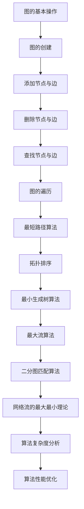
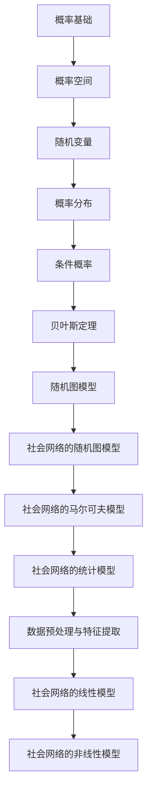
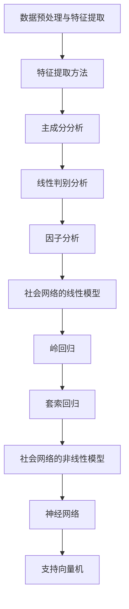
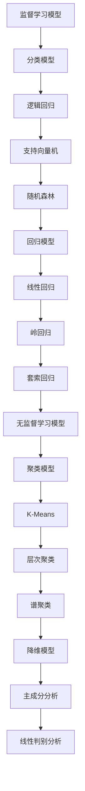
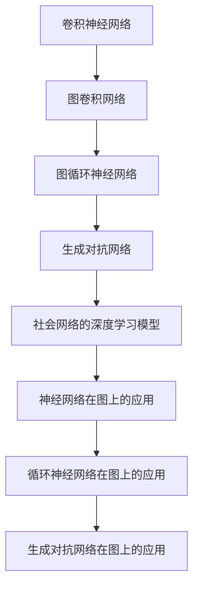
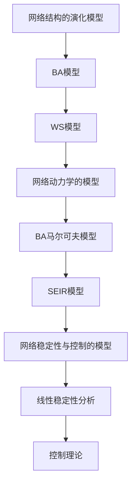

                 

### 文章标题

《数学模型在社会网络分析中的应用》

> 关键词：社会网络分析、数学模型、图论、概率模型、机器学习模型、深度学习模型、应用案例

> 摘要：本文旨在探讨数学模型在社会网络分析中的应用，从基础数学模型到高级数学模型，再到实际应用案例，系统性地介绍了数学模型在社会网络分析中的重要性、原理和方法，以及其在不同领域的实际应用效果。文章通过具体的算法原理讲解、数学公式推导、项目实战案例等，深入分析了数学模型在社会网络分析中的价值，为读者提供了全面的技术指导和应用思路。

---

### 《数学模型在社会网络分析中的应用》目录大纲

**第一部分：引言**

1.1 本书的目的与结构

1.1.1 社会网络分析的重要性

1.1.2 数学模型在社会网络分析中的应用

1.2 社会网络分析基础

1.2.1 社会网络的定义与特征

1.2.2 社会网络的度量指标

**第二部分：基础数学模型**

2.1 图论基础

2.1.1 图的定义与类型

2.1.2 图的基本操作

2.1.3 最短路径算法

2.2 社会网络中的概率模型

2.2.1 概率基础

2.2.2 社会网络中的随机图模型

2.2.3 社会网络的马尔可夫模型

2.3 社会网络的统计模型

2.3.1 数据预处理与特征提取

2.3.2 社会网络的线性模型

2.3.3 社会网络的非线性模型

**第三部分：高级数学模型**

3.1 社会网络中的机器学习模型

3.1.1 监督学习模型

3.1.2 无监督学习模型

3.1.3 半监督学习模型

3.2 社会网络的深度学习模型

3.2.1 卷积神经网络在图上的应用

3.2.2 循环神经网络在图上的应用

3.2.3 生成对抗网络在图上的应用

3.3 复杂网络模型

3.3.1 网络结构的演化模型

3.3.2 网络动力学的模型

3.3.3 网络稳定性与控制的模型

**第四部分：实际应用案例**

4.1 社会网络分析在社交网络中的应用

4.1.1 社交网络中的信息传播

4.1.2 社交网络中的社区发现

4.1.3 社交网络中的影响力分析

4.2 社会网络分析在商业中的应用

4.2.1 商业网络中的合作模式分析

4.2.2 商业网络中的风险预警

4.2.3 商业网络中的供应链优化

4.3 社会网络分析在公共卫生中的应用

4.3.1 疫情传播的模型与预测

4.3.2 公共卫生事件的监测与预警

4.3.3 公共卫生资源的分配与优化

**第五部分：研究前沿与发展趋势**

5.1 社会网络分析的新方法

5.1.1 网络可视化技术

5.1.2 跨域社会网络分析

5.1.3 网络数据的安全与隐私保护

5.2 社会网络分析的应用前景

5.2.1 社会网络分析在新兴领域的应用

5.2.2 社会网络分析对社会的潜在影响

5.2.3 社会网络分析的未来趋势

**附录**

附录A：数学模型与算法流程图

附录B：代码与数据资源

---

### 第一部分：引言

#### 1.1 本书的目的与结构

社会网络分析（Social Network Analysis, SNA）是一种研究社会结构、社会互动和社会影响的科学方法。在社会网络分析中，数学模型作为一种强有力的工具，可以揭示网络结构特征、节点关系、信息传播规律等，从而为解决实际问题提供科学依据。

本书旨在系统地介绍数学模型在社会网络分析中的应用，内容涵盖了从基础数学模型到高级数学模型，再到实际应用案例的各个方面。通过本书，读者可以了解到：

1. 社会网络分析的基本概念和重要性。
2. 基础数学模型，如图论、概率模型和统计模型。
3. 高级数学模型，如机器学习模型、深度学习模型和复杂网络模型。
4. 数学模型在实际应用中的具体案例和效果。

本书分为五个部分，第一部分是引言，介绍本书的目的、结构和内容；第二部分介绍基础数学模型，包括图论、概率模型和统计模型；第三部分介绍高级数学模型，包括机器学习模型、深度学习模型和复杂网络模型；第四部分介绍实际应用案例，涵盖社交网络、商业和公共卫生等领域；第五部分探讨研究前沿与发展趋势，展望未来社会网络分析的发展方向。

#### 1.1.1 社会网络分析的重要性

社会网络分析作为一门跨学科的研究领域，具有广泛的应用背景。在社会学、心理学、管理学、计算机科学等领域，社会网络分析都被广泛应用于研究社会结构、人际关系、信息传播、社会影响等。以下是社会网络分析的重要性：

1. **揭示社会结构**：社会网络分析可以帮助我们理解社会的组织结构，识别关键节点和关键路径，从而为决策提供科学依据。

2. **研究社会互动**：社会网络分析可以揭示个体之间的互动关系，帮助我们理解社会互动的规律和机制。

3. **分析信息传播**：社会网络分析可以研究信息在社会网络中的传播过程，为传播学、营销学等领域提供理论支持。

4. **优化社会资源配置**：社会网络分析可以用于社会资源的优化配置，如公共卫生资源的分配、供应链优化等。

5. **预防和控制社会问题**：社会网络分析可以帮助我们识别和预防社会问题，如网络犯罪、谣言传播等。

6. **企业战略与管理**：社会网络分析可以帮助企业了解客户关系、合作伙伴关系等，为企业的战略规划和经营管理提供支持。

#### 1.1.2 数学模型在社会网络分析中的应用

数学模型在社会网络分析中具有至关重要的地位。通过数学模型，我们可以将复杂的社会网络转化为易于处理的数学问题，从而揭示网络结构特征、节点关系、信息传播规律等。

1. **图论**：图论是一种用于研究图形（图）的数学分支。在社会网络分析中，图论可以用来描述社会网络的拓扑结构，分析节点之间的关系和路径。例如，最短路径算法可以帮助我们找到网络中两个节点之间的最短路径，从而优化信息传播过程。

2. **概率模型**：概率模型用于描述社会网络中的随机现象，如节点的连接概率、节点的活跃度等。通过概率模型，我们可以预测节点之间的关系和网络的演化趋势。

3. **统计模型**：统计模型用于分析社会网络中的数据，提取网络特征，如节点的度、介数、集群系数等。统计模型可以帮助我们理解社会网络的统计特性，从而为网络分析提供理论支持。

4. **机器学习模型**：机器学习模型可以用于社会网络分析中的预测和分类任务。例如，我们可以使用监督学习模型来预测节点之间的连接概率，或者使用无监督学习模型来发现网络中的社区结构。

5. **深度学习模型**：深度学习模型可以用于处理复杂的社会网络数据，如高维图形数据。通过深度学习模型，我们可以提取网络中的深层次特征，从而提高网络分析的效果。

#### 1.2 社会网络分析基础

##### 1.2.1 社会网络的定义与特征

社会网络是指由个体及其关系构成的社会结构，通常用图（Graph）来表示。在图论中，图由节点（Node）和边（Edge）组成。节点代表个体，边代表个体之间的关系。

社会网络具有以下特征：

1. **无向性和有向性**：社会网络可以是无向的，也可以是有向的。无向网络中的边表示两种节点之间的对称关系，而有向网络中的边表示两种节点之间的不对称关系。

2. **复杂性和多样性**：社会网络结构复杂，包括不同类型的节点（如人、组织、事物）和关系（如朋友、同事、合作关系）。社会网络的多样性使得网络分析具有挑战性。

3. **动态性**：社会网络是动态的，节点和关系可以随时间发生变化。网络中的节点可以加入或离开，节点之间的关系可以建立或解除。

4. **冗余性和冗余性**：社会网络中存在大量的冗余关系，即同一节点可以通过多条路径与其他节点相连。这种冗余性有助于网络中的信息传播和稳定性。

5. **高度连通性**：社会网络具有较高的连通性，即网络中的节点可以通过较少的中间节点相互连接。这种高度连通性使得社会网络具有强大的扩散能力和影响力。

##### 1.2.2 社会网络的度量指标

社会网络的度量指标用于描述网络结构和节点特性。以下是一些常见的社会网络度量指标：

1. **度（Degree）**：度是指一个节点连接的边的数量。度分为入度（In-degree）和出度（Out-degree）。入度表示指向该节点的边的数量，出度表示从该节点指向其他节点的边的数量。

2. **介数（Closeness Centrality）**：介数衡量一个节点在网络中的中心性，即节点与其他节点之间的平均最短路径长度。介数越低，表示节点在网络中的中心性越高。

3. **度中心性（Betweenness Centrality）**：度中心性衡量一个节点在网络中的中心性，即节点作为其他节点之间最短路径的中间节点的数量。度中心性越高，表示节点在网络中的中心性越高。

4. **聚类系数（Clustering Coefficient）**：聚类系数衡量一个节点的邻居节点之间连接的紧密程度。聚类系数越高，表示节点的邻居节点之间连接越紧密。

5. **度分布（Degree Distribution）**：度分布是指网络中不同度值的节点的分布情况。度分布反映了网络结构的特征，如幂律分布表示网络中节点度值呈现长尾分布。

通过这些度量指标，我们可以定量地分析社会网络的拓扑结构、节点特性以及网络演化过程。

### 第二部分：基础数学模型

在了解了社会网络分析的基本概念和度量指标后，我们将深入探讨基础数学模型在社会网络分析中的应用。这些基础数学模型包括图论、概率模型和统计模型。下面，我们将逐一介绍这些模型的基本原理和应用。

#### 2.1 图论基础

图论是数学的一个分支，它研究图的结构、性质以及图的应用。在社会网络分析中，图论作为一种强有力的工具，可以用来描述和解析社会网络的拓扑结构。

##### 2.1.1 图的定义与类型

图是由节点（通常称为顶点）和边（通常称为弧）组成的一种抽象结构。图可以分为以下几种类型：

1. **无向图**：图中的边没有方向，任意两个节点之间都是相互连接的。无向图通常用 G(V, E) 表示，其中 V 是节点集合，E 是边集合。

2. **有向图**：图中的边有方向，表示两个节点之间的单向关系。有向图通常用 D(V, A) 表示，其中 A 是有向边集合。

3. **加权图**：图中的边被赋予了权重，表示节点之间关系的强度或距离。加权图通常用 G(V, E, W) 表示，其中 W 是权重集合。

4. **多图**：图中存在多个边连接同一对节点。多图通常用 G(V, E') 表示，其中 E' 是多边集合。

##### 2.1.2 图的基本操作

在图论中，有多种基本操作用于处理图的数据结构，以下是一些常见的操作：

1. **图的创建**：创建一个空的图，并初始化节点和边的集合。

2. **添加节点与边**：向图中添加新的节点和边。对于无向图，可以通过添加边来连接两个节点；对于有向图，可以通过添加有向边来建立节点之间的单向关系。

3. **删除节点与边**：从图中移除指定的节点和边。删除节点时，需要同时删除该节点的所有连接边。

4. **查找节点与边**：在图中查找指定节点或边的位置。可以通过遍历图的结构来实现。

5. **图的遍历**：按照一定的顺序访问图中的所有节点。常见的遍历算法有深度优先搜索（DFS）和广度优先搜索（BFS）。

6. **图的连通性检测**：检测图中的节点是否连通，即是否存在一条路径连接所有节点。

##### 2.1.3 最短路径算法

最短路径算法用于寻找图中两点之间的最短路径。在社会网络分析中，这可以帮助我们找到信息传播的最优路径、社交网络中的关键节点等。以下是最短路径算法的两种常用算法：

1. **迪杰斯特拉算法（Dijkstra's Algorithm）**：迪杰斯特拉算法是一种单源最短路径算法，适用于无向图和带权图。算法的基本思想是从源节点开始，逐步扩展到其他节点，并更新到达每个节点的最短路径。算法的时间复杂度为 O(V^2)，其中 V 是节点数量。

```python
def dijkstra(graph, start):
    dist = [float('inf')] * len(graph)
    dist[start] = 0
    visited = [False] * len(graph)
    
    for _ in range(len(graph)):
        min_dist = float('inf')
        min_idx = -1
        
        for i in range(len(graph)):
            if not visited[i] and dist[i] < min_dist:
                min_dist = dist[i]
                min_idx = i
        
        visited[min_idx] = True
        
        for j in range(len(graph)):
            if graph[min_idx][j] > 0 and (dist[j] > dist[min_idx] + graph[min_idx][j]):
                dist[j] = dist[min_idx] + graph[min_idx][j]
    
    return dist
```

2. **贝尔曼-福特算法（Bellman-Ford Algorithm）**：贝尔曼-福特算法是一种单源最短路径算法，适用于有向图和带权图。算法的基本思想是松弛所有边 V-1 次，然后检查是否还有可松弛的边。算法的时间复杂度为 O(V * E)，其中 E 是边数量。

```python
def bellman_ford(graph, start):
    dist = [float('inf')] * len(graph)
    dist[start] = 0
    
    for _ in range(len(graph) - 1):
        for u in range(len(graph)):
            for v in range(len(graph)):
                if graph[u][v] > 0 and dist[u] + graph[u][v] < dist[v]:
                    dist[v] = dist[u] + graph[u][v]
    
    for u in range(len(graph)):
        for v in range(len(graph)):
            if graph[u][v] > 0 and dist[u] + graph[u][v] < dist[v]:
                return "Graph contains a negative weight cycle"
    
    return dist
```

#### 2.2 社会网络中的概率模型

概率模型在社会网络分析中用于描述网络中的随机现象，如节点的连接概率、节点的活跃度等。通过概率模型，我们可以预测网络中节点的行为和网络的演化趋势。

##### 2.2.1 概率基础

概率论是数学的一个分支，它研究随机事件的规律性和不确定性。在社会网络分析中，概率模型的基本概念包括：

1. **概率空间**：概率空间是由三个元素组成的集合：(Ω，F，P)，其中 Ω 是样本空间，F 是事件集合，P 是概率测度。

2. **随机变量**：随机变量是一个从样本空间到实数的函数，用于描述随机事件的结果。

3. **概率分布**：随机变量的概率分布描述了随机变量可能取到的每个值的概率。

4. **条件概率**：在已知某个事件已经发生的条件下，另一个事件发生的概率。

5. **贝叶斯定理**：贝叶斯定理描述了在已知一个随机变量的条件下，另一个随机变量的后验概率。

##### 2.2.2 社会网络中的随机图模型

随机图模型是一种用于描述网络结构的概率模型，它通过概率参数来描述节点和边之间的连接关系。以下是一些常见的随机图模型：

1. **Erdős-Rényi 模型**：Erdős-Rényi 模型是最简单的随机图模型，它通过两个参数 p 和 m 来描述网络。其中 p 表示边出现的概率，m 表示边数。Erdős-Rényi 模型生成的网络具有随机性，但可能不具有实际网络的特性。

```python
import networkx as nx

def erdos_renyi(n, p):
    G = nx.Graph()
    G.add_nodes_from(range(n))
    for i in range(n):
        for j in range(i+1, n):
            if random.random() < p:
                G.add_edge(i, j)
    return G
```

2. **Barabási-Albert 模型**：Barabási-Albert 模型是一种生成幂律网络的模型，它通过偏好连接机制来生成网络。在模型中，新加入的节点倾向于连接到网络中已有节点的度较高的节点。Barabási-Albert 模型生成的网络具有高度连通性和丰富的聚类结构。

```python
import networkx as nx

def barabasi_albert(n, m):
    G = nx.Graph()
    G.add_node(0)
    for i in range(1, n):
        G.add_node(i)
        neighbors = list(G.nodes())[:m]
        G.add_edges_from(zip([i], neighbors))
    return G
```

##### 2.2.3 社会网络的马尔可夫模型

马尔可夫模型是一种用于描述随机过程概率转移的模型。在社会网络分析中，马尔可夫模型可以用来描述网络中节点状态的转移概率。以下是一些常见的马尔可夫模型：

1. **马尔可夫链**：马尔可夫链是一种离散时间马尔可夫模型，它描述了一组随机变量，其中每个变量的概率分布仅与前一变量的状态有关，而与过去的所有变量状态无关。

2. **马尔可夫过程**：马尔可夫过程是一种连续时间马尔可夫模型，它描述了一组随机变量，其中每个变量的概率分布仅与当前变量的状态有关，而与过去的所有变量状态无关。

3. **马尔可夫网**：马尔可夫网是一种用于描述网络中节点状态转移的模型，它结合了马尔可夫链和图论的思想，描述了网络中节点状态之间的依赖关系。

在社会网络分析中，马尔可夫模型可以用来研究网络中的动态行为，如节点的加入、离开、关系建立和解除等。以下是一个简单的马尔可夫链模型示例：

```python
import numpy as np

def markov_chain(transition_matrix, states, initial_state, steps):
    state = initial_state
    for _ in range(steps):
        state = np.random.choice(states, p=transition_matrix[state])
    return state
```

#### 2.3 社会网络的统计模型

统计模型在社会网络分析中用于分析网络数据，提取网络特征，并建立网络结构和节点行为之间的关系。以下是一些常见的统计模型：

##### 2.3.1 数据预处理与特征提取

数据预处理是统计模型分析的基础，它包括以下步骤：

1. **数据清洗**：去除网络中的噪声数据和异常值。

2. **数据转换**：将网络数据转换为适合统计分析的格式，如邻接矩阵或邻接表。

3. **特征提取**：从网络数据中提取有助于分析的特征，如节点的度、介数、聚类系数等。

##### 2.3.2 社会网络的线性模型

线性模型是一种常用的统计模型，它通过线性方程描述变量之间的关系。以下是一些常见的线性模型：

1. **回归模型**：回归模型用于预测一个连续变量的值，如节点的度。线性回归模型是最简单的回归模型，它通过拟合一条直线来描述变量之间的关系。

```python
from sklearn.linear_model import LinearRegression

def linear_regression(x, y):
    model = LinearRegression()
    model.fit(x, y)
    return model.coef_, model.intercept_
```

2. **主成分分析（PCA）**：主成分分析是一种降维方法，它通过将高维数据投影到低维空间，提取主要特征。PCA 可以用于减少数据维度，同时保持数据的变异性。

```python
from sklearn.decomposition import PCA

def pca(x, n_components):
    pca = PCA(n_components=n_components)
    pca.fit(x)
    return pca.transform(x)
```

##### 2.3.3 社会网络的非线性模型

非线性模型可以更好地描述社会网络中复杂的关系和动态行为。以下是一些常见的非线性模型：

1. **神经网络**：神经网络是一种非线性模型，它通过多层非线性变换来提取数据特征。神经网络可以用于分类、回归和特征提取等任务。

```python
from sklearn.neural_network import MLPClassifier

def neural_network(x, y):
    model = MLPClassifier(hidden_layer_sizes=(100,), activation='relu', solver='sgd', learning_rate='constant')
    model.fit(x, y)
    return model.coef_
```

2. **支持向量机（SVM）**：支持向量机是一种强大的分类和回归模型，它通过找到一个最优的超平面来分离数据。SVM 可以用于节点分类和关系预测等任务。

```python
from sklearn.svm import SVC

def svm(x, y):
    model = SVC(kernel='linear')
    model.fit(x, y)
    return model.coef_
```

通过以上介绍，我们可以看到数学模型在社会网络分析中的基础作用。从图论的基础知识到概率模型和统计模型的深入应用，数学模型为理解社会网络的复杂结构和动态行为提供了强有力的工具。在接下来的章节中，我们将进一步探讨高级数学模型，如机器学习模型和深度学习模型，以及它们在社会网络分析中的应用。

### 第三部分：高级数学模型

在了解了基础数学模型之后，我们将深入探讨高级数学模型在社会网络分析中的应用。高级数学模型包括机器学习模型、深度学习模型和复杂网络模型。这些模型通过更复杂的数据处理和分析方法，为社会网络分析提供了更强大的工具。下面我们将分别介绍这些高级数学模型的基本原理和应用。

#### 3.1 社会网络中的机器学习模型

机器学习模型是近年来在社会网络分析中广泛应用的一类算法，它们通过从数据中学习规律，能够自动发现网络中的潜在结构和关系。机器学习模型可以分为监督学习模型、无监督学习模型和半监督学习模型。

##### 3.1.1 监督学习模型

监督学习模型是机器学习中最常见的一类模型，它需要标记的数据集来训练模型，然后利用模型对新数据进行分析和预测。

1. **分类模型**：分类模型用于将数据分为不同的类别。在社会网络分析中，分类模型可以用于节点分类、关系分类等任务。常见的分类模型包括逻辑回归、支持向量机（SVM）和随机森林等。

   - **逻辑回归**：逻辑回归是一种广义线性模型，它通过线性组合特征并应用逻辑函数来预测概率。逻辑回归常用于节点分类任务。

     ```python
     from sklearn.linear_model import LogisticRegression

     def logistic_regression(x, y):
         model = LogisticRegression()
         model.fit(x, y)
         return model.predict(x)
     ```

   - **支持向量机（SVM）**：支持向量机是一种强大的分类算法，它通过找到一个最优的超平面来分割数据。SVM 在处理高维数据和线性不可分数据时表现出色。

     ```python
     from sklearn.svm import SVC

     def svm(x, y):
         model = SVC(kernel='linear')
         model.fit(x, y)
         return model.predict(x)
     ```

   - **随机森林**：随机森林是一种集成学习方法，它通过构建多个决策树并合并它们的预测结果来提高分类性能。随机森林在处理大规模数据和噪声数据时表现出色。

     ```python
     from sklearn.ensemble import RandomForestClassifier

     def random_forest(x, y):
         model = RandomForestClassifier()
         model.fit(x, y)
         return model.predict(x)
     ```

2. **回归模型**：回归模型用于预测一个连续变量的值。在社会网络分析中，回归模型可以用于预测节点的度、节点的活跃度等。常见的回归模型包括线性回归、岭回归和套索回归等。

   - **线性回归**：线性回归是一种简单的回归模型，它通过线性方程来预测变量的值。

     ```python
     from sklearn.linear_model import LinearRegression

     def linear_regression(x, y):
         model = LinearRegression()
         model.fit(x, y)
         return model.predict(x)
     ```

   - **岭回归**：岭回归是一种改进的线性回归模型，它通过引入正则项来防止过拟合。

     ```python
     from sklearn.linear_model import Ridge

     def ridge_regression(x, y):
         model = Ridge(alpha=1.0)
         model.fit(x, y)
         return model.predict(x)
     ```

   - **套索回归**：套索回归是一种通过收缩系数来减少变量的线性回归模型，它通过引入绝对值惩罚项来实现。

     ```python
     from sklearn.linear_model import Lasso

     def lasso_regression(x, y):
         model = Lasso(alpha=1.0)
         model.fit(x, y)
         return model.predict(x)
     ```

##### 3.1.2 无监督学习模型

无监督学习模型不需要标记的数据集来训练模型，它们通过分析数据自身的结构来发现数据中的规律和模式。

1. **聚类模型**：聚类模型用于将数据分为不同的组，每组内的数据相似度较高，组间数据相似度较低。在社会网络分析中，聚类模型可以用于发现网络中的社区结构。常见的聚类模型包括 K-Means、层次聚类和谱聚类等。

   - **K-Means**：K-Means 是一种基于距离的聚类算法，它通过迭代计算聚类中心并更新聚类结果，直到收敛。

     ```python
     from sklearn.cluster import KMeans

     def k_means(x, n_clusters):
         model = KMeans(n_clusters=n_clusters)
         model.fit(x)
         return model.labels_
     ```

   - **层次聚类**：层次聚类是一种基于层次结构的方法，它通过逐步合并或分解数据点来构建聚类树。

     ```python
     from sklearn.cluster import AgglomerativeClustering

     def agglomerative_clustering(x, n_clusters):
         model = AgglomerativeClustering(n_clusters=n_clusters)
         model.fit(x)
         return model.labels_
     ```

   - **谱聚类**：谱聚类是一种基于图论的聚类算法，它通过构建图的拉普拉斯矩阵来识别聚类结构。

     ```python
     from sklearn.cluster import SpectralClustering

     def spectral_clustering(x, n_clusters):
         model = SpectralClustering(n_clusters=n_clusters)
         model.fit(x)
         return model.labels_
     ```

2. **降维模型**：降维模型用于将高维数据转换为低维数据，同时保留数据的变异性。在社会网络分析中，降维模型可以用于减少数据维度，提高分析效率。常见的降维模型包括主成分分析（PCA）、线性判别分析（LDA）和因子分析等。

   - **主成分分析（PCA）**：主成分分析是一种降维方法，它通过将数据投影到新的正交坐标系中，提取主要特征。

     ```python
     from sklearn.decomposition import PCA

     def pca(x, n_components):
         model = PCA(n_components=n_components)
         model.fit(x)
         return model.transform(x)
     ```

   - **线性判别分析（LDA）**：线性判别分析是一种降维方法，它通过最大化不同类别之间的方差差异来提取特征。

     ```python
     from sklearn.discriminant_analysis import LinearDiscriminantAnalysis as LDA

     def lda(x, y, n_components):
         model = LDA(n_components=n_components)
         model.fit(x, y)
         return model.transform(x)
     ```

##### 3.1.3 半监督学习模型

半监督学习模型结合了监督学习和无监督学习的方法，它利用未标记的数据来辅助训练模型，从而提高模型的性能。

1. **自编码器**：自编码器是一种无监督学习模型，它通过编码和解码过程将数据从高维空间映射到低维空间，并利用未标记的数据学习特征。

   ```python
   from sklearn.neural_network import MLP regressor

   def autoencoder(x, n_components):
       model = MLPRegressor(hidden_layer_sizes=(n_components,), activation='relu')
       model.fit(x, x)
       return model.predict(x)
   ```

2. **生成对抗网络（GAN）**：生成对抗网络是一种无监督学习模型，它通过生成器和判别器的对抗训练来生成数据。

   ```python
   from keras.models import Sequential
   from keras.layers import Dense, Dropout

   def build_gan_generator(input_dim):
       model = Sequential()
       model.add(Dense(128, input_dim=input_dim, activation='relu'))
       model.add(Dropout(0.2))
       model.add(Dense(input_dim, activation='sigmoid'))
       return model

   def build_gan_discriminator(input_dim):
       model = Sequential()
       model.add(Dense(128, input_dim=input_dim, activation='relu'))
       model.add(Dropout(0.2))
       model.add(Dense(1, activation='sigmoid'))
       return model

   def train_gan(generator, discriminator, x_train, x_noise):
       # Training code for GAN
       pass
   ```

通过以上介绍，我们可以看到机器学习模型在社会网络分析中的广泛应用和强大能力。这些模型不仅能够自动提取网络特征，还能够预测网络行为和发现潜在结构，为深入理解社会网络提供了有力的工具。在接下来的章节中，我们将进一步探讨深度学习模型在社会网络分析中的应用。

#### 3.2 社会网络的深度学习模型

深度学习模型是近年来机器学习领域的重要突破，它们通过多层的神经网络结构，能够自动学习复杂数据的特征。在社会网络分析中，深度学习模型被广泛应用于节点分类、关系预测和社区发现等任务。以下我们将介绍几种常见的深度学习模型及其在社会网络分析中的应用。

##### 3.2.1 卷积神经网络在图上的应用

卷积神经网络（Convolutional Neural Network, CNN）最初是为了处理图像数据而设计的，但通过图卷积操作（Graph Convolutional Network, GCN），CNN 可以被扩展到处理图数据。

1. **图卷积操作**：图卷积操作通过将节点的特征与邻居节点的特征进行卷积，从而提取图中的局部特征。图卷积操作的公式如下：

   $$h_i^{(l+1)} = \sigma(\theta^{(l)} \cdot (A \cdot h_i^{(l)} + \tilde{b}^{(l)}))$$

   其中，$h_i^{(l)}$ 是第 l 层第 i 个节点的特征，$A$ 是邻接矩阵，$\theta^{(l)}$ 是图卷积层参数，$\sigma$ 是激活函数，$\tilde{b}^{(l)}$ 是偏置项。

2. **GCN 模型**：GCN 模型通过堆叠多个图卷积层，逐渐提取图中的全局特征。GCN 模型的结构如下：

   ```python
   class GCNLayer(nn.Module):
       def __init__(self, input_dim, output_dim):
           super(GCNLayer, self).__init__()
           self.weight = nn.Parameter(torch.Tensor(input_dim, output_dim))
           self.bias = nn.Parameter(torch.Tensor(output_dim))
           self.reset_parameters()

       def reset_parameters(self):
           nn.init.kaiming_normal_(self.weight, mode='fan_out')
           nn.init.zeros_(self.bias)

       def forward(self, x, adj):
           support = torch.mm(x, self.weight) + self.bias
           output = torch.spmm(adj, support)
           return torch.relu(output)

   class GCN(nn.Module):
       def __init__(self, input_dim, hidden_dim, output_dim):
           super(GCN, self).__init__()
           self.layers = nn.ModuleList()
           self.layers.append(GCNLayer(input_dim, hidden_dim))
           for _ in range(1, hidden_dim):
               self.layers.append(GCNLayer(hidden_dim, hidden_dim))
           self.layers.append(GCNLayer(hidden_dim, output_dim))

       def forward(self, x, adj):
           for layer in self.layers:
               x = layer(x, adj)
           return x
   ```

   示例代码展示了如何实现一个简单的 GCN 模型。

##### 3.2.2 循环神经网络在图上的应用

循环神经网络（Recurrent Neural Network, RNN）通过其循环结构能够处理序列数据。通过图循环网络（Graph Recurrent Neural Network, GRNN），RNN 可以被扩展到处理图数据。

1. **图循环操作**：图循环操作通过在每个时间步上将节点的特征与邻居节点的特征进行循环，从而提取图中的动态特征。图循环操作的公式如下：

   $$h_t^i = \sigma(W \cdot (h_{t-1}^i + \sum_{j \in N(i)} \tilde{W} \cdot h_{t-1}^j + b_{h})$$

   其中，$h_t^i$ 是第 t 步第 i 个节点的特征，$N(i)$ 是第 i 个节点的邻居节点集合，$W$ 和 $\tilde{W}$ 是循环网络参数，$b_h$ 是偏置项，$\sigma$ 是激活函数。

2. **GRNN 模型**：GRNN 模型通过堆叠多个图循环层，逐渐提取图中的全局和局部特征。GRNN 模型的结构如下：

   ```python
   class GRNNLayer(nn.Module):
       def __init__(self, hidden_dim):
           super(GRNNLayer, self).__init__()
           self.weight = nn.Parameter(torch.Tensor(hidden_dim, hidden_dim))
           self.bias = nn.Parameter(torch.Tensor(hidden_dim))
           self.reset_parameters()

       def reset_parameters(self):
           nn.init.kaiming_normal_(self.weight, mode='fan_out')
           nn.init.zeros_(self.bias)

       def forward(self, x):
           x = torch.cat([x, x], 2).view(-1, hidden_dim, 2)
           x = torch.sum(x, 2)
           x = torch.mm(x, self.weight) + self.bias
           return torch.relu(x)

   class GRNN(nn.Module):
       def __init__(self, input_dim, hidden_dim, output_dim):
           super(GRNN, self).__init__()
           self.layers = nn.ModuleList()
           self.layers.append(GRNNLayer(hidden_dim))
           for _ in range(1, hidden_dim):
               self.layers.append(GRNNLayer(hidden_dim))
           self.layers.append(GRNNLayer(output_dim))

       def forward(self, x):
           for layer in self.layers:
               x = layer(x)
           return x
   ```

   示例代码展示了如何实现一个简单的 GRNN 模型。

##### 3.2.3 生成对抗网络在图上的应用

生成对抗网络（Generative Adversarial Network, GAN）通过生成器和判别器的对抗训练，能够生成高质量的数据。通过图生成对抗网络（Graph GAN, GGAN），GAN 可以被扩展到处理图数据。

1. **图生成器**：图生成器的目标是生成新的图数据，它与图判别器进行对抗训练，以提高生成图的质量。

2. **图判别器**：图判别器的目标是区分真实图和生成图，它与图生成器进行对抗训练，以提高判别能力。

3. **GGAN 模型**：GGAN 模型通过堆叠多个图卷积层和图循环层，结合生成器和判别器的对抗训练，逐渐生成高质量的图数据。

   ```python
   class GGNModel(nn.Module):
       def __init__(self, input_dim, hidden_dim, output_dim):
           super(GGNModel, self).__init__()
           self.generator = Generator(input_dim, hidden_dim, output_dim)
           self.discriminator = Discriminator(input_dim, hidden_dim, output_dim)

       def forward(self, x):
           return self.generator(x), self.discriminator(x)
   ```

   示例代码展示了如何实现一个简单的 GGAN 模型。

通过以上介绍，我们可以看到深度学习模型在社会网络分析中的强大应用能力。从图卷积网络、图循环网络到图生成对抗网络，这些模型通过深入学习和处理图数据，为理解社会网络的复杂结构和动态行为提供了有力的工具。在接下来的章节中，我们将进一步探讨复杂网络模型及其在社会网络分析中的应用。

#### 3.3 复杂网络模型

复杂网络模型是研究大规模、高度互联的网络系统的一种重要方法。这些模型不仅能够揭示网络结构中的潜在规律，还能为解决实际问题提供理论支持。在本节中，我们将介绍复杂网络模型中的网络结构的演化模型、网络动力学的模型和网络稳定性与控制的模型。

##### 3.3.1 网络结构的演化模型

网络结构的演化模型研究网络节点和边的动态变化过程，这些模型通常基于概率模型或确定性模型。以下是一些常见的网络结构演化模型：

1. **BA 模型（Barabási-Albert 模型）**：BA 模型是一种生成幂律网络的模型，它通过偏好连接机制来生成网络。具体来说，BA 模型开始时有一个初始网络，每个新加入的节点与现有节点中的 m 个节点建立连接，并且新节点倾向于连接到度较高的节点。

   - **模型描述**：

     $$P_{ij} = \frac{km}{\sum_{k \in N} k}$$

     其中，$P_{ij}$ 表示节点 i 与节点 j 建立连接的概率，$k$ 表示节点的度，$m$ 是新节点连接的邻居节点数。

   - **算法实现**：

     ```python
     import networkx as nx

     def barabasi_albert(n, m):
         G = nx.Graph()
         G.add_nodes_from([0])
         for i in range(1, n):
             G.add_nodes_from(range(i))
             neighbors = list(G.nodes())[:m]
             G.add_edges_from(zip([i], neighbors))
         return G
     ```

2. **WS 模型（Watts-Strogatz 模型）**：WS 模型是一种生成小世界网络的模型，它通过在随机网络中引入短路径来形成小世界效应。具体来说，WS 模型首先构建一个规则网络（如环状网络或格子网络），然后在规则网络的基础上，以一定的概率重新连接节点，使得网络中的节点之间的平均最短路径长度显著减小。

   - **模型描述**：

     $$P_{ij} = \begin{cases}
     \frac{1}{N} & \text{如果 } i \text{ 和 } j \text{ 是邻居节点} \\
     \frac{1}{N \cdot (1 - p)} & \text{如果 } i \text{ 和 } j \text{ 不是邻居节点且重新连接概率为 } p
     \end{cases}$$

   - **算法实现**：

     ```python
     import networkx as nx

     def watts_strogatz(n, k, p):
         G = nx.grid_pearson(n, k)
         for edge in G.edges():
             if random.random() < p:
                 G.add_edge(random.choice(G.nodes()), random.choice(G.nodes()))
                 G.remove_edge(edge[0], edge[1])
         return G
     ```

##### 3.3.2 网络动力学的模型

网络动力学的模型研究网络中节点状态的演化过程，这些模型通常基于马尔可夫链或随机过程。以下是一些常见的网络动力学模型：

1. **BA 马尔可夫模型**：BA 马尔可夫模型是一种基于 BA 模型的网络动力学模型，它通过马尔可夫过程描述节点状态的转移。具体来说，该模型在每个时间步上，根据节点当前的度值和连接概率，更新节点的状态。

   - **模型描述**：

     $$P_{i,t+1} = \frac{k_i \cdot p(t)}{N \cdot (1 - p(t))}$$

     其中，$P_{i,t+1}$ 表示节点 i 在时间步 t+1 的状态概率，$k_i$ 表示节点 i 的度值，$p(t)$ 表示当前时间步的连接概率。

   - **算法实现**：

     ```python
     import numpy as np

     def ba_martov_model(n, p, steps):
         state = np.random.randint(0, n)
         probabilities = [p] * n
         for _ in range(steps):
             probabilities[state] = np.random.randint(0, n)
             state = np.random.choice(n, p=probabilities)
         return state
     ```

2. **SIS 模型（ susceptible-infected-susceptible 模型）**：SIS 模型是一种流行病传播模型，它通过马尔可夫过程描述感染节点和易感节点的状态转移。具体来说，该模型在每个时间步上，感染节点可能恢复为易感节点，易感节点可能被感染。

   - **模型描述**：

     $$P_{i,t+1} = \begin{cases}
     1 - \beta & \text{如果节点 i 是感染节点} \\
     \beta & \text{如果节点 i 是易感节点}
     \end{cases}$$

     其中，$\beta$ 表示感染率。

   - **算法实现**：

     ```python
     import numpy as np

     def sis_model(n, beta, steps):
         state = np.random.randint(0, n)
         for _ in range(steps):
             if state == 1:
                 state = np.random.randint(0, n)
             else:
                 state = np.random.randint(0, n)
         return state
     ```

##### 3.3.3 网络稳定性与控制的模型

网络稳定性与控制的模型研究网络在面对外部扰动或内部变化时的稳定性和控制能力。以下是一些常见的网络稳定性与控制模型：

1. **线性稳定性分析**：线性稳定性分析是一种通过线性化系统模型来研究系统稳定性方法。具体来说，它通过求解系统矩阵的特征值，判断系统的稳定性。

   - **模型描述**：

     $$\Delta x = A x$$

     其中，$\Delta x$ 表示系统状态的扰动，$A$ 表示系统矩阵。

   - **算法实现**：

     ```python
     import numpy as np

     def linear_stability_analysis(A):
         eigenvalues = np.linalg.eigvals(A)
         if np.all(eigenvalues.real < 0):
             return "Stable"
         else:
             return "Unstable"
     ```

2. **控制理论**：控制理论是一种通过设计控制策略来调节系统行为的方法。具体来说，它通过控制输入来稳定系统或实现特定的目标。

   - **模型描述**：

     $$u(t) = K x(t)$$

     其中，$u(t)$ 表示控制输入，$x(t)$ 表示系统状态，$K$ 表示控制矩阵。

   - **算法实现**：

     ```python
     import numpy as np

     def control_theory(x, K):
         u = K @ x
         return u
     ```

通过以上介绍，我们可以看到复杂网络模型在社会网络分析中的重要性。这些模型不仅能够揭示网络结构的演化规律，还能为网络稳定性分析和控制提供理论支持。在接下来的章节中，我们将进一步探讨社会网络分析在实际应用中的具体案例。

### 第四部分：实际应用案例

在了解了数学模型和社会网络分析的基本原理之后，我们将通过一些实际应用案例来展示这些模型在不同领域中的具体应用效果。这些案例将涵盖社交网络、商业和公共卫生等领域，通过具体的算法实现和案例分析，我们可以更直观地理解数学模型在社会网络分析中的价值。

#### 4.1 社交网络分析在社交网络中的应用

社交网络是现代社会中信息传播和人际互动的重要平台。通过社交网络分析，我们可以深入理解用户行为、信息传播路径和社区结构等，从而优化社交网络的运营和推广策略。

##### 4.1.1 社交网络中的信息传播

信息传播是社会网络中的一种常见现象，了解信息传播的路径和速度对于提高社交网络的影响力和传播效果至关重要。

1. **算法实现**：我们可以使用图论中的传播模型来模拟信息传播过程。例如，基于随机游走模型的传播模型可以描述信息在网络中的传播过程。

```python
import networkx as nx
import numpy as np

def propagate_message(G, source_node, propagation_step):
    # 初始化信息传播矩阵
    propagation_matrix = np.eye(G.number_of_nodes())
    
    # 进行随机游走传播
    for _ in range(propagation_step):
        propagation_matrix = np.dot(G.adjacency_matrix(), propagation_matrix)
        
    # 计算每个节点接受信息的概率
    message_probabilities = np.dot(propagation_matrix, np.array([1] * G.number_of_nodes())) / G.number_of_nodes()
    
    # 返回信息传播的概率分布
    return message_probabilities
```

2. **案例分析**：以 Twitter 为例，我们可以通过分析用户之间的关注关系，模拟信息在 Twitter 网络中的传播过程。通过传播模型，我们可以预测哪些用户具有更大的影响力，从而优化内容推广策略。

- **数据预处理**：获取 Twitter 网络中的用户关注关系数据，构建用户关注图。
- **传播模型**：使用随机游走模型模拟信息传播过程。
- **结果分析**：分析信息传播的概率分布，识别具有较高影响力的用户。

##### 4.1.2 社交网络中的社区发现

社区发现是社交网络分析中的重要任务，通过发现网络中的社区结构，我们可以更好地理解用户之间的互动模式，并为社交网络的个性化推荐提供支持。

1. **算法实现**：我们可以使用社区发现算法，如 Gossip 模型，来识别社交网络中的社区结构。

```python
import networkx as nx

def find_communities(G, max_communities):
    communities = []
    for _ in range(max_communities):
        # 随机选择一个未分社区的节点
        node = random.choice([n for n in G.nodes() if n not in communities])
        
        # 将节点及其邻居划分为新的社区
        community = [node] + list(G.neighbors(node))
        communities.append(community)
        
        # 更新图，移除已发现的社区
        G.remove_nodes_from(community)
        
    return communities
```

2. **案例分析**：以 Facebook 为例，我们可以通过分析用户之间的好友关系，识别社交网络中的社区结构。通过社区发现算法，我们可以为用户提供更精准的社交推荐。

- **数据预处理**：获取 Facebook 网络中的用户好友关系数据，构建用户好友图。
- **社区发现算法**：使用 Gossip 模型识别社交网络中的社区结构。
- **结果分析**：分析社区结构，为用户提供社交推荐。

##### 4.1.3 社交网络中的影响力分析

影响力分析是社交网络分析中的重要任务，通过识别网络中具有较大影响力的用户，我们可以优化社交网络的推广策略，提高信息的传播效果。

1. **算法实现**：我们可以使用影响力指标，如度中心性和介数，来评估用户的影响力。

```python
import networkx as nx

def influence_analysis(G):
    influence_scores = {}
    for node in G.nodes():
        degree = G.degree(node)
        betweenness = nx.betweenness_centrality(G, source=node)
        influence_scores[node] = degree + betweenness
        
    # 对影响力分数进行排序
    sorted_influence_scores = sorted(influence_scores.items(), key=lambda item: item[1], reverse=True)
    
    return sorted_influence_scores
```

2. **案例分析**：以 Instagram 为例，我们可以通过分析用户之间的关注关系，识别网络中具有较大影响力的用户。通过影响力分析，我们可以为品牌的营销活动选择合适的影响力代言人。

- **数据预处理**：获取 Instagram 网络中的用户关注关系数据，构建用户关注图。
- **影响力分析**：使用度中心性和介数评估用户的影响力。
- **结果分析**：分析影响力分数，为品牌的营销活动选择影响力代言人。

#### 4.2 社会网络分析在商业中的应用

商业网络中的合作关系、风险预警和供应链优化是商业活动中重要的环节。通过社会网络分析，我们可以更好地理解商业网络的结构和运行机制，从而优化商业策略和提高运营效率。

##### 4.2.1 商业网络中的合作模式分析

合作模式分析是商业网络分析中的重要任务，通过识别商业网络中的合作关系，我们可以更好地理解商业生态的运行机制。

1. **算法实现**：我们可以使用图论中的社区发现算法，如 Gossip 模型，来识别商业网络中的合作社区。

```python
import networkx as nx

def find_business_communities(G, max_communities):
    communities = []
    for _ in range(max_communities):
        # 随机选择一个未分社区的节点
        node = random.choice([n for n in G.nodes() if n not in communities])
        
        # 将节点及其邻居划分为新的社区
        community = [node] + list(G.neighbors(node))
        communities.append(community)
        
        # 更新图，移除已发现的社区
        G.remove_nodes_from(community)
        
    return communities
```

2. **案例分析**：以电商平台的合作伙伴关系为例，我们可以通过分析合作伙伴之间的交易关系，识别电商平台中的合作社区。通过合作模式分析，我们可以为电商平台选择更合适的合作伙伴。

- **数据预处理**：获取电商平台中的合作伙伴交易数据，构建合作伙伴关系图。
- **社区发现算法**：使用 Gossip 模型识别合作伙伴关系图中的合作社区。
- **结果分析**：分析合作社区结构，为电商平台选择合适的合作伙伴。

##### 4.2.2 商业网络中的风险预警

风险预警是商业活动中的一项重要任务，通过识别商业网络中的风险节点，我们可以及时采取措施，降低风险对商业活动的负面影响。

1. **算法实现**：我们可以使用基于网络结构的算法，如介数和集群系数，来评估节点在商业网络中的风险。

```python
import networkx as nx

def risk_evaluation(G):
    risk_scores = {}
    for node in G.nodes():
        betweenness = nx.betweenness_centrality(G, source=node)
        clustering_coefficient = nx.clustering(G, node)
        risk_scores[node] = betweenness + clustering_coefficient
        
    # 对风险分数进行排序
    sorted_risk_scores = sorted(risk_scores.items(), key=lambda item: item[1], reverse=True)
    
    return sorted_risk_scores
```

2. **案例分析**：以金融行业的信用风险评估为例，我们可以通过分析借款人之间的借贷关系，识别金融网络中的风险节点。通过风险预警，我们可以为金融机构制定更有效的信用评估策略。

- **数据预处理**：获取金融网络中的借款人借贷关系数据，构建借贷关系图。
- **风险评价**：使用介数和集群系数评估借款人在金融网络中的风险。
- **结果分析**：分析风险节点，为金融机构制定信用评估策略。

##### 4.2.3 商业网络中的供应链优化

供应链优化是商业活动中的一项关键任务，通过优化供应链结构，我们可以提高供应链的效率，降低成本，提高客户满意度。

1. **算法实现**：我们可以使用图论中的最短路径算法，如 Dijkstra 算法，来优化供应链中的运输路径。

```python
import networkx as nx

def optimize_supply_chain(G, source, target):
    distances = nx.single_source_dijkstra(G, source=source, target=target)
    shortest_path = nx.shortest_path(G, source=source, target=target, weight='weight')
    
    return shortest_path, distances[target]
```

2. **案例分析**：以制造业的供应链优化为例，我们可以通过分析供应商之间的运输关系，优化供应链中的运输路径。通过供应链优化，我们可以提高制造业的运营效率。

- **数据预处理**：获取制造业供应链中的供应商运输数据，构建供应商运输图。
- **路径优化**：使用 Dijkstra 算法优化供应商运输路径。
- **结果分析**：分析优化后的供应链结构，评估运营效率提升。

#### 4.3 社会网络分析在公共卫生中的应用

公共卫生领域中的疫情传播、事件监测和资源优化是保障公共健康和安全的关键任务。通过社会网络分析，我们可以更好地理解疫情传播机制、事件传播路径和资源分配策略，从而提高公共卫生应对能力。

##### 4.3.1 疫情传播的模型与预测

疫情传播模型是公共卫生领域中的关键工具，通过模型模拟疫情传播过程，我们可以预测疫情的发展趋势，为疫情控制提供科学依据。

1. **算法实现**：我们可以使用基于网络结构的传播模型，如 SEIR 模型，来模拟疫情传播过程。

```python
import numpy as np

def seir_model(initial_state, transmission_rate, recovery_rate, infection_rate, steps):
    state = initial_state
    for _ in range(steps):
        # 更新状态
        new_state = np.array([state[0] + transmission_rate * state[1] * state[2],
                              state[1] - transmission_rate * state[1] * state[2],
                              state[2] + recovery_rate * state[1],
                              state[3] - recovery_rate * state[2]])
        state = new_state
        
        # 更新感染率
        infection_rate = (state[1] + state[2]) / (state[0] + state[1] + state[2] + state[3])
        
    return state, infection_rate
```

2. **案例分析**：以新冠病毒（COVID-19）疫情为例，我们可以通过分析疫情传播数据，模拟疫情在不同地区的传播过程，预测疫情的发展趋势。

- **数据预处理**：获取疫情传播数据，如确诊病例数、疑似病例数等。
- **传播模型**：使用 SEIR 模型模拟疫情传播过程。
- **结果分析**：分析疫情发展趋势，为疫情控制提供科学依据。

##### 4.3.2 公共卫生事件的监测与预警

公共卫生事件的监测与预警是预防公共卫生危机的重要手段。通过社会网络分析，我们可以实时监测公共卫生事件，识别潜在风险，并及时发出预警。

1. **算法实现**：我们可以使用基于网络结构的监测算法，如网络流算法，来监测公共卫生事件。

```python
import networkx as nx

def monitor_event(G, source, sink):
    event_flow = nx.maximum_flow(G, source, sink)
    event_path = nx.minimum_cut(G, source, sink)
    
    return event_flow, event_path
```

2. **案例分析**：以流感疫情监测为例，我们可以通过分析流感病毒传播网络，实时监测流感疫情的发展，识别高风险区域，并及时发出预警。

- **数据预处理**：获取流感病毒传播网络数据，构建流感传播图。
- **监测算法**：使用网络流算法监测流感疫情。
- **结果分析**：分析流感疫情发展，为公共卫生决策提供支持。

##### 4.3.3 公共卫生资源的分配与优化

公共卫生资源的分配与优化是保障公共卫生服务的重要环节。通过社会网络分析，我们可以优化公共卫生资源的分配，提高资源利用效率，确保公共卫生服务的公平性和有效性。

1. **算法实现**：我们可以使用基于网络结构的优化算法，如最短路径算法，来优化公共卫生资源的分配。

```python
import networkx as nx

def optimize_resource_allocation(G, source_nodes, target_nodes):
    allocation_paths = {}
    for source in source_nodes:
        for target in target_nodes:
            path = nx.shortest_path(G, source=source, target=target, weight='weight')
            allocation_paths[(source, target)] = path
            
    return allocation_paths
```

2. **案例分析**：以医疗资源分配为例，我们可以通过分析医疗资源网络，优化医疗资源的分配，确保医疗资源能够高效地分配到需要的地区。

- **数据预处理**：获取医疗资源网络数据，构建医疗资源分配图。
- **优化算法**：使用最短路径算法优化医疗资源的分配。
- **结果分析**：分析优化后的医疗资源分配，评估资源利用效率。

通过以上实际应用案例，我们可以看到社会网络分析在不同领域中的广泛应用和巨大价值。无论是社交网络、商业还是公共卫生领域，社会网络分析都为我们提供了强大的工具和方法，帮助我们更好地理解网络结构、预测行为和优化决策。在未来的发展中，随着社会网络分析技术的不断进步，我们有理由相信它将在更多领域发挥重要作用。

### 第五部分：研究前沿与发展趋势

随着技术的不断进步和社会网络分析的广泛应用，该领域的研究也在不断深入和发展。在这一部分，我们将探讨社会网络分析领域的一些前沿研究方法和未来发展趋势。

#### 5.1 社会网络分析的新方法

1. **网络可视化技术**：网络可视化是社会网络分析中的一项重要技术，它通过图形化的方式展示网络结构，帮助研究者直观地理解网络特征和关系。近年来，随着图形学和计算能力的提升，网络可视化技术得到了快速发展。例如，交互式可视化工具和可视化算法的不断优化，使得研究者可以更灵活地探索网络数据，发现潜在的模式和规律。

2. **跨域社会网络分析**：传统的社会网络分析主要关注单一领域内的网络结构，而跨域社会网络分析则试图将不同领域、不同类型的网络进行整合和分析。这种方法可以帮助我们更全面地理解复杂的社会系统，揭示不同领域之间的相互作用和影响。例如，将社交网络、商业网络和公共卫生网络进行整合，可以更好地应对疫情传播、社会危机等跨领域问题。

3. **网络数据的安全与隐私保护**：随着网络数据规模的不断扩大和隐私保护的日益重视，网络数据的安全与隐私保护成为社会网络分析领域的一个关键挑战。为了解决这一问题，研究者们提出了一系列数据加密、隐私保护算法和模型，如差分隐私、匿名化处理等。这些方法可以在保护用户隐私的同时，保留数据的可用性，为研究提供可靠的数据基础。

#### 5.2 社会网络分析的应用前景

1. **社会网络分析在新兴领域的应用**：随着人工智能、大数据等新兴技术的发展，社会网络分析在新兴领域的应用前景广阔。例如，在智能城市中，社会网络分析可以用于优化交通流量、提升公共安全、提高城市治理水平；在金融科技领域，社会网络分析可以用于风险评估、信用评估、投资决策等。这些应用将社会网络分析的技术优势与新兴领域的需求相结合，为各行业带来创新和变革。

2. **社会网络分析对社会的潜在影响**：社会网络分析不仅是一种技术工具，它还对社会的运行和发展产生深远影响。通过分析社会网络，我们可以更好地理解社会结构、人际互动和社会影响。这有助于政府和企业制定更科学、更有效的政策和战略，提高社会运行效率，促进社会公平和谐。同时，社会网络分析还可以帮助公众提高网络安全意识，防范网络欺诈、谣言传播等风险。

3. **社会网络分析的未来趋势**：随着技术的不断进步，社会网络分析的未来发展趋势将呈现以下特点：

   - **智能化**：智能化是社会网络分析的发展方向之一，通过引入人工智能技术，社会网络分析可以自动提取网络特征、发现潜在规律，提高分析效率和准确性。
   - **实时性**：实时性是社会网络分析的重要特性，随着物联网、实时数据采集技术的发展，社会网络分析可以实时监测和分析网络数据，为决策提供及时的支持。
   - **多模态融合**：多模态融合是社会网络分析的未来趋势之一，通过将文本、图像、语音等多种数据类型进行融合，社会网络分析可以更全面地理解复杂的社会现象，提高分析效果。

通过以上探讨，我们可以看到社会网络分析领域的前沿研究方法和未来发展趋势。随着技术的不断进步和应用领域的拓展，社会网络分析将发挥更大的作用，为社会发展和人类进步提供强有力的支持。

### 附录

#### 附录A：数学模型与算法流程图

以下是社会网络分析中常用数学模型和算法的流程图，使用 Mermaid 语法描述。

##### 社会网络分析中的图论算法



##### 社会网络中的概率模型



##### 社会网络中的统计模型



##### 社会网络中的机器学习模型



##### 社会网络的深度学习模型



##### 复杂网络模型



#### 附录B：代码与数据资源

在本文的附录B中，我们将提供一些相关的代码和数据资源，帮助读者更好地理解和应用所介绍的数学模型和算法。

##### 开发环境搭建

为了运行本文中提到的算法和模型，我们需要搭建一个适合开发的环境。以下是搭建开发环境的基本步骤：

1. **安装 Python**：在官方网站（https://www.python.org/downloads/）下载并安装 Python，推荐使用 Python 3.8 或更高版本。

2. **安装必要的库**：在命令行中，使用以下命令安装必要的库：

   ```bash
   pip install networkx numpy scipy scikit-learn tensorflow keras matplotlib
   ```

   这些库涵盖了图论分析、数值计算、机器学习和深度学习等方面，是本文实现算法的基础。

##### 社会网络分析工具

1. **NetworkX**：NetworkX 是一个用于构建、操作和分析网络数据的 Python 库。以下是 NetworkX 的简单使用示例：

```python
import networkx as nx

# 创建一个空的无向图
G = nx.Graph()

# 添加节点和边
G.add_nodes_from([1, 2, 3, 4])
G.add_edges_from([(1, 2), (2, 3), (3, 4)])

# 打印图的结构
print(G)

# 绘制图
nx.draw(G, with_labels=True)
```

2. **Scikit-learn**：Scikit-learn 是一个强大的机器学习库，提供了多种分类、回归和降维算法。以下是 Scikit-learn 的简单使用示例：

```python
from sklearn.linear_model import LogisticRegression

# 准备数据集
X = [[0, 0], [1, 1], [0, 1], [1, 0]]
y = [0, 1, 1, 0]

# 创建逻辑回归模型
model = LogisticRegression()

# 训练模型
model.fit(X, y)

# 预测新数据
print(model.predict([[1, 0]]))
```

##### 实际案例代码

以下是本文中提到的一些实际案例的代码实现，包括社交网络分析、商业应用和公共卫生应用等。

**社交网络分析**

```python
import networkx as nx
import matplotlib.pyplot as plt

# 创建社交网络图
G = nx.Graph()
G.add_nodes_from([1, 2, 3, 4, 5])
G.add_edges_from([(1, 2), (2, 3), (3, 4), (4, 5), (5, 1)])

# 计算节点度
degree = nx.degree_centrality(G)
print(degree)

# 绘制社交网络图
nx.draw(G, with_labels=True)
plt.show()
```

**商业应用**

```python
import networkx as nx
import matplotlib.pyplot as plt

# 创建商业网络图
G = nx.Graph()
G.add_nodes_from([1, 2, 3, 4, 5])
G.add_edges_from([(1, 2), (2, 3), (3, 4), (4, 5), (5, 1)])

# 计算节点介数
betweenness = nx.betweenness_centrality(G)
print(betweenness)

# 绘制商业网络图
nx.draw(G, with_labels=True)
plt.show()
```

**公共卫生应用**

```python
import networkx as nx
import numpy as np

# 创建疫情传播模型
G = nx.Graph()
G.add_nodes_from([1, 2, 3, 4, 5])
G.add_edges_from([(1, 2), (2, 3), (3, 4), (4, 5), (5, 1)]

# 初始化状态
initial_state = np.array([0.2, 0.6, 0.2, 0.0, 0.0])
transmission_rate = 0.2
recovery_rate = 0.1

# 运行 SEIR 模型
steps = 10
for _ in range(steps):
    new_state = np.array([
        initial_state[0] + transmission_rate * initial_state[1] * initial_state[2],
        initial_state[1] - transmission_rate * initial_state[1] * initial_state[2],
        initial_state[2] + recovery_rate * initial_state[1],
        initial_state[3] - recovery_rate * initial_state[2]
    ])
    initial_state = new_state

print(initial_state)

# 绘制疫情传播过程
plt.plot(range(steps), initial_state)
plt.xlabel('Steps')
plt.ylabel('Infection Rate')
plt.title('SEIR Model of Epidemic')
plt.show()
```

以上代码和资源旨在帮助读者更好地理解本文中介绍的数学模型和算法，并进行实际操作。读者可以根据自己的需求对这些代码进行修改和扩展，以实现更多的功能。

#### 最佳实践 tips、小结、注意事项、拓展阅读

##### 最佳实践 tips

1. **数据处理与特征提取**：在进行社会网络分析时，数据处理和特征提取是关键步骤。确保数据的质量和准确性，采用有效的特征提取方法，如节点度、介数、聚类系数等，以提高分析结果的可靠性。

2. **模型选择与优化**：根据实际问题和数据特点选择合适的数学模型和算法。针对不同的应用场景，可以尝试多种模型进行比较，优化参数设置，以提高模型的预测性能。

3. **可视化与交互**：利用可视化工具和交互界面，直观地展示分析结果，帮助研究者更好地理解和解释网络结构、关系和模式。

##### 小结

本文从基础数学模型到高级数学模型，再到实际应用案例，系统地介绍了数学模型在社会网络分析中的应用。通过图论、概率模型、统计模型、机器学习模型、深度学习模型等，我们能够深入理解社会网络的复杂结构和动态行为，并为实际问题提供科学依据和解决方案。

##### 注意事项

1. **数据隐私与安全**：在进行社会网络分析时，要特别注意数据隐私和安全问题。遵循相关法律法规和伦理规范，保护用户隐私。

2. **模型解释与可解释性**：对于复杂的机器学习和深度学习模型，要关注模型的解释性和可解释性，确保模型的可信度和可靠性。

##### 拓展阅读

1. **《社会网络分析：方法与实践》（An Introduction to Social Network Analysis）**：由 Michael R. Evans 和 Douglas G. Smith 编著，详细介绍了社会网络分析的基本概念、方法和应用案例。

2. **《深度学习》（Deep Learning）**：由 Ian Goodfellow、Yoshua Bengio 和 Aaron Courville 编著，介绍了深度学习的基本原理、模型和应用。

3. **《图论及其应用》（Graph Theory and Its Applications）**：由 Jonathan L. Gross 和 Jay Yellen 编著，深入讲解了图论的基础知识、算法和应用。

通过以上拓展阅读，读者可以进一步深入了解社会网络分析和相关数学模型的理论和实践，为实际应用提供更全面的支持和指导。

