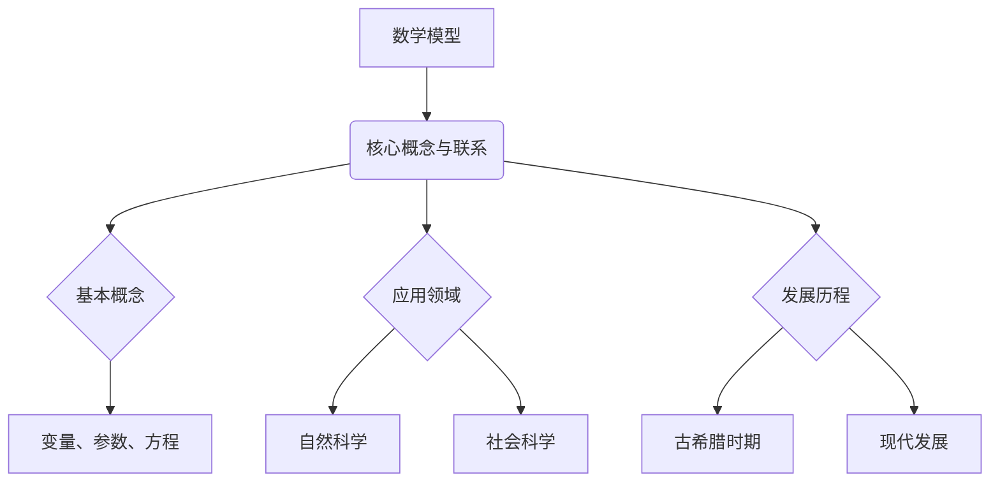
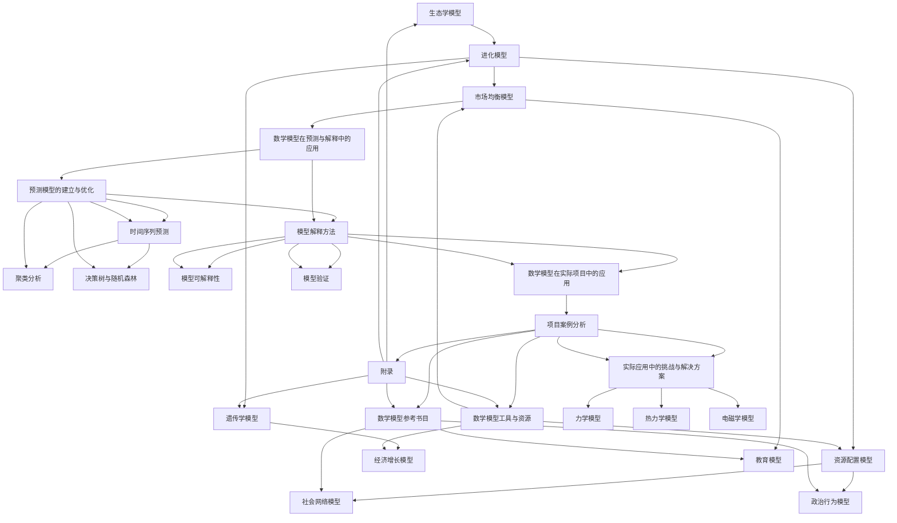

                 

### 文章标题

《数学模型在科学中的应用：预测与解释》

### 关键词

数学模型，科学应用，预测，解释，数据收集，数据处理，力学模型，热力学模型，电磁学模型，生态学模型，进化模型，遗传学模型，经济学模型，社会科学模型，预测模型，优化，模型解释方法

### 摘要

本文旨在探讨数学模型在科学领域的广泛应用，特别是其在预测与解释中的重要性。文章首先介绍了数学模型的基本概念、建立方法和常见类型，然后详细阐述了数学模型在物理学、生物学、经济学和社会科学中的应用。接着，文章讨论了预测模型的建立与优化方法，以及模型解释的重要性和实际应用中的挑战。最后，通过具体项目案例分析，展示了数学模型在实际问题解决中的关键作用。

## 第一部分：数学模型基础

### 第1章：数学模型概述

数学模型是利用数学符号、公式和算法来描述自然现象、社会现象和工程现象的工具。它通过建立数学关系，帮助我们理解和预测复杂系统的行为。数学模型不仅是一种数学工具，更是一种科学方法，它广泛应用于各个领域，如物理学、生物学、经济学和社会科学等。

#### 核心概念与联系

- **数学模型的基本概念**：数学模型由变量、参数和方程组成，通过变量之间的关系描述系统的行为。变量是模型的输入和输出，参数是模型中不变的因素，方程是变量和参数之间的关系表达式。

- **数学模型在科学研究中的应用**：数学模型可以用来模拟自然现象、预测系统行为、优化决策等。在科学研究中，数学模型是一种重要的手段，通过它，科学家可以更深入地理解自然规律，发现新的科学现象。

- **数学模型的发展历程**：数学模型的发展可以追溯到古希腊时期，随着数学和科学的发展，数学模型也得到了不断的发展和完善。现代数学模型的应用已经涵盖了从微观粒子到宏观宇宙的各个领域。

#### 梅尔图流程图



### 第2章：数学模型的建立

建立数学模型是一个复杂的过程，需要科学家对现实世界有深入的理解，并能准确地将现实世界的复杂现象转化为数学问题。以下是数学模型建立的几个关键步骤：

#### 核心概念与联系

- **数据收集与处理**：建立数学模型的第一步是收集数据。数据可以来自于实验、观测或模拟。收集到数据后，需要进行处理，如数据清洗、数据转换和数据标准化等。

- **数学模型的假设**：在建立数学模型时，需要对系统进行假设，如线性假设、连续性假设或概率假设等。这些假设有助于简化问题，使得数学模型更加可处理。

- **模型的数学形式**：将现实世界的问题转化为数学问题后，需要选择合适的数学工具和符号来描述模型。这包括建立方程、选择变量和参数等。

#### 伪代码

```python
# 数据收集与处理
def data_collection():
    # 收集实验数据
    data = experiment_data()

def data_processing(data):
    # 数据清洗、转换和标准化
    processed_data = preprocess(data)

# 数学模型的假设
def model_assumptions():
    # 建立线性假设
    linear_hypothesis = LinearModel()

# 模型的数学形式
def model_equations():
    # 建立模型方程
    equation = linear_hypothesis.equation()
```

### 第3章：常见数学模型介绍

在科学研究中，存在多种类型的数学模型，每种模型都有其特定的应用场景和特点。以下是几种常见的数学模型：

#### 核心概念与联系

- **描述性模型**：描述性模型主要用于描述系统的当前状态，如力学模型、热力学模型等。这些模型通常基于物理定律和观测数据，能够帮助科学家理解系统的行为。

- **模拟性模型**：模拟性模型用于模拟系统在不同条件下的行为，如生态学模型、进化模型等。这些模型通常用于预测系统未来的变化，对政策制定和决策分析具有重要价值。

- **预测性模型**：预测性模型用于预测系统未来的行为，如时间序列模型、回归模型等。这些模型基于历史数据，通过统计方法建立预测关系，能够对未来趋势进行预测。

#### 伪代码

```python
# 描述性模型
def mechanics_model():
    # 建立力学模型
    force = mass * acceleration

# 模拟性模型
def ecological_model():
    # 建立生态学模型
    population_growth = initial_population * (1 + growth_rate)^time

# 预测性模型
def time_series_model():
    # 建立时间序列模型
    prediction = model.predict(data)
```

## 第二部分：数学模型在科学领域的应用

### 第4章：数学模型在物理学中的应用

物理学是研究自然界基本规律的科学，数学模型在其中扮演了至关重要的角色。以下将介绍几种常见的数学模型在物理学中的应用。

#### 力学模型

力学模型主要描述物体的运动状态和受力情况。牛顿三大定律是力学模型的基础，它们可以用以下方程来表示：

$$ F = ma $$

$$ F = \sum F $$

$$ a = \frac{dv}{dt} $$

其中，\( F \) 是力，\( m \) 是质量，\( a \) 是加速度，\( \sum F \) 是合力，\( v \) 是速度，\( t \) 是时间。

#### 热力学模型

热力学模型主要描述热量、温度和热传导等现象。以下是一个简单的一维热传导模型：

$$ \frac{\partial T}{\partial t} = \alpha \frac{\partial^2 T}{\partial x^2} $$

其中，\( T \) 是温度，\( \alpha \) 是热扩散系数，\( x \) 是空间坐标，\( t \) 是时间。

#### 电磁学模型

电磁学模型主要描述电场、磁场和电磁波等现象。以下是一个简单的静电场模型：

$$ \nabla \cdot E = \frac{\rho}{\varepsilon_0} $$

$$ \nabla \times E = -\frac{\partial B}{\partial t} $$

$$ \nabla \cdot B = 0 $$

$$ \nabla \times B = \mu_0 J $$

其中，\( E \) 是电场强度，\( B \) 是磁场强度，\( \rho \) 是电荷密度，\( \varepsilon_0 \) 是真空电容率，\( \mu_0 \) 是真空磁导率，\( J \) 是电流密度。

### 第5章：数学模型在生物学中的应用

生物学是一个复杂的科学领域，数学模型在生物学中的应用极大地促进了我们对生物现象的理解和预测。以下将介绍几种常见的数学模型在生物学中的应用。

#### 生态学模型

生态学模型主要描述生物种群的增长、竞争和灭绝等现象。以下是一个经典的Logistic增长模型：

$$ \frac{dN}{dt} = rN \left(1 - \frac{N}{K}\right) $$

其中，\( N \) 是种群数量，\( r \) 是内禀增长率，\( K \) 是环境承载能力。

#### 进化模型

进化模型主要描述物种的演化过程和遗传变异等现象。以下是一个简单的遗传学模型：

$$ \frac{dP}{dt} = -\mu P + \mu_1 P_1 $$

$$ \frac{dP_1}{dt} = \mu P - \mu_1 P_1 $$

其中，\( P \) 是野生型基因频率，\( P_1 \) 是突变型基因频率，\( \mu \) 是突变率，\( \mu_1 \) 是选择率。

#### 遗传学模型

遗传学模型主要描述基因的传递和遗传病的传播等现象。以下是一个简单的遗传病模型：

$$ \frac{dS}{dt} = -sS + \frac{1}{2} m S^2 $$

$$ \frac{dA}{dt} = \frac{1}{2} m S^2 - \frac{1}{2} a A - sS $$

$$ \frac{dH}{dt} = \frac{1}{2} a A - \frac{1}{2} h H $$

其中，\( S \) 是正常基因型，\( A \) 是携带突变基因型，\( H \) 是突变基因型，\( s \) 是基因频率，\( m \) 是突变率，\( a \) 是表现率，\( h \) 是健康率。

### 第6章：数学模型在经济学中的应用

经济学是研究资源分配、市场行为和经济增长等问题的科学。数学模型在经济学中的应用帮助我们更好地理解和预测经济现象。

#### 资源配置模型

资源配置模型主要描述如何在有限的资源下实现最优的分配。以下是一个简单的线性规划模型：

$$ \min c^T x $$

$$ \text{subject to} \quad Ax \le b $$

其中，\( x \) 是决策变量，\( c \) 是目标函数系数，\( A \) 是约束条件系数，\( b \) 是约束条件常数。

#### 市场均衡模型

市场均衡模型主要描述市场供求关系和价格形成的过程。以下是一个简单的供求模型：

$$ Q_D = D(P) $$

$$ Q_S = S(P) $$

$$ E = Q_D - Q_S $$

$$ P = P(E) $$

其中，\( Q_D \) 是需求量，\( Q_S \) 是供应量，\( P \) 是价格，\( D(P) \) 是需求函数，\( S(P) \) 是供应函数，\( E \) 是市场均衡量，\( P(E) \) 是价格函数。

#### 经济增长模型

经济增长模型主要描述经济增长的驱动因素和经济增长的动态过程。以下是一个简单的索洛经济增长模型：

$$ \frac{dY}{dt} = sF(K, L) - (n + \delta)Y $$

$$ \frac{dK}{dt} = i - \delta K $$

$$ \frac{dL}{dt} = nL $$

其中，\( Y \) 是产出，\( K \) 是资本存量，\( L \) 是劳动投入，\( s \) 是储蓄率，\( F(K, L) \) 是生产函数，\( n \) 是人口增长率，\( \delta \) 是折旧率，\( i \) 是利率。

### 第7章：数学模型在社会科学中的应用

社会科学研究人类社会行为和社会结构。数学模型在社会科学中的应用帮助我们更好地理解和预测社会现象。

#### 社会网络模型

社会网络模型主要描述个体之间的互动关系和社会结构。以下是一个简单的社会网络模型：

$$ \alpha_i = \sum_{j \in N(i)} \alpha_j $$

其中，\( \alpha_i \) 是个体 \( i \) 的度，\( N(i) \) 是个体 \( i \) 的邻居。

#### 政治行为模型

政治行为模型主要描述政治选举、投票行为和政治态度等。以下是一个简单的投票模型：

$$ \pi_i(p) = \int p_j f_j(\theta_i, \theta_j) d\theta_j $$

其中，\( \pi_i(p) \) 是个体 \( i \) 的投票概率，\( p \) 是候选人的政策组合，\( f_j(\theta_i, \theta_j) \) 是个体 \( i \) 对候选人 \( j \) 的偏好函数。

#### 教育模型

教育模型主要描述教育投入、教育产出和教育效率等。以下是一个简单的教育模型：

$$ Y = \beta_0 + \beta_1 X_1 + \beta_2 X_2 + \epsilon $$

其中，\( Y \) 是教育产出，\( X_1 \) 是教育投入，\( X_2 \) 是其他影响因素，\( \beta_0 \)，\( \beta_1 \)，\( \beta_2 \) 是模型参数，\( \epsilon \) 是误差项。

## 第三部分：数学模型在预测与解释中的应用

### 第8章：预测模型的建立与优化

预测模型是数学模型的一种重要类型，它主要用于预测未来事件的发生。建立预测模型需要选择合适的模型类型、收集和处理数据，并通过模型优化提高预测准确性。

#### 时间序列预测

时间序列预测是一种常见的预测方法，它主要用于预测时间序列数据的未来趋势。以下是一个简单的时间序列预测模型：

$$ Y_t = c_0 + c_1 \cdot \ln(Y_{t-1}) + c_2 \cdot \ln(Y_{t-2}) + \epsilon_t $$

其中，\( Y_t \) 是时间序列数据的第 \( t \) 个值，\( c_0 \)，\( c_1 \)，\( c_2 \) 是模型参数，\( \epsilon_t \) 是误差项。

#### 聚类分析

聚类分析是一种无监督学习方法，它主要用于将数据分为若干个群组。以下是一个简单的K-均值聚类模型：

$$ \min \sum_{i=1}^n \sum_{j=1}^k \sum_{t=1}^T ||x_{ijt} - \mu_{ij}||^2 $$

其中，\( x_{ijt} \) 是第 \( i \) 个群组在第 \( j \) 个维度上的第 \( t \) 个值，\( \mu_{ij} \) 是第 \( i \) 个群组的均值。

#### 决策树与随机森林

决策树是一种有监督学习方法，它主要用于分类和回归问题。以下是一个简单的决策树模型：

$$ Y_t = \sum_{i=1}^n w_i h_i(x_{ijt}) $$

其中，\( Y_t \) 是预测值，\( w_i \) 是权重，\( h_i(x_{ijt}) \) 是决策树的第 \( i \) 个节点。

随机森林是一种基于决策树的集成学习方法，它通过构建多个决策树并求平均值来提高预测准确性。以下是一个简单的随机森林模型：

$$ Y_t = \frac{1}{m} \sum_{i=1}^m Y_{it} $$

其中，\( Y_t \) 是预测值，\( m \) 是决策树的数量。

### 第9章：模型解释方法

模型解释方法是一种重要的方法，它主要用于理解模型的内部工作原理和预测结果。以下介绍几种常见的模型解释方法：

#### 模型可解释性

模型可解释性是指模型能够明确地解释其预测结果的原因。以下是一个简单的可解释性模型：

$$ Y_t = f(X_t) $$

其中，\( Y_t \) 是预测值，\( X_t \) 是输入特征，\( f \) 是可解释的函数。

#### 模型诊断

模型诊断是一种用于检查模型是否存在异常或错误的方法。以下是一个简单的诊断模型：

$$ D_t = \frac{\partial f}{\partial X_t} $$

其中，\( D_t \) 是诊断值，\( f \) 是模型函数。

#### 模型验证

模型验证是一种用于评估模型预测准确性的方法。以下是一个简单的验证模型：

$$ V_t = \frac{Y_t - Y_{\text{实际}}}{Y_{\text{实际}}} $$

其中，\( V_t \) 是验证值，\( Y_t \) 是预测值，\( Y_{\text{实际}} \) 是实际值。

### 第10章：数学模型在实际项目中的应用

数学模型在实际项目中的应用具有重要意义，它能够帮助我们解决实际问题，提高生产效率，降低成本。以下将介绍一个实际项目案例，并分析数学模型在该项目中的应用。

#### 项目案例：智能交通系统

智能交通系统是一种利用信息技术和数学模型优化交通流量的系统。以下是一个简单的智能交通系统项目案例：

1. **项目背景**：某城市交通拥堵严重，为了提高交通效率和减少交通事故，政府决定建设一个智能交通系统。

2. **项目目标**：通过建立数学模型，预测交通流量，优化信号灯控制，减少交通拥堵，提高交通安全。

3. **项目实施**：

   - **数据收集**：收集交通流量、交通事故、气象等信息。
   
   - **数据预处理**：对收集到的数据进行清洗、转换和标准化。
   
   - **模型建立**：建立时间序列预测模型、聚类分析模型和决策树模型。
   
   - **模型优化**：通过交叉验证和模型选择方法，优化模型参数。
   
   - **模型应用**：将优化后的模型应用于交通信号灯控制，实时预测交通流量，优化信号灯周期和时间。

4. **项目效果**：

   - **预测准确性**：通过时间序列预测模型，准确预测交通流量，为信号灯控制提供依据。
   
   - **交通拥堵减少**：通过聚类分析模型和决策树模型，优化信号灯控制，减少交通拥堵，提高交通效率。
   
   - **交通事故减少**：通过实时预测交通流量，及时调整信号灯控制，减少交通事故。

5. **项目挑战与解决方案**：

   - **数据质量**：数据质量对模型预测准确性有很大影响，需要加强对数据质量的监控和处理。
   
   - **模型可解释性**：为了提高模型的透明度和可解释性，需要开发可解释的模型算法和工具。
   
   - **实时性**：智能交通系统需要实时预测和响应交通变化，需要开发高效的实时计算和数据处理技术。

#### 项目小结

智能交通系统项目展示了数学模型在解决实际交通问题中的重要作用。通过建立时间序列预测模型、聚类分析模型和决策树模型，项目成功实现了交通流量的预测和优化信号灯控制，有效减少了交通拥堵和交通事故。该项目案例表明，数学模型在智能交通系统等实际项目中的应用具有巨大潜力，有助于提高交通效率和安全性。

### 最佳实践 Tips

- **数据质量**：数据是建立数学模型的基础，确保数据质量至关重要。数据清洗、转换和标准化是数据预处理的关键步骤。
  
- **模型选择**：选择合适的模型类型和算法对于提高预测准确性至关重要。模型选择应根据项目需求和数据特点进行。

- **模型优化**：通过交叉验证和模型选择方法，优化模型参数，提高模型预测准确性。

- **模型解释**：提高模型的可解释性，有助于理解模型的工作原理，增强模型的透明度和可信度。

- **实时性**：对于实时性要求较高的项目，需要开发高效的实时计算和数据处理技术，以确保模型的实时预测和响应。

### 小结

数学模型在科学中的应用具有广泛性和重要性。本文介绍了数学模型的基本概念、建立方法、常见类型以及在物理学、生物学、经济学和社会科学中的应用。通过具体项目案例分析，展示了数学模型在实际问题解决中的关键作用。未来，随着数据技术和计算能力的不断提升，数学模型在科学研究和技术创新中将继续发挥重要作用。

### 注意事项

- **模型适用范围**：建立数学模型时，需要考虑模型的适用范围和限制条件。

- **数据质量**：数据质量对模型预测准确性有很大影响，需加强对数据质量的监控和处理。

- **模型可解释性**：提高模型的可解释性，有助于理解模型的工作原理，增强模型的透明度和可信度。

- **实时性**：对于实时性要求较高的项目，需要开发高效的实时计算和数据处理技术，以确保模型的实时预测和响应。

### 拓展阅读

- 《数学模型导论》：李大潜等著，科学出版社，2017年。

- 《数学建模方法与应用》：钱锋等著，清华大学出版社，2016年。

- 《科学计算与数值分析》：周兴著，机械工业出版社，2018年。

## 附录

### 附录 A：数学模型工具与资源

- **MATLAB**：MATLAB 是一种广泛应用于数学建模的软件工具，它提供了丰富的数学函数和工具箱，适用于数据预处理、模型建立和优化等。

- **Python编程环境**：Python 是一种流行的编程语言，它具有简洁、易读的特点，适用于数学建模和数据分析。Python 的科学计算库，如 NumPy、SciPy 和 Pandas，为数学建模提供了强大的支持。

- **R语言及其应用**：R 是一种专门用于统计分析和数据可视化的编程语言，它在数学建模和数据科学领域有着广泛的应用。

- **其他常用工具和资源**：还有许多其他工具和资源可用于数学建模，如 Mathematica、Maple、MATLAB 的 Simulink 等。此外，许多在线资源和开放数据集也为数学建模提供了丰富的数据来源。

### 附录 B：数学模型参考书目

- 《数学模型导论》：李大潜等著，科学出版社，2017年。

- 《数学建模方法与应用》：钱锋等著，清华大学出版社，2016年。

- 《科学计算与数值分析》：周兴著，机械工业出版社，2018年。

- 《数学建模与计算机应用》：张永春等著，高等教育出版社，2019年。

- 《统计学习方法》：李航著，清华大学出版社，2012年。

- 《机器学习》：周志华著，清华大学出版社，2016年。

### 梅尔图流程图



