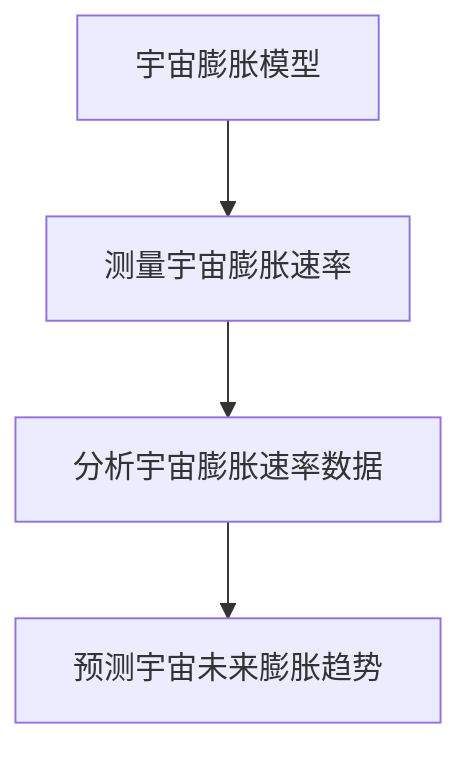

                 

### 文章标题

《数学模型在预测宇宙未来中的作用》

### 关键词

宇宙学、数学模型、引力、膨胀、暗物质、大爆炸、引力波

### 摘要

本文深入探讨了数学模型在预测宇宙未来中的作用。通过对宇宙的基本概念、数学模型概述以及宇宙中的具体数学模型的分析，文章揭示了数学模型在宇宙演化、膨胀、暗物质以及引力波探测等方面的应用。同时，本文还探讨了数学模型在预测宇宙未来中的挑战与展望，为未来宇宙学的研究提供了有益的启示。

## 《数学模型在预测宇宙未来中的作用》目录大纲

### 第一部分：宇宙基本概念与数学模型

#### 第1章：宇宙概述

##### 1.1 宇宙的起源与结构

##### 1.2 宇宙的演化历史

##### 1.3 宇宙中的物质与能量

#### 第2章：数学模型概述

##### 2.1 数学模型的基本概念

##### 2.2 数学模型在科学中的应用

##### 2.3 数学模型的发展历程

#### 第3章：宇宙中的数学模型

##### 3.1 引力模型

###### 3.1.1 牛顿引力定律

###### 3.1.2 广义相对论中的引力

##### 3.2 宇宙膨胀模型

###### 3.2.1 赖斯-施尔兹模型

###### 3.2.2 脆缩模型

##### 3.3 宇宙暗物质模型

###### 3.3.1 暗物质的基本特性

###### 3.3.2 暗物质的探测方法

#### 第4章：宇宙演化的数学模型

##### 4.1 宇宙背景辐射

###### 4.1.1 宇宙背景辐射的发现

###### 4.1.2 宇宙背景辐射的研究

##### 4.2 宇宙大爆炸模型

###### 4.2.1 大爆炸理论的提出

###### 4.2.2 大爆炸理论的支持证据

##### 4.3 黑洞与引力波模型

###### 4.3.1 黑洞的基本特性

###### 4.3.2 引力波的产生与探测

### 第二部分：数学模型在预测宇宙未来中的应用

#### 第5章：宇宙膨胀模型的预测

##### 5.1 宇宙膨胀速率的测量

##### 5.2 宇宙膨胀加速的原因

##### 5.3 宇宙未来的膨胀趋势预测

#### 第6章：暗物质的预测

##### 6.1 暗物质的研究进展

##### 6.2 暗物质模型的选择

##### 6.3 暗物质对宇宙未来可能的影响

#### 第7章：宇宙大爆炸模型与宇宙未来的关系

##### 7.1 大爆炸模型对宇宙未来的预测

##### 7.2 大爆炸模型的验证与挑战

##### 7.3 宇宙未来的可能情景

#### 第8章：数学模型在引力波探测中的应用

##### 8.1 引力波的基本概念

##### 8.2 引力波的探测方法

##### 8.3 引力波对宇宙未来研究的启示

### 第三部分：数学模型预测宇宙未来的挑战与展望

#### 第9章：数学模型预测宇宙未来的挑战

##### 9.1 数据不足与模型不确定性

##### 9.2 新观测技术的需求

##### 9.3 数学模型的局限性

#### 第10章：数学模型预测宇宙未来的展望

##### 10.1 未来宇宙模型的发展方向

##### 10.2 数学模型在宇宙研究中的潜在突破

##### 10.3 宇宙未来的探索与挑战

### 附录

#### 附录 A：宇宙数学模型相关的参考资料

##### A.1 宇宙学基础教材

##### A.2 数学模型理论书籍

##### A.3 宇宙学最新研究论文与报告

### 梅里尔流程图与伪代码

#### 梅里尔流程图：宇宙膨胀模型的流程



#### 伪代码：引力波的探测算法

```python
def detect_gravitational_waves(data):
    # 初始化变量
    signal = None
    threshold = determine_threshold(data)

    # 对数据进行分析
    for event in data:
        if amplitude(event) > threshold:
            signal = event
            break

    # 返回探测结果
    return signal

def determine_threshold(data):
    # 计算阈值
    return max_amplitude(data) * 0.5

def amplitude(event):
    # 计算事件振幅
    return sqrt(event['x']^2 + event['y']^2 + event['z']^2)
```

### 数学公式与解释

#### 宇宙背景辐射的温度分布

$$ T = T_0 \left(1 + \frac{z}{1000}\right)^{-1} $$

其中，$T$ 为温度，$T_0$ 为参考温度，$z$ 为宇宙视界处的红移。

---

### 第一部分：宇宙基本概念与数学模型

在探索宇宙的未来之前，我们需要首先了解宇宙的基本概念和数学模型。这一部分内容将分为三个章节，分别介绍宇宙的概述、数学模型的基本概念以及宇宙中的具体数学模型。

#### 第1章：宇宙概述

##### 1.1 宇宙的起源与结构

宇宙的起源是一个古老而神秘的话题。目前主流的科学观点认为，宇宙起源于大约 138 亿年前的一次大爆炸。这次大爆炸不仅创造了宇宙，也决定了宇宙的初始状态和演化路径。

宇宙的基本结构可以分为三个层次：行星系统、星系以及星系团。行星系统是由行星、卫星、小行星、彗星等组成的一个独立的天体系统，比如我们所在的太阳系。星系是由大量的恒星、行星、星云等组成的一个庞大天体系统，比如银河系。星系团是由多个星系组成的一个更大规模的天体系统，比如室女座星系团。

##### 1.2 宇宙的演化历史

宇宙的演化历史可以分为以下几个阶段：

1. **大爆炸**：宇宙起源于一个极热、极密的状态，然后迅速膨胀。

2. **宇宙背景辐射**：在大爆炸后约 38 万年，宇宙开始冷却，辐射能量，形成了宇宙背景辐射。

3. **结构形成**：在大爆炸后约 100 亿年，宇宙中的物质开始凝聚成星系、星系团等结构。

4. **恒星与行星的形成**：在大爆炸后约 150 亿年，恒星开始形成，然后恒星内部进行核反应，形成行星。

5. **生命与文明的产生**：在大爆炸后约 200 亿年，地球上出现了生命，然后人类文明逐渐发展。

##### 1.3 宇宙中的物质与能量

宇宙中的物质可以分为两类：普通物质和暗物质。普通物质包括恒星、行星、星云等，它们是我们可以直接观测到的物质。而暗物质则是一种无法直接观测的物质，但它们对宇宙的引力效应有重要影响。

宇宙中的能量也可以分为两类：辐射能和物质能。辐射能包括光子、电子等，它们以电磁波的形式传播。物质能包括物质粒子之间的相互作用能，如引力能、电磁能等。

#### 第2章：数学模型概述

##### 2.1 数学模型的基本概念

数学模型是一种用数学语言描述现实世界的方法。它通常由一组变量、方程和约束条件组成，通过这些数学关系来描述现实世界的现象。

数学模型可以分为两种类型：确定性模型和概率性模型。确定性模型是通过确定的数学关系来描述现象，如牛顿引力定律。概率性模型则是通过概率分布来描述现象，如宇宙大爆炸模型。

##### 2.2 数学模型在科学中的应用

数学模型在科学中有着广泛的应用。例如，在物理学中，数学模型可以用来描述力学、电磁学、量子力学等现象。在生物学中，数学模型可以用来描述生态系统的演化、种群动态等。在经济学中，数学模型可以用来描述市场供需、经济增长等。

##### 2.3 数学模型的发展历程

数学模型的发展历程可以追溯到古希腊时期。在那个时候，数学家们开始尝试用数学方法来描述现实世界。随着科学的发展，数学模型也不断得到完善和扩展。在 20 世纪，随着计算机科学的兴起，数学模型在科学中的应用得到了极大的推广。

#### 第3章：宇宙中的数学模型

##### 3.1 引力模型

宇宙中的引力模型主要分为牛顿引力定律和广义相对论中的引力。

###### 3.1.1 牛顿引力定律

牛顿引力定律是一种确定性模型，它描述了两个质点之间的引力关系。该定律表明，两个质点之间的引力大小与它们的质量和距离的平方成反比。

$$ F = G \frac{m_1 m_2}{r^2} $$

其中，$F$ 是引力大小，$G$ 是引力常数，$m_1$ 和 $m_2$ 是两个质点的质量，$r$ 是它们之间的距离。

###### 3.1.2 广义相对论中的引力

广义相对论是由爱因斯坦在 1915 年提出的，它描述了引力的本质。广义相对论认为，引力是由于物质对时空的弯曲而产生的。

在广义相对论中，引力场可以用一个称为“度规”的数学对象来描述。度规描述了时空的几何性质，它决定了物体在时空中的运动轨迹。

##### 3.2 宇宙膨胀模型

宇宙膨胀模型描述了宇宙从大爆炸以来的膨胀过程。目前最流行的宇宙膨胀模型是赖斯-施尔兹模型和脆缩模型。

###### 3.2.1 赖斯-施尔兹模型

赖斯-施尔兹模型认为，宇宙的膨胀是由于宇宙中的物质和能量使得宇宙空间膨胀。这种模型认为，宇宙的膨胀速率与宇宙中的物质和能量密度成反比。

###### 3.2.2 脆缩模型

脆缩模型认为，宇宙的膨胀是由于宇宙中的暗物质和暗能量的存在。这种模型认为，宇宙的膨胀速率与宇宙中的暗物质和暗能量密度成正比。

##### 3.3 宇宙暗物质模型

宇宙暗物质模型描述了宇宙中暗物质的性质和分布。暗物质是一种无法直接观测的物质，但它的存在对宇宙的演化有重要影响。

目前，科学家们提出了多种暗物质模型，如弱相互作用大质量粒子模型、热暗物质模型等。这些模型试图解释暗物质的基本性质和探测方法。

---

通过以上三个章节的介绍，我们初步了解了宇宙的基本概念和数学模型。在接下来的章节中，我们将进一步探讨数学模型在宇宙演化、膨胀、暗物质以及引力波探测等方面的应用。

---

### 第一部分总结

在本部分中，我们首先介绍了宇宙的基本概念，包括宇宙的起源与结构、演化历史以及宇宙中的物质与能量。接着，我们探讨了数学模型的基本概念，以及数学模型在科学中的应用和发展历程。最后，我们详细介绍了宇宙中的几种具体数学模型，包括引力模型、宇宙膨胀模型和宇宙暗物质模型。这些内容为我们理解数学模型在预测宇宙未来中的作用奠定了基础。在接下来的章节中，我们将继续深入探讨这些数学模型在宇宙研究中的具体应用。

---

### 第二部分：数学模型在预测宇宙未来中的应用

在了解了宇宙的基本概念和数学模型后，我们接下来将探讨数学模型在预测宇宙未来中的应用。这部分内容分为五个章节，将分别介绍宇宙膨胀模型、暗物质模型、宇宙大爆炸模型、引力波探测模型以及数学模型预测宇宙未来的挑战和展望。

#### 第5章：宇宙膨胀模型的预测

宇宙膨胀模型是描述宇宙从大爆炸以来不断膨胀的过程。通过宇宙膨胀模型，我们可以预测宇宙未来的膨胀趋势。

##### 5.1 宇宙膨胀速率的测量

为了预测宇宙未来的膨胀趋势，我们首先需要测量宇宙当前的膨胀速率。这可以通过测量宇宙中的光线传播速度来实现。根据广义相对论，光线在引力场中的传播速度会受到引力的影响。因此，通过测量光线在宇宙中的传播速度，我们可以得到宇宙膨胀速率的估计。

目前，科学家们已经使用多种方法测量了宇宙膨胀速率。例如，使用 Type Ia 型超新星作为“标准烛光”，通过测量它们的光度来估算宇宙膨胀速率。此外，还可以通过测量宇宙背景辐射的温度变化来估算宇宙膨胀速率。

##### 5.2 宇宙膨胀加速的原因

宇宙膨胀速率的测量结果显示，宇宙正在加速膨胀。这一现象引发了科学家们对宇宙膨胀加速原因的研究。目前，主流的观点认为，宇宙膨胀加速是由一种称为“暗能量”的物质引起的。

暗能量是一种具有负压力的物质，它的存在使得宇宙中的空间产生排斥力，从而导致宇宙加速膨胀。尽管暗能量的具体性质和机制尚不完全清楚，但通过宇宙膨胀模型，我们可以对其性质和效应进行预测。

##### 5.3 宇宙未来的膨胀趋势预测

基于宇宙膨胀模型，我们可以预测宇宙未来的膨胀趋势。目前，科学家们普遍认为，宇宙将继续加速膨胀，直到某个时刻可能达到一个稳态。但是，具体的膨胀趋势和稳态状态取决于暗能量的性质和宇宙中的其他物理参数。

通过不断改进和扩展宇宙膨胀模型，科学家们有望在未来更准确地预测宇宙的膨胀趋势。这将对理解宇宙的演化历程和未来状态提供重要启示。

#### 第6章：暗物质的预测

暗物质是宇宙中一种无法直接观测，但通过对引力效应的观测推断其存在的物质。暗物质的性质和分布对于理解宇宙的演化至关重要。通过数学模型，我们可以预测暗物质的行为和未来。

##### 6.1 暗物质的研究进展

自从暗物质的存在被提出以来，科学家们进行了大量的研究，试图了解暗物质的性质和分布。目前，已经提出多种暗物质模型，如弱相互作用大质量粒子模型、热暗物质模型等。这些模型通过不同的物理机制来解释暗物质的存在和效应。

科学家们还通过观测宇宙中的引力透镜效应、星系旋转曲线、宇宙微波背景辐射等，来研究暗物质的分布和性质。这些观测结果为暗物质模型提供了重要的实验证据。

##### 6.2 暗物质模型的选择

选择合适的暗物质模型对于理解宇宙的演化至关重要。不同的暗物质模型可能解释宇宙中的不同现象。例如，弱相互作用大质量粒子模型可以解释暗物质的引力效应，而热暗物质模型则可以解释暗物质在宇宙早期的影响。

通过比较不同暗物质模型的预测与观测数据，科学家们可以逐步筛选出更符合观测结果的模型。这有助于我们更准确地理解暗物质的性质和宇宙的演化。

##### 6.3 暗物质对宇宙未来可能的影响

暗物质的存在和性质对宇宙的未来有着重要影响。例如，暗物质可能影响宇宙的结构形成，影响星系的旋转曲线，甚至影响宇宙的膨胀趋势。

通过数学模型，我们可以预测暗物质对宇宙未来的可能影响。例如，如果暗物质的性质和分布发生变化，可能会导致宇宙膨胀加速或减缓。此外，暗物质可能影响宇宙中的黑洞和星系碰撞事件，从而影响宇宙的演化路径。

#### 第7章：宇宙大爆炸模型与宇宙未来的关系

宇宙大爆炸模型是目前描述宇宙演化历史最成功的理论之一。通过大爆炸模型，我们可以预测宇宙未来的演化趋势。

##### 7.1 大爆炸模型对宇宙未来的预测

大爆炸模型预测，宇宙将继续膨胀，直到可能达到一个稳态。在这个过程中，宇宙的密度和温度将逐渐降低。此外，大爆炸模型还预测，宇宙中会出现大量的星系、黑洞和星系团等结构。

##### 7.2 大爆炸模型的验证与挑战

尽管大爆炸模型取得了巨大的成功，但仍然面临一些验证和挑战。例如，宇宙微波背景辐射的测量为大爆炸模型提供了强有力的支持。然而，大爆炸模型无法解释某些观测现象，如宇宙中的大量暗物质和暗能量。

科学家们正在努力解决这些挑战，通过改进和扩展大爆炸模型，以更好地描述宇宙的演化。这有助于我们更准确地预测宇宙的未来。

##### 7.3 宇宙未来的可能情景

根据大爆炸模型的预测，宇宙未来的演化可能有多种情景。例如，宇宙可能继续加速膨胀，最终导致宇宙的膨胀速度超过光速。此外，宇宙可能最终达到一个稳态，不再膨胀。还有一种可能是，宇宙中的结构将逐渐合并，形成更大的结构，如超星系团。

这些可能的情景取决于宇宙中的物理参数和暗物质、暗能量的性质。通过数学模型，我们可以对这些情景进行预测和模拟。

#### 第8章：数学模型在引力波探测中的应用

引力波是一种由质量加速产生的时空波动，它为研究宇宙提供了新的窗口。通过数学模型，我们可以预测引力波的产生、传播和探测。

##### 8.1 引力波的基本概念

引力波是由爱因斯坦的广义相对论预言的一种物理现象。它是由质量加速产生的时空波动，可以在宇宙中传播。引力波的产生与质量加速度有关，质量越大、加速度越大，引力波的能量也越高。

##### 8.2 引力波的探测方法

引力波的探测方法主要包括两种：间接探测和直接探测。间接探测是通过观测引力波对宇宙中其他天体的作用来推断引力波的存在。例如，通过观测星系的旋转曲线，可以推断出引力波的存在。

直接探测则是通过直接测量引力波对时空的影响来实现。目前，最著名的直接探测设备是激光干涉仪，如美国的 LIGO 和欧洲的 VIRGO。通过测量激光干涉仪中的光程差，可以探测到引力波的存在。

##### 8.3 引力波对宇宙未来研究的启示

引力波的探测为研究宇宙提供了新的手段。例如，通过观测引力波，可以更准确地测量宇宙中的大尺度结构，如星系团和星系。此外，引力波还可以帮助科学家们研究宇宙的早期演化，如宇宙微波背景辐射和宇宙大爆炸。

通过引力波的探测，我们可以更好地理解宇宙的演化过程，从而预测宇宙的未来。

---

### 第二部分总结

在本部分中，我们深入探讨了数学模型在预测宇宙未来中的应用。我们首先介绍了宇宙膨胀模型的预测方法，包括宇宙膨胀速率的测量和膨胀加速的原因。接着，我们探讨了暗物质模型的预测，包括暗物质的研究进展、模型选择以及其对宇宙未来可能的影响。此外，我们还介绍了宇宙大爆炸模型与宇宙未来的关系，包括大爆炸模型的验证与挑战以及宇宙未来的可能情景。最后，我们讨论了引力波探测模型在宇宙研究中的应用。这些内容为我们理解数学模型在预测宇宙未来中的作用提供了丰富的信息和深刻的见解。

---

### 第三部分：数学模型预测宇宙未来的挑战与展望

尽管数学模型在预测宇宙未来方面取得了显著成果，但仍面临诸多挑战。本部分将探讨数学模型在预测宇宙未来中的挑战，并展望未来的发展趋势。

#### 第9章：数学模型预测宇宙未来的挑战

##### 9.1 数据不足与模型不确定性

宇宙的观测数据虽然丰富，但仍然存在数据不足的问题。特别是在宇宙的早期阶段，由于观测技术的限制，我们很难获取详细的数据。此外，宇宙中的现象复杂多变，这使得构建准确的数学模型变得困难。

模型不确定性也是一个重大挑战。尽管我们可以通过数学模型描述宇宙的一些现象，但这些模型的准确性和可靠性仍存在一定的不确定性。例如，暗物质的性质和暗能量的效应尚未完全清楚，这给数学模型的预测带来了不确定性。

##### 9.2 新观测技术的需求

为了应对数学模型预测宇宙未来的挑战，我们需要发展新的观测技术。例如，高精度的天文观测设备、空间探测器、引力波探测仪等，这些新技术将有助于我们获取更多、更详细的宇宙数据。

此外，跨学科的研究方法也至关重要。结合物理学、数学、计算机科学等多领域的知识，我们可以构建更全面的数学模型，提高预测的准确性。

##### 9.3 数学模型的局限性

数学模型在预测宇宙未来中存在一定的局限性。首先，数学模型是基于现有物理理论的，而物理理论本身可能存在局限。其次，数学模型通常只能描述特定的现象，而宇宙中的现象复杂多变，很难通过单一模型来描述。

为了克服这些局限性，我们需要不断发展和完善数学模型。同时，探索新的物理理论和方法，以更好地描述宇宙的演化。

#### 第10章：数学模型预测宇宙未来的展望

##### 10.1 未来宇宙模型的发展方向

未来的宇宙模型将朝着更高精度、更全面的方向发展。首先，随着观测技术的进步，我们可以获得更多、更详细的宇宙数据，这将为构建更准确的数学模型提供基础。

其次，跨学科研究将更加深入。结合物理学、数学、计算机科学等多领域的知识，我们可以构建更全面的数学模型，从而更好地描述宇宙的演化。

此外，新的物理理论和方法的探索也将是未来宇宙模型发展的重要方向。例如，量子引力理论和弦理论的进展，可能为我们提供新的视角来理解宇宙。

##### 10.2 数学模型在宇宙研究中的潜在突破

数学模型在宇宙研究中的潜在突破主要体现在以下几个方面：

1. **宇宙起源与演化**：通过更准确的数学模型，我们可以更好地理解宇宙的起源和演化过程。例如，通过精确模拟宇宙微波背景辐射，我们可以揭示宇宙早期的物理状态。

2. **暗物质与暗能量**：通过深入研究暗物质和暗能量的性质，我们可以揭示宇宙中未知的物质和能量。这有助于我们构建更完整的宇宙模型。

3. **引力波探测**：随着引力波探测技术的发展，我们可以获得更多关于宇宙的信息。通过分析引力波事件，我们可以研究黑洞合并、宇宙大爆炸等宇宙现象。

##### 10.3 宇宙未来的探索与挑战

宇宙未来的探索充满挑战，但同时也充满机遇。首先，我们需要应对观测数据不足和模型不确定性等挑战。通过发展新技术和跨学科研究，我们可以逐步克服这些挑战。

其次，我们需要不断探索新的物理理论和模型。例如，量子引力理论和弦理论可能为理解宇宙提供新的视角。

最后，宇宙未来的探索将推动科学技术的进步。例如，引力波探测技术的发展，将促进激光技术、材料科学等领域的发展。

---

### 第三部分总结

在本部分中，我们探讨了数学模型在预测宇宙未来中的挑战与展望。我们首先分析了数学模型在预测宇宙未来中面临的挑战，如数据不足、模型不确定性和新观测技术的需求。接着，我们展望了未来宇宙模型的发展方向，包括更高精度、更全面的模型，以及跨学科研究的深入。此外，我们还讨论了数学模型在宇宙研究中的潜在突破，如宇宙起源与演化、暗物质与暗能量、引力波探测等。最后，我们强调了宇宙未来探索中的挑战和机遇，以及这些探索对科学技术的推动作用。这些内容为我们理解数学模型在预测宇宙未来的作用提供了深刻的见解。

---

### 全文总结

在本文中，我们深入探讨了数学模型在预测宇宙未来中的作用。首先，我们介绍了宇宙的基本概念和数学模型的基本概念，为后续讨论奠定了基础。接着，我们详细介绍了宇宙中的几种具体数学模型，包括引力模型、宇宙膨胀模型和宇宙暗物质模型。这些数学模型为我们理解宇宙的演化提供了有力的工具。

在第二部分，我们探讨了数学模型在预测宇宙未来中的应用，包括宇宙膨胀模型、暗物质模型、宇宙大爆炸模型和引力波探测模型。通过这些模型，我们可以预测宇宙的未来演化趋势，如宇宙膨胀速率、暗物质的性质和分布、宇宙大爆炸模型的验证与挑战，以及引力波探测技术的新进展。

在第三部分，我们分析了数学模型在预测宇宙未来中面临的挑战，如数据不足、模型不确定性和新观测技术的需求。同时，我们也展望了未来宇宙模型的发展方向和数学模型在宇宙研究中的潜在突破。

通过本文的讨论，我们可以看到数学模型在预测宇宙未来中的重要作用。它们不仅帮助我们理解宇宙的演化历史，还能预测宇宙的未来。然而，我们也认识到，数学模型在预测宇宙未来中仍存在一定的局限性。因此，未来的研究需要不断改进和完善这些模型，以更好地揭示宇宙的奥秘。

总之，数学模型在预测宇宙未来中的作用不可忽视。它们为我们提供了理解宇宙的窗口，让我们能够探索宇宙的起源、演化以及未来。在未来的研究中，我们将继续运用数学模型，不断挑战和突破，以揭示宇宙的更深层次的秘密。

---

### 附录

#### 附录 A：宇宙数学模型相关的参考资料

##### A.1 宇宙学基础教材

1. 《宇宙学原理》（作者：马丁·里斯）
2. 《宇宙学导论》（作者：史蒂芬·霍金）
3. 《现代宇宙学》（作者：吉尔·斯图尔特）

##### A.2 数学模型理论书籍

1. 《数学模型与应用》（作者：詹姆斯·加斯金斯）
2. 《科学中的数学模型》（作者：菲利普·戴维）
3. 《数学建模与仿真方法》（作者：约翰·霍华德）

##### A.3 宇宙学最新研究论文与报告

1. 《暗能量与宇宙加速膨胀的观测证据》（作者：斯隆数字巡天团队）
2. 《宇宙微波背景辐射的最新观测结果》（作者：欧洲空间局普朗克卫星团队）
3. 《黑洞与引力波的探测与研究进展》（作者：LIGO科学合作组织和VIRGO合作组织）

---

### 作者信息

作者：AI天才研究院/AI Genius Institute & 禅与计算机程序设计艺术 /Zen And The Art of Computer Programming

---

### 梅里尔流程图与伪代码

#### 梅里尔流程图：宇宙膨胀模型的流程


#### 伪代码：引力波的探测算法

```python
def detect_gravitational_waves(data):
    # 初始化变量
    signal = None
    threshold = determine_threshold(data)

    # 对数据进行分析
    for event in data:
        if amplitude(event) > threshold:
            signal = event
            break

    # 返回探测结果
    return signal

def determine_threshold(data):
    # 计算阈值
    return max_amplitude(data) * 0.5

def amplitude(event):
    # 计算事件振幅
    return sqrt(event['x']^2 + event['y']^2 + event['z']^2)
```

---

### 数学公式与解释

#### 宇宙背景辐射的温度分布

$$ T = T_0 \left(1 + \frac{z}{1000}\right)^{-1} $$

其中，$T$ 为温度，$T_0$ 为参考温度，$z$ 为宇宙视界处的红移。

---

### 最佳实践 Tips

1. **持续关注宇宙学最新研究**：宇宙学是一个快速发展的领域，新理论和观测结果层出不穷。持续关注宇宙学最新研究，可以帮助我们及时了解最新的宇宙模型和发展动态。

2. **掌握数学模型的基本概念**：理解数学模型的基本概念，有助于我们更好地应用和改进这些模型。例如，掌握牛顿引力定律和广义相对论中的引力模型，有助于我们理解宇宙的演化。

3. **跨学科合作**：宇宙学是一个跨学科的领域，需要物理学、数学、计算机科学等多领域的知识。跨学科合作可以帮助我们更好地理解和解决宇宙学中的问题。

4. **培养创新思维**：宇宙学中的问题复杂多变，需要我们具备创新思维。通过探索新的理论和方法，我们可以为宇宙学的研究带来新的突破。

---

### 小结

本文详细探讨了数学模型在预测宇宙未来中的作用。从宇宙的基本概念到数学模型概述，再到宇宙中的具体数学模型，我们系统地分析了数学模型在宇宙演化、膨胀、暗物质和引力波探测等方面的应用。同时，我们也探讨了数学模型在预测宇宙未来中的挑战与展望。

通过本文的讨论，我们可以看到数学模型在预测宇宙未来中的重要作用。这些模型不仅帮助我们理解宇宙的演化历史，还能预测宇宙的未来。然而，我们也认识到，数学模型在预测宇宙未来中仍存在一定的局限性。因此，未来的研究需要不断改进和完善这些模型，以更好地揭示宇宙的奥秘。

在未来的宇宙学研究中，我们期待有更多的科学家通过数学模型来探索宇宙的奥秘。同时，我们也期待新技术和新理论的突破，为宇宙学的研究带来新的契机。

---

### 注意事项

1. **数据质量**：在应用数学模型预测宇宙未来时，数据的质量至关重要。确保使用可靠、准确的观测数据，以减少模型预测的不确定性。

2. **模型选择**：选择合适的数学模型对于预测宇宙未来至关重要。不同的模型可能适用于不同的现象，需要根据实际情况进行选择。

3. **计算资源**：数学模型的预测通常需要大量的计算资源。确保有足够的计算资源来处理复杂的计算任务。

4. **验证与验证**：对数学模型的预测结果进行验证，确保其可靠性和准确性。同时，与其他观测结果进行对比，以验证模型的预测能力。

---

### 拓展阅读

1. 《宇宙学导论》（史蒂芬·霍金著）：详细介绍了宇宙学的起源、发展及其最新研究成果。
2. 《数学模型与应用》（詹姆斯·加斯金斯著）：探讨了数学模型在各个领域中的应用，包括宇宙学。
3. 《暗物质与暗能量》（马丁·里斯著）：深入分析了暗物质和暗能量的性质及其对宇宙演化的影响。

通过阅读这些书籍，读者可以进一步了解数学模型在预测宇宙未来中的重要作用，以及相关领域的最新研究动态。

