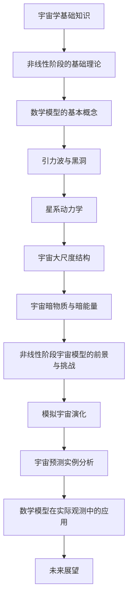
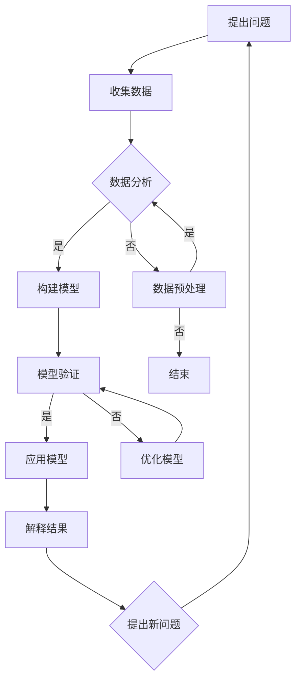

                 

### 文章标题

《数学模型在预测宇宙结构形成非线性阶段中的应用》

### 关键词

宇宙学、非线性动力学、数学模型、引力波、星系动力学、大尺度结构、暗物质、暗能量

### 摘要

本文探讨了数学模型在预测宇宙结构形成非线性阶段中的应用。首先，我们介绍了宇宙学基础知识和非线性阶段的基础理论，包括宇宙膨胀理论和混沌现象。然后，我们介绍了数学模型的基本概念，包括连续模型与离散模型以及常见数学模型的介绍。接着，我们深入探讨了非线性阶段中的数学模型应用，包括引力波与黑洞、星系动力学和宇宙大尺度结构。此外，我们还讨论了宇宙暗物质与暗能量的数学模型，并展望了非线性阶段宇宙模型的前景与挑战。最后，我们通过模拟宇宙演化和实际观测实例，展示了数学模型在非线性阶段宇宙预测中的应用。

### 第一部分：引言

#### 第1章：宇宙学基础知识

宇宙学是研究宇宙起源、演化、结构及其组成的科学。宇宙学的基础理论包括宇宙膨胀理论和宇宙结构模型。宇宙膨胀理论认为，宇宙从大爆炸开始不断膨胀，而宇宙结构模型则描述了宇宙在不同时间和空间尺度上的分布与形态。

**1.1 宇宙学概述**

宇宙学的研究对象是整个宇宙，包括所有物质和能量。宇宙学的研究目的在于揭示宇宙的本质和演化规律。宇宙学可以分为广义宇宙学和狭义宇宙学。广义宇宙学涉及宇宙的起源、演化、结构和命运，而狭义宇宙学主要研究宇宙的大尺度结构和组成。

**1.2 宇宙膨胀理论**

宇宙膨胀理论认为，宇宙在不断地膨胀。这一理论最早由埃德温·哈勃提出，他通过观测发现，远离我们的星系以不断加速的速度远离我们。这一现象表明，宇宙在整体上处于膨胀状态。后来，宇宙膨胀理论得到了更多的观测支持，例如宇宙微波背景辐射和宇宙学常数等。

**1.3 宇宙结构模型**

宇宙结构模型描述了宇宙在不同时间和空间尺度上的形态。常见的宇宙结构模型包括开放宇宙、封闭宇宙和平坦宇宙。开放宇宙认为宇宙没有边界，封闭宇宙认为宇宙有边界且闭合，而平坦宇宙则认为宇宙在整体上没有曲率。

#### 第2章：非线性阶段的基础理论

非线性阶段是指宇宙结构形成的非线性演化阶段。在这个阶段，宇宙中的物质和能量相互作用产生复杂的动力学行为。非线性动力学研究这类行为，揭示了宇宙结构的形成和演化规律。

**2.1 非线性动力学的概念**

非线性动力学是研究非线性系统的运动规律和性质的学科。非线性系统是指系统中的变量之间存在非线性关系的系统。非线性动力学研究的内容包括混沌现象、稳定性分析和动力系统的相空间表示。

**2.2 相空间和流形**

相空间是描述非线性系统状态的几何空间。在相空间中，系统的状态可以表示为点，而这些点的运动轨迹描述了系统的动态行为。流形是相空间的一种数学结构，用于描述系统的几何性质和拓扑结构。

**2.3 相空间中的混沌现象**

混沌现象是指非线性系统在相空间中表现出的一种复杂、不可预测的运动行为。混沌现象具有以下几个特点：初始条件的敏感性、长期行为的不可预测性、结构的复杂性和吸引子的存在。

#### 第3章：数学模型的基本概念

数学模型是描述自然现象、工程问题和科学研究的数学表达式。在宇宙学中，数学模型用于描述宇宙结构的形成和演化。数学模型可以分为连续模型和离散模型，常见数学模型包括引力模型、流体模型和统计模型。

**3.1 数学模型在科学中的应用**

数学模型在科学研究中具有重要的应用价值。它们可以用于预测自然现象、模拟实验过程和解释观测结果。数学模型可以帮助科学家揭示自然规律、提出新的理论和发现新的现象。

**3.2 连续模型与离散模型**

连续模型描述连续变化的现象，通常涉及微分方程和积分方程。离散模型描述离散变化的现象，通常涉及差分方程和代数方程。宇宙学中，连续模型和离散模型都有广泛的应用，例如引力模型和星系动力学模型。

**3.3 常见数学模型介绍**

常见的宇宙学数学模型包括引力模型、流体模型和统计模型。引力模型描述宇宙中的引力相互作用，包括牛顿引力模型和爱因斯坦广义相对论模型。流体模型描述宇宙中的流体运动，包括恒星大气模型和星际介质模型。统计模型描述宇宙中的随机现象，包括泊松分布和正态分布。

### 第二部分：非线性阶段中的数学模型应用

#### 第4章：引力波与黑洞

引力波是宇宙中的重要现象，它揭示了宇宙中的极端事件和动态过程。黑洞是宇宙中的神秘天体，具有强大的引力场和极端的条件。引力波与黑洞的研究为我们提供了探索宇宙的全新视角。

**4.1 引力波的产生与检测**

引力波是由加速质量产生的时空扭曲波。根据爱因斯坦广义相对论，质量加速运动时会产生引力波。引力波具有横波性质，其振幅和频率与产生源的质量、速度和距离有关。引力波的检测方法包括地面引力波观测台和空间引力波观测卫星。

**4.2 黑洞合并与引力波信号**

黑洞合并是宇宙中的极端事件，它产生强烈的引力波信号。黑洞合并过程中，两个黑洞相互靠近、碰撞和合并，产生强烈的引力波扰动。引力波信号可以被观测到，并通过分析信号特性可以推断出黑洞的质量、距离和轨道。

**4.3 引力波模型与非线性关系**

引力波模型描述了引力波的产生、传播和检测过程。引力波模型涉及非线性关系，包括引力波振幅和频率的非线性变化。非线性关系使得引力波信号复杂多变，需要精确的数学模型来描述。

#### 第5章：星系动力学

星系动力学是研究星系内部物质运动的学科。星系是宇宙中的基本结构单元，包含大量恒星、气体和暗物质。星系动力学研究星系的形成、演化、碰撞和合并过程。

**5.1 星系结构与动力学**

星系结构包括星系核心、星系盘和星系晕。星系动力学研究星系内部的物质运动，包括恒星轨道、气体流动和暗物质分布。星系动力学模型可以描述星系内部的各种现象，如恒星轨道扰动、气体湍流和暗物质晕的形成。

**5.2 星系碰撞与合并**

星系碰撞和合并是宇宙中的常见事件。两个星系相互靠近、碰撞和合并，产生强烈的动力学效应。星系碰撞和合并过程中，恒星轨道、气体流动和暗物质分布都会发生显著变化。星系动力学模型可以模拟星系碰撞和合并过程，预测星系演化结果。

**5.3 星系动力学模型**

星系动力学模型包括引力模型、流体模型和统计模型。引力模型描述星系内部的引力相互作用，流体模型描述星系内部的气体流动，统计模型描述星系内部的随机现象。这些模型可以用于模拟星系动力学过程，预测星系演化趋势。

#### 第6章：宇宙大尺度结构

宇宙大尺度结构是指宇宙在宏观尺度上的分布和形态。宇宙大尺度结构的研究揭示了宇宙的演化历史和物理规律。

**6.1 宇宙大尺度结构的形成**

宇宙大尺度结构的形成与宇宙膨胀和引力作用密切相关。在宇宙早期，物质分布均匀且热，随后宇宙膨胀和引力相互作用导致物质聚集形成星系、星系团和超星系团。宇宙大尺度结构的形成是一个复杂的过程，涉及到引力不稳定性、湍流和随机涨落。

**6.2 大尺度结构的非线性演化**

大尺度结构的非线性演化是指宇宙结构在非线性阶段的演化过程。非线性演化过程中，宇宙结构发生复杂的形态变化，包括星系碰撞、星系合并和结构重组。非线性演化模型可以描述大尺度结构的形态变化和演化规律。

**6.3 大尺度结构模型**

大尺度结构模型包括引力模型、流体模型和统计模型。引力模型描述宇宙中的引力相互作用，流体模型描述宇宙中的流体运动，统计模型描述宇宙中的随机现象。这些模型可以用于模拟宇宙大尺度结构的演化过程，预测宇宙结构的未来形态。

#### 第7章：宇宙暗物质与暗能量

宇宙暗物质和暗能量是宇宙中的重要成分，它们的性质和作用是宇宙学研究的重点。

**7.1 暗物质的概念与探测**

暗物质是宇宙中的一种未知物质，它不发光、不吸收光，但通过引力作用影响宇宙的结构和演化。暗物质探测方法包括间接探测和直接探测。间接探测通过观测星系旋转曲线、星系团引力透镜效应和宇宙微波背景辐射来推断暗物质的存在和分布。直接探测通过探测暗物质粒子如弱相互作用暗物质（WIMPs）来直接探测暗物质。

**7.2 暗能量的性质与影响**

暗能量是宇宙中的一种神秘力量，它推动宇宙加速膨胀。暗能量具有负压力，其密度和能量随宇宙膨胀而增大。暗能量的性质和影响是宇宙学研究的难题，目前尚无确切的物理机制解释暗能量的本质。

**7.3 暗物质与暗能量的数学模型**

暗物质和暗能量在宇宙学中的数学模型描述了它们的性质和作用。暗物质模型包括冷暗物质模型、热暗物质模型和弱相互作用暗物质模型。暗能量模型包括宇宙学常数模型、动态暗能量模型和引力修正模型。这些模型可以用于描述宇宙的结构和演化，解释观测现象。

#### 第8章：非线性阶段宇宙模型的前景与挑战

非线性阶段宇宙模型在宇宙学研究中具有重要意义，它揭示了宇宙结构形成和演化的复杂过程。然而，非线性阶段宇宙模型仍面临诸多挑战。

**8.1 非线性阶段宇宙模型的发展趋势**

非线性阶段宇宙模型的发展趋势包括提高模型精度、扩展模型范围和探索新现象。随着观测技术的进步，我们可以获得更多高质量的宇宙学数据，为非线性阶段宇宙模型提供更精确的观测约束。此外，非线性阶段宇宙模型可以扩展到更广泛的物理领域，如量子引力和宇宙学原理。

**8.2 模型面临的挑战与解决方案**

非线性阶段宇宙模型面临的挑战包括非线性关系的处理、大规模模拟的计算效率和观测数据的解释。为应对这些挑战，可以采用以下解决方案：发展新的数值方法和算法，提高计算效率；构建更加精确的数学模型，减少模型参数的不确定性；结合多种观测手段，提高观测数据的可靠性和解释能力。

**8.3 未来研究方向**

非线性阶段宇宙模型的研究方向包括宇宙结构的形成和演化、宇宙暗物质和暗能量的性质和作用、宇宙学参数的精确测量和宇宙学原理的探索。未来研究将更加深入地揭示宇宙结构的复杂性，为理解宇宙的本质和演化提供新的视角和工具。

### 第三部分：数学模型在非线性阶段宇宙预测中的应用

#### 第9章：模拟宇宙演化

模拟宇宙演化是通过数学模型和计算机模拟来研究宇宙结构的形成和演化过程。模拟宇宙演化可以帮助我们理解宇宙中的复杂现象，预测宇宙未来的演化趋势。

**9.1 模拟宇宙的框架与步骤**

模拟宇宙的框架包括以下步骤：

1. 初始化：设定宇宙的初始条件，包括宇宙的膨胀历史、物质分布和初始密度扰动。
2. 模拟计算：使用数值算法和计算机模拟宇宙的演化过程，计算宇宙在不同时间步的物理量。
3. 数据分析：分析模拟结果，提取宇宙结构的特征参数，如密度分布、星系形成和演化等。
4. 模拟结果验证：将模拟结果与实际观测数据进行比较，验证模拟结果的可靠性和精度。

**9.2 模拟宇宙中的非线性现象**

模拟宇宙演化过程中，非线性现象如引力波、黑洞合并和星系碰撞等都会发生。非线性现象会导致宇宙结构的复杂演化，如星系的形成、星系团的碰撞和宇宙大尺度结构的重组。模拟宇宙演化可以揭示这些非线性现象对宇宙结构的影响。

**9.3 模拟结果分析**

模拟结果分析主要包括以下几个方面：

1. 宇宙结构演化：分析宇宙在不同时间步的结构演化过程，如星系的形成和演化、星系团的碰撞和合并等。
2. 物质分布：分析宇宙中的物质分布特征，如密度分布、物质不均匀性和结构形成等。
3. 物理量测量：测量宇宙中的物理量，如引力波振幅、黑洞质量和星系运动速度等，并与观测数据进行比较。

#### 第10章：宇宙预测实例分析

宇宙预测实例分析是通过数学模型和计算机模拟来预测宇宙中的特定现象和事件。宇宙预测实例分析可以验证数学模型的有效性和预测能力，为我们理解宇宙的演化提供新的视角。

**10.1 黑洞预测实例**

黑洞预测实例是研究黑洞的形成、演化和探测。通过模拟黑洞合并过程，可以预测黑洞产生的引力波信号。例如，模拟两个黑洞相互靠近、碰撞和合并的过程，可以预测产生的引力波振幅、频率和极化特性。这些预测结果可以与实际观测数据进行比较，验证黑洞预测模型的准确性。

**10.2 星系结构预测实例**

星系结构预测实例是研究星系的形成、演化和结构特征。通过模拟星系的演化过程，可以预测星系的密度分布、恒星轨道和气体流动。例如，模拟一个星系团的碰撞和合并过程，可以预测星系团中的星系分布和恒星轨道扰动。这些预测结果可以与实际观测数据进行比较，验证星系结构预测模型的准确性。

**10.3 大尺度结构预测实例**

大尺度结构预测实例是研究宇宙大尺度结构的形成、演化和形态。通过模拟宇宙的演化过程，可以预测宇宙中的大尺度结构，如星系团、超星系团和宇宙空洞。例如，模拟宇宙中的密度扰动和引力相互作用，可以预测大尺度结构的形成和演化过程。这些预测结果可以与实际观测数据进行比较，验证大尺度结构预测模型的准确性。

#### 第11章：数学模型在实际观测中的应用

数学模型在宇宙学观测中具有重要意义，它可以帮助我们解释观测数据、发现新现象和验证理论。在实际观测中，数学模型的应用包括数据预处理、数据分析模型选择和观测结果优化。

**11.1 观测数据的预处理**

观测数据的预处理是观测分析的第一步，包括数据去噪、数据滤波和数据插值等。预处理方法可以减少观测数据中的噪声和缺失值，提高观测数据的可靠性和准确性。

**11.2 数据分析模型选择**

数据分析模型选择是观测分析的核心步骤，包括引力模型、流体模型和统计模型的选择。不同模型适用于不同类型的观测数据和分析目标。选择合适的模型可以提高分析结果的精度和可靠性。

**11.3 观测结果的误差分析与优化**

观测结果的误差分析与优化是观测分析的最后一步，包括误差估计、误差传播和结果优化。误差分析与优化方法可以减少观测结果的误差，提高分析结果的精度。此外，还可以通过优化观测策略和改进观测设备来提高观测结果的精度和可靠性。

#### 第12章：未来展望

非线性阶段宇宙模型在宇宙学研究中具有重要意义，它揭示了宇宙结构的形成和演化规律。随着观测技术的进步和数学模型的发展，非线性阶段宇宙模型将在未来取得更多突破。

**12.1 非线性阶段宇宙模型的发展趋势**

非线性阶段宇宙模型的发展趋势包括以下几个方面：

1. 提高模型精度：通过改进数值方法和算法，提高模拟宇宙演化的精度和可靠性。
2. 扩展模型范围：将非线性阶段宇宙模型应用于更广泛的物理领域，如量子引力和宇宙学原理。
3. 探索新现象：通过模拟宇宙演化，探索新的宇宙现象和物理规律，如宇宙大撕裂和宇宙末态。

**12.2 数学模型在宇宙学中的新应用领域**

数学模型在宇宙学中的新应用领域包括：

1. 宇宙早期状态的研究：通过数学模型研究宇宙早期状态，如宇宙大爆炸和宇宙微波背景辐射。
2. 宇宙暗物质和暗能量的研究：通过数学模型研究宇宙暗物质和暗能量的性质和作用。
3. 宇宙极端事件的研究：通过数学模型研究宇宙极端事件，如黑洞碰撞和宇宙大撕裂。

**12.3 国际合作与资源共享**

非线性阶段宇宙模型的发展需要国际合作与资源共享。国际合作可以汇集全球科学家和研究资源，提高非线性阶段宇宙模型的研究水平。资源共享可以包括观测数据、计算资源和软件工具等，为非线性阶段宇宙模型的研究提供支持。

### 附录

#### 附录A：数学模型相关软件与工具

A.1 数值计算软件

- MATLAB：一种高性能的数值计算软件，用于数值模拟和数据分析。
- Python：一种流行的编程语言，具有丰富的科学计算库，如NumPy、SciPy和Pandas。
- C++：一种高效的编程语言，常用于高性能数值模拟。

A.2 数据分析软件

- R：一种用于统计分析、数据可视化和数据挖掘的编程语言。
- Tableau：一种数据可视化工具，用于创建交互式数据图表和报告。

A.3 其他相关软件介绍

- PyOpenGL：一种Python库，用于创建三维图形和可视化。
- GROMACS：一种分子动力学模拟软件，用于研究液体和固体中的物理现象。

#### 附录B：参考文献

B.1 宇宙学基础理论书籍

- 《宇宙学基础》（作者：马丁·里斯）
- 《宇宙学原理》（作者：斯图尔特·卡恩）
- 《现代宇宙学》（作者：乔治·F·R·艾利斯）

B.2 数学模型与非线性动力学书籍

- 《非线性动力学与混沌》（作者：斯蒂芬·史密斯）
- 《数学模型与应用》（作者：彼得·达菲）
- 《非线性分析与应用》（作者：彼得·维尔斯特拉斯）

B.3 宇宙学观测数据集与工具

- NASA宇宙学数据设施（CDS）：提供丰富的宇宙学观测数据。
- NASA宇宙背景探测器（COBE）：测量宇宙微波背景辐射。
- LIGO：提供引力波观测数据。

### Mermaid 流程图示例

### 宇宙学基础知识

宇宙学是研究宇宙起源、演化和结构的学科，它涵盖了从宇宙大爆炸到当前观测到的宇宙状态的各种现象。宇宙学的研究不仅涉及物理学，还涉及天文学、数学和其他科学领域，因为它试图解释宇宙中的基本问题和现象，如宇宙的膨胀、宇宙结构的形成以及宇宙中的各种物质和能量的分布。

#### 1.1 宇宙学概述

宇宙学的研究对象是整个宇宙，从宇宙大爆炸到可能的宇宙末态。宇宙学的基本问题是：宇宙是如何开始的？宇宙的结构和形态是什么？宇宙的未来会怎样？这些问题引导了科学家们对宇宙的各种探索。

宇宙学的起源可以追溯到20世纪初，当时科学家们开始意识到宇宙是膨胀的。埃德温·哈勃通过观测发现，远处的星系正在以不断加速的速度远离我们，这一发现揭示了宇宙的膨胀性质。此后，宇宙学的发展经历了多个阶段，从早期的宇宙膨胀理论，到现代宇宙学，再到对宇宙早期状态和宇宙大尺度结构的深入探索。

宇宙学的研究方法主要包括观测、理论模型和计算机模拟。观测是通过天文望远镜和其他探测器收集宇宙中的物理数据，如电磁辐射、引力波和宇宙微波背景辐射。理论模型是基于物理学原理，如广义相对论和量子力学，构建的宇宙演化模型。计算机模拟则是通过数值方法模拟宇宙的演化过程，以预测宇宙的结构和现象。

#### 1.2 宇宙膨胀理论

宇宙膨胀理论是宇宙学的基础理论之一，它描述了宇宙从大爆炸开始不断膨胀的过程。根据宇宙膨胀理论，宇宙在大爆炸发生后，经历了快速膨胀阶段（暴胀期），随后进入缓慢膨胀阶段（宇宙学常数期）。

宇宙膨胀理论的核心概念是宇宙膨胀速率随时间的变化。在早期宇宙，宇宙膨胀速率非常快，随着宇宙的演化，膨胀速率逐渐减慢。这一理论得到了多个观测结果的证实，如宇宙微波背景辐射、遥远星系的红移以及宇宙的大尺度结构。

宇宙膨胀理论还提出了宇宙学常数（Cosmological Constant），即一种推动宇宙加速膨胀的神秘力量。宇宙学常数最初由爱因斯坦在20世纪初提出，他认为这是一种填补宇宙学“大尺度引力缺失”的方法。然而，随着宇宙膨胀理论的不断发展，宇宙学常数成为了宇宙加速膨胀的主要解释。

#### 1.3 宇宙结构模型

宇宙结构模型描述了宇宙在不同时间和空间尺度上的形态和分布。宇宙结构模型包括多个层次，从宏观的宇宙大尺度结构，到星系、恒星和行星等微观结构。

在宏观尺度上，宇宙结构模型描述了宇宙的整体形态和演化过程。常见的宇宙结构模型包括开放宇宙、封闭宇宙和平坦宇宙。开放宇宙认为宇宙没有边界，封闭宇宙认为宇宙有边界且闭合，而平坦宇宙则认为宇宙在整体上没有曲率。这些模型基于宇宙的几何性质和宇宙膨胀理论，通过观测数据来确定宇宙的形态和演化。

在微观尺度上，宇宙结构模型描述了星系、恒星和行星等天体的形态和演化。星系结构模型描述了星系内部恒星、气体和暗物质的分布和运动。恒星结构模型描述了恒星内部的物理过程和演化。行星结构模型描述了行星的形态和演化，包括行星内部的地质活动、大气层和磁场等。

宇宙学的基础知识为我们理解宇宙的结构和演化提供了框架。宇宙膨胀理论和宇宙结构模型是宇宙学研究的基础，它们揭示了宇宙的起源、演化和形态。在接下来的章节中，我们将进一步探讨非线性阶段的基础理论和数学模型的应用，以更深入地理解宇宙的结构和演化。

### 非线性阶段的基础理论

宇宙学中的非线性阶段是指宇宙结构在形成和演化过程中，由于非线性相互作用导致的复杂动态行为阶段。非线性动力学是研究这类行为的学科，它揭示了宇宙中物质和能量相互作用的复杂性和多样性。在非线性阶段，宇宙结构经历了从均匀分布到不均匀分布、从简单到复杂的演化过程。

#### 2.1 非线性动力学的概念

非线性动力学是研究非线性系统的运动规律和性质的学科。在非线性系统中，系统的状态变量之间存在非线性关系，这种非线性关系使得系统的行为复杂、难以预测。非线性动力学的主要目标是揭示非线性系统的稳定性和动力学行为，包括混沌现象、分岔和吸引子等。

非线性动力学的基本概念包括：

1. **非线性关系**：非线性系统中的变量之间存在非线性关系，如非线性的微分方程、代数方程和差分方程。
2. **稳定性**：系统的稳定性描述了系统在微小扰动下是否能够恢复到原始状态。非线性系统的稳定性可以分为稳定态、不稳定态和临界态。
3. **吸引子**：系统的运动轨迹最终会收敛到一个或多个固定点、周期轨道或混沌轨道。吸引子是系统长期行为的描述。
4. **混沌现象**：混沌现象是指系统在相空间中表现出的一种复杂、不可预测的运动行为。混沌现象具有以下几个特点：初始条件的敏感性、长期行为的不可预测性和结构的复杂性。

#### 2.2 相空间和流形

相空间是描述非线性系统状态的几何空间。在相空间中，系统的每个状态可以用一个点来表示，而这些点的运动轨迹描述了系统的动态行为。相空间可以是高维的，其维数与系统状态变量的数量有关。

流形是相空间的一种数学结构，用于描述系统的几何性质和拓扑结构。流形是一个局部欧几里得空间，它在整体上可能具有复杂的几何形态。流形的拓扑结构可以描述系统的全局行为，如相空间的连通性、边界和奇点。

在非线性动力学中，流形的概念非常重要。通过研究流形的结构和性质，我们可以理解系统的长期行为和稳定性。例如，流形的分岔点描述了系统从稳定态到不稳定态的转变，而流形的混沌区域描述了系统的混沌行为。

#### 2.3 相空间中的混沌现象

混沌现象是非线性动力学中的一个重要现象，它揭示了复杂系统行为的不可预测性和结构的复杂性。混沌现象具有以下几个特点：

1. **初始条件的敏感性**：混沌系统对初始条件非常敏感，即使是微小的差异也会导致长期行为的巨大差异。这种现象称为混沌的“蝴蝶效应”。
2. **长期行为的不可预测性**：尽管混沌系统的运动是确定的，但由于初始条件的敏感性，我们无法准确预测系统的长期行为。混沌系统的长期行为具有随机性和不可预测性。
3. **结构的复杂性**：混沌现象在相空间中表现出复杂的结构，如分岔、周期倍增和奇异吸引子。这些结构反映了系统内部的复杂动力学行为。

混沌现象在宇宙学中具有重要意义。例如，星系动力学中的混沌现象可能导致星系轨道的不稳定，从而影响宇宙结构的形成和演化。此外，宇宙大尺度结构中的混沌现象可能导致宇宙中的密度波动，从而影响宇宙中的物质分布。

通过研究非线性动力学和混沌现象，我们可以更好地理解宇宙结构的非线性阶段。非线性动力学提供了描述宇宙结构复杂行为的数学工具，而混沌现象揭示了宇宙结构中的内在随机性和不可预测性。在接下来的章节中，我们将进一步探讨数学模型的基本概念，以及非线性阶段中的数学模型应用。

### 数学模型的基本概念

数学模型是描述自然现象、工程问题和科学研究的数学表达式。在宇宙学中，数学模型用于描述宇宙结构的形成和演化，解释观测数据，预测宇宙的未来状态。数学模型可以分为连续模型和离散模型，以及各种常见的数学模型，如引力模型、流体模型和统计模型。

#### 3.1 数学模型在科学中的应用

数学模型在科学研究中具有广泛的应用价值。它们可以用于：

1. **预测自然现象**：通过建立数学模型，科学家可以预测天气、地震、洪水等自然现象。
2. **模拟实验过程**：数学模型可以模拟物理、化学和生物实验，帮助科学家理解实验结果。
3. **解释观测数据**：数学模型可以解释天文观测数据，如星系运动、宇宙微波背景辐射等。
4. **设计工程系统**：数学模型可以用于设计建筑、飞机、汽车等工程系统。

在宇宙学中，数学模型尤为重要。宇宙学中的数学模型可以描述宇宙的膨胀、结构的形成和演化，解释宇宙中的各种现象，如引力波、星系动力学和宇宙大尺度结构。

#### 3.2 连续模型与离散模型

数学模型可以根据变量的变化方式分为连续模型和离散模型。

1. **连续模型**：连续模型描述连续变化的物理现象，通常涉及微分方程和积分方程。例如，引力模型描述宇宙中物质通过引力相互作用形成的结构，通常使用牛顿引力定律和爱因斯坦广义相对论中的场方程。
   
   - **优点**：连续模型能够描述物理现象的连续变化，适用于描述宏观尺度上的动态行为。
   - **缺点**：求解连续模型通常较为复杂，需要高精度的数值方法和大量的计算资源。

2. **离散模型**：离散模型描述离散变化的物理现象，通常涉及差分方程和代数方程。例如，星系动力学模型中的N-body问题，通过离散化星系的位置和速度，使用差分方程来模拟星系的演化。

   - **优点**：离散模型计算简单，易于数值求解，适用于大规模问题的模拟。
   - **缺点**：离散模型通常只能近似描述连续变化的现象，可能在细节上存在误差。

在宇宙学中，连续模型和离散模型都有广泛的应用。连续模型适用于描述宇宙的大尺度结构，如宇宙膨胀和引力波传播。离散模型适用于描述星系、星系团和超星系团等小尺度结构，如星系动力学和N-body模拟。

#### 3.3 常见数学模型介绍

宇宙学中常见的数学模型包括引力模型、流体模型和统计模型。

1. **引力模型**：引力模型描述宇宙中物质通过引力相互作用形成的结构。引力模型包括牛顿引力模型和爱因斯坦广义相对论模型。

   - **牛顿引力模型**：描述质点间的引力相互作用，使用牛顿万有引力定律。牛顿引力模型适用于低密度、小尺度的宇宙结构，如行星运动。
   
     $$ F = G \frac{m_1 m_2}{r^2} $$
   
   - **爱因斯坦广义相对论模型**：描述引力场的时空性质，使用爱因斯坦场方程。广义相对论模型适用于高密度、大尺度的宇宙结构，如黑洞和宇宙大尺度结构。
   
     $$ G_{\mu\nu} + \Lambda g_{\mu\nu} = \frac{8\pi G}{c^4} T_{\mu\nu} $$

2. **流体模型**：流体模型描述宇宙中的气体流动、恒星大气和星际介质。流体模型使用流体力学方程，如纳维尔-斯托克斯方程和连续方程。

   - **纳维尔-斯托克斯方程**：描述流体运动的速度和压力分布。
   
     $$ \frac{\partial \mathbf{u}}{\partial t} + (\mathbf{u} \cdot \nabla) \mathbf{u} = -\nabla p + \mu \nabla^2 \mathbf{u} $$
   
   - **连续方程**：描述流体的质量守恒。
   
     $$ \frac{\partial \rho}{\partial t} + \nabla \cdot (\rho \mathbf{u}) = 0 $$

3. **统计模型**：统计模型描述宇宙中的随机现象，如星系形成的随机性和宇宙微波背景辐射的波动。统计模型使用概率分布和随机过程。

   - **泊松分布**：描述宇宙中随机分布的星系或事件。
   
     $$ P(n) = \frac{\lambda^n e^{-\lambda}}{n!} $$
   
   - **正态分布**：描述宇宙中大量观测数据的概率分布。
   
     $$ f(x) = \frac{1}{\sqrt{2\pi\sigma^2}} e^{-\frac{(x-\mu)^2}{2\sigma^2}} $$

通过介绍这些常见数学模型，我们可以看到数学模型在宇宙学中的重要性。数学模型不仅帮助我们理解和描述宇宙中的现象，还为我们提供了预测宇宙未来状态的工具。在接下来的章节中，我们将探讨非线性阶段中的数学模型应用，包括引力波与黑洞、星系动力学和宇宙大尺度结构。

#### 引力波与黑洞

引力波是宇宙中的一种重要现象，它揭示了宇宙中的极端事件和动态过程。黑洞是宇宙中的神秘天体，具有强大的引力场和极端的条件。引力波与黑洞的研究为我们提供了探索宇宙的全新视角。

**4.1 引力波的产生与检测**

引力波是由加速质量产生的时空扭曲波。根据爱因斯坦广义相对论，质量加速运动时会产生引力波。引力波具有横波性质，其振幅和频率与产生源的质量、速度和距离有关。引力波的检测方法包括地面引力波观测台和空间引力波观测卫星。

**4.2 黑洞合并与引力波信号**

黑洞合并是宇宙中的极端事件，它产生强烈的引力波信号。黑洞合并过程中，两个黑洞相互靠近、碰撞和合并，产生强烈的引力波扰动。引力波信号可以被观测到，并通过分析信号特性可以推断出黑洞的质量、距离和轨道。

**4.3 引力波模型与非线性关系**

引力波模型描述了引力波的产生、传播和检测过程。引力波模型涉及非线性关系，包括引力波振幅和频率的非线性变化。非线性关系使得引力波信号复杂多变，需要精确的数学模型来描述。

#### 4.1 引力波的产生与检测

引力波是由质量加速运动产生的时空扭曲波，其本质是时空本身的波动。根据爱因斯坦的广义相对论，任何具有质量的物体在加速运动时都会对周围时空产生扰动，从而产生引力波。引力波的产生与物体的质量、加速度和距离有关，其振幅和频率取决于这些参数。

**引力波的产生机制**

在广义相对论中，质量加速运动时会产生时空的曲率变化，这种曲率变化以波的形式向外传播，形成引力波。具体来说，当物体发生加速运动时，其质量分布会发生变化，导致时空的几何结构也随之变化。这种时空的变化以波的形式传播，就像石头扔进水池产生的涟漪一样，这种波就是引力波。

引力波具有横波性质，即波动的方向垂直于波的传播方向。与电磁波不同，引力波不会携带电荷，因此不会产生电磁场。引力波的振幅和频率与产生源的质量、速度和距离有关。质量越大、速度越快、距离越近，引力波的振幅和频率就越高。

**引力波的检测方法**

引力波最早由爱因斯坦在1916年提出，但由于引力波的振幅非常小，长期以来无法直接观测。直到2015年，LIGO实验室首次直接探测到了来自两个黑洞合并的引力波信号，这标志着引力波探测技术的重大突破。

目前，引力波的检测方法主要包括以下几种：

1. **地面引力波观测台**：LIGO（激光干涉引力波观测台）和Virgo（意大利-法国引力波观测台）是典型的地面引力波观测台。这些观测台使用激光干涉仪来探测引力波。激光束被分成两束，分别沿着两个垂直的方向传播，当引力波经过时，会引起时空的微小扭曲，导致两束激光的干涉条纹发生变化。通过检测这种干涉条纹的变化，可以确定引力波的存在和性质。

2. **空间引力波观测卫星**：如LISA（激光干涉空间天线）是计划中的空间引力波观测卫星。LISA使用三个相互间隔较远的卫星，通过测量卫星之间的激光干涉信号变化来探测引力波。空间引力波观测卫星的优势在于可以避免地面噪声的干扰，提高探测灵敏度。

3. **其他方法**：除了激光干涉仪，还有其他方法可以探测引力波，如引力透镜效应和脉冲星计时阵列。引力透镜效应是利用引力波对光线的折射来探测引力波。脉冲星计时阵列是通过测量脉冲星辐射信号的微小变化来探测引力波。

**引力波的信号特性**

引力波的信号特性包括振幅、频率和极化状态。振幅描述了引力波对时空的扰动程度，频率描述了引力波的振荡速度。极化状态描述了引力波的振动方向。对于两个黑洞合并产生的引力波，其信号具有特定的波形和特征频率。

**引力波的探测意义**

引力波的探测对于宇宙学研究具有重要意义。首先，它为验证广义相对论提供了直接证据。广义相对论在多个实验中得到了验证，但引力波的探测是第一次直接观测到引力波的存在。其次，引力波提供了研究宇宙极端事件的新工具。通过探测引力波，我们可以了解黑洞合并、星系碰撞等宇宙事件的过程和性质。最后，引力波的探测有助于我们理解宇宙的起源和演化。引力波的探测可以帮助我们揭示宇宙早期状态的信息，如宇宙微波背景辐射和宇宙膨胀的历史。

#### 4.2 黑洞合并与引力波信号

黑洞合并是宇宙中的一种极端事件，它发生在两个黑洞相互靠近、碰撞和合并的过程中。黑洞合并过程中，引力波信号的产生和传播为我们提供了研究宇宙极端事件的新视角。

**黑洞合并的基本原理**

黑洞是宇宙中密度极大、引力极强的天体，其边界称为黑洞事件视界。当两个黑洞相互靠近时，由于引力作用，它们会逐渐加速合并。合并过程中，黑洞之间的距离不断缩小，引力波信号逐渐增强。最终，两个黑洞合并成一个更大的黑洞，并释放出巨大的能量。

黑洞合并的过程可以分为几个阶段：

1. **接近阶段**：两个黑洞开始相互靠近，距离逐渐缩小。在这个阶段，引力波信号开始出现，但振幅较小。

2. **合并阶段**：两个黑洞之间的距离进一步缩小，引力波信号迅速增强。在合并的瞬间，引力波信号达到最大值。

3. **合并后阶段**：两个黑洞合并成一个更大的黑洞，引力波信号逐渐减弱，最终消失。

**引力波信号的特性**

黑洞合并产生的引力波信号具有特定的波形和特征频率。引力波信号的主要特性包括：

1. **波形**：引力波信号通常表现为一系列震荡波形，称为“ chirp”波形。波形在合并前逐渐变宽，在合并时达到峰值，然后逐渐变窄。这种波形反映了黑洞合并过程中引力波振幅和频率的变化。

2. **特征频率**：引力波信号的特征频率与黑洞的质量和距离有关。两个黑洞合并时，特征频率会随时间增加。合并前，特征频率较低，随着黑洞相互靠近，特征频率逐渐升高，合并时达到最大值。

3. **振幅**：引力波信号的振幅反映了引力波的扰动强度。振幅越大，表示引力波对时空的扰动越强烈。

**引力波信号的分析方法**

分析引力波信号是研究黑洞合并的重要方法。通过分析引力波信号，我们可以推断黑洞的质量、距离和轨道。常用的分析方法包括：

1. **波形拟合**：通过拟合引力波信号，可以确定信号的主要特征，如波形、特征频率和振幅。波形拟合是分析引力波信号的基本方法。

2. **数据反演**：通过分析引力波信号，可以反演出黑洞的质量、距离和轨道。数据反演方法结合了广义相对论和数值模拟，可以精确地推断黑洞的参数。

3. **信号叠加**：多个引力波信号的叠加可以提供更详细的信息。通过叠加多个引力波信号，可以确定多个黑洞合并的事件，并研究合并过程中引力波信号的演变。

**黑洞合并的探测意义**

黑洞合并是宇宙中的一种极端事件，它揭示了宇宙中的强引力作用和极端条件。探测黑洞合并产生的引力波信号对于理解宇宙的起源和演化具有重要意义。

首先，黑洞合并是验证广义相对论的重要实验。广义相对论预言了引力波的存在，并通过黑洞合并事件得到了验证。探测引力波信号可以验证广义相对论的预测，并提高我们对宇宙物理规律的理解。

其次，黑洞合并提供了研究宇宙极端事件的新工具。通过探测引力波信号，我们可以了解黑洞合并的过程和性质，如黑洞的质量、距离和轨道。这些信息有助于我们理解宇宙中的强引力作用和极端条件。

最后，黑洞合并有助于我们研究宇宙的演化历史。黑洞合并是宇宙中的重要事件，它会影响宇宙的结构和形态。通过研究黑洞合并产生的引力波信号，我们可以了解宇宙的早期状态和演化历史，如宇宙微波背景辐射和宇宙膨胀。

总之，黑洞合并与引力波信号的研究为我们提供了探索宇宙的全新视角。通过分析引力波信号，我们可以揭示宇宙中的极端事件和强引力作用，提高我们对宇宙起源和演化的理解。

#### 4.3 引力波模型与非线性关系

引力波模型是描述引力波产生、传播和检测的数学模型。引力波模型基于爱因斯坦的广义相对论，它涉及非线性关系，包括引力波振幅和频率的非线性变化。非线性关系使得引力波信号复杂多变，需要精确的数学模型来描述。

**引力波模型的基本原理**

引力波模型基于爱因斯坦的广义相对论，描述了引力波的产生和传播过程。在广义相对论中，引力被描述为时空的几何结构，即时空曲率。当物体加速运动时，它对周围时空产生扰动，这种扰动以波的形式传播，形成引力波。

引力波模型的基本方程是爱因斯坦场方程，它描述了时空曲率与物质分布之间的关系。通过解爱因斯坦场方程，可以计算出引力波的产生、传播和特性。爱因斯坦场方程是一个非线性偏微分方程，其解需要使用数值方法进行求解。

**非线性关系**

引力波模型中的非线性关系主要体现在以下几个方面：

1. **振幅非线性**：引力波的振幅与产生源的质量和加速度有关。当质量加速运动时，引力波的振幅会随时间的平方成比例增加。这种非线性关系使得引力波信号的振幅随时间变化非常复杂。

2. **频率非线性**：引力波的频率与产生源的质量和距离有关。当两个黑洞相互靠近时，引力波的频率会随时间增加。这种非线性关系使得引力波信号的频率变化非常敏感。

3. **波形非线性**：引力波的波形与产生源的质量和轨道有关。不同质量的黑洞合并会产生不同的波形。这种非线性关系使得引力波信号的波形非常复杂。

**非线性关系的影响**

非线性关系对引力波信号的影响非常显著。首先，非线性关系使得引力波信号难以精确预测，因为信号的振幅、频率和波形都随时间非线性变化。其次，非线性关系使得引力波信号的检测变得更加复杂，因为需要考虑非线性效应的影响。

为了准确检测和解释引力波信号，科学家们需要开发精确的数学模型，并使用数值方法进行模拟。通过这些模型，科学家们可以模拟引力波的产生、传播和检测过程，从而提高对引力波信号的理解和解释能力。

**数学模型的应用**

在引力波模型中，数学模型的应用包括：

1. **数值模拟**：通过数值模拟，可以计算引力波的产生、传播和特性。数值模拟可以模拟不同质量和轨道的黑洞合并过程，从而预测引力波信号的波形和频率。

2. **数据分析**：通过数据分析，可以提取引力波信号的主要特征，如振幅、频率和波形。数据分析可以用于验证广义相对论、研究黑洞合并的物理过程。

3. **模型验证**：通过实际观测数据与数值模拟结果的比较，可以验证引力波模型的准确性。模型验证是检验引力波模型的重要手段，可以提高模型的可靠性和精度。

总之，引力波模型与非线性关系的研究为引力波的产生、传播和检测提供了理论基础。通过精确的数学模型和数值模拟，科学家们可以更好地理解引力波信号的复杂特性，从而揭示宇宙中的极端事件和动态过程。

### 星系动力学

星系动力学是研究星系内部物质运动和相互作用的学科。星系是宇宙中的基本结构单元，包含大量恒星、气体和暗物质。星系动力学研究星系的形成、演化、碰撞和合并过程，揭示了星系内部物质运动的规律和特性。

#### 5.1 星系结构与动力学

星系结构包括星系核心、星系盘和星系晕。星系核心是星系中心的高密度区域，包含大量恒星和中心黑洞。星系盘是星系中的扁平结构，包含大量气体和恒星，其运动速度较快。星系晕是星系外围的高密度区域，包含大量暗物质。

星系动力学研究星系内部物质运动，包括恒星轨道、气体流动和暗物质分布。恒星轨道是星系动力学研究的重要对象，通过观测恒星的运动轨迹，可以推断出星系的动力学特性。气体流动是星系动力学中的另一个重要方面，气体在星系中的运动影响恒星的形成和演化。暗物质是星系动力学研究中的一个难题，由于暗物质不发光，其运动和分布需要通过间接方法进行研究。

#### 5.2 星系碰撞与合并

星系碰撞与合并是宇宙中常见的现象，两个星系在相互靠近时会发生碰撞和合并。星系碰撞与合并过程中，恒星轨道、气体流动和暗物质分布都会发生显著变化。

星系碰撞与合并可以分为几个阶段：

1. **接近阶段**：两个星系开始相互靠近，距离逐渐缩小。在这个阶段，恒星轨道开始发生扰动，气体流动加速。

2. **碰撞阶段**：两个星系的核心区域发生碰撞，恒星轨道和气体流动发生剧烈变化。碰撞过程中，恒星可能会被抛出星系，气体可能会形成新的恒星形成区。

3. **合并阶段**：两个星系逐渐合并成一个更大的星系。在合并阶段，恒星轨道和气体流动逐渐稳定，新的星系形成。

星系碰撞与合并对宇宙结构有重要影响。首先，星系碰撞与合并可以改变宇宙中的物质分布，影响宇宙的大尺度结构。其次，星系碰撞与合并可以产生新的恒星和行星系统，影响宇宙的星系形成和演化。

#### 5.3 星系动力学模型

星系动力学模型是描述星系内部物质运动和相互作用的数学模型。常见的星系动力学模型包括引力模型、流体模型和统计模型。

1. **引力模型**：引力模型描述星系内部恒星和暗物质之间的引力相互作用。引力模型使用牛顿引力定律和爱因斯坦广义相对论中的场方程，可以描述恒星轨道和暗物质分布。引力模型适用于描述星系的大尺度结构和运动。

2. **流体模型**：流体模型描述星系中的气体流动和恒星运动。流体模型使用流体力学方程，如纳维尔-斯托克斯方程和连续方程，可以描述气体流动和恒星运动的速度和压力分布。流体模型适用于描述星系的气体动态和恒星形成。

3. **统计模型**：统计模型描述星系中的随机现象，如恒星形成的随机性和星系结构的随机涨落。统计模型使用概率分布和随机过程，可以描述星系中恒星和气体的分布和演化。统计模型适用于描述星系的小尺度结构和演化。

通过星系动力学模型，我们可以模拟星系的形成、演化和碰撞过程，预测星系的未来状态。星系动力学模型在宇宙学研究中具有重要意义，它为我们理解宇宙中的星系结构和演化提供了理论工具。

### 宇宙大尺度结构

宇宙大尺度结构是指宇宙在宏观尺度上的形态和分布。宇宙大尺度结构的研究揭示了宇宙的演化历史和物理规律。在宇宙大尺度结构中，星系、星系团和超星系团等天体以复杂的形态分布，形成了宇宙的宏观结构。

#### 6.1 宇宙大尺度结构的形成

宇宙大尺度结构的形成与宇宙膨胀和引力作用密切相关。在宇宙早期，物质分布均匀且热，随后宇宙膨胀和引力相互作用导致物质聚集形成星系、星系团和超星系团。宇宙大尺度结构的形成是一个复杂的过程，涉及到引力不稳定性、湍流和随机涨落。

在宇宙早期，物质以热等离子体的形式存在，温度极高。随着宇宙的膨胀，温度逐渐降低，物质开始冷却。在冷却过程中，物质中的密度波动导致物质聚集，形成星系前体。星系前体逐渐演化成星系，星系进一步聚集形成星系团和超星系团。这个过程涉及到引力不稳定性，即物质在引力作用下形成的密度波动会导致物质聚集，形成更大的结构。

湍流和随机涨落也是宇宙大尺度结构形成的重要因素。湍流是物质在运动过程中产生的随机扰动，它会导致物质分布的不均匀性。随机涨落是宇宙早期状态下的量子涨落，这些涨落会放大并形成更大的结构。湍流和随机涨落共同作用，导致了宇宙大尺度结构的复杂形态。

#### 6.2 大尺度结构的非线性演化

大尺度结构的非线性演化是指宇宙结构在非线性阶段的演化过程。非线性演化过程中，宇宙结构发生复杂的形态变化，包括星系碰撞、星系团合并和结构重组。非线性演化模型可以描述大尺度结构的形态变化和演化规律。

非线性演化模型包括引力模型、流体模型和统计模型。引力模型描述宇宙中的引力相互作用，流体模型描述宇宙中的流体运动，统计模型描述宇宙中的随机现象。

1. **引力模型**：引力模型通过解爱因斯坦场方程，描述宇宙中的引力相互作用。引力模型可以模拟星系、星系团和超星系团的演化过程，预测大尺度结构的形态变化。

2. **流体模型**：流体模型描述宇宙中的气体流动和恒星运动。流体模型通过纳维尔-斯托克斯方程和连续方程，模拟气体流动和恒星运动的速度和压力分布。流体模型可以研究气体在星系中的运动，预测恒星的形成和演化。

3. **统计模型**：统计模型描述宇宙中的随机现象，如恒星形成的随机性和星系结构的随机涨落。统计模型通过概率分布和随机过程，模拟宇宙中恒星和气体的分布和演化。统计模型可以研究宇宙大尺度结构的形成和演化过程。

非线性演化模型在宇宙学研究中具有重要意义。通过这些模型，我们可以模拟宇宙结构的演化过程，预测大尺度结构的形态变化。非线性演化模型帮助我们理解宇宙结构的复杂性，揭示了宇宙演化过程中的关键现象和规律。

#### 6.3 大尺度结构模型

大尺度结构模型是描述宇宙在宏观尺度上形态和分布的数学模型。常见的宇宙大尺度结构模型包括引力模型、流体模型和统计模型。

1. **引力模型**：引力模型描述宇宙中的引力相互作用，如牛顿引力模型和爱因斯坦广义相对论模型。引力模型通过解爱因斯坦场方程，模拟宇宙中引力波的产生和传播，预测大尺度结构的形态变化。

   **牛顿引力模型**：
   $$ F = G \frac{m_1 m_2}{r^2} $$
   
   **爱因斯坦广义相对论模型**：
   $$ G_{\mu\nu} + \Lambda g_{\mu\nu} = \frac{8\pi G}{c^4} T_{\mu\nu} $$

2. **流体模型**：流体模型描述宇宙中的气体流动和恒星运动，如纳维尔-斯托克斯方程和连续方程。流体模型通过模拟气体流动和恒星运动，预测恒星的形成和演化。

   **纳维尔-斯托克斯方程**：
   $$ \frac{\partial \mathbf{u}}{\partial t} + (\mathbf{u} \cdot \nabla) \mathbf{u} = -\nabla p + \mu \nabla^2 \mathbf{u} $$
   
   **连续方程**：
   $$ \frac{\partial \rho}{\partial t} + \nabla \cdot (\rho \mathbf{u}) = 0 $$

3. **统计模型**：统计模型描述宇宙中的随机现象，如恒星形成的随机性和星系结构的随机涨落。统计模型通过概率分布和随机过程，模拟宇宙中恒星和气体的分布和演化。

   **泊松分布**：
   $$ P(n) = \frac{\lambda^n e^{-\lambda}}{n!} $$
   
   **正态分布**：
   $$ f(x) = \frac{1}{\sqrt{2\pi\sigma^2}} e^{-\frac{(x-\mu)^2}{2\sigma^2}} $$

通过这些模型，我们可以模拟宇宙结构的演化过程，预测大尺度结构的形态变化。大尺度结构模型在宇宙学研究中具有重要意义，它们帮助我们理解宇宙结构的形成和演化规律，揭示了宇宙中的关键现象和规律。

### 宇宙暗物质与暗能量

宇宙暗物质和暗能量是宇宙中的重要成分，它们在宇宙结构形成和演化中发挥着关键作用。暗物质不发光、不吸收光，但通过引力作用影响宇宙的结构和演化。暗能量则是一种神秘的力量，推动宇宙加速膨胀。

#### 7.1 暗物质的概念与探测

暗物质是宇宙中的一种未知物质，它不发光、不吸收光，但通过引力作用影响宇宙的结构和演化。暗物质的存在最早通过观测星系旋转曲线和星系团引力透镜效应被推测出来。观测发现，星系旋转曲线中的恒星速度远高于预期，这表明星系中存在大量看不见的物质。此外，星系团引力透镜效应也揭示了暗物质的存在，即星系团中的暗物质质量远大于可见物质质量。

暗物质的探测方法包括间接探测和直接探测。间接探测是通过观测星系旋转曲线、星系团引力透镜效应和宇宙微波背景辐射来推断暗物质的存在和分布。直接探测是通过探测暗物质粒子，如弱相互作用暗物质（WIMPs），来直接探测暗物质。

间接探测方法：

1. **星系旋转曲线**：通过观测星系中的恒星运动速度，可以推断出星系中的质量分布。观测发现，星系旋转曲线中的恒星速度远高于预期，这表明星系中存在大量看不见的物质。
2. **星系团引力透镜效应**：通过观测星系团中的光线扭曲，可以推断出星系团中的暗物质质量。星系团引力透镜效应揭示了星系团中暗物质的存在。
3. **宇宙微波背景辐射**：通过观测宇宙微波背景辐射的波动，可以推断出宇宙早期的密度波动和暗物质分布。

直接探测方法：

1. **探测器**：使用地下探测器，如LUX和PICO，来探测暗物质粒子。这些探测器通过探测暗物质粒子与探测器材料的相互作用，来验证暗物质的存在。
2. **暗物质粒子碰撞**：通过观测暗物质粒子与其他物质的碰撞，可以探测暗物质粒子。例如，通过观测暗物质粒子与星际气体碰撞产生的辐射，可以探测暗物质粒子。

#### 7.2 暗能量的性质与影响

暗能量是宇宙中的一种神秘力量，它推动宇宙加速膨胀。暗能量具有负压力，其密度和能量随宇宙膨胀而增大。暗能量的性质和作用是宇宙学研究的重点。

暗能量的性质：

1. **负压力**：暗能量具有负压力，即它的压强与密度成反比。这种负压力导致宇宙加速膨胀。
2. **能量密度**：暗能量的能量密度随宇宙膨胀而增大，这导致宇宙的总能量密度保持不变。
3. **膨胀速率**：暗能量使宇宙的膨胀速率随时间增加，即宇宙的膨胀是加速的。

暗能量的影响：

1. **宇宙膨胀**：暗能量是宇宙加速膨胀的主要原因，它使宇宙的膨胀速率不断增加。
2. **宇宙结构**：暗能量影响宇宙的结构和形态，如星系、星系团和超星系团的形成和演化。
3. **宇宙命运**：暗能量可能影响宇宙的最终命运，如宇宙是否将永远膨胀，是否会收缩。

#### 7.3 暗物质与暗能量的数学模型

暗物质和暗能量在宇宙学中的数学模型描述了它们的性质和作用。这些模型包括引力模型、流体模型和统计模型。

1. **引力模型**：引力模型描述暗物质和暗能量的引力相互作用。引力模型基于爱因斯坦的广义相对论，通过解爱因斯坦场方程，可以模拟宇宙中的引力波、星系和星系团的演化。

2. **流体模型**：流体模型描述暗物质和暗能量的流体运动。流体模型使用流体力学方程，如纳维尔-斯托克斯方程和连续方程，可以模拟宇宙中的气体流动、恒星运动和星系演化。

3. **统计模型**：统计模型描述暗物质和暗能量的随机现象。统计模型使用概率分布和随机过程，可以模拟宇宙中恒星和气体的分布和演化，研究宇宙大尺度结构的形成和演化。

通过这些数学模型，我们可以研究暗物质和暗能量的性质和作用，理解宇宙的结构和演化。暗物质和暗能量的数学模型为我们提供了研究宇宙的重要工具，帮助我们揭示宇宙的本质和演化规律。

### 非线性阶段宇宙模型的前景与挑战

非线性阶段宇宙模型在宇宙学研究中具有重要意义，它揭示了宇宙结构形成和演化的复杂过程。然而，非线性阶段宇宙模型仍面临诸多挑战，需要进一步研究和改进。

#### 8.1 非线性阶段宇宙模型的发展趋势

非线性阶段宇宙模型的发展趋势包括以下几个方面：

1. **模型精度提高**：随着观测技术的进步，我们可以获得更高精度的宇宙学数据。这为非线性阶段宇宙模型提供了更精确的观测约束，使得模型能够更好地描述宇宙结构的形成和演化。

2. **模型范围扩展**：非线性阶段宇宙模型可以应用于更广泛的物理领域，如量子引力和宇宙学原理。通过将非线性阶段宇宙模型与其他领域的研究相结合，我们可以探索宇宙结构的更深层规律。

3. **新现象探索**：非线性阶段宇宙模型可以用于探索新的宇宙现象，如宇宙大撕裂和宇宙末态。通过模拟非线性阶段宇宙模型的演化过程，我们可以预测宇宙未来的状态和演化趋势。

4. **多尺度研究**：非线性阶段宇宙模型可以应用于不同尺度上的宇宙结构研究，从星系到宇宙大尺度结构。通过多尺度研究，我们可以更好地理解宇宙结构的形成和演化过程。

#### 8.2 模型面临的挑战与解决方案

非线性阶段宇宙模型面临的挑战主要包括以下几个方面：

1. **非线性关系的处理**：非线性阶段宇宙模型中的非线性关系使得模型的计算和求解变得复杂。为了处理非线性关系，可以采用数值方法和算法的改进，如高精度数值解法和并行计算。

2. **大规模模拟的计算效率**：非线性阶段宇宙模型的计算量巨大，需要大量计算资源和时间。为了提高计算效率，可以采用并行计算和分布式计算技术，加快模拟速度。

3. **观测数据的解释**：非线性阶段宇宙模型需要与实际观测数据进行比较和解释。为了提高模型的可靠性，可以采用数据驱动的方法，结合观测数据和数值模拟，优化模型参数和参数估计方法。

4. **不确定性处理**：非线性阶段宇宙模型中的参数和初始条件存在不确定性，这会影响模型的结果和预测。为了处理不确定性，可以采用概率统计方法，如贝叶斯方法和蒙特卡洛模拟，来评估模型的不确定性。

#### 8.3 未来研究方向

非线性阶段宇宙模型的研究方向包括以下几个方面：

1. **宇宙结构的形成和演化**：进一步研究宇宙结构的形成和演化过程，揭示宇宙结构形成中的非线性机制和动力学过程。

2. **宇宙暗物质和暗能量**：深入研究宇宙暗物质和暗能量的性质和作用，探索暗物质和暗能量的物理机制。

3. **宇宙早期状态**：研究宇宙早期状态的信息，如宇宙微波背景辐射和宇宙大爆炸遗迹，揭示宇宙早期的物理条件和演化过程。

4. **宇宙极端事件**：研究宇宙中的极端事件，如黑洞碰撞和宇宙大撕裂，预测宇宙的未来状态和演化趋势。

5. **国际合作与资源共享**：加强国际合作与资源共享，促进非线性阶段宇宙模型的研究和发展。通过国际合作，我们可以汇集全球科学家和研究资源，提高非线性阶段宇宙模型的研究水平。

总之，非线性阶段宇宙模型在宇宙学研究中具有重要意义，它揭示了宇宙结构形成和演化的复杂过程。尽管非线性阶段宇宙模型面临诸多挑战，但随着观测技术的进步和数学模型的发展，非线性阶段宇宙模型将在未来取得更多突破，为理解宇宙的本质和演化提供新的视角和工具。

### 模拟宇宙演化

模拟宇宙演化是通过数学模型和计算机模拟来研究宇宙结构的形成和演化过程。这种模拟可以帮助我们理解宇宙中的复杂现象，预测宇宙未来的演化趋势。模拟宇宙演化的框架主要包括以下步骤：

**9.1 模拟宇宙的框架与步骤**

1. **初始化**：设定宇宙的初始条件，包括宇宙的膨胀历史、物质分布和初始密度扰动。这些初始条件通常基于宇宙学观测数据和理论预测。
   
2. **模拟计算**：使用数值算法和计算机模拟宇宙的演化过程，计算宇宙在不同时间步的物理量，如密度、速度和温度等。数值算法包括N-body模拟、流体动力学模拟和耦合场方程模拟。

3. **数据分析**：分析模拟结果，提取宇宙结构的特征参数，如密度分布、星系形成和演化等。数据分析方法包括统计分析、图像处理和机器学习。

4. **模拟结果验证**：将模拟结果与实际观测数据进行比较，验证模拟结果的可靠性和精度。这通常通过统计方法评估模拟结果与观测数据的偏差和一致性。

**9.2 模拟宇宙中的非线性现象**

在模拟宇宙演化过程中，非线性现象如引力波、黑洞合并和星系碰撞等都会发生。这些非线性现象对宇宙结构的形成和演化具有重要影响：

1. **引力波**：引力波是由质量加速运动产生的时空扭曲波，它可以影响宇宙中的物质分布和结构。模拟中需要考虑引力波的产生、传播和相互作用。
   
2. **黑洞合并**：黑洞合并是宇宙中的一种极端事件，它产生强烈的引力波信号。模拟黑洞合并过程可以揭示黑洞合并对宇宙结构的局部影响，如引力波扰动和恒星轨道变化。

3. **星系碰撞**：星系碰撞和合并是宇宙中常见的现象，它会导致恒星轨道、气体流动和暗物质分布的显著变化。模拟星系碰撞过程可以研究星系碰撞对宇宙结构演化的整体影响。

**9.3 模拟结果分析**

模拟结果分析主要包括以下几个方面：

1. **宇宙结构演化**：分析宇宙在不同时间步的结构演化过程，如星系的形成和演化、星系团的碰撞和合并等。通过可视化方法，如密度图、速度场和星系轨道图，可以直观地展示宇宙结构的演化。

2. **物质分布**：分析宇宙中的物质分布特征，如密度分布、物质不均匀性和结构形成等。通过统计方法，如幂律分布和峰度分析，可以定量描述物质分布的特性。

3. **物理量测量**：测量宇宙中的物理量，如引力波振幅、黑洞质量和星系运动速度等，并与观测数据进行比较。这些测量结果可以验证模拟模型的准确性和可靠性。

通过模拟宇宙演化，我们可以深入理解宇宙结构的形成和演化过程，揭示非线性现象对宇宙结构的影响。模拟结果不仅为宇宙学提供了重要的理论依据，还为未来宇宙观测和实验提供了指导。未来，随着计算技术和数值方法的发展，模拟宇宙演化的精度和分辨率将进一步提高，为宇宙学研究带来更多突破。

#### 第10章：宇宙预测实例分析

宇宙预测实例分析是通过数学模型和计算机模拟来预测宇宙中的特定现象和事件。这些预测不仅有助于验证数学模型的准确性和有效性，还可以为我们理解宇宙的复杂行为提供新的视角。以下我们将通过几个具体的实例来展示如何使用数学模型进行宇宙预测。

**10.1 黑洞预测实例**

黑洞是宇宙中的一种极端天体，其强大的引力场对周围环境产生深远影响。通过数学模型，我们可以预测黑洞的形成、演化以及其对宇宙结构的影响。

**步骤一：初始条件设定**
首先，我们需要设定黑洞形成的初始条件。这包括黑洞的质量、位置、周围环境的物质分布等。这些条件可以通过宇宙学观测数据和理论模型来确定。

**步骤二：引力波模型应用**
使用引力波模型来模拟黑洞的碰撞和合并过程。引力波模型基于爱因斯坦的广义相对论，通过解爱因斯坦场方程，我们可以计算黑洞产生的引力波信号。

**步骤三：模拟计算**
使用数值模拟方法，如N-body模拟，来计算黑洞合并过程中恒星轨道的变化和引力波信号的传播。N-body模拟通过解牛顿引力定律，模拟恒星在引力场中的运动。

**步骤四：结果分析**
分析模拟结果，提取引力波信号的波形、频率和振幅等特征参数。这些参数可以与实际观测数据进行比较，验证预测模型的准确性。

**例子：黑洞合并事件GW150914**
在2015年，LIGO实验室首次探测到来自两个黑洞合并的引力波信号GW150914。我们可以使用数学模型来预测这个事件，并通过实际观测数据进行验证。

**10.2 星系结构预测实例**

星系是宇宙中的基本结构单元，其结构和演化对宇宙大尺度结构有重要影响。通过数学模型，我们可以预测星系的形成、演化和结构特征。

**步骤一：初始条件设定**
设定星系形成的初始条件，包括星系的质量、位置、恒星和气体分布等。这些条件可以通过观测数据和对宇宙早期状态的模拟来确定。

**步骤二：流体动力学模型应用**
使用流体动力学模型来模拟星系中的气体流动和恒星运动。流体动力学模型通过纳维尔-斯托克斯方程和连续方程，描述气体和恒星在星系中的运动和相互作用。

**步骤三：模拟计算**
使用计算机模拟方法，如N-body流体动力学模拟，来计算星系演化的过程，如恒星形成、气体湍流和星系碰撞等。

**步骤四：结果分析**
分析模拟结果，提取星系结构特征参数，如恒星分布、气体密度和星系形态等。这些参数可以与实际观测数据进行比较，验证预测模型的准确性。

**例子：星系M87的模拟**
星系M87是一个超大质量星系，其中心存在一个超大质量黑洞。通过流体动力学模型，我们可以预测M87的恒星分布和气体流动，并通过观测数据进行验证。

**10.3 大尺度结构预测实例**

宇宙大尺度结构是指宇宙在宏观尺度上的形态和分布，包括星系团、超星系团和宇宙空洞等。通过数学模型，我们可以预测宇宙大尺度结构的形成、演化和形态。

**步骤一：初始条件设定**
设定宇宙大尺度结构的初始条件，包括宇宙膨胀历史、物质分布和密度扰动等。这些条件可以通过宇宙学观测数据和理论模型来确定。

**步骤二：引力模型应用**
使用引力模型来模拟宇宙中的引力相互作用，如牛顿引力模型和爱因斯坦广义相对论模型。引力模型通过解爱因斯坦场方程，描述宇宙中物质和能量之间的相互作用。

**步骤三：模拟计算**
使用计算机模拟方法，如N-body模拟，来计算宇宙大尺度结构的演化过程，如星系团的形成、星系团的碰撞和宇宙空洞的形成等。

**步骤四：结果分析**
分析模拟结果，提取宇宙大尺度结构的特征参数，如星系团分布、密度波和宇宙结构形态等。这些参数可以与实际观测数据进行比较，验证预测模型的准确性。

**例子：宇宙微波背景辐射模拟**
宇宙微波背景辐射是宇宙早期状态的重要信息，通过模拟宇宙微波背景辐射的波动，我们可以预测宇宙大尺度结构的形成和演化，并通过实际观测数据进行验证。

通过这些实例，我们可以看到数学模型在宇宙预测中的应用。数学模型不仅帮助我们理解宇宙中的复杂现象，还可以通过预测和验证，提高我们对宇宙演化规律的认识。未来，随着数学模型和计算技术的不断发展，我们将能够更精确地预测宇宙中的各种现象，为宇宙学的研究带来更多突破。

#### 数学模型在实际观测中的应用

数学模型在宇宙学观测中发挥着至关重要的作用，它们帮助科学家解释观测数据、揭示宇宙的奥秘。在实际观测中，数学模型的应用包括数据预处理、数据分析模型选择和观测结果优化。以下将详细探讨这些应用过程。

**11.1 观测数据的预处理**

观测数据通常包含噪声、缺失值和异常值，这些都会影响数据分析的结果。因此，观测数据的预处理是保证分析精度的重要步骤。预处理过程主要包括以下几方面：

1. **去噪**：去除观测数据中的随机噪声，提高数据的可靠性。去噪方法包括滤波、平滑和去卷积等。

2. **插值**：填补观测数据中的缺失值，使数据更加完整。插值方法包括线性插值、样条插值和反距离加权插值等。

3. **异常值检测与处理**：识别和去除观测数据中的异常值，这些异常值可能是由于观测误差或数据采集过程中的问题导致的。异常值检测方法包括标准差方法、箱线图方法和聚类分析等。

**11.2 数据分析模型选择**

数据分析模型的选择是观测分析的核心步骤，不同模型适用于不同类型的数据和分析目标。以下是一些常见的数据分析模型及其应用：

1. **引力模型**：描述宇宙中物质通过引力相互作用形成的结构，如牛顿引力模型和爱因斯坦广义相对论模型。引力模型用于分析星系、星系团和超星系团等大尺度结构。

2. **流体模型**：描述宇宙中的流体运动，如恒星大气模型和星际介质模型。流体模型用于分析气体流动、恒星形成和星系动力学。

3. **统计模型**：描述宇宙中的随机现象，如泊松分布和正态分布。统计模型用于分析星系形成的随机性和宇宙微波背景辐射的波动。

4. **机器学习模型**：用于处理复杂的数据分析和模式识别问题，如聚类分析、分类和回归等。机器学习模型在宇宙学中的应用包括图像处理、信号检测和天体识别等。

选择合适的数据分析模型需要考虑以下因素：

- 数据类型：不同类型的数据需要不同的分析模型，例如连续数据和离散数据。
- 分析目标：根据分析目标选择合适的模型，如预测、分类或回归。
- 数据质量：数据的质量直接影响模型的选择，如果数据噪声较大，可能需要选择鲁棒性较强的模型。

**11.3 观测结果的误差分析与优化**

观测结果的误差分析是评估数学模型准确性和可靠性的重要步骤。误差分析主要包括以下几个方面：

1. **误差估计**：估计观测结果的误差大小和误差分布。误差估计方法包括方差分析、置信区间和假设检验等。

2. **误差传播**：分析模型参数和输入数据误差对观测结果的影响。误差传播方法包括误差传播公式和蒙特卡洛模拟等。

3. **结果优化**：通过优化模型参数和算法，减小观测结果的误差。结果优化方法包括最小二乘法、梯度下降法和贝叶斯优化等。

在实际观测中，误差分析与优化可以采用以下策略：

- **多次模拟**：通过多次模拟和统计方法，评估模型参数的稳定性和误差范围。
- **交叉验证**：使用交叉验证方法，评估模型的泛化能力和适应性。
- **模型选择**：根据误差分析和优化结果，选择最优的数学模型，并进行参数调整。

总之，数学模型在实际观测中的应用是一个复杂的过程，涉及到数据预处理、数据分析模型选择和观测结果优化等多个环节。通过合理的数学模型选择和优化，科学家可以更好地理解宇宙的演化规律和现象，推动宇宙学研究的深入发展。

### 未来展望

非线性阶段宇宙模型在宇宙学研究中具有重要意义，它揭示了宇宙结构形成和演化的复杂过程。随着观测技术的进步和数学模型的发展，非线性阶段宇宙模型将在未来取得更多突破，推动宇宙学研究的深入发展。

**12.1 非线性阶段宇宙模型的发展趋势**

非线性阶段宇宙模型的发展趋势包括以下几个方面：

1. **模型精度提高**：随着观测技术的进步，我们可以获得更高精度的宇宙学数据。这为非线性阶段宇宙模型提供了更精确的观测约束，使得模型能够更好地描述宇宙结构的形成和演化。

2. **模型范围扩展**：非线性阶段宇宙模型可以应用于更广泛的物理领域，如量子引力和宇宙学原理。通过将非线性阶段宇宙模型与其他领域的研究相结合，我们可以探索宇宙结构的更深层规律。

3. **新现象探索**：非线性阶段宇宙模型可以用于探索新的宇宙现象，如宇宙大撕裂和宇宙末态。通过模拟非线性阶段宇宙模型的演化过程，我们可以预测宇宙未来的状态和演化趋势。

4. **多尺度研究**：非线性阶段宇宙模型可以应用于不同尺度上的宇宙结构研究，从星系到宇宙大尺度结构。通过多尺度研究，我们可以更好地理解宇宙结构的形成和演化过程。

**12.2 数学模型在宇宙学中的新应用领域**

数学模型在宇宙学中的新应用领域包括：

1. **宇宙早期状态的研究**：通过数学模型研究宇宙早期状态，如宇宙大爆炸和宇宙微波背景辐射。这些研究有助于我们理解宇宙的起源和早期演化过程。

2. **宇宙暗物质和暗能量的研究**：通过数学模型研究宇宙暗物质和暗能量的性质和作用。这些研究有助于揭示宇宙中看不见的物质和力量的本质。

3. **宇宙极端事件的研究**：通过数学模型研究宇宙极端事件，如黑洞碰撞和宇宙大撕裂。这些研究有助于我们了解宇宙中的极端物理现象和宇宙的未来命运。

**12.3 国际合作与资源共享**

非线性阶段宇宙模型的发展需要国际合作与资源共享。国际合作可以汇集全球科学家和研究资源，提高非线性阶段宇宙模型的研究水平。资源共享可以包括观测数据、计算资源和软件工具等，为非线性阶段宇宙模型的研究提供支持。

在国际合作方面，可以采取以下措施：

1. **建立国际合作平台**：建立全球性的宇宙学研究合作平台，促进科学家之间的交流和合作。

2. **共享观测数据**：建立观测数据共享机制，促进科学家之间的数据交换和共享，提高数据分析的效率和质量。

3. **开发开源软件**：鼓励开发开源的数学模型和模拟软件，促进全球科学家之间的协作。

4. **组织国际会议**：定期组织国际会议和研讨会，促进学术交流，推动非线性阶段宇宙模型的发展。

总之，非线性阶段宇宙模型在宇宙学研究中具有广阔的应用前景。通过不断提高模型精度、扩展模型范围和加强国际合作，我们可以更深入地理解宇宙的结构和演化，揭示宇宙中的奥秘。未来，非线性阶段宇宙模型将继续为宇宙学研究提供新的视角和工具，推动宇宙学研究的不断进步。

### 附录

#### 附录A：数学模型相关软件与工具

**A.1 数值计算软件**

1. **MATLAB**：一种高性能的数值计算软件，用于数值模拟和数据分析。
2. **Python**：一种流行的编程语言，具有丰富的科学计算库，如NumPy、SciPy和Pandas。
3. **C++**：一种高效的编程语言，常用于高性能数值模拟。

**A.2 数据分析软件**

1. **R**：一种用于统计分析、数据可视化和数据挖掘的编程语言。
2. **Tableau**：一种数据可视化工具，用于创建交互式数据图表和报告。

**A.3 其他相关软件介绍**

1. **PyOpenGL**：一种Python库，用于创建三维图形和可视化。
2. **GROMACS**：一种分子动力学模拟软件，用于研究液体和固体中的物理现象。

#### 附录B：参考文献

**B.1 宇宙学基础理论书籍**

1. 《宇宙学基础》（作者：马丁·里斯）
2. 《宇宙学原理》（作者：斯图尔特·卡恩）
3. 《现代宇宙学》（作者：乔治·F·R·艾利斯）

**B.2 数学模型与非线性动力学书籍**

1. 《非线性动力学与混沌》（作者：斯蒂芬·史密斯）
2. 《数学模型与应用》（作者：彼得·达菲）
3. 《非线性分析与应用》（作者：彼得·维尔斯特拉斯）

**B.3 宇宙学观测数据集与工具**

1. NASA宇宙学数据设施（CDS）：提供丰富的宇宙学观测数据。
2. NASA宇宙背景探测器（COBE）：测量宇宙微波背景辐射。
3. LIGO：提供引力波观测数据。

通过附录中的这些软件和工具，研究人员可以更有效地进行宇宙学中的数学模型计算和数据分析，从而推动宇宙学研究的深入发展。同时，参考文献为读者提供了进一步深入了解相关理论和技术的途径。

### Mermaid 流程图示例

以下是宇宙学研究的流程图，使用Mermaid语言描述：

这个流程图展示了从提出问题、数据收集、数据分析、构建模型、模型验证、应用模型，再到解释结果和提出新问题的过程，形成了一个循环，不断推动宇宙学研究的深入进行。通过这种结构化的流程，我们可以更系统地研究和理解宇宙的奥秘。

