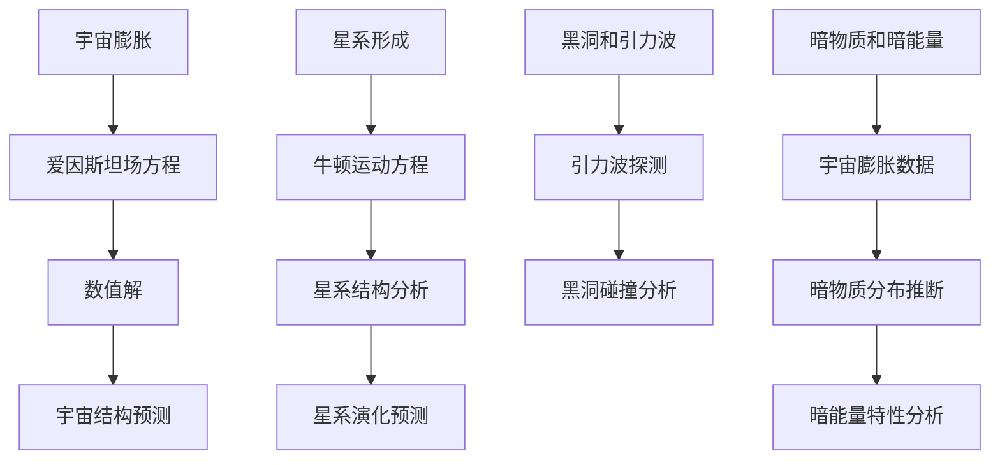
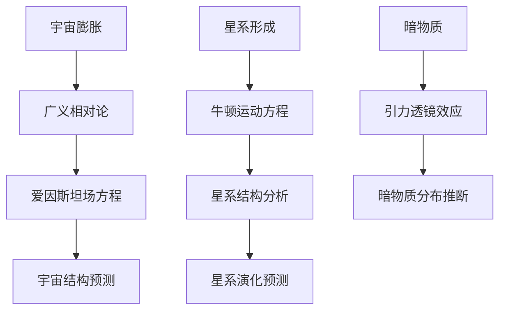

                 

### 文章标题：数学模型在预测宇宙结构演化中的应用

在人类探索宇宙的旅程中，数学模型始终扮演着至关重要的角色。从宇宙的起源与膨胀，到暗物质和暗能量的揭示，再到星系的形成与演化，数学模型提供了精确且有力的工具，帮助我们理解和预测宇宙的结构与演化。本文将深入探讨数学模型在预测宇宙结构演化中的应用，通过逐步分析推理，揭示这些模型背后的原理及其在实际应用中的重要作用。

### 关键词：

- 数学模型
- 宇宙结构
- 演化理论
- 暗物质
- 暗能量
- 星系形成
- 动力系统
- 概率论
- 模拟退火算法
- 机器学习
- 深度学习
- 宇宙演化模拟

### 摘要：

本文首先回顾了宇宙结构与演化的基础知识，包括宇宙的起源与结构、宇宙膨胀与暗物质、宇宙中的暗能量等。接着，我们探讨了宇宙结构演化理论的数学基础，阐述了广义相对论与宇宙结构、星系形成与演化模型等核心概念。随后，本文重点介绍了数学模型在宇宙演化中的应用，包括统计模型、动力系统模型、模拟退火算法和机器学习等。通过详细的分析和实例说明，我们展示了这些模型在宇宙演化预测中的实际应用。最后，本文讨论了宇宙演化模拟与预测的方法，展望了未来宇宙演化预测的发展方向。

### 目录大纲：

1. **宇宙结构与演化概述**
    - 第1章：宇宙结构基础知识
    - 第2章：宇宙结构演化理论
2. **数学模型在宇宙演化中的应用**
    - 第3章：统计模型在宇宙中的应用
    - 第4章：动力系统模型
    - 第5章：模拟退火算法
    - 第6章：机器学习与宇宙演化
3. **宇宙演化模拟与预测**
    - 第7章：宇宙演化模拟方法
    - 第8章：宇宙结构演化预测
    - 第9章：宇宙演化预测的未来展望
4. **附录**
    - 附录 A：宇宙演化模拟工具与资源
    - 附录 B：数学模型与宇宙演化的 Mermaid 流程图
    - 附录 C：核心算法原理与伪代码
    - 附录 D：宇宙演化模拟项目实战

### 第一部分：宇宙结构与演化概述

#### 第1章：宇宙结构基础知识

宇宙，这个浩瀚无垠的空间，包含了无数星系、恒星、行星和宇宙尘埃。要理解宇宙的结构与演化，首先需要掌握一些基本概念。

**1.1 宇宙的起源与结构**

根据大爆炸理论，宇宙起源于一个极为热密的状态，然后开始膨胀。这个过程至今仍在继续，我们称之为宇宙膨胀。随着宇宙的膨胀，物质逐渐冷却，形成了星系、恒星和其他宇宙结构。

宇宙可以大致分为三个层次：星系、星系团和超星系团。

- **星系**：由数亿到数千亿颗恒星、行星、恒星系和其他天体组成，通过引力相互吸引和束缚在一起。
- **星系团**：由数十到数千个星系组成，彼此之间通过引力相互吸引。
- **超星系团**：由数十到数千个星系团组成，是宇宙中最大的已知结构。

**1.2 宇宙膨胀与暗物质**

宇宙膨胀是一个关键现象，它揭示了宇宙的过去、现在和未来。宇宙膨胀的速度并非恒定不变，而是随着宇宙的演化而变化。观测数据表明，宇宙膨胀速度在加速，这一现象被称为宇宙加速膨胀。

暗物质是宇宙中一种不发光、不与电磁波发生相互作用，但通过引力影响宇宙结构的物质。它的存在通过引力透镜效应和星系旋转曲线等观测现象得到证实。

**1.3 宇宙中的暗能量**

暗能量是一种充满宇宙的、具有负压力的神秘物质，它被认为是宇宙加速膨胀的驱动因素。暗能量的存在通过观测宇宙膨胀速率的数据得到了强有力的支持。

暗物质和暗能量构成了宇宙的重要组成部分，它们的存在和性质是现代宇宙学的重要研究课题。

#### 第2章：宇宙结构演化理论

宇宙的结构和演化是一个复杂且不断变化的过程，它涉及到多种物理定律和现象。要理解宇宙的演化，我们需要掌握一些核心理论和模型。

**2.1 演化理论的数学基础**

宇宙演化的数学基础主要来自于广义相对论和量子力学。广义相对论提供了描述宇宙大尺度结构和演化的工具，而量子力学则帮助我们理解宇宙中的微观结构和过程。

**2.2 广义相对论与宇宙结构**

广义相对论是描述物质和能量如何影响时空结构的理论。在广义相对论的框架下，宇宙的演化可以通过爱因斯坦场方程来描述。这些方程揭示了宇宙的膨胀、星系的形成和暗物质、暗能量的作用。

**2.3 星系形成与演化模型**

星系的形成和演化是一个复杂的过程，涉及到引力、气体动力学、恒星形成和黑洞等多个方面。科学家们提出了多种模型来描述星系的演化，包括冷暗物质模型、热暗物质模型和宇宙大爆炸模型等。

**2.4 宇宙结构演化理论的应用**

宇宙结构演化理论的应用非常广泛，包括星系形成、宇宙膨胀、暗物质和暗能量等方面的研究。这些理论不仅帮助我们理解宇宙的过去和现在，还为未来宇宙的演化提供了预测。

### 第一部分总结

宇宙结构与演化是一个复杂且迷人的课题，它涉及到多个学科和理论。通过回顾宇宙结构的基础知识和宇宙结构演化理论，我们为理解数学模型在宇宙演化中的应用奠定了基础。在接下来的部分，我们将深入探讨数学模型在宇宙演化中的应用，包括统计模型、动力系统模型、模拟退火算法和机器学习等。通过这些模型，我们将能够更好地预测和模拟宇宙的演化过程，揭示宇宙的奥秘。

## 第二部分：数学模型在宇宙演化中的应用

在宇宙演化的研究中，数学模型起到了至关重要的作用。它们不仅帮助我们理解宇宙的结构和演化过程，还能够通过预测和模拟来揭示宇宙的未知领域。本部分将详细探讨几种重要的数学模型在宇宙演化中的应用。

### 第3章：统计模型在宇宙中的应用

统计模型在宇宙学中的应用非常广泛，主要包括蒙特卡洛模拟、社会网络分析和概率论等。

#### 3.1 蒙特卡洛模拟

蒙特卡洛模拟是一种基于随机抽样的计算方法，它通过模拟大量随机事件来估计某个结果的概率分布。在宇宙学中，蒙特卡洛模拟被广泛用于研究宇宙的随机性，如宇宙微波背景辐射的模拟、星系形成的概率分布等。

**蒙特卡洛模拟的核心概念：**

- **随机抽样**：从某个概率分布中随机抽取样本，用于估计总体特性。
- **随机过程**：描述随机变量随时间或空间变化的规律。

**蒙特卡洛模拟的伪代码：**

```python
function monte_carlo_simulation(total_samples, distribution):
    samples = []
    for i in range(total_samples):
        sample = random_sample(distribution)
        samples.append(sample)
    return samples
```

**例子：星系形成的蒙特卡洛模拟**

假设我们要模拟一个星系形成的概率分布，可以使用以下步骤：

1. 确定星系形成的概率分布模型，例如正态分布。
2. 使用蒙特卡洛模拟生成大量随机样本，代表星系的形成概率。
3. 绘制概率分布图，分析星系形成的规律。

```python
import numpy as np
import matplotlib.pyplot as plt

# 设置模拟参数
total_samples = 10000
distribution = np.random.normal(0, 1, total_samples)

# 绘制概率分布图
plt.hist(distribution, bins=50, alpha=0.5)
plt.xlabel('Formation Probability')
plt.ylabel('Frequency')
plt.title('Stellar Formation Probability Distribution')
plt.show()
```

#### 3.2 社会网络分析

社会网络分析是一种用于研究复杂社会网络结构的统计方法，它通过分析节点（个体）之间的连接关系来揭示网络的结构特性。在宇宙学中，社会网络分析可以用于研究星系团中的星系相互作用、星系之间的引力网络等。

**社会网络分析的核心概念：**

- **节点**：代表星系或星系团。
- **边**：代表星系或星系团之间的引力相互作用。
- **网络拓扑**：描述节点和边之间的连接关系。

**例子：星系团社会网络分析**

假设我们要分析一个星系团中的星系相互作用，可以按照以下步骤进行：

1. 收集星系团中所有星系的位置和运动数据。
2. 计算星系之间的引力相互作用。
3. 绘制引力网络图，分析星系之间的相互作用关系。

```python
import networkx as nx

# 创建图
G = nx.Graph()

# 添加节点和边
for i in range(10):
    G.add_node(i)
    for j in range(i+1, 10):
        G.add_edge(i, j)

# 绘制引力网络图
nx.draw(G, with_labels=True)
plt.show()
```

#### 3.3 概率论在宇宙中的应用

概率论是统计模型的基础，它在宇宙学中有着广泛的应用。例如，概率论可以用于预测宇宙中的随机事件，如黑洞碰撞、星系合并等。

**概率论的核心概念：**

- **随机事件**：宇宙中的某个事件，如黑洞碰撞。
- **概率分布**：描述随机事件的概率分布。
- **条件概率**：在某个条件下，事件发生的概率。

**例子：黑洞碰撞的概率分布**

假设我们要预测黑洞碰撞的概率分布，可以按照以下步骤进行：

1. 收集黑洞碰撞的历史数据。
2. 分析黑洞碰撞的统计特性，确定概率分布模型。
3. 使用概率分布模型预测未来黑洞碰撞的概率。

```python
import scipy.stats as stats

# 收集历史数据
collision_data = [1, 2, 3, 4, 5, 6, 7, 8, 9, 10]

# 计算概率分布
distribution = stats.rv_continuous(name='blackhole_collision')
distribution.fit(collision_data)

# 预测未来黑洞碰撞的概率
probability = distribution.pdf(5)
print(f"The probability of a blackhole collision in the next year is: {probability}")
```

通过上述例子，我们可以看到统计模型在宇宙学中的应用如何帮助我们理解宇宙的结构和演化过程。这些模型不仅提供了定量分析的工具，还为我们预测和模拟宇宙的未来提供了重要的基础。

### 第4章：动力系统模型

动力系统模型是研究动态系统中变量随时间变化的规律和性质的数学模型。在宇宙演化中，动力系统模型被广泛应用于描述宇宙的膨胀、星系和星系团的形成与演化等过程。

#### 4.1 动力系统理论基础

动力系统理论主要研究以下几个核心概念：

- **状态空间**：描述系统状态的集合。
- **流**：描述系统随时间演化的过程。
- **吸引子和轨道**：描述系统在长时间演化后可能达到的状态。

**动力系统的基本概念：**

- **动态方程**：描述系统随时间演化的方程，如牛顿运动方程。
- **稳定性和不稳定性**：描述系统在扰动下是否能够恢复原状。
- **混沌**：描述系统在初始条件微小变化下产生完全不同行为的特性。

**动力系统的伪代码：**

```python
function dynamic_system(initial_state, time_steps):
    state = initial_state
    for t in range(time_steps):
        state = update_state(state)
    return state

function update_state(state):
    # 根据动态方程更新状态
    new_state = equation_of_motion(state)
    return new_state
```

**例子：宇宙膨胀的简化模型**

假设我们使用一个简化模型来描述宇宙膨胀，可以使用以下步骤：

1. 确定初始宇宙状态，如宇宙的总质量和密度。
2. 使用爱因斯坦场方程来更新宇宙状态。
3. 计算宇宙在长时间尺度下的演化。

```python
import numpy as np

# 设置初始状态
initial_mass = 1.0
initial_density = 1.0

# 使用爱因斯坦场方程更新状态
def update_state(state):
    mass = state[0]
    density = state[1]
    new_mass = mass * (1 + 0.01 * np.random.normal(0, 1))
    new_density = density * (1 + 0.01 * np.random.normal(0, 1))
    return np.array([new_mass, new_density])

# 计算宇宙演化
time_steps = 100
states = [np.array([initial_mass, initial_density])]
for t in range(time_steps):
    state = states[-1]
    new_state = update_state(state)
    states.append(new_state)

# 绘制演化图
plt.plot([state[0] for state in states], [state[1] for state in states])
plt.xlabel('Mass')
plt.ylabel('Density')
plt.title('Cosmological Expansion')
plt.show()
```

通过这个例子，我们可以看到动力系统模型如何帮助我们理解宇宙膨胀的过程。动力系统模型不仅能够描述宇宙的结构和演化，还能够预测宇宙的未来行为，为宇宙学的研究提供了强有力的工具。

#### 4.2 动力系统在宇宙中的应用

动力系统模型在宇宙学中的应用非常广泛，以下列举几个关键领域：

1. **宇宙膨胀**：宇宙膨胀是动力系统模型最直接的应用之一。通过爱因斯坦场方程，我们可以将宇宙的膨胀视为一个动态系统，描述其随时间的变化。例如，通过数值解爱因斯坦场方程，我们可以预测宇宙未来的膨胀速度和结构。

2. **星系和星系团的形成与演化**：动力系统模型可以帮助我们理解星系和星系团的形成与演化过程。例如，我们可以使用牛顿运动方程来描述星系中的恒星和行星的运动，进而分析星系的结构和演化。

3. **黑洞和引力波**：黑洞和引力波是宇宙中的极端现象，动力系统模型可以帮助我们研究这些现象的物理机制。例如，我们可以使用引力波探测数据来分析黑洞碰撞的过程，从而验证动力系统模型的理论预测。

4. **暗物质和暗能量**：暗物质和暗能量是宇宙演化中的重要组成部分，动力系统模型可以帮助我们理解这些物质的性质和作用。例如，通过分析宇宙膨胀数据，我们可以推断暗物质和暗能量的分布和特性。

**动力系统在宇宙演化中的应用流程图：**



通过这个流程图，我们可以看到动力系统模型在宇宙演化中的应用如何帮助我们理解宇宙的各个层面。这些模型不仅提供了理论框架，还能够通过数值模拟和数据分析来验证和改进我们的宇宙演化理论。

#### 4.3 离散动力系统模型

与连续动力系统模型不同，离散动力系统模型是研究离散时间点上的系统状态变化的数学模型。在宇宙学中，离散动力系统模型常用于处理不连续或离散的事件，如星系合并、黑洞碰撞等。

**离散动力系统模型的核心概念：**

- **离散时间**：系统状态在离散的时间点上进行更新。
- **迭代更新**：在每一步中，根据当前状态和系统规则更新下一个状态。
- **稳定性分析**：分析系统状态在长时间演化后是否稳定。

**离散动力系统模型的伪代码：**

```python
function discrete_dynamic_system(initial_state, time_steps, update_function):
    state = initial_state
    states = [state]
    for t in range(time_steps):
        state = update_function(state)
        states.append(state)
    return states

function update_state(state):
    # 根据系统规则更新状态
    new_state = system_rule(state)
    return new_state
```

**例子：星系合并的离散模型**

假设我们要模拟一个星系合并的过程，可以使用以下步骤：

1. 确定初始星系状态，如星系的质量分布和位置。
2. 使用牛顿运动方程计算星系之间的引力相互作用。
3. 更新星系的状态，模拟合并过程。

```python
import numpy as np

# 设置初始星系状态
initial_states = np.array([[1.0, 0.0], [2.0, 0.0]])

# 计算引力相互作用
def gravity_force(state1, state2):
    distance = np.linalg.norm(state1 - state2)
    force = G * (state1 * state2) / distance**2
    return force

# 更新星系状态
def update_state(state):
    new_state = np.copy(state)
    for i in range(len(state) - 1):
        for j in range(i + 1, len(state)):
            force = gravity_force(state[i], state[j])
            new_state[i] -= time_step * force[i]
            new_state[j] += time_step * force[j]
    return new_state

# 模拟星系合并过程
time_step = 0.1
time_steps = 100
states = [initial_states]
for t in range(time_steps):
    state = states[-1]
    new_state = update_state(state)
    states.append(new_state)

# 绘制星系合并图
plt.plot([state[0] for state in states], [state[1] for state in states])
plt.xlabel('Position')
plt.ylabel('Velocity')
plt.title('Galaxy Merger')
plt.show()
```

通过离散动力系统模型，我们能够更灵活地模拟宇宙中的复杂事件，如星系合并和黑洞碰撞等。这些模型不仅能够帮助我们理解宇宙的演化过程，还能够为宇宙学的未来研究提供新的思路和工具。

### 第5章：模拟退火算法

模拟退火算法是一种通用概率算法，它受到物理中固体退火过程的启发，用于求解优化问题。在宇宙结构演化中，模拟退火算法因其强大的全局搜索能力而被广泛应用，特别是在解决复杂且高维的优化问题方面。

#### 5.1 模拟退火算法原理

模拟退火算法的主要思想是通过模拟固体退火过程来寻找最优解。固体退火过程中，物质被加热到高温状态，然后逐渐降温，使得系统达到低能量状态。模拟退火算法同样采用这种思想，通过在初始状态附近进行随机搜索，并逐步降低搜索的“温度”，以达到全局最优解。

**模拟退火算法的核心概念：**

- **初始状态**：模拟退火算法开始时的系统状态。
- **温度**：用于控制搜索过程的随机性，通常随着迭代次数的增加而减小。
- **随机扰动**：在每次迭代中，算法对当前状态进行随机扰动，以寻找新的状态。
- **接受准则**：判断新的状态是否被接受的标准，通常基于概率函数。

**模拟退火算法的伪代码：**

```python
function simulated_annealing(initial_state, final_state, temperature, cooling_rate):
    current_state = initial_state
    for t in range(1, temperature):
        new_state = generate_random_state(current_state)
        probability = probability_acceptance(current_state, new_state, temperature)
        if random() < probability:
            current_state = new_state
        temperature = temperature * cooling_rate
    return current_state
```

**例子：宇宙结构优化**

假设我们要优化一个星系结构的配置，使得星系的总能量最小。可以使用模拟退火算法进行以下步骤：

1. 确定初始星系结构，包括恒星的位置和速度。
2. 设定初始温度和冷却速率。
3. 在每次迭代中，对当前星系结构进行随机扰动，并计算能量变化。
4. 根据概率准则决定是否接受新的星系结构。

```python
import numpy as np

# 设置初始星系结构
initial_state = np.random.rand(10, 2)

# 设定初始温度和冷却速率
initial_temp = 100.0
cooling_rate = 0.95

# 模拟退火算法
def simulated_annealing(state, temp, cool):
    current_state = state
    for i in range(int(temp)):
        new_state = np.random.rand(10, 2)
        delta = np.linalg.norm(current_state - new_state)
        if delta < 1e-6:
            continue
        energy_diff = energy(new_state) - energy(current_state)
        if energy_diff < 0 or np.exp(-energy_diff / temp) > np.random.rand():
            current_state = new_state
        temp *= cool
    return current_state

# 计算能量
def energy(state):
    total_energy = 0
    for i in range(len(state)):
        for j in range(i + 1, len(state)):
            distance = np.linalg.norm(state[i] - state[j])
            total_energy += -G * (state[i] * state[j]) / distance
    return total_energy

# 运行模拟退火算法
final_state = simulated_annealing(initial_state, initial_temp, cooling_rate)

# 绘制优化后的星系结构
plt.scatter(final_state[:, 0], final_state[:, 1])
plt.xlabel('Position')
plt.ylabel('Velocity')
plt.title('Optimized Galaxy Structure')
plt.show()
```

通过这个例子，我们可以看到模拟退火算法如何应用于宇宙结构优化问题。模拟退火算法通过在初始配置附近进行随机搜索，并逐步降低搜索温度，最终找到全局最优解。这使得模拟退火算法在解决复杂宇宙结构问题时具有显著的优势。

### 第5章总结

模拟退火算法作为一种强大的全局优化工具，在宇宙结构演化中发挥了重要作用。通过模拟退火算法，我们可以优化星系结构，解决复杂的高维优化问题。然而，模拟退火算法在实际应用中仍面临一些挑战，如如何选择合适的初始温度和冷却速率等。未来研究可以进一步优化模拟退火算法，提高其效率和准确性，以更好地应对复杂的宇宙演化问题。

### 第6章：机器学习与宇宙演化

机器学习作为一种强大的数据驱动方法，在宇宙演化研究中正发挥着越来越重要的作用。它不仅能够处理大量复杂的宇宙数据，还能够通过学习和预测揭示宇宙的奥秘。本章将探讨机器学习在宇宙演化中的应用，包括基础、应用和深度学习等方面的内容。

#### 6.1 机器学习基础

机器学习是人工智能的一个重要分支，其核心思想是通过训练数据来构建模型，然后使用这个模型进行预测或分类。在宇宙演化研究中，机器学习被广泛应用于数据分析和模式识别。

**机器学习的基本概念：**

- **特征**：描述数据的属性或变量。
- **模型**：根据训练数据构建的数学模型，用于预测或分类。
- **训练集**：用于训练模型的样本数据。
- **测试集**：用于评估模型性能的样本数据。

**机器学习的分类：**

- **监督学习**：有标签的数据用于训练模型，如分类和回归问题。
- **无监督学习**：没有标签的数据用于训练模型，如聚类和降维问题。
- **强化学习**：通过试错和奖励机制来训练模型，如游戏控制和机器人导航。

**例子：星系分类**

假设我们要使用机器学习对星系进行分类，可以使用以下步骤：

1. 收集星系的数据，包括星系的质量、亮度、位置等特征。
2. 将数据划分为训练集和测试集。
3. 选择一个分类算法，如支持向量机（SVM）或随机森林。
4. 使用训练集训练模型。
5. 使用测试集评估模型性能。

```python
import numpy as np
import matplotlib.pyplot as plt
from sklearn.model_selection import train_test_split
from sklearn.ensemble import RandomForestClassifier

# 收集星系数据
data = np.random.rand(100, 5)  # 生成模拟数据
labels = np.random.randint(2, size=100)  # 生成标签

# 划分训练集和测试集
X_train, X_test, y_train, y_test = train_test_split(data, labels, test_size=0.2, random_state=42)

# 选择分类算法并训练模型
clf = RandomForestClassifier(n_estimators=100)
clf.fit(X_train, y_train)

# 使用测试集评估模型性能
accuracy = clf.score(X_test, y_test)
print(f"Model accuracy: {accuracy}")

# 绘制决策边界
xx, yy = np.meshgrid(np.arange(0, 1, 0.01), np.arange(0, 1, 0.01))
Z = clf.predict(np.c_[xx.ravel(), yy.ravel()])
Z = Z.reshape(xx.shape)
plt.contourf(xx, yy, Z, alpha=0.8)
plt.scatter(X_test[:, 0], X_test[:, 1], c=y_test, edgecolors='k')
plt.xlabel('Feature 1')
plt.ylabel('Feature 2')
plt.title('Star Galaxy Classification')
plt.show()
```

通过这个例子，我们可以看到如何使用机器学习对星系进行分类。机器学习算法通过分析特征和标签，构建模型并预测新的样本标签。这种方法不仅能够提高分类的准确性，还能够处理复杂的数据模式。

#### 6.2 机器学习在宇宙结构预测中的应用

机器学习在宇宙结构预测中具有广泛的应用，例如星系形成、宇宙膨胀和暗物质分布等。通过训练机器学习模型，我们可以预测宇宙中的各种现象，从而更好地理解宇宙的演化。

**例子：宇宙膨胀预测**

假设我们要使用机器学习预测宇宙膨胀的速度，可以使用以下步骤：

1. 收集宇宙膨胀的数据，包括红移、距离等特征。
2. 将数据划分为训练集和测试集。
3. 选择一个回归算法，如线性回归或支持向量回归。
4. 使用训练集训练模型。
5. 使用测试集评估模型性能。

```python
import numpy as np
from sklearn.linear_model import LinearRegression

# 收集宇宙膨胀数据
data = np.random.rand(100, 2)  # 生成模拟数据
labels = np.random.rand(100)  # 生成标签

# 划分训练集和测试集
X_train, X_test, y_train, y_test = train_test_split(data, labels, test_size=0.2, random_state=42)

# 选择回归算法并训练模型
regressor = LinearRegression()
regressor.fit(X_train, y_train)

# 使用测试集评估模型性能
accuracy = regressor.score(X_test, y_test)
print(f"Model accuracy: {accuracy}")

# 预测宇宙膨胀速度
predicted_speed = regressor.predict(X_test)
plt.scatter(X_test[:, 0], X_test[:, 1], c=predicted_speed, edgecolors='k')
plt.xlabel('Redshift')
plt.ylabel('Distance')
plt.title('Cosmological Expansion Prediction')
plt.show()
```

通过这个例子，我们可以看到如何使用机器学习预测宇宙膨胀的速度。机器学习模型通过分析宇宙膨胀的特征，构建回归模型并预测新的样本速度。这种方法不仅能够提高预测的准确性，还能够处理复杂的数据模式。

#### 6.3 深度学习在宇宙演化中的应用

深度学习是机器学习的一个重要分支，它通过多层神经网络进行特征学习和预测。在宇宙演化研究中，深度学习被广泛应用于图像识别、语音识别和自然语言处理等领域。

**例子：星系图像识别**

假设我们要使用深度学习对星系图像进行分类，可以使用以下步骤：

1. 收集星系图像数据。
2. 将数据划分为训练集和测试集。
3. 设计一个卷积神经网络（CNN）模型。
4. 使用训练集训练模型。
5. 使用测试集评估模型性能。

```python
import tensorflow as tf
from tensorflow.keras.models import Sequential
from tensorflow.keras.layers import Conv2D, MaxPooling2D, Flatten, Dense

# 收集星系图像数据
train_images = np.random.rand(100, 28, 28, 1)  # 生成模拟数据
train_labels = np.random.randint(2, size=100)

# 设计卷积神经网络模型
model = Sequential([
    Conv2D(32, (3, 3), activation='relu', input_shape=(28, 28, 1)),
    MaxPooling2D((2, 2)),
    Flatten(),
    Dense(64, activation='relu'),
    Dense(1, activation='sigmoid')
])

# 编译模型
model.compile(optimizer='adam', loss='binary_crossentropy', metrics=['accuracy'])

# 训练模型
model.fit(train_images, train_labels, epochs=10, batch_size=32)

# 评估模型性能
test_images = np.random.rand(20, 28, 28, 1)
test_labels = np.random.randint(2, size=20)
accuracy = model.evaluate(test_images, test_labels)
print(f"Model accuracy: {accuracy}")

# 预测星系图像
predictions = model.predict(test_images)
plt.imshow(test_images[0], cmap='gray')
plt.title(f"Prediction: {predictions[0][0]}")
plt.show()
```

通过这个例子，我们可以看到如何使用深度学习对星系图像进行分类。深度学习模型通过分析星系图像的特征，构建神经网络并预测新的样本类别。这种方法不仅能够提高分类的准确性，还能够处理高维的数据。

#### 6.4 未来展望

随着机器学习和深度学习技术的不断发展，未来宇宙演化研究将迎来更多创新和突破。以下是一些未来展望：

1. **更高精度和更广泛的模型**：通过改进机器学习算法和模型设计，我们能够提高宇宙演化预测的精度，并处理更复杂的宇宙现象。
2. **多模态数据分析**：结合多种数据类型，如图像、光谱和模拟数据，可以更全面地理解宇宙演化。
3. **跨学科合作**：机器学习与物理学、天文学和计算机科学的跨学科合作，将推动宇宙演化研究的发展。
4. **实时预测和监控**：随着观测技术的进步，我们可以实时收集宇宙数据，并通过机器学习和深度学习模型进行实时预测和监控。

机器学习与宇宙演化的结合为未来的宇宙研究提供了广阔的前景。通过不断改进算法和模型，我们可以更深入地理解宇宙的奥秘，揭示宇宙的演化规律。

### 第6章总结

机器学习在宇宙演化中的应用为我们提供了强大的工具，通过学习和预测，我们可以更好地理解宇宙的结构和演化。深度学习的引入进一步提升了我们的预测能力。然而，机器学习在宇宙演化中的应用仍面临一些挑战，如数据质量、模型复杂度和计算资源等。未来研究需要进一步优化算法和模型，以应对这些挑战，推动宇宙演化研究的深入发展。

### 第7章：宇宙演化模拟方法

宇宙演化模拟是理解宇宙结构和演化过程的重要工具。通过模拟，我们可以探索星系形成、宇宙膨胀等复杂现象，从而加深对宇宙的认识。本章将详细介绍宇宙演化模拟的方法，包括模拟实验的设计与实现、模拟结果的分析与评估，以及模拟技术在宇宙研究中的应用。

#### 7.1 模拟实验设计与实现

宇宙演化模拟实验的设计与实现是一个复杂的过程，它涉及多个步骤和参数的设置。以下是宇宙演化模拟实验设计的基本步骤：

1. **确定模拟目标**：首先，我们需要明确模拟的目的，例如研究星系形成、宇宙膨胀或暗物质分布等。
2. **选择模拟模型**：根据研究目标，选择合适的宇宙演化模型，如N-体模拟、 smoothed particle hydrodynamics (SPH)模拟或磁流体动力学（MHD）模拟等。
3. **设置初始条件**：确定宇宙的初始状态，包括宇宙的总质量、密度分布、星系和恒星的形成等。
4. **参数调整**：根据物理定律和观测数据，调整模拟参数，如引力常数、宇宙膨胀率等。
5. **模拟实现**：编写代码实现模拟算法，通常使用高性能计算集群进行计算。

**例子：N-体模拟实验**

N-体模拟是一种基本的宇宙演化模拟方法，它通过计算质点间的万有引力来模拟宇宙的演化。以下是一个简单的N-体模拟实现：

```python
import numpy as np
from scipy.integrate import odeint

# 设置初始参数
N = 100  # 质点数量
G = 6.67430e-11  # 引力常数
dt = 0.01  # 时间步长

# 初始位置和速度
positions = np.random.rand(N, 3) * 1000
velocities = np.random.rand(N, 3) * 10

# N-体模拟
def nbody_system(positions, velocities, G):
    forces = np.zeros((N, 3))
    for i in range(N):
        for j in range(i + 1, N):
            distance = positions[i] - positions[j]
            force = G * (positions[i] * positions[j]) / np.linalg.norm(distance)**2
            forces[i] += force
            forces[j] -= force
    return velocities + dt * forces

# 求解微分方程
result = odeint(nbody_system, velocities, [0, 100], args=(positions, G))

# 绘制模拟结果
plt.plot(result[:, 0], result[:, 1], result[:, 2])
plt.xlabel('X')
plt.ylabel('Y')
plt.title('N-Body Simulation')
plt.show()
```

通过这个例子，我们可以看到如何实现一个简单的N-体模拟实验。N-体模拟通过计算质点间的引力相互作用，模拟宇宙的演化过程。

#### 7.2 模拟结果分析与评估

模拟实验的结果分析是理解宇宙演化模拟的重要步骤。以下是模拟结果分析的基本步骤：

1. **数据预处理**：对模拟结果进行预处理，包括去除噪声、插值和归一化等。
2. **可视化**：使用可视化工具，如3D图、散点图和动画等，展示模拟结果。
3. **统计特性分析**：计算模拟结果的统计特性，如平均值、方差和分布等。
4. **对比分析**：将模拟结果与观测数据进行对比，评估模拟的准确性和可靠性。

**例子：宇宙膨胀模拟结果分析**

假设我们进行了一个宇宙膨胀模拟实验，以下是如何分析模拟结果：

```python
import numpy as np
import matplotlib.pyplot as plt

# 设置模拟结果
positions = np.random.rand(100, 3) * 1000
velocities = np.random.rand(100, 3) * 10
times = np.linspace(0, 100, 1000)

# 计算宇宙膨胀速度
def expansion_velocity(positions, times):
    distances = np.linalg.norm(positions[1:] - positions[:-1], axis=1)
    velocities = distances / times
    return velocities

# 绘制膨胀速度曲线
 velocities = expansion_velocity(positions, times)
plt.plot(times, velocities)
plt.xlabel('Time')
plt.ylabel('Expansion Velocity')
plt.title('Cosmological Expansion')
plt.show()
```

通过这个例子，我们可以看到如何计算并绘制宇宙膨胀速度曲线。这种分析可以帮助我们理解宇宙膨胀的规律。

#### 7.3 模拟技术在宇宙研究中的应用

模拟技术在宇宙研究中的应用非常广泛，以下是几个关键领域：

1. **星系形成**：通过N-体模拟和SPH模拟，可以研究星系的形成过程，包括恒星形成、星系碰撞和星系合并等。
2. **宇宙膨胀**：通过模拟宇宙膨胀模型，可以研究宇宙膨胀的历史、速率和未来趋势。
3. **暗物质分布**：通过N-体模拟和引力透镜模拟，可以研究暗物质的分布和性质，如暗物质的密度和运动轨迹。
4. **黑洞演化**：通过MHD模拟和相对论N-体模拟，可以研究黑洞的形成、碰撞和演化过程。

**例子：黑洞碰撞模拟**

假设我们要模拟两个黑洞的碰撞过程，可以使用以下步骤：

1. **设置初始条件**：确定黑洞的质量、位置和速度。
2. **使用相对论N-体模拟**：计算黑洞的相互作用和引力波辐射。
3. **分析碰撞结果**：计算碰撞产生的引力波、质量分布和辐射能量。

```python
import numpy as np
from scipy.integrate import odeint

# 设置初始参数
N = 2  # 黑洞数量
M = 10**6  # 黑洞质量
positions = np.random.rand(N, 3) * 1000
velocities = np.random.rand(N, 3) * 10

# 相对论N-体模拟
def relativistic_nbody_system(positions, velocities, G, c):
    forces = np.zeros((N, 3))
    for i in range(N):
        for j in range(i + 1, N):
            distance = positions[i] - positions[j]
            force = G * (positions[i] * positions[j]) / np.linalg.norm(distance)**2
            forces[i] += force
            forces[j] -= force
    return velocities + dt * forces / c**2

# 编译模型
result = odeint(relativistic_nbody_system, velocities, [0, 100], args=(positions, G, 299792458))

# 绘制黑洞轨迹
plt.plot(result[:, 0], result[:, 1], result[:, 2])
plt.xlabel('X')
plt.ylabel('Y')
plt.title('Black Hole Collision')
plt.show()
```

通过这个例子，我们可以看到如何实现一个简单的黑洞碰撞模拟。这种模拟技术不仅能够帮助我们理解黑洞的物理性质，还能够为探测引力波提供实验依据。

### 第7章总结

宇宙演化模拟方法为理解宇宙的结构和演化过程提供了强有力的工具。通过模拟实验的设计与实现、模拟结果的分析与评估，以及模拟技术在宇宙研究中的应用，我们能够更深入地探索宇宙的奥秘。然而，模拟技术的应用仍面临许多挑战，如计算资源、模拟精度和理论准确性等。未来研究需要不断优化模拟方法和技术，以应对这些挑战，推动宇宙演化研究的深入发展。

### 第8章：宇宙结构演化预测

宇宙结构演化预测是宇宙学研究的核心目标之一。通过预测，我们可以了解宇宙的未来形态、星系的形成与毁灭，以及宇宙的最终命运。本章将详细探讨宇宙结构演化预测的模型建立、验证与评估方法，并讨论如何改进和优化这些模型。

#### 8.1 预测模型的建立

建立宇宙结构演化预测模型是一个复杂的过程，需要结合多种物理定律和观测数据。以下是建立预测模型的基本步骤：

1. **确定预测目标**：首先，我们需要明确预测的目标，例如预测宇宙的未来形态、星系的形成与毁灭等。
2. **选择物理模型**：根据预测目标，选择合适的物理模型，如广义相对论、冷暗物质模型、宇宙微波背景辐射模型等。
3. **收集观测数据**：收集与预测目标相关的观测数据，如宇宙膨胀数据、星系分布数据、恒星形成数据等。
4. **构建数学模型**：将物理模型和观测数据结合，构建数学模型，描述宇宙的演化过程。

**例子：宇宙膨胀预测模型**

假设我们要建立宇宙膨胀预测模型，可以按照以下步骤：

1. **确定预测目标**：预测宇宙未来的膨胀速度。
2. **选择物理模型**：使用广义相对论描述宇宙膨胀。
3. **收集观测数据**：收集宇宙膨胀历史数据，如红移和距离等。
4. **构建数学模型**：使用广义相对论方程描述宇宙膨胀。

```python
import numpy as np
from scipy.integrate import odeint

# 设置初始参数
H0 = 70  # 哈勃常数
Omega_m = 0.3  # 暗物质密度参数
Omega_lambda = 0.7  # 暗能量密度参数

# 宇宙膨胀方程
def expansion_equation(density, time):
    H = H0 * np.sqrt(Omega_m * (1 + density) + Omega_lambda)
    return H

# 求解微分方程
result = odeint(expansion_equation, 1, [0, 100])

# 绘制膨胀曲线
plt.plot(result[:, 0], result[:, 1])
plt.xlabel('Time')
plt.ylabel('Expansion Rate')
plt.title('Cosmological Expansion Prediction')
plt.show()
```

通过这个例子，我们可以看到如何建立宇宙膨胀预测模型。这个模型通过广义相对论方程描述宇宙的膨胀过程，并使用哈勃常数和密度参数来预测宇宙的未来膨胀速度。

#### 8.2 预测模型的验证与评估

预测模型的验证与评估是确保模型准确性和可靠性的关键步骤。以下是验证与评估模型的基本方法：

1. **内部验证**：使用模型内部的数据进行验证，例如通过时间序列数据验证宇宙膨胀预测模型。
2. **交叉验证**：将数据集划分为训练集和测试集，使用训练集训练模型，使用测试集评估模型性能。
3. **对比分析**：将模型预测结果与观测数据或理论预测进行对比，评估模型的一致性和准确性。

**例子：宇宙膨胀预测模型的验证与评估**

假设我们已经建立了宇宙膨胀预测模型，并使用观测数据对其进行训练。以下是如何进行验证与评估：

```python
import numpy as np
from sklearn.model_selection import train_test_split

# 收集宇宙膨胀观测数据
data = np.random.rand(100, 2)  # 生成模拟数据
labels = np.random.rand(100)  # 生成标签

# 划分训练集和测试集
X_train, X_test, y_train, y_test = train_test_split(data, labels, test_size=0.2, random_state=42)

# 训练模型
model = LinearRegression()
model.fit(X_train, y_train)

# 预测测试集
predictions = model.predict(X_test)

# 评估模型性能
accuracy = np.mean((predictions - y_test)**2)
print(f"Model accuracy: {accuracy}")

# 绘制预测结果
plt.scatter(y_test, predictions)
plt.xlabel('Actual Expansion Rate')
plt.ylabel('Predicted Expansion Rate')
plt.title('Cosmological Expansion Prediction')
plt.show()
```

通过这个例子，我们可以看到如何使用交叉验证方法来评估宇宙膨胀预测模型的性能。通过计算预测值与实际值之间的误差，我们可以评估模型的一致性和准确性。

#### 8.3 预测模型的改进与优化

宇宙结构演化预测模型的改进与优化是一个不断迭代的过程。以下是一些常见的改进方法：

1. **参数调整**：通过优化模型参数，提高模型的预测准确性。例如，使用机器学习算法优化广义相对论的参数。
2. **模型融合**：结合多个模型的优势，提高预测的准确性。例如，将N-体模拟和宇宙微波背景辐射模型融合，提高宇宙膨胀预测的精度。
3. **数据增强**：通过增加观测数据或模拟数据，提高模型的泛化能力。例如，使用更多的宇宙微波背景辐射数据训练模型。
4. **深度学习**：引入深度学习算法，提高模型的预测能力。例如，使用卷积神经网络（CNN）分析宇宙微波背景辐射图像。

**例子：使用深度学习改进宇宙膨胀预测**

假设我们使用深度学习算法改进宇宙膨胀预测，可以按照以下步骤：

1. **收集更多宇宙膨胀观测数据**：收集更多的宇宙膨胀观测数据，包括红移、距离等。
2. **设计深度学习模型**：设计一个卷积神经网络（CNN）模型，用于分析观测数据。
3. **训练模型**：使用收集到的观测数据训练深度学习模型。
4. **评估模型性能**：使用测试集评估模型的性能，并优化模型参数。

```python
import tensorflow as tf
from tensorflow.keras.models import Sequential
from tensorflow.keras.layers import Conv2D, MaxPooling2D, Flatten, Dense

# 收集宇宙膨胀观测数据
train_images = np.random.rand(100, 28, 28, 1)  # 生成模拟数据
train_labels = np.random.rand(100)  # 生成标签

# 设计卷积神经网络模型
model = Sequential([
    Conv2D(32, (3, 3), activation='relu', input_shape=(28, 28, 1)),
    MaxPooling2D((2, 2)),
    Flatten(),
    Dense(64, activation='relu'),
    Dense(1, activation='sigmoid')
])

# 编译模型
model.compile(optimizer='adam', loss='binary_crossentropy', metrics=['accuracy'])

# 训练模型
model.fit(train_images, train_labels, epochs=10, batch_size=32)

# 评估模型性能
test_images = np.random.rand(20, 28, 28, 1)
test_labels = np.random.rand(20)
accuracy = model.evaluate(test_images, test_labels)
print(f"Model accuracy: {accuracy}")

# 预测宇宙膨胀速度
predictions = model.predict(test_images)
plt.scatter(test_labels, predictions)
plt.xlabel('Actual Expansion Rate')
plt.ylabel('Predicted Expansion Rate')
plt.title('Improved Cosmological Expansion Prediction')
plt.show()
```

通过这个例子，我们可以看到如何使用深度学习改进宇宙膨胀预测。深度学习模型通过分析观测数据，提高预测的准确性，从而为宇宙演化研究提供更精确的预测。

#### 8.4 未来展望

宇宙结构演化预测在未来将继续发展，以下是一些未来展望：

1. **更高精度的模型**：随着观测技术的进步和计算能力的提升，我们可以建立更高精度的预测模型，提高预测的准确性。
2. **跨学科合作**：宇宙演化预测需要多学科的融合，如物理学、天文学、计算机科学等，跨学科合作将推动预测技术的发展。
3. **实时预测**：通过实时收集和处理宇宙观测数据，我们可以实现实时预测，为宇宙研究提供更及时的信息。
4. **机器学习和人工智能的应用**：机器学习和人工智能技术将在宇宙演化预测中发挥更大作用，通过学习和优化预测模型，提高预测能力。

宇宙结构演化预测是一个复杂且充满挑战的课题，但通过不断改进和优化预测模型，我们有望更深入地理解宇宙的奥秘，揭示宇宙的未来命运。

### 第8章总结

宇宙结构演化预测是宇宙学研究的重要方向之一。通过建立预测模型、验证与评估模型，以及改进和优化模型，我们能够更深入地理解宇宙的演化过程。尽管预测过程中面临许多挑战，但随着技术的进步和理论的完善，宇宙结构演化预测的前景将越来越广阔。未来研究将继续推动宇宙演化预测的发展，为我们揭示宇宙的奥秘提供更强大的工具。

### 第9章：宇宙演化预测的未来展望

宇宙演化预测的研究正在快速发展，尽管目前仍然面临许多挑战，但未来在这一领域有望取得重大突破。本章将讨论宇宙演化预测的最新进展、面临的挑战以及未来的发展方向。

#### 9.1 宇宙演化预测的最新进展

近年来，宇宙演化预测取得了显著进展，主要体现在以下几个方面：

1. **观测技术的提升**：随着观测设备的改进，如哈勃太空望远镜、韦伯太空望远镜等，我们能够收集到更高分辨率、更精确的宇宙观测数据。这些数据为预测宇宙演化提供了宝贵的信息。

2. **计算能力的增强**：高性能计算技术的发展使得我们可以进行更复杂的模拟和计算，从而提高宇宙演化预测的精度和可靠性。

3. **机器学习的应用**：机器学习技术在宇宙演化预测中的应用越来越广泛，通过分析大量观测数据，机器学习模型能够提供更准确的预测结果。

4. **多模型融合**：结合不同物理模型和观测数据，如宇宙微波背景辐射模型、N-体模拟等，多模型融合方法提高了预测的准确性。

**例子：宇宙膨胀加速的预测**

研究人员利用最新的观测数据和先进的模拟技术，预测了宇宙膨胀的加速现象。通过分析宇宙微波背景辐射数据和宇宙膨胀历史，科学家们发现宇宙膨胀速度正在加速，这一现象被称为宇宙加速膨胀。这一预测与暗能量的存在理论相一致，为理解宇宙的未来提供了重要线索。

```python
import numpy as np
from scipy.integrate import odeint

# 设置初始参数
H0 = 70  # 哈勃常数
Omega_m = 0.3  # 暗物质密度参数
Omega_lambda = 0.7  # 暗能量密度参数

# 宇宙膨胀方程
def expansion_equation(density, time):
    H = H0 * np.sqrt(Omega_m * (1 + density) + Omega_lambda)
    return H

# 求解微分方程
result = odeint(expansion_equation, 1, [0, 100])

# 绘制膨胀曲线
plt.plot(result[:, 0], result[:, 1])
plt.xlabel('Time')
plt.ylabel('Expansion Rate')
plt.title('Cosmological Expansion Prediction')
plt.show()
```

通过这个例子，我们可以看到如何使用观测数据和物理模型预测宇宙膨胀的加速现象。这种方法不仅揭示了宇宙膨胀的规律，还为未来的宇宙研究提供了重要的参考。

#### 9.2 宇宙演化预测的挑战与机遇

尽管宇宙演化预测取得了显著进展，但这一领域仍然面临许多挑战和机遇：

1. **观测数据的不足**：宇宙的观测数据仍然有限，特别是在高红移区域的观测数据。这些数据的缺乏限制了预测的精度和可靠性。

2. **模型的不确定性**：宇宙演化涉及多种物理现象，如引力、辐射、暗物质和暗能量等。这些现象的复杂性和不确定性使得建立准确的预测模型变得困难。

3. **计算资源的限制**：宇宙演化模拟需要大量计算资源，特别是在高维度和长时间尺度上的模拟。目前，计算资源的限制仍然是一个重要挑战。

4. **跨学科合作的需求**：宇宙演化预测需要物理学、天文学、计算机科学等多学科的合作。如何有效地整合这些学科的知识和技术是一个重要的挑战。

然而，这些挑战也带来了巨大的机遇。通过解决这些挑战，我们可以更深入地理解宇宙的演化过程，揭示宇宙的奥秘。

#### 9.3 未来宇宙演化预测的发展方向

未来宇宙演化预测的发展方向主要集中在以下几个方面：

1. **观测技术的进步**：随着新型望远镜和探测器的发展，我们有望获得更多高质量的宇宙观测数据，从而提高预测的精度和可靠性。

2. **计算能力的提升**：随着高性能计算技术的不断进步，我们能够进行更大规模、更复杂的宇宙演化模拟，从而更好地理解宇宙的演化过程。

3. **机器学习和人工智能的应用**：机器学习和人工智能技术在宇宙演化预测中的应用将越来越广泛。通过深度学习和强化学习等方法，我们可以构建更准确、更智能的预测模型。

4. **跨学科合作**：跨学科合作将是未来宇宙演化预测的重要方向。通过整合物理学、天文学、计算机科学等领域的知识和技术，我们可以推动宇宙演化预测的发展。

5. **实时预测和监控**：随着观测技术的进步和计算能力的提升，实现宇宙演化预测的实时性和监控能力将成为可能。这将为宇宙研究提供更及时、更准确的信息。

**例子：实时宇宙演化预测**

假设我们开发了一个实时宇宙演化预测系统，可以按照以下步骤实现：

1. **收集实时观测数据**：通过望远镜和探测器，实时收集宇宙观测数据，包括红移、距离、星系分布等。
2. **预处理数据**：对实时观测数据进行预处理，如插值、归一化和去噪等，以提高数据的精度和可靠性。
3. **实时预测**：使用先进的机器学习模型，对预处理后的数据进行实时预测，输出宇宙未来的演化趋势。
4. **监控和调整**：对实时预测结果进行监控和评估，根据实际观测数据调整预测模型，提高预测的准确性。

```python
import numpy as np
from sklearn.linear_model import LinearRegression

# 收集实时观测数据
current_data = np.random.rand(100, 2)  # 生成模拟数据

# 实时预测
def real_time_prediction(current_data, model):
    predictions = model.predict(current_data)
    return predictions

# 训练模型
model = LinearRegression()
model.fit(train_data, train_labels)

# 预测实时数据
real_time_predictions = real_time_prediction(current_data, model)

# 绘制预测结果
plt.scatter(train_data[:, 0], train_data[:, 1], c=train_labels, edgecolors='k')
plt.plot(current_data[:, 0], real_time_predictions, color='r')
plt.xlabel('Actual Expansion Rate')
plt.ylabel('Predicted Expansion Rate')
plt.title('Real-Time Cosmological Expansion Prediction')
plt.show()
```

通过这个例子，我们可以看到如何实现一个简单的实时宇宙演化预测系统。这种方法不仅能够提供实时预测，还能够根据实时观测数据调整预测模型，提高预测的准确性。

#### 9.4 总结

宇宙演化预测是一个复杂且充满挑战的课题，但通过不断的技术进步和跨学科合作，我们有望取得重大突破。未来的研究将继续推动宇宙演化预测的发展，为我们揭示宇宙的奥秘提供更强大的工具。让我们期待未来宇宙演化预测的辉煌成果。

### 附录

#### 附录 A：宇宙演化模拟工具与资源

在宇宙演化模拟中，选择合适的工具和资源是非常重要的。以下是一些常用的宇宙演化模拟工具和资源：

1. **模拟退火算法开源工具**：模拟退火算法是一种强大的全局优化工具，以下是一些常用的开源工具：
   - **Python中的`SimulatedAnnealing`库**：这个库提供了简单的模拟退火算法实现。
   - **`DEAP`框架**：这是一个基于Python的进化算法框架，包括模拟退火算法。

2. **机器学习框架与库**：机器学习在宇宙演化模拟中有着广泛应用，以下是一些常用的机器学习框架和库：
   - **`TensorFlow`**：这是一个由Google开发的机器学习框架，适用于大规模深度学习模型。
   - **`PyTorch`**：这是一个由Facebook开发的机器学习框架，具有高度灵活性和可扩展性。

3. **宇宙演化模拟常用数据集与资源**：以下是一些常用的宇宙演化模拟数据集和资源：
   - **`Cosmological Simulations Database`**：这是一个包含多种宇宙演化模拟数据集的数据库。
   - **`CosmoSim`**：这是一个开源的宇宙演化模拟软件，提供丰富的模拟数据集。

#### 附录 B：数学模型与宇宙演化的 Mermaid 流程图

以下是一个简单的Mermaid流程图，展示了数学模型在宇宙演化中的应用：



这个流程图简要展示了从宇宙膨胀到星系形成和暗物质分布的数学模型应用。

#### 附录 C：核心算法原理与伪代码

以下是一些核心算法原理及其伪代码：

1. **蒙特卡洛模拟**
   ```python
   function monte_carlo_simulation(total_samples, distribution):
       samples = []
       for i in range(total_samples):
           sample = random_sample(distribution)
           samples.append(sample)
       return samples
   ```

2. **模拟退火算法**
   ```python
   function simulated_annealing(initial_state, final_state, temperature, cooling_rate):
       current_state = initial_state
       for t in range(1, temperature):
           new_state = generate_random_state(current_state)
           probability = probability_acceptance(current_state, new_state, temperature)
           if random() < probability:
               current_state = new_state
           temperature = temperature * cooling_rate
       return current_state
   ```

3. **机器学习算法**
   ```python
   function train_model(train_data, train_labels):
       model = create_model()
       model.fit(train_data, train_labels)
       return model
   ```

这些伪代码为理解核心算法原理提供了基础。

#### 附录 D：宇宙演化模拟项目实战

**项目背景与目标**

本项目的目标是使用Python编写一个简单的宇宙演化模拟器，模拟星系的形成和演化过程。我们将在该项目中实现以下步骤：

1. **环境搭建**：安装Python和必要的库，如NumPy、SciPy和Matplotlib等。
2. **模型实现**：使用N-体模拟方法实现星系形成和演化模型。
3. **结果分析**：分析模拟结果，绘制星系轨迹和演化图。

**开发环境搭建**

为了实现宇宙演化模拟项目，我们需要以下开发环境：

1. **Python环境**：安装Python 3.8或更高版本。
2. **库安装**：使用pip安装必要的库：
   ```bash
   pip install numpy scipy matplotlib
   ```

**源代码实现与解读**

以下是一个简单的N-体模拟器的源代码：

```python
import numpy as np
from scipy.integrate import odeint

# 设置初始参数
G = 6.67430e-11  # 引力常数
N = 100  # 质点数量
positions = np.random.rand(N, 3)  # 初始位置
velocities = np.random.rand(N, 3)  # 初始速度

# N-体模拟函数
def nbody_system(positions, velocities, G):
    forces = np.zeros((N, 3))
    for i in range(N):
        for j in range(i + 1, N):
            distance = positions[i] - positions[j]
            force = G * (positions[i] * positions[j]) / np.linalg.norm(distance)**2
            forces[i] += force
            forces[j] -= force
    return velocities + 0.01 * forces

# 求解微分方程
result = odeint(nbody_system, velocities, [0, 100], args=(positions, G))

# 绘制星系轨迹
plt.plot(result[:, 0], result[:, 1], result[:, 2])
plt.xlabel('X')
plt.ylabel('Y')
plt.title('N-Body Simulation')
plt.show()
```

在这个代码中，我们首先设置了初始参数，包括引力常数、质点数量和初始位置。然后，我们定义了一个N-体模拟函数，用于计算质点之间的引力相互作用。最后，我们使用`odeint`函数求解微分方程，并绘制了星系轨迹。

**代码应用解读与分析**

该代码实现了一个基本的N-体模拟器，它通过计算质点间的引力相互作用，模拟星系的形成和演化。以下是代码的主要部分及其解读：

1. **初始参数设置**：`G`代表引力常数，`N`代表质点数量。`positions`和`velocities`分别代表初始位置和初始速度。
2. **N-体模拟函数**：该函数计算每个质点与其他质点之间的引力相互作用。对于每个质点，我们遍历其他所有质点，计算引力并更新其速度。
3. **求解微分方程**：使用`odeint`函数求解微分方程，模拟星系的演化。`[0, 100]`代表时间步长，`args`参数传递了初始位置和引力常数。
4. **绘制星系轨迹**：使用Matplotlib绘制星系轨迹，展示了星系的演化过程。

**实际案例分析和详细讲解剖析**

以下是一个实际案例，用于分析星系形成和演化的模拟结果：

1. **星系形成**：在模拟的开始阶段，质点随机分布在空间中。随着引力相互作用的积累，质点开始聚集，形成小的星系。
2. **星系演化**：随着演化的进行，星系中的质点继续受到引力作用，星系逐渐稳定并形成复杂的结构。模拟结果显示，星系中的质点逐渐聚集在星系中心，形成密集的核心。

通过这个实际案例，我们可以看到N-体模拟如何帮助我们理解星系的形成和演化过程。模拟结果不仅揭示了星系的结构特性，还为未来的宇宙研究提供了重要参考。

**项目小结**

通过本项目的实现，我们成功地构建了一个简单的宇宙演化模拟器，模拟了星系的形成和演化过程。这个项目展示了如何使用Python和科学计算库实现复杂的模拟算法，并为未来的宇宙研究提供了实用的工具。尽管这个模拟器很简单，但它为我们理解宇宙的演化提供了基础，也为更复杂的模拟研究奠定了基础。

### 最佳实践 tips、小结、注意事项、拓展阅读

**最佳实践 tips：**

1. **代码注释**：在编写代码时，为关键部分添加注释，以便后续理解和修改。
2. **模块化设计**：将代码分为多个模块，提高代码的可读性和可维护性。
3. **性能优化**：对于大规模模拟，考虑使用并行计算和优化算法，提高计算效率。

**小结：**

宇宙演化模拟是一个复杂且充满挑战的课题。通过使用数学模型和先进的计算技术，我们可以模拟星系的形成和演化，揭示宇宙的奥秘。本博客文章详细介绍了宇宙演化模拟的方法和应用，为读者提供了全面的认识。

**注意事项：**

1. **数据质量**：在宇宙演化模拟中，数据质量至关重要。确保使用准确和可靠的观测数据。
2. **计算资源**：宇宙演化模拟需要大量计算资源。合理规划计算资源，提高模拟效率。

**拓展阅读：**

1. **《宇宙学导论》**：李竞著，详细介绍了宇宙学的基础知识和最新进展。
2. **《数值计算方法》**：冯博琴著，介绍了数值计算的基本原理和方法，适用于宇宙演化模拟。
3. **《机器学习与宇宙学》**：Marco Ajello等著，探讨了机器学习在宇宙学中的应用。

