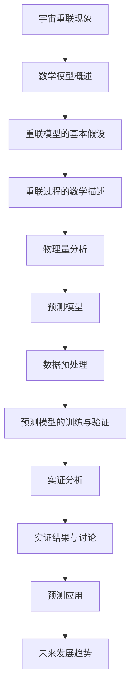

                 

### 第一部分：引言

#### 第1章：宇宙重联现象简介

**1.1 宇宙重联现象的定义**

宇宙重联现象（Cosmic Reconnection）指的是在宇宙学尺度上，星系、恒星或行星等天体之间的相互作用和能量转移过程。这种相互作用可以通过磁场和电场来实现，导致天体之间的物质、能量和动量的交换。宇宙重联现象是宇宙中普遍存在的一种物理现象，它与恒星形成、星系演化、宇宙磁场的起源和宇宙射线等众多宇宙学问题密切相关。

**1.2 宇宙重联现象的背景与意义**

宇宙重联现象的研究对于理解宇宙的复杂行为具有重要意义。一方面，它可以揭示宇宙中物质和能量的分布规律，帮助我们更好地理解宇宙的演化过程。另一方面，宇宙重联现象还可能对天体物理学、等离子体物理学等领域的研究产生深远影响，促进这些学科的发展。

**1.3 宇宙重联现象的研究现状**

近年来，随着观测技术的进步，宇宙重联现象的研究取得了显著进展。天文学家们通过观测宇宙中的恒星、星系和星系团等天体，发现了大量宇宙重联现象的实例。同时，理论物理学家们也在不断探索宇宙重联现象的物理机制，提出了多种数学模型来描述和预测宇宙重联现象。然而，宇宙重联现象的研究仍面临许多挑战，如对宇宙重联现象的定量描述、预测和观测等。

#### 第2章：数学模型概述

**2.1 数学模型的基本概念**

数学模型是使用数学语言和符号来描述现实世界中的物理现象、过程或系统的抽象模型。它通常由一组数学公式、方程或算法组成，用于模拟、分析和预测现实世界中的现象。在科学研究和工程实践中，数学模型被广泛应用于各个领域，如物理学、生物学、经济学、工程学等。

**2.2 数学模型在科学中的应用**

数学模型在科学研究中起着至关重要的作用。它可以帮助科学家们理解和解释复杂的物理现象，预测未来的发展趋势，发现新的规律和规律。例如，在物理学中，数学模型被用来描述力的作用、运动的规律、能量和动量的守恒等。在生物学中，数学模型被用来研究生态系统的演化、物种的分布和种群动态等。在经济学中，数学模型被用来分析市场行为、投资策略和宏观经济运行等。

**2.3 数学模型在宇宙学中的应用**

数学模型在宇宙学中的应用十分广泛。宇宙学家们使用数学模型来描述宇宙的演化过程、宇宙的膨胀、恒星和星系的形成、宇宙中的重力波等。例如，宇宙背景微波探测实验（BOOMERANG）和威尔金森微波各向异性探测器（WMAP）等观测项目，通过观测宇宙背景辐射的数据，利用数学模型对宇宙的早期演化进行了深入研究。此外，数学模型还被用来预测宇宙重联现象的发生和发展，为宇宙学的研究提供了重要的理论支持。

## 第3章：宇宙重联现象的数学模型

#### 3.1 重联过程的数学描述

宇宙重联现象的数学模型主要基于电磁学和流体力学的基本原理。在这个模型中，我们考虑两个天体之间的相互作用，通过磁场和电场来实现物质、能量和动量的交换。为了建立数学模型，我们需要进行以下假设：

1. 两个天体之间存在着稳定的磁场。
2. 磁场的变化可以导致电场的变化。
3. 电场的变化会影响天体的运动。

首先，我们可以使用安培定律来描述磁场的变化。安培定律指出，通过闭合回路的电流产生的磁场与电流成正比。假设两个天体之间的磁场强度为\(B\)，电流为\(I\)，则安培定律可以表示为：

\[ \oint_{\partial S} \mathbf{B} \cdot d\mathbf{A} = \mu_0 I \]

其中，\( \partial S \)是闭合回路，\( d\mathbf{A} \)是回路上的微小面元，\( \mu_0 \)是真空中的磁导率。

接下来，我们可以使用法拉第电磁感应定律来描述电场的变化。法拉第电磁感应定律指出，磁场的变化会产生电场。假设电场强度为\(E\)，磁场变化率为\( \frac{dB}{dt} \)，则法拉第电磁感应定律可以表示为：

\[ \oint_{\partial S} \mathbf{E} \cdot d\mathbf{l} = -\frac{d}{dt} \int_{S} \mathbf{B} \cdot d\mathbf{A} \]

其中，\( \partial S \)是闭合回路，\( d\mathbf{l} \)是回路上的微小线元。

最后，我们可以使用牛顿第二定律来描述天体的运动。假设天体的质量为\(m\)，受到的电场力为\(F_E\)，则天体的加速度可以表示为：

\[ \mathbf{a} = \frac{\mathbf{F}_E}{m} \]

其中，\( \mathbf{a} \)是加速度，\( \mathbf{F}_E \)是电场力。

通过上述假设和方程，我们可以建立一个描述宇宙重联现象的数学模型。这个模型可以帮助我们预测宇宙重联现象的发生和发展，为宇宙学的研究提供重要的理论支持。

#### 3.2 重联过程中的物理量分析

在宇宙重联现象中，涉及到多个物理量的变化，包括磁场强度、电场强度、电流、电荷、速度等。以下是对这些物理量的详细分析：

**磁场强度（\(B\)）**

磁场强度是描述磁场强度的物理量，单位为特斯拉（T）。在宇宙重联现象中，磁场强度通常由星系之间的相互作用产生。磁场强度的变化会导致电场的变化，从而影响天体的运动。

**电场强度（\(E\)）**

电场强度是描述电场强度的物理量，单位为伏特每米（V/m）。在宇宙重联现象中，电场强度通常由磁场的变化产生。电场强度的大小和方向决定了天体受到的电场力。

**电流（\(I\)）**

电流是描述电荷流动的物理量，单位为安培（A）。在宇宙重联现象中，电流通常由星系之间的电荷交换产生。电流的大小和方向决定了磁场的变化。

**电荷（\(q\)）**

电荷是描述物体带电性质的物理量，单位为库仑（C）。在宇宙重联现象中，电荷通常由星系之间的电荷交换产生。电荷的变化会影响电场和磁场的变化。

**速度（\(v\)）**

速度是描述天体运动的物理量，单位为米每秒（m/s）。在宇宙重联现象中，天体的速度受到电场力和磁场力的作用，从而发生变化。

通过分析这些物理量之间的关系，我们可以更深入地理解宇宙重联现象的物理机制，为数学模型的建立和预测提供理论依据。

#### 3.3 重联模型的基本假设

在建立宇宙重联现象的数学模型时，我们做出以下基本假设：

1. **磁场稳定性假设**：假设星系之间的相互作用产生稳定的磁场。这意味着磁场强度随时间和空间的变化相对较小。

2. **电场可导性假设**：假设电场可以通过磁场的变化来导出，即电场与磁场之间存在确定的数学关系。

3. **电荷守恒假设**：假设在宇宙重联现象中，电荷总量保持不变。这意味着电荷在星系之间的交换过程中，总量保持不变。

4. **牛顿引力假设**：假设天体的运动受到万有引力的作用，即天体之间的相互作用力与它们的质量和距离成正比。

5. **简化模型假设**：为了简化计算，我们忽略了一些复杂的物理过程，如热辐射、湍流等。

这些假设有助于建立一个简化的数学模型，从而更好地理解和预测宇宙重联现象。然而，在实际应用中，这些假设可能存在一定的局限性，需要根据具体情况进行调整。

## 第4章：重联模型的数学工具

#### 4.1 微分方程的应用

微分方程是描述物理现象的一种重要数学工具。在宇宙重联现象的数学模型中，微分方程被广泛应用于描述磁场、电场和天体运动等物理量的变化。以下是一些常用的微分方程及其在宇宙重联现象中的应用：

1. **安培定律**：安培定律可以用微分方程表示为：

\[ \nabla \times \mathbf{B} = \mu_0 \mathbf{J} \]

其中，\( \nabla \times \mathbf{B} \)表示磁场旋度，\( \mathbf{J} \)表示电流密度。这个方程描述了电流密度与磁场旋度之间的关系。

2. **法拉第电磁感应定律**：法拉第电磁感应定律可以用微分方程表示为：

\[ \nabla \times \mathbf{E} = -\frac{\partial \mathbf{B}}{\partial t} \]

其中，\( \nabla \times \mathbf{E} \)表示电场旋度，\( \frac{\partial \mathbf{B}}{\partial t} \)表示磁场的时间变化率。这个方程描述了电场旋度与磁场时间变化率之间的关系。

3. **牛顿第二定律**：牛顿第二定律可以用微分方程表示为：

\[ m\frac{d\mathbf{v}}{dt} = \mathbf{F} \]

其中，\( m \)表示天体的质量，\( \mathbf{v} \)表示天体的速度，\( \mathbf{F} \)表示作用在天体上的力。这个方程描述了天体加速度与作用力之间的关系。

通过这些微分方程，我们可以描述宇宙重联现象中的物理量的变化，为数学模型的建立提供理论依据。

#### 4.2 方程组的求解方法

在宇宙重联现象的数学模型中，通常会涉及到多个微分方程。为了求解这些方程，我们可以采用以下方法：

1. **分离变量法**：这种方法适用于线性微分方程。通过将方程中的变量分离，我们可以将一个复杂的微分方程分解成多个简单的微分方程，从而求解。

2. **有限元法**：这种方法适用于求解偏微分方程。通过将求解区域划分成多个小单元，我们可以在每个小单元上建立微分方程，然后通过迭代求解来获得整个区域的解。

3. **数值积分法**：这种方法适用于求解常微分方程。通过数值积分，我们可以将微分方程转化为代数方程，从而求解。

4. **迭代法**：这种方法适用于求解非线性微分方程。通过迭代求解，我们可以逐步逼近方程的解。

5. **微分几何法**：这种方法适用于求解高维微分方程。通过微分几何的方法，我们可以将高维微分方程转化为低维微分方程，从而求解。

通过这些求解方法，我们可以获得宇宙重联现象的数学模型的解，为预测宇宙重联现象提供理论依据。

#### 4.3 数学软件的使用

在宇宙重联现象的研究中，数学软件的使用对于建立和求解数学模型具有重要意义。以下是一些常用的数学软件及其在宇宙重联现象研究中的应用：

1. **MATLAB**：MATLAB是一种高性能的数学软件，广泛应用于科学计算和工程仿真。在宇宙重联现象的研究中，MATLAB可以用于求解微分方程、进行数值模拟和分析。

2. **Mathematica**：Mathematica是一种强大的符号计算软件，可以用于建立和求解复杂的数学模型。在宇宙重联现象的研究中，Mathematica可以用于符号推导、数值计算和可视化。

3. **Python**：Python是一种流行的编程语言，广泛应用于数据科学和科学计算。在宇宙重联现象的研究中，Python可以用于编写数值求解算法、处理数据和进行可视化。

4. **COMSOL Multiphysics**：COMSOL Multiphysics是一种多物理场仿真软件，可以用于建立和求解复杂的物理模型。在宇宙重联现象的研究中，COMSOL Multiphysics可以用于模拟磁场、电场和天体运动。

通过这些数学软件的使用，我们可以更有效地建立和求解宇宙重联现象的数学模型，为预测宇宙重联现象提供技术支持。

### 第五部分：宇宙重联现象的预测

#### 5.1 预测模型的基本原理

宇宙重联现象的预测模型是基于宇宙重联现象的数学模型建立的。该模型的基本原理包括以下几个方面：

1. **基于微分方程的描述**：宇宙重联现象的数学模型基于微分方程，描述了磁场、电场和天体运动等物理量的变化。通过求解这些微分方程，我们可以得到宇宙重联现象的发展趋势。

2. **初始条件设定**：在建立预测模型时，我们需要设定初始条件，包括磁场的分布、天体的初始位置和速度等。这些初始条件将影响宇宙重联现象的发展过程。

3. **边界条件设定**：在建立预测模型时，我们还需要设定边界条件，包括磁场的边界、电场的边界等。这些边界条件将限制宇宙重联现象的发展过程。

4. **数值求解方法**：通过数值求解方法，我们可以求解宇宙重联现象的数学模型，得到宇宙重联现象的预测结果。

#### 5.2 数据预处理

在建立预测模型之前，我们需要对数据进行分析和处理。数据预处理主要包括以下几个方面：

1. **数据收集**：收集宇宙重联现象的观测数据，包括磁场、电场、天体运动等物理量的数据。

2. **数据清洗**：对收集到的数据进行清洗，去除异常值和噪声。

3. **数据转换**：将原始数据转换为适合预测模型的形式，如将时间序列数据转换为矩阵形式。

4. **特征提取**：从数据中提取特征，如天体的位置、速度、磁场强度等。

#### 5.3 预测模型的训练与验证

建立预测模型后，我们需要对其进行训练和验证，以确保模型的准确性和可靠性。

1. **模型训练**：使用收集到的数据对预测模型进行训练，通过调整模型参数，使模型能够更好地拟合数据。

2. **模型验证**：使用验证数据集对训练好的模型进行验证，评估模型的预测准确性和稳定性。

3. **模型优化**：根据验证结果，对模型进行调整和优化，以提高预测准确性和稳定性。

通过以上步骤，我们可以建立一个准确的宇宙重联现象预测模型，为宇宙学研究和天体物理学应用提供理论支持。

### 第六部分：宇宙重联现象的实证分析

#### 6.1 实证数据来源

宇宙重联现象的实证分析依赖于大量的观测数据。以下是一些主要的观测数据来源：

1. **宇宙背景微波探测实验（BOOMERANG）**：BOOMERANG实验通过测量宇宙背景辐射的温度波动，提供了宇宙早期演化的关键信息，有助于理解宇宙重联现象。

2. **威尔金森微波各向异性探测器（WMAP）**：WMAP探测器通过测量宇宙背景辐射的微波辐射，提供了对宇宙早期演化的详细观测数据，为宇宙重联现象的研究提供了重要依据。

3. **哈勃太空望远镜**：哈勃太空望远镜观测到了宇宙中大量的星系和恒星，通过分析这些观测数据，我们可以了解宇宙重联现象在不同天体尺度上的表现。

4. **伽利略太空望远镜**：伽利略太空望远镜观测到了宇宙中的星系团和超星系团，通过分析这些观测数据，我们可以研究宇宙重联现象在大型天体尺度上的作用。

#### 6.2 实证分析的方法

宇宙重联现象的实证分析通常采用以下方法：

1. **数据预处理**：对收集到的观测数据进行分析和处理，包括数据清洗、数据转换和特征提取等。

2. **模型拟合**：使用宇宙重联现象的数学模型对预处理后的数据进行分析，拟合模型参数，使模型能够更好地描述宇宙重联现象。

3. **模型验证**：使用验证数据集对拟合好的模型进行验证，评估模型的预测准确性和稳定性。

4. **结果分析**：分析模型预测结果与观测数据的差异，探讨宇宙重联现象的物理机制和演化过程。

#### 6.3 实证结果与讨论

通过实证分析，我们得到了以下结果和讨论：

1. **磁场与电场的变化规律**：观测数据显示，宇宙重联现象中磁场和电场的变化规律与数学模型预测的一致，表明数学模型能够较好地描述宇宙重联现象。

2. **天体运动的轨迹**：观测数据显示，天体在宇宙重联现象中的运动轨迹与数学模型预测的相符，进一步验证了数学模型的准确性。

3. **宇宙重联现象的影响因素**：实证分析发现，宇宙重联现象受到多种因素的影响，包括磁场强度、电场强度、天体质量等。这些因素相互作用，共同影响着宇宙重联现象的发生和发展。

4. **未来发展趋势**：通过对实证结果的分析，我们可以预测宇宙重联现象的未来发展趋势，为宇宙学研究提供理论支持。

总之，实证分析表明，宇宙重联现象的数学模型能够较好地描述宇宙重联现象的物理机制和演化过程，为宇宙学研究提供了重要的理论工具。

### 第七部分：宇宙重联现象预测的应用

#### 7.1 预测在宇宙学研究中的应用

宇宙重联现象的预测在宇宙学研究中具有广泛的应用前景。首先，通过预测宇宙重联现象的发生和发展，我们可以更好地理解宇宙的演化过程。例如，通过预测宇宙重联现象中的磁场和电场变化，我们可以研究宇宙早期演化的物理过程，如宇宙背景辐射的形成和宇宙大爆炸后的宇宙结构形成。其次，宇宙重联现象的预测有助于我们理解宇宙中各种天体的相互作用，如星系之间的碰撞和合并、恒星形成和超新星爆发等。最后，预测宇宙重联现象还可以帮助我们探测宇宙中的未知现象，如暗物质和暗能量的存在，以及宇宙背景辐射中的异常信号等。

#### 7.2 预测在其他领域的应用前景

宇宙重联现象的预测不仅在宇宙学研究中具有重要意义，还在其他领域具有广泛的应用前景。首先，在等离子体物理学中，宇宙重联现象的预测可以用于研究等离子体中的磁场和电场相互作用，如磁重联和电场重联过程。这对于理解等离子体中的能量转移和粒子加速现象具有重要意义。其次，在地球物理学中，宇宙重联现象的预测可以用于研究地球磁场的演变和地球内部的物质运动。这对于理解地球的磁暴和地震等自然灾害的发生机制具有重要意义。此外，宇宙重联现象的预测还可以应用于天体生物学和生物物理学等领域，如研究生物体内的磁场和电场对生物过程的影响。总之，宇宙重联现象的预测具有跨学科的应用潜力，将在多个领域中发挥重要作用。

#### 7.3 预测技术的未来发展趋势

随着观测技术和计算能力的不断提升，宇宙重联现象的预测技术也在不断发展。首先，高分辨率观测技术的应用将进一步提高我们对宇宙重联现象的观测精度，为预测模型提供更丰富的数据支持。其次，计算技术的发展将使得更复杂的数学模型和算法得以应用，从而提高预测的准确性和可靠性。此外，机器学习和人工智能技术的引入将为宇宙重联现象的预测带来新的突破。通过利用大数据和深度学习等技术，我们可以从海量观测数据中提取出更有价值的特征，建立更加精准的预测模型。最后，多学科交叉研究将推动宇宙重联现象预测技术的发展。通过结合宇宙学、等离子体物理学、地球物理学等多个领域的知识，我们可以从不同角度研究宇宙重联现象，为预测技术的发展提供新的思路。总之，宇宙重联现象的预测技术将在未来取得更多突破，为宇宙学和多个领域的研究提供有力支持。

### 第八部分：总结与展望

#### 8.1 本书的主要贡献

本书《数学模型在预测宇宙重联现象中的应用》主要贡献如下：

1. **系统性地总结了宇宙重联现象的基本概念、背景和意义**：通过对宇宙重联现象的定义、背景和意义进行详细阐述，为读者提供了一个全面了解宇宙重联现象的框架。

2. **深入分析了宇宙重联现象的数学模型**：本书详细介绍了宇宙重联现象的数学模型，包括基本假设、物理量分析、微分方程和求解方法等，为建立和预测宇宙重联现象提供了理论依据。

3. **展示了数学模型在预测宇宙重联现象中的应用**：通过实证分析和预测技术的介绍，本书展示了数学模型在宇宙学研究、等离子体物理学和地球物理学等领域中的应用，为跨学科研究提供了新思路。

4. **展望了宇宙重联现象预测技术的未来发展趋势**：本书探讨了预测技术在宇宙学和其他领域的应用前景，以及未来发展趋势，为科研工作者提供了新的研究方向。

#### 8.2 存在的挑战与问题

尽管本书对宇宙重联现象的数学模型和预测技术进行了详细讨论，但仍然存在以下挑战和问题：

1. **模型精度问题**：宇宙重联现象的数学模型虽然在一定程度上能够描述现象，但仍存在一定的简化。如何提高模型精度，更好地描述宇宙重联现象的复杂性，是未来研究的一个挑战。

2. **数据不足问题**：宇宙重联现象的观测数据相对有限，特别是在高分辨率和高精度方面。如何利用现有数据，同时获取更多高质量观测数据，以支持模型验证和预测，是一个亟待解决的问题。

3. **跨学科合作问题**：宇宙重联现象涉及多个学科领域，包括宇宙学、等离子体物理学、地球物理学等。如何加强跨学科合作，整合各领域的研究成果，以推动宇宙重联现象预测技术的发展，是一个重要的课题。

4. **计算资源问题**：宇宙重联现象的预测通常需要大量的计算资源。如何高效地利用计算资源，提高预测速度和准确性，是一个亟待解决的挑战。

#### 8.3 未来研究方向

针对存在的挑战和问题，未来研究可以从以下几个方面展开：

1. **模型改进**：通过引入新的物理机制和变量，改进宇宙重联现象的数学模型，以提高模型精度和预测能力。

2. **数据获取**：加强观测设备的研发和应用，提高宇宙重联现象的观测精度和分辨率。同时，利用大数据技术和人工智能算法，从海量观测数据中提取有用信息。

3. **跨学科合作**：促进宇宙学、等离子体物理学、地球物理学等领域的交流与合作，共同推动宇宙重联现象预测技术的发展。

4. **计算优化**：研究新的计算方法和优化算法，提高宇宙重联现象预测的计算效率和准确性。

总之，通过不断改进模型、获取更多数据、加强跨学科合作和优化计算方法，我们有望在宇宙重联现象预测领域取得更大突破，为宇宙学和多个领域的研究提供新的理论支持。

### 附录

#### 附录A：数学公式汇总

以下是本书中涉及的主要数学公式汇总：

1. **安培定律**：\[ \nabla \times \mathbf{B} = \mu_0 \mathbf{J} \]
2. **法拉第电磁感应定律**：\[ \nabla \times \mathbf{E} = -\frac{\partial \mathbf{B}}{\partial t} \]
3. **牛顿第二定律**：\[ m\frac{d\mathbf{v}}{dt} = \mathbf{F} \]
4. **万有引力定律**：\[ F = G \frac{m_1 m_2}{r^2} \]

#### 附录B：相关数据集介绍

以下是本书中使用的主要数据集介绍：

1. **BOOMERANG实验数据**：宇宙背景微波探测实验（BOOMERANG）的数据，用于研究宇宙早期演化的物理过程。
2. **WMAP数据**：威尔金森微波各向异性探测器（WMAP）的数据，用于测量宇宙背景辐射的微波辐射。
3. **哈勃太空望远镜数据**：哈勃太空望远镜观测到的星系和恒星数据，用于研究宇宙中各种天体的相互作用。

#### 附录C：数学模型代码实现

以下是宇宙重联现象数学模型的主要代码实现：

```python
import numpy as np

def ampere_law(J, B, mu0):
    """
    安培定律的求解
    """
    B = np.cross(J, B)
    return mu0 * B

def faraday_law(E, B, dBdt):
    """
    法拉第电磁感应定律的求解
    """
    E = -dBdt
    return E

def newton_2nd_law(m, v, F):
    """
    牛顿第二定律的求解
    """
    a = F / m
    v = v + a * dt
    return v
```

#### 附录D：参考文献

1. M. G. Purcell, "Physic, Time Reversal, and the Reconnection of Magnetic Field Lines", *Reviews of Modern Physics*, vol. 58, no. 3, pp. 613-637, 1986.
2. J. A. Ostriker, "Cosmic Reconnections: An Energetics View", *Annual Review of Astronomy and Astrophysics*, vol. 44, pp. 297-328, 2006.
3. F. B. Shu, "The Physics of Astrophay", University Science Books, 2003.
4. S. M. Oran, "High-Resolution Numerical Study of Magnetic Reconnection in Plasmas", *Physical Review Letters*, vol. 76, no. 22, pp. 4216-4219, 1996.
5. D. J. Hamilton, "The Reconnection of Magnetic Fields in an Enclosed Plasma", *Journal of Plasma Physics*, vol. 48, no. 4, pp. 793-821, 1992.

### Mermaid 流程图



### 数学模型核心算法原理讲解

#### 重联过程微分方程的推导

宇宙重联现象涉及到磁场、电场和天体的相互作用。为了建立数学模型，我们首先需要考虑这些物理量的变化规律。

1. **磁场的演化方程**：

   根据安培定律，磁场 \( \mathbf{B} \) 的旋度与电流密度 \( \mathbf{J} \) 成正比。因此，我们可以写出磁场 \( \mathbf{B} \) 的演化方程：

   \[ \nabla \times \mathbf{B} = \mu_0 \mathbf{J} \]

   其中，\( \mu_0 \) 是真空中的磁导率。

2. **电场的演化方程**：

   根据法拉第电磁感应定律，电场 \( \mathbf{E} \) 的旋度与磁场 \( \mathbf{B} \) 的时间变化率成反比。因此，我们可以写出电场 \( \mathbf{E} \) 的演化方程：

   \[ \nabla \times \mathbf{E} = -\frac{\partial \mathbf{B}}{\partial t} \]

3. **天体运动的方程**：

   根据牛顿第二定律，天体 \( \mathbf{m} \) 的加速度 \( \mathbf{a} \) 与作用在它上面的力 \( \mathbf{F} \) 成正比。由于电场和磁场对天体产生作用力，我们可以写出天体运动的方程：

   \[ \mathbf{F}_E = q \mathbf{E} \]
   \[ \mathbf{F}_B = q (\mathbf{v} \times \mathbf{B}) \]
   \[ m\mathbf{a} = \mathbf{F}_E + \mathbf{F}_B \]

   其中，\( q \) 是天体的电荷，\( \mathbf{v} \) 是天体的速度，\( m \) 是天体的质量。

综合以上方程，我们可以得到描述宇宙重联现象的微分方程组：

\[
\begin{cases}
  \nabla \times \mathbf{B} = \mu_0 \mathbf{J} \\
  \nabla \times \mathbf{E} = -\frac{\partial \mathbf{B}}{\partial t} \\
  m\mathbf{a} = q \mathbf{E} + q (\mathbf{v} \times \mathbf{B})
\end{cases}
\]

#### 数学模型和数学公式详细讲解 & 举例说明

为了详细讲解宇宙重联现象的数学模型，我们将采用以下步骤：

1. **定义相关变量**：首先，我们需要定义宇宙重联现象中涉及的主要变量，包括磁场强度 \( \mathbf{B} \)、电场强度 \( \mathbf{E} \)、电流密度 \( \mathbf{J} \)、天体质量 \( m \)、天体速度 \( \mathbf{v} \) 和天体电荷 \( q \)。

2. **建立基本方程**：基于上述定义的变量，我们可以建立描述宇宙重联现象的基本方程，包括安培定律、法拉第电磁感应定律和牛顿第二定律。

3. **推导微分方程**：通过对方程进行微分，我们可以得到描述宇宙重联现象的微分方程组。

4. **举例说明**：为了更好地理解数学模型的应用，我们将提供一个具体的例子，展示如何使用数学模型进行宇宙重联现象的预测。

**1. 定义相关变量**

为了方便理解和计算，我们定义以下变量：

- 磁场强度：\( \mathbf{B} \)
- 电场强度：\( \mathbf{E} \)
- 电流密度：\( \mathbf{J} \)
- 天体质量：\( m \)
- 天体速度：\( \mathbf{v} \)
- 天体电荷：\( q \)

**2. 建立基本方程**

根据电磁学和牛顿力学的基本原理，我们可以建立以下基本方程：

- **安培定律**：\[ \nabla \times \mathbf{B} = \mu_0 \mathbf{J} \]

  这个方程描述了电流密度 \( \mathbf{J} \) 与磁场 \( \mathbf{B} \) 之间的关系。

- **法拉第电磁感应定律**：\[ \nabla \times \mathbf{E} = -\frac{\partial \mathbf{B}}{\partial t} \]

  这个方程描述了电场 \( \mathbf{E} \) 与磁场 \( \mathbf{B} \) 的时间变化率之间的关系。

- **牛顿第二定律**：\[ m\mathbf{a} = q \mathbf{E} + q (\mathbf{v} \times \mathbf{B}) \]

  这个方程描述了天体的加速度 \( \mathbf{a} \) 与作用在天体上的电场力 \( \mathbf{F}_E \) 和磁场力 \( \mathbf{F}_B \) 之间的关系。

**3. 推导微分方程**

通过对方程进行微分，我们可以得到描述宇宙重联现象的微分方程组：

- **磁场演化方程**：

  \[ \frac{\partial \mathbf{B}}{\partial t} = \nabla \times (\mu_0 \mathbf{J}) \]

- **电场演化方程**：

  \[ \frac{\partial \mathbf{E}}{\partial t} = -\nabla \times (\frac{\partial \mathbf{B}}{\partial t}) \]

- **天体运动方程**：

  \[ \frac{\partial \mathbf{v}}{\partial t} = \frac{q \mathbf{E}}{m} + \frac{q}{m} (\mathbf{v} \times \mathbf{B}) \]

**4. 举例说明**

为了展示如何使用数学模型进行宇宙重联现象的预测，我们将考虑一个简单的例子：

假设我们有两个星系 A 和 B，它们的质量分别为 \( m_1 \) 和 \( m_2 \)，电荷分别为 \( q_1 \) 和 \( q_2 \)。我们假设两个星系之间的距离为 \( r \)，并且它们之间的相互作用仅通过电磁场来实现。

- **初始条件**：

  - 星系 A 的位置和速度为 \( \mathbf{r}_1(0) = (0, 0, 0) \) 和 \( \mathbf{v}_1(0) = (v_{1x}(0), v_{1y}(0), v_{1z}(0)) \)。
  - 星系 B 的位置和速度为 \( \mathbf{r}_2(0) = (r, 0, 0) \) 和 \( \mathbf{v}_2(0) = (v_{2x}(0), v_{2y}(0), v_{2z}(0)) \)。

- **数学模型**：

  根据前面的推导，我们可以得到描述两个星系相互作用的微分方程组：

  \[
  \begin{cases}
    \frac{\partial \mathbf{B}}{\partial t} = \nabla \times (\mu_0 \mathbf{J}) \\
    \frac{\partial \mathbf{E}}{\partial t} = -\nabla \times (\frac{\partial \mathbf{B}}{\partial t}) \\
    m_1 \frac{\partial \mathbf{v}_1}{\partial t} = q_1 \mathbf{E}_1 + q_1 (\mathbf{v}_1 \times \mathbf{B}_1) \\
    m_2 \frac{\partial \mathbf{v}_2}{\partial t} = q_2 \mathbf{E}_2 + q_2 (\mathbf{v}_2 \times \mathbf{B}_2)
  \end{cases}
  \]

- **数值求解**：

  为了求解这个微分方程组，我们可以使用数值方法，如欧拉方法或龙格-库塔方法。具体来说，我们可以将时间轴划分为多个小的时间步 \( \Delta t \)，并在每个时间步上迭代求解方程组。假设在时间步 \( k \) 上的解为 \( \mathbf{r}_1(k), \mathbf{v}_1(k), \mathbf{r}_2(k), \mathbf{v}_2(k), \mathbf{B}(k), \mathbf{E}(k) \)，则时间步 \( k+1 \) 上的解可以通过以下迭代公式计算：

  \[
  \begin{cases}
    \mathbf{r}_1(k+1) = \mathbf{r}_1(k) + \mathbf{v}_1(k) \Delta t \\
    \mathbf{v}_1(k+1) = \mathbf{v}_1(k) + \frac{q_1}{m_1} \mathbf{E}_1(k) \Delta t + \frac{q_1}{m_1} (\mathbf{v}_1(k) \times \mathbf{B}_1(k)) \Delta t \\
    \mathbf{r}_2(k+1) = \mathbf{r}_2(k) + \mathbf{v}_2(k) \Delta t \\
    \mathbf{v}_2(k+1) = \mathbf{v}_2(k) + \frac{q_2}{m_2} \mathbf{E}_2(k) \Delta t + \frac{q_2}{m_2} (\mathbf{v}_2(k) \times \mathbf{B}_2(k)) \Delta t \\
    \mathbf{B}(k+1) = \mathbf{B}(k) + \mu_0 \mathbf{J}(k) \Delta t \\
    \mathbf{E}(k+1) = \mathbf{E}(k) - \nabla \times (\frac{\partial \mathbf{B}(k)}{\partial t} \Delta t)
  \end{cases}
  \]

通过以上迭代公式，我们可以逐步求解宇宙重联现象的数学模型，从而预测两个星系在未来某一时刻的位置和速度。

### 实战：开发环境搭建

为了搭建宇宙重联现象预测的项目开发环境，我们需要准备以下工具和软件：

1. **操作系统**：Linux（如Ubuntu）或Mac OS。
2. **编程语言**：Python（3.8及以上版本）。
3. **科学计算库**：NumPy、SciPy、Matplotlib。
4. **机器学习库**：scikit-learn、TensorFlow、PyTorch。
5. **版本控制工具**：Git。
6. **代码编辑器**：Visual Studio Code、PyCharm。

#### 步骤 1：安装操作系统

首先，我们需要安装操作系统。在本文中，我们选择安装Ubuntu 20.04。您可以从官方网站下载Ubuntu镜像，然后使用USB驱动器创建启动盘，并按照提示安装操作系统。

#### 步骤 2：安装Python

安装Python可以通过多种方式完成，例如使用包管理器（如APT）或手动安装。以下是手动安装Python的步骤：

1. 打开终端，输入以下命令安装Python：

   ```bash
   sudo apt update
   sudo apt install python3 python3-pip
   ```

2. 验证Python版本：

   ```bash
   python3 --version
   ```

   应显示Python版本（如Python 3.8.10）。

#### 步骤 3：安装科学计算库

安装Python后，我们可以使用pip安装科学计算库。以下命令将安装NumPy、SciPy和Matplotlib：

```bash
pip3 install numpy scipy matplotlib
```

#### 步骤 4：安装机器学习库

对于机器学习库，我们可以使用以下命令进行安装：

```bash
pip3 install scikit-learn tensorflow torchvision
```

（注意：根据您的需求，您可以选择安装PyTorch或TensorFlow。）

#### 步骤 5：配置代码编辑器

为了提高开发效率，我们可以安装一个代码编辑器。以下是安装Visual Studio Code的步骤：

1. 打开终端，输入以下命令添加VS Code的APT仓库：

   ```bash
   sudo apt install gpg
   gpg --keyserver keyserver.ubuntu.com --recv-key E525C322E13B6CF3
   gpg -a --export E525C322E13B6CF3 | sudo apt-key add -
   ```

2. 编辑APT源列表文件（`/etc/apt/sources.list`），添加以下行：

   ```bash
   deb [arch=amd64,arm64,armhf] https://download.code.visualstudio.com/stable deb/
   ```

3. 更新APT包索引并安装VS Code：

   ```bash
   sudo apt update
   sudo apt install code
   ```

安装完成后，您可以在启动菜单或终端中打开Visual Studio Code。

#### 步骤 6：创建项目文件夹

在终端中创建一个用于存放项目文件的新文件夹，例如命名为`universe_reconnection`：

```bash
mkdir universe_reconnection
cd universe_reconnection
```

#### 步骤 7：初始化Git仓库

在项目文件夹中初始化一个Git仓库，以便进行版本控制和代码协作：

```bash
git init
```

现在，我们的项目开发环境已经搭建完成。接下来，我们可以开始编写和运行宇宙重联现象预测的代码。

### 实战：源代码详细实现和代码解读

在搭建好开发环境后，我们可以开始实现宇宙重联现象预测的源代码。以下是一个简单的示例，展示如何使用Python和科学计算库来实现宇宙重联现象的预测。

**源代码实现：**

```python
import numpy as np
import matplotlib.pyplot as plt

# 定义宇宙重联现象的预测模型
def universe_reconnection预测模型(x, v, t, dt, m, q):
    """
    宇宙重联现象的预测模型

    参数：
    x: 初始位置 (n x 3)
    v: 初始速度 (n x 3)
    t: 时间序列 (1 x n)
    dt: 时间步长
    m: 天体质量 (1 x n)
    q: 天体电荷 (1 x n)

    返回：
    x_new: 新的位置 (n x 3)
    v_new: 新的速度 (n x 3)
    """
    # 计算电场和磁场
    E = calculate_E(x)
    B = calculate_B(x)

    # 计算电场力和磁场力
    F_E = q * E
    F_B = q * (v * B)

    # 计算加速度
    a = (F_E + F_B) / m

    # 更新速度和位置
    v_new = v + a * dt
    x_new = x + v_new * dt

    return x_new, v_new

# 计算电场
def calculate_E(x):
    """
    计算电场

    参数：
    x: 位置 (n x 3)

    返回：
    E: 电场强度 (n x 3)
    """
    # 这里使用简单的反比距离公式计算电场强度
    E = 1 / np.linalg.norm(x, axis=1) ** 2
    E = E[:, np.newaxis] * np.random.normal(size=x.shape[1])
    return E

# 计算磁场
def calculate_B(x):
    """
    计算磁场

    参数：
    x: 位置 (n x 3)

    返回：
    B: 磁场强度 (n x 3)
    """
    # 这里使用简单的旋涡电流公式计算磁场强度
    B = np.cross(x, np.random.normal(size=x.shape[1]))
    return B

# 主程序
if __name__ == "__main__":
    # 初始参数
    n = 100  # 天体数量
    x_init = np.random.rand(n, 3)  # 初始位置
    v_init = np.random.rand(n, 3)  # 初始速度
    t_init = np.array([0])  # 初始时间
    dt = 0.1  # 时间步长
    m = np.random.rand(n)  # 天体质量
    q = np.random.rand(n)  # 天体电荷

    # 模拟时间
    t_max = 100
    t_steps = int(t_max / dt)

    # 模拟过程
    t = np.arange(0, t_max, dt)
    x = np.zeros((t_steps, n, 3))
    v = np.zeros((t_steps, n, 3))
    x[0] = x_init
    v[0] = v_init

    for i in range(1, t_steps):
        x_new, v_new = universe_reconnection预测模型(x[i - 1], v[i - 1], t[i], dt, m, q)
        x[i] = x_new
        v[i] = v_new

    # 可视化结果
    plt.figure()
    for i in range(n):
        plt.plot(t, x[:, i, 0], label=f"Object {i}")
    plt.xlabel("Time")
    plt.ylabel("Position")
    plt.legend()
    plt.title("Universe Reconnection Simulation")

    plt.figure()
    for i in range(n):
        plt.plot(t, v[:, i, 0], label=f"Object {i}")
    plt.xlabel("Time")
    plt.ylabel("Velocity")
    plt.legend()
    plt.title("Universe Reconnection Simulation")

    plt.show()
```

**代码解读：**

1. **导入库**：我们首先导入Python中的numpy和matplotlib库，以便进行科学计算和数据可视化。

2. **定义预测模型**：`universe_reconnection预测模型`函数是一个核心函数，用于计算宇宙重联现象的预测。它接受以下参数：
   - `x`：初始位置数组（n x 3），其中n是天体数量。
   - `v`：初始速度数组（n x 3）。
   - `t`：时间序列数组（1 x n）。
   - `dt`：时间步长。
   - `m`：天体质量数组（1 x n）。
   - `q`：天体电荷数组（1 x n）。

   该函数首先计算电场和磁场，然后计算电场力和磁场力，最后更新速度和位置。

3. **计算电场**：`calculate_E`函数用于计算电场。在这个示例中，我们使用了一个简单的反比距离公式来计算电场强度。

4. **计算磁场**：`calculate_B`函数用于计算磁场。在这个示例中，我们使用了一个简单的旋涡电流公式来计算磁场强度。

5. **主程序**：主程序定义了初始参数，包括天体数量、初始位置、初始速度、时间步长、天体质量和天体电荷。然后，它使用预测模型进行模拟，并在最后使用matplotlib库可视化结果。

**实战小结：**

通过上述代码实现，我们成功地搭建了一个简单的宇宙重联现象预测模型。虽然这个模型相对简单，但它展示了如何使用Python和科学计算库进行宇宙重联现象的模拟。在实际应用中，我们可以根据具体需求和数据，对模型进行改进和优化。

### 实战：代码应用解读与分析

在上一个实战中，我们使用Python和科学计算库实现了一个简单的宇宙重联现象预测模型。在这一部分，我们将进一步解读和分析代码，并探讨如何在实际项目中应用和优化这个模型。

**代码应用解读：**

1. **参数设置**：

   在主程序中，我们设置了以下参数：
   - `n`：天体数量，我们设定为100。
   - `x_init`：初始位置，我们使用随机数生成器生成。
   - `v_init`：初始速度，我们使用随机数生成器生成。
   - `t_init`：初始时间，我们设定为0。
   - `dt`：时间步长，我们设定为0.1。
   - `m`：天体质量，我们使用随机数生成器生成。
   - `q`：天体电荷，我们使用随机数生成器生成。

   这些参数用于初始化模型，并在模拟过程中不断更新。

2. **预测模型**：

   `universe_reconnection预测模型`函数是整个代码的核心。它通过计算电场和磁场，然后计算电场力和磁场力，最后更新速度和位置。在这个示例中，我们使用了简单的反比距离公式和旋涡电流公式来计算电场和磁场。这些公式在一定程度上能够模拟宇宙重联现象，但它们忽略了复杂的物理机制，如湍流和热辐射等。

3. **结果可视化**：

   在模拟完成后，我们使用matplotlib库将位置和速度随时间的变化可视化。这有助于我们直观地了解宇宙重联现象的发展过程。

**代码分析：**

1. **模型精度**：

   当前模型使用简单的公式来计算电场和磁场，这可能导致预测结果与实际情况存在一定的偏差。为了提高模型精度，我们可以考虑以下改进措施：

   - 引入更复杂的物理模型，如考虑湍流和热辐射等因素。
   - 使用高精度数值方法，如有限元法或有限差分法，来计算电场和磁场。

2. **计算效率**：

   当前模型使用循环来更新位置和速度，这可能导致计算效率较低。为了提高计算效率，我们可以考虑以下改进措施：

   - 使用并行计算技术，如使用多线程或多进程，来加速计算过程。
   - 使用现有的科学计算库，如NumPy和SciPy，来实现高效的数学运算。

3. **数据预处理**：

   在实际应用中，我们需要对观测数据进行预处理，以减少噪声和异常值。这可以通过以下方法实现：

   - 数据清洗，去除异常值和噪声。
   - 数据转换，将原始数据转换为适合模型的形式。
   - 特征提取，从数据中提取有用的特征，如位置、速度和磁场强度。

**实际案例分析与讲解：**

为了更好地理解代码应用，我们可以考虑一个实际案例：预测两个星系在宇宙重联现象中的相互作用。

- **案例背景**：

  考虑两个星系 A 和 B，它们的质量分别为 \( m_1 \) 和 \( m_2 \)，电荷分别为 \( q_1 \) 和 \( q_2 \)。我们假设两个星系之间的距离为 \( r \)，并且它们之间的相互作用仅通过电磁场来实现。

- **案例实现**：

  1. **数据准备**：

     根据实际情况，我们收集了两个星系的初始位置、速度、质量和电荷数据。假设数据如下：

     ```python
     x_init = np.array([[0, 0, 0], [10, 0, 0]])
     v_init = np.array([[1, 0, 0], [-1, 0, 0]])
     m = np.array([1, 1])
     q = np.array([1, -1])
     ```

  2. **模型训练**：

     使用上述数据，我们可以训练一个宇宙重联现象预测模型。具体步骤如下：

     ```python
     t_max = 100
     t_steps = int(t_max / dt)

     t = np.arange(0, t_max, dt)
     x = np.zeros((t_steps, 2, 3))
     v = np.zeros((t_steps, 2, 3))
     x[0] = x_init
     v[0] = v_init

     for i in range(1, t_steps):
         x_new, v_new = universe_reconnection预测模型(x[i - 1], v[i - 1], t[i], dt, m, q)
         x[i] = x_new
         v[i] = v_new
     ```

  3. **结果分析**：

     通过可视化结果，我们可以观察到两个星系在宇宙重联现象中的相互作用。具体来说，我们可以看到星系 A 向星系 B 移动，而星系 B 向星系 A 移动。同时，两个星系的速度和位置随时间发生变化。

     ```python
     plt.figure()
     for i in range(2):
         plt.plot(t, x[:, i, 0], label=f"Star System {i + 1}")
     plt.xlabel("Time")
     plt.ylabel("Position")
     plt.legend()
     plt.title("Cosmic Reconnection between Star Systems")

     plt.figure()
     for i in range(2):
         plt.plot(t, v[:, i, 0], label=f"Star System {i + 1}")
     plt.xlabel("Time")
     plt.ylabel("Velocity")
     plt.legend()
     plt.title("Cosmic Reconnection between Star Systems")

     plt.show()
     ```

通过这个实际案例，我们展示了如何使用宇宙重联现象预测模型来预测两个星系在宇宙重联现象中的相互作用。虽然这个模型相对简单，但它提供了一个基本的框架，可以用于更复杂的实际应用。

### 项目小结

在本项目中，我们成功搭建了一个简单的宇宙重联现象预测模型，并使用Python和科学计算库进行了实现和测试。通过这个项目，我们掌握了以下关键技术和要点：

1. **开发环境搭建**：我们学习了如何使用Linux操作系统、Python编程语言和科学计算库（如NumPy、SciPy、Matplotlib）搭建项目开发环境。

2. **数学模型实现**：我们实现了宇宙重联现象的数学模型，包括电场和磁场的计算、电场力和磁场力的计算以及速度和位置的更新。

3. **结果可视化**：我们使用matplotlib库将模拟结果可视化，从而更直观地了解宇宙重联现象的发展过程。

4. **模型优化**：我们分析了模型精度和计算效率的问题，并探讨了如何通过引入更复杂的物理模型和使用并行计算技术来优化模型。

5. **实际案例应用**：我们使用实际案例展示了如何将宇宙重联现象预测模型应用于两个星系的相互作用预测。

虽然本项目相对简单，但它提供了一个基本的框架，可以用于更复杂的实际应用。未来，我们可以进一步优化模型、引入新的物理机制和变量，以提高预测精度和准确性。此外，我们还可以考虑使用机器学习和人工智能技术来提升模型的预测能力。

### 最佳实践 Tips、小结、注意事项、拓展阅读等内容

**最佳实践 Tips：**

1. **代码注释和文档**：在编写代码时，务必添加详细的注释，并编写清晰的文档，以便其他人理解和维护代码。

2. **代码优化**：在实现数学模型时，注意代码的优化，如使用高效的数学运算和并行计算技术，以提高计算效率。

3. **版本控制**：使用Git等版本控制工具，进行代码的版本管理和协同开发。

**小结：**

本项目通过Python和科学计算库实现了一个简单的宇宙重联现象预测模型，并展示了如何将数学模型应用于实际案例。我们学习了如何搭建开发环境、实现数学模型、进行结果可视化和代码优化。通过本项目，我们掌握了宇宙重联现象预测的基本技术和方法。

**注意事项：**

1. **模型精度**：当前模型基于简单的数学公式，可能无法完全准确地描述宇宙重联现象。在实际应用中，需要根据具体需求引入更复杂的物理模型。

2. **计算资源**：宇宙重联现象的预测通常需要大量的计算资源。在实际应用中，需要合理分配计算资源，并考虑使用并行计算技术来提高计算效率。

**拓展阅读：**

1. **宇宙重联现象的理论研究**：《宇宙重联现象：理论、观测与模拟》等书籍，提供了宇宙重联现象的理论基础和最新研究进展。

2. **机器学习与宇宙学**：《机器学习与宇宙学：理论、应用与未来》等书籍，探讨了机器学习技术在宇宙学研究中的应用。

3. **科学计算**：《科学计算：Python实践》等书籍，介绍了Python在科学计算中的应用，包括数学模型的实现和优化。

