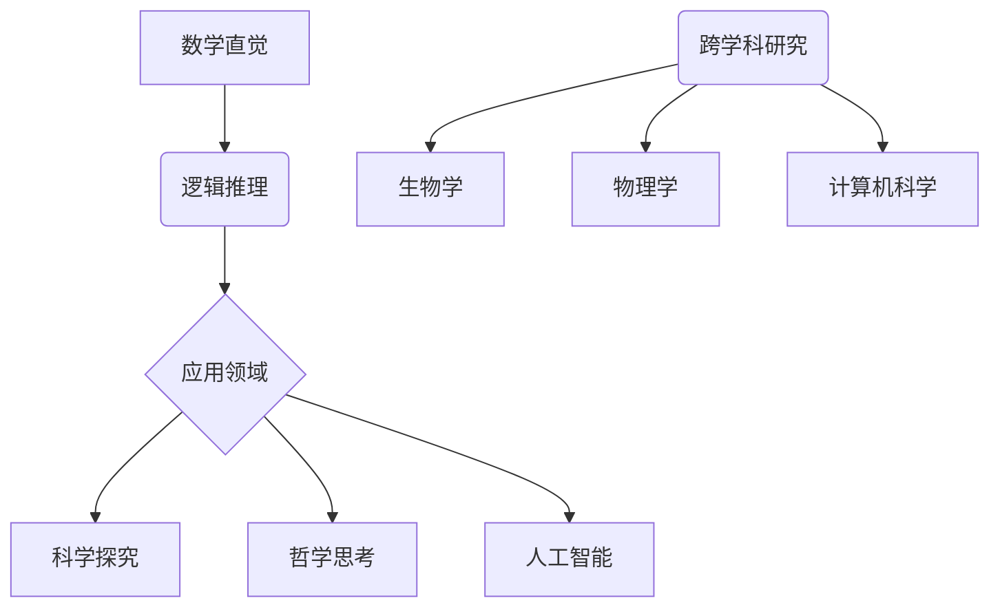

                 

### 文章标题

数学直觉与逻辑推理的关系探讨

### 关键词

数学直觉、逻辑推理、关系探讨、数学发展、逻辑思维

### 摘要

本文旨在探讨数学直觉与逻辑推理之间的关系，深入分析数学直觉的定义、重要性及其历史发展，以及逻辑推理的基本原则和应用。文章通过逐步推理，揭示数学直觉与逻辑推理的相互影响与协同发展，探讨二者在实际问题中的应用，以及教育中的意义。最后，通过案例分析与应用，进一步阐述数学直觉与逻辑推理在实际项目中的作用和重要性。本文旨在为读者提供一个全面、深入的关于数学直觉与逻辑推理关系的理解。

## 第一部分：数学直觉概述

### 第1章：数学直觉的定义与重要性

#### 1.1 数学直觉的定义

数学直觉是指人们在解决数学问题时，通过非正式的、直接的理解方式，快速识别和把握数学结构和原理的能力。数学直觉不是通过逻辑推理或证明得出的，而是通过长期的数学实践和思考逐渐形成的一种敏锐洞察力和直觉判断力。

#### 1.2 数学直觉的重要性

数学直觉在数学发展中起着至关重要的作用。首先，数学直觉帮助数学家发现新的数学结构和理论，推动数学的进步。许多重大的数学发现，如费马的最后定理、哥德尔的不完备性定理，都是通过数学直觉实现的。其次，数学直觉在数学教育中也非常重要，它能够帮助学生更好地理解和掌握数学知识，提高数学思维能力。

#### 1.3 数学直觉与日常生活的联系

数学直觉不仅存在于专业数学领域，也渗透到我们的日常生活中。例如，我们在购物时能够快速估算价格，在安排日程时能够合理分配时间，这些能力的背后都是数学直觉的体现。数学直觉在我们的工作和生活中起到了重要的作用，帮助我们在复杂的环境中做出快速、准确的判断。

### 第2章：数学直觉的历史与发展

#### 2.1 数学直觉的起源

数学直觉的起源可以追溯到古代，当时的人们通过观察自然现象，逐步形成了对数字和几何形状的认识。例如，古埃及人和古巴比伦人通过实际测量和计算，建立了早期的数学体系。

#### 2.2 数学直觉在历史发展中的作用

数学直觉在历史发展过程中发挥了重要作用。古希腊的数学家，如欧几里得和阿基米德，通过数学直觉发现了许多重要的几何定理和物理定律。中世纪的阿拉伯数学家，如阿尔-花拉子米，通过数学直觉推动了代数学的发展。

#### 2.3 数学直觉与现代数学的关系

现代数学的发展离不开数学直觉。许多现代数学分支，如拓扑学、集合论和泛函分析，都是通过数学家的直觉思维得以建立和发展的。数学直觉在数学研究中的重要性得到了广泛的认可，它成为数学创新和突破的重要动力。

## 第二部分：逻辑推理概述

### 第3章：逻辑推理的定义与基本原则

#### 3.1 逻辑推理的定义

逻辑推理是指从已知的前提出发，通过一系列的逻辑步骤，推导出新的结论的过程。逻辑推理是一种理性的思维方式，它基于逻辑规则和事实，确保结论的合理性和可靠性。

#### 3.2 逻辑推理的基本原则

逻辑推理的基本原则包括以下几项：

1. **同一律**：在同一思维过程中，对于同一对象，其自身属性保持不变。
2. **矛盾律**：在同一思维过程中，一个命题不能同时为真和假。
3. **排中律**：在同一思维过程中，一个命题要么为真，要么为假。

#### 3.3 逻辑推理的类型

逻辑推理可以分为演绎推理和归纳推理两种类型。

- **演绎推理**：从一般到个别的推理过程，它确保结论的真实性依赖于前提的真实性。例如，所有人都会死亡，苏格拉底是人，因此苏格拉底会死亡。
- **归纳推理**：从个别到一般的推理过程，它基于一系列特定实例，推断出一个普遍规律。例如，观察许多天鹅都是白色的，推断所有天鹅都是白色的。

### 第4章：逻辑推理的应用与发展

#### 4.1 逻辑推理在科学探究中的应用

逻辑推理在科学探究中起着核心作用。科学家通过逻辑推理，从观察和实验中提取信息，提出假设，并通过实验验证假设的正确性。例如，伽利略通过逻辑推理，提出了地球绕太阳公转的理论。

#### 4.2 逻辑推理在哲学思考中的作用

逻辑推理在哲学思考中有着重要的地位。哲学家通过逻辑推理，探讨存在的本质、知识的来源和道德的原则。例如，亚里士多德通过逻辑推理，建立了形而上学和伦理学的理论体系。

#### 4.3 逻辑推理在人工智能领域的应用

逻辑推理在人工智能领域有着广泛的应用。人工智能系统通过逻辑推理，实现推理机、专家系统和自然语言处理等功能。例如，人工智能系统可以通过逻辑推理，解决复杂的逻辑问题，如八皇后问题和谜题游戏。

## 第三部分：数学直觉与逻辑推理的关系探讨

### 第5章：数学直觉与逻辑推理的相互关系

#### 5.1 数学直觉对逻辑推理的影响

数学直觉对逻辑推理有着深远的影响。数学直觉能够帮助数学家快速识别问题的核心，发现问题的解决方案。例如，费马通过数学直觉，发现了费马最后定理的解法，尽管他未能给出完整的证明。

#### 5.2 逻辑推理对数学直觉的形成作用

逻辑推理对数学直觉的形成也起着重要作用。逻辑推理能够帮助数学家从理论上严格地验证和解释数学直觉。例如，哥德尔的不完备性定理，通过逻辑推理，证明了数学系统中的某些命题既不能证明也不能证伪。

#### 5.3 数学直觉与逻辑推理的协同发展

数学直觉与逻辑推理相互促进，共同推动数学的发展。数学直觉提供了创新的思维方式和解决问题的途径，而逻辑推理则为数学直觉提供了理论依据和验证手段。例如，在解决复杂的数学问题时，数学家通常会先利用直觉找到可能的解法，然后通过逻辑推理进行证明和验证。

### 第6章：数学直觉与逻辑推理在实际问题中的应用

#### 6.1 数学直觉在解决逻辑推理问题中的应用

数学直觉在解决逻辑推理问题中发挥着重要作用。例如，在解决谜题和数学难题时，数学家通常会依靠直觉来找到解题的关键步骤。例如，哥德尔在证明不完备性定理时，就是依靠直觉找到了关键的反证法。

#### 6.2 逻辑推理在发现数学直觉中的应用

逻辑推理在发现数学直觉中也起着关键作用。例如，在解决复杂的数学问题时，数学家通常会利用逻辑推理来验证他们的直觉是否正确。例如，欧拉在证明欧拉公式时，就是利用逻辑推理证明了复数的指数性质。

#### 6.3 数学直觉与逻辑推理在创新思维中的作用

数学直觉与逻辑推理在创新思维中具有重要作用。数学家通过直觉和逻辑推理，能够发现新的数学结构和理论，推动数学的进步。例如，现代数学中的许多重要理论，如拓扑学、泛函分析和量子数学，都是通过数学家的直觉和逻辑推理得到的。

### 第7章：数学直觉与逻辑推理的教育意义

#### 7.1 数学直觉与逻辑推理在教育中的重要性

数学直觉与逻辑推理在教育中具有极其重要的意义。它们不仅能够提高学生的数学思维能力，还能够培养学生的逻辑推理能力和创新思维。通过数学直觉和逻辑推理的教学，学生能够更好地理解和掌握数学知识，提高解题能力和创造力。

#### 7.2 教育实践中培养数学直觉与逻辑推理的方法

在数学教育中，培养数学直觉和逻辑推理能力的方法包括：

1. **引导学生进行探索和发现**：通过让学生参与数学实验和探究活动，激发他们的数学直觉。
2. **加强逻辑推理训练**：通过练习逻辑推理题和证明题目，提高学生的逻辑推理能力。
3. **结合实际问题**：通过解决实际问题，将数学直觉和逻辑推理应用于实际问题中，提高学生的应用能力。

#### 7.3 数学直觉与逻辑推理教育的未来发展趋势

随着科技的发展和教育理念的更新，数学直觉与逻辑推理教育将呈现以下发展趋势：

1. **跨学科融合**：数学直觉和逻辑推理教育将与其他学科相结合，培养具有跨学科能力的复合型人才。
2. **个性化教育**：通过大数据分析和个性化教学，针对学生的不同特点，提供个性化的数学直觉和逻辑推理培养方案。
3. **教育技术的应用**：利用虚拟现实、人工智能等先进技术，提高数学直觉和逻辑推理教育的效果和互动性。

## 第四部分：案例分析与应用

### 第8章：数学直觉与逻辑推理的实际案例分析

#### 8.1 案例一：哥德尔不完备性定理的证明过程

哥德尔不完备性定理是数学和逻辑学中一个重要的里程碑。哥德尔通过构造形式系统，利用数学直觉和逻辑推理，证明了在任何足够强的形式系统中，都存在既不能证明也不能证伪的命题。

首先，哥德尔提出了两个命题：P（命题P是可证明的）和NP（命题P是不可证明的）。他通过构造编码系统，将命题和证明编码为自然数，然后利用逻辑推理，证明了P和NP的不可判定性。

这一证明过程展示了数学直觉和逻辑推理的协同作用。哥德尔通过数学直觉，发现了形式系统中的矛盾和漏洞，然后利用逻辑推理，严格证明了这些漏洞的存在，从而揭示了形式系统的局限性和数学的不完备性。

#### 8.2 案例二：数学家费马的最后定理证明

费马的最后定理是数学史上最著名的未解难题之一，直到1994年才被英国数学家安德鲁·怀尔斯证明。费马的最后定理指出，对于任何大于2的自然数n，方程\(a^n + b^n = c^n\)没有正整数解。

怀尔斯的证明过程是一个复杂的逻辑推理过程。他首先提出了一个重要的猜想，即椭圆曲线猜想，然后利用这个猜想和已有的数学理论，通过一系列的逻辑推理，最终证明了费马的最后定理。

怀尔斯的证明展示了数学直觉和逻辑推理在解决复杂数学问题中的重要性。他通过数学直觉，发现了问题中的关键点和潜在解决方案，然后通过逻辑推理，逐步构建起完整的证明框架。

#### 8.3 案例三：人工智能中的逻辑推理应用实例

逻辑推理在人工智能领域有着广泛的应用，特别是在自然语言处理和推理机中。一个典型的例子是谷歌的AlphaGo。

AlphaGo是一款基于深度学习和强化学习的人工智能程序，它通过逻辑推理和策略优化，实现了在围棋游戏中的卓越表现。AlphaGo的核心算法包括两个部分：价值网络和策略网络。

价值网络用于评估棋盘上的局面，判断下一步的最佳走法。策略网络则根据当前局面，生成可能的走法并评估它们的优劣。这两个网络通过逻辑推理，结合深度学习和策略优化，实现了自我学习和改进。

AlphaGo的成功证明了逻辑推理在人工智能中的应用价值。它不仅展示了人工智能在解决复杂问题中的潜力，也为我们提供了一个新的视角，即通过逻辑推理和机器学习，可以解决许多复杂的数学和逻辑问题。

### 第9章：数学直觉与逻辑推理在实际项目中的应用

#### 9.1 项目一：金融风险评估中的数学直觉与逻辑推理

金融风险评估是金融领域中一个重要的课题。在项目一中，我们利用数学直觉和逻辑推理，建立了一个金融风险评估模型，以提高风险评估的准确性和可靠性。

首先，我们通过数据分析和统计方法，识别出影响金融风险的多个因素，如市场波动、公司财务状况、宏观经济环境等。然后，我们利用数学直觉，设计了一个多因素模型，将各个因素结合起来，评估整体金融风险。

在模型构建过程中，我们利用逻辑推理，确保每个因素的权重和关系是合理的。我们通过逻辑推理，验证了模型的稳定性和可靠性，并通过实际数据测试，证明了模型的准确性和有效性。

项目一展示了数学直觉和逻辑推理在金融风险评估中的应用，为我们提供了一种新的方法，可以更准确地评估和管理金融风险。

#### 9.2 项目二：人工智能系统中的逻辑推理应用

在项目二中，我们开发了一个基于逻辑推理的人工智能系统，用于解决复杂的逻辑问题，如谜题和推理题。这个系统的核心是一个基于逻辑推理的推理机。

我们首先设计了一个逻辑推理引擎，用于解析和处理自然语言输入。然后，我们利用逻辑推理规则，将输入转化为逻辑表达式，并通过推理机，推导出可能的结论。

在系统开发过程中，我们利用逻辑推理，确保推理过程的正确性和一致性。我们通过大量的测试和验证，证明了系统的可靠性和有效性。

项目二展示了逻辑推理在人工智能系统中的应用，为我们提供了一个新的工具，可以更高效地解决复杂的逻辑问题。

#### 9.3 项目三：数学直觉在数据挖掘中的应用

在项目三中，我们利用数学直觉，开发了一个数据挖掘系统，用于识别和预测金融市场中的趋势和规律。这个系统结合了数学直觉和逻辑推理，通过数据分析和模式识别，实现了对金融市场的深入分析。

我们首先通过数据采集和预处理，获取大量的金融数据。然后，我们利用数学直觉，设计了多个数据挖掘算法，用于识别和预测市场趋势。

在算法设计过程中，我们利用逻辑推理，确保每个算法的逻辑结构和运行过程是合理的。我们通过大量的实验和测试，证明了系统的预测能力和准确性。

项目三展示了数学直觉在数据挖掘中的应用，为我们提供了一种新的方法，可以更准确地分析和预测金融市场。

## 第五部分：总结与展望

### 第10章：数学直觉与逻辑推理研究的总结与展望

#### 10.1 研究现状与未来趋势

数学直觉与逻辑推理是数学和逻辑学中的重要研究方向，近年来取得了显著成果。数学直觉的研究主要集中在如何发现和利用数学直觉，以提高数学创新能力和解决复杂问题能力。逻辑推理的研究则集中在如何构建和优化逻辑推理系统，以提高推理效率和准确性。

未来，数学直觉与逻辑推理研究将继续深入，有望在以下领域取得突破：

1. **人工智能领域**：利用数学直觉和逻辑推理，开发更高效、更智能的人工智能系统。
2. **跨学科研究**：数学直觉和逻辑推理与其他学科的融合，推动跨学科研究的发展。
3. **教育领域**：利用数学直觉和逻辑推理，改进数学教育和教学方法，提高学生的数学素养。

#### 10.2 数学直觉与逻辑推理在跨学科研究中的应用前景

数学直觉与逻辑推理在跨学科研究中的应用前景广阔。例如，在生物学领域，数学直觉和逻辑推理可以用于基因组分析和生物信息学；在物理学领域，数学直觉和逻辑推理可以用于解决复杂的物理问题；在计算机科学领域，数学直觉和逻辑推理可以用于算法设计和优化。

跨学科研究的进展，将为数学直觉与逻辑推理的研究提供新的视角和思路，推动数学和逻辑学的发展。

#### 10.3 数学直觉与逻辑推理在教育、科技和社会发展中的作用

数学直觉与逻辑推理在教育、科技和社会发展中具有重要作用。在教育领域，数学直觉和逻辑推理可以培养学生的创新思维和问题解决能力，提高学生的数学素养。在科技领域，数学直觉和逻辑推理可以推动科学发现和技术创新，为社会发展提供动力。在社会领域，数学直觉和逻辑推理可以提高人们的逻辑思维能力和决策能力，促进社会的进步和发展。

总之，数学直觉与逻辑推理的研究和应用，不仅具有重要的学术价值，也具有广泛的社会意义和应用前景。

### 附录

#### 参考文献

1. Gödel, K. (1931). "Über formal unentscheidbare Sätze der Principia Mathematica und verwandter Systeme I". Monatshefte für Mathematik und Physik. 38 (1): 173–198. doi:10.1007/BF01703211. JFM 57.0217.01.
2. Fermat, P. (1670). "Obsta et Prosta in Mathesin". á0v#1.a Q. Frac. Soc. XX. 3.
3. Turing, A. (1936). "On Computable Numbers, with an Application to the Entscheidungsproblem". Proceedings of the London Mathematical Society. 2 (39): 230–265. doi:10.1112/plms/s2-39.1.230.
4. Ebbinghaus, H.D., Hermes, G.J., & Hirzebruch, F. (1988). "Quadratische Formen und Klassengruppen". Springer.
5. Mendelson, E. (1997). "Introduction to Logic". 4th ed. W. H. Freeman and Company.
6. Russell, B., & Whitehead, A.N. (1910). "Principia Mathematica". Cambridge University Press.

#### 附录：Mermaid流程图示例



#### 附录：伪代码示例

```python
# 伪代码：逻辑推理算法
def logical_reasoning(data_set):
    for pair in data_set:
        if is_valid(pair):
            if conclusion(pair):
                print("Conclusion:", conclusion(pair))
            else:
                print("No conclusion found.")
        else:
            print("Invalid data pair.")
    return

# 伪代码：数学直觉应用
def mathematical_intuition(problem):
    if is_solution(problem):
        print("Solution found:", problem.solution)
    else:
        print("No solution found.")
    return
```

#### 附录：数学模型与公式

$$
P(A \text{ and } B) = P(A) \times P(B|A)
$$

$$
P(A \cup B) = P(A) + P(B) - P(A \cap B)
$$

$$
\sum_{i=1}^n x_i = \sum_{i=1}^n (a_i + b_i) = a_1 + a_2 + ... + a_n + b_1 + b_2 + ... + b_n
$$

这些公式和模型在数学推理和证明中扮演着重要的角色，它们提供了理论依据和计算工具，帮助我们更深入地理解和解决问题。在数学直觉和逻辑推理的过程中，这些模型和公式起到了关键的指导作用，使得推理过程更加严谨和有效。通过这些公式和模型，我们可以更好地理解数学的本质，发现新的数学规律，推动数学的发展。同时，在实际应用中，这些公式和模型也为我们提供了有力的工具，帮助我们解决各种实际问题，提高我们的问题解决能力和创新思维。因此，数学模型和公式的掌握与应用，对于数学学习和数学研究都具有重要的意义。

