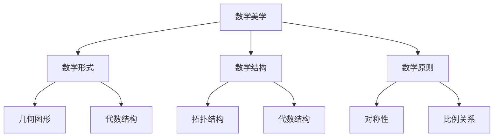

                 

## 《数学美学与艺术创作的启示》

### 关键词：
数学美学、艺术创作、几何图形、黄金分割、算法艺术、数据可视化

### 摘要：
本文旨在探讨数学美学在艺术创作中的重要作用，通过分析数学与艺术的历史联系、基本概念、哲学基础以及在艺术中的应用，揭示数学美学对艺术创新的启示。文章还介绍了数学方法在数字艺术中的应用，以及数学美学对艺术教育和未来艺术发展的潜在影响，通过具体案例和跨学科合作，展示了数学在艺术领域的广泛应用和深远意义。

### 文章标题：数学美学与艺术创作的启示

数学美学是一门独特的学科，它探索数学的形式、结构、原则在艺术创作中的体现，为艺术家提供了创新的思维方式和工具。本文将逐步分析数学美学的基本概念、历史联系、哲学基础、艺术应用，以及数学在数字艺术和未来艺术发展中的影响，以期揭示数学美学对艺术创作的启示和促进作用。

#### 第一部分：数学美学概述

### 第1章：数学美学引论

#### 1.1 数学美学的基本概念

数学美学的基本概念包括数学形式、数学结构和数学原则。数学形式是指数学中的符号、公式、几何图形等，它们是数学表达的基础。数学结构则涉及数学概念之间的关系和结构，如拓扑结构、代数结构等，这些结构在艺术创作中具有重要的表现力。数学原则是数学的基本原理和法则，如对称性、比例关系等，它们在艺术创作中常常被用来创造和谐和美感。

**定义与范畴：**

- **数学美学**：数学美学是探讨数学与艺术之间联系的学科，研究数学形式、结构、原则在艺术创作中的体现。
- **数学形式**：数学的符号、公式、几何图形等，是数学表达的基础。
- **数学结构**：数学概念之间的关系和结构，如拓扑结构、代数结构等，具有表现力。
- **数学原则**：数学的基本原理和法则，如对称性、比例关系等，在艺术创作中具有重要应用。

**数学美学的历史与起源：**

- **古希腊时期**：毕达哥拉斯学派提出“数的和谐”理念，将数学与音乐、艺术联系起来。
- **文艺复兴时期**：达芬奇、米开朗基罗等艺术家重视数学在艺术创作中的应用。
- **现代时期**：数学在艺术中的应用不断拓展，出现了一系列数学艺术作品和理论。

**数学美学的重要性与意义：**

- **促进创新思维**：数学美学鼓励艺术家从数学的角度思考艺术问题，激发创新思维。
- **增强跨学科交流**：数学美学为数学与艺术、艺术与其他学科之间的交流提供了桥梁。
- **丰富艺术形式**：数学美学的引入为艺术创作提供了新的方法和工具，丰富了艺术形式。

### 第2章：数学美学的哲学基础

#### 2.1 唯物主义美学与数学美学

唯物主义美学认为美是客观存在的，它来源于物质世界。数学美学作为探讨数学形式、结构、原则在艺术创作中的应用，可以看作是对唯物主义美学的一种具体体现。数学的严谨性和逻辑性为艺术创作提供了新的工具和方法，使得艺术作品更加具有科学性和表现力。

#### 2.2 形而上学与数学美的本质

形而上学探讨存在的本质和原因，数学美学则从形而上学的角度探讨数学美的本质。数学美学的核心在于数学形式和结构的和谐与统一，这种和谐与统一反映了宇宙的本质和规律，从而使得数学美成为了一种超越物质世界的抽象美。

#### 2.3 数学逻辑与艺术形式的统一

数学逻辑是一种严谨的推理系统，它强调逻辑的严密性和准确性。艺术形式则强调感性和审美性，追求形式的美感和和谐。数学逻辑与艺术形式的统一，意味着在艺术创作中，艺术家可以通过数学逻辑来构建具有审美意义的形式，从而实现数学美与艺术美的结合。

### 第3章：数学结构与艺术创作

#### 3.1 几何图形与视觉艺术

几何图形是数学美学中的重要元素，它们在视觉艺术中具有广泛的应用。从古希腊的帕台农神庙到文艺复兴时期的绘画作品，几何图形都被用来构建和谐的形式和美感。几何图形的美学分析涉及形态、比例、对称性等方面，这些分析可以帮助艺术家更好地理解几何图形在艺术创作中的作用。

#### 3.2 代数结构与音乐艺术

代数结构在数学美学中具有重要的地位，它们在音乐艺术中也有广泛的应用。音阶、和弦、节奏等音乐元素都可以看作是代数结构的体现。音乐与数学之间的联系不仅体现在形式上，还体现在节奏和旋律的数学规律上。通过代数结构，艺术家可以创造出具有深度和美感的音乐作品。

### 第二部分：艺术创作中的数学启示

#### 第4章：数学在艺术中的应用

#### 4.1 数学模型在绘画中的运用

数学模型在绘画中具有重要的应用，它们可以帮助艺术家更好地理解和表现自然界的规律。例如，阿尔贝特·爱因斯坦的《宇宙全息画》运用了数学模型来表现宇宙的和谐与统一。莫奈的《睡莲》则通过数学模型来表现光影的变化和色彩的对比。

#### 4.2 数学在雕塑和建筑中的应用

雕塑和建筑是艺术创作中的重要领域，数学在其中的应用同样广泛。巴洛克建筑以其复杂的几何构图和数学原理而闻名，雕塑中的几何构型也为艺术家提供了丰富的创作灵感。通过数学的应用，雕塑和建筑作品可以展现出独特的艺术魅力。

### 第三部分：数学美学案例研究

#### 第5章：数学在艺术史上的经典案例

数学在艺术史上留下了许多经典案例，这些案例展示了数学美学在艺术创作中的重要作用。从荷兰黄金时代艺术中的数学元素，到巴洛克艺术中的数学构图，再到20世纪艺术中的数学灵感，数学美学在艺术创作中发挥着不可替代的作用。

#### 第6章：当代艺术家与数学美学

当代艺术家在数学美学的研究和应用中取得了显著的成果。他们通过数学的方法和工具，创造出了一系列具有深度和美感的艺术作品。这些作品不仅展示了数学美学的魅力，也推动了数学与艺术的跨学科交流和发展。

#### 第7章：跨学科合作与数学美学

跨学科合作是数学美学发展的重要趋势。数学家与艺术家的合作，不仅促进了数学在艺术中的应用，也推动了艺术创作的创新和发展。通过跨学科合作，数学美学在多学科交叉中发挥着重要作用，为艺术创作提供了新的思路和方法。

### 附录

#### 附录A：数学美学资源与工具

数学美学的研究需要丰富的资源与工具。常用的数学软件和工具包括MATLAB、Python、R等，这些工具可以帮助艺术家和数学家进行数学美学的探索。此外，还有许多数学美学相关的网站和书籍，为研究者提供了丰富的学习资源。

#### 附录B：数学美学的 Mermaid 流程图

数学美学的 Mermaid 流程图可以帮助研究者更好地理解数学美学的基本概念和应用。以下是一个示例：



#### 附录C：数学模型与数学公式

数学模型和数学公式在数学美学中具有重要作用。以下是一些常用的数学公式：

```latex
$$
\begin{aligned}
&\text{几何形态的美学分析公式：} \\
&f(x, y) = \frac{1}{2\pi}\int_{-\pi}^{\pi} \sin(x)\cos(y) \, dx \\
&\text{音乐节奏与代数公式：} \\
&\text{音阶：} C, D, E, F, G, A, B \\
&\text{和弦：} C, E, G \\
&\text{数据可视化与信息美学公式：} \\
&V = f(D, M)
\end{aligned}
$$
```

### 结论

数学美学是一门独特的学科，它将数学的形式、结构、原则与艺术创作相结合，为艺术创作提供了新的思维方式和工具。通过本文的分析，我们可以看到数学美学在艺术创作中的重要作用，以及它对艺术创新的启示和促进作用。随着数学与艺术的跨学科交流的不断深入，数学美学在未来艺术发展中将发挥更加重要的作用。

