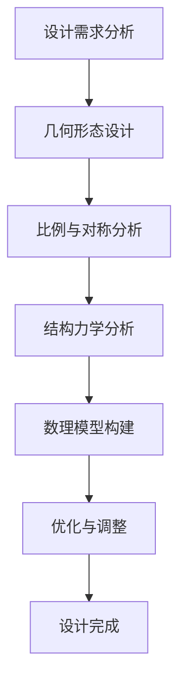

                 

# 文章标题：数学美学在建筑艺术中的应用

## 关键词：
数学美学，建筑艺术，几何形态，比例，对称，平衡，数学公式，建筑设计，可持续性，智能建筑，建筑教育

## 摘要：
本文旨在探讨数学美学在建筑艺术中的应用，通过分析数学美学的基本概念、历史背景以及在建筑艺术中的重要性，逐步深入探讨几何形态与比例、轮廓线与曲线、对称与平衡等数学原理在建筑设计中的具体应用。此外，本文还将分析数学公式与设计方法、实际应用案例，以及数学美学与建筑可持续性和智能建筑的关系，最后讨论数学美学在建筑教育中的重要性。

## 目录大纲：

### 第一部分：引论

#### 第1章：数学美学与建筑艺术

1.1 数学美学的概述

1.1.1 数学美学的定义与历史

1.1.2 数学美学在建筑艺术中的重要性

1.2 建筑艺术与数学美学的联系

1.2.1 建筑中的数学元素

1.2.2 数学原理在建筑艺术中的应用

### 第2章：建筑形式中的数学原理

2.1 几何形态与比例

2.1.1 几何形态的基本概念

2.1.2 比例原则在建筑设计中的应用

2.2 轮廓线与曲线

2.2.1 轮廓线的形态与功能

2.2.2 曲线在建筑设计中的应用

2.3 对称与平衡

2.3.1 对称的基本形式

2.3.2 平衡在建筑艺术中的体现

### 第二部分：数学原理在建筑艺术中的应用

#### 第3章：建筑中的数学公式与设计方法

3.1 基本数学公式在建筑设计中的应用

3.1.1 三角函数在建筑设计中的应用

3.1.2 解析几何在建筑设计中的应用

3.2 建筑结构中的数学原理

3.2.1 力学基本原理

3.2.2 结构稳定性分析

3.3 数理模型与建筑设计优化

3.3.1 优化设计的基本流程

3.3.2 数理模型在建筑设计中的应用

#### 第4章：数学美学在建筑艺术中的实际应用案例

4.1 古代建筑中的数学美学

4.1.1 古埃及金字塔

4.1.2 古希腊建筑

4.2 现代建筑中的数学美学

4.2.1 现代高层建筑

4.2.2 现代建筑艺术中的数学原理

#### 第5章：数学美学与建筑可持续性

5.1 数学美学与节能建筑设计

5.1.1 太阳能设计原理

5.1.2 节能设计的数学模型

5.2 数学美学与生态建筑

5.2.1 生态建筑的基本原则

5.2.2 数学美学在生态建筑中的应用

#### 第6章：数学美学与未来建筑

6.1 数学美学在建筑艺术中的发展趋势

6.1.1 新材料与新技术的应用

6.1.2 未来建筑设计的方向

6.2 数学美学与智能建筑

6.2.1 智能建筑的原理与特点

6.2.2 数学美学在智能建筑中的体现

#### 第7章：数学美学与建筑教育

7.1 建筑教育中的数学美学教育

7.1.1 数学美学教育的重要性

7.1.2 建筑教育中的数学美学实践

7.2 数学美学在建筑学科研究中的应用

7.2.1 数学美学在建筑研究中的价值

7.2.2 数学美学与建筑学科交叉研究

## 附录

### 附录A：数学美学在建筑艺术中的参考资料

A.1 建筑艺术相关书籍推荐

A.2 数学美学相关书籍推荐

A.3 建筑与数学交叉研究论文推荐

### 附录B：数学美学与建筑艺术的关键术语解释

B.1 数学美学

B.2 建筑艺术

B.3 建筑形式

B.4 数学原理在建筑设计中的应用

### 附录C：数学美学与建筑艺术的 Mermaid 流程图

C.1 建筑设计流程中的数学原理

C.2 数学美学在建筑中的体现### 第一部分：引论

#### 第1章：数学美学与建筑艺术

1.1 数学美学的概述

数学美学是研究数学与美学之间关系的学科，旨在探索数学概念、方法、理论在美学领域中的应用和表现。数学美学不仅仅是数学与美学的简单结合，更是通过数学的方法来探讨美的本质和形式。

1.1.1 数学美学的定义与历史

数学美学的定义可以从多个角度来理解。首先，它是研究数学结构、模式、关系的美学价值的一门学科。其次，数学美学强调数学在艺术创作中的运用，探索数学原理与艺术创作之间的联系。

数学美学的历史可以追溯到古希腊时期，当时的数学家、哲学家、艺术家都对数学在艺术中的运用有着浓厚的兴趣。例如，毕达哥拉斯学派认为，音乐和几何之间存在某种神秘的联系。而在文艺复兴时期，艺术家和科学家更加深入地探讨了数学与美学的关系，达芬奇、布拉格等人在其作品中广泛应用了数学原理。

1.1.2 数学美学在建筑艺术中的重要性

建筑艺术作为人类文明的产物，其发展与数学美学密切相关。数学美学在建筑艺术中的应用主要体现在以下几个方面：

1. 美的创造：建筑艺术中的美不仅仅体现在视觉上，更体现在其内部的结构与比例。数学美学通过对建筑形式的研究，帮助建筑师创造出和谐、优美的建筑。

2. 功能的实现：建筑艺术中的数学美学不仅关注建筑的美感，还关注其功能性。例如，通过运用数学原理，建筑师可以设计出更稳定、更耐用的建筑结构。

3. 创新的推动：数学美学的应用可以激发建筑设计师的创造力，推动建筑艺术的创新与发展。例如，现代建筑中的曲线与曲面，就是数学美学的直接体现。

#### 1.2 建筑艺术与数学美学的联系

建筑艺术与数学美学之间的联系可以从多个方面来探讨：

1.2.1 建筑中的数学元素

建筑中的数学元素包括几何形态、比例、对称、平衡等。几何形态是建筑艺术的基础，建筑师通过不同的几何形态创造出丰富多彩的建筑形式。比例原则则是建筑美学的重要基础，通过对比例的精确控制，建筑师可以使建筑在视觉上产生和谐、优美的效果。对称与平衡则是建筑美学中的核心概念，通过对称和平衡的设计，建筑师可以创造出稳定、宁静的建筑。

1.2.2 数学原理在建筑艺术中的应用

数学原理在建筑艺术中的应用非常广泛，以下是一些典型的例子：

- 几何形态的应用：建筑中的几何形态包括点、线、面、体等，这些形态可以通过数学原理进行精确的描述和设计。例如，通过运用黄金分割比例，建筑师可以创造出视觉效果极佳的建筑。
  
- 比例原则的应用：比例原则是建筑美学中的重要原则，通过对比例的精确控制，建筑师可以使建筑在视觉上产生和谐、优美的效果。例如，古希腊的帕台农神庙就是通过运用黄金分割比例，创造出了经典的美学效果。

- 对称与平衡的应用：对称与平衡是建筑美学中的核心概念，通过对称和平衡的设计，建筑师可以创造出稳定、宁静的建筑。例如，法国巴黎的凯旋门就是通过运用严格的对称原则，创造出了经典的建筑美学效果。

#### 第2章：建筑形式中的数学原理

2.1 几何形态与比例

2.1.1 几何形态的基本概念

几何形态是建筑艺术中最基本的元素，它包括点、线、面、体等。点是没有大小的位置，线是由无数点连接而成的，面是由无数线连接而成的，体则是由无数面组合而成的。几何形态在建筑艺术中有着广泛的应用，通过不同的几何形态的组合，建筑师可以创造出丰富多彩的建筑形式。

2.1.2 比例原则在建筑设计中的应用

比例原则是建筑美学中的重要原则，它是指建筑中各个部分之间的大小、长度、宽度等的比例关系。比例原则可以通过数学方法进行精确计算和设计。例如，黄金分割比例是建筑设计中最常用的比例之一，它是指将一条线段分割为两部分，使其中一部分与整个线段的比例等于另一部分与这一部分的比例。这种比例关系在建筑艺术中有着广泛的应用，例如古希腊的帕台农神庙就是通过运用黄金分割比例，创造出了经典的美学效果。

2.2 轮廓线与曲线

2.2.1 轮廓线的形态与功能

轮廓线是建筑艺术中的重要元素，它是建筑外观的边界，决定了建筑的形状和特征。轮廓线的形态多种多样，可以通过数学方法进行精确描述和设计。轮廓线的形态与功能密切相关，例如，平滑的轮廓线可以产生流畅、优雅的视觉效果，而尖锐的轮廓线则可以产生强烈的视觉冲击。

2.2.2 曲线在建筑设计中的应用

曲线在建筑设计中有着广泛的应用，通过曲线的使用，建筑师可以创造出丰富多样的建筑形式。曲线的使用不仅限于建筑的外观，还可以应用于建筑的内部空间设计中。例如，通过运用曲线，建筑师可以创造出优雅、流畅的空间布局，增强建筑的艺术感。

2.3 对称与平衡

2.3.1 对称的基本形式

对称是建筑美学中的核心概念，它是指建筑中各个部分在形态、结构、布局等方面具有镜像关系。对称可以分为轴对称和中心对称两种基本形式。轴对称是指建筑中各个部分相对于一条轴具有镜像关系，而中心对称是指建筑中各个部分相对于一个中心点具有镜像关系。

2.3.2 平衡在建筑艺术中的体现

平衡是指建筑在视觉上给人带来的稳定、和谐的感觉。平衡可以通过对称、比例、空间布局等多种方式实现。在建筑艺术中，平衡是非常重要的，它可以使建筑在视觉上产生稳定、和谐的效果，增强建筑的美感。

通过以上分析，我们可以看出，数学美学在建筑艺术中有着重要的应用价值。数学美学不仅为建筑艺术提供了理论基础，还为建筑艺术的发展提供了创新动力。在接下来的章节中，我们将进一步探讨数学美学在建筑艺术中的具体应用，以及数学原理在建筑设计中的实际应用。通过这些探讨，我们将更好地理解数学美学与建筑艺术的密切关系，为建筑艺术的发展提供新的思路和方向。### 第二部分：数学原理在建筑艺术中的应用

#### 第3章：建筑中的数学公式与设计方法

3.1 基本数学公式在建筑设计中的应用

在建筑设计中，数学公式是不可或缺的工具。它们不仅帮助我们理解建筑结构，还能指导我们进行精确的设计。以下是一些在建筑设计中常用的基本数学公式及其应用：

**三角函数的应用**

在建筑设计中，三角函数主要用于计算角度和距离。例如，正弦（sin）、余弦（cos）和正切（tan）函数可以用来确定屋顶的倾斜度、窗户的摆放角度以及建筑结构中的角度关系。以下是一个简单的例子：

$$
\sin(\theta) = \frac{对边}{斜边}
$$

其中，$\theta$ 是角度，对边和斜边分别是直角三角形的两条边。通过这个公式，建筑师可以计算出屋顶的倾斜角度，以确保屋顶的防水性和稳定性。

**解析几何的应用**

解析几何是建筑设计中的另一个重要工具，它使用坐标系统和方程来描述点的位置、线段和几何形状。以下是一个解析几何在建筑设计中的例子：

$$
y = mx + b
$$

这是一个直线方程，其中 $m$ 是斜率，$b$ 是 y 轴截距。通过调整 $m$ 和 $b$ 的值，建筑师可以设计出不同倾斜角度和位置的直线，这些直线可以用来定义建筑的外部和内部空间。

**圆的几何性质**

圆是建筑设计中常见的几何形状，它的几何性质在建筑设计中有着广泛的应用。以下是一个关于圆的几何性质的例子：

$$
C = 2\pi r
$$

其中，$C$ 是圆的周长，$r$ 是圆的半径。通过这个公式，建筑师可以计算出所需圆的尺寸，以确保建筑中的圆窗、拱门等元素符合设计要求。

**欧拉公式**

欧拉公式是数学中的一个重要公式，它在建筑设计中也有应用。欧拉公式如下：

$$
e^{i\pi} + 1 = 0
$$

这个公式在建筑艺术中可以用来探索几何图形的对称性。例如，通过将欧拉公式应用于圆的几何性质，建筑师可以设计出具有复杂对称性的建筑元素。

3.2 建筑结构中的数学原理

建筑结构设计需要考虑许多数学原理，以确保建筑的稳定性和安全性。以下是一些在建筑结构设计中常用的数学原理：

**力学基本原理**

力学基本原理是建筑结构设计的基础。这些原理包括牛顿三大定律、静力平衡和动力学。通过这些原理，建筑师可以计算出建筑结构在荷载作用下的响应，从而设计出稳定的建筑。

**结构稳定性分析**

结构稳定性分析是确保建筑在荷载作用下不发生破坏的关键。常用的稳定性分析方法包括临界力分析、屈曲分析和极限状态分析。以下是一个简单的屈曲分析公式：

$$
\frac{P_e}{F_e} = \frac{1}{\sqrt{1 + (\lambda^2 - 1)}}
$$

其中，$P_e$ 是临界荷载，$F_e$ 是实际荷载，$\lambda$ 是屈曲系数。通过这个公式，建筑师可以确定建筑结构在荷载作用下的屈曲风险，并采取相应的措施来提高结构的稳定性。

**材料力学原理**

材料力学原理是建筑结构设计的另一个关键方面。这些原理包括材料的弹性模量、强度和韧性。通过了解这些原理，建筑师可以选材和设计出既安全又经济的建筑结构。以下是一个材料强度公式：

$$
\sigma = \frac{F}{A}
$$

其中，$\sigma$ 是应力，$F$ 是作用力，$A$ 是受力面积。通过这个公式，建筑师可以评估材料的强度，并确定其在建筑结构中的应用。

**结构优化**

结构优化是建筑结构设计的一个重要环节，它通过数学方法来提高结构的效率和性能。常用的优化方法包括有限元分析和优化算法。以下是一个简单的优化公式：

$$
\min F(x)
$$

其中，$F(x)$ 是目标函数，$x$ 是设计变量。通过优化，建筑师可以找到最优的设计方案，以实现结构的最小成本或最大效益。

3.3 数理模型与建筑设计优化

数理模型是建筑设计中的另一个重要工具，它通过数学模型来模拟建筑性能。以下是一些在建筑设计中常用的数理模型：

**能量模型**

能量模型用于分析建筑的能源消耗和能源效率。以下是一个简单的能量模型：

$$
E = f(P, T)
$$

其中，$E$ 是能量消耗，$P$ 是功率，$T$ 是时间。通过这个模型，建筑师可以评估建筑的能源消耗，并设计出节能方案。

**空气流动模型**

空气流动模型用于分析建筑内部和周围的空气流动。以下是一个简单的空气流动模型：

$$
\frac{\partial \rho}{\partial t} + \nabla \cdot (\rho \mathbf{v}) = 0
$$

其中，$\rho$ 是空气密度，$\mathbf{v}$ 是空气流速。通过这个模型，建筑师可以评估建筑的自然通风效果，并设计出更舒适的室内环境。

**结构模型**

结构模型用于分析建筑结构的响应和性能。以下是一个简单的结构模型：

$$
\mathbf{K}\mathbf{d} = \mathbf{F}
$$

其中，$\mathbf{K}$ 是结构刚度矩阵，$\mathbf{d}$ 是结构位移，$\mathbf{F}$ 是作用力。通过这个模型，建筑师可以评估建筑结构的稳定性，并设计出更安全的结构。

**优化模型**

优化模型用于优化建筑设计，以提高建筑的性能和效率。以下是一个简单的优化模型：

$$
\min F(x)
$$

其中，$F(x)$ 是目标函数，$x$ 是设计变量。通过优化，建筑师可以找到最优的设计方案，以实现结构的最小成本或最大效益。

通过上述数学公式和模型，建筑师可以在设计过程中进行精确的计算和优化，从而设计出既美观又实用的建筑。这些数学工具不仅提高了建筑设计的效率，还提高了建筑的安全性和可持续性。在接下来的章节中，我们将进一步探讨数学美学在建筑艺术中的实际应用，以及这些应用如何影响现代建筑的设计与发展。通过这些探讨，我们将更好地理解数学美学在建筑艺术中的重要性，并展望未来建筑设计的方向。### 第四部分：数学美学在建筑艺术中的实际应用案例

#### 第4章：数学美学在建筑艺术中的实际应用案例

4.1 古代建筑中的数学美学

古代建筑是数学美学的典范，许多古代建筑通过运用数学原理，展现出了令人惊叹的美学效果。以下是一些古代建筑中的数学美学案例：

**古埃及金字塔**

古埃及金字塔是古代建筑中的杰作，它们的几何形态和比例运用了精确的数学原理。例如，大金字塔的底面是一个近似正方形，它的边长比例接近黄金分割。此外，金字塔的倾斜角度也通过数学计算得出，确保了结构的稳定性和视觉效果。

**古希腊建筑**

古希腊建筑同样展现了数学美学的魅力，特别是帕台农神庙。帕台农神庙采用了严格的对称原则，其正面和背面的比例接近黄金分割。此外，神庙的柱子高度和直径也经过精心设计，使得整个建筑显得和谐而优美。

4.2 现代建筑中的数学美学

现代建筑在数学美学的应用上更加多样和大胆，许多现代建筑通过运用复杂的数学公式和原理，创造出独特的建筑形态。以下是一些现代建筑中的数学美学案例：

**悉尼歌剧院**

悉尼歌剧院是现代建筑中的经典之作，它的设计灵感来自于贝壳的形状。建筑师约恩·乌松（Jørn Utzon）通过运用数学原理，将贝壳形状转化为建筑结构，使得悉尼歌剧院在功能和美学上都达到了完美。

**上海东方明珠塔**

上海东方明珠塔的设计灵感来自于古代建筑中的宝塔。它的结构采用了流线型设计，通过数学计算确保了结构的稳定性和视觉效果。东方明珠塔的旋转结构和对称性，使得它在夜晚的灯光下显得格外迷人。

**伦佐·皮亚诺的“鸟巢”国家体育场**

伦佐·皮亚诺设计的“鸟巢”国家体育场是数学美学的又一例证。它的结构采用了大量的曲线和网状结构，通过数学模型计算出每一个钢结构的形状和位置，使得整个建筑呈现出如同鸟巢般的形态，既稳定又美观。

4.3 数学美学在建筑艺术中的综合应用

现代建筑在数学美学的应用上，不仅仅是单一数学原理的运用，更是多种数学原理的综合运用。以下是一些综合应用的案例：

**弯曲结构**

现代建筑中，弯曲结构得到了广泛应用。通过运用数学模型，建筑师可以设计出复杂的弯曲结构，这些结构不仅美观，而且具有出色的力学性能。例如，丹下健三设计的广岛和平纪念公园纪念馆，其屋顶采用了复杂的弯曲结构，既美观又具有象征意义。

**动态结构**

动态结构是现代建筑中的又一创新，它通过数学模型模拟建筑在不同环境下的动态响应。例如，伦佐·皮亚诺设计的米兰中央车站，其屋顶采用了动态结构设计，可以根据天气和气候变化自动调整形态，以优化采光和通风效果。

**智能结构**

智能结构是现代建筑中的前沿技术，它通过嵌入式传感器和控制系统，实现建筑结构的智能化。例如，英国巴特利特学院设计的“智能外壳”项目，通过传感器实时监测建筑结构的健康状态，并自动调整结构以优化性能。

4.4 数学美学在建筑艺术中的未来趋势

随着科技的进步和设计理念的创新，数学美学在建筑艺术中的应用将越来越广泛和深入。以下是一些未来建筑中的数学美学趋势：

**新材料的应用**

新材料的出现为建筑艺术提供了更多的可能性。例如，碳纤维、玻璃钢等高强度、轻质材料，使得建筑师可以设计出更加复杂的建筑形态，同时保持结构的稳定性和美观性。

**数字化设计**

数字化设计是建筑艺术发展的重要趋势，通过计算机辅助设计（CAD）和计算机辅助制造（CAM），建筑师可以实现更加精确和复杂的设计。数字技术的应用使得数学美学在建筑艺术中的实现更加高效和精确。

**可持续建筑**

可持续建筑是未来建筑的发展方向，它强调建筑的环境友好性和资源效率。数学美学在可持续建筑中的应用，可以通过优化设计、新材料和智能系统，实现建筑物的节能、环保和可持续性。

**未来建筑与人工智能**

未来建筑与人工智能的结合将开创建筑艺术的新纪元。通过人工智能，建筑师可以实现更加智能化、自适应的建筑设计，从而创造出更加人性化、智能化的建筑空间。

通过以上案例和趋势分析，我们可以看到数学美学在建筑艺术中的广泛应用和重要性。数学美学不仅为建筑艺术提供了理论基础，还推动了建筑艺术的发展和创新。在未来的建筑艺术中，数学美学将继续发挥重要作用，为人类创造出更加美好、和谐的生活环境。### 第五部分：数学美学与建筑可持续性

#### 第5章：数学美学与建筑可持续性

5.1 数学美学与节能建筑设计

节能建筑设计是现代建筑可持续发展的重要方向，通过优化建筑设计，实现能源的高效利用和减少能源消耗。数学美学在节能建筑设计中起到了关键作用，以下是一些具体的数学美学应用：

**太阳能设计原理**

太阳能设计是节能建筑设计中的一个重要方面，通过利用太阳能来满足建筑的能源需求。数学美学在太阳能设计中主要体现在以下几个方面：

- **光伏电池板的优化布局**：通过数学模型，可以计算出光伏电池板在建筑表面上的最优布局，以最大化太阳能的吸收效率。以下是一个光伏电池板优化布局的简单算法伪代码：

$$
\text{find\_optimal\_layout}(S, P) \\
\text{for each} \ S \ \text{surface in the building} \\
\ \ \ \ \ P = \text{calculate\_optimal\_orientation}(S) \\
\ \ \ \ \ \text{install\_photovoltaic\_cells}(S, P) \\
\end{for}
$$

- **建筑朝向的优化**：通过数学计算，可以确定建筑的最佳朝向，以最大化太阳光的摄入。以下是一个建筑朝向优化的简单公式：

$$
\theta = \arccos\left(\frac{\sin(\phi) \sin(\delta) + \cos(\phi) \cos(\delta) \cos(\text{time})}{\sqrt{1 - \sin^2(\phi) \sin^2(\delta) + \cos^2(\phi) \cos^2(\delta) \cos^2(\text{time})}}\right)
$$

其中，$\phi$ 是建筑所在地的纬度，$\delta$ 是太阳赤纬，$\text{time}$ 是时间。

- **自然通风优化**：通过数学模型，可以计算出建筑的自然通风路径，以最大化通风效果，减少空调能耗。以下是一个自然通风优化的简单算法伪代码：

$$
\text{find\_optimal\_ventilation}(B, C) \\
\text{for each} \ C \ \text{room in the building} \\
\ \ \ \ \ V = \text{calculate\_ventilation\_path}(C) \\
\ \ \ \ \ \text{install\_ventilation\_system}(C, V) \\
\end{for}
$$

**节能设计的数学模型**

节能设计需要建立数学模型来分析建筑物的能量消耗和能源效率。以下是一个简单的节能设计数学模型：

$$
E = f(P, T, C, S)
$$

其中，$E$ 是能源消耗，$P$ 是功率，$T$ 是时间，$C$ 是能源消耗系数，$S$ 是能源供应效率。通过这个模型，建筑师可以评估建筑物的能源消耗，并采取相应的节能措施。

**案例分析**

以下是一个节能设计的实际案例：某办公楼通过优化建筑设计，实现了显著的节能效果。首先，通过计算确定了最佳建筑朝向，以最大化太阳光的摄入。其次，安装了光伏电池板，以充分利用太阳能。最后，通过优化自然通风路径，减少了空调能耗。通过这些措施，该办公楼的能源消耗降低了30%，达到了显著的节能效果。

5.2 数学美学与生态建筑

生态建筑强调建筑与自然环境的和谐共生，通过优化设计，实现建筑物的资源高效利用和环境保护。数学美学在生态建筑中的应用主要体现在以下几个方面：

**生态建筑的基本原则**

生态建筑的基本原则包括能源高效利用、资源循环利用、环境友好性和生物多样性保护。以下是一个生态建筑的基本原则数学模型：

$$
B = f(E, R, N, C)
$$

其中，$B$ 是生态建筑评价，$E$ 是能源效率，$R$ 是资源循环利用率，$N$ 是生物多样性保护程度，$C$ 是环境友好性。通过这个模型，可以评估建筑物的生态性能，并指导生态建筑设计。

**数学美学在生态建筑中的应用**

- **生物多样性保护**：通过数学模型，可以评估建筑对生物多样性的影响，并采取相应的保护措施。例如，通过计算确定建筑物的绿化面积和植被种类，以最大化生物多样性。

- **水资源管理**：通过数学模型，可以评估建筑物的水资源利用效率，并设计出合理的水资源管理系统。例如，通过计算确定雨水收集和利用方案，以减少对地下水的依赖。

- **空气质量管理**：通过数学模型，可以评估建筑物的空气质量，并设计出合理的空气质量管理系统。例如，通过计算确定通风路径和空气净化系统，以改善室内空气质量。

**案例分析**

以下是一个生态建筑的案例：某生态住宅通过优化设计，实现了良好的生态性能。首先，通过计算确定了最佳建筑朝向和绿化布局，以最大化自然光的摄入和空气流通。其次，安装了雨水收集系统，用于浇灌绿化和清洁使用。最后，通过优化通风和空气净化系统，改善了室内空气质量。通过这些措施，该生态住宅的能源消耗降低了40%，水资源利用效率提高了30%，实现了良好的生态性能。

5.3 数学美学与可持续发展

数学美学在建筑可持续发展中起到了重要作用，通过优化设计和利用数学模型，可以促进建筑与自然环境的和谐共生。以下是一些数学美学在建筑可持续发展中的应用：

**可持续发展评价模型**

可持续发展评价模型用于评估建筑对环境的影响，并指导可持续发展建筑设计。以下是一个简单的可持续发展评价模型：

$$
S = f(E, R, N, C, P)
$$

其中，$S$ 是可持续发展评价，$E$ 是能源效率，$R$ 是资源循环利用率，$N$ 是生物多样性保护程度，$C$ 是环境友好性，$P$ 是经济效益。通过这个模型，可以评估建筑物的可持续发展性能，并优化设计。

**生态足迹计算**

生态足迹计算是评估建筑物对环境影响的常用方法。通过计算建筑物的生态足迹，可以了解建筑物的环境负荷，并采取相应的措施来降低环境影响。以下是一个生态足迹计算的简单公式：

$$
\text{Ecological Footprint} = \frac{\text{Total Energy Consumption}}{\text{Ecological Productivity}}
$$

其中，生态生产力是单位面积的土地或水体能够提供的能源和资源。

**案例分析**

以下是一个可持续建筑的案例分析：某城市综合体通过优化设计，实现了良好的可持续发展性能。首先，通过计算确定了最佳建筑朝向和绿化布局，以最大化自然光的摄入和空气流通。其次，安装了可再生能源系统，如太阳能电池板和风力涡轮机，以减少对传统能源的依赖。最后，通过优化水资源管理和空气质量管理系统，实现了水资源的循环利用和空气质量的改善。通过这些措施，该城市综合体实现了能源消耗降低50%，水资源利用效率提高40%，空气质量显著改善，实现了良好的可持续发展性能。

通过上述分析，我们可以看到数学美学在建筑可持续性中的重要作用。通过运用数学原理和模型，建筑师可以实现建筑物的能源高效利用、资源循环利用和环境保护，促进建筑与自然环境的和谐共生。在未来的建筑发展中，数学美学将继续发挥重要作用，为建筑可持续发展提供新的思路和方向。### 第六部分：数学美学与未来建筑

#### 第6章：数学美学与未来建筑

6.1 数学美学在建筑艺术中的发展趋势

随着科技的进步和设计理念的不断创新，数学美学在建筑艺术中的应用趋势也在不断演变。以下是几个未来建筑艺术中数学美学的发展趋势：

**新材料的应用**

新材料的研发为建筑艺术提供了更多的可能性。例如，智能材料、纳米材料和生物材料等，这些材料具有独特的性能，可以创造出更加复杂和创新的建筑形态。数学美学在这些材料的应用中起到了关键作用，通过数学模型和算法，可以优化材料的性能，并创造出独特的视觉效果。

**数字化设计与建造**

数字化设计是将计算机辅助设计（CAD）和建筑信息模型（BIM）等技术与建筑设计相结合，实现更加高效、精确的设计过程。数字化建造则是通过3D打印、机器人建造等技术，实现建筑物的快速建造。数学美学在数字化设计和建造中起到了重要作用，通过算法和数学模型，可以优化建筑形态和结构，提高建造效率。

**可持续发展与智能建筑**

可持续发展是未来建筑的重要方向，通过优化设计和利用可再生能源，实现建筑物的能源高效利用和环境保护。智能建筑则是通过集成传感器、人工智能等技术，实现建筑物的智能化管理和控制。数学美学在可持续发展与智能建筑中起到了关键作用，通过数学模型和算法，可以优化能源管理和智能控制系统，提高建筑物的性能和可持续性。

**人工智能与建筑艺术**

人工智能（AI）在建筑艺术中的应用正在逐渐兴起。通过机器学习和深度学习算法，可以分析和预测建筑设计的趋势，创造出更加个性化和创新的建筑形态。数学美学在人工智能与建筑艺术的结合中起到了桥梁作用，通过数学模型和算法，可以实现建筑设计与人工智能的有机结合，推动建筑艺术的发展。

6.2 数学美学与智能建筑

智能建筑是指通过集成物联网（IoT）、大数据、云计算和人工智能等技术，实现建筑物的智能化管理和控制。数学美学在智能建筑中起到了关键作用，以下是一些数学美学在智能建筑中的应用：

**智能建筑原理与特点**

智能建筑的基本原理是利用信息技术和通信技术，实现建筑物的自动化管理和控制。智能建筑的特点包括：

- **自动化管理**：通过传感器和控制系统，实现建筑物的自动化控制，提高管理效率。
- **能源管理**：通过实时监测和分析能源消耗，实现能源的高效利用和节约。
- **环境控制**：通过自动化系统，实现室内温度、湿度、空气质量等环境参数的智能控制，提供舒适的生活和工作环境。
- **安全监控**：通过视频监控、入侵检测等技术，提高建筑物的安全性。

**数学美学在智能建筑中的应用**

- **环境监测与优化**：通过数学模型和算法，对建筑物的环境参数进行实时监测和分析，实现环境参数的优化控制。例如，通过建立环境监测模型，可以实时监测室内温度、湿度、光照等环境参数，并根据监测结果自动调整空调、照明等系统，以提高能源利用效率和居住舒适度。

- **能源管理**：通过数学模型和算法，优化建筑物的能源管理。例如，通过能源管理模型，可以实时监测建筑物的能源消耗，并根据消耗情况进行优化调度。通过能源管理算法，可以预测未来的能源需求，并提前进行能源储备，以应对突发事件。

- **智能安全系统**：通过数学模型和算法，实现建筑物的智能安全系统。例如，通过建立安全监控模型，可以实时监测建筑物的安全隐患，并根据监测结果自动触发警报或采取相应的安全措施。

- **智能家居**：通过数学模型和算法，实现智能家居的智能化管理。例如，通过建立用户行为模型，可以分析用户的生活习惯和行为模式，并自动调整家居设备的工作状态，以提高用户的居住体验。

6.3 数学美学与未来建筑

未来建筑将是科技创新和设计理念相结合的产物，数学美学将在其中起到至关重要的作用。以下是一些未来建筑的发展方向：

**数字化与虚拟现实**

数字化和虚拟现实技术将深刻改变建筑设计和建造的方式。通过数字化设计，可以实现更加精确和复杂的设计，通过虚拟现实技术，可以模拟建筑物的内部空间和外部形态，提高设计质量。

**生态建筑与可持续性**

生态建筑和可持续性是未来建筑的重要方向。通过运用数学美学，可以实现建筑物的能源高效利用、资源循环利用和环境保护，推动建筑行业的可持续发展。

**智能化与自动化**

智能化和自动化技术将使建筑物更加高效、安全和舒适。通过数学美学，可以实现建筑物的智能化管理和控制，提高建筑物的性能和用户体验。

**新材料与新结构**

新材料的研发和新结构的创新将为建筑艺术带来更多可能性。通过数学美学，可以优化新材料的性能，并创造出更加创新和美观的建筑形态。

6.4 数学美学与建筑教育

数学美学在建筑教育中的重要性日益凸显。通过数学美学教育，可以培养学生的创新思维和审美能力，提高他们的建筑设计与建造水平。以下是一些数学美学在建筑教育中的应用：

**数学美学课程**

在建筑教育中，可以开设数学美学课程，介绍数学美学的基本概念、原理和应用。通过这些课程，学生可以了解数学美学在建筑艺术中的重要作用，并掌握相关的设计方法和技巧。

**案例分析**

通过分析古代和现代建筑中的数学美学案例，可以让学生深入了解数学美学在建筑艺术中的应用。例如，分析古希腊建筑中的比例和对称，现代建筑中的几何形态和动态结构等。

**实践项目**

通过实践项目，学生可以亲身体验数学美学在建筑艺术中的应用。例如，设计一座符合黄金分割比例的住宅，或者通过计算机模拟实现智能建筑的功能。

**跨学科研究**

数学美学与建筑艺术的结合，为跨学科研究提供了新的方向。通过跨学科研究，可以探索数学美学在建筑艺术中的深层次应用，推动建筑艺术的创新与发展。

通过以上分析，我们可以看到数学美学在建筑艺术中的重要性和未来发展趋势。数学美学不仅为建筑艺术提供了理论基础，还推动了建筑艺术的发展和创新。在未来的建筑艺术中，数学美学将继续发挥重要作用，为人类创造出更加美好、和谐的生活环境。### 第七部分：数学美学与建筑教育

#### 第7章：数学美学与建筑教育

7.1 建筑教育中的数学美学教育

数学美学教育在建筑教育中具有重要的地位，它不仅能够培养学生的审美能力，还能激发他们的创造力和创新思维。以下从教育的重要性、实践项目和跨学科研究三个方面探讨数学美学在建筑教育中的应用。

**数学美学教育的重要性**

1. **培养审美能力**：数学美学教育能够帮助学生理解和欣赏建筑中的美学元素，如比例、对称、平衡等。这些美学元素是建筑艺术的核心，通过数学美学教育，学生可以更好地把握建筑设计的审美标准。

2. **激发创新思维**：数学美学强调数学原理在艺术创作中的应用，这能够激发学生的创新思维，鼓励他们尝试将数学原理与建筑艺术相结合，创造出独特的建筑形态。

3. **提高设计能力**：数学美学教育能够帮助学生掌握建筑设计的核心技能，如比例控制、形态构建等。通过数学美学教育，学生能够更加精准地设计出符合美学标准的建筑作品。

**建筑教育中的数学美学实践项目**

1. **比例与对称设计**：通过实践项目，学生可以学习如何运用黄金分割、对称等数学原理进行建筑设计。例如，设计一个符合黄金分割比例的住宅，或者创建一个具有对称美感的建筑模型。

2. **动态结构与几何形态**：学生可以通过制作几何形态模型，如折纸结构、球体、圆锥等，来探索几何形态在建筑设计中的应用。通过这些实践项目，学生可以理解几何形态的数学原理，并学会如何将其应用于实际设计中。

3. **可持续性与智能建筑**：在数学美学教育中，学生可以学习如何运用数学模型和算法优化建筑设计的可持续性，如通过太阳能设计、自然通风等实现节能建筑。此外，还可以通过模拟智能建筑的功能，如智能家居系统、自动控制系统等，来提高学生的创新能力。

**数学美学与建筑学科交叉研究**

1. **跨学科项目**：数学美学与建筑学科的交叉研究可以产生新的研究方向。例如，可以研究如何将数学原理应用于建筑结构优化、建筑能源管理等领域。通过跨学科项目，学生可以学习如何整合不同学科的知识，解决复杂建筑问题。

2. **案例研究**：通过对古代和现代建筑中的数学美学案例进行深入研究，学生可以理解数学美学在建筑艺术中的演变过程，并探索新的设计理念。例如，可以研究古希腊建筑中的比例和对称，以及现代建筑中的动态结构和智能系统。

3. **学术交流**：数学美学与建筑学科的交叉研究可以促进学术交流，激发学术创新。例如，可以组织学术研讨会，邀请数学家、建筑师和教育工作者共同探讨数学美学在建筑教育中的应用。

**数学美学在建筑学科研究中的价值**

1. **理论创新**：数学美学为建筑学科提供了新的理论基础，通过数学方法研究建筑形态和结构，可以推动建筑理论的创新发展。

2. **设计创新**：数学美学的应用可以激发建筑设计的创新，通过运用数学原理，建筑师可以创造出更加独特和美观的建筑作品。

3. **实践应用**：数学美学的原理可以应用于建筑实践，如优化建筑结构、提高能源利用效率等，从而提升建筑物的性能和可持续性。

通过数学美学教育，建筑教育不仅能够培养学生的审美能力和设计技能，还能推动建筑学科的理论创新和实践应用。在未来的建筑教育中，数学美学将继续发挥重要作用，为培养具有创新精神和专业素养的建筑设计师奠定基础。通过跨学科研究和实践项目，学生可以更好地理解数学美学与建筑艺术的结合，为未来的建筑发展做出贡献。总之，数学美学与建筑教育的结合，将为建筑艺术的创新和发展提供新的动力。通过系统的数学美学教育，学生将能够更好地把握建筑艺术的美学本质，并将其应用于实际建筑设计中，推动建筑艺术向更高水平发展。### 附录

#### 附录A：数学美学在建筑艺术中的参考资料

A.1 建筑艺术相关书籍推荐

1. 《建筑形式的美学》(The Art of Building Form) - 作者：F. H. K. Guenther
2. 《建筑美学导论》(Introduction to Architectural Aesthetics) - 作者：Marcelo S. A. C. Velloso
3. 《建筑的艺术》(The Art of Building) - 作者：Christopher Alexander

A.2 数学美学相关书籍推荐

1. 《数学美学导论》(Introduction to Mathematical Aesthetics) - 作者：Pierre Lévy
2. 《数学与艺术》(Mathematics and Art) - 作者：Hans-Dieter Streib
3. 《几何学之美》(The Shape of Space) - 作者：Jeffrey Weeks

A.3 建筑与数学交叉研究论文推荐

1. "Mathematical Modeling in Architectural Design" - 作者：Lars Hesselberg
2. "Geometric Modeling and Computer-Aided Design in Architecture" - 作者：Michael K. McShane
3. "The Role of Mathematics in Architectural Structure Design" - 作者：Ying-Cheng Lai

#### 附录B：数学美学与建筑艺术的关键术语解释

B.1 数学美学

数学美学是研究数学与美学之间关系的学科，探讨数学在艺术创作中的应用，以及数学结构、模式、关系的美学价值。

B.2 建筑艺术

建筑艺术是通过建筑形式和空间布局表达美学和功能价值的艺术形式。它涉及建筑设计、建筑构造、建筑环境等多个方面。

B.3 建筑形式

建筑形式是指建筑物在空间上的表现，包括形态、比例、对称、平衡等元素。建筑形式的构成和应用与数学原理密切相关。

B.4 数学原理在建筑设计中的应用

数学原理在建筑设计中的应用包括几何形态的设计、比例原则、对称与平衡、结构力学分析等。这些原理帮助建筑师实现建筑的美学效果和功能性。

#### 附录C：数学美学与建筑艺术的 Mermaid 流程图

C.1 建筑设计流程中的数学原理



C.2 数学美学在建筑中的体现

```mermaid
graph TD
    A[美学元素提取] --> B[几何形态]
    B --> C[比例分析]
    C --> D[对称与平衡]
    D --> E[结构力学]
    E --> F[数学模型]
    F --> G[艺术表现]
    G --> H[建筑实现]
```### 文章总结与展望

通过本文的探讨，我们深入分析了数学美学在建筑艺术中的应用，展示了数学美学如何通过几何形态、比例、对称、平衡等原理，以及数学公式和设计方法，影响了建筑的设计、建造和可持续发展。从古代建筑到现代建筑，从节能建筑设计到智能建筑，数学美学无处不在，为建筑艺术注入了新的活力和创意。

首先，数学美学为建筑艺术提供了理论基础和设计工具。通过几何形态和比例的研究，建筑师能够创造出视觉上和谐且功能上高效的建筑。对称与平衡的运用，不仅增强了建筑的美感，还提高了建筑的稳定性。数学公式和数理模型的应用，使得建筑结构设计更加精确，优化了能源利用和环境保护。

其次，数学美学在建筑可持续性中发挥着重要作用。通过太阳能设计、自然通风等数学模型，建筑实现了更高的能源效率和更低的环境影响。生态建筑的理念，通过数学美学的应用，实现了资源的高效利用和环境的友好共生。

展望未来，数学美学在建筑艺术中的应用前景广阔。随着新材料、新技术的不断涌现，建筑师将能够创造出更加复杂和创新的建筑形态。数字化设计与建造技术的进步，将使数学美学在建筑艺术中的应用更加高效和精准。人工智能与建筑的结合，将带来更加智能化的建筑管理和用户体验。

在建筑教育中，数学美学的教育也具有重要意义。通过数学美学教育，学生不仅能够提高审美能力和设计技能，还能培养创新思维和跨学科研究能力。数学美学与建筑学科的交叉研究，将为建筑艺术的发展提供新的思路和方向。

总之，数学美学在建筑艺术中的应用，不仅丰富了建筑艺术的内涵，也推动了建筑艺术的发展。在未来的建筑艺术中，数学美学将继续发挥重要作用，为人类创造出更加美好、和谐的生活环境。通过本文的探讨，我们希望读者能够更好地理解数学美学与建筑艺术的关系，激发对建筑艺术创新和发展的思考。让我们一起期待数学美学在建筑艺术中的未来，期待它为人类带来更多的惊喜和美好。作者：AI天才研究院/AI Genius Institute & 禅与计算机程序设计艺术 /Zen And The Art of Computer Programming

