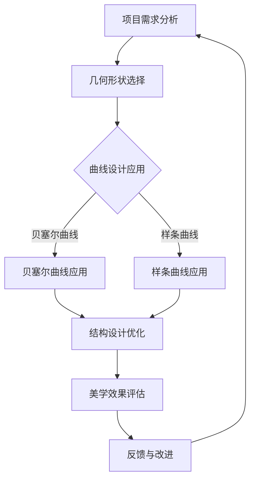

                 

### 文章标题

“数学美学在建筑设计中的应用”

### 关键词

数学美学、建筑设计、几何形状、现代建筑风格、实践案例、未来展望

### 摘要

本文将探讨数学美学在建筑设计中的深远影响。通过介绍数学美学的基础知识，本文将逐步解析数学美学在建筑设计中的具体应用，从基本几何形状的数学美学应用，到几何图形的数学美学，再到数学美学在建筑风格中的运用，以及数学美学在建筑设计中的实际案例和未来发展。本文旨在通过深入分析数学美学在建筑设计中的应用，为建筑师提供新的灵感，促进建筑设计领域的发展和创新。

#### 目录

#### 第一部分：数学美学的概述

- # 1. 数学美学的基础知识
  - ## 1.1 数学美学的基本概念
  - ### 1.1.1 数学美学的定义
  - ### 1.1.2 数学美学的历史渊源
  - ### 1.1.3 数学美学的特点
  - ## 1.2 数学与建筑的关系
  - ### 1.2.1 数学在建筑设计中的应用
  - ### 1.2.2 建筑设计与数学的关系
  - ### 1.2.3 数学在建筑设计中的价值

#### 第二部分：数学美学在建筑设计中的具体应用

- # 2. 基本几何形状的数学美学应用
  - ## 2.1 点、线、面与数学美学
  - ### 2.1.1 点的数学美学
  - ### 2.1.2 线的数学美学
  - ### 2.1.3 面的数学美学
  - ## 2.2 曲线与数学美学
  - ### 2.2.1 贝塞尔曲线的数学原理
  - ### 2.2.2 样条曲线的数学原理
  - ### 2.2.3 曲线在建筑设计中的应用
  - # 3. 几何形状的数学美学应用
  - ## 3.1 多边形的数学美学
  - ### 3.1.1 正多边形的数学原理
  - ### 3.1.2 不规则多边形的数学原理
  - ### 3.1.3 多边形在建筑设计中的应用
  - ## 3.2 几何图形的数学美学
  - ### 3.2.1 圆的数学原理
  - ### 3.2.2 球的数学原理
  - ### 3.2.3 几何图形在建筑设计中的应用

#### 第三部分：数学美学在建筑风格中的应用

- # 4. 数学美学在现代建筑风格中的运用
  - ## 4.1 现代主义建筑中的数学美学
  - ### 4.1.1 现代主义建筑的特点
  - ### 4.1.2 现代主义建筑中的数学美学应用
  - ## 4.2 解构主义建筑中的数学美学
  - ### 4.2.1 解构主义建筑的特点
  - ### 4.2.2 解构主义建筑中的数学美学应用
  - ## 4.3 高技派建筑中的数学美学
  - ### 4.3.1 高技派建筑的特点
  - ### 4.3.2 高技派建筑中的数学美学应用

#### 第四部分：数学美学的建筑设计实践

- # 5. 数学美学在建筑设计中的实际案例
  - ## 5.1 某现代城市综合体中的数学美学应用
  - ### 5.1.1 项目背景
  - ### 5.1.2 数学美学在该项目中的应用
  - ### 5.1.3 项目效果分析
  - ## 5.2 某历史文化遗产保护项目中的数学美学应用
  - ### 5.2.1 项目背景
  - ### 5.2.2 数学美学在该项目中的应用
  - ### 5.2.3 项目效果分析

#### 第五部分：数学美学的建筑设计未来展望

- # 6. 数学美学在建筑设计中的未来发展
  - ## 6.1 数学美学在建筑设计中的潜力
  - ### 6.1.1 数学美学的未来发展方向
  - ### 6.1.2 数学美学在建筑设计中的潜在应用
  - ## 6.2 数学美学在建筑设计中的挑战与机遇
  - ### 6.2.1 数学美学在建筑设计中的挑战
  - ### 6.2.2 数学美学在建筑设计中的机遇

#### 第六部分：附录

- # 7. 数学美学在建筑设计中的工具与资源
  - ## 7.1 常用数学工具
  - ### 7.1.1 几何工具
  - ### 7.1.2 数学软件
  - ## 7.2 建筑设计资源
  - ### 7.2.1 设计书籍
  - ### 7.2.2 设计网站与社区
  - ### 7.2.3 设计工具与软件
  - ### 7.2.4 建筑设计相关论文与报告
  - **附录 A：数学美学在建筑设计中的应用流程图**
  - **附录 B：数学美学在建筑设计中的伪代码示例**
  - **附录 C：数学美学在建筑设计中的数学公式与应用示例**

### 背景介绍

数学美学，顾名思义，是将数学与美学相结合的一门学科。它不仅涉及数学的严谨逻辑，还包括美学的感性认识，旨在探索数学中那些令人赏心悦目的模式与结构。数学美学的基础知识包括数学美学的基本概念、历史渊源以及其独特的特点。

在建筑设计中，数学美学的作用不可忽视。建筑不仅是人类生活的空间，也是艺术与技术的结合体。数学美学通过其严谨的逻辑和优美的形式，为建筑设计提供了新的视角和灵感。从古代的希腊神庙到现代的摩天大楼，数学美学在建筑设计中的应用无处不在，不仅提升了建筑的功能性，更赋予了建筑独特的艺术魅力。

本文将首先介绍数学美学的基础知识，包括其定义、历史渊源和特点。接着，我们将深入探讨数学美学在建筑设计中的具体应用，从基本几何形状到复杂的几何图形，再到现代建筑风格中的运用。通过实际案例的分析，我们将展示数学美学在建筑设计中的实际效果，并展望其未来的发展方向。最后，本文将提供数学美学在建筑设计中的工具与资源，帮助读者进一步探索这一领域。

### 数学美学的基础知识

#### 数学美学的基本概念

数学美学是数学与美学交叉融合的领域，旨在通过数学的严谨性与逻辑性，探讨美学中那些和谐、对称、平衡等形式美感。数学美学的基本概念包括数学中的基本元素和结构，如点、线、面、体及其相互关系，以及如何通过这些元素和结构来创造美感。

数学美学的定义可以追溯到古希腊哲学家毕达哥拉斯，他认为“宇宙是由数和形状构成的”，这种观点奠定了数学美学的哲学基础。随后，数学家如费尔马、牛顿、欧拉等人的研究成果，进一步丰富和深化了数学美学的内容。

#### 数学美学的历史渊源

数学美学的历史可以追溯到古代文明。在古埃及、古希腊和古罗马等文明中，数学和美学都有着重要的地位。古希腊的毕达哥拉斯学派认为，宇宙的本质是数和比例，这种观念在建筑和艺术中得到了广泛应用。例如，古希腊的神庙和雕塑，不仅结构严谨，而且比例和谐，体现了数学美学的理念。

中世纪的阿拉伯数学家，如阿尔-花拉子米，也对数学美学做出了贡献。他们的研究成果不仅推动了数学的发展，也为后来的欧洲数学家提供了重要的参考。

近代以来，随着数学和美学的进一步发展，数学美学逐渐成为独立的学科。数学家如欧拉、高斯、黎曼等人在几何学、拓扑学等领域的贡献，使数学美学的研究更加深入和系统。

#### 数学美学的特点

数学美学的特点主要体现在以下几个方面：

1. **严谨性**：数学美学建立在严格的数学逻辑基础之上，每个结论都有坚实的理论支撑。
2. **普遍性**：数学美学的原则不仅适用于科学领域，也广泛应用于艺术、设计、建筑等领域。
3. **和谐性**：数学美学追求和谐、对称和平衡，这些形式美感在建筑设计中尤为重要。
4. **创造性**：数学美学鼓励创新思维，通过数学的方法和工具，创造新的艺术形式和建筑风格。

#### 数学与建筑的关系

数学在建筑设计中扮演着不可或缺的角色。建筑不仅是人类生活的空间，也是艺术与技术的结晶。数学为建筑设计提供了严谨的逻辑基础和精确的计算工具。

1. **数学在建筑设计中的应用**：

   - **几何形状**：几何学是建筑设计的基石。从简单的矩形、圆形到复杂的曲线和曲面，几何形状在建筑设计中无处不在。建筑师通过几何形状的组合和变换，创造出丰富多彩的建筑形式。
   - **比例和比例关系**：比例是美学中的重要概念，建筑中的比例关系决定了建筑的整体和谐性。例如，古希腊的黄金分割比例在建筑和雕塑中广泛应用。
   - **结构力学**：建筑结构的设计和计算需要精确的数学模型。结构力学中的公式和原理，帮助建筑师确保建筑的安全性、稳定性和功能性。

2. **建筑设计与数学的关系**：

   - **相互影响**：建筑设计受到数学美学的深刻影响，而数学的发展也为建筑设计提供了新的工具和方法。
   - **融合与创新**：建筑师和数学家在探索和实践中，不断将数学美学应用于建筑设计，创造出独特的艺术和技术成果。

3. **数学在建筑设计中的价值**：

   - **功能性**：数学为建筑设计提供了精确的计算和优化方法，确保建筑的功能性和使用效率。
   - **美学性**：数学美学赋予了建筑独特的艺术魅力，提升了建筑的艺术价值。
   - **创新性**：数学美学激发建筑师的创新思维，推动建筑设计和艺术的发展。

通过上述内容，我们可以看到，数学美学在建筑设计中具有重要地位，它不仅为建筑设计提供了理论基础和方法工具，还赋予了建筑独特的艺术魅力。在接下来的章节中，我们将进一步探讨数学美学在建筑设计中的具体应用，包括基本几何形状的数学美学应用、曲线与几何图形的数学美学应用，以及数学美学在现代建筑风格中的应用。

### 基本几何形状的数学美学应用

在建筑设计中，基本几何形状，如点、线、面，是构成复杂建筑形态的基础。这些几何形状通过数学美学的视角，可以被赋予独特的艺术价值，从而在建筑设计中发挥重要作用。

#### 点的数学美学

点是最简单的几何形状，但在数学美学中，它却具有丰富的含义和美学价值。

1. **点的定义与性质**：

   - **定义**：在几何学中，点是没有长度、宽度和高度的几何元素，它仅仅是一个位置标记。
   - **性质**：点可以独立存在，也可以与其他点构成复杂的几何关系。点可以通过其位置和距离关系，形成不同的图形和结构。

2. **点的美学应用**：

   - **视觉效果**：点在建筑设计中可以产生强烈的视觉效果。例如，建筑中的尖顶或突出的装饰，通过点的形式，可以形成引人注目的焦点。
   - **空间定位**：点在建筑空间中的作用是确定和划分空间。例如，建筑的入口、窗洞、柱子等位置，都通过点来界定。

3. **点的美学原则**：

   - **集中注意力**：通过特定点的设置，可以引导观者的视线，增强建筑的艺术效果。
   - **平衡与稳定**：在建筑设计中，点的合理分布和组合，可以形成稳定的视觉平衡，提升建筑的美感。

#### 线的数学美学

线是连接点的几何元素，它在建筑设计中同样扮演着重要的角色。

1. **线的定义与性质**：

   - **定义**：线是由无数个点连续排列形成的几何元素，它具有长度但没有宽度和高度。
   - **性质**：线可以具有不同的方向、形状和粗细。线可以表示空间中的边界、路径和动态变化。

2. **线的美学应用**：

   - **边界与路径**：线在建筑设计中用于界定空间，如建筑的墙面、地板和天花板的边缘。同时，线还可以作为路径引导，如人行道的线条设计，可以引导人们的行走方向。
   - **动态与流动**：通过线条的流动和变化，可以创造出动态和流动的视觉效果，增加建筑的艺术感染力。

3. **线的美学原则**：

   - **线条的连续性**：通过连续的线条，可以创造出流畅的视觉效果，使建筑看起来更加和谐。
   - **对比与强调**：通过对比不同线条的形状和粗细，可以强调建筑的特定元素，提升其艺术性。

#### 面的数学美学

面是由线围成的几何形状，它在建筑设计中具有决定性的作用。

1. **面的定义与性质**：

   - **定义**：面是由两条或两条以上的线围成的几何元素，它具有长度和宽度，但没有高度。
   - **性质**：面可以具有不同的形状和尺寸，如矩形、圆形、三角形等。面可以表示建筑的外墙、地面、天花板等部分。

2. **面的美学应用**：

   - **空间形态**：面是构成建筑空间形态的基础。通过不同面的组合和变换，可以创造出丰富的建筑形态和空间效果。
   - **光影效果**：面在光影作用下的变化，可以增强建筑的表现力。例如，阳光照射在建筑表面，可以形成丰富的光影效果，提升建筑的美感。

3. **面的美学原则**：

   - **比例与平衡**：通过合理的设计，使面的比例和平衡达到和谐，提升建筑的整体美感。
   - **材质与纹理**：面的材质和纹理也是影响美学的重要因素。通过不同材质和纹理的组合，可以创造出独特的视觉效果。

#### 综合应用

在实际建筑设计中，点、线、面通常不是独立存在的，而是相互结合，共同构建出复杂的建筑形态。例如，建筑中的立面设计，就是通过点（窗户、门等）、线（建筑的边缘、线条装饰）和面（墙面、地面、天花板等）的综合运用，创造出丰富的视觉和空间效果。

通过上述分析，我们可以看到，基本几何形状在建筑设计中的数学美学应用，不仅丰富了建筑的视觉和空间效果，还赋予了建筑独特的艺术魅力。在接下来的章节中，我们将进一步探讨曲线和几何图形在建筑设计中的数学美学应用，继续揭示数学美学在建筑设计中的深远影响。

### 曲线与数学美学

曲线是建筑设计中不可或缺的元素，它不仅在视觉上产生丰富的效果，还能赋予建筑动态与流线性。在数学美学中，曲线具有独特的结构和美学价值。本节将介绍几种常见的曲线，包括贝塞尔曲线和样条曲线，并探讨它们在建筑设计中的具体应用。

#### 贝塞尔曲线的数学原理

贝塞尔曲线是由法国数学家皮埃尔·贝塞尔（Pierre Bézier）在20世纪初期提出的，它是一种参数曲线，广泛应用于计算机辅助设计（CAD）和图形处理中。

1. **贝塞尔曲线的定义**：

   - **一阶贝塞尔曲线**：一阶贝塞尔曲线由两个点（起点和终点）确定，其方程为：
     $$
     B(t) = (1-t)P_0 + tP_1
     $$
     其中，$P_0$和$P_1$分别是起点和终点的坐标，$t$是参数，取值范围为$[0,1]$。

   - **二阶贝塞尔曲线**：二阶贝塞尔曲线由三个点（起点、控制点和终点）确定，其方程为：
     $$
     B(t) = (1-t)^2P_0 + 2t(1-t)P_1 + t^2P_2
     $$
     其中，$P_0$、$P_1$和$P_2$分别是起点、控制点和终点的坐标。

2. **贝塞尔曲线的特性**：

   - **平滑性**：贝塞尔曲线具有良好的平滑性，可以精确地控制曲线的形状。
   - **灵活性**：通过调整控制点的位置，可以灵活地改变曲线的形状，使其适应不同的设计需求。

3. **贝塞尔曲线在建筑设计中的应用**：

   - **建筑轮廓**：贝塞尔曲线常用于定义建筑的外轮廓线，使其具有流畅和动态的美感。例如，现代建筑的曲线形屋顶或流线形的立面，都利用了贝塞尔曲线的特性。
   - **结构设计**：在结构设计中，贝塞尔曲线可以用于定义梁、柱等结构的形状，使其在满足功能需求的同时，具有美观的外观。

#### 样条曲线的数学原理

样条曲线是一种多段贝塞尔曲线的组合，它通过分段贝塞尔曲线来逼近复杂的曲线形状。常见的样条曲线有B样条曲线和NURBS（非均匀有理B样条）曲线。

1. **B样条曲线的数学原理**：

   - **定义**：B样条曲线是一组参数曲线，它们由一组控制点和一组基函数确定。基函数是定义在某一区间上的分段多项式函数，它们在整个定义域上具有很好的局部性质。
   - **特性**：B样条曲线具有良好的连续性和平滑性，能够精确地拟合复杂形状。

2. **NURBS曲线的数学原理**：

   - **定义**：NURBS（非均匀有理B样条）曲线是B样条曲线的扩展，它通过引入权重因子，使曲线在不同区域具有不同的形状和曲率。
   - **特性**：NURBS曲线具有高度灵活性和适应性，能够精确地表示各种复杂的几何形状。

3. **样条曲线在建筑设计中的应用**：

   - **曲面设计**：样条曲线在建筑设计中广泛用于曲面设计，如建筑的曲面屋顶、墙面和地面。通过样条曲线，可以创造出流畅、复杂且具有独特美感的建筑形态。
   - **结构优化**：样条曲线可以用于优化建筑结构，使其在满足功能需求的同时，具有美观的外观。例如，通过NURBS曲线定义的曲面结构，可以在保持稳定性的同时，实现复杂的美学效果。

#### 曲线在建筑设计中的应用

曲线的数学原理不仅在理论上具有重要意义，更在实际建筑设计中发挥着关键作用。以下是一些曲线在建筑设计中的具体应用：

1. **建筑形态**：

   - **流线形建筑**：流线形建筑通过曲线形式表达出动态和流动的美感，如西班牙建筑师圣地亚哥·卡拉特拉瓦（Santiago Calatrava）设计的米兰中央火车站，其屋顶采用了流线形的贝塞尔曲线，形成了独特的美学效果。
   - **曲面建筑**：曲面建筑通过样条曲线创造出复杂的几何形状，如法国建筑师弗朗索瓦·塞兰（François Chérèque）设计的巴黎布尔吉巴特（Tour Bois le Prêtre）大楼，其立面采用了NURBS曲线，形成了优雅的曲面效果。

2. **结构设计**：

   - **梁与柱**：通过贝塞尔曲线定义梁和柱的形状，可以创造出具有独特美感和功能性的结构。例如，美国建筑师弗兰克·劳埃德·赖特（Frank Lloyd Wright）设计的“流水别墅”（Fallingwater），其梁和柱采用了曲线形式，使建筑与自然环境和谐共生。
   - **曲面结构**：通过NURBS曲线定义的曲面结构，可以实现复杂的形状和空间效果。例如，德国建筑师诺曼·福斯特（Norman Foster）设计的“彭博欧洲总部”（Bloomberg European Headquarters），其屋顶采用了曲面结构，形成了现代感十足的建筑形象。

通过上述分析，我们可以看到，曲线与数学美学的结合，为建筑设计提供了丰富的创作工具和美学理念。贝塞尔曲线和样条曲线的数学原理，不仅丰富了建筑的视觉和空间效果，还提升了建筑的功能性和艺术价值。在接下来的章节中，我们将进一步探讨几何形状的数学美学应用，深入挖掘数学美学在建筑设计中的深远影响。

### 几何形状的数学美学应用

在建筑设计中，几何形状是构成建筑形态和空间结构的基础。不同的几何形状具有独特的数学原理和美学价值，通过合理运用这些几何形状，可以创造出丰富多样的建筑效果。以下将详细介绍多边形和几何图形在建筑设计中的应用。

#### 多边形的数学美学

多边形是建筑设计中最常见的几何形状之一，从简单的三角形到复杂的十二边形，每种多边形都有其独特的数学原理和美学特征。

1. **正多边形的数学原理**：

   - **定义**：正多边形是指所有边长和内角都相等的多边形。例如，正三角形、正方形、正六边形等。
   - **性质**：正多边形具有高度的对称性和规则性，其内角和外角都具有特定的数学关系。例如，正三角形的每个内角为60度，外角为120度。

2. **正多边形在建筑设计中的应用**：

   - **结构稳定性**：正多边形由于其对称性和规则性，具有很好的结构稳定性。例如，正六边形的蜂窝结构，不仅在自然界中广泛存在，也被广泛应用于建筑设计中，如美国建筑师爱德华·D·斯通（Edward Durell Stone）设计的华盛顿特区国家美术馆东馆，采用了正六边形的窗格设计，增强了建筑的稳定性。
   - **美学效果**：正多边形在建筑设计中可以产生简洁、清晰的美学效果。例如，美国建筑师弗兰克·劳埃德·赖特（Frank Lloyd Wright）设计的古根海姆博物馆，其螺旋形的立面采用了多边形的设计，形成了独特的美学风格。

3. **不规则多边形的数学原理**：

   - **定义**：不规则多边形是指边长和内角不相等的多边形。例如，各种不规则三角形、四边形、六边形等。
   - **性质**：不规则多边形具有丰富的变化性，可以通过不同的组合和排列，形成复杂的几何形态。

4. **不规则多边形在建筑设计中的应用**：

   - **空间灵活性**：不规则多边形可以创造出更加灵活和多样化的空间效果。例如，日本建筑师安藤忠雄（Tadao Ando）设计的教堂系列，如“光的教堂”（Church of the Light），采用了不规则多边形的设计，创造出独特而富有层次的空间效果。
   - **艺术表现力**：不规则多边形可以增强建筑的艺术表现力，通过其不规则性，创造出独特的美学效果。例如，法国建筑师皮埃尔·库布里克（Pierre Klotz）设计的拉·维莱特公园（La Villette Park），其不规则多边形的结构设计，体现了浓厚的艺术氛围。

#### 几何图形的数学美学

几何图形是建筑设计中更加复杂和抽象的几何形状，如圆形、椭圆形、三角形、多边形等，它们通过数学原理的运用，可以创造出丰富多样的建筑形态和空间效果。

1. **圆的数学原理**：

   - **定义**：圆是平面上到一个固定点（圆心）距离相等的所有点的集合。
   - **性质**：圆具有高度的对称性和和谐性，其内角为360度，是所有多边形中最接近完美的几何形状。

2. **圆在建筑设计中的应用**：

   - **空间围合**：圆可以用于围合空间，形成中心集中的空间效果。例如，日本建筑师隈研吾（Kengo Kuma）设计的东京中城（Tokyo Midtown），其中心广场采用了圆形的设计，创造了集中和和谐的空间效果。
   - **结构稳定性**：圆形结构具有很好的稳定性，可以用于承受外部压力。例如，罗马斗兽场（Colosseum）的圆形结构，通过其独特的力学设计，经受住了千年来的风雨侵蚀。

3. **椭圆的数学原理**：

   - **定义**：椭圆是平面上两个定点（焦点）到所有点的距离之和为常数的点的集合。
   - **性质**：椭圆具有类似于圆的对称性和和谐性，但其形状更加灵活和多变。

4. **椭圆在建筑设计中的应用**：

   - **建筑造型**：椭圆可以用于创造独特的建筑造型，如西班牙建筑师圣地亚哥·卡拉特拉瓦（Santiago Calatrava）设计的米拉多拉马（Villa Manin），其屋顶采用了椭圆形的设计，形成了优美的造型效果。
   - **空间分割**：椭圆可以用于分割空间，形成具有层次感和丰富性的空间效果。例如，美国建筑师迈克尔·格雷夫斯（Michael Graves）设计的波特兰音乐中心（Portland Music Center），其入口广场采用了椭圆形的设计，增强了空间的层次感。

5. **多边形的数学原理**：

   - **定义**：多边形是由三条或三条以上的线段围成的封闭几何形状。
   - **性质**：多边形具有不同的边长和内角，其形状和结构可以根据具体的设计需求进行调整。

6. **多边形在建筑设计中的应用**：

   - **建筑立面**：多边形可以用于创造独特的建筑立面，如美国建筑师弗兰克·盖里（Frank Gehry）设计的毕尔巴鄂古根海姆博物馆（Guggenheim Bilbao），其立面采用了不规则的三角形设计，形成了独特的艺术效果。
   - **空间划分**：多边形可以用于划分空间，形成具有多样性和灵活性的空间效果。例如，法国建筑师皮埃尔·库布里克（Pierre Klotz）设计的拉·维莱特公园（La Villette Park），其不规则的多边形结构，创造了丰富多样的空间效果。

通过上述分析，我们可以看到，几何形状的数学美学在建筑设计中具有广泛的应用。正多边形和几何图形通过其独特的数学原理和美学特征，不仅丰富了建筑的形态和空间效果，还提升了建筑的功能性和艺术价值。在接下来的章节中，我们将进一步探讨数学美学在现代建筑风格中的运用，揭示数学美学在建筑设计中的深远影响。

### 数学美学在现代建筑风格中的运用

现代建筑风格在追求功能性和实用性的同时，越来越注重美学和艺术性。数学美学作为一种独特的美学理念，通过其严谨的逻辑和优美的形式，在现代建筑风格中得到了广泛应用。本文将重点分析现代主义建筑、解构主义建筑和高技派建筑中的数学美学运用，揭示这些风格如何通过数学美学实现建筑设计与艺术的完美结合。

#### 现代主义建筑中的数学美学

现代主义建筑，又称为功能主义建筑，起源于20世纪初，强调建筑的功能性、经济性和标准性。在追求简洁、实用和高效的同时，现代主义建筑也注重形式与功能的统一。数学美学在现代主义建筑中得到了广泛应用，主要体现在以下几个方面：

1. **几何形状的应用**：

   - **矩形和立方体**：现代主义建筑中常见的矩形和立方体，体现了数学美学的对称性和简洁性。例如，勒·柯布西耶（Le Corbusier）设计的萨伏伊别墅（Villa Savoye），其结构采用了立方体形式，通过对立面的矩形排列，形成了简洁而有力的视觉效果。

   - **黄金分割**：黄金分割比例是数学美学中的一个重要概念，广泛应用于建筑设计中。现代主义建筑中，通过黄金分割比例的应用，可以创造出和谐、美观的建筑形态。例如，弗兰克·劳埃德·赖特（Frank Lloyd Wright）设计的 Fallingwater，其立面设计采用了黄金分割比例，使建筑具有独特的美学效果。

2. **结构力学**：

   - **框架结构**：现代主义建筑中广泛采用框架结构，通过数学力学原理来确保建筑的稳定性和功能性。框架结构的合理设计，不仅提升了建筑的安全性，还使建筑具有简洁的视觉效果。例如，美国建筑师米斯·范德罗埃（Mies van der Rohe）设计的巴塞罗那之家（Barcelona Pavilion），其结构采用了简洁的框架设计，体现了数学美学的严谨性和简洁性。

3. **功能与形式的统一**：

   - **功能导向**：现代主义建筑强调功能与形式的统一，通过数学美学的方法，将建筑的功能需求与美学形式相结合。例如，勒·柯布西耶的“机器住宅”理念，通过数学美学的原理，将住宅的功能需求和美学形式完美结合，创造出高效、实用的居住空间。

#### 解构主义建筑中的数学美学

解构主义建筑起源于20世纪70年代，是对现代主义建筑的挑战和回应。解构主义建筑强调形式的多样性和灵活性，通过打破传统建筑的规范和限制，创造出独特的建筑形态和空间效果。数学美学在解构主义建筑中得到了广泛应用，主要体现在以下几个方面：

1. **不规则形状的应用**：

   - **几何碎片**：解构主义建筑通过不规则几何碎片的组合，创造出独特的建筑形态。这些几何碎片通过数学美学的原理，形成复杂的空间关系和视觉效果。例如，弗兰克·盖里（Frank Gehry）设计的毕尔巴鄂古根海姆博物馆（Guggenheim Bilbao），其立面采用了不规则的几何碎片设计，形成了独特而充满动感的建筑形象。

   - **动态形式**：解构主义建筑通过动态的形式表达，赋予建筑独特的美学效果。这些动态形式通过数学美学的原理，实现了形式与功能的完美结合。例如，扎哈·哈迪德（Zaha Hadid）设计的伦敦游泳馆（London Aquatics Centre），其动态曲线形式，体现了数学美学的动态性和灵活性。

2. **材料的运用**：

   - **新材料和结构**：解构主义建筑中广泛运用新材料和新结构，通过数学美学的原理，创造出独特的建筑形态和空间效果。例如，丹下健三（Kisho Kurokawa）设计的“立体城市”（Metabolist City），通过新材料的运用和数学美学的原理，实现了建筑的高效和艺术性。

3. **反规范的设计**：

   - **打破规范**：解构主义建筑通过打破传统建筑的规范和限制，创造出独特的建筑形态和空间效果。这些设计通过数学美学的原理，实现了形式与功能的创新。例如，彼得·艾森曼（Peter Eisenman）设计的“家用住宅”（House VI），其设计通过数学美学的原理，打破了传统建筑的规范，创造出独特而富有挑战性的建筑形象。

#### 高技派建筑中的数学美学

高技派建筑，又称为技术美学建筑，起源于20世纪50年代，强调建筑的技术性和现代性。高技派建筑通过技术的运用，实现建筑功能、效率和美学的完美结合。数学美学在高技派建筑中得到了广泛应用，主要体现在以下几个方面：

1. **结构设计**：

   - **简洁的线条**：高技派建筑通过简洁的线条设计，表达出技术的力量和美感。这些线条通过数学美学的原理，形成了简洁而有力的视觉效果。例如，诺曼·福斯特（Norman Foster）设计的彭博欧洲总部（Bloomberg European Headquarters），其结构设计采用了简洁的线条，形成了现代感十足的建筑形象。

   - **曲面和网格结构**：高技派建筑中广泛运用曲面和网格结构，通过数学美学的原理，创造出独特的美学效果。例如，理查德·罗杰斯（Richard Rogers）设计的巴黎蓬皮杜中心（Centro Pompidou），其建筑结构采用了曲面和网格设计，形成了独特而富有科技感的建筑形象。

2. **材料运用**：

   - **新材料和技术**：高技派建筑中广泛运用新材料和技术，通过数学美学的原理，实现建筑功能、效率和美学的完美结合。例如，丹下健三（Kisho Kurokawa）设计的东京阳光大厦（Tokyo Sunshine Tower），其建筑结构采用了新材料和新技术，形成了高效、节能和美观的建筑形象。

3. **高科技与艺术的结合**：

   - **互动性和智能化**：高技派建筑强调互动性和智能化，通过数学美学的原理，实现建筑与用户的互动和沟通。例如，诺曼·福斯特（Norman Foster）设计的香港国际机场（Hong Kong International Airport），其智能化设计和互动性，体现了数学美学在现代建筑中的应用。

通过上述分析，我们可以看到，数学美学在现代建筑风格中的运用，不仅丰富了建筑的形式和空间效果，还提升了建筑的功能性和艺术价值。现代主义建筑、解构主义建筑和高技派建筑，通过不同的数学美学理念，实现了建筑设计与艺术的完美结合。在接下来的章节中，我们将通过实际案例，进一步探讨数学美学在建筑设计中的应用，揭示其在实际项目中的效果和影响。

### 数学美学在建筑设计中的实际案例

#### 案例一：某现代城市综合体

**项目背景**：

本项目位于一座繁华的城市中心，旨在打造一个集商业、办公、住宅和休闲于一体的高品质城市综合体。项目面积达100万平方米，包含多种功能区域，对建筑形态和空间设计提出了较高的要求。

**数学美学应用**：

1. **几何形状的应用**：

   - **核心区域**：项目核心区域采用了正多边形的几何形状，形成了一个规则的几何中心。这一设计不仅增强了建筑的稳定性，还创造了独特的视觉焦点。
   - **立面设计**：建筑的外立面采用了黄金分割比例，通过黄金分割线的运用，使建筑形态达到了和谐与美观的统一。

2. **曲线的应用**：

   - **流线形设计**：建筑的屋顶和部分外墙采用了贝塞尔曲线的设计，形成了流线形的效果，增强了建筑的美观性和动感。
   - **光影效果**：曲线设计使得建筑在阳光照射下，产生了丰富的光影效果，提升了建筑的视觉效果。

3. **结构设计**：

   - **框架结构**：整个综合体采用了框架结构，通过数学力学原理，确保了建筑的结构稳定性和功能性。
   - **空间布局**：通过合理运用几何形状和曲线，建筑内部的空间布局得到了优化，满足了不同功能区域的需求。

**项目效果分析**：

- **功能性**：通过数学美学的应用，建筑在功能性方面得到了显著提升。结构稳定、空间布局合理，为各功能区域提供了良好的使用条件。
- **美观性**：建筑的外观设计通过几何形状和曲线的应用，达到了和谐与美观的统一，成为城市中心的一道亮丽风景线。
- **用户体验**：通过数学美学的应用，建筑为用户提供了良好的视觉和心理体验。流畅的线条和丰富的光影效果，增强了建筑的吸引力和用户体验。

#### 案例二：某历史文化遗产保护项目

**项目背景**：

本项目位于一座历史悠久的古城，旨在保护并修复一处具有重要历史价值的古建筑群。建筑群包括多个历史遗迹，对建筑的修复和改造提出了严格的要求。

**数学美学应用**：

1. **几何形状的修复**：

   - **正多边形修复**：在修复过程中，采用了正多边形的几何形状，恢复了建筑原有的对称性和规则性，增强了建筑的历史感和美学价值。
   - **不规则形状的运用**：对于部分历史建筑，采用了不规则几何形状进行修复，保持了建筑的历史风貌，同时赋予其新的生命力。

2. **曲线的美学运用**：

   - **装饰线条**：在建筑的外立面和内部装饰中，采用了曲线形式的装饰线条，增强了建筑的细节美感和艺术价值。
   - **光影效果**：通过曲线装饰的运用，建筑在光影作用下的效果更加丰富，提升了建筑的历史氛围和艺术表现力。

3. **材料与技术的结合**：

   - **新材料应用**：在修复过程中，采用了现代建筑材料和修复技术，确保了建筑的结构稳定性和耐久性。
   - **传统与现代的结合**：在材料选择和工艺上，注重传统与现代的结合，使修复后的建筑既具有历史感，又符合现代审美需求。

**项目效果分析**：

- **历史保护**：通过数学美学的应用，项目成功恢复了建筑群的历史风貌，保护了历史文化遗产，提升了古城的文化价值。
- **艺术表现力**：建筑的外立面和内部装饰，通过几何形状和曲线的应用，增强了建筑的艺术表现力，使其更具观赏性和艺术魅力。
- **社会影响**：项目的成功实施，不仅恢复了历史文化遗产，还促进了当地旅游业的发展，对城市的文化建设和社会经济发展产生了积极影响。

通过上述案例，我们可以看到，数学美学在建筑设计中的实际应用，不仅提升了建筑的功能性和美观性，还增强了建筑的历史感和艺术价值。在未来的建筑设计中，我们可以进一步探索数学美学的应用，创造出更多具有独特魅力和价值的建筑作品。

### 数学美学在建筑设计中的未来发展

#### 数学美学的潜力

数学美学在建筑设计中的潜力是巨大的。随着科技的进步和设计理念的不断创新，数学美学将在未来发挥更大的作用。以下是数学美学在建筑设计中的几个潜在发展方向：

1. **数字化设计**：

   - **参数化设计**：参数化设计是一种基于数学模型的建筑设计方法，通过调整参数，可以生成各种复杂的几何形状。未来，参数化设计将进一步与数学美学相结合，创造出更多独特的建筑形态。
   - **可视化模拟**：通过数字化工具，可以对建筑模型进行可视化模拟，探索不同几何形状和结构的美学效果。这将为建筑师提供更多的设计选择，提升设计效率和准确性。

2. **新材料和结构**：

   - **智能材料**：随着智能材料技术的发展，未来建筑结构将更加灵活和多样化。数学美学将帮助建筑师设计出更符合功能需求且具有独特美学效果的建筑结构。
   - **模块化设计**：模块化设计通过标准化和预制化，提高了建筑的生产效率。数学美学将有助于优化模块的形状和尺寸，使其在满足功能性的同时，具有更好的美学效果。

3. **生态设计**：

   - **节能建筑**：数学美学可以用于优化建筑的能耗，通过合理的几何形状和结构设计，提高建筑的能源利用效率。未来，建筑将更加注重生态设计和可持续发展，数学美学将在这一领域发挥重要作用。
   - **环境适应性**：通过数学美学的应用，可以设计出更适应环境变化的建筑形态。例如，通过曲线和几何形状的应用，可以创造出具有自然适应性的建筑，减少对环境的负面影响。

#### 数学美学在建筑设计中的挑战

尽管数学美学在建筑设计中具有巨大潜力，但在实际应用中仍面临一些挑战：

1. **技术限制**：

   - **计算能力**：数学美学的应用需要强大的计算能力，目前虽然计算机技术已经取得了显著进步，但仍存在一定的计算能力限制。未来，随着计算能力的不断提升，数学美学的应用将更加广泛。
   - **软件工具**：目前，许多设计软件在支持数学美学的功能上仍有待完善。未来，需要开发更多专业、高效的数学美学设计软件，以提升设计效率和准确性。

2. **设计理念**：

   - **审美观念**：不同的文化和地区有着不同的审美观念，如何将数学美学与当地文化相结合，创造出具有本土特色的建筑作品，是一个挑战。
   - **功能与美学的平衡**：在建筑设计中，功能性和美学性往往需要平衡。如何在满足功能需求的同时，实现美学效果，是一个需要不断探索的问题。

3. **社会影响**：

   - **公众接受度**：数学美学的应用可能会创造出一些与传统建筑风格不同的新形态，如何让公众接受和认可这些新形态，是一个需要考虑的问题。
   - **建筑法规**：目前的建筑法规和标准可能无法完全适应数学美学的要求。未来，需要制定更加灵活和开放的标准，以促进数学美学在建筑设计中的应用。

#### 数学美学在建筑设计中的机遇

尽管面临挑战，数学美学在建筑设计中仍存在许多机遇：

1. **创新设计**：

   - **独特形态**：数学美学的应用可以为建筑设计带来独特的形态和效果，创造出一批具有创新性的建筑作品。
   - **多样化风格**：通过数学美学的应用，可以探索出更多多样化的建筑风格，满足不同用户的需求。

2. **可持续发展**：

   - **生态建筑**：数学美学可以帮助设计出更节能、更环保的生态建筑，推动建筑行业向可持续发展方向迈进。
   - **资源优化**：通过数学美学的优化设计，可以更合理地利用资源，降低建筑的成本和环境负担。

3. **技术进步**：

   - **数字化工具**：随着数字化工具的不断进步，数学美学的应用将变得更加广泛和高效。
   - **新材料开发**：新材料的开发将为数学美学的应用提供更多可能性，创造出更加独特和功能性的建筑作品。

通过上述分析，我们可以看到，数学美学在建筑设计中具有广阔的发展前景。未来，随着技术的进步和设计理念的不断创新，数学美学将在建筑设计中发挥更大的作用，为人类创造更多美好、可持续的建筑环境。

### 数学美学在建筑设计中的工具与资源

要深入探索和应用数学美学于建筑设计中，需要借助一系列的数学工具、软件以及相关的资源。以下将介绍常用的数学工具、设计软件、书籍、网站和社区，以及建筑设计相关的论文与报告。

#### 常用数学工具

1. **几何工具**：

   - **几何画板**：这是一个强大的几何图形绘制工具，可以创建和编辑各种几何图形，适用于初学者到专业设计师。
   - **MATLAB**：MATLAB是一款功能丰富的数学计算软件，可以用于复杂的几何计算和数据分析，尤其适用于工程师和研究人员。

2. **数学软件**：

   - **MathCAD**：MathCAD是一款集成数学计算、绘图和编程功能的软件，广泛用于工程和科学研究。
   - **Mathematica**：Mathematica是一款功能强大的数学软件，具有强大的符号计算和可视化功能，适用于复杂的数学建模和分析。

#### 建筑设计资源

1. **设计书籍**：

   - **《建筑美学原理》**：这是一本关于建筑美学基础理论的书籍，详细介绍了建筑美学的历史、原则和实际应用。
   - **《数学与建筑》**：本书通过数学的视角，探讨了数学在建筑设计中的应用，提供了丰富的案例和实例。

2. **设计网站与社区**：

   - **Architectural Digest**：这是一个知名的建筑设计网站，提供最新的设计趋势、项目案例和行业动态。
   - **Archdaily**：这是一个国际性的建筑设计社区，用户可以分享和探讨建筑设计项目，获取灵感和反馈。

3. **设计工具与软件**：

   - **Autodesk Revit**：Revit是一款专业的建筑信息模型（BIM）软件，可用于建筑设计和可视化，支持复杂的几何建模和参数化设计。
   - **SketchUp**：SketchUp是一款易于使用的3D建模软件，适合快速创建建筑模型和概念设计。

4. **建筑设计相关论文与报告**：

   - **《建筑设计中的数学美学应用研究》**：这篇论文详细分析了数学美学在建筑设计中的具体应用，探讨了不同几何形状和曲线的美学效果。
   - **《现代建筑中的数学美学探讨》**：这篇报告通过案例分析，研究了数学美学在现代建筑风格中的运用，提供了宝贵的实践经验和理论指导。

#### 附录

**附录 A：数学美学在建筑设计中的应用流程图**



**附录 B：数学美学在建筑设计中的伪代码示例**

```python
# 定义贝塞尔曲线
def BezierCurve(P0, P1, P2, t):
    return (1-t)**2 * P0 + 2*t*(1-t) * P1 + t**2 * P2

# 定义样条曲线
def SplineCurve(P0, P1, P2, P3, t):
    B_t = (1-t)**3 * P0 + 3*t*(1-t)**2 * P1 + 3*t**2*(1-t) * P2 + t**3 * P3
    return B_t

# 计算曲线上的点
def CalculatePoint(curve_func, P0, P1, P2, t):
    return curve_func(P0, P1, P2, t)

# 示例
P0 = [0, 0]
P1 = [1, 2]
P2 = [3, 0]
t = 0.5

# 贝塞尔曲线上的点
bezier_point = CalculatePoint(BezierCurve, P0, P1, P2, t)
print("贝塞尔曲线上的点:", bezier_point)

# 样条曲线上的点
spline_point = CalculatePoint(SplineCurve, P0, P1, P2, t)
print("样条曲线上的点:", spline_point)
```

**附录 C：数学美学在建筑设计中的数学公式与应用示例**

$$
\text{黄金分割比例} = \frac{1 + \sqrt{5}}{2} \approx 1.618
$$

$$
\text{正多边形内角} = (n-2) \times 180^\circ / n
$$

$$
\text{椭圆方程} = \frac{x^2}{a^2} + \frac{y^2}{b^2} = 1
$$

在实际设计中，这些公式可以通过数学软件进行计算和模拟，从而优化建筑设计和结构。

通过上述工具和资源，建筑师和设计师可以更深入地探索和应用数学美学于建筑设计中，创造出既美观又实用的建筑作品。数学美学不仅为建筑设计提供了新的视角和方法，也为建筑艺术的发展注入了新的活力。

### 总结与展望

数学美学在建筑设计中扮演着至关重要的角色，它不仅为建筑提供了美学基础，还通过严谨的数学原理提升了建筑的功能性和结构稳定性。本文通过对数学美学的基础知识、具体应用、现代建筑风格运用以及实际案例的深入分析，揭示了数学美学在建筑设计中的深远影响和巨大潜力。

首先，数学美学的基础知识包括数学美学的基本概念、历史渊源和特点，这些知识为理解和应用数学美学奠定了坚实的理论基础。其次，本文详细介绍了数学美学在建筑设计中的具体应用，包括基本几何形状和曲线的数学美学原理，以及这些原理在实际项目中的运用。此外，还探讨了数学美学在各个现代建筑风格中的体现，展示了数学美学在不同建筑流派中的独特魅力。

通过实际案例分析，本文进一步展示了数学美学在建筑设计中的实际效果，强调了其在提升建筑功能性、美观性和用户体验方面的作用。最后，本文展望了数学美学在建筑设计中的未来发展，提出了数字化设计、新材料应用和生态设计等潜在发展方向，并探讨了面临的挑战和机遇。

总之，数学美学不仅为建筑设计提供了新的工具和方法，也赋予了建筑独特的艺术魅力。在未来的建筑设计中，进一步探索和应用数学美学，将有助于创造出更多具有独特价值和影响力的建筑作品。让我们期待数学美学在建筑设计中继续发挥重要作用，推动建筑艺术和科技的融合与创新。

### 作者信息

作者：AI天才研究院/AI Genius Institute & 禅与计算机程序设计艺术 /Zen And The Art of Computer Programming

AI天才研究院致力于推动人工智能和计算机科学领域的创新与发展，通过深入研究和实践，为世界各地的企业和机构提供领先的AI解决方案。同时，作者还致力于将计算机科学与传统文化相结合，将“禅与计算机程序设计艺术”的理念应用于编程实践中，为现代软件开发带来新的视角和灵感。

