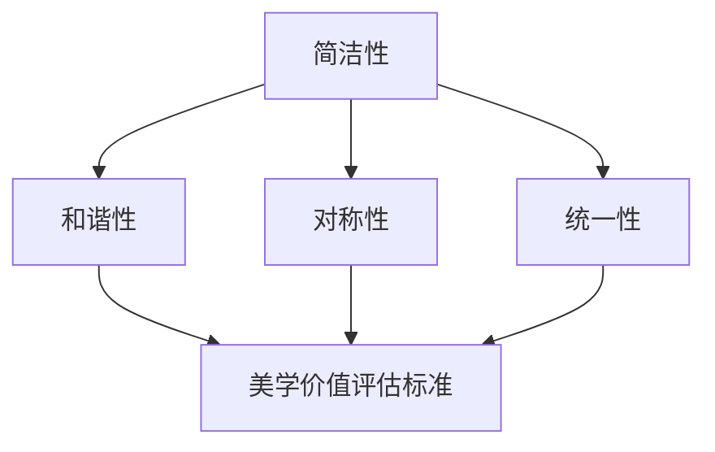
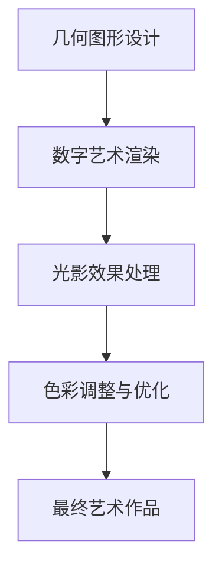

                 

### 文章标题

《数学美学在数字艺术创作中的应用》

> 关键词：数学美学、数字艺术、数学结构、数学方程、数学概率、动画创作、游戏设计、虚拟现实、人工智能

> 摘要：本文将深入探讨数学美学在数字艺术创作中的广泛应用。从数学美学的定义与起源，到其在数字艺术创作中的基础概念，再到具体应用，本文通过实例和算法原理，全面解析数学美学如何为数字艺术注入新的生命力。

---

### 第一部分：引言与核心概念

#### 第1章：数学美学的概述

##### 1.1 数学美学的定义与起源

数学美学是美学与数学交叉融合的产物，起源于人类对美的追求与数学的抽象表达。数学美学的核心在于通过数学的精确性和逻辑性，探索和表现美的本质。

- **定义**：数学美学是指运用数学的符号系统、结构形式、逻辑推理等手段，对美的现象进行描述、分析和创造。

- **起源**：数学美学的概念在古希腊时期已有萌芽，古希腊哲学家毕达哥拉斯提出“万物皆数”的观点，认为宇宙的本质是数的和谐与比例。这种思想奠定了数学美学的哲学基础。

##### 1.2 数学美学在艺术中的意义

数学美学在艺术中的意义主要体现在以下几个方面：

- **形式美感**：数学的美感体现在其简洁、对称和和谐的结构上。比如黄金比例、对称图形等，这些数学元素被广泛应用于艺术创作中，增强了作品的形式美感。

- **逻辑思维**：数学美学的应用有助于艺术家在创作过程中培养逻辑思维能力，使艺术作品更具深度和逻辑性。

- **创新灵感**：数学的抽象性和逻辑性为艺术家提供了丰富的创作灵感，使艺术作品在形式和内容上更加新颖独特。

##### 1.3 数学美学的基本原则

数学美学的基本原则主要包括简洁性、和谐性、对称性和统一性。

- **简洁性**：数学美学的作品往往追求简洁明了，去掉多余的装饰，凸显核心美。

- **和谐性**：数学美学的作品强调各部分之间的和谐统一，如同数学中的平衡与稳定。

- **对称性**：对称是数学美学的重要原则，许多艺术作品通过对称结构展现数学的和谐美。

- **统一性**：数学美学的作品追求整体的一致性和连贯性，使各个部分相互联系，形成统一的整体。

#### 第2章：数字艺术创作基础

##### 2.1 数字艺术的发展历程

数字艺术的发展经历了从计算机辅助艺术到独立数字艺术的转变。早期，数字艺术主要应用于工业设计、广告等领域，随着技术的进步，数字艺术逐渐成为一种独立的创作形式，涵盖了绘画、雕塑、动画、游戏等多个领域。

##### 2.2 数字艺术的创作工具

数字艺术的创作工具包括计算机软件、硬件和各种辅助设备。常见的数字艺术创作工具有Adobe Photoshop、Illustrator、CorelDRAW等图形软件，3ds Max、Maya等三维建模软件，以及各种开源工具和插件。

##### 2.3 数字艺术的创作方法

数字艺术的创作方法多样，包括绘画、建模、动画、渲染等。每种方法都有其独特的创作流程和技术要点。

- **绘画**：通过数字笔刷和色彩调整进行创作，注重线条、色彩和纹理的表现。

- **建模**：使用三维建模软件创建三维物体，通过调整几何形状和材质属性，实现立体效果。

- **动画**：通过帧帧渲染或关键帧动画技术，实现角色或物体的动态表现。

- **渲染**：通过物理引擎和光线追踪等技术，对数字场景进行逼真渲染，展现细节和光影效果。

### 第二部分：数学美学在数字艺术中的应用

#### 第3章：数学结构与数字艺术

##### 3.1 几何图形与数字艺术

几何图形是数字艺术创作中的重要元素，通过数学结构的精确描述，可以创造出丰富多彩的艺术作品。

- **黄金比例**：黄金比例是数学美学的重要概念，被广泛应用于艺术创作中，如绘画、雕塑、建筑等。

- **对称图形**：对称图形在数学美学中具有重要地位，通过镜像对称、旋转对称等手法，可以创造出具有独特美感的艺术作品。

- **多边形**：多边形是数字艺术中常用的几何形状，通过不同多边形的组合，可以创造出丰富的视觉效果。

##### 3.2 数学对称性与数字艺术

对称性是数学美学的重要特征，在数字艺术创作中具有广泛的应用。

- **轴对称**：轴对称作品通过镜像反射，产生简洁和谐的美感。

- **旋转对称**：旋转对称作品通过旋转操作，形成循环往复的动态美感。

- **多轴对称**：多轴对称作品通过多个对称轴的交错，形成复杂而统一的美感。

##### 3.3 数学曲线与数字艺术

数学曲线是数字艺术创作中的重要工具，通过曲线的数学描述，可以创造出丰富的视觉效果。

- **贝塞尔曲线**：贝塞尔曲线是一种二次曲线，通过调整控制点，可以创造出各种形状的曲线，广泛应用于图形设计、动画制作等领域。

- **B样条曲线**：B样条曲线是一种三次曲线，具有较好的平滑性和可控性，常用于三维建模、动画制作等领域。

- **样条曲线**：样条曲线是一种多段曲线组合，通过不同曲线段的拼接，可以创造出复杂的曲线形状，具有广泛的应用价值。

### 第4章：数学方程与数字艺术

##### 4.1 微积分与数字艺术

微积分是数学中的重要分支，其概念和方法在数字艺术创作中具有广泛的应用。

- **微积分基本定理**：微积分基本定理描述了积分和微分之间的关系，可以用于求解曲线的长度、曲率和面积等。

- **微分方程**：微分方程是描述物理现象和工程问题的重要数学工具，在数字艺术创作中，可以用于模拟自然现象、物理效果等。

- **微积分图像处理**：微积分方法可以用于图像处理，如边缘检测、图像平滑等。

##### 4.2 傅里叶变换与数字艺术

傅里叶变换是数字艺术中重要的数学工具，可以用于图像处理、音频处理等领域。

- **傅里叶变换基本原理**：傅里叶变换是一种将信号从时域转换到频域的数学方法，可以揭示信号的频率成分。

- **图像处理中的傅里叶变换**：傅里叶变换可以用于图像的频域分析，如滤波、边缘检测等。

- **音频处理中的傅里叶变换**：傅里叶变换可以用于音频信号的频域分析，如音高检测、音色分析等。

##### 4.3 复数与数字艺术

复数是数学中的重要概念，在数字艺术创作中具有广泛的应用。

- **复数的表示**：复数由实部和虚部组成，可以用平面直角坐标系表示。

- **复数的运算**：复数的运算包括加法、减法、乘法和除法，可以用于图像处理、音频处理等领域。

- **复数在数字艺术中的应用**：复数可以用于生成复杂的几何图形、实现图像的变换和动画效果等。

### 第5章：数学概率论与数字艺术

##### 5.1 概率论基本概念

概率论是数学的一个重要分支，其基本概念在数字艺术创作中具有广泛的应用。

- **概率的定义**：概率是描述随机事件发生可能性大小的数值。

- **概率的运算**：概率的运算包括加法、减法、乘法和除法，可以用于计算多个随机事件同时发生的概率。

- **概率分布**：概率分布描述了随机变量在不同取值上的概率分布情况。

##### 5.2 随机过程与数字艺术

随机过程是概率论中的重要概念，可以用于模拟自然现象和工程问题。

- **随机过程的基本概念**：随机过程是一种随机变量的序列，可以用于描述随机现象的发展过程。

- **随机过程在数字艺术中的应用**：随机过程可以用于生成自然景观、动态效果等。

- **随机过程与图像处理**：随机过程可以用于图像的去噪、边缘检测等。

##### 5.3 概率分布与数字艺术

概率分布是概率论中的重要概念，可以用于描述随机变量的分布情况。

- **概率分布的类型**：常见的概率分布包括正态分布、泊松分布、二项分布等。

- **概率分布的应用**：概率分布可以用于图像的降噪、颜色调整等。

- **概率分布与数字艺术创作**：概率分布可以用于生成随机图案、动态效果等。

### 第三部分：数学美学与数字艺术实践

#### 第6章：数学美学在动画创作中的应用

##### 6.1 数学原理在动画中的运用

数学原理在动画创作中具有广泛的应用，可以提升动画的视觉效果和表现力。

- **贝塞尔曲线**：贝塞尔曲线可以用于动画中的角色运动轨迹设计，实现平滑流畅的运动效果。

- **微积分**：微积分可以用于动画中的物理效果模拟，如碰撞、弹跳等。

- **概率分布**：概率分布可以用于动画中的随机效果生成，如自然景观、特效等。

##### 6.2 动画中的数学对称与节奏

数学对称与节奏是动画创作中的重要元素，可以增强动画的美感和节奏感。

- **轴对称**：轴对称可以用于动画中的角色设计，实现简洁和谐的效果。

- **旋转对称**：旋转对称可以用于动画中的场景设计，形成循环往复的节奏感。

- **对称与节奏的结合**：对称与节奏的结合可以用于动画中的整体设计，实现动静结合、错落有致的效果。

##### 6.3 动画中的数学模型实现

动画中的数学模型实现是动画创作中的重要环节，可以提升动画的逼真度和表现力。

- **运动学模型**：运动学模型可以用于动画中的角色运动设计，实现真实自然的运动效果。

- **光学模型**：光学模型可以用于动画中的光线追踪和渲染，实现逼真的光影效果。

- **动力学模型**：动力学模型可以用于动画中的物理效果模拟，实现真实的碰撞、弹跳等效果。

#### 第7章：数学美学在游戏设计中的应用

##### 7.1 数学元素在游戏世界设计中的应用

数学元素在游戏世界设计中具有广泛的应用，可以提升游戏的视觉效果和游戏体验。

- **几何图形**：几何图形可以用于游戏世界的场景设计，实现简洁而富有美感的视觉效果。

- **数学对称**：数学对称可以用于游戏世界的场景设计，实现对称和谐的游戏环境。

- **数学曲线**：数学曲线可以用于游戏世界的路径设计，实现平滑流畅的游戏体验。

##### 7.2 游戏中的数学逻辑与策略

游戏中的数学逻辑与策略是游戏设计中的重要元素，可以提升游戏的策略性和可玩性。

- **概率论**：概率论可以用于游戏中的随机事件设计，实现公平性和可预测性。

- **微积分**：微积分可以用于游戏中的物理效果模拟，实现真实的物理反应。

- **线性代数**：线性代数可以用于游戏中的角色动作设计，实现平滑的运动效果。

##### 7.3 游戏中的数学模型分析

游戏中的数学模型分析是游戏设计中的重要环节，可以提升游戏的性能和表现力。

- **运动学模型**：运动学模型可以用于游戏中的角色运动设计，实现真实自然的运动效果。

- **光学模型**：光学模型可以用于游戏中的光线追踪和渲染，实现逼真的光影效果。

- **动力学模型**：动力学模型可以用于游戏中的物理效果模拟，实现真实的碰撞、弹跳等效果。

#### 第8章：数学美学在虚拟现实中的应用

##### 8.1 虚拟现实中的数学原理

虚拟现实中的数学原理是虚拟现实技术的重要基础，可以提升虚拟现实的效果和体验。

- **几何图形**：几何图形可以用于虚拟现实中的场景建模，实现逼真的三维视觉效果。

- **数学对称**：数学对称可以用于虚拟现实中的场景设计，实现对称和谐的游戏环境。

- **数学曲线**：数学曲线可以用于虚拟现实中的路径设计，实现平滑流畅的游戏体验。

##### 8.2 虚拟现实中的数学艺术表达

虚拟现实中的数学艺术表达是虚拟现实技术中的重要应用，可以提升虚拟现实的艺术性和表现力。

- **概率论**：概率论可以用于虚拟现实中的随机事件设计，实现公平性和可预测性。

- **微积分**：微积分可以用于虚拟现实中的物理效果模拟，实现真实的物理反应。

- **线性代数**：线性代数可以用于虚拟现实中的角色动作设计，实现平滑的运动效果。

##### 8.3 虚拟现实中的数学模型实现

虚拟现实中的数学模型实现是虚拟现实技术中的重要环节，可以提升虚拟现实的性能和表现力。

- **运动学模型**：运动学模型可以用于虚拟现实中的角色运动设计，实现真实自然的运动效果。

- **光学模型**：光学模型可以用于虚拟现实中的光线追踪和渲染，实现逼真的光影效果。

- **动力学模型**：动力学模型可以用于虚拟现实中的物理效果模拟，实现真实的碰撞、弹跳等效果。

### 第四部分：数学美学在数字艺术创作的未来趋势

#### 第9章：数学美学与人工智能的结合

##### 9.1 人工智能在数学美学中的应用

人工智能在数学美学中的应用日益广泛，可以提升数学美学的创作效率和效果。

- **深度学习**：深度学习可以用于生成数学美学的艺术作品，如生成对抗网络（GAN）可以生成具有数学美感的图像。

- **神经网络**：神经网络可以用于数学美学的算法优化，提高数学模型的计算效率和准确性。

- **计算机视觉**：计算机视觉可以用于数学美学的图像分析，提取图像中的数学结构和特征。

##### 9.2 机器学习在数字艺术创作中的应用

机器学习在数字艺术创作中的应用日益广泛，可以提升数字艺术创作的效率和质量。

- **图像生成**：机器学习可以用于生成数字艺术作品，如生成对抗网络（GAN）可以生成逼真的数字图像。

- **风格迁移**：机器学习可以用于艺术风格迁移，将一种艺术风格应用到另一幅图像上。

- **音频处理**：机器学习可以用于音频处理，如语音识别、音乐生成等。

##### 9.3 人工智能与数学美学的未来展望

人工智能与数学美学的结合具有广阔的发展前景，有望在以下几个方面取得重要突破：

- **自动化创作**：人工智能可以自动化生成数学美学的艺术作品，提高创作效率。

- **个性化创作**：人工智能可以根据用户的喜好和需求，生成个性化的数学美学作品。

- **艺术风格融合**：人工智能可以将不同艺术风格融合在一起，创造出全新的艺术形式。

#### 第10章：数学美学在数字艺术创作的挑战与机遇

##### 10.1 数学美学在数字艺术创作中的挑战

数学美学在数字艺术创作中面临着一系列挑战：

- **技术实现难度**：数学美学的实现需要强大的计算能力和复杂的算法，对技术实现提出了高要求。

- **艺术与技术的结合**：数学美学需要艺术家和程序员紧密合作，实现艺术与技术的完美结合。

- **用户体验**：数学美学作品需要满足用户的需求和审美标准，提高用户体验。

##### 10.2 数学美学在数字艺术创作中的机遇

数学美学在数字艺术创作中也面临着一系列机遇：

- **创新驱动**：数学美学的应用可以推动数字艺术创作的创新，产生新的艺术形式和风格。

- **市场潜力**：随着数字艺术的普及，数学美学作品的商业价值日益凸显，具有广阔的市场潜力。

- **技术与艺术的融合**：数学美学的应用可以促进技术与艺术的深度融合，推动艺术创作的新发展。

##### 10.3 数字艺术创作与数学美学的持续发展

数学美学在数字艺术创作中的持续发展需要：

- **技术创新**：不断引入新的技术手段，提高数学美学的创作效率和效果。

- **艺术实践**：鼓励艺术家和程序员进行艺术实践，探索数学美学的创作方法和技巧。

- **教育普及**：加强对数学美学知识的普及和传播，提高公众对数学美学的认识和理解。

### 附录

#### 附录 A：数学美学与数字艺术创作工具介绍

- **常用数字艺术创作工具**：介绍常用的数字艺术创作工具，如Adobe Photoshop、Illustrator、3ds Max、Maya等。

- **数学计算工具介绍**：介绍用于数学计算的软件和工具，如MATLAB、Mathematica、Python等。

- **跨平台数字艺术创作软件**：介绍适用于多种操作系统的数字艺术创作软件，如GIMP、Inkscape、Blender等。

#### 附录 B：数学美学与数字艺术创作实践案例

- **动画案例解析**：分析数学美学在动画创作中的应用案例，如《冰雪奇缘》、《疯狂动物城》等。

- **游戏案例解析**：分析数学美学在游戏设计中的应用案例，如《我的世界》、《堡垒之夜》等。

- **虚拟现实案例解析**：分析数学美学在虚拟现实中的应用案例，如《节奏光剑》、《Beat Saber》等。

### 图表

#### 第1章：数学美学的基本原则流程图



#### 第3章：几何图形与数字艺术的应用流程图



### 核心算法原理讲解

#### 第4章：傅里叶变换的原理与数字艺术的应用

##### 傅里叶变换的基本原理

傅里叶变换是一种重要的数学工具，它可以将信号从时域转换到频域。在数字艺术创作中，傅里叶变换被广泛应用于图像处理、音频处理等领域。

##### 傅里叶变换的定义

傅里叶变换的数学定义如下：

\[ F(\omega) = \int_{-\infty}^{\infty} f(t) \cdot e^{-j\omega t} dt \]

其中，\( f(t) \) 是时域信号，\( F(\omega) \) 是频域信号，\( \omega \) 是频率。

##### 傅里叶变换的性质

1. **线性性质**：傅里叶变换是线性变换，即两个信号的叠加仍然可以通过傅里叶变换分别处理后再叠加得到。
2. **平移性质**：时域信号 \( f(t) \) 的平移会导致频域信号的平移。
3. **尺度性质**：时域信号 \( f(t) \) 的伸缩会导致频域信号的伸缩。

##### 傅里叶变换在数字艺术中的应用

在数字艺术中，傅里叶变换主要用于图像处理和音频处理。

- **图像处理**：傅里叶变换可以用于图像的频域分析，如滤波、边缘检测等。

  ```python
  import numpy as np
  import matplotlib.pyplot as plt

  # 假设 f(x, y) 是一个图像信号
  f = np.fft.fft2(image_data)
  f_shifted = np.fft.fftshift(f)
  magnitude_spectrum = 20 * np.log(np.abs(f_shifted))
  plt.figure()
  plt.subplot(121), plt.imshow(image_data, cmap='gray')
  plt.title('Input Image'), plt.xticks([]), plt.yticks([])
  plt.subplot(122), plt.imshow(magnitude_spectrum, cmap='gray')
  plt.title('Magnitude Spectrum'), plt.xticks([]), plt.yticks([])
  plt.show()
  ```

- **音频处理**：傅里叶变换可以用于音频信号的频域分析，如音高检测、音色分析等。

  ```python
  import numpy as np
  import matplotlib.pyplot as plt

  # 假设 x(t) 是一个音频信号
  audio_signal = np.array([...])  # 音频信号数据
  audio_signal_fft = np.fft.fft(audio_signal)
  audio_signal_fft_shifted = np.fft.fftshift(audio_signal_fft)
  magnitude_spectrum_audio = 20 * np.log(np.abs(audio_signal_fft_shifted))
  plt.plot(magnitude_spectrum_audio)
  plt.title('Audio Spectrum')
  plt.xlabel('Frequency (Hz)')
  plt.ylabel('Magnitude (dB)')
  plt.show()
  ```

### 作者

作者：AI天才研究院/AI Genius Institute & 禅与计算机程序设计艺术 /Zen And The Art of Computer Programming

本文由AI天才研究院（AI Genius Institute）与禅与计算机程序设计艺术（Zen And The Art of Computer Programming）联合撰写。AI天才研究院致力于推动人工智能技术的发展和应用，而禅与计算机程序设计艺术则强调通过禅修提升程序员的思维能力和创造力。本文旨在探讨数学美学在数字艺术创作中的应用，为读者提供有价值的见解和思路。

