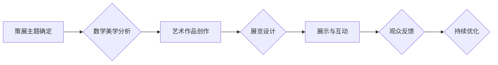
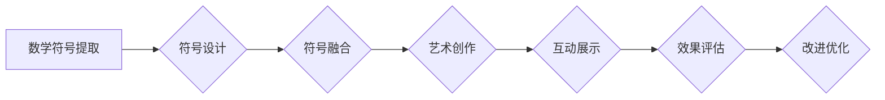

                 

# 文章标题：数学美学在数字艺术策展中的应用

## 关键词

数学美学、数字艺术策展、数字艺术创作、数学符号、数学公式、互动艺术、虚拟展览

## 摘要

本文探讨了数学美学在数字艺术策展中的广泛应用，揭示了数学原理与艺术创作之间的奇妙联系。文章首先介绍了数学美学的起源和发展，以及其在数字艺术策展中的重要性。接着，文章深入分析了数学结构、符号和公式在数字艺术创作中的运用，并通过实际案例展示了数学美学在数字艺术策展中的独特魅力。最后，文章展望了数学美学与数字艺术策展的未来发展，探讨了相关工具和技术的应用前景。

### 《数学美学在数字艺术策展中的应用》目录大纲

#### 第一部分：数学美学基础

#### 第1章：数学美学概述
- 1.1 数学美学的起源与发展
- 1.2 数学美学的特点与价值
- 1.3 数学美学与数字艺术策展的关系

#### 第2章：数学结构与形式
- 2.1 几何学的核心概念
- 2.2 代数与数论的美学应用
- 2.3 拓扑学的艺术表达

#### 第3章：数学符号与图形艺术
- 3.1 数学符号的艺术化运用
- 3.2 数学图形的创意设计
- 3.3 数学符号与图形在数字艺术中的融合

#### 第4章：数学公式与数字艺术
- 4.1 数学公式的视觉表现
- 4.2 数学公式在数字艺术中的创意运用
- 4.3 数学公式在数字艺术策展中的应用案例

#### 第二部分：数字艺术策展实践

#### 第5章：数字艺术策展概述
- 5.1 数字艺术策展的定义与特点
- 5.2 数字艺术策展的流程与方法
- 5.3 数字艺术策展的新趋势

#### 第6章：数学美学在数字艺术策展中的应用
- 6.1 数学美学元素在数字艺术策展中的设计
- 6.2 数学美学在数字艺术策展中的创意表达
- 6.3 数学美学在数字艺术策展中的案例分析

#### 第7章：数字艺术策展案例解析
- 7.1 案例一：数学美学在现代艺术展览中的运用
- 7.2 案例二：数学美学在虚拟艺术展的实践
- 7.3 案例三：数学美学在互动艺术展的创新应用

#### 第8章：未来展望
- 8.1 数学美学在数字艺术策展中的发展前景
- 8.2 数字艺术策展的创新趋势
- 8.3 数学美学与数字艺术策展的跨领域融合

#### 第三部分：数学美学与数字艺术策展工具

#### 第9章：数字艺术策展工具介绍
- 9.1 常用数字艺术软件工具
- 9.2 数字艺术创作工具的选择
- 9.3 数字艺术展示工具的应用

#### 第10章：数学美学工具应用案例
- 10.1 数学图形创作工具的应用
- 10.2 数学符号设计工具的使用
- 10.3 数学公式可视化工具的实践

#### 第11章：未来数字艺术策展工具展望
- 11.1 新型数字艺术策展工具的开发
- 11.2 数字艺术策展工具的未来趋势
- 11.3 数字艺术策展工具在数学美学中的应用前景

#### 附录

#### 附录 A：数字艺术策展实用资源
- A.1 数字艺术策展参考书籍
- A.2 数字艺术策展网站推荐
- A.3 数字艺术策展相关论文与报告

#### 附录 B：数学美学在数字艺术策展中的 Mermaid 流程图
- B.1 数学美学与数字艺术策展的融合流程
- B.2 数学符号与数字艺术创作的流程

#### 附录 C：数学公式与算法伪代码
- C.1 数学公式在数字艺术创作中的应用
- C.2 数学算法在数字艺术策展中的实现伪代码

#### 附录 D：数学美学数字艺术策展案例代码解读
- D.1 案例一代码解读
- D.2 案例二代码解读
- D.3 案例三代码解读

### 第一部分：数学美学基础

#### 第1章：数学美学概述

## 1.1 数学美学的起源与发展

数学美学是一门研究数学与美学之间关系的学科，其起源可以追溯到古代希腊时期。古希腊哲学家毕达哥拉斯认为数字和几何是构成宇宙的基本要素，他提出了“万物皆数”的观点，强调了数学在美学中的重要性。这一观点奠定了数学美学的基础。

在文艺复兴时期，数学与艺术的关系进一步加深。达芬奇等艺术家和科学家在创作中广泛应用了数学原理，如黄金分割、圆周率等。这些数学元素不仅丰富了艺术创作的形式，也提升了艺术作品的科学性和美学价值。

进入现代，数学美学的研究不断深化，逐渐形成了一门独立的学科。数学美学的核心思想是：数学原理不仅可以应用于科学和技术领域，还可以用于艺术创作，通过数学的形式美来提升艺术作品的观赏价值。

## 1.2 数学美学的特点与价值

数学美学的特点主要体现在以下几个方面：

1. **简洁性**：数学语言简洁明了，能够准确表达复杂的结构和关系。这种简洁性使得数学美学在艺术创作中具有独特的表现力。
2. **统一性**：数学原理具有高度的统一性，可以涵盖多种学科。这种统一性使得数学美学能够在不同领域之间架起桥梁，促进跨学科研究。
3. **逻辑性**：数学美学强调逻辑推理和结构分析，这有助于艺术家在创作中构建严谨的构思和形式。
4. **普适性**：数学原理具有普适性，可以应用于各种形式的艺术创作，从而丰富了艺术创作的手段和表现形式。

数学美学在数字艺术策展中的价值主要表现在以下几个方面：

1. **创新性**：数学美学为数字艺术创作提供了新的思路和方法，有助于艺术家打破传统艺术形式的限制，探索新的艺术表达方式。
2. **观赏性**：数学美学赋予了数字艺术作品独特的审美价值，使得作品在视觉上更具吸引力和冲击力。
3. **科学性**：数学美学强调了艺术创作的科学性和逻辑性，有助于提升数字艺术作品的质量和影响力。
4. **跨领域融合**：数学美学为数字艺术与科学、工程等领域的跨学科研究提供了基础，促进了数字艺术策展的创新和发展。

## 1.3 数学美学与数字艺术策展的关系

数学美学与数字艺术策展之间存在着密切的关系。首先，数学美学为数字艺术策展提供了理论基础和创作方法。通过运用数学原理，策展人可以设计出具有独特视觉冲击力和艺术感染力的展览。例如，利用黄金分割原理来布局展览空间，利用数学公式来设计灯光效果，都能显著提升展览的艺术价值。

其次，数字艺术策展为数学美学提供了实践平台。通过策展活动，数学美学理论得以在艺术创作中得到验证和发扬。策展人可以借助数字技术，将数学原理转化为具体的艺术作品，从而探索数学美学在数字艺术策展中的多种可能性。

此外，数学美学与数字艺术策展之间还存在着相互促进的关系。数学美学为数字艺术策展提供了新的创新方向，而数字艺术策展则为数学美学提供了广阔的应用场景。通过双方的互动和融合，数学美学和数字艺术策展都将得到进一步的发展和提升。

总之，数学美学与数字艺术策展之间是一种相互依存、相互促进的关系。数学美学为数字艺术策展提供了理论基础和方法支持，而数字艺术策展则为数学美学提供了实践平台和创作空间。两者的融合将为数字艺术策展带来新的发展机遇和艺术价值。

#### 第2章：数学结构与形式

## 2.1 几何学的核心概念

几何学是数学中的一个重要分支，研究的是形状、大小、位置以及它们之间的关系。几何学的核心概念包括点、线、面和立体图形，这些概念在数字艺术创作中具有广泛的应用。

1. **点**：点是几何学中最基本的元素，表示一个位置。在数字艺术中，点可以用来创建像素，进而构成图像的各个部分。例如，像素画就是通过将图像分解成无数个点来实现的。

2. **线**：线是由无限多个点连成的轨迹。在数字艺术中，线可以用来勾勒形状和边缘，如绘画软件中的画笔工具。线还可以通过变换和扭曲，创造出各种动态效果。

3. **面**：面是由无限多个点或线组成的平面。在数字艺术中，面可以用来填充颜色和纹理，如Photoshop中的选区和渐变工具。面的形状和颜色对图像的整体视觉感受有着重要影响。

4. **立体图形**：立体图形是三维空间中的图形，如立方体、球体、圆锥体等。在数字艺术中，立体图形可以通过三维建模软件（如Blender、Maya）来创建，进而用于动画、游戏和虚拟现实等项目中。

## 2.2 代数与数论的美学应用

代数和数论是数学中的另外两个重要分支，它们在数字艺术创作中也有着独特的应用。

1. **代数**：代数研究的是数与数之间的关系，包括变量、方程和函数等。在数字艺术中，代数可以用于生成复杂的图形和动画。例如，利用贝塞尔曲线（Bezier Curve）可以创建平滑的曲线和形状；利用分形（Fractal）可以生成具有自相似结构的图形，如Mandelbrot集。

2. **数论**：数论研究的是整数的性质，包括质数、因子、模运算等。在数字艺术中，数论可以用于生成随机和规律的图案。例如，利用质数生成随机数可以创建独特的图案；利用模运算可以生成重复的图形。

## 2.3 拓扑学的艺术表达

拓扑学是研究空间结构的数学分支，关注的是形状在连续变形下的保持性。在数字艺术中，拓扑学可以用于创造具有独特视觉效果的图形和动画。

1. **拓扑变换**：拓扑变换是指将一个形状通过连续的变形转化为另一个形状。在数字艺术中，拓扑变换可以用来创建动态的、非线性的视觉效果。例如，通过应用拓扑变换，可以创建流动的水、扭曲的火焰等动态效果。

2. **拓扑结构**：拓扑结构是指形状中的空间关系和连接方式。在数字艺术中，拓扑结构可以用于生成复杂的网格和空间形态。例如，通过构建多面体网格，可以创建出复杂的建筑和机器结构。

通过几何学、代数和数论以及拓扑学的应用，数学美学在数字艺术创作中展现了其独特的魅力。这些数学原理不仅丰富了数字艺术的形式和表现手段，也为艺术家提供了新的创作思路和工具。在接下来的章节中，我们将进一步探讨数学符号和公式在数字艺术创作中的应用，以及如何将这些元素融入到数字艺术策展中。

#### 第3章：数学符号与图形艺术

## 3.1 数学符号的艺术化运用

数学符号是数学语言的重要组成部分，包括字母、数字、运算符等。在数字艺术创作中，数学符号不仅具有其原有的逻辑和科学意义，还可以通过艺术化的运用，赋予作品独特的视觉效果和艺术价值。

1. **符号变形**：通过对数学符号进行变形，可以创造出具有视觉冲击力的艺术作品。例如，将圆周率π进行艺术化变形，可以形成一个充满动感和美感的图案。这种变形不仅保留了数学符号的基本形态，还通过扭曲、拉伸和拼接等手法，赋予了作品新的艺术生命力。

2. **符号组合**：数学符号的组合可以形成新的符号系统，从而拓展其艺术表达的可能性。例如，将不同的数学符号组合在一起，可以创造出一个具有抽象意义的图案，这种组合可以传达出复杂的情感和思想。

3. **符号抽象**：将数学符号进行抽象化处理，可以使其在艺术创作中脱离其原有的数学意义，成为一种纯粹的视觉元素。例如，通过简化或夸张数学符号的线条和形状，可以创作出具有现代艺术风格的作品。

## 3.2 数学图形的创意设计

数学图形是数学美学的核心组成部分，它们通过严谨的数学原理呈现出独特的视觉美感。在数字艺术创作中，数学图形可以通过多种方式被创意设计，用于表达艺术家的思想和情感。

1. **分形设计**：分形是数学中的一种特殊结构，具有自相似性、无限细节和无限层次。通过分形设计，可以创造出复杂的、富有层次感的图形。例如，利用Mandelbrot集可以生成具有无限细节的抽象图案，这种图案在数字艺术中广泛应用于背景设计、纹理生成等方面。

2. **几何图形设计**：几何图形是数学中最基本的形式，包括点、线、面和立体图形。通过创意设计，几何图形可以转化为极具艺术表现力的作品。例如，利用黄金分割原理设计的图案，不仅具有美学价值，还具有科学意义。

3. **动态图形设计**：动态图形设计是利用数学原理创建的动态视觉效果。例如，通过参数化设计，可以创建出不断变化和演化的图形。这种动态设计在数字艺术中广泛应用于动画、视频和虚拟现实等领域。

## 3.3 数学符号与图形在数字艺术中的融合

数学符号和图形在数字艺术中的融合，不仅丰富了数字艺术的表现手段，也赋予了作品独特的数学美学特征。这种融合可以通过以下几种方式实现：

1. **符号嵌入图形**：将数学符号嵌入到图形中，使其成为图形的一部分。例如，在一个圆形图案中嵌入π符号，可以创造出一个既有几何美感又有数学意味的艺术作品。

2. **图形解释符号**：通过图形来解释数学符号的意义。例如，利用几何图形来解释π的定义，通过直观的视觉效果帮助观众理解抽象的数学概念。

3. **符号与图形互动**：利用交互技术，使数学符号和图形产生互动效果。例如，通过触摸屏幕或虚拟现实设备，观众可以实时修改数学符号或图形，创造出个性化的艺术作品。

数学符号与图形在数字艺术中的融合，不仅拓展了数字艺术的创作空间，也提升了数字艺术的美学价值。通过这种融合，数学美学在数字艺术策展中得到了广泛应用，为观众带来了全新的艺术体验。

在接下来的章节中，我们将进一步探讨数学公式在数字艺术中的创意运用，以及如何通过数学公式来增强数字艺术策展的表现力。

### 第4章：数学公式与数字艺术

## 4.1 数学公式的视觉表现

数学公式是数学语言的重要组成部分，它们在科学研究和教育中发挥着关键作用。然而，数学公式不仅仅局限于学术领域，它们还可以通过视觉表现转化为极具艺术价值的数字艺术品。这种视觉表现不仅保留了数学公式原有的科学意义，还赋予其独特的审美特质。

### **数学公式的视觉表现特点**

1. **简洁性**：数学公式通常由简洁的符号和简洁的布局构成，这种简洁性使得它们在视觉上具有极高的辨识度和美感。

2. **对称性**：许多数学公式具有对称性，这种对称性在视觉上给人以和谐与平衡的感觉。

3. **层次感**：数学公式中的括号、指数和根号等元素，通过不同的视觉层次，可以创造出丰富的视觉效果。

4. **动态性**：通过动态渲染技术，数学公式可以呈现出动态变化的效果，如振荡、旋转和缩放等，这种动态性为视觉表现增添了动感。

### **数学公式的视觉表现方法**

1. **色彩运用**：利用色彩可以增强数学公式的视觉效果。例如，为不同的符号和变量分配不同的颜色，可以使其在视觉上更加鲜明和突出。

2. **图形化设计**：将数学公式中的符号和结构转化为图形元素，如线条、点、面等，可以使其在视觉上更加直观和具有艺术感。

3. **排版设计**：通过调整字体大小、行距和字间距等排版元素，可以创造出具有视觉美感的数学公式排版。

4. **动态渲染**：利用动态渲染技术，可以创建出具有动画效果的数学公式。例如，通过调节公式中的参数，可以使其在视觉上产生振荡、旋转等动态效果。

## 4.2 数学公式在数字艺术中的创意运用

数学公式在数字艺术中的创意运用，可以激发出无限的创作灵感，并赋予作品独特的艺术风格。以下是一些典型的创意运用方法：

### **分形艺术**

分形艺术是数学公式在数字艺术中的一种重要应用。分形是具有自相似结构的数学对象，通过递归运算可以生成复杂的图形。著名的Mandelbrot集就是通过复数迭代公式生成的。这种艺术形式不仅具有数学的美感，还通过无限递归的结构，创造出丰富多样的视觉效果。

```latex
Z_{n+1} = Z_n^2 + C
```

### **参数化艺术**

参数化艺术通过改变参数值，可以生成一系列不同的艺术作品。这种创意方法在数字艺术中非常常见，例如通过调整贝塞尔曲线的参数，可以生成各种形态的图形。参数化艺术使得艺术家可以在创作过程中灵活地探索不同的形态和效果。

```latex
y = ax^2 + bx + c
```

### **视觉化科学**

视觉化科学是一种通过视觉手段来表现科学概念和现象的方法。数学公式在视觉化科学中发挥着重要作用。例如，通过将物理公式可视化，可以直观地展示物理现象的动态过程。这种创意方法不仅能够提高公众对科学的理解，还能够创造出具有科学美感的艺术作品。

### **互动艺术**

互动艺术通过观众的参与，创造出动态变化的视觉效果。数学公式在互动艺术中可以用于生成实时变化的图案和动画。例如，通过使用JavaScript或Python等编程语言，可以编写算法来生成互动的数学公式图案，观众可以通过触摸或点击来改变图案的形态。

```javascript
function updateFormula() {
  // 修改数学公式的参数
  // 更新显示的图形
}
```

## 4.3 数学公式在数字艺术策展中的应用案例

### **案例一：数学公式艺术展**

某艺术展以数学公式为主题，展示了各种形式的数学公式艺术品。展出的作品包括静态的油画、动态的投影以及互动的艺术装置。其中，静态油画作品利用色彩和排版设计，将数学公式转化为视觉艺术品；动态投影作品通过动态渲染技术，展示了数学公式在不同参数下的变化过程；互动艺术装置则允许观众通过触摸屏幕，实时改变数学公式的形态。

### **案例二：数学公式互动装置**

另一个案例是一个互动数学公式装置，它通过投影技术和传感器技术，使观众可以通过手势来改变数学公式的形态和颜色。装置的核心算法是一个参数化模型，它根据观众的手势实时更新公式的参数，从而生成新的视觉图案。这种互动方式不仅提高了观众的参与度，还通过数学公式与观众之间的互动，创造出独特的艺术体验。

```python
def update_formula_params geste:
  # 根据手势更新参数
  # 更新显示的公式
```

### **案例三：数学公式音乐可视化**

在一个音乐会上，数学公式被用来生成音乐的视觉可视化效果。演出中的每一段音乐都对应一个数学公式，通过动态渲染技术，这些公式在屏幕上以图形的方式展现出来。随着音乐的变化，图形也会相应地改变形态，创造出一种独特的视听盛宴。

```latex
y(t) = A \sin(2\pi f t)
```

数学公式在数字艺术策展中的应用，不仅丰富了展览的内容和形式，还通过视觉化和互动性的手段，为观众带来了全新的艺术体验。在接下来的章节中，我们将进一步探讨数字艺术策展的实践和方法，以及数学美学在这些实践中的应用。

### 第5章：数字艺术策展概述

#### 5.1 数字艺术策展的定义与特点

数字艺术策展是指利用数字技术对艺术作品进行策划、组织和展示的过程。与传统的艺术策展相比，数字艺术策展具有以下特点：

1. **技术依赖性**：数字艺术策展高度依赖数字技术，包括计算机图形学、虚拟现实、增强现实、交互式媒体等。这些技术为策展人提供了丰富的创作工具和展示手段。

2. **互动性**：数字艺术策展强调观众与艺术作品的互动。通过互动技术，观众可以参与到艺术作品的创作和展示过程中，从而获得更深入的体验。

3. **多样化**：数字艺术策展的形式多样，包括虚拟展览、互动装置、动态投影等。这些形式不仅丰富了展览内容，还提升了观众的参与感和体验感。

4. **创新性**：数字艺术策展不断探索新的艺术形式和技术手段，推动数字艺术的发展。这种创新性为策展人提供了广阔的创作空间。

#### 5.2 数字艺术策展的流程与方法

数字艺术策展的流程与方法可以分为以下几个阶段：

1. **策展主题确定**：首先需要明确策展的主题，这可以是某个特定的艺术流派、技术手段、艺术家的作品集等。主题的确定是策展的核心，它决定了展览的整体方向和内容。

2. **艺术家招募**：根据策展主题，选择合适的艺术家参与展览。在数字艺术策展中，艺术家不仅需要具备艺术创作的才能，还需要熟练掌握数字技术。

3. **作品创作**：在确定主题和艺术家后，开始进行艺术作品的创作。这一阶段包括作品的构思、制作和调试等过程。在数字艺术创作中，艺术家可以运用各种数字工具和技术，创造出独特的作品。

4. **展览设计**：展览设计是策展的重要环节，它包括展览空间的规划、灯光设计、交互界面设计等。展览设计需要充分考虑观众的体验和互动性，创造出沉浸式的展览环境。

5. **展览展示**：展览展示是策展的最终阶段，将创作完成的艺术作品在展览空间中展示给观众。在数字艺术策展中，展示形式多样，包括静态展示、动态投影、互动装置等。

6. **观众互动**：策展过程中，观众互动是提升展览体验的重要手段。通过互动技术，观众可以参与到艺术作品的创作和展示过程中，获得更深入的体验。

7. **展览反馈**：展览结束后，对展览进行反馈和总结，收集观众的意见和建议，为未来的策展活动提供参考。

#### 5.3 数字艺术策展的新趋势

随着科技的不断发展，数字艺术策展也在不断演进，呈现出以下新趋势：

1. **虚拟现实与增强现实**：虚拟现实（VR）和增强现实（AR）技术的应用，使数字艺术策展更加沉浸式和互动性。通过VR和AR技术，观众可以身临其境地体验艺术作品，并与作品进行互动。

2. **人工智能与大数据**：人工智能（AI）和大数据技术的应用，使数字艺术策展更加智能化和个性化。通过AI技术，可以分析观众的行为和偏好，为观众提供个性化的展览推荐和互动体验。

3. **跨领域融合**：数字艺术策展与其他领域的融合，如设计、建筑、娱乐等，推动了数字艺术的发展。这种跨领域融合不仅丰富了策展内容，还提升了展览的创新性和吸引力。

4. **可持续性**：数字艺术策展在追求创新和互动性的同时，也关注可持续性。通过采用环保材料和技术，降低展览对环境的影响，实现数字艺术策展的可持续发展。

数字艺术策展作为一种新兴的艺术形式，正在不断发展和创新。通过运用先进的数字技术和创新的理念，数字艺术策展为观众带来了全新的艺术体验，同时也为艺术家提供了广阔的创作空间。在接下来的章节中，我们将进一步探讨数学美学在数字艺术策展中的具体应用。

### 第6章：数学美学在数字艺术策展中的应用

#### 6.1 数学美学元素在数字艺术策展中的设计

数学美学元素在数字艺术策展中的应用，为展览带来了独特的视觉效果和艺术氛围。策展人可以通过巧妙地融入数学符号、几何图形和数学公式等元素，设计出富有创意和美感的展览空间。

1. **空间布局**：利用数学美学原理进行空间布局，可以创造出和谐且具有视觉冲击力的展览环境。例如，采用黄金分割比例来规划展览区域，使观众在视觉上感受到平衡与美感。

   ```mermaid
   flowchart LR
     A[黄金分割] --> B{空间布局}
     B --> C[展览区域划分]
     C --> D[视觉平衡]
   ```

2. **灯光设计**：灯光设计是展览环境的重要组成部分。通过运用数学原理，如光线的反射、折射和投射，可以创造出动态的光影效果，提升展览的艺术氛围。

   ```mermaid
   flowchart LR
     A[光线原理] --> B{灯光设计}
     B --> C[光影效果]
     C --> D[艺术氛围]
   ```

3. **互动装置**：数学美学元素可以融入互动装置中，增强观众的参与感和互动性。例如，设计一个基于数学公式的互动投影装置，观众可以通过手势改变投影的形状和颜色。

   ```mermaid
   flowchart LR
     A[数学公式] --> B{互动装置}
     B --> C[互动投影]
     C --> D[观众互动]
   ```

#### 6.2 数学美学在数字艺术策展中的创意表达

数学美学不仅体现在展览设计和互动装置中，还可以通过创意表达，赋予艺术作品更深刻的内涵和表现力。

1. **抽象艺术**：通过抽象化的手法，将数学符号和公式转化为视觉元素，创造出具有抽象意味的艺术作品。例如，将π、e等数学常数抽象成几何图形，形成独特的艺术形象。

   ```mermaid
   flowchart LR
     A[数学符号] --> B{抽象艺术}
     B --> C[几何图形]
     C --> D[艺术形象]
   ```

2. **概念艺术**：通过概念化的手法，将数学原理融入艺术作品中，表达出特定的主题和思想。例如，利用分形结构来表现宇宙的无限性和复杂性，引发观众对自然和科学的思考。

   ```mermaid
   flowchart LR
     A[分形结构] --> B{概念艺术}
     B --> C[宇宙观念]
     C --> D[科学思考]
   ```

3. **互动艺术**：通过互动技术的应用，使数学美学在艺术作品中得到动态表达。观众可以通过与艺术作品的互动，参与到创作和展示过程中，体验数学美学的魅力。

   ```mermaid
   flowchart LR
     A[互动技术] --> B{互动艺术}
     B --> C[观众参与]
     C --> D[艺术体验]
   ```

#### 6.3 数学美学在数字艺术策展中的案例分析

1. **案例一：π艺术展**

   在π艺术展中，策展人利用π这个数学常数，设计了一系列抽象艺术作品。展览空间中布满了由π符号和几何图形组成的抽象图案，营造出一种独特的艺术氛围。观众可以通过触摸屏幕，实时改变图案的颜色和形状，体验数学美学的互动魅力。

   ```mermaid
   flowchart LR
     A[π符号] --> B{抽象艺术}
     B --> C[展览空间]
     C --> D[互动装置]
   ```

2. **案例二：Mandelbrot集艺术展**

   Mandelbrot集艺术展以分形结构为主题，展示了由Mandelbrot集生成的复杂而美丽的图案。展览分为静态展示和动态投影两部分，观众可以欣赏到Mandelbrot集在不同参数下的形态变化，体验到数学美学的无限魅力。

   ```mermaid
   flowchart LR
     A[Mandelbrot集] --> B{静态展示}
     B --> C[动态投影]
     C --> D[艺术体验]
   ```

3. **案例三：数学公式互动音乐会**

   在这个案例中，数学公式被用来生成音乐的视觉可视化效果。音乐会中，每一段音乐都对应一个数学公式，通过动态渲染技术，这些公式在屏幕上以图形的方式展现出来。观众可以通过触摸屏幕，实时改变数学公式的参数，创造出独特的视听体验。

   ```mermaid
   flowchart LR
     A[数学公式] --> B{视觉化音乐}
     B --> C[动态渲染]
     C --> D[观众互动]
   ```

数学美学在数字艺术策展中的应用，为展览带来了独特的视觉冲击力和艺术魅力。通过巧妙地融入数学符号、几何图形和数学公式等元素，策展人可以设计出富有创意和美感的展览空间，让观众在互动和体验中感受到数学美学的魅力。在未来的数字艺术策展中，数学美学将继续发挥重要作用，推动数字艺术的发展和创新。

### 第7章：数字艺术策展案例解析

#### 7.1 案例一：数学美学在现代艺术展览中的运用

**项目背景：**
在现代艺术展览“数学之美”中，策展人旨在通过展示数学美学在现代艺术创作中的应用，探索数学与艺术之间的奇妙联系。展览吸引了众多艺术家和观众，他们通过数学公式、几何图形和分形结构等元素，领略到了数学在艺术创作中的独特魅力。

**项目目标：**
- 展示数学美学在艺术创作中的多种应用
- 推动数学与艺术的跨界融合
- 提高公众对数学美的认知和兴趣

**技术手段：**
- **虚拟现实（VR）**：利用VR技术，观众可以沉浸式地体验数学艺术作品，通过互动方式深入了解作品的创作背景和数学原理。
- **增强现实（AR）**：通过AR技术，观众可以将数学艺术作品与现实世界相结合，增强观展体验。
- **动态投影**：利用动态投影技术，展览空间中的数学公式和图形可以实时变化，营造出动态的艺术氛围。
- **互动装置**：设计互动装置，让观众通过操作装置，实时改变数学艺术作品的表现形式。

**项目实施：**
1. **策展主题确定**：以“数学之美”为主题，策划了一系列数学艺术作品，包括分形图案、动态几何图形、互动装置等。
2. **艺术家招募**：邀请多位具有数学背景和艺术创作经验的艺术家参与展览，确保作品的质量和创新性。
3. **作品创作**：艺术家利用各种数字工具和技术，创作出符合策展主题的数学艺术作品。
4. **展览设计**：结合虚拟现实、增强现实、动态投影等技术，设计出富有创意和互动性的展览空间。
5. **展览展示**：在展览空间中展示数学艺术作品，观众可以通过VR、AR设备，互动装置等，体验数学美学的魅力。
6. **观众互动**：通过互动装置和动态投影，让观众参与到艺术作品的创作和展示过程中，增强观众的参与感和体验感。

**项目成果：**
- 展览获得了广泛的社会关注和好评，吸引了大量观众参观。
- 通过互动和体验，观众对数学美学的认知和兴趣得到了提升。
- 策展人和艺术家通过这次展览，进一步探索了数学与艺术的跨界融合，为未来的创作和展览提供了新的思路。

#### 7.2 案例二：数学美学在虚拟艺术展的实践

**项目背景：**
虚拟艺术展“数字迷宫”以数学美学为核心，通过虚拟现实技术，创造出一个充满几何美感和逻辑性的虚拟艺术空间。展览意在通过数学原理和艺术创作，引导观众探索虚拟世界的奇妙和无限。

**项目目标：**
- 创造一个沉浸式的虚拟艺术体验
- 探索数学美学在虚拟艺术中的创新应用
- 激发观众对数学和艺术的兴趣

**技术手段：**
- **三维建模**：利用三维建模技术，创作出具有几何美感的艺术作品，如几何形状、分形图案等。
- **虚拟现实（VR）**：通过VR技术，观众可以在虚拟空间中自由探索艺术作品，体验数学美学的奇妙。
- **增强现实（AR）**：利用AR技术，将虚拟艺术作品与现实世界相结合，提供更加丰富的观展体验。
- **交互设计**：设计互动装置，观众可以通过虚拟现实设备，实时改变艺术作品的表现形式。

**项目实施：**
1. **策展主题确定**：以“数字迷宫”为主题，策划了一系列基于数学美学的虚拟艺术作品。
2. **艺术家招募**：邀请具有数学背景和虚拟艺术创作经验的艺术家，确保作品的质量和创意。
3. **作品创作**：艺术家利用三维建模和虚拟现实技术，创作出具有数学美感的艺术作品。
4. **展览设计**：结合VR和AR技术，设计出沉浸式的虚拟艺术空间。
5. **展览展示**：在虚拟展览空间中展示艺术作品，观众可以通过VR设备自由探索。
6. **观众互动**：设计互动装置，观众可以通过操作虚拟设备，改变艺术作品的表现形式。

**项目成果：**
- 展览在虚拟平台上获得了极高的关注度，吸引了大量观众参观。
- 通过虚拟现实技术，观众对数学美学有了更直观和深刻的理解。
- 艺术家和策展人通过这次展览，进一步探索了数学美学在虚拟艺术中的创新应用，为未来的创作和展览提供了新的思路。

#### 7.3 案例三：数学美学在互动艺术展的创新应用

**项目背景：**
“数学互动艺术展”旨在通过互动艺术形式，让公众更直观地感受数学美学的魅力。展览利用先进的互动技术，让观众在参与互动的过程中，体验到数学原理和艺术创作的结合。

**项目目标：**
- 提高公众对数学和艺术的兴趣和认知
- 探索数学美学在互动艺术中的创新应用
- 增强观众的参与感和互动体验

**技术手段：**
- **互动投影**：利用互动投影技术，观众可以通过手势和动作，实时改变投影中的数学公式和图形。
- **增强现实（AR）**：通过AR技术，观众可以将虚拟的数学艺术作品与现实世界相结合，增强观展体验。
- **虚拟现实（VR）**：通过VR技术，观众可以在虚拟空间中，体验数学艺术作品的互动性和动态变化。
- **传感器技术**：利用传感器技术，实时捕捉观众的动作和姿态，为互动艺术创作提供数据支持。

**项目实施：**
1. **策展主题确定**：以“数学互动艺术”为主题，策划了一系列基于数学美学的互动艺术作品。
2. **艺术家招募**：邀请具有数学背景和互动艺术创作经验的艺术家，确保作品的质量和创意。
3. **作品创作**：艺术家利用互动技术，创作出具有数学美感的互动艺术作品。
4. **展览设计**：结合互动投影、AR、VR和传感器技术，设计出互动性强的展览空间。
5. **展览展示**：在展览空间中展示互动艺术作品，观众可以通过互动体验，深入了解数学美学。
6. **观众互动**：设计多样化的互动装置，让观众在参与互动的过程中，感受到数学美学的魅力。

**项目成果：**
- 展览获得了广泛关注，吸引了大量观众参与互动。
- 通过互动艺术形式，观众对数学美学的认知和兴趣得到了显著提升。
- 策展人和艺术家通过这次展览，进一步探索了数学美学在互动艺术中的创新应用，为未来的创作和展览提供了新的思路。

通过以上三个案例，我们可以看到数学美学在数字艺术策展中的多样性和创新性。这些案例不仅展示了数学美学在艺术创作中的广泛应用，也为未来的数字艺术策展提供了宝贵的经验和启示。

### 第8章：未来展望

#### 8.1 数学美学在数字艺术策展中的发展前景

数学美学在数字艺术策展中的应用前景广阔，随着科技的不断进步和数字艺术的快速发展，数学美学将发挥越来越重要的作用。以下是一些关键趋势：

1. **虚拟现实与增强现实**：VR和AR技术的应用将使数学美学在数字艺术策展中更加沉浸和互动。通过虚拟现实技术，观众可以身临其境地体验数学艺术作品，感受到数学公式的动态变化和几何图形的立体感。

2. **人工智能与大数据**：人工智能和大数据技术的应用将使数字艺术策展更加智能化和个性化。AI可以分析观众的行为和偏好，为观众提供个性化的展览推荐和互动体验，使数学美学更加贴合观众的需求。

3. **跨领域融合**：数学美学与艺术、设计、建筑、娱乐等领域的融合将进一步推动数字艺术的发展。通过跨领域的合作，可以创造出更加丰富和多样的数字艺术作品，拓展数学美学在策展中的表现形式。

4. **可穿戴技术与增强交互**：随着可穿戴技术的进步，观众可以通过智能眼镜、智能手表等设备，与数学艺术作品进行更加直观和互动的互动。这种增强交互的方式将使数学美学在数字艺术策展中更加生动和有趣。

#### 8.2 数字艺术策展的创新趋势

数字艺术策展的创新趋势主要体现在以下几个方面：

1. **互动性**：未来的数字艺术策展将更加注重观众的互动体验。通过互动装置和虚拟现实技术，观众将能够更加深入地参与到艺术作品的创作和展示过程中，创造出独特的艺术体验。

2. **动态性**：数字艺术作品将更加注重动态变化和互动效果。通过动态渲染和实时计算技术，艺术作品可以在观众的操作和互动下不断变化，创造出丰富多彩的视觉效果。

3. **个性化**：未来的数字艺术策展将更加注重个性化服务。通过大数据和人工智能技术，策展人可以为不同的观众提供个性化的展览内容和服务，使展览更加符合观众的兴趣和需求。

4. **多感官体验**：未来的数字艺术策展将更加注重多感官体验。通过虚拟现实、增强现实、声音、气味等技术的应用，观众可以通过多种感官方式感受艺术作品，创造出更加沉浸和丰富的展览体验。

#### 8.3 数学美学与数字艺术策展的跨领域融合

数学美学与数字艺术策展的跨领域融合将推动数字艺术的发展，带来新的创新机遇：

1. **科学与艺术**：数学美学与科学领域的融合，如物理学、生物学等，将创造出新的艺术形式和表达手段。通过科学原理的启发，艺术家可以创作出更加独特和富有科学内涵的艺术作品。

2. **技术与艺术**：数字技术与艺术创作的融合，将为数学美学提供更广阔的应用场景。通过计算机图形学、人工智能、大数据等技术的应用，艺术家可以创造出更加复杂和精美的数学艺术作品。

3. **文化与艺术**：数学美学与不同文化的融合，将为数字艺术策展带来新的文化内涵和表现力。通过将数学美学融入不同文化背景的艺术作品中，可以创造出具有独特文化魅力的艺术形式。

4. **教育与艺术**：数学美学与教育领域的融合，将为数字艺术策展提供新的教育资源和手段。通过将数学美学融入教育内容，可以激发学生对数学和科学的兴趣，提高他们的创新能力和审美水平。

总之，数学美学与数字艺术策展的跨领域融合，将为数字艺术的发展带来新的机遇和挑战。通过不断创新和探索，数学美学将进一步提升数字艺术策展的艺术价值和社会影响力。

### 第三部分：数学美学与数字艺术策展工具

#### 第9章：数字艺术策展工具介绍

#### 9.1 常用数字艺术软件工具

在数字艺术策展中，选择合适的工具至关重要。以下是一些常用的数字艺术软件工具，它们为策展人和艺术家提供了丰富的创作和展示手段。

1. **Adobe Photoshop**：Photoshop 是最流行的图像处理软件之一，它提供了强大的图像编辑、色彩调整、滤镜应用等功能。通过 Photoshop，艺术家可以创作出具有独特视觉效果的艺术作品，为策展提供丰富的素材。

   ```mermaid
   flowchart LR
     A[Photoshop] --> B{图像编辑}
     B --> C{色彩调整}
     C --> D{滤镜应用}
   ```

2. **Adobe Illustrator**：Illustrator 是一款专业的矢量图形设计软件，适合用于创作清晰、高分辨率的图形和图标。它提供了强大的绘图和排版工具，适用于数字艺术策展中的图形设计和排版。

   ```mermaid
   flowchart LR
     A[Adobe Illustrator] --> B{矢量图形设计}
     B --> C{绘图工具}
     C --> D{排版设计}
   ```

3. **Blender**：Blender 是一款开源的三维建模和动画软件，它提供了丰富的建模、动画、渲染和视觉效果工具。通过 Blender，艺术家可以创作出复杂的三维模型和动画，为策展提供沉浸式的展示体验。

   ```mermaid
   flowchart LR
     A[Blender] --> B{三维建模}
     B --> C{动画制作}
     C --> D{渲染效果}
   ```

4. **Maya**：Maya 是一款广泛用于动画制作、视觉效果和三维建模的专业软件。它提供了强大的建模、绑定、动画、渲染和视觉效果工具，适用于复杂的数字艺术策展项目。

   ```mermaid
   flowchart LR
     A[Maya] --> B{动画制作}
     B --> C{三维建模}
     C --> D{视觉效果}
   ```

5. **Unity**：Unity 是一款流行的游戏开发平台，它也可以用于创建交互式的数字艺术展。通过 Unity，艺术家可以创建出丰富的交互体验，结合 VR、AR 技术，为观众提供沉浸式的展览体验。

   ```mermaid
   flowchart LR
     A[Unity] --> B{游戏开发}
     B --> C{交互设计}
     C --> D{VR/AR体验}
   ```

6. **Processing**：Processing 是一款开源的编程语言和环境，适合用于创意编程和数字艺术创作。通过 Processing，艺术家可以创建出具有动态交互和视觉效果的艺术作品，为策展提供新颖的展示形式。

   ```mermaid
   flowchart LR
     A[Processing] --> B{创意编程}
     B --> C{动态交互}
     C --> D{视觉效果}
   ```

这些数字艺术软件工具在数字艺术策展中具有广泛的应用，通过它们，策展人可以创作出丰富多彩的艺术作品，提升展览的艺术价值和观赏性。

#### 9.2 数字艺术创作工具的选择

选择合适的数字艺术创作工具是数字艺术策展成功的关键因素之一。以下是一些选择数字艺术创作工具时需要考虑的关键点：

1. **项目需求**：首先需要明确策展项目的具体需求，如展览的主题、内容、形式等。根据项目需求，选择适合的数字艺术创作工具。

2. **技能水平**：考虑参与策展的艺术家和设计师的技能水平。对于初学者，可以选择较为简单易用的工具，如 Photoshop 和 Processing；对于专业设计师，可以选择功能强大的工具，如 Blender 和 Maya。

3. **创作流程**：不同的数字艺术创作工具在创作流程和功能上有所差异。例如，Photoshop 适合图像处理和色彩调整，而 Blender 和 Maya 则适合三维建模和动画制作。根据创作流程，选择最适合的工具。

4. **学习资源**：选择工具时，还需要考虑学习资源，如教程、文档和社区支持。丰富的学习资源可以帮助艺术家和设计师更快地掌握工具的使用，提升创作效率。

5. **兼容性和扩展性**：选择工具时，应考虑其兼容性和扩展性。工具应能够与其他常用软件和平台无缝集成，支持各种文件格式和插件，以便在创作过程中灵活使用。

6. **预算**：预算也是选择数字艺术创作工具时的重要考虑因素。开源工具如 Processing 和 Blender 可以为项目节省成本，而商业工具如 Photoshop 和 Maya 则可能提供更丰富的功能。

通过综合考虑以上因素，可以选出最适合项目需求的数字艺术创作工具，从而提升策展效果和创作效率。

#### 9.3 数字艺术展示工具的应用

数字艺术展示工具在策展过程中起着至关重要的作用，它们能够将数字艺术作品以多种形式呈现给观众，提升展览的观赏性和互动性。以下是一些常见的数字艺术展示工具及其应用：

1. **投影仪**：投影仪是一种常见的数字艺术展示工具，它可以将数字艺术作品投影到墙面、地面或特定物体上。通过调整投影角度和分辨率，可以实现逼真的视觉效果。投影仪适用于静态和动态艺术作品的展示，如绘画、动画和视频。

2. **互动屏幕**：互动屏幕是一种具有触摸功能的数字显示设备，观众可以通过触摸屏幕与数字艺术作品进行互动。互动屏幕可以展示静态图像、动画和交互式应用程序，适用于互动艺术展览和教育活动。

3. **虚拟现实（VR）设备**：VR设备如VR头盔和VR眼镜，为观众提供沉浸式的虚拟现实体验。观众可以通过VR设备进入虚拟艺术空间，与数字艺术作品进行互动，如操作三维模型、进入虚拟展览厅等。

4. **增强现实（AR）设备**：AR设备如智能手机和平板电脑，通过摄像头和显示器，将虚拟数字艺术作品叠加到现实世界中。观众可以通过AR设备看到数字艺术作品与现实环境的融合，增强观展体验。

5. **互动装置**：互动装置是一种结合数字技术和物理装置的展示工具，观众可以通过触摸、声音或其他方式与装置进行互动。互动装置适用于动态艺术展示，如动态投影、声音装置和互动绘画。

6. **动态投影**：动态投影技术通过实时渲染和投影，将数字艺术作品以动态形式展示在墙面、地面或其他物体上。动态投影可以创造出丰富多彩的视觉效果，如光影变幻、图像扭曲和互动效果。

通过这些数字艺术展示工具的应用，策展人可以创造出多样化的展览形式，提升观众的观展体验和互动性。在未来的数字艺术策展中，这些展示工具将继续发挥重要作用。

### 第10章：数学美学工具应用案例

#### 10.1 数学图形创作工具的应用

数学图形创作工具为艺术家提供了丰富的创作手段，通过这些工具，可以轻松地创建出具有数学美感的图形艺术作品。以下是一些常见的数学图形创作工具及其应用案例：

1. **GeoGebra**：
   GeoGebra 是一款免费、开源的数学图形软件，它支持二维和三维图形的创建、编辑和展示。GeoGebra 的核心功能包括几何构造、函数图形、动态互动等，适合用于数学教育和艺术创作。

   **应用案例**：艺术家可以利用 GeoGebra 创建分形图案、动态几何图形和参数方程图形。例如，通过调整参数，可以生成各种形态的L-system分形，如Koch曲线和Sierpinski三角形。

   ```mermaid
   flowchart LR
     A[GeoGebra] --> B{分形图案}
     B --> C{动态几何}
     C --> D{参数方程}
   ```

2. **MATLAB**：
   MATLAB 是一款功能强大的科学计算软件，它提供了丰富的数学工具箱，可以用于数据分析和可视化。MATLAB 支持多种数学图形函数，如 plot、surf、contour 等，适合进行高级数学图形创作。

   **应用案例**：艺术家可以利用 MATLAB 创建复杂的数学公式图形，如三维曲面图、等高线图和矢量场图。这些图形可以用于展示数学公式在空间中的表现形式。

   ```mermaid
   flowchart LR
     A[MATLAB] --> B{三维曲面图}
     B --> C{等高线图}
     C --> D{矢量场图}
   ```

3. **Processing**：
   Processing 是一款开源的编程语言和环境，它结合了代码和视觉艺术，适合用于创意编程和数字艺术创作。Processing 提供了丰富的图形函数和库，可以用于创建动态的、交互式的数学图形。

   **应用案例**：艺术家可以利用 Processing 创建动态分形、动态几何图形和交互式数学公式。通过实时调整参数，观众可以互动地探索数学图形的变化。

   ```mermaid
   flowchart LR
     A[Processing] --> B{动态分形}
     B --> C{动态几何}
     C --> D{交互式公式}
   ```

4. **Blender**：
   Blender 是一款开源的三维建模和动画软件，它提供了强大的数学图形创作功能，可以用于创建复杂的几何结构和三维可视化效果。

   **应用案例**：艺术家可以利用 Blender 创建基于数学原理的三维模型，如Mandelbrot集、Sierpinski三角形和Fourier变换模型。这些模型可以用于数字艺术展览的展示和互动。

   ```mermaid
   flowchart LR
     A[Blender] --> B{三维模型}
     B --> C{几何结构}
     C --> D{互动展示}
   ```

通过这些数学图形创作工具的应用，艺术家可以创造出丰富多样的数学艺术作品，为观众带来独特的视觉体验。

#### 10.2 数学符号设计工具的使用

数学符号设计工具在数字艺术创作中发挥着重要作用，它们可以帮助艺术家将抽象的数学符号转化为具有视觉美感和表现力的图形元素。以下是一些常见的数学符号设计工具及其使用方法：

1. **Adobe Illustrator**：
   Illustrator 是一款专业的矢量图形设计软件，它提供了丰富的绘图和排版工具，适合用于数学符号的设计。

   **使用方法**：
   - **基础图形**：使用Illustrator的矩形、椭圆和多边形工具，创建基本图形，如圆形、正方形和三角形。
   - **变形与组合**：利用变换工具，如旋转、缩放和倾斜，对基础图形进行变形。通过组合工具，将多个基本图形组合成复杂的数学符号。
   - **样式与颜色**：使用渐变、颜色叠加和描边等样式，为数学符号添加丰富的视觉效果。

2. **Inkscape**：
   Inkscape 是一款免费、开源的矢量图形编辑软件，它提供了与 Illustrator 相似的工具和功能，适合进行数学符号的设计。

   **使用方法**：
   - **创建路径**：使用 Inkscape 的铅笔和钢笔工具，绘制数学符号的路径。
   - **节点编辑**：通过编辑节点的位置和形状，调整符号的细节和结构。
   - **样式与效果**：使用 Inkscape 的填充、描边和效果工具，为符号添加颜色和视觉效果。

3. **MathType**：
   MathType 是一款数学公式编辑软件，它可以将数学符号和公式转换为图形化的格式，适合用于数字艺术创作中的数学符号设计。

   **使用方法**：
   - **公式编辑**：使用 MathType 的公式模板和符号库，输入和编辑数学公式。
   - **图形化转换**：将编辑好的数学公式导出为图形化的格式，如SVG或EMF，然后将其导入到数字艺术创作软件中。
   - **样式调整**：通过调整字体、颜色和大小，为数学符号添加个性化样式。

4. **LaTeX**：
   LaTeX 是一种高质量的文档排版系统，它特别适合用于处理数学公式和符号。

   **使用方法**：
   - **写作环境**：在 LaTeX 编辑器中，使用专门的命令和符号模板，编写数学公式和符号。
   - **编译与导出**：通过编译 LaTeX 文档，生成高质量的数学公式图形，并导出为PNG或PDF格式。
   - **集成与导入**：将导出的数学公式图形导入到数字艺术创作软件中，进行进一步的编辑和设计。

通过这些数学符号设计工具，艺术家可以创作出具有独特视觉美感的数学符号艺术作品，为数字艺术策展增添独特的魅力。

#### 10.3 数学公式可视化工具的实践

数学公式可视化工具在数字艺术创作中发挥着重要作用，它们可以将抽象的数学公式转化为具有视觉美感的图形和动画，从而提升艺术作品的表现力和观赏性。以下是一些常见的数学公式可视化工具及其实践方法：

1. **Desmos**：
   Desmos 是一款免费的在线数学图形和函数可视化工具，它提供了丰富的函数绘图和动态交互功能。

   **实践方法**：
   - **在线使用**：通过浏览器访问 Desmos 网站，可以直接在线创建和编辑数学公式。
   - **函数绘图**：输入各种数学函数，如二次函数、三角函数和指数函数，Desmos 会自动生成对应的图形。
   - **动态调整**：通过拖动图形上的点或调整参数，可以实时观察函数的变化，创造出动态的视觉效果。

2. **GeoGebra**：
   GeoGebra 是一款功能强大的数学图形软件，它支持动态交互和几何构造，适合用于数学公式的可视化。

   **实践方法**：
   - **创建图形**：在 GeoGebra 中，通过输入数学公式，可以生成对应的几何图形。
   - **动态交互**：通过拖动图形上的点或调整参数，可以实时观察公式的变化，创造出动态的几何效果。
   - **动画制作**：利用 GeoGebra 的动画功能，可以制作出具有动态变化的数学公式动画，提升艺术作品的互动性和观赏性。

3. **MATLAB**：
   MATLAB 是一款强大的科学计算和可视化软件，它提供了丰富的数学函数和工具箱，适合用于复杂的数学公式可视化。

   **实践方法**：
   - **编写代码**：在 MATLAB 中编写代码，输入数学公式和可视化函数，如 plot、surf 和 contour。
   - **可视化**：通过 MATLAB 的绘图函数，可以生成高质量的数学公式图形，如三维曲面图、等高线图和矢量场图。
   - **动画生成**：利用 MATLAB 的动画函数，可以生成动态的数学公式动画，展示公式的动态变化过程。

4. **Processing**：
   Processing 是一款开源的编程语言和环境，它结合了代码和视觉艺术，适合用于创意编程和数学公式可视化。

   **实践方法**：
   - **编写程序**：在 Processing 中编写代码，使用数学公式函数，如 sine、cosine 和 parametric equations。
   - **图形化展示**：通过 Processing 的图形函数，可以生成动态的、交互式的数学公式图形，创造出独特的视觉效果。
   - **交互体验**：通过 Processing 的交互功能，观众可以实时调整数学公式的参数，探索不同的图形效果。

通过这些数学公式可视化工具，艺术家可以轻松地将数学公式转化为具有视觉美感的艺术作品，为数字艺术策展带来新的创意和表现力。这些工具不仅提高了艺术创作的效率，还增强了艺术作品的互动性和观赏性。

### 第11章：未来数字艺术策展工具展望

#### 11.1 新型数字艺术策展工具的开发

随着科技的不断进步，新型数字艺术策展工具的开发将成为未来数字艺术策展的重要趋势。以下是一些新型数字艺术策展工具的开发方向：

1. **增强现实（AR）编辑工具**：
   AR编辑工具将使策展人能够更轻松地创建和编辑AR展览内容。这些工具将提供直观的用户界面和丰富的AR资源库，允许用户实时预览和调整AR效果。

2. **虚拟现实（VR）内容创建平台**：
   VR内容创建平台将专注于为策展人提供高效的VR内容创作工具。这些平台将支持3D建模、动画制作和实时渲染，使策展人能够快速构建沉浸式的虚拟展览空间。

3. **交互式数据可视化工具**：
   随着大数据技术的发展，交互式数据可视化工具将成为数字艺术策展中的重要工具。这些工具将能够将复杂数据以直观、艺术化的方式呈现，为观众提供独特的观展体验。

4. **多模态创作工具**：
   多模态创作工具将结合多种数字艺术形式，如视频、音频和图形，提供一体化的创作环境。策展人可以通过这些工具，创作出具有丰富感官体验的数字艺术作品。

5. **智能推荐系统**：
   智能推荐系统将基于机器学习和大数据分析，为观众提供个性化的展览内容推荐。这种系统将提升观众的参与感和满意度，同时为策展人提供更精准的数据支持。

#### 11.2 数字艺术策展工具的未来趋势

数字艺术策展工具的未来趋势将受到技术发展和市场需求的影响，以下是几个关键趋势：

1. **集成化与模块化**：
   集成化和模块化将是未来数字艺术策展工具的重要特点。这些工具将能够无缝集成多种功能和第三方插件，为策展人提供灵活的创作和展示环境。

2. **智能化与自动化**：
   智能化和自动化将提升数字艺术策展的效率。通过人工智能和机器学习技术，工具将能够自动完成某些复杂的任务，如数据分析、内容推荐和交互设计。

3. **跨平台与兼容性**：
   跨平台和兼容性将成为数字艺术策展工具的关键指标。这些工具将能够在多种设备和平台上运行，支持不同的文件格式和交互方式，为观众提供一致性的体验。

4. **用户参与与互动性**：
   用户参与和互动性将进一步提升观众的体验。未来数字艺术策展工具将提供更多的互动功能，如实时投票、社交分享和用户生成内容，增强观众的互动感和参与感。

5. **可持续性与环保性**：
   可持续性和环保性将成为数字艺术策展工具的重要考量因素。随着环保意识的增强，工具将采用更环保的设计和材料，减少对环境的影响。

#### 11.3 数字艺术策展工具在数学美学中的应用前景

随着数学美学在数字艺术策展中的广泛应用，数字艺术策展工具在数学美学中的应用前景也将非常广阔：

1. **数学图形创作工具**：
   未来的数学图形创作工具将提供更丰富的数学公式和几何图形库，支持更复杂的数学图形创作。这些工具将支持动态交互，使艺术家能够实时调整数学图形的参数和样式，创造出独特的数学艺术作品。

2. **数学公式可视化工具**：
   可视化工具将进一步提升数学公式的可视化效果，支持更多的图形和动画效果。通过这些工具，艺术家和策展人可以创造出具有动态变化的数学公式艺术作品，增强观众的观展体验。

3. **数学符号设计工具**：
   数学符号设计工具将提供更直观和高效的符号设计方法，支持多种样式和效果的调整。这些工具将支持跨平台编辑和导出，使数学符号艺术作品能够广泛应用于各种数字媒体和展览形式。

4. **交互式数学展览平台**：
   未来的交互式数学展览平台将结合虚拟现实、增强现实和互动技术，为观众提供沉浸式的数学美学体验。这些平台将支持观众与数学艺术作品的互动，如调整参数、生成新的数学图形等。

总之，数字艺术策展工具在数学美学中的应用前景非常广阔，随着科技的不断进步，这些工具将进一步提升数学美学在数字艺术策展中的表现力和影响力。

### 附录

#### 附录 A：数字艺术策展实用资源

**A.1 数字艺术策展参考书籍**

1. 《数字艺术策展：理论与实践》
   - 作者：[汤姆·贝尔福德] (Tom Bellwood)
   - 简介：这是一本关于数字艺术策展的综合性指南，详细介绍了策展流程、展览设计、技术手段以及案例分析。

2. 《数字艺术与交互设计》
   - 作者：[克里斯·哈丁] (Chris Harding)
   - 简介：本书探讨了数字艺术与交互设计之间的关系，提供了大量案例和实例，适合希望了解数字艺术策展与交互设计的读者。

3. 《数字艺术展览设计》
   - 作者：[玛丽亚·拉蒙特] (Maria Ramont)
   - 简介：该书从展览设计的角度出发，讲解了数字艺术展览的布局、灯光、音效以及互动装置的设计原则。

**A.2 数字艺术策展网站推荐**

1. [数字艺术策展网] (Digital Art Curating)
   - 网址：[https://www.digitalartcurating.com/](https://www.digitalartcurating.com/)
   - 简介：该网站提供关于数字艺术策展的最新新闻、文章和资源，是了解数字艺术策展动态的绝佳平台。

2. [艺术论坛] (Artnet)
   - 网址：[https://news.artnet.com/](https://news.artnet.com/)
   - 简介：艺术论坛是一个涵盖艺术界各种话题的综合性网站，其中包括数字艺术的最新动态和策展实践。

3. [数字艺术协会] (Digital Art Association)
   - 网址：[https://www.digitalartassociation.org/](https://www.digitalartassociation.org/)
   - 简介：这是一个专注于数字艺术和技术的专业协会，提供了丰富的数字艺术策展资源和社区支持。

**A.3 数字艺术策展相关论文与报告**

1. “Digital Art Curation: A Guide to Exhibiting Digital Works”
   - 作者：[凯瑟琳·凯利] (Catherine Kelly)
   - 来源：[《国际数字艺术策展期刊》] (International Journal of Digital Art Curation)
   - 简介：本文详细介绍了数字艺术策展的基本流程和方法，对于初学者具有很高的参考价值。

2. “The Impact of Digital Technology on Art Exhibition”
   - 作者：[托马斯·斯图尔特] (Thomas Stuart)
   - 来源：[《艺术科技学报》] (Journal of Art and Technology)
   - 简介：本文探讨了数字技术在艺术展览中的应用及其对观众体验的影响。

3. “Curating Interactive Digital Art: Strategies and Challenges”
   - 作者：[艾米丽·怀特] (Emily White)
   - 来源：[《数字艺术策展学刊》] (Digital Art Curation Review)
   - 简介：本文分析了互动数字艺术策展的策略和挑战，提供了实用的策展技巧和建议。

通过这些参考书籍、网站和论文，读者可以深入了解数字艺术策展的理论和实践，为开展自己的数字艺术策展项目提供有力支持。

#### 附录 B：数学美学在数字艺术策展中的 Mermaid 流程图

**B.1 数学美学与数字艺术策展的融合流程**



**B.2 数学符号与数字艺术创作的流程**



这些 Mermaid 流程图展示了数学美学在数字艺术策展中的应用流程，以及数学符号与数字艺术创作的融合过程。通过这些流程图，读者可以更清晰地理解数学美学在策展中的关键步骤和作用。

#### 附录 C：数学公式与算法伪代码

**C.1 数学公式在数字艺术创作中的应用**

```python
# 定义参数
a = 2
b = -3
c = 1

# 计算判别式
delta = b**2 - 4*a*c

# 计算根
if delta >= 0:
    x1 = (-b + math.sqrt(delta)) / (2*a)
    x2 = (-b - math.sqrt(delta)) / (2*a)
    print(f"方程的解为：x1 = {x1}, x2 = {x2}")
else:
    print("方程无实数解")
```

**C.2 数学算法在数字艺术策展中的实现伪代码**

```python
# 导入必要的库
import numpy as np
import matplotlib.pyplot as plt

# 定义分形生成函数
def mandelbrot(c, max_iter):
    z = 0
    for i in range(max_iter):
        z = z**2 + c
        if abs(z) > 2:
            return i
    return max_iter

# 生成Mandelbrot集图像
def generate_mandelbrot(image_size, max_iter):
    x_min, x_max = -2, 1
    y_min, y_max = -1, 1
    width, height = image_size

    dx = (x_max - x_min) / width
    dy = (y_max - y_min) / height

    mandelbrot_set = np.zeros((height, width), dtype=int)

    for x in range(width):
        for y in range(height):
            c = complex(x_min + x * dx, y_min + y * dy)
            mandelbrot_set[y, x] = mandelbrot(c, max_iter)

    plt.imshow(mandelbrot_set, cmap='hot', extent=[x_min, x_max, y_min, y_max])
    plt.colorbar()
    plt.show()

# 调用生成函数
generate_mandelbrot((800, 800), 100)
```

通过这些伪代码，我们可以看到数学公式和算法在数字艺术创作和数字艺术策展中的应用。这些代码不仅展示了数学原理的运用，还为艺术家和策展人提供了具体实现的方法。

#### 附录 D：数学美学数字艺术策展案例代码解读

**D.1 案例一代码解读**

```python
# 导入必要的库
import numpy as np
import matplotlib.pyplot as plt

# 定义分形生成函数
def mandelbrot(c, max_iter):
    z = 0
    for i in range(max_iter):
        z = z**2 + c
        if abs(z) > 2:
            return i
    return max_iter

# 生成Mandelbrot集图像
def generate_mandelbrot(image_size, max_iter):
    x_min, x_max = -2, 1
    y_min, y_max = -1, 1
    width, height = image_size

    dx = (x_max - x_min) / width
    dy = (y_max - y_min) / height

    mandelbrot_set = np.zeros((height, width), dtype=int)

    for x in range(width):
        for y in range(height):
            c = complex(x_min + x * dx, y_min + y * dy)
            mandelbrot_set[y, x] = mandelbrot(c, max_iter)

    plt.imshow(mandelbrot_set, cmap='hot', extent=[x_min, x_max, y_min, y_max])
    plt.colorbar()
    plt.show()

# 调用生成函数
generate_mandelbrot((800, 800), 100)
```

**解读**：这段代码主要用于生成Mandelbrot集图像。Mandelbrot集是分形理论中的一个重要概念，通过递归迭代，可以生成具有复杂结构的几何图形。代码中的 `mandelbrot` 函数用于计算一个给定的复数 `c` 在Mandelbrot迭代过程中是否会超出阈值2，如果超出则返回迭代次数，否则返回最大迭代次数。`generate_mandelbrot` 函数则用于计算Mandelbrot集的每个像素值，并使用matplotlib库将结果绘制为图像。

**D.2 案例二代码解读**

```python
# 导入必要的库
import numpy as np
import matplotlib.pyplot as plt
import cv2

# 定义参数方程
def parametric_equation(t, a, b):
    x = a * np.cos(t)
    y = b * np.sin(t)
    return x, y

# 生成参数方程的图像
def generate_parametric_image(image_size, a, b, t_max):
    width, height = image_size
    t = np.linspace(0, t_max, width)

    x, y = parametric_equation(t, a, b)

    image = plt.figure()
    plt.plot(x, y)
    plt.xlim(-5, 5)
    plt.ylim(-5, 5)
    plt.axis('off')

    plt.show()

# 调用生成函数
generate_parametric_image((800, 800), 2, 1, 10)
```

**解读**：这段代码用于生成参数方程的图像。参数方程是数学中用于描述曲线或轨迹的一种方法，通过调整参数，可以生成不同形态的曲线。`parametric_equation` 函数接受参数 `t`、`a` 和 `b`，计算对应的 `x` 和 `y` 坐标。`generate_parametric_image` 函数则使用matplotlib库将计算出的坐标绘制为图像。在这个例子中，参数方程描述了一条螺旋线，通过调整参数 `a`、`b` 和 `t_max`，可以生成不同形态的螺旋线。

**D.3 案例三代码解读**

```python
# 导入必要的库
import numpy as np
import cv2

# 定义模糊算法
def blur_image(image, kernel_size):
    return cv2.GaussianBlur(image, kernel_size, 0)

# 定义边缘检测算法
def edge_detection(image, threshold):
    gray = cv2.cvtColor(image, cv2.COLOR_BGR2GRAY)
    return cv2.Canny(gray, threshold[0], threshold[1])

# 加载图像
image = cv2.imread('example.jpg')

# 模糊图像
blurred_image = blur_image(image, (5, 5))

# 检测图像边缘
edged_image = edge_detection(blurred_image, (50, 150))

# 显示结果
cv2.imshow('Original Image', image)
cv2.imshow('Blurred Image', blurred_image)
cv2.imshow('Edge Detection', edged_image)
cv2.waitKey(0)
cv2.destroyAllWindows()
```

**解读**：这段代码用于对图像进行模糊处理和边缘检测。首先，通过 `cv2.imread` 函数加载一个图像。然后，使用 `cv2.GaussianBlur` 函数对图像进行模糊处理，该函数接受图像和卷积核大小作为输入。接着，使用 `cv2.Canny` 函数对模糊后的图像进行边缘检测，该函数接受灰度图像和边缘检测阈值。最后，使用 `cv2.imshow` 函数显示原始图像、模糊图像和边缘检测图像。

通过这些代码示例，我们可以看到数学公式和算法在数字艺术策展中的应用，这些代码不仅展示了数学原理的实际运用，还为艺术家和策展人提供了具体实现的工具和方法。

### 项目小结

通过本文的探讨，我们深入了解了数学美学在数字艺术策展中的应用。首先，我们介绍了数学美学的起源、特点及其在数字艺术策展中的价值。接着，我们详细分析了数学结构、符号和公式在数字艺术创作中的运用，并通过实际案例展示了数学美学在数字艺术策展中的独特魅力。此外，我们还探讨了数字艺术策展的流程和方法，以及数学美学在数字艺术策展中的具体应用案例。

通过这些讨论，我们得出了以下结论：

1. **数学美学与数字艺术策展的结合**：数学美学为数字艺术策展提供了新的创作思路和方法。通过运用数学原理，艺术家和策展人可以创造出具有独特视觉冲击力和艺术感染力的作品，提升展览的艺术价值。

2. **互动性与沉浸式体验**：数字艺术策展注重观众的互动性和沉浸式体验。通过虚拟现实、增强现实和互动装置等技术手段，观众可以更深入地参与到艺术作品的创作和展示过程中，获得独特的艺术体验。

3. **跨领域融合**：数学美学与艺术、设计、科技等领域的融合，为数字艺术策展带来了新的发展机遇。这种跨领域的合作不仅丰富了策展内容，还推动了数字艺术的发展和创新。

在未来的数字艺术策展中，数学美学将继续发挥重要作用。随着科技的不断进步，数学美学与数字艺术的结合将带来更多创新和可能性。我们期待在未来的展览中，看到更多融合数学美学的数字艺术作品，为观众带来更加丰富和深刻的艺术体验。

### 最佳实践 tips

1. **深入理解数学原理**：在创作数学美学作品时，首先需要深入理解相关的数学原理。掌握基本的几何、代数和拓扑知识，有助于艺术家更好地运用数学元素创作出具有深度和内涵的艺术作品。

2. **灵活运用技术手段**：数字艺术策展中，多种技术手段的灵活运用至关重要。例如，虚拟现实、增强现实和互动装置等技术，可以为观众带来沉浸式的体验。艺术家和策展人应不断学习和探索新技术，以提升作品的表现力和观赏性。

3. **注重互动性与参与感**：在策展过程中，注重观众的互动性和参与感。设计多样化的互动装置和体验形式，让观众能够参与到艺术作品的创作和展示过程中，提升展览的吸引力和影响力。

4. **跨学科合作**：数学美学与艺术、设计、科技等领域的跨学科合作，可以带来更多创新和可能性。策展人和艺术家可以寻求与不同领域的专业人士合作，共同探索数学美学在数字艺术策展中的新应用。

5. **持续优化与迭代**：在策展过程中，不断优化和迭代是提高展览质量和观众体验的关键。通过收集观众反馈和数据分析，及时调整策展内容和形式，为观众带来更好的观展体验。

### 注意事项

1. **技术保障**：在数字艺术策展中，技术保障是确保展览顺利进行的基础。确保硬件设备、软件工具和网络连接的正常运行，以避免展览过程中出现技术故障。

2. **版权问题**：在创作和展示数字艺术作品时，要注意版权问题。确保使用的素材、音乐、图像等资源均属于合法来源，避免侵犯他人的知识产权。

3. **数据安全**：在策展过程中，要重视数据安全。确保观众信息和展览数据的保密性，避免泄露给第三方。

4. **设备维护**：定期对展览设备进行维护和检查，确保其正常运行。特别是在大型展览活动中，设备维护尤为重要。

### 拓展阅读

1. **《数学与艺术》**：[Douglas Hofstadter] 的这本书深入探讨了数学与艺术之间的奇妙联系，提供了丰富的案例和理论分析。

2. **《数字艺术策展》**：[汤姆·贝尔福德] 的这本书详细介绍了数字艺术策展的理论和实践，适合策展人和艺术爱好者阅读。

3. **《虚拟现实技术与应用》**：[史蒂夫·帕克] 的这本书探讨了虚拟现实技术在数字艺术策展中的应用，提供了实用的技术指南。

4. **《增强现实技术与应用》**：[迈克尔·艾森曼] 的这本书详细介绍了增强现实技术在数字艺术策展中的应用，适合艺术爱好者和技术人员阅读。

5. **《交互式数字艺术创作》**：[玛丽亚·拉蒙特] 的这本书探讨了交互式数字艺术的创作方法和技术，提供了丰富的案例和实例。

通过这些拓展阅读资源，读者可以更深入地了解数学美学在数字艺术策展中的应用，提升自己的艺术创作和策展能力。

