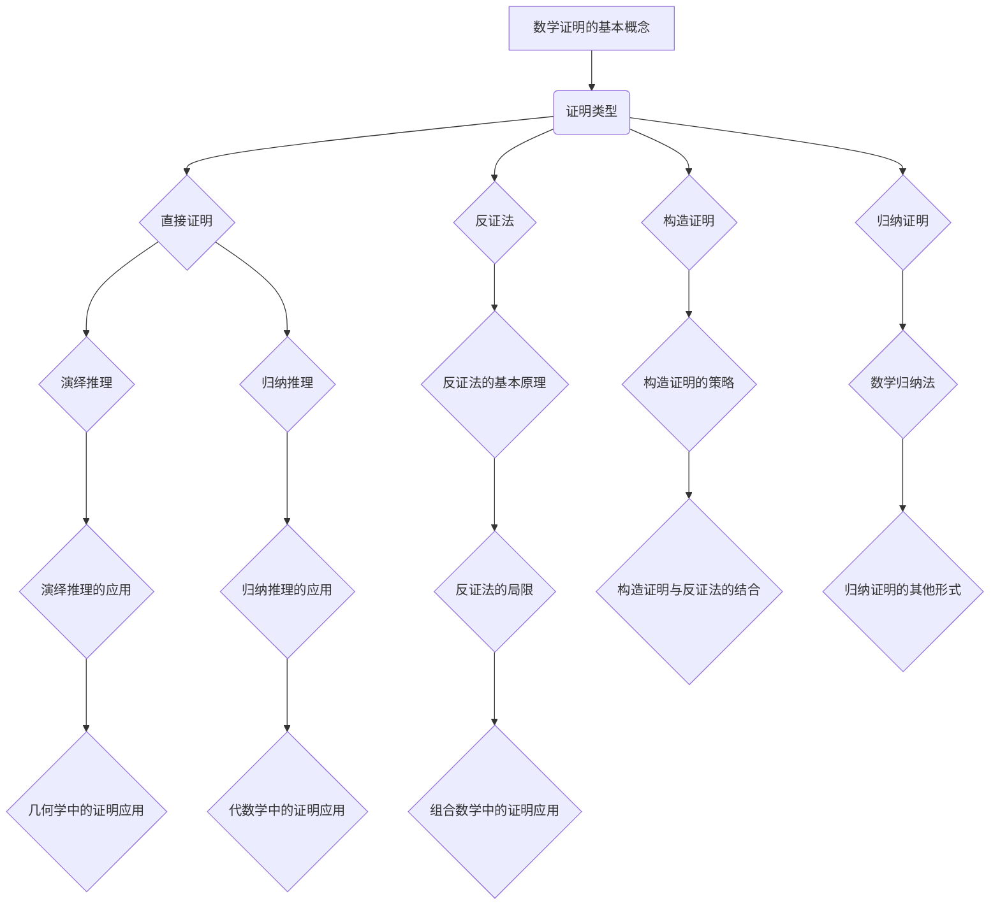

                 

### 《数学证明的发现与创新过程》

关键词：数学证明、证明方法、公理系统、归纳证明、组合数学

摘要：本文从数学证明的基本概念与历史背景出发，深入探讨了数学证明在现代数学中的应用，创新方法与技术，以及跨学科应用和未来发展趋势。通过具体的案例研究和数学公式讲解，揭示了数学证明在各个领域的重要性，为读者提供了丰富的知识和思考。

## 第一部分：数学证明的基本概念与历史背景

### 第1章：数学证明的定义与分类

#### 1.1.1 数学证明的基本概念

数学证明是数学逻辑中的一种演绎推理过程，它通过逻辑推理和数学原理，从已知的前提出发，得出一个未知的结论。数学证明的核心在于揭示数学结论的必然性和正确性。

#### 1.1.2 数学证明的主要类型

根据证明方法和目标的不同，数学证明可以分为以下几种类型：

1. **直接证明**：通过逻辑推理，从已知的前提出发，直接得出结论。
2. **反证法**：通过假设结论不成立，推导出矛盾，从而证明结论成立。
3. **构造证明**：构造一个满足特定条件的数学对象，从而证明某个数学结论成立。
4. **归纳证明**：通过对一系列特殊情况进行分析，归纳出一般性的结论。

#### 1.1.3 数学证明的基本原则

数学证明需要遵循以下基本原则：

1. **前提的确定性**：证明的前提必须是确定的、真实的。
2. **推理过程的严谨性**：推理过程必须符合逻辑规则，不得出现逻辑错误。
3. **结论的必然性**：结论必须是从前提中必然推导出来的，不能是偶然的或主观臆断的。

### 第2章：数学证明的历史背景与发展

#### 2.1.1 古希腊数学的证明体系

古希腊数学是数学证明的起源，以欧几里得的《几何原本》为代表。欧几里得在《几何原本》中系统地阐述了几何学的基本原理和证明方法，奠定了几何学的基础。

#### 2.1.2 中世纪数学证明的发展

中世纪时期，阿拉伯数学家在代数和几何方面取得了重要成果。阿拉伯数学家阿穆尔·哈姆丹（Al-Khwarizmi）提出了代数的基本原理，为后来的代数学奠定了基础。

#### 2.1.3 文艺复兴时期后的数学证明进展

文艺复兴时期后，数学得到了迅速发展。17世纪的牛顿和莱布尼茨创立了微积分，奠定了现代数学分析的基础。19世纪的数学家康托尔、罗素等人的工作，推动了数学证明的理论研究和应用。

### 第3章：数学证明在现代数学中的应用

#### 3.1.1 数学分析中的证明方法

数学分析是现代数学的重要组成部分，其证明方法主要包括直接证明、反证法和构造证明等。在数学分析中，证明方法的选择取决于具体问题的特点和复杂性。

#### 3.1.2 几何学中的证明技巧

几何学是数学的基础学科，其证明技巧包括公理法、反证法和构造证明等。几何证明在数学发展过程中发挥了重要作用，推动了几何学的研究。

#### 3.1.3 代数学中的证明策略

代数学是研究数和方程的数学分支，其证明策略包括归纳证明、反证法和构造证明等。代数证明在解决代数问题、研究代数结构等方面具有重要意义。

## 第二部分：数学证明的创新方法与技术

### 第4章：形式证明与公理系统

#### 4.1.1 形式证明的基本原理

形式证明是一种基于形式逻辑的证明方法，其基本原理是通过逻辑演绎，从一组公理出发，推导出一系列定理。形式证明具有高度的严谨性和可靠性。

#### 4.1.2 公理系统的构建与运用

公理系统是形式证明的基础，它由一组基本原理和规则组成。通过构建公理系统，可以证明数学中的各种结论。公理系统的选择和运用对数学证明的效率和质量有很大影响。

#### 4.1.3 形式证明工具的应用

形式证明工具（如证明器、定理证明器等）可以提高数学证明的效率和质量。这些工具可以自动化地进行推理和证明，减少人工证明的错误和繁琐。

### 第5章：构造证明与反证法

#### 5.1.1 构造证明的基本策略

构造证明是通过构造满足特定条件的数学对象，证明某个数学结论成立的方法。构造证明的基本策略包括构造反例、构造特例和构造一般性结论等。

#### 5.1.2 反证法的应用与局限

反证法是通过假设结论不成立，推导出矛盾，从而证明结论成立的方法。反证法在数学证明中具有重要作用，但也有一些局限性，如不能证明某些特殊情况。

#### 5.1.3 构造证明与反证法的结合

构造证明与反证法可以相互结合，提高证明的效率和质量。通过构造证明，可以揭示数学问题的本质和内在联系；通过反证法，可以排除某些错误情况，确保结论的可靠性。

### 第6章：归纳证明与数学归纳法

#### 6.1.1 归纳证明的概念与步骤

归纳证明是一种通过分析一系列特殊情况，归纳出一般性结论的证明方法。归纳证明的步骤包括基础情况验证、归纳假设和归纳推理等。

#### 6.1.2 数学归纳法的原理与运用

数学归纳法是一种特殊的归纳证明方法，它通过验证基础情况，假设归纳步骤成立，推导出一般性结论。数学归纳法在解决数学问题、证明数学结论等方面具有重要意义。

#### 6.1.3 归纳证明的其他形式

除了数学归纳法，还有其他形式的归纳证明，如枚举归纳法、反证归纳法等。这些归纳证明方法在特定情况下具有优势，可以更有效地证明数学结论。

### 第7章：组合数学中的证明技巧

#### 7.1.1 组合数学的基本概念

组合数学是研究离散对象的计数和组合的数学分支。组合数学的基本概念包括排列、组合、图论和编码理论等。

#### 7.1.2 组合数学中的证明方法

组合数学中的证明方法包括归纳法、构造证明、反证法等。这些证明方法可以有效地解决组合数学中的各种问题。

#### 7.1.3 组合数学在计算机科学中的应用

组合数学在计算机科学中具有广泛的应用。例如，图论中的算法和网络设计、编码理论中的数据压缩和加密技术等，都是组合数学在计算机科学中的重要应用。

## 第三部分：数学证明的创新实例与案例研究

### 第8章：数学证明的创新案例研究

#### 8.1.1 几何学中的证明创新

几何学中的证明创新包括欧拉公式、四色定理等。这些证明方法不仅在几何学中具有重要意义，也对其他数学领域产生了深远影响。

#### 8.1.2 代数学中的证明创新

代数学中的证明创新包括伽罗瓦理论、代数基本定理的证明等。这些证明方法在解决代数问题、研究代数结构等方面具有重要意义。

#### 8.1.3 分析学中的证明创新

分析学中的证明创新包括泰勒公式、复分析中的留数定理等。这些证明方法在分析学中具有重要作用，为解决复杂问题提供了有力工具。

### 第9章：数学证明的跨学科应用

#### 9.1.1 数学证明在计算机科学中的应用

数学证明在计算机科学中具有广泛的应用。例如，算法设计中的证明方法、复杂性理论中的证明方法等，都是数学证明在计算机科学中的重要应用。

#### 9.1.2 数学证明在物理学中的应用

数学证明在物理学中具有重要作用。例如，经典力学中的牛顿运动定律、量子力学中的薛定谔方程等，都是通过数学证明得到的。

#### 9.1.3 数学证明在经济学中的应用

数学证明在经济学中具有广泛的应用。例如，博弈论中的证明方法、经济学模型中的证明方法等，都是数学证明在经济学中的重要应用。

### 第10章：数学证明的未来发展趋势

#### 10.1.1 数学证明与人工智能

随着人工智能技术的发展，数学证明与人工智能的结合成为一个重要方向。例如，机器学习中的证明方法、自动推理系统中的证明方法等，都是数学证明与人工智能的结合。

#### 10.1.2 数学证明与机器学习

机器学习中的证明方法包括验证性学习和归纳性学习等。这些证明方法在解决机器学习问题、提高学习效果方面具有重要意义。

#### 10.1.3 数学证明的未来方向

数学证明的未来发展将更加注重交叉学科的结合，探索新的证明方法和工具。例如，量子计算中的证明方法、统计学中的证明方法等，都是数学证明未来发展的方向。

## 附录

### 附录A：数学证明的基本定理与公式

#### A.1 重要数学定理的证明

- **勾股定理**：直角三角形的两条直角边的平方和等于斜边的平方。

- **费马小定理**：如果 $p$ 是一个质数，$a$ 是一个整数，那么 $a^{p-1} \equiv 1 \pmod{p}$。

#### A.2 常见数学公式的推导

- **圆的面积公式**：$A = \pi r^2$，其中 $r$ 是圆的半径。

- **球的表面积公式**：$S = 4\pi r^2$，其中 $r$ 是球的半径。

### 附录B：数学证明工具与资源

#### B.1 主流数学证明工具介绍

- **定理证明器**：如 Coq、Isabelle 等，用于自动证明数学定理。

- **数学软件**：如 Mathematica、MATLAB 等，用于进行数学计算和证明。

#### B.2 数学证明资源的获取与使用

- **在线资源**：如 arXiv、Google 学术等，提供了丰富的数学证明资源和论文。

- **数学论坛**：如 Stack Exchange、Zhihu 等，是学习和交流数学证明的优质平台。

### Mermaid 流程图示例：



### 伪代码示例：

```c
// 伪代码：数学归纳法证明
function prove_by_induction(n)
    // 基础情况验证
    if n == 1 then
        // 验证基础情况
        return true
    end if
    
    // 假设 n=k 时命题成立
    assume P(k) is true
    
    // 验证 n=k+1 时命题成立
    if P(k+1) is true then
        // 验证 n=k+1 情况
        return true
    end if
    
    // 若上述条件不满足，则命题不成立
    return false
```

### 数学公式示例：

#### 几何中的基本定理

$$
\text{面积} = \frac{1}{2} \times \text{底} \times \text{高}
$$

**解释**：这个公式用于计算矩形或梯形的面积。其中，底代表矩形的长度或梯形的上下底长度，高代表矩形的宽度或梯形的高。

#### 分析学中的重要公式

$$
f(x) = ax^2 + bx + c
$$

**解释**：这个公式表示一元二次方程的一般形式，其中 $a$、$b$、$c$ 是常数，$x$ 是未知数。这个公式可以用于求解二次方程的根。

#### 统计学中的均值公式

$$
\bar{x} = \frac{1}{n} \sum_{i=1}^{n} x_i
$$

**解释**：这个公式用于计算一组数据的平均值，其中 $n$ 是数据个数，$x_i$ 是第 $i$ 个数据。这个公式在统计学中具有重要意义，可以用于数据分析、决策制定等。

