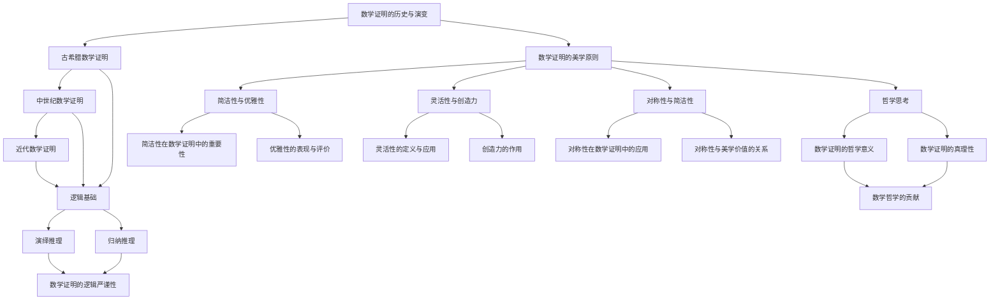

                 

### 文章标题

《数学证明的美学价值与哲学意义》

> 关键词：数学证明、美学价值、哲学意义、逻辑推理、简洁性、创造性、对称性

摘要：本文旨在探讨数学证明在美学和哲学层面的价值，通过历史演变、美学原则、哲学思考和未来展望四个部分，详细分析数学证明的内在逻辑和外在表现，揭示其作为一门学科的独特魅力和深远影响。文章首先回顾了数学证明的历史与发展，探讨了数学证明的美学原则，并通过具体实例展示了其美学价值。随后，文章深入探讨了数学证明的哲学意义，包括其逻辑基础、真理性及方法论。最后，文章展望了数学证明的未来发展方向，探讨了其在跨学科研究和人工智能领域的应用前景。本文旨在为广大读者提供一个全面而深入的数学证明的探讨，激发对数学之美和哲学之深的思考。

### 目录

1. **数学证明的历史与演变**  
   1.1. 数学证明的起源  
   1.2. 中世纪数学证明的发展  
   1.3. 近代数学证明的革新

2. **数学证明的美学价值**  
   2.1. 数学证明的历史与演变  
   2.2. 数学证明的美学原则  
   2.3. 数学证明的美学实例分析

3. **数学证明的哲学意义**  
   3.1. 数学证明与哲学思考  
   3.2. 数学证明的方法论  
   3.3. 数学证明与社会文化

4. **数学证明的未来展望**  
   4.1. 数学证明的创新与发展  
   4.2. 数学证明的哲学思考与未来方向

附录：数学证明的美学价值与哲学意义 Mermaid 流程图

### 第一部分：数学证明的美学价值

数学证明的美学价值在于其形式上的优雅、逻辑上的严谨和思想上的深刻。在这一部分，我们将首先回顾数学证明的历史与演变，然后探讨数学证明的美学原则，最后通过具体实例分析数学证明的美学价值。

#### 第1章：数学证明的历史与演变

数学证明的历史可以追溯到古希腊时期，古希腊数学家们以其严谨的逻辑和深刻的洞察力，开创了数学证明的先河。在古希腊，数学证明被视为一种哲学思考方式，其目的是揭示数学现象背后的本质规律。这种哲学背景为数学证明的发展奠定了基础。

1. **古希腊数学证明的哲学背景**

古希腊数学证明的哲学背景主要体现在两个方面：一是对数学真理的追求，二是对逻辑推理的重视。古希腊数学家认为，数学真理是绝对的，不受人类主观意识的影响。因此，他们致力于通过逻辑推理来证明数学命题的真实性。

2. **古希腊数学证明的主要特征**

古希腊数学证明的主要特征是逻辑严谨和推理严格。古希腊数学家们通常使用公理化方法，通过定义、公理和定理来建立数学体系。他们的证明过程通常分为三个步骤：提出问题、给出假设、推导结论。

3. **中世纪数学证明的发展**

中世纪数学证明的发展受到了阿拉伯数学家的影响。阿拉伯数学家们在数学证明方面做出了许多重要贡献，如引入代数符号、发展代数学等。此外，中世纪数学证明还受到宗教影响，许多数学证明被用作证明宗教教义的合理性。

4. **近代数学证明的革新**

近代数学证明的革新主要体现在欧几里得《几何原本》对数学证明的影响以及分析几何与微积分对数学证明的变革。欧几里得《几何原本》的公理化方法为数学证明提供了新的思路，而分析几何与微积分的发展则使数学证明变得更加复杂和多样化。

#### 第2章：数学证明的美学原则

数学证明的美学原则主要包括简洁性、优雅性、灵活性、创造性和对称性。这些原则不仅体现了数学证明的美学价值，也为数学证明的发展提供了指导。

1. **简洁性与优雅性**

简洁性和优雅性是数学证明中最为重要的美学原则。简洁性强调证明过程要简明扼要，避免冗长和复杂。优雅性则强调证明过程要富有艺术感，体现出数学的美学价值。

2. **灵活性与创造力**

灵活性和创造力是数学证明中不可或缺的原则。灵活性强调证明方法要多样化，能够适应不同的数学问题。创造力则强调在证明过程中要有创新思维，提出新的证明方法。

3. **对称性与简洁性**

对称性和简洁性是数学证明中相辅相成的美学原则。对称性强调证明过程中的对称性和平衡感，而简洁性则强调证明过程要简明扼要。

#### 第3章：数学证明的美学实例分析

为了更好地理解数学证明的美学价值，我们通过具体实例进行分析。

1. **费马大定理的证明**

费马大定理是一个经典的数学问题，其证明过程具有很高的美学价值。费马大定理的几种证明方法，如代数几何方法、数论方法和拓扑学方法，都具有简洁性和优雅性。

2. **四色定理的证明**

四色定理是另一个经典的数学问题，其证明过程同样具有很高的美学价值。四色定理的证明过程体现了灵活性和创造性的原则，其证明方法包括图论方法和计算机辅助证明。

通过以上分析，我们可以看到，数学证明不仅具有逻辑上的严谨性，还具有美学上的价值。数学证明的美学价值体现在其简洁性、优雅性、灵活性、创造性和对称性上，这些原则使得数学证明具有独特的艺术魅力。

### 第二部分：数学证明的哲学意义

数学证明的哲学意义深远而复杂，它不仅关系到数学本身的发展，还涉及到人类认识世界的方法和哲学思维的本质。在这一部分，我们将深入探讨数学证明与哲学思考的关系，分析数学证明的逻辑基础和真理性，并探讨数学证明在哲学层面的价值。

#### 第4章：数学证明与哲学思考

1. **数学证明的逻辑基础**

数学证明的逻辑基础主要包括归纳推理和演绎推理。归纳推理是从特殊到一般的推理方式，它通过对一些具体实例的观察和总结，得出普遍性的结论。演绎推理则是从一般到特殊的推理方式，它基于一些基本原理和前提，推导出具体的结论。

归纳推理和演绎推理在数学证明中都有重要的应用。归纳推理常用于数学理论的发展，例如从具体实例中总结出一般性的规律。而演绎推理则常用于证明数学命题的真实性，它通过逻辑推理从已知的前提出发，得出结论。

2. **数学证明与哲学的逻辑联系**

数学证明与哲学有着深刻的逻辑联系。哲学关注的是人类思维的本质和世界的本质，而数学证明则是一种逻辑推理过程，它通过严谨的推理方式来揭示数学现象的本质。因此，数学证明为哲学提供了逻辑上的支持，同时也受到哲学的启发。

例如，哲学中的形式逻辑和数理逻辑对数学证明的发展产生了重要影响。形式逻辑强调逻辑推理的严格性和形式化，数理逻辑则通过数学方法来研究逻辑推理的规律，这些理论为数学证明提供了坚实的基础。

3. **数学证明对哲学的贡献**

数学证明对哲学的贡献主要体现在两个方面：一是提供了逻辑推理的方法和工具，二是揭示了数学现象的本质和规律。

首先，数学证明为哲学提供了严谨的逻辑推理方法。哲学中的许多问题需要通过逻辑推理来解决，而数学证明的严格性和精确性为哲学推理提供了有力的支持。

其次，数学证明揭示了数学现象的本质和规律。数学证明的过程不仅是对数学命题的证明，也是对数学现象的深刻理解和把握。通过数学证明，我们可以更好地理解数学现象的本质，从而为哲学提供更丰富的材料。

#### 第5章：数学证明的真理性

数学证明的真理性是一个复杂而深刻的问题。一方面，数学证明被认为是真理的可靠保证，因为它是基于逻辑推理和已知事实的。另一方面，数学证明的真理性也受到哲学和科学哲学的质疑。

1. **数学证明的真理性问题**

数学证明的真理性问题主要涉及两个方面：一是数学证明是否能够保证命题的真实性，二是数学证明是否能够涵盖所有数学现象。

关于第一个问题，数学证明被认为是可靠的，因为它基于逻辑推理和已知事实。数学证明的逻辑推理是严格和严谨的，它遵循逻辑规则和数学原理，从而保证了证明过程的正确性。

关于第二个问题，数学证明的覆盖范围是有限的。数学证明只能证明特定命题的真实性，而无法涵盖所有数学现象。这是因为数学是一个不断发展和扩展的领域，新的数学问题和现象不断出现，而数学证明只能针对特定问题进行。

2. **数学证明与经验事实的关系**

数学证明与经验事实的关系也是一个重要的问题。数学证明是否需要经验事实的支持，这是一个哲学和科学哲学中的争议话题。

一方面，数学证明被认为是独立于经验事实的。数学证明是基于逻辑和数学原理的，它不依赖于经验事实。数学证明的过程是一种理性推理的过程，它遵循逻辑规则和数学原理，从而得出结论。

另一方面，数学证明也受到经验事实的影响。数学证明的发展受到经验事实的启发，许多数学问题和现象是通过观察和实验得到的。因此，数学证明不仅是一种理性推理过程，也是对经验事实的总结和归纳。

#### 第6章：数学证明的哲学价值

数学证明在哲学层面具有独特的价值。它不仅是一种逻辑推理过程，也是对哲学问题的思考和探讨。

1. **数学证明对哲学的贡献**

数学证明对哲学的贡献主要体现在以下几个方面：

- **逻辑思维能力的培养**：数学证明要求逻辑思维严密，推理过程清晰。通过数学证明，人们可以锻炼逻辑思维能力，提高思维的质量和深度。

- **哲学问题的探讨**：数学证明的过程可以揭示哲学问题，例如真理、存在、知识等。数学证明的推理方式和结论可以为哲学提供新的思路和启示。

- **认识论的研究**：数学证明的研究涉及到认识论问题，例如知识的来源、真理的标准等。数学证明的发展为认识论的研究提供了新的理论和实践基础。

2. **哲学对数学证明的反思**

哲学对数学证明的反思主要关注数学证明的可靠性和局限性。

- **可靠性反思**：哲学反思数学证明的可靠性，质疑数学证明是否能够保证命题的真实性。这涉及到数学证明的逻辑基础和数学原理的可靠性。

- **局限性反思**：哲学反思数学证明的局限性，指出数学证明只能解决特定问题，无法涵盖所有数学现象。这涉及到数学证明的覆盖范围和适用性。

通过哲学的反思，数学证明得以不断发展和完善，从而更好地服务于哲学和其他学科的研究。

### 第三部分：数学证明的方法论

数学证明的方法论是数学家在长期实践中总结出来的证明技巧和策略。这些方法不仅有助于解决具体的数学问题，还提供了深入理解和探索数学世界的工具。在本部分中，我们将详细探讨几种重要的数学证明方法：反证法、构造法和递归法，并分析它们在数学证明中的应用。

#### 第5章：反证法

反证法是一种常用的数学证明方法，其基本思想是假设命题不成立，通过推导出矛盾来证明原命题成立。以下是反证法的定义、原理和应用。

1. **反证法的定义与原理**

反证法的定义如下：
```
函数 proveByContradiction(A):
    假设 A 不成立，即 A 的否定 ¬A 成立。
    如果从 ¬A 出发，推导出一个矛盾，则说明假设错误，即 A 必然成立。
```

反证法的原理在于，如果一个命题的否定导致矛盾，那么这个命题本身就是正确的。这种逻辑推理方式在数学证明中非常有效，因为它提供了一种证明的间接途径。

2. **反证法在数学证明中的应用**

反证法在数学证明中有着广泛的应用。以下是一些典型的例子：

- **证明无解问题**：例如，证明某些方程或系统无解。通过反证法，我们可以假设存在解，然后推导出矛盾，从而证明原命题。

- **证明不可能性问题**：例如，证明某个几何构造或数学操作不可能实现。通过反证法，我们可以假设能够实现，然后推导出矛盾，从而证明原命题。

- **证明极大极小问题**：例如，证明某个函数的最大值或最小值。通过反证法，我们可以假设存在比已知更大的或更小的值，然后推导出矛盾，从而证明原命题。

#### 第6章：构造法

构造法是一种通过构造一个满足条件的对象来证明命题成立的方法。构造法的核心思想是，通过构造出一个具体的实例来证明一般性的结论。

1. **构造法的定义与原理**

构造法的定义如下：
```
函数 proveByConstruction(A):
    如果可以构造出一个满足条件 A 的对象，则证明 A 成立。
    通过详细描述构造过程，证明该对象满足条件 A。
```

构造法的原理在于，通过构造一个具体的实例，我们可以直观地证明一般性的结论。这种方法在数学证明中尤为重要，因为它提供了一种从特殊到一般的方法。

2. **构造法在数学证明中的应用**

构造法在数学证明中有许多应用。以下是一些典型的例子：

- **证明存在性问题**：例如，证明某个数学结构或数学对象的存在性。通过构造法，我们可以构造出一个具体的实例，从而证明存在性。

- **证明唯一性问题**：例如，证明某个数学结构或数学对象的唯一性。通过构造法，我们可以构造出唯一的实例，从而证明唯一性。

- **证明等价性问题**：例如，证明两个数学结构或数学对象是等价的。通过构造法，我们可以构造出两个互相等价的实例，从而证明等价性。

#### 第7章：递归法

递归法是一种通过递归定义来证明数学命题的方法。递归法的基本思想是，通过递归地定义一个数学对象或过程，然后证明其满足某个性质。

1. **递归法的定义与原理**

递归法的定义如下：
```
函数 proveByRecursion(A):
    如果可以递归定义一个数学对象或过程，并且证明其满足条件 A，则证明 A 成立。
    通过递归定义和数学归纳法，证明该对象或过程满足条件 A。
```

递归法的原理在于，通过递归地定义一个数学对象或过程，我们可以将其分解为更小的子问题，然后逐步证明其满足某个性质。这种方法在解决递归定义的问题时非常有效。

2. **递归法在数学证明中的应用**

递归法在数学证明中有广泛的应用。以下是一些典型的例子：

- **证明递归性质**：例如，证明一个递归定义的数学序列或函数满足某个递归性质。通过递归法，我们可以递归地定义该序列或函数，并证明其满足递归性质。

- **证明递推关系**：例如，证明一个递推关系的数学序列或函数满足某个条件。通过递归法，我们可以递归地定义该序列或函数，并证明其满足递推关系。

- **证明归纳性质**：例如，证明一个数学命题对于所有自然数都成立。通过递归法，我们可以递归地定义该命题，并证明其满足归纳性质。

通过以上对反证法、构造法和递归法的讨论，我们可以看到这些方法在数学证明中的重要作用。它们不仅提供了证明数学命题的工具，也为我们理解和探索数学世界提供了深刻的洞察。

### 数学证明与社会文化

数学证明不仅是一种逻辑推理过程，它还与社会文化密切相关，并在社会发展、数学教育和个人素质提升方面发挥着重要作用。

#### 第6章：数学证明与社会进步

1. **数学证明对社会发展的推动作用**

数学证明对社会发展的推动作用不可忽视。从古至今，数学证明在科技、工程和科学研究中起到了基础性的作用。例如，建筑工程中的结构设计、航空航天领域的轨道计算、计算机科学中的算法设计等，都依赖于数学证明。数学证明的严谨性和精确性确保了这些领域的可靠性和安全性。

此外，数学证明在经济学、金融学等领域也发挥着重要作用。例如，金融市场中的风险模型、投资组合优化等，都需要通过数学证明来验证其有效性和合理性。数学证明为社会经济的发展提供了科学依据和理论支持。

2. **数学证明在社会文化中的地位**

数学证明在社会文化中的地位日益重要。随着信息时代的到来，数学作为一种通用的语言，成为跨学科研究和交流的桥梁。数学证明不仅是一种科学方法，也是一种思维方式和文化传统。它在不同文化背景下的应用和传播，促进了不同文化之间的交流和融合。

数学证明在各个国家和地区的教育体系中占据重要地位。许多国家的教育政策都将数学证明作为基础教育的重要内容，培养学生的逻辑思维能力和问题解决能力。数学证明的教学不仅有助于学生掌握数学知识，还能提高他们的综合素质和创新能力。

#### 第7章：数学证明的教育意义

1. **数学证明在数学教育中的作用**

数学证明在数学教育中具有核心地位。通过数学证明，学生可以深入理解数学概念和原理，培养逻辑思维和批判性思维能力。数学证明的过程要求学生严谨思考、精确表达和系统推理，这有助于他们形成科学精神和学术素养。

数学证明的教学方法多种多样，包括证明阅读、证明写作和证明讨论等。这些方法不仅有助于学生掌握数学知识，还能培养他们的合作意识和团队精神。

2. **数学证明教育对个人素质的提升**

数学证明教育对个人素质的提升具有深远影响。首先，数学证明要求学生具备严密的逻辑思维，这有助于他们在面对复杂问题时保持清晰的思路和逻辑性。其次，数学证明需要学生具备精确的表达能力，这有助于他们在学术和职业生涯中有效地沟通和表达。此外，数学证明教育还能培养学生的耐心、毅力和坚持不懈的精神，这些品质在个人的成长和发展中至关重要。

通过数学证明的教育，学生不仅能够掌握数学知识，还能提升自己的思维品质、学术素养和综合素质，为未来的学习和职业发展打下坚实的基础。

### 数学证明的未来展望

随着科技的飞速发展和跨学科研究的深入，数学证明在未来将继续发挥重要作用，并在创新与发展中迎来新的机遇和挑战。以下是对数学证明未来发展的展望。

#### 第8章：数学证明的创新与发展

1. **数学证明的新方法**

随着计算机科学和人工智能技术的发展，数学证明的新方法不断涌现。形式化证明和自动化证明是两个重要的方向。

- **形式化证明**：形式化证明是指将数学证明过程转化为计算机可以理解和验证的形式。这种方法有助于提高数学证明的可靠性和可验证性，避免人为错误。形式化证明的典型应用包括数学定理的机器证明和软件验证。

- **自动化证明**：自动化证明是利用计算机程序自动生成数学证明。这种方法通过算法和搜索策略，在大量的可能证明路径中找到正确的证明。自动化证明在处理复杂的数学问题时具有显著的优势，可以大大提高证明的效率。

2. **计算机辅助证明的应用**

计算机辅助证明是现代数学研究的重要工具。通过计算机辅助证明，数学家可以处理复杂的数学问题，验证复杂定理的真实性。计算机辅助证明的应用范围广泛，包括数论、代数几何、组合数学等领域。随着计算机性能的不断提高，计算机辅助证明在未来将发挥更大的作用。

3. **非经典数学证明的研究进展**

非经典数学证明是数学证明的一个重要分支，涉及数学逻辑、类型论和构造主义等理论。非经典数学证明的研究进展为数学证明提供了新的理论和方法。例如，构造性数学证明强调证明过程中的构造性步骤，这种证明方法在计算机科学和物理学中具有重要意义。未来，非经典数学证明将继续发展，为数学证明提供新的视角和工具。

4. **数学证明与量子计算的关系**

量子计算是下一代计算技术的重要方向，它基于量子力学原理，具有超越经典计算机的潜力。数学证明在量子计算中扮演着关键角色。量子算法的设计和验证需要严谨的数学证明，以确保算法的正确性和有效性。同时，量子计算的发展也可能推动数学证明的理论和方法创新，为数学证明提供新的应用场景。

#### 第9章：数学证明的哲学思考与未来方向

1. **数学证明的哲学挑战**

随着数学证明方法的发展和技术的进步，数学证明的哲学挑战也日益凸显。首先，数学证明的客观性问题再次受到关注。在形式化证明和自动化证明的背景下，如何确保数学证明的客观性和可靠性成为了一个重要议题。其次，数学证明的局限性问题也需要进一步探讨。尽管数学证明在逻辑上严谨，但它是否能涵盖所有数学现象和问题仍然是一个开放的问题。

2. **数学证明的未来展望**

未来，数学证明将继续在跨学科研究中发挥重要作用。例如，在人工智能、生物信息学和物理学等领域，数学证明将为科学研究和创新提供坚实的理论基础。此外，数学证明在教育中的地位也将不断提升，培养更多的数学家和科学家，为社会的进步和发展贡献力量。

数学证明在哲学层面的探讨也将不断深入。通过哲学的反思，我们可以更好地理解数学证明的本质和意义，推动数学哲学的发展。未来，数学证明的哲学思考将更加注重逻辑与现实、形式与内容、抽象与具体之间的辩证关系。

总之，数学证明在未来将继续创新与发展，并在哲学思考和社会应用中发挥重要作用。它不仅是一种科学方法，也是人类认识世界和探索未知的工具。通过数学证明，我们能够更好地理解世界的本质，推动科学技术的进步，为人类的未来创造更多的可能性。

### 核心算法原理讲解

在数学证明中，几种核心的证明方法——反证法、构造法和递归法，是理解数学证明逻辑和技巧的关键。以下是对这些方法的详细讲解，以及相应的伪代码示例。

#### 反证法

反证法是一种通过假设结论不成立，然后推导出矛盾来证明原结论成立的证明方法。

1. **原理**

   假设结论A不成立，推导出矛盾，从而证明结论A成立。

   伪代码示例：
   ```plaintext
   function proveUsingContradiction(A):
       假设 ¬A（A 不成立）
       推导出矛盾
       如果矛盾存在，则 ¬A 假设错误
       因此，A 成立
   ```

2. **示例**

   证明：如果一个整数n是6的倍数，那么n的平方也是6的倍数。

   ```plaintext
   假设 n 不是6的倍数，即 n = 6k + r，其中 r ≠ 0（1 ≤ r ≤ 5）
   则 n² = (6k + r)² = 36k² + 12kr + r²
   由于 r² 是一个非零的完全平方数，因此 r² 不能被6整除
   因此，n² = 36k² + 12kr + r² 可以被6整除
   这与我们的假设矛盾，因此 n 必须是6的倍数
   ```

#### 构造法

构造法是通过构造一个满足条件的对象来证明命题成立的方法。

1. **原理**

   如果可以构造一个满足条件A的对象，则证明A成立。

   伪代码示例：
   ```plaintext
   function proveByConstruction(A):
       构造一个满足条件 A 的对象
       显示该对象满足条件 A
       因此，A 成立
   ```

2. **示例**

   证明：存在一个无理数x，使得 x² = 2。

   ```plaintext
   构造一个数 x，使得 x = √2
   如果 x 是有理数，则可以表示为 x = p/q，其中 p 和 q 是互质的整数
   则 x² = 2 可以表示为 p² = 2q²
   这意味着 p² 是偶数，因此 p 也是偶数，可以表示为 p = 2r
   代入得 4r² = 2q²，即 2r² = q²
   这意味着 q 也是偶数，这与 p 和 q 互质矛盾
   因此，x = √2 是无理数
   ```

#### 递归法

递归法是通过递归定义和递归证明来证明数学命题的方法。

1. **原理**

   通过递归定义一个对象或过程，并证明其满足某个性质。

   伪代码示例：
   ```plaintext
   function proveByRecursion(A):
       基本情况：证明 A 对初始情况成立
       归纳步骤：假设 A 对前 n 个情况成立，证明 A 对 n+1 个情况也成立
       因此，A 对所有自然数都成立
   ```

2. **示例**

   证明：Fibonacci数列的每一项都是正数。

   ```plaintext
   基本情况：F(0) = 0，F(1) = 1，都是正数
   归纳步骤：假设 F(k) 和 F(k-1) 都是正数，证明 F(k+1) 也是正数
   F(k+1) = F(k) + F(k-1)
   由于 F(k) 和 F(k-1) 都是正数，它们的和 F(k+1) 也是正数
   因此，Fibonacci数列的每一项都是正数
   ```

通过以上对反证法、构造法和递归法的详细讲解和伪代码示例，我们可以更好地理解这些核心证明方法的原理和应用，为数学证明的深入研究和实践提供坚实的理论基础。

### 附录：数学证明的美学价值与哲学意义 Mermaid 流程图

以下是一个用Mermaid绘制的流程图，展示了数学证明的美学价值与哲学意义的各个部分及其相互关系。



这个流程图展示了数学证明的历史演变、美学原则、哲学思考和它们之间的逻辑关系，以及数学证明在哲学和美学上的意义。通过这种图形化的方式，我们可以更直观地理解数学证明的复杂性和深度。

