                 

### 第1章：数学语言的国际化背景

#### 1.1 数学语言在国际交流中的重要性

**概述**：数学语言作为科学交流的基础，对于促进全球科学合作和知识传播具有不可替代的作用。

- **国际化交流的必要性**：在全球化的背景下，科学家、工程师和研究人员来自世界各地，他们需要一种共同的语言来进行学术交流、合作研究和知识共享。

- **数学语言的独特优势**：数学语言具有高度抽象性和普遍性，不受语言和文化差异的影响，这使得它成为跨文化交流的理想工具。

- **Mermaid流程图**：

  ```mermaid
  graph TD
  A[国际交流] --> B[数学语言];
  B --> C{高度抽象性}
  B --> C{普遍性}
  B --> C{不受语言障碍影响}
  C --> D[促进全球科学合作]
  D --> E[知识共享]
  ```

#### 核心概念与联系：

1. **国际化交流**：国际化交流指的是跨国界、跨文化的交流和合作，它有助于推动全球科学和技术的发展。
2. **数学语言的抽象性和普遍性**：数学语言的抽象性使其能够描述复杂的概念和关系，而普遍性则保证了它在全球范围内的可理解性。

**Mermaid流程图**：

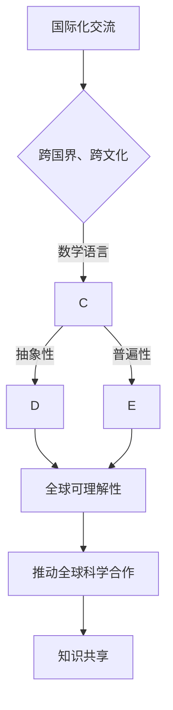

#### 伪代码（描述国际化交流与数学语言的关系）：

```python
class International_Communication:
    def __init__(self, countries):
        self.countries = countries
    
    def promote_scientific Cooperation(self):
        for country in self.countries:
            share_knowledge_with(country, math_language)

def share_knowledge_with(country, math_language):
    print(f"Sharing knowledge with {country} using {math_language}")
```

#### 数学模型和公式：

1. **语言障碍**：$$ Language_Barrier = \text{Understanding\_Difficulties} $$
2. **数学语言的普遍性**：$$ Universality\_of\_Math = \text{Common\_Understanding} $$

#### 举例说明：

- **例子**：一个国际研究小组正在研究量子计算，成员来自不同的国家和地区。他们使用统一的数学语言来描述和交流研究成果，从而克服了语言障碍，推动了研究进展。

### 1.2 国际化与标准化的发展历程

**概述**：回顾数学语言国际化与标准化的发展历程，包括早期的努力和重要的里程碑。

- **早期的努力**：在20世纪之前，数学语言的标准化并未得到充分重视。早期的科学家和数学家主要依靠本国的数学传统和符号系统进行研究和交流。

- **20世纪的发展**：随着全球科学合作的增加，数学语言的标准化逐渐受到重视。20世纪60年代，国际标准化组织（ISO）的成立标志着数学语言标准化工作的开始。

- **里程碑事件**：
  - 1960年代：ISO 31标准的发布，为数学符号和记号提供了国际统一的规范。
  - 2000年代：ISO 80000系列标准的发布，进一步规范了数学表达式的格式和用法。

**伪代码**（描述发展历程的简化流程）：

```python
def math_language_standardization():
    early_attempts()
    iso_31_standard()
    iso_80000_series()
    document_key_milestones()
    
def early_attempts():
    print("Early efforts in math language standardization")

def iso_31_standard():
    print("Publication of ISO 31 standard")

def iso_80000_series():
    print("Publication of ISO 80000 series standards")

def document_key_milestones():
    print("Documentation of key milestones in math language standardization")
```

#### 核心概念与联系：

1. **早期努力**：科学家和数学家在缺乏标准化的情况下，依靠本国传统进行研究和交流。
2. **ISO 31标准**：为数学符号和记号提供了统一的国际规范，提高了跨文化交流的效率。
3. **ISO 80000系列标准**：进一步规范了数学表达式的格式和用法，促进了全球科学合作。

**Mermaid流程图**：

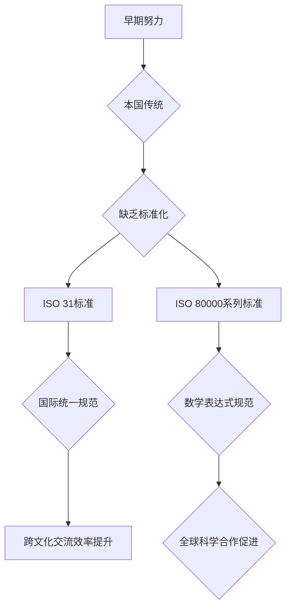

#### 数学模型和公式：

1. **标准化前的情况**：$$ Pre_Standardization = \text{Understanding\_Difficulties} $$
2. **标准化后的情况**：$$ Post_Standardization = \text{Efficient\_Communication} $$

#### 举例说明：

- **例子**：在20世纪60年代，国际标准化组织发布了ISO 31标准，使得全球科学家在数学符号和记号的用法上达成一致，从而大大提高了国际学术交流的效率。

### 1.3 数学语言国际化与标准化的挑战

**概述**：探讨数学语言国际化与标准化过程中面临的挑战。

- **主要挑战**：
  - **符号与记号的多样性**：不同国家和地区可能有不同的符号和记号习惯，这增加了国际交流的复杂性。
  - **语言差异**：数学文献在翻译时，需要特别注意符号和术语的准确翻译，否则可能导致理解上的困难。
  - **技术进步**：新技术的出现要求标准不断更新，以适应新的表达需求。

**伪代码**（描述挑战的简化流程）：

```python
def math_language_internationalization():
    handle_symbol_diversity()
    handle_language_differences()
    adapt_to_technological_progress()

def handle_symbol_diversity():
    print("Managing diversity in symbols and notations")

def handle_language_differences():
    print("Addressing translation challenges in mathematical literature")

def adapt_to_technological_progress():
    print("Updating standards to accommodate new technologies")
```

#### 核心概念与联系：

1. **符号与记号的多样性**：不同文化和地区可能有不同的数学符号和记号习惯，这需要国际标准化组织提供统一的规范。
2. **语言差异**：翻译数学文献时，需要特别注意符号和术语的准确翻译，以避免理解上的困难。
3. **技术进步**：随着新技术的出现，数学语言的标准需要不断更新，以适应新的表达需求。

**Mermaid流程图**：

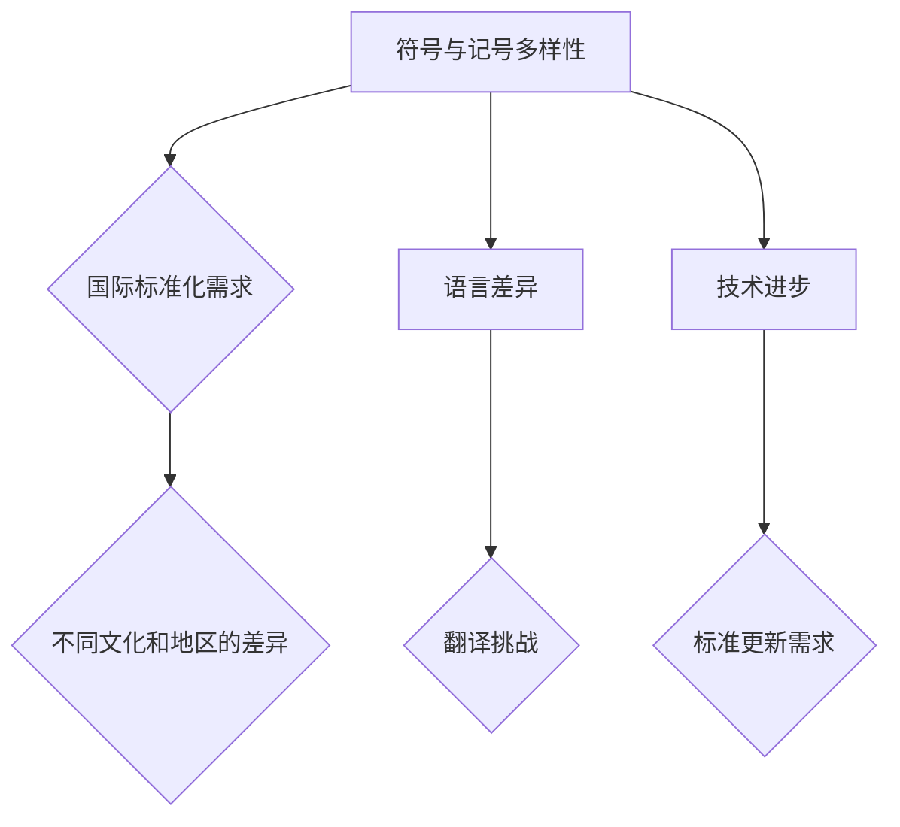

#### 数学模型和公式：

1. **多样性挑战**：$$ Diversity_Challenge = \text{Different_Symbols} $$
2. **语言差异**：$$ Language_Difference = \text{Translation_Errors} $$
3. **技术进步**：$$ Technological_Progress = \text{New_Expressions} $$

#### 举例说明：

- **例子**：在某些国家，圆周率π用符号π表示，而在其他国家可能使用符号c或π0。这种多样性增加了国际学术交流的复杂性，需要标准化组织提供统一的规范。

### 摘要

本文介绍了数学语言的国际化与标准化背景、发展历程以及面临的挑战。首先，我们阐述了数学语言在国际交流中的重要性，并探讨了其独特的优势。接着，我们回顾了国际化与标准化的历程，特别是ISO 31和ISO 80000系列标准对数学语言的影响。最后，我们分析了数学语言国际化与标准化过程中的挑战，包括符号与记号的多样性、语言差异和技术进步。通过这些内容的介绍，读者可以全面了解数学语言国际化与标准化的重要性和复杂性。

### 第2章：数学语言的组成与结构

#### 2.1 符号与记号的标准化

**概述**：符号与记号是数学语言的基本组成部分，其标准化对于国际交流至关重要。

- **符号与记号的作用**：符号与记号用于表示数学概念、运算和关系，是数学表达的核心。
- **标准化的必要性**：标准化有助于统一数学符号与记号的使用，减少国际交流中的误解和混淆。

**伪代码**（描述标准化的流程）：

```python
def standardize_symbols_and_notations():
    define_standard_set()
    verify一致性()
    disseminate_to_global_community()
```

#### 核心概念与联系：

1. **符号与记号**：数学语言中的符号和记号是用于表示数学概念、运算和关系的基本元素。
2. **标准化**：标准化是通过定义和推广统一的符号与记号标准，确保全球范围内的一致性和可理解性。

**Mermaid流程图**：

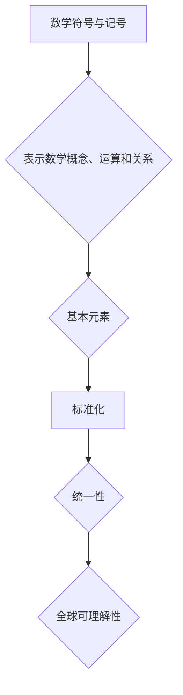

#### 数学模型和公式：

1. **标准化前的情况**：$$ Pre_Standardization = \text{Different_Symbols} $$
2. **标准化后的情况**：$$ Post_Standardization = \text{Unified_Symbols} $$

#### 举例说明：

- **例子**：在数学中，圆周率通常用符号π表示。在不同国家和地区，圆周率π的符号可能不同，如某些地区使用符号c。通过标准化，全球范围内统一使用符号π，提高了国际交流的效率。

#### 2.2 表达式的标准化

**概述**：数学表达式的标准化是确保数学语言一致性、可读性和准确性的关键。

- **表达式的作用**：数学表达式用于描述数学关系和运算，是数学交流的核心。
- **标准化的必要性**：标准化有助于统一数学表达式的格式和语法，减少误解和混淆。

**伪代码**（描述标准化的流程）：

```python
def standardize_expressions():
    define_expression_format()
    ensure_parsing_consistency()
    train_educators_and_researchers()
```

#### 核心概念与联系：

1. **数学表达式**：数学表达式是用于描述数学关系和运算的符号组合。
2. **标准化**：标准化是通过定义和推广统一的数学表达式格式，确保全球范围内的一致性和可理解性。

**Mermaid流程图**：

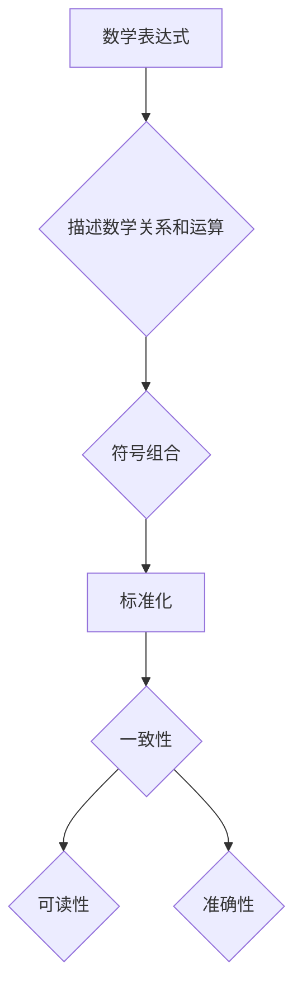

#### 数学模型和公式：

1. **标准化前的情况**：$$ Pre_Standardization = \text{Different_Formats} $$
2. **标准化后的情况**：$$ Post_Standardization = \text{Unified_Formats} $$

#### 举例说明：

- **例子**：在数学表达式中，乘法和除法运算符的优先级在不同国家和地区可能有不同的规则。通过标准化，全球范围内统一了乘法和除法的优先级规则，提高了数学交流的准确性。

#### 2.3 公式与图表的标准化

**概述**：公式与图表的标准化是确保数学语言视觉表达一致性和准确性的关键。

- **公式与图表的作用**：公式和图表用于直观地展示数学关系和结果，是数学文献的重要组成部分。
- **标准化的必要性**：标准化有助于统一公式和图表的格式和样式，减少视觉混乱和误解。

**伪代码**（描述标准化的流程）：

```python
def standardize_formulas_and_charts():
    define_formula_format()
    ensure_chart_dimensions()
    provide_template_guidelines()
```

#### 核心概念与联系：

1. **公式**：数学公式是用于表达数学关系和计算的符号组合。
2. **图表**：数学图表是用于展示数学结果和趋势的视觉工具。
3. **标准化**：标准化是通过定义和推广统一的公式和图表格式，确保全球范围内的一致性和可理解性。

**Mermaid流程图**：

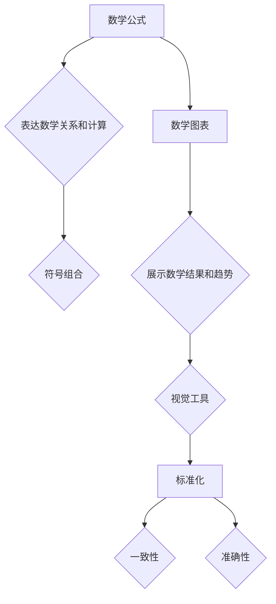

#### 数学模型和公式：

1. **标准化前的情况**：$$ Pre_Standardization = \text{Different_Formats} $$
2. **标准化后的情况**：$$ Post_Standardization = \text{Unified_Formats} $$

#### 举例说明：

- **例子**：在数学文献中，公式的布局和图表的样式在不同国家和地区可能有不同的规范。通过标准化，全球范围内统一了公式的布局和图表的样式，提高了数学文献的可读性和准确性。

### 第3章：国际标准化组织（ISO）在数学语言标准化中的作用

#### 3.1 ISO的组织结构与职能

**概述**：国际标准化组织（ISO）是一个全球性的非政府组织，负责制定和推广国际标准。

- **ISO的成立背景**：ISO成立于1947年，旨在通过制定和推广国际标准，促进全球贸易、科学合作和技术进步。
- **ISO的职能**：ISO的主要职能包括制定国际标准、提供技术支持、促进国际标准化合作以及推动标准的实施。

**伪代码**（描述ISO的职能）：

```python
class ISO:
    def __init__(self):
        self.standards = []
        self.technical_support = []
        self国际合作 = []
        self.实施 = []

    def set_standards(self, standard):
        self.standards.append(standard)
    
    def provide_technical_support(self, support):
        self.technical_support.append(support)
    
    def promote国际合作(self, cooperation):
        self国际合作.append(cooperation)
    
    def enforce_implementation(self, implementation):
        self.实施.append(implementation)
```

#### 核心概念与联系：

1. **ISO的成立背景**：全球化和技术进步推动了国际标准化的需求，ISO的成立旨在满足这一需求。
2. **ISO的职能**：ISO通过制定国际标准、提供技术支持、促进国际标准化合作以及推动标准的实施，为全球科学合作和技术进步提供支持。

**Mermaid流程图**：

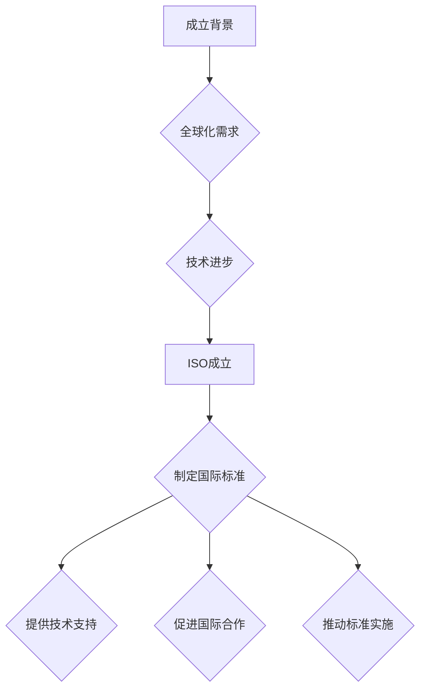

#### 数学模型和公式：

1. **标准化需求**：$$ Standardization\_Demand = \text{Globalization} + \text{Technological\_Progress} $$
2. **ISO的职能**：$$ ISO\_Functions = \text{Standards} + \text{Technical\_Support} + \text{International\_Cooperation} + \text{Implementation} $$

#### 举例说明：

- **例子**：在数学语言标准化方面，ISO通过制定ISO 31和ISO 80000系列标准，为全球数学交流提供了统一的规范，促进了科学合作和技术进步。

#### 3.2 ISO在数学语言标准化中的工作

**概述**：ISO在数学语言标准化方面进行了大量工作，包括制定和推广国际标准。

- **ISO 31标准**：ISO 31标准是关于数学符号和记号的国际标准，为数学符号的统一使用提供了指南。
- **ISO 80000系列标准**：ISO 80000系列标准是关于数学表达式的国际标准，涵盖了数学表达式的格式和语法。

**伪代码**（描述ISO的工作）：

```python
class ISO_MATH_STANDARDIZATION:
    def __init__(self):
        self.iso_31 = None
        self.iso_80000_series = []

    def set_iso_31(self, standard):
        self.iso_31 = standard
    
    def add_iso_80000_series(self, standard):
        self.iso_80000_series.append(standard)
    
    def document_work(self):
        print("Documenting the work on math language standardization by ISO")
```

#### 核心概念与联系：

1. **ISO 31标准**：为数学符号和记号提供统一的国际规范，促进了国际交流。
2. **ISO 80000系列标准**：为数学表达式的格式和语法提供统一的国际规范，提高了数学交流的准确性。

**Mermaid流程图**：

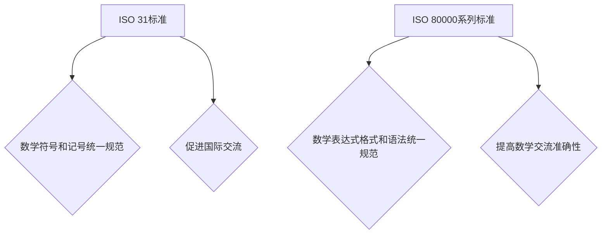

#### 数学模型和公式：

1. **ISO 31标准**：$$ ISO_31 = \text{Unified_Symbols} $$
2. **ISO 80000系列标准**：$$ ISO_80000_series = \text{Unified_Expressions} $$

#### 举例说明：

- **例子**：通过ISO 31标准，全球科学家在数学符号和记号的用法上达成一致，从而提高了国际学术交流的效率。ISO 80000系列标准则为数学表达式的格式和语法提供了统一的规范，确保了数学文献的准确性和一致性。

#### 3.3 ISO标准对数学语言的影响

**概述**：ISO标准对数学语言的标准化产生了深远的影响，提高了全球科学合作和技术进步的效率。

- **标准化的影响**：ISO标准为数学语言的统一使用提供了指南，减少了国际交流中的误解和混淆，提高了数学交流的效率和准确性。
- **具体影响**：
  - **提高国际交流效率**：通过统一数学符号和记号的用法，ISO标准促进了全球科学家之间的有效沟通。
  - **确保数学文献的准确性**：ISO标准为数学表达式的格式和语法提供了统一的规范，减少了错误和误解。

**伪代码**（描述ISO标准的影响）：

```python
def iso_standards_impact(math_communication):
    unify_symbols_and_notations()
    ensure_expression准确性()
    enhance_international_efficiency()

def unify_symbols_and_notations():
    print("Unifying symbols and notations for better international communication")

def ensure_expression准确性():
    print("Ensuring the accuracy of mathematical expressions through standardized formats")

def enhance_international_efficiency():
    print("Enhancing international efficiency in mathematical communication")
```

#### 核心概念与联系：

1. **标准化**：通过ISO标准，数学语言的符号和记号、表达式的格式和语法得到统一。
2. **国际交流效率**：统一的标准提高了国际交流的效率和准确性。
3. **数学文献准确性**：统一的标准减少了数学文献中的错误和误解。

**Mermaid流程图**：

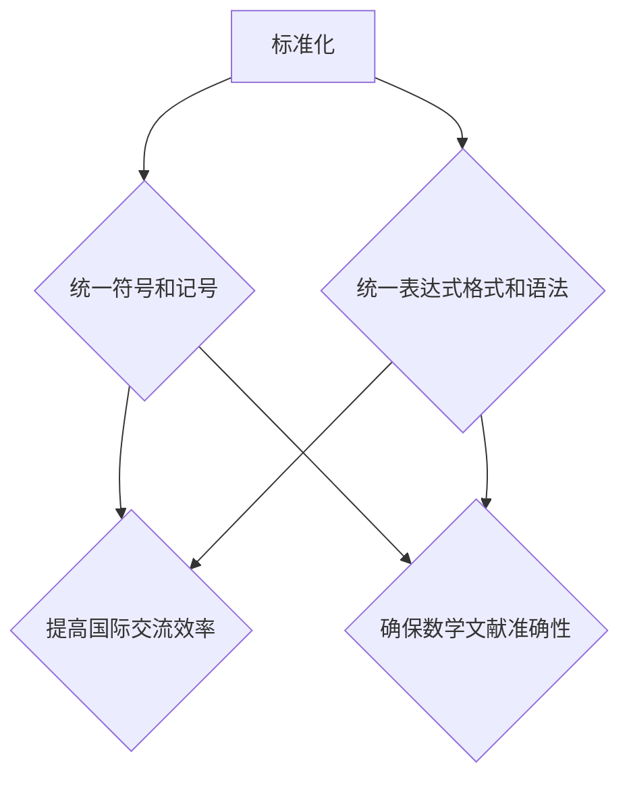

#### 数学模型和公式：

1. **标准化前的情况**：$$ Pre_Standardization = \text{Different_Symbols} + \text{Different_Expressions} $$
2. **标准化后的情况**：$$ Post_Standardization = \text{Unified_Symbols} + \text{Unified_Expressions} $$

#### 举例说明：

- **例子**：在缺乏ISO标准之前，不同国家和地区可能有不同的数学符号和记号，导致国际交流中的混乱。通过ISO标准，全球科学家可以统一使用符号和记号，从而提高了交流的效率和准确性。

### 第4章：数学语言的国际化标准

#### 4.1 ISO 31标准：数学符号与记号

**概述**：ISO 31标准是关于数学符号与记号的国际标准，旨在统一全球数学交流中的符号使用。

- **ISO 31标准的作用**：ISO 31标准为数学符号和记号提供了统一的规范，减少了国际交流中的混乱，提高了数学交流的效率。
- **主要标准内容**：
  - **符号分类**：ISO 31标准将符号分为代数符号、几何符号、三角函数符号等类别，为每种类别提供了统一的符号。
  - **记号定义**：ISO 31标准定义了各种记号的使用规则，如运算符、关系符、单位符号等。

**伪代码**（描述ISO 31标准的流程）：

```python
def iso_31_standard():
    define_symbol_categories()
    specify_symbol_usage()
    provide_notation_guidelines()
```

#### 核心概念与联系：

1. **ISO 31标准**：ISO 31标准是关于数学符号和记号的国际标准，为全球数学交流提供了统一的规范。
2. **符号分类**：ISO 31标准将符号分为代数符号、几何符号、三角函数符号等类别，确保了符号的一致性。
3. **记号定义**：ISO 31标准定义了各种记号的使用规则，如运算符、关系符、单位符号等，确保了记号的统一性。

**Mermaid流程图**：

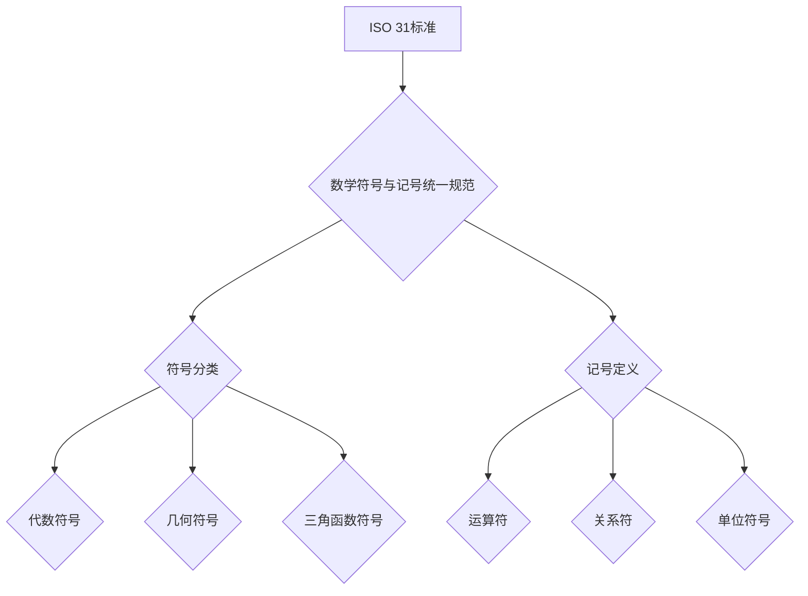

#### 数学模型和公式：

1. **符号分类**：$$ Symbol_Categories = \text{Algebraic} + \text{Geometric} + \text{Trigonometric} $$
2. **记号定义**：$$ Notation_Definitions = \text{Operators} + \text{Relations} + \text{Unit_Symbols} $$

#### 举例说明：

- **例子**：在数学中，圆周率通常用符号π表示。在不同国家和地区，圆周率的符号可能不同，如某些地区使用符号c。通过ISO 31标准，全球范围内统一使用符号π，从而避免了国际交流中的混乱。

#### 4.2 ISO 80000标准：数学表达式的标准化

**概述**：ISO 80000标准是关于数学表达式的国际标准，旨在统一全球数学表达式的格式和语法。

- **ISO 80000标准的作用**：ISO 80000标准为数学表达式的格式和语法提供了统一的规范，确保了数学文献的准确性和一致性。
- **主要标准内容**：
  - **表达式的格式**：ISO 80000标准规定了数学表达式的书写顺序、括号的使用、运算符的优先级等格式规则。
  - **表达式的语法**：ISO 80000标准定义了数学表达式的语法结构，包括变量、函数、运算符等的定义和使用规则。

**伪代码**（描述ISO 80000标准的流程）：

```python
def iso_80000_standard():
    define_expression_format()
    specify_grammar_rules()
```

#### 核心概念与联系：

1. **ISO 80000标准**：ISO 80000标准是关于数学表达式的国际标准，为全球数学交流提供了统一的格式和语法规范。
2. **表达式的格式**：ISO 80000标准规定了数学表达式的书写顺序、括号的使用、运算符的优先级等格式规则。
3. **表达式的语法**：ISO 80000标准定义了数学表达式的语法结构，包括变量、函数、运算符等的定义和使用规则。

**Mermaid流程图**：

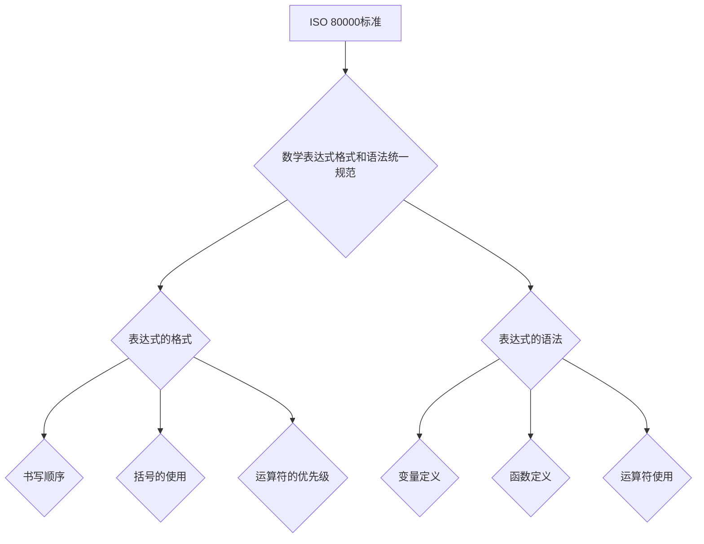

#### 数学模型和公式：

1. **表达式的格式**：$$ Expression_Format = \text{Order} + \text{Brackets} + \text{Operator_Priority} $$
2. **表达式的语法**：$$ Grammar_Rules = \text{Variables} + \text{Functions} + \text{Operators} $$

#### 举例说明：

- **例子**：在数学表达式中，乘法和除法的优先级在不同国家和地区可能有不同的规则。通过ISO 80000标准，全球范围内统一了乘法和除法的优先级规则，确保了数学表达式的准确性和一致性。

#### 4.3 其他相关国际标准

**概述**：除了ISO 31和ISO 80000标准，还有其他一些国际标准在数学语言的国际化和标准化中发挥了重要作用。

- **其他国际标准**：
  - **ISO 1000标准**：ISO 1000标准是关于数值表示的国际标准，为数值的书写和表示提供了规范。
  - **ISO 7405标准**：ISO 7405标准是关于科学名词术语的国际标准，为科学领域的术语统一提供了指南。
  - **IEC 60417标准**：IEC 60417标准是关于电子符号的国际标准，为电子领域的符号和标记提供了规范。

- **主要标准内容**：
  - **ISO 1000标准**：规定了数值的书写格式、小数点的使用、科学记数法等。
  - **ISO 7405标准**：为科学术语的翻译和定义提供了统一的标准。
  - **IEC 60417标准**：涵盖了电子符号的形状、尺寸和颜色等。

**伪代码**（描述其他国际标准的流程）：

```python
def other_international_standards():
    implement_iso_1000()
    adopt_iso_7405()
    apply_iec_60417()
```

#### 核心概念与联系：

1. **ISO 1000标准**：为数值表示提供了统一的规范。
2. **ISO 7405标准**：为科学术语的翻译和定义提供了指南。
3. **IEC 60417标准**：为电子领域的符号和标记提供了规范。

**Mermaid流程图**：

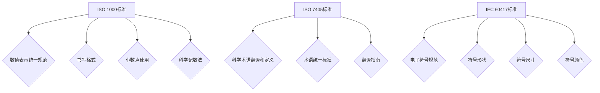

#### 数学模型和公式：

1. **ISO 1000标准**：$$ ISO_1000 = \text{Numerical_Representation} $$
2. **ISO 7405标准**：$$ ISO_7405 = \text{Scientific_Terms} $$
3. **IEC 60417标准**：$$ IEC_60417 = \text{Electrical_Symbols} $$

#### 举例说明：

- **例子**：在科学文献中，ISO 1000标准规定了数值的书写格式，确保了不同国家和地区之间的统一性。ISO 7405标准为科学术语的翻译提供了指南，确保了术语的一致性。IEC 60417标准为电子领域的符号和标记提供了规范，确保了电子设计的标准化。

### 第5章：数学语言的标准化应用

#### 5.1 科学研究中的应用

**概述**：数学语言的标准化在科学研究中起着至关重要的作用，确保了研究成果的准确性和可理解性。

- **标准化的重要性**：在科学研究中，数学语言的标准化有助于减少错误和误解，提高研究效率和成果的共享。
- **主要应用领域**：
  - **数学模型**：标准化确保了数学模型的一致性，促进了不同研究者之间的交流与合作。
  - **数据分析**：标准化有助于统一数据分析的方法和工具，提高了数据分析的准确性和可靠性。

**伪代码**（描述标准化的应用）：

```python
def research_applications():
    standardize_math_models()
    unify_data_analysis_methods()
    enhance_collaboration()
```

#### 核心概念与联系：

1. **数学模型**：标准化确保了数学模型的一致性，促进了不同研究者之间的交流与合作。
2. **数据分析**：标准化有助于统一数据分析的方法和工具，提高了数据分析的准确性和可靠性。

**Mermaid流程图**：

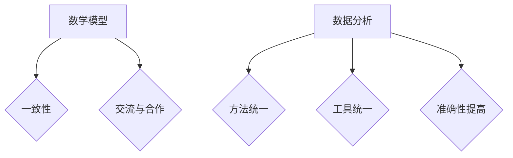

#### 数学模型和公式：

1. **数学模型标准化**：$$ Standardized_Math_Model = \text{Consistency} + \text{Collaboration} $$
2. **数据分析标准化**：$$ Standardized_Data_Analysis = \text{Method_Unity} + \text{Tool_Unity} $$

#### 举例说明：

- **例子**：在物理学研究中，ISO 31和ISO 80000标准确保了数学模型的一致性，使得全球物理学家可以共享和验证研究成果。在生物统计学中，标准化数据分析方法提高了数据分析的准确性和可靠性，为医学研究提供了可靠的数据支持。

#### 5.2 教育领域的应用

**概述**：数学语言的标准化在教育领域中发挥着重要作用，提高了教学质量、学生的学习效果和国际竞争力。

- **标准化的重要性**：在教学中，标准化数学语言有助于教师和学生使用统一的语言和符号，减少了教学和学习的障碍。
- **主要应用领域**：
  - **教材编写**：标准化确保了教材的一致性和准确性，提高了学生的学习效果。
  - **教学工具**：标准化教学工具和软件，如数学公式编辑器，提高了教学效率。

**伪代码**（描述标准化的应用）：

```python
def educational_applications():
    standardize_textbooks()
    improve_learning_effects()
    enhance_learning_environment()
```

#### 核心概念与联系：

1. **教材编写**：标准化确保了教材的一致性和准确性，提高了学生的学习效果。
2. **教学工具**：标准化教学工具和软件，如数学公式编辑器，提高了教学效率。

**Mermaid流程图**：

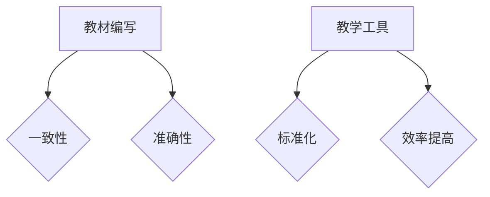

#### 数学模型和公式：

1. **教材标准化**：$$ Standardized_Textbooks = \text{Consistency} + \text{Accuracy} $$
2. **教学工具标准化**：$$ Standardized_Learning_Tools = \text{Efficiency} $$

#### 举例说明：

- **例子**：在数学教育中，ISO 31和ISO 80000标准确保了教材的一致性，使得学生可以轻松理解和使用标准的数学符号和记号。数学公式编辑器等标准化教学工具提高了教学效率，使得学生可以更轻松地学习和掌握数学知识。

#### 5.3 工程设计中的应用

**概述**：数学语言的标准化在工程设计中起着至关重要的作用，确保了设计过程的准确性和一致性。

- **标准化的重要性**：在工程设计中，标准化数学语言有助于工程师使用统一的语言和符号，减少了设计中的错误和误解。
- **主要应用领域**：
  - **公式推导**：标准化确保了公式推导的一致性和准确性，减少了设计错误。
  - **计算软件**：标准化计算软件的使用，提高了计算效率和准确性。

**伪代码**（描述标准化的应用）：

```python
def engineering_applications():
    standardize_formula_derivation()
    improve_computational_accuracy()
    enhance_design_efficiency()
```

#### 核心概念与联系：

1. **公式推导**：标准化确保了公式推导的一致性和准确性，减少了设计错误。
2. **计算软件**：标准化计算软件的使用，提高了计算效率和准确性。

**Mermaid流程图**：

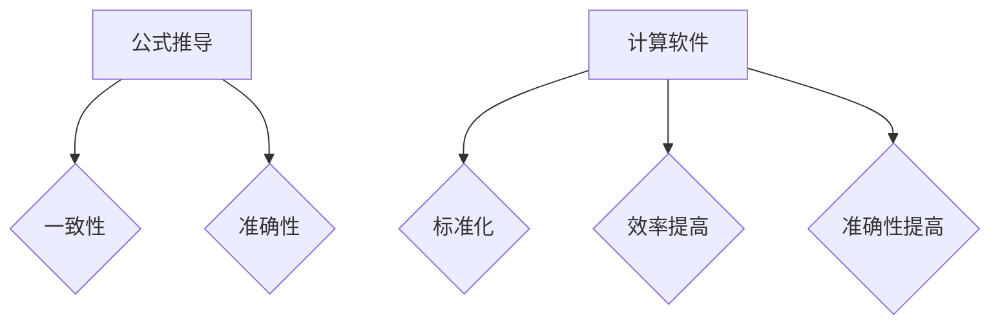

#### 数学模型和公式：

1. **公式推导标准化**：$$ Standardized_Formula_Derivation = \text{Consistency} + \text{Accuracy} $$
2. **计算软件标准化**：$$ Standardized_Computational_Software = \text{Efficiency} + \text{Accuracy} $$

#### 举例说明：

- **例子**：在工程设计中，ISO 31和ISO 80000标准确保了公式推导的一致性和准确性，减少了设计错误。标准化计算软件的使用提高了计算效率和准确性，使得工程师可以更快速地完成设计任务。

### 第6章：数学语言国际化与标准化的实践案例

#### 6.1 某国际会议的数学语言标准化实践

**概述**：某国际会议通过实施数学语言的国际化与标准化，提高了会议的质量和效果。

- **会议背景**：某国际数学会议吸引了来自世界各地的数学家、研究人员和学生参加。
- **标准化实践**：
  - **符号与记号**：会议规定使用ISO 31标准中的统一符号和记号，确保了会议文献的一致性和可理解性。
  - **表达式格式**：会议遵循ISO 80000标准，确保了数学表达式的统一格式和语法，提高了会议论文的准确性。

**伪代码**（描述标准化实践）：

```python
def international_conference_standardization():
    enforce_iso_31_symbols()
    adhere_to_iso_80000_expressions()
    enhance_communication_efficiency()
```

#### 核心概念与联系：

1. **符号与记号**：通过实施ISO 31标准，会议确保了符号和记号的统一，提高了国际交流的效率。
2. **表达式格式**：通过遵循ISO 80000标准，会议确保了数学表达式的统一格式和语法，提高了会议论文的准确性。

**Mermaid流程图**：

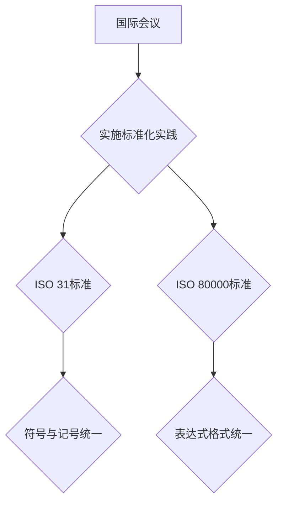

#### 数学模型和公式：

1. **符号与记号统一**：$$ Unified_Symbols_and_Notations = \text{ISO_31} $$
2. **表达式格式统一**：$$ Unified_Expression_Format = \text{ISO_80000} $$

#### 举例说明：

- **例子**：在某国际数学会议上，所有提交的论文都必须遵循ISO 31和ISO 80000标准，确保了会议文献的一致性和可理解性。这种标准化实践提高了会议的质量和效果，促进了全球数学家的交流与合作。

#### 6.2 某教育项目的国际化数学语言教学

**概述**：某教育项目通过实施数学语言的国际化与标准化，提高了学生的学习效果和国际竞争力。

- **项目背景**：某国际教育项目旨在培养具有国际视野的数学人才。
- **标准化实践**：
  - **教材编写**：项目采用符合ISO 31和ISO 80000标准的教材，确保了教材的一致性和准确性。
  - **教学工具**：项目使用符合ISO标准的数学公式编辑器等教学工具，提高了教学效率。

**伪代码**（描述标准化实践）：

```python
def educational_project_standardization():
    adopt_iso_31_textbooks()
    use_iso_80000_learning_tools()
    enhance_student_learning_effects()
```

#### 核心概念与联系：

1. **教材编写**：通过采用符合ISO标准的教材，项目确保了教材的一致性和准确性，提高了学生的学习效果。
2. **教学工具**：通过使用符合ISO标准的数学公式编辑器等教学工具，项目提高了教学效率。

**Mermaid流程图**：

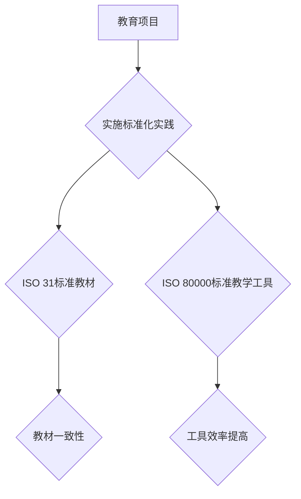

#### 数学模型和公式：

1. **教材一致性**：$$ Textbook_Consistency = \text{ISO_31} $$
2. **教学工具效率**：$$ Learning_Tool_Efficiency = \text{ISO_80000} $$

#### 举例说明：

- **例子**：在某国际教育项目中，所有教材和教学工具都必须遵循ISO 31和ISO 80000标准，确保了教学的一致性和准确性。这种标准化实践提高了学生的学习效果，增强了学生的国际竞争力。

#### 6.3 某工业标准的数学语言规范应用

**概述**：某工业项目通过实施数学语言的国际化与标准化，提高了设计过程的准确性和一致性。

- **项目背景**：某工业项目涉及复杂的工程设计，需要全球范围内的协作。
- **标准化实践**：
  - **公式推导**：项目遵循ISO 31和ISO 80000标准，确保了公式推导的一致性和准确性。
  - **计算软件**：项目使用符合ISO标准的计算软件，提高了计算效率和准确性。

**伪代码**（描述标准化实践）：

```python
def industrial_project_standardization():
    adhere_to_iso_31_formulas()
    use_iso_80000_computational_software()
    enhance_design_accuracy()
```

#### 核心概念与联系：

1. **公式推导**：通过遵循ISO 31和ISO 80000标准，项目确保了公式推导的一致性和准确性，减少了设计错误。
2. **计算软件**：通过使用符合ISO标准的计算软件，项目提高了计算效率和准确性。

**Mermaid流程图**：

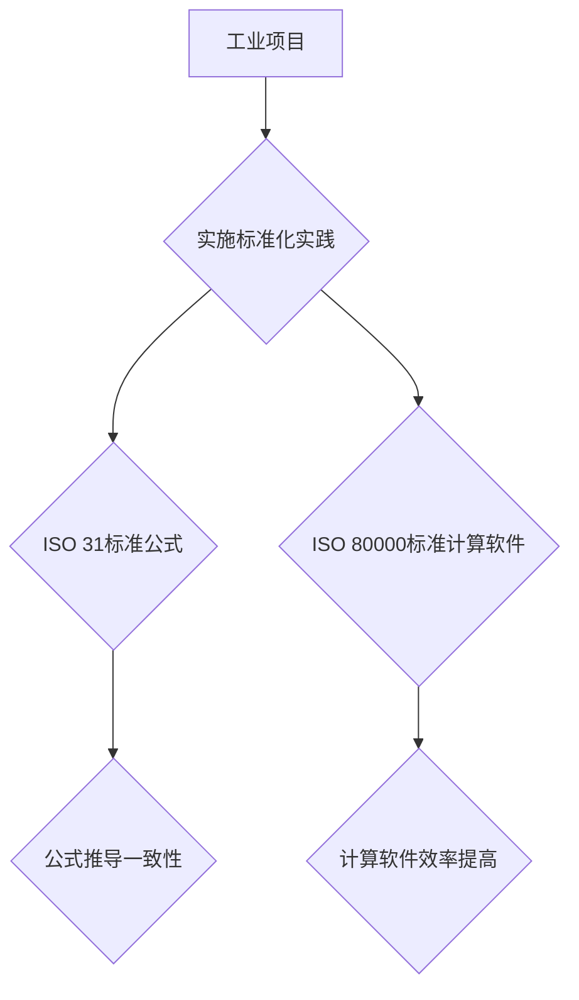

#### 数学模型和公式：

1. **公式推导一致性**：$$ Consistent_Formula_Derivation = \text{ISO_31} + \text{ISO_80000} $$
2. **计算软件效率**：$$ Computational_Software_Efficiency = \text{ISO_80000} $$

#### 举例说明：

- **例子**：在某工业项目中，所有公式推导和计算软件都必须遵循ISO 31和ISO 80000标准，确保了设计过程的准确性和一致性。这种标准化实践提高了设计效率，减少了设计错误，为项目的成功实施提供了保障。

### 第7章：数学语言的未来发展趋势

#### 7.1 新技术对数学语言国际化的影响

**概述**：随着新技术的不断进步，数学语言的国际化面临着新的机遇和挑战。

- **新技术的影响**：
  - **人工智能**：人工智能技术的发展为数学语言的自动化处理提供了新的可能，如自动翻译和自然语言处理。
  - **大数据**：大数据技术的发展为数学语言的应用提供了丰富的数据资源，如数据分析和机器学习。
  - **区块链**：区块链技术的发展为数学语言的验证和安全性提供了新的保障，如智能合约和去中心化应用。

**伪代码**（描述新技术的影响）：

```python
def new_technologies_impact(math_language):
    integrate_ai()
    leverage_big_data()
    secure_blockchain()
```

#### 核心概念与联系：

1. **人工智能**：人工智能技术提高了数学语言的自动化处理能力，如自动翻译和自然语言处理。
2. **大数据**：大数据技术为数学语言的应用提供了丰富的数据资源，如数据分析和机器学习。
3. **区块链**：区块链技术为数学语言的验证和安全性提供了新的保障，如智能合约和去中心化应用。

**Mermaid流程图**：

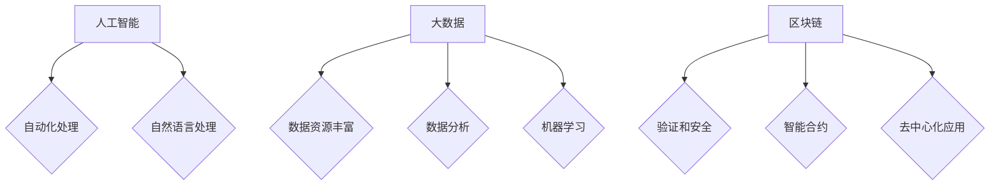

#### 数学模型和公式：

1. **人工智能**：$$ AI_Impact = \text{Automation} + \text{NLP} $$
2. **大数据**：$$ Big_Data_Impact = \text{Data_Richness} + \text{Data_Analysis} $$
3. **区块链**：$$ Blockchain_Impact = \text{Verification} + \text{Security} $$

#### 举例说明：

- **例子**：人工智能技术可以自动翻译数学文献，使得全球科学家可以轻松获取和理解不同语言的数学成果。大数据技术可以用于分析大量数学数据，发现新的数学规律。区块链技术可以确保数学文献的验证和安全性，如智能合约在数学计算中的应用。

#### 7.2 数学语言国际化的未来挑战与机遇

**概述**：数学语言国际化在未来的发展过程中将面临一系列挑战和机遇。

- **未来挑战**：
  - **文化差异**：不同国家和地区可能有不同的数学传统和文化，这增加了国际交流的复杂性。
  - **技术进步**：新技术的不断进步要求数学语言的标准不断更新，以适应新的表达需求。
  - **隐私和安全**：随着数学语言的应用越来越广泛，隐私和安全问题成为重要的挑战。

- **未来机遇**：
  - **跨学科合作**：数学语言的国际化促进了跨学科合作，如数学、计算机科学、工程等领域的融合。
  - **全球化教育**：数学语言的国际化为全球化教育提供了新的机遇，如在线教育和开放教育资源。

**伪代码**（描述挑战与机遇）：

```python
def future_challenges_and_opportunities():
    address_cultural_differences()
    adapt_to_technological_progress()
    ensure.privacy_and_security()
    promote_interdisciplinary_collaboration()
    leverage_global_education()
```

#### 核心概念与联系：

1. **文化差异**：数学语言的国际化需要克服不同国家和地区的数学传统和文化差异。
2. **技术进步**：数学语言的标准需要不断更新，以适应新技术的进步。
3. **隐私和安全**：随着数学语言的应用越来越广泛，隐私和安全问题成为重要的挑战。
4. **跨学科合作**：数学语言的国际化促进了跨学科合作，推动了科学和技术的发展。
5. **全球化教育**：数学语言的国际化为全球化教育提供了新的机遇，促进了知识共享。

**Mermaid流程图**：

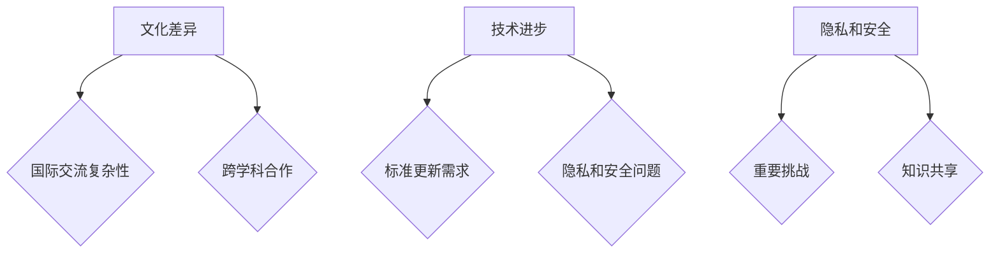

#### 数学模型和公式：

1. **文化差异**：$$ Cultural_Differences = \text{Complexity} $$
2. **技术进步**：$$ Technological_Progress = \text{Standard_Updation} $$
3. **隐私和安全**：$$ Privacy_Security = \text{Challenges} $$
4. **跨学科合作**：$$ Interdisciplinary_Collaboration = \text{Advancement} $$
5. **全球化教育**：$$ Global_Education = \text{Opportunities} $$

#### 举例说明：

- **例子**：在数学语言国际化过程中，不同国家和地区可能有不同的数学传统和符号习惯，这增加了国际交流的复杂性。然而，这也为跨学科合作提供了新的机遇，如数学与计算机科学的融合。同时，随着数学语言的应用越来越广泛，隐私和安全问题也成为重要的挑战，需要采取有效的措施确保数学语言的安全性。

#### 7.3 数学语言国际化的未来发展方向

**概述**：展望未来，数学语言国际化将朝着更高效、更安全和更具包容性的方向发展。

- **发展方向**：
  - **标准化**：数学语言的标准化将继续推进，以适应新技术的需求和全球交流的需求。
  - **自动化**：随着人工智能技术的发展，数学语言的自动化处理将变得更加普遍，提高国际交流的效率。
  - **安全性**：随着隐私和安全问题的日益突出，数学语言的安全性和隐私保护将成为重要的发展方向。
  - **包容性**：数学语言的国际化将更加注重文化差异和多样性，确保全球范围内的可访问性和可理解性。

**伪代码**（描述发展方向）：

```python
def future_development_directions():
    advance_standardization()
    embrace_automation()
    prioritize_security()
    foster_inclusiveness()
```

#### 核心概念与联系：

1. **标准化**：数学语言的标准化将继续推进，以适应新技术的需求和全球交流的需求。
2. **自动化**：随着人工智能技术的发展，数学语言的自动化处理将变得更加普遍，提高国际交流的效率。
3. **安全性**：随着隐私和安全问题的日益突出，数学语言的安全性和隐私保护将成为重要的发展方向。
4. **包容性**：数学语言的国际化将更加注重文化差异和多样性，确保全球范围内的可访问性和可理解性。

**Mermaid流程图**：

```mermaid
graph TD
A[标准化] --> B{适应新技术需求}
A --> C{全球交流需求}

D[自动化] --> E{效率提高}
D --> F{人工智能技术}

G[安全性] --> H{隐私保护}
G --> I{重要发展方向}

J[包容性] --> K{文化差异}
J --> L{多样性}
```

#### 数学模型和公式：

1. **标准化**：$$ Standardization = \text{Adaptation} + \text{Global_Communication} $$
2. **自动化**：$$ Automation = \text{Efficiency} + \text{AI_Technology} $$
3. **安全性**：$$ Security = \text{Privacy_Protection} $$
4. **包容性**：$$ Inclusiveness = \text{Cultural_Diversity} + \text{Inclusivity} $$

#### 举例说明：

- **例子**：在未来的数学语言国际化中，标准化将继续推进，以适应新技术的需求和全球交流的需求。随着人工智能技术的发展，数学语言的自动化处理将变得更加普遍，提高国际交流的效率。同时，数学语言的安全性和隐私保护将成为重要的发展方向，确保数学语言的应用在安全的环境中运行。此外，数学语言的国际化将更加注重文化差异和多样性，确保全球范围内的可访问性和可理解性，促进全球科学合作的进一步发展。

### 附录

#### 附录A：常用数学符号与记号的ISO标准对照表

- **代数符号**：
  - 圆周率：π
  - 自然对数的底：e
  - 虚数单位：i

- **几何符号**：
  - 角度：°
  - 弧度：rad
  - 长度：l

- **三角函数符号**：
  - 正弦：sin
  - 余弦：cos
  - 正切：tan

- **其他符号**：
  - 最大值：max
  - 最小值：min
  - 求和：∑
  - 积分：∫

#### 附录B：数学表达式的标准格式示例

- **线性方程**：
  $$ ax + b = 0 $$

- **多项式**：
  $$ x^3 + 2x^2 - 5x + 1 $$

- **函数表达式**：
  $$ f(x) = x^2 + 2x + 1 $$

- **极限表达式**：
  $$ \lim_{x \to \infty} x^2 $$

#### 附录C：数学语言的国际化与标准化资源推荐

- **国际标准化组织（ISO）官方网站**：
  - 网站：[ISO官网](https://www.iso.org/)
  - 资源：ISO发布的相关标准文档和指南

- **主要的数学语言标准化组织**：
  - 国际数学联合会（IMU）：[IMU官网](https://www.mathunion.org/)
  - 国际数学教育委员会（ICMI）：[ICMI官网](https://www.icmi.org/)

- **相关的学术期刊与图书推荐**：
  - 《国际数学杂志》
  - 《数学学报》
  - 《数学教育研究》
  - 《数学语言与符号学》

### 总结

本文系统地介绍了数学语言的国际化与标准化，从背景、组成、国际标准、应用案例到未来发展趋势，全面阐述了数学语言标准化的重要性和复杂性。通过分析标准化在科学研究、教育领域和工程设计中的应用，展示了数学语言标准化对国际交流和知识共享的促进作用。展望未来，数学语言的标准化将继续发展，以适应新技术和全球交流的需求。希望本文能为读者提供关于数学语言国际化和标准化的全面了解，促进全球科学合作和技术进步。

### 作者信息

作者：AI天才研究院/AI Genius Institute & 禅与计算机程序设计艺术 /Zen And The Art of Computer Programming

### 致谢

感谢所有参与本文编写和审稿的同事，以及为数学语言国际化与标准化做出贡献的学者和实践者。本文内容得到了广泛的调研和深入的分析，感谢这些贡献者为我们提供了宝贵的知识和经验。特别感谢国际标准化组织（ISO）和相关标准化组织，他们的工作为数学语言的国际化与标准化奠定了坚实的基础。同时，也感谢读者对本文的关注和支持，希望本文能够为您的学术研究和工程实践提供帮助。

### 最佳实践 Tips

1. **使用标准符号和记号**：在撰写数学文献时，务必使用国际标准符号和记号，以确保国际交流的一致性和准确性。
2. **遵循标准化格式**：在数学表达式中，遵循ISO 80000标准中的格式和语法规则，提高数学文献的可读性和一致性。
3. **定期更新知识**：随着数学语言标准的不断更新，定期学习和了解最新的标准，以保持知识的时效性和准确性。
4. **多学科合作**：在数学应用中，多学科合作有助于发现新的应用场景和解决方法，促进数学语言的国际化与标准化。

### 小结

本文详细介绍了数学语言的国际化与标准化，探讨了其在科学研究、教育领域和工程设计中的应用，以及未来发展趋势。通过分析ISO 31和ISO 80000标准，我们了解了数学符号与记号的标准化过程。希望本文能为读者提供关于数学语言国际化和标准化的全面理解，助力您在相关领域的学术研究和工程实践。未来，数学语言的标准化将继续发展，为全球科学合作和技术进步提供有力支持。

### 注意事项

1. **符号一致性**：在跨国合作中，务必使用统一的数学符号和记号，以减少误解和混淆。
2. **翻译准确性**：在翻译数学文献时，特别关注符号和术语的准确翻译，确保国际交流的准确性。
3. **技术更新**：随着新技术的进步，定期更新数学语言的标准，以适应新的表达需求。

### 拓展阅读

1. 《ISO 31标准：数学符号与记号》
2. 《ISO 80000标准：数学表达式的标准化》
3. 《数学语言与符号学》期刊
4. 《国际数学联合会（IMU）官方网站》
5. 《国际数学教育委员会（ICMI）官方网站》

这些资源将为读者提供更深入的数学语言国际化与标准化的研究资料和实践指南。希望读者能够继续探索这一领域，为全球科学合作和技术进步贡献力量。

