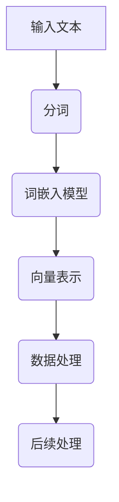
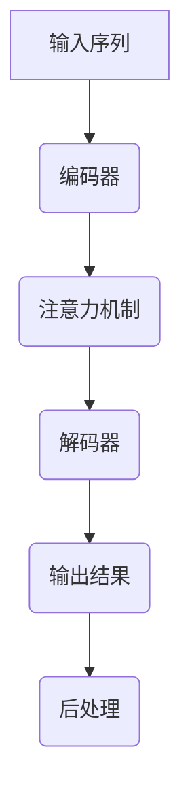
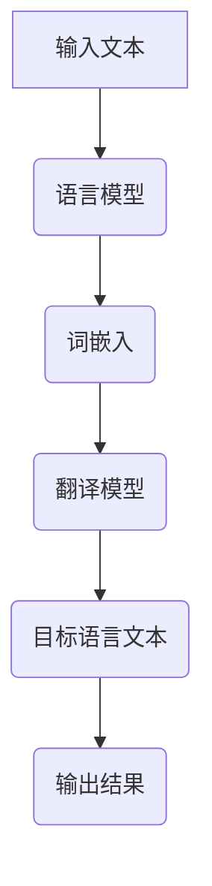

                 

### 第一部分：引言

#### 1.1 数学语言的认知基础

**1.1.1 数学语言的概念与特点**

数学语言是一种独特的符号语言，它通过数学符号、公式和图形来描述概念和关系。这种语言具有高度抽象性和精确性，不同于自然语言，它不依赖于语境和情感色彩。数学语言的特点包括：

- **符号化**：数学语言使用符号来代表数学对象和操作，如“+”代表加法，“π”代表圆周率。
- **精确性**：数学语言可以精确描述和验证逻辑推理和计算过程。
- **抽象性**：数学语言能将具体问题抽象为一般性问题，如通过数学公式描述几何形状和物理现象。

**1.1.2 数学认知的心理机制**

数学认知是指人类理解和处理数学概念和问题的过程。它涉及到大脑的不同区域和神经网络活动。以下是数学认知的心理机制：

- **符号识别**：大脑需要识别和理解数学符号，这是数学认知的基础。
- **逻辑推理**：数学认知依赖逻辑推理，通过逐步推导来解决问题。
- **空间能力**：几何问题解决需要空间能力，如理解三维形状和位置关系。
- **记忆与存储**：数学认知需要记忆数学公式、定理和概念，以便在解决问题时快速调用。

**1.1.3 数学认知的神经基础**

数学认知的神经基础是大脑中特定区域的活动。研究表明，数学认知涉及到以下大脑区域：

- **前额叶皮层**：与逻辑推理和问题解决相关。
- **顶叶**：与空间能力和数学符号处理相关。
- **颞叶**：与数学符号的识别和理解相关。
- **纹状体**：与数学计算和记忆相关。

数学认知的神经基础不仅包括大脑区域的协作，还涉及到神经网络的复杂互动。这些神经网络通过神经元间的连接和信号传递，实现了数学概念的处理和运算。

#### 1.2 认知神经科学的研究方法

**1.2.1 神经科学的历史与现状**

神经科学是研究神经系统和大脑功能的科学。它起源于19世纪，随着显微镜技术的发展，科学家们开始探索神经元的结构和功能。20世纪中叶，认知神经科学的兴起，使得人们对大脑如何处理信息的理解有了重大突破。

当前，神经科学已经发展成为一个跨学科领域，结合了生物学、计算机科学、心理学等多个学科。认知神经科学的研究主要集中在理解大脑如何实现认知功能，如记忆、学习、语言理解和问题解决。

**1.2.2 神经科学研究的基本方法**

神经科学研究的基本方法包括：

- **神经影像技术**：如功能性磁共振成像（fMRI）、电生理记录（如EEG、MEG）、光遗传学等，用于观察大脑活动。
- **神经生理学方法**：通过记录神经元电活动、神经递质释放等，研究神经系统的基本功能。
- **行为实验**：通过设计实验，观察人在不同条件下的行为表现，推断大脑功能。
- **计算模型**：构建数学模型来模拟大脑神经网络的活动，预测认知过程。

**1.2.3 认知神经科学的跨学科特点**

认知神经科学具有明显的跨学科特点，它结合了生物学、心理学、计算机科学等多个领域的知识。具体表现在：

- **跨学科数据整合**：结合不同学科的数据，如神经影像数据、行为数据、神经生理数据等，提供更全面的大脑认知机制。
- **多学科方法应用**：将神经影像技术、计算模型、行为实验等多种方法应用于认知神经科学研究。
- **跨学科合作**：认知神经科学研究需要多学科专家的协作，共同推进科学进展。

通过结合数学语言的认知基础和认知神经科学的研究方法，我们可以深入探索数学认知的神经基础，为人工智能和认知科学的发展提供新的思路和方法。

### 第二部分：数学语言处理的核心算法

#### 2.1 神经网络与深度学习基础

**2.1.1 神经网络的基本结构**

神经网络（Neural Network，NN）是模仿生物神经系统的计算模型，由大量的节点（神经元）和连接（突触）组成。其基本结构包括：

- **输入层**：接收外部输入信息。
- **隐藏层**：对输入信息进行加工处理。
- **输出层**：产生最终输出。

神经网络的工作原理是通过输入层接收输入数据，通过隐藏层进行多级计算，最终在输出层产生输出。这种计算过程模拟了生物神经系统中的信息处理过程。

**2.1.2 前馈神经网络与反向传播算法**

前馈神经网络（Feedforward Neural Network，FNN）是最常见的神经网络类型，其信息传递方向是单向的，从输入层到输出层，没有循环。

反向传播算法（Backpropagation Algorithm）是一种用于训练神经网络的梯度下降方法。其基本步骤如下：

1. **前向传播**：将输入数据传递到网络中，通过各层神经元计算，得到输出结果。
2. **计算误差**：计算实际输出与期望输出之间的误差。
3. **反向传播**：将误差反向传递到各层神经元，更新权重和偏置。
4. **权重更新**：根据梯度下降规则，更新网络权重，减小误差。

反向传播算法的关键在于如何计算误差对权重的偏导数，即梯度。通过多次迭代，反向传播算法可以逐步减小误差，使网络输出更接近期望输出。

**2.1.3 深度学习框架简介**

深度学习（Deep Learning，DL）是一种基于深度神经网络的机器学习技术。其核心思想是通过多层神经网络对数据进行多层次的特征提取和抽象，从而实现复杂任务的求解。

深度学习框架是用于实现和优化深度学习算法的工具集。主流的深度学习框架包括：

- **TensorFlow**：由谷歌开发，支持多种深度学习模型，具有强大的计算图功能。
- **PyTorch**：由Facebook开发，以其动态计算图和灵活的编程接口著称。
- **Keras**：基于Theano和TensorFlow开发，提供简洁的API，方便快速构建和训练深度学习模型。

这些框架为深度学习提供了高效的工具和资源，使得研究人员和开发者可以专注于模型的设计和优化。

#### 2.2 数学语言处理的关键算法

**2.2.1 词嵌入技术**

词嵌入（Word Embedding）是将自然语言词汇映射为固定长度的向量表示的技术。词嵌入的关键在于捕捉词汇的语义和语法信息。

常见的词嵌入方法包括：

- **基于频率的方法**：如TF-IDF（词频-逆文档频率），通过计算词汇在文档中的频率和逆文档频率来表示词汇的重要性。
- **基于神经网络的方法**：如Word2Vec、GloVe（全局向量表示），通过训练神经网络模型，将词汇映射到低维向量空间。

词嵌入技术使得自然语言处理（NLP）任务中的词汇操作变得更加高效和准确。

**2.2.2 序列模型与注意力机制**

序列模型（Sequence Model）用于处理和时间相关的数据序列，如文本、语音、时间序列等。常见的序列模型包括：

- **循环神经网络（RNN）**：通过递归方式处理序列数据，能够记住前面的信息。
- **长短期记忆网络（LSTM）**：改进了RNN，能够有效避免梯度消失问题。
- **门控循环单元（GRU）**：进一步简化了LSTM结构，计算效率和记忆能力得到提升。

注意力机制（Attention Mechanism）是一种用于序列模型的增强技术，通过为不同序列元素分配不同的权重，使得模型能够关注到重要信息。

注意力机制的应用包括：

- **机器翻译**：通过注意力机制，模型可以同时关注源语言和目标语言的对应关系。
- **文本摘要**：通过注意力机制，模型可以提取出关键信息，生成简洁的摘要。

**2.2.3 语言模型与翻译模型**

语言模型（Language Model，LM）是一种用于预测文本序列的概率分布的模型。常见的语言模型包括：

- **n-gram模型**：通过统计相邻词汇的联合概率来预测下一个词汇。
- **神经网络语言模型**：通过训练神经网络模型，捕捉词汇之间的复杂关系。

翻译模型（Translation Model）是用于机器翻译的模型，通过将源语言序列映射到目标语言序列。常见的翻译模型包括：

- **基于n-gram的翻译模型**：通过统计源语言和目标语言词汇的联合概率来生成翻译结果。
- **基于神经网络的翻译模型**：通过训练双向编码的Transformer模型，能够捕捉长距离依赖关系，实现高质量的机器翻译。

#### 2.3 计算机视觉与数学语言的融合

**2.3.1 计算机视觉的基本概念**

计算机视觉（Computer Vision，CV）是研究如何使计算机“看懂”图像和视频的学科。其基本概念包括：

- **图像处理**：对图像进行操作，如滤波、边缘检测、分割等。
- **目标检测**：识别和定位图像中的物体。
- **图像分类**：将图像划分为不同的类别。
- **人脸识别**：识别和验证图像中的人脸。

**2.3.2 数学语言在计算机视觉中的应用**

数学语言在计算机视觉中有着广泛的应用，如：

- **深度学习模型**：通过训练深度神经网络模型，实现图像分类、目标检测和人脸识别等任务。
- **特征提取**：通过数学方法提取图像的底层特征，如边缘、角点、纹理等，用于后续处理。
- **图像分割**：通过数学模型和算法，将图像划分为不同的区域，用于目标识别和分析。

**2.3.3 跨学科的融合与创新**

计算机视觉与数学语言的融合为跨学科研究提供了新的契机。以下是一些创新方向：

- **多模态融合**：结合计算机视觉和自然语言处理，处理多模态数据，如图像和文本的融合分析。
- **增强现实（AR）与虚拟现实（VR）**：利用数学语言处理技术，实现更加逼真的虚拟环境和交互体验。
- **智能监控与安防**：通过计算机视觉和数学语言处理，实现智能监控和安防系统，提高社会安全水平。

通过计算机视觉与数学语言的融合，我们可以开发出更加智能、高效的人工智能系统，推动科学技术和社会进步。

### 第三部分：数学语言处理的应用案例

#### 3.1 数学语言在教育中的应用

**3.1.1 个性化学习系统的设计与实现**

个性化学习系统利用数学语言处理技术，根据学生的特点和需求，提供定制化的学习内容和路径。其设计和实现主要包括以下几个步骤：

1. **学生数据采集**：通过在线测试、作业记录等手段，收集学生的知识水平、学习习惯、兴趣爱好等信息。
2. **知识图谱构建**：利用图论和语义网络技术，构建学生的知识图谱，记录学生已掌握的知识点和能力。
3. **个性化推荐算法**：基于学生知识图谱和数学模型，推荐适合学生当前水平和兴趣的学习内容。
4. **自适应学习引擎**：根据学生的学习行为和反馈，动态调整推荐策略和学习路径，实现真正的个性化学习。

**3.1.2 作业批改与学习诊断系统的开发**

作业批改与学习诊断系统利用数学语言处理技术，自动批改作业，并提供详细的诊断报告。其开发主要包括以下几个步骤：

1. **题库构建**：收集和整理各类题型和题目，建立题库。
2. **作业识别与解析**：利用光学字符识别（OCR）技术和自然语言处理，识别和解析学生提交的作业。
3. **答案匹配与评分**：通过匹配题库中的标准答案，对学生的答案进行评分。
4. **学习诊断与反馈**：根据学生的作业表现，诊断学习薄弱环节，并提供相应的反馈和建议。

**3.1.3 数学语言在教育游戏中的运用**

教育游戏通过游戏化的学习方式，激发学生的学习兴趣和主动性。数学语言处理技术可以应用于教育游戏的以下几个方面：

1. **游戏规则设计**：利用数学模型，设计具有挑战性和趣味性的游戏规则。
2. **角色与任务设计**：通过自然语言处理，创建具有个性和故事性的游戏角色和任务。
3. **实时反馈与评价**：利用数学模型，实时评估学生的表现，提供个性化的反馈和评价。
4. **动态调整难度**：根据学生的学习情况，动态调整游戏难度，确保学生能够持续进步。

通过数学语言处理技术在教育中的应用，可以为学生提供更加个性化、智能化的学习体验，提高教育质量和学习效果。

#### 3.2 数学语言在金融领域的应用

**3.2.1 股票市场预测模型**

股票市场预测模型利用数学语言处理技术，分析历史数据和市场动态，预测股票价格的走势。其应用主要包括以下几个步骤：

1. **数据收集与预处理**：收集股票市场的历史数据，包括价格、成交量、财务指标等，进行数据清洗和预处理。
2. **特征工程**：利用数学方法提取和构建特征，如时间序列特征、技术指标等。
3. **模型训练与优化**：通过训练机器学习模型，如随机森林、支持向量机等，对股票价格进行预测。
4. **模型评估与部署**：评估模型的预测效果，对模型进行调整和优化，部署到实际应用中。

**3.2.2 风险评估与信用评级**

风险评估与信用评级利用数学语言处理技术，评估金融机构和个人的信用风险。其应用主要包括以下几个步骤：

1. **数据采集与预处理**：收集金融机构和个人的财务数据、信用记录等，进行数据清洗和预处理。
2. **特征工程**：利用数学方法提取和构建风险特征，如违约概率、偿债能力等。
3. **风险评估模型**：通过训练风险评估模型，如逻辑回归、决策树等，对信用风险进行评估。
4. **信用评级**：根据评估结果，生成信用评级报告，为金融机构和投资者提供决策依据。

**3.2.3 金融产品设计**

金融产品设计利用数学语言处理技术，设计符合市场需求和风险控制的金融产品。其应用主要包括以下几个步骤：

1. **需求分析**：通过市场调研和数据分析，确定金融产品的目标和客户需求。
2. **产品设计**：利用数学模型和算法，设计金融产品的收益曲线、风险特征等。
3. **模型验证与优化**：通过历史数据和模拟测试，验证金融产品的收益和风险，进行优化和调整。
4. **产品推广与销售**：将金融产品推向市场，通过销售渠道和宣传策略，实现产品推广。

通过数学语言处理技术在金融领域的应用，可以提高金融市场的预测准确性、风险控制和产品设计效率，为金融机构和投资者提供更有价值的服务。

#### 3.3 数学语言在科学研究中的应用

**3.3.1 物理领域的数学语言处理**

物理领域利用数学语言处理技术，对物理现象进行建模和分析。其应用主要包括以下几个步骤：

1. **数据采集与预处理**：收集物理实验的数据，如测量值、传感器数据等，进行数据清洗和预处理。
2. **数学模型构建**：利用数学方法，建立描述物理现象的数学模型，如微分方程、统计物理模型等。
3. **模型训练与优化**：通过训练和优化模型，提高模型对物理现象的描述和预测能力。
4. **模型验证与评估**：通过实验验证模型的预测效果，评估模型的有效性和可靠性。

**3.3.2 生物信息学的数学工具**

生物信息学利用数学语言处理技术，分析和解释生物学数据。其应用主要包括以下几个步骤：

1. **数据预处理**：对生物数据进行清洗、归一化和标准化处理，以便后续分析。
2. **特征提取**：利用数学方法提取生物数据的特征，如序列模式、结构特征等。
3. **数据分析**：通过统计分析、机器学习等方法，分析生物数据的结构和功能。
4. **生物模型构建**：利用数学模型，模拟和预测生物系统的行为和功能。

**3.3.3 社会科学领域的数据分析**

社会科学领域利用数学语言处理技术，分析和解释社会现象。其应用主要包括以下几个步骤：

1. **数据采集与预处理**：收集社会调查数据、社交媒体数据等，进行数据清洗和预处理。
2. **特征工程**：利用数学方法提取社会数据的关键特征，如情感分析、文本分类等。
3. **数据分析**：通过数据分析方法，如回归分析、聚类分析等，分析社会现象的规律和趋势。
4. **社会模型构建**：利用数学模型，模拟和预测社会现象的发展趋势和影响。

通过数学语言处理技术在科学研究中的应用，可以深入挖掘科学数据的价值，推动科学研究的进展，为人类社会的可持续发展提供科学依据。

### 第四部分：数学语言处理的挑战与未来

#### 4.1 数学语言处理的挑战

**4.1.1 数据隐私与伦理问题**

随着数学语言处理技术的发展，数据隐私和伦理问题日益突出。以下是一些关键挑战：

- **数据泄露**：数学语言处理过程中涉及的大量数据可能成为黑客攻击的目标，导致数据泄露。
- **数据滥用**：未经授权使用个人数据，可能导致隐私侵犯和滥用。
- **算法偏见**：训练数据中的偏见可能导致算法歧视，影响决策的公正性。

为了解决这些挑战，需要制定严格的法律法规，确保数据隐私保护。同时，开发透明、可解释的算法，减少算法偏见，提高公众对数学语言处理的信任。

**4.1.2 可解释性与透明性**

数学语言处理模型，尤其是深度学习模型，通常被视为“黑箱”。可解释性与透明性是确保模型可靠性和合法性的关键。以下是一些策略：

- **模型可视化**：通过可视化工具，展示模型的内部结构和决策过程。
- **解释性算法**：开发可解释的机器学习算法，如决策树、规则提取等。
- **模型评估**：在训练和部署过程中，对模型进行全面的评估，确保其性能和可靠性。

**4.1.3 模型复杂性与计算效率**

随着数学语言处理模型的复杂度增加，计算资源的需求也急剧上升。以下是一些挑战：

- **计算成本**：高复杂度的模型需要大量的计算资源，导致高昂的计算成本。
- **部署延迟**：实时应用中，模型的部署延迟可能影响用户体验。

为了应对这些挑战，需要开发高效的算法和优化技术，如模型压缩、并行计算等。同时，云服务和边缘计算技术的发展，也为数学语言处理的计算需求提供了新的解决方案。

#### 4.2 数学语言处理的发展趋势

**4.2.1 人工智能与量子计算的结合**

量子计算具有超强的计算能力，可以解决传统计算机无法处理的复杂问题。将量子计算与人工智能结合，有望推动数学语言处理技术的发展。以下是一些关键领域：

- **量子神经网络**：利用量子计算机的特性，构建高效的量子神经网络，实现更快速、更准确的数学语言处理。
- **量子算法**：开发基于量子计算的数学算法，解决传统算法难以处理的问题，如大规模数据分析和优化问题。

**4.2.2 自适应与个性化数学语言处理**

自适应与个性化数学语言处理是未来的重要发展方向。以下是一些策略：

- **自适应学习**：根据用户的需求和环境变化，动态调整数学语言处理模型，提高模型的适应性和灵活性。
- **个性化推荐**：利用用户行为和偏好数据，提供个性化的数学语言处理服务，如个性化学习、个性化推荐等。

**4.2.3 跨学科融合与新兴应用领域**

跨学科融合是数学语言处理发展的关键。以下是一些新兴应用领域：

- **医疗健康**：利用数学语言处理技术，分析医疗数据，辅助疾病诊断和治疗方案制定。
- **智能交通**：通过数学语言处理，优化交通流量，提高交通效率和安全性。
- **环境监测**：利用数学语言处理，分析环境数据，预测环境污染和气候变化趋势。

通过跨学科融合与新兴应用领域的探索，数学语言处理技术将在更多领域发挥重要作用，推动科技和社会的进步。

#### 4.3 未来展望

**4.3.1 数学语言处理的社会影响**

数学语言处理技术的发展将对社会产生深远影响。以下是一些关键影响：

- **教育变革**：个性化学习系统和教育游戏将改变传统教育模式，提高学习效率和效果。
- **医疗进步**：基于数学语言处理的医疗诊断和治疗方案，将提高医疗质量和患者满意度。
- **经济发展**：数学语言处理技术将在金融、制造、零售等多个行业，推动产业升级和经济增长。

**4.3.2 数学语言处理的教育变革**

数学语言处理技术在教育中的应用，将引发教育模式的变革。以下是一些关键变革：

- **个性化学习**：通过数学语言处理技术，实现个性化学习路径和内容推荐，满足不同学生的需求。
- **智能评测**：利用数学语言处理技术，自动批改作业和进行学习诊断，提供实时反馈和改进建议。
- **教育游戏化**：通过教育游戏，激发学生的学习兴趣和主动性，提高学习效果。

**4.3.3 数学语言处理在科学发现中的作用**

数学语言处理技术将在科学发现中发挥重要作用。以下是一些关键应用：

- **数据挖掘**：通过数学语言处理，从大量科学数据中挖掘规律和知识，支持科学研究的创新。
- **智能实验**：利用数学模型和算法，设计智能实验方案，提高科学实验的效率和准确性。
- **跨学科研究**：通过跨学科的数据融合和分析，推动科学领域的跨学科合作和创新发展。

通过未来展望，我们可以看到数学语言处理技术在社会、教育、科学等多个领域的巨大潜力和应用前景。

### 附录

#### A.1 相关资源与工具

**A.1.1 主流数学语言处理框架**

- **TensorFlow**：由谷歌开发，支持多种深度学习模型，具有强大的计算图功能。
- **PyTorch**：由Facebook开发，以其动态计算图和灵活的编程接口著称。
- **Keras**：基于Theano和TensorFlow开发，提供简洁的API，方便快速构建和训练深度学习模型。

**A.1.2 开源工具与库**

- **NumPy**：提供高效的数组计算库，是Python编程语言中科学计算的基础。
- **Pandas**：提供数据操作和分析的工具，广泛用于数据处理和统计分析。
- **Scikit-learn**：提供常用的机器学习算法库，包括分类、回归、聚类等。
- **Matplotlib**：提供数据可视化工具，用于生成高质量的图形和图表。

**A.1.3 研究论文与书籍推荐**

- **"Deep Learning"**：Ian Goodfellow、Yoshua Bengio和Aaron Courville著，是深度学习领域的经典教材。
- **"The Elements of Statistical Learning"**：Trevor Hastie、Robert Tibshirani和Jerome Friedman著，涵盖统计学习的主要方法。
- **"Speech and Language Processing"**：Daniel Jurafsky和James H. Martin著，介绍自然语言处理的基本理论和应用。
- **"Cognitive Neuroscience: The History and Philosophy of Mind-brain Relations"**：Raymond J. Jack Jr.著，探讨认知神经科学的历史和哲学基础。

#### A.2 案例分析与代码实现

**A.2.1 教育应用案例解析**

- **个性化学习系统**：介绍系统架构、数据采集和处理、推荐算法实现等。
- **作业批改与学习诊断系统**：分析系统的功能模块、算法原理和实现细节。

**A.2.2 金融应用案例解析**

- **股票市场预测模型**：讲解数据收集、特征工程、模型训练和预测策略。
- **风险评估与信用评级**：探讨数据预处理、特征提取、风险评估模型构建和信用评级过程。

**A.2.3 科学研究应用案例解析**

- **物理领域的数据分析**：分析实验数据的预处理、特征提取、模型训练和结果评估。
- **生物信息学的数学工具**：介绍基因组数据分析、蛋白质结构预测等应用。

**A.2.4 代码实现与详细解读**

- **数据预处理脚本**：展示数据清洗、归一化和特征提取的代码实现。
- **机器学习模型训练**：解析模型选择、参数调整、训练过程和性能评估。
- **可视化工具**：展示数据可视化、模型解释和结果展示的代码实现。

通过附录的内容，读者可以深入了解数学语言处理的核心概念、技术方法和实际应用，为后续研究和开发提供有益的参考。

### 附加材料

#### B.1 数学语言处理核心算法的Mermaid流程图

**B.1.1 词嵌入算法流程图**

**B.1.2 序列模型与注意力机制流程图**

**B.1.3 语言模型与翻译模型流程图**

通过这些Mermaid流程图，读者可以更直观地理解数学语言处理的核心算法和工作流程。

#### B.2 数学模型与公式详解

**B.2.1 神经网络激活函数**

$$
\sigma(x) = \frac{1}{1 + e^{-x}}
$$

**B.2.2 反向传播算法的数学推导**

1. **前向传播**：

$$
Z^{[l]} = \sigma(W^{[l]} \cdot A^{[l-1]} + b^{[l]})
$$

2. **计算误差**：

$$
\delta^{[l]} = \frac{\partial J}{\partial Z^{[l]}}
$$

3. **反向传播**：

$$
\frac{\partial J}{\partial W^{[l]}} = A^{[l-1]} \cdot \delta^{[l]} (1 - \sigma(Z^{[l]}))
$$

$$
\frac{\partial J}{\partial b^{[l]}} = \delta^{[l]}
$$

**B.2.3 语言模型的数学公式**

1. **n-gram模型**：

$$
P(w_{t} | w_{t-1}, w_{t-2}, ..., w_{1}) = \frac{C(w_{t-1}, w_{t-2}, ..., w_{1}, w_{t})}{C(w_{t-1}, w_{t-2}, ..., w_{1})}
$$

2. **神经网络语言模型**：

$$
P(w_{t} | w_{t-1}, w_{t-2}, ..., w_{1}) = \frac{1}{Z} \exp(\sum_{i=1}^{n} w_i \cdot h(w_{t-i}))
$$

通过这些数学模型和公式，读者可以深入理解神经网络和语言模型的工作原理，为实际应用提供理论基础。

#### B.3 实际项目开发案例

**B.3.1 个性化学习系统开发案例**

- **项目简介**：介绍个性化学习系统的设计目标和功能。
- **环境搭建**：讲解开发环境配置，包括Python环境、深度学习框架安装等。
- **数据预处理**：展示数据采集、清洗和特征提取的代码实现。

**B.3.2 股票市场预测模型开发案例**

- **项目简介**：介绍股票市场预测模型的目标和应用场景。
- **数据收集**：讲解数据来源和收集方法，如金融数据API调用。
- **特征工程**：展示特征提取、数据归一化和时间序列分析等代码实现。

**B.3.3 生物信息学数据分析开发案例**

- **项目简介**：介绍生物信息学数据分析的目标和应用领域。
- **数据预处理**：展示基因组数据预处理、归一化和特征提取的代码实现。
- **模型训练**：讲解机器学习模型的训练、评估和优化过程。

通过这些实际项目开发案例，读者可以学习到数学语言处理技术在各个领域的具体应用，为后续实践提供参考。

### 总结与拓展

数学语言处理作为人工智能领域的重要分支，其在教育、金融、科学研究等领域的应用正日益广泛。本文通过对数学语言处理的核心算法、应用案例和未来发展的探讨，展示了这一技术的强大潜力和广泛应用前景。然而，数学语言处理仍面临数据隐私、可解释性、计算效率等挑战，需要持续的技术创新和优化。

在未来的研究中，我们可以关注以下方向：

1. **量子计算与深度学习的结合**：探索量子计算在数学语言处理中的应用，提高计算效率和性能。
2. **跨学科融合**：结合心理学、神经科学等领域的知识，深化对数学语言处理机制的理解。
3. **智能教育**：开发更加智能、个性化的教育系统，提高教育质量和学习效果。
4. **医疗健康**：利用数学语言处理技术，分析医疗数据，辅助疾病诊断和治疗方案制定。
5. **社会影响研究**：关注数学语言处理技术对社会结构和人类行为的影响，确保技术发展的可持续性和公正性。

通过不断探索和创新，数学语言处理技术将迎来更加辉煌的未来。希望本文能为读者提供有价值的参考和启发，共同推动这一领域的进步与发展。作者：AI天才研究院/AI Genius Institute & 禅与计算机程序设计艺术 /Zen And The Art of Computer Programming。

