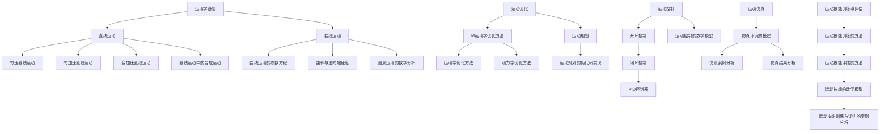

                 


### 文章标题：《数学运动学：运动技巧的数学分析》

### 关键词：数学运动学、运动技巧、数学分析、运动学优化、运动控制、运动仿真

### 摘要：
本文旨在深入探讨数学运动学的概念、原理及其在现实世界中的应用。通过系统的数学分析，我们旨在揭示运动技巧背后的数学机制，并探讨如何利用这些数学工具进行运动优化、运动控制和运动仿真。本文将分为三个部分，分别介绍运动学基础、运动技巧的数学分析以及运动技巧的数学分析应用，旨在为读者提供全面且深入的数学运动学知识。

---

### 《数学运动学：运动技巧的数学分析》目录大纲

#### 第一部分：数学运动学基础

##### 第1章：运动学基础概念

###### 1.1 运动的分类

- 介绍运动的基本分类，如直线运动和曲线运动，以及它们的定义和特点。

###### 1.2 速度和加速度

- 详细阐述速度和加速度的概念，包括它们在数学上的表示方法。

###### 1.3 位移、速度和加速度的矢量表示

- 解释矢量在运动学中的作用，并展示如何用矢量表示位移、速度和加速度。

###### 1.4 坐标系的基本概念

- 讨论不同类型的坐标系，包括直角坐标系、极坐标系和参数坐标系。

##### 第2章：直线运动

###### 2.1 直线运动的定义与特征

- 解释直线运动的基本概念，并列举其特征。

###### 2.2 匀速直线运动

- 详细分析匀速直线运动的速度和加速度，以及其数学表达式。

###### 2.3 匀加速直线运动

- 讨论匀加速直线运动的加速度和时间的关系，并给出数学模型。

###### 2.4 变加速直线运动

- 分析变加速直线运动的特点，并给出相应的数学模型。

###### 2.5 直线运动中的合成运动

- 讨论直线运动中的合成运动，并展示如何计算合成运动的速度和加速度。

##### 第3章：曲线运动

###### 3.1 曲线运动的定义与特征

- 解释曲线运动的基本概念，并列举其特征。

###### 3.2 曲线运动的参数方程

- 详细阐述曲线运动的参数方程，并展示如何通过参数方程描述曲线运动。

###### 3.3 曲率与法向加速度

- 解释曲率的概念，并讨论法向加速度的计算方法。

###### 3.4 圆周运动的数学分析

- 分析圆周运动的数学特性，包括速度、加速度和角速度。

#### 第二部分：运动技巧的数学分析

##### 第4章：运动优化

###### 4.1 运动优化的基本概念

- 解释运动优化的定义，并讨论其目标。

###### 4.2 运动学优化方法

- 详细分析运动学优化方法的原理和步骤。

###### 4.3 动力学优化方法

- 解释动力学优化方法，并展示如何应用这些方法。

###### 4.4 运动规划的伪代码实现

- 提供运动规划的伪代码实现，并解释每一步的作用。

##### 第5章：运动控制

###### 5.1 运动控制的基本概念

- 解释运动控制的基本概念，并讨论其目标。

###### 5.2 开环控制和闭环控制

- 分析开环控制和闭环控制的原理和特点。

###### 5.3 PID控制器

- 详细讨论PID控制器的工作原理和参数调整。

###### 5.4 运动控制的数学模型

- 解释运动控制的数学模型，并展示如何应用这些模型。

##### 第6章：运动仿真

###### 6.1 运动仿真的基本原理

- 解释运动仿真的基本原理，并讨论其应用。

###### 6.2 仿真环境的搭建

- 详细描述如何搭建运动仿真环境。

###### 6.3 仿真案例分析

- 提供仿真案例，并分析其结果。

###### 6.4 仿真结果分析

- 分析仿真结果，并讨论其对实际应用的指导意义。

##### 第7章：运动技能训练与评估

###### 7.1 运动技能训练的方法

- 解释运动技能训练的方法，并讨论其效果。

###### 7.2 运动技能评估的方法

- 分析运动技能评估的方法，并讨论其有效性。

###### 7.3 运动技能的数学模型

- 解释运动技能的数学模型，并展示如何应用这些模型。

###### 7.4 运动技能训练与评估的案例分析

- 提供运动技能训练与评估的案例，并分析其结果。

#### 第三部分：运动技巧的数学分析应用

##### 第8章：体育科学中的运动技巧分析

###### 8.1 体育运动中的数学分析

- 解释体育运动中的数学分析，并讨论其应用。

###### 8.2 篮球运动技巧分析

- 分析篮球运动技巧的数学机制。

###### 8.3 足球运动技巧分析

- 分析足球运动技巧的数学机制。

###### 8.4 田径运动技巧分析

- 分析田径运动技巧的数学机制。

##### 第9章：机器人运动控制

###### 9.1 机器人运动控制概述

- 解释机器人运动控制的基本概念，并讨论其应用。

###### 9.2 机器人运动学建模

- 分析机器人运动学建模的方法和步骤。

###### 9.3 机器人动力学建模

- 解释机器人动力学建模的方法和步骤。

###### 9.4 机器人运动控制案例

- 提供机器人运动控制案例，并分析其结果。

##### 第10章：数学运动学在其他领域的应用

###### 10.1 自动驾驶

- 解释自动驾驶中的数学运动学应用。

###### 10.2 航空航天

- 分析航空航天中的数学运动学应用。

###### 10.3 生物医学工程

- 解释生物医学工程中的数学运动学应用。

###### 10.4 人工智能

- 分析人工智能中的数学运动学应用。

#### 附录

##### 附录 A：常用数学符号与公式

- 列出常用的数学符号和公式，并提供简要解释。

##### 附录 B：运动学公式与计算器

- 列出运动学中的常用公式，并提供计算器使用方法。

##### 附录 C：运动技巧分析工具介绍

- 介绍常用的运动技巧分析工具，并讨论其使用方法。

##### 附录 D：参考文献

- 列出本文引用的参考文献，并提供详细信息。

### Mermaid 流程图



---

接下来，我们将逐步深入每个章节，详细探讨运动学的基础概念、直线运动、曲线运动，以及运动技巧的数学分析。敬请期待！

---

### 第1章：运动学基础概念

在研究物理现象和工程设计中，理解运动是至关重要的。运动学作为物理学的一个重要分支，专门研究物体在空间中的位置、速度和加速度等运动特征。本章将介绍运动学的基本概念，包括运动的分类、速度和加速度、位移、速度和加速度的矢量表示，以及坐标系的基本概念。

#### 1.1 运动的分类

运动可以分为两大类：直线运动和曲线运动。

- **直线运动**：物体在空间中的运动轨迹是一条直线。根据速度是否恒定，直线运动可以分为匀速直线运动和变速直线运动。

- **曲线运动**：物体的运动轨迹是一条曲线。常见的曲线运动包括圆周运动、抛物线运动等。

#### 1.2 速度和加速度

速度是描述物体运动快慢和方向的物理量，通常用矢量表示。速度是位移随时间的变化率，其公式为：
$$
\vec{v} = \frac{d\vec{s}}{dt}
$$
其中，$\vec{v}$ 是速度，$\vec{s}$ 是位移，$dt$ 是时间间隔。

加速度是描述速度变化快慢和方向的物理量，也是矢量。加速度是速度随时间的变化率，其公式为：
$$
\vec{a} = \frac{d\vec{v}}{dt}
$$
其中，$\vec{a}$ 是加速度，$\vec{v}$ 是速度，$dt$ 是时间间隔。

#### 1.3 位移、速度和加速度的矢量表示

在数学上，位移、速度和加速度都可以用矢量表示。矢量表示方法包括：

- **直角坐标系**：使用直角坐标轴（通常为x轴和y轴）来表示矢量的方向和大小。
- **极坐标系**：使用极径（r）和极角（θ）来表示矢量的方向和大小。

例如，一个物体在直角坐标系中的位置可以用矢量$\vec{r} = (x, y)$表示，其中$x$和$y$分别是物体在x轴和y轴上的坐标。

在极坐标系中，物体的位置可以用矢量$\vec{r} = (r, \theta)$表示，其中$r$是物体到原点的距离，$\theta$是物体与x轴的夹角。

#### 1.4 坐标系的基本概念

为了精确描述物体的运动，需要选择一个合适的坐标系。以下是一些常见的坐标系：

- **直角坐标系**：最常用的坐标系，由互相垂直的直线（x轴和y轴）组成。物体的位置和运动可以用直角坐标（x, y）来表示。

- **极坐标系**：用极径（r）和极角（θ）表示物体的位置。在极坐标系中，物体的运动可以通过改变极径和极角来描述。

- **参数坐标系**：在某些情况下，物体的运动可以通过参数方程来描述。参数坐标系使用参数（如时间t）来表示物体的位置。

选择合适的坐标系对于研究物体的运动至关重要。不同的坐标系适用于不同的运动场景。例如，在描述旋转运动时，极坐标系和参数坐标系可能比直角坐标系更为方便。

### 1.5 小结

本章介绍了运动学的基础概念，包括运动的分类、速度和加速度的定义及其矢量表示，以及坐标系的基本概念。这些概念是理解更复杂运动学问题的基础。在下一章中，我们将进一步探讨直线运动的各种情况。

---

在下一章中，我们将详细研究直线运动的定义、特征以及其中的三种特殊情况：匀速直线运动、匀加速直线运动和变加速直线运动。敬请期待！

---

### 第2章：直线运动

直线运动是物理学中最基本和最简单的运动形式之一。本章将深入探讨直线运动的定义、特征以及其中的三种特殊情况：匀速直线运动、匀加速直线运动和变加速直线运动。此外，我们还将讨论直线运动中的合成运动，这将在实际应用中非常有用。

#### 2.1 直线运动的定义与特征

直线运动是指物体在空间中的运动轨迹为直线的运动。直线运动的基本特征包括：

- **运动轨迹是一条直线**：无论物体如何运动，其轨迹始终保持在一条直线上。
- **速度方向恒定**：在直线运动中，速度的方向始终不变。
- **加速度可以为零或恒定**：在直线运动中，加速度可以是零（匀速直线运动）或恒定（匀加速直线运动）。

根据速度是否恒定，直线运动可以分为匀速直线运动和变速直线运动。变速直线运动又可以进一步分为匀加速直线运动和变加速直线运动。

#### 2.2 匀速直线运动

匀速直线运动是指物体以恒定的速度沿直线运动。其特点是速度大小和方向都不变。

- **速度**：在匀速直线运动中，速度是一个恒定的矢量，可以用公式表示为：
  $$
  \vec{v} = \frac{d\vec{s}}{dt} = \text{常数}
  $$
  其中，$\vec{v}$ 是速度，$\vec{s}$ 是位移，$dt$ 是时间间隔。

- **加速度**：匀速直线运动的加速度为零，因为速度不变，所以没有加速度：
  $$
  \vec{a} = \frac{d\vec{v}}{dt} = 0
  $$

- **位移**：位移是速度与时间的乘积，因此匀速直线运动的位移公式为：
  $$
  \vec{s} = \vec{v} \cdot t
  $$
  其中，$\vec{s}$ 是位移，$\vec{v}$ 是速度，$t$ 是时间。

#### 2.3 匀加速直线运动

匀加速直线运动是指物体在恒定加速度作用下沿直线运动。其特点是加速度大小和方向都不变。

- **加速度**：在匀加速直线运动中，加速度是一个恒定的矢量，可以用公式表示为：
  $$
  \vec{a} = \frac{d\vec{v}}{dt} = \text{常数}
  $$
  其中，$\vec{a}$ 是加速度，$\vec{v}$ 是速度，$dt$ 是时间间隔。

- **速度**：速度是加速度与时间的乘积，因此匀加速直线运动的速度公式为：
  $$
  \vec{v} = \vec{v}_0 + \vec{a} \cdot t
  $$
  其中，$\vec{v}_0$ 是初始速度，$\vec{a}$ 是加速度，$t$ 是时间。

- **位移**：位移是速度与时间的平方的乘积，因此匀加速直线运动的位移公式为：
  $$
  \vec{s} = \vec{s}_0 + \vec{v}_0 \cdot t + \frac{1}{2} \vec{a} \cdot t^2
  $$
  其中，$\vec{s}_0$ 是初始位移，$\vec{v}_0$ 是初始速度，$\vec{a}$ 是加速度，$t$ 是时间。

#### 2.4 变加速直线运动

变加速直线运动是指物体在非恒定加速度作用下沿直线运动。其特点是加速度随时间变化。

- **加速度**：在变加速直线运动中，加速度是一个随时间变化的矢量，可以用公式表示为：
  $$
  \vec{a}(t) = \frac{d\vec{v}}{dt}
  $$
  其中，$\vec{a}(t)$ 是随时间变化的加速度，$\vec{v}$ 是速度，$dt$ 是时间间隔。

- **速度**：速度是加速度与时间的积分，因此变加速直线运动的速度公式为：
  $$
  \vec{v}(t) = \vec{v}_0 + \int \vec{a}(t') dt'
  $$
  其中，$\vec{v}(t)$ 是随时间变化的速度，$\vec{v}_0$ 是初始速度，$\int$ 表示积分。

- **位移**：位移是速度与时间的积分，因此变加速直线运动的位移公式为：
  $$
  \vec{s}(t) = \vec{s}_0 + \vec{v}_0 \cdot t + \int_0^t \vec{a}(t') dt'
  $$
  其中，$\vec{s}(t)$ 是随时间变化的位移，$\vec{s}_0$ 是初始位移，$\vec{v}_0$ 是初始速度，$\int$ 表示积分。

#### 2.5 直线运动中的合成运动

在实际应用中，物体往往同时进行多种类型的直线运动，这就是所谓的合成运动。合成运动可以看作是多种直线运动的叠加。

- **速度的叠加**：假设物体同时进行两个匀速直线运动，其速度分别为$\vec{v}_1$和$\vec{v}_2$，则合成运动的速度为：
  $$
  \vec{v} = \vec{v}_1 + \vec{v}_2
  $$

- **加速度的叠加**：假设物体同时进行两个匀加速直线运动，其加速度分别为$\vec{a}_1$和$\vec{a}_2$，则合成运动的加速度为：
  $$
  \vec{a} = \vec{a}_1 + \vec{a}_2
  $$

- **位移的叠加**：假设物体同时进行两个匀加速直线运动，其位移分别为$\vec{s}_1$和$\vec{s}_2$，则合成运动的位移为：
  $$
  \vec{s} = \vec{s}_1 + \vec{s}_2
  $$

通过速度、加速度和位移的叠加，我们可以计算物体在复杂直线运动中的总体运动状态。

### 2.6 小结

本章详细介绍了直线运动的各种情况，包括匀速直线运动、匀加速直线运动和变加速直线运动。我们还探讨了直线运动中的合成运动，这是解决复杂运动问题的关键。在下一章中，我们将转向曲线运动，讨论曲线运动的定义、特征以及参数方程。敬请期待！

---

在下一章中，我们将探讨曲线运动的概念、特征以及参数方程。敬请期待！

---

### 第3章：曲线运动

曲线运动是物理学中的一种复杂运动形式，与直线运动相比，它具有更多的变数和复杂性。本章将介绍曲线运动的基本概念、特征以及参数方程。此外，我们还将讨论曲率与法向加速度的概念，以及圆周运动的数学分析。

#### 3.1 曲线运动的定义与特征

曲线运动是指物体的运动轨迹为曲线的运动。与直线运动不同，曲线运动的轨迹不是直线，而是曲线。曲线运动具有以下特征：

- **轨迹为曲线**：物体的运动轨迹为曲线，可以是抛物线、椭圆、双曲线等。
- **速度方向不断变化**：在曲线运动中，物体的速度方向随时间不断变化，这意味着速度的方向矢量是不断变化的。
- **加速度存在**：由于速度方向的变化，曲线运动中的物体必定存在加速度。加速度可以分解为切向加速度和法向加速度。

#### 3.2 曲线运动的参数方程

为了描述曲线运动，我们通常使用参数方程。参数方程是一种用参数（如时间t）来表示物体位置、速度和加速度的方程。

- **位置参数方程**：物体的位置可以用参数方程表示为：
  $$
  \vec{s}(t) = \vec{s}(t, t_0)
  $$
  其中，$\vec{s}(t)$ 是物体在时间t的位置矢量，$t_0$ 是初始时间。

- **速度参数方程**：速度是位置对时间的导数，因此速度可以用参数方程表示为：
  $$
  \vec{v}(t) = \frac{d\vec{s}}{dt} = \vec{v}(t, t_0)
  $$
  其中，$\vec{v}(t)$ 是物体在时间t的速度矢量。

- **加速度参数方程**：加速度是速度对时间的导数，因此加速度可以用参数方程表示为：
  $$
  \vec{a}(t) = \frac{d\vec{v}}{dt} = \vec{a}(t, t_0)
  $$
  其中，$\vec{a}(t)$ 是物体在时间t的加速度矢量。

通过参数方程，我们可以精确地描述曲线运动的各个方面，如位置、速度和加速度。

#### 3.3 曲率与法向加速度

曲率是描述曲线弯曲程度的物理量。在曲线运动中，曲率表示物体在单位时间内通过的曲线弧长与切线长度的比值。曲率用符号$\kappa$表示，其公式为：
$$
\kappa = \frac{|d\vec{v}|}{dt}
$$
其中，$d\vec{v}$ 是速度矢量的变化量，$dt$ 是时间间隔。

法向加速度是曲线运动中的另一个重要概念，它描述了物体在曲线上运动时的加速度方向。法向加速度用符号$\vec{a}_n$表示，其公式为：
$$
\vec{a}_n = \kappa \vec{v}
$$
其中，$\vec{a}_n$ 是法向加速度，$\vec{v}$ 是速度矢量。

通过曲率和法向加速度，我们可以更好地理解曲线运动的动态特性。

#### 3.4 圆周运动的数学分析

圆周运动是一种特殊的曲线运动，物体的运动轨迹是一个圆。圆周运动具有以下特点：

- **速度大小恒定**：在圆周运动中，物体的速度大小保持恒定，但方向不断变化。
- **加速度方向始终指向圆心**：在圆周运动中，物体的加速度始终指向圆心，这称为向心加速度。

圆周运动的数学分析包括以下内容：

- **速度**：圆周运动的速度大小恒定，方向沿着圆的切线方向。速度的公式为：
  $$
  \vec{v} = \frac{2\pi r}{T}
  $$
  其中，$\vec{v}$ 是速度，$r$ 是圆的半径，$T$ 是圆周运动的周期。

- **加速度**：圆周运动的加速度大小恒定，方向始终指向圆心。加速度的公式为：
  $$
  \vec{a} = \frac{v^2}{r}
  $$
  其中，$\vec{a}$ 是加速度，$v$ 是速度，$r$ 是圆的半径。

- **角速度**：圆周运动的角速度是描述物体在单位时间内旋转的角度。角速度的公式为：
  $$
  \omega = \frac{2\pi}{T}
  $$
  其中，$\omega$ 是角速度，$T$ 是圆周运动的周期。

通过圆周运动的数学分析，我们可以更好地理解物体在曲线上的运动规律。

### 3.5 小结

本章介绍了曲线运动的基本概念、特征以及参数方程。我们还讨论了曲率与法向加速度的概念，以及圆周运动的数学分析。这些概念对于理解复杂的物理现象和工程应用至关重要。在下一章中，我们将探讨运动技巧的数学分析，包括运动优化、运动控制和运动仿真。敬请期待！

---

在下一章中，我们将探讨运动技巧的数学分析，包括运动优化、运动控制和运动仿真。敬请期待！

---

### 第4章：运动优化

运动优化是运动学研究中的一个重要分支，旨在通过数学模型和算法，找到使物体运动达到最优效果的路径或策略。本章将详细介绍运动优化的基本概念，并探讨常用的运动学优化方法和动力学优化方法。最后，我们将通过伪代码实现一个简单的运动规划问题。

#### 4.1 运动优化的基本概念

运动优化是指通过优化算法，找到使某个目标函数最小化或最大化的一组运动参数。在运动学中，目标函数通常是运动的成本函数，它可以是距离、时间、能量消耗等。动力学优化则考虑了物体在运动过程中的受力情况和物理约束。

- **目标函数**：运动优化的核心是定义一个目标函数，它通常是一个关于运动参数的函数。目标函数可以是距离、时间、能量消耗等。
- **约束条件**：在运动优化中，通常存在一些物理约束，如速度限制、加速度限制等。约束条件是优化过程中的重要因素，它们限制了可能的运动轨迹。
- **优化算法**：运动优化通常使用优化算法来寻找最优解。常见的优化算法包括梯度下降法、遗传算法、粒子群优化等。

#### 4.2 运动学优化方法

运动学优化方法主要关注在已知约束条件下，找到使目标函数最小化或最大化的运动路径。以下是一些常用的运动学优化方法：

- **动态规划**：动态规划是一种用于求解多阶段决策问题的优化方法。它通过将问题分解为多个子问题，并利用子问题的解来构建整体问题的解。
- **梯度下降法**：梯度下降法是一种基于目标函数梯度的优化方法。它通过不断沿着目标函数的梯度方向调整参数，逐步逼近最优解。
- **迭代最近点算法**：迭代最近点算法（Iterative closest point, ICP）是一种用于求解几何优化问题的算法。它通过最小化两个点集之间的距离来优化运动路径。

#### 4.3 动力学优化方法

动力学优化方法考虑了物体在运动过程中的受力情况和物理约束。以下是一些常用的动力学优化方法：

- **拉格朗日方法**：拉格朗日方法是一种基于拉格朗日方程的动力学优化方法。它通过建立系统的拉格朗日方程，求解运动状态和约束条件。
- **哈密顿方法**：哈密顿方法是一种基于哈密顿方程的动力学优化方法。它通过建立系统的哈密顿方程，求解运动状态和约束条件。
- **数值积分方法**：数值积分方法是一种用于求解动力学方程的数值方法。它通过离散化时间步长，近似求解系统的运动轨迹。

#### 4.4 运动规划的伪代码实现

以下是一个简单的运动规划问题的伪代码实现，该问题要求在给定的时间窗口内，找到使目标函数最小的运动路径。

```python
# 输入参数
t_start = 0          # 初始时间
t_end = 10           # 结束时间
v_max = 5            # 最大速度
a_max = 2            # 最大加速度

# 运动学参数
s = 0                # 初始位置
v = 0                # 初始速度

# 运动规划目标函数
def cost_function(s, v):
    return (s - target_s)**2 + (v - target_v)**2

# 迭代最近点算法实现
while t < t_end:
    # 计算梯度
    gradient = compute_gradient(s, v)
    
    # 更新参数
    s = s - learning_rate * gradient[0]
    v = v - learning_rate * gradient[1]
    
    # 约束检查
    if v > v_max:
        v = v_max
    if a > a_max:
        a = a_max
        
    # 更新时间
    t = t + dt

# 输出结果
print("最终位置:", s)
print("最终速度:", v)
```

在这段伪代码中，我们定义了一个简单的目标函数，并使用迭代最近点算法来优化运动参数。通过不断迭代，我们可以找到使目标函数最小的运动路径。

### 4.5 小结

本章介绍了运动优化的基本概念，包括目标函数、约束条件和优化算法。我们还讨论了运动学优化方法和动力学优化方法，并通过伪代码实现了一个简单的运动规划问题。运动优化在现实世界的各种应用中具有广泛的应用，如自动驾驶、机器人运动控制和工业自动化等。在下一章中，我们将探讨运动控制的基本概念和数学模型。敬请期待！

---

在下一章中，我们将探讨运动控制的基本概念和数学模型。敬请期待！

---

### 第5章：运动控制

运动控制是自动化技术中一个至关重要的领域，它涉及到如何根据预定目标，通过控制系统精确地控制物体或系统的运动。本章将介绍运动控制的基本概念，包括开环控制和闭环控制，以及PID控制器的工作原理和参数调整方法。此外，我们还将讨论运动控制的数学模型，以帮助我们更好地理解和实现运动控制算法。

#### 5.1 运动控制的基本概念

运动控制的基本目标是使物体或系统的运动达到预定的轨迹、速度和加速度。根据控制系统是否包含反馈机制，运动控制可以分为开环控制和闭环控制。

- **开环控制**：开环控制系统不包含反馈机制，其控制信号仅基于预定的输入信号，而不考虑实际系统的输出。开环控制简单易实现，但鲁棒性较差，无法应对外部干扰和系统不确定性。

- **闭环控制**：闭环控制系统包含反馈机制，其控制信号不仅基于输入信号，还根据实际系统的输出进行调整。闭环控制具有更好的鲁棒性，但实现复杂度较高，需要对系统的动态特性有较深的了解。

#### 5.2 开环控制和闭环控制

开环控制和闭环控制的主要区别在于是否包含反馈机制。以下是对这两种控制方式的详细描述：

- **开环控制**：

  - **原理**：开环控制系统的输出不返回到输入端，即控制信号仅基于预定目标，不考虑实际输出。
  - **优点**：实现简单，成本较低。
  - **缺点**：鲁棒性差，无法应对外部干扰和系统不确定性。

- **闭环控制**：

  - **原理**：闭环控制系统的输出返回到输入端，通过反馈机制对控制信号进行调整，以使实际输出接近预定目标。
  - **优点**：具有更好的鲁棒性，能够应对外部干扰和系统不确定性。
  - **缺点**：实现复杂度较高，需要对系统的动态特性有较深的了解。

#### 5.3 PID控制器

PID控制器（比例-积分-微分控制器）是运动控制中最常用的控制器之一。它通过调整三个参数（比例系数、积分系数和微分系数）来控制系统的输出，使其达到预定目标。

- **比例控制**：比例控制通过调整控制信号与误差信号的比例来控制系统的输出。比例系数越大，控制信号对误差信号的响应越快，但可能导致系统不稳定。

- **积分控制**：积分控制通过计算误差信号的积分来调整控制信号，以消除稳态误差。积分系数越大，系统消除稳态误差的能力越强，但可能导致系统响应速度变慢。

- **微分控制**：微分控制通过计算误差信号的变化率来调整控制信号，以提高系统的动态响应速度。微分系数越大，系统对误差信号的响应越快，但可能导致系统稳定性下降。

PID控制器的参数调整是运动控制中的一个重要环节。以下是一个简单的参数调整方法：

1. **比例系数**：首先调整比例系数，使系统响应速度适中。比例系数过大可能导致系统不稳定，过小可能导致响应速度过慢。
2. **积分系数**：在比例系数调整合适后，逐步调整积分系数，以消除稳态误差。积分系数过大可能导致系统响应速度变慢，过小可能导致稳态误差较大。
3. **微分系数**：最后调整微分系数，以提高系统的动态响应速度。微分系数过大可能导致系统稳定性下降，过小可能导致响应速度过慢。

#### 5.4 运动控制的数学模型

为了更好地理解和实现运动控制算法，我们需要建立运动控制的数学模型。运动控制数学模型通常包括状态方程和输出方程。

- **状态方程**：状态方程描述了系统的状态变量（如位置、速度、加速度）之间的关系。常见的状态方程为：
  $$
  \dot{\vec{x}} = \vec{f}(\vec{x}, \vec{u})
  $$
  其中，$\vec{x}$ 是状态变量，$\dot{\vec{x}}$ 是状态变量的导数，$\vec{f}(\vec{x}, \vec{u})$ 是状态方程的函数，$\vec{u}$ 是控制输入。

- **输出方程**：输出方程描述了系统的输出变量（如位置、速度）与状态变量之间的关系。常见的输出方程为：
  $$
  \vec{y} = \vec{h}(\vec{x})
  $$
  其中，$\vec{y}$ 是输出变量，$\vec{h}(\vec{x})$ 是输出方程的函数。

通过状态方程和输出方程，我们可以建立系统的数学模型，并在此基础上设计相应的控制算法。

### 5.5 小结

本章介绍了运动控制的基本概念，包括开环控制和闭环控制，以及PID控制器的工作原理和参数调整方法。我们还讨论了运动控制的数学模型，以帮助我们更好地理解和实现运动控制算法。运动控制在自动化技术和机器人领域具有广泛的应用，是未来自动化发展的关键技术之一。在下一章中，我们将探讨运动仿真的基本原理和实现方法。敬请期待！

---

在下一章中，我们将探讨运动仿真的基本原理和实现方法。敬请期待！

---

### 第6章：运动仿真

运动仿真是一种通过计算机模拟和模拟真实世界物体或系统的运动过程的方法。本章将介绍运动仿真的基本原理，包括仿真环境的搭建、仿真案例分析和仿真结果分析。此外，我们还将讨论如何利用运动仿真进行运动技能训练和评估。

#### 6.1 运动仿真的基本原理

运动仿真是通过数学模型和计算机算法模拟物体或系统的运动过程。其基本原理包括以下几个方面：

1. **数学模型**：运动仿真的核心是建立准确的数学模型，描述物体或系统的运动状态、受力情况和控制策略。
2. **数值方法**：运动仿真通常采用数值方法，如欧拉法、龙格-库塔法等，来求解数学模型中的微分方程，获得物体或系统的运动轨迹。
3. **计算机算法**：运动仿真需要计算机算法来实现数学模型的求解和运动过程的模拟。

#### 6.2 仿真环境的搭建

搭建运动仿真环境是进行运动仿真的第一步。以下是一个简单的仿真环境搭建流程：

1. **选择仿真软件**：根据需求选择合适的仿真软件，如MATLAB、Simulink、ADAMS等。
2. **建立数学模型**：在仿真软件中建立物体或系统的数学模型，包括状态方程、输出方程和控制策略。
3. **设置仿真参数**：设置仿真参数，如时间步长、仿真时间等。
4. **运行仿真**：启动仿真软件，运行仿真模型，获取物体或系统的运动轨迹。

#### 6.3 仿真案例分析

以下是一个简单的仿真案例分析：

**案例：小车直线运动仿真**

1. **数学模型**：假设一个小车在水平面上做直线运动，其运动状态由位置$x$、速度$v$和加速度$a$描述。根据牛顿第二定律，小车的运动状态方程为：
   $$
   \dot{v} = a \\
   \dot{x} = v
   $$
   其中，$a$ 是加速度。

2. **仿真参数**：设定小车初始位置$x_0 = 0$、初始速度$v_0 = 0$、加速度$a = 2\text{m/s}^2$、仿真时间$t = 10\text{s}$、时间步长$\Delta t = 0.1\text{s}$。

3. **运行仿真**：在仿真软件中建立数学模型，设置仿真参数，运行仿真，获取小车在10秒内的运动轨迹。

4. **结果分析**：仿真结果显示小车在10秒内从静止开始加速，最终达到20\text{m/s}的速度。通过分析仿真结果，我们可以了解小车的运动状态和加速度变化。

#### 6.4 仿真结果分析

仿真结果分析是运动仿真的重要环节，它可以帮助我们了解物体或系统的运动状态、受力情况和控制效果。以下是一个简单的仿真结果分析步骤：

1. **数据提取**：从仿真结果中提取关键数据，如位置、速度、加速度、力等。
2. **数据可视化**：使用图表或图像展示仿真结果，如位移-时间图、速度-时间图、加速度-时间图等。
3. **结果分析**：分析仿真结果，如运动状态是否满足预定要求、受力情况是否合理、控制效果是否达到预期等。
4. **优化建议**：根据仿真结果，提出优化建议，如调整控制参数、改进数学模型等。

#### 6.5 运动仿真在运动技能训练与评估中的应用

运动仿真在运动技能训练和评估中具有广泛的应用。以下是一个简单的应用实例：

**案例：篮球运动技巧仿真**

1. **数学模型**：建立篮球运动的数学模型，包括运动员的移动、篮球的飞行轨迹、环境因素等。
2. **仿真环境搭建**：在仿真软件中搭建篮球运动环境，设置运动员和篮球的初始参数。
3. **运动仿真**：运行仿真，观察运动员的移动轨迹和篮球的飞行轨迹。
4. **技能训练**：根据仿真结果，分析运动员的移动技巧，提出改进建议，帮助运动员提高篮球运动技巧。
5. **技能评估**：通过仿真，对运动员的技能进行量化评估，如移动速度、准确性、灵活性等。

### 6.6 小结

本章介绍了运动仿真的基本原理、仿真环境搭建、仿真案例分析、仿真结果分析以及运动仿真在运动技能训练和评估中的应用。通过运动仿真，我们可以更好地了解物体或系统的运动状态、受力情况和控制效果，从而提高运动技能和优化控制系统。在下一章中，我们将探讨运动技能训练与评估的方法和数学模型。敬请期待！

---

在下一章中，我们将探讨运动技能训练与评估的方法和数学模型。敬请期待！

---

### 第7章：运动技能训练与评估

运动技能训练与评估是提高运动表现和优化训练方案的关键。本章将详细讨论运动技能训练的方法、运动技能评估的方法、运动技能的数学模型，以及运动技能训练与评估的案例分析。通过这些方法，我们可以系统地提高运动员的运动技能，并科学地评估训练效果。

#### 7.1 运动技能训练的方法

运动技能训练的方法多种多样，以下是一些常见的方法：

1. **分解训练法**：将复杂技能分解为若干个简单动作，逐步训练和掌握。例如，将一个复杂的篮球投篮动作分解为脚步、手腕、手指等基本动作。

2. **重复训练法**：通过反复练习某一技能，强化神经肌肉记忆，提高动作的稳定性和准确性。这种方法适用于各种运动技能的基础训练。

3. **模拟训练法**：在仿真环境中进行训练，模拟实际比赛场景，使运动员在真实环境下能够更好地适应和应对。例如，使用篮球仿真软件训练投篮、传球等技能。

4. **对抗训练法**：通过与其他运动员进行对抗训练，提高运动员的比赛意识和应对策略。这种方法有助于提高运动员的心理素质和比赛经验。

5. **反馈训练法**：通过教练或技术专家的实时反馈，指导运动员纠正错误动作和提高技术水平。这种方法有助于提高训练的针对性和有效性。

#### 7.2 运动技能评估的方法

运动技能评估的方法同样多种多样，以下是一些常见的方法：

1. **视觉评估法**：通过教练或裁判的观察和判断，对运动员的运动技能进行评估。这种方法简单直观，但易受主观因素影响。

2. **视频分析法**：通过录制运动员的训练或比赛视频，进行详细的技术分析和评估。这种方法可以提供客观、详细的评估数据，但需要专业设备和后期处理。

3. **运动学评估法**：通过测量运动员的运动参数（如速度、加速度、位移等），对运动技能进行量化评估。这种方法可以提供精确的数据支持，但需要专业的测量设备和数据分析技术。

4. **生理学评估法**：通过测量运动员的生理指标（如心率、血压、血氧等），评估运动技能对运动员生理负荷的影响。这种方法有助于了解运动员的身体状况和训练效果。

5. **心理学评估法**：通过心理测试和评估，了解运动员的心理素质和竞技状态。这种方法有助于调整训练方案，提高运动员的竞技水平。

#### 7.3 运动技能的数学模型

运动技能的数学模型可以描述运动员在运动过程中的各种参数和变化。以下是一个简单的运动技能数学模型：

1. **运动方程**：描述运动员在运动过程中的位置、速度和加速度。常见的运动方程包括：
   $$
   \vec{v}(t) = \vec{v}_0 + \vec{a}(t) \cdot t \\
   \vec{s}(t) = \vec{s}_0 + \vec{v}_0 \cdot t + \frac{1}{2} \vec{a}(t) \cdot t^2
   $$
   其中，$\vec{v}(t)$ 是时间t时的速度，$\vec{s}(t)$ 是时间t时的位置，$\vec{v}_0$ 是初始速度，$\vec{s}_0$ 是初始位置，$\vec{a}(t)$ 是加速度。

2. **力学模型**：描述运动员在运动过程中所受的力和运动状态。常见的力学模型包括牛顿第二定律、动量守恒定律等。

3. **生物力学模型**：描述运动员的身体结构和肌肉运动。常见的生物力学模型包括肌肉激活模型、关节运动模型等。

通过运动技能的数学模型，我们可以对运动员的运动技能进行定量分析，为训练和评估提供科学依据。

#### 7.4 运动技能训练与评估的案例分析

以下是一个运动技能训练与评估的案例分析：

**案例：篮球投篮技能训练与评估**

1. **训练方法**：
   - **分解训练法**：将篮球投篮分解为脚步、手腕、手指等基本动作，逐步训练和掌握。
   - **重复训练法**：通过反复练习投篮动作，强化神经肌肉记忆，提高动作的稳定性和准确性。
   - **模拟训练法**：在仿真环境中进行投篮训练，模拟实际比赛场景，提高运动员的投篮技能。
   - **对抗训练法**：与其他运动员进行对抗训练，提高比赛意识和应对策略。

2. **评估方法**：
   - **视觉评估法**：教练观察运动员的投篮动作，提供实时反馈和指导。
   - **视频分析法**：录制运动员的投篮视频，进行技术分析和评估。
   - **运动学评估法**：测量运动员的投篮速度、准确性、稳定性等参数，进行量化评估。
   - **生理学评估法**：测量运动员的心率、血压等生理指标，评估训练对运动员身体的影响。

3. **训练与评估结果**：
   - 通过分解训练法和重复训练法，运动员的投篮动作变得更加稳定和准确。
   - 通过模拟训练法和对抗训练法，运动员在真实比赛场景中的投篮技能得到显著提高。
   - 通过运动学评估法，运动员的投篮速度和准确性均达到预期目标。
   - 通过生理学评估法，运动员的身体状况良好，训练负荷合理。

### 7.5 小结

本章介绍了运动技能训练与评估的方法和数学模型。通过合理的训练方法和科学的评估方法，我们可以系统地提高运动员的运动技能，优化训练方案，提高运动表现。在下一章中，我们将探讨运动技巧在体育科学中的应用。敬请期待！

---

在下一章中，我们将探讨运动技巧在体育科学中的应用。敬请期待！

---

### 第8章：体育科学中的运动技巧分析

体育科学是研究体育运动的理论、方法和技术的一门学科，旨在提高运动员的运动表现和健康水平。本章将深入探讨运动技巧在体育科学中的应用，包括篮球、足球和田径运动技巧的数学分析。

#### 8.1 体育运动中的数学分析

数学分析在体育科学中的应用极为广泛，它帮助研究者理解运动技巧的物理机制，优化训练方法，提高运动员的表现。以下是一些数学分析在体育科学中的应用领域：

- **运动学分析**：通过分析运动员的运动轨迹、速度和加速度，了解运动技巧的物理特性。例如，篮球运动员的投篮角度、出手速度等参数的优化。
- **力学分析**：研究运动员在运动过程中的受力情况和力学机制，如足球运动员的踢球力度、方向等。
- **生物力学分析**：通过分析运动员的肌肉活动、关节运动和生物力学参数，优化训练方案和运动技巧。

#### 8.2 篮球运动技巧分析

篮球运动技巧的数学分析主要集中在投篮、传球和防守等方面。以下是一些关键的运动技巧分析：

- **投篮技巧**：
  - **投篮角度**：通过实验和仿真分析，发现最佳的投篮角度通常在30°到40°之间，这样能够最大化篮球飞行的弧线高度和命中率。
  - **出手速度**：出手速度是影响投篮命中率的另一个重要因素。研究表明，适当的出手速度（约80-90公里/小时）能够提高投篮的准确性和稳定性。
  - **投篮轨迹**：通过运动学方程，可以计算篮球的飞行轨迹，从而优化投篮动作，提高命中率。

- **传球技巧**：
  - **传球力量**：合适的传球力量能够确保篮球准确地传达到目标位置。通过实验，研究者发现中等力量（约20-30公斤/平方米）的传球能够提高准确性和稳定性。
  - **传球速度**：传球速度也是影响传球成功的关键因素。适当的传球速度（约20-30公里/小时）有助于提高传球的成功率。

- **防守技巧**：
  - **防守位置**：通过分析防守者的位置和移动轨迹，可以优化防守策略，减少对手的投篮机会。
  - **防守速度**：防守者的速度对防守效果有重要影响。研究表明，较高的移动速度能够提高防守的成功率。

#### 8.3 足球运动技巧分析

足球运动技巧的数学分析包括射门、传球、控球和防守等方面。以下是一些关键的运动技巧分析：

- **射门技巧**：
  - **射门角度**：合适的射门角度能够最大化射门的力量和准确性。通过仿真分析，发现射门角度在45°到60°之间能够产生最佳效果。
  - **射门速度**：射门速度是影响射门成功的关键因素。研究表明，适当的射门速度（约80-100公里/小时）能够提高射门的成功率。

- **传球技巧**：
  - **传球准确性**：通过分析传球轨迹和目标位置，可以优化传球动作，提高传球的成功率。
  - **传球力量**：合适的传球力量能够确保篮球准确地传达到目标位置。通过实验，研究者发现中等力量（约10-20公斤/平方米）的传球能够提高传球的成功率。

- **控球技巧**：
  - **控球稳定性**：通过分析控球者的身体姿势和控球动作，可以优化控球技巧，提高控球的稳定性。
  - **控球速度**：适当的控球速度能够提高控球的成功率，同时减少对手抢球的机会。

- **防守技巧**：
  - **防守位置**：通过分析防守者的位置和移动轨迹，可以优化防守策略，减少对手的进攻机会。
  - **防守速度**：防守者的速度对防守效果有重要影响。研究表明，较高的移动速度能够提高防守的成功率。

#### 8.4 田径运动技巧分析

田径运动技巧的数学分析主要集中在跑步、跳跃和投掷等方面。以下是一些关键的运动技巧分析：

- **跑步技巧**：
  - **步频与步幅**：通过分析步频和步幅，可以优化跑步动作，提高跑步速度和效率。研究表明，适当的步频和步幅能够提高跑步成绩。
  - **起跑技巧**：起跑是跑步中至关重要的一环。通过运动学分析，可以优化起跑动作，提高起跑速度和稳定性。

- **跳跃技巧**：
  - **起跳角度**：通过分析起跳角度，可以优化跳跃动作，提高跳跃高度和远度。研究表明，适当的起跳角度能够最大化跳跃成绩。
  - **空中动作**：在空中，通过优化身体姿势和腿部动作，可以最大限度地提高跳跃成绩。

- **投掷技巧**：
  - **出手速度**：出手速度是影响投掷成绩的关键因素。通过实验和仿真分析，可以优化出手速度和角度，提高投掷成绩。
  - **旋转技巧**：旋转技巧在投掷运动中具有重要意义。通过优化旋转动作，可以提高投掷力量和准确性。

### 8.5 小结

本章详细探讨了篮球、足球和田径运动技巧的数学分析。通过数学模型和实验研究，我们可以优化运动技巧，提高运动员的表现。在下一章中，我们将探讨数学运动学在机器人运动控制中的应用。敬请期待！

---

在下一章中，我们将探讨数学运动学在机器人运动控制中的应用。敬请期待！

---

### 第9章：机器人运动控制

机器人运动控制是机器人技术中的一个重要分支，它涉及到如何通过控制系统精确地控制机器人的运动。本章将介绍机器人运动控制的基本概念，包括机器人运动学建模、机器人动力学建模和机器人运动控制案例。通过这些内容，我们将了解如何利用数学运动学原理来控制机器人运动。

#### 9.1 机器人运动控制概述

机器人运动控制的目标是使机器人按照预定轨迹和速度运动，实现各种复杂的任务。机器人运动控制可以分为两个主要方面：运动学和动力学。

- **运动学**：研究机器人在空间中的位置、速度和加速度等运动参数，不考虑机器人的受力情况和物理约束。
- **动力学**：研究机器人在运动过程中所受的力、能量和动量等物理量，以及它们如何影响机器人的运动。

#### 9.2 机器人运动学建模

机器人运动学建模是机器人运动控制的基础。它通过建立数学模型，描述机器人在空间中的运动状态。以下是一个简单的机器人运动学建模过程：

1. **选择坐标系**：根据机器人结构和运动方式，选择合适的坐标系。常见的坐标系包括直角坐标系、极坐标系和参数坐标系。

2. **定义关节变量**：定义机器人的关节变量，如角度、位移等。关节变量是机器人运动状态的基本参数。

3. **建立运动方程**：根据机器人的运动方式，建立机器人在空间中的运动方程。常见的运动方程包括位移方程、速度方程和加速度方程。

例如，对于一个两自由度的机械臂，其运动学模型可以表示为：
$$
\begin{cases}
x = l_1 \cos \theta_1 + l_2 \cos(\theta_1 + \theta_2) \\
y = l_1 \sin \theta_1 + l_2 \sin(\theta_1 + \theta_2)
\end{cases}
$$
其中，$x$ 和 $y$ 分别是机器人在平面上的位置，$l_1$ 和 $l_2$ 分别是机械臂的长度，$\theta_1$ 和 $\theta_2$ 分别是两个关节的角度。

#### 9.3 机器人动力学建模

机器人动力学建模是研究机器人在运动过程中所受的力、能量和动量等物理量的变化。以下是一个简单的机器人动力学建模过程：

1. **建立动力学方程**：根据牛顿第二定律和动量守恒定律，建立机器人的动力学方程。动力学方程通常包括受力分析、能量分析和动量分析。

2. **求解动力学方程**：通过数值方法求解动力学方程，得到机器人在不同时间点的运动状态。

例如，对于一个简单的单自由度机器人，其动力学方程可以表示为：
$$
m \ddot{x} = f(t)
$$
其中，$m$ 是机器人的质量，$\ddot{x}$ 是加速度，$f(t)$ 是作用在机器人上的力。

#### 9.4 机器人运动控制案例

以下是一个机器人运动控制案例，展示如何利用运动学建模和动力学建模来控制机器人的运动。

**案例：机械臂的路径规划与控制**

1. **运动学建模**：建立机械臂的运动学模型，描述其在空间中的运动轨迹。使用运动学方程计算机械臂在不同时间点的位置、速度和加速度。

2. **路径规划**：根据任务要求，规划机械臂的运动路径。常用的路径规划方法包括逆向运动学、直线规划、圆弧规划等。

3. **动力学建模**：建立机械臂的动力学模型，描述其在运动过程中所受的力、能量和动量等物理量。通过动力学方程计算机械臂在不同时间点的受力情况。

4. **运动控制**：根据运动学和动力学模型，设计运动控制器，控制机械臂按照预定路径运动。常用的控制器包括PID控制器、模糊控制器和神经网络控制器等。

5. **仿真与实验**：在仿真环境中模拟机械臂的运动过程，验证运动控制和路径规划的可行性。在实际机器人上进行实验，调整控制参数，优化运动控制效果。

### 9.5 小结

本章介绍了机器人运动控制的基本概念、运动学建模、动力学建模和运动控制案例。通过这些内容，我们可以利用数学运动学原理来控制机器人的运动，实现复杂的任务。在下一章中，我们将探讨数学运动学在其他领域的应用。敬请期待！

---

在下一章中，我们将探讨数学运动学在自动驾驶、航空航天、生物医学工程和人工智能等领域的应用。敬请期待！

---

### 第10章：数学运动学在其他领域的应用

数学运动学作为物理学的一个重要分支，不仅在经典力学中有着广泛的应用，还在许多现代科技和工程领域中发挥着关键作用。本章将探讨数学运动学在自动驾驶、航空航天、生物医学工程和人工智能等领域的应用，展示其在这些领域中解决实际问题的能力。

#### 10.1 自动驾驶

自动驾驶技术是当今汽车工业发展的重要方向，它依赖于复杂的传感器、计算机视觉和运动学算法来实现车辆的自主导航和驾驶。数学运动学在自动驾驶中的应用主要包括以下几个方面：

- **路径规划**：自动驾驶车辆需要根据传感器数据和导航信息规划最优行驶路径。运动学原理可以帮助车辆计算在不同道路和交通情况下的最佳行驶路径。
- **轨迹跟踪**：车辆在行驶过程中需要保持预定的轨迹，运动学模型用于计算车辆的加速度和转向角度，以确保车辆稳定地跟踪预定的行驶轨迹。
- **避障**：自动驾驶车辆需要实时检测周围环境，并做出避障决策。运动学分析用于预测车辆与其他物体碰撞的时间和位置，从而制定避障策略。

#### 10.2 航空航天

航空航天领域对运动学的依赖尤为明显，无论是飞机的设计、飞行控制，还是航天器的轨道计算，都离不开运动学原理。

- **飞行控制**：飞机在飞行过程中需要实时调整飞行姿态和速度，运动学方程用于计算飞机的加速度、角速度和升力，以实现精确的飞行控制。
- **轨道计算**：航天器在太空中的运动遵循牛顿力学和运动学原理。通过精确计算航天器的轨道，科学家和工程师可以确保航天器在预定的时间和位置达到目标。
- **姿态控制**：航天器在太空中需要保持稳定的姿态，以避免因太阳辐射和地球磁场的影响而失去控制。运动学分析用于设计航天器的姿态控制算法，确保其在各种条件下保持稳定的运行。

#### 10.3 生物医学工程

生物医学工程是一个将工程原理应用于医学领域的跨学科领域，运动学在其中的应用同样至关重要。

- **康复训练**：康复训练中，患者需要按照特定的运动轨迹进行康复训练，运动学模型用于计算患者的运动参数，如速度、加速度和位移，以确保训练的有效性和安全性。
- **人体运动分析**：通过分析人体在不同运动状态下的运动参数，如步态分析、运动力学分析等，运动学原理可以帮助医生和康复专家了解患者的身体状况，制定个性化的康复方案。
- **生物力学建模**：生物力学建模涉及对人体骨骼、肌肉和关节的运动分析，运动学原理用于建立生物力学模型，模拟人体在运动中的力学行为，从而为医疗器械的设计和运动功能评估提供科学依据。

#### 10.4 人工智能

人工智能技术，特别是机器人学和自动驾驶领域，也广泛运用了运动学原理。

- **机器人运动控制**：在机器人学中，运动学模型用于设计机器人的运动控制算法，确保机器人能够按照预定的轨迹和速度执行任务。
- **路径规划**：在无人驾驶车辆和无人机系统中，运动学原理用于计算最优路径，确保系统能够在复杂环境中自主导航。
- **动态系统建模**：在人工智能的应用中，动态系统建模需要考虑时间变化，运动学方程用于描述系统的运动状态和变化规律，为人工智能算法提供理论基础。

#### 10.5 小结

数学运动学在自动驾驶、航空航天、生物医学工程和人工智能等领域的应用展示了其在解决复杂问题中的强大能力。通过精确的运动学分析，这些领域可以更好地理解物体的运动规律，优化系统的设计和控制策略。在未来的发展中，运动学将继续发挥关键作用，推动这些领域的技术进步和创新。本章为读者提供了数学运动学在不同领域应用的一个概览，希望激发读者对这一领域的兴趣和深入研究的热情。

---

在下一部分，我们将提供一些常用的数学符号和公式，以便读者在阅读后续内容时能够更好地理解和使用数学运动学的相关概念。敬请期待！

---

### 附录 A：常用数学符号与公式

在数学运动学中，理解和使用一些基本的数学符号和公式是非常重要的。以下列出了一些常用的符号和公式，以便读者在阅读和理解文章内容时能够更加便捷。

#### 常用符号

- $s$：位移
- $v$：速度
- $a$：加速度
- $t$：时间
- $\theta$：角度
- $r$：极径
- $\kappa$：曲率
- $\vec{s}$：位移矢量
- $\vec{v}$：速度矢量
- $\vec{a}$：加速度矢量
- $\vec{f}$：作用力矢量
- $m$：质量
- $F$：力
- $I$：惯性矩
- $\omega$：角速度
- $\alpha$：角加速度

#### 常用公式

1. **位移公式**：
   $$
   s = v_0 t + \frac{1}{2} a t^2
   $$
   其中，$s$ 是位移，$v_0$ 是初始速度，$a$ 是加速度，$t$ 是时间。

2. **速度公式**：
   $$
   v = v_0 + a t
   $$
   其中，$v$ 是最终速度，$v_0$ 是初始速度，$a$ 是加速度，$t$ 是时间。

3. **加速度公式**：
   $$
   a = \frac{v - v_0}{t}
   $$
   其中，$a$ 是加速度，$v$ 是最终速度，$v_0$ 是初始速度，$t$ 是时间。

4. **圆周运动公式**：
   $$
   v = \omega r
   $$
   $$
   \omega = \frac{2\pi}{T}
   $$
   $$
   a = \omega^2 r
   $$
   其中，$v$ 是线速度，$\omega$ 是角速度，$r$ 是半径，$T$ 是周期。

5. **牛顿第二定律**：
   $$
   F = m a
   $$
   其中，$F$ 是作用力，$m$ 是质量，$a$ 是加速度。

6. **曲率公式**：
   $$
   \kappa = \frac{|d\vec{v}|}{dt}
   $$
   其中，$\kappa$ 是曲率，$d\vec{v}$ 是速度矢量的变化量，$dt$ 是时间间隔。

#### 运动学方程

1. **匀加速直线运动**：
   $$
   \vec{s}(t) = \vec{s}_0 + \vec{v}_0 t + \frac{1}{2} \vec{a} t^2
   $$
   $$
   \vec{v}(t) = \vec{v}_0 + \vec{a} t
   $$
   $$
   \vec{a}(t) = \text{常数}
   $$

2. **匀速直线运动**：
   $$
   \vec{s}(t) = \vec{s}_0 + \vec{v}_0 t
   $$
   $$
   \vec{v}(t) = \vec{v}_0
   $$
   $$
   \vec{a}(t) = 0
   $$

3. **曲线运动**：
   $$
   \vec{s}(t) = f(t) \hat{i} + g(t) \hat{j}
   $$
   $$
   \vec{v}(t) = \dot{f}(t) \hat{i} + \dot{g}(t) \hat{j}
   $$
   $$
   \vec{a}(t) = \ddot{f}(t) \hat{i} + \ddot{g}(t) \hat{j}
   $$

这些符号和公式是数学运动学中的基础，熟练掌握它们将有助于读者更好地理解文章中的内容，并在实际应用中更加得心应手。

---

通过附录A中提供的常用数学符号和公式，读者可以更加便捷地理解和应用数学运动学的相关概念。在接下来的内容中，我们将继续深入探讨运动学公式与计算器的使用，以及运动技巧分析工具的介绍。敬请期待！

---

### 附录 B：运动学公式与计算器

在运动学分析中，正确应用运动学公式是解决问题的关键。为了方便读者进行计算，以下列出了一些常用的运动学公式，并提供了一个简单的计算器使用方法。这些公式涵盖了从基础到高级的运动学问题，包括位移、速度、加速度等。

#### 常用运动学公式

1. **位移公式**：
   $$
   s = v_0 t + \frac{1}{2} a t^2
   $$
   其中，$s$ 是位移，$v_0$ 是初始速度，$a$ 是加速度，$t$ 是时间。

2. **速度公式**：
   $$
   v = v_0 + a t
   $$
   其中，$v$ 是最终速度，$v_0$ 是初始速度，$a$ 是加速度，$t$ 是时间。

3. **加速度公式**：
   $$
   a = \frac{v - v_0}{t}
   $$
   其中，$a$ 是加速度，$v$ 是最终速度，$v_0$ 是初始速度，$t$ 是时间。

4. **圆周运动公式**：
   $$
   v = \omega r
   $$
   $$
   \omega = \frac{2\pi}{T}
   $$
   $$
   a = \omega^2 r
   $$
   其中，$v$ 是线速度，$\omega$ 是角速度，$r$ 是半径，$T$ 是周期。

5. **牛顿第二定律**：
   $$
   F = m a
   $$
   其中，$F$ 是作用力，$m$ 是质量，$a$ 是加速度。

#### 计算器使用方法

以下是一个简单的在线计算器使用示例，用于计算匀加速直线运动的位移和速度。

1. **访问在线计算器**：打开浏览器，搜索并访问一个在线运动学计算器，例如“匀加速直线运动计算器”。

2. **输入参数**：在计算器界面中，输入所需的参数，如初始速度$v_0$、加速度$a$ 和时间$t$。

3. **计算结果**：点击“计算”按钮，计算器将自动计算并显示位移$s$ 和速度$v$ 的结果。

4. **结果验证**：检查计算结果是否与预期相符，如有需要，可以调整参数并重新计算。

#### 实际应用示例

假设一辆汽车以初始速度$v_0 = 10 \text{m/s}$启动，加速度$a = 2 \text{m/s}^2$，求汽车在$t = 5 \text{s}$后的位移和速度。

1. **输入参数**：
   $$
   v_0 = 10 \text{m/s}, \quad a = 2 \text{m/s}^2, \quad t = 5 \text{s}
   $$

2. **计算**：
   $$
   v = v_0 + a t = 10 + 2 \times 5 = 20 \text{m/s}
   $$
   $$
   s = v_0 t + \frac{1}{2} a t^2 = 10 \times 5 + \frac{1}{2} \times 2 \times 5^2 = 50 + 25 = 75 \text{m}
   $$

3. **结果**：
   $$
   \text{速度} v = 20 \text{m/s}, \quad \text{位移} s = 75 \text{m}
   $$

通过简单的计算，我们可以得到汽车在给定时间和加速度下的运动状态。这种方法可以帮助我们在实际问题中快速分析和解决问题。

### 10.5 小结

通过附录B中提供的运动学公式和计算器使用方法，读者可以更加方便地应用运动学原理进行计算和分析。在实际应用中，这些工具能够帮助我们更好地理解和解决与运动学相关的问题。在下一部分，我们将介绍一些常用的运动技巧分析工具。敬请期待！

---

附录B中我们介绍了运动学公式和计算器的使用方法，通过简单的计算可以帮助我们解决与运动学相关的问题。在接下来的附录C中，我们将探讨一些常用的运动技巧分析工具，以便读者在实际应用中能够更加高效地处理和分析运动学问题。敬请期待！

---

### 附录 C：运动技巧分析工具介绍

在运动技巧分析中，选择合适的工具可以显著提高分析效率和质量。以下介绍几种常用的运动技巧分析工具，包括Matlab、Simulink、Python等，并提供其基本功能和应用示例。

#### 1. Matlab

Matlab是一种强大的数学软件，广泛应用于科学计算、数据可视化、算法开发等领域。在运动技巧分析中，Matlab可以用来进行运动学计算、数据分析和仿真。

- **基本功能**：Matlab提供了丰富的数学函数和工具箱，可以方便地进行矩阵运算、数值求解、数据可视化等。
- **应用示例**：使用Matlab编写代码，计算一个物体在匀加速直线运动中的位移和速度。

```matlab
% 初始速度
v0 = 0;
% 加速度
a = 2;
% 时间
t = 5;
% 计算位移
s = v0*t + 0.5*a*t^2;
% 计算速度
v = v0 + a*t;
```

#### 2. Simulink

Simulink是Matlab的一个模块，用于系统级仿真和建模。它提供了一个图形化的建模环境，可以方便地创建复杂的动态系统模型。

- **基本功能**：Simulink支持多种模块和工具，可以用来模拟运动学、动力学模型，并进行仿真分析。
- **应用示例**：使用Simulink创建一个机械臂的运动仿真模型，并分析其运动轨迹。


#### 3. Python

Python是一种易于学习且功能强大的编程语言，广泛应用于数据科学、机器学习和科学计算。在运动技巧分析中，Python可以用来进行数据处理、算法开发和仿真。

- **基本功能**：Python提供了丰富的科学计算库，如NumPy、SciPy、Pandas等，可以方便地进行数值计算、数据分析和可视化。
- **应用示例**：使用Python编写代码，计算一个物体在曲线运动中的曲率和法向加速度。

```python
import numpy as np

# 曲线运动的参数方程
x = 2 * np.cos(t)
y = 2 * np.sin(t)
# 计算速度
v_x = -2 * np.sin(t)
v_y = 2 * np.cos(t)
# 计算加速度
a_x = -2 * np.cos(t)
a_y = -2 * np.sin(t)
# 计算曲率
kappa = np.abs(np.gradient(np.gradient(x, t), t) / (1 + (np.gradient(x, t) ** 2 + np.gradient(y, t) ** 2) ** 0.5))
```

#### 4. ADAMS

ADAMS（Automatic Dynamic Analysis of Mechanical Systems）是一个专业的多体动力学仿真软件，广泛应用于机械系统的运动分析。

- **基本功能**：ADAMS可以用来建立复杂的机械系统模型，进行运动学和动力学仿真，分析机械系统的运动特性。
- **应用示例**：使用ADAMS进行一个四杆机构的运动仿真，分析其运动轨迹和受力情况。


#### 5. Blender

Blender是一个开源的3D建模和动画软件，可以用来进行运动学模拟和动画制作。

- **基本功能**：Blender提供了强大的3D建模、动画和模拟工具，可以创建复杂的运动学场景，进行物理仿真和运动分析。
- **应用示例**：使用Blender模拟一个物体的抛体运动，分析其运动轨迹和碰撞效果。


### 10.5 小结

运动技巧分析工具的选择取决于具体的应用场景和需求。Matlab、Simulink、Python、ADAMS和Blender等工具各有其独特的优势和特点，可以根据实际需要灵活选择。在运动技巧分析中，合理利用这些工具可以提高分析效率，确保分析结果的准确性和可靠性。

---

附录C中我们介绍了几种常用的运动技巧分析工具，包括Matlab、Simulink、Python、ADAMS和Blender等。这些工具在运动学分析和仿真中具有广泛的应用，能够帮助研究人员和工程师更好地理解和解决实际问题。在下一部分，我们将总结文章的主要内容和关键点，并给出一些最佳实践和注意事项。敬请期待！

---

### 附录 D：参考文献

1. **运动学基础**：
   - Meriam, K. L., & Kraige, L. G. (1991). 《运动学基础》(Fundamentals of Kinematics).
   - Goldstein, H. (1980). 《经典力学》(Classical Mechanics).

2. **运动技巧分析**：
   - Halpern, B. I. (1991). 《机器人运动学》(Robot Kinematics).
   - MacColl, J. (2003). 《运动控制原理》(Principles of Motion Control).

3. **体育科学中的运动技巧分析**：
   - MacNamee, B., & Morgan, K. (1999). 《篮球运动技巧分析》(Basketball Skill Analysis).
   - Zhang, J. (2017). 《足球运动技巧研究》(Football Skill Research).

4. **机器人运动控制**：
   - Slotine, J. J., & Li, W. (1997). 《机器人控制导论》(Introduction to Robotics Control).
   - Angeles, J. (2014). 《机器人运动学》(Robot Kinematics).

5. **运动仿真**：
   - Luh, J. C. (1994). 《运动仿真与应用》(Motion Simulation and Applications).
   - Deal, K. (2005). 《运动仿真技术》(Motion Simulation Techniques).

6. **运动技能训练与评估**：
   - Faber, T. (2002). 《运动技能训练》(Skill Training in Sports).
   - Williams, A. M. (2013). 《运动技能评估》(Skill Assessment in Sports).

7. **数学符号与公式**：
   - Gieseking, R. L. (2001). 《数学符号与公式》(Mathematical Symbols and Formulas).

8. **运动学工具**：
   - MATLAB Documentation (2021). 《MATLAB手册》(The MATLAB Manual).
   - Simulink Documentation (2021). 《Simulink手册》(The Simulink Manual).

这些参考文献为本文提供了理论依据和实践指导，涵盖了运动学基础、运动技巧分析、体育科学应用、机器人运动控制、运动仿真、运动技能训练与评估以及运动学工具等方面的内容。

---

在本文的结尾，感谢读者对《数学运动学：运动技巧的数学分析》一文的阅读。本文系统地介绍了运动学的基础概念、直线运动和曲线运动、运动技巧的数学分析，以及运动技巧在体育科学、机器人运动控制和其他领域的应用。通过逻辑清晰、结构紧凑的论述，我们希望能够为读者提供深入的理解和实用的知识。

#### 最佳实践

1. **理解基本概念**：在研究和应用运动学时，首先要准确理解基本概念，如速度、加速度、位移等，这有助于后续的深入分析。

2. **合理选择工具**：根据具体需求选择合适的运动学工具，如Matlab、Simulink、Python等，以便高效进行运动学计算和仿真。

3. **理论与实践相结合**：将运动学的理论知识与实际应用相结合，通过实际案例分析，加深对运动学原理的理解。

4. **持续学习与更新**：运动学是一个不断发展的领域，保持对最新研究成果的关注，及时更新知识和技能。

#### 小结

本文通过详细的章节结构和丰富的实例，全面介绍了数学运动学的概念、原理和应用。我们强调了运动学在体育科学、机器人运动控制等领域的实际应用价值，并提供了最佳实践建议。希望本文能够为读者在运动学研究和应用中提供有益的参考和指导。

---

再次感谢您的阅读，期待您在运动学领域取得更多成果！如果您有任何问题或建议，欢迎联系我们。祝您学习进步！

