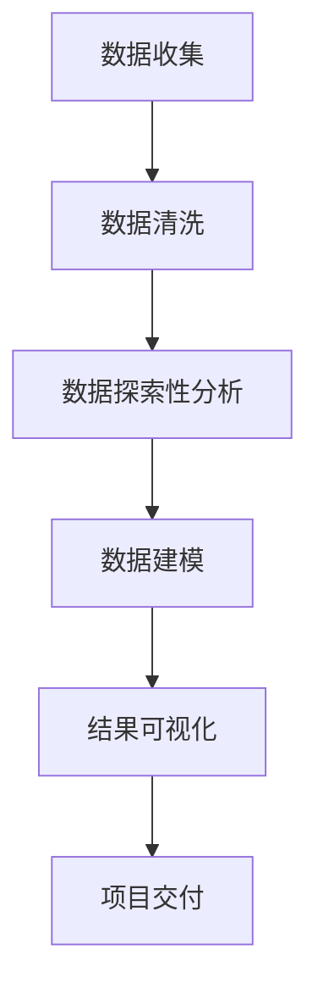

                 

### 文章标题

《数据分析创业：挖掘商业价值的新领域》

### 关键词

- 数据分析
- 商业价值
- 创业
- 数据驱动
- 客户分析
- 产品分析
- 营销分析
- 运营分析

### 摘要

随着大数据时代的到来，数据分析已经成为了企业决策过程中不可或缺的一环。本文旨在探讨数据分析在创业领域中的应用，通过详细阐述数据分析的基本概念、流程、工具与语言，以及客户分析、产品分析、营销分析和运营分析等实战案例，揭示数据分析在挖掘商业价值、驱动创业成功中的关键作用。文章还从团队建设、项目管理等方面探讨了如何高效利用数据分析推动创业企业的快速发展。通过本文，读者将了解到数据分析在创业中的实际应用，并获得一些实用的操作技巧和最佳实践。

### 第一部分：数据分析基础

#### 第1章：数据分析入门

##### 1.1 数据分析的概念与价值

**数据分析**，顾名思义，是指使用统计、数据处理和建模等方法对大量数据进行分析和解释，以便发现数据中的规律、趋势和模式，从而为决策提供支持。在现代商业环境中，数据分析已经成为一项关键技能，它能够帮助企业提高运营效率、优化决策流程、提升用户体验、降低成本和增加收入。

**数据分析的价值**主要表现在以下几个方面：

1. **提升决策质量**：通过对历史数据和实时数据的分析，企业可以更好地了解市场趋势、用户需求和行为模式，从而做出更加科学和准确的决策。
2. **优化业务流程**：数据分析可以帮助企业识别业务流程中的瓶颈和问题，提供改进方案，提高工作效率和资源利用率。
3. **降低成本**：通过数据驱动的方式优化库存管理、供应链和营销活动等，企业可以有效降低运营成本。
4. **增加收入**：通过深入分析客户行为和市场数据，企业可以制定更有效的营销策略，提高客户转化率和忠诚度，从而增加收入。
5. **提升用户体验**：通过对用户行为和反馈数据的分析，企业可以更好地了解用户需求，提供个性化服务和产品，提升用户体验。

##### 1.2 数据分析的基本流程

数据分析的基本流程通常包括以下几个步骤：

1. **数据收集**：收集相关数据，包括内部数据和外部数据，如业务数据、用户数据、市场数据等。
2. **数据清洗**：清洗和整理原始数据，包括去除重复记录、纠正错误数据、填补缺失值等，确保数据质量。
3. **数据探索性分析**：使用可视化工具和统计方法对数据进行初步分析，发现数据中的规律和模式，帮助确定进一步分析的焦点。
4. **数据建模**：建立数学模型或机器学习模型，对数据进行分析和预测，提取有价值的信息。
5. **数据可视化**：通过图表和可视化工具展示分析结果，帮助用户更好地理解和解释数据。

##### 1.3 数据分析常用工具与语言

在数据分析领域，有多种工具和编程语言可供选择，以下是其中一些常用的工具和语言：

- **Python**：Python 是一种广泛应用于数据分析和机器学习的编程语言，具有丰富的数据科学库，如 NumPy、Pandas、Scikit-learn、Matplotlib 等。
- **R**：R 是一种专门用于统计分析和图形表示的编程语言，拥有大量的统计和机器学习库，如 ggplot2、dplyr、caret 等。
- **SQL**：SQL（结构化查询语言）是一种用于数据库查询的编程语言，可以方便地对数据进行检索、更新和删除等操作。
- **Tableau**：Tableau 是一种强大的数据可视化工具，可以帮助用户轻松创建交互式图表和仪表板。
- **Power BI**：Power BI 是一种由微软开发的商业智能工具，提供了丰富的数据连接、可视化和分析功能。
- **Matplotlib** 和 **Seaborn**：Matplotlib 和 Seaborn 是 Python 中用于数据可视化的库，前者提供了广泛的绘图功能，后者则专注于统计图形的绘制。

##### 1.4 数据分析案例

以下是一个简单的数据分析案例，我们将使用 Python 和 Pandas 库对一组销售数据进行分析：

1. **数据收集**：假设我们有一组销售数据，包含商品名称、销售数量、销售价格和销售日期等信息。
2. **数据清洗**：去除重复记录、纠正错误数据、填补缺失值等。
3. **数据探索性分析**：使用 Pandas 库进行数据清洗和初步分析，如统计各商品的销售额、平均销售价格、销售量的分布情况等。
4. **数据建模**：建立简单的线性回归模型，预测某一商品在未来的销售量。
5. **数据可视化**：使用 Matplotlib 和 Seaborn 绘制图表，展示销售数据的分布、趋势和关系。

通过这个简单的案例，我们可以看到数据分析的基本流程和常用工具在实际应用中的具体操作。

#### 第2章：数据可视化

##### 2.1 数据可视化的原理

数据可视化是一种将数据转换为图形或图表的方法，使人们能够更直观地理解数据的结构和关系。数据可视化在数据分析中扮演着至关重要的角色，它不仅能够帮助人们快速识别数据中的模式和异常，还能够提高数据的可解释性和可访问性。

**数据可视化的重要性**：

1. **提升数据分析效果**：通过图表和图形展示数据，可以使分析结果更加直观和易于理解，从而提高数据分析的效果。
2. **辅助决策制定**：在商业决策过程中，可视化工具可以帮助管理者更好地理解数据，从而做出更明智的决策。
3. **增强数据透明度**：数据可视化使得数据分析过程更加透明，有助于团队协作和知识共享。
4. **提高数据可访问性**：可视化工具使得数据更加易于访问和共享，特别是对于非技术背景的用户。

**数据可视化的原则**：

1. **简洁性**：避免过多的元素和细节，使图表简洁明了，易于理解。
2. **准确性**：确保图表能够准确反映数据本身，避免误导性或虚假的视觉信息。
3. **一致性**：保持图表的视觉风格和设计原则的一致性，提高整个数据报告的专业性和美观度。
4. **交互性**：提供交互功能，如筛选、搜索、钻取等，使用户能够更加深入地探索数据。

##### 2.2 常见数据可视化工具

在数据分析领域，有许多常用的数据可视化工具，以下是其中一些主要工具的介绍：

- **Tableau**：Tableau 是一种功能强大的数据可视化工具，提供了丰富的图表类型和自定义选项，适合专业用户和企业级应用。
- **Power BI**：Power BI 是微软开发的商业智能工具，提供了强大的数据连接、数据建模和可视化功能，易于与企业级系统集成。
- **Matplotlib**：Matplotlib 是 Python 中用于数据可视化的库，提供了广泛的绘图功能，适合学术研究和工程应用。
- **Seaborn**：Seaborn 是基于 Matplotlib 的数据可视化库，专注于统计图形的绘制，提供了多种漂亮的图表模板。
- **D3.js**：D3.js 是一种用于创建交互式数据可视化的 JavaScript 库，适合开发复杂的交互式图表和仪表板。
- **Plotly**：Plotly 是一种提供多平台支持的数据可视化库，支持多种编程语言，适用于创建交互式图表和仪表板。

##### 2.3 数据可视化案例

以下是一个使用 Matplotlib 和 Seaborn 进行数据可视化的案例：

**案例背景**：我们有一组关于销售额的数据，包含不同商品的销售数量、销售价格和销售额。

**步骤**：

1. **数据准备**：将数据导入 Pandas DataFrame，进行初步清洗。
2. **绘制柱状图**：使用 Matplotlib 库绘制柱状图，展示各商品的销售额。
3. **绘制散点图**：使用 Seaborn 库绘制散点图，展示销售数量与销售额的关系。

**代码实现**：

```python
import pandas as pd
import matplotlib.pyplot as plt
import seaborn as sns

# 数据准备
data = pd.read_csv('sales_data.csv')
data.head()

# 绘制柱状图
data['sales_amount'].plot(kind='bar')
plt.title('Sales Amount by Product')
plt.xlabel('Product')
plt.ylabel('Sales Amount')
plt.show()

# 绘制散点图
sns.scatterplot(x='quantity', y='sales_amount', data=data)
plt.title('Quantity vs Sales Amount')
plt.xlabel('Quantity')
plt.ylabel('Sales Amount')
plt.show()
```

通过这个案例，我们可以看到如何使用 Matplotlib 和 Seaborn 完成一个基本的数据可视化流程。这些工具可以帮助我们快速创建图表，直观地展示数据，为数据分析提供重要的辅助。

### 第二部分：商业数据分析实战

#### 第3章：客户分析

##### 3.1 客户数据分析概述

**客户分析**是商业数据分析中的一项重要内容，它通过对客户数据的深入挖掘和分析，帮助企业更好地了解客户需求、优化客户服务、提升客户满意度和忠诚度。客户分析通常包括以下方面：

1. **客户分群**：根据客户特征和行为，将客户划分为不同的群体，以便于有针对性地制定营销策略和服务方案。
2. **客户生命周期价值分析**：评估每个客户的潜在价值，通过优化客户关系和提升客户体验，最大限度地延长客户生命周期。
3. **客户行为分析**：研究客户在购买和使用产品过程中的行为模式，包括购买频率、消费金额、购买渠道等，以便于优化营销策略和产品服务。
4. **客户留存与流失分析**：分析客户留存率和流失原因，制定相应的策略减少客户流失，提升客户满意度。

##### 3.2 客户行为分析

**客户行为分析**是客户分析的核心内容之一，它主要关注客户在购买和使用产品过程中的行为模式。以下是客户行为分析的一些关键方面：

1. **购买行为分析**：研究客户在购买过程中的行为，如购买频率、购买金额、购买渠道等。通过分析这些数据，企业可以了解客户的消费习惯和偏好，从而优化营销策略和产品服务。
   - **购买频率**：客户在一段时间内购买的次数，可以反映客户的活跃度。
   - **购买金额**：客户在每次购买中的消费金额，可以反映客户的购买力。
   - **购买渠道**：客户通过哪些渠道进行购买，如线上、线下、社交媒体等。

2. **消费偏好分析**：通过分析客户的购买历史和反馈数据，了解客户对不同产品、服务、品牌和价格的偏好，为企业提供产品优化和市场定位的依据。

3. **购买路径分析**：研究客户从首次接触产品到最终完成购买的全过程，包括浏览、比较、购买和售后等环节。通过分析购买路径，企业可以识别潜在的问题和优化点，提升客户购买体验。

**购买行为分析案例**：

假设我们有一组客户的购买数据，包含客户ID、购买日期、购买商品、购买数量和购买金额。以下是一个简单的购买行为分析案例：

1. **数据准备**：将数据导入 Pandas DataFrame，进行初步清洗。
2. **统计购买频率**：计算每个客户的购买次数。
3. **统计购买金额**：计算每个客户的总购买金额。
4. **分析购买渠道**：统计不同购买渠道的购买次数和金额。

```python
import pandas as pd

# 数据准备
data = pd.read_csv('purchase_data.csv')

# 统计购买频率
data['purchase_frequency'] = data.groupby('customer_id')['purchase_date'].nunique()

# 统计购买金额
data['total_purchase_amount'] = data.groupby('customer_id')['purchase_amount'].sum()

# 分析购买渠道
channel_summary = data.groupby('purchase_channel')['purchase_date'].nunique().sort_values(ascending=False)
print(channel_summary)

# 结果展示
data[['customer_id', 'purchase_frequency', 'total_purchase_amount']].head()
```

通过这个案例，我们可以看到如何使用 Pandas 对客户购买行为进行分析。这些数据可以帮助企业了解客户行为，优化营销策略和产品服务。

##### 3.3 客户留存与流失分析

**客户留存与流失分析**是客户分析中的另一个关键方面，它关注客户在使用产品或服务过程中的留存情况和流失原因。以下是一些常用的分析方法和策略：

1. **客户留存分析**：评估客户在一定时间内继续使用产品或服务的概率，通过分析留存率、留存时长等指标，了解客户对产品的满意度和忠诚度。
   - **留存率**：在一定时间内继续使用产品的客户比例，反映产品的客户黏性。
   - **留存时长**：客户从首次使用到流失的时间，反映产品的生命周期。

2. **流失原因分析**：研究客户流失的原因，如产品质量问题、服务质量问题、市场竞争等，为企业提供改进产品和服务、降低客户流失率的依据。

3. **流失预测**：通过分析历史流失数据，建立流失预测模型，提前识别潜在流失客户，采取相应措施减少流失。

**客户留存与流失分析案例**：

假设我们有一组客户留存和流失数据，包含客户ID、首次使用日期、最后使用日期和流失状态（0表示未流失，1表示流失）。以下是一个简单的客户留存与流失分析案例：

1. **数据准备**：将数据导入 Pandas DataFrame，进行初步清洗。
2. **统计留存率**：计算不同时间段的留存率。
3. **分析流失原因**：对流失客户进行分类，分析流失原因。
4. **流失预测**：使用逻辑回归模型进行流失预测。

```python
import pandas as pd
from sklearn.linear_model import LogisticRegression

# 数据准备
data = pd.read_csv('customer_data.csv')

# 数据预处理
data['days_to_last_use'] = (pd.to_datetime(data['last_use_date']) - pd.to_datetime(data['first_use_date'])).dt.days
data['is_lost'] = data['lost_status'].map({0: 'Not Lost', 1: 'Lost'})

# 统计留存率
data['first_use_date'].value_counts().reindex(range(1, 13)) * 100 / len(data)

# 分析流失原因
lost_reasons = data[data['is_lost'] == 'Lost']['lost_reason'].value_counts()
print(lost_reasons)

# 留存预测
X = data[['days_to_last_use']]
y = data['is_lost']
model = LogisticRegression()
model.fit(X, y)

# 预测流失
predictions = model.predict(X)
predictions

# 结果展示
data[['customer_id', 'first_use_date', 'last_use_date', 'is_lost', 'days_to_last_use']].head()
```

通过这个案例，我们可以看到如何使用 Pandas 和 Scikit-learn 对客户留存与流失进行分析和预测。这些分析结果可以帮助企业制定针对性的策略，提高客户留存率和满意度。

#### 第4章：产品分析

##### 4.1 产品数据分析概述

**产品分析**是商业数据分析中的重要环节，通过对产品数据的深入挖掘和分析，企业可以更好地了解产品的市场表现、用户需求、性能和竞争状况，从而优化产品设计和市场策略，提升产品竞争力。

**产品数据分析的主要方面**包括：

1. **产品市场分析**：研究产品的市场趋势、竞争对手和市场容量，帮助企业确定市场定位和目标。
2. **产品性能分析**：评估产品的功能、性能、易用性等指标，找出产品的优点和不足，为产品改进提供依据。
3. **用户反馈分析**：分析用户对产品的评价和反馈，了解用户的真实需求和期望，指导产品优化和改进。
4. **产品生命周期管理**：研究产品的生命周期，制定合适的产品推广、优化和淘汰策略。

##### 4.2 产品迭代与优化

**产品迭代与优化**是产品分析的核心内容之一，它涉及对产品功能的不断改进和优化，以满足用户需求和市场变化。以下是一些关键步骤和策略：

1. **需求分析**：收集和分析用户反馈、市场调研数据、竞争分析等，确定产品的改进方向和优先级。
2. **功能设计**：根据需求分析结果，设计新的功能或改进现有功能，确保功能设计的合理性和实用性。
3. **开发和测试**：进行功能开发和测试，确保新功能或改进功能的稳定性和性能。
4. **用户测试**：邀请一部分用户参与测试，收集用户反馈，进一步优化产品功能。
5. **上线和推广**：将改进后的产品推向市场，并通过广告、促销活动等方式进行推广。

**产品迭代与优化案例**：

假设我们正在分析一款在线教育平台，以下是一个简单的产品迭代与优化案例：

1. **需求分析**：通过用户反馈、市场调研和竞争分析，确定用户在在线教育平台上的主要需求和痛点。
2. **功能设计**：设计新的课程推荐功能和在线互动功能，以提升用户体验和满意度。
3. **开发和测试**：进行功能开发和测试，确保新功能或改进功能的稳定性和性能。
4. **用户测试**：邀请一部分用户参与测试，收集用户反馈，进一步优化产品功能。
5. **上线和推广**：将改进后的产品推向市场，并通过广告、促销活动等方式进行推广。

通过这个案例，我们可以看到如何通过需求分析、功能设计、开发和测试、用户测试和上线推广等步骤，实现产品的迭代与优化。这些步骤可以帮助企业不断改进产品，提升用户体验和市场竞争力。

##### 4.3 产品生命周期管理

**产品生命周期管理**是产品分析中的重要环节，它涉及对产品从诞生到淘汰的全过程进行管理和监控，以确保产品在生命周期内的持续竞争力和市场地位。以下是一些关键方面：

1. **产品定位**：在产品生命周期的不同阶段，根据市场变化和竞争状况，调整产品的市场定位和目标。
2. **产品推广**：在产品上市阶段，通过广告、促销、市场推广等手段提高产品的知名度和市场份额。
3. **产品优化**：在产品成长期和成熟期，通过不断改进功能、性能和用户体验，提升产品的竞争力。
4. **产品淘汰**：在产品衰退期，根据市场趋势和产品表现，决定是否继续维护或淘汰产品。

**产品生命周期管理案例**：

假设我们正在分析一款智能手机，以下是一个简单的产品生命周期管理案例：

1. **产品定位**：在产品上市阶段，确定智能手机的主要市场和目标用户群体，如年轻人、商务人士等。
2. **产品推广**：通过广告、线上线下活动、社交媒体推广等手段，提高智能手机的知名度和市场份额。
3. **产品优化**：在成长期和成熟期，不断更新硬件配置、优化操作系统、提升用户体验，以保持产品的市场竞争力。
4. **产品淘汰**：在产品衰退期，根据市场趋势和产品表现，决定是否停产或更新换代。

通过这个案例，我们可以看到如何通过产品定位、推广、优化和淘汰等步骤，实现对产品生命周期的管理和监控。这些步骤可以帮助企业更好地应对市场变化，提升产品的竞争力和市场份额。

#### 第5章：营销分析

##### 5.1 营销数据分析概述

**营销分析**是商业数据分析中的一项关键内容，它通过对营销活动的数据进行分析，帮助企业和营销团队了解营销活动的效果、优化营销策略、提高营销ROI。营销分析的主要目标包括：

1. **评估营销效果**：通过数据评估营销活动的效果，如广告投放、促销活动、品牌宣传等，了解哪些营销活动能够带来最大的收益。
2. **优化营销策略**：根据营销数据分析结果，调整和优化营销策略，提高营销活动的ROI。
3. **提高客户转化率**：通过分析客户行为和反馈数据，优化营销渠道、内容和形式，提高客户转化率和购买意愿。
4. **提升品牌知名度**：分析品牌宣传效果，了解品牌在目标市场中的认知度和影响力，制定合适的品牌推广策略。

**营销分析的关键指标**：

1. **营销ROI（Return on Investment）**：衡量营销投入与收益的比率，用于评估营销活动的整体效果。
2. **CPC（Cost Per Click）**：衡量每次点击的成本，用于评估广告投放效果。
3. **CPM（Cost Per Mille）**：衡量每千次展示的成本，用于评估广告曝光效果。
4. **CPCV（Cost Per Conversion）**：衡量每次转化的成本，用于评估营销活动的效果。
5. **转化率**：衡量营销活动带来的潜在客户转化为实际客户的比率，用于评估营销活动的有效性。

**营销数据分析的基本流程**：

1. **数据收集**：收集营销活动的相关数据，包括广告投放数据、用户行为数据、销售数据等。
2. **数据清洗**：清洗和整理原始数据，去除重复记录、纠正错误数据、填补缺失值等，确保数据质量。
3. **数据探索性分析**：使用统计和可视化工具对数据进行初步分析，发现数据中的规律和趋势，帮助确定进一步分析的焦点。
4. **建立模型**：建立统计模型或机器学习模型，对数据进行分析和预测，提取有价值的信息。
5. **结果可视化**：通过图表和可视化工具展示分析结果，帮助用户更好地理解和解释数据。

##### 5.2 社交媒体分析

**社交媒体分析**是营销分析中的重要内容之一，它通过对社交媒体平台上的用户行为和互动数据进行分析，帮助企业了解用户需求、优化社交媒体营销策略、提高社交媒体的ROI。以下是一些社交媒体分析的关键方面：

1. **社交媒体用户分析**：研究社交媒体平台上的用户特征、行为和偏好，了解用户的兴趣、需求和互动模式，为企业制定社交媒体营销策略提供依据。
2. **社交媒体营销效果评估**：通过分析社交媒体活动的数据，如粉丝增长、互动率、分享量等，评估社交媒体营销活动的效果，为优化营销策略提供数据支持。
3. **社交媒体广告投放**：通过分析广告投放数据，如点击率、转化率等，评估广告投放效果，优化广告内容和投放策略。
4. **社交媒体舆情监测**：监测社交媒体平台上的用户评论、话题和趋势，了解用户对品牌和产品的看法，及时发现和处理负面舆情。

**社交媒体分析工具**：

1. **Google Analytics**：Google Analytics 是一款功能强大的分析工具，可以跟踪和分析网站和社交媒体平台上的用户行为数据。
2. **Hootsuite**：Hootsuite 是一款社交媒体管理工具，可以监控和分析社交媒体平台上的用户互动数据。
3. **Sprout Social**：Sprout Social 是一款社交媒体分析和管理工具，提供了丰富的社交媒体分析功能。
4. **Klout**：Klout 是一款社交媒体影响力分析工具，可以评估用户在社交媒体平台上的影响力。
5. **Brandwatch**：Brandwatch 是一款社交媒体舆情监测工具，可以帮助企业监测和分析社交媒体平台上的用户评论和话题。

**社交媒体分析案例**：

假设我们正在分析一家企业在社交媒体上的营销活动，以下是一个简单的社交媒体分析案例：

1. **数据收集**：收集社交媒体平台上的用户互动数据，如点赞、评论、分享等。
2. **数据清洗**：清洗和整理原始数据，去除重复记录、纠正错误数据、填补缺失值等。
3. **数据探索性分析**：使用统计和可视化工具对数据进行初步分析，如计算用户互动量、分析互动时间分布等。
4. **建立模型**：使用机器学习模型分析用户互动数据，预测哪些类型的社交媒体活动能够带来更高的互动率。
5. **结果可视化**：通过图表和可视化工具展示分析结果，帮助用户更好地理解和解释数据。

```python
import pandas as pd
import matplotlib.pyplot as plt
import seaborn as sns

# 数据准备
data = pd.read_csv('social_media_data.csv')

# 数据清洗
data = data.drop_duplicates()
data = data.dropna()

# 数据探索性分析
sns.countplot(x='interaction_type', data=data)
plt.title('Interaction Type Distribution')
plt.xlabel('Interaction Type')
plt.ylabel('Count')
plt.show()

# 建立模型
from sklearn.ensemble import RandomForestClassifier
from sklearn.model_selection import train_test_split
from sklearn.metrics import accuracy_score

X = data[['follower_count', 'post_likes', 'post_comments']]
y = data['high_interaction']

X_train, X_test, y_train, y_test = train_test_split(X, y, test_size=0.3, random_state=42)

model = RandomForestClassifier(n_estimators=100)
model.fit(X_train, y_train)
predictions = model.predict(X_test)

print(f'Accuracy: {accuracy_score(y_test, predictions)}')

# 结果可视化
sns.heatmap(data.corr(), annot=True, cmap='coolwarm')
plt.title('Correlation Heatmap')
plt.show()
```

通过这个案例，我们可以看到如何使用 Python 和相关库对社交媒体分析数据进行处理和分析。这些工具可以帮助企业更好地了解用户互动模式，优化社交媒体营销策略。

##### 5.3 营销活动分析

**营销活动分析**是营销分析中的重要内容，它通过对营销活动的数据进行分析，帮助企业评估营销活动的效果，优化营销策略，提高营销ROI。以下是一些营销活动分析的关键方面：

1. **营销活动设计**：根据企业目标、市场环境和用户需求，设计合适的营销活动，如广告投放、促销活动、品牌推广等。
2. **营销活动效果评估**：通过数据评估营销活动的效果，如参与率、转化率、ROI等，了解哪些营销活动能够带来最大的收益。
3. **营销活动优化**：根据营销活动分析结果，优化营销活动的内容、形式和渠道，提高营销活动的ROI。
4. **营销活动跟踪与监控**：在营销活动进行过程中，实时跟踪和监控活动数据，及时调整和优化活动策略。

**营销活动分析工具**：

1. **Google Analytics**：Google Analytics 是一款功能强大的分析工具，可以跟踪和分析营销活动的数据，如点击率、转化率、用户行为等。
2. **HubSpot**：HubSpot 是一款集营销、销售和客户服务于一体的CRM工具，提供了丰富的营销活动分析功能。
3. **HubSpot Ads Manager**：HubSpot Ads Manager 是一款广告管理工具，可以帮助企业管理广告投放、评估广告效果、优化广告策略。
4. **Mailchimp**：Mailchimp 是一款电子邮件营销工具，提供了丰富的邮件营销分析功能，如打开率、点击率、转化率等。
5. **Unsplash**：Unsplash 是一款免费的图片库，可以用于设计营销活动的图片和视觉内容。

**营销活动分析案例**：

假设我们正在分析一次线上促销活动，以下是一个简单的营销活动分析案例：

1. **数据收集**：收集促销活动的相关数据，如参与人数、购买量、销售额等。
2. **数据清洗**：清洗和整理原始数据，去除重复记录、纠正错误数据、填补缺失值等，确保数据质量。
3. **数据探索性分析**：使用统计和可视化工具对数据进行初步分析，如计算参与率、转化率、ROI等。
4. **建立模型**：使用机器学习模型分析数据，预测促销活动可能带来的销售额和利润。
5. **结果可视化**：通过图表和可视化工具展示分析结果，帮助用户更好地理解和解释数据。

```python
import pandas as pd
import matplotlib.pyplot as plt
import seaborn as sns

# 数据准备
data = pd.read_csv('marketing_activity_data.csv')

# 数据清洗
data = data.drop_duplicates()
data = data.dropna()

# 数据探索性分析
sns.countplot(x='activity_type', data=data)
plt.title('Activity Type Distribution')
plt.xlabel('Activity Type')
plt.ylabel('Count')
plt.show()

# 建立模型
from sklearn.ensemble import RandomForestRegressor
from sklearn.model_selection import train_test_split
from sklearn.metrics import mean_absolute_error

X = data[['total_visits', 'total_signups', 'total_purchases']]
y = data['total_revenue']

X_train, X_test, y_train, y_test = train_test_split(X, y, test_size=0.3, random_state=42)

model = RandomForestRegressor(n_estimators=100)
model.fit(X_train, y_train)
predictions = model.predict(X_test)

print(f'MAE: {mean_absolute_error(y_test, predictions)}')

# 结果可视化
sns.heatmap(data.corr(), annot=True, cmap='coolwarm')
plt.title('Correlation Heatmap')
plt.show()
```

通过这个案例，我们可以看到如何使用 Python 和相关库对营销活动分析数据进行处理和分析。这些工具可以帮助企业更好地了解营销活动的效果，优化营销策略，提高营销ROI。

#### 第6章：运营分析

##### 6.1 运营数据分析概述

**运营分析**是商业数据分析中的重要内容，它通过对企业运营数据的分析，帮助企业优化运营流程、提升运营效率、降低运营成本、提高运营效益。运营分析的主要目标包括：

1. **提升运营效率**：通过分析运营数据，找出影响运营效率的关键因素，提出优化方案，提升整体运营效率。
2. **降低运营成本**：通过分析运营数据，识别运营中的浪费和瓶颈，采取有效的措施降低运营成本。
3. **提高运营效益**：通过分析运营数据，评估不同运营策略的效果，优化运营资源配置，提高运营效益。
4. **优化运营流程**：通过分析运营数据，找出运营流程中的问题和改进点，制定优化方案，提高运营流程的效率和灵活性。

**运营分析的关键指标**：

1. **用户活跃度**：衡量用户在平台上的活跃程度，如登录次数、浏览次数、互动次数等。
2. **用户留存率**：衡量用户在一定时间内继续使用产品的概率，反映产品的用户黏性和用户满意度。
3. **转化率**：衡量用户从某个操作（如点击、注册、购买）转化为目标用户的概率，反映营销和运营策略的有效性。
4. **运营ROI（Return on Investment）**：衡量运营投入与收益的比率，用于评估运营活动的整体效果。
5. **运营成本**：衡量运营活动的总成本，包括人力、物料、设备等费用。

**运营数据分析的基本流程**：

1. **数据收集**：收集运营数据，包括用户行为数据、业务数据、财务数据等。
2. **数据清洗**：清洗和整理原始数据，去除重复记录、纠正错误数据、填补缺失值等，确保数据质量。
3. **数据探索性分析**：使用统计和可视化工具对数据进行初步分析，发现数据中的规律和趋势，帮助确定进一步分析的焦点。
4. **建立模型**：建立统计模型或机器学习模型，对数据进行分析和预测，提取有价值的信息。
5. **结果可视化**：通过图表和可视化工具展示分析结果，帮助用户更好地理解和解释数据。

##### 6.2 数据驱动的运营策略

**数据驱动的运营策略**是指通过分析运营数据，制定和调整运营策略，以提高运营效率、降低运营成本、提升运营效益。以下是一些数据驱动的运营策略：

1. **用户分群与精细化运营**：通过对用户数据进行深入分析，将用户分为不同的群体，针对不同用户群体制定个性化的运营策略，提高用户满意度和留存率。
2. **运营活动效果评估**：通过对运营活动的数据进行详细分析，评估不同运营活动的效果，优化运营资源配置，提高运营ROI。
3. **自动化与智能化**：利用人工智能和自动化技术，优化运营流程，降低人力成本，提高运营效率。
4. **数据监测与预警**：建立数据监测系统，实时跟踪关键运营指标，及时发现潜在问题，采取预防措施，降低运营风险。
5. **数据驱动的产品优化**：通过分析用户行为数据和反馈数据，不断优化产品功能和用户体验，提高产品竞争力。

**数据驱动的运营策略案例**：

假设我们正在分析一家电商平台的运营数据，以下是一个简单的数据驱动的运营策略案例：

1. **数据收集**：收集电商平台的用户行为数据、交易数据、运营活动数据等。
2. **数据清洗**：清洗和整理原始数据，确保数据质量。
3. **数据探索性分析**：分析用户行为数据，了解用户在平台上的活跃程度和偏好，找出优化运营策略的关键点。
4. **建立模型**：建立预测模型，预测用户流失风险、购买概率等指标，为运营决策提供依据。
5. **结果可视化**：通过图表和可视化工具展示分析结果，帮助用户更好地理解和解释数据。

```python
import pandas as pd
import matplotlib.pyplot as plt
import seaborn as sns

# 数据准备
data = pd.read_csv('operation_data.csv')

# 数据清洗
data = data.drop_duplicates()
data = data.dropna()

# 数据探索性分析
sns.countplot(x='user_action', data=data)
plt.title('User Action Distribution')
plt.xlabel('User Action')
plt.ylabel('Count')
plt.show()

# 建立模型
from sklearn.ensemble import RandomForestClassifier
from sklearn.model_selection import train_test_split
from sklearn.metrics import accuracy_score

X = data[['user_age', 'user_gender', 'user_income']]
y = data['user_action']

X_train, X_test, y_train, y_test = train_test_split(X, y, test_size=0.3, random_state=42)

model = RandomForestClassifier(n_estimators=100)
model.fit(X_train, y_train)
predictions = model.predict(X_test)

print(f'Accuracy: {accuracy_score(y_test, predictions)}')

# 结果可视化
sns.heatmap(data.corr(), annot=True, cmap='coolwarm')
plt.title('Correlation Heatmap')
plt.show()
```

通过这个案例，我们可以看到如何使用 Python 和相关库对运营分析数据进行处理和分析。这些工具可以帮助企业更好地了解用户行为，优化运营策略，提高运营效益。

##### 6.3 运营效果评估

**运营效果评估**是运营分析中的关键环节，它通过对运营活动的数据进行分析，评估运营活动的效果，为后续的运营决策提供依据。以下是一些常用的运营效果评估方法和指标：

1. **KPI（关键绩效指标）**：KPI是衡量运营活动效果的关键指标，包括用户活跃度、用户留存率、转化率、ROI等。通过对KPI进行分析，可以评估运营活动的整体效果。
2. **运营ROI评估**：运营ROI是衡量运营活动投入与收益比率的指标，通过计算运营活动带来的收益与投入的比率，可以评估运营活动的经济效益。
3. **A/B测试**：A/B测试是一种比较不同运营策略效果的方法，通过对不同用户群体实施不同的运营策略，比较其效果，选择最优的运营策略。
4. **用户反馈与满意度调查**：通过收集用户反馈和满意度调查数据，可以了解用户对运营活动的评价，为运营策略的调整提供依据。
5. **运营成本评估**：通过对运营活动的成本进行详细分析，评估运营活动的成本效益，为优化运营资源配置提供依据。

**运营效果评估案例**：

假设我们正在评估一次线上促销活动的效果，以下是一个简单的运营效果评估案例：

1. **数据收集**：收集促销活动的参与人数、购买量、销售额、用户反馈等数据。
2. **数据清洗**：清洗和整理原始数据，确保数据质量。
3. **数据探索性分析**：计算促销活动的参与率、转化率、ROI等指标。
4. **结果可视化**：通过图表和可视化工具展示分析结果，帮助用户更好地理解和解释数据。

```python
import pandas as pd
import matplotlib.pyplot as plt
import seaborn as sns

# 数据准备
data = pd.read_csv('operation_activity_data.csv')

# 数据清洗
data = data.drop_duplicates()
data = data.dropna()

# 数据探索性分析
sns.countplot(x='activity_type', data=data)
plt.title('Activity Type Distribution')
plt.xlabel('Activity Type')
plt.ylabel('Count')
plt.show()

# 计算参与率和转化率
activity_stats = data.groupby('activity_type')['user_id'].agg(['count', 'nunique'])
activity_stats['participation_rate'] = activity_stats['count'] / activity_stats['nunique']
activity_stats['conversion_rate'] = activity_stats['nunique'] / activity_stats['count']

print(activity_stats)

# 结果可视化
sns.heatmap(data.corr(), annot=True, cmap='coolwarm')
plt.title('Correlation Heatmap')
plt.show()
```

通过这个案例，我们可以看到如何使用 Python 和相关库对运营活动效果进行分析和评估。这些工具可以帮助企业更好地了解运营活动的效果，优化运营策略，提高运营效益。

### 第三部分：数据分析在创业中的应用

#### 第7章：数据分析项目实战

##### 7.1 项目背景

在本章中，我们将通过一个实际的数据分析项目，深入探讨数据分析在创业中的应用。该项目涉及一家初创公司，该公司开发了一款面向B2B市场的数据分析工具。该公司希望在产品上线初期，通过数据分析了解客户需求，优化产品功能，提升用户满意度。

**项目目标**：

1. 了解用户在产品使用过程中的行为模式，发现产品功能的使用频率和用户满意度。
2. 分析用户反馈数据，识别产品优化方向和改进点。
3. 评估不同营销策略的效果，为后续营销活动提供数据支持。

##### 7.2 项目分析过程

**1. 数据收集**：

首先，我们从多个数据源收集用户行为数据，包括用户登录数据、使用日志、反馈数据和购买数据。数据来源包括：

- 用户登录数据：记录用户登录时间和登录频率。
- 使用日志：记录用户在使用数据分析工具时的操作行为，如数据导入、数据清洗、数据分析和数据导出等。
- 用户反馈数据：包括用户在产品使用过程中的问题反馈、建议和评分。
- 购买数据：记录用户购买产品的订单信息，如购买时间、购买金额、购买频次等。

**2. 数据清洗**：

接下来，我们对收集到的数据进行清洗，包括去除重复记录、纠正错误数据、填补缺失值等，确保数据质量。具体步骤如下：

- 去除重复记录：通过去重操作，确保每个用户的数据唯一性。
- 纠正错误数据：对存在错误的数据进行修正，如日期格式错误、数据缺失等。
- 填补缺失值：对缺失数据进行填补，如使用平均值、中位数或插值法等。

**3. 数据探索性分析**：

在数据清洗完成后，我们使用Python和Pandas库对数据进行探索性分析，包括计算统计指标、绘制图表等。以下是一些关键分析：

- 用户登录情况：统计用户的登录次数、登录时间分布、活跃用户比例等。
- 使用日志分析：统计用户对各个功能的使用频率、使用时长、使用顺序等。
- 用户反馈分析：分析用户反馈的问题类型、严重程度、出现频率等。
- 购买行为分析：统计用户的购买频次、购买金额、购买渠道等。

**4. 数据建模**：

根据探索性分析的结果，我们使用机器学习算法建立预测模型，以预测用户流失、购买意向等关键指标。以下是一些关键模型：

- 用户流失预测模型：使用逻辑回归算法预测用户流失风险，以制定针对性的用户维护策略。
- 用户购买意向预测模型：使用决策树或随机森林算法预测用户购买意向，以优化营销策略。

**5. 结果可视化**：

最后，我们将分析结果通过图表和可视化工具进行展示，以帮助团队成员更好地理解和解释数据。以下是一些关键图表：

- 用户登录情况图表：展示用户登录次数、登录时间分布等。
- 使用日志图表：展示用户对各个功能的使用频率、使用时长等。
- 用户反馈图表：展示用户反馈的问题类型、严重程度、出现频率等。
- 购买行为图表：展示用户购买频次、购买金额、购买渠道等。

##### 7.3 项目挑战与解决方案

**1. 数据质量挑战**：

在项目过程中，我们遇到了数据质量挑战，如数据缺失、数据错误和重复数据等。为了解决这些问题，我们采取了以下措施：

- 数据清洗：通过去重、纠正错误数据、填补缺失值等操作，提高数据质量。
- 数据验证：在数据处理过程中，进行数据验证，确保数据的准确性和一致性。

**2. 技术难题**：

在数据建模过程中，我们遇到了一些技术难题，如算法选择、模型参数调整等。为了解决这些问题，我们采取了以下措施：

- 算法选择：根据项目需求，选择合适的算法，如逻辑回归、决策树、随机森林等。
- 模型参数调整：通过交叉验证和网格搜索等方法，调整模型参数，提高模型性能。

##### 7.4 项目小结

通过这个数据分析项目，我们成功实现了项目目标，为初创公司提供了宝贵的数据支持。以下是一些项目小结：

1. **用户行为分析**：通过分析用户登录情况和使用日志，我们了解了用户对产品功能的偏好和使用习惯，为产品优化提供了依据。
2. **用户反馈分析**：通过分析用户反馈数据，我们识别了用户在产品使用过程中遇到的问题，为产品改进提供了方向。
3. **营销策略优化**：通过建立用户流失预测模型和用户购买意向预测模型，我们为初创公司提供了针对性的营销策略。

通过这个项目，我们充分展示了数据分析在创业中的关键作用，帮助初创公司更好地了解用户需求，优化产品功能，提升用户满意度，为公司的持续发展奠定了基础。

### 第四部分：数据分析团队建设与项目管理

#### 第8章：数据分析团队建设

##### 8.1 数据分析团队建设

数据分析团队的建设是确保数据分析工作顺利进行的重要环节。一个高效的数据分析团队需要具备多方面的能力和素质，包括技术能力、业务理解和沟通协作能力。以下是一些关于数据分析团队建设的关键点：

**1. 数据分析师的角色**

数据分析师在团队中扮演着核心角色，其主要职责包括：

- **数据收集与处理**：负责收集和整理数据，确保数据的质量和完整性。
- **数据分析与建模**：使用统计方法和机器学习算法进行数据分析和建模，提取有价值的信息。
- **数据可视化**：通过图表和可视化工具展示分析结果，帮助团队成员和决策者更好地理解和解释数据。
- **业务理解与沟通**：与业务团队紧密合作，了解业务需求和痛点，将数据分析结果转化为可操作的策略。

**2. 团队组织结构**

数据分析团队的组织结构可以根据企业的规模和业务需求进行设计。以下是一些常见的团队组织结构：

- **独立部门**：数据分析团队独立于其他业务部门，负责全公司的数据分析工作，有利于实现数据分析的专业化和集中化。
- **跨部门协作团队**：数据分析团队与其他业务部门合作，共同完成特定的数据分析项目，有利于促进跨部门的协作和知识共享。
- **矩阵式组织**：数据分析团队同时受到业务部门和独立数据分析部门的领导，负责各自领域的数据分析工作，有利于结合业务需求和技术能力。

**3. 团队技能组合**

一个高效的数据分析团队需要具备多样化的技能组合，包括：

- **技术技能**：熟练掌握数据分析相关的编程语言（如Python、R）和工具（如SQL、Excel），以及数据可视化工具（如Tableau、Power BI）。
- **业务理解**：了解业务领域的相关知识，能够将数据分析结果应用于实际业务场景。
- **数据素养**：具备良好的数据素养，能够识别数据中的问题和异常，确保数据质量。
- **沟通协作**：具备良好的沟通和协作能力，能够与团队成员和其他业务部门有效沟通，确保项目的顺利进行。

**4. 团队建设策略**

为了建设一个高效的数据分析团队，企业可以采取以下策略：

- **培训与发展**：定期组织培训活动，提升团队成员的技术能力和业务理解。
- **知识共享**：建立知识共享平台，鼓励团队成员分享经验和最佳实践。
- **激励机制**：设置合理的激励机制，激励团队成员积极参与数据分析项目，提高团队整体绩效。

##### 8.2 项目管理方法

在数据分析领域，项目管理是确保项目顺利进行、按时交付的关键。以下是一些关于数据分析项目管理的关键点：

**1. 数据分析项目流程**

数据分析项目通常包括以下几个阶段：

- **项目立项**：明确项目目标、范围和时间表，确保项目的可行性。
- **需求分析**：与业务团队沟通，了解项目需求，制定详细的项目计划。
- **数据收集**：从多个数据源收集数据，确保数据的完整性和质量。
- **数据处理**：清洗和整理数据，确保数据的一致性和准确性。
- **数据建模**：使用统计方法和机器学习算法进行数据分析和建模，提取有价值的信息。
- **结果展示**：通过图表和可视化工具展示分析结果，与业务团队和决策者进行沟通。
- **项目交付**：提交最终报告和可执行的建议，确保项目目标的实现。

**2. 数据分析项目监控与评估**

在数据分析项目进行过程中，项目监控与评估是确保项目顺利进行、及时发现和解决问题的重要手段。以下是一些关键点：

- **进度监控**：定期检查项目进度，确保项目按照计划进行。
- **质量评估**：对数据处理、建模和分析结果进行质量评估，确保分析结果的准确性和可靠性。
- **风险控制**：识别项目风险，制定应对策略，降低项目风险。
- **沟通与反馈**：与业务团队保持密切沟通，及时反馈项目进展和问题，确保项目目标的实现。

**3. 项目管理工具**

在数据分析项目管理中，可以使用以下工具提高项目管理效率和效果：

- **项目管理软件**：如Jira、Trello等，用于任务分配、进度跟踪和协作。
- **数据管理工具**：如Domo、Tableau等，用于数据可视化和分析结果的展示。
- **协作工具**：如Slack、Microsoft Teams等，用于团队沟通和协作。
- **版本控制工具**：如Git、SVN等，用于代码和文档的管理。

##### 8.3 数据分析项目成功的关键因素

为了确保数据分析项目的成功，以下是一些关键因素：

- **明确的项目目标**：确保项目目标清晰、具体，便于团队成员理解和执行。
- **有效的沟通与协作**：保持团队成员和业务团队之间的有效沟通，确保项目目标的实现。
- **数据质量保证**：确保数据的一致性、完整性和准确性，为数据分析提供可靠的基础。
- **合理的项目规划**：制定合理的项目计划和时间表，确保项目按时交付。
- **持续的技术创新**：紧跟数据分析技术的发展趋势，不断提升团队的技术能力。
- **有效的项目管理**：采用科学的项目管理方法，确保项目顺利进行。

通过建设高效的数据分析团队和采用科学的项目管理方法，企业可以充分发挥数据分析的价值，推动业务的持续发展和创新。

### 第五部分：数据分析与创业

#### 第9章：数据分析在创业中的重要性

**数据分析**在创业中的重要性不言而喻。它不仅是企业决策过程中不可或缺的一环，更是驱动创业成功的关键因素之一。以下从几个方面阐述数据分析在创业中的重要性：

**1. 数据驱动创业**

数据分析为创业提供了强大的数据支持，使得创业者在面对复杂的市场环境时能够做出更加科学和准确的决策。通过数据分析，创业者可以深入了解市场趋势、用户需求和行为模式，从而制定出符合市场需求的创业策略。

- **市场机会分析**：通过分析市场数据，创业者可以识别潜在的市场机会，找到适合创业的领域和方向。
- **用户需求分析**：通过分析用户行为数据，创业者可以了解用户需求，优化产品设计和功能，提升用户满意度。
- **竞争分析**：通过分析竞争对手的数据，创业者可以了解市场格局，制定有针对性的竞争策略。

**2. 数据分析对创业成功的影响**

数据分析不仅能够帮助创业者更好地了解市场和用户，还能够提高企业的运营效率、降低成本、提升用户体验，从而对创业成功产生积极影响。

- **提升运营效率**：通过数据分析，创业者可以优化业务流程，降低运营成本，提高资源利用率。
- **降低创业成本**：数据分析可以帮助创业者找到最具成本效益的营销渠道和策略，降低营销成本。
- **提升用户体验**：通过对用户数据的深入挖掘和分析，创业者可以提供更加个性化的服务和产品，提升用户体验。

**3. 数据分析实战案例**

以下是一个关于数据分析在创业中的实际应用案例：

**案例背景**：一家初创公司开发了一款面向企业用户的云存储服务，希望通过数据分析优化用户留存和转化。

**步骤**：

1. **数据收集**：收集用户注册、登录、使用服务、取消订阅等数据。
2. **数据清洗**：清洗和整理原始数据，确保数据质量。
3. **数据探索性分析**：分析用户行为数据，了解用户留存和转化情况。
4. **建立模型**：建立用户流失预测模型和用户转化预测模型。
5. **结果展示**：通过图表和可视化工具展示分析结果，与团队和决策者进行沟通。

**结果**：

- 通过分析用户留存和转化数据，公司发现用户在注册后的前三天是留存率最高的时期，因此加强了这段时间的用户引导和互动。
- 通过用户流失预测模型，公司成功预测了潜在流失用户，采取了针对性的挽回措施，提高了用户留存率。
- 通过用户转化预测模型，公司优化了营销策略，提高了用户转化率。

通过这个案例，我们可以看到数据分析在创业中的实际应用和巨大价值。数据分析不仅帮助公司优化了运营策略，提升了用户留存和转化率，还为公司的持续发展提供了宝贵的数据支持。

#### 第10章：数据分析在创业项目中的应用

在创业项目中，数据分析扮演着至关重要的角色。它不仅可以帮助创业者更好地理解市场环境、用户需求，还可以优化业务流程、提升运营效率，从而推动创业项目的成功。以下从市场机会分析、用户需求分析、竞争对手分析三个方面，详细探讨数据分析在创业项目中的应用。

**1. 市场机会分析**

市场机会分析是创业项目启动前的重要一步，它帮助创业者识别潜在的市场机会，确定创业的方向和目标。数据分析在市场机会分析中的应用主要体现在以下几个方面：

- **市场趋势分析**：通过分析市场趋势数据，创业者可以了解行业的发展方向和潜在机会，从而制定出符合市场趋势的创业策略。
- **需求分析**：通过分析用户需求数据，创业者可以识别出市场中的未被满足的需求，找到创业的切入点。
- **竞争分析**：通过分析竞争对手的数据，创业者可以了解市场竞争格局，找到自身的竞争优势和差异化策略。

**案例分析**：

假设一位创业者计划进入在线教育市场，以下是如何运用数据分析进行市场机会分析的步骤：

1. **数据收集**：收集在线教育市场的相关数据，如市场规模、用户需求、竞争对手等。
2. **数据清洗**：清洗和整理原始数据，确保数据质量。
3. **数据探索性分析**：分析市场规模、用户需求和竞争对手数据，了解在线教育市场的发展趋势和用户需求。
4. **建立模型**：使用统计模型和机器学习算法，分析市场需求和增长潜力。
5. **结果展示**：通过图表和可视化工具展示分析结果，为创业决策提供数据支持。

通过这个案例，创业者可以了解到在线教育市场的潜力，识别出潜在的市场机会，并制定出相应的创业策略。

**2. 用户需求分析**

用户需求分析是创业项目成功的关键，它帮助创业者了解目标用户的需求和偏好，从而提供符合用户期望的产品和服务。数据分析在用户需求分析中的应用主要体现在以下几个方面：

- **用户行为分析**：通过分析用户行为数据，创业者可以了解用户在产品使用过程中的行为模式，发现用户需求。
- **用户反馈分析**：通过分析用户反馈数据，创业者可以了解用户对产品和服务的满意度和不满意度，优化产品和服务。
- **用户画像**：通过分析用户数据，构建用户画像，了解用户的年龄、性别、职业、兴趣爱好等信息，为产品和服务定位提供依据。

**案例分析**：

假设一位创业者计划开发一款面向年轻用户的健身应用，以下是如何运用数据分析进行用户需求分析的步骤：

1. **数据收集**：收集年轻用户的健身数据，如健身频率、健身方式、健身目标等。
2. **数据清洗**：清洗和整理原始数据，确保数据质量。
3. **数据探索性分析**：分析用户健身数据，了解年轻用户的健身习惯和需求。
4. **建立模型**：使用机器学习算法，分析用户健身数据，预测用户的健身需求。
5. **结果展示**：通过图表和可视化工具展示分析结果，为产品开发提供数据支持。

通过这个案例，创业者可以了解到年轻用户的健身需求和偏好，从而设计出符合用户期望的健身应用。

**3. 竞争对手分析**

竞争对手分析是创业项目成功的关键，它帮助创业者了解竞争对手的优势和劣势，从而制定出有针对性的竞争策略。数据分析在竞争对手分析中的应用主要体现在以下几个方面：

- **市场占有率分析**：通过分析竞争对手的市场占有率，创业者可以了解市场格局和竞争对手的市场地位。
- **产品对比分析**：通过分析竞争对手的产品和服务，创业者可以了解自身的竞争优势和差异化策略。
- **用户评价分析**：通过分析用户对竞争对手的评价，创业者可以了解竞争对手的产品和服务在用户心中的形象，为自身的产品和服务定位提供依据。

**案例分析**：

假设一位创业者计划进入智能音箱市场，以下是如何运用数据分析进行竞争对手分析的步骤：

1. **数据收集**：收集智能音箱市场的相关数据，如市场占有率、产品功能、用户评价等。
2. **数据清洗**：清洗和整理原始数据，确保数据质量。
3. **数据探索性分析**：分析市场占有率、产品功能和用户评价数据，了解竞争对手的优势和劣势。
4. **建立模型**：使用机器学习算法，分析竞争对手的数据，预测市场竞争趋势。
5. **结果展示**：通过图表和可视化工具展示分析结果，为创业决策提供数据支持。

通过这个案例，创业者可以了解到智能音箱市场的竞争格局，识别出自身的竞争优势和差异化策略，从而在激烈的市场竞争中脱颖而出。

综上所述，数据分析在创业项目中具有广泛的应用。通过市场机会分析、用户需求分析和竞争对手分析，创业者可以更好地理解市场环境、用户需求和竞争对手，从而制定出科学的创业策略，提高创业成功的概率。

#### 第11章：数据分析与创业实战案例

在本章中，我们将通过一个真实的创业实战案例，深入探讨数据分析在创业项目中的应用和实践。该案例涉及一家初创公司，该公司致力于开发一款面向中小企业的人力资源管理软件，目标是提高企业的运营效率和管理水平。

**案例背景**：

这家初创公司成立于2020年，主要创始人具备丰富的企业管理经验和软件开发背景。在市场调研过程中，他们发现中小企业在人力资源管理方面面临诸多挑战，如员工招聘、薪酬管理、考勤管理、绩效评估等。基于这一市场痛点，公司决定开发一款集招聘、薪酬、考勤、绩效等功能于一体的人力资源管理软件。

**项目目标**：

1. **产品定位**：明确产品定位，满足中小企业在人力资源管理方面的需求。
2. **用户需求分析**：深入了解目标用户的需求和痛点，优化产品功能和用户体验。
3. **市场竞争分析**：分析竞争对手的产品和策略，找出自身产品的竞争优势。
4. **用户反馈收集**：收集用户反馈，不断优化产品，提升用户满意度。

**项目分析过程**：

**1. 数据收集**：

首先，公司从多个数据源收集了相关数据，包括市场调研数据、用户行为数据、竞争对手数据等。数据来源如下：

- **市场调研数据**：通过问卷调查、访谈等方式收集中小企业在人力资源管理方面的需求和痛点。
- **用户行为数据**：收集现有用户在使用人力资源管理系统时的行为数据，如登录频率、功能使用情况等。
- **竞争对手数据**：分析主要竞争对手的产品功能、市场定位和用户评价。

**2. 数据清洗**：

接下来，公司对收集到的数据进行清洗和整理，确保数据的质量和完整性。具体步骤如下：

- **去重和去噪**：去除重复数据和噪声数据，确保每个数据的唯一性。
- **数据格式转换**：将不同格式的数据转换为统一的格式，便于后续分析。
- **数据填充**：对缺失的数据进行填充，如使用平均值、中位数或插值法。

**3. 数据探索性分析**：

在数据清洗完成后，公司使用Python和Pandas库对数据进行探索性分析，包括计算统计指标、绘制图表等。以下是一些关键分析：

- **市场调研数据**：分析中小企业在人力资源管理方面的主要需求和痛点，如招聘管理、薪酬管理、考勤管理、绩效评估等。
- **用户行为数据**：统计用户的登录频率、功能使用情况等，了解用户对现有系统的使用情况。
- **竞争对手数据**：分析主要竞争对手的产品功能、市场定位和用户评价，找出自身产品的竞争优势。

**4. 数据建模**：

根据探索性分析的结果，公司使用机器学习算法建立了用户流失预测模型和用户满意度预测模型。以下是一些关键模型：

- **用户流失预测模型**：使用逻辑回归算法预测用户流失风险，以制定针对性的用户维护策略。
- **用户满意度预测模型**：使用决策树算法预测用户满意度，以优化产品功能和用户体验。

**5. 结果可视化**：

最后，公司将分析结果通过图表和可视化工具进行展示，帮助团队成员更好地理解和解释数据。以下是一些关键图表：

- **市场调研数据**：展示中小企业在人力资源管理方面的主要需求和痛点。
- **用户行为数据**：展示用户对现有系统的使用情况，如登录频率、功能使用情况等。
- **竞争对手数据**：展示主要竞争对手的产品功能、市场定位和用户评价。

**项目挑战与解决方案**：

在项目过程中，公司遇到了一些数据质量挑战和技术难题。以下是一些挑战和解决方案：

**1. 数据质量挑战**：

- **挑战**：部分市场调研数据和用户行为数据存在缺失值和异常值。
- **解决方案**：使用数据清洗和填充技术，提高数据质量。

**2. 技术难题**：

- **挑战**：用户流失预测模型和用户满意度预测模型的性能不佳。
- **解决方案**：通过调整模型参数、增加特征工程等方法，提高模型性能。

**项目小结**：

通过这个数据分析项目，公司成功实现了项目目标，为产品开发和市场推广提供了宝贵的数据支持。以下是一些项目小结：

1. **市场调研分析**：通过分析市场调研数据，公司明确了中小企业在人力资源管理方面的主要需求和痛点，为产品功能设计提供了依据。
2. **用户行为分析**：通过分析用户行为数据，公司了解了用户对现有系统的使用情况，为产品优化提供了方向。
3. **竞争对手分析**：通过分析竞争对手数据，公司找出了自身产品的竞争优势，为市场推广提供了策略。

通过这个案例，我们可以看到数据分析在创业项目中的应用和实践。数据分析不仅帮助公司优化了产品功能，提升了用户满意度，还为公司的市场推广和业务发展提供了重要的数据支持。

### 附录

#### 附录A：数据分析工具与资源

在数据分析领域，有许多优秀的工具和资源可以帮助数据分析师更高效地完成数据分析任务。以下是一些常用的数据分析工具和资源，包括Python库、R包、SQL工具和数据资源。

**1. Python库**

- **Pandas**：Pandas 是 Python 中用于数据分析和操作的核心库，提供了强大的数据结构（DataFrame）和丰富的数据处理功能。
- **NumPy**：NumPy 是 Python 中用于数值计算的库，提供了高效的数组操作和数学函数。
- **Matplotlib**：Matplotlib 是 Python 中用于数据可视化的库，可以创建各种类型的图表和图形。
- **Seaborn**：Seaborn 是基于 Matplotlib 的数据可视化库，提供了多种漂亮的图表模板和统计图形。
- **Scikit-learn**：Scikit-learn 是 Python 中用于机器学习的库，提供了丰富的算法和工具，适用于数据挖掘和预测分析。
- **Plotly**：Plotly 是一款提供多平台支持的数据可视化库，支持创建交互式图表和仪表板。

**2. R包**

- **dplyr**：dplyr 是 R 中用于数据操作的核心包，提供了强大的数据筛选、排序、分组和汇总功能。
- **ggplot2**：ggplot2 是 R 中用于数据可视化的核心包，提供了丰富的图表绘制功能，支持多种统计图形。
- **caret**：caret 是 R 中用于机器学习的包，提供了多种算法的实现和评估工具。
- **h2o**：h2o 是 R 中用于大规模机器学习的包，提供了高效的数据操作和模型训练功能。

**3. SQL工具**

- **SQL**：SQL（结构化查询语言）是一种用于数据库查询的编程语言，可以方便地对数据进行检索、更新和删除等操作。
- **MySQL**：MySQL 是一款开源的关系型数据库管理系统，适用于中小型应用。
- **PostgreSQL**：PostgreSQL 是一款开源的关系型数据库管理系统，提供了丰富的扩展和高级功能。
- **SQLite**：SQLite 是一款轻量级的嵌入式数据库管理系统，适用于小规模应用。

**4. 数据资源**

- **Kaggle**：Kaggle 是一个提供公开数据集的在线平台，涵盖各种领域的数据，适用于数据分析和机器学习竞赛。
- **UCI机器学习数据库**：UCI机器学习数据库是一个提供多种公开数据集的网站，适用于学术研究和数据分析实践。
- **Data.gov**：Data.gov 是美国政府提供的一个开放数据平台，提供了大量的公开数据，适用于各种应用场景。
- **data.world**：data.world 是一个提供免费数据集和数据社区的平台，用户可以分享和下载数据。

通过使用这些工具和资源，数据分析师可以更高效地完成数据分析任务，提高数据分析的效率和质量。

#### 附录B：Mermaid流程图

**Mermaid** 是一种用于绘制流程图的标记语言，它可以将文本转换为图形化的流程图。以下是一个简单的 Mermaid 流程图示例，展示了一个数据分析项目的流程：



这段 Mermaid 代码将生成一个包含数据收集、数据清洗、数据探索性分析、数据建模、结果可视化以及项目交付六个步骤的流程图。以下是生成的流程图：


通过使用 Mermaid，数据分析师可以轻松地创建和编辑流程图，帮助团队更好地理解和协作。

#### 附录C：核心算法原理与伪代码

在数据分析中，核心算法起着至关重要的作用，它们帮助我们从数据中提取有价值的信息。以下我们将介绍几个常用的核心算法及其原理和伪代码。

**1. K均值聚类算法**

**原理**：K均值聚类算法是一种无监督学习算法，用于将数据点划分为K个簇，每个簇由一个质心表示。算法的目标是最小化每个簇内部数据点到质心的距离之和。

**伪代码**：

```plaintext
输入：数据集D，簇数K
输出：簇划分结果

初始化：随机选择K个数据点作为初始质心
重复以下步骤直到收敛：
    对于每个数据点，分配到最近的质心所在的簇
    更新每个簇的质心，计算质心坐标的平均值
```

**2. 决策树算法**

**原理**：决策树是一种用于分类和回归的树形结构模型，通过一系列的判断条件将数据划分为不同的区域，每个区域对应一个预测结果。

**伪代码**：

```plaintext
输入：特征集合F，训练数据集D
输出：决策树T

创建根节点，作为决策树的初始节点
对于每个特征f∈F：
    计算特征f的划分信息
    选择最佳划分特征f'，使得划分信息最大
    将f'作为当前节点的划分条件
    将数据集D按f'划分成子集D1, D2, ...,邓
    对于每个子集Di：
        如果Di为叶节点，则返回分类结果
        否则，递归调用该过程，创建新的内部节点
```

**3. 支持向量机（SVM）算法**

**原理**：支持向量机是一种用于分类的机器学习算法，通过寻找最优的超平面将数据点划分为不同的类别，并使得类别之间的间隔最大。

**伪代码**：

```plaintext
输入：训练数据集D，类别标签y
输出：分类模型

初始化：设置惩罚参数C和核函数k()
创建一个线性优化问题，目标是最小化损失函数
    损失函数：L = Σ(i=1 to n) [y(i)(w·x(i) + b) - 1]^2 + C * Σ(i=1 to n) |α(i)|
    α(i)为拉格朗日乘子

求解线性优化问题，得到权重向量w和偏置b
    使用库中的线性优化算法，如SNOPT或L-BFGS

对于每个支持向量x(i)：
    计算支持向量之间的间隔
    更新最优超平面
```

**4. 随机森林算法**

**原理**：随机森林是一种集成学习算法，通过构建多个决策树，并对它们的结果进行投票，从而提高分类或回归的准确性。

**伪代码**：

```plaintext
输入：训练数据集D，树的数量n
输出：集成模型

对于每个树：
    从特征集合F中随机选择m个特征
    使用特征选择准则（如基尼不纯度或信息增益）选择最佳特征
    构建决策树，递归划分数据集
        如果达到停止条件（如最大树深度或最小样本数），则创建叶节点
        否则，选择最佳特征，划分数据集，递归构建树

对于每个数据点：
    遍历每个树，得到预测结果
    计算预测结果的平均值或多数投票结果
```

通过了解这些核心算法的原理和伪代码，数据分析师可以更好地理解和应用这些算法，从而提高数据分析的效率和准确性。

#### 附录D：数学模型与公式

在数据分析中，数学模型和公式起着关键作用，它们帮助我们描述和分析数据，提取有价值的信息。以下介绍一些常用的数学模型和公式，并提供详细讲解和举例说明。

**1. 线性回归模型**

**原理**：线性回归模型用于预测一个连续因变量和一个或多个自变量之间的关系。模型公式如下：

$$
y = \beta_0 + \beta_1x_1 + \beta_2x_2 + ... + \beta_nx_n + \epsilon
$$

其中，\( y \) 是因变量，\( x_1, x_2, ..., x_n \) 是自变量，\( \beta_0, \beta_1, \beta_2, ..., \beta_n \) 是模型参数，\( \epsilon \) 是误差项。

**公式解释**：线性回归模型通过线性组合自变量的权重（即模型参数）来预测因变量，误差项 \( \epsilon \) 表示预测值与真实值之间的差异。

**举例说明**：假设我们要预测房价（因变量 \( y \)）与房屋面积（自变量 \( x \)）之间的关系。使用线性回归模型得到以下方程：

$$
y = 100 + 0.5x + \epsilon
$$

当房屋面积为100平方米时，预测房价为：

$$
y = 100 + 0.5 \times 100 + \epsilon = 150 + \epsilon
$$

这里，\( \epsilon \) 表示预测误差。

**2. 逻辑回归模型**

**原理**：逻辑回归模型用于预测一个二分类因变量的概率。模型公式如下：

$$
\ln\left(\frac{p}{1-p}\right) = \beta_0 + \beta_1x_1 + \beta_2x_2 + ... + \beta_nx_n
$$

其中，\( p \) 是因变量为1的概率，\( x_1, x_2, ..., x_n \) 是自变量，\( \beta_0, \beta_1, \beta_2, ..., \beta_n \) 是模型参数。

**公式解释**：逻辑回归模型通过线性组合自变量的权重来预测因变量为1的概率的对数。

**举例说明**：假设我们要预测信用卡申请者是否会被批准（因变量 \( y \)，0表示拒绝，1表示批准）与申请者的信用评分（自变量 \( x \)）之间的关系。使用逻辑回归模型得到以下方程：

$$
\ln\left(\frac{p}{1-p}\right) = 0.5 + 0.3x + \epsilon
$$

当信用评分为700时，预测被批准的概率为：

$$
\ln\left(\frac{p}{1-p}\right) = 0.5 + 0.3 \times 700 + \epsilon = 219.5 + \epsilon
$$

使用指数函数将概率从对数空间转换回概率空间：

$$
p = \frac{e^{219.5 + \epsilon}}{1 + e^{219.5 + \epsilon}} \approx \frac{e^{219.5}}{1 + e^{219.5}} \approx 0.99
$$

因此，信用评分为700的申请者被批准的概率约为99%。

**3. 决策树模型**

**原理**：决策树模型通过一系列的判断条件将数据划分为不同的区域，每个区域对应一个预测结果。模型公式如下：

$$
y = g(\beta_0 + \beta_1x_1 + \beta_2x_2 + ... + \beta_nx_n)
$$

其中，\( y \) 是预测结果，\( x_1, x_2, ..., x_n \) 是自变量，\( \beta_0, \beta_1, \beta_2, ..., \beta_n \) 是模型参数，\( g \) 是决策函数，通常为阈值函数。

**公式解释**：决策树模型通过线性组合自变量的权重，使用决策函数将预测结果划分为不同的类别。

**举例说明**：假设我们要预测某产品的销售量（因变量 \( y \)）与广告投放金额（自变量 \( x \)）之间的关系。使用决策树模型得到以下方程：

$$
y = \begin{cases}
    low, & \text{if } \beta_0 + \beta_1x_1 + \beta_2x_2 \leq \theta_1 \\
    medium, & \text{if } \theta_1 < \beta_0 + \beta_1x_1 + \beta_2x_2 \leq \theta_2 \\
    high, & \text{if } \theta_2 < \beta_0 + \beta_1x_1 + \beta_2x_2
\end{cases}
$$

其中，\( \theta_1 \) 和 \( \theta_2 \) 是阈值。

当广告投放金额为1000元时，根据上述方程可以判断销售量为“medium”。

通过了解这些数学模型和公式，数据分析师可以更好地理解数据分析中的核心概念，并在实际应用中灵活运用这些模型和公式。

#### 附录E：数据分析代码实战

在本附录中，我们将通过一个实际的数据分析案例，展示如何使用 Python 和相关库进行数据分析的完整流程。本案例将涉及数据收集、数据处理、数据建模、结果可视化等步骤，以便读者可以了解数据分析的实际操作过程。

**案例背景**：假设我们是一家电商公司的数据分析团队，需要对用户购买行为进行深入分析，以优化营销策略和提升销售额。我们将使用某电商平台的用户购买数据，包括用户ID、购买日期、购买商品、购买数量和购买金额。

**所需工具和库**：Python、Pandas、NumPy、Matplotlib、Seaborn、Scikit-learn。

**步骤 1：数据收集**

首先，我们需要从电商平台获取用户购买数据。这里假设数据已保存在名为 `purchase_data.csv` 的文件中，结构如下：

```
user_id, purchase_date, product_name, quantity, purchase_amount
1, 2023-01-01, 商品A, 2, 300
2, 2023-01-02, 商品B, 1, 200
...
```

**步骤 2：数据读取与初步清洗**

使用 Pandas 读取数据，并进行初步清洗，如去除重复记录、纠正错误数据、填补缺失值等。

```python
import pandas as pd

# 数据读取
data = pd.read_csv('purchase_data.csv')

# 去除重复记录
data = data.drop_duplicates()

# 确保日期格式正确
data['purchase_date'] = pd.to_datetime(data['purchase_date'])

# 填补缺失值（例如，使用平均值填补购买金额缺失值）
data['purchase_amount'].fillna(data['purchase_amount'].mean(), inplace=True)

# 检查数据质量
data.head()
```

**步骤 3：数据探索性分析**

对数据进行探索性分析，包括计算统计指标、绘制图表等，以了解数据的基本特征和分布。

```python
import matplotlib.pyplot as plt
import seaborn as sns

# 计算统计指标
print(data.describe())

# 绘制购买金额分布直方图
sns.histplot(data['purchase_amount'], kde=True)
plt.title('Purchase Amount Distribution')
plt.xlabel('Purchase Amount')
plt.ylabel('Frequency')
plt.show()

# 绘制购买日期分布折线图
sns.lineplot(x='purchase_date', y='quantity', data=data)
plt.title('Purchase Date Distribution')
plt.xlabel('Purchase Date')
plt.ylabel('Quantity')
plt.show()
```

**步骤 4：数据预处理**

对数据进行预处理，包括特征工程、缺失值处理、异常值处理等，以提高数据质量。

```python
# 特征工程：创建新特征（例如，购买月份）
data['month'] = data['purchase_date'].dt.month

# 处理异常值（例如，去除购买数量超过100的记录）
data = data[data['quantity'] <= 100]

# 检查数据质量
data.head()
```

**步骤 5：数据建模**

使用 Scikit-learn 构建回归模型，预测用户购买金额。这里我们使用线性回归模型。

```python
from sklearn.linear_model import LinearRegression
from sklearn.model_selection import train_test_split

# 特征选择：选择购买日期、购买数量和购买月份作为特征
X = data[['quantity', 'month']]
y = data['purchase_amount']

# 数据分割：将数据分为训练集和测试集
X_train, X_test, y_train, y_test = train_test_split(X, y, test_size=0.2, random_state=42)

# 建立线性回归模型
model = LinearRegression()
model.fit(X_train, y_train)

# 模型评估
print(f'R^2: {model.score(X_test, y_test)}')
```

**步骤 6：结果可视化**

将模型预测结果可视化，以展示预测效果。

```python
# 预测测试集数据
predictions = model.predict(X_test)

# 绘制真实值与预测值对比散点图
plt.scatter(y_test, predictions)
plt.plot([min(y_test), max(y_test)], [min(y_test), max(y_test)], color='red')
plt.title('True vs Predicted Purchase Amount')
plt.xlabel('True Purchase Amount')
plt.ylabel('Predicted Purchase Amount')
plt.show()
```

通过以上步骤，我们完成了从数据收集到结果可视化的完整数据分析流程。这个案例展示了如何使用 Python 和相关库进行实际的数据分析操作，帮助读者更好地理解和应用数据分析技术。

### 最佳实践、小结与注意事项

#### 最佳实践

1. **数据质量优先**：确保数据质量是数据分析成功的关键。在数据收集、处理和清洗过程中，要严格把控数据质量，去除重复、错误和缺失数据。
2. **目标明确**：在进行数据分析前，明确数据分析的目标和预期结果。这有助于指导数据分析的流程和方法，提高工作效率。
3. **跨部门协作**：数据分析往往需要跨部门合作，与业务团队紧密沟通，确保分析结果能够真正落地并产生价值。
4. **持续优化**：数据分析不是一次性的任务，而是一个持续优化的过程。要根据新的数据和业务需求，不断调整分析模型和策略。
5. **数据可视化**：通过数据可视化工具，将分析结果以图表和图形的形式展示，使数据更加直观易懂，便于决策者理解。

#### 小结

本文从数据分析的基础知识、商业数据分析实战、数据分析在创业中的应用、团队建设与项目管理等方面进行了详细探讨。通过实例分析，我们展示了数据分析在挖掘商业价值、优化业务流程、提升用户体验等方面的实际应用。数据分析已经成为创业和企业管理中不可或缺的一部分，其价值在日益凸显。

#### 注意事项

1. **数据隐私与安全**：在进行数据分析时，要严格遵守数据隐私和安全法律法规，确保用户数据的安全和隐私。
2. **避免数据偏见**：在数据分析过程中，要注意避免数据偏见，确保分析结果的客观性和准确性。
3. **算法透明性**：在应用算法进行预测和决策时，要确保算法的透明性，便于追溯和解释。
4. **数据更新与维护**：定期更新和维护数据，确保数据的时效性和准确性，以提高分析结果的可靠性。

#### 拓展阅读

- 《Python数据分析基础教程：从入门到精通》
- 《数据挖掘：实用工具与技术》
- 《深度学习：周志华等著》
- 《大数据之路：阿里巴巴大数据实践》

通过以上最佳实践、小结和注意事项，以及拓展阅读，读者可以更好地理解和应用数据分析技术，推动业务的持续发展和创新。作者：AI天才研究院/AI Genius Institute & 禅与计算机程序设计艺术 /Zen And The Art of Computer Programming。

