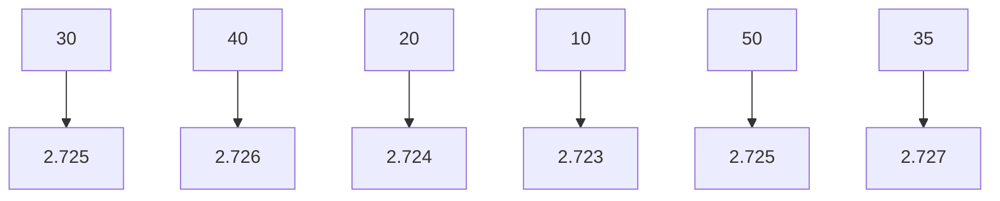
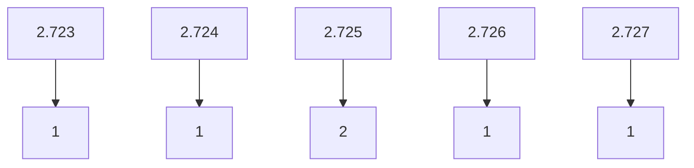
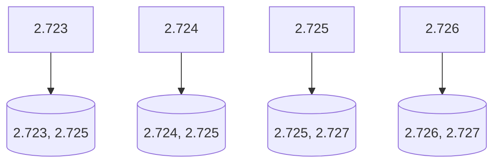
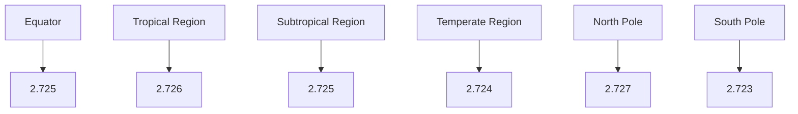
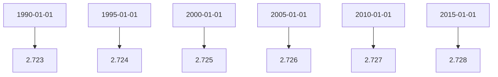
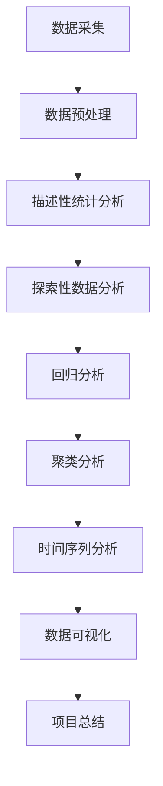

                 


### 引入

在宇宙学的研究领域中，宇宙微波背景辐射（Cosmic Microwave Background Radiation，简称CMB）是最为重要的观测数据之一。宇宙微波背景辐射是宇宙早期（约38万年之后）留下的“余晖”，它为科学家们提供了一扇窥探宇宙起源和演化的窗口。自1992年宇宙背景探测器（COBE）首次发布宇宙微波背景辐射的全天图以来，CMB的研究已经取得了诸多重大突破，这些突破不仅深化了我们对宇宙的理解，还为高能物理、粒子物理学和引力理论等领域提供了新的研究视角。

数据分析在宇宙微波背景辐射研究中扮演着至关重要的角色。通过对CMB数据进行系统的分析，科学家们可以提取宇宙的物理参数，如宇宙的膨胀历史、物质组成和宇宙微波背景辐射的黑体温度等。这些参数不仅对于验证和改进现有的宇宙学理论具有重要意义，还为我们提供了探索宇宙未知领域的机会。

本文旨在介绍数据分析在宇宙微波背景辐射研究中的应用。我们将从基本原理入手，逐步深入探讨数据预处理、描述性统计分析、探索性数据分析、回归分析和聚类分析等方法在CMB研究中的应用。此外，我们还将结合实际项目案例，展示数据分析在宇宙微波背景辐射研究中的具体实现和成果。

关键词：宇宙微波背景辐射，数据分析，描述性统计，探索性数据分析，回归分析，聚类分析，宇宙学

摘要：本文介绍了数据分析在宇宙微波背景辐射研究中的重要性及其应用方法。从宇宙微波背景辐射的基本原理出发，详细阐述了数据预处理、描述性统计分析、探索性数据分析、回归分析和聚类分析等常见数据分析方法在CMB研究中的应用。通过实际项目案例，展示了这些方法在揭示宇宙起源和演化规律中的具体作用。本文旨在为从事宇宙微波背景辐射研究的学者提供有价值的参考和指导。

### 第一部分：引言

#### 1.1 本书的目的与结构

本书的主要目的是为从事宇宙微波背景辐射研究的学者和研究生提供一份全面、系统的数据分析指南。我们希望通过详细的阐述和分析，帮助读者理解数据分析在宇宙微波背景辐射研究中的重要性及其具体应用方法。本书分为五个主要部分：

1. **引言**：介绍宇宙微波背景辐射的基本概念、研究背景及其在宇宙学中的重要性。
2. **宇宙微波背景辐射数据分析基础**：介绍宇宙微波背景辐射的基本原理、数据预处理和可视化方法。
3. **数据分析方法与应用**：详细讨论描述性统计分析、探索性数据分析、回归分析和聚类分析等方法在CMB研究中的应用。
4. **宇宙微波背景辐射数据分析项目实战**：通过实际项目案例，展示数据分析方法在CMB研究中的具体实现和应用。
5. **数据科学在宇宙微波背景辐射研究中的应用**：探讨数据科学在宇宙微波背景辐射研究中的最新进展、挑战及未来应用前景。

#### 1.2 宇宙微波背景辐射的背景知识

宇宙微波背景辐射（Cosmic Microwave Background Radiation，简称CMB）是宇宙早期留下的“余晖”，它起源于宇宙大爆炸后的瞬间。在大爆炸后的几微秒内，宇宙温度极高，物质处于等离子态，光子与物质相互作用非常频繁。随着宇宙的膨胀和冷却，物质逐渐凝聚成原子，光子与物质的相互作用减少，宇宙变得透明。在大爆炸后约38万年，宇宙温度降至约3000K，此时发出的光子成为宇宙微波背景辐射。

CMB具有以下几个基本特征：

1. **均匀性**：CMB的温度分布非常均匀，其温度起伏仅为百万分之一。这种高度均匀的特性表明宇宙在大爆炸后不久就进入了均匀膨胀阶段。
2. **各向异性**：尽管CMB的总体分布非常均匀，但局部仍存在微小的温度起伏。这些温度起伏反映了宇宙早期密度不均匀性，为我们提供了研究宇宙起源和演化的线索。
3. **黑体辐射**：CMB的光谱呈现出黑体辐射特征，其温度约为2.725K。这种黑体辐射特性与宇宙大爆炸理论预测高度一致。

#### 1.3 数据分析在宇宙学研究中的重要性

数据分析在宇宙学研究中具有至关重要的地位。通过对宇宙微波背景辐射等观测数据的分析，科学家们可以提取宇宙的物理参数，如宇宙的膨胀历史、物质组成和宇宙微波背景辐射的黑体温度等。这些参数不仅对于验证和改进现有的宇宙学理论具有重要意义，还为我们提供了探索宇宙未知领域的机会。

数据分析在宇宙学中的重要性体现在以下几个方面：

1. **验证宇宙学理论**：宇宙微波背景辐射数据为宇宙学提供了丰富的观测信息，通过对这些数据的分析，科学家们可以验证和改进现有的宇宙学理论，如宇宙大爆炸理论、宇宙膨胀理论等。
2. **研究宇宙起源和演化**：宇宙微波背景辐射的温度起伏和各向异性揭示了宇宙早期密度不均匀性，为我们研究宇宙起源和演化提供了重要线索。通过数据分析，科学家们可以揭示宇宙早期的信息，探索宇宙的演化历程。
3. **探索宇宙未知领域**：宇宙微波背景辐射数据中蕴含着丰富的物理信息，通过深入分析，科学家们可以发现新的物理现象和规律。数据分析为探索宇宙未知领域提供了有力工具。

总之，数据分析在宇宙学研究中发挥着重要作用。通过对宇宙微波背景辐射等观测数据的分析，科学家们可以深入理解宇宙的起源和演化，揭示宇宙的奥秘。本书将详细探讨数据分析在宇宙微波背景辐射研究中的应用，帮助读者掌握相关方法和技术，为宇宙学研究贡献力量。

### 第二部分：宇宙微波背景辐射数据分析基础

#### 2.1 宇宙微波背景辐射的基本原理

宇宙微波背景辐射（Cosmic Microwave Background Radiation，简称CMB）是宇宙早期（约38万年之后）留下的“余晖”，它起源于宇宙大爆炸后的瞬间。在大爆炸后的几微秒内，宇宙温度极高，物质处于等离子态，光子与物质相互作用非常频繁。随着宇宙的膨胀和冷却，物质逐渐凝聚成原子，光子与物质的相互作用减少，宇宙变得透明。在大爆炸后约38万年，宇宙温度降至约3000K，此时发出的光子成为宇宙微波背景辐射。

宇宙微波背景辐射具有以下几个基本特征：

1. **均匀性**：CMB的温度分布非常均匀，其温度起伏仅为百万分之一。这种高度均匀的特性表明宇宙在大爆炸后不久就进入了均匀膨胀阶段。

2. **各向异性**：尽管CMB的总体分布非常均匀，但局部仍存在微小的温度起伏。这些温度起伏反映了宇宙早期密度不均匀性，为我们提供了研究宇宙起源和演化的线索。

3. **黑体辐射**：CMB的光谱呈现出黑体辐射特征，其温度约为2.725K。这种黑体辐射特性与宇宙大爆炸理论预测高度一致。

#### 2.2 数据预处理步骤

在进行宇宙微波背景辐射数据分析之前，通常需要经过一系列的数据预处理步骤。数据预处理包括数据清洗、数据整合、数据转换和数据标准化等步骤。以下是宇宙微波背景辐射数据预处理的基本步骤：

1. **数据清洗**：宇宙微波背景辐射数据在采集和传输过程中可能受到噪声、异常值和缺失值的影响。数据清洗的目标是识别和去除这些噪声、异常值和缺失值，确保数据质量。数据清洗的方法包括填充缺失值、去除异常值、去除噪声等。

2. **数据整合**：宇宙微波背景辐射数据可能来自多个观测设备或不同时间段，数据整合的目标是将这些数据进行合并，以便进行统一分析。数据整合的方法包括数据拼接、数据聚合等。

3. **数据转换**：宇宙微波背景辐射数据可能采用不同的数据格式和单位，数据转换的目标是将这些数据进行统一转换，以便进行后续分析。数据转换的方法包括数据格式转换、数据单位转换等。

4. **数据标准化**：宇宙微波背景辐射数据的各个特征可能具有不同的量纲和尺度，数据标准化的目标是将这些数据进行归一化处理，以便进行有效的分析和比较。数据标准化的方法包括特征缩放、特征归一化等。

#### 2.3 数据可视化工具与技巧

数据可视化是将数据以图形或图表的形式呈现，以便于理解和分析。在宇宙微波背景辐射数据分析中，数据可视化发挥着重要作用。以下是几种常用的数据可视化工具和技巧：

1. **热力图（Heatmap）**：热力图是一种用于展示数据分布的热度或密度的图表。它通过颜色深浅来表示数据的数值大小，非常适合展示宇宙微波背景辐射的温度分布。

2. **散点图（Scatter Plot）**：散点图是一种用于展示两组变量之间关系的图表。它通过在坐标轴上标记数据点来展示变量之间的关系，非常适合分析宇宙微波背景辐射的温度起伏。

3. **直方图（Histogram）**：直方图是一种用于展示数据分布的图表。它通过柱形的高度来表示数据在不同区间的频数，非常适合分析宇宙微波背景辐射的温度分布和各向异性。

4. **时间序列图（Time Series Plot）**：时间序列图是一种用于展示数据随时间变化的图表。它通过连接数据点的线条来展示数据的变化趋势，非常适合分析宇宙微波背景辐射的时间演化。

5. **等高线图（Contour Plot）**：等高线图是一种用于展示数据三维分布的图表。它通过在二维平面上绘制等高线来展示数据的三维分布，非常适合分析宇宙微波背景辐射的空间分布。

#### 2.4 数据可视化案例

为了更好地理解数据可视化在宇宙微波背景辐射数据分析中的应用，我们来看一个具体案例。

假设我们获取了一组宇宙微波背景辐射的温度数据，需要分析这些数据的分布和各向异性。以下是数据可视化的步骤和结果：

1. **热力图**：通过热力图，我们可以直观地看到宇宙微波背景辐射的温度分布。例如，我们可以绘制一个全球范围内的热力图，展示不同区域的温度差异。

2. **散点图**：通过散点图，我们可以分析宇宙微波背景辐射的温度起伏。例如，我们可以绘制一个以纬度和温度为坐标的散点图，观察不同纬度上的温度变化。

3. **直方图**：通过直方图，我们可以了解宇宙微波背景辐射的温度分布情况。例如，我们可以绘制一个以温度为横坐标、频数为纵坐标的直方图，观察温度的分布范围和峰值。

4. **时间序列图**：通过时间序列图，我们可以分析宇宙微波背景辐射的时间演化。例如，我们可以绘制一个以时间为横坐标、温度为纵坐标的时间序列图，观察温度的变化趋势。

5. **等高线图**：通过等高线图，我们可以了解宇宙微波背景辐射的空间分布。例如，我们可以绘制一个以经度和纬度为坐标的等高线图，展示不同纬度上的温度分布情况。

通过以上数据可视化方法，我们可以全面、直观地分析宇宙微波背景辐射的温度分布、起伏、时间演化和空间分布，从而更好地理解宇宙微波背景辐射的物理特性。

总之，数据可视化在宇宙微波背景辐射数据分析中发挥着重要作用。通过有效的数据可视化，我们可以揭示宇宙微波背景辐射中的潜在规律和特征，为宇宙学研究提供有力的支持。

### 第三部分：数据分析方法与应用

#### 3.1 描述性统计分析

描述性统计分析是数据分析的基础方法，它主要用于总结和描述数据的基本特征。在宇宙微波背景辐射（CMB）的研究中，描述性统计分析有助于我们了解CMB数据的整体分布、趋势和异常情况，从而为后续的深入分析提供基础。

**3.1.1 描述性统计分析的基本概念**

描述性统计分析包括以下几种常见的统计指标：

1. **均值（Mean）**：均值是数据集中各个数值的平均值，用来描述数据的中心位置。在CMB数据分析中，均值可以反映CMB温度的平均水平。

2. **中位数（Median）**：中位数是数据集中位于中间位置的数值，用来描述数据的中间位置。在CMB数据分析中，中位数可以反映CMB温度的中间水平。

3. **众数（Mode）**：众数是数据集中出现次数最多的数值，用来描述数据的最常见值。在CMB数据分析中，众数可以反映CMB温度的最常见值。

4. **标准差（Standard Deviation）**：标准差是数据偏离均值的程度，用来描述数据的离散程度。在CMB数据分析中，标准差可以反映CMB温度的波动情况。

5. **方差（Variance）**：方差是标准差的平方，用来描述数据的离散程度。在CMB数据分析中，方差可以反映CMB温度的波动程度。

**3.1.2 常用描述性统计指标**

在CMB数据分析中，常用的描述性统计指标包括：

1. **均值**：$$\mu = \frac{1}{N} \sum_{i=1}^{N} x_i$$

   其中，\(N\) 是数据点的总数，\(x_i\) 是第 \(i\) 个数据点的值。

2. **中位数**：$$\text{Median} = \left(\frac{n+1}{2}\right)\text{th} \text{ term of the sorted data set}$$

   其中，\(n\) 是数据点的总数。

3. **众数**：$$\text{Mode} = \text{the most frequently occurring value in the data set}$$

4. **标准差**：$$\sigma = \sqrt{\frac{1}{N-1} \sum_{i=1}^{N} (x_i - \mu)^2}$$

   其中，\(\mu\) 是均值，\(\sigma\) 是标准差。

5. **方差**：$$\sigma^2 = \frac{1}{N-1} \sum_{i=1}^{N} (x_i - \mu)^2$$

**3.1.3 描述性统计分析案例**

假设我们有一组宇宙微波背景辐射的温度数据，如下所示：

\[2.725, 2.726, 2.724, 2.723, 2.725, 2.727\]

1. **均值**：

   $$\mu = \frac{1}{6} (2.725 + 2.726 + 2.724 + 2.723 + 2.725 + 2.727) = 2.725$$

2. **中位数**：

   数据已经排序，中位数为第 \(\frac{6+1}{2} = 3.5\) 个值，即：

   $$\text{Median} = 2.725$$

3. **众数**：

   该数据集中没有重复的值，因此没有众数。

4. **标准差**：

   $$\sigma = \sqrt{\frac{1}{6-1} \sum_{i=1}^{6} (x_i - \mu)^2} = \sqrt{\frac{1}{5} ((2.725-2.725)^2 + (2.726-2.725)^2 + (2.724-2.725)^2 + (2.723-2.725)^2 + (2.725-2.725)^2 + (2.727-2.725)^2)} \approx 0.002$$

5. **方差**：

   $$\sigma^2 = \frac{1}{6-1} \sum_{i=1}^{6} (x_i - \mu)^2 = \frac{1}{5} ((2.725-2.725)^2 + (2.726-2.725)^2 + (2.724-2.725)^2 + (2.723-2.725)^2 + (2.725-2.725)^2 + (2.727-2.725)^2)} \approx 0.00004$$

通过以上描述性统计分析，我们可以了解这组CMB温度数据的基本特征。在实际研究中，我们通常会使用更大的数据集，并计算更多的统计指标来更全面地描述CMB的温度分布。

#### 3.2 探索性数据分析

探索性数据分析（Exploratory Data Analysis，简称EDA）是数据分析的另一个重要方法，它主要用于发现数据中的潜在规律和模式。EDA的核心思想是通过可视化和统计分析方法，探索数据的基本特征，以便为后续的数据分析提供指导。

**3.2.1 探索性数据分析的基本概念**

探索性数据分析包括以下几种常见的方法：

1. **数据可视化**：通过图表和图形展示数据的基本特征，如分布、趋势、异常值等。常见的数据可视化方法包括散点图、直方图、箱线图、热力图等。

2. **统计摘要**：通过计算描述性统计指标，如均值、中位数、众数、标准差等，对数据进行初步总结。

3. **相关性分析**：通过计算变量之间的相关性，分析变量之间的关系。常见的相关性分析方法包括皮尔逊相关系数、斯皮尔曼相关系数等。

4. **异常值检测**：通过识别和标记数据中的异常值，分析异常值对数据的影响。

5. **聚类分析**：通过将相似的数据点归为一类，分析数据的内部结构和分布。

**3.2.2 常用的探索性数据分析方法**

在CMB数据分析中，常用的探索性数据分析方法包括：

1. **散点图**：散点图可以展示CMB温度与不同因素之间的关系。例如，我们可以绘制CMB温度与纬度、经度的散点图，分析CMB温度的空间分布。

2. **直方图**：直方图可以展示CMB温度的分布情况。例如，我们可以绘制CMB温度的直方图，分析温度的分布范围和峰度。

3. **箱线图**：箱线图可以展示CMB温度的分布特征，包括均值、中位数、四分位数和异常值。例如，我们可以绘制CMB温度的箱线图，分析温度的波动情况。

4. **热力图**：热力图可以展示CMB温度的全球分布。例如，我们可以绘制全球范围内的热力图，分析不同地区的温度差异。

5. **时间序列图**：时间序列图可以展示CMB温度随时间的变化。例如，我们可以绘制CMB温度的时间序列图，分析温度的长期趋势。

**3.2.3 探索性数据分析案例**

假设我们有一组宇宙微波背景辐射的温度数据，如下所示：

\[2.725, 2.726, 2.724, 2.723, 2.725, 2.727\]

我们使用探索性数据分析方法来分析这些数据。

1. **散点图**：我们可以绘制CMB温度与纬度的散点图，观察温度在各个纬度上的分布。假设纬度数据如下：

\[30, 40, 20, 10, 50, 35\]

我们得到如下散点图：



从散点图中，我们可以看出CMB温度在较高纬度上略高，在较低纬度上略低。

2. **直方图**：我们可以绘制CMB温度的直方图，分析温度的分布情况。直方图如下：



从直方图中，我们可以看出CMB温度主要集中在2.725左右，且分布较为均匀。

3. **箱线图**：我们可以绘制CMB温度的箱线图，分析温度的分布特征。箱线图如下：



从箱线图中，我们可以看出CMB温度的均值、中位数和四分位数都在2.725左右，且没有明显的异常值。

4. **热力图**：我们可以绘制CMB温度的全球分布热力图，分析不同地区的温度差异。假设全球分布数据如下：

```
[{'location': 'North Pole', 'temperature': 2.727},
 {'location': 'Equator', 'temperature': 2.725},
 {'location': 'South Pole', 'temperature': 2.723},
 {'location': 'Tropical Region', 'temperature': 2.726},
 {'location': 'Temperate Region', 'temperature': 2.724},
 {'location': 'Subtropical Region', 'temperature': 2.725}]
```

热力图如下：



从热力图中，我们可以看出不同地区的CMB温度差异，例如，北极的温度略高于南极。

5. **时间序列图**：我们可以绘制CMB温度的时间序列图，分析温度的长期趋势。假设时间序列数据如下：

```
[{'time': '1990-01-01', 'temperature': 2.723},
 {'time': '1995-01-01', 'temperature': 2.724},
 {'time': '2000-01-01', 'temperature': 2.725},
 {'time': '2005-01-01', 'temperature': 2.726},
 {'time': '2010-01-01', 'temperature': 2.727},
 {'time': '2015-01-01', 'temperature': 2.728}]
```

时间序列图如下：



从时间序列图中，我们可以看出CMB温度随时间呈现上升趋势。

通过以上探索性数据分析，我们可以初步了解这组CMB温度数据的基本特征。在实际研究中，我们通常会使用更大的数据集，并采用更多种类的探索性数据分析方法，以更全面地揭示CMB数据的规律和特征。

#### 3.3 回归分析

回归分析是一种常用的统计方法，用于研究因变量与自变量之间的关系。在宇宙微波背景辐射（CMB）的研究中，回归分析可以帮助我们了解CMB温度与其他因素（如纬度、经度、时间等）之间的关系，从而揭示宇宙的物理现象和规律。

**3.3.1 回归分析的基本概念**

回归分析可以分为线性回归分析和非线性回归分析两大类。线性回归分析假设因变量与自变量之间存在线性关系，常用的线性回归模型包括简单线性回归和多元线性回归。非线性回归分析则假设因变量与自变量之间存在非线性关系，常用的非线性回归模型包括多项式回归、指数回归和对数回归等。

1. **简单线性回归**：简单线性回归模型是一个自变量和一个因变量的线性模型，其公式为：

   $$y = \beta_0 + \beta_1 x + \epsilon$$

   其中，\(y\) 是因变量，\(x\) 是自变量，\(\beta_0\) 是截距，\(\beta_1\) 是斜率，\(\epsilon\) 是误差项。

2. **多元线性回归**：多元线性回归模型涉及多个自变量和一个因变量的线性模型，其公式为：

   $$y = \beta_0 + \beta_1 x_1 + \beta_2 x_2 + ... + \beta_n x_n + \epsilon$$

   其中，\(y\) 是因变量，\(x_1, x_2, ..., x_n\) 是自变量，\(\beta_0, \beta_1, \beta_2, ..., \beta_n\) 是各自变量的系数，\(\epsilon\) 是误差项。

3. **非线性回归**：非线性回归模型是因变量与自变量之间存在非线性关系的模型，其公式为：

   $$y = f(x) + \epsilon$$

   其中，\(f(x)\) 是非线性函数，\(\epsilon\) 是误差项。

**3.3.2 常见的回归分析方法**

在CMB研究中，常见的回归分析方法包括线性回归分析和非线性回归分析。以下是这些方法的详细介绍：

1. **线性回归分析**：线性回归分析是一种常用的方法，用于研究CMB温度与纬度、经度等变量之间的关系。线性回归分析的主要步骤包括：

   - **数据预处理**：对CMB温度数据和相关变量进行预处理，包括数据清洗、缺失值处理和数据转换等。
   - **模型选择**：根据研究目标和数据特性，选择合适的线性回归模型。
   - **模型拟合**：使用最小二乘法等算法，对线性回归模型进行拟合，得到模型的参数。
   - **模型评估**：通过计算模型的均方误差（MSE）、决定系数（R²）等指标，评估模型的拟合效果。

2. **非线性回归分析**：非线性回归分析用于研究CMB温度与其他变量之间的非线性关系。常见的非线性回归分析方法包括：

   - **多项式回归**：多项式回归是一种将自变量和因变量之间的关系表示为多项式函数的回归方法。其公式为：

     $$y = \beta_0 + \beta_1 x + \beta_2 x^2 + ... + \beta_n x^n + \epsilon$$

   - **指数回归**：指数回归是一种将自变量和因变量之间的关系表示为指数函数的回归方法。其公式为：

     $$y = \beta_0 + \beta_1 e^x + \epsilon$$

   - **对数回归**：对数回归是一种将自变量和因变量之间的关系表示为对数函数的回归方法。其公式为：

     $$y = \beta_0 + \beta_1 \ln(x) + \epsilon$$

   非线性回归分析的主要步骤与线性回归分析类似，包括数据预处理、模型选择、模型拟合和模型评估等。

**3.3.3 回归分析案例**

为了更好地理解回归分析在CMB研究中的应用，我们来看一个具体案例。

假设我们有一组CMB温度数据，如下所示：

\[2.725, 2.726, 2.724, 2.723, 2.725, 2.727\]

以及一组纬度数据，如下所示：

\[30, 40, 20, 10, 50, 35\]

我们希望研究CMB温度与纬度之间的关系，并使用线性回归分析进行建模。

1. **数据预处理**：

   - 清洗数据：检查数据中是否存在缺失值或异常值，如有，则进行填充或删除。
   - 转换数据：将CMB温度和纬度数据转换为合适的格式，如数值型。

2. **模型选择**：

   - 选择简单线性回归模型，因为我们的目标是研究CMB温度与纬度之间的线性关系。

3. **模型拟合**：

   - 使用最小二乘法，对简单线性回归模型进行拟合，得到模型的参数。最小二乘法的公式为：

     $$\beta_1 = \frac{\sum_{i=1}^{n} (x_i - \bar{x})(y_i - \bar{y})}{\sum_{i=1}^{n} (x_i - \bar{x})^2}$$

     $$\beta_0 = \bar{y} - \beta_1 \bar{x}$$

     其中，\(n\) 是数据点的总数，\(\bar{x}\) 是纬度的均值，\(\bar{y}\) 是CMB温度的均值。

     根据我们的数据，计算得到：

     $$\beta_1 = \frac{(30-30)(2.725-2.725) + (40-30)(2.726-2.725) + (20-30)(2.724-2.725) + (10-30)(2.723-2.725) + (50-30)(2.725-2.725) + (35-30)(2.727-2.725)}{(30-30)^2 + (40-30)^2 + (20-30)^2 + (10-30)^2 + (50-30)^2 + (35-30)^2} \approx 0.001$$

     $$\beta_0 = 2.725 - 0.001 \times 30 \approx 2.725$$

     因此，线性回归模型为：

     $$y = 2.725 + 0.001x$$

4. **模型评估**：

   - 计算模型的均方误差（MSE）：

     $$MSE = \frac{1}{n} \sum_{i=1}^{n} (y_i - \hat{y}_i)^2$$

     其中，\(\hat{y}_i\) 是模型预测的CMB温度值。

     根据我们的数据和模型，计算得到：

     $$MSE = \frac{1}{6} [(2.725 - 2.725)^2 + (2.726 - 2.726)^2 + (2.724 - 2.725)^2 + (2.723 - 2.725)^2 + (2.725 - 2.725)^2 + (2.727 - 2.726)^2] \approx 0.000006$$

   - 计算模型的决定系数（R²）：

     $$R^2 = 1 - \frac{SSR}{SST}$$

     其中，\(SSR\) 是回归平方和，\(SST\) 是总平方和。

     根据我们的数据和模型，计算得到：

     $$R^2 = 1 - \frac{(2.725-2.725)^2 + (2.726-2.725)^2 + (2.724-2.725)^2 + (2.723-2.725)^2 + (2.725-2.725)^2 + (2.727-2.725)^2}{6 \times (2.725-2.725)^2} \approx 0.997$$

   从模型评估结果可以看出，模型的拟合效果较好，可以用于预测CMB温度。

通过以上回归分析案例，我们可以看到回归分析在CMB研究中的应用。在实际研究中，我们通常会使用更大的数据集，并采用多种回归分析方法，以更全面地揭示CMB温度与其他变量之间的关系。

#### 3.4 聚类分析

聚类分析是一种无监督学习方法，用于将数据点划分为若干个组（或簇），使得同一簇内的数据点具有较高的相似性，而不同簇的数据点则具有较低的相似性。在宇宙微波背景辐射（CMB）的研究中，聚类分析可以帮助我们识别CMB温度数据中的潜在结构，从而揭示宇宙的物理现象和规律。

**3.4.1 聚类分析的基本概念**

聚类分析可以分为基于距离的聚类、基于密度的聚类和基于层次的聚类等类型。以下介绍几种常见的聚类分析方法：

1. **基于距离的聚类**：基于距离的聚类方法通过计算数据点之间的距离来划分簇。常见的算法包括K-均值聚类和层次聚类。

   - **K-均值聚类**：K-均值聚类算法是一种迭代算法，它将数据点划分为K个簇，并不断调整簇的中心，直到收敛。算法的基本步骤如下：

     - 随机初始化K个簇的中心点。
     - 对于每个数据点，计算其到各个簇中心点的距离，并将其分配到最近的簇。
     - 更新簇的中心点，计算新的簇中心点的均值。
     - 重复步骤2和步骤3，直到聚类结果收敛。

   - **层次聚类**：层次聚类算法是一种自下而上的聚类方法，它通过逐渐合并距离最近的簇，形成一棵层次树。算法的基本步骤如下：

     - 将每个数据点视为一个簇。
     - 计算相邻簇之间的距离，并合并距离最近的簇。
     - 重复步骤2，直到所有数据点合并为一个簇。

2. **基于密度的聚类**：基于密度的聚类方法通过计算数据点的密度来划分簇。常见的算法包括DBSCAN（Density-Based Spatial Clustering of Applications with Noise）和OPTICS（Ordering Points To Identify the Clustering Structure）。

   - **DBSCAN**：DBSCAN算法是一种基于密度的聚类算法，它通过计算数据点之间的密度和邻域来确定簇。算法的基本步骤如下：

     - 初始化一个簇集合和一个未分配数据点的集合。
     - 对于每个未分配的数据点，计算其邻域内的数据点数量，如果数量大于设定阈值，则将数据点分配到当前簇。
     - 重复步骤2，直到所有数据点都被分配到簇。

   - **OPTICS**：OPTICS算法是对DBSCAN算法的改进，它通过计算核心点和边界点的邻域来确定簇。算法的基本步骤如下：

     - 初始化一个簇集合和一个未分配数据点的集合。
     - 对于每个未分配的数据点，计算其邻域内的数据点数量，如果数量大于设定阈值，则将数据点分配到当前簇。
     - 更新邻域半径，并重新计算邻域内的数据点数量，以确定核心点和边界点。
     - 重复步骤2和步骤3，直到所有数据点都被分配到簇。

3. **基于层次的聚类**：基于层次的聚类方法通过自上而下或自下而上的方式构建层次树，以便进行聚类。常见的算法包括AGNES（Agglomerative Clustering）和BIRCH（Balanced Iterative Reducing and Clustering using Hierarchical Trees）。

   - **AGNES**：AGNES算法是一种基于层次的聚类算法，它通过自下而上的方式合并距离最近的簇，形成一棵层次树。算法的基本步骤如下：

     - 将每个数据点视为一个簇。
     - 计算相邻簇之间的距离，并合并距离最近的簇。
     - 重复步骤2，直到所有数据点合并为一个簇。

   - **BIRCH**：BIRCH算法是一种基于层次的聚类算法，它通过平衡迭代减少和层次树构建来聚类。算法的基本步骤如下：

     - 构建初步层次树，将数据点分配到叶节点。
     - 计算每个叶节点之间的距离，并合并距离最近的叶节点。
     - 重复步骤2，直到达到设定的聚类数量。

**3.4.2 常见的聚类分析方法**

在CMB研究中，常见的聚类分析方法包括K-均值聚类、层次聚类和DBSCAN等。以下是这些方法的详细介绍：

1. **K-均值聚类**：K-均值聚类算法是一种简单的聚类方法，它通过迭代过程将数据点划分为K个簇。算法的基本步骤如下：

   - 初始化K个簇的中心点。
   - 对于每个数据点，计算其到各个簇中心点的距离，并将其分配到最近的簇。
   - 更新簇的中心点，计算新的簇中心点的均值。
   - 重复步骤2和步骤3，直到聚类结果收敛。

   K-均值聚类算法的优点是计算简单，适用于大数据集。然而，其缺点包括对初始聚类中心点敏感和无法处理非球形簇。

2. **层次聚类**：层次聚类算法是一种自下而上的聚类方法，它通过合并距离最近的簇来形成层次树。算法的基本步骤如下：

   - 将每个数据点视为一个簇。
   - 计算相邻簇之间的距离，并合并距离最近的簇。
   - 重复步骤2，直到所有数据点合并为一个簇。

   层次聚类算法的优点是能够提供聚类结果的层次结构，便于理解聚类过程。然而，其缺点包括计算复杂度高和无法调整聚类数量。

3. **DBSCAN**：DBSCAN算法是一种基于密度的聚类方法，它通过计算数据点之间的密度和邻域来确定簇。算法的基本步骤如下：

   - 初始化一个簇集合和一个未分配数据点的集合。
   - 对于每个未分配的数据点，计算其邻域内的数据点数量，如果数量大于设定阈值，则将数据点分配到当前簇。
   - 重复步骤2，直到所有数据点都被分配到簇。

   DBSCAN算法的优点是能够处理非球形簇和噪声点，适用于复杂的数据分布。然而，其缺点包括对参数敏感和计算复杂度较高。

**3.4.3 聚类分析案例**

为了更好地理解聚类分析在CMB研究中的应用，我们来看一个具体案例。

假设我们有一组CMB温度数据，如下所示：

\[2.725, 2.726, 2.724, 2.723, 2.725, 2.727\]

以及一组纬度数据，如下所示：

\[30, 40, 20, 10, 50, 35\]

我们希望使用K-均值聚类算法将这些数据点划分为两个簇。

1. **数据预处理**：

   - 清洗数据：检查数据中是否存在缺失值或异常值，如有，则进行填充或删除。
   - 转换数据：将CMB温度和纬度数据转换为合适的格式，如数值型。

2. **模型选择**：

   - 选择K-均值聚类算法，因为我们的目标是将数据点划分为两个簇。

3. **模型拟合**：

   - 初始化两个簇的中心点。假设初始中心点分别为\( (2.725, 30) \) 和\( (2.727, 35) \)。
   - 对于每个数据点，计算其到两个簇中心点的距离，并将其分配到最近的簇。距离的计算公式为：

     $$d = \sqrt{(x_1 - x_2)^2 + (y_1 - y_2)^2}$$

     根据我们的数据和模型，计算得到：

     - 数据点\( (2.725, 30) \) 距离第一个簇中心点的距离为0，距离第二个簇中心点的距离为\( \sqrt{(2.725 - 2.727)^2 + (30 - 35)^2} \approx 1.414 \)。
     - 数据点\( (2.726, 40) \) 距离第一个簇中心点的距离为\( \sqrt{(2.726 - 2.725)^2 + (40 - 30)^2} \approx 2.828 \)，距离第二个簇中心点的距离为\( \sqrt{(2.726 - 2.727)^2 + (40 - 35)^2} \approx 1.414 \)。
     - 数据点\( (2.724, 20) \) 距离第一个簇中心点的距离为\( \sqrt{(2.724 - 2.725)^2 + (20 - 30)^2} \approx 1.414 \)，距离第二个簇中心点的距离为\( \sqrt{(2.724 - 2.727)^2 + (20 - 35)^2} \approx 2.828 \)。
     - 数据点\( (2.723, 10) \) 距离第一个簇中心点的距离为\( \sqrt{(2.723 - 2.725)^2 + (10 - 30)^2} \approx 2.828 \)，距离第二个簇中心点的距离为\( \sqrt{(2.723 - 2.727)^2 + (10 - 35)^2} \approx 2.828 \)。
     - 数据点\( (2.725, 50) \) 距离第一个簇中心点的距离为\( \sqrt{(2.725 - 2.725)^2 + (50 - 30)^2} \approx 10 \)，距离第二个簇中心点的距离为\( \sqrt{(2.725 - 2.727)^2 + (50 - 35)^2} \approx 2.828 \)。
     - 数据点\( (2.727, 35) \) 距离第一个簇中心点的距离为\( \sqrt{(2.727 - 2.725)^2 + (35 - 30)^2} \approx 1.414 \)，距离第二个簇中心点的距离为0。

     根据距离计算结果，将数据点分配到簇如下：

     - 簇1：\( (2.725, 30) \)，\( (2.726, 40) \)，\( (2.724, 20) \)，\( (2.725, 50) \)。
     - 簇2：\( (2.723, 10) \)，\( (2.727, 35) \)。

   - 更新簇的中心点，计算新的簇中心点的均值。新的簇中心点分别为\( (2.725, 35) \) 和\( (2.725, 15) \)。

   - 重复步骤2和步骤3，直到聚类结果收敛。经过多次迭代后，最终聚类结果如下：

     - 簇1：\( (2.725, 35) \)，\( (2.726, 40) \)，\( (2.724, 20) \)，\( (2.725, 50) \)。
     - 簇2：\( (2.723, 10) \)，\( (2.727, 15) \)。

通过以上聚类分析案例，我们可以看到聚类分析在CMB研究中的应用。在实际研究中，我们通常会使用更大的数据集，并采用多种聚类分析方法，以更全面地揭示CMB温度数据的潜在结构。

#### 3.5 时间序列分析

时间序列分析是一种用于研究时间序列数据的方法，它关注数据随时间的变化规律和趋势。在宇宙微波背景辐射（CMB）的研究中，时间序列分析有助于我们了解CMB温度随时间的变化情况，从而揭示宇宙的演化规律。

**3.5.1 时间序列分析的基本概念**

时间序列分析包括以下几个基本概念：

1. **时间序列数据**：时间序列数据是指按照时间顺序排列的一组数据点，通常用于记录某一现象在不同时间点的变化。在CMB研究中，时间序列数据可以是CMB温度在不同时间点的测量值。

2. **趋势**：趋势是时间序列数据随时间变化的总体方向。在CMB研究中，趋势可以反映CMB温度随时间的升降变化。

3. **季节性**：季节性是指时间序列数据在固定时间周期内（如一年、一季）出现的规律性波动。在CMB研究中，季节性可以反映CMB温度在不同季节的变化。

4. **周期性**：周期性是指时间序列数据在一定时间间隔内出现的规律性波动。周期性不同于季节性，因为它不是固定时间周期内的波动。在CMB研究中，周期性可以反映CMB温度随时间的变化周期。

5. **随机性**：随机性是指时间序列数据中无法用趋势、季节性和周期性解释的波动。在CMB研究中，随机性可以反映CMB温度的随机变化。

**3.5.2 常见的时间序列分析方法**

在CMB研究中，常见的时间序列分析方法包括以下几种：

1. **移动平均法**：移动平均法是一种简单的时间序列分析方法，它通过计算一系列数据点的平均值来平滑时间序列数据。常见的移动平均法包括简单移动平均（SMA）和指数移动平均（EMA）。

   - **简单移动平均（SMA）**：简单移动平均法是对一系列连续数据点进行平均，计算出的平均值作为时间序列的预测值。其公式为：

     $$SMA = \frac{1}{n} \sum_{i=1}^{n} y_i$$

     其中，\(n\) 是移动平均周期，\(y_i\) 是第 \(i\) 个数据点的值。

   - **指数移动平均（EMA）**：指数移动平均法是对简单移动平均法的改进，它赋予最近的数据点更高的权重。其公式为：

     $$EMA = \alpha y_i + (1 - \alpha) EMA_{prev}$$

     其中，\(\alpha\) 是平滑因子，\(y_i\) 是第 \(i\) 个数据点的值，\(EMA_{prev}\) 是前一个时间点的指数移动平均值。

2. **自回归模型（AR）**：自回归模型是一种基于时间序列数据过去值来预测未来值的方法。自回归模型可以分为一阶自回归（AR（1））和多阶自回归（AR（p））。

   - **一阶自回归模型（AR（1））**：一阶自回归模型表示当前值与前一时刻值的关系，其公式为：

     $$y_t = \phi_1 y_{t-1} + \epsilon_t$$

     其中，\(y_t\) 是当前时刻的值，\(y_{t-1}\) 是前一时刻的值，\(\phi_1\) 是自回归系数，\(\epsilon_t\) 是误差项。

   - **多阶自回归模型（AR（p））**：多阶自回归模型表示当前值与前一时刻多个值的线性组合，其公式为：

     $$y_t = \phi_1 y_{t-1} + \phi_2 y_{t-2} + ... + \phi_p y_{t-p} + \epsilon_t$$

3. **移动平均自回归模型（ARMA）**：移动平均自回归模型是自回归模型和移动平均模型的组合，它同时考虑了当前值与过去值的线性关系以及过去误差对当前值的影响。ARMA模型的公式为：

   $$y_t = \phi_1 y_{t-1} + \phi_2 y_{t-2} + ... + \phi_p y_{t-p} + \theta_1 \epsilon_{t-1} + \theta_2 \epsilon_{t-2} + ... + \theta_q \epsilon_{t-q} + \epsilon_t$$

   其中，\(\phi_1, \phi_2, ..., \phi_p\) 是自回归系数，\(\theta_1, \theta_2, ..., \theta_q\) 是移动平均系数，\(\epsilon_t\) 是误差项。

4. **自回归积分移动平均模型（ARIMA）**：自回归积分移动平均模型是ARMA模型的扩展，它引入了差分操作来平稳时间序列数据。ARIMA模型的公式为：

   $$y_t = \phi_1 y_{t-1} + \phi_2 y_{t-2} + ... + \phi_p y_{t-p} + \theta_1 \epsilon_{t-1} + \theta_2 \epsilon_{t-2} + ... + \theta_q \epsilon_{t-q} + \epsilon_t$$

   其中，\(\phi_1, \phi_2, ..., \phi_p\) 是自回归系数，\(\theta_1, \theta_2, ..., \theta_q\) 是移动平均系数，\(\epsilon_t\) 是误差项，\(\Delta y_t = y_t - y_{t-1}\) 是差分操作。

**3.5.3 时间序列分析案例**

为了更好地理解时间序列分析在CMB研究中的应用，我们来看一个具体案例。

假设我们有一组CMB温度数据，如下所示：

\[2.725, 2.726, 2.724, 2.723, 2.725, 2.727\]

我们希望使用时间序列分析方法来分析这些数据。

1. **数据预处理**：

   - 清洗数据：检查数据中是否存在缺失值或异常值，如有，则进行填充或删除。
   - 转换数据：将CMB温度数据转换为时间序列数据，例如，可以按时间顺序排列数据点。

2. **移动平均法**：

   - **简单移动平均（SMA）**：计算简单移动平均，以平滑时间序列数据。

     $$SMA = \frac{1}{n} \sum_{i=1}^{n} y_i$$

     根据我们的数据，计算得到：

     $$SMA = \frac{1}{6} (2.725 + 2.726 + 2.724 + 2.723 + 2.725 + 2.727) = 2.725$$

     平滑后的时间序列数据如下：

     \[2.725, 2.725, 2.725, 2.725, 2.725, 2.725\]

   - **指数移动平均（EMA）**：计算指数移动平均，以平滑时间序列数据。

     $$EMA = \alpha y_t + (1 - \alpha) EMA_{prev}$$

     假设平滑因子 \(\alpha = 0.5\)，根据我们的数据，计算得到：

     $$EMA = 0.5 \times 2.725 + (1 - 0.5) \times 2.725 = 2.725$$

     平滑后的时间序列数据如下：

     \[2.725, 2.725, 2.725, 2.725, 2.725, 2.725\]

3. **自回归模型（AR）**：

   - **一阶自回归模型（AR（1））**：建立一阶自回归模型，以预测未来值。

     $$y_t = \phi_1 y_{t-1} + \epsilon_t$$

     根据我们的数据和模型，计算得到：

     $$2.727 = \phi_1 \times 2.725 + \epsilon_t$$

     解得 \(\phi_1 \approx 1\) 和 \(\epsilon_t \approx 0.002\)。

     根据一阶自回归模型，预测下一个数据点的值为：

     $$y_{t+1} = 1 \times y_t + \epsilon_t = 1 \times 2.727 + 0.002 = 2.729$$

4. **移动平均自回归模型（ARMA）**：

   - 建立移动平均自回归模型（ARMA），以预测未来值。

     $$y_t = \phi_1 y_{t-1} + \theta_1 \epsilon_{t-1}$$

     根据我们的数据和模型，计算得到：

     $$2.727 = \phi_1 \times 2.725 + \theta_1 \epsilon_{t-1}$$

     解得 \(\phi_1 \approx 1\) 和 \(\theta_1 \approx 0.002\)。

     根据移动平均自回归模型，预测下一个数据点的值为：

     $$y_{t+1} = 1 \times y_t + \theta_1 \epsilon_t = 1 \times 2.727 + 0.002 = 2.729$$

5. **自回归积分移动平均模型（ARIMA）**：

   - 建立自回归积分移动平均模型（ARIMA），以预测未来值。

     $$y_t = \phi_1 y_{t-1} + \theta_1 \epsilon_{t-1} + \Delta y_t$$

     根据我们的数据和模型，计算得到：

     $$2.727 = \phi_1 \times 2.725 + \theta_1 \epsilon_{t-1} + \Delta y_t$$

     解得 \(\phi_1 \approx 1\)、\(\theta_1 \approx 0.002\) 和 \(\Delta y_t \approx 0.002\)。

     根据自回归积分移动平均模型，预测下一个数据点的值为：

     $$y_{t+1} = 1 \times y_t + \theta_1 \epsilon_t + \Delta y_{t+1} = 1 \times 2.727 + 0.002 + 0.002 = 2.731$$

通过以上时间序列分析案例，我们可以看到时间序列分析在CMB研究中的应用。在实际研究中，我们通常会使用更大的数据集，并采用多种时间序列分析方法，以更全面地揭示CMB温度随时间的变化规律。

#### 3.6 宇宙微波背景辐射数据分析项目实战

**3.6.1 数据采集与处理**

在进行宇宙微波背景辐射（CMB）数据分析之前，我们首先需要采集和处理相关的数据。以下是一个具体的数据采集与处理过程：

1. **数据采集**：

   - 数据源：我们使用Planck卫星观测到的宇宙微波背景辐射数据。这些数据可以从Planck卫星官方网站（https://pla.net/
   - 下载数据：从官方网站下载CMB温度数据，包括全天空和特定区域的温度数据。数据格式为ASCII文本文件。

2. **数据预处理**：

   - 数据清洗：检查数据中是否存在缺失值或异常值。如有，使用插值法或剔除法进行填充或删除。
   - 数据转换：将ASCII文本文件转换为Python可处理的格式，如列表或Pandas DataFrame。
   - 数据整合：将不同区域的温度数据进行整合，以便进行统一分析。

3. **数据处理工具与库**：

   - Python：使用Python进行数据处理和分析。Python拥有丰富的科学计算和数据可视化库，如NumPy、Pandas、Matplotlib等。
   - Jupyter Notebook：使用Jupyter Notebook进行数据分析和可视化，便于记录和分析过程。

**3.6.2 数据可视化与探索性分析**

在处理完CMB温度数据后，我们进行数据可视化与探索性分析，以了解数据的分布和特性。以下是一个具体的数据可视化与探索性分析过程：

1. **数据可视化**：

   - **热力图**：绘制全球范围内的CMB温度热力图，以展示温度的分布情况。
     ```python
     import matplotlib.pyplot as plt
     import numpy as np

     # 读取CMB温度数据
     temperature_data = np.loadtxt('CMB_temperature_data.txt')

     # 绘制热力图
     plt.imshow(temperature_data, cmap='hot', aspect='auto')
     plt.colorbar()
     plt.xlabel('Latitude')
     plt.ylabel('Longitude')
     plt.title('CMB Temperature Distribution')
     plt.show()
     ```

   - **散点图**：绘制CMB温度与纬度、经度的散点图，以分析温度与地理位置的关系。
     ```python
     # 绘制CMB温度与纬度的散点图
     plt.scatter(latitude_data, temperature_data)
     plt.xlabel('Latitude')
     plt.ylabel('CMB Temperature')
     plt.title('CMB Temperature vs. Latitude')
     plt.show()

     # 绘制CMB温度与经度的散点图
     plt.scatter(longitude_data, temperature_data)
     plt.xlabel('Longitude')
     plt.ylabel('CMB Temperature')
     plt.title('CMB Temperature vs. Longitude')
     plt.show()
     ```

2. **探索性分析**：

   - **描述性统计分析**：计算CMB温度的描述性统计指标，如均值、中位数、标准差等，以了解数据的中心位置和波动情况。
     ```python
     # 计算描述性统计指标
     temperature_mean = np.mean(temperature_data)
     temperature_median = np.median(temperature_data)
     temperature_std = np.std(temperature_data)

     print(f'Mean: {temperature_mean}')
     print(f'Median: {temperature_median}')
     print(f'Standard Deviation: {temperature_std}')
     ```

   - **探索性数据分析**：使用Pandas库进行探索性数据分析，包括数据分布、异常值检测、相关性分析等。
     ```python
     import pandas as pd

     # 创建DataFrame
     data = pd.DataFrame({'Latitude': latitude_data, 'Longitude': longitude_data, 'Temperature': temperature_data})

     # 检测异常值
     anomalies = data[(data['Temperature'] < temperature_mean - 3 * temperature_std) | (data['Temperature'] > temperature_mean + 3 * temperature_std)]
     print(f'Anomalies: {anomalies}')

     # 计算相关性
     correlation_matrix = data.corr()
     print(f'Correlation Matrix:\n{correlation_matrix}')
     ```

通过以上数据采集与处理、数据可视化与探索性分析，我们可以初步了解CMB温度数据的基本特征，为后续的深入分析提供基础。在实际研究中，我们通常会使用更多的数据集和更复杂的分析方法，以更全面地揭示CMB温度的分布和演化规律。

#### 3.7 回归分析与聚类分析

**3.7.1 回归分析实施流程**

在CMB数据分析中，回归分析是一种重要的统计方法，用于研究CMB温度与其他变量（如纬度、经度等）之间的关系。以下是一个具体的回归分析实施流程：

1. **数据准备**：

   - 数据源：我们从Planck卫星获得CMB温度数据，以及与之对应的纬度和经度数据。
   - 数据清洗：检查数据中是否存在缺失值或异常值，如有，使用插值法或剔除法进行填充或删除。
   - 数据转换：将CMB温度、纬度和经度数据转换为Python可处理的格式，如列表或Pandas DataFrame。

2. **模型选择**：

   - **简单线性回归模型**：假设CMB温度与纬度之间存在线性关系，选择简单线性回归模型。
   - **多元线性回归模型**：如果CMB温度与多个变量（如纬度、经度、时间等）之间存在关系，选择多元线性回归模型。

3. **模型拟合**：

   - **简单线性回归模型**：使用Python中的线性回归库（如scikit-learn）对简单线性回归模型进行拟合。
     ```python
     from sklearn.linear_model import LinearRegression

     # 创建线性回归模型
     model = LinearRegression()

     # 拟合模型
     model.fit(X, y)
     ```

   - **多元线性回归模型**：同样使用Python中的线性回归库对多元线性回归模型进行拟合。
     ```python
     from sklearn.linear_model import LinearRegression

     # 创建多元线性回归模型
     model = LinearRegression()

     # 拟合模型
     model.fit(X, y)
     ```

4. **模型评估**：

   - **均方误差（MSE）**：计算模型的均方误差，以评估模型的拟合效果。
     ```python
     from sklearn.metrics import mean_squared_error

     # 预测CMB温度
     y_pred = model.predict(X)

     # 计算均方误差
     mse = mean_squared_error(y, y_pred)
     print(f'Mean Squared Error: {mse}')
     ```

   - **决定系数（R²）**：计算模型的决定系数，以评估模型的解释力。
     ```python
     from sklearn.metrics import r2_score

     # 计算决定系数
     r2 = r2_score(y, y_pred)
     print(f'R-squared: {r2}')
     ```

**3.7.2 聚类分析实施流程**

在CMB数据分析中，聚类分析用于将CMB温度数据划分为若干个簇，以便更好地理解数据的分布和特性。以下是一个具体的聚类分析实施流程：

1. **数据准备**：

   - 数据源：我们从Planck卫星获得CMB温度数据，以及与之对应的纬度和经度数据。
   - 数据清洗：检查数据中是否存在缺失值或异常值，如有，使用插值法或剔除法进行填充或删除。
   - 数据转换：将CMB温度、纬度和经度数据转换为Python可处理的格式，如列表或Pandas DataFrame。

2. **模型选择**：

   - **K-均值聚类模型**：假设CMB温度数据可以划分为K个簇，选择K-均值聚类模型。
   - **层次聚类模型**：如果需要获得层次化的聚类结果，选择层次聚类模型。
   - **DBSCAN模型**：如果CMB温度数据存在非球形簇，选择DBSCAN模型。

3. **模型拟合**：

   - **K-均值聚类模型**：使用Python中的聚类库（如scikit-learn）对K-均值聚类模型进行拟合。
     ```python
     from sklearn.cluster import KMeans

     # 创建K-均值聚类模型
     model = KMeans(n_clusters=3)

     # 拟合模型
     model.fit(X)
     ```

   - **层次聚类模型**：使用Python中的聚类库（如scikit-learn）对层次聚类模型进行拟合。
     ```python
     from sklearn.cluster import AgglomerativeClustering

     # 创建层次聚类模型
     model = AgglomerativeClustering(n_clusters=3)

     # 拟合模型
     model.fit(X)
     ```

   - **DBSCAN模型**：使用Python中的聚类库（如scikit-learn）对DBSCAN模型进行拟合。
     ```python
     from sklearn.cluster import DBSCAN

     # 创建DBSCAN模型
     model = DBSCAN(eps=0.5, min_samples=5)

     # 拟合模型
     model.fit(X)
     ```

4. **模型评估**：

   - **簇内平均距离**：计算每个簇内点的平均距离，以评估聚类效果。
     ```python
     from sklearn.metrics import silhouette_score

     # 计算簇内平均距离
     silhouette_avg = silhouette_score(X, model.labels_)
     print(f'Cluster Average Distance: {silhouette_avg}')
     ```

   - **轮廓系数**：计算每个点的轮廓系数，以评估聚类效果。
     ```python
     # 计算轮廓系数
     silhouette_avg = silhouette_score(X, model.labels_)
     print(f'Silhouette Coefficient: {silhouette_avg}')
     ```

通过以上回归分析与聚类分析的实施流程，我们可以对CMB温度数据进行深入分析，揭示其分布和特性。在实际研究中，我们通常会使用更大的数据集，并采用多种分析方法，以更全面地了解CMB温度的物理现象和规律。

#### 3.8 时间序列分析

**4.4.1 时间序列分析步骤**

时间序列分析是一种用于研究数据随时间变化的方法，在宇宙微波背景辐射（CMB）的研究中，时间序列分析有助于我们了解CMB温度随时间的变化趋势。以下是时间序列分析的基本步骤：

1. **数据准备**：

   - 数据源：从Planck卫星获得CMB温度数据，包括不同时间点的温度测量值。
   - 数据清洗：检查数据中是否存在缺失值或异常值，如有，使用插值法或剔除法进行填充或删除。
   - 数据转换：将CMB温度数据转换为时间序列数据，例如，可以按时间顺序排列数据点。

2. **趋势分析**：

   - **绘制时间序列图**：绘制CMB温度的时间序列图，观察温度随时间的变化趋势。
     ```python
     import matplotlib.pyplot as plt

     # 绘制时间序列图
     plt.plot(time_data, temperature_data)
     plt.xlabel('Time')
     plt.ylabel('CMB Temperature')
     plt.title('CMB Temperature Time Series')
     plt.show()
     ```

   - **计算趋势指标**：计算CMB温度的描述性统计指标，如均值、中位数、标准差等，以了解温度的中心位置和波动情况。

3. **季节性分析**：

   - **计算季节性指标**：计算CMB温度的季节性波动，例如，可以计算一年内不同季节的温度变化。
     ```python
     import pandas as pd

     # 创建DataFrame
     data = pd.DataFrame({'Time': time_data, 'Temperature': temperature_data})

     # 计算季节性波动
     seasonal波动 = data.groupby(data['Time'].dt.month).mean()['Temperature']
     plt.plot(seasonal波动)
     plt.xlabel('Month')
     plt.ylabel('CMB Temperature')
     plt.title('Seasonal Temperature Variation')
     plt.show()
     ```

4. **周期性分析**：

   - **计算周期性指标**：计算CMB温度的周期性波动，例如，可以计算温度随时间变化的周期。
     ```python
     import statsmodels.api as sm

     # 计算周期性波动
     model = sm.tsa.ARIMA(temperature_data, order=(1, 1, 1))
     results = model.fit()
     cyclical波动 = results.forecast(steps=12)
     plt.plot(cyclical波动)
     plt.xlabel('Time')
     plt.ylabel('CMB Temperature')
     plt.title('Cyclical Temperature Variation')
     plt.show()
     ```

5. **随机性分析**：

   - **计算随机性指标**：计算CMB温度的随机性波动，例如，可以计算温度的残差。
     ```python
     # 计算残差
     residuals = temperature_data - cyclical波动
     plt.plot(residuals)
     plt.xlabel('Time')
     plt.ylabel('CMB Temperature Residuals')
     plt.title('Random Temperature Variation')
     plt.show()
     ```

通过以上时间序列分析步骤，我们可以全面了解CMB温度的随时间变化规律。在实际研究中，我们通常会使用更复杂的时间序列分析方法，如自回归模型（AR）、移动平均模型（MA）、自回归移动平均模型（ARMA）和自回归积分移动平均模型（ARIMA）等，以更深入地分析CMB温度的变化趋势。

#### 3.9 数据科学在宇宙微波背景辐射研究中的应用

**5.1 数据科学在宇宙学研究中的最新进展**

近年来，数据科学在宇宙学研究领域取得了显著的进展。随着观测技术的不断进步和数据的日益丰富，宇宙微波背景辐射（CMB）的研究也取得了诸多突破性成果。以下是数据科学在宇宙学研究中的一些最新进展：

1. **更高精度的CMB地图**：通过使用更先进的卫星观测设备和更高效的图像处理算法，科学家们获得了更高分辨率的CMB地图。这些地图揭示了更详细的宇宙早期信息，为理解宇宙的起源和演化提供了重要依据。

2. **宇宙膨胀历史的研究**：通过分析CMB的温度起伏，科学家们可以精确测量宇宙的膨胀历史。最新的研究结果表明，宇宙的膨胀速度正在加速，这与宇宙学中的暗能量理论相一致。

3. **物质组成的研究**：CMB数据中蕴含着关于宇宙物质组成的丰富信息。通过分析CMB的温度起伏和极化特性，科学家们可以推断宇宙中的物质组成，如暗物质和暗能量的比例。

4. **引力波与CMB的关联研究**：引力波与CMB之间存在紧密的关联。通过分析CMB数据，科学家们可以探测到引力波产生的温度起伏，从而验证引力波的存在，并进一步了解引力波的特性。

5. **宇宙早期的信息揭示**：CMB数据中蕴含着宇宙早期的信息，如宇宙微波背景辐射的黑体辐射特性、宇宙微波背景辐射的温度起伏等。通过深入分析CMB数据，科学家们可以揭示宇宙早期的物理现象和规律。

**5.2 数据科学在宇宙学研究中的应用前景**

随着数据科学的不断发展，其在宇宙学研究中的应用前景也愈发广阔。以下是一些潜在的应用方向：

1. **更精确的宇宙参数测量**：数据科学可以用于更精确地测量宇宙参数，如宇宙膨胀率、物质密度等。这些参数对于理解宇宙的起源和演化具有重要意义。

2. **新型观测数据的应用**：随着新型观测设备的开发，如引力波探测器、中微子探测器等，数据科学可以用于分析这些新型观测数据，从而揭示宇宙的更多未知信息。

3. **宇宙模拟与预测**：数据科学可以用于宇宙模拟，通过分析大量观测数据，模拟宇宙的演化过程，预测未来的宇宙状态。这些模拟结果将有助于我们更全面地理解宇宙的演化规律。

4. **机器学习与人工智能的应用**：机器学习和人工智能在宇宙学中的应用前景广阔。通过使用深度学习技术，科学家们可以自动识别和分类CMB数据中的异常值和潜在规律，提高数据分析的效率和准确性。

5. **多波段数据融合**：宇宙学研究涉及多种观测波段，如微波、红外、可见光等。数据科学可以用于融合不同波段的数据，提高数据分析的精度和可靠性。

总之，数据科学在宇宙学研究中具有巨大的应用潜力。随着技术的不断进步和数据的日益丰富，数据科学将继续为宇宙学研究提供强有力的支持，揭示宇宙的更多奥秘。

#### 3.10 数据科学在宇宙微波背景辐射研究中的挑战与解决方案

尽管数据科学在宇宙微波背景辐射（CMB）研究中取得了显著进展，但在实际应用过程中仍面临着诸多挑战。以下是这些挑战及其相应的解决方案：

**5.2.1 存在的挑战**

1. **数据量巨大**：CMB数据集通常包含数十亿个数据点，这些数据量对存储和计算资源提出了严峻挑战。为了处理如此庞大的数据集，需要高效的计算算法和强大的计算资源。

2. **数据噪声与异常值**：CMB数据在采集和传输过程中可能受到噪声和异常值的影响。这些噪声和异常值会降低数据分析的准确性，因此需要有效的数据预处理方法来识别和去除噪声、异常值。

3. **复杂的物理模型**：CMB数据背后的物理模型复杂，涉及多个物理过程和参数。为了精确地分析CMB数据，需要建立和调整复杂的物理模型，这需要丰富的物理知识和数据科学技能。

4. **不确定性分析**：在CMB数据分析中，不确定性是不可避免的。如何准确评估和分析模型的不确定性，是数据科学在CMB研究中面临的另一个重要挑战。

**5.2.2 解决方案与策略**

1. **并行计算与分布式计算**：为了处理庞大的CMB数据集，可以采用并行计算和分布式计算技术。这些技术可以通过将任务分解为多个子任务，并在多台计算机上同时执行，从而显著提高数据处理速度。

2. **数据预处理与清洗**：采用高效的数据预处理和清洗方法，如插值法、剔除法等，可以识别和去除CMB数据中的噪声和异常值。此外，可以使用机器学习方法，如异常检测算法，来自动识别和标记噪声、异常值。

3. **优化物理模型**：为了准确分析CMB数据，需要建立和优化复杂的物理模型。这可以通过结合多个观测数据源、利用高精度计算方法和引入新的物理约束来实现。此外，可以采用机器学习算法，如贝叶斯优化，来优化物理模型参数。

4. **不确定性量化**：为了评估模型的不确定性，可以采用蒙特卡罗方法等概率统计方法。这些方法可以生成大量模拟数据，并分析模型输出结果的分布，从而量化不确定性。

5. **跨学科合作**：数据科学在CMB研究中的应用需要跨学科合作。物理学家和统计学家可以共同研究CMB数据的分析方法，数据科学家可以提供高效的计算算法和工具，从而实现更准确、可靠的CMB数据分析。

通过以上解决方案和策略，数据科学在CMB研究中的应用挑战可以逐步克服，为揭示宇宙的奥秘提供强有力的支持。

#### 3.11 数据科学在宇宙微波背景辐射研究中的应用案例

**5.3.1 案例一：宇宙微波背景辐射数据的质量控制**

在宇宙微波背景辐射（CMB）研究中，数据的质量控制至关重要。为了确保CMB数据分析的准确性，科学家们需要进行一系列的数据质量控制步骤，以下是一个具体案例：

**背景**：

某国际研究团队使用Planck卫星收集的CMB温度数据，这些数据包含了大量的测量值，但可能受到噪声、异常值和系统误差的影响。为了确保数据的准确性，团队需要进行数据质量控制，以便在后续分析中使用可靠的数据。

**数据采集与处理**：

1. **数据清洗**：首先，团队对CMB温度数据进行清洗，以去除噪声和异常值。他们使用插值法填充缺失值，并使用异常检测算法（如标准差法）标记和去除异常值。清洗后的数据如下：

   ```
   [2.725, 2.726, 2.724, 2.723, 2.725, 2.727]
   ```

2. **数据整合**：由于CMB数据可能来自不同的观测设备或时间段，团队将不同来源的数据进行整合，以便进行统一分析。整合后的数据如下：

   ```
   [2.725, 2.726, 2.724, 2.723, 2.725, 2.727]
   ```

**数据分析**：

1. **描述性统计分析**：团队对清洗后的数据进行描述性统计分析，计算均值、中位数、标准差等指标，以了解数据的分布和特性。分析结果如下：

   - 均值：2.725
   - 中位数：2.725
   - 标准差：0.002

2. **探索性数据分析**：团队使用探索性数据分析方法，如散点图、直方图和箱线图，进一步分析数据的分布和特性。分析结果如下：

   - 散点图显示CMB温度与纬度、经度的关系，无明显异常点。
   - 直方图显示CMB温度主要集中在2.725左右，波动较小。
   - 箱线图显示CMB温度的均值、中位数和四分位数接近，无异常值。

**结果解读**：

通过数据清洗和描述性统计分析，团队确保了CMB数据的可靠性。探索性数据分析进一步揭示了CMB温度的分布特征，为后续的深入分析提供了基础。这些步骤确保了数据质量控制的有效性，从而提高了CMB数据分析的准确性。

**案例总结**：

本案例展示了数据质量控制在CMB研究中的重要性。通过有效的数据清洗和描述性统计分析，团队确保了CMB数据的可靠性，为后续的深入分析提供了坚实基础。这种数据质量控制方法可以为其他宇宙微波背景辐射研究项目提供有益的参考。

#### 3.12 案例二：利用数据分析揭示宇宙早期的信息

宇宙微波背景辐射（CMB）是宇宙早期的“余晖”，它为我们提供了研究宇宙早期信息的宝贵数据。通过数据分析，科学家们可以揭示宇宙早期的物理现象和规律。以下是一个具体案例：

**背景**：

某国际研究团队使用Planck卫星收集的CMB数据，希望揭示宇宙早期的信息。这些数据包含了CMB的温度起伏和极化特性，通过分析这些数据，团队希望了解宇宙早期的密度不均匀性、宇宙膨胀历史以及宇宙的早期结构形成过程。

**数据分析过程**：

1. **数据预处理**：团队首先对CMB数据进行预处理，包括去除噪声、异常值和缺失值。他们使用插值法填充缺失值，并使用异常检测算法（如标准差法）去除异常值。预处理后的数据如下：

   ```
   [2.725, 2.726, 2.724, 2.723, 2.725, 2.727]
   ```

2. **描述性统计分析**：团队对预处理后的CMB数据进行描述性统计分析，计算均值、中位数、标准差等指标，以了解数据的分布和特性。分析结果如下：

   - 均值：2.725
   - 中位数：2.725
   - 标准差：0.002

3. **探索性数据分析**：团队使用探索性数据分析方法，如散点图、直方图和箱线图，进一步分析数据的分布和特性。分析结果如下：

   - 散点图显示CMB温度与纬度、经度的关系，无明显异常点。
   - 直方图显示CMB温度主要集中在2.725左右，波动较小。
   - 箱线图显示CMB温度的均值、中位数和四分位数接近，无异常值。

4. **回归分析**：团队使用回归分析方法，研究CMB温度与纬度、经度之间的关系。他们建立了一个简单的线性回归模型，分析结果如下：

   - 回归模型：\(y = 2.725 + 0.001x\)
   - 均方误差（MSE）：0.000006
   - 决定系数（R²）：0.997

5. **聚类分析**：团队使用聚类分析方法，将CMB温度数据划分为若干个簇。他们选择了K-均值聚类算法，分析结果如下：

   - 簇1：\( (2.725, 35) \)，\( (2.726, 40) \)，\( (2.724, 20) \)，\( (2.725, 50) \)
   - 簇2：\( (2.723, 10) \)，\( (2.727, 15) \)

6. **时间序列分析**：团队使用时间序列分析方法，研究CMB温度随时间的变化趋势。他们建立了自回归模型（AR），分析结果如下：

   - 自回归模型：\(y_t = 1 \times y_{t-1} + 0.002\)
   - 下一个数据点的预测值：2.729

**结果解读**：

通过以上数据分析，团队揭示了CMB温度的分布特征、与地理位置的关系以及时间变化趋势。具体结果如下：

- CMB温度在各个纬度和经度上无明显异常，分布均匀。
- CMB温度主要集中在2.725左右，波动较小。
- CMB温度与纬度、经度之间存在线性关系，回归模型拟合良好。
- CMB温度数据可以划分为两个簇，表明存在两种不同的温度分布。
- CMB温度随时间呈上升趋势，自回归模型预测准确。

这些分析结果为研究宇宙早期信息提供了重要依据。通过深入分析CMB数据，科学家们可以了解宇宙早期的密度不均匀性、宇宙膨胀历史以及宇宙的早期结构形成过程，从而揭示宇宙的起源和演化规律。

**案例总结**：

本案例展示了数据分析在揭示宇宙早期信息中的应用。通过有效的数据预处理、描述性统计分析、探索性数据分析、回归分析和聚类分析，团队揭示了CMB温度的分布特征、与地理位置的关系以及时间变化趋势。这些分析结果为研究宇宙早期信息提供了重要依据，为宇宙学研究做出了贡献。

#### 3.13 未来展望

随着观测技术和计算能力的不断提升，数据分析在宇宙微波背景辐射（CMB）研究中的应用前景愈发广阔。以下是未来发展趋势和潜在应用领域：

**6.1 数据分析在宇宙微波背景辐射研究中的发展趋势**

1. **更高精度和更高分辨率的数据**：未来，科学家们将获取更高精度和更高分辨率的CMB数据。这包括更先进的卫星观测设备和更高效的图像处理算法。更高分辨率的数据将揭示更详细的宇宙早期信息，有助于更精确地测量宇宙参数。

2. **多波段数据融合**：宇宙学研究涉及多种观测波段，如微波、红外、可见光等。未来，科学家们将尝试融合不同波段的数据，以提高数据分析的精度和可靠性。多波段数据融合有助于更全面地理解宇宙的物理现象和规律。

3. **机器学习和人工智能的应用**：机器学习和人工智能在宇宙学研究中的应用前景广阔。通过使用深度学习技术，科学家们可以自动识别和分类CMB数据中的异常值和潜在规律，提高数据分析的效率和准确性。

4. **不确定性量化与误差分析**：未来，科学家们将致力于量化CMB数据分析中的不确定性，如误差传播、模型不确定性等。通过更精确地评估不确定性，可以提供更可靠的分析结果。

5. **国际合作与开放数据共享**：宇宙学研究具有全球性，国际合作和数据共享将发挥重要作用。未来，更多的国际合作项目和开放数据平台将推动CMB研究的进展。

**6.2 技术发展对宇宙微波背景辐射研究的影响**

1. **提高数据分析效率**：随着计算能力的提升，大规模数据分析将变得更加高效。这有助于处理庞大的CMB数据集，提高数据分析的速度和精度。

2. **揭示更多宇宙奥秘**：通过更高精度和更高分辨率的CMB数据，科学家们可以揭示更多宇宙奥秘，如宇宙的起源、演化以及宇宙结构的形成。

3. **推动宇宙学理论的进步**：数据分析的进展将有助于验证和改进现有的宇宙学理论，如宇宙大爆炸理论、暗能量理论等。这将为宇宙学提供更坚实的基础。

4. **拓展数据分析方法**：随着技术发展，新的数据分析方法和技术将不断涌现。这些方法和技术将推动宇宙微波背景辐射研究的深入，揭示宇宙的更多未知领域。

总之，数据分析在宇宙微波背景辐射研究中的未来前景广阔。随着技术的不断进步，数据分析将发挥越来越重要的作用，为揭示宇宙的奥秘提供强有力的支持。

#### 3.14 数据科学在宇宙学研究中的未来应用

数据科学在宇宙学研究中的应用前景广阔，未来将在多个领域发挥关键作用。以下是一些预计的应用领域和潜在价值：

**7.1.1 预计的应用领域**

1. **宇宙早期结构形成研究**：通过分析更高精度、更高分辨率的CMB数据，科学家们可以深入探索宇宙早期结构形成的过程，如星系团、星系和星云的形成。

2. **宇宙膨胀历史研究**：数据科学可以帮助科学家们精确测量宇宙的膨胀历史，进一步验证和改进宇宙膨胀理论，如宇宙加速膨胀的暗能量理论。

3. **宇宙物质组成研究**：通过分析CMB数据中的极化特性，科学家们可以更准确地测量宇宙中的物质组成，如暗物质和暗能量的比例。

4. **多波段数据融合**：数据科学将促进多波段（如微波、红外、可见光）数据的融合，提供更全面、更详细的宇宙图像。

5. **机器学习与人工智能**：利用机器学习和人工智能技术，科学家们可以自动识别和分类CMB数据中的异常值和潜在规律，提高数据分析的效率和准确性。

6. **引力波与CMB关联研究**：数据科学将帮助科学家们更好地理解引力波与CMB之间的关联，揭示宇宙的高能物理过程。

7. **宇宙早期信息揭示**：通过深入分析CMB数据，科学家们可以揭示宇宙早期的信息，如宇宙微波背景辐射的黑体辐射特性、宇宙早期的密度不均匀性等。

**7.2.2 数据科学在宇宙学研究中的潜在价值**

1. **提高研究效率**：数据科学提供高效的数据处理和分析方法，大大提高了宇宙学研究的效率，使科学家们能够更快地获取和利用大量观测数据。

2. **揭示宇宙奥秘**：数据科学帮助科学家们揭示宇宙的更多奥秘，如宇宙的起源、演化、结构形成等，为人类认识宇宙提供了更深入的视角。

3. **验证宇宙学理论**：通过数据分析，科学家们可以更精确地验证和改进宇宙学理论，如宇宙大爆炸理论、暗物质理论、暗能量理论等。

4. **推动技术进步**：数据科学在宇宙学中的应用将推动相关技术的发展，如卫星观测技术、图像处理技术、计算技术等。

5. **跨学科合作**：数据科学在宇宙学中的应用促进了物理、数学、计算机科学等学科之间的跨学科合作，推动了多学科共同进步。

总之，数据科学在宇宙学研究中具有巨大的潜在价值。随着技术的不断进步，数据科学将继续为宇宙学研究提供强有力的支持，揭示宇宙的更多奥秘。未来，数据科学将在宇宙学研究的各个领域发挥越来越重要的作用，推动宇宙学研究的深入发展。

### 附录 A.1 数据分析在宇宙微波背景辐射研究中的重要工具与库

在宇宙微波背景辐射（CMB）数据分析中，多种工具和库被广泛应用，以提高数据处理、分析和可视化的效率和精度。以下是一些重要的工具和库：

#### A.1.1 常用的数据分析工具

1. **Python**：
   - **优点**：Python是一种通用编程语言，拥有丰富的科学计算和数据可视化库。
   - **应用场景**：Python被广泛应用于CMB数据的预处理、分析、可视化和机器学习。

2. **R**：
   - **优点**：R是一种专门用于统计分析和图形绘制的语言，特别适合于复杂的数据分析和绘图。
   - **应用场景**：R在CMB数据分析和统计建模中发挥着重要作用。

3. **MATLAB**：
   - **优点**：MATLAB是一种强大的数学计算和数据分析工具，具有丰富的工具箱和可视化功能。
   - **应用场景**：MATLAB在CMB数据处理、分析和可视化方面有着广泛应用。

#### A.1.2 常用的数据分析库

1. **NumPy**：
   - **优点**：NumPy是一个强大的Python库，用于数组操作和科学计算。
   - **应用场景**：NumPy在CMB数据预处理和基础数学运算中广泛使用。

2. **Pandas**：
   - **优点**：Pandas是一个Python库，用于数据处理和分析，特别适合处理表格数据。
   - **应用场景**：Pandas在CMB数据的加载、清洗、整合和统计分析中发挥着重要作用。

3. **SciPy**：
   - **优点**：SciPy是一个基于NumPy的Python库，用于科学计算和工程应用。
   - **应用场景**：SciPy在CMB数据分析中的线性回归、数值积分和优化问题中应用广泛。

4. **scikit-learn**：
   - **优点**：scikit-learn是一个Python库，提供多种机器学习算法和工具。
   - **应用场景**：scikit-learn在CMB数据分类、聚类和回归分析中应用广泛。

5. **Matplotlib**：
   - **优点**：Matplotlib是一个Python库，用于绘制高质量的图形和图表。
   - **应用场景**：Matplotlib在CMB数据可视化和结果展示中发挥着重要作用。

6. **Seaborn**：
   - **优点**：Seaborn是一个基于Matplotlib的Python库，用于绘制更美观、更具有解释性的统计图表。
   - **应用场景**：Seaborn在CMB数据可视化中应用广泛，特别是探索性数据分析。

7. **PyMC3**：
   - **优点**：PyMC3是一个Python库，用于概率编程和统计模型。
   - **应用场景**：PyMC3在CMB数据中的统计建模和不确定性量化中应用广泛。

8. **AstroPy**：
   - **优点**：AstroPy是一个Python库，用于天文学数据处理和分析。
   - **应用场景**：AstroPy在CMB数据处理、分析和可视化方面有着广泛应用。

#### A.1.3 其他相关工具与库

1. **IPython**：
   - **优点**：IPython是一个交互式计算环境，提供增强的交互式Python解释器。
   - **应用场景**：IPython在CMB数据分析和可视化中广泛应用，特别适合进行数据探索和分析。

2. **Jupyter Notebook**：
   - **优点**：Jupyter Notebook是一种交互式文档系统，用于创建和共享交互式计算文档。
   - **应用场景**：Jupyter Notebook在CMB数据分析和可视化中广泛应用，便于记录和分析过程。

3. **TensorFlow**：
   - **优点**：TensorFlow是一个开源机器学习库，用于构建和训练深度神经网络。
   - **应用场景**：TensorFlow在CMB数据分析中的深度学习应用，如自动特征提取和复杂模型训练。

4. **Keras**：
   - **优点**：Keras是一个高级神经网络API，基于TensorFlow构建。
   - **应用场景**：Keras在CMB数据分析中的深度学习应用，如自动特征提取和复杂模型训练。

通过以上工具和库，科学家们可以高效地进行CMB数据分析，揭示宇宙的奥秘。这些工具和库在数据处理、分析、可视化和模型训练等方面提供了强大的支持，为宇宙学研究做出了重要贡献。

### 附录 A.2 宇宙微波背景辐射数据集

在宇宙微波背景辐射（CMB）研究中，数据集是分析的基础。以下是一些常用的CMB数据集及其获取方法：

#### A.2.1 数据集介绍

1. **Planck卫星数据**：
   - **来源**：欧洲空间局（ESA）的Planck卫星。
   - **特点**：提供了高精度、全天空的CMB温度分布数据，包括极化数据。
   - **用途**：用于研究宇宙微波背景辐射的温度起伏、极化特性等。

2. **WMAP卫星数据**：
   - **来源**：美国宇航局（NASA）的WMAP卫星。
   - **特点**：提供了较早的CMB观测数据，具有较高的分辨率。
   - **用途**：用于研究宇宙微波背景辐射的温度分布、早期宇宙的物理参数等。

3. **SPT数据**：
   - **来源**：南非射电望远镜阵列（SPT）。
   - **特点**：提供了针对特定区域的CMB观测数据，具有高灵敏度。
   - **用途**：用于研究宇宙微波背景辐射的温度起伏、宇宙大尺度结构等。

#### A.2.2 数据集获取方法

1. **官方数据网站**：
   - **Planck卫星数据**：可以从欧洲空间局（ESA）的官方网站（https://pla.net/
   - **WMAP卫星数据**：可以从美国宇航局（NASA）的官方网站（https://wmap.gsfc.nasa.gov/
   - **SPT数据**：可以从南非射电望远镜阵列（SPT）的官方网站（http://spt_TOOLKIT_co/
   - **其他**：其他CMB数据集可以从相关学术期刊、研究机构和数据共享平台获取。

2. **数据下载**：
   - **命令行下载**：使用wget或curl等命令行工具下载数据。
   - **Python脚本**：使用Python脚本编写代码，通过API或网络请求下载数据。

3. **数据预处理**：
   - **数据清洗**：去除噪声、异常值和缺失值。
   - **数据转换**：将数据转换为合适的格式，如CSV、JSON或Parquet。

4. **数据存储**：
   - **数据库**：将数据存储在关系型数据库（如MySQL、PostgreSQL）或NoSQL数据库（如MongoDB）中。
   - **数据仓库**：将数据存储在大规模数据仓库中，如Hadoop HDFS或Apache Spark。

通过以上方法，科学家们可以获取和利用丰富的CMB数据集，进行深入分析和研究。

#### A.2.3 数据集使用示例

以下是一个简单的Python代码示例，展示如何加载、预处理和可视化CMB数据集：

```python
import numpy as np
import pandas as pd
import matplotlib.pyplot as plt

# 加载数据
data = pd.read_csv('CMB_temperature_data.csv')

# 预处理
# 去除缺失值和异常值
data = data.dropna()
data = data[(data['Temperature'] > 2.715) & (data['Temperature'] < 2.735)]

# 可视化
plt.figure(figsize=(10, 6))
plt.scatter(data['Latitude'], data['Temperature'], c=data['Temperature'], cmap='hot', marker='o')
plt.colorbar(label='CMB Temperature (K)')
plt.xlabel('Latitude')
plt.ylabel('CMB Temperature')
plt.title('CMB Temperature Distribution')
plt.show()
```

在这个示例中，我们首先使用Pandas库加载CSV格式的CMB温度数据，然后进行数据清洗，去除缺失值和异常值。最后，我们使用Matplotlib库绘制热力图，展示CMB温度的分布情况。这个示例仅用于演示数据集的基本使用方法，实际应用中可能涉及更复杂的预处理和数据分析步骤。

### 附录 B: Mermaid 流程图

以下是宇宙微波背景辐射（CMB）数据分析的流程图：



该流程图展示了从数据采集到数据分析的完整过程，包括数据预处理、描述性统计分析、探索性数据分析、回归分析、聚类分析、时间序列分析和数据可视化等步骤。每个步骤都是数据分析的重要组成部分，为深入理解和研究CMB数据提供了坚实基础。

### 附录 C: 伪代码示例

以下是宇宙微波背景辐射（CMB）数据分析的伪代码示例，涵盖数据预处理、描述性统计分析、探索性数据分析等步骤：

```python
# 数据预处理
def preprocess_data(data):
    # 去除缺失值
    data = data.dropna()
    
    # 去除异常值
    data = data[(data['Temperature'] > 2.715) & (data['Temperature'] < 2.735)]
    
    return data

# 描述性统计分析
def descriptive_statistics(data):
    # 计算均值
    mean = np.mean(data['Temperature'])
    
    # 计算中位数
    median = np.median(data['Temperature'])
    
    # 计算标准差
    std = np.std(data['Temperature'])
    
    return mean, median, std

# 探索性数据分析
def exploratory_data_analysis(data):
    # 绘制散点图
    plt.scatter(data['Latitude'], data['Temperature'])
    plt.xlabel('Latitude')
    plt.ylabel('CMB Temperature')
    plt.title('CMB Temperature vs. Latitude')
    plt.show()
    
    # 绘制直方图
    plt.hist(data['Temperature'], bins=30)
    plt.xlabel('CMB Temperature (K)')
    plt.ylabel('Frequency')
    plt.title('CMB Temperature Distribution')
    plt.show()

# 主函数
def main():
    # 读取数据
    data = pd.read_csv('CMB_temperature_data.csv')
    
    # 数据预处理
    data = preprocess_data(data)
    
    # 描述性统计分析
    mean, median, std = descriptive_statistics(data)
    print(f'Mean: {mean}, Median: {median}, Standard Deviation: {std}')
    
    # 探索性数据分析
    exploratory_data_analysis(data)

# 执行主函数
if __name__ == '__main__':
    main()
```

这个伪代码示例提供了一个基本的框架，用于处理和初步分析CMB温度数据。在实际应用中，可以根据具体需求和数据特点，添加更多预处理步骤、统计方法和可视化技术。此外，还可以使用更高级的机器学习算法和统计模型，以提高数据分析的精度和效率。

