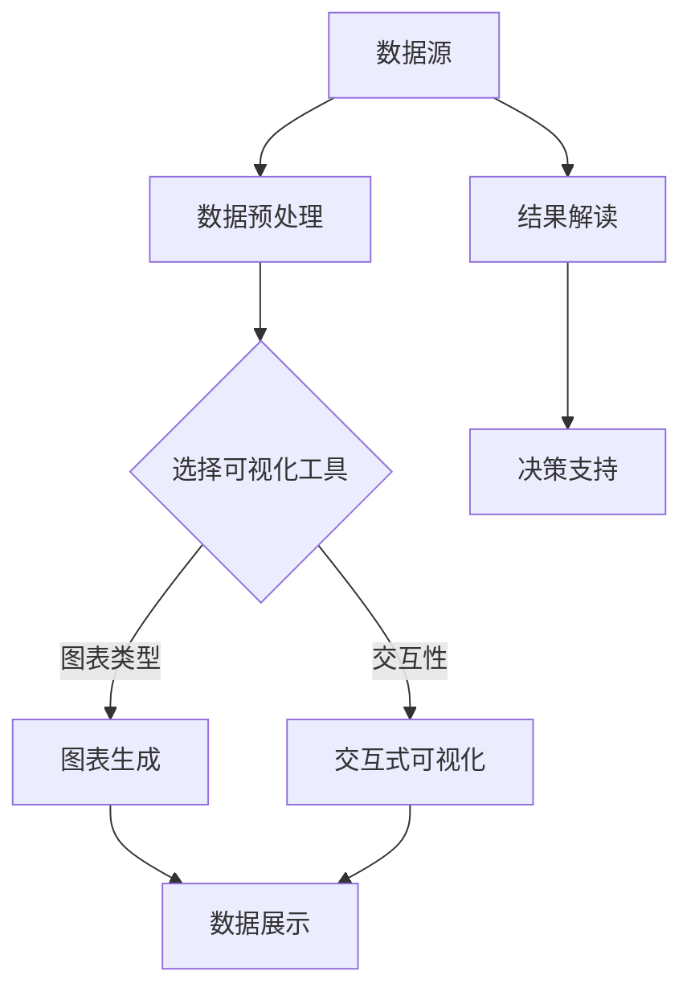

                 

### 第1章：数据可视化的基本概念

#### 1.1 数据可视化的定义与重要性

数据可视化是将数据以图形、图像、图表等形式呈现的过程，目的是通过视觉形式帮助人们更好地理解数据。数据可视化不仅仅是将数据可视化，更重要的是通过可视化手段揭示数据背后的信息和模式，从而辅助决策。

**定义**：数据可视化是指利用视觉元素，如形状、颜色、大小等，将数据转换为图表、图像等形式，使人们能够直观地理解和分析数据。

**重要性**：数据可视化在各个领域都有广泛的应用。在商业领域，数据可视化可以帮助企业更好地分析市场趋势、优化运营策略；在科学研究领域，数据可视化可以揭示实验结果、发现新现象；在公共卫生领域，数据可视化可以用于监控疫情、制定防控措施。总之，数据可视化是一种强有力的工具，能够帮助人们从海量数据中快速提取关键信息，做出更加明智的决策。

#### 1.2 数据可视化的发展历史

数据可视化的发展可以追溯到19世纪，当时科学家们开始使用图表和图形来展示数据。以下是一些关键的发展阶段：

- **早期阶段**：18世纪的英国统计学家威廉·普莱费尔（William Playfair）被认为是数据可视化的先驱，他发明了柱状图和线图。19世纪，查尔斯·约瑟夫·弗莱尔（Charles Joseph Minard）用一张精美的地图展示了拿破仑入侵俄罗斯的路径和损失。

- **计算机时代**：20世纪80年代，计算机技术的快速发展使得数据可视化工具变得更加丰富和便捷。1983年，约翰·库克（John C. Cook）发明了3D曲面图，随后涌现出许多数据可视化软件，如Excel、Tableau、Matplotlib等。

- **现代阶段**：随着大数据、人工智能和虚拟现实等技术的兴起，数据可视化技术也在不断创新。现代数据可视化工具不仅能够处理海量数据，还具备交互性和实时性，为数据分析和决策提供了更加丰富的手段。

#### 1.3 数据可视化在科学领域的应用

数据可视化在科学领域有着广泛的应用，特别是在天文学、物理学和地球科学等学科中。

- **天文学**：数据可视化技术可以展示星系的分布、恒星的运动轨迹等，帮助科学家研究宇宙的演化。

- **物理学**：数据可视化可以帮助科学家理解复杂的物理现象，如粒子碰撞、量子纠缠等。

- **地球科学**：数据可视化可以用于展示地震活动、气候变化、海洋污染等，为环境保护和灾害防治提供决策支持。

总的来说，数据可视化是一种强大的工具，它不仅使数据更加直观易懂，还能够揭示数据背后的深层信息，为科学研究、决策制定和社会发展提供重要支持。

### Mermaid 流程图



### 伪代码

```python
def data_visualization(data_source):
    """
    数据可视化主函数
    :param data_source: 数据源
    :return: 可视化结果
    """
    
    # 数据预处理
    preprocessed_data = preprocess_data(data_source)
    
    # 选择可视化工具
    visualization_tool = select_visualization_tool(preprocessed_data)
    
    # 生成可视化图表
    visualization_result = visualization_tool.generate_chart(preprocessed_data)
    
    # 展示可视化结果
    display_visualization(visualization_result)
    
    # 解读结果并支持决策
    decision_support = interpret_visualization(visualization_result)
    return decision_support
```

在接下来的章节中，我们将进一步探讨宇宙学与多重历史干涉图案的基本概念，以及数据可视化在这些领域中的应用。希望读者能够通过本章的内容对数据可视化有一个初步的了解，为后续章节的学习打下基础。

