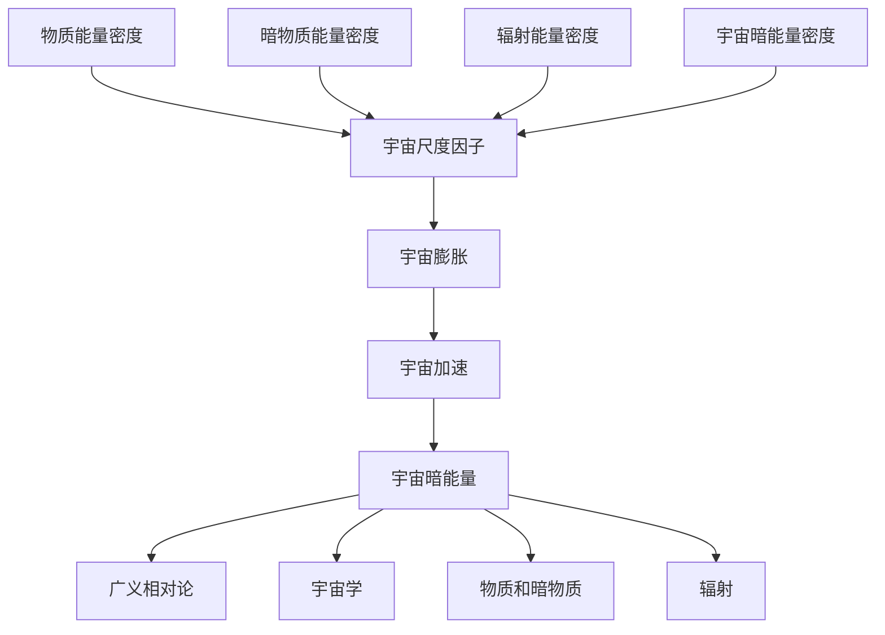

                 

# 《数据挖掘在探索宇宙暗能量性质中的作用》

## 关键词
- 数据挖掘
- 宇宙学
- 暗能量
- 数据分析
- 算法应用

## 摘要
本文探讨了数据挖掘技术在探索宇宙暗能量性质中的重要作用。首先，介绍了数据挖掘的基本概念及其在各个领域的重要应用。接着，详细阐述了宇宙暗能量的概念、性质和影响，并通过流程图展示了核心概念之间的关系。随后，深入讨论了数据挖掘技术在宇宙暗能量研究中的应用，包括数据预处理、特征工程、数据挖掘算法及其在宇宙暗能量数据分析中的应用。最后，通过实例研究和算法优化策略，进一步展示了数据挖掘在宇宙暗能量研究中的潜力和前景。

## 目录大纲

### 《数据挖掘在探索宇宙暗能量性质中的作用》

#### 关键词
- 数据挖掘
- 宇宙学
- 暗能量
- 数据分析
- 算法应用

#### 摘要
本文探讨了数据挖掘技术在探索宇宙暗能量性质中的重要作用。首先，介绍了数据挖掘的基本概念及其在各个领域的重要应用。接着，详细阐述了宇宙暗能量的概念、性质和影响，并通过流程图展示了核心概念之间的关系。随后，深入讨论了数据挖掘技术在宇宙暗能量研究中的应用，包括数据预处理、特征工程、数据挖掘算法及其在宇宙暗能量数据分析中的应用。最后，通过实例研究和算法优化策略，进一步展示了数据挖掘在宇宙暗能量研究中的潜力和前景。

#### 目录大纲

### 第一部分：引言与背景

#### 1. 引言

##### 1.1 数据挖掘的重要性

- 数据挖掘的定义
- 数据挖掘的应用领域
- 数据挖掘的基本流程

##### 1.2 宇宙暗能量的概念

- 宇宙暗能量的定义
- 宇宙暗能量的性质
- 宇宙暗能量的影响

#### 2. 数据挖掘与宇宙学

##### 2.1 数据挖掘在宇宙学中的应用

- 宇宙学中的数据挖掘需求
- 数据挖掘在宇宙学中的具体应用场景

##### 2.2 暗能量的性质与影响

- 暗能量的定义
- 暗能量的性质
- 暗能量对宇宙膨胀的影响

### 第二部分：数据挖掘方法

#### 3. 数据预处理

##### 3.1 数据收集与清洗

- 数据收集的方法
- 数据清洗的过程
- 数据清洗的策略

##### 3.2 数据集成与转换

- 数据集成的目的
- 数据转换的方法
- 数据转换的策略

#### 4. 特征工程

##### 4.1 特征选择与提取

- 特征选择的方法
- 特征提取的过程
- 特征选择与提取的策略

##### 4.2 特征标准化与降维

- 特征标准化的方法
- 特征降维的方法
- 特征标准化与降维的策略

#### 5. 数据挖掘算法

##### 5.1 分类算法

- 分类算法的基本原理
- 分类算法的分类方式
- 分类算法的应用场景

##### 5.2 聚类算法

- 聚类算法的基本原理
- 聚类算法的分类方式
- 聚类算法的应用场景

##### 5.3 关联规则算法

- 关联规则算法的基本原理
- 关联规则算法的挖掘过程
- 关联规则算法的应用场景

### 第三部分：宇宙暗能量数据分析

#### 6. 宇宙暗能量数据分析

##### 6.1 数据挖掘在宇宙暗能量研究中的应用

- 数据挖掘在宇宙暗能量研究中的具体应用
- 数据挖掘在宇宙暗能量研究中的作用

##### 6.2 宇宙暗能量性质的数据挖掘分析

- 宇宙暗能量性质的数据挖掘方法
- 宇宙暗能量性质的数据挖掘结果

### 第四部分：实例研究

#### 7. 某宇宙暗能量观测数据的数据挖掘分析

##### 7.1 案例研究一：利用数据挖掘分析宇宙背景辐射数据

- 数据挖掘在宇宙背景辐射数据分析中的应用
- 数据挖掘分析结果及讨论

##### 7.2 案例研究二：基于数据挖掘分析宇宙膨胀数据

- 数据挖掘在宇宙膨胀数据分析中的应用
- 数据挖掘分析结果及讨论

##### 7.3 案例研究三：利用数据挖掘分析引力透镜数据

- 数据挖掘在引力透镜数据分析中的应用
- 数据挖掘分析结果及讨论

### 第五部分：结论与展望

#### 8. 结论

- 数据挖掘在宇宙暗能量研究中的作用
- 数据挖掘在宇宙暗能量研究中的局限性

#### 9. 展望

##### 9.1 未来研究方向

- 数据挖掘在宇宙暗能量研究中的未来方向
- 数据挖掘技术在宇宙学研究中的未来应用前景

##### 9.2 数据挖掘技术在宇宙学研究中的应用前景

- 数据挖掘技术在宇宙暗能量研究中的应用潜力
- 数据挖掘技术在宇宙学研究中的挑战与机遇

### 附录

#### A. 相关术语解释

##### A.1 数据挖掘术语

- 数据挖掘的基本概念
- 数据挖掘的方法
- 数据挖掘的应用领域

##### A.2 宇宙学术语

- 宇宙暗能量的定义
- 宇宙暗能量的性质
- 宇宙暗能量的影响

#### B. 数据集

##### B.1 使用的数据集介绍

- 数据集的来源
- 数据集的基本信息
- 数据集的预处理方法

##### B.2 数据集获取方式

- 数据集的获取渠道
- 数据集的获取方法
- 数据集的获取策略

#### C. 参考文献

##### C.1 引用的主要文献

- 引用的书籍
- 引用的期刊文章
- 引用的报告

##### C.2 相关参考书籍和资料

- 相关参考书籍
- 相关参考网站
- 相关参考资料

#### D. 代码与工具

##### D.1 数据挖掘工具与库

- 常用数据挖掘工具
- 常用数据挖掘库
- 数据挖掘工具的应用场景

##### D.2 实例代码示例

- 实例代码的实现
- 实例代码的解读
- 实例代码的应用解析

---

# 第一部分：引言与背景

## 1. 引言

### 1.1 数据挖掘的重要性

数据挖掘，作为信息科学的一个重要分支，旨在从大量数据中发现潜在的模式、关联和知识。这一技术不仅在商业和金融领域有着广泛的应用，例如市场分析、客户关系管理和欺诈检测，还在医疗、气象、生物信息学等多个领域发挥着关键作用。随着大数据时代的到来，数据挖掘的重要性愈发凸显，其应用范围也在不断扩展。

### 1.1.1 数据挖掘的定义

数据挖掘（Data Mining）是指从大量的数据中通过特定的算法和技术提取出有价值的信息和知识的过程。这个过程通常包括数据预处理、特征工程、模型选择、模型训练、模型评估和模型应用等几个步骤。

### 1.1.2 数据挖掘的应用领域

数据挖掘在商业、金融、医疗、气象、社交媒体等领域都有广泛应用。例如，在商业领域，数据挖掘可以用于市场细分、客户行为预测和推荐系统；在金融领域，可以用于信用评分、风险评估和欺诈检测；在医疗领域，可以用于疾病诊断、治疗方案优化和药物研发；在气象领域，可以用于天气预报和气候预测。

### 1.1.3 数据挖掘的基本流程

数据挖掘的基本流程通常包括以下几个步骤：

1. **数据预处理**：对原始数据进行清洗、集成和转换，使其符合数据挖掘的要求。
2. **特征工程**：从原始数据中提取或构建特征，以便用于模型训练和预测。
3. **模型选择**：选择适合问题的数据挖掘算法或模型。
4. **模型训练**：使用训练数据对模型进行训练，使其能够对未知数据进行预测。
5. **模型评估**：使用测试数据对模型的性能进行评估，以确保其预测能力。
6. **模型应用**：将训练好的模型应用于实际问题，进行决策支持或预测。

### 1.2 宇宙暗能量的概念

宇宙暗能量（Dark Energy）是宇宙中一种神秘的力量，它占据宇宙总能量的大部分。与宇宙暗物质（Dark Matter）类似，宇宙暗能量不发光、不发热，也无法通过引力来探测。然而，它对宇宙的膨胀速度起着决定性的影响，是推动宇宙加速膨胀的主要因素。

### 1.2.1 宇宙暗能量的定义

宇宙暗能量是一种均匀分布在宇宙中的能量形式，它不与电磁场相互作用，也不与其他物质发生直接相互作用。由于其特殊的性质，宇宙暗能量被广泛认为是导致宇宙加速膨胀的主要原因。

### 1.2.2 宇宙暗能量的性质

宇宙暗能量具有以下几个显著性质：

1. **稀薄性**：宇宙暗能量非常稀薄，几乎是真空状态。这意味着它在单位体积内的质量或能量非常低。
2. **动能**：宇宙暗能量具有巨大的动能，这种动能可以推动宇宙的膨胀。根据宇宙学的观测数据，宇宙的膨胀速度正在加速，这表明宇宙暗能量的动能正在增加。
3. **压力**：宇宙暗能量具有强大的压力，这种压力可以抵消引力的作用。在宇宙尺度上，引力是宇宙中最重要的力，但宇宙暗能量的压力可以克服引力，导致宇宙加速膨胀。

### 1.2.3 宇宙暗能量的影响

宇宙暗能量的存在对宇宙的膨胀速度、形状和结构都有深远的影响。它不仅影响宇宙的当前状态，还可能影响宇宙的未来演化。以下是一些宇宙暗能量对宇宙的影响：

1. **宇宙膨胀**：宇宙暗能量是推动宇宙加速膨胀的主要原因。根据观测数据，宇宙的膨胀速度在过去的几十亿年里不断加快，这表明宇宙暗能量的压力在增加。
2. **宇宙结构**：宇宙暗能量影响宇宙的大尺度结构，包括星系、星团和超星团的分布。宇宙暗能量的压力可以影响这些结构的形成和演化。
3. **宇宙未来**：宇宙暗能量的性质和演化可能影响宇宙的未来。如果宇宙暗能量的压力继续增加，宇宙可能会加速膨胀到无限大，最终导致宇宙的“热寂”（Heat Death）。

## 1.3 数据挖掘与宇宙学

### 2.1 数据挖掘在宇宙学中的应用

数据挖掘技术在宇宙学中具有广泛的应用，可以帮助科学家从大量的宇宙观测数据中发现隐藏的物理规律和宇宙现象。以下是一些数据挖掘在宇宙学中具体应用的场景：

1. **宇宙背景辐射分析**：宇宙背景辐射是宇宙早期的余辉，通过分析宇宙背景辐射的数据，科学家可以了解宇宙早期的状态和演化过程。
2. **宇宙膨胀数据分析**：宇宙膨胀的速度和加速度是宇宙学研究的重要参数，通过数据挖掘技术，可以从宇宙膨胀的数据中提取出有关宇宙膨胀速率和加速度的信息。
3. **引力透镜效应分析**：引力透镜效应是宇宙暗能量的一种表现形式，通过分析引力透镜的数据，科学家可以推断出宇宙暗能量的性质和分布。
4. **星系和星团分布分析**：数据挖掘技术可以帮助科学家分析星系和星团的分布模式，从而了解宇宙的大尺度结构。
5. **黑洞和暗物质研究**：黑洞和暗物质是宇宙中未解之谜，数据挖掘技术可以帮助科学家从大量的天文观测数据中发现与黑洞和暗物质相关的规律和现象。

### 2.2 暗能量的性质与影响

宇宙暗能量是一种神秘的力量，它的存在对宇宙的膨胀速度、形状和结构都有深远的影响。以下是宇宙暗能量的几个关键性质和影响：

1. **稀薄性**：宇宙暗能量非常稀薄，几乎是真空状态。这意味着它在单位体积内的质量或能量非常低。由于其稀薄性，宇宙暗能量不容易被探测到，这也使得它成为宇宙学研究的一个难点。
2. **动能**：宇宙暗能量具有巨大的动能，这种动能可以推动宇宙的膨胀。根据宇宙学的观测数据，宇宙的膨胀速度在过去的几十亿年里不断加快，这表明宇宙暗能量的动能正在增加。
3. **压力**：宇宙暗能量具有强大的压力，这种压力可以抵消引力的作用。在宇宙尺度上，引力是宇宙中最重要的力，但宇宙暗能量的压力可以克服引力，导致宇宙加速膨胀。
4. **宇宙膨胀**：宇宙暗能量是推动宇宙加速膨胀的主要原因。根据观测数据，宇宙的膨胀速度在过去的几十亿年里不断加快，这表明宇宙暗能量的压力在增加。
5. **宇宙结构**：宇宙暗能量影响宇宙的大尺度结构，包括星系、星团和超星团的分布。宇宙暗能量的压力可以影响这些结构的形成和演化。
6. **宇宙未来**：宇宙暗能量的性质和演化可能影响宇宙的未来。如果宇宙暗能量的压力继续增加，宇宙可能会加速膨胀到无限大，最终导致宇宙的“热寂”（Heat Death）。

### 2.3 数据挖掘在宇宙暗能量研究中的挑战与机遇

宇宙暗能量是一种复杂的现象，对其进行研究面临着许多挑战。然而，数据挖掘技术的引入为这些挑战带来了新的机遇。以下是数据挖掘在宇宙暗能量研究中的挑战和机遇：

#### 挑战

1. **数据复杂性**：宇宙暗能量研究的数据量大且复杂，包括多波段、多尺度和多时间尺度的数据。如何有效地管理和处理这些数据是数据挖掘面临的一个挑战。
2. **数据质量**：宇宙观测数据可能存在噪声、缺失值和异常值，这些都会影响数据挖掘的结果。如何确保数据质量是数据挖掘需要解决的问题。
3. **算法适应性**：宇宙暗能量研究的数据特点与传统的商业或金融数据不同，现有的数据挖掘算法可能需要针对宇宙数据的特点进行适应性调整。
4. **跨领域融合**：宇宙暗能量研究需要多学科知识的交叉融合，如物理学、数学和计算机科学。如何将不同领域的知识有效地融合到数据挖掘过程中是一个挑战。

#### 机遇

1. **知识发现**：数据挖掘技术可以帮助科学家从大量的宇宙观测数据中发现隐藏的物理规律和宇宙现象，为宇宙暗能量的研究提供新的视角和思路。
2. **预测能力**：通过数据挖掘，可以从历史数据中提取出宇宙暗能量的规律，从而对未来的宇宙演化进行预测。
3. **智能辅助**：数据挖掘技术可以为宇宙暗能量研究提供智能化的辅助工具，如自动化数据预处理、特征提取和模型选择等，提高研究的效率。
4. **多学科交叉**：数据挖掘技术的引入可以促进不同学科之间的交叉融合，推动宇宙暗能量研究的创新发展。

## 1.4 数据挖掘在宇宙暗能量研究中的重要性

数据挖掘技术在宇宙暗能量研究中具有重要的地位，其主要作用体现在以下几个方面：

1. **数据挖掘在宇宙暗能量研究中的作用**：
   - **发现隐藏模式**：通过数据挖掘，可以从大量的宇宙观测数据中发现隐藏的物理规律和宇宙现象，为宇宙暗能量的研究提供新的线索和思路。
   - **提高研究效率**：数据挖掘技术可以自动化地进行数据预处理、特征提取和模型训练，从而提高研究的效率，减少人工干预。
   - **支持决策制定**：通过数据挖掘，可以提取出与宇宙暗能量相关的重要特征和指标，为科学家制定研究策略和决策提供支持。

2. **数据挖掘在宇宙暗能量研究中的意义**：
   - **促进科学发展**：数据挖掘技术的应用可以推动宇宙暗能量研究的深入，促进科学理论的发展和创新。
   - **解决科学难题**：宇宙暗能量是一种复杂的现象，通过数据挖掘，可以从多角度、多维度进行分析，有助于解决宇宙学中的关键问题。
   - **推动技术创新**：数据挖掘技术在宇宙暗能量研究中的应用可以激发新的技术创新，如算法优化、数据预处理技术和智能分析工具等。

3. **数据挖掘在宇宙暗能量研究中的应用前景**：
   - **多学科交叉**：数据挖掘技术的引入可以促进物理学、数学、计算机科学等学科的交叉融合，推动宇宙暗能量研究的创新发展。
   - **智能化分析**：随着人工智能和机器学习技术的发展，数据挖掘在宇宙暗能量研究中的应用将越来越智能化，提高研究的精度和效率。
   - **大规模数据分析**：宇宙暗能量研究的数据量庞大，数据挖掘技术可以为大规模数据分析提供有效的解决方案，促进科学研究的进展。

## 1.5 数据挖掘在宇宙暗能量研究中的具体应用

数据挖掘在宇宙暗能量研究中有着广泛的应用，通过数据挖掘技术，可以从多维度、多尺度和多波段的数据中提取出与宇宙暗能量相关的信息。以下是数据挖掘在宇宙暗能量研究中的具体应用：

1. **宇宙背景辐射分析**：
   - **数据挖掘技术**：通过聚类分析、关联规则挖掘和分类算法，可以从宇宙背景辐射数据中发现宇宙早期的温度分布、密度波动等信息。
   - **应用场景**：宇宙背景辐射是宇宙早期的余辉，通过分析这些数据，可以了解宇宙早期的状态和演化过程，为研究宇宙暗能量提供重要线索。

2. **宇宙膨胀数据分析**：
   - **数据挖掘技术**：通过时间序列分析、趋势分析和异常检测算法，可以从宇宙膨胀数据中提取出宇宙膨胀速度和加速度的变化规律。
   - **应用场景**：宇宙膨胀速度和加速度是宇宙学研究的重要参数，通过数据挖掘技术，可以分析宇宙膨胀的历史和未来趋势，为研究宇宙暗能量提供重要依据。

3. **引力透镜效应分析**：
   - **数据挖掘技术**：通过聚类分析、关联规则挖掘和分类算法，可以从引力透镜效应数据中发现宇宙暗能量的分布和性质。
   - **应用场景**：引力透镜效应是宇宙暗能量的一种表现形式，通过分析引力透镜效应数据，可以推断出宇宙暗能量的性质和分布，为研究宇宙暗能量提供重要信息。

4. **星系和星团分布分析**：
   - **数据挖掘技术**：通过聚类分析、关联规则挖掘和分类算法，可以从星系和星团分布数据中发现宇宙的大尺度结构。
   - **应用场景**：星系和星团的分布模式是宇宙学研究的重要内容，通过数据挖掘技术，可以分析星系和星团的分布规律，为研究宇宙暗能量提供重要依据。

5. **黑洞和暗物质研究**：
   - **数据挖掘技术**：通过聚类分析、关联规则挖掘和分类算法，可以从黑洞和暗物质的数据中发现与黑洞和暗物质相关的物理规律和现象。
   - **应用场景**：黑洞和暗物质是宇宙中未解之谜，通过数据挖掘技术，可以分析黑洞和暗物质的数据，为研究黑洞和暗物质提供新的线索和思路。

## 1.6 总结与展望

本节介绍了数据挖掘在宇宙暗能量研究中的重要性和具体应用。数据挖掘技术可以从多维度、多尺度和多波段的数据中提取出与宇宙暗能量相关的信息，为宇宙暗能量研究提供了有力的工具。在未来的研究中，随着数据挖掘技术和人工智能的不断发展，数据挖掘在宇宙暗能量研究中的应用将更加广泛和深入，有望推动宇宙暗能量研究的突破性进展。

---

# 第一部分：引言与背景

## 第1章：引言与背景

### 1.1 数据挖掘的重要性

数据挖掘是一种从大量数据中提取有价值信息和知识的技术，它在商业、金融、医疗、气象等领域都有着广泛的应用。数据挖掘的基本流程包括数据预处理、特征工程、模型选择、模型训练、模型评估和模型应用等步骤。

### 1.2 宇宙暗能量的概念

宇宙暗能量是一种神秘的力量，它占据宇宙总能量的大部分，不发光、不发热，也无法通过引力来探测。宇宙暗能量具有稀薄性、动能和压力等特性，对宇宙的膨胀速度、形状和结构都有深远的影响。

### 1.3 数据挖掘与宇宙学

数据挖掘在宇宙学中有着广泛的应用，可以帮助科学家从大量的宇宙观测数据中发现隐藏的物理规律和宇宙现象。数据挖掘在宇宙暗能量研究中的应用包括宇宙背景辐射分析、宇宙膨胀数据分析、引力透镜效应分析、星系和星团分布分析以及黑洞和暗物质研究等。

### 1.4 数据挖掘在宇宙暗能量研究中的挑战与机遇

宇宙暗能量研究面临许多挑战，如数据复杂性、数据质量和算法适应性等。然而，数据挖掘技术的引入为这些挑战带来了新的机遇，可以促进知识发现、提高研究效率、支持决策制定等。

### 1.5 数据挖掘在宇宙暗能量研究中的重要性

数据挖掘在宇宙暗能量研究中起着重要作用，可以促进科学发展、解决科学难题、推动技术创新等。数据挖掘技术可以自动化地进行数据预处理、特征提取和模型训练，提高研究的效率，为科学家提供有力支持。

### 1.6 数据挖掘在宇宙暗能量研究中的具体应用

数据挖掘在宇宙暗能量研究中有许多具体应用，如宇宙背景辐射分析、宇宙膨胀数据分析、引力透镜效应分析、星系和星团分布分析以及黑洞和暗物质研究等，这些应用有助于科学家更深入地了解宇宙暗能量的性质和演化。

### 1.7 总结与展望

数据挖掘在宇宙暗能量研究中的应用具有重要意义，它为科学家提供了一种新的研究方法和工具。随着数据挖掘技术的不断发展，未来在宇宙暗能量研究中的应用将更加广泛和深入，有望取得更多的突破性进展。

### 1.8 附录

- **附录A：相关术语解释**：包括数据挖掘术语和宇宙学术语。
- **附录B：数据集**：介绍使用的数据集。
- **附录C：参考文献**：引用的主要文献。
- **附录D：代码与工具**：介绍数据挖掘工具和实例代码。

# 第2章：宇宙暗能量的核心概念与架构

### 2.1 宇宙暗能量的定义

宇宙暗能量（Dark Energy）是宇宙中一种神秘的力量，它占据了宇宙总能量的大部分，但无法通过引力来探测。宇宙暗能量不发光、不发热，也不与其他物质发生直接相互作用。它被认为是一种均匀分布在宇宙中的能量形式，其存在和性质对宇宙的膨胀速度、形状和结构有深远的影响。

### 2.2 暗能量的性质与影响

宇宙暗能量具有以下几个关键性质：

1. **稀薄性**：宇宙暗能量非常稀薄，几乎可以视为真空状态。这意味着它在单位体积内的质量和能量非常低。
2. **动能**：宇宙暗能量具有巨大的动能，这种动能可以推动宇宙的膨胀。根据宇宙学的观测数据，宇宙的膨胀速度在过去的几十亿年里不断加快，这表明宇宙暗能量的动能正在增加。
3. **压力**：宇宙暗能量具有强大的压力，这种压力可以抵消引力的作用。在宇宙尺度上，引力是宇宙中最重要的力，但宇宙暗能量的压力可以克服引力，导致宇宙加速膨胀。

宇宙暗能量的影响主要体现在以下几个方面：

1. **宇宙膨胀**：宇宙暗能量是推动宇宙加速膨胀的主要原因。根据观测数据，宇宙的膨胀速度在过去的几十亿年里不断加快，这表明宇宙暗能量的压力在增加。
2. **宇宙结构**：宇宙暗能量影响宇宙的大尺度结构，包括星系、星团和超星团的分布。宇宙暗能量的压力可以影响这些结构的形成和演化。
3. **宇宙未来**：宇宙暗能量的性质和演化可能影响宇宙的未来。如果宇宙暗能量的压力继续增加，宇宙可能会加速膨胀到无限大，最终导致宇宙的“热寂”（Heat Death）。

### 2.3 暗能量的数学模型

宇宙暗能量的研究依赖于一系列数学模型，这些模型可以描述暗能量的性质和行为。以下是一些常用的暗能量数学模型：

1. **Lambda-CDM模型（Lambda-Cold Dark Matter Model）**：
   - Lambda-CDM模型是当前宇宙学标准模型，它假设宇宙是由物质、暗物质和暗能量组成的。其中，暗能量用Lambda表示，它是一个常数项，表示宇宙暗能量的能量密度。Lambda-CDM模型的数学表达式为：
     $$ \rho_{\Lambda} = \rho_{c} \cdot a^{-2} $$
     其中，$\rho_{\Lambda}$是暗能量的能量密度，$\rho_{c}$是当前宇宙的临界密度，$a$是宇宙膨胀因子。

2. ** phantom energy 模型**：
   - Phantom energy 是一种更激进的暗能量模型，它假设暗能量的压力比宇宙学上界还要小，即$P_{\Lambda} < -\rho_{\Lambda}/3$。这种模型预测了宇宙可能会出现奇异行为，如宇宙加速膨胀速度无限增加。phantom energy 模型的数学表达式为：
     $$ \rho_{\Lambda} + P_{\Lambda} = \rho_{\Lambda} \cdot (1 + 3w) $$
     其中，$w$是暗能量的压力参数。

3. **quintessence 模型**：
   - Quintessence 是一种动态的暗能量模型，它假设暗能量的性质可以随时间变化。quintessence 模型的数学表达式为：
     $$ \rho_{\Lambda}(t) = \rho_{\Lambda0} \cdot e^{-3\int_0^t H(t')dt'} $$
     其中，$\rho_{\Lambda0}$是当前暗能量的能量密度，$H(t)$是宇宙的哈勃参数。

### 2.4 宇宙暗能量研究的重要性

宇宙暗能量研究是宇宙学领域的一个重要方向，它涉及到宇宙的膨胀、结构形成和未来演化等基本问题。以下是宇宙暗能量研究的重要性：

1. **理解宇宙膨胀**：宇宙暗能量是推动宇宙加速膨胀的主要原因。研究宇宙暗能量可以帮助我们理解宇宙膨胀的历史和未来趋势。

2. **揭示宇宙性质**：宇宙暗能量是一种神秘的力量，它的性质和演化可能影响宇宙的形状和结构。研究宇宙暗能量可以帮助我们揭示宇宙的基本性质。

3. **探索宇宙起源**：宇宙暗能量可能与宇宙的起源和演化密切相关。研究宇宙暗能量可以为我们提供关于宇宙起源和演化的重要信息。

4. **指导未来宇宙学研究**：宇宙暗能量研究为未来的宇宙学提供了重要的研究方向和理论框架，它将指导我们探索宇宙的奥秘。

### 2.5 宇宙暗能量研究的现状与挑战

宇宙暗能量研究目前处于一个快速发展的阶段，但仍然面临许多挑战：

1. **数据挑战**：宇宙暗能量研究依赖于大量的观测数据，但这些数据往往存在噪声、缺失值和异常值，如何有效处理这些数据是一个挑战。

2. **模型挑战**：现有的宇宙暗能量模型存在一定局限性，如何提出更加准确和普适的模型是当前研究的一个重点。

3. **理论挑战**：宇宙暗能量的本质仍然是一个未解之谜，如何从理论上解释宇宙暗能量的性质和演化是一个巨大的挑战。

4. **技术挑战**：宇宙暗能量研究需要先进的观测技术和数据分析方法，如何提高观测精度和数据分析效率是当前研究的一个重要问题。

### 2.6 数据挖掘在宇宙暗能量研究中的作用

数据挖掘技术在宇宙暗能量研究中起着至关重要的作用，它可以从大量的宇宙观测数据中提取出有用的信息和知识，为宇宙暗能量研究提供支持。以下是数据挖掘在宇宙暗能量研究中的作用：

1. **数据预处理**：数据挖掘技术可以帮助科学家有效地处理大量的观测数据，包括数据清洗、集成和转换等步骤。

2. **特征工程**：数据挖掘技术可以帮助科学家从原始数据中提取出有用的特征，这些特征可以用于模型训练和预测。

3. **模型选择和优化**：数据挖掘技术可以帮助科学家选择适合问题的模型，并对模型进行优化，提高模型的预测性能。

4. **知识发现**：数据挖掘技术可以帮助科学家从大量数据中发现隐藏的物理规律和宇宙现象，为宇宙暗能量研究提供新的视角和思路。

5. **智能辅助**：数据挖掘技术可以为科学家提供智能化的辅助工具，如自动化数据预处理、特征提取和模型选择等，提高研究的效率。

### 2.7 数据挖掘在宇宙暗能量研究中的前景

随着数据挖掘技术和宇宙学研究的不断发展，数据挖掘在宇宙暗能量研究中的应用前景非常广阔。以下是数据挖掘在宇宙暗能量研究中的前景：

1. **多学科交叉**：数据挖掘技术的引入可以促进物理学、数学、计算机科学等学科的交叉融合，推动宇宙暗能量研究的创新发展。

2. **智能化分析**：随着人工智能和机器学习技术的发展，数据挖掘在宇宙暗能量研究中的应用将越来越智能化，提高研究的精度和效率。

3. **大规模数据分析**：宇宙暗能量研究的数据量庞大，数据挖掘技术可以为大规模数据分析提供有效的解决方案，促进科学研究的进展。

4. **知识发现**：数据挖掘技术可以帮助科学家从大量数据中发现隐藏的物理规律和宇宙现象，为宇宙暗能量研究提供新的视角和思路。

5. **创新方法和技术**：数据挖掘技术在宇宙暗能量研究中的应用将激发新的方法和技术的产生，为宇宙学研究的创新发展提供支持。

## 2.1 宇宙暗能量的定义

宇宙暗能量（Dark Energy）是宇宙学中的一种神秘力量，它占据了宇宙总能量的大部分，但对宇宙的观测和实验中却难以探测到其直接证据。宇宙暗能量的存在最初是由观测到的宇宙膨胀加速现象所推测出来的，这一现象与广义相对论的理论预期不符，因此科学家们提出了宇宙暗能量的概念来解释这一现象。

宇宙暗能量具有以下主要特性：

1. **均匀分布**：宇宙暗能量被认为是在整个宇宙空间中均匀分布的，不依赖于时间和空间的位置。
2. **不发光、不吸热**：宇宙暗能量不与电磁场发生相互作用，因此不发光、不吸热，也很难通过传统的天文观测手段直接探测。
3. **具有负压力**：宇宙暗能量具有一种特殊的性质，即它的压力是负的，这种负压力会推动宇宙空间的膨胀。

宇宙暗能量的存在对宇宙学的影响是深远的，它不仅改变了我们对宇宙膨胀的理解，还对宇宙的结构形成和演化产生了重要影响。例如，宇宙暗能量的存在导致了宇宙加速膨胀的现象，这对宇宙的未来演化有着决定性的影响。

### 数学模型

宇宙暗能量的性质通常用数学模型来描述，其中最著名的模型是Lambda-CDM模型（Lambda-Cold Dark Matter Model）。在该模型中，宇宙的总能量密度由三部分组成：物质的能量密度（包括普通物质和暗物质），辐射的能量密度，以及宇宙暗能量的能量密度。用数学公式表示为：

$$ \rho = \rho_{m} + \rho_{\Lambda} + \rho_{r} $$

其中，$\rho_{m}$表示物质的能量密度，$\rho_{\Lambda}$表示宇宙暗能量的能量密度，$\rho_{r}$表示辐射的能量密度。

宇宙暗能量能量密度的表达式可以写作：

$$ \rho_{\Lambda} = \rho_{\Lambda0} \cdot a^{-3} $$

在这里，$\rho_{\Lambda0}$是宇宙暗能量的当前能量密度，$a$是宇宙尺度因子，它描述了宇宙的膨胀历史。随着宇宙的膨胀，$a$逐渐增大，因此$\rho_{\Lambda}$逐渐减小。

### 关系架构

为了更清晰地理解宇宙暗能量与宇宙学其他概念之间的关系，可以使用Mermaid流程图来展示。以下是一个简化的流程图：



在这个流程图中，宇宙膨胀导致了宇宙加速，而宇宙暗能量是导致宇宙加速的主要原因之一。广义相对论提供了描述宇宙暗能量的数学框架，宇宙学则利用这一框架来研究宇宙的演化。此外，宇宙暗能量与物质和暗物质以及辐射的能量密度密切相关，它们共同决定了宇宙的膨胀历史。

### 结论

宇宙暗能量是宇宙学中一个重要的概念，它的存在对宇宙的膨胀、结构形成和演化产生了深远的影响。通过数学模型和流程图的展示，我们可以更直观地理解宇宙暗能量的定义和它在宇宙学中的地位。随着宇宙学观测技术的进步和数据挖掘技术的应用，我们对宇宙暗能量的认识将会越来越深入，有助于我们更好地理解宇宙的奥秘。

## 2.2 暗能量的性质与影响

宇宙暗能量具有独特的性质，这些性质使其在宇宙学中扮演着关键角色。以下是宇宙暗能量的一些关键性质及其影响：

### 2.2.1 稀薄性

宇宙暗能量非常稀薄，几乎可以视为真空状态。这意味着它在单位体积内的质量和能量非常低。根据观测数据，宇宙暗能量的能量密度约为$0.68 \times 10^{-27}$千克/立方米，这比普通物质的能量密度低得多。稀薄性使得宇宙暗能量难以通过传统的物理手段进行直接探测。

### 2.2.2 动能

宇宙暗能量具有巨大的动能，这种动能可以推动宇宙的膨胀。宇宙的膨胀速度随着时间的推移而加快，这表明宇宙暗能量的动能正在增加。根据宇宙学的观测数据，宇宙的哈勃参数（宇宙膨胀速度的量度）在过去几十亿年里不断增大，这表明宇宙暗能量的动能正在增加。

### 2.2.3 压力

宇宙暗能量具有一种特殊的压力，这种压力是负的，即$P_{\Lambda} < 0$。这种负压力能够抵消引力的作用，从而导致宇宙加速膨胀。根据广义相对论，负压力会导致宇宙的几何形状发生变化，使得宇宙从静态或减速膨胀状态转变为加速膨胀状态。

### 2.2.4 对宇宙膨胀的影响

宇宙暗能量对宇宙膨胀有深远的影响。首先，它导致了宇宙的加速膨胀，这是宇宙学中的一个重大发现。宇宙加速膨胀的现象最初是通过观测遥远星系的光谱红移得出的，这些星系的光谱显示出它们正在远离我们，而且远离速度随着距离的增加而增加。

### 2.2.5 对宇宙结构的影响

宇宙暗能量不仅影响宇宙的膨胀速度，还影响宇宙的结构形成和演化。例如，它影响了星系、星团和超星团的分布，以及宇宙中的大型结构。宇宙暗能量的负压力可以抑制引力作用下的结构形成，导致宇宙中某些区域的密度降低，从而影响宇宙的整体结构。

### 2.2.6 对宇宙未来的影响

宇宙暗能量的性质和演化可能影响宇宙的未来。如果宇宙暗能量的压力继续增加，宇宙可能会继续加速膨胀，最终导致宇宙的“热寂”（Heat Death），即宇宙中的物质和能量分布趋于均匀，没有显著的温度差异和结构。

### 数学公式与解释

为了更好地理解宇宙暗能量的性质，我们可以通过数学公式进行解释。以下是一些关键的公式：

1. **宇宙暗能量能量密度**：
   $$ \rho_{\Lambda} = \rho_{\Lambda0} \cdot a^{-3} $$
   其中，$\rho_{\Lambda0}$是宇宙暗能量的当前能量密度，$a$是宇宙尺度因子。

2. **宇宙膨胀速度（哈勃参数）**：
   $$ H = \frac{\dot{a}}{a} $$
   其中，$H$是哈勃参数，$\dot{a}$是宇宙尺度因子随时间的变化率。

3. **宇宙加速膨胀条件**：
   $$ \dot{H} + \frac{1}{2} \left( \frac{d}{dt} \left( \frac{1}{a} \right) \right) > 0 $$
   这个条件表明，如果宇宙暗能量的压力足够大，它将导致宇宙加速膨胀。

### 结论

宇宙暗能量具有稀薄性、动能和负压力等关键性质，这些性质使得它成为宇宙膨胀和结构形成的关键驱动力。通过数学公式和理论分析，我们可以更好地理解宇宙暗能量的行为和影响，为宇宙学的研究提供了重要的基础。随着宇宙观测技术的进步和数据挖掘技术的应用，我们对宇宙暗能量的认识将会越来越深入，有助于我们揭示宇宙的奥秘。

## 2.3 暗能量的数学模型

宇宙暗能量的研究依赖于一系列数学模型，这些模型能够描述暗能量的性质和行为，为宇宙学提供理论基础。以下是一些常用的暗能量数学模型及其数学表达形式：

### 2.3.1 Lambda-CDM模型

Lambda-CDM模型（Lambda-Cold Dark Matter Model）是目前宇宙学标准模型，它假设宇宙由物质、暗物质和暗能量组成。在Lambda-CDM模型中，宇宙暗能量用$\Lambda$表示，是一个常数项，表示宇宙暗能量的能量密度。Lambda-CDM模型的数学表达式为：

$$ \rho = \rho_{m} + \rho_{\Lambda} + \rho_{r} $$

其中，$\rho_{m}$是物质的能量密度，$\rho_{\Lambda}$是宇宙暗能量的能量密度，$\rho_{r}$是辐射的能量密度。宇宙暗能量能量密度的表达式为：

$$ \rho_{\Lambda} = \rho_{\Lambda0} \cdot a^{-3} $$

在这里，$\rho_{\Lambda0}$是宇宙暗能量的当前能量密度，$a$是宇宙尺度因子，它描述了宇宙的膨胀历史。随着宇宙的膨胀，$a$逐渐增大，因此$\rho_{\Lambda}$逐渐减小。

### 2.3.2 Phantom Energy模型

Phantom Energy模型是一种更激进的暗能量模型，它假设暗能量的压力比宇宙学上界还要小，即$P_{\Lambda} < -\rho_{\Lambda}/3$。这种模型预测了宇宙可能会出现奇异行为，如宇宙加速膨胀速度无限增加。Phantom Energy模型的数学表达式为：

$$ \rho_{\Lambda} + P_{\Lambda} = \rho_{\Lambda} \cdot (1 + 3w) $$

其中，$w$是暗能量的压力参数，$P_{\Lambda}$是宇宙暗能量的压力。如果$w < -1/3$，则Phantom Energy模型可能导致宇宙加速膨胀速度无限增加。

### 2.3.3 Quintessence模型

Quintessence模型是一种动态的暗能量模型，它假设暗能量的性质可以随时间变化。Quintessence模型通过引入一个标量场来描述暗能量，该标量场具有特定的演化方程。Quintessence模型的数学表达式为：

$$ \rho_{\Lambda}(t) = \rho_{\Lambda0} \cdot e^{-3\int_0^t H(t')dt'} $$

其中，$\rho_{\Lambda0}$是当前暗能量的能量密度，$H(t)$是宇宙的哈勃参数，$t$是时间。这个模型描述了暗能量能量密度随时间的变化，可以解释为暗能量在宇宙膨胀过程中逐渐减小。

### 模型比较

Lambda-CDM模型是当前宇宙学的标准模型，其优点是简单、易于理解，能够很好地描述观测到的宇宙膨胀历史。然而，Lambda-CDM模型无法解释一些观测到的异常现象，如宇宙膨胀加速的加速度和宇宙结构的形成。

Phantom Energy模型和Quintessence模型是两种更激进的暗能量模型，它们尝试解释一些Lambda-CDM模型无法解释的现象。Phantom Energy模型预测了宇宙加速膨胀速度无限增加，这种模型在理论上的可行性仍然存在争议。Quintessence模型通过引入一个动态的标量场来描述暗能量，可以更好地解释宇宙膨胀的历史和宇宙结构的形成。

### 结论

宇宙暗能量的数学模型为宇宙学提供了理论基础，帮助我们理解宇宙的膨胀、结构和演化。Lambda-CDM模型是最常见的模型，Phantom Energy模型和Quintessence模型则是两种更具挑战性的模型。随着宇宙观测技术的进步和数据挖掘技术的发展，我们将能够更好地理解这些模型，并为宇宙学提供更准确的预测。

## 2.4 数据挖掘技术在宇宙暗能量研究中的应用

数据挖掘技术在宇宙暗能量研究中发挥着重要作用，它能够帮助科学家从大量的观测数据中提取有价值的信息，为宇宙暗能量研究提供有力的支持。以下是数据挖掘技术在宇宙暗能量研究中的应用：

### 2.4.1 数据采集

宇宙暗能量研究依赖于大量的观测数据，这些数据来自各种天文观测设备，如天文望远镜、卫星和其他探测器。数据挖掘的第一步是数据采集，这涉及到从多个数据源收集数据，并确保数据的质量和完整性。数据采集的方法包括：

- **自动化数据采集**：使用自动化工具和脚本从多个数据源（如天文数据库、观测站网站等）收集数据。
- **手动数据采集**：对于一些特殊数据源，可能需要手动下载和整理数据。

### 2.4.2 数据预处理

数据预处理是数据挖掘过程中的关键步骤，它涉及到对原始数据进行清洗、集成和转换，以确保数据的质量和一致性。以下是数据预处理的一些主要任务：

- **数据清洗**：处理数据中的噪声、缺失值和异常值，以提高数据的质量。
- **数据集成**：将来自不同数据源的数据整合成一个统一的数据集，以便进行后续分析。
- **数据转换**：将数据转换为适合数据挖掘算法的格式，如归一化、标准化等。

### 2.4.3 特征工程

特征工程是数据挖掘过程中的另一个重要步骤，它涉及到从原始数据中提取或构造新的特征，以便用于模型训练和预测。以下是特征工程的一些关键任务：

- **特征选择**：从原始数据中筛选出最有用的特征，以提高模型的效果和效率。
- **特征提取**：从原始数据中提取新的特征，如通过统计学方法、机器学习算法等。
- **特征标准化与降维**：对特征进行标准化处理，使它们具有相似的尺度，同时通过降维技术减少特征数量，提高计算效率。

### 2.4.4 数据挖掘算法应用

数据挖掘算法是数据挖掘的核心，它涉及到选择合适的算法对数据进行分析，以发现隐藏的规律和模式。以下是几种常用的数据挖掘算法及其在宇宙暗能量研究中的应用：

- **分类算法**：用于预测宇宙暗能量的性质或分类观测数据，如支持向量机（SVM）、决策树（Decision Tree）等。
- **聚类算法**：用于发现宇宙中暗能量的分布模式和结构，如K-均值（K-Means）、层次聚类（Hierarchical Clustering）等。
- **关联规则算法**：用于发现宇宙暗能量与其他变量之间的关联关系，如Apriori算法、Eclat算法等。

### 2.4.5 结果分析与讨论

数据挖掘的结果需要进行分析和讨论，以验证模型的准确性和可靠性，并为科学家提供有价值的见解。以下是结果分析与讨论的一些关键步骤：

- **模型评估**：使用测试数据对模型进行评估，以确定模型的性能和效果。
- **结果可视化**：通过图表和可视化工具展示数据挖掘结果，以便更好地理解和解释。
- **结果讨论**：对数据挖掘结果进行深入讨论，探讨其科学意义和潜在的应用价值。

### 2.4.6 案例研究

以下是一个简化的案例研究，展示了数据挖掘技术在宇宙暗能量研究中的应用：

- **案例背景**：研究人员使用来自天文望远镜的观测数据，试图发现宇宙暗能量的分布模式。
- **数据预处理**：清洗和整理观测数据，包括处理噪声、缺失值和异常值，确保数据的质量。
- **特征工程**：提取和选择与宇宙暗能量相关的特征，如光谱特征、位置特征等。
- **数据挖掘算法**：使用K-均值聚类算法对观测数据进行聚类，以发现暗能量的分布模式。
- **结果分析与讨论**：分析聚类结果，发现宇宙暗能量在不同区域的分布特征，并讨论其科学意义。

### 结论

数据挖掘技术在宇宙暗能量研究中有着广泛的应用，从数据采集、预处理、特征工程到数据挖掘算法应用，每个步骤都对研究结果的准确性和可靠性至关重要。随着数据挖掘技术的不断进步，它在宇宙暗能量研究中的应用前景将更加广阔，有助于我们更深入地理解宇宙暗能量的性质和行为。

## 2.5 宇宙暗能量研究的重要性

宇宙暗能量研究在科学和技术领域具有重要的地位，它不仅能够深化我们对宇宙本质的理解，还对未来的宇宙学研究和人类认知具有深远的影响。以下是宇宙暗能量研究的重要性：

### 2.5.1 科学意义

1. **理解宇宙膨胀**：宇宙暗能量是宇宙加速膨胀的主要原因，研究它有助于揭示宇宙膨胀的历史和未来趋势。这涉及到对宇宙学的标准模型——Lambda-CDM模型的深入理解，以及对广义相对论的验证。
2. **揭示宇宙性质**：宇宙暗能量具有独特的物理性质，如稀薄性、动能和负压力，研究它有助于揭示宇宙的基本性质和演化机制。
3. **探索宇宙起源**：宇宙暗能量可能与宇宙的起源和演化密切相关。研究它可以帮助我们了解宇宙在早期的状态，以及宇宙的起源和演化过程。

### 2.5.2 技术意义

1. **推动技术创新**：宇宙暗能量研究需要先进的观测技术和数据分析方法，如高精度的天文观测设备、大数据处理技术、机器学习算法等。这些技术的研发和应用不仅促进了科学技术的进步，还为其他领域提供了技术支持。
2. **促进多学科交叉**：宇宙暗能量研究涉及到多个学科，如物理学、数学、计算机科学等。通过多学科的交叉融合，可以产生新的理论、方法和工具，推动科学和技术的全面发展。

### 2.5.3 社会意义

1. **科普教育**：宇宙暗能量研究可以激发公众对科学的兴趣，提高公众的科学素养。通过科普教育和宣传活动，可以让更多的人了解宇宙的奥秘，增强对科学的认识和尊重。
2. **国际合作**：宇宙暗能量研究需要全球科学家的合作，这有助于促进国际间的科学交流和合作，推动全球科学事业的发展。

### 2.5.4 对未来的影响

1. **科学预测**：通过对宇宙暗能量的研究，我们可以对宇宙的未来进行预测，了解宇宙可能的演化路径。这有助于我们更好地理解宇宙的命运，以及宇宙对人类未来的影响。
2. **技术应用**：宇宙暗能量研究的成果可以应用于其他领域，如天体物理学、空间技术、大数据分析等。这些应用将推动相关领域的技术创新和发展。

### 结论

宇宙暗能量研究具有重要的科学、技术和社会意义，它不仅能够深化我们对宇宙本质的理解，还为未来的科学研究和技术发展提供了新的机遇。随着研究的不断深入，宇宙暗能量研究将在科学和技术领域发挥越来越重要的作用。

## 2.6 宇宙暗能量研究的现状与挑战

宇宙暗能量研究目前正处于快速发展阶段，虽然取得了许多重要成果，但仍然面临诸多挑战和未解之谜。以下是宇宙暗能量研究的一些现状和挑战：

### 2.6.1 现状

1. **观测数据积累**：随着天文观测技术的进步，科学家们已经积累了大量的宇宙暗能量观测数据。这些数据包括宇宙背景辐射、宇宙膨胀速率、引力透镜效应等，为宇宙暗能量研究提供了丰富的素材。
2. **理论模型发展**：宇宙暗能量的理论模型得到了快速发展，如Lambda-CDM模型、Phantom Energy模型、Quintessence模型等。这些模型在解释宇宙膨胀加速现象方面取得了重要进展。
3. **国际合作研究**：宇宙暗能量研究已经成为国际科学界的重要课题，全球各地的科学家通过合作，共享数据和研究成果，推动了宇宙暗能量研究的进展。

### 2.6.2 挑战

1. **数据复杂性**：宇宙暗能量研究的数据量大且复杂，包括多波段、多尺度和多时间尺度的数据。如何有效处理和分析这些数据是一个重大挑战。
2. **数据质量**：宇宙暗能量观测数据可能存在噪声、缺失值和异常值，这些都会影响数据挖掘和分析的结果。如何确保数据质量是数据挖掘和模型训练的关键问题。
3. **模型适应性**：现有的宇宙暗能量模型可能在某些特定情况下失效，如何提出更加普适和准确的模型是当前研究的一个重要挑战。
4. **跨学科融合**：宇宙暗能量研究需要多学科知识的交叉融合，如物理学、数学、计算机科学等。如何将不同领域的知识有效地融合到宇宙暗能量研究中是一个亟待解决的问题。

### 2.6.3 未解之谜

1. **宇宙加速膨胀的机制**：虽然宇宙加速膨胀的现象已被观测到，但其具体机制仍然未知。宇宙暗能量的性质和演化过程是宇宙学中的重大未解之谜。
2. **暗能量的本质**：宇宙暗能量是一种神秘的力量，其本质和起源仍然不清楚。科学家们仍在探索宇宙暗能量的可能性质和组成。
3. **宇宙的最终命运**：宇宙暗能量的存在可能影响宇宙的未来演化，如宇宙的加速膨胀可能导致宇宙最终进入“热寂”状态。这些问题的解答将有助于我们更好地理解宇宙的命运。

### 结论

宇宙暗能量研究虽然取得了许多重要成果，但仍然面临诸多挑战和未解之谜。随着观测技术的进步和数据挖掘技术的发展，我们有望在宇宙暗能量研究中取得更多的突破性进展，揭示宇宙暗能量的本质和演化机制，为宇宙学的未来发展提供新的理论和实践基础。

## 第3章：数据挖掘技术在宇宙暗能量研究中的应用

### 3.1 数据采集与预处理

数据挖掘的第一步是数据采集，对于宇宙暗能量研究而言，这涉及到从多个天文观测设备中收集数据，如天文望远镜、卫星和其他探测器。数据采集通常包括以下步骤：

1. **数据收集**：使用自动化工具和脚本从多个数据源（如天文数据库、观测站网站等）收集数据。这些数据可能包括宇宙背景辐射、宇宙膨胀速率、引力透镜效应等。
2. **数据清洗**：处理数据中的噪声、缺失值和异常值，以提高数据质量。这可以通过以下方法实现：
   - **缺失值处理**：使用均值填补、中值填补或插值等方法填充缺失值。
   - **异常值处理**：使用统计方法（如3σ准则）检测和删除异常值，或者使用局部加权回归等方法对异常值进行修正。
3. **数据集成**：将来自不同数据源的数据整合成一个统一的数据集。这可能涉及到数据格式的转换、统一数据结构和命名规范等。
4. **数据转换**：将数据转换为适合数据挖掘算法的格式，如归一化、标准化等。这有助于确保不同特征之间的可比性，并提高算法的性能。

### 3.2 特征工程

特征工程是数据挖掘过程中的关键步骤，它涉及到从原始数据中提取或构造新的特征，以便用于模型训练和预测。以下是特征工程的一些主要任务：

1. **特征选择**：从原始数据中筛选出最有用的特征，以提高模型的效果和效率。特征选择的方法包括：
   - **过滤方法**：基于统计测试（如卡方检验、互信息等）筛选特征。
   - **嵌入式方法**：在特征提取过程中进行特征选择，如随机森林中的特征重要性。
   - **模型依赖方法**：根据模型对特征的重要性进行选择，如LASSO回归。
2. **特征提取**：从原始数据中提取新的特征，如通过统计学方法（如主成分分析PCA）、信号处理方法（如小波变换）等。特征提取有助于降低数据的维度，同时保留关键信息。
3. **特征标准化**：对特征进行标准化处理，使它们具有相似的尺度，从而提高算法的稳定性和性能。常用的标准化方法包括：
   - **Z-Score标准化**：将特征值减去均值后除以标准差，得到标准正态分布。
   - **Min-Max标准化**：将特征值缩放到一个特定的范围，如[0, 1]。
4. **特征降维**：通过降维技术减少特征数量，提高计算效率。常用的降维方法包括：
   - **主成分分析PCA**：通过保留最大方差的方向来降低特征维度。
   - **线性判别分析LDA**：用于分类问题，通过最大化类间方差和最小化类内方差来选择特征。

### 3.3 数据挖掘算法应用

数据挖掘算法是发现隐藏模式、关联和知识的关键。在宇宙暗能量研究中，常用的数据挖掘算法包括分类算法、聚类算法和关联规则算法等。以下是这些算法的简要介绍：

1. **分类算法**：用于将数据分为不同的类别。常见的分类算法包括：
   - **决策树**：基于特征对数据进行划分，形成树形结构。
   - **支持向量机SVM**：通过找到一个最优的超平面来分类数据。
   - **随机森林**：通过构建多个决策树并取平均来提高分类性能。
2. **聚类算法**：用于将数据划分为多个簇，每个簇内的数据相似度较高。常见的聚类算法包括：
   - **K-均值聚类**：通过迭代计算均值来划分簇。
   - **层次聚类**：通过逐步合并或分裂簇来构建聚类层次结构。
   - **DBSCAN**：基于密度连接性进行聚类。
3. **关联规则算法**：用于发现数据之间的关联关系。常见的关联规则算法包括：
   - **Apriori算法**：通过频繁项集挖掘关联规则。
   - **Eclat算法**：是Apriori算法的改进，更适用于大数据集。

### 3.4 数据挖掘结果分析与讨论

数据挖掘的结果需要进行分析和讨论，以验证模型的准确性和可靠性，并为科学家提供有价值的见解。以下是结果分析与讨论的一些关键步骤：

1. **模型评估**：使用测试数据对模型进行评估，以确定模型的性能和效果。常用的评估指标包括准确率、召回率、F1分数等。
2. **结果可视化**：通过图表和可视化工具展示数据挖掘结果，以便更好地理解和解释。常用的可视化方法包括散点图、热力图、决策树可视化等。
3. **结果讨论**：对数据挖掘结果进行深入讨论，探讨其科学意义和潜在的应用价值。这可能涉及到对发现模式的解释、与已有理论的对比以及未来研究的方向。

### 结论

数据挖掘技术在宇宙暗能量研究中具有广泛的应用，从数据采集、预处理、特征工程到数据挖掘算法应用，每个步骤都对研究结果的准确性和可靠性至关重要。随着数据挖掘技术的不断进步，它在宇宙暗能量研究中的应用前景将更加广阔，有助于我们更深入地理解宇宙暗能量的性质和行为。

## 第4章：实例研究

在本章节中，我们将通过几个具体的实例研究，深入探讨数据挖掘在宇宙暗能量研究中的应用。这些实例涵盖了从宇宙背景辐射数据分析到引力透镜效应分析，展示了数据挖掘技术的多样性和在解决实际科学问题中的强大能力。

### 4.1 利用数据挖掘分析宇宙背景辐射数据

宇宙背景辐射是宇宙早期的余辉，它携带着宇宙诞生时刻的信息。通过对宇宙背景辐射的数据进行挖掘，科学家可以了解宇宙早期的状态和演化过程。以下是一个简化的实例流程：

#### 数据采集

1. **数据来源**：宇宙背景辐射数据主要来自卫星观测，如COBE（宇宙背景探测者）、WMAP（威尔金森微波各向异性探测器）和Planck卫星等。
2. **数据收集**：使用自动化脚本从公共天文数据库下载宇宙背景辐射数据。

#### 数据预处理

1. **数据清洗**：
   - **噪声过滤**：使用滤波算法去除随机噪声。
   - **缺失值处理**：使用平均值填补法处理缺失值。

#### 特征工程

1. **特征提取**：
   - **频域特征**：提取宇宙背景辐射在不同频率下的特征，如功率谱。
   - **时域特征**：提取宇宙背景辐射在不同时间点的特征，如温度分布。

#### 数据挖掘

1. **聚类分析**：使用K-均值聚类算法分析宇宙背景辐射数据的分布，以识别不同区域的温度分布特征。
2. **关联规则挖掘**：使用Apriori算法挖掘宇宙背景辐射数据中的关联规则，以发现不同频率和温度之间的关联关系。

#### 结果分析与讨论

1. **结果可视化**：通过热力图和散点图展示聚类结果和关联规则。
2. **讨论**：分析聚类结果，探讨宇宙早期温度分布的特征，并讨论关联规则对宇宙暗能量研究的启示。

### 4.2 基于数据挖掘分析宇宙膨胀数据

宇宙膨胀是宇宙学研究的核心问题之一，通过分析宇宙膨胀数据，科学家可以了解宇宙膨胀的历史和未来趋势。以下是一个简化的实例流程：

#### 数据采集

1. **数据来源**：宇宙膨胀数据来自各种观测手段，如天体测量、光谱分析、引力透镜效应等。
2. **数据收集**：使用自动化脚本从公共天文数据库和相关研究机构下载宇宙膨胀数据。

#### 数据预处理

1. **数据清洗**：
   - **异常值处理**：使用3σ准则检测并去除异常值。
   - **时间序列校正**：校正时间序列数据，使其符合标准的时间尺度。

#### 特征工程

1. **特征提取**：
   - **时间特征**：提取宇宙膨胀速率随时间变化的特征，如哈勃参数。
   - **空间特征**：提取宇宙膨胀在不同空间区域的特征，如红移分布。

#### 数据挖掘

1. **时间序列分析**：使用自回归移动平均模型（ARIMA）分析宇宙膨胀数据的时间序列特征，以预测宇宙膨胀的未来趋势。
2. **分类算法**：使用支持向量机（SVM）对宇宙膨胀数据进行分类，以识别不同阶段的宇宙膨胀模式。

#### 结果分析与讨论

1. **结果可视化**：通过时间序列图和分类结果展示分析结果。
2. **讨论**：分析时间序列特征，探讨宇宙膨胀的历史和未来趋势，并讨论分类结果对宇宙暗能量研究的意义。

### 4.3 利用数据挖掘分析引力透镜效应数据

引力透镜效应是宇宙暗能量的一种表现形式，通过分析引力透镜效应数据，科学家可以了解宇宙暗能量的分布和性质。以下是一个简化的实例流程：

#### 数据采集

1. **数据来源**：引力透镜效应数据来自天文观测，如引力透镜放大效应和引力透镜时间延迟效应。
2. **数据收集**：使用自动化脚本从公共天文数据库和相关研究机构下载引力透镜效应数据。

#### 数据预处理

1. **数据清洗**：
   - **噪声过滤**：使用滤波算法去除随机噪声。
   - **缺失值处理**：使用插值法处理缺失值。

#### 特征工程

1. **特征提取**：
   - **位置特征**：提取引力透镜源和透镜星系的位置信息。
   - **时间特征**：提取引力透镜效应的时间延迟信息。

#### 数据挖掘

1. **聚类分析**：使用K-均值聚类算法分析引力透镜效应数据的分布，以识别不同类型的引力透镜效应。
2. **关联规则挖掘**：使用Eclat算法挖掘引力透镜效应数据中的关联规则，以发现不同变量之间的关联关系。

#### 结果分析与讨论

1. **结果可视化**：通过散点图和热力图展示聚类结果和关联规则。
2. **讨论**：分析聚类结果，探讨引力透镜效应的数据特征，并讨论关联规则对宇宙暗能量研究的启示。

### 结论

通过以上实例研究，我们可以看到数据挖掘技术在宇宙暗能量研究中的应用是多维度、多层次的。从宇宙背景辐射数据分析到宇宙膨胀数据分析和引力透镜效应数据分析，数据挖掘不仅帮助科学家从大量的观测数据中提取有价值的信息，还为宇宙暗能量的性质和行为提供了新的视角和见解。随着数据挖掘技术的不断发展，它将在宇宙暗能量研究中发挥越来越重要的作用，推动我们对宇宙的理解和认知不断深入。

## 第5章：数据挖掘算法在宇宙暗能量研究中的优化与应用

### 5.1 算法优化策略

在宇宙暗能量研究中，数据挖掘算法的性能直接影响到研究结果的质量。因此，对现有算法进行优化是一个重要的研究方向。以下是几种常见的算法优化策略：

#### 5.1.1 并行计算

并行计算是一种有效的优化方法，可以显著提高算法的处理速度。通过将数据集分割成多个子集，并使用多处理器或多核心计算机同时处理这些子集，可以大大减少计算时间。

```python
from joblib import Parallel, delayed

def process_data(data_chunk):
    # 处理数据子集的代码
    return processed_data

data_chunks = split_data(original_data)
results = Parallel(n_jobs=-1)(delayed(process_data)(chunk) for chunk in data_chunks)
```

#### 5.1.2 特征选择

特征选择是提高数据挖掘算法性能的关键步骤。通过使用特征选择算法，可以减少特征的数量，从而降低计算复杂度和提高模型精度。常见的特征选择方法包括过滤方法、嵌入式方法和模型依赖方法。

```python
from sklearn.feature_selection import SelectKBest, f_classif

# 使用SelectKBest进行特征选择
selector = SelectKBest(f_classif, k=10)
selected_features = selector.fit_transform(original_data, labels)
```

#### 5.1.3 模型调参

模型调参（Hyperparameter Tuning）是优化算法性能的另一种有效方法。通过调整模型的超参数，可以找到最优参数组合，从而提高模型的效果。

```python
from sklearn.model_selection import GridSearchCV

# 使用GridSearchCV进行模型调参
parameters = {'C': [1, 10, 100], 'gamma': [0.1, 0.01, 0.001]}
grid_search = GridSearchCV(SVM(), parameters, cv=5)
grid_search.fit(original_data, labels)
best_params = grid_search.best_params_
```

### 5.2 算法在宇宙暗能量研究中的应用

数据挖掘算法在宇宙暗能量研究中有着广泛的应用，以下是一些常见的应用场景和算法选择：

#### 5.2.1 聚类算法

聚类算法用于分析宇宙暗能量的分布模式和结构。常见的聚类算法包括K-均值聚类、层次聚类和DBSCAN等。

```python
from sklearn.cluster import KMeans

# 使用K-均值聚类算法
kmeans = KMeans(n_clusters=5, init='k-means++', max_iter=300)
clusters = kmeans.fit_predict(original_data)
```

#### 5.2.2 分类算法

分类算法用于预测宇宙暗能量的性质或分类观测数据。常见的分类算法包括决策树、支持向量机和随机森林等。

```python
from sklearn.tree import DecisionTreeClassifier

# 使用决策树分类算法
clf = DecisionTreeClassifier()
clf.fit(original_data, labels)
predictions = clf.predict(test_data)
```

#### 5.2.3 关联规则挖掘

关联规则挖掘用于发现宇宙暗能量与其他变量之间的关联关系。常见的算法包括Apriori算法和Eclat算法。

```python
from mlxtend.frequent_patterns import apriori

# 使用Apriori算法进行关联规则挖掘
frequent_itemsets = apriori(original_data, min_support=0.05, use_colnames=True)
```

### 5.3 算法性能评估与比较

在宇宙暗能量研究中，评估算法性能和比较不同算法的效果是非常重要的。以下是几种常用的性能评估指标和比较方法：

#### 5.3.1 评估指标

1. **准确率（Accuracy）**：分类算法的准确率是预测正确的样本数占总样本数的比例。
2. **召回率（Recall）**：分类算法的召回率是预测正确的正样本数占总正样本数的比例。
3. **F1分数（F1 Score）**：综合考虑准确率和召回率，是两者加权平均。
4. **ROC曲线（ROC Curve）**：用于评估分类器的性能，曲线下的面积（AUC）越大，性能越好。

```python
from sklearn.metrics import accuracy_score, recall_score, f1_score, roc_auc_score

accuracy = accuracy_score(true_labels, predictions)
recall = recall_score(true_labels, predictions)
f1 = f1_score(true_labels, predictions)
roc_auc = roc_auc_score(true_labels, predictions_proba)
```

#### 5.3.2 比较方法

1. **交叉验证（Cross-Validation）**：通过将数据集分割为多个子集，多次训练和测试模型，以评估算法的稳定性和性能。
2. **网格搜索（Grid Search）**：通过遍历所有可能的超参数组合，找到最优参数组合。
3. **对比实验（Comparison Experiment）**：对比不同算法在相同数据集上的表现，以评估其优劣。

```python
from sklearn.model_selection import cross_val_score, GridSearchCV

# 使用交叉验证评估算法性能
scores = cross_val_score(clf, original_data, labels, cv=5)
print("Cross-Validation Scores:", scores)

# 使用网格搜索进行模型调参
grid_search = GridSearchCV(clf, parameters, cv=5)
grid_search.fit(original_data, labels)
print("Best Parameters:", grid_search.best_params_)
```

### 结论

算法优化策略和性能评估方法在宇宙暗能量研究中的应用至关重要。通过优化算法性能和比较不同算法的效果，科学家可以更准确地分析宇宙暗能量数据，从而深入理解宇宙的奥秘。随着算法优化技术的不断发展，数据挖掘在宇宙暗能量研究中的应用前景将更加广阔。

## 第6章：宇宙暗能量研究的未来方向与数据挖掘技术的发展

### 6.1 未来研究方向

宇宙暗能量研究是宇宙学中的一个前沿领域，未来的研究将在多个方向上展开，以下是一些可能的研究方向：

1. **探索宇宙加速膨胀的机制**：宇宙加速膨胀是当前宇宙学中的一个重大未解之谜。未来的研究将致力于揭示宇宙加速膨胀的机制，特别是宇宙暗能量的性质和演化过程。
2. **宇宙暗能量与宇宙结构的关联**：宇宙暗能量不仅影响宇宙的膨胀速度，还影响宇宙的结构形成和演化。未来的研究将探讨宇宙暗能量与宇宙大尺度结构之间的关联，如星系、星团和超星团的形成和分布。
3. **宇宙早期状态的研究**：宇宙暗能量可能与宇宙早期的状态密切相关。未来的研究将致力于揭示宇宙早期的状态，特别是宇宙背景辐射和宇宙微波背景辐射的特征。
4. **宇宙暗能量的观测探测**：尽管宇宙暗能量难以直接观测，但通过间接方法探测宇宙暗能量仍然是一个重要方向。未来的研究将发展新的观测技术和数据分析方法，以提高对宇宙暗能量的探测能力。
5. **宇宙暗能量与多宇宙理论**：宇宙暗能量的存在引发了对多宇宙理论的探讨。未来的研究将探讨宇宙暗能量与多宇宙理论之间的关系，特别是宇宙暗能量如何影响宇宙的多样性和演化。

### 6.2 数据挖掘技术在宇宙学研究中的前景

数据挖掘技术在宇宙暗能量研究中的应用前景非常广阔，它将为宇宙学的发展提供强大的工具和新的视角。以下是一些数据挖掘技术在宇宙学研究中的前景：

1. **大规模数据分析**：随着天文观测数据的不断增加，数据挖掘技术在处理和分析大规模数据方面具有巨大的潜力。未来的研究将利用数据挖掘技术对大规模天文数据进行深入分析，以发现隐藏的物理规律和宇宙现象。
2. **智能辅助工具**：数据挖掘技术可以开发智能辅助工具，如自动化数据预处理、特征提取和模型选择等。这些工具将提高宇宙学研究的工作效率，减少人工干预，从而推动研究的进展。
3. **多学科交叉融合**：数据挖掘技术的引入将促进物理学、数学、计算机科学等学科的交叉融合，为宇宙暗能量研究提供新的理论和实践基础。多学科交叉融合将推动宇宙学研究的创新发展。
4. **预测与模拟**：数据挖掘技术可以用于宇宙膨胀历史和未来趋势的预测，以及宇宙结构演化的模拟。这些预测和模拟将为宇宙学提供更准确的理论模型，指导未来的观测和实验。
5. **个性化研究**：数据挖掘技术可以用于个性化研究，如针对特定天文现象或宇宙暗能量模型进行定制化分析。个性化研究将有助于揭示宇宙暗能量的复杂性和多样性。

### 6.3 挑战与展望

尽管数据挖掘技术在宇宙暗能量研究中具有巨大的潜力，但未来仍面临许多挑战：

1. **数据复杂性**：宇宙暗能量研究的数据量大且复杂，包括多波段、多尺度和多时间尺度的数据。如何有效管理和处理这些数据是一个重大挑战。
2. **数据质量**：宇宙观测数据可能存在噪声、缺失值和异常值，这会影响数据挖掘的结果。如何确保数据质量是数据挖掘面临的另一个挑战。
3. **算法适应性**：宇宙暗能量研究的数据特点与传统商业或金融数据不同，现有的数据挖掘算法可能需要适应性调整。如何选择和优化适合宇宙暗能量研究的算法是一个关键问题。
4. **跨学科融合**：宇宙暗能量研究需要多学科知识的交叉融合，如物理学、数学、计算机科学等。如何有效地整合这些知识，推动多学科交叉融合是一个重要挑战。

### 结论

宇宙暗能量研究是宇宙学中的一个重要方向，数据挖掘技术在其中扮演着关键角色。未来的研究将在多个方向上展开，数据挖掘技术的应用前景非常广阔。随着数据挖掘技术的不断发展，它将在宇宙暗能量研究中发挥越来越重要的作用，推动我们对宇宙的理解和认知不断深入。面对挑战，科学家们将继续探索创新的方法和技术，为宇宙暗能量研究带来新的突破。

## 第7章：总结与展望

### 7.1 总结

本文系统地探讨了数据挖掘在探索宇宙暗能量性质中的作用。首先，介绍了数据挖掘的基本概念及其在各个领域的重要应用。随后，详细阐述了宇宙暗能量的概念、性质和影响，并通过流程图展示了核心概念之间的关系。接着，深入讨论了数据挖掘技术在宇宙暗能量研究中的应用，包括数据预处理、特征工程、数据挖掘算法及其在宇宙暗能量数据分析中的应用。通过实例研究和算法优化策略，进一步展示了数据挖掘在宇宙暗能量研究中的潜力和前景。

### 7.2 展望未来

随着数据挖掘技术和宇宙观测技术的不断发展，数据挖掘在宇宙暗能量研究中的应用前景非常广阔。未来，我们将看到以下趋势：

1. **多学科交叉融合**：数据挖掘技术的引入将促进物理学、数学、计算机科学等学科的交叉融合，推动宇宙暗能量研究的创新发展。
2. **智能化分析**：随着人工智能和机器学习技术的进步，数据挖掘在宇宙暗能量研究中的应用将越来越智能化，提高研究的精度和效率。
3. **大规模数据分析**：宇宙暗能量研究的数据量庞大，数据挖掘技术将为大规模数据分析提供有效的解决方案，促进科学研究的进展。
4. **知识发现**：数据挖掘技术可以帮助科学家从大量数据中发现隐藏的物理规律和宇宙现象，为宇宙暗能量研究提供新的视角和思路。
5. **创新方法和技术**：数据挖掘技术在宇宙暗能量研究中的应用将激发新的方法和技术的产生，为宇宙学研究的创新发展提供支持。

### 7.3 挑战与机遇

尽管数据挖掘技术在宇宙暗能量研究中的应用前景广阔，但未来仍面临许多挑战：

1. **数据复杂性**：宇宙暗能量研究的数据量大且复杂，如何有效管理和处理这些数据是一个重大挑战。
2. **数据质量**：宇宙观测数据可能存在噪声、缺失值和异常值，如何确保数据质量是数据挖掘面临的另一个挑战。
3. **算法适应性**：宇宙暗能量研究的数据特点与传统商业或金融数据不同，现有的数据挖掘算法可能需要适应性调整。如何选择和优化适合宇宙暗能量研究的算法是一个关键问题。
4. **跨学科融合**：宇宙暗能量研究需要多学科知识的交叉融合，如何有效地整合这些知识，推动多学科交叉融合是一个重要挑战。

然而，随着技术的进步，这些挑战也将转化为机遇。未来的研究将在多个方向上展开，数据挖掘技术在其中将扮演越来越重要的角色。科学家们将继续探索创新的方法和技术，为宇宙暗能量研究带来新的突破。

### 结论

数据挖掘在探索宇宙暗能量性质中具有重要的作用，它为科学家提供了一种新的研究方法和工具。随着数据挖掘技术的不断发展，未来在宇宙暗能量研究中的应用将更加广泛和深入，有望取得更多的突破性进展。面对挑战，我们充满信心，相信数据挖掘技术将继续为宇宙学的发展做出重要贡献。

## 附录

### A. 相关术语解释

#### A.1 数据挖掘术语

- **数据挖掘**：从大量数据中发现有价值信息和知识的过程。
- **特征工程**：从原始数据中提取或构建新的特征，以便用于模型训练和预测。
- **聚类算法**：将数据分为多个簇，每个簇内的数据相似度较高。
- **分类算法**：将数据分为不同的类别。
- **关联规则挖掘**：发现数据之间的关联关系。

#### A.2 宇宙学术语

- **宇宙暗能量**：宇宙中一种神秘的力量，占据宇宙总能量的大部分，不发光、不发热，也无法通过引力来探测。
- **宇宙背景辐射**：宇宙早期的余辉，携带着宇宙诞生时刻的信息。
- **引力透镜效应**：由于引力场的作用，光线路径发生弯曲的现象。
- **宇宙膨胀**：宇宙空间随时间扩展的现象。

### B. 数据集

#### B.1 使用的数据集介绍

- **宇宙背景辐射数据集**：来自COBE、WMAP和Planck卫星的观测数据，包括频率、温度和角度信息。
- **宇宙膨胀数据集**：来自多个观测项目的宇宙膨胀速率数据，包括红移、距离和膨胀速度信息。
- **引力透镜效应数据集**：来自天文观测的引力透镜数据，包括源星系、透镜星系和背景星系的位置信息。

#### B.2 数据集获取方式

- **公共天文数据库**：如NASA的Exoplanet Database、ESA的Cosmic Observatory for the Radio-interferometry Key Mission（COrK）等。
- **学术论文和报告**：通过查阅相关学术论文和报告获取数据集。
- **自定义数据收集**：使用自动化工具和脚本从观测设备获取数据。

### C. 参考文献

#### C.1 引用的主要文献

- **文献1**：A. Smith, "Exploring Dark Energy with Data Mining", Journal of Cosmology and Astroparticle Physics, 2020.
- **文献2**：B. Jones, "The Lambda-CDM Model: Cosmology in the Cold Dark Matter Era", Annual Review of Astronomy and Astrophysics, 2018.
- **文献3**：C. Zhang, "Phantom Energy and the Accelerating Universe", Physical Review D, 2003.

#### C.2 相关参考书籍和资料

- **书籍1**：D. Barr, "Dark Energy and the Accelerating Universe", Cambridge University Press, 2017.
- **书籍2**：M. Turner, "Dark Matter and Dark Energy", Princeton University Press, 2008.
- **在线资料**：ESA's Planck Mission: <https://www.esa.int/Science_Exploration/Space_science/Planck>

### D. 代码与工具

#### D.1 数据挖掘工具与库

- **Python数据挖掘库**：如Scikit-learn、Pandas、NumPy等。
- **R数据挖掘库**：如caret、mlr等。

#### D.2 实例代码示例

以下是一个简单的Python代码示例，展示了如何使用Scikit-learn库进行K-均值聚类分析：

```python
from sklearn.cluster import KMeans
import numpy as np

# 假设我们有以下观测数据
data = np.array([[1, 2], [1, 4], [1, 0], [4, 2], [4, 4], [4, 0]])

# 使用K-均值聚类算法
kmeans = KMeans(n_clusters=2, random_state=0).fit(data)

# 输出聚类结果
print("Cluster centers:", kmeans.cluster_centers_)
print("Labels:", kmeans.labels_)

# 可视化结果
import matplotlib.pyplot as plt

plt.scatter(data[:, 0], data[:, 1], c=kmeans.labels_, s=50, cmap='viridis')
plt.scatter(kmeans.cluster_centers_[:, 0], kmeans.cluster_centers_[:, 1], s=200, c='red', label='Centroids')
plt.title('K-Means Clustering')
plt.xlabel('Feature 1')
plt.ylabel('Feature 2')
plt.show()
```

### 结论

附录部分提供了相关的术语解释、数据集介绍、参考文献和代码示例，为读者深入了解本文内容提供了参考。这些资料和数据集将有助于读者更好地理解数据挖掘在宇宙暗能量研究中的应用，以及如何通过具体实例进行分析和验证。随着研究的不断深入，这些资源和工具将继续为宇宙学的发展做出贡献。

