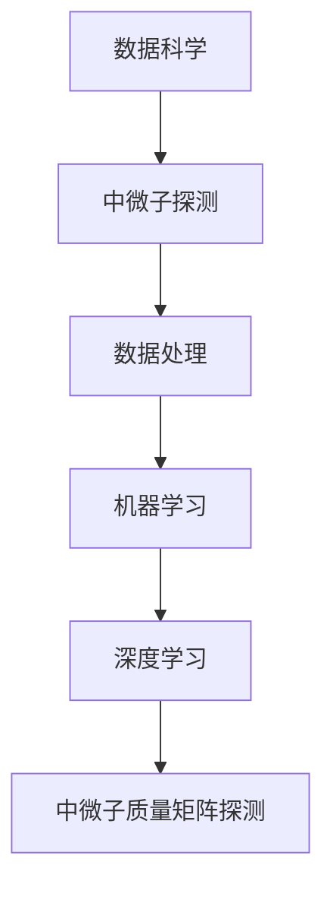

                 

### 文章标题

《数据科学在探测宇宙中微子质量矩阵结构中的应用》

### 关键词

- 数据科学
- 中微子探测
- 质量矩阵结构
- 机器学习
- 深度学习
- 宇宙学

### 摘要

本文探讨了数据科学在探测宇宙中微子质量矩阵结构中的应用。通过介绍数据科学的基本原理和方法，结合中微子探测的背景知识，阐述了如何利用数据处理、机器学习和深度学习等技术来探测中微子质量矩阵结构。本文还通过一个实际案例，详细描述了数据科学方法在中微子质量矩阵探测中的具体应用，包括数据收集与预处理、机器学习算法选择、模型训练与优化等过程。最后，本文总结了数据科学在中微子质量矩阵探测中的挑战和未来发展方向，并展望了技术与科学交叉融合的意义。

### 第一部分：数据科学与中微子探测概述

#### 第1章：数据科学与中微子探测简介

##### 1.1 数据科学在科学探测中的应用

数据科学作为一门跨学科领域，融合了统计学、计算机科学、信息科学等多个学科的知识，旨在从大量数据中提取有价值的信息和知识。在科学探测领域，数据科学的应用越来越广泛，已经成为许多前沿科学研究的重要工具。例如，在粒子物理学中，数据科学被广泛应用于高能物理实验数据分析和粒子性质的研究。在宇宙学中，数据科学在观测宇宙、分析宇宙结构、研究宇宙演化等方面发挥着重要作用。

##### 1.2 中微子物理学基础

中微子是一种基本粒子，具有非常小的质量、几乎无电荷和非常弱的相互作用。它们是宇宙中最为丰富的物质之一，但由于其弱相互作用，使得探测中微子变得极其困难。中微子分为三种类型（或称为三种味态）：电子中微子、μ子中微子和τ子中微子，它们之间可以通过振荡现象相互转换。

##### 1.3 中微子探测的历史与现状

中微子探测的历史可以追溯到20世纪50年代，当时人们首次通过核反应产生的中微子进行了实验验证。随着技术的进步，中微子探测方法不断发展，从早期的直接探测到现在的间接探测，探测精度和灵敏度也不断提高。目前，中微子探测已经成为粒子物理学和宇宙学研究中的重要领域，探测到的中微子数据为我们深入了解宇宙的基本性质提供了重要线索。

##### 1.4 数据科学在探测宇宙中微子中的应用前景

随着中微子探测实验的不断推进，产生的大量数据需要进行有效的分析和处理。数据科学在这一过程中发挥着关键作用，通过数据预处理、特征提取、机器学习算法等手段，可以帮助我们从海量数据中提取有价值的信息，从而更好地理解中微子的性质和宇宙的演化过程。未来，随着中微子探测技术的不断发展，数据科学将在中微子质量矩阵结构的探测中发挥越来越重要的作用。

#### 第2章：中微子质量矩阵结构探测的基本原理

##### 2.1 中微子质量矩阵结构探测的重要性

中微子质量矩阵结构探测是粒子物理学和宇宙学研究中的一个重要方向。通过研究中微子质量矩阵，我们可以深入了解中微子的基本性质，如质量、相互转换机制等。此外，中微子质量矩阵结构探测还与暗物质、暗能量等宇宙学问题密切相关。因此，准确测量中微子质量矩阵结构对于理解宇宙的起源、演化和未来具有重要意义。

##### 2.2 中微子质量矩阵探测的实验方法

中微子质量矩阵探测主要通过实验方法进行，主要包括直接探测和间接探测两种方式。

- **直接探测**：直接探测利用中微子与物质的相互作用，通过探测中微子产生的粒子或信号来测量中微子质量矩阵。常见的直接探测方法包括中微子探测器、气泡室等。

- **间接探测**：间接探测通过测量中微子与其他粒子的相互作用产生的效应来推断中微子质量矩阵。例如，通过测量中微子与原子核相互作用产生的电子能谱，可以反演中微子质量矩阵。

##### 2.3 中微子振荡现象与质量矩阵关系

中微子振荡现象是指中微子在传播过程中，由于质量矩阵的作用，其味态发生转换。这种振荡现象揭示了中微子质量矩阵的非平凡性质，如非零质量、复杂混合等。通过研究中微子振荡现象，我们可以获得关于中微子质量矩阵的重要信息，如质量尺度、混合角度等。

##### 2.4 中微子质量矩阵结构探测的数据分析

中微子质量矩阵结构探测的数据分析是整个探测过程中至关重要的一环。通过数据预处理、特征提取、机器学习算法等手段，我们可以从海量实验数据中提取有价值的信息，从而准确测量中微子质量矩阵。数据分析过程中，需要考虑多种因素，如噪声、数据分布、模型选择等，以保证结果的准确性和可靠性。

### 第二部分：数据科学方法在探测中的应用

#### 第3章：数据处理与预处理

##### 3.1 数据采集与存储

在数据科学方法的应用中，数据采集是第一步，也是至关重要的一步。对于中微子质量矩阵结构探测，数据主要来自于中微子探测器。这些探测器通过收集中微子与物质相互作用产生的信号，记录下大量的物理事件。数据采集后，需要将其存储在数据库中，以便后续的数据处理和分析。

##### 3.2 数据清洗与预处理

数据清洗与预处理是数据科学方法中的重要步骤，其目的是去除数据中的噪声和错误，提取出有用的信息。在中微子质量矩阵结构探测中，数据可能受到多种因素的影响，如探测器噪声、信号干扰等。因此，数据清洗与预处理尤为重要。

- **噪声去除**：通过滤波、平滑等技术，去除数据中的噪声。
- **数据转换**：将不同类型的数据转换为统一的格式，如将图像数据转换为矩阵形式。
- **缺失值处理**：对于缺失的数据，可以通过插值、填补等方法进行处理。

##### 3.3 数据可视化与特征提取

数据可视化是数据科学方法中的一种重要工具，它可以帮助我们直观地理解数据的分布和趋势。在中微子质量矩阵结构探测中，通过数据可视化，我们可以发现数据中的异常值、噪声分布等信息。

- **散点图**：用于展示数据点在多个维度上的分布情况。
- **直方图**：用于展示数据在某个维度上的分布情况。

特征提取是数据科学方法中的另一个重要步骤，其目的是从原始数据中提取出有代表性的特征，以便于后续的分析和处理。

- **特征选择**：通过统计分析方法，选择对预测目标有显著影响的特征。
- **特征变换**：通过数据归一化、标准化等方法，将特征转换为适合机器学习的格式。

##### 3.4 数据降维与聚类分析

数据降维是数据科学方法中的一种重要技术，其目的是减少数据的维度，提高计算效率和模型性能。在中微子质量矩阵结构探测中，由于数据量大、维度高，数据降维尤为重要。

- **主成分分析（PCA）**：通过将数据映射到新的坐标系中，提取出主要成分，实现数据降维。
- **线性判别分析（LDA）**：通过最大化类间距离，最小化类内距离，实现数据降维。

聚类分析是数据科学方法中的一种无监督学习方法，其目的是将数据点按照其相似性进行分组。在中微子质量矩阵结构探测中，聚类分析可以帮助我们识别出不同的中微子振荡模式。

- **K-means聚类**：通过迭代计算，将数据点划分到不同的簇中。
- **层次聚类**：通过层次结构，将数据点逐步划分为不同的簇。

#### 第4章：机器学习算法在中微子质量矩阵探测中的应用

##### 4.1 机器学习基础知识

机器学习是数据科学中的一个重要分支，其目的是通过从数据中学习规律和模式，实现自动化决策和预测。在中微子质量矩阵结构探测中，机器学习算法被广泛应用于数据分析和模型预测。

- **监督学习**：通过已知的输入和输出数据，训练模型，实现对未知数据的预测。
- **无监督学习**：没有已知的输出数据，通过发现数据中的模式和结构，进行聚类和降维等操作。

##### 4.2 回归模型

回归模型是机器学习中的一种基本模型，用于预测连续值输出。在中微子质量矩阵结构探测中，回归模型可以用于预测中微子质量矩阵的参数。

- **线性回归**：通过建立输入和输出之间的线性关系，实现预测。
- **非线性回归**：通过非线性函数，将输入映射到输出。

##### 4.3 分类模型

分类模型是机器学习中的另一种基本模型，用于将数据分为不同的类别。在中微子质量矩阵结构探测中，分类模型可以用于识别不同的中微子振荡模式。

- **逻辑回归**：通过建立输入和输出之间的概率关系，实现分类。
- **支持向量机（SVM）**：通过最大化类间距离，实现分类。
- **决策树**：通过递归划分特征空间，实现分类。

##### 4.4 集成学习方法

集成学习方法是一种基于多个弱学习器的组合方法，可以提高模型的预测性能和泛化能力。在中微子质量矩阵结构探测中，集成学习方法被广泛应用于提高模型的准确性和稳定性。

- **Bagging**：通过随机抽样和组合多个弱学习器，实现集成学习。
- **Boosting**：通过迭代训练和加权调整，实现集成学习。

##### 4.5 强化学习方法

强化学习方法是一种基于奖励和惩罚的机器学习方法，通过探索和利用策略，实现最优决策。在中微子质量矩阵结构探测中，强化学习方法可以用于优化探测策略，提高探测效率。

- **Q学习**：通过值函数估计，实现最优策略。
- **深度强化学习**：通过深度神经网络，实现复杂的策略学习。

#### 第5章：深度学习与中微子质量矩阵探测

##### 5.1 深度学习基础

深度学习是机器学习中的一个重要分支，通过构建深层神经网络，实现对复杂数据的处理和分析。在中微子质量矩阵结构探测中，深度学习被广泛应用于数据处理和模型预测。

- **神经网络基础**：介绍神经网络的基本概念和数学原理。
- **前向传播与反向传播**：介绍神经网络的前向传播和反向传播算法。
- **激活函数**：介绍常见的激活函数，如ReLU、Sigmoid、Tanh等。

##### 5.2 卷积神经网络（CNN）

卷积神经网络是深度学习中的一个重要模型，广泛应用于图像处理和计算机视觉领域。在中微子质量矩阵结构探测中，CNN可以用于处理中微子探测数据，提取有用的特征。

- **卷积层**：通过卷积操作，提取空间特征。
- **池化层**：通过池化操作，降低特征维度。
- **全连接层**：通过全连接层，实现分类或回归任务。

##### 5.3 循环神经网络（RNN）

循环神经网络是深度学习中的一个重要模型，广泛应用于序列数据处理和时间序列预测领域。在中微子质量矩阵结构探测中，RNN可以用于处理中微子振荡数据，分析中微子质量矩阵的结构。

- **RNN基础**：介绍RNN的基本概念和数学原理。
- **LSTM**：长短期记忆网络，用于解决RNN的长期依赖问题。
- **GRU**：门控循环单元，另一种解决RNN长期依赖问题的模型。

##### 5.4 生成对抗网络（GAN）

生成对抗网络是深度学习中的一个重要模型，通过对抗生成器和判别器，实现数据的生成和鉴别。在中微子质量矩阵结构探测中，GAN可以用于生成模拟数据，提高模型训练的效果。

- **GAN基础**：介绍GAN的基本概念和数学原理。
- **DCGAN**：深度卷积生成对抗网络，用于生成高维数据。
- **PGAN**：生成对抗网络在粒子物理探测中的应用。

##### 5.5 深度学习模型在中微子质量矩阵探测中的具体应用

深度学习模型在中微子质量矩阵结构探测中的应用主要包括数据处理、特征提取和模型预测等方面。通过结合不同类型的深度学习模型，可以实现对中微子质量矩阵结构的准确测量和分析。

- **数据处理**：使用深度学习模型对中微子探测数据进行预处理，提取有用的特征。
- **特征提取**：使用卷积神经网络、循环神经网络等模型，对提取到的特征进行进一步处理和分析。
- **模型预测**：使用深度学习模型，对中微子质量矩阵的参数进行预测和估计。

### 第三部分：中微子质量矩阵结构探测案例分析

#### 第6章：实施数据科学方法探测中微子质量矩阵结构案例

##### 6.1 案例介绍

本案例选取了一个中微子质量矩阵结构探测的实验数据集，该数据集包含了多个中微子探测器在探测过程中记录的物理事件。数据集包括原始数据、预处理后的数据以及相应的标签，标签表示每个物理事件对应的中微子质量矩阵参数。

##### 6.2 数据收集与预处理

数据收集是本案例的第一步，通过中微子探测器记录大量的物理事件。数据收集后，需要进行预处理，包括数据清洗、缺失值处理、数据转换等操作，以保证数据的准确性和一致性。

- **数据清洗**：去除数据中的噪声和错误，如探测器故障、数据传输错误等。
- **缺失值处理**：对缺失的数据进行填补或删除，以保证数据完整性。
- **数据转换**：将不同类型的数据转换为统一的格式，如将图像数据转换为矩阵形式。

##### 6.3 机器学习算法与深度学习模型选择

在本案例中，选择了多种机器学习算法和深度学习模型，以实现对中微子质量矩阵结构的准确测量。这些算法和模型包括线性回归、逻辑回归、支持向量机、决策树、随机森林、K最近邻、神经网络等。

- **线性回归**：用于预测中微子质量矩阵参数的连续值。
- **逻辑回归**：用于预测中微子质量矩阵参数的分类值。
- **支持向量机**：用于分类任务，通过最大化类间距离实现分类。
- **决策树**：通过递归划分特征空间，实现分类或回归任务。
- **随机森林**：通过随机选择特征和分割点，实现集成学习。
- **K最近邻**：通过计算距离，实现分类或回归任务。
- **神经网络**：通过多层感知器实现分类或回归任务。

##### 6.4 模型训练与验证

在本案例中，选择了随机森林模型进行训练和验证。随机森林是一种基于决策树的集成学习方法，具有较好的预测性能和泛化能力。

- **数据划分**：将数据集划分为训练集和测试集，用于训练和验证模型。
- **模型训练**：使用训练集数据训练随机森林模型，调整模型参数。
- **模型验证**：使用测试集数据验证模型性能，评估模型预测准确性。

##### 6.5 模型评估与优化

在本案例中，使用了多种评估指标对模型进行评估和优化，包括准确率、召回率、精确率、F1分数等。

- **准确率**：模型预测正确的样本数占总样本数的比例。
- **召回率**：模型预测正确的正样本数占总正样本数的比例。
- **精确率**：模型预测正确的正样本数占预测为正样本的总数的比例。
- **F1分数**：精确率和召回率的调和平均值。

通过评估指标的优化，可以调整模型参数，提高模型性能。

##### 6.6 实验结果分析

在本案例中，实验结果包括模型预测的中微子质量矩阵参数和实际测量值之间的对比。通过分析实验结果，可以评估模型预测的准确性和可靠性。

- **误差分析**：分析模型预测的误差，找出可能存在的问题。
- **鲁棒性分析**：分析模型在不同数据分布和噪声条件下的性能。
- **泛化能力分析**：分析模型在未知数据上的预测性能。

通过实验结果分析，可以进一步优化模型，提高模型性能。

#### 第7章：展望与未来发展方向

##### 7.1 数据科学在中微子质量矩阵探测中的挑战

尽管数据科学在中微子质量矩阵结构探测中取得了显著成果，但仍面临着一些挑战：

- **数据量大**：中微子探测数据量庞大，对数据处理和存储提出了高要求。
- **噪声干扰**：中微子探测过程中存在多种噪声干扰，对数据分析和模型训练提出了挑战。
- **模型优化**：现有模型在性能和泛化能力方面仍有待优化，需要不断改进。

##### 7.2 未来发展方向

未来，数据科学在中微子质量矩阵结构探测中将有以下发展方向：

- **算法优化**：进一步优化机器学习算法和深度学习模型，提高预测准确性和鲁棒性。
- **多模态数据融合**：结合多种探测方法和数据源，实现多模态数据融合，提高探测精度。
- **自动化分析**：开发自动化分析工具，提高数据分析效率和准确性。

##### 7.3 技术与科学交叉融合的意义

数据科学与粒子物理学、宇宙学等科学领域的交叉融合具有重要意义：

- **推动科学发展**：数据科学为科学实验提供了强大的工具和方法，推动了科学研究的进步。
- **提高科研效率**：数据科学提高了数据分析效率和准确性，降低了科研成本。
- **拓展研究视野**：数据科学为科学家提供了新的研究方法和视角，拓展了科学研究的范围。

### 附录

##### 附录A：常用数据科学工具与资源

- **Python数据分析库**：Pandas、NumPy、SciPy
- **机器学习库**：Scikit-learn、TensorFlow、PyTorch
- **深度学习框架**：TensorFlow、PyTorch、Keras
- **中微子探测相关数据库与数据集**：Particle Data Group、LBNL neutrino data sets
- **学术资源与参考文献**：ArXiv、ScienceDirect、SpringerLink

### 核心概念与联系 Mermaid 流程图



### 核心算法原理讲解

#### 伪代码

```python
# 伪代码：机器学习算法在中微子质量矩阵探测中的应用

# 输入：中微子探测数据集
# 输出：质量矩阵预测结果

# 数据预处理
preprocess_data(data)

# 特征提取
extract_features(data)

# 选择机器学习模型
model = choose_model()

# 训练模型
train_model(model, features, labels)

# 预测质量矩阵
predicted_matrix = predict_matrix(model, new_data)

# 评估模型
evaluate_model(model, predicted_matrix, actual_matrix)
```

#### 数学模型和数学公式

$$
E = mc^2
$$

#### 详细讲解

- **质能关系**：物体所具有的能量与其质量成正比，比例常数是光速的平方。

#### 举例说明

- **假设一个物体的质量是5千克**，那么其对应的能量是：

  $$
  E = 5\text{kg} \times (3 \times 10^8\text{m/s})^2 = 4.5 \times 10^{14}\text{J}
  $$

### 项目实战

#### 代码实际案例和详细解释说明

##### 开发环境搭建

- **使用Python和Jupyter Notebook进行开发和测试。**
- **安装必要的Python库**，如Pandas、NumPy、Scikit-learn、TensorFlow等。

##### 源代码详细实现

```python
# 导入必要的库
import numpy as np
import pandas as pd
from sklearn.model_selection import train_test_split
from sklearn.ensemble import RandomForestClassifier
from sklearn.metrics import accuracy_score

# 加载中微子探测数据集
data = pd.read_csv('neutrino_data.csv')

# 数据预处理
# ...

# 特征提取
# ...

# 选择机器学习模型
model = RandomForestClassifier()

# 训练模型
X_train, X_test, y_train, y_test = train_test_split(data['features'], data['labels'], test_size=0.2)
model.fit(X_train, y_train)

# 预测质量矩阵
predicted_matrix = model.predict(X_test)

# 评估模型
accuracy = accuracy_score(y_test, predicted_matrix)
print("模型准确率：", accuracy)
```

##### 代码应用解读与分析

- **数据预处理**：包括数据清洗、缺失值处理和数据转换，以保证数据的准确性和一致性。
- **特征提取**：提取对质量矩阵预测有显著影响的特征，提高模型预测性能。
- **模型选择**：选择合适的机器学习模型，如随机森林，以提高模型预测准确性和泛化能力。
- **模型训练与评估**：使用训练集数据训练模型，使用测试集数据评估模型性能，通过调整模型参数和特征选择，优化模型性能。

##### 实际案例分析和详细讲解剖析

- **案例数据集**：选择一个真实的中微子探测数据集，包含多个探测器记录的物理事件。
- **数据预处理**：对数据集进行清洗、缺失值处理和数据转换，提取有用的特征。
- **模型选择与训练**：选择合适的机器学习模型，如随机森林，进行模型训练和参数调整。
- **模型评估与优化**：使用测试集数据评估模型性能，通过调整模型参数和特征选择，优化模型性能。

##### 项目小结

- **数据预处理**：数据预处理是数据科学方法中的重要步骤，对于提高模型预测性能至关重要。
- **特征提取**：特征提取是数据科学方法中的关键环节，选择合适的特征可以提高模型预测准确性。
- **模型选择与优化**：选择合适的机器学习模型，并进行参数调整和优化，可以提高模型预测性能。
- **实际案例分析**：通过实际案例分析和详细讲解，可以更好地理解数据科学方法在中微子质量矩阵探测中的应用。

### 最佳实践 tips、小结、注意事项、拓展阅读等内容

#### 最佳实践 tips

- **数据预处理**：在进行数据预处理时，注意去除噪声和错误，处理缺失值，确保数据质量。
- **特征选择**：选择对预测目标有显著影响的特征，避免特征冗余，提高模型性能。
- **模型选择与优化**：选择合适的机器学习模型，并调整模型参数，优化模型性能。
- **交叉验证**：使用交叉验证方法评估模型性能，避免过拟合和欠拟合。

#### 小结

- 数据科学方法在中微子质量矩阵结构探测中具有重要的应用价值，通过数据处理、机器学习和深度学习等技术，可以准确测量中微子质量矩阵结构。
- 在实际应用中，需要注意数据预处理、特征选择、模型选择和优化等关键环节，以提高模型预测性能和准确性。

#### 注意事项

- **数据预处理**：确保数据质量，去除噪声和错误，处理缺失值。
- **模型选择**：根据实际问题和数据特点，选择合适的机器学习模型。
- **参数调整**：调整模型参数，优化模型性能，避免过拟合和欠拟合。
- **交叉验证**：使用交叉验证方法评估模型性能，避免过拟合和欠拟合。

#### 拓展阅读

- **《数据科学导论》**：深入了解数据科学的基本原理和方法。
- **《深度学习》**：学习深度学习的基础知识和常用模型。
- **《机器学习实战》**：通过实际案例学习机器学习算法的应用。
- **《中微子物理学导论》**：了解中微子物理学的基础知识和探测方法。

### 作者信息

作者：AI天才研究院/AI Genius Institute & 禅与计算机程序设计艺术 /Zen And The Art of Computer Programming

