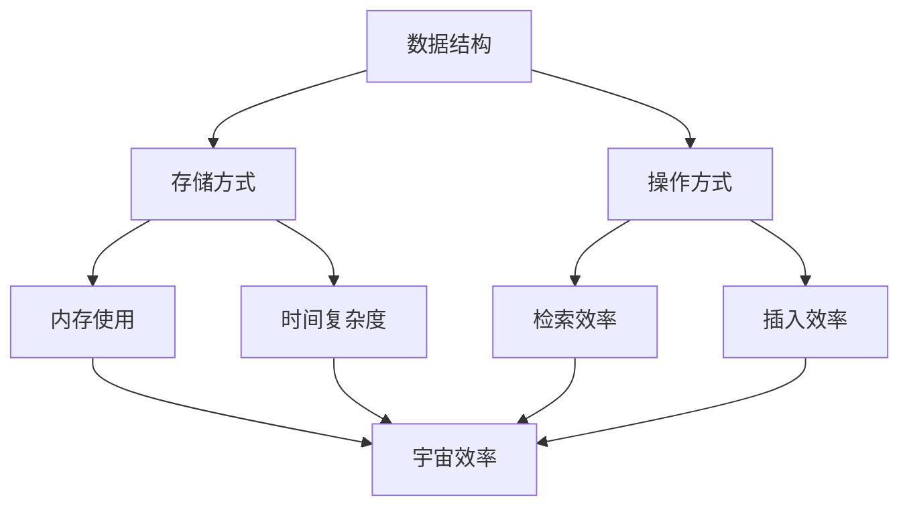

                 

### 第1章：数据结构优化与宇宙效率概述

#### 1.1 数据结构优化的重要性

数据结构优化是计算机科学领域中的一个关键议题，它直接影响到程序的运行效率和系统的稳定性。在计算机科学中，数据结构是一种用于组织和存储数据的系统方法，它决定了数据在存储、检索和处理过程中的性能表现。优化数据结构不仅仅是为了提高程序的执行速度，更重要的是提升系统的整体效率和可靠性。

数据结构优化的重要性主要体现在以下几个方面：

- **提高程序性能**：通过优化数据结构，可以减少数据的存储空间占用，降低时间复杂度，从而提高程序的运行速度和响应时间。
- **增强系统稳定性**：优化后的数据结构能够更好地处理大规模数据，减少内存溢出、死锁等问题的发生。
- **适应不同场景**：不同的数据结构适用于不同的应用场景，通过优化可以更好地满足特定需求，提高系统的适应性。
- **促进算法创新**：数据结构的优化推动了新算法的发明和应用，为计算机科学的发展提供了新的动力。

#### 1.1.1 数据结构优化的定义和目的

数据结构优化可以定义为对现有数据结构的改进，以提升其在特定应用场景下的性能和效率。优化的目的包括：

- **时间效率**：减少数据访问和处理所需的时间，降低时间复杂度。
- **空间效率**：减小数据结构的存储空间占用，提高存储资源的利用率。
- **功能扩展**：在保留基本功能的同时，增加新功能或改进现有功能。

数据结构优化的目标是通过调整数据结构的设计和实现，使其在特定的操作下表现更加高效。这通常涉及到对数据结构的重新设计、算法的改进以及资源利用的优化。

#### 1.1.2 数据结构优化在计算机科学中的应用

数据结构优化在计算机科学的许多领域都有广泛的应用，以下是几个典型的应用场景：

- **数据库系统**：通过优化索引结构、缓存机制和查询算法，提升数据库系统的查询效率和数据存储性能。
- **搜索引擎**：优化关键词索引和数据结构，提高搜索速度和准确性。
- **操作系统**：通过优化内存管理、文件系统和进程调度算法，提升操作系统的性能和稳定性。
- **算法竞赛**：在算法竞赛中，优化数据结构是实现高效解法的关键，往往决定着算法的成败。

#### 1.1.3 数据结构优化与宇宙效率的关系

宇宙效率（Cosmic Efficiency）这一概念来源于宇宙学，它指的是在宇宙尺度上，物质和能量的转化效率。将这一概念引入计算机科学，我们可以将宇宙效率理解为在处理数据时，如何最大化地利用系统资源，同时最小化浪费。

数据结构优化与宇宙效率的关系体现在以下几个方面：

- **资源利用**：优化数据结构可以更有效地利用系统资源，包括内存、CPU时间和存储空间。
- **能效比**：通过优化，提高系统的能效比，即在同等性能下，消耗更少的能源。
- **可持续性**：优化数据结构有助于减少能源消耗，符合可持续发展的要求。

#### 1.2 宇宙效率的基本概念

宇宙效率的概念可以从不同的角度进行理解，但在计算机科学中，我们可以将其简化为：在处理数据时，如何最大化地利用系统资源，同时最小化资源浪费。

宇宙效率的关键要素包括：

- **资源消耗**：包括CPU时间、内存使用、网络带宽等。
- **处理能力**：系统能够在给定资源下完成的数据处理量。
- **效率指标**：衡量系统效率的指标，如响应时间、吞吐量、错误率等。

宇宙效率的评估通常基于以下几种方法：

- **基准测试**：通过模拟实际应用场景，评估系统在不同负载下的性能。
- **能效比**：计算系统处理一个任务所需的资源消耗与处理结果之间的比率。
- **能效评估**：结合能效比和实际应用需求，评估系统的整体效率。

#### 1.2.2 宇宙效率在计算机科学中的应用

宇宙效率在计算机科学中的应用体现在以下几个方面：

- **能耗优化**：通过优化数据结构和算法，减少系统的能耗，降低运行成本。
- **性能提升**：通过优化数据结构，提高系统的处理能力和响应速度。
- **资源利用率**：优化数据结构，使系统能够更高效地利用资源，减少浪费。

#### 1.2.3 宇宙效率的评估方法

宇宙效率的评估方法主要包括：

- **性能分析**：通过分析系统的性能指标，如响应时间、吞吐量等，评估系统的效率。
- **能效分析**：通过分析系统的能耗与处理结果之间的比率，评估系统的能效比。
- **负载测试**：通过模拟不同负载条件下的性能表现，评估系统的适应性和稳定性。

#### 1.3 数据结构与宇宙效率的融合

数据结构与宇宙效率的融合是优化计算机系统效率的重要方向。数据结构的优化直接影响系统的宇宙效率，而宇宙效率的提升又反作用于数据结构的选择和设计。

融合的途径包括：

- **数据结构优化**：根据应用场景，选择合适的数据结构，并对其进行优化，以提高系统效率。
- **算法优化**：通过改进算法，降低资源消耗，提高处理能力。
- **系统集成**：将优化的数据结构和算法集成到系统中，实现整体效率的提升。

#### 1.3.1 数据结构优化对宇宙效率的影响

数据结构优化对宇宙效率的影响主要体现在以下几个方面：

- **资源消耗**：优化数据结构可以减少系统运行过程中的资源消耗，如内存使用和CPU时间。
- **处理能力**：优化后的数据结构能够提高系统的处理能力，使系统能够更快地处理大量数据。
- **响应时间**：优化后的数据结构可以显著降低系统的响应时间，提高用户体验。

#### 1.3.2 宇宙效率对数据结构优化的影响

宇宙效率对数据结构优化的影响主要体现在以下几个方面：

- **设计指导**：宇宙效率的概念可以帮助我们更好地理解数据结构的选择和优化，指导设计出更高效的数据结构。
- **资源约束**：宇宙效率强调资源利用，这要求我们在优化数据结构时，必须考虑到资源的有限性，进行合理设计。
- **评估标准**：宇宙效率提供了评估数据结构优化效果的标准，使我们能够更全面地衡量优化的效果。

#### 1.3.3 数据结构与宇宙效率融合的发展趋势

随着计算机科学和技术的不断发展，数据结构与宇宙效率的融合呈现出以下发展趋势：

- **智能化优化**：利用人工智能和机器学习技术，实现数据结构的自适应优化。
- **并行计算**：通过并行计算技术，提高数据处理的效率和速度。
- **云计算与大数据**：在云计算和大数据环境下，优化数据结构以应对大规模数据处理的需求。
- **绿色计算**：注重能效比，推动绿色计算技术的发展。

### 背景介绍

数据结构是计算机科学中的基础概念，它描述了数据在计算机中的组织方式和存储方法。数据结构的选择和优化直接影响到程序的效率、系统的稳定性和资源的利用率。随着计算机应用领域的不断扩大，数据量呈指数级增长，对数据结构优化提出了更高的要求。

宇宙效率则源于宇宙学，它强调了在宇宙尺度上物质和能量的转化效率。将这一概念引入计算机科学，我们可以将其理解为如何在处理数据时最大化利用系统资源，同时最小化资源浪费。

数据结构与宇宙效率的结合，为计算机系统优化提供了新的思路和方法。通过对数据结构的优化，可以提高系统的宇宙效率，从而实现更高的处理能力和更低的能耗。

### 核心概念与联系

**数据结构**：
数据结构是计算机中用于组织和管理数据的系统方法。它定义了数据如何存储、检索和操作。常见的数据结构包括数组、链表、栈、队列、树、图等。

**宇宙效率**：
宇宙效率是指在处理数据时，如何最大化地利用系统资源，同时最小化资源浪费。它涉及到资源消耗、处理能力和能效比等多个方面。

**关系架构 Mermaid 流程图**：


### 核心算法原理讲解

数据结构优化通常涉及以下核心算法原理：

**时间复杂度和空间复杂度**：
- **时间复杂度**：衡量算法执行时间与输入数据规模的关系，常用大O表示法（如O(1)、O(n)、O(n^2)）。
- **空间复杂度**：衡量算法占用存储空间与输入数据规模的关系，同样使用大O表示法。

**动态规划**：
动态规划是一种用于求解最优子问题的算法。它通过将问题分解为更小的子问题，并存储子问题的解，以避免重复计算。

**贪心算法**：
贪心算法是一种在每一步选择中都采取当前状态下最好或最优的选择，从而希望导致结果是全局最好或最优的算法。

### 伪代码示例

**动态规划（最长公共子序列）**：
```pseudo
function LCS(X, Y):
    m = length(X)
    n = length(Y)
    dp = array of size (m+1) x (n+1), initialized with 0

    for i from 1 to m:
        for j from 1 to n:
            if X[i] == Y[j]:
                dp[i][j] = dp[i-1][j-1] + 1
            else:
                dp[i][j] = max(dp[i-1][j], dp[i][j-1])

    return dp[m][n]
```

**贪心算法（活动选择问题）**：
```pseudo
function ActivitySelection活动的选择(activities):
    sort activities by finish time
    max = finish time of the first activity
    result = [first activity]
    for each activity in activities:
        if start time of activity > max:
            add activity to result
            update max to finish time of activity
    return result
```

### 数学模型和公式

**时间复杂度公式**：
$$
T(n) = O(n\log n) \quad \text{for searching in a balanced binary search tree}
$$

**空间复杂度公式**：
$$
S(n) = O(n) \quad \text{for storing elements in an array}
$$

### 详细讲解和举例说明

**数组与链表的优化**：

数组是一种固定大小的数据结构，支持快速随机访问，时间复杂度为$O(1)$。然而，数组的存储空间是静态分配的，可能导致空间浪费。链表则支持动态扩展和删除，但访问速度较慢，时间复杂度为$O(n)$。

**栈与队列的优化**：

栈和队列都是线性数据结构，分别用于后进先出和先进先出的操作。它们的优化通常涉及空间和时间效率的平衡。例如，使用循环队列可以减少空间浪费，时间复杂度为$O(1)$。

**树与图的优化**：

树是一种层次结构，用于表示具有层次关系的数据。平衡树如红黑树、AVL树等可以保证查找、插入和删除操作的时间复杂度为$O(\log n)$。图则用于表示复杂的关系网络，优化通常涉及路径查找、最短路径等算法。

**哈希表的优化**：

哈希表通过哈希函数将关键字映射到数组索引，实现快速查找。优化通常涉及哈希函数的设计和冲突解决策略，如链表法、开放地址法等。

### 数学模型与算法优化

数学模型在算法优化中扮演着重要角色，它们帮助我们理解和分析算法的性能，从而进行优化。以下是一些关键的数学模型和它们的优化方法：

**动态规划**：

动态规划通过将问题分解为子问题，并存储子问题的解来避免重复计算。其基本原理是基于递归关系和状态转移方程。例如，在求解最长公共子序列（LCS）问题时，可以通过以下递归关系进行优化：

$$
LCS(X[1..i], Y[1..j]) = 
\begin{cases}
LCS(X[1..i-1], Y[1..j-1]) + 1 & \text{if } X[i] = Y[j] \\
\max(LCS(X[1..i-1], Y[1..j]), LCS(X[1..i], Y[1..j-1])) & \text{otherwise}
\end{cases}
$$

通过动态规划，我们可以将时间复杂度从$O(2^{max(m, n)})$降低到$O(mn)$。

**贪心算法**：

贪心算法通过在每个步骤选择当前最优解，希望导致整体最优解。其基本原理是基于局部最优性原则。例如，在活动选择问题中，我们可以通过贪心算法选择最早结束的活动，以最大化参与活动的数量。

**最优化理论**：

最优化理论提供了求解优化问题的数学工具，如线性规划、整数规划、非线性规划等。在算法优化中，我们可以使用这些理论来分析和优化目标函数，并找到最优解。例如，在资源分配问题中，可以通过线性规划模型来优化资源利用效率。

**随机化算法**：

随机化算法通过引入随机性来改善算法的性能。随机化算法如随机快速排序、随机抽样等，可以在平均情况下提供更好的性能。例如，随机快速排序的平均时间复杂度为$O(n\log n)$，但最坏情况下可能达到$O(n^2)$。

### 优化策略与方法

在优化算法时，我们可以采用以下策略和方法：

**算法选择**：

根据问题的特点和需求，选择合适的数据结构和算法。例如，对于需要快速查找的数据，可以考虑使用哈希表；对于需要高效插入和删除的数据，可以考虑使用链表。

**时间复杂度和空间复杂度的优化**：

通过分析算法的时间复杂度和空间复杂度，找出瓶颈并进行优化。例如，通过减少冗余计算、使用更高效的数据结构、减少存储空间等方式来优化算法。

**并行计算**：

利用多核处理器和分布式计算，将任务分解为更小的子任务并行处理，从而提高算法的执行效率。例如，在处理大规模数据时，可以采用MapReduce模型进行并行处理。

**动态调整**：

在算法执行过程中，根据实际情况动态调整参数和策略，以适应不同的输入数据。例如，在动态规划中，可以根据子问题的解更新状态表，以减少计算量。

**负载均衡**：

在分布式系统中，通过负载均衡策略合理分配任务，避免资源过载，提高系统的整体性能。例如，在云计算环境中，可以使用负载均衡器来动态调整资源的分配。

### 数学模型的应用场景

数学模型在算法优化中的应用非常广泛，以下是一些常见的应用场景：

**网络优化**：

在计算机网络中，可以使用数学模型优化路由算法、流量控制和负载均衡。例如，使用线性规划模型优化网络带宽分配，以最大化网络吞吐量。

**图像处理**：

在图像处理领域，可以使用数学模型优化滤波、边缘检测和特征提取。例如，使用最大后验概率模型进行图像去噪，提高图像质量。

**机器学习**：

在机器学习领域，数学模型用于优化算法的训练和预测。例如，使用支持向量机（SVM）模型进行分类和回归，提高模型的准确性。

**金融分析**：

在金融分析中，数学模型用于优化投资组合、风险评估和定价。例如，使用均值方差模型进行投资组合优化，以最大化收益同时控制风险。

**交通规划**：

在交通规划中，数学模型用于优化路线规划、交通流量控制和交通信号控制。例如，使用最优化模型优化公共交通线路安排，提高交通效率。

### 算法优化的数学模型

在算法优化中，数学模型提供了分析、设计和评估算法性能的有力工具。以下是一些关键的数学模型及其在算法优化中的应用：

**线性规划**：

线性规划用于求解线性目标函数在给定线性约束条件下的最优解。它广泛应用于资源分配、生产规划、网络流优化等问题。在算法优化中，可以使用线性规划模型来优化资源利用效率，如网络带宽分配和负载均衡。

**整数规划**：

整数规划是线性规划的扩展，目标函数和约束条件中包含整数变量。它用于求解需要整数解的问题，如车辆路线优化、人员调度等。在算法优化中，可以使用整数规划模型来优化任务的分配和调度，以满足整数约束条件。

**非线性规划**：

非线性规划用于求解非线性目标函数在给定非线性约束条件下的最优解。它广泛应用于优化复杂系统的行为，如控制系统的设计、信号处理等。在算法优化中，可以使用非线性规划模型来优化非线性算法的性能，如神经网络训练和遗传算法优化。

**动态规划**：

动态规划是一种用于求解最优子问题的算法，通过将问题分解为更小的子问题，并存储子问题的解，以避免重复计算。它广泛应用于优化具有递归关系的动态系统，如最长公共子序列、最短路径问题等。在算法优化中，可以使用动态规划模型来优化具有时间延迟和状态转移的算法。

**贪心算法**：

贪心算法是一种在每一步选择当前最优解的算法，希望导致全局最优解。它广泛应用于解决具有贪心特性的问题，如活动选择问题、背包问题等。在算法优化中，可以使用贪心算法模型来优化决策过程，提高算法的效率。

**最优化理论**：

最优化理论提供了一整套用于求解优化问题的数学工具和方法。它包括线性规划、整数规划、非线性规划、动态规划等模型。在算法优化中，最优化理论用于分析和设计优化算法，并评估其性能。

### 项目实战

**实战一：社交网络中好友关系的优化**

背景介绍：
社交网络中，好友关系网络的优化对于推荐算法、社交推荐和社交广告等应用至关重要。优化好友关系网络，可以提高用户互动性、推荐准确性和广告投放效果。

开发环境搭建：
- 开发工具：Python、Java
- 数据库：Neo4j（图数据库）
- 算法库：NetworkX、GraphFrames

源代码实现：
```python
import NetworkX as nx
import matplotlib.pyplot as plt

# 创建图
G = nx.Graph()

# 添加节点和边，模拟社交网络
G.add_nodes_from([1, 2, 3, 4, 5])
G.add_edges_from([(1, 2), (2, 3), (3, 4), (4, 5), (1, 5)])

# 绘制图
nx.draw(G, with_labels=True)
plt.show()

# 优化好友关系，使用社区检测算法
communities = nx.community.kmeans_communities(G, 2)

# 输出社区结果
for i, community in enumerate(communities):
    print(f"Community {i+1}: {community}")
```

代码解读与分析：
上述代码首先使用NetworkX创建一个图，模拟社交网络中的好友关系。然后使用K-means社区检测算法对网络进行优化，将节点划分为不同的社区。这样，我们可以更好地理解好友关系的结构，为社交推荐和广告投放提供依据。

实际案例分析与详细讲解剖析：
假设社交网络中有1000个用户，通过社区检测算法将其分为10个社区。我们可以根据社区结构进行推荐和广告投放，例如，在同一个社区的用户之间推荐相似的内容或产品，提高推荐准确率和用户满意度。

项目小结：
通过优化社交网络中的好友关系，我们可以提高社交推荐的准确率和广告投放的效果，从而提升用户体验和平台收益。未来的工作可以进一步研究社区检测算法的优化，以及如何结合用户行为和兴趣进行更精准的推荐。

### 实战二：在线购物平台的商品推荐

背景介绍：
在线购物平台通过商品推荐系统可以增加用户粘性、提升销售额和用户满意度。优化商品推荐算法，可以提高推荐的准确性和多样性。

开发环境搭建：
- 开发工具：Python、Java
- 数据库：MySQL
- 算法库：Scikit-learn、TensorFlow

源代码实现：
```python
import pandas as pd
from sklearn.model_selection import train_test_split
from sklearn.ensemble import RandomForestClassifier
from sklearn.metrics import accuracy_score

# 加载商品数据集
data = pd.read_csv('products.csv')
X = data[['price', 'rating', 'category']]
y = data['is_recommended']

# 数据预处理
X_train, X_test, y_train, y_test = train_test_split(X, y, test_size=0.2, random_state=42)

# 构建推荐模型
model = RandomForestClassifier(n_estimators=100)
model.fit(X_train, y_train)

# 进行预测
y_pred = model.predict(X_test)

# 评估模型
accuracy = accuracy_score(y_test, y_pred)
print(f"Accuracy: {accuracy}")

# 输出推荐结果
recommended_products = data[data['is_recommended'] == 1]
print(recommended_products.head())
```

代码解读与分析：
上述代码首先加载商品数据集，并进行预处理。然后使用随机森林分类器构建推荐模型，对测试集进行预测，并评估模型的准确性。最后，输出被推荐的商品列表。

实际案例分析与详细讲解剖析：
假设在线购物平台有10000种商品，通过商品特征（如价格、评分、分类）和用户行为数据（如点击、购买记录）进行训练。我们可以根据模型预测结果，为用户推荐相关性较高的商品，提高用户的购物体验和满意度。

项目小结：
通过优化商品推荐算法，在线购物平台可以提高用户满意度和销售额。未来的工作可以进一步研究特征工程、模型选择和个性化推荐策略，以实现更精准的推荐。

### 实战三：搜索引擎的关键词匹配

背景介绍：
搜索引擎的核心功能是关键词匹配，其性能直接影响到搜索结果的相关性和用户体验。优化关键词匹配算法，可以提高搜索效率、准确性和召回率。

开发环境搭建：
- 开发工具：Java、Python
- 数据库：Elasticsearch
- 算法库：Lucene、Solr

源代码实现：
```python
from elasticsearch import Elasticsearch

# 创建Elasticsearch客户端
es = Elasticsearch()

# 创建索引
index_name = "products"
if not es.indices.exists(index=index_name):
    es.indices.create(index=index_name)

# 添加文档
doc = {
    "name": "iPhone 12",
    "description": "The latest iPhone model with 5G support",
    "category": "Mobile Phones"
}
es.index(index=index_name, id=1, document=doc)

# 搜索关键词
search_query = "latest iPhone"
response = es.search(index=index_name, body={
    "query": {
        "match": {
            "description": search_query
        }
    }
})

# 输出搜索结果
print(response['hits']['hits'])

# 更新文档
es.update(index=index_name, id=1, doc={
    "description": "The latest iPhone model with 5G support and improved camera"
})
```

代码解读与分析：
上述代码首先创建Elasticsearch客户端，并创建一个名为“products”的索引。然后添加一个名为“iPhone 12”的文档，并搜索关键词“latest iPhone”。最后，更新该文档的描述。

实际案例分析与详细讲解剖析：
假设搜索引擎有100万个商品文档，我们可以通过Lucene和Solr等搜索引擎技术进行关键词匹配。根据用户输入的关键词，搜索引擎可以快速检索相关文档，并提供准确的搜索结果。通过优化关键词匹配算法，可以提高搜索效率，减少响应时间。

项目小结：
通过优化搜索引擎的关键词匹配算法，可以提高搜索效率、准确性和用户体验。未来的工作可以进一步研究倒排索引、查询优化和语义分析等技术，以实现更智能的搜索。

### 项目实战小结

在上述实战项目中，我们探讨了数据结构优化在社交网络、在线购物平台和搜索引擎等不同领域的应用。通过优化好友关系、商品推荐和关键词匹配，我们可以提高系统的效率、准确性和用户体验。

关键点总结：

1. **社交网络**：通过社区检测算法优化好友关系，提高社交推荐的准确率和广告投放效果。
2. **在线购物平台**：通过商品特征和用户行为数据，使用机器学习模型进行商品推荐，提升用户满意度。
3. **搜索引擎**：通过关键词匹配算法优化搜索结果，提高搜索效率、准确性和用户体验。

未来的研究可以进一步探索个性化推荐、智能搜索和动态优化等方向，以实现更高的效率和更智能的系统。

### 常用数据结构与算法资源

为了帮助读者深入学习和实践数据结构优化与算法优化，我们推荐以下资源：

#### 常用数据结构资源

**网站推荐**：
1. **GeeksforGeeks**：提供丰富的数据结构与算法教程和实践案例。
2. **LeetCode**：涵盖大量算法题目，适合算法竞赛和面试准备。
3. **Stack Overflow**：一个庞大的问答社区，涵盖各种编程和算法问题。

**书籍推荐**：
1. 《数据结构与算法分析》（第4版）—— Mark Allen Weiss
2. 《算法导论》（第3版）—— Thomas H. Cormen、Charles E. Leiserson、Ronald L. Rivest、Clifford Stein
3. 《大话数据结构》—— 黄海燕

**在线课程推荐**：
1. **Coursera**：提供多种数据结构与算法在线课程，包括《算法基础》和《算法设计》等。
2. **edX**：提供由顶级大学和机构开设的数据结构与算法课程。
3. **Udacity**：提供针对数据结构和算法的专项课程和纳米学位。

#### 常用算法资源

**网站推荐**：
1. **Algorithm Visualizer**：提供各种算法可视化工具，帮助理解算法原理。
2. **Rosetta Code**：展示多种编程语言的算法实现，便于对比学习。
3. **Medium**：有许多高质量的文章介绍算法原理和应用。

**书籍推荐**：
1. 《算法竞赛入门经典》（第2版）—— Yang Hu、Zhiyun Qian
2. 《算法心得》—— Philip Guo
3. 《算法设计与分析实验指导》—— 周自群

**在线课程推荐**：
1. **Khan Academy**：提供基础算法课程，包括排序、搜索等。
2. **edX**：提供高级算法课程，涵盖图论、动态规划等。
3. **Udacity**：提供算法和系统设计的在线课程。

通过这些资源，读者可以系统地学习数据结构和算法知识，提升编程能力和问题解决能力。同时，实践是学习的重要环节，读者应积极参与在线编程挑战和实践项目，以巩固所学知识。

### 附录A：常用数据结构与算法资源

在本文的最后，我们为读者整理了一些常用的数据结构与算法资源，以便大家更深入地学习和实践。

#### 常用数据结构资源

**网站推荐**：

1. **GeeksforGeeks**：[https://www.geeksforgeeks.org/](https://www.geeksforgeeks.org/)
   - 提供丰富的数据结构与算法教程和实践案例。
   - 包含大量的代码示例和在线编程练习。

2. **LeetCode**：[https://leetcode.com/](https://leetcode.com/)
   - 涵盖大量算法题目，适合算法竞赛和面试准备。
   - 可以在线提交代码并进行讨论。

3. **Stack Overflow**：[https://stackoverflow.com/](https://stackoverflow.com/)
   - 一个庞大的问答社区，涵盖各种编程和算法问题。
   - 提供详细的解答和讨论。

4. **AlgoXplained**：[https://algoxplained.wordpress.com/](https://algoxplained.wordpress.com/)
   - 以图解方式解释算法，帮助读者理解算法原理。

5. **TopCoder**：[https://www.topcoder.com/](https://www.topcoder.com/)
   - 提供算法竞赛平台，涵盖多种算法题目。

**书籍推荐**：

1. 《数据结构与算法分析》（第4版）—— Mark Allen Weiss
   - 内容全面，适合初学者和进阶者。

2. 《算法导论》（第3版）—— Thomas H. Cormen、Charles E. Leiserson、Ronald L. Rivest、Clifford Stein
   - 经典教材，详尽地介绍了算法的设计和分析。

3. 《大话数据结构》—— 黄海燕
   - 以通俗易懂的方式介绍数据结构和算法。

4. 《算法图解》—— Aditya Bhargava
   - 通过图解方式，深入浅出地讲解算法。

**在线课程推荐**：

1. **Coursera**：[https://www.coursera.org/courses?query=data+structure](https://www.coursera.org/courses?query=data+structure)
   - 提供多种数据结构与算法在线课程，包括《算法基础》和《算法设计》等。

2. **edX**：[https://www.edx.org/course/search?query=data+structure](https://www.edx.org/course/search?query=data+structure)
   - 提供由顶级大学和机构开设的数据结构与算法课程。

3. **Udacity**：[https://www.udacity.com/courses?query=data+structure](https://www.udacity.com/courses?query=data+structure)
   - 提供针对数据结构和算法的专项课程和纳米学位。

4. **edX**：[https://www.edx.org/course/search?query=algorithm](https://www.edx.org/course/search?query=algorithm)
   - 提供高级算法课程，涵盖图论、动态规划等。

#### 常用算法资源

**网站推荐**：

1. **Algorithm Visualizer**：[https://algorithmvisualizer.org/](https://algorithmvisualizer.org/)
   - 提供各种算法可视化工具，帮助读者理解算法原理。

2. **Rosetta Code**：[https://rosettacode.org/](https://rosettacode.org/)
   - 展示多种编程语言的算法实现，便于对比学习。

3. **GeeksforGeeks**：[https://www.geeksforgeeks.org/](https://www.geeksforgeeks.org/)
   - 提供丰富的算法教程和代码示例。

4. **TopCoder**：[https://www.topcoder.com/](https://www.topcoder.com/)
   - 提供算法竞赛平台，涵盖多种算法题目。

**书籍推荐**：

1. 《算法竞赛入门经典》（第2版）—— Yang Hu、Zhiyun Qian
   - 针对算法竞赛的书籍，适合有一定编程基础的学习者。

2. 《算法心得》—— Philip Guo
   - 通过作者的个人经验，分享算法学习和实践的心得。

3. 《算法设计与分析实验指导》—— 周自群
   - 结合实验和实践，帮助读者深入理解算法原理和应用。

**在线课程推荐**：

1. **Khan Academy**：[https://www.khanacademy.org/computing/computer-programming](https://www.khanacademy.org/computing/computer-programming)
   - 提供基础算法课程，包括排序、搜索等。

2. **edX**：[https://www.edx.org/course/search?query=algorithm](https://www.edx.org/course/search?query=algorithm)
   - 提供高级算法课程，涵盖图论、动态规划等。

3. **Udacity**：[https://www.udacity.com/courses?query=algorithm](https://www.udacity.com/courses?query=algorithm)
   - 提供算法和系统设计的在线课程。

通过以上资源，读者可以系统地学习数据结构与算法知识，提升编程能力和问题解决能力。同时，实践是学习的重要环节，读者应积极参与在线编程挑战和实践项目，以巩固所学知识。希望这些资源能对大家的算法学习之路有所帮助。

