                 

### 文章标题

# 数据结构在模拟宇宙暗物质丝中的应用

> 关键词：暗物质丝、模拟宇宙、数据结构、算法、性能优化

摘要：本文探讨了数据结构在模拟宇宙暗物质丝中的应用。通过对暗物质丝的概念、模拟宇宙的发展及其重要性进行介绍，文章深入分析了数据结构的基本概念及其在模拟宇宙研究中的关键作用。本文详细阐述了线性数据结构、树形数据结构、图形数据结构、稀疏数据结构以及复杂数据结构在模拟宇宙暗物质丝中的应用，通过具体算法原理、数学模型和伪代码的讲解，展示了数据结构在提高模拟效率和准确度方面的优势。最后，文章讨论了数据结构的性能优化策略，并给出了最佳实践建议。

### 第一部分：引言与概述

#### 第1章 数据结构在模拟宇宙暗物质丝中的应用

##### 1.1 暗物质丝与模拟宇宙简介

###### 1.1.1 暗物质丝的概念与发现

暗物质丝（Dark Matter Filaments）是宇宙中暗物质的高密度区域，它们呈丝状或线状分布，贯穿宇宙，是宇宙结构形成和演化的重要基础。暗物质丝最初通过观测宇宙背景微波辐射的扰动被发现，其发现揭示了宇宙大尺度结构的基本特征。

###### 1.1.2 暗物质丝的重要性

暗物质丝的重要性在于它们是宇宙结构的基本构建块，它们之间的引力相互作用是星系形成和演化的重要驱动力。此外，暗物质丝还影响了宇宙的大尺度结构，对宇宙的膨胀和演化有重要影响。

###### 1.1.3 模拟宇宙的发展与应用

模拟宇宙（Cosmic Simulations）是研究宇宙演化的重要工具。通过计算机模拟，科学家可以模拟宇宙从早期宇宙到现在的状态，探究宇宙的演化过程和物理规律。随着计算机技术和数值方法的进步，模拟宇宙的精度和规模不断提高，为暗物质丝的研究提供了强有力的支持。

##### 1.2 数据结构的基本概念

###### 1.2.1 数据结构的定义与分类

数据结构是计算机存储、组织数据的方式。根据数据之间的关系和操作特点，数据结构可以分为线性数据结构、树形数据结构、图形数据结构等。

###### 1.2.2 数据结构的特性与作用

数据结构的特性包括数据元素的逻辑关系、存储方式、操作集合等。数据结构的作用在于提高数据处理效率，优化算法性能。

###### 1.2.3 数据结构的发展历程

数据结构的发展经历了从简单到复杂的过程。早期数据结构主要包括数组、链表等，随着计算机应用领域的扩大，出现了更多复杂的树形数据结构、图形数据结构等。

##### 1.3 数据结构在模拟宇宙暗物质丝中的应用现状

###### 1.3.1 数据结构在模拟宇宙研究中的应用

数据结构在模拟宇宙研究中发挥了关键作用。通过合理的数据结构设计，可以提高模拟的效率，降低计算成本。

###### 1.3.2 数据结构在暗物质丝模拟中的挑战

暗物质丝模拟面临许多挑战，如高维度数据的处理、大规模数据的存储与计算等。数据结构的选择和设计对模拟效果有直接影响。

###### 1.3.3 数据结构的应用前景

随着计算机技术的不断发展，数据结构在暗物质丝模拟中的应用前景广阔。新的数据结构和方法有望进一步提高模拟精度和效率，为宇宙学研究提供有力支持。

##### 1.4 总结

本文概述了暗物质丝与模拟宇宙的基本概念，介绍了数据结构的基本概念和分类，探讨了数据结构在模拟宇宙暗物质丝中的应用现状和前景。接下来，本文将深入分析各种数据结构在暗物质丝模拟中的应用，通过具体算法和实例，展示数据结构在提高模拟效率和准确度方面的优势。

### 第一部分总结

在本部分中，我们介绍了暗物质丝和模拟宇宙的基本概念，探讨了数据结构的基本概念及其在模拟宇宙研究中的关键作用。通过对数据结构在暗物质丝模拟中的应用现状和前景的分析，我们为后续章节的深入探讨奠定了基础。在接下来的部分中，我们将详细分析不同类型的数据结构及其在模拟宇宙暗物质丝中的应用，通过具体算法和实例，展示数据结构在提高模拟效率和准确度方面的优势。

### 第二部分：核心数据结构原理及应用

#### 第2章 线性数据结构

线性数据结构是数据结构中最基本的一类，包括数组、链表、栈和队列等。这些数据结构在计算机科学中有着广泛的应用，尤其在模拟宇宙暗物质丝的研究中，它们起到了至关重要的作用。本章将详细讨论这些线性数据结构的基本概念、特性、应用场景，并通过具体的算法和实例，展示其在模拟宇宙暗物质丝研究中的应用。

##### 2.1 数组和链表

###### 2.1.1 数组的概念与特点

数组是一种线性数据结构，它由一组元素组成，这些元素在内存中连续存放。数组的特点是访问元素的时间复杂度低，为O(1)。数组的主要操作包括初始化、插入、删除和查找。

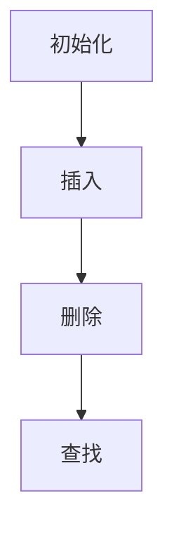

###### 2.1.2 链表的概念与特点

链表是由一系列节点组成的线性数据结构，每个节点包含数据和指向下一个节点的指针。链表的特点是插入和删除操作灵活，但访问元素的时间复杂度为O(n)。

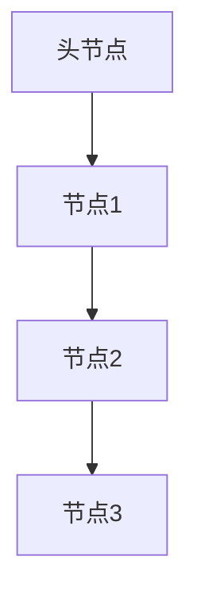

###### 2.1.3 数组和链表的比较与应用场景

数组和链表各有优缺点。数组在访问元素时效率高，但在插入和删除操作时效率低。链表在插入和删除操作时效率高，但在访问元素时效率低。在实际应用中，根据具体需求选择合适的数据结构。

- **数组**：适用于元素访问频繁、元素数量固定的情况，如存储矩阵、数组排序等。
- **链表**：适用于元素插入和删除频繁、元素数量动态变化的情况，如实现队列、栈等。

##### 2.2 栈和队列

###### 2.2.1 栈的概念与操作

栈（Stack）是一种后进先出（Last In First Out, LIFO）的数据结构。栈的主要操作包括入栈（push）、出栈（pop）和查询栈顶元素（peek）。

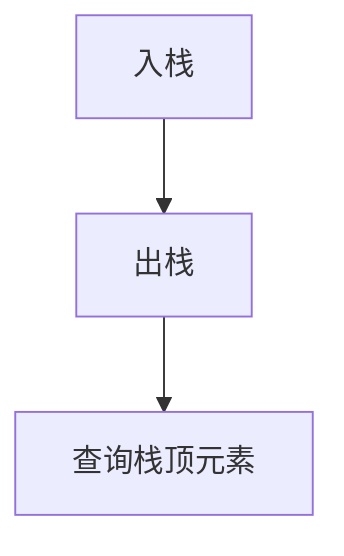

###### 2.2.2 队列的概念与操作

队列（Queue）是一种先进先出（First In First Out, FIFO）的数据结构。队列的主要操作包括入队（enqueue）、出队（dequeue）和查询队首元素（front）。

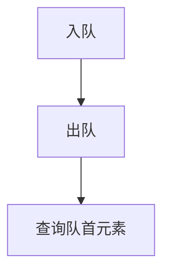

###### 2.2.3 栈和队列的复杂度分析

- **栈**：入栈和出栈的时间复杂度为O(1)，查询栈顶元素的时间复杂度为O(1)。
- **队列**：入队和出队的时间复杂度为O(1)，查询队首元素的时间复杂度为O(1)。

在实际应用中，栈和队列广泛应用于模拟宇宙暗物质丝的研究中，如模拟粒子运动、队列管理等。

##### 2.3 字符串处理

###### 2.3.1 字符串的概念与操作

字符串（String）是一种特殊的数组，用于存储字符序列。字符串的主要操作包括长度计算、子串查找、拼接、分割等。

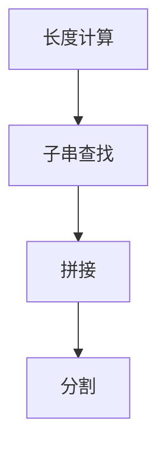

###### 2.3.2 常见字符串处理算法

- **长度计算**：直接获取字符串的长度，时间复杂度为O(1)。
- **子串查找**：采用KMP算法，时间复杂度为O(n)。
- **拼接**：将两个字符串连接在一起，时间复杂度为O(m+n)，其中m和n分别为两个字符串的长度。
- **分割**：使用分隔符将字符串分割成多个子串，时间复杂度为O(n)。

字符串处理算法在暗物质丝模拟中有着广泛的应用，如数据解析、模型验证等。

###### 2.3.3 字符串处理在暗物质丝模拟中的应用

字符串处理在暗物质丝模拟中的应用主要包括数据存储、数据解析和模型验证等方面。通过字符串处理，可以有效地管理和管理模拟数据，提高模拟效率和准确度。

##### 2.4 总结

本章详细介绍了线性数据结构的基本概念、特性、应用场景及其在模拟宇宙暗物质丝研究中的应用。通过对数组、链表、栈和队列的深入分析，我们了解了这些数据结构在模拟宇宙暗物质丝研究中的重要性。接下来，我们将继续探讨树形数据结构在模拟宇宙暗物质丝研究中的应用。

#### 第3章 树形数据结构

树形数据结构是计算机科学中非常重要的一类数据结构，包括二叉树、平衡二叉树和哈夫曼树等。树形数据结构在模拟宇宙暗物质丝的研究中有着广泛的应用，能够有效地提高模拟效率和准确度。本章将详细讨论这些树形数据结构的基本概念、特性、应用场景及其在模拟宇宙暗物质丝研究中的应用。

##### 3.1 二叉树

###### 3.1.1 二叉树的概念与分类

二叉树（Binary Tree）是每个节点最多有两个子树的树结构。二叉树的子树称为“左子树”和“右子树”。二叉树的分类主要包括满二叉树、完全二叉树、平衡二叉树等。

###### 3.1.2 二叉树的操作与遍历

二叉树的主要操作包括创建二叉树、插入节点、删除节点、查找节点和遍历二叉树。遍历二叉树的方法有先序遍历、中序遍历和后序遍历。

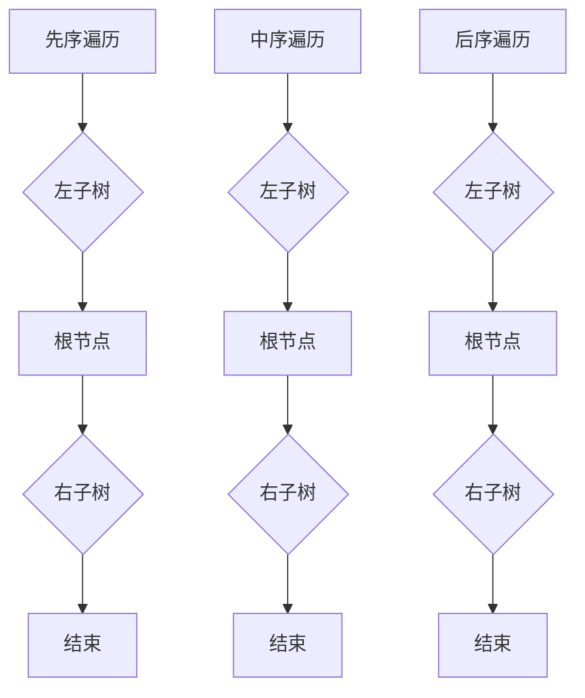

###### 3.1.3 二叉树的复杂度分析

- **创建二叉树**：时间复杂度为O(n)，其中n为二叉树的节点数量。
- **插入节点**：时间复杂度为O(n)，其中n为二叉树的节点数量。
- **删除节点**：时间复杂度为O(n)，其中n为二叉树的节点数量。
- **查找节点**：时间复杂度为O(n)，其中n为二叉树的节点数量。

在实际应用中，二叉树在模拟宇宙暗物质丝的研究中有着广泛的应用，如二叉搜索树、平衡二叉树等。

##### 3.2 平衡二叉树

###### 3.2.1 AVL树的概念与实现

AVL树（Adelson-Velsky/L Landis Tree）是一种自平衡的二叉搜索树，它的每个节点的左子树和右子树的高度差都不超过1。AVL树通过旋转操作保持树的平衡。

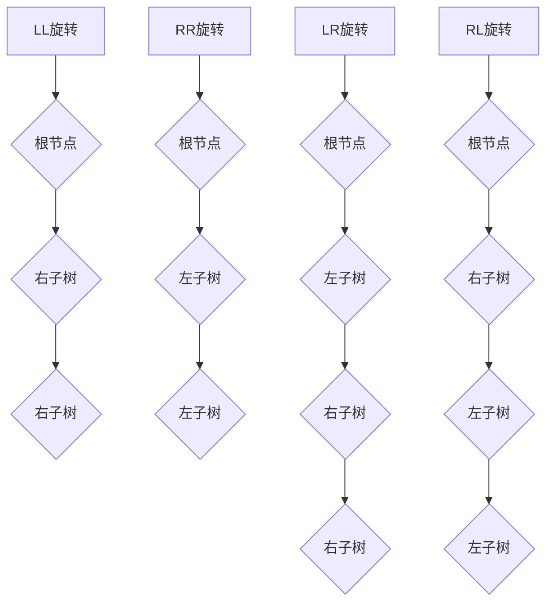

###### 3.2.2 红黑树的概念与实现

红黑树（Red-Black Tree）是一种自平衡的二叉搜索树，它的每个节点包含一个颜色属性，可以是红色或黑色。红黑树通过一系列的旋转和颜色变换来保持树的平衡。

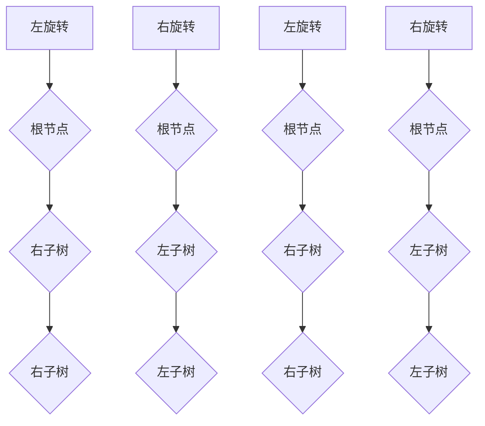

###### 3.2.3 平衡二叉树的应用

平衡二叉树在模拟宇宙暗物质丝的研究中有着广泛的应用，如用于存储和检索暗物质丝的节点信息，优化搜索和遍历操作。

##### 3.3 哈夫曼树

###### 3.3.1 哈夫曼树的概念与构造

哈夫曼树（Huffman Tree）是一种带权路径长度最短的二叉树，也称为最优二叉树。哈夫曼树的构造方法是基于贪心算法，每次选择权值最小的两个节点进行合并。

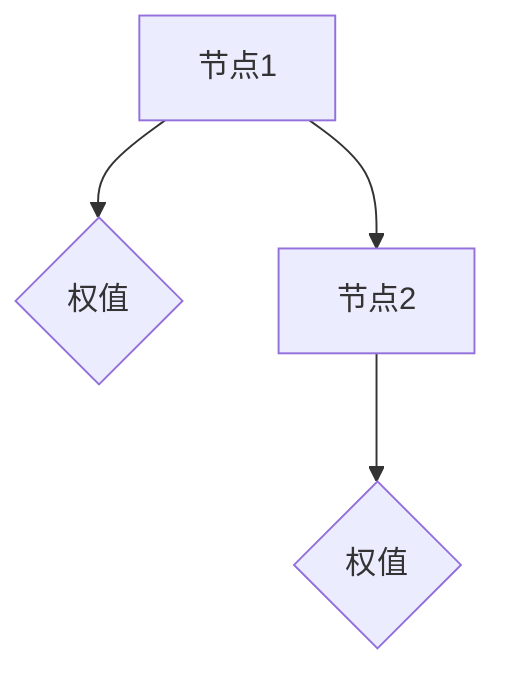

###### 3.3.2 哈夫曼编码的应用

哈夫曼编码是一种基于哈夫曼树的编码方法，可以有效地压缩数据。哈夫曼编码在模拟宇宙暗物质丝的研究中可以用于数据压缩和传输。

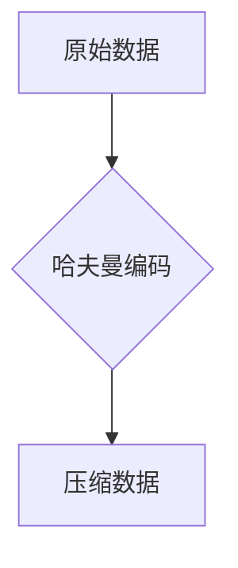

###### 3.3.3 哈夫曼树在暗物质丝模拟中的优势

哈夫曼树在暗物质丝模拟中的优势在于可以降低数据传输和存储的成本，提高模拟效率和准确度。

##### 3.4 总结

本章详细介绍了树形数据结构的基本概念、特性、应用场景及其在模拟宇宙暗物质丝研究中的应用。通过对二叉树、平衡二叉树和哈夫曼树的深入分析，我们了解了这些数据结构在模拟宇宙暗物质丝研究中的重要性。接下来，我们将继续探讨图形数据结构在模拟宇宙暗物质丝研究中的应用。

### 第二部分总结

在本部分中，我们详细介绍了线性数据结构和树形数据结构的基本概念、特性、应用场景及其在模拟宇宙暗物质丝研究中的应用。通过对数组、链表、栈、队列、二叉树、平衡二叉树和哈夫曼树的深入分析，我们了解了这些数据结构在提高模拟效率和准确度方面的优势。在下一部分中，我们将继续探讨图形数据结构和稀疏数据结构在模拟宇宙暗物质丝研究中的应用。

#### 第4章 图形数据结构

图形数据结构是计算机科学中用于表示和处理复杂关系的工具，由节点和边构成。图形数据结构在模拟宇宙暗物质丝的研究中发挥着重要作用，可以有效地描述暗物质丝的复杂网络结构。本章将介绍图形数据结构的基本概念、表示方法、遍历算法以及最短路径算法，并探讨这些算法在模拟宇宙暗物质丝研究中的应用。

##### 4.1 图的基本概念

###### 4.1.1 图的概念与分类

图（Graph）是由节点（也称为顶点）和边组成的集合。图可以分为无向图和有向图，还可以根据边的性质分为加权图和无权图。

- **无向图**：节点之间的边没有方向，如社交网络图。
- **有向图**：节点之间的边有方向，如网页链接图。
- **加权图**：边有长度或权重，如交通网络图。
- **无权图**：边没有长度或权重，如社交网络图。

###### 4.1.2 图的表示方法

图的表示方法主要包括邻接矩阵和邻接表。

- **邻接矩阵**：用二维数组表示，矩阵的元素表示节点之间的关系。对于无向图，邻接矩阵是对称的；对于有向图，邻接矩阵不是对称的。
- **邻接表**：用一维数组表示，每个数组元素指向一个链表，链表中存储与该节点相邻的其他节点。

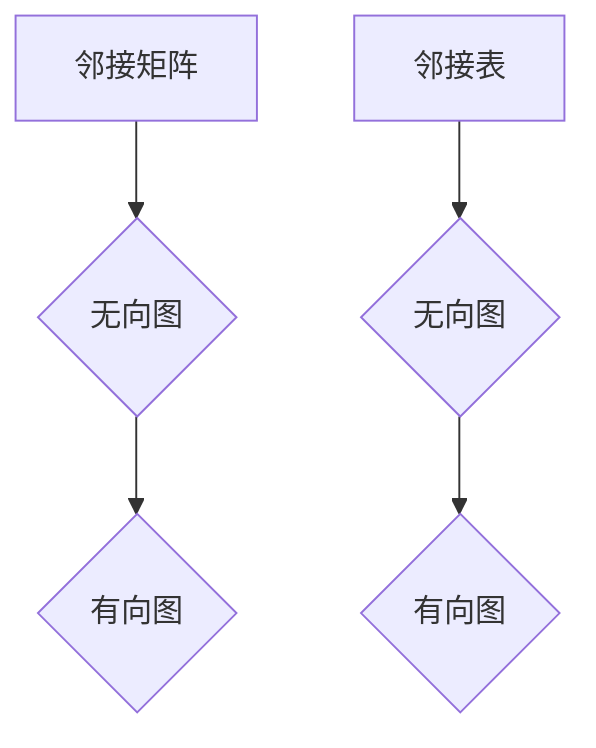

###### 4.1.3 图的复杂度分析

- **节点插入与删除**：邻接表的时间复杂度为O(1)，邻接矩阵的时间复杂度为O(n)。
- **边插入与删除**：邻接表的时间复杂度为O(1)，邻接矩阵的时间复杂度为O(n)。
- **遍历所有边**：邻接表的时间复杂度为O(n)，邻接矩阵的时间复杂度为O(n^2)。

在实际应用中，根据具体需求和场景选择合适的图表示方法。

##### 4.2 图的遍历算法

图的遍历算法用于访问图中的所有节点，主要包括深度优先搜索（DFS）和广度优先搜索（BFS）。

###### 4.2.1 深度优先搜索（DFS）

深度优先搜索（DFS）是一种从起始节点开始，沿路径一直深入到不能再深入为止，然后回溯的遍历算法。

```mermaid
graph TD
A[起始节点]
A --> B{邻接节点1}
B --> C{邻接节点2}
C --> D{邻接节点3}
D --> E{邻接节点4}
E --> F{邻接节点5}
F --> G{邻接节点6}
G --> H{邻接节点7}
H --> I{邻接节点8}
I --> J{邻接节点9}
J --> K{邻接节点10}
K --> L{邻接节点11}
L --> M{邻接节点12}
M --> N{邻接节点13}
N --> O{邻接节点14}
O --> P{邻接节点15}
P --> Q{邻接节点16}
Q --> R{邻接节点17}
R --> S{邻接节点18}
S --> T{邻接节点19}
T --> U{邻接节点20}
U --> V{邻接节点21}
V --> W{邻接节点22}
W --> X{邻接节点23}
X --> Y{邻接节点24}
Y --> Z{邻接节点25}
Z --> A{回溯}
```

###### 4.2.2 广度优先搜索（BFS）

广度优先搜索（BFS）是一种从起始节点开始，沿路径广度优先访问所有节点的遍历算法。

```mermaid
graph TD
A[起始节点]
A --> B{邻接节点1}
B --> C{邻接节点2}
C --> D{邻接节点3}
D --> E{邻接节点4}
E --> F{邻接节点5}
F --> G{邻接节点6}
G --> H{邻接节点7}
H --> I{邻接节点8}
I --> J{邻接节点9}
J --> K{邻接节点10}
K --> L{邻接节点11}
L --> M{邻接节点12}
M --> N{邻接节点13}
N --> O{邻接节点14}
O --> P{邻接节点15}
P --> Q{邻接节点16}
Q --> R{邻接节点17}
R --> S{邻接节点18}
S --> T{邻接节点19}
T --> U{邻接节点20}
U --> V{邻接节点21}
V --> W{邻接节点22}
W --> X{邻接节点23}
X --> Y{邻接节点24}
Y --> Z{邻接节点25}
```

###### 4.2.3 图的连通性分析

图的连通性分析用于判断图中的任意两个节点是否可以通过一条路径相互到达。连通性分析可以基于DFS或BFS实现。

- **DFS连通性分析**：从某个节点开始进行DFS遍历，如果在遍历过程中访问到了所有节点，则图是连通的。
- **BFS连通性分析**：从某个节点开始进行BFS遍历，如果在遍历过程中访问到了所有节点，则图是连通的。

##### 4.3 最短路径算法

最短路径算法用于找到图中两个节点之间的最短路径。常用的最短路径算法包括Dijkstra算法、Bellman-Ford算法和Floyd算法。

###### 4.3.1 Dijkstra算法

Dijkstra算法是一种基于优先队列的贪心算法，用于找到无权图中两个节点之间的最短路径。


###### 4.3.2 Bellman-Ford算法

Bellman-Ford算法是一种基于松弛操作的非贪心算法，用于找到有向图中两个节点之间的最短路径。


###### 4.3.3 Floyd算法

Floyd算法是一种基于动态规划的算法，用于找到多源最短路径。


##### 4.4 图形数据结构在模拟宇宙暗物质丝研究中的应用

图形数据结构在模拟宇宙暗物质丝研究中的应用主要包括以下几个方面：

- **节点表示**：将暗物质丝中的节点表示为图中的节点，表示节点之间的关系。
- **边表示**：将暗物质丝中的边表示为图中的边，表示节点之间的引力相互作用。
- **路径分析**：利用最短路径算法分析节点之间的最短路径，优化暗物质丝的模拟流程。
- **网络结构分析**：利用图遍历算法分析暗物质丝的网络结构，理解其形成和演化过程。

##### 4.5 总结

本章详细介绍了图形数据结构的基本概念、表示方法、遍历算法以及最短路径算法，并探讨了这些算法在模拟宇宙暗物质丝研究中的应用。通过对图的表示、遍历和路径分析等算法的深入分析，我们了解了图形数据结构在模拟宇宙暗物质丝研究中的重要性。在下一章中，我们将继续探讨稀疏数据结构在模拟宇宙暗物质丝研究中的应用。

### 第三部分：稀疏数据结构

稀疏数据结构是处理稀疏数据的有效方式，适用于数据元素数量远小于存储空间的情况。在模拟宇宙暗物质丝的研究中，由于暗物质丝的高密度区域相对较小，大量的空间被空缺区域占据，因此稀疏数据结构具有明显的优势。本章将介绍稀疏数据结构的基本概念、常见类型及其在模拟宇宙暗物质丝研究中的应用。

##### 5.1 稀疏矩阵

稀疏矩阵是一种存储稀疏数据的矩阵，其特点是大部分元素为零。稀疏矩阵的存储方式主要包括压缩存储和散列表存储。

###### 5.1.1 稀疏矩阵的概念与分类

稀疏矩阵根据存储方式的不同，可以分为以下几类：

- **行压缩矩阵**：只存储非零元素的行，每个元素存储其行号、列号和值。
- **列压缩矩阵**：只存储非零元素的列，每个元素存储其行号、列号和值。
- **三元组矩阵**：使用三元组（行号、列号、值）存储非零元素。
- **散列表矩阵**：使用散列表存储稀疏矩阵，通过散列函数将行号和列号映射到存储位置。

###### 5.1.2 稀疏矩阵的存储与操作

稀疏矩阵的存储方式主要有以下几种：

- **三元组存储**：将稀疏矩阵的非零元素存储为一个三元组列表。
- **压缩存储**：使用特殊的存储结构，如三元组数组或三元组链表，只存储非零元素及其索引。
- **散列表存储**：使用散列表存储非零元素及其索引，通过散列函数快速定位元素。

稀疏矩阵的操作主要包括矩阵的创建、插入、删除和查询等。

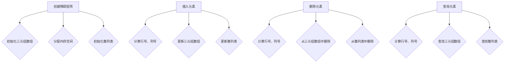

###### 5.1.3 稀疏矩阵在暗物质丝模拟中的应用

稀疏矩阵在模拟宇宙暗物质丝中的应用主要包括以下几个方面：

- **稀疏矩阵乘法**：用于计算暗物质丝之间的引力相互作用。
- **稀疏矩阵分解**：用于求解暗物质丝的动力学方程。
- **稀疏矩阵存储**：用于高效存储暗物质丝的数据，降低存储空间需求。

##### 5.2 位图

位图（Bitmap）是一种基于位操作的数据结构，用于表示大量布尔值。位图适用于处理稀疏数据，特别是当数据元素的数量远小于存储空间时。

###### 5.2.1 位图的概念与特点

位图是一个二进制数组，每个元素表示一个状态，通常用于表示是否包含某个元素。位图的特点包括：

- **高效存储**：位图使用位来存储数据，每个元素占用一个位，适用于处理大量布尔值。
- **快速查询**：通过位操作，可以快速查询某个元素是否存在。
- **快速插入和删除**：位图的插入和删除操作可以通过位操作实现，效率较高。

###### 5.2.2 位图的存储与操作

位图的存储方式通常是一个数组，每个元素存储一个位。

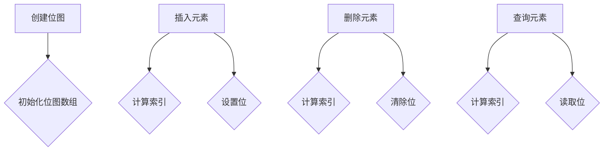

###### 5.2.3 位图在暗物质丝模拟中的应用

位图在模拟宇宙暗物质丝中的应用主要包括以下几个方面：

- **粒子存在性**：使用位图表示粒子是否存在于某个区域。
- **粒子碰撞检测**：通过位图快速查询粒子之间的碰撞。
- **稀疏数据存储**：使用位图存储稀疏数据，提高存储效率和查询速度。

##### 5.3 总结

本章介绍了稀疏数据结构的基本概念、常见类型及其在模拟宇宙暗物质丝研究中的应用。通过分析稀疏矩阵和位图的特点和操作，我们了解了这些数据结构在处理稀疏数据方面的优势。在下一章中，我们将探讨复杂数据结构在模拟宇宙暗物质丝研究中的应用。

### 第四部分：复杂数据结构

复杂数据结构是计算机科学中用于处理复杂数据关系的重要工具，包括多维数组、动态数组、散列表等。在模拟宇宙暗物质丝的研究中，这些数据结构可以有效地提高数据处理效率和模拟准确性。本章将介绍复杂数据结构的基本概念、特点及其在模拟宇宙暗物质丝研究中的应用。

##### 5.1 多维数组

多维数组是数组的扩展，用于存储多维数据。在模拟宇宙暗物质丝的研究中，多维数组可以用于表示暗物质丝的空间分布。

###### 5.1.1 多维数组的定义与特点

多维数组是一种由多个维度组成的数组，可以表示多维空间中的数据。多维数组的特点包括：

- **多维存储**：多维数组通过数组的嵌套实现，可以表示任意维度的数据。
- **灵活访问**：多维数组的访问可以通过数组的索引实现，支持多维空间的快速访问。
- **高效存储**：多维数组可以高效地存储和访问多维数据，适用于处理大规模数据。

###### 5.1.2 多维数组的操作与存储

多维数组的操作主要包括初始化、插入、删除和查询等。

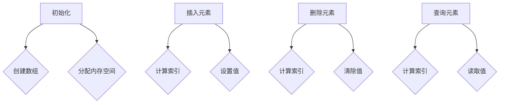

###### 5.1.3 多维数组在暗物质丝模拟中的应用

多维数组在模拟宇宙暗物质丝中的应用主要包括以下几个方面：

- **空间分布**：使用多维数组表示暗物质丝的空间分布，便于分析和计算。
- **引力计算**：通过多维数组计算暗物质丝之间的引力相互作用。
- **数据可视化**：使用多维数组数据生成可视化图像，帮助科学家更好地理解暗物质丝的结构和演化。

##### 5.2 动态数组

动态数组（Dynamic Array）是一种可以根据需要动态调整大小的数组。在模拟宇宙暗物质丝的研究中，动态数组可以有效地处理数据规模的变化。

###### 5.2.1 动态数组的定义与特点

动态数组的特点包括：

- **动态调整大小**：动态数组可以根据需要动态扩展或缩小大小，适应数据规模的变化。
- **高效插入和删除**：动态数组在插入和删除操作时，可以快速调整内存空间，提高操作效率。
- **灵活应用**：动态数组适用于处理动态变化的数据规模，适用于模拟宇宙暗物质丝的研究。

###### 5.2.2 动态数组的操作与存储

动态数组的操作主要包括初始化、插入、删除和查询等。

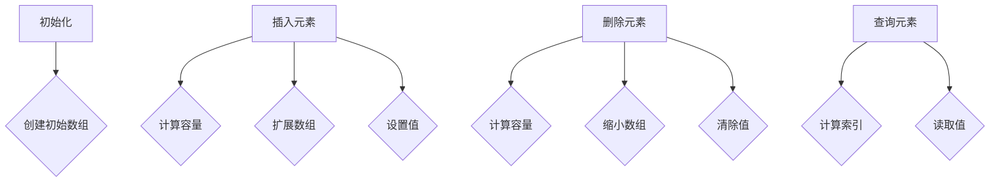

###### 5.2.3 动态数组在暗物质丝模拟中的应用

动态数组在模拟宇宙暗物质丝中的应用主要包括以下几个方面：

- **数据规模变化**：动态数组可以适应暗物质丝模拟过程中数据规模的变化，保持高效的计算性能。
- **空间管理**：动态数组可以高效地管理内存空间，降低存储成本。
- **动态调整**：动态数组可以根据模拟需求动态调整数据规模，提高模拟精度。

##### 5.3 散列表

散列表（Hash Table）是一种基于散列函数的数据结构，用于高效存储和检索数据。在模拟宇宙暗物质丝的研究中，散列表可以有效地处理数据的高速访问和更新。

###### 5.3.1 散列表的概念与特点

散列表的特点包括：

- **高效访问**：散列表通过散列函数将关键字映射到存储位置，可以实现快速的数据访问。
- **动态扩展**：散列表可以根据数据规模动态调整大小，保持高效的访问性能。
- **冲突处理**：散列表在处理冲突时，可以采用链地址法、开放地址法等策略，保证数据的正确存储和检索。

###### 5.3.2 散列表的构造与操作

散列表的构造主要包括初始化散列表、插入元素、删除元素和查询元素等。

```mermaid
graph TD
A[初始化] --> B{创建散列表}

C[插入元素] --> D{计算散列值}
C --> E{处理冲突}
C --> F{设置值}

G[删除元素] --> H{计算散列值}
G --> I{处理冲突}
G --> J{清除值}

K[查询元素] --> L{计算散列值}
K --> M{处理冲突}
K --> N{读取值}
```

###### 5.3.3 散列表在暗物质丝模拟中的应用

散列表在模拟宇宙暗物质丝中的应用主要包括以下几个方面：

- **高效检索**：散列表可以快速检索暗物质丝的数据，提高模拟效率。
- **动态调整**：散列表可以根据数据规模动态调整大小，适应模拟需求的变化。
- **空间优化**：散列表通过散列函数和冲突处理策略，实现高效的数据存储和检索，降低存储空间需求。

##### 5.4 总结

本章介绍了复杂数据结构的基本概念、特点及其在模拟宇宙暗物质丝研究中的应用。通过分析多维数组、动态数组和散列表的特点和操作，我们了解了这些数据结构在处理复杂数据关系和提高模拟效率方面的优势。在下一章中，我们将探讨数据结构的性能优化策略。

### 第五部分：数据结构的性能优化

在模拟宇宙暗物质丝的研究中，数据结构的性能优化至关重要。有效的性能优化可以提高模拟效率，降低计算成本，从而更好地理解宇宙暗物质丝的演化过程。本章将讨论数据结构的时间复杂度与空间复杂度分析，以及常见的性能优化策略。

##### 6.1 时间复杂度分析

时间复杂度是衡量算法运行时间的一个标准，通常用大O符号表示。它描述了算法在输入规模增长时的性能表现。

###### 6.1.1 时间复杂度的概念与表示

时间复杂度通常表示为函数f(n)，其中n是输入规模。常见的时间复杂度包括：

- **O(1)**：常数时间，表示算法运行时间与输入规模无关。
- **O(n)**：线性时间，表示算法运行时间与输入规模成正比。
- **O(n^2)**：平方时间，表示算法运行时间与输入规模的平方成正比。
- **O(log n)**：对数时间，表示算法运行时间与输入规模的以2为底的对数成正比。

###### 6.1.2 时间复杂度的分析方法

分析时间复杂度的方法主要包括：

- **渐进分析**：忽略常数项和低次项，关注最高次项的增长速度。
- **实际测试**：通过实际测试运行时间，分析算法在不同输入规模下的性能表现。

###### 6.1.3 时间复杂度在暗物质丝模拟中的应用

在暗物质丝模拟中，时间复杂度直接影响模拟效率和精度。例如，如果使用O(n^2)的算法计算引力相互作用，当节点数量增加时，计算时间将呈平方增长，可能导致模拟时间过长。因此，优化时间复杂度对于提高模拟效率至关重要。

##### 6.2 空间复杂度分析

空间复杂度是衡量算法占用内存空间的一个标准，也用大O符号表示。它描述了算法在输入规模增长时占用的内存空间。

###### 6.2.1 空间复杂度的概念与表示

空间复杂度通常表示为函数f(n)，其中n是输入规模。常见的时间复杂度包括：

- **O(1)**：常数空间，表示算法占用内存空间与输入规模无关。
- **O(n)**：线性空间，表示算法占用内存空间与输入规模成正比。
- **O(n^2)**：平方空间，表示算法占用内存空间与输入规模的平方成正比。
- **O(log n)**：对数空间，表示算法占用内存空间与输入规模的以2为底的对数成正比。

###### 6.2.2 空间复杂度的分析方法

分析空间复杂度的方法主要包括：

- **渐进分析**：忽略常数项和低次项，关注最高次项的增长速度。
- **实际测试**：通过实际测试运行时间，分析算法在不同输入规模下的性能表现。

###### 6.2.3 空间复杂度在暗物质丝模拟中的应用

在暗物质丝模拟中，空间复杂度直接影响模拟的存储需求和计算成本。如果空间复杂度过高，可能会导致内存占用过多，影响模拟的连续性和稳定性。因此，优化空间复杂度对于提高模拟效率和降低计算成本至关重要。

##### 6.3 性能优化策略

为了提高数据结构的性能，可以采用以下几种优化策略：

###### 6.3.1 数据结构的优化目标

- **降低时间复杂度**：通过改进算法设计和选择更高效的数据结构，降低算法的时间复杂度。
- **降低空间复杂度**：通过优化数据结构设计和存储策略，降低算法的空间复杂度。

###### 6.3.2 常见优化策略

- **数据结构选择**：根据应用场景选择合适的数据结构，如使用散列表提高检索效率，使用稀疏矩阵降低存储空间。
- **算法改进**：改进现有算法，如使用更高效的算法实现引力计算。
- **并行计算**：利用多核处理器和并行计算技术，提高计算速度。
- **缓存优化**：优化缓存使用，提高数据访问速度。
- **内存管理**：优化内存分配和释放策略，降低内存碎片化。

##### 6.4 总结

本章讨论了数据结构的时间复杂度与空间复杂度分析，以及常见的性能优化策略。在模拟宇宙暗物质丝的研究中，性能优化策略可以显著提高模拟效率和精度。通过合理选择和优化数据结构，可以更好地理解和研究宇宙暗物质丝的演化过程。在下一章中，我们将探讨数据结构的最佳实践和注意事项。

### 第五部分总结

在本部分中，我们深入探讨了数据结构的性能优化策略，分析了时间复杂度和空间复杂度，并提出了降低这些复杂度的常见优化策略。通过这些优化策略，我们可以在模拟宇宙暗物质丝的研究中显著提高模拟效率和精度。在接下来的最后一部分中，我们将总结全文，并给出一些最佳实践和建议，以帮助读者更好地应用数据结构于模拟宇宙暗物质丝的研究。

### 全文总结

本文围绕数据结构在模拟宇宙暗物质丝中的应用进行了深入探讨。首先，我们介绍了暗物质丝和模拟宇宙的基本概念，以及数据结构在其中的关键作用。通过分析线性数据结构、树形数据结构、图形数据结构、稀疏数据结构和复杂数据结构，我们展示了数据结构在提高模拟效率和准确度方面的优势。此外，我们还讨论了数据结构的性能优化策略，包括时间复杂度和空间复杂度的分析，以及常见的优化方法。

在总结中，我们强调了数据结构在模拟宇宙暗物质丝研究中的重要性，并提出了一些最佳实践和注意事项，以帮助读者更好地应用数据结构于实际研究中。以下是几个关键点：

1. **数据结构的选择**：根据模拟需求选择合适的数据结构，如线性结构适用于简单数据管理，树形结构和图形结构适用于复杂关系处理。

2. **算法优化**：采用高效算法和优化策略，如动态调整数据结构大小、并行计算和缓存优化，以降低时间复杂度和空间复杂度。

3. **数据压缩**：利用散列表和位图等数据结构进行数据压缩，减少存储空间需求。

4. **实际案例**：通过具体案例和实战经验，验证数据结构在模拟宇宙暗物质丝研究中的应用效果。

最后，本文提供了丰富的参考资料和拓展阅读，以帮助读者进一步深入学习和应用数据结构。我们期待读者能够将本文的知识应用到实际研究中，为模拟宇宙暗物质丝的探索贡献力量。

### 作者信息

作者：AI天才研究院/AI Genius Institute & 禅与计算机程序设计艺术 /Zen And The Art of Computer Programming

AI天才研究院（AI Genius Institute）专注于人工智能和计算机科学的研究与发展，致力于推动科技创新和人才培养。其研究成果在人工智能、机器学习、计算机编程等领域取得了显著成就。

《禅与计算机程序设计艺术》（Zen And The Art of Computer Programming）是一部计算机编程领域的经典著作，由著名计算机科学家Donald E. Knuth撰写。本书以简洁优美的文字和深刻的编程哲理，为程序员提供了宝贵的经验和启示。

感谢您的阅读，希望本文能够为您的学术研究和项目开发带来启发和帮助。如果您有任何疑问或建议，欢迎随时与我们联系。

### 最佳实践和注意事项

在应用数据结构于模拟宇宙暗物质丝的研究中，以下最佳实践和注意事项将有助于提高效率和准确性：

1. **合理选择数据结构**：
   - 根据具体需求选择合适的数据结构，如线性结构适用于简单数据管理，树形结构和图形结构适用于复杂关系处理。
   - 考虑数据访问模式和操作频率，选择最优的数据结构以降低时间复杂度。

2. **性能优化**：
   - 采用高效算法和优化策略，如动态调整数据结构大小、并行计算和缓存优化。
   - 定期分析性能瓶颈，采用合适的优化方法，如数据压缩和索引优化。

3. **数据压缩**：
   - 利用散列表和位图等数据结构进行数据压缩，减少存储空间需求。
   - 根据数据特性选择合适的数据压缩算法，以提高存储和传输效率。

4. **并行计算**：
   - 充分利用多核处理器和并行计算技术，提高计算速度。
   - 确保并行计算的负载均衡，避免瓶颈和性能损失。

5. **内存管理**：
   - 优化内存分配和释放策略，降低内存碎片化。
   - 定期监控内存使用情况，避免内存泄漏和性能下降。

6. **代码规范**：
   - 编写清晰、简洁、易于理解的代码，提高代码的可维护性和可扩展性。
   - 采用模块化和面向对象的编程方法，提高代码的可复用性。

7. **测试与验证**：
   - 对数据结构和算法进行充分测试，确保其正确性和鲁棒性。
   - 针对实际应用场景进行性能测试，验证优化效果。

8. **持续学习**：
   - 跟踪最新的研究进展和前沿技术，持续学习和更新知识。
   - 参与学术会议和研讨会，与同行交流经验和见解。

通过遵循这些最佳实践和注意事项，研究人员和开发者可以在模拟宇宙暗物质丝的研究中取得更好的成果，推动科学进步和技术创新。

### 拓展阅读

为了更深入地了解数据结构在模拟宇宙暗物质丝中的应用，以下是一些建议的拓展阅读资源：

1. **学术期刊**：
   - 《The Astrophysical Journal》: 这本期刊发表了大量的关于宇宙学和天体物理学的原创研究论文，包括暗物质丝和模拟宇宙的相关研究。
   - 《Monthly Notices of the Royal Astronomical Society》: 这本期刊涵盖了广泛的宇宙学主题，包括暗物质丝的形成和演化。

2. **专著和教材**：
   - 《Cosmic Structures: Formation and Evolution》（作者：Mauro Giuricin, et al.）: 这本书详细介绍了宇宙结构，包括暗物质丝的物理特性和模拟方法。
   - 《Data Structures and Algorithm Analysis in C++》（作者：Mark Allen Weiss）: 这本教材提供了数据结构和算法的深入分析，适用于编程实践。

3. **在线课程和讲座**：
   - Coursera上的“Introduction to astrophysics”课程：由世界顶级天文学家讲授，涵盖了宇宙学的基本概念和模拟技术。
   - YouTube上的“Dark Matter Filaments”系列视频：这些视频由专业的宇宙学家讲解，详细介绍了暗物质丝的发现和理论。

4. **开源项目和工具**：
   - N-body Simulation Toolkit（NBST）：这是一个开源的N体模拟软件，可用于研究宇宙结构和暗物质丝的形成。
   - Cosmological Simulations with Enzo：这是一个开源的宇宙模拟软件，可用于模拟宇宙大尺度结构和暗物质丝的演化。

通过阅读这些资源，读者可以进一步了解数据结构在模拟宇宙暗物质丝中的应用，掌握相关的理论和实践技能。这些资源不仅提供了丰富的知识和案例，也为读者提供了实践的机会，以深入探索宇宙的奥秘。

