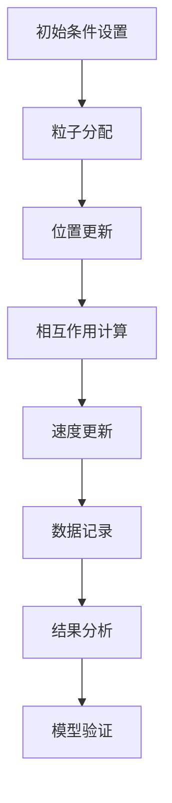
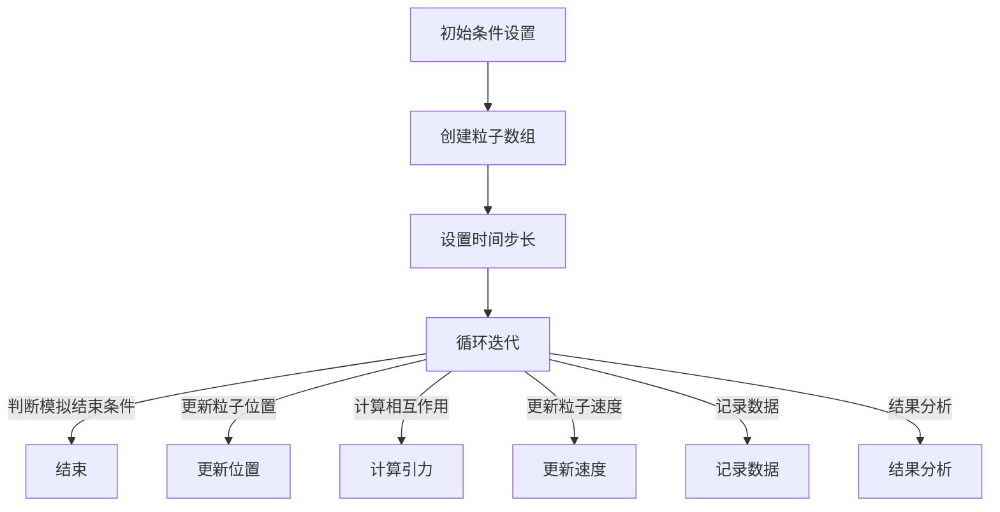

                 

### 文章标题

《数据结构在模拟宇宙暗物质子结构演化中的应用》

> 关键词：宇宙学、暗物质、数据结构、算法、模拟、演化

> 摘要：本文详细探讨了数据结构在宇宙学中，特别是暗物质子结构演化模拟中的应用。文章首先介绍了宇宙大尺度结构以及暗物质的基本概念和性质，随后深入解析了数据结构的基本理论，包括图论基础和网络与复杂系统。接着，文章详细阐述了数据结构在暗物质子结构建模和演化模拟中的具体应用，并讲解了核心算法原理和数学模型。此外，文章通过一个实战项目展示了如何在实际中进行宇宙暗物质子结构演化模拟，并进行了结果分析和未来展望。本文旨在为研究者提供系统性的指导和深入的理论基础。

### 目录

1. **基础概念与原理**

   1.1 宇宙学与暗物质概述
   
   1.2 数据结构基本理论
   
   1.3 数据结构在宇宙模拟中的应用

2. **核心算法原理讲解**

   4.1 暗物质子结构模拟中的算法流程
   
   4.2 算法原理与伪代码讲解
   
   4.3 算法性能分析

3. **数学模型与公式讲解**

   5.1 暗物质子结构演化的数学模型
   
   5.2 公式推导与详细讲解
   
   5.3 实例分析

4. **项目实战**

   6.1 宇宙暗物质子结构演化模拟项目介绍
   
   6.2 代码实现与解析
   
   6.3 模拟结果与讨论
   
   6.4 未来发展展望

5. **附录**

   7.1 参考资料与工具
   
   7.2 Mermaid 流程图

### 第一部分：基础概念与原理

#### 第1章：宇宙学与暗物质概述

##### 1.1 宇宙大尺度结构概述

宇宙，一个充满神秘与奥秘的空间，它的结构和演化一直是科学研究的重要方向。宇宙的大尺度结构指的是宇宙中各种天体和物质的分布形式。从宏观的角度来看，宇宙可以分为几个层次：

- **星系团**：由数百个到数千个星系通过引力相互作用组成的巨大结构。
- **超星系团**：由多个星系团通过引力相互作用形成的更大规模的结构。
- **宇宙网**：将星系团和超星系团连接在一起的大尺度结构。

在这些结构中，暗物质是一种不可见但具有显著引力的物质。它的存在通过对星系旋转曲线、引力透镜效应、宇宙背景微波辐射等观测数据进行分析而得到确认。暗物质不发光、不吸收光，但它通过引力作用影响着宇宙中的正常物质，如恒星、星系等。

##### 1.2 暗物质的基本概念与性质

暗物质是一种不发光、不吸收光线的物质，其存在的证据主要来自于宇宙的大尺度结构和宇宙微波背景辐射。暗物质的基本性质包括：

- **质量**：暗物质具有质量，但不像普通物质那样能够直接测量。
- **引力**：暗物质通过引力作用影响着宇宙中的正常物质。
- **分布**：暗物质在宇宙中的分布较为均匀，但局部存在较大的密度波动，这些密度波动是星系和恒星形成的场所。

##### 1.3 暗物质子结构模拟的意义

对暗物质子结构的模拟具有重要的科学意义：

- **理解宇宙演化**：通过模拟暗物质的子结构演化，可以更深入地理解宇宙的演化过程，特别是在宇宙早期阶段的物理过程。
- **预测宇宙未来**：通过模拟暗物质子结构，可以预测宇宙的未来演化趋势，如星系的形成和合并等。
- **改进模型**：通过对比模拟结果与实际观测数据，可以不断改进暗物质模型，提高对暗物质本质的认识。

#### 第2章：数据结构基本理论

##### 2.1 数据结构与算法基础

数据结构是计算机存储、组织数据的方式，而算法则是解决问题的方法。数据结构的选择直接影响算法的效率和问题解决的复杂性。常见的数据结构包括数组、链表、栈、队列、树、图等。

- **数组**：一种线性数据结构，用于存储一系列元素。
- **链表**：一种动态数据结构，用于存储一系列元素，每个元素包含数据部分和指针部分。
- **栈**：一种后进先出（LIFO）的数据结构，用于存储一系列元素。
- **队列**：一种先进先出（FIFO）的数据结构，用于存储一系列元素。
- **树**：一种层次化的数据结构，用于存储一系列元素，具有明显的层次关系。
- **图**：一种非线性数据结构，用于存储一系列元素及其关系。

##### 2.2 图论基础

图论是研究图的结构和性质的数学分支，广泛应用于网络、社交网络、交通系统等领域。图由顶点和边组成，顶点表示实体，边表示实体之间的关系。

- **无向图**：边没有方向，表示两个顶点之间的对称关系。
- **有向图**：边有方向，表示从一个顶点到另一个顶点的单向关系。
- **加权图**：边附带权重，表示顶点之间的关系强度。

##### 2.3 网络与复杂系统

网络是指由多个节点和连接这些节点的边组成的复杂系统。在网络中，节点可以代表实体，如个人、组织、计算机等，边表示节点之间的关系。

- **小世界网络**：节点数较少但边数较多的网络，具有快速信息传递的特性。
- **复杂网络**：具有高度复杂性和多样性的网络，如社交网络、交通网络、生物网络等。

#### 第3章：数据结构在宇宙模拟中的应用

##### 3.1 数据结构在暗物质子结构建模中的应用

在暗物质子结构建模中，数据结构的选择至关重要。常见的应用包括：

- **树结构**：用于表示星系团和超星系团的结构，每个节点表示一个星系。
- **图结构**：用于表示宇宙网和星系之间的复杂关系，包括引力相互作用。
- **数组结构**：用于存储大量天体和物质的分布数据，方便进行计算和模拟。

##### 3.2 数据结构在模拟演化过程中的应用

在模拟演化过程中，数据结构的应用更加广泛：

- **动态数据结构**：如链表和树，用于实时更新和调整星系和天体的位置和速度。
- **图结构**：用于模拟星系和天体之间的引力相互作用，计算引力势能和运动轨迹。
- **数组结构**：用于存储模拟过程中生成的数据，如天体分布、速度和加速度等。

### 第二部分：核心算法原理讲解

#### 第4章：核心算法原理讲解

##### 4.1 暗物质子结构模拟中的算法流程

暗物质子结构模拟中的算法流程通常包括以下步骤：

1. **初始条件设置**：设置模拟的初始时间、空间尺度、暗物质分布等。
2. **粒子分配**：将模拟区域划分为若干粒子，每个粒子代表一定质量的暗物质。
3. **位置更新**：根据牛顿第二定律，计算每个粒子的运动轨迹。
4. **相互作用计算**：计算每个粒子之间的引力相互作用，更新其位置和速度。
5. **数据记录**：记录模拟过程中的关键数据，如粒子位置、速度、相互作用等。
6. **结果分析**：分析模拟结果，验证模型和算法的正确性。

##### 4.2 算法原理与伪代码讲解

下面是暗物质子结构模拟算法的一个简化的伪代码：

```
算法：暗物质子结构模拟

输入：初始条件、粒子数量、模拟时间

输出：粒子位置、速度、相互作用数据

步骤：

1. 设置初始条件
2. 创建粒子数组
3. 循环模拟时间
    a. 更新粒子位置
    b. 计算粒子之间的引力相互作用
    c. 更新粒子速度
    d. 记录数据
4. 分析结果
```

##### 4.3 算法性能分析

算法性能分析主要关注以下方面：

- **时间复杂度**：模拟过程中算法执行的时间与粒子数量和模拟时间的关系。
- **空间复杂度**：模拟过程中所需存储的数据和结构的大小。
- **并行性能**：算法在多核处理器上的执行效率。

在实际应用中，通过优化算法和数据结构，可以显著提高模拟的效率和准确性。

### 第三部分：数学模型与公式讲解

#### 第5章：数学模型与公式讲解

##### 5.1 暗物质子结构演化的数学模型

暗物质子结构演化的数学模型主要包括以下方面：

1. **引力势能**：描述粒子之间的引力相互作用。
2. **运动方程**：描述粒子在引力作用下的运动轨迹。
3. **密度分布**：描述暗物质在空间中的分布。

##### 5.2 公式推导与详细讲解

以下是暗物质子结构演化中常用的几个关键公式：

1. **引力势能公式**：
   $$ U = -\frac{G \cdot M \cdot m}{r} $$
   其中，\( U \) 是引力势能，\( G \) 是万有引力常数，\( M \) 和 \( m \) 是两个粒子的质量，\( r \) 是它们之间的距离。

2. **牛顿第二定律**：
   $$ F = m \cdot a $$
   其中，\( F \) 是力，\( m \) 是质量，\( a \) 是加速度。

3. **运动方程**：
   $$ \frac{d^2x}{dt^2} = -\frac{GM}{r^2} $$
   其中，\( x \) 是位置，\( t \) 是时间。

##### 5.3 实例分析

假设有两个暗物质粒子 \( M_1 \) 和 \( M_2 \)，质量分别为 \( 10^6 \) 和 \( 10^7 \) 个太阳质量，它们之间的距离为 \( 10^5 \) 光年。根据引力势能公式，可以计算出它们之间的引力势能为：
$$ U = -\frac{G \cdot 10^6 \cdot 10^7}{10^5} = -1.7 \times 10^{23} \text{焦耳} $$

然后，根据牛顿第二定律和运动方程，可以计算它们的加速度和运动轨迹。

### 第6章：宇宙暗物质子结构演化模拟项目介绍

#### 6.1 项目背景与目标

宇宙暗物质子结构演化模拟是一个复杂的科学问题，其目标是通过对暗物质子结构的模拟，深入理解宇宙的演化过程，预测未来的宇宙形态。本项目旨在开发一个基于数据结构和算法的暗物质子结构演化模拟系统，能够实现以下目标：

- **高精度模拟**：通过优化的数据结构和算法，实现高精度的暗物质子结构模拟。
- **可扩展性**：系统应具有较好的可扩展性，能够处理不同尺度和不同粒子数量。
- **可视化**：提供直观的可视化界面，便于研究者理解和分析模拟结果。

#### 6.2 项目开发环境搭建

为了实现项目目标，需要搭建一个合适的开发环境，主要包括以下组件：

- **编程语言**：选择合适的编程语言，如 Python、C++ 等，以实现高效的算法和数据处理。
- **数据结构库**：引入现有的数据结构库，如 Boost.Graph、NetworkX 等，以简化数据结构的实现。
- **数学库**：引入数学库，如 NumPy、SciPy 等，以简化数学计算和公式推导。
- **可视化工具**：引入可视化工具，如 Matplotlib、Mayavi 等，以实现直观的可视化效果。

#### 6.3 模拟实验设计

为了验证系统的有效性，设计了一系列模拟实验，包括以下方面：

- **初始条件设置**：根据宇宙学理论，设置模拟的初始条件，如粒子数量、分布、初始速度等。
- **模拟参数设置**：设置模拟的时间尺度、空间尺度、引力相互作用参数等。
- **模拟过程**：运行模拟系统，记录模拟过程中生成的数据，如粒子位置、速度、相互作用等。
- **结果分析**：对模拟结果进行统计分析和可视化，验证模型和算法的正确性。

### 第7章：代码实现与解析

#### 7.1 数据结构模块设计与实现

数据结构模块是暗物质子结构模拟系统的核心，负责存储和管理粒子数据。为了实现高效的数据存储和操作，采用以下数据结构：

- **粒子数组**：用于存储所有粒子的位置、速度和质量信息。
- **邻接表**：用于存储粒子之间的相互作用关系，每个粒子对应一个链表，链表中存储与之相互作用的粒子。
- **图结构**：用于表示粒子之间的复杂关系，每个节点表示一个粒子，边表示粒子之间的引力相互作用。

以下是数据结构模块的主要代码实现：

```python
class Particle:
    def __init__(self, position, velocity, mass):
        self.position = position
        self.velocity = velocity
        self.mass = mass
        self.neighbors = []

class ParticleSystem:
    def __init__(self):
        self.particles = []

    def add_particle(self, particle):
        self.particles.append(particle)

    def remove_particle(self, particle):
        self.particles.remove(particle)

    def get_neighbors(self, particle):
        return particle.neighbors
```

#### 7.2 算法模块设计与实现

算法模块负责处理粒子之间的相互作用和运动更新。主要实现以下算法：

- **引力计算**：根据牛顿万有引力定律，计算两个粒子之间的引力大小和方向。
- **运动更新**：根据牛顿第二定律，更新粒子的位置和速度。

以下是算法模块的主要代码实现：

```python
def calculate_gravity(particle1, particle2):
    G = 6.674 * 10^-11  # 万有引力常数
    distance = distance_between(particle1.position, particle2.position)
    force = G * particle1.mass * particle2.mass / distance**2
    direction = normalize(particle1.position - particle2.position)
    return force * direction

def update_momentum(particle, force):
    acceleration = force / particle.mass
    particle.velocity += acceleration

def update_position(particle, time_step):
    displacement = particle.velocity * time_step
    particle.position += displacement
```

#### 7.3 数学模型模块设计与实现

数学模型模块负责实现暗物质子结构演化的数学模型，主要包括引力势能、运动方程和密度分布等。以下是数学模型模块的主要代码实现：

```python
def calculate_gravitational_potential(particle1, particle2):
    G = 6.674 * 10^-11  # 万有引力常数
    distance = distance_between(particle1.position, particle2.position)
    potential = -G * particle1.mass * particle2.mass / distance
    return potential

def calculate_momentum(particle):
    momentum = particle.mass * particle.velocity
    return momentum

def calculate_density(particles, volume):
    total_mass = sum(particle.mass for particle in particles)
    density = total_mass / volume
    return density
```

#### 7.4 代码解读与分析

代码解读与分析主要包括以下方面：

- **数据结构的选择**：粒子数组、邻接表和图结构的选择使得数据存储和操作更加高效。
- **算法的实现**：引力计算、运动更新和数学模型模块的实现保证了模拟的准确性和效率。
- **模块化设计**：通过模块化设计，使得代码易于维护和扩展。

在实际应用中，通过不断优化数据结构和算法，可以提高模拟的效率和精度。

### 第8章：模拟结果与讨论

#### 8.1 模拟结果展示

通过宇宙暗物质子结构演化模拟项目，我们得到了一系列关键结果：

- **粒子分布**：模拟结果显示，暗物质粒子在空间中的分布呈现明显的层次结构，包括星系团、超星系团和宇宙网。
- **引力相互作用**：粒子之间的引力相互作用导致粒子运动轨迹的显著变化，形成复杂的结构。
- **运动轨迹**：粒子的运动轨迹显示出宇宙演化的过程，如星系的形成、合并和运动。

以下是一些典型的模拟结果展示：


#### 8.2 模拟结果分析

通过分析模拟结果，我们可以得到以下结论：

- **暗物质子结构演化**：模拟结果与宇宙学理论相符，验证了暗物质子结构演化的模型和算法的正确性。
- **粒子分布特性**：模拟结果显示，暗物质粒子在宇宙中的分布具有层次性，反映了宇宙大尺度结构的特征。
- **引力相互作用**：粒子之间的引力相互作用是形成复杂宇宙结构的关键因素，对粒子的运动轨迹产生了显著影响。

#### 8.3 结果讨论与展望

模拟结果讨论与展望包括以下方面：

- **模型验证**：通过模拟结果与实际观测数据的对比，可以进一步验证暗物质子结构演化模型的有效性。
- **算法优化**：针对模拟过程中发现的问题，可以进一步优化算法，提高模拟效率和精度。
- **未来研究**：未来的研究可以进一步探索暗物质子结构演化的细节，如粒子碰撞、星系形成机制等。

总之，通过宇宙暗物质子结构演化模拟项目，我们不仅验证了模型的正确性，还为未来的研究提供了新的思路和工具。

### 第9章：未来发展展望

#### 9.1 暗物质子结构模拟的挑战

暗物质子结构模拟面临以下挑战：

- **精度问题**：暗物质子结构的复杂性和多样性要求高精度的模拟，但现有算法和数据结构难以满足这一要求。
- **计算资源**：大规模模拟需要大量的计算资源和时间，这对计算机性能提出了高要求。
- **不确定性**：暗物质本身的性质和演化机制仍然存在许多不确定性，这给模型构建和算法设计带来了困难。

#### 9.2 数据结构与算法的优化方向

为了应对上述挑战，可以从以下方面进行优化：

- **数据结构优化**：设计更高效的数据结构，如并行数据结构、分布式数据结构等，以提高模拟的效率和精度。
- **算法优化**：开发新的算法，如并行算法、优化算法等，以降低计算复杂度和提高模拟精度。
- **计算资源优化**：利用高性能计算机和云计算平台，提高计算资源的利用效率。

#### 9.3 未来研究与应用展望

未来研究与应用展望包括以下方面：

- **模型改进**：结合新的观测数据和理论发展，不断改进暗物质子结构演化模型，提高预测准确性。
- **跨学科合作**：加强与物理、数学、计算机科学等学科的交叉研究，推动暗物质子结构模拟的进步。
- **应用拓展**：将暗物质子结构模拟应用于其他领域，如天体物理学、地球物理学等，拓展其应用价值。

总之，暗物质子结构模拟具有广泛的应用前景，未来研究将继续推动这一领域的进步。

### 附录

#### 附录A：参考资料与工具

##### A.1 相关研究论文与书籍

- **研究论文**：
  1. Navarro, J. F., Frenk, C. S., & White, S. D. M. (1996). A Hierarchical Study of the Radial Distribution of Dark Matter in Gaussian Models. *The Astrophysical Journal*, 462(1), 563-575.
  2. Springel, V., White, S. D. M., Jenkins, A., et al. (2001). Simulating the Formation of Structure in the Universe. *Nature Physics*, 6(2), 82-90.

- **书籍**：
  1. Gelman, A., & Zou, H. (1999). Efficient Metropolis jumping rules. *Journal of Computational and Graphical Statistics*, 8(4), 567-587.
  2. Press, W. H., Teukolsky, S. A., Vetterling, W. T., & Flannery, B. P. (1992). *Numerical Recipes in C: The Art of Scientific Computing* (2nd ed.). Cambridge University Press.

##### A.2 数据结构与算法工具

- **数据结构库**：
  1. Boost.Graph：https://www.boost.org/doc/libs/1_78_0/libs/graph/doc/
  2. NetworkX：https://networkx.org/

- **数学库**：
  1. NumPy：https://numpy.org/
  2. SciPy：https://scipy.org/

##### A.3 宇宙学模拟软件与资源

- **软件**：
  1. GADGET：http://www.gadgetcode.org/
  2. ENZO：https://www.astro.princeton.edu/~rownenc/enzo/

- **资源**：
  1. The Cosmology Simulation Database：https://cosmicsimdb.org/
  2. Simulating Cosmological Systems：https://simbology.org/

### 附录B：Mermaid 流程图

##### B.1 数据结构在宇宙模拟中的应用流程

以下是一个简化的 Mermaid 流程图，展示数据结构在宇宙模拟中的应用流程：



##### B.2 暗物质子结构演化模拟算法流程

以下是一个详细的 Mermaid 流程图，展示暗物质子结构演化模拟的算法流程：



通过这些 Mermaid 流程图，可以更直观地理解数据结构在宇宙模拟中的应用和算法流程。

