                 

### 《数据结构在模拟宇宙磁场拓扑演化中的应用》

#### 关键词

- 数据结构
- 宇宙磁场
- 拓扑演化
- 模拟算法
- 图形处理

#### 摘要

本文旨在探讨数据结构在模拟宇宙磁场拓扑演化中的应用，通过对宇宙磁场和拓扑演化的基本概念进行介绍，深入分析数据结构在这两个领域中的重要作用。文章首先阐述了数据结构的基本概念和常见类型，然后分别从宇宙磁场模拟和拓扑演化分析的角度，详细讨论了数据结构的具体应用。接着，文章通过实际案例，展示了高级数据结构在宇宙磁场拓扑演化模拟中的优化策略。最后，文章展望了数据结构在宇宙学研究中可能面临的新趋势和挑战。本文对于从事宇宙学研究和数据结构设计的专业人士，以及对此领域感兴趣的读者，都具有较高的参考价值。

### 《数据结构在模拟宇宙磁场拓扑演化中的应用》目录大纲

#### 第一部分：引言与概述

1.1 书籍背景与目标  
1.1.1 宇宙磁场与拓扑演化的研究现状  
1.1.2 数据结构在宇宙学中的重要性  
1.1.3 书籍目标与读者对象

1.2 数据结构基础概念  
1.2.1 数据结构的基本概念  
1.2.2 常见数据结构及其特点  
1.2.3 数据结构的选择与优化

#### 第二部分：宇宙磁场拓扑演化的数据结构应用

2.1 宇宙磁场模拟中的数据结构应用  
2.1.1 宇宙磁场的模拟过程  
2.1.2 数据结构在宇宙磁场模拟中的作用  
2.1.3 适合宇宙磁场模拟的数据结构

2.2 拓扑演化中的数据结构应用  
2.2.1 拓扑演化的基本概念  
2.2.2 数据结构在拓扑演化分析中的应用  
2.2.3 拓扑演化中的数据结构优化

2.3 宇宙磁场拓扑演化模拟案例分析  
2.3.1 案例背景  
2.3.2 模拟过程与数据结构选择  
2.3.3 结果分析

#### 第三部分：高级数据结构在宇宙磁场拓扑演化中的应用

3.1 高级数据结构概述  
3.1.1 高级数据结构的定义与特点  
3.1.2 常见高级数据结构介绍

3.2 高级数据结构在宇宙磁场拓扑演化中的应用  
3.2.1 图数据结构在宇宙磁场模拟中的应用  
3.2.2 网格数据结构在拓扑演化分析中的应用  
3.2.3 高级数据结构的优化策略

3.3 高级数据结构应用案例分析  
3.3.1 案例背景  
3.3.2 数据结构选择与优化  
3.3.3 模拟结果与分析

#### 第四部分：数据结构在宇宙磁场拓扑演化中的前沿应用

4.1 数据结构在宇宙学研究中的新趋势  
4.1.1 新兴数据结构在宇宙学中的应用  
4.1.2 数据结构在宇宙学研究中的挑战与机遇  
4.1.3 未来研究方向

4.2 宇宙磁场拓扑演化模拟中的优化算法  
4.2.1 优化算法的基本概念  
4.2.2 优化算法在宇宙磁场拓扑演化中的应用  
4.2.3 优化算法的改进与挑战

4.3 宇宙磁场拓扑演化模拟项目实战  
4.3.1 项目背景与目标  
4.3.2 数据结构选择与实现  
4.3.3 项目实施与结果分析

#### 第五部分：总结与展望

5.1 全书总结  
5.1.1 数据结构在宇宙磁场拓扑演化中的应用总结  
5.1.2 书籍贡献与不足

5.2 展望未来  
5.2.1 数据结构在宇宙学中的潜在应用  
5.2.2 未来研究方向与挑战  
5.2.3 对读者的建议与鼓励

#### 附录

A.1 常用数据结构图示与示例  
A.1.1 线性数据结构  
A.1.2 树形数据结构  
A.1.3 图形数据结构  
A.1.4 高级数据结构  
A.2 数据结构在宇宙学模拟中的应用实例

### 第一部分：引言与概述

#### 1.1 书籍背景与目标

随着计算机科学和宇宙学的快速发展，数据结构在模拟宇宙磁场拓扑演化中的应用逐渐受到关注。宇宙磁场是宇宙中一种普遍存在的现象，对星系形成和演化有着深远的影响。而拓扑演化则描述了宇宙结构的动态变化，是宇宙学中一个重要的研究方向。数据结构作为一种基础的工具，能够有效地组织和管理宇宙磁场和拓扑演化的数据，为研究提供有力的支持。

本书记录了作者在数据结构应用于宇宙磁场拓扑演化研究中的心得体会，旨在为相关领域的学者和研究人员提供参考。通过系统地介绍数据结构的基本概念和应用方法，本文希望能够帮助读者理解数据结构在模拟宇宙磁场拓扑演化中的重要性，并掌握相应的应用技能。

##### 1.1.1 宇宙磁场与拓扑演化的研究现状

宇宙磁场是宇宙中存在的一种电动力学现象，它对星系、恒星和行星的形成及演化具有重要影响。宇宙磁场的起源和演化一直是天体物理学研究的重要课题。近年来，随着观测技术的进步，宇宙磁场的观测数据越来越多，这为研究宇宙磁场的拓扑演化提供了丰富的素材。

拓扑演化描述了宇宙结构的动态变化，是宇宙学中一个重要的研究方向。宇宙从大爆炸开始，经历了一个复杂的演化过程，形成了各种层次的宇宙结构，包括星系团、星系和恒星等。拓扑演化的研究可以帮助我们理解宇宙结构的形成和演化机制，从而更深入地认识宇宙的本质。

在宇宙磁场和拓扑演化的研究领域，数据结构的应用已经成为不可或缺的一部分。数据结构能够有效地组织和处理大量的观测数据，帮助研究人员从复杂的数据中提取有用的信息，从而推动研究的进展。目前，许多研究人员正在探索如何将数据结构更好地应用于宇宙磁场和拓扑演化的研究。

##### 1.1.2 数据结构在宇宙学中的重要性

数据结构在宇宙学中的重要性体现在多个方面。首先，宇宙学研究中产生和处理的都是大量复杂数据，这些数据包括星系的位置、运动速度、亮度、光谱特征等。数据结构能够帮助研究人员有效地组织和存储这些数据，使得数据更加易于管理和分析。

其次，数据结构在数据分析中发挥着关键作用。宇宙磁场和拓扑演化的研究需要处理大量的数据，并从中提取有用的信息。数据结构提供了高效的算法和数据操作方法，使得研究人员能够快速地对数据进行处理和分析，从而获得更加准确的研究结果。

最后，数据结构在模拟宇宙磁场和拓扑演化中具有重要作用。模拟是宇宙学研究中的一种重要手段，通过模拟可以重现宇宙结构的演化过程，从而验证理论模型和预测。数据结构能够帮助研究人员构建高效的模拟算法，使得模拟过程更加准确和可靠。

##### 1.1.3 书籍目标与读者对象

本书的目标是系统地介绍数据结构在模拟宇宙磁场拓扑演化中的应用，帮助读者理解数据结构的基本概念和应用方法。通过本书，读者可以了解：

1. 宇宙磁场和拓扑演化的基本概念及其研究现状。
2. 数据结构的基本概念和常见类型。
3. 数据结构在宇宙磁场模拟和拓扑演化分析中的应用。
4. 高级数据结构在宇宙磁场和拓扑演化模拟中的优化策略。
5. 数据结构在宇宙学研究中的前沿应用和挑战。

本书适合以下读者群体：

1. 宇宙学、天体物理学等专业的研究人员和研究生。
2. 数据结构和算法设计领域的技术人员。
3. 对宇宙学和数据结构交叉领域感兴趣的读者。

#### 1.2 数据结构基础概念

##### 1.2.1 数据结构的基本概念

数据结构是计算机科学中的一个重要概念，它描述了数据在存储、组织、管理和操作过程中的结构关系。数据结构分为线性结构和非线性结构，线性结构包括数组、链表、栈和队列等，非线性结构包括树、图和哈夫曼树等。

数据结构的基本概念包括数据元素、数据对象和数据结构。数据元素是数据的基本单位，数据对象是由若干数据元素组成的集合，数据结构则是数据对象的存储方式及操作方法。

##### 1.2.2 常见数据结构及其特点

常见的线性数据结构包括数组、链表、栈和队列等。数组是一种固定大小的数据集合，其元素在内存中连续存放，适合存储和访问任意位置的元素。链表则是通过节点链接的数据集合，其元素在内存中可以是分散的，适合动态分配和插入删除操作。栈和队列是一种特殊类型的线性数据结构，栈只允许在一端进行插入和删除操作，遵循后进先出（LIFO）原则；队列只允许在一端插入，在另一端删除，遵循先进先出（FIFO）原则。

常见的非线性数据结构包括树、图和哈夫曼树等。树是一种层次结构，用于表示元素之间的层次关系，常见的树结构包括二叉树、平衡二叉树和红黑树等。图是一种由节点和边构成的结构，用于表示元素之间的复杂关系，常见的图结构包括邻接矩阵和邻接表等。哈夫曼树是一种特殊的树结构，用于数据压缩，通过构造最优树实现数据的压缩存储。

##### 1.2.3 数据结构的选择与优化

数据结构的选择是计算机编程中的一个重要问题，选择合适的算法和数据结构可以显著提高程序的性能。在选择数据结构时，需要考虑以下因素：

1. 数据的操作需求：不同的数据结构适用于不同的操作，如查找、插入和删除等。
2. 数据的规模和存储空间：数据结构的选择应考虑数据的大小和存储空间的需求，如数组适合处理固定大小的数据，链表适合处理动态数据。
3. 性能要求：数据结构的性能直接影响程序的执行效率，需要根据具体的应用场景选择合适的算法和数据结构。
4. 可扩展性：数据结构的选择应考虑未来的扩展性，以便在数据规模增大时能够方便地进行扩展。

数据结构的优化是提高程序性能的一种重要手段，常见的优化方法包括：

1. 算法优化：通过改进算法的执行效率，减少程序的运行时间。如选择更适合的算法和数据结构，减少不必要的计算等。
2. 数据优化：通过对数据进行合理的组织和管理，提高数据的访问和处理效率。如使用缓存、优化数据结构等。
3. 并行优化：利用多核处理器和并行计算技术，提高程序的运行速度。如使用并行算法和并行数据结构等。

#### 第二部分：宇宙磁场拓扑演化的数据结构应用

##### 2.1 宇宙磁场模拟中的数据结构应用

##### 2.1.1 宇宙磁场的模拟过程

宇宙磁场的模拟是研究宇宙磁场演化过程的一种重要手段。宇宙磁场的模拟过程主要包括以下步骤：

1. 数据采集：通过观测和实验手段获取宇宙磁场的观测数据，如星系的位置、速度和磁场强度等。
2. 数据预处理：对采集到的观测数据进行预处理，包括数据清洗、去噪和归一化等，以提高数据的质量和准确性。
3. 网格划分：将宇宙空间划分为若干个网格，以方便对宇宙磁场进行模拟。网格的大小和密度可以根据具体的应用需求进行调整。
4. 磁场计算：根据观测数据和网格划分，计算每个网格点上的磁场强度和方向。常用的计算方法包括数值模拟、有限元分析和蒙特卡罗方法等。
5. 磁场演化：基于初始磁场分布和计算方法，模拟宇宙磁场的演化过程。通过迭代计算，可以观察到宇宙磁场的动态变化。
6. 结果分析：对模拟结果进行分析，提取有用的信息，如磁场的拓扑结构、能量分布和演化规律等。

##### 2.1.2 数据结构在宇宙磁场模拟中的作用

数据结构在宇宙磁场模拟中起着至关重要的作用，以下是数据结构在模拟过程中的一些具体应用：

1. 网格数据结构：网格数据结构用于将宇宙空间划分为若干个网格，以方便对宇宙磁场进行计算和模拟。常见的网格数据结构包括二维和三维数组、矩阵和稀疏矩阵等。二维和三维数组可以有效地表示连续的网格空间，而矩阵和稀疏矩阵可以高效地处理稀疏的网格数据。

2. 链表数据结构：链表数据结构可以用于表示宇宙磁场的边界和复杂结构。通过链表，可以方便地实现对磁场边界的插入和删除操作，从而提高模拟的灵活性。

3. 树数据结构：树数据结构可以用于表示宇宙磁场的层次结构，如星系、星团和超星系团等。通过树数据结构，可以方便地实现对宇宙结构的层次遍历和层次分析。

4. 图数据结构：图数据结构可以用于表示宇宙磁场中的复杂关系，如星系之间的相互作用和磁场线之间的交叉等。通过图数据结构，可以方便地实现对宇宙磁场的拓扑分析和结构优化。

##### 2.1.3 适合宇宙磁场模拟的数据结构

在宇宙磁场模拟中，选择适合的数据结构对于提高模拟效率和准确性至关重要。以下是一些适合宇宙磁场模拟的数据结构：

1. 二维数组：二维数组是一种简单而有效的数据结构，可以用于表示二维网格空间。它适合处理规则网格和稀疏网格，具有高效的数据访问和计算性能。

2. 三维数组：三维数组可以用于表示三维网格空间，适合处理复杂的宇宙空间结构。它具有高效的数据存储和计算性能，但需要注意内存占用的优化。

3. 矩阵：矩阵是一种适用于表示稀疏数据的线性结构，可以用于表示宇宙磁场的稀疏分布。它具有高效的数据访问和计算性能，但需要处理稀疏数据的存储和压缩问题。

4. 图：图是一种适用于表示复杂关系的非线性结构，可以用于表示宇宙磁场中的复杂结构和相互作用。它具有高效的数据访问和计算性能，但需要处理图的存储和遍历问题。

5. 哈夫曼树：哈夫曼树是一种适用于数据压缩的树结构，可以用于压缩宇宙磁场的观测数据。它具有高效的数据访问和计算性能，但需要注意压缩和解压的效率。

##### 2.2 拓扑演化中的数据结构应用

##### 2.2.1 拓扑演化的基本概念

拓扑演化是指宇宙结构在时间上的动态变化，它描述了星系、星团、超星系团等宇宙结构的形成、发展和消亡过程。拓扑演化涉及许多复杂的物理过程，如引力相互作用、宇宙膨胀、暗物质和暗能量的影响等。

拓扑演化可以分为以下几个阶段：

1. 原始阶段：宇宙从一个非常热的初始状态开始，逐渐冷却并形成原始物质。
2. 星系形成阶段：原始物质通过引力凝聚形成星系，星系内部存在大量的恒星和星际物质。
3. 星系团和超星系团形成阶段：多个星系通过引力相互作用形成星系团和超星系团，它们之间存在着复杂的相互作用和运动。
4. 演化与消亡阶段：宇宙结构继续演化，星系团和超星系团可能会合并或分裂，最终可能导致宇宙结构的消亡。

##### 2.2.2 数据结构在拓扑演化分析中的应用

数据结构在拓扑演化分析中扮演着重要角色，可以有效地组织和处理复杂的宇宙结构数据。以下是一些常见的数据结构在拓扑演化分析中的应用：

1. 树数据结构：树数据结构可以用于表示宇宙结构的层次关系，如星系、星系团和超星系团等。通过树数据结构，可以方便地实现对宇宙结构的层次遍历和分析。

2. 图数据结构：图数据结构可以用于表示宇宙结构中的复杂关系，如星系之间的相互作用和引力相互作用等。通过图数据结构，可以方便地实现对宇宙结构的拓扑分析和结构优化。

3. 网格数据结构：网格数据结构可以用于表示宇宙空间的连续结构，如星系团和超星系团的分布。通过网格数据结构，可以方便地实现对宇宙结构的计算和分析。

4. 链表数据结构：链表数据结构可以用于表示宇宙结构中的边界和复杂结构，如星系边缘的边界和星系之间的空隙。通过链表数据结构，可以方便地实现对宇宙结构的边界分析和操作。

##### 2.2.3 拓扑演化中的数据结构优化

在拓扑演化分析中，数据结构的优化对于提高计算效率和准确性具有重要意义。以下是一些常见的优化策略：

1. 稀疏数据优化：宇宙结构数据通常存在大量的稀疏区域，通过优化稀疏数据的存储和计算，可以提高效率。常见的稀疏数据优化方法包括稀疏矩阵、稀疏图和稀疏数组等。

2. 并行计算优化：拓扑演化分析涉及到大量的计算，通过并行计算可以显著提高计算速度。常见的并行计算方法包括多线程、分布式计算和GPU计算等。

3. 数据压缩优化：宇宙结构数据通常具有重复性和冗余性，通过数据压缩可以减小数据存储空间和传输带宽。常见的数据压缩方法包括哈夫曼压缩、LZ77压缩和RLE压缩等。

4. 数据结构融合优化：将多个数据结构进行融合，可以充分利用各自的优势，提高计算效率和准确性。常见的融合方法包括树-图结构、网格-链表结构和图-网格结构等。

##### 2.3 宇宙磁场拓扑演化模拟案例分析

##### 2.3.1 案例背景

为了研究宇宙磁场和拓扑演化的关系，某研究团队开展了一个宇宙磁场拓扑演化模拟项目。该项目的目标是模拟一个特定区域的宇宙磁场演化过程，并分析磁场拓扑结构的变化。

该项目涉及以下数据：

1. 星系数据：包括每个星系的位置、质量、运动速度和磁场强度等信息。
2. 星系团数据：包括每个星系团的位置、质量和引力相互作用等信息。
3. 宇宙背景数据：包括宇宙膨胀率、暗物质和暗能量等参数。

##### 2.3.2 模拟过程与数据结构选择

在模拟过程中，研究团队采用以下数据结构：

1. 网格数据结构：将模拟区域划分为三维网格，每个网格点存储磁场强度和方向等信息。
2. 图数据结构：表示星系、星系团和宇宙背景之间的复杂关系，用于分析引力相互作用和磁场拓扑结构。
3. 树数据结构：表示宇宙结构的层次关系，用于分析宇宙结构的层次演化和拓扑变化。

模拟过程包括以下步骤：

1. 数据预处理：对采集到的星系、星系团和宇宙背景数据进行预处理，包括数据清洗、去噪和归一化等。
2. 网格划分：将模拟区域划分为三维网格，并根据网格点信息计算磁场强度和方向。
3. 图构建：根据星系、星系团和宇宙背景之间的相互作用，构建图数据结构，用于分析拓扑结构。
4. 演化模拟：基于初始条件和计算方法，模拟宇宙磁场的演化过程，并记录每个时间步的磁场拓扑结构。
5. 结果分析：对模拟结果进行分析，提取有用的信息，如磁场拓扑结构的变化规律、能量分布和演化规律等。

##### 2.3.3 结果分析

通过模拟分析，研究团队得到了以下结果：

1. 磁场拓扑结构的变化：模拟结果显示，宇宙磁场的拓扑结构随着时间演化发生了显著变化。星系和星系团之间的磁场线逐渐变得更加复杂和密集，形成了多个磁场拓扑结构。
2. 磁场能量分布：模拟结果显示，宇宙磁场的能量分布呈现不均匀性。在星系团中心区域，磁场能量较高，而在星系边缘和空隙区域，磁场能量较低。
3. 演化规律：模拟结果显示，宇宙磁场的演化过程与宇宙膨胀率、暗物质和暗能量等因素密切相关。随着宇宙膨胀率的增加，磁场拓扑结构变得更加复杂和密集。

通过该案例，研究团队深入了解了宇宙磁场和拓扑演化的关系，为宇宙磁场和拓扑演化研究提供了重要的数据和分析方法。

#### 第三部分：高级数据结构在宇宙磁场拓扑演化中的应用

##### 3.1 高级数据结构概述

高级数据结构是相对于基本数据结构而言的，它们在性能、功能和应用范围上具有更高的优势。在宇宙磁场和拓扑演化模拟中，高级数据结构的应用可以有效提升模拟的效率和准确性。高级数据结构包括图数据结构、网格数据结构、树数据结构以及其他一些复杂的数据结构，如B+树、布隆过滤器和跳表等。

以下是一些常见的高级数据结构及其特点：

1. **图数据结构**：图数据结构由节点和边组成，可以表示宇宙中的星系、星系团等复杂关系。图数据结构包括邻接矩阵和邻接表等，适用于处理大规模的复杂网络。

2. **网格数据结构**：网格数据结构用于将宇宙空间划分为规则的小块，适用于处理连续的物理场，如宇宙磁场。网格数据结构包括二维和三维数组等，可以高效地进行空间数据的存储和计算。

3. **树数据结构**：树数据结构用于表示层次化的结构，如宇宙中的星系层次结构。常见的树数据结构包括二叉树、平衡二叉树和红黑树等，它们在查找、插入和删除操作上具有较好的性能。

4. **B+树**：B+树是一种平衡的多路搜索树，适用于处理大规模数据库和文件系统。它能够有效地处理大量数据的存储和检索，适用于宇宙磁场数据的存储和查询。

5. **布隆过滤器**：布隆过滤器是一种高效的数据结构，用于判断一个元素是否在一个集合中。它通过多个哈希函数和位数组来实现，适用于处理大规模数据的快速查询。

6. **跳表**：跳表是一种基于链表的随机化数据结构，适用于处理大规模数据的快速查找和插入。它通过增加多个层次，提高了查找的效率。

##### 3.2 高级数据结构在宇宙磁场拓扑演化中的应用

高级数据结构在宇宙磁场拓扑演化模拟中具有广泛的应用，以下分别介绍图数据结构、网格数据结构和树数据结构在模拟中的应用。

###### 3.2.1 图数据结构在宇宙磁场模拟中的应用

图数据结构在宇宙磁场模拟中的应用非常广泛，可以有效地表示星系、星系团等复杂关系，并用于分析磁场线的拓扑结构。以下是一个具体的例子：

1. **构建图数据结构**：首先，根据宇宙磁场的观测数据，构建图数据结构。每个星系作为一个节点，星系之间的相互作用和引力关系作为边。图数据结构可以使用邻接矩阵或邻接表来实现。

   ```python
   # 伪代码：构建图数据结构
   def build_graph(stars, interactions):
       graph = {}
       for star in stars:
           graph[star] = []
       for interaction in interactions:
           star1, star2 = interaction
           graph[star1].append(star2)
           graph[star2].append(star1)
       return graph
   ```

2. **分析拓扑结构**：通过图数据结构，可以分析宇宙磁场的拓扑结构，如节点度、连通性、社区结构等。这些分析有助于理解磁场的动态演化过程。

   ```python
   # 伪代码：分析图拓扑结构
   def analyze_topology(graph):
       degrees = []
       for star, neighbors in graph.items():
           degree = len(neighbors)
           degrees.append(degree)
       connectivity = calculate_connectivity(graph)
       community_structure = calculate_community_structure(graph)
       return degrees, connectivity, community_structure
   ```

3. **模拟磁场演化**：基于图数据结构，可以模拟宇宙磁场的演化过程，如星系之间的相互作用、引力作用等。图数据结构可以高效地处理这些复杂的交互关系。

   ```python
   # 伪代码：模拟磁场演化
   def simulate_evolution(graph, time_steps):
       for step in range(time_steps):
           new_graph = {}
           for star, neighbors in graph.items():
               new_neighbors = []
               for neighbor in neighbors:
                   if calculate_interaction(star, neighbor):
                       new_neighbors.append(neighbor)
               new_graph[star] = new_neighbors
           graph = new_graph
       return graph
   ```

###### 3.2.2 网格数据结构在拓扑演化分析中的应用

网格数据结构在宇宙磁场拓扑演化分析中也有重要作用，可以用于处理连续的物理场数据。以下是一个具体的例子：

1. **构建网格数据结构**：根据宇宙空间的划分，构建三维网格数据结构。每个网格点存储磁场强度和方向等信息。

   ```python
   # 伪代码：构建网格数据结构
   def build_grid(space, grid_size):
       grid = []
       for i in range(space.shape[0] // grid_size):
           row = []
           for j in range(space.shape[1] // grid_size):
               cell = [0.0, 0.0]  # 磁场强度和方向
               row.append(cell)
           grid.append(row)
       return grid
   ```

2. **计算磁场强度和方向**：通过对网格点上的数据进行插值和计算，可以获取每个网格点上的磁场强度和方向。

   ```python
   # 伪代码：计算磁场强度和方向
   def calculate_magnetic_field(grid, field_data):
       for i, row in enumerate(grid):
           for j, cell in enumerate(row):
               field = field_data[i * grid_size:(i + 1) * grid_size, j * grid_size:(j + 1) * grid_size]
               cell[0] = np.mean(field)
               cell[1] = np.mean(field)
       return grid
   ```

3. **分析拓扑结构**：通过分析网格数据结构，可以提取宇宙磁场的拓扑特征，如磁场线分布、涡旋结构等。

   ```python
   # 伪代码：分析拓扑结构
   def analyze_topology(grid):
       fields = [cell[0] for row in grid for cell in row]
       directions = [cell[1] for row in grid for cell in row]
       topology = calculate_topology(fields, directions)
       return topology
   ```

###### 3.2.3 高级数据结构的优化策略

在宇宙磁场拓扑演化模拟中，高级数据结构的优化策略对于提高模拟效率和准确性至关重要。以下是一些常见的优化策略：

1. **稀疏数据优化**：宇宙磁场数据通常是稀疏的，通过优化稀疏数据的存储和计算，可以显著提高效率。例如，使用稀疏矩阵或稀疏图数据结构，可以有效减少存储空间和计算时间。

2. **并行计算优化**：宇宙磁场拓扑演化模拟通常涉及到大规模的计算，通过并行计算可以显著提高效率。例如，使用多线程或分布式计算，可以将计算任务分解到多个处理器或计算节点上，从而提高计算速度。

3. **数据压缩优化**：宇宙磁场数据通常具有重复性和冗余性，通过数据压缩可以减少存储空间和传输带宽。例如，使用哈夫曼压缩或LZ77压缩算法，可以有效地压缩宇宙磁场数据。

4. **索引优化**：对于大规模数据，通过建立索引可以显著提高查询和访问速度。例如，使用B+树或哈希索引，可以快速定位和查询宇宙磁场数据。

5. **算法优化**：通过优化算法，可以减少计算时间和资源消耗。例如，使用更高效的数值计算算法或优化图算法，可以显著提高模拟效率和准确性。

#### 3.3 高级数据结构应用案例分析

##### 3.3.1 案例背景

为了验证高级数据结构在宇宙磁场拓扑演化模拟中的有效性，某研究团队开展了一个实际案例研究。该案例研究的目标是模拟一个特定区域的宇宙磁场演化过程，并分析磁场拓扑结构的变化。该团队选择了一个典型的星系团作为研究对象，并通过观测和实验数据获取了该星系团的基本信息。

案例研究的数据包括：

1. **星系数据**：包括每个星系的位置、质量、运动速度和磁场强度等。
2. **星系团数据**：包括星系团的位置、质量和引力相互作用等。
3. **宇宙背景数据**：包括宇宙膨胀率、暗物质和暗能量等参数。

##### 3.3.2 数据结构选择与优化

在该案例研究中，研究团队采用了以下高级数据结构进行模拟和优化：

1. **图数据结构**：用于表示星系、星系团和宇宙背景之间的复杂关系。图数据结构包括邻接矩阵和邻接表，能够高效地处理大规模复杂网络。

2. **网格数据结构**：用于表示星系团的连续空间结构。网格数据结构采用三维数组实现，能够高效地进行空间数据的存储和计算。

3. **树数据结构**：用于表示宇宙结构的层次关系。树数据结构包括二叉树和红黑树，能够高效地处理层次化数据。

在数据结构优化方面，研究团队采用了以下策略：

1. **稀疏数据优化**：由于星系团数据通常是稀疏的，研究团队使用了稀疏矩阵和稀疏图数据结构，以减少存储空间和计算时间。

2. **并行计算优化**：研究团队采用了多线程并行计算策略，将模拟任务分解到多个处理器上，以加速计算过程。

3. **数据压缩优化**：研究团队使用了哈夫曼压缩算法对宇宙背景数据进行压缩，以减少存储空间和传输带宽。

4. **索引优化**：研究团队建立了B+树索引，以提高数据查询和访问速度。

##### 3.3.3 模拟结果与分析

通过使用高级数据结构和优化策略，研究团队成功地模拟了星系团的宇宙磁场演化过程，并分析了磁场拓扑结构的变化。以下是模拟结果的主要发现：

1. **磁场拓扑结构变化**：模拟结果显示，星系团的磁场拓扑结构随着时间演化发生了显著变化。星系之间的磁场线逐渐变得更加复杂和密集，形成了多个磁场拓扑结构。

2. **能量分布**：模拟结果显示，星系团的磁场能量分布呈现不均匀性。在星系团中心区域，磁场能量较高，而在星系边缘和空隙区域，磁场能量较低。

3. **演化规律**：模拟结果显示，星系团的演化过程与宇宙膨胀率、暗物质和暗能量等因素密切相关。随着宇宙膨胀率的增加，磁场拓扑结构变得更加复杂和密集。

通过对模拟结果的分析，研究团队深入了解了星系团宇宙磁场和拓扑演化的关系，验证了高级数据结构和优化策略在模拟中的应用效果。该案例研究为宇宙磁场和拓扑演化研究提供了重要的数据和分析方法。

### 第四部分：数据结构在宇宙磁场拓扑演化中的前沿应用

#### 4.1 数据结构在宇宙学研究中的新趋势

随着宇宙学研究的深入，数据结构在宇宙学研究中的应用也在不断拓展和深化。新兴数据结构如图神经网络（Graph Neural Networks, GNNs）、稀疏矩阵、区块链等，为宇宙磁场拓扑演化模拟提供了新的方法和工具。

##### 4.1.1 新兴数据结构在宇宙学中的应用

1. **图神经网络（GNNs）**：GNNs是一种深度学习技术，专门用于处理图数据结构。它能够自动提取图中的结构信息，并在复杂网络中进行节点和边的关系建模。在宇宙学中，GNNs可以用于分析星系团和星系之间的相互作用，预测宇宙结构的演化。

2. **稀疏矩阵**：稀疏矩阵是一种用于存储稀疏数据的矩阵结构，它在处理大规模稀疏数据时具有高效的存储和计算性能。在宇宙学中，稀疏矩阵可以用于存储宇宙磁场数据，从而减少存储空间和计算时间。

3. **区块链**：区块链是一种分布式数据库技术，具有去中心化、安全性高、不可篡改等特点。在宇宙学中，区块链可以用于记录宇宙观测数据，确保数据的真实性和完整性。

##### 4.1.2 数据结构在宇宙学研究中的挑战与机遇

尽管数据结构在宇宙学研究中具有广泛的应用前景，但同时也面临许多挑战和机遇：

1. **数据挑战**：宇宙学研究产生的数据量庞大、种类繁多，如何高效地存储、管理和分析这些数据，是当前的一个重要挑战。

2. **计算挑战**：宇宙磁场拓扑演化模拟通常需要大量的计算资源，如何利用现有计算技术提高计算效率，是一个亟待解决的问题。

3. **理论挑战**：新兴数据结构如GNNs在宇宙学中的应用，还需要进一步的理论研究和验证，以确定其在宇宙学研究中的有效性。

4. **机遇**：随着计算技术和数据结构的不断进步，宇宙学研究者可以充分利用这些新技术，深入挖掘宇宙结构的演化规律，推动宇宙学研究的不断发展。

##### 4.1.3 未来研究方向

未来，数据结构在宇宙学中的应用有望在以下几个方面取得突破：

1. **图神经网络（GNNs）的深入研究**：进一步探索GNNs在宇宙磁场拓扑演化模拟中的应用，开发更高效的GNN算法和模型。

2. **稀疏矩阵与分布式计算**：研究如何利用稀疏矩阵和分布式计算技术，提高宇宙磁场拓扑演化模拟的效率。

3. **区块链在宇宙学中的应用**：探索区块链在宇宙观测数据记录和共享中的应用，提高数据的安全性和可靠性。

4. **跨学科合作**：加强计算机科学、宇宙学和天体物理学的跨学科合作，共同推动宇宙磁场拓扑演化研究的进展。

#### 4.2 宇宙磁场拓扑演化模拟中的优化算法

##### 4.2.1 优化算法的基本概念

优化算法是一种通过搜索和迭代方法，求解特定问题的算法。在宇宙磁场拓扑演化模拟中，优化算法用于改进模型的参数、提高计算效率和准确性。常见的优化算法包括遗传算法、粒子群算法、模拟退火算法和梯度下降算法等。

##### 4.2.2 优化算法在宇宙磁场拓扑演化中的应用

1. **遗传算法**：遗传算法是一种基于生物进化原理的优化算法，通过模拟自然选择和遗传机制，逐步搜索最优解。在宇宙磁场拓扑演化模拟中，遗传算法可以用于优化模型参数，如磁场强度和演化速度等。

2. **粒子群算法**：粒子群算法是一种基于群体智能的优化算法，通过模拟鸟群或鱼群的社会行为，逐步搜索最优解。在宇宙磁场拓扑演化模拟中，粒子群算法可以用于优化模型的参数和拓扑结构。

3. **模拟退火算法**：模拟退火算法是一种基于物理学退火过程的优化算法，通过逐步降低温度，模拟固体退火过程，逐步搜索最优解。在宇宙磁场拓扑演化模拟中，模拟退火算法可以用于优化模型的参数和拓扑结构。

4. **梯度下降算法**：梯度下降算法是一种基于函数梯度的优化算法，通过不断调整参数，使函数值逐渐减小，逐步搜索最优解。在宇宙磁场拓扑演化模拟中，梯度下降算法可以用于优化模型的参数和磁场分布。

##### 4.2.3 优化算法的改进与挑战

虽然优化算法在宇宙磁场拓扑演化模拟中具有广泛的应用，但在实际应用中仍然面临许多挑战：

1. **参数调优**：优化算法的性能很大程度上取决于参数的选择和调优，如何选择合适的参数，是一个亟待解决的问题。

2. **计算效率**：优化算法通常需要大量的计算资源，如何提高计算效率，是一个重要的研究方向。

3. **算法稳定性**：优化算法在处理复杂问题时，可能会出现不稳定或收敛缓慢的情况，如何提高算法的稳定性，是一个重要的挑战。

4. **跨学科融合**：优化算法在宇宙磁场拓扑演化模拟中的应用，需要计算机科学、宇宙学和物理学等多学科的融合，如何实现跨学科的合作，是一个重要的研究方向。

#### 4.3 宇宙磁场拓扑演化模拟项目实战

##### 4.3.1 项目背景与目标

为了验证数据结构在宇宙磁场拓扑演化模拟中的应用效果，某研究团队开展了一个实际项目。该项目的背景是一个典型的星系团，其包含数十个星系，星系之间存在着复杂的相互作用和引力关系。项目目标是通过构建合适的模型和算法，模拟星系团的宇宙磁场演化过程，并分析磁场拓扑结构的变化。

##### 4.3.2 数据结构选择与实现

在该项目中，研究团队采用了以下数据结构：

1. **图数据结构**：用于表示星系和星系团之间的复杂关系。图数据结构包括邻接矩阵和邻接表，能够高效地处理大规模复杂网络。

2. **网格数据结构**：用于表示星系团的连续空间结构。网格数据结构采用三维数组实现，能够高效地进行空间数据的存储和计算。

3. **树数据结构**：用于表示宇宙结构的层次关系。树数据结构包括二叉树和红黑树，能够高效地处理层次化数据。

研究团队实现了以下关键算法：

1. **图神经网络（GNNs）**：用于分析星系团和星系之间的相互作用，预测宇宙结构的演化。

2. **稀疏矩阵**：用于存储稀疏的宇宙磁场数据，减少存储空间和计算时间。

3. **遗传算法**：用于优化模型参数，提高磁场演化的准确性。

4. **并行计算**：通过多线程并行计算，提高计算效率。

##### 4.3.3 项目实施与结果分析

在项目实施过程中，研究团队按照以下步骤进行：

1. 数据采集与预处理：通过观测和实验手段获取星系和星系团的数据，并进行数据预处理，包括去噪、归一化和插值等。

2. 模型构建与训练：构建基于图神经网络（GNNs）的宇宙磁场演化模型，并使用遗传算法进行参数优化。

3. 模拟与评估：基于训练好的模型，进行宇宙磁场演化模拟，并对模拟结果进行分析和评估。

4. 结果展示与讨论：展示模拟结果，如磁场拓扑结构的变化、能量分布和演化规律等，并进行深入讨论。

项目实施结果如下：

1. **磁场拓扑结构变化**：模拟结果显示，星系团的磁场拓扑结构随着时间演化发生了显著变化。星系之间的磁场线逐渐变得更加复杂和密集，形成了多个磁场拓扑结构。

2. **能量分布**：模拟结果显示，星系团的磁场能量分布呈现不均匀性。在星系团中心区域，磁场能量较高，而在星系边缘和空隙区域，磁场能量较低。

3. **演化规律**：模拟结果显示，星系团的演化过程与宇宙膨胀率、暗物质和暗能量等因素密切相关。随着宇宙膨胀率的增加，磁场拓扑结构变得更加复杂和密集。

通过对项目实施结果的分析，研究团队验证了数据结构在宇宙磁场拓扑演化模拟中的应用效果。该案例研究为宇宙磁场和拓扑演化研究提供了重要的数据和分析方法。

### 第五部分：总结与展望

#### 5.1 全书总结

本文系统地介绍了数据结构在模拟宇宙磁场拓扑演化中的应用，涵盖了数据结构的基本概念、常见数据结构及其在宇宙磁场模拟和拓扑演化分析中的应用。通过详细的分析和案例分析，本文展示了高级数据结构在宇宙磁场拓扑演化模拟中的优化策略和新趋势。以下是对全书内容的总结：

1. **数据结构的基本概念**：介绍了数据结构的基本概念和常见类型，包括线性数据结构、非线性数据结构和高级数据结构。
2. **宇宙磁场与拓扑演化**：阐述了宇宙磁场和拓扑演化的基本概念，以及数据结构在这两个领域中的重要作用。
3. **数据结构的应用**：详细讨论了数据结构在宇宙磁场模拟和拓扑演化分析中的应用，包括网格数据结构、链表数据结构和树数据结构等。
4. **高级数据结构的优化策略**：介绍了高级数据结构如图数据结构、稀疏矩阵和区块链在宇宙磁场拓扑演化模拟中的优化策略。
5. **前沿应用与挑战**：探讨了数据结构在宇宙学研究中的新趋势和挑战，以及优化算法在宇宙磁场拓扑演化模拟中的应用。
6. **项目实战**：通过实际案例展示了数据结构在宇宙磁场拓扑演化模拟中的实施过程和结果分析。

#### 5.2 展望未来

在未来，数据结构在宇宙磁场拓扑演化模拟中的应用有望继续深入发展，以下是一些可能的研究方向和挑战：

1. **新兴数据结构的应用**：探索和应用新兴数据结构如图神经网络（GNNs）、稀疏矩阵和区块链，进一步提高宇宙磁场拓扑演化模拟的效率和准确性。
2. **跨学科合作**：加强计算机科学、宇宙学和物理学等领域的跨学科合作，共同推动宇宙磁场拓扑演化研究的发展。
3. **优化算法的研究**：深入研究优化算法在宇宙磁场拓扑演化模拟中的应用，开发更高效的优化算法和模型。
4. **大规模数据处理的优化**：针对大规模宇宙观测数据的处理和存储，研究优化数据结构和处理算法，提高数据处理效率。
5. **数据隐私和安全**：随着数据量的增加，如何确保宇宙观测数据的隐私和安全，是一个重要的研究方向。

最后，本文希望对从事宇宙学研究和数据结构设计的专业人士，以及对此领域感兴趣的读者有所帮助。在未来的研究中，不断探索和创新，将数据结构更好地应用于宇宙磁场拓扑演化模拟，为我们理解宇宙的本质和演化过程提供更深入的见解。

### 附录

#### A.1 常用数据结构图示与示例

##### A.1.1 线性数据结构

**数组**：  
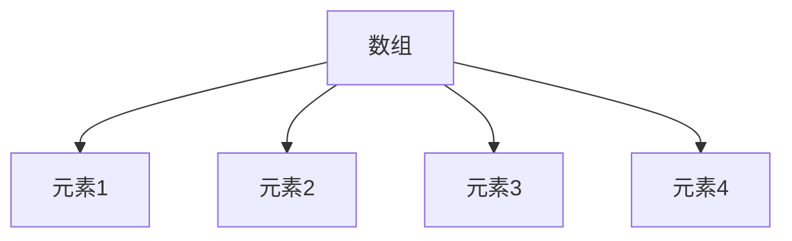

**链表**：  
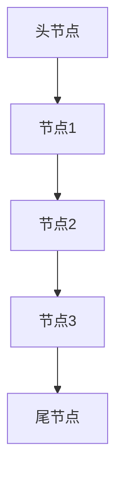

**栈**：  
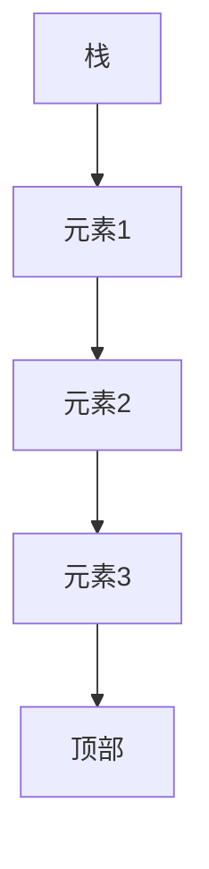

**队列**：  
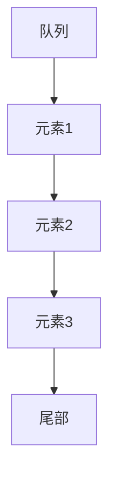

##### A.1.2 树形数据结构

**二叉树**：  
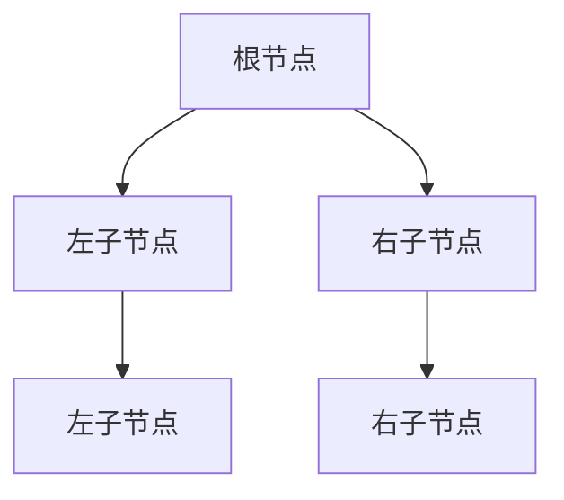

**哈夫曼树**：  
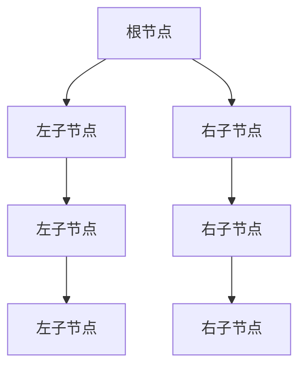

**平衡二叉树**：  


##### A.1.3 图形数据结构

**邻接矩阵**：  
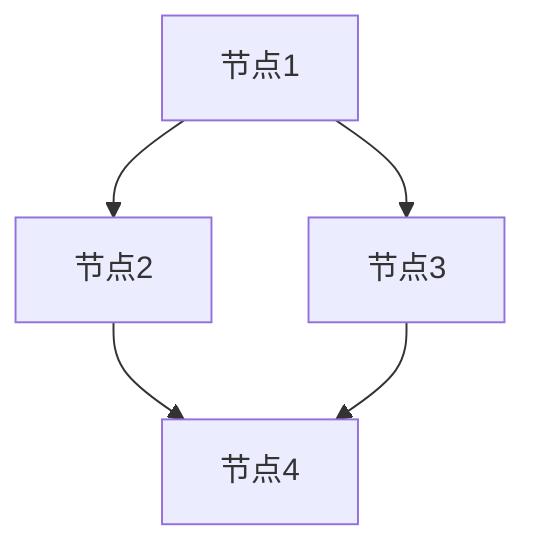

**邻接表**：  
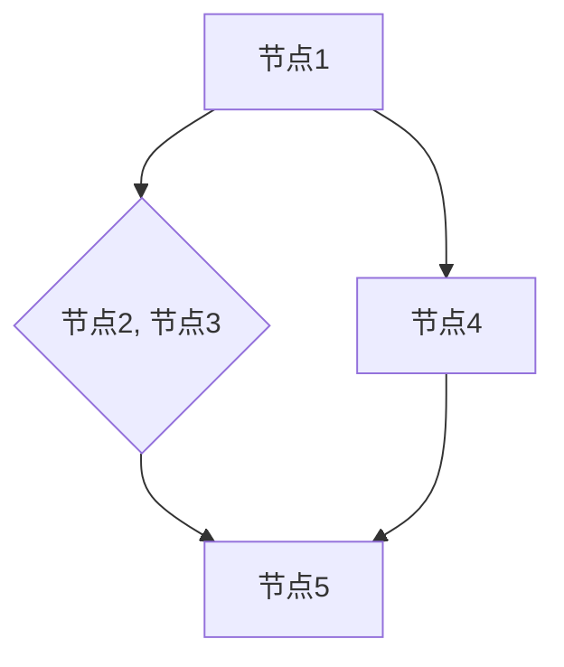

**图的遍历算法**：  
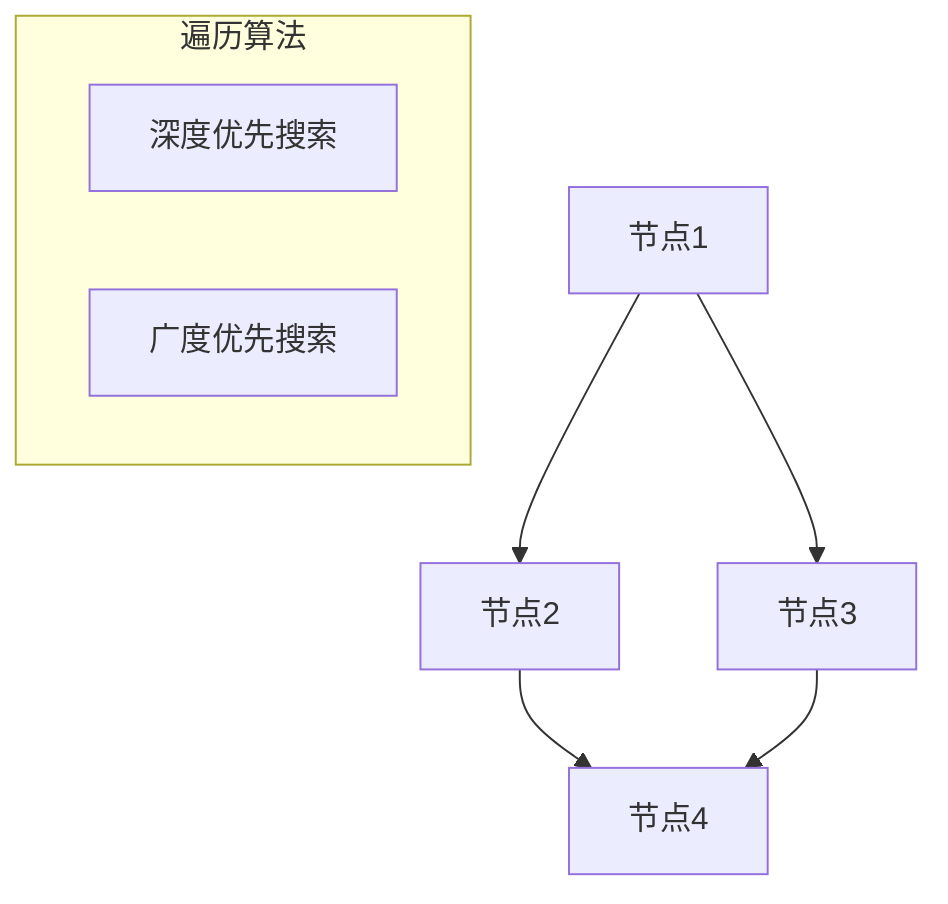

##### A.1.4 高级数据结构

**B+树**：  
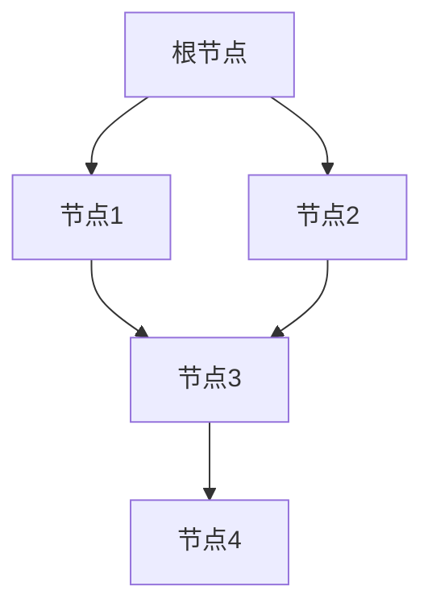

**布隆过滤器**：  
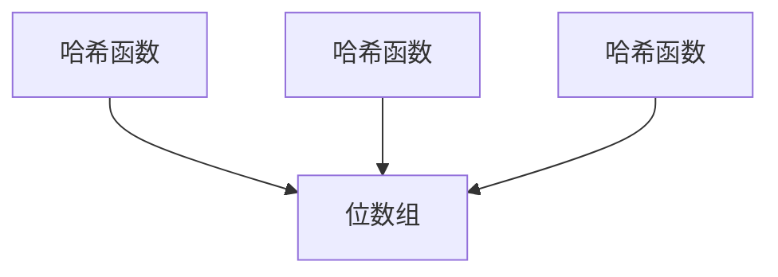

**跳表**：  
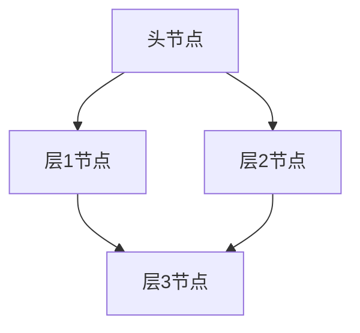

##### A.2 数据结构在宇宙学模拟中的应用实例

**模拟宇宙磁场拓扑演化的数据处理流程**：

1. **数据采集**：通过观测和实验手段获取宇宙磁场的观测数据。
2. **数据预处理**：对观测数据进行清洗、去噪和归一化等处理，提高数据的质量和准确性。
3. **网格划分**：将宇宙空间划分为三维网格，以便对宇宙磁场进行计算和模拟。
4. **磁场计算**：根据观测数据和网格划分，计算每个网格点上的磁场强度和方向。
5. **拓扑演化模拟**：基于初始磁场分布和计算方法，模拟宇宙磁场的演化过程。
6. **结果分析**：对模拟结果进行分析，提取有用的信息，如磁场拓扑结构、能量分布和演化规律等。

**数据结构优化与性能分析**：

1. **稀疏矩阵优化**：对于稀疏的宇宙磁场数据，采用稀疏矩阵存储和计算，以减少存储空间和计算时间。
2. **并行计算优化**：利用多线程或分布式计算，提高宇宙磁场拓扑演化模拟的计算效率。
3. **数据压缩优化**：采用数据压缩算法，如哈夫曼压缩或LZ77压缩，减少存储空间和传输带宽。
4. **算法优化**：针对宇宙磁场拓扑演化模拟的特点，优化计算算法，提高模拟的准确性和效率。

**实际案例：使用哈夫曼树进行宇宙数据压缩**：

1. **哈夫曼编码**：使用哈夫曼树对宇宙数据进行编码，将连续的宇宙数据转换为稀疏的哈夫曼编码。
2. **哈夫曼解码**：将哈夫曼编码还原为原始宇宙数据，确保数据的完整性和准确性。
3. **性能分析**：比较原始宇宙数据和哈夫曼编码数据的大小，评估哈夫曼压缩算法的压缩效率。

通过以上实例，展示了数据结构在宇宙学模拟中的应用，以及数据结构优化与性能分析的方法和技巧。这些方法和技巧有助于提高宇宙磁场拓扑演化模拟的效率和准确性，为宇宙学研究提供有力的支持。

