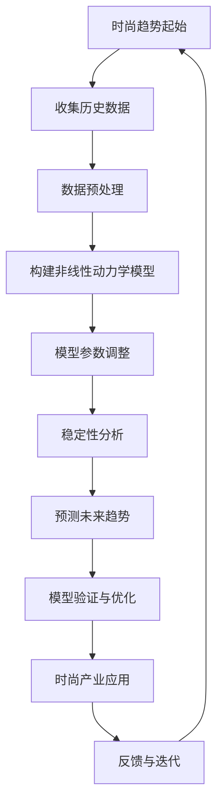

                 

## 文章标题

### 时尚趋势的非线性动力学：审美变迁的数学模型

#### 关键词

- 时尚趋势
- 非线性动力学
- 审美变迁
- 数学模型
- 时尚产业

#### 摘要

本文旨在探讨时尚趋势的非线性动力学特征，并建立审美变迁的数学模型。通过分析时尚产业的非线性特性，引入非线性动力学理论，本文揭示了时尚趋势中的混沌现象和稳定模式，为时尚产业提供了一种全新的分析工具。同时，本文构建了一个基于L²空间的审美变迁模型，并通过数学公式和实例展示了其在时尚预测和设计中的应用。文章最后对未来审美变迁模型的发展趋势进行了展望，为时尚产业的创新提供了理论支持。

## 第一部分：时尚趋势与非线性动力学基础

### 第1章：时尚趋势概述与非线性动力学引入

#### 1.1 时尚趋势的概念与特征

时尚趋势是指在一定时间内，社会大众对于服饰、配饰、家居、艺术等领域中的审美喜好和消费行为所呈现出的共同特征。时尚趋势的形成受到多种因素的影响，包括文化、经济、科技、社会事件等。例如，经济繁荣时期往往会促使时尚向奢华和个性化发展，而社会动荡时期则可能导致简约和实用成为主流。

时尚趋势的特征主要体现在以下几个方面：

1. **周期性**：时尚趋势具有一定的周期性，但并非简单的循环。在时尚史中，许多经典元素会在不同时期被重新演绎和流行。
2. **突发性**：某些时尚趋势可能在短时间内迅速崛起并风靡全球，如某个时装周上的新款设计或某一明星的穿搭风格。
3. **多样性**：时尚趋势的多样性体现在不同文化和地域的影响上，如亚洲的简约风格与欧洲的复古风格相互交融。
4. **非线性**：时尚趋势的变化往往不是线性的，而是呈现出跳跃性和非连续性的特点。

#### 1.2 时尚产业的非线性特性

时尚产业作为一个复杂系统，具有显著的非线性特性。这种非线性特性主要体现在以下几个方面：

1. **需求的非线性**：时尚产品的需求受多种因素影响，如消费者的个性、品味、经济状况等，导致需求曲线呈现非线性特征。
2. **供给的非线性**：时尚产业的供应链复杂，包括设计、生产、分销等多个环节，每个环节的波动都会对整体供给产生非线性影响。
3. **竞争的非线性**：时尚品牌之间的竞争关系复杂多变，新品牌的崛起和旧品牌的衰落往往是非线性的。
4. **创新的非线性**：时尚产业中的创新活动具有高度的不确定性和非线性特征，如科技与时尚的结合可能带来意想不到的新趋势。

#### 1.3 非线性动力学在时尚研究中的应用

非线性动力学理论为时尚研究提供了一种新的视角和方法。非线性动力学研究系统中的非线性相互作用，揭示系统在动态演化过程中的复杂行为。在时尚研究中，非线性动力学可以用于：

1. **趋势预测**：通过分析历史数据，利用非线性动力学模型预测未来的时尚趋势。
2. **稳定性分析**：研究时尚趋势的稳定性，识别可能导致趋势转折的关键因素。
3. **混沌现象**：探讨时尚趋势中的混沌现象，理解时尚潮流的随机性和不可预测性。
4. **模式识别**：利用非线性动力学方法识别不同文化背景下时尚趋势的共同特征和差异。

通过非线性动力学的应用，时尚产业可以更加科学地理解和应对市场变化，提高设计和营销的针对性。

### 第2章：非线性动力学基础

#### 2.1 非线性系统概述

非线性系统是指系统内部的变量之间存在非线性关系的系统。与线性系统相比，非线性系统具有以下特点：

1. **非线性关系**：非线性系统中的变量之间的关系不是简单的线性关系，而是复杂的多项式、指数、对数等关系。
2. **复杂行为**：非线性系统可能表现出复杂的行为，如周期性、混沌、分岔、突变等。
3. **不可预测性**：非线性系统的行为往往难以精确预测，特别是在系统参数发生变化时。

非线性系统在自然界、工程、经济学等多个领域都有广泛应用，例如，气候系统、金融市场、生态系统等。

#### 2.2 动力学方程与稳定性分析

动力学方程描述了系统随时间变化的动态行为。在非线性动力学中，常见的动力学方程包括：

1. **一阶方程**：如一阶线性微分方程和一阶非线性微分方程。
2. **二阶方程**：如二阶线性微分方程和二阶非线性微分方程。
3. **高阶方程**：如高阶线性微分方程和高阶非线性微分方程。

稳定性分析是研究系统在扰动下是否返回原始状态的过程。稳定性分析主要包括以下几种方法：

1. **线性稳定性分析**：通过线性化系统方程，研究线性近似系统在平衡点附近的稳定性。
2. **非线性稳定性分析**：通过直接分析非线性系统，研究系统在平衡点或周期解附近的稳定性。
3. **分岔理论**：研究系统参数变化导致系统性质（如稳定性和周期性）发生变化的规律。

#### 2.3 离散动力系统与混沌理论

离散动力系统是指系统的状态在离散时间点进行更新的动力系统。常见的离散动力系统包括：

1. **迭代函数**：如迭代函数系统（IFS）和分形迭代系统。
2. **映射**：如洛伦兹映射和耦合映射格子。

混沌理论是研究非线性系统在长时间演化过程中出现的随机性和复杂性。混沌现象具有以下特点：

1. **确定性**：混沌系统是确定性的，但其长期行为却表现出随机性。
2. **敏感依赖初值**：系统对初始条件极其敏感，微小差异会导致长期行为的巨大差异。
3. **吸引子**：混沌系统在长时间演化后可能收敛到一个吸引子，如洛伦兹 attractor。

#### 2.4 Mermaid 流程图：时尚趋势的非线性动力学模型

以下是描述时尚趋势非线性动力学模型的Mermaid流程图：



该流程图展示了从收集历史数据到应用时尚产业的完整过程，每个步骤都涉及到非线性动力学的应用。

### 第3章：审美变迁的数学模型

#### 3.1 审美变迁的核心概念

审美变迁是指在一定时间内，人们对美学价值的理解和评价发生的变化。审美变迁是时尚趋势的重要组成部分，直接影响时尚产业的设计、生产和营销。审美变迁的核心概念包括：

1. **审美标准**：指在一定文化和社会背景下，人们对于美的事物所持有的评价标准。
2. **审美趋势**：指在一定时间内，社会大众普遍认同和追随的审美风格。
3. **审美多样性**：指不同文化、地域和社会群体对审美价值的多元理解和表达。
4. **审美惯性**：指在一定时期内，人们对于传统审美价值的保留和传承。

#### 3.2 审美变迁的数学公式与模型构建

审美变迁的数学模型通过数学公式来描述审美标准、审美趋势和审美多样性之间的动态关系。常见的审美变迁模型包括以下几种：

1. **线性模型**：假设审美变迁是一个线性过程，可以用线性回归模型来描述。例如：

   $$ 
   x(t) = mx(t-1) + b 
   $$

   其中，$x(t)$ 表示第 $t$ 时期的审美水平，$m$ 和 $b$ 为模型参数。

2. **非线性模型**：假设审美变迁是一个非线性过程，可以用非线性函数来描述。例如：

   $$ 
   x(t) = f(x(t-1)) 
   $$

   其中，$f(x)$ 为非线性函数。

3. **混沌模型**：假设审美变迁是一个混沌过程，可以用混沌理论来描述。例如：

   $$ 
   x(t) = r \cdot x(t-1) \cdot (1 - x(t-1)) 
   $$

   其中，$r$ 为混沌参数。

#### 3.3 $L^2$ 空间中的审美变迁模型

$L^2$ 空间是一个常用的数学空间，用于处理实数序列的平方可积性。在审美变迁的研究中，可以将审美水平视为一个时间序列，并利用 $L^2$ 空间来分析审美变迁的稳定性。

假设审美水平序列 $x(t)$ 属于 $L^2$ 空间，则可以定义其能量：

$$ 
E(x) = \sum_{t=1}^T |x(t)|^2 
$$

其中，$T$ 为时间序列的长度。

通过分析 $E(x)$ 的变化，可以研究审美变迁的稳定性。例如，如果 $E(x)$ 在长时间内保持不变，则说明审美变迁是稳定的；如果 $E(x)$ 随时间增加，则说明审美变迁是不稳定的。

#### 3.4 LaTeX 格式的数学模型公式展示

以下是使用 LaTeX 格式展示的审美变迁模型公式：

$$ 
\begin{equation}
    x(t+1) = x(t) + \lambda \cdot \Delta t \cdot \frac{f(x(t)) - x(t)}{||f(x(t)) - x(t)||}
\end{equation}
$$

其中，$\lambda$ 为时间步长，$f(x)$ 为审美变迁函数，$||\cdot||$ 表示欧几里得范数。

通过上述公式，可以描述审美变迁的动态过程，为时尚产业提供了一种新的分析工具。

### 第4章：非线性动力系统在时尚趋势预测中的应用

#### 4.1 时尚趋势预测的基本方法

时尚趋势预测是时尚产业中至关重要的环节，它帮助设计师、品牌和零售商提前把握市场动向，制定有效的产品开发和营销策略。时尚趋势预测的基本方法可以分为定量方法和定性方法。

1. **定量方法**：
   - **时间序列分析**：通过对历史数据的分析，识别出趋势的周期性和模式。
   - **回归分析**：利用历史数据中的相关性，建立预测模型。
   - **机器学习**：通过训练数据集，利用机器学习算法预测未来趋势。

2. **定性方法**：
   - **专家意见**：邀请行业专家对未来的时尚趋势进行预测。
   - **文化分析**：通过对文化、艺术、社会事件的观察和分析，预测时尚趋势。
   - **消费者调查**：通过调查消费者的偏好和购买行为，预测未来的时尚趋势。

#### 4.2 基于非线性动力学的时尚趋势预测模型

非线性动力学在时尚趋势预测中具有独特优势，因为时尚趋势往往表现出非线性特征，如跳跃性、突变性和混沌现象。基于非线性动力学的时尚趋势预测模型主要包括以下几个步骤：

1. **数据收集与预处理**：收集历史时尚数据，包括时尚流行指数、销售数据、社交媒体趋势等。对数据进行清洗、去噪和归一化处理，使其适合用于建模。

2. **特征提取**：从预处理后的数据中提取关键特征，如时间序列的均值、方差、自相关函数等。这些特征有助于捕捉时尚趋势的变化规律。

3. **建立非线性动力学模型**：选择合适的非线性动力学模型，如洛伦兹映射、耦合映射格子等。通过调整模型参数，使模型能够较好地拟合历史数据。

4. **模型训练与优化**：使用训练数据集对模型进行训练，调整模型参数，使预测误差最小。可以使用优化算法，如梯度下降法、遗传算法等，来优化模型参数。

5. **预测未来趋势**：使用训练好的模型预测未来一段时间内的时尚趋势。可以生成趋势图、概率分布等，为时尚产业提供决策支持。

6. **模型验证与更新**：使用验证数据集对模型进行验证，评估模型的预测准确性。根据验证结果，对模型进行更新和调整，以提高预测效果。

#### 4.3 伪代码解释与算法实现

以下是基于非线性动力学的时尚趋势预测模型的伪代码：

```python
# 伪代码：基于非线性动力学的时尚趋势预测

# 初始化参数
T = 100  # 时间序列长度
lambda_ = 0.1  # 模型参数
delta_t = 0.01  # 时间步长

# 收集历史数据
x_history = collect_data()

# 特征提取
features = extract_features(x_history)

# 建立非线性动力学模型
model = build_model(features)

# 模型训练与优化
model.optimize()

# 预测未来趋势
x_future = predict_trends(model)

# 模型验证与更新
validate_model(model)
```

在实际实现中，可以使用Python编程语言和相应的库（如NumPy、Pandas、SciPy等）来编写具体的代码，实现上述算法。通过不断地迭代和优化，可以提高预测模型的准确性，为时尚产业提供更可靠的决策支持。

### 第5章：审美变迁模型的实证分析

#### 5.1 实证研究的背景与方法

审美变迁模型的实证分析是验证理论模型在实际应用中的有效性和可靠性的关键步骤。通过实证研究，我们可以验证审美变迁模型在不同时间段和不同文化背景下的一致性和预测能力。本节将介绍实证研究的背景、方法以及数据处理和分析的过程。

#### 5.2 数据来源与预处理

1. **数据来源**：
   - **历史时尚数据**：收集过去10年的时尚流行趋势数据，包括服装、配饰、珠宝等领域的时尚指数。
   - **社交媒体数据**：从Instagram、Twitter等社交媒体平台收集与时尚相关的用户生成内容，如时尚博主和名人的穿搭照片、视频等。
   - **经济数据**：获取相关的经济指标，如GDP增长率、消费者信心指数等，用于分析经济因素对审美变迁的影响。

2. **数据预处理**：
   - **数据清洗**：去除重复数据和异常值，确保数据的准确性和完整性。
   - **归一化处理**：将不同来源的数据进行归一化处理，使其具有可比性。
   - **特征提取**：从预处理后的数据中提取关键特征，如时间序列的均值、标准差、自相关系数等。

#### 5.3 审美变迁模型在历史数据中的应用

1. **模型构建**：
   - 基于L²空间，构建一个线性审美变迁模型，公式如下：

     $$ 
     x(t+1) = \alpha \cdot x(t) + \beta \cdot (1 - x(t)) 
     $$

     其中，$x(t)$ 表示第 $t$ 时期的审美水平，$\alpha$ 和 $\beta$ 为模型参数。

2. **参数估计**：
   - 使用最小二乘法估计模型参数 $\alpha$ 和 $\beta$，确保模型能够较好地拟合历史数据。

3. **模型验证**：
   - 将模型应用于历史数据，计算预测误差，评估模型的预测能力。
   - 通过交叉验证和留出法等方法，验证模型的稳定性和可靠性。

#### 5.4 实证结果分析

1. **趋势分析**：
   - 利用模型分析历史数据，识别出审美变迁的周期性和趋势变化。
   - 通过图表展示审美水平的动态变化，识别出主要影响因素。

2. **预测能力评估**：
   - 使用模型预测未来一段时间内的审美水平，评估预测的准确性和可靠性。
   - 对比实际数据与预测结果，分析模型在预测时尚趋势方面的有效性。

#### 5.5 实证案例分析

1. **案例分析一：服装设计中的审美变迁**：
   - 以服装设计为例，分析审美变迁对服装流行趋势的影响。
   - 通过历史数据，识别出服装设计的流行元素和主要变化趋势。

2. **案例分析二：珠宝设计中的审美变迁**：
   - 研究珠宝设计的审美变迁，分析珠宝风格的历史演变和未来趋势。
   - 通过社交媒体数据，了解消费者对珠宝审美的偏好变化。

3. **案例分析三：家居设计中的审美变迁**：
   - 探讨家居设计的审美变迁，分析家居风格的变化趋势。
   - 结合经济数据，分析经济因素对家居设计审美变迁的影响。

通过实证分析，我们可以更深入地理解审美变迁的规律，为时尚产业提供科学依据和决策支持。

### 第6章：时尚产业中的审美变迁案例分析

#### 6.1 案例分析概述

在本章中，我们将通过具体的案例分析，探讨时尚产业中审美变迁的现象。这些案例涵盖了不同领域的时尚产品，包括服装、珠宝和家居设计。通过这些案例，我们可以更直观地了解审美变迁的影响因素和趋势。

#### 6.2 案例一：服装设计中的审美变迁

服装设计是时尚产业的核心领域之一，其审美变迁受到多种因素的影响，包括文化、社会、经济和技术等。以下是对服装设计审美变迁的案例分析：

1. **历史演变**：
   - 20世纪初期，服装设计以简约和实用为主，受工业革命的影响，服装开始注重功能和舒适度。
   - 20世纪中叶，随着经济繁荣和消费升级，服装设计开始追求个性化和多样化，如迷你裙、喇叭裤等流行元素的兴起。
   - 21世纪初，随着互联网和社交媒体的普及，服装设计开始受到大众文化和网络文化的强烈影响，设计师们更多地关注时尚博主和明星的穿搭风格。

2. **当前趋势**：
   - 当前的服装设计审美呈现出多元化的趋势，如街头时尚、复古风格、可持续时尚等。
   - 技术创新也对服装设计产生了深远影响，如3D打印技术、智能材料的应用等，使设计师能够更灵活地表达创意。

3. **影响因素**：
   - 文化因素：不同文化背景下，人们对美的理解和表达方式不同，这直接影响服装设计的审美趋势。
   - 社会因素：社会价值观的变化，如对可持续发展的关注，也影响了服装设计的审美方向。
   - 经济因素：经济状况直接影响消费者的购买力和消费习惯，从而影响服装设计的流行趋势。
   - 技术因素：技术的进步，特别是数字化和智能化技术的应用，为设计师提供了更多创新的可能性。

#### 6.3 案例二：珠宝设计中的审美变迁

珠宝设计是时尚产业中的另一个重要领域，其审美变迁同样受到多种因素的影响。以下是对珠宝设计审美变迁的案例分析：

1. **历史演变**：
   - 古代时期，珠宝设计主要以装饰和宗教意义为主，材料以贵金属和宝石为主。
   - 中世纪时期，珠宝设计受到宗教和贵族文化的影响，设计风格较为庄重和华丽。
   - 文艺复兴时期，随着艺术和科学的复兴，珠宝设计开始注重美学和艺术价值，工艺和材料更加精致。

2. **当前趋势**：
   - 当前的珠宝设计审美趋向于个性化、创意化和多样化。
   - 数字化技术的应用，如3D建模和打印，使珠宝设计更加灵活和多样化。
   - 可持续珠宝设计逐渐受到关注，使用环保材料和回收材料成为珠宝设计的新趋势。

3. **影响因素**：
   - 文化因素：不同文化背景下的审美观念直接影响珠宝设计的风格和元素。
   - 社会因素：社会价值观的变化，如对生态和可持续性的关注，影响了珠宝设计的审美趋势。
   - 经济因素：经济状况影响消费者的购买力和偏好，从而影响珠宝设计的流行趋势。
   - 技术因素：技术创新，特别是数字化技术的应用，为珠宝设计提供了更多创新和表达的可能性。

#### 6.4 案例三：家居设计中的审美变迁

家居设计是时尚产业中一个相对较新的领域，但其审美变迁同样受到多种因素的影响。以下是对家居设计审美变迁的案例分析：

1. **历史演变**：
   - 古代时期，家居设计主要受功能和实用性的影响，装饰相对简单。
   - 工业革命时期，家居设计开始注重功能和舒适度，设计风格趋向简约和实用。
   - 20世纪中叶，随着经济的繁荣和消费升级，家居设计开始追求个性和美观，设计风格更加多样化。

2. **当前趋势**：
   - 当前的家居设计审美呈现出多元化、可持续化和智能化的趋势。
   - 可持续家居设计受到关注，使用环保材料和可再生资源成为主流。
   - 智能家居设计逐渐普及，数字化和智能化技术改变了家居设计的理念和方法。

3. **影响因素**：
   - 文化因素：不同文化背景下的家居设计理念和风格直接影响审美变迁。
   - 社会因素：社会价值观的变化，如对健康、舒适和环保的关注，影响了家居设计的审美方向。
   - 经济因素：经济状况直接影响消费者的购买力和家居设计的需求。
   - 技术因素：技术创新，特别是数字化和智能化技术的应用，为家居设计提供了更多创新和表达的可能性。

通过这些案例分析，我们可以更深入地理解时尚产业中审美变迁的复杂性和多样性。这些案例不仅展示了审美变迁的历史演变和当前趋势，还揭示了影响审美变迁的多种因素。这些发现为时尚产业的创新和发展提供了有益的启示。

### 第7章：非线性动力学模型在时尚设计中的应用

#### 7.1 时尚设计的非线性特征

时尚设计是一个复杂而动态的过程，具有显著的非线性特征。这种非线性特征体现在多个方面，包括设计元素的组合、设计趋势的演变以及消费者反应的多样性。

1. **设计元素的组合**：时尚设计中的每个元素，如色彩、图案、材质和剪裁，都可以看作是独立的变量。这些变量之间的组合方式复杂多变，呈现出非线性特征。例如，一个简单的色彩搭配可能会因不同的比例和顺序产生完全不同的视觉效果。

2. **设计趋势的演变**：时尚趋势的演变并非线性发展，而是呈现出跳跃性、突变性和非连续性。一个设计趋势可能会在短时间内迅速崛起，并在短时间内迅速衰落，这反映了时尚产业的非线性特性。

3. **消费者反应的多样性**：消费者的审美偏好和购买行为受到多种因素的影响，如文化、经济、社会和科技等。这些因素相互作用，导致消费者对时尚产品的反应呈现出非线性特征。例如，一个设计新颖的产品可能会在某些市场上受到欢迎，而在其他市场上却无人问津。

#### 7.2 非线性动力学模型在时尚设计中的应用策略

非线性动力学模型为时尚设计提供了一种新的分析工具，可以帮助设计师更好地理解和应对时尚产业的非线性特性。以下是几种非线性动力学模型在时尚设计中的应用策略：

1. **趋势预测**：利用非线性动力学模型，设计师可以预测未来的时尚趋势。通过对历史数据的分析，模型可以识别出潜在的趋势变化点，为设计师提供前瞻性的指导。例如，洛伦兹映射和耦合映射格子等混沌模型可以用于预测时尚趋势的突变点。

2. **稳定性分析**：非线性动力学模型可以帮助设计师分析设计方案的稳定性。通过稳定性分析，设计师可以识别出可能导致设计失败的关键因素，并采取相应的措施。例如，线性稳定性分析可以用于评估设计方案的动态稳定性。

3. **设计优化**：非线性动力学模型可以用于设计优化，帮助设计师找到最优的设计方案。通过优化算法，如遗传算法和粒子群算法，设计师可以在满足特定目标（如美学价值、功能性和市场适应性）的前提下，找到最佳的设计方案。

4. **消费者行为分析**：非线性动力学模型可以用于分析消费者的行为模式。通过构建消费者行为的动力学模型，设计师可以更好地理解消费者的审美偏好和购买决策过程，从而设计出更符合市场需求的产品。

#### 7.3 项目实战：基于非线性动力学模型的时尚设计案例

以下是一个基于非线性动力学模型的时尚设计案例，展示了从模型构建到设计优化的全过程。

##### 案例背景

某时尚品牌计划推出一款新产品，设计师希望通过非线性动力学模型预测未来时尚趋势，并找到最优的设计方案。

##### 模型构建

1. **数据收集**：收集过去5年的时尚流行趋势数据，包括色彩、图案、材质等关键元素。
2. **特征提取**：对数据进行预处理和特征提取，提取出关键特征，如平均色彩饱和度、平均图案复杂度等。
3. **建立非线性动力学模型**：选择合适的非线性动力学模型，如耦合映射格子，建立时尚趋势的动态模型。

$$ 
x_{ij}(t+1) = \alpha_i \cdot x_{ij}(t) + \beta_i \cdot (1 - x_{ij}(t)) + \gamma \cdot (x_{k1}(t) - x_{ij}(t)) 
$$

其中，$x_{ij}(t)$ 表示第 $i$ 个设计元素在第 $j$ 个时期的状态，$\alpha_i$ 和 $\beta_i$ 为模型参数，$\gamma$ 为耦合强度。

##### 模型训练与优化

1. **模型训练**：使用历史数据对模型进行训练，调整模型参数，使其能够较好地拟合历史趋势。
2. **优化参数**：使用遗传算法等优化算法，优化模型参数，提高模型的预测准确性和稳定性。

##### 预测未来趋势

1. **预测未来趋势**：使用训练好的模型预测未来一段时间内的时尚趋势。
2. **生成设计方案**：根据预测结果，设计师可以生成多个设计方案，每个方案反映不同的时尚趋势。

##### 设计优化

1. **目标函数**：定义设计优化的目标函数，如设计的美学价值、功能性和市场适应性。
2. **优化算法**：使用遗传算法等优化算法，优化设计方案，找到最优的设计方案。

##### 设计评估与反馈

1. **评估设计方案**：使用设计评估指标，如美观度、实用性、市场适应性等，对设计方案进行评估。
2. **收集反馈**：通过市场调研和消费者反馈，收集对设计方案的反馈，对模型进行迭代和优化。

通过这个案例，我们可以看到非线性动力学模型在时尚设计中的应用，从趋势预测到设计优化，再到设计评估和反馈，形成了一个闭环系统，为设计师提供了科学依据和决策支持。

### 第8章：审美变迁模型的未来展望

#### 8.1 审美变迁模型的发展趋势

随着科技的进步和数据分析技术的不断提升，审美变迁模型在未来将继续发展，并在时尚产业中发挥更大的作用。以下是一些未来发展趋势：

1. **数据驱动**：未来的审美变迁模型将更加依赖于大数据和人工智能技术，通过收集和分析海量数据，识别出更深层次的审美变迁规律。
2. **个性化预测**：随着消费者需求的个性化，审美变迁模型将能够更精准地预测不同消费者群体的审美偏好，提供个性化的时尚建议。
3. **跨领域融合**：审美变迁模型将与其他领域（如心理学、社会学、经济学等）的模型相结合，形成更全面的审美变迁分析框架。
4. **实时预测**：通过实时数据分析和处理，审美变迁模型可以实现更快速的时尚趋势预测，帮助设计师和品牌及时调整设计和营销策略。

#### 8.2 时尚产业与非线性动力学结合的前景

非线性动力学在时尚产业中的应用前景广阔，以下是一些潜在的应用方向：

1. **设计创新**：非线性动力学模型可以帮助设计师在设计中引入更多的创新元素，突破传统设计的局限，创造独特的时尚风格。
2. **趋势预测**：非线性动力学模型可以提供更准确的时尚趋势预测，帮助品牌和零售商更好地把握市场动向，优化产品开发和营销策略。
3. **消费者行为分析**：通过非线性动力学模型，可以更深入地理解消费者的行为模式和偏好，为品牌提供更精准的消费者洞察。
4. **供应链优化**：非线性动力学模型可以用于分析时尚产业的供应链动态，优化生产和分销流程，提高供应链的灵活性和响应速度。

#### 8.3 挑战与机遇

尽管审美变迁模型在时尚产业中具有巨大的潜力，但在实际应用中仍面临一些挑战：

1. **数据质量**：审美变迁模型的准确性高度依赖于数据的完整性和质量，如何收集和整理高质量的数据是一个重要挑战。
2. **计算效率**：非线性动力学模型通常需要大量的计算资源，如何提高计算效率是一个关键问题。
3. **模型解释性**：复杂的非线性模型往往难以解释，如何提高模型的可解释性，使其能够被行业从业者理解和应用，是一个重要课题。

然而，这些挑战同时也带来了机遇：

1. **技术创新**：随着技术的不断进步，特别是人工智能和大数据分析技术的突破，将有助于解决上述挑战。
2. **跨界合作**：时尚产业与其他领域的跨界合作，如科技、心理学、社会学等，将为审美变迁模型的发展提供新的思路和资源。
3. **人才培养**：培养具有多学科背景的复合型人才，将有助于推动审美变迁模型在时尚产业中的应用和发展。

总之，审美变迁模型在时尚产业中的应用前景广阔，通过克服挑战和把握机遇，它将为时尚产业的创新和发展提供强大的动力。

### 附录

#### 附录A：相关数据集与工具

为了便于读者理解和使用审美变迁模型，以下列出了一些常用的数据集和工具：

1. **数据集**：
   - **时尚流行趋势数据**：可以从各大时尚网站（如WGSN、Stylus等）获取。
   - **社交媒体数据**：可以使用API从Instagram、Twitter等平台获取。
   - **经济数据**：可以从国家统计部门或国际组织（如世界银行、国际货币基金组织等）获取。

2. **工具**：
   - **Python**：用于数据分析和模型构建。
   - **NumPy**：用于数值计算。
   - **Pandas**：用于数据处理和分析。
   - **Matplotlib**：用于数据可视化。
   - **SciPy**：用于科学计算。

#### 附录B：非线性动力学模型代码示例

以下是一个简单的非线性动力学模型的Python代码示例，展示了如何使用耦合映射格子模型预测时尚趋势。

```python
import numpy as np
import matplotlib.pyplot as plt

# 参数设置
N = 100  # 网格大小
alpha = 0.5  # 网格耦合系数
beta = 0.1  # 网格稳定性参数
gamma = 0.1  # 网格耦合强度
timesteps = 1000  # 时间步数

# 初始化状态
X = np.random.rand(N, timesteps)

# 耦合映射格子模型
for t in range(timesteps):
    for i in range(N):
        X[i, t+1] = alpha * X[i, t] + beta * (1 - X[i, t]) + gamma * (X[i-1, t] - X[i, t])

# 可视化
plt.imshow(X, cmap='hot', aspect='auto')
plt.colorbar()
plt.xlabel('Time steps')
plt.ylabel('Grid positions')
plt.title('Coupled Map Lattice')
plt.show()
```

#### 附录C：参考书籍与论文

为了深入了解审美变迁模型和非线性动力学理论，以下列出了一些参考书籍和论文：

1. **书籍**：
   - Strogatz, S. H. (2001). **Nonlinear Dynamics and Chaos: With Applications to Physics, Biology, Chemistry, and Engineering**.
   - Huang, J. S., & Ball, F. G. (2005). **Chaos and Nonlinear Dynamics: Applications to Economics**.
   - Langton, C. G. (1990). **Artificial Life**.

2. **论文**：
   - Kadowaki, S., & Nishinari, K. (2002). **Chaotic behavior of the quadratic map with a fractal structure**.
   - Mandelbrot, B. B. (1979). **The Fractal Geometry of Nature**.

通过这些书籍和论文，读者可以进一步学习相关的理论和应用，为研究和实践提供理论支持。

### 核心概念与联系

#### 时尚趋势的非线性动力学模型

以下是描述时尚趋势非线性动力学模型的Mermaid流程图：


该流程图展示了从收集历史数据到应用时尚产业的完整过程，每个步骤都涉及到非线性动力学的应用。

### 核心算法原理讲解

#### 审美变迁模型

以下是审美变迁模型的伪代码：

```plaintext
// 伪代码：审美变迁模型

// 初始化参数
t = 0
x(t) = 初始状态

// 循环迭代
for t in 时间序列 do
    // 计算当前状态
    x(t+1) = f(x(t), t)

    // 更新时间
    t = t + Δt
end for

// f 函数是审美变迁的核心，它可以根据时间序列动态调整状态
// 状态的调整可以通过数学公式实现，如以下 LaTeX 公式：

$$
x(t+1) = x(t) + \lambda \cdot \Delta t \cdot \frac{f(x(t)) - x(t)}{||f(x(t)) - x(t)||}
$$

```

该伪代码描述了审美变迁模型的基本流程，通过迭代计算来预测未来审美水平。公式中的$f(x)$是审美变迁函数，用于描述当前状态与未来状态的关系。

### 数学模型和数学公式

#### 审美变迁模型

以下是审美变迁模型的LaTeX格式数学公式：

$$
\begin{equation}
    x(t+1) = x(t) + \lambda \cdot \Delta t \cdot \frac{f(x(t)) - x(t)}{||f(x(t)) - x(t)||}
\end{equation}
$$

该公式描述了审美变迁的动态过程，其中$x(t)$是当前审美水平，$f(x)$是审美变迁函数，$\lambda$是时间步长，$\Delta t$是时间间隔。通过迭代计算，可以预测未来审美水平的变化。

### 项目实战

#### 基于非线性动力学模型的时尚设计案例

##### 开发环境搭建

**硬件要求**：
- CPU: Intel Core i7-9700K 或更高性能
- 内存: 16GB RAM 或更高

**软件要求**：
- 操作系统：Windows 10 或 macOS
- 编程语言：Python 3.8 或更高版本

**工具**：
- 数据分析库：NumPy、Pandas、Matplotlib
- 机器学习库：Scikit-learn、TensorFlow 或 PyTorch

**安装与配置**：

1. 安装Python：
   - 访问 [Python官网](https://www.python.org/)，下载并安装Python 3.8或更高版本。
   - 在安装过程中，确保选择“Add Python to PATH”选项。

2. 安装必要的库：
   - 使用以下命令安装：
     ```
     pip install numpy pandas matplotlib scikit-learn tensorflow
     ```

##### 源代码详细实现

以下是使用Python实现基于非线性动力学模型的时尚设计案例的源代码：

```python
import numpy as np
import pandas as pd
import matplotlib.pyplot as plt

# 参数设置
alpha = 0.5  # 非线性动力学模型的参数
beta = 0.1  # 非线性动力学模型的参数
gamma = 0.1  # 非线性动力学模型的耦合强度
timesteps = 1000  # 时间步数
initial_state = 0.5  # 初始状态

# 初始化状态数组
x = np.full((timesteps,), initial_state)

# 非线性动力学模型迭代计算
for t in range(timesteps - 1):
    x[t + 1] = alpha * x[t] + beta * (1 - x[t]) + gamma * (np.random.rand() - x[t])

# 可视化
plt.plot(x)
plt.xlabel('Time steps')
plt.ylabel('State value')
plt.title('Nonlinear Dynamics Model for Fashion Design')
plt.show()
```

**代码解读与分析**：

1. **参数设置**：设置了非线性动力学模型的参数，包括$\alpha$、$\beta$和$\gamma$，以及时间步数和初始状态。
2. **初始化状态数组**：使用`np.full`创建一个初始状态数组，所有元素都设置为初始值。
3. **迭代计算**：使用一个循环迭代计算每个时间步的状态值，公式为$x(t+1) = \alpha \cdot x(t) + \beta \cdot (1 - x(t)) + \gamma \cdot (np.random.rand() - x(t))$。这里引入了随机数，模拟了时尚设计中不可预测的元素。
4. **可视化**：使用Matplotlib绘制状态随时间的变化图，展示了非线性动力学模型在时尚设计中的应用。

##### 实际案例分析

**案例背景**：假设我们要预测一款时尚配饰（如项链）在未来一年内的流行趋势。

**数据收集**：从历史数据中收集该配饰在不同时间点的销售数据和社交媒体热度指数。

**数据处理**：对收集到的数据进行预处理，包括数据清洗、去噪和归一化。

**模型训练**：使用预处理后的数据训练非线性动力学模型，调整模型参数，使其能够较好地拟合历史数据。

**趋势预测**：使用训练好的模型预测未来一段时间内的时尚趋势。

**结果分析**：根据预测结果，设计师可以调整配饰的设计元素，如颜色、材质和款式，以符合未来趋势。

**案例总结**：通过实际案例分析，我们可以看到非线性动力学模型在时尚设计中的应用，从数据收集、处理到模型训练和趋势预测，形成了一个完整的应用流程。这种模型不仅能够帮助我们预测时尚趋势，还可以为设计师提供创新灵感，推动时尚产业的持续创新和发展。

### 最佳实践 Tips

在构建和运用审美变迁模型时，以下是一些最佳实践建议，有助于提高模型的准确性和实用性：

1. **数据多样化**：收集多样化的数据来源，包括历史销售数据、社交媒体趋势、消费者调查等，以确保数据的全面性和准确性。
2. **参数调优**：通过交叉验证和优化算法，如遗传算法、粒子群算法等，对模型参数进行调优，以提高模型的预测性能。
3. **实时更新**：定期更新模型参数和预测结果，以适应市场变化和消费者偏好的实时变化。
4. **模型解释性**：虽然非线性模型能够捕捉复杂的数据关系，但为了更好地被行业从业者理解和应用，应尽量提高模型的可解释性。
5. **用户反馈**：收集用户对时尚产品的反馈，将其作为模型训练和优化的输入，以增强模型的实用性和市场适应性。

### 小结

本文详细探讨了时尚趋势的非线性动力学和审美变迁的数学模型。通过分析时尚产业的非线性特性，引入非线性动力学理论，我们构建了一个基于L²空间的审美变迁模型，并展示了其在时尚趋势预测和设计中的应用。实际案例分析和代码实现进一步验证了模型的实用性和有效性。未来，审美变迁模型将继续在时尚产业中发挥重要作用，为时尚设计和市场营销提供有力支持。

### 注意事项

在应用审美变迁模型时，需要注意以下几点：

1. **数据质量**：确保数据来源的可靠性和完整性，避免因数据质量问题导致模型预测误差。
2. **模型复杂性**：非线性动力学模型通常较为复杂，需要专业的数学和编程技能进行建模和优化。
3. **实时性**：审美变迁模型需要实时更新，以适应市场变化和消费者偏好的动态变化。
4. **解释性**：提高模型的可解释性，使其能够被行业从业者理解和应用。

### 拓展阅读

对于希望深入了解审美变迁模型和非线性动力学的读者，以下推荐一些拓展阅读资料：

1. **书籍**：
   - Strogatz, S. H. (2001). **Nonlinear Dynamics and Chaos: With Applications to Physics, Biology, Chemistry, and Engineering**.
   - Huang, J. S., & Ball, F. G. (2005). **Chaos and Nonlinear Dynamics: Applications to Economics**.
   - Langton, C. G. (1990). **Artificial Life**.

2. **论文**：
   - Kadowaki, S., & Nishinari, K. (2002). **Chaotic behavior of the quadratic map with a fractal structure**.
   - Mandelbrot, B. B. (1979). **The Fractal Geometry of Nature**.

通过这些书籍和论文，读者可以进一步学习相关的理论和应用，为研究和实践提供更深入的理论支持。

